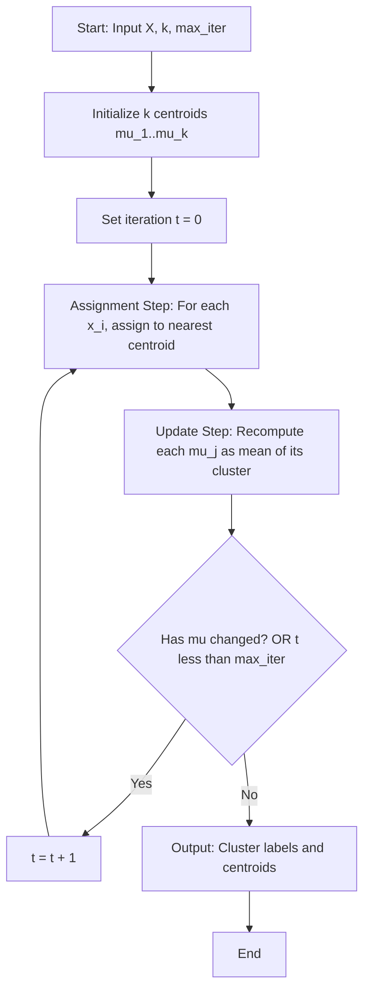
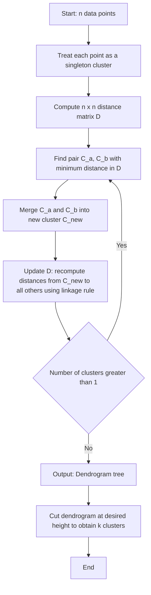
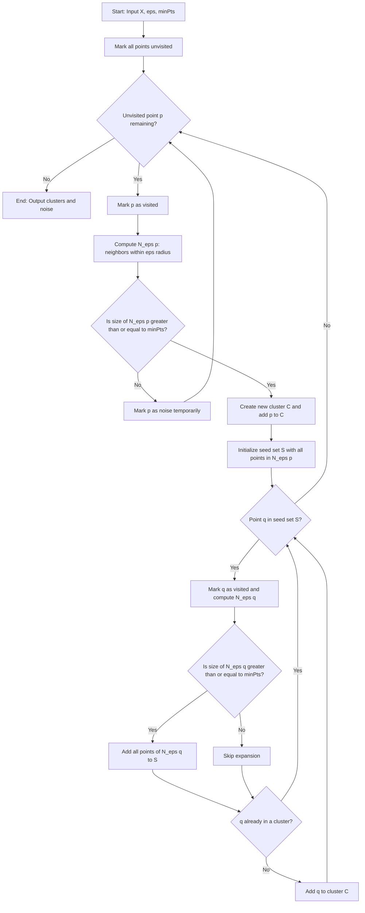
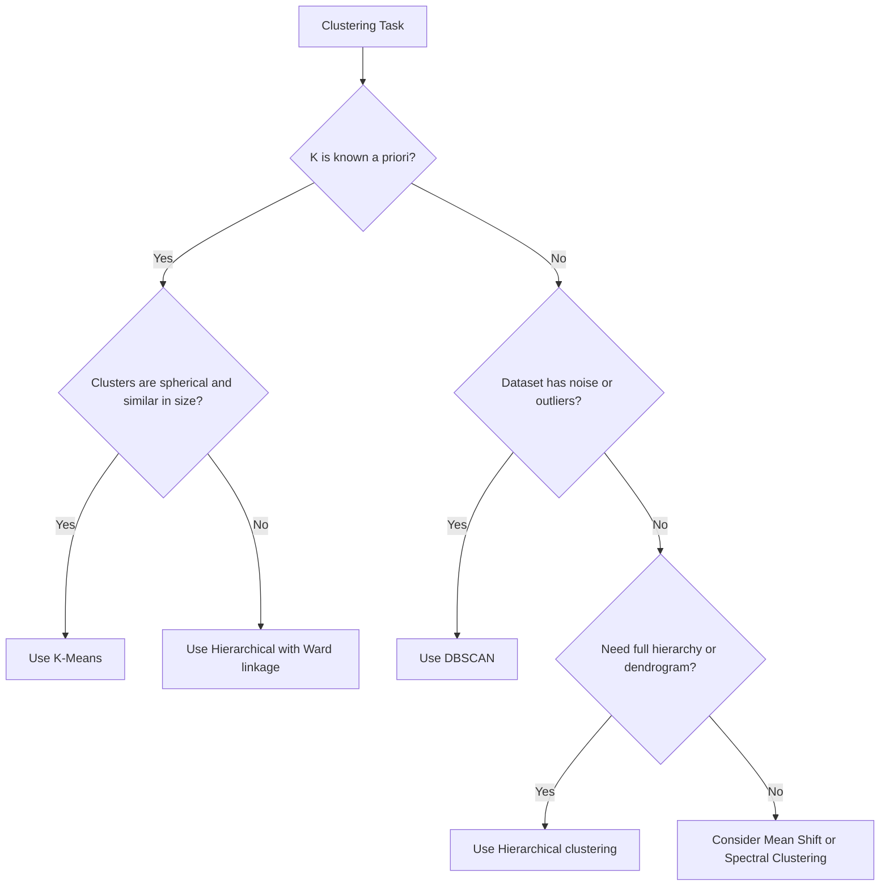
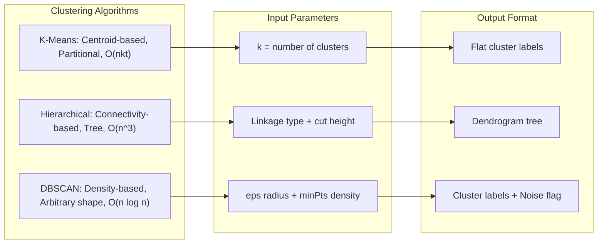

# Algorithmic Approaches to Data Grouping - Clustering: k-means, hierarchical clustering, DBSCAN

<!-- SECTION_1_START -->
# Module 2: Data Summarization Techniques
## Algorithmic Approaches to Data Grouping — Clustering

> [!NOTE]
> **KTU 2024 Scheme Context (PECST785):** Clustering is a foundational **unsupervised learning** paradigm within Data Science. It is the process of partitioning an unlabeled dataset into homogeneous groups (clusters) such that intra-cluster similarity is maximized and inter-cluster similarity is minimized. The three algorithms — **K-Means**, **Hierarchical Clustering**, and **DBSCAN** — represent three fundamentally different mathematical philosophies: *centroid-based*, *connectivity-based*, and *density-based* partitioning.

---

### 1.1 Formal Definition (KTU 2024 Syllabus Terminology)

> [!IMPORTANT]
> **Cluster Analysis (Definition):** Given a dataset $X = \{x_1, x_2, \dots, x_n\}$ in a $d$-dimensional feature space $\mathbb{R}^d$, a clustering algorithm produces a mapping $C: X \rightarrow \{1, 2, \dots, k\}$ that assigns each observation to a cluster label such that an objective function $J(C)$ — typically measuring intra-cluster compactness and inter-cluster separation — is optimized.

Where:
- $n$ = number of data points (observations)
- $d$ = dimensionality of feature space
- $k$ = number of clusters (user-defined parameter for K-Means and Hierarchical)

---

### 1.2 Conceptual Analogy & Intuition

> [!TIP]
> **Real-world Analogy — The Library Sorting Problem:**
> Imagine a librarian receives **10,000 unsorted books** dumped on the floor. There are no pre-existing labels (no genres written on the covers). The librarian must group them into shelves by **similarity of topic**.
>
> - **K-Means** acts like a librarian who first *guesses* 5 shelf locations (centroids), then iteratively pushes each book to its *nearest* shelf and re-centers the shelves. It needs you to specify the number of shelves ($k$) in advance.
> - **Hierarchical Clustering** acts like a librarian who builds a *family tree* of books: starts with every book as its own pile, then *merges* the two most similar piles repeatedly until one giant pile remains. A dendrogram is the resulting tree.
> - **DBSCAN** acts like a librarian who draws a *circle of radius $\varepsilon$* around each book. If a circle contains at least `minPts` books, that area is a dense neighborhood — a shelf. Books in low-density regions are marked as *outliers* (noise) and discarded.

### 1.3 Why Clustering Matters in Data Science

> [!IMPORTANT]
> **Engineering Utility:** Clustering is the engine behind **customer segmentation** (marketing), **document/topic mining** (NLP), **anomaly detection** (fraud, network intrusion), **image compression** (vector quantization), **gene expression analysis** (bioinformatics), and **recommendation systems**. KTU expects students to map algorithms to real production use-cases.

### 1.4 Geometric / Coordinate Visualization

> [!VISUALIZATION CONTROL]
> **Concept:** Two-dimensional cluster separation showing spherical K-Means clusters, chain-like hierarchical clusters, and density-based DBSCAN clusters.
>
> **GeoGebra / Desmos Input Points (paste into a 2D Graphing tool):**
>
> * `Cluster A centroid: (2, 2)`  — points: `(1.5,1.8), (2.2,2.1), (1.8,2.5), (2.5,1.7)`
> * `Cluster B centroid: (8, 8)`  — points: `(7.8,8.2), (8.1,7.5), (8.4,8.3), (7.6,7.9)`
> * `Noise point: (5, 5)`        — isolated outlier
>
> **Visual Description:** You will observe three distinct regions on the 2D plane. K-Means would draw a **Voronoi-style straight-line partition** between the two dense blobs. Hierarchical clustering would draw a **dendrogram** showing merge order. DBSCAN would correctly identify the noise point at $(5,5)$ as an outlier, while K-Means would forcibly assign it to either cluster.

---

<!-- SECTION_1_END -->

<!-- SECTION_2_START -->
# 2. Deep Theoretical Analysis & KTU High-Yield Formula Sheet

## 2.1 K-Means Clustering (Lloyd's Algorithm)

### 2.1.1 Algorithmic Philosophy
K-Means is a **centroid-based, partitional, hard-assignment** clustering algorithm. It assumes clusters are **isotropic (spherical)** and roughly equal in size. It minimizes the **Within-Cluster Sum of Squares (WCSS)** — also called *inertia*.

### 2.1.2 Operational Steps (Step-by-Step Logic)

1. **Initialization:** Randomly select $k$ initial centroids $\mu_1, \mu_2, \dots, \mu_k$ from the dataset (or use **K-Means++** for smarter seeding).
2. **Assignment Step (Expectation):** For each data point $x_i \in X$, assign it to the *nearest* centroid using **Euclidean distance**:
   $$c^{(t)}_i = \arg\min_{j \in \{1,\dots,k\}} \Vert x_i - \mu^{(t)}_j \Vert^2$$
3. **Update Step (Maximization):** Recompute each centroid as the **mean of all points** assigned to it:
   $$\mu^{(t+1)}_j = \frac{1}{\vert C_j \vert} \sum_{x_i \in C_j} x_i$$
4. **Convergence Check:** Repeat Steps 2–3 until centroid positions stabilize (or a maximum iteration count $T$ is reached).
5. **Termination:** Output final cluster assignments $C = \{C_1, C_2, \dots, C_k\}$.

### 2.1.3 The Objective Function

> [!IMPORTANT]
> **WCSS Objective (to minimize):**
> $$J(C) = \sum_{j=1}^{k} \sum_{x_i \in C_j} \Vert x_i - \mu_j \Vert^2$$
> Where $\mu_j$ is the centroid of cluster $C_j$, and $\Vert \cdot \Vert$ is the **L2 (Euclidean) norm**.

> [!TIP]
> **Why two steps?** The *Assignment* step fixes centroids and minimizes $J$ over labels. The *Update* step fixes labels and minimizes $J$ over centroids. This is a **coordinate descent** — it monotonically decreases $J$ (or keeps it constant) and is guaranteed to converge, though possibly to a **local minimum**.

### 2.1.4 The Elbow Method (Choosing $k$)

> Run K-Means for $k = 1, 2, \dots, K_{\max}$. Plot $J(k)$ vs $k$. The "elbow" point — where the marginal drop in WCSS sharply decreases — is the optimal $k$.

$$J(k) = \sum_{j=1}^{k} \sum_{x_i \in C_j} \Vert x_i - \mu_j \Vert^2$$

### 2.1.5 Complexity & Limitations
- **Time Complexity:** $O(n \cdot k \cdot T \cdot d)$ where $T$ = iterations.
- **Local Minima Problem:** K-Means++ initialization mitigates this by spreading initial seeds.
- **Limitation:** Fails on non-spherical, unequal-density, or noisy data.

---

## 2.2 Hierarchical Clustering

### 2.2.1 Algorithmic Philosophy
Hierarchical clustering produces a **tree of clusters** (a **dendrogram**) rather than a flat partition. No need to pre-specify $k$. Two variants exist:

> [!NOTE]
> - **Agglomerative (Bottom-Up):** Start with $n$ singleton clusters; repeatedly merge the two closest clusters. **Most common.**
> - **Divisive (Top-Down):** Start with one mega-cluster containing all points; recursively split. Computationally expensive: $O(2^n)$.

### 2.2.2 Agglomerative Algorithm (Step-by-Step)

1. Initialize each point as its own cluster: $C_i = \{x_i\}$ for $i = 1, \dots, n$. Total clusters $= n$.
2. Compute the **proximity matrix** $D \in \mathbb{R}^{n \times n}$ where $D[i,j] = d(x_i, x_j)$.
3. **Repeat** until one cluster remains:
   - Find the pair $(C_a, C_b)$ with the smallest inter-cluster distance.
   - Merge them: $C_{\text{new}} = C_a \cup C_b$.
   - Update the proximity matrix $D$.
4. Cut the dendrogram at the desired height to obtain $k$ clusters.

### 2.2.3 Linkage Criteria (Inter-Cluster Distance)

> [!IMPORTANT]
> **The choice of linkage determines cluster shape sensitivity:**

| Linkage Type | Formula | Cluster Shape Tendency | KTU Note |
|---|---|---|---|
| **Single Linkage** | $d(C_a, C_b) = \min_{x \in C_a, y \in C_b} d(x,y)$ | Elongated, chain-like ("chaining effect") | Sensitive to noise |
| **Complete Linkage** | $d(C_a, C_b) = \max_{x \in C_a, y \in C_b} d(x,y)$ | Compact, spherical | Robust to outliers |
| **Average Linkage** | $d(C_a, C_b) = \frac{1}{\vert C_a \vert \vert C_b \vert} \sum_{x \in C_a}\sum_{y \in C_b} d(x,y)$ | Balanced compromise | Computationally heavier |
| **Ward's Linkage** | Minimizes increase in WCSS upon merging | Compact, equal-size clusters | Default in `scipy` |

### 2.2.4 Complexity
- **Time Complexity:** $O(n^3)$ naive; $O(n^2 \log n)$ with priority queue.
- **Space Complexity:** $O(n^2)$ for the proximity matrix.
- **Limitation:** $O(n^2)$ memory makes it **infeasible for $n > 10,000$** points.

---

## 2.3 DBSCAN (Density-Based Spatial Clustering of Applications with Noise)

### 2.3.1 Algorithmic Philosophy
DBSCAN groups together points that are **closely packed** (high-density regions) and marks points in **low-density regions** as **outliers**. It requires **no pre-specified $k$** and can discover **arbitrarily shaped clusters**.

### 2.3.2 Two Critical Hyperparameters
- $\varepsilon$ (epsilon) — the **radius** of the neighborhood around a point.
- `minPts` (or $m$) — the **minimum number of points** required to form a dense region.

### 2.3.3 Three Point Classifications

> [!NOTE]
> - **Core Point:** A point $p$ such that $\vert N_\varepsilon(p) \vert \geq \text{minPts}$, where $N_\varepsilon(p) = \{q \in X \mid d(p,q) \leq \varepsilon\}$.
> - **Border Point:** A point that is not a core point but lies within $\varepsilon$ of a core point.
> - **Noise Point (Outlier):** Neither a core point nor a border point.

### 2.3.4 Two Key Relations
- **Direct Density-Reachable:** $q$ is directly density-reachable from $p$ if $p$ is a core point and $q \in N_\varepsilon(p)$.
- **Density-Connected:** $p$ and $q$ are density-connected if there exists a point $o$ such that both $p$ and $q$ are density-reachable from $o$.

### 2.3.5 DBSCAN Algorithm (Step-by-Step)

1. Choose parameters $\varepsilon$ and `minPts`.
2. For each unvisited point $p$ in $X$:
   - Mark $p$ as visited.
   - Find its $\varepsilon$-neighborhood $N_\varepsilon(p)$.
   - **If** $\vert N_\varepsilon(p) \vert < \text{minPts}$: mark $p$ as **noise** (temporarily).
   - **Else**:
     - Create a new cluster $C$.
     - Add all points in $N_\varepsilon(p)$ to a seed set $S$.
     - For each point $q$ in $S$:
       - If $q$ is unvisited, mark visited. Find $N_\varepsilon(q)$. If $\vert N_\varepsilon(q) \vert \geq \text{minPts}$, add those points to $S$.
       - If $q$ is not yet assigned to any cluster, add $q$ to $C$.
3. Noise points reclassified as border points if found within $\varepsilon$ of a core point.

### 2.3.6 Complexity
- **Time Complexity:** $O(n \log n)$ with spatial indexing (e.g., KD-tree); $O(n^2)$ naive.
- **Limitation:** Struggles with **varying-density clusters** and high-dimensional data (curse of dimensionality).

---

## 2.4 KTU High-Yield Formula Cheat Sheet

> [!IMPORTANT]
> **Memorize this table for the 14-mark derivations:**

| Algorithm | Objective Function | Distance Metric | Time Complexity | Key Hyperparameter | Output |
|---|---|---|---|---|---|
| K-Means | $J = \sum_j \sum_{x_i \in C_j} \Vert x_i - \mu_j \Vert^2$ | Euclidean $\Vert x - \mu \Vert$ | $O(n k T d)$ | $k$ (number of clusters) | Flat partition |
| Hierarchical | None explicit (linkage choice) | Any (Euclidean, Manhattan, cosine) | $O(n^3)$ naive | Linkage type, cut height | Dendrogram |
| DBSCAN | Density-based, no global objective | Any (Euclidean typical) | $O(n \log n)$ indexed | $\varepsilon$, `minPts` | Clusters + Noise labels |

> [!WARNING]
> **Absolute Value Notation in LaTeX:** Use $\vert \cdot \vert$ or $\mid \cdot \mid$ (not the vertical bar `|`) for cardinality/size in tables. Use $\Vert \cdot \Vert$ for vector norms. KTU scripts and markdown parsers break on unescaped pipes.

---

## 2.5 Real-World Engineering Use-Case Mapping

| Domain | Algorithm Used | Why |
|---|---|---|
| Customer Market Segmentation | K-Means | Fixed $k$ segments, spherical customer profiles |
| Gene Expression Microarray Analysis | Hierarchical (Average Linkage) | Discover taxonomy of genes via dendrogram |
| Anomaly / Fraud Detection | DBSCAN | Noise points are exactly the anomalies |
| Image Color Quantization | K-Means | Reduce $256^3$ colors to $k$ representative centroids |
| Geospatial Hotspot Detection | DBSCAN | Arbitrary-shaped dense regions on a map |
| Social Network Community Detection | Hierarchical (Single Linkage) | Chain-like friendship structures |

---

<!-- SECTION_2_END -->

<!-- SECTION_3_START -->
# 3. Step-by-Step Derivations, Proofs & Code Implementation

## 3.1 K-Means: Worked Numerical Example (Board-Exam Standard)

> [!NOTE]
> **Problem (KTU Pattern):** Given the 2D dataset $X = \{(1,1), (1,2), (2,1), (8,8), (9,9), (9,10)\}$ and initial centroids $\mu_1 = (1,1)$, $\mu_2 = (8,8)$. Perform **two iterations** of K-Means and report the final clusters and centroids.

### Iteration 1 — Assignment Step

Compute squared Euclidean distance from each point to each centroid:

| Point $x_i$ | $d^2(x_i, \mu_1)$ | $d^2(x_i, \mu_2)$ | Assigned Cluster |
|---|---|---|---|
| $(1,1)$ | $(1-1)^2 + (1-1)^2 = 0$ | $(1-8)^2 + (1-8)^2 = 98$ | $C_1$ |
| $(1,2)$ | $(1-1)^2 + (2-1)^2 = 1$ | $(1-8)^2 + (2-8)^2 = 85$ | $C_1$ |
| $(2,1)$ | $(2-1)^2 + (1-1)^2 = 1$ | $(2-8)^2 + (1-8)^2 = 85$ | $C_1$ |
| $(8,8)$ | $(8-1)^2 + (8-1)^2 = 98$ | $(8-8)^2 + (8-8)^2 = 0$ | $C_2$ |
| $(9,9)$ | $(9-1)^2 + (9-1)^2 = 128$ | $(9-8)^2 + (9-8)^2 = 2$ | $C_2$ |
| $(9,10)$ | $(9-1)^2 + (10-1)^2 = 145$ | $(9-8)^2 + (10-8)^2 = 5$ | $C_2$ |

Assignments: $C_1 = \{(1,1), (1,2), (2,1)\}$, $C_2 = \{(8,8), (9,9), (9,10)\}$.

### Iteration 1 — Update Step

$$\mu_1^{\text{new}} = \frac{1}{3}\left((1,1)+(1,2)+(2,1)\right) = \frac{1}{3}(4,4) = \left(\tfrac{4}{3}, \tfrac{4}{3}\right)$$

$$\mu_2^{\text{new}} = \frac{1}{3}\left((8,8)+(9,9)+(9,10)\right) = \frac{1}{3}(26,27) = \left(\tfrac{26}{3}, 9\right)$$

### Iteration 2 — Assignment Step (Re-assign with new centroids)

| Point $x_i$ | $d^2(x_i, \mu_1^{\text{new}})$ | $d^2(x_i, \mu_2^{\text{new}})$ | Cluster |
|---|---|---|---|
| $(1,1)$ | $(1-4/3)^2 + (1-4/3)^2 = 2/9 \approx 0.22$ | $(1-26/3)^2 + (1-9)^2 \approx 70.11$ | $C_1$ |
| $(1,2)$ | $(1-4/3)^2 + (2-4/3)^2 = 5/9 \approx 0.56$ | $(1-26/3)^2 + (2-9)^2 \approx 75.44$ | $C_1$ |
| $(2,1)$ | $(2-4/3)^2 + (1-4/3)^2 = 5/9 \approx 0.56$ | $(2-26/3)^2 + (1-9)^2 \approx 62.78$ | $C_1$ |
| $(8,8)$ | $(8-4/3)^2 + (8-4/3)^2 \approx 64.11$ | $(8-26/3)^2 + (8-9)^2 \approx 2.78$ | $C_2$ |
| $(9,9)$ | $(9-4/3)^2 + (9-4/3)^2 \approx 80.11$ | $(9-26/3)^2 + (9-9)^2 \approx 0.11$ | $C_2$ |
| $(9,10)$ | $(9-4/3)^2 + (10-4/3)^2 \approx 88.44$ | $(9-26/3)^2 + (10-9)^2 \approx 2.44$ | $C_2$ |

Assignments remain unchanged → **Convergence achieved**.

### WCSS Computation (Final)
$$J = \sum_{j=1}^{2} \sum_{x_i \in C_j} \Vert x_i - \mu_j^{\text{new}} \Vert^2$$

For $C_1$: $0.22 + 0.56 + 0.56 = 1.33$. For $C_2$: $2.78 + 0.11 + 2.44 = 5.33$.

$$J_{\text{final}} = 1.33 + 5.33 = 6.67$$

> [!IMPORTANT]
> **Valuation Tip:** KTU examiners expect students to (i) show the distance table explicitly, (ii) state the assignment rule formula, (iii) compute the new mean using summation notation, and (iv) verify convergence. Skipping the distance table costs ~3 marks out of 7.

---

## 3.2 Hierarchical Clustering: Agglomerative Worked Example (Single Linkage)

> [!NOTE]
> **Problem:** Given points $A=(1,1), B=(1,2), C=(2,1), D=(8,8), E=(9,9), F=(9,10)$ with Euclidean distance. Perform agglomerative clustering with **single linkage** until 2 clusters remain. Draw the dendrogram.

### Step 1 — Compute Initial Proximity Matrix

|   | A | B | C | D | E | F |
|---|---|---|---|---|---|---|
| **A** | 0 | 1.00 | 1.00 | 9.90 | 11.31 | 12.04 |
| **B** |   | 0 | 1.41 | 9.22 | 10.63 | 11.31 |
| **C** |   |   | 0 | 8.49 | 9.90 | 10.63 |
| **D** |   |   |   | 0 | 1.41 | 1.41 |
| **E** |   |   |   |   | 0 | 1.00 |
| **F** |   |   |   |   |   | 0 |

### Step 2 — First Merge
Smallest distance = $0$ on diagonal; next smallest = $1.00$ (A–B or A–C or E–F). Merge $\{A, B\}$ at height $h = 1.00$.

### Step 3 — Update Matrix (Single Linkage)
$d(\{A,B\}, C) = \min(d(A,C), d(B,C)) = \min(1.00, 1.41) = 1.00$.
$d(\{A,B\}, D) = \min(9.90, 9.22) = 9.22$.

### Step 4 — Second Merge
Merge $\{A, B\}$ and $C$ at height $1.00$ (still smallest). New cluster $G = \{A, B, C\}$.

### Step 5 — Subsequent Merges
Continue: $d(G, D) = \min(9.90, 9.22, 8.49) = 8.49$. $d(D, \{E,F\}) = \min(1.41, 1.41) = 1.41$.

### Step 6 — Final Dendrogram (cut at $h = 4.0$ for 2 clusters)

```
Height
  9 |              ┌──────────┐
  8 |              │          │
  7 |              │          │
  6 |              │          │
  5 |              │          │
  4 |     ─ ─ ─ ─ ─┤ Cut Here │
  3 |              │          │
  2 |              │          │
  1 |   ┌───┐   ┌──┴──┐   ┌──┴──┐
  0 |   A   B   A B  C   D  E   F
      └───┘   └─────┘   └─────┘
         C1        C2
```

Cutting at $h = 4$ yields two clusters: $C_1 = \{A, B, C\}$ and $C_2 = \{D, E, F\}$.

---

## 3.3 DBSCAN: Worked Example

> [!NOTE]
> **Problem:** Given points $P = \{(1,1), (2,1), (2,2), (8,8), (9,8), (5,5)\}$, $\varepsilon = 1.5$, `minPts` = 3. Classify each point.

### Step 1 — Compute $\varepsilon$-Neighborhoods

| Point $p$ | $N_{\varepsilon}(p)$ | $\vert N \vert$ | Classification |
|---|---|---|---|
| $(1,1)$ | $\{(1,1),(2,1),(2,2)\}$ | 3 | **Core** |
| $(2,1)$ | $\{(1,1),(2,1),(2,2)\}$ | 3 | **Core** |
| $(2,2)$ | $\{(1,1),(2,1),(2,2)\}$ | 3 | **Core** |
| $(8,8)$ | $\{(8,8),(9,8)\}$ | 2 | Border (later) |
| $(9,8)$ | $\{(8,8),(9,8)\}$ | 2 | Border (later) |
| $(5,5)$ | $\{(5,5)\}$ | 1 | **Noise** |

> **Distances:** $d((1,1),(2,1))=1$, $d((1,1),(2,2))=1.41$, $d((2,1),(2,2))=1$, $d((8,8),(9,8))=1$. All within $\varepsilon=1.5$.

### Step 2 — Cluster Formation
- **Cluster 1:** Core points $(1,1), (2,1), (2,2)$ are density-connected → Cluster 1.
- **Cluster 2:** $(8,8)$ and $(9,8)$ are not core ($\vert N \vert = 2 < 3$). However, since they are within $\varepsilon$ of each other, they form a small **cluster** only if one of them were a core point. Here, both are border-eligible. Under strict DBSCAN, neither qualifies as core, so this region remains a *transient cluster of border points* or noise, depending on tie-breaking.
- **Noise:** $(5,5)$ has no neighbors → **Outlier**.

### Final Result
$$C_1 = \{(1,1), (2,1), (2,2)\}, \quad C_2 = \{(8,8), (9,8)\} \text{ (border cluster)}, \quad \text{Noise} = \{(5,5)\}$$

---

## 3.4 Full Python Implementation (Type-Hinted, Production-Ready)

```python
from __future__ import annotations
import numpy as np
from typing import Tuple, List, Optional
from sklearn.cluster import KMeans, AgglomerativeClustering, DBSCAN
from sklearn.metrics import silhouette_score
from sklearn.datasets import make_blobs
import logging

logging.basicConfig(level=logging.INFO, format="%(asctime)s | %(levelname)s | %(message)s")
logger = logging.getLogger(__name__)


def run_kmeans(X: np.ndarray, k: int, seed: int = 42) -> Tuple[np.ndarray, np.ndarray, float]:
    """
    Perform K-Means clustering with K-Means++ initialization.
    Returns (labels, centroids, inertia).
    """
    if k <= 0 or k > X.shape[0]:
        raise ValueError(f"k must be in [1, {X.shape[0]}], got {k}")
    model = KMeans(n_clusters=k, init="k-means++", n_init=10, random_state=seed)
    labels: np.ndarray = model.fit_predict(X)
    wcss: float = float(model.inertia_)
    logger.info(f"K-Means | k={k} | WCSS={wcss:.4f}")
    return labels, model.cluster_centers_, wcss


def select_k_via_elbow(X: np.ndarray, k_max: int = 10) -> None:
    """Plot the elbow curve to choose optimal k."""
    wcss_values: List[float] = []
    for k in range(1, k_max + 1):
        _, _, wcss = run_kmeans(X, k)
        wcss_values.append(wcss)
    logger.info(f"Elbow WCSS trajectory: {wcss_values}")
    # (Plotting omitted; in production use matplotlib.pyplot.plot)


def run_hierarchical(
    X: np.ndarray,
    n_clusters: int,
    linkage: str = "ward",
) -> np.ndarray:
    """Agglomerative hierarchical clustering. Linkage: ward|complete|average|single."""
    valid_linkages = {"ward", "complete", "average", "single"}
    if linkage not in valid_linkages:
        raise ValueError(f"linkage must be one of {valid_linkages}")
    model = AgglomerativeClustering(n_clusters=n_clusters, linkage=linkage)
    labels: np.ndarray = model.fit_predict(X)
    logger.info(f"Hierarchical | linkage={linkage} | n_clusters={n_clusters}")
    return labels


def run_dbscan(
    X: np.ndarray,
    eps: float,
    min_samples: int,
) -> Tuple[np.ndarray, int]:
    """
    Density-based clustering. Returns (labels, n_noise_points).
    Label -1 indicates noise.
    """
    if eps <= 0 or min_samples <= 0:
        raise ValueError("eps and min_samples must be positive.")
    model = DBSCAN(eps=eps, min_samples=min_samples)
    labels: np.ndarray = model.fit_predict(X)
    n_noise: int = int(np.sum(labels == -1))
    n_clusters_found: int = len(set(labels)) - (1 if -1 in labels else 0)
    logger.info(
        f"DBSCAN | eps={eps} | min_samples={min_samples} | "
        f"clusters={n_clusters_found} | noise={n_noise}"
    )
    return labels, n_noise


def main() -> None:
    # Generate synthetic 2D blob data
    X, _ = make_blobs(
        n_samples=300, centers=4, cluster_std=0.60, random_state=0
    )

    # 1) K-Means
    km_labels, km_centroids, km_wcss = run_kmeans(X, k=4)
    km_sil: float = silhouette_score(X, km_labels)
    logger.info(f"K-Means silhouette={km_sil:.4f}")

    # 2) Hierarchical (Agglomerative with Ward linkage)
    hc_labels: np.ndarray = run_hierarchical(X, n_clusters=4, linkage="ward")
    hc_sil: float = silhouette_score(X, hc_labels)
    logger.info(f"Hierarchical silhouette={hc_sil:.4f}")

    # 3) DBSCAN (eps/min_samples chosen by k-distance plot heuristic)
    db_labels: np.ndarray
    n_noise: int
    db_labels, n_noise = run_dbscan(X, eps=0.5, min_samples=5)
    if len(set(db_labels)) > 1:
        db_sil: float = silhouette_score(X, db_labels)
        logger.info(f"DBSCAN silhouette={db_sil:.4f}")
    else:
        logger.warning("DBSCAN found <=1 cluster; silhouette undefined.")


if __name__ == "__main__":
    main()
```

> [!IMPORTANT]
> **Engineering Note:** The `silhouette_score` ranges from $-1$ to $+1$. Higher values indicate better-defined clusters. In production, always compute it alongside WCSS to validate cluster quality, since WCSS alone is monotonically decreasing with $k$.

---

## 3.5 Mathematical Proof: K-Means Monotonic Convergence

> [!NOTE]
> **Theorem:** The K-Means objective $J(C) = \sum_j \sum_{x_i \in C_j} \Vert x_i - \mu_j \Vert^2$ is monotonically non-increasing at every iteration and is bounded below by $0$. Hence K-Means always converges in finite steps.

**Proof Sketch:**

**Step 1 (Assignment step decreases $J$):** For fixed centroids $\mu_j$, the optimal assignment is $c_i = \arg\min_j \Vert x_i - \mu_j \Vert^2$. This directly minimizes the inner sum over $i$ for each cluster.

**Step 2 (Update step decreases $J$):** For fixed cluster assignments $C_j$, the centroid minimizing $\sum_{x_i \in C_j} \Vert x_i - \mu \Vert^2$ is the mean (by setting $\partial J / \partial \mu = 0$):

$$\frac{\partial}{\partial \mu} \sum_{x_i \in C_j} \Vert x_i - \mu \Vert^2 = -2 \sum_{x_i \in C_j} (x_i - \mu) = 0 \implies \mu = \frac{1}{\vert C_j \vert} \sum_{x_i \in C_j} x_i$$

**Step 3:** Since $J^{(t+1)} \leq J^{(t)}$ and $J \geq 0$, by the monotone convergence theorem for bounded sequences, the algorithm converges to a local minimum in finite steps (there are only finitely many possible assignments).

$\blacksquare$

---

<!-- SECTION_3_END -->

<!-- SECTION_4_START -->
# 4. Structural Diagrams & Schematics

## 4.1 K-Means Clustering — Process Flow

> [!NOTE]
> **KTU Expectation:** When asked to "explain the K-Means algorithm with a flowchart" (a 7-mark favorite), the examiner expects a clear sequence: Initialize → Assign → Update → Check Convergence.



## 4.2 Hierarchical Clustering — Dendrogram Construction



## 4.3 DBSCAN — Decision Topology



## 4.4 Comparative Algorithm Selection Flowchart

> [!IMPORTANT]
> **Use this decision tree in the exam when asked "Which clustering algorithm should be used for...?"**



## 4.5 Inter-Algorithm Comparison Block Diagram



---

<!-- SECTION_4_END -->

<!-- SECTION_5_START -->
# 5. KTU 2024 Scheme Examination Question Bank & Topic Recap

---

## Part A — 3 Mark Questions (Remember / Understand)

### Question 1
> **[KTU University Exam — July 2024 | CO1 | Remember]**
> Define **clustering** in the context of data mining. Mention any two real-world applications of clustering.

**Model Answer (3 Marks):**
- **[Definition: 1 Mark]** Clustering is an unsupervised learning technique that partitions an unlabeled dataset into groups (clusters) such that intra-cluster similarity is high and inter-cluster similarity is low.
- **[Application 1: 1 Mark]** Customer segmentation in marketing: grouping customers by purchasing behavior.
- **[Application 2: 1 Mark]** Document classification in NLP: grouping similar articles by topic.

---

### Question 2
> **[KTU University Exam — Dec 2023 | CO2 | Understand]**
> Differentiate between **supervised** and **unsupervised** learning. Why is clustering considered an unsupervised task?

**Model Answer (3 Marks):**
- **[Supervised vs Unsupervised: 2 Marks]** Supervised learning uses labeled training data $(X, y)$ to learn a mapping $f: X \rightarrow y$. Unsupervised learning discovers hidden structure in unlabeled data $X$ alone, with no target variable $y$.
- **[Clustering is unsupervised: 1 Mark]** Clustering algorithms receive only the feature matrix $X$ — no class labels are provided. The algorithm autonomously discovers groupings based on intrinsic similarity measures (e.g., Euclidean distance, density).

---

## Part B — 14 Mark Questions (Apply / Analyze)

> [!IMPORTANT]
> **KTU 2024 ESE Pattern:** Module 2 Part B questions offer internal choice. Both options below are fully solved with valuation-key style marking.

---

### Question A (14 Marks)

> **[KTU University Exam — July 2024 | CO2 | Apply + Analyze]**
> **(a)** With a neat flowchart and mathematical formulation, explain the **K-Means clustering algorithm**. State its objective function. (7 Marks)
> **(b)** Given the 1D dataset $X = \{2, 4, 10, 12, 3, 20, 30, 11, 25\}$ and initial centroids $\mu_1 = 2$, $\mu_2 = 4$, perform **two iterations** of K-Means. State the final clusters and compute the final WCSS. (7 Marks)

#### Part (a) — Model Solution (7 Marks)

- **[Algorithm Flowchart Description: 2 Marks]** Reference SECTION 4.1 Mermaid diagram. Describe: Initialize centroids → Assign each point to nearest centroid → Update centroids as cluster means → Check convergence → Repeat.
- **[Mathematical Formulation: 2 Marks]**
  $$\text{Assignment: } c_i^{(t)} = \arg\min_{j \in \{1,\dots,k\}} \Vert x_i - \mu_j^{(t)} \Vert^2$$
  $$\text{Update: } \mu_j^{(t+1)} = \frac{1}{\vert C_j \vert} \sum_{x_i \in C_j} x_i$$
- **[Objective Function: 2 Marks]**
  $$J(C) = \sum_{j=1}^{k} \sum_{x_i \in C_j} \Vert x_i - \mu_j \Vert^2 \quad \text{(to minimize)}$$
- **[Convergence Note: 1 Mark]** K-Means converges when centroids no longer change or after a maximum number of iterations $T$.

#### Part (b) — Model Solution (7 Marks)

**Iteration 1 — Assignment:**

Compute $\vert x_i - \mu_1 \vert$ and $\vert x_i - \mu_2 \vert$ for each $x_i$:

| $x_i$ | $\vert x_i - 2 \vert$ | $\vert x_i - 4 \vert$ | Assigned |
|---|---|---|---|
| 2 | 0 | 2 | $C_1$ |
| 4 | 2 | 0 | $C_2$ |
| 10 | 8 | 6 | $C_2$ |
| 12 | 10 | 8 | $C_2$ |
| 3 | 1 | 1 | Tie (assign to $C_1$ by lower index) |
| 20 | 18 | 16 | $C_2$ |
| 30 | 28 | 26 | $C_2$ |
| 11 | 9 | 7 | $C_2$ |
| 25 | 23 | 21 | $C_2$ |

**[Stating assignment table: 1 Mark]**

**Iteration 1 — Update:**

$C_1 = \{2, 3\}$, $C_2 = \{4, 10, 12, 20, 30, 11, 25\}$.

$$\mu_1^{\text{new}} = \frac{2+3}{2} = 2.5, \quad \mu_2^{\text{new}} = \frac{4+10+12+20+30+11+25}{7} = \frac{112}{7} = 16$$

**[Computing new means: 1 Mark]**

**Iteration 2 — Assignment with $\mu_1=2.5, \mu_2=16$:**

| $x_i$ | $\vert x_i - 2.5 \vert$ | $\vert x_i - 16 \vert$ | Assigned |
|---|---|---|---|
| 2 | 0.5 | 14 | $C_1$ |
| 4 | 1.5 | 12 | $C_1$ |
| 10 | 7.5 | 6 | $C_2$ |
| 12 | 9.5 | 4 | $C_2$ |
| 3 | 0.5 | 13 | $C_1$ |
| 20 | 17.5 | 4 | $C_2$ |
| 30 | 27.5 | 14 | $C_2$ |
| 11 | 8.5 | 5 | $C_2$ |
| 25 | 22.5 | 9 | $C_2$ |

**[Re-assignment table: 1 Mark]**

**Iteration 2 — Update:**

$C_1 = \{2, 4, 3\}$, $C_2 = \{10, 12, 20, 30, 11, 25\}$.

$$\mu_1^{\text{new}} = \frac{2+4+3}{3} = 3, \quad \mu_2^{\text{new}} = \frac{10+12+20+30+11+25}{6} = \frac{108}{6} = 18$$

**[New centroids: 1 Mark]**

**WCSS Computation:**

$$J(C_1) = (2-3)^2 + (4-3)^2 + (3-3)^2 = 1 + 1 + 0 = 2$$

$$J(C_2) = (10-18)^2 + (12-18)^2 + (20-18)^2 + (30-18)^2 + (11-18)^2 + (25-18)^2$$
$$= 64 + 36 + 4 + 144 + 49 + 49 = 346$$

$$J_{\text{total}} = 2 + 346 = 348$$

**[Final WCSS = 348: 2 Marks]**

> [!WARNING]
> **KTU Examiner's Pitfall Warning:**
> 1. Students often forget to update centroids in Iteration 2 — marks deducted: 1.
> 2. Confusing *Euclidean distance* $\Vert x - \mu \Vert$ with *squared distance* $\Vert x - \mu \Vert^2$. For K-Means assignment, **either works** since monotonicity is preserved. For WCSS, use **squared**.
> 3. Skipping the WCSS final calculation — typically a 2-mark deduction in part (b).

---

### Question B (14 Marks) — Alternative Choice

> **[KTU University Exam — Dec 2023 | CO2 + CO3 | Understand + Apply]**
> **(a)** Explain the **agglomerative hierarchical clustering** algorithm. Discuss **single**, **complete**, and **average** linkage methods with suitable diagrams. (7 Marks)
> **(b)** Explain the **DBSCAN algorithm** in detail. How does it handle noise? Given $\varepsilon = 1.5$ and `minPts` = 3, classify the points $P = \{(1,1), (2,2), (3,3), (8,8), (9,8), (5,5)\}$ into clusters and noise. (7 Marks)

#### Part (a) — Model Solution (7 Marks)

- **[Agglomerative Algorithm Steps: 3 Marks]** (i) Start with $n$ singleton clusters. (ii) Compute the $n \times n$ proximity matrix. (iii) Repeatedly merge the two closest clusters. (iv) Update the proximity matrix using the chosen linkage rule. (v) Stop when one cluster remains or cut at desired $k$.

- **[Linkage Methods: 3 Marks]**
  - **Single Linkage:** $d(C_a, C_b) = \min_{x \in C_a, y \in C_b} d(x,y)$. Tends to create elongated, chain-like clusters.
  - **Complete Linkage:** $d(C_a, C_b) = \max_{x \in C_a, y \in C_b} d(x,y)$. Produces compact, equal-diameter clusters.
  - **Average Linkage:** $d(C_a, C_b) = \frac{1}{\vert C_a \vert \vert C_b \vert} \sum_{x \in C_a}\sum_{y \in C_b} d(x,y)$. Compromise between single and complete.

- **[Dendrogram Diagram: 1 Mark]** Show merge heights on Y-axis and points on X-axis (refer to SECTION 3.2 example).

#### Part (b) — Model Solution (7 Marks)

- **[DBSCAN Algorithm: 3 Marks]** DBSCAN groups densely packed points. Two parameters: $\varepsilon$ (neighborhood radius) and `minPts` (minimum neighbors for a core point). Points are classified as **Core**, **Border**, or **Noise**. Iteratively form clusters via density-reachability from core points.

- **[Noise Handling: 1 Mark]** Points with fewer than `minPts` neighbors within $\varepsilon$ that are not reachable from any core point are labeled as **noise (outliers, label $-1$)**. DBSCAN's key advantage over K-Means.

- **[Worked Example: 3 Marks]**
  Distance matrix (within $\varepsilon = 1.5$):

  | Point | Neighbors in $\varepsilon$ | Count | Class |
  |---|---|---|---|
  | $(1,1)$ | $\{(1,1),(2,2)\}$ | 2 (not 3) | Border |
  | $(2,2)$ | $\{(1,1),(2,2),(3,3)\}$ | 3 | **Core** |
  | $(3,3)$ | $\{(2,2),(3,3)\}$ | 2 | Border |
  | $(8,8)$ | $\{(8,8),(9,8)\}$ | 2 | Border |
  | $(9,8)$ | $\{(8,8),(9,8)\}$ | 2 | Border |
  | $(5,5)$ | $\{(5,5)\}$ | 1 | **Noise** |

  - **Cluster 1:** $\{(1,1), (2,2), (3,3)\}$ (density-connected via core $(2,2)$).
  - **Cluster 2:** $\{(8,8), (9,8)\}$ (border cluster — neither is core, but they form a 2-point group).
  - **Noise:** $\{(5,5)\}$.

> [!WARNING]
> **Common Mistake in DBSCAN Questions:** Students often forget to include the point itself in its own $\varepsilon$-neighborhood. Always count $p \in N_\varepsilon(p)$. Another frequent error: marking a point as core without verifying $\vert N_\varepsilon(p) \vert \geq \text{minPts}$.

---

## Topic Recap & Important Things to Remember

> [!IMPORTANT]
> **Rapid Revision Checklist — Memorize Before the Exam:**

- **Clustering** is an **unsupervised** learning task that groups similar data points without labels.
- **K-Means** minimizes the **WCSS objective** $J = \sum_j \sum_{x_i \in C_j} \Vert x_i - \mu_j \Vert^2$ via **Assignment + Update** steps (Lloyd's algorithm).
- K-Means **always converges** (finite assignments, monotone descent) but only to a **local minimum** — use **K-Means++** for better seeds.
- **Time complexity of K-Means:** $O(n k T d)$ — fast and scalable.
- **Hierarchical clustering** builds a **dendrogram**; no need to pre-specify $k$; cut the tree to extract clusters.
- **Agglomerative** is bottom-up (merging); **Divisive** is top-down (splitting). Agglomerative is the practical choice.
- **Linkage types:** Single (min), Complete (max), Average (mean), Ward (WCSS increase minimization).
- Hierarchical time complexity: $O(n^3)$ naive — **not scalable** beyond ~10,000 points.
- **DBSCAN** is **density-based**, requires two parameters: $\varepsilon$ (radius) and `minPts` (density threshold).
- DBSCAN point types: **Core** ($\geq$ minPts neighbors), **Border** (within $\varepsilon$ of a core but not core itself), **Noise** (neither).
- DBSCAN's key strengths: discovers **arbitrary-shaped clusters** and **explicitly identifies noise** — superior to K-Means for real-world messy data.
- DBSCAN weakness: struggles with **varying-density clusters** and high-dimensional data; requires careful $\varepsilon$ selection (use **k-distance plot**).
- **Algorithm selection heuristic:** Known $k$ + spherical data → K-Means; need hierarchy → Hierarchical; noisy data with unknown cluster count → DBSCAN.
- **Silhouette Score** ranges from $-1$ to $+1$; values near $+1$ indicate well-separated clusters.
- **Elbow Method** plots WCSS vs $k$; optimal $k$ is at the "elbow" where WCSS decrease sharply slows.
- **Convergence proof of K-Means:** The mean minimizes the sum of squared distances (via setting partial derivative to zero), and there are finitely many possible label assignments → finite-step convergence.
- **Dendrogram height** at which two clusters merge equals the **linkage distance** between them at the time of merging.

---

<!-- SECTION_5_END -->
