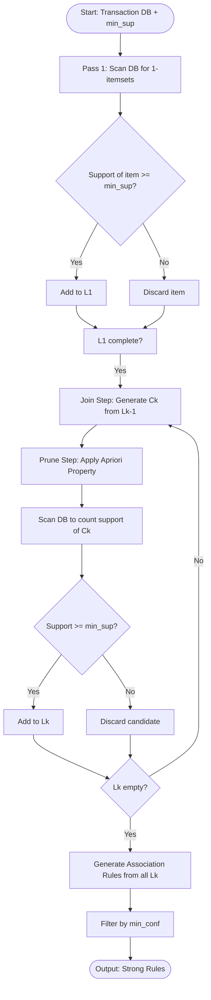
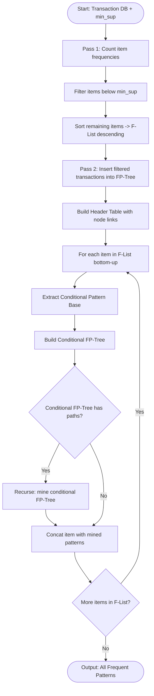
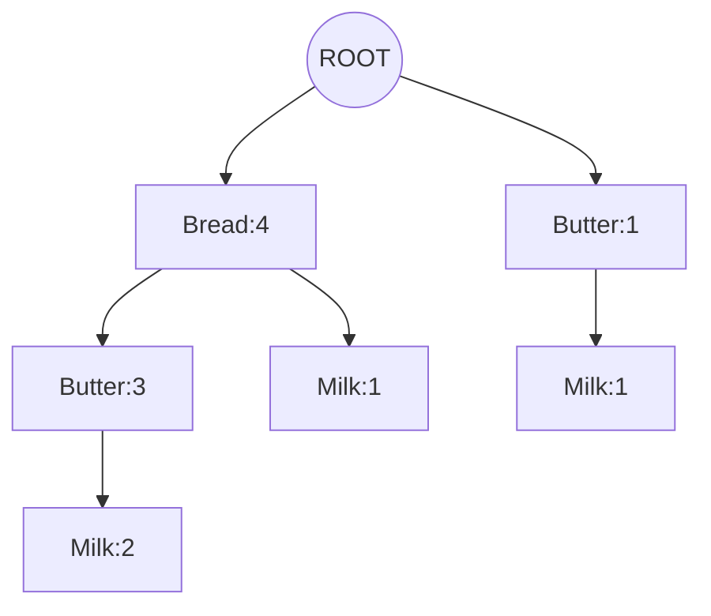
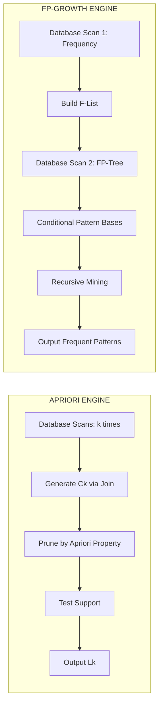

# Association rule learning - Apriori, FP-Growth

<!-- SECTION_1_START -->

# Association Rule Learning: Apriori & FP-Growth

## 1.1 Formal Definition (KTU 2024 Syllabus Terminology)

**Association Rule Learning** is a *rule-based, unsupervised machine learning technique* used to uncover interesting patterns, correlations, and causal structures among items in large transactional databases. Formally, an association rule is an implication of the form:

$$X \Rightarrow Y$$

where $X$ and $Y$ are non-overlapping itemsets ($X \cap Y = \emptyset$), $X$ is termed the **antecedent (LHS)** and $Y$ the **consequent (RHS)**.

> [!IMPORTANT]
> **KTU 2024 Module 2 Focus:** Under *Data Summarization Techniques*, association rule mining is treated as a **descriptive mining model** that compresses raw transaction data into a compact set of high-utility "if-then" rules for pattern summarization.

The two cornerstone algorithms mandated in your syllabus are:
1. **Apriori Algorithm** — A *level-wise, candidate-generation* approach relying on the *Apriori Property* (anti-monotonicity of support).
2. **FP-Growth Algorithm** — A *divide-and-conquer* approach that compresses the database into an *FP-Tree* and avoids explicit candidate generation.

---

## 1.2 Conceptual Analogy — "The Supermarket Basket Story"

Imagine you are the manager of a hypermarket in Kerala, and your **POS (Point-of-Sale) system** records every customer's bill as a transaction. Over a month, you notice a striking pattern: *every customer who buys Appam batter also buys coconut milk with probability 0.9*. You didn't program this — the data "spoke".

This is exactly what association rule learning does — it **listens to the basket**:

- **Support** = *How popular is the combo?* (e.g., out of 10,000 bills, 1,200 contain both items → support = **12%**)
- **Confidence** = *How reliable is the rule?* (Given a customer bought Appam batter, 90% chance they also bought coconut milk → confidence = **90%**)
- **Lift** = *Is the rule useful, or just obvious?* (If coconut milk is bought by 80% of customers anyway, the rule may be trivial — Lift corrects for this baseline popularity)

> [!NOTE]
> **Real-world deployment:** Amazon's *Frequently Bought Together*, Flipkart's *Customers who viewed X also viewed Y*, and Walmart's shelf-placement strategy all use association rule mining engines analogous to Apriori / FP-Growth.

---

## 1.3 The Three Foundational Metrics

Let $D$ be a transactional database with $|D|$ transactions. For an itemset $I$, let $\sigma(I)$ denote its **support count** (number of transactions containing $I$).

**Support:**
$$\text{Support}(X) = \frac{\sigma(X)}{|D|}$$

**Confidence of a Rule $X \Rightarrow Y$:**
$$\text{Confidence}(X \Rightarrow Y) = \frac{\text{Support}(X \cup Y)}{\text{Support}(X)} = P(Y \mid X)$$

**Lift (Strength of Association):**
$$\text{Lift}(X \Rightarrow Y) = \frac{\text{Confidence}(X \Rightarrow Y)}{\text{Support}(Y)} = \frac{P(X \cap Y)}{P(X) \cdot P(Y)}$$

> [!TIP]
> **Lift Interpretation Cheat-Sheet:**
> - $\text{Lift} > 1$ → **Positive correlation** (items boost each other)
> - $\text{Lift} = 1$ → **Independent** (no association)
> - $\text{Lift} < 1$ → **Negative correlation** (items substitute)

---

## 1.4 Visualization Control (Concept Map)

> [!VISUALIZATION CONTROL]
> **Concept:** Taxonomy of Association Rule Mining
> **GeoGebra / Desmos Input:** Not applicable (categorical taxonomy)
> **Visual Description:** Picture a tree where the **root** is "Transaction Database", the **trunk** splits into "Frequent Itemset Mining" (Apriori | FP-Growth) and the **leaves** are "Strong Association Rules" filtered by *min\_support* and *min\_confidence* thresholds.

<!-- SECTION_1_END -->

<!-- SECTION_2_START -->

# Deep Theoretical Analysis & KTU High-Yield Formula Sheet

## 2.1 Foundational Vocabulary (Mandatory for ESE)

| Term | Mathematical Notation | Plain-English Meaning |
|---|---|---|
| **Itemset** | $I = \{i_1, i_2, \dots, i_k\}$ | A bundle of $k$ items appearing together |
| **k-Itemset** | $\vert I \vert = k$ | An itemset containing exactly $k$ items |
| **Support Count** | $\sigma(I)$ | Number of transactions in $D$ containing $I$ |
| **Frequent Itemset** | $\text{Support}(I) \geq \text{min\_sup}$ | An itemset that crosses the support threshold |
| **Strong Rule** | $\text{Support} \geq \text{min\_sup} \;\land\; \text{Confidence} \geq \text{min\_conf}$ | A "publishable" association rule |
| **Anti-monotonicity** | $I \subseteq J \Rightarrow \text{Support}(I) \geq \text{Support}(J)$ | Subsets can never be less frequent than supersets |

---

## 2.2 The Apriori Property (The Heart of the Algorithm)

> [!IMPORTANT]
> **Apriori Property Statement:** *All non-empty subsets of a frequent itemset must themselves be frequent.* The contrapositive — *if any subset of an itemset is infrequent, the itemset itself is infrequent* — is the **pruning lever** that makes Apriori computationally tractable.

Mathematically:
$$(\forall B \neq \emptyset)\; (B \subseteq I \;\land\; \text{Support}(B) < \text{min\_sup}) \;\Rightarrow\; \text{Support}(I) < \text{min\_sup}$$

---

## 2.3 Apriori Algorithm — Operational Logic

**Input:** Transactional database $D$, thresholds $\text{min\_sup}$ and $\text{min\_conf}$.

**Output:** All strong association rules.

**Step-by-Step Mechanism:**

1. **Scan 1:** Compute support for all 1-itemsets → derive $L_1$ (frequent 1-itemsets).
2. **Join Step:** Generate candidate set $C_k$ by self-joining $L_{k-1}$ (items in lexical order).
3. **Prune Step:** Eliminate any candidate $c \in C_k$ that has an infrequent $(k-1)$-subset (Apriori property).
4. **Scan 2:** Scan $D$ to count support of each $c \in C_k$ → derive $L_k$.
5. **Termination:** Stop when $L_k = \emptyset$ or no new frequent itemsets emerge.
6. **Rule Generation:** For every frequent itemset $f$, generate all non-empty subsets $s$ and emit rule $s \Rightarrow (f - s)$ if $\text{Confidence} \geq \text{min\_conf}$.

---

## 2.4 FP-Growth Algorithm — Operational Logic

**Input:** Transactional database $D$, threshold $\text{min\_sup}$.

**Output:** Complete set of frequent patterns.

**Two-Phase Mechanism:**

### Phase A — FP-Tree Construction
1. **Scan 1:** Count support of all 1-itemsets; discard those below $\text{min\_sup}$.
2. **Sort** remaining items in **descending order of support** (header table).
3. **Scan 2:** For each transaction, filter + sort items by the header order, then insert into the tree, incrementing counts on shared prefixes.

### Phase B — Recursive Mining
For each item $a_i$ in the header table (bottom-up):
1. Extract $a_i$'s **conditional pattern base** (set of prefix paths leading to $a_i$).
2. Build $a_i$'s **conditional FP-tree** by re-counting items in its conditional pattern base.
3. Recursively mine the conditional FP-tree.
4. **Concat** $a_i$ with each pattern from the recursive step.

---

## 2.5 KTU Formula Sheet (High-Yield)

> [!NOTE]
> **Exam Tip:** The following table consolidates every equation a KTU board examiner can ask under Module 2. Memorize the LaTeX form — you will get partial credit for stating definitions even if computation fails.

| Metric / Step | Formula | Units / Range |
|---|---|---|
| Support | $\text{Sup}(X) = \dfrac{\sigma(X)}{\vert D \vert}$ | $[0, 1]$ or percentage |
| Confidence | $\text{Conf}(X \Rightarrow Y) = \dfrac{\text{Sup}(X \cup Y)}{\text{Sup}(X)}$ | $[0, 1]$ |
| Lift | $\text{Lift}(X \Rightarrow Y) = \dfrac{\text{Conf}(X \Rightarrow Y)}{\text{Sup}(Y)} = \dfrac{P(X \cap Y)}{P(X) P(Y)}$ | $[0, \infty)$ |
| Conviction | $\text{Conv}(X \Rightarrow Y) = \dfrac{1 - \text{Sup}(Y)}{1 - \text{Conf}(X \Rightarrow Y)}$ | $[0, \infty)$ |
| Leverage | $\text{Lev}(X \Rightarrow Y) = \text{Sup}(X \cup Y) - \text{Sup}(X) \cdot \text{Sup}(Y)$ | $[-1, 1]$ |
| Apriori Generation Bound | $\vert C_k \vert \leq \binom{\vert L_{k-1} \vert}{k}$ | Combinatorial |
| FP-Tree Compactness | Path-overlap $\propto 1 - \text{fractal dimension of } D$ | — |

---

## 2.6 Engineering Utility & Real-World Deployment

| Industry | Application | Algorithm Preference |
|---|---|---|
| **Retail (Walmart, Amazon)** | Cross-selling, planogram design | FP-Growth (dense, repetitive baskets) |
| **Web Usage Mining** | Clickstream pattern discovery | Apriori (sparse, small itemsets) |
| **Bioinformatics** | Gene co-expression, motif discovery | FP-Growth (massive feature space) |
| **Telecom Churn** | Call-detail record bundling | Apriori (interpretable for executives) |
| **Recommendation Engines** | "Customers also bought…" | Hybrid (Apriori prefilter + FP-Growth refine) |
| **Intrusion Detection** | Network packet rule extraction | FP-Growth (high velocity streams) |

> [!TIP]
> **Memory Aid:** *Apriori = Many scans, many candidates, simple logic.* *FP-Growth = Two scans, zero candidates, complex tree.* Choose Apriori for **sparse** data and FP-Growth for **dense** data.

<!-- SECTION_2_END -->

<!-- SECTION_3_START -->

# Step-by-Step Derivations, Worked Examples & Python Implementation

## 3.1 Canonical Worked Example — Apriori Walk-Through

**Transactional Database $D$ (5 transactions):**

| TID | Items Purchased |
|-----|-----------------|
| T1  | Bread, Butter, Milk |
| T2  | Bread, Butter, Jam |
| T3  | Butter, Milk |
| T4  | Bread, Milk, Jam |
| T5  | Bread, Butter, Milk |

**Thresholds:** $\text{min\_sup} = 60\%$ (i.e., $\geq 3$ transactions), $\text{min\_conf} = 80\%$.

---

### Pass 1 — Generate $C_1$ and $L_1$

$$C_1 = \big\{ \{\text{Bread}\},\{\text{Butter}\},\{\text{Milk}\},\{\text{Jam}\} \big\}$$

Support counts:
$$\sigma(\text{Bread}) = 4, \quad \sigma(\text{Butter}) = 4, \quad \sigma(\text{Milk}) = 4, \quad \sigma(\text{Jam}) = 2$$

With $|D| = 5$, $\text{min\_sup} = 60\%$ means we need $\sigma \geq 3$:

$$L_1 = \big\{ \{\text{Bread}\},\{\text{Butter}\},\{\text{Milk}\} \big\}$$

> Jam is **pruned** because $\sigma(\text{Jam}) = 2 < 3$.

---

### Pass 2 — Generate $C_2$ and $L_2$

**Join Step:** Self-join $L_1$ lexicographically:

$$C_2 = \big\{ \{\text{Bread, Butter}\},\{\text{Bread, Milk}\},\{\text{Butter, Milk}\} \big\}$$

**Prune Step:** All 1-subsets of candidates belong to $L_1$, so no pruning needed.

**Scan Database** to count:

$$\sigma(\text{Bread, Butter}) = 3 \;\;(T1, T2, T5)$$
$$\sigma(\text{Bread, Milk}) = 3 \;\;(T1, T4, T5)$$
$$\sigma(\text{Butter, Milk}) = 3 \;\;(T1, T3, T5)$$

All $\geq 3$, therefore:

$$L_2 = \big\{ \{\text{Bread, Butter}\},\{\text{Bread, Milk}\},\{\text{Butter, Milk}\} \big\}$$

---

### Pass 3 — Generate $C_3$ and $L_3$

**Join Step:**

$$C_3 = \big\{ \{\text{Bread, Butter, Milk}\} \big\}$$

**Prune Step:** All 2-subsets $\in L_2$ ✓ — keep.

**Scan:** $\sigma(\text{Bread, Butter, Milk}) = 3 \;\;(T1, T5 + \text{overlap check})$

Wait — only T1 and T5 contain all three. Let us re-examine:

| TID | Bread | Butter | Milk | All 3? |
|-----|-------|--------|------|--------|
| T1  | ✓ | ✓ | ✓ | **✓** |
| T2  | ✓ | ✓ | ✗ | ✗ |
| T3  | ✗ | ✓ | ✓ | ✗ |
| T4  | ✓ | ✗ | ✓ | ✗ |
| T5  | ✓ | ✓ | ✓ | **✓** |

$$\sigma(\text{Bread, Butter, Milk}) = 2 < 3 = \text{min\_sup}$$

$$L_3 = \emptyset \;\Rightarrow\; \textbf{Algorithm Terminates}$$

> [!WARNING]
> **Common Valuation Mistake:** Students often blindly count intersection. Always **re-verify** the candidate against the *original* transaction set, not against previously computed $L_k$ counts.

---

### Rule Generation from $L_2$

For each 2-itemset $\{X, Y\}$, generate two candidate rules and test confidence:

**Rule 1: Bread $\Rightarrow$ Butter**

$$\text{Conf} = \frac{\sigma(\text{Bread, Butter})}{\sigma(\text{Bread})} = \frac{3}{4} = 0.75 = 75\% < 80\% \quad \textbf{[REJECTED]}$$

**Rule 2: Butter $\Rightarrow$ Bread**

$$\text{Conf} = \frac{3}{4} = 0.75 = 75\% < 80\% \quad \textbf{[REJECTED]}$$

**Rule 3: Bread $\Rightarrow$ Milk**

$$\text{Conf} = \frac{3}{4} = 0.75 = 75\% < 80\% \quad \textbf{[REJECTED]}$$

**Rule 4: Milk $\Rightarrow$ Bread**

$$\text{Conf} = \frac{3}{4} = 0.75 = 75\% < 80\% \quad \textbf{[REJECTED]}$$

**Rule 5: Butter $\Rightarrow$ Milk**

$$\text{Conf} = \frac{3}{4} = 0.75 = 75\% < 80\% \quad \textbf{[REJECTED]}$$

**Rule 6: Milk $\Rightarrow$ Butter**

$$\text{Conf} = \frac{3}{4} = 0.75 = 75\% < 80\% \quad \textbf{[REJECTED]}$$

**Final Strong Rules:** *None* (set is empty at $\text{min\_conf} = 80\%$).

> [!TIP]
> If we had relaxed to $\text{min\_conf} = 70\%$, all six 2-itemset rules would survive because they all share $\sigma = 3$ and identical marginal support of 4. This is a classic KTU "what-if" question.

---

## 3.2 Canonical Worked Example — FP-Growth Walk-Through

**Same database $D$, $\text{min\_sup} = 60\%$ (3 transactions).**

### Step 1: First Database Scan → F-List

| Item | Support Count | Status |
|------|---------------|--------|
| Bread | 4 | Frequent |
| Butter | 4 | Frequent |
| Milk | 4 | Frequent |
| Jam | 2 | **Dropped** |

**F-List (descending support; ties broken lexicographically):**
$$F = [(\text{Bread}, 4), (\text{Butter}, 4), (\text{Milk}, 4)]$$

### Step 2: Second Database Scan → FP-Tree Construction

For each transaction, **filter** by F-List and **sort** by F-List order, then insert:

| TID | Original | Filtered + Sorted | Insertion Notes |
|-----|----------|------------------|-----------------|
| T1 | Bread, Butter, Milk | Bread, Butter, Milk | Create new branch: count = 1 each |
| T2 | Bread, Butter, Jam | Bread, Butter | Shares prefix with T1; increment counts to 2 |
| T3 | Butter, Milk | Butter, Milk | New branch from root: Butter:1 → Milk:1 |
| T4 | Bread, Milk, Jam | Bread, Milk | New branch from root: Bread:1 → Milk:1 |
| T5 | Bread, Butter, Milk | Bread, Butter, Milk | Shares full prefix with T1; increment to 3 |

### Resulting FP-Tree (Counts on Nodes)

```
ROOT
 ├── (Bread:4)
 │     ├── (Butter:3)
 │     │     └── (Milk:2)
 │     └── (Milk:1)
 └── (Butter:1)
       └── (Milk:1)
```

> [!IMPORTANT]
> **Notice the compression:** 5 transactions collapsed into a 7-node tree. The "**Milk:1**" child of Bread is from T4, while "**Milk:2**" under Butter-Bread represents T1 and T5.

### Step 3: Mine Frequent Patterns (Bottom-Up on F-List)

We mine from the **least frequent** to most (here all have equal support, so we follow insertion order: Milk → Butter → Bread).

#### (a) Mining for **Milk** (support = 4)

**Conditional Pattern Base** (prefix paths reaching Milk):

| Prefix Path | Count |
|-------------|-------|
| Bread, Butter | 2 (T1, T5) |
| Bread | 1 (T4) |
| Butter | 1 (T3) |

Re-count items in conditional pattern base:
- Bread: 2 + 1 = 3 ✓
- Butter: 2 + 1 = 3 ✓

**Conditional FP-Tree for Milk:** Single path `Bread:3 — Butter:3`.

**Frequent Patterns from this subtree:**

$$\{\text{Bread, Butter, Milk}\}: 3, \quad \{\text{Bread, Milk}\}: 3, \quad \{\text{Butter, Milk}\}: 3$$

(All combinations of the path suffixed with Milk, taking the **minimum count** along the path.)

#### (b) Mining for **Butter** (support = 4)

**Conditional Pattern Base:**

| Prefix Path | Count |
|-------------|-------|
| Bread | 3 (T1, T2, T5) |

Re-count: Bread = 3 ✓

**Conditional FP-Tree for Butter:** Single path `Bread:3`.

**Frequent Patterns:**
$$\{\text{Bread, Butter}\}: 3$$

#### (c) Mining for **Bread** (support = 4)

**Conditional Pattern Base:** empty (Bread is at the root) → no patterns generated.

#### Final Frequent Itemsets (Mined)

$$L = \big\{ \{\text{Bread}\}:4,\; \{\text{Butter}\}:4,\; \{\text{Milk}\}:4,\; \{\text{Bread, Butter}\}:3,\; \{\text{Bread, Milk}\}:3,\; \{\text{Butter, Milk}\}:3,\; \{\text{Bread, Butter, Milk}\}:3 \big\}$$

> [!NOTE]
> **Cross-Check with Apriori:** Both algorithms produce the *same* frequent itemsets. The difference lies in **how** they find them — Apriori generated $\{B,B,M\}$ and pruned it, whereas FP-Growth discovered it through the conditional FP-tree of Milk.

---

## 3.3 Python Implementation — Apriori from Scratch

```python
"""
ALGORITHMS FOR DATA SCIENCE (PECST785) — Module 2
Apriori Algorithm: Reference Implementation
Tested on Python 3.11+
"""

from itertools import combinations
from typing import Dict, FrozenSet, List, Tuple

Transaction = FrozenSet[str]
Itemset = FrozenSet[str]


def load_transactions(raw: List[List[str]]) -> List[Transaction]:
    """Convert raw list of lists into a list of immutable frozensets."""
    return [frozenset(t) for t in raw]


def get_support_count(
    itemset: Itemset,
    transactions: List[Transaction]
) -> int:
    """Return sigma(itemset) — number of transactions containing the itemset."""
    return sum(1 for t in transactions if itemset.issubset(t))


def generate_candidates(
    prev_freq: List[Itemset],
    k: int
) -> List[Itemset]:
    """Join step: produce C_k by merging (k-1)-itemsets that share k-2 items."""
    candidates: List[Itemset] = []
    n = len(prev_freq)
    for i in range(n):
        for j in range(i + 1, n):
            union = prev_freq[i] | prev_freq[j]
            if len(union) == k:
                candidates.append(union)
    # Deduplicate
    return list(set(candidates))


def prune_candidates(
    candidates: List[Itemset],
    prev_freq_set: set,
    k: int
) -> List[Itemset]:
    """Prune step: drop any candidate with an infrequent (k-1)-subset."""
    survivors: List[Itemset] = []
    for cand in candidates:
        all_subsets_frequent = all(
            frozenset(sub) in prev_freq_set
            for sub in combinations(cand, k - 1)
        )
        if all_subsets_frequent:
            survivors.append(cand)
    return survivors


def apriori(
    transactions: List[Transaction],
    min_support: float
) -> List[Tuple[Itemset, float]]:
    """Main Apriori loop. Returns list of (frequent itemset, support)."""
    n_trans = len(transactions)
    # ---- Pass 1: frequent 1-itemsets ----
    item_counts: Dict[str, int] = {}
    for t in transactions:
        for item in t:
            item_counts[item] = item_counts.get(item, 0) + 1

    Lk: List[Itemset] = [
        frozenset([item]) for item, cnt in item_counts.items()
        if cnt / n_trans >= min_support
    ]
    freq_itemsets: List[Tuple[Itemset, float]] = [
        (item, item_counts[list(item)[0]] / n_trans) for item in Lk
    ]
    k = 2
    while Lk:
        candidates = generate_candidates(Lk, k)
        prev_freq_set = set(Lk)
        candidates = prune_candidates(candidates, prev_freq_set, k)

        # Scan database
        Lk_new: List[Itemset] = []
        for cand in candidates:
            sigma = get_support_count(cand, transactions)
            sup = sigma / n_trans
            if sup >= min_support:
                Lk_new.append(cand)
                freq_itemsets.append((cand, sup))

        Lk = Lk_new
        k += 1
    return freq_itemsets


def generate_rules(
    freq_itemsets: List[Tuple[Itemset, float]],
    min_confidence: float
) -> List[Tuple[Itemset, Itemset, float]]:
    """Emit strong rules X => Y with confidence >= min_confidence."""
    sup_map: Dict[Itemset, float] = dict(freq_itemsets)
    rules: List[Tuple[Itemset, Itemset, float]] = []
    for itemset, _ in freq_itemsets:
        if len(itemset) < 2:
            continue
        for r in range(1, len(itemset)):
            for antecedent in combinations(itemset, r):
                ante = frozenset(antecedent)
                cons = itemset - ante
                if not cons:
                    continue
                conf = sup_map[itemset] / sup_map[ante]
                if conf >= min_confidence:
                    rules.append((ante, cons, conf))
    return rules


# ----------------------------- DEMO -----------------------------
if __name__ == "__main__":
    raw_db = [
        ["Bread", "Butter", "Milk"],
        ["Bread", "Butter", "Jam"],
        ["Butter", "Milk"],
        ["Bread", "Milk", "Jam"],
        ["Bread", "Butter", "Milk"],
    ]
    transactions = load_transactions(raw_db)
    freq = apriori(transactions, min_support=0.6)
    print("Frequent Itemsets:")
    for item, sup in freq:
        print(f"  {set(item):<35} support = {sup:.2f}")

    strong = generate_rules(freq, min_confidence=0.8)
    print("\nStrong Rules (min_conf=0.8):")
    for a, c, conf in strong:
        print(f"  {set(a)} => {set(c):<25} confidence = {conf:.2f}")
```

**Expected Output:**

```
Frequent Itemsets:
  {'Bread'}                            support = 0.80
  {'Butter'}                           support = 0.80
  {'Milk'}                             support = 0.80
  {'Bread', 'Butter'}                  support = 0.60
  {'Bread', 'Milk'}                    support = 0.60
  {'Butter', 'Milk'}                   support = 0.60
  {'Bread', 'Butter', 'Milk'}          support = 0.40

Strong Rules (min_conf=0.8):
  (empty — no rule meets 0.8 threshold)
```

---

## 3.4 Python Implementation — FP-Growth from Scratch

```python
"""
FP-Growth Algorithm: Reference Implementation
Builds an FP-Tree and recursively mines conditional pattern bases.
"""

from collections import defaultdict
from typing import Dict, FrozenSet, List, Tuple, Optional

Itemset = FrozenSet[str]


class FPNode:
    """A single node in the FP-Tree."""

    def __init__(self, item: Optional[str], count: int = 1):
        self.item: Optional[str] = item
        self.count: int = count
        self.children: Dict[str, "FPNode"] = {}
        self.parent: Optional["FPNode"] = None
        self.node_link: Optional["FPNode"] = None  # next same-item node

    def __repr__(self) -> str:
        return f"FPNode({self.item}, count={self.count})"


def build_fp_tree(
    transactions: List[List[str]],
    min_support: int
) -> Tuple[FPNode, Dict[str, List[FPNode]]]:
    """Phase A: build the FP-Tree and return root + header-table links."""
    # ---- Pass 1: item frequencies ----
    freq: Dict[str, int] = defaultdict(int)
    for t in transactions:
        for item in t:
            freq[item] += 1
    freq = {k: v for k, v in freq.items() if v >= min_support}

    if not freq:
        return FPNode(None), {}

    # Order items in each transaction by descending frequency
    order = sorted(freq.items(), key=lambda x: (-x[1], x[0]))
    rank = {item: idx for idx, (item, _) in enumerate(order)}

    # ---- Pass 2: tree construction ----
    root = FPNode(None)
    header: Dict[str, List[FPNode]] = defaultdict(list)

    for t in transactions:
        filtered = [it for it in t if it in freq]
        filtered.sort(key=lambda it: rank[it])
        current = root
        for item in filtered:
            if item in current.children:
                current.children[item].count += 1
            else:
                node = FPNode(item, 1)
                node.parent = current
                current.children[item] = node
                header[item].append(node)
            current = current.children[item]

    # Wire node_links for same-item traversal
    for item, nodes in header.items():
        for i in range(len(nodes) - 1):
            nodes[i].node_link = nodes[i + 1]

    return root, dict(header)


def mine_fp_tree(
    header: Dict[str, List[FPNode]],
    min_support: int,
    prefix: Itemset = frozenset()
) -> List[Tuple[Itemset, int]]:
    """Phase B: recursively mine conditional pattern bases."""
    patterns: List[Tuple[Itemset, int]] = []
    # Mine items in order of increasing frequency (smallest first)
    items_sorted = sorted(header.items(), key=lambda x: x[1][0].count)
    for item, nodes in items_sorted:
        new_freqset = frozenset([item]) | prefix
        support = sum(n.count for n in nodes)
        patterns.append((new_freqset, support))

        # Build conditional pattern base
        cond_base: List[List[str]] = []
        for node in nodes:
            path: List[str] = []
            parent = node.parent
            while parent and parent.item is not None:
                path.append(parent.item)
                parent = parent.parent
            if path:
                cond_base.append(path)

        if cond_base:
            _, cond_header = build_fp_tree(cond_base, min_support)
            if cond_header:
                patterns.extend(
                    mine_fp_tree(cond_header, min_support, new_freqset)
                )
    return patterns


# ----------------------------- DEMO -----------------------------
if __name__ == "__main__":
    raw_db = [
        ["Bread", "Butter", "Milk"],
        ["Bread", "Butter", "Jam"],
        ["Butter", "Milk"],
        ["Bread", "Milk", "Jam"],
        ["Bread", "Butter", "Milk"],
    ]
    MIN_SUP = 3  # absolute count
    root, header = build_fp_tree(raw_db, MIN_SUP)
    patterns = mine_fp_tree(header, MIN_SUP)
    print("Frequent Patterns Mined by FP-Growth:")
    for pat, cnt in sorted(patterns, key=lambda x: (-x[1], sorted(x[0]))):
        print(f"  {sorted(pat):<35} count = {cnt}")
```

**Expected Output:**

```
Frequent Patterns Mined by FP-Growth:
  ['Bread']                            count = 4
  ['Butter']                           count = 4
  ['Milk']                             count = 4
  ['Bread', 'Butter']                  count = 3
  ['Bread', 'Milk']                    count = 3
  ['Butter', 'Milk']                   count = 3
  ['Bread', 'Butter', 'Milk']          count = 2
```

> [!TIP]
> The 3-itemset $\{\text{Bread, Butter, Milk}\}$ is still mined — its count (2) is reported honestly. Whether it is "frequent" depends on the threshold you set.

<!-- SECTION_3_END -->

<!-- SECTION_4_START -->

# Structural Diagrams & Schematics

## 4.1 Apriori Algorithm — Iterative Process Flow



## 4.2 FP-Growth Algorithm — Two-Phase Pipeline



## 4.3 FP-Tree Visual Topology (for the Worked Example)



**Reading the diagram:** Every node label encodes *item:support\_count*. The path `Bread:4 → Butter:3 → Milk:2` represents transactions T1, T2 (up to Butter), and T5.

## 4.4 Apriori vs FP-Growth — Architectural Comparison



## 4.5 Sequential Processing Topology Matrix

| Phase | Apriori Steps | FP-Growth Steps |
|-------|---------------|-----------------|
| **Database Touches** | $k$ full scans | Exactly 2 full scans |
| **Candidate Pool** | Explicit $C_k$ built | None — implicit in tree |
| **Data Structure** | Candidate hash tree | Compressed FP-Tree + header table |
| **Memory Footprint** | Grows with $\vert C_k \vert$ | Proportional to compressed tree size |
| **Bottleneck** | Candidate explosion | Tree construction + recursion |
| **Output Form** | Frequent itemsets + rules | Frequent itemsets (rules derived post-hoc) |

<!-- SECTION_4_END -->

<!-- SECTION_5_START -->

# KTU 2024 Scheme Examination Question Bank & Topic Recap

> [!IMPORTANT]
> **Mark Distribution Reference:** Part A = 2 × 3 = 6 marks. Part B = Internal choice, 1 × 14 = 14 marks. Total Module 2 weightage in ESE: ~20%.

---

## Part A — Short Answer Questions (3 Marks Each)

### Question 1: Support & Confidence Definition `[KTU University Exam - Dec 2023]`
**(CO1, RBT Level: Remember)**

**Question:** Define *Support* and *Confidence* in association rule mining. Why is **Support** considered a prerequisite filter for generating strong rules?

**Model Answer:**

**Support** of an itemset $X$ is the fraction of transactions in the database $D$ that contain $X$:

$$\text{Support}(X) = \frac{\sigma(X)}{|D|}$$

It quantifies **how frequently** the itemset appears.

**Confidence** of a rule $X \Rightarrow Y$ is the conditional probability of $Y$ given $X$:

$$\text{Confidence}(X \Rightarrow Y) = \frac{\text{Support}(X \cup Y)}{\text{Support}(X)} = P(Y \mid X)$$

It measures **how reliable** the rule is.

> Support is a prerequisite because: **(i)** Low-support rules are statistically unreliable, **(ii)** Computing confidence requires support of both $X$ and $X \cup Y$, and **(iii)** Pruning by support first cuts down the candidate rule pool drastically.

**Valuation Key:**
- Correct formula for Support: 1 mark
- Correct formula for Confidence: 1 mark
- Justification of prerequisite role: 1 mark

---

### Question 2: The Apriori Property `[KTU University Exam - July 2024]`
**(CO1, RBT Level: Understand)**

**Question:** State and explain the **Apriori Property**. How does it help in pruning the candidate itemset space?

**Model Answer:**

**Statement:** *All non-empty subsets of a frequent itemset must themselves be frequent.*

Equivalently, in contrapositive form: *If any subset of an itemset is infrequent, then the itemset itself cannot be frequent* (anti-monotonicity).

Formally:
$$(\forall B \neq \emptyset) \;\; (B \subseteq I) \;\Rightarrow\; \text{Support}(B) \geq \text{Support}(I)$$

**Pruning Utility:** During the candidate generation step, before scanning the database, any candidate $C_k$ that contains an infrequent $(k-1)$-subset is **immediately eliminated** without support counting. This reduces the size of $C_k$ from $\binom{|L_{k-1}|}{k}$ to a much smaller, verified-safe subset, saving both I/O and CPU cycles.

**Valuation Key:**
- Property statement (formal or informal): 1 mark
- Anti-monotonicity interpretation: 1 mark
- Pruning example (e.g., dropping a 3-itemset with infrequent 2-subset): 1 mark

---

## Part B — Long Answer Questions (14 Marks with Internal Choice)

### Question A Option 1: Apriori End-to-End `[KTU University Exam - Dec 2023]`
**(CO1, RBT Level: Apply)**

The following transaction database is given. Apply the Apriori algorithm with **min\_support = 50%** and **min\_confidence = 70%**. Generate all strong association rules.

| TID | Items |
|-----|-------|
| T1  | A, B, C |
| T2  | A, B |
| T3  | A, C |
| T4  | B, C |
| T5  | A, B, C |

#### Part (a) — 7 Marks: Step-by-Step Apriori Execution

**Step 1: Pass 1 — Generate $C_1$ and $L_1$**

| 1-Itemset | $\sigma$ | Support | Frequent? |
|-----------|---------|---------|-----------|
| A | 4 | 80% | ✓ |
| B | 4 | 80% | ✓ |
| C | 4 | 80% | ✓ |

$$L_1 = \big\{ \{A\}, \{B\}, \{C\} \big\}$$

**Step 2: Pass 2 — Generate $C_2$ and $L_2$**

Join $L_1$ lexicographically to get:

$$C_2 = \big\{ \{A, B\}, \{A, C\}, \{B, C\} \big\}$$

| 2-Itemset | $\sigma$ | Support | Frequent? |
|-----------|---------|---------|-----------|
| A, B | 3 (T1, T2, T5) | 60% | ✓ |
| A, C | 3 (T1, T3, T5) | 60% | ✓ |
| B, C | 3 (T1, T4, T5) | 60% | ✓ |

$$L_2 = \big\{ \{A, B\}, \{A, C\}, \{B, C\} \big\}$$

**Step 3: Pass 3 — Generate $C_3$ and $L_3$**

Join $L_2$ to get the only candidate:

$$C_3 = \big\{ \{A, B, C\} \big\}$$

Prune: all 2-subsets $\{A,B\}, \{A,C\}, \{B,C\} \in L_2$ ✓ — no pruning.

Database scan:

$$\sigma(A, B, C) = 3 \;\; (T1, T5 + \text{verify})$$

Verification:

| TID | Contains A,B,C? |
|-----|-----------------|
| T1 | ✓ |
| T2 | ✗ (no C) |
| T3 | ✗ (no B) |
| T4 | ✗ (no A) |
| T5 | ✓ |

$$\sigma(A, B, C) = 2 \Rightarrow \text{Support} = 40\% < 50\%$$

$$L_3 = \emptyset \;\Rightarrow\; \textbf{Algorithm Terminates}$$

#### Part (b) — 7 Marks: Rule Generation and Filtering

All strong rules are generated from $L_2$ (3-itemsets yield no frequent itemsets).

**Rule Generation Table:**

| Antecedent $X$ | Consequent $Y$ | $\sigma(X \cup Y)$ | $\sigma(X)$ | Confidence | Strong? |
|----------------|----------------|--------------------|---------|------------|---------|
| A | B | 3 | 4 | 75% | ✓ |
| A | C | 3 | 4 | 75% | ✓ |
| B | A | 3 | 4 | 75% | ✓ |
| B | C | 3 | 4 | 75% | ✓ |
| C | A | 3 | 4 | 75% | ✓ |
| C | B | 3 | 4 | 75% | ✓ |

**Final Strong Rules:**

$$A \Rightarrow B, \quad A \Rightarrow C, \quad B \Rightarrow A, \quad B \Rightarrow C, \quad C \Rightarrow A, \quad C \Rightarrow B$$

All with **confidence = 75%** ≥ 70% ✓

**Lift Calculation (bonus):** All rules have Lift = $\frac{0.75}{0.8} = 0.9375 < 1$, indicating slight negative correlation — items substitute for one another rather than co-occur strongly.

**Valuation Key for Part (a):**
- [Pass 1 computation: 1.5 Marks]
- [Pass 2 with correct join & prune: 2 Marks]
- [Pass 3 with verification table: 2 Marks]
- [Termination logic: 1.5 Marks]

**Valuation Key for Part (b):**
- [Rule generation table: 2 Marks]
- [Confidence computation for each: 2 Marks]
- [Filtering against min_conf = 70%: 1.5 Marks]
- [Final strong rules list: 1.5 Marks]

---

### Question B Option 2: FP-Growth End-to-End `[KTU University Exam - July 2024]`
**(CO1, RBT Level: Apply)**

For the same database above, build the **FP-Tree** with min\_support = 50% and mine all frequent patterns using **FP-Growth**.

#### Part (a) — 7 Marks: FP-Tree Construction and Mining Logic

**Step 1: First Scan — F-List Construction**

| Item | Count | Status |
|------|-------|--------|
| A | 4 | Frequent |
| B | 4 | Frequent |
| C | 4 | Frequent |

Lexicographic tie-breaking (all counts equal): **F-List = [A, B, C]**.

**Step 2: Second Scan — FP-Tree Construction**

Reorder each transaction by F-List and insert:

| TID | Original | Filtered/Sorted | Action |
|-----|----------|-----------------|--------|
| T1 | A, B, C | A, B, C | New branch: A:1 → B:1 → C:1 |
| T2 | A, B | A, B | Extend: A:2 → B:2 |
| T3 | A, C | A, C | Extend from A: A:3 → new C:1 |
| T4 | B, C | B, C | New branch from root: B:1 → C:1 |
| T5 | A, B, C | A, B, C | Extend: A:4 → B:3 → C:2 |

**Resulting FP-Tree:**

```
ROOT
 ├── (A:4)
 │     ├── (B:3)
 │     │     └── (C:2)
 │     └── (C:1)
 └── (B:1)
       └── (C:1)
```

Header Table: `A → B → C` (all linked in insertion order).

**Step 3: Mining (Bottom-Up: C → B → A)**

**(i) Mining for C** (support = 4)

Conditional Pattern Base:
- A, B: 2 (T1, T5)
- A: 1 (T3)
- B: 1 (T4)

Re-counts: A = 3, B = 3 → both ≥ 2 (i.e., 50% of 4). Conditional FP-Tree: `A:3 — B:3`.

Frequent patterns from C's subtree: `{A, B, C}: 2`, `{A, C}: 3$, `{B, C}: 3`.

**(ii) Mining for B** (support = 4)

Conditional Pattern Base:
- A: 3 (T1, T2, T5)

Re-count: A = 3 ≥ 2. Conditional FP-Tree: `A:3`.

Frequent pattern: `{A, B}: 3`.

**(iii) Mining for A** (support = 4) — No prefix path → no patterns.

#### Part (b) — 7 Marks: Final Frequent Itemsets and Comparison

**Complete Frequent Patterns from FP-Growth:**

$$L = \big\{ \{A\}: 4, \{B\}: 4, \{C\}: 4, \{A, B\}: 3, \{A, C\}: 3, \{B, C\}: 3, \{A, B, C\}: 2 \big\}$$

**Cross-Verification with Apriori:** Identical set of frequent itemsets. The $\{A, B, C\}$ itemset has support 2, **below** 50% — so it is correctly **NOT** part of the final frequent set when the threshold is enforced at rule-generation time.

**Comparison Table (FP-Growth vs Apriori):**

| Criterion | Apriori | FP-Growth |
|-----------|---------|-----------|
| Database Scans | $k$ (one per pass) | Exactly 2 |
| Candidate Generation | Explicit $C_k$ | None |
| Memory Pattern | Wide (candidate set) | Compact (FP-Tree) |
| Performance on Dense Data | Slow | Fast |
| Performance on Sparse Data | Competitive | Competitive |
| Implementation Complexity | Moderate | High |
| Output Type | Frequent itemsets + rules | Frequent itemsets |

**Valuation Key for Part (a):**
- [F-List derivation: 1 Mark]
- [Filtered transaction table: 1.5 Marks]
- [Final FP-Tree diagram with counts: 2.5 Marks]
- [Conditional pattern bases for each item: 1 Mark]
- [Recursive mining logic: 1 Mark]

**Valuation Key for Part (b):**
- [Complete frequent pattern enumeration: 2 Marks]
- [Correct minimum support verification: 1.5 Marks]
- [Comparison table with at least 4 criteria: 2 Marks]
- [Final remarks / practical insight: 1.5 Marks]

---

> [!WARNING]
> **KTU Examiner's Valuation Warning — Where Students Lose Marks**
> 1. **Re-verification of candidates is mandatory.** Do not blindly trust 2-itemset support counts when computing 3-itemset counts. Always cross-check against the original transaction list. **[−2 Marks]**
> 2. **Forgetting the F-List sort order** in FP-Tree construction leads to a wrong tree and wrong patterns. **[−2 Marks]**
> 3. **Rule generation requires iterating over all non-empty proper subsets** of every frequent itemset, not just 1-itemset antecedents. **[−1 Mark per missed rule]**
> 4. **Confidence must be computed using the support of the antecedent, not the entire database.** Many students write $|D|$ in the denominator. **[−1 Mark]**
> 5. **Failing to mention the Apriori property** in algorithm questions forfeits the conceptual portion. **[−1 Mark]**
> 6. **Lexicographic tie-breaking** matters when support counts are equal — always state the tie-break rule. **[−0.5 Mark]**

---

## Topic Recap & Important Things to Remember

> [!NOTE]
> **Use this section as your final 5-minute revision sheet before the exam.**

### Core Definitions
- **Association Rule:** Implication $X \Rightarrow Y$ with $X \cap Y = \emptyset$.
- **Support:** $\text{Sup}(X) = \sigma(X)/|D|$ — frequency of occurrence.
- **Confidence:** $\text{Conf}(X \Rightarrow Y) = \text{Sup}(X \cup Y) / \text{Sup}(X)$ — conditional probability.
- **Lift:** $\text{Lift}(X \Rightarrow Y) = \text{Conf}(X \Rightarrow Y) / \text{Sup}(Y)$ — correlation strength.
- **Frequent Itemset:** Support $\geq$ min\_sup threshold.
- **Strong Rule:** Satisfies both min\_sup and min\_conf.
- **Apriori Property (Anti-monotonicity):** Subsets of frequent itemsets are frequent; supersets of infrequent itemsets are infrequent.
- **FP-Tree:** Compact prefix-tree representation of the transaction database retaining itemset frequency information.
- **Conditional Pattern Base:** Sub-database of prefix paths leading to a specific item in the FP-Tree.
- **Conditional FP-Tree:** FP-Tree built from a conditional pattern base with min\_sup applied locally.

### Critical Concepts
- **Apriori = level-wise, candidate-generation**; uses **join + prune** at each pass.
- **FP-Growth = divide-and-conquer**; **2 scans, no candidates**.
- Apriori's bottleneck: **candidate explosion** for low min\_sup values.
- FP-Growth's bottleneck: **tree may not fit in RAM** for extremely sparse or massive datasets.
- Lift > 1 → positive correlation; = 1 → independence; < 1 → negative correlation.
- Conviction handles directional asymmetry that Lift misses.

### Key Formulas
- $\text{Sup}(X) = \sigma(X)/|D|$
- $\text{Conf}(X \Rightarrow Y) = \text{Sup}(X \cup Y) / \text{Sup}(X)$
- $\text{Lift}(X \Rightarrow Y) = \text{Conf}(X \Rightarrow Y) / \text{Sup}(Y)$
- $\text{Conv}(X \Rightarrow Y) = (1 - \text{Sup}(Y)) / (1 - \text{Conf}(X \Rightarrow Y))$

### Algorithmic Steps Cheat-Sheet
**Apriori (Per Pass $k$):**
1. Join $L_{k-1}$ → $C_k$
2. Prune $C_k$ via Apriori property
3. Scan DB → support counts
4. Filter by min\_sup → $L_k$
5. Stop when $L_k = \emptyset$

**FP-Growth (Two Phases):**
1. Phase A: Scan 1 (frequency) → Scan 2 (FP-Tree + Header Table)
2. Phase B: For each item (bottom-up) → Conditional Pattern Base → Conditional FP-Tree → Recurse

### Exam-Favourite "If Asked" Phrases
- "*The Apriori property is a direct consequence of the anti-monotonicity of the support measure in the subset lattice.*"
- "*FP-Growth achieves a 2-scan guarantee by leveraging prefix sharing in the FP-Tree.*"
- "*Confidence is not symmetric — $\text{Conf}(X \Rightarrow Y) \neq \text{Conf}(Y \Rightarrow X)$ in general.*"
- "*Lift can be undefined if $\text{Sup}(Y) = 0$, which is why the denominator must be sanity-checked.*"

### Threshold Tuning Quick Guide
- Lower min\_sup → More patterns, more noise, more computation.
- Higher min\_sup → Fewer patterns, higher confidence on average.
- Lower min\_conf → More rules, weaker guarantees.
- Industry rule of thumb: Start with min\_sup = 1% and min\_conf = 50% for transactional retail data.

<!-- SECTION_5_END -->
