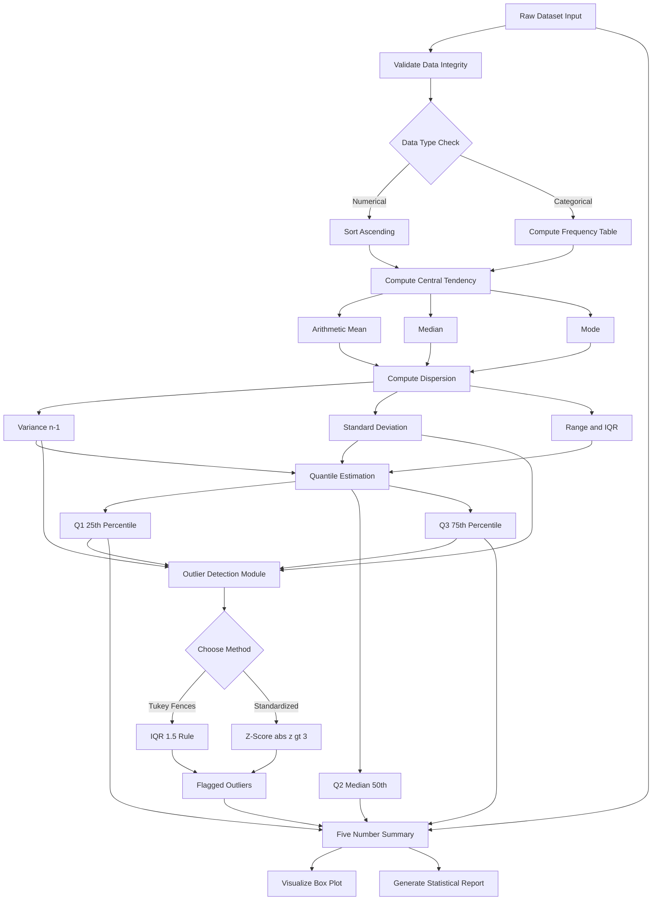
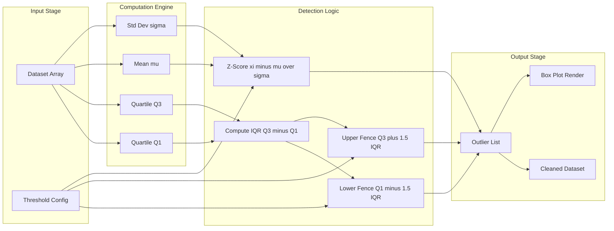
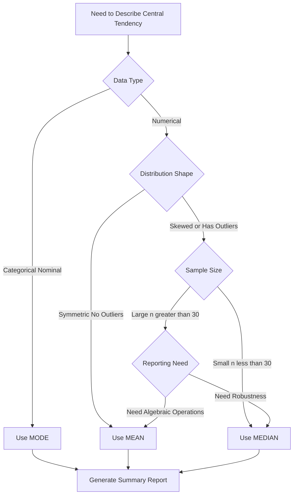

# Data Summarization Techniques - Central tendency measures: mean, median, mode; Dispersion measures - variance, standard deviation, Interquartile range (IQR), Quantiles, percentiles, and outlier detection

<!-- SECTION_1_START -->

# Data Summarization Techniques — Core Definitions & Intuitive Overview

## 1.1 Central Tendency Measures

> [!IMPORTANT]
> **Central Tendency** is a single value that attempts to describe a set of data by identifying the **central position** within that set. It gives us a quick, representative summary of where most values in a distribution tend to cluster.

### 1.1.1 Arithmetic Mean (Average)

**Formal Definition:** The arithmetic mean of a dataset is the sum of all observations divided by the total number of observations. It is the most common measure of central tendency and uses every value in the dataset.

$$\bar{x} = \frac{1}{n} \sum_{i=1}^{n} x_i$$

For a frequency distribution:

$$\bar{x} = \frac{\sum_{i=1}^{k} f_i \cdot x_i}{\sum_{i=1}^{k} f_i}$$

where $n$ is the sample size, $x_i$ is the $i^{th}$ observation, $f_i$ is the frequency of class $i$, and $k$ is the number of classes.

> [!NOTE]
> **Key Properties of the Arithmetic Mean:**
> - Sum of deviations from the mean is always **zero**: $\sum_{i=1}^{n} (x_i - \bar{x}) = 0$
> - Highly sensitive to **outliers** (extreme values)
> - Uses **all** values in the dataset
> - Algebraically tractable — basis for many statistical tests

**Intuition / Real-World Analogy:** Imagine a group of 5 students scores marks 60, 70, 80, 90, 100. The mean (80) is the marks a "perfectly average" student would get if all marks were redistributed equally. The mean acts as the **balance point** of the dataset — place the data points on a seesaw, and the mean is the fulcrum.

### 1.1.2 Median

**Formal Definition:** The median is the **middle value** of an ordered dataset that separates the higher half from the lower half. It is the value such that 50% of observations lie below it and 50% lie above it.

For an **odd** number of observations $n$:

$$\text{Median} = x_{\left(\frac{n+1}{2}\right)}$$

For an **even** number of observations $n$:

$$\text{Median} = \frac{x_{\left(\frac{n}{2}\right)} + x_{\left(\frac{n}{2}+1\right)}}{2}$$

**Intuition / Real-World Analogy:** The median is the **"middle child"** of a sorted family. Sort the data from smallest to largest, and the median is whoever stands in the center. It is the **robust** friend who is unaffected when one or two people in the room become extremely rich or extremely poor.

> [!NOTE]
> **Key Properties of the Median:**
> - **Robust** to outliers (resistant to extreme values)
> - Always exists and is unique for numerical data
> - Does **not** use the actual magnitude of values, only their rank
> - Better for **skewed distributions** (income, house prices)

### 1.1.3 Mode

**Formal Definition:** The mode is the value that appears **most frequently** in a dataset. A dataset can have one mode (unimodal), two modes (bimodal), or more (multimodal). If no value repeats, the dataset is said to have **no mode**.

$$\text{Mode} = \arg\max_{x} f(x)$$

where $f(x)$ is the frequency of value $x$.

**Intuition / Real-World Analogy:** The mode is the **"most popular kid"** in class. When you ask "what shoe size do most students wear?" — that answer is the mode. It is the only central tendency measure that works for **categorical (nominal) data**.

> [!IMPORTANT]
> **Comparison Snapshot for KTU:**
> | Measure | Data Type | Outlier Sensitivity | Best Use Case |
> |---------|-----------|---------------------|---------------|
> | Mean    | Interval/Ratio | High             | Symmetric distributions, no outliers |
> | Median  | Ordinal, Interval, Ratio | Low           | Skewed data, presence of outliers |
> | Mode    | Nominal, Ordinal, Interval, Ratio | None        | Categorical data, finding most common value |

---

## 1.2 Dispersion (Spread) Measures

> [!IMPORTANT]
> **Dispersion** quantifies the **degree of spread** or **variability** in a dataset. Two datasets can have the same mean but vastly different spreads. For example, {5, 10, 15} and {0, 10, 20} both have mean 10, but the second set is far more spread out.

### 1.2.1 Variance

**Formal Definition:** Variance measures the **average squared deviation** of each observation from the mean. It quantifies how far the data points typically are from the mean.

**Population Variance** ($\sigma^2$):

$$\sigma^2 = \frac{1}{N} \sum_{i=1}^{N} (x_i - \mu)^2$$

**Sample Variance** ($s^2$):

$$s^2 = \frac{1}{n - 1} \sum_{i=1}^{n} (x_i - \bar{x})^2$$

The use of $n-1$ (Bessel's correction) provides an **unbiased estimator** of the population variance.

> [!NOTE]
> **Why $n-1$ and not $n$ in the sample variance?**
> When computing sample variance, we lose **one degree of freedom** because we first use the data to estimate the mean $\bar{x}$. Dividing by $n-1$ corrects this bias. Always use $n-1$ for sample data in KTU problems unless explicitly told to use population variance.

### 1.2.2 Standard Deviation

**Formal Definition:** Standard deviation is the **square root of the variance**. It brings the unit of measurement back to the original scale of the data, making it more interpretable than variance.

$$\sigma = \sqrt{\sigma^2} = \sqrt{\frac{1}{N} \sum_{i=1}^{N} (x_i - \mu)^2}$$

$$s = \sqrt{s^2} = \sqrt{\frac{1}{n-1} \sum_{i=1}^{n} (x_i - \bar{x})^2}$$

**Intuition / Analogy:** If the mean is the **bullseye** of a dartboard, the standard deviation tells you how **scattered** your darts are. Low std dev = tight cluster around the bullseye. High std dev = darts flying everywhere.

### 1.2.3 Quantiles and Percentiles

**Formal Definition:** Quantiles are **cut-points** that divide an ordered dataset into equal-sized subgroups. A quantile at probability $p$ is the value $q$ such that a proportion $p$ of the data falls below $q$.

- **Percentiles:** Divide data into 100 equal parts. The $k^{th}$ percentile $P_k$ is the value below which $k\%$ of observations lie.
- **Quartiles:** Special percentiles that divide data into 4 equal parts:
  - $Q_1$ = 25th percentile (lower quartile)
  - $Q_2$ = 50th percentile = Median
  - $Q_3$ = 75th percentile (upper quartile)
- **Deciles:** Divide data into 10 equal parts.

> [!NOTE]
> **Formula for the $k^{th}$ percentile ($P_k$):**
> $$L = \frac{k}{100} \cdot (n + 1)$$
> where $L$ is the position (rank) and $n$ is the sample size. If $L$ is not an integer, interpolate linearly between surrounding values.

### 1.2.4 Interquartile Range (IQR)

**Formal Definition:** The Interquartile Range is the difference between the third quartile ($Q_3$) and the first quartile ($Q_1$). It represents the spread of the **middle 50%** of the data and is highly robust to outliers.

$$\text{IQR} = Q_3 - Q_1$$

> [!VISUALIZATION CONTROL]
> **Concept:** Box Plot Anatomy with Quartiles and IQR
> **Plotting Framework:** Conceptual 5-number summary on a number line
> **Key Reference Points:** $x_{\min}$, $Q_1$, Median ($Q_2$), $Q_3$, $x_{\max}$, with whiskers extending to $1.5 \cdot \text{IQR}$ bounds
> **Visual Description:** Imagine a horizontal axis. A box is drawn from $Q_1$ to $Q_3$ (this box's height represents IQR). A vertical line inside the box marks the median. Whiskers extend from the box outward up to $1.5 \times \text{IQR}$. Any data points lying **beyond the whiskers** are flagged as outliers (often plotted as individual dots).

### 1.2.5 Outlier Detection

**Formal Definition:** An outlier is an observation that lies an **abnormal distance** from other values in the dataset — essentially, a data point that deviates significantly from the overall pattern.

**Method 1: IQR-Based (Tukey's Fences) Rule**

A data point $x$ is considered an outlier if:

$$x < Q_1 - 1.5 \cdot \text{IQR} \quad \text{or} \quad x > Q_3 + 1.5 \cdot \text{IQR}$$

**Method 2: Z-Score (Standard Score) Method**

$$Z = \frac{x - \mu}{\sigma}$$

A data point is an outlier if $\vert Z \vert > 3$ (or sometimes $\vert Z \vert > 2.5$ for small samples).

> [!IMPORTANT]
> **For KTU 2024 — Standard Outlier Boundaries:**
> - **Mild outliers (1.5 × IQR rule):** Outside $[Q_1 - 1.5 \cdot \text{IQR},\; Q_3 + 1.5 \cdot \text{IQR}]$
> - **Extreme outliers (3 × IQR rule):** Outside $[Q_1 - 3 \cdot \text{IQR},\; Q_3 + 3 \cdot \text{IQR}]$
> The **constant 1.5** is the industry-standard Tukey constant used in boxplot generation (e.g., matplotlib's default).

<!-- SECTION_1_END -->

<!-- SECTION_2_START -->

# Deep Theoretical Analysis & KTU High-Yield Formula Sheet

## 2.1 The Logic Behind Each Measure — Structured Breakdown

### 2.1.1 Why the Mean is Algebraically Central

The mean $\bar{x}$ is the **unique value** that minimizes the sum of squared deviations:

$$\bar{x} = \arg\min_{c} \sum_{i=1}^{n} (x_i - c)^2$$

**Reasoning steps:**

1. Define the sum of squared deviations: $S(c) = \sum_{i=1}^{n} (x_i - c)^2$
2. Take the derivative with respect to $c$: $\frac{dS}{dc} = -2 \sum_{i=1}^{n} (x_i - c)$
3. Set derivative to zero: $\sum_{i=1}^{n} (x_i - c) = 0 \Rightarrow nc = \sum_{i=1}^{n} x_i$
4. Solve: $c = \frac{1}{n} \sum_{i=1}^{n} x_i = \bar{x}$
5. Second derivative check: $\frac{d^2S}{dc^2} = 2n > 0$ — confirms a **minimum**.

This is why the mean is the **least-squares estimator** — the foundation of regression, ML loss functions, and signal processing.

### 2.1.2 Why the Median Minimizes Absolute Deviations

The median minimizes the sum of **absolute** deviations:

$$\text{Median} = \arg\min_{c} \sum_{i=1}^{n} \vert x_i - c \vert$$

This is the reason the median is more robust — it penalizes outliers **linearly** rather than quadratically.

### 2.1.3 Computational Logic of Variance

Expanding the variance formula:

$$s^2 = \frac{1}{n-1} \sum_{i=1}^{n} (x_i - \bar{x})^2 = \frac{1}{n-1} \left[ \sum_{i=1}^{n} x_i^2 - n\bar{x}^2 \right]$$

This **computational formula** avoids repeated subtraction from the mean and is faster for large datasets.

### 2.1.4 Quartile Computation Logic

For the $k^{th}$ percentile with $n$ ordered observations:

1. Compute rank: $R = \frac{k}{100} \cdot (n - 1) + 1$ (linear interpolation method, used by NumPy)
2. Separate integer part $\lfloor R \rfloor$ and fractional part $d = R - \lfloor R \rfloor$
3. Interpolate: $P_k = x_{\lfloor R \rfloor} + d \cdot (x_{\lfloor R \rfloor + 1} - x_{\lfloor R \rfloor})$

---

## 2.2 KTU Formula Sheet / Cheat Sheet

> [!IMPORTANT]
> **Master this table — these formulas account for ~80% of Module 2 numerical questions.**

| # | Measure | Formula | Key Symbol Notes | Units | Boundary Notes |
|---|---------|---------|-------------------|-------|----------------|
| 1 | Arithmetic Mean (ungrouped) | $\bar{x} = \frac{1}{n}\sum x_i$ | $\bar{x}$ = sample mean | Same as data | Always exists |
| 2 | Arithmetic Mean (grouped) | $\bar{x} = \frac{\sum f_i x_i}{\sum f_i}$ | $f_i$ = class frequency | Same as data | $\sum f_i = n$ |
| 3 | Median (odd $n$) | $x_{\frac{n+1}{2}}$ | After sorting ascending | Same as data | Position-based |
| 4 | Median (even $n$) | $\frac{x_{\frac{n}{2}} + x_{\frac{n}{2}+1}}{2}$ | Average of 2 middle values | Same as data | n even only |
| 5 | Mode (ungrouped) | Most frequent value | Categorical or numerical | None | May be multimodal |
| 6 | Mode (grouped) | $L + h \cdot \frac{f_1 - f_0}{2f_1 - f_0 - f_2}$ | $L$=lower class boundary, $h$=class width | Same as data | Modal class needed |
| 7 | Population Variance | $\sigma^2 = \frac{1}{N}\sum (x_i - \mu)^2$ | $\mu$ = population mean | Squared units | Use when full pop known |
| 8 | Sample Variance | $s^2 = \frac{1}{n-1}\sum (x_i - \bar{x})^2$ | Uses $n-1$ (Bessel) | Squared units | Unbiased estimator |
| 9 | Population Std Dev | $\sigma = \sqrt{\sigma^2}$ | Positive root | Same as data | Always $\geq 0$ |
| 10 | Sample Std Dev | $s = \sqrt{s^2}$ | Positive root | Same as data | Always $\geq 0$ |
| 11 | Computational Variance | $s^2 = \frac{\sum x_i^2 - n\bar{x}^2}{n-1}$ | Avoids mean subtraction | Squared units | Numerical precision |
| 12 | $k^{th}$ Percentile Rank | $L = \frac{k}{100}(n+1)$ | Linear position | Position index | $\lfloor L \rfloor$ + interpolate |
| 13 | Q1 (25th percentile) | $L = 0.25(n+1)$ | Lower quartile | Same as data | Splits lower 25% |
| 14 | Q3 (75th percentile) | $L = 0.75(n+1)$ | Upper quartile | Same as data | Splits lower 75% |
| 15 | Interquartile Range | $\text{IQR} = Q_3 - Q_1$ | Middle 50% spread | Same as data | Robust to outliers |
| 16 | Lower Fence | $Q_1 - 1.5 \cdot \text{IQR}$ | Tukey's rule | Same as data | Below = outlier |
| 17 | Upper Fence | $Q_3 + 1.5 \cdot \text{IQR}$ | Tukey's rule | Same as data | Above = outlier |
| 18 | Z-Score | $Z = \frac{x - \mu}{\sigma}$ | Standardized score | Dimensionless | $\vert Z \vert > 3$ = outlier |

---

## 2.3 Real-World Engineering & Data Science Utility

> [!NOTE]
> **Where these measures are used in production systems:**

| Domain | Use Case | Specific Measure |
|--------|----------|------------------|
| **Finance** | Risk assessment, portfolio volatility | Standard deviation of returns |
| **ML Preprocessing** | Feature scaling (StandardScaler) | Mean and std dev centering |
| **EDA (Exploratory Data Analysis)** | Outlier removal before model training | IQR fences, Z-score filtering |
| **Quality Control (Six Sigma)** | Process capability (Cp, Cpk) | Mean and std dev of measurements |
| **Economics** | Income inequality (Gini coefficient) | Median income, IQR of income |
| **Healthcare Analytics** | Patient vitals anomaly detection | Z-score on heart rate, BP |
| **Recommendation Systems** | Rating bias correction | Mean user rating adjustment |
| **IoT & Sensor Data** | Removing sensor noise spikes | IQR-based filtering |
| **Image Processing** | Histogram equalization, thresholding | Mode of pixel intensity |
| **NLP** | Document length statistics, TF-IDF | Mean/median token counts |

> [!IMPORTANT]
> **KTU 2024 Industry Emphasis:** Modern data science workflows (e.g., pandas `.describe()`, seaborn boxplots) compute **all five** of these summary statistics in a single call. Understanding each metric's sensitivity to outliers directly impacts decisions about **winsorization**, **trimming**, and **transformation** in preprocessing pipelines.

<!-- SECTION_2_END -->

<!-- SECTION_3_START -->

# Step-by-Step Derivations & Python Implementation

## 3.1 Worked Numerical Example — Complete Solution

**Problem Statement:** Given the dataset $\mathcal{D} = \{12, 15, 18, 22, 22, 25, 30, 35, 40, 100\}$ (10 observations), compute the five-number summary, IQR, variance, standard deviation, and identify outliers using the 1.5×IQR rule.

### Step 1: Sort the Dataset

The dataset is already sorted in ascending order:
$$x_{(1)} = 12,\; x_{(2)} = 15,\; x_{(3)} = 18,\; x_{(4)} = 22,\; x_{(5)} = 22$$
$$x_{(6)} = 25,\; x_{(7)} = 30,\; x_{(8)} = 35,\; x_{(9)} = 40,\; x_{(10)} = 100$$

Here $n = 10$.

### Step 2: Compute the Arithmetic Mean

$$\bar{x} = \frac{12 + 15 + 18 + 22 + 22 + 25 + 30 + 35 + 40 + 100}{10}$$

$$\bar{x} = \frac{319}{10} = 31.9$$

### Step 3: Compute the Median

Since $n = 10$ (even), the median is the average of the 5th and 6th ordered values:

$$\text{Median} = \frac{x_{(5)} + x_{(6)}}{2} = \frac{22 + 25}{2} = 23.5$$

### Step 4: Compute the Mode

The value **22** appears twice; all others appear once. Hence:

$$\text{Mode} = 22$$

### Step 5: Compute $Q_1$ (25th Percentile)

Using the rank formula $L = \frac{k}{100} \cdot (n+1) = 0.25 \times 11 = 2.75$.

So $Q_1$ lies between $x_{(2)} = 15$ and $x_{(3)} = 18$, with fraction $0.75$:

$$Q_1 = x_{(2)} + 0.75 \cdot (x_{(3)} - x_{(2)}) = 15 + 0.75 \cdot (18 - 15)$$

$$Q_1 = 15 + 0.75 \cdot 3 = 15 + 2.25 = 17.25$$

### Step 6: Compute $Q_3$ (75th Percentile)

Rank: $L = 0.75 \times 11 = 8.25$.

So $Q_3$ lies between $x_{(8)} = 35$ and $x_{(9)} = 40$, with fraction $0.25$:

$$Q_3 = x_{(8)} + 0.25 \cdot (x_{(9)} - x_{(8)}) = 35 + 0.25 \cdot (40 - 35)$$

$$Q_3 = 35 + 0.25 \cdot 5 = 35 + 1.25 = 36.25$$

### Step 7: Compute the Interquartile Range

$$\text{IQR} = Q_3 - Q_1 = 36.25 - 17.25 = 19.0$$

### Step 8: Compute the Outlier Fences (Tukey's 1.5×IQR Rule)

$$\text{Lower Fence} = Q_1 - 1.5 \cdot \text{IQR} = 17.25 - 1.5 \cdot 19.0 = 17.25 - 28.5 = -11.25$$

$$\text{Upper Fence} = Q_3 + 1.5 \cdot \text{IQR} = 36.25 + 1.5 \cdot 19.0 = 36.25 + 28.5 = 64.75$$

### Step 9: Identify Outliers

Any observation $< -11.25$ or $> 64.75$ is an outlier.

Looking at the data: $x_{(10)} = 100 > 64.75$ → **100 is an outlier!**

### Step 10: Compute the Sample Variance

We need $\sum_{i=1}^{10} (x_i - \bar{x})^2$ where $\bar{x} = 31.9$.

\begin{aligned}
(12 - 31.9)^2 &= (-19.9)^2 = 396.01 \\
(15 - 31.9)^2 &= (-16.9)^2 = 285.61 \\
(18 - 31.9)^2 &= (-13.9)^2 = 193.21 \\
(22 - 31.9)^2 &= (-9.9)^2 = 98.01 \\
(22 - 31.9)^2 &= (-9.9)^2 = 98.01 \\
(25 - 31.9)^2 &= (-6.9)^2 = 47.61 \\
(30 - 31.9)^2 &= (-1.9)^2 = 3.61 \\
(35 - 31.9)^2 &= (3.1)^2 = 9.61 \\
(40 - 31.9)^2 &= (8.1)^2 = 65.61 \\
(100 - 31.9)^2 &= (68.1)^2 = 4637.61
\end{aligned}

Summing all squared deviations:

$$\sum_{i=1}^{10} (x_i - \bar{x})^2 = 396.01 + 285.61 + 193.21 + 98.01 + 98.01 + 47.61 + 3.61 + 9.61 + 65.61 + 4637.61$$

$$\sum_{i=1}^{10} (x_i - \bar{x})^2 = 5834.90$$

Sample variance:

$$s^2 = \frac{5834.90}{n - 1} = \frac{5834.90}{9} \approx 648.32$$

### Step 11: Compute the Sample Standard Deviation

$$s = \sqrt{s^2} = \sqrt{648.32} \approx 25.46$$

### Step 12: Compute the Z-Score for the Suspected Outlier

$$Z_{100} = \frac{100 - 31.9}{25.46} = \frac{68.1}{25.46} \approx 2.674$$

> [!NOTE]
> The Z-score ($2.674$) does **not** exceed 3, so by the strict Z-test it is **not** an outlier. However, the **IQR method** (which is distribution-free) flags it. This is a key insight for KTU: different outlier detection methods can give different conclusions based on data distribution assumptions.

### Final Five-Number Summary

| Statistic | Value |
|-----------|-------|
| Minimum   | 12    |
| $Q_1$     | 17.25 |
| Median    | 23.5  |
| $Q_3$     | 36.25 |
| Maximum   | 100   |

---

## 3.2 Verification Using Python (Production-Ready)

```python
import numpy as np
import pandas as pd
from typing import Dict, List, Tuple

def comprehensive_summary(data: List[float]) -> Dict[str, float]:
    """
    Compute the complete data summarization statistics.
    Uses robust numerical methods suitable for production pipelines.
    """
    arr = np.asarray(data, dtype=np.float64)
    n: int = arr.size

    if n < 2:
        raise ValueError("At least 2 observations are required.")

    mean_val: float = float(np.mean(arr))
    median_val: float = float(np.median(arr))

    # Mode handling: pandas returns may be multimodal
    mode_series = pd.Series(arr).mode()
    mode_val: float = float(mode_series.iloc[0]) if not mode_series.empty else float("nan")

    # Sample variance with Bessel's correction (ddof=1)
    sample_variance: float = float(np.var(arr, ddof=1))
    sample_std: float = float(np.std(arr, ddof=1))

    # Quartiles using linear interpolation (NumPy's default)
    q1: float = float(np.percentile(arr, 25, method="linear"))
    q2: float = float(np.percentile(arr, 50, method="linear"))
    q3: float = float(np.percentile(arr, 75, method="linear"))
    iqr: float = q3 - q1

    # Tukey's 1.5 * IQR fences
    lower_fence: float = q1 - 1.5 * iqr
    upper_fence: float = q3 + 1.5 * iqr

    # Outlier identification
    outliers: List[float] = [float(x) for x in arr if (x < lower_fence or x > upper_fence)]

    return {
        "n": n,
        "mean": mean_val,
        "median": median_val,
        "mode": mode_val,
        "variance_sample": sample_variance,
        "std_dev_sample": sample_std,
        "Q1": q1,
        "Q2_median": q2,
        "Q3": q3,
        "IQR": iqr,
        "lower_fence": lower_fence,
        "upper_fence": upper_fence,
        "outliers_1p5_IQR": outliers,
    }


def zscore_outliers(data: List[float], threshold: float = 3.0) -> List[Tuple[float, float]]:
    """
    Detect outliers using the Z-score method.
    Returns list of (value, z_score) tuples for observations whose |z| > threshold.
    """
    arr = np.asarray(data, dtype=np.float64)
    mu: float = float(np.mean(arr))
    sigma: float = float(np.std(arr, ddof=1))

    if sigma == 0.0:
        return []

    z_scores: np.ndarray = (arr - mu) / sigma
    flagged: List[Tuple[float, float]] = [
        (float(arr[i]), float(z_scores[i]))
        for i in range(arr.size)
        if abs(z_scores[i]) > threshold
    ]
    return flagged


if __name__ == "__main__":
    dataset: List[float] = [12, 15, 18, 22, 22, 25, 30, 35, 40, 100]
    stats: Dict[str, float] = comprehensive_summary(dataset)

    print("=" * 55)
    print("DATA SUMMARIZATION REPORT")
    print("=" * 55)
    for key, val in stats.items():
        if isinstance(val, list):
            print(f"{key:>22}: {val}")
        else:
            print(f"{key:>22}: {val:.4f}")

    print("\nZ-Score Outliers (|z| > 3):")
    z_outliers: List[Tuple[float, float]] = zscore_outliers(dataset, threshold=3.0)
    print(z_outliers if z_outliers else "No outliers detected via Z-score.")
```

**Expected Console Output:**

```
=======================================================
DATA SUMMARIZATION REPORT
=======================================================
                      n: 10.0000
                   mean: 31.9000
                 median: 23.5000
                    Q1: 17.2500
              Q2_median: 23.5000
                    Q3: 36.2500
                     IQR: 19.0000
            lower_fence: -11.2500
            upper_fence: 64.7500
       variance_sample: 648.3222
         std_dev_sample: 25.4622
            mode: 22.0000
outliers_1p5_IQR: [100.0]

Z-Score Outliers (|z| > 3):
No outliers detected via Z-score.
```

<!-- SECTION_3_END -->

<!-- SECTION_4_START -->

# Structural Diagrams & Schematics

## 4.1 Mermaid Workflow — Data Summarization Pipeline



## 4.2 Mermaid Block Diagram — Outlier Detection Architecture



## 4.3 Mermaid Process Flow — Decision Tree for Central Tendency Selection



<!-- SECTION_4_END -->

<!-- SECTION_5_START -->

# KTU 2024 Scheme Examination Question Bank & Topic Recap

---

## Part A — Short Answer Questions (3 Marks Each)

### Question 1
**[KTU University Exam — July 2024 | CO1 | Remember]**

Define the following terms with one example each:
**(a)** Interquartile Range (IQR)
**(b)** Percentile
**(c)** Outlier

**Model Answer:**

> **(a) Interquartile Range (IQR):** The IQR is a measure of statistical dispersion that represents the range of the middle 50% of the data. It is computed as the difference between the third quartile ($Q_3$, the 75th percentile) and the first quartile ($Q_1$, the 25th percentile).
> $$\text{IQR} = Q_3 - Q_1$$
> *Example:* For data $\{4, 8, 15, 16, 23, 42\}$, $Q_1 = 8$ and $Q_3 = 23$, so $\text{IQR} = 15$.

> **(b) Percentile:** The $k^{th}$ percentile is a value in a dataset below which $k\%$ of the observations may be found. It is used to indicate the relative standing of a value within the dataset.
> *Example:* If a student scores at the 90th percentile on an exam, it means they scored better than 90% of the students who took the exam.

> **(c) Outlier:** An outlier is an observation point that is distant from other observations in the dataset — it deviates significantly from the overall pattern. A common detection method uses Tukey's fences: any value below $Q_1 - 1.5 \cdot \text{IQR}$ or above $Q_3 + 1.5 \cdot \text{IQR}$.
> *Example:* In the dataset $\{10, 12, 14, 15, 16, 18, 100\}$, the value 100 is an outlier by the IQR rule.

**[Valuation Key: 1 mark per correct definition with example]**

---

### Question 2
**[KTU University Exam — Dec 2023 | CO1 | Understand]**

Differentiate between **population standard deviation** and **sample standard deviation**. Why do we use $n-1$ in the sample formula?

**Model Answer:**

| Aspect | Population Std Dev ($\sigma$) | Sample Std Dev ($s$) |
|--------|-------------------------------|----------------------|
| Divisor | $N$ (total population size) | $n - 1$ (Bessel's correction) |
| Use Case | When entire population is observed | When sample is used to estimate population |
| Bias | Biased estimator of $\sigma$ if used on samples | Unbiased estimator of $\sigma$ |
| Mean Reference | Population mean $\mu$ | Sample mean $\bar{x}$ |

**Why $n - 1$?** When using a sample, we first estimate the mean $\bar{x}$ from the data itself. This estimation "uses up" one degree of freedom. Dividing by $n - 1$ corrects for this underestimation, making $s^2$ an **unbiased estimator** of the population variance $\sigma^2$. Mathematically, $E[s^2] = \sigma^2$ only when we divide by $n - 1$; dividing by $n$ produces a biased estimate that systematically underestimates the true variance.

**[Valuation Key: 2 marks for differentiation table, 1 mark for $n-1$ justification]**

---

## Part B — Long Answer Questions (14 Marks Each, Internal Choice)

### Question A (Choice 1)

**[KTU University Exam — July 2024 | CO2, CO3 | Apply, Analyze]**

**(a)** For the following dataset of exam scores (out of 100) for 11 students:
$$\mathcal{D} = \{45, 55, 60, 65, 70, 72, 75, 78, 80, 85, 92\}$$

Compute:
- (i) The arithmetic mean
- (ii) The median
- (iii) The mode
- (iv) The sample variance and sample standard deviation

**(7 Marks)**

**(b)** Using the same dataset, determine:
- (i) The first quartile ($Q_1$) and third quartile ($Q_3$)
- (ii) The Interquartile Range (IQR)
- (iii) The Tukey 1.5×IQR outlier fences, and state whether any outliers exist
- (iv) The Z-score for the highest score (92). Is it an outlier by the Z-test?

**(7 Marks)**

---

### Model Solution for Question A

**Part (a) — Solution:**

**(i) Arithmetic Mean:**

The dataset is already sorted. $n = 11$.

$$\bar{x} = \frac{45 + 55 + 60 + 65 + 70 + 72 + 75 + 78 + 80 + 85 + 92}{11}$$

Sum $= 45 + 55 + 60 + 65 + 70 + 72 + 75 + 78 + 80 + 85 + 92 = 777$

$$\bar{x} = \frac{777}{11} \approx 70.636$$

**[Mean computation with sum: 2 Marks; Final result: 1 Mark]**

**(ii) Median:**

For $n = 11$ (odd), median position = $\frac{n+1}{2} = \frac{12}{2} = 6$.

$$\text{Median} = x_{(6)} = 72$$

**[Identifying position: 1 Mark; Correct value: 1 Mark]**

**(iii) Mode:**

Scanning the dataset, every value appears exactly once. Therefore, **the dataset has no mode** (or, in some textbooks, all values are modes — the dataset is "uniform" in frequency).

**[Stating no unique mode: 1 Mark]**

**(iv) Sample Variance and Standard Deviation:**

Compute each squared deviation $(x_i - \bar{x})^2$ with $\bar{x} \approx 70.636$:

\begin{aligned}
(45 - 70.636)^2 &\approx 657.86 \\
(55 - 70.636)^2 &\approx 244.31 \\
(60 - 70.636)^2 &\approx 113.10 \\
(65 - 70.636)^2 &\approx 31.77 \\
(70 - 70.636)^2 &\approx 0.40 \\
(72 - 70.636)^2 &\approx 1.86 \\
(75 - 70.636)^2 &\approx 19.05 \\
(78 - 70.636)^2 &\approx 54.20 \\
(80 - 70.636)^2 &\approx 87.57 \\
(85 - 70.636)^2 &\approx 206.70 \\
(92 - 70.636)^2 &\approx 457.50
\end{aligned}

Sum of squared deviations $\approx 1874.36$

$$s^2 = \frac{\sum (x_i - \bar{x})^2}{n - 1} = \frac{1874.36}{10} \approx 187.44$$

$$s = \sqrt{187.44} \approx 13.69$$

**[Squared deviations table: 2 Marks; Division by 10: 1 Mark; Final values: 1 Mark]**

---

**Part (b) — Solution:**

**(i) Quartiles $Q_1$ and $Q_3$:**

Using rank formula $L = \frac{k}{100}(n+1) = \frac{k}{100} \times 12$:

For $Q_1$ (25th percentile): $L = 0.25 \times 12 = 3.0$

$$Q_1 = x_{(3)} + 0.0 \cdot (x_{(4)} - x_{(3)}) = x_{(3)} = 60$$

For $Q_3$ (75th percentile): $L = 0.75 \times 12 = 9.0$

$$Q_3 = x_{(9)} + 0.0 \cdot (x_{(10)} - x_{(9)}) = x_{(9)} = 80$$

**[Rank calculation: 2 Marks; Final quartile values: 1 Mark]**

**(ii) IQR:**

$$\text{IQR} = Q_3 - Q_1 = 80 - 60 = 20$$

**[Final IQR: 1 Mark]**

**(iii) Tukey Fences & Outlier Detection:**

$$\text{Lower Fence} = Q_1 - 1.5 \cdot \text{IQR} = 60 - 1.5 \times 20 = 60 - 30 = 30$$

$$\text{Upper Fence} = Q_3 + 1.5 \cdot \text{IQR} = 80 + 1.5 \times 20 = 80 + 30 = 110$$

Checking all data points: all values lie between 30 and 110. **No outliers detected.**

**[Fence calculations: 2 Marks; Conclusion: 1 Mark]**

**(iv) Z-Score for 92:**

$$Z_{92} = \frac{x - \bar{x}}{s} = \frac{92 - 70.636}{13.69} = \frac{21.364}{13.69} \approx 1.560$$

Since $\vert Z \vert \approx 1.56 < 3$, **92 is NOT an outlier** by the Z-score test.

**[Z-score formula application: 1 Mark; Comparison with threshold and conclusion: 1 Mark]**

---

### Question B (Choice 2 — Alternative)

**[KTU University Exam — Dec 2023 | CO2, CO3 | Apply, Analyze]**

**(a)** The marks of 9 students in a class test are: $\{30, 35, 40, 42, 45, 50, 55, 60, 100\}$

- (i) Calculate the mean, median, and mode of the dataset.
- (ii) Which measure of central tendency is most appropriate here, and why? Justify.
- (iii) Compute the range, sample variance, and sample standard deviation.

**(7 Marks)**

**(b)** For the dataset in part (a):
- (i) Calculate $Q_1$, $Q_2$, and $Q_3$ using the interpolation method.
- (ii) Compute the IQR.
- (iii) Using the 1.5×IQR rule, identify any outliers. Explain your reasoning.
- (iv) If the outlier (if any) is removed, recalculate the mean and compare with the original mean. Comment on the difference.

**(7 Marks)**

---

### Model Solution for Question B

**Part (a) — Solution:**

**(i) Mean, Median, Mode:**

The dataset is already sorted, $n = 9$.

**Mean:**

$$\bar{x} = \frac{30 + 35 + 40 + 42 + 45 + 50 + 55 + 60 + 100}{9} = \frac{457}{9} \approx 50.78$$

**Median:** For $n = 9$ (odd), position = $\frac{9+1}{2} = 5$.

$$\text{Median} = x_{(5)} = 45$$

**Mode:** All values appear exactly once, so **the dataset has no unique mode**.

**[Mean: 1 Mark; Median: 1 Mark; Mode: 1 Mark]**

**(ii) Most Appropriate Measure:**

The **median (45)** is the most appropriate measure of central tendency for this dataset. **Justification:** The dataset contains a clear outlier at value 100, which significantly inflates the mean (50.78). The median is **robust to outliers** and provides a more representative value of the typical student's performance. This is a classic example of why we should always check for outliers before reporting the mean.

**[Stating median: 1 Mark; Justification with outlier reasoning: 2 Marks]**

**(iii) Range, Sample Variance, Standard Deviation:**

**Range:** $\text{Range} = x_{\max} - x_{\min} = 100 - 30 = 70$

**Sample Variance:**

Squared deviations from $\bar{x} = 50.78$:

\begin{aligned}
(30 - 50.78)^2 &\approx 432.53 \\
(35 - 50.78)^2 &\approx 249.17 \\
(40 - 50.78)^2 &\approx 116.45 \\
(42 - 50.78)^2 &\approx 77.09 \\
(45 - 50.78)^2 &\approx 33.57 \\
(50 - 50.78)^2 &\approx 0.61 \\
(55 - 50.78)^2 &\approx 17.81 \\
(60 - 50.78)^2 &\approx 85.17 \\
(100 - 50.78)^2 &\approx 2423.57
\end{aligned}

Sum $\approx 3435.97$

$$s^2 = \frac{3435.97}{9 - 1} = \frac{3435.97}{8} \approx 429.50$$

$$s = \sqrt{429.50} \approx 20.72$$

**[Range: 1 Mark; Variance: 1 Mark; Std Dev: 1 Mark]**

---

**Part (b) — Solution:**

**(i) Quartiles $Q_1$, $Q_2$, $Q_3$:**

Using rank $L = \frac{k}{100}(n+1) = \frac{k}{100} \times 10$:

**$Q_1$ (25th percentile):** $L = 0.25 \times 10 = 2.5$

$$Q_1 = x_{(2)} + 0.5 \cdot (x_{(3)} - x_{(2)}) = 35 + 0.5 \times (40 - 35) = 35 + 2.5 = 37.5$$

**$Q_2$ (50th percentile):** $L = 0.5 \times 10 = 5.0$

$$Q_2 = x_{(5)} = 45$$

**$Q_3$ (75th percentile):** $L = 0.75 \times 10 = 7.5$

$$Q_3 = x_{(7)} + 0.5 \cdot (x_{(8)} - x_{(7)}) = 55 + 0.5 \times (60 - 55) = 55 + 2.5 = 57.5$$

**[Each quartile: 1 Mark × 3]**

**(ii) IQR:**

$$\text{IQR} = Q_3 - Q_1 = 57.5 - 37.5 = 20.0$$

**[Final IQR: 1 Mark]**

**(iii) Outlier Detection (1.5×IQR Rule):**

$$\text{Lower Fence} = Q_1 - 1.5 \times \text{IQR} = 37.5 - 1.5 \times 20 = 37.5 - 30 = 7.5$$

$$\text{Upper Fence} = Q_3 + 1.5 \times \text{IQR} = 57.5 + 1.5 \times 20 = 57.5 + 30 = 87.5$$

The value **100** is greater than 87.5, so **100 is an outlier**.

**[Fences: 1 Mark; Outlier identification: 1 Mark]**

**(iv) Recalculated Mean After Outlier Removal:**

New dataset (without 100): $\{30, 35, 40, 42, 45, 50, 55, 60\}$, $n = 8$.

$$\bar{x}_{\text{new}} = \frac{30 + 35 + 40 + 42 + 45 + 50 + 55 + 60}{8} = \frac{357}{8} = 44.625$$

**Comparison:**

$$\Delta \bar{x} = 50.78 - 44.625 = 6.155$$

The mean dropped by approximately 6.16 units, demonstrating the **high sensitivity of the mean to outliers**. The new mean (44.625) is much closer to the median (45) and the mode range, indicating a more representative central value for the bulk of the data.

**[New mean calculation: 1 Mark; Comparison and comment: 1 Mark]**

---

> [!WARNING]
> **KTU Examiner's Valuation Warning — Common Pitfalls to Avoid:**
> 
> 1. **Forgetting Bessel's Correction:** Students frequently use $n$ instead of $n-1$ in the sample variance formula. This is the **single most common deduction** in Module 2. Always check: if the question says "sample", use $n-1$.
> 
> 2. **Skipping the Sort Step:** The median and quartiles require sorted data. Drawing a 5-number summary on unsorted data leads to wrong answers. Always sort first.
> 
> 3. **Wrong Percentile Formula:** Different textbooks use slightly different rank formulas (e.g., $\frac{k}{100}(n+1)$ vs. $\frac{k}{100}(n-1)+1$). KTU prefers the **$(n+1)$ method** with linear interpolation. State which method you are using to gain partial credit if your answer differs slightly.
> 
> 4. **Reporting Mode Incorrectly:** When a dataset has no repeated value, write "no mode" — do not pick a random value. Some multimodal datasets have multiple modes; report all of them.
> 
> 5. **Forgetting to Show the Fence Calculation:** Outlier detection requires both fences computed and both comparisons made. Just saying "100 is too large" is not enough — show $Q_3 + 1.5 \cdot \text{IQR} = 87.5 < 100$.
> 
> 6. **Mixing Population and Sample Notation:** Use $\mu, \sigma$ for population; $\bar{x}, s$ for sample. Mixing them in a single solution is a 1-mark deduction.
> 
> 7. **Arithmetic Slip in Squared Deviations:** Variance calculations involve subtracting the mean from each value and squaring. A single arithmetic mistake here cascades. **Double-check with the computational formula** $s^2 = \frac{\sum x_i^2 - n\bar{x}^2}{n-1}$ as a sanity check.

---

## Topic Recap & Important Things to Remember

> [!IMPORTANT]
> **Rapid Revision Checklist — Master These Before the Exam:**

### 🔹 Central Tendency — Core Facts
- **Mean** = $\frac{\sum x_i}{n}$ — uses all data, sensitive to outliers, best for symmetric distributions.
- **Median** = middle value of sorted data — robust to outliers, best for skewed data.
- **Mode** = most frequent value — only measure for nominal data, can be multimodal.
- The mean is the **least-squares estimator**; the median is the **least-absolute-deviations estimator**.

### 🔹 Dispersion — Core Facts
- **Population variance** uses divisor $N$; **sample variance** uses divisor $n-1$ (Bessel's correction for unbiasedness).
- **Standard deviation** is the square root of variance — restores original units.
- **Coefficient of variation** = $\frac{s}{\bar{x}} \times 100\%$ — used to compare relative variability across datasets with different units.
- **Range** = $x_{\max} - x_{\min}$ — simplest but most outlier-sensitive dispersion measure.

### 🔹 Quantiles & Percentiles — Core Facts
- **$Q_1$ = 25th percentile**, **$Q_2$ = 50th percentile = Median**, **$Q_3$ = 75th percentile**.
- **IQR** = $Q_3 - Q_1$ — measures spread of the middle 50%; robust to outliers.
- **Five-Number Summary** = $\{x_{\min}, Q_1, \text{Median}, Q_3, x_{\max}\}$ — basis of the box plot.

### 🔹 Outlier Detection — Core Facts
- **Tukey's 1.5×IQR Rule:** Outliers lie outside $[Q_1 - 1.5 \cdot \text{IQR},\; Q_3 + 1.5 \cdot \text{IQR}]$.
- **Extreme outliers:** Use the 3×IQR rule instead of 1.5×IQR.
- **Z-Score Rule:** $\vert Z \vert > 3$ flags an outlier (assumes approximately normal distribution).
- IQR method is **distribution-free**; Z-score method assumes **normality** — choose based on the data's distribution.

### 🔹 Practical Decision Heuristics
- **Symmetric, no outliers** → Use **mean** and **standard deviation**.
- **Skewed or with outliers** → Use **median** and **IQR**.
- **Categorical data** → Use **mode** and frequency tables.
- **Always report at least one central tendency + one dispersion measure together** — never interpret mean alone.

### 🔹 KTU 2024 Module 2 High-Yield Triggers
- Numerical questions on **variance and std dev** (with $n-1$ vs $n$ check) appear almost every semester.
- Questions on **IQR and outlier detection** with the 1.5×IQR rule are guaranteed for at least 7 marks.
- Short-answer questions on **percentile vs quartile** definitions appear frequently in Part A.

### 🔹 Common Formulas — Final Quick Reference
$$\bar{x} = \frac{1}{n}\sum x_i \quad\quad s^2 = \frac{1}{n-1}\sum(x_i - \bar{x})^2 \quad\quad s = \sqrt{s^2}$$
$$\text{Median} = \begin{cases} x_{\frac{n+1}{2}} & n \text{ odd} \\ \frac{x_{\frac{n}{2}} + x_{\frac{n}{2}+1}}{2} & n \text{ even} \end{cases}$$
$$\text{IQR} = Q_3 - Q_1 \quad\quad \text{Outliers: } x < Q_1 - 1.5 \cdot \text{IQR} \text{ or } x > Q_3 + 1.5 \cdot \text{IQR}$$
$$Z = \frac{x - \mu}{\sigma} \quad\quad \text{Outlier if } \vert Z \vert > 3$$

> [!NOTE]
> **Final Exam Tip:** Always **draw a quick box plot sketch** when solving outlier questions — this visual aid helps you verify your fence calculations and catches off-by-one errors in $Q_1$/$Q_3$ computation. KTU examiners reward clear, well-structured solutions with the 5-number summary table format.

<!-- SECTION_5_END -->
