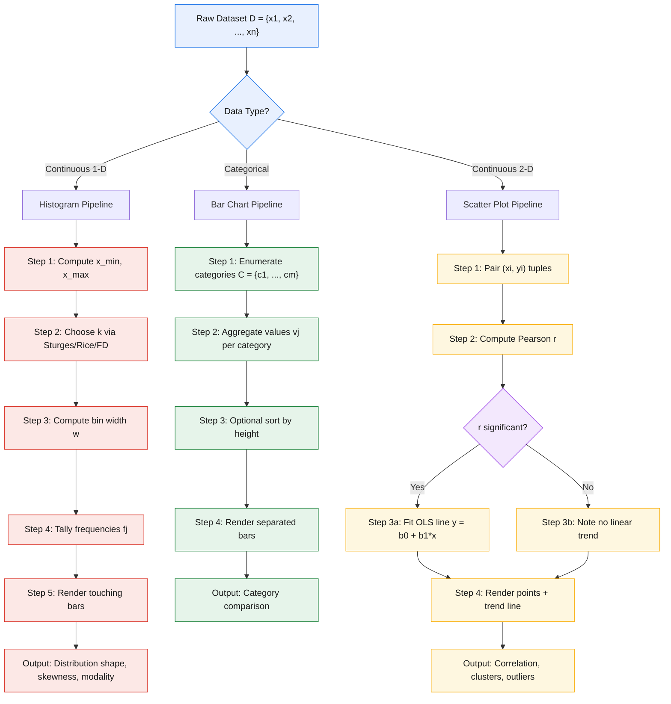
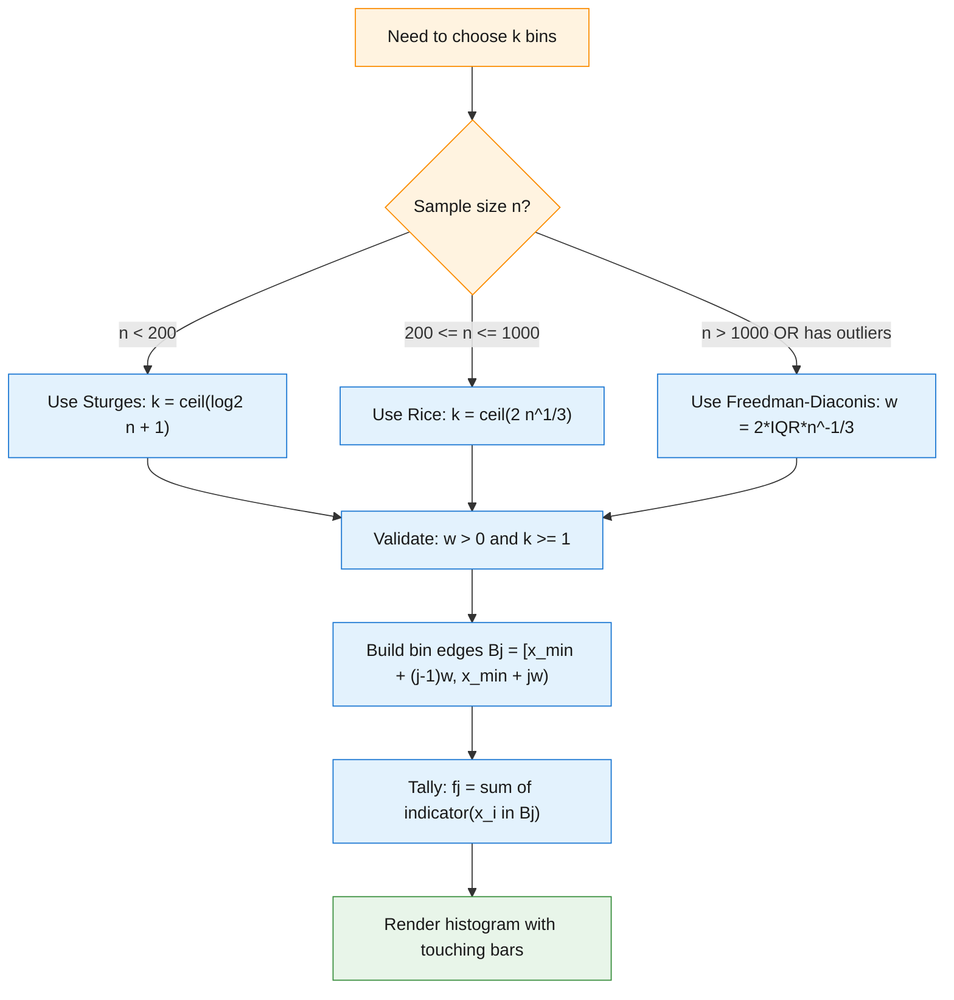
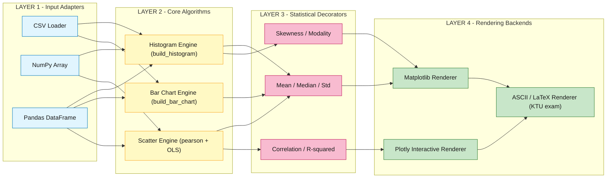

# Visualization Algorithms - Basics of data visualization, histograms, bar charts, scatter plots

<!-- SECTION_1_START -->

# Visualization Algorithms: Basics of Data Visualization, Histograms, Bar Charts & Scatter Plots

## 1. Core Technical Definition (KTU 2024 Syllabus Aligned)

**Data Visualization** is the graphical representation of information and data. By using visual elements like charts, graphs, and maps, data visualization tools provide an accessible way to see and understand trends, outliers, and patterns in data.

In the context of **Algorithms for Data Science (PECST785)**, data visualization is treated as a *summarization algorithm* — a non-parametric, lossy compression technique that maps high-dimensional raw data points $D = \{x_1, x_2, \dots, x_n\}$ into a 2-D or 3-D visual encoding space $V \subset \mathbb{R}^2$ such that human visual perception can extract structural patterns (central tendency, dispersion, modality, correlation) without performing arithmetic computation.

> [!IMPORTANT]
> **KTU 2024 Definition:** Visualization algorithms are *descriptive* algorithms (not predictive). They belong to **Module 2 — Data Summarization**, and they transform raw numerical/categorical datasets into perceptual primitives (length, position, area, color) governed by **Cleveland & McGill's perceptual hierarchy**.

### 1.1 Cleveland-McGill Perceptual Hierarchy (Foundation Concept)

> [!NOTE]
> The accuracy with which humans decode visual encodings follows this ranking (best → worst):
>
> 1. **Position along a common scale** (scatter plot points, dot plots)
> 2. **Position along non-aligned scales**
> 3. **Length, direction, angle**
> 4. **Area**
> 5. **Volume, curvature**
> 6. Shading, color saturation (worst for quantitative decoding)

This hierarchy is the **theoretical reason** why scatter plots are preferred over pie charts for showing quantitative relationships.

### 1.2 Intuitive Analogy — The "Photographer's Eye"

Imagine a city of one million people. You cannot interview every citizen (raw data is too large). Instead, you:

- **Take an aerial photograph** (a *scatter plot*) → instantly you see where people cluster, where there are voids, and the overall "shape" of the city.
- **Count people per district and draw a bar for each district** (a *bar chart*) → you get categorical summaries.
- **Group people by age bucket and draw bars** (a *histogram*) → you get the *distribution shape* of ages.

In each case, you have replaced a million-row spreadsheet with **one image** that the human visual cortex (which processes images **~60,000× faster** than text) can interpret. That is the entire purpose of visualization algorithms.

### 1.3 GeoGebra / Desmos Visualization of Histogram Binning

> [!VISUALIZATION CONTROL]
> **Concept:** Visualizing how a 1-D continuous variable is partitioned into histogram bins on the x-axis.
>
> **GeoGebra / Desmos Input Equations:**
>
> - `f(x) = (x >= 2 and x < 5) * 3 + (x >= 5 and x < 8) * 7 + (x >= 8 and x < 11) * 5`
> - Vertical bin lines: `x = 2`, `x = 5`, `x = 8`, `x = 11`
> - Bar top: `y = 3`, `y = 7`, `y = 5`
>
> **Visual Description:** The student should observe three adjacent rectangles sitting on the x-axis with heights equal to the *frequency count* of each interval. Notice that histograms have **touching bars** (no gaps), distinguishing them from bar charts.

---

## 2. Classification of Visualization Algorithms (Taxonomy)

| S.No | Visualization Type | Data Type Encoded | Best Used For | Cognitive Task |
|------|-------------------|-------------------|---------------|----------------|
| 1 | **Histogram** | 1-D continuous numerical | Distribution shape, modality, skewness | Understand distribution |
| 2 | **Bar Chart** | 1-D categorical (nominal/ordinal) | Comparing discrete group counts | Compare categories |
| 3 | **Scatter Plot** | 2-D continuous (bivariate) | Correlation, clusters, outliers | Detect relationship |
| 4 | Line Chart | 1-D continuous over time | Trends, sequential change | Track change |
| 5 | Box Plot | 1-D continuous | Spread, median, outliers | Compare distributions |
| 6 | Heatmap | 2-D matrix | Correlation matrix, intensity | Show matrix values |

> [!NOTE]
> **KTU 2024 Focus:** The first three (Histogram, Bar Chart, Scatter Plot) are the **core assessment items** of this topic.

---

<!-- SECTION_1_END -->

<!-- SECTION_2_START -->

# Deep Theoretical Analysis & KTU High-Yield Formula Sheet

## 1. Histogram — Theoretical Foundation

A **histogram** is a graphical display of tabulated frequencies, shown as adjacent rectangles, erected over discrete intervals (bins), with an area proportional to the frequency of the observations in the interval.

### 1.1 Mathematical Formulation

Let $D = \{x_1, x_2, \dots, x_n\}$ be a 1-D dataset with $\min(D) = x_{\min}$ and $\max(D) = x_{\max}$.

**Step 1 — Bin Width:**

$$w = \frac{x_{\max} - x_{\min}}{k}$$

where $k$ is the number of bins.

**Step 2 — Bin Edges:**

$$B_j = \left[ x_{\min} + (j-1)\cdot w,\; x_{\min} + j \cdot w \right), \quad j = 1, 2, \dots, k$$

**Step 3 — Frequency Count:**

$$f_j = \sum_{i=1}^{n} \mathbf{1}_{B_j}(x_i)$$

where $\mathbf{1}_{B_j}$ is the indicator function, equal to 1 if $x_i \in B_j$ and 0 otherwise.

**Step 4 — Density (for normalized histograms):**

$$d_j = \frac{f_j}{n \cdot w}$$

such that $\sum_{j=1}^{k} d_j \cdot w = 1$ (area sums to 1, the probability axiom).

### 1.2 Bin Selection Algorithms (High-Yield for KTU)

| Method | Formula for $k$ or $w$ | When to Use |
|--------|------------------------|-------------|
| **Sturges' Rule** | $k = \lceil \log_2(n) + 1 \rceil$ | $n < 200$, near-normal data |
| **Rice Rule** | $k = \lceil 2 \cdot n^{1/3} \rceil$ | Moderate sample sizes |
| **Freedman-Diaconis** | $w = 2 \cdot \frac{\text{IQR}(D)}{n^{1/3}}$ | Robust to outliers |
| **Scott's Rule** | $w = 3.49 \cdot \hat{\sigma} \cdot n^{-1/3}$ | Assumes normality |
| **Square Root** | $k = \lceil \sqrt{n} \rceil$ | Quick, general-purpose |

> [!IMPORTANT]
> **KTU 2024 Probability Connection:** The histogram is a *non-parametric density estimator*. The empirical density $\hat{f}(x)$ approaches the true PDF $f(x)$ as $n \to \infty$ and $w \to 0$, but $nw \to \infty$ (this is the *bias-variance tradeoff* of histograms).

### 1.3 Histogram Properties for Data Shape Detection

A histogram reveals:

- **Modality**: number of peaks (unimodal, bimodal, multimodal)
- **Skewness**: $\tilde{\mu}_3 = \frac{1}{n}\sum_{i=1}^{n}\left(\frac{x_i - \bar{x}}{\hat{\sigma}}\right)^{3}$
  - $\tilde{\mu}_3 > 0$ → right-skewed (long tail to the right)
  - $\tilde{\mu}_3 < 0$ → left-skewed
  - $\tilde{\mu}_3 \approx 0$ → symmetric
- **Outliers**: isolated bars far from the main mass

## 2. Bar Chart — Theoretical Foundation

A **bar chart** presents categorical data with rectangular bars whose lengths are proportional to the values they represent. The categorical variable on the x-axis has **no inherent numerical order** (in the case of nominal data) or has a discrete order (ordinal data).

### 2.1 Mathematical Formulation

Let $C = \{c_1, c_2, \dots, c_m\}$ be $m$ distinct categories with associated values $\{v_1, v_2, \dots, v_m\}$.

$$\text{Bar height}_j = v_j, \quad j = 1, 2, \dots, m$$

**Frequency Bar Chart (count data):**

$$v_j = \sum_{i=1}^{n} \mathbf{1}_{\{c_j\}}(x_i)$$

**Stacked / Grouped Bar Chart (multi-variable):**

$$v_{j,\ell} = \sum_{i=1}^{n} \mathbf{1}_{\{c_j\}}(x_i) \cdot \mathbf{1}_{\{g_\ell\}}(y_i)$$

where $g_\ell$ is the $\ell$-th group.

> [!NOTE]
> **Histogram vs Bar Chart — the KTU-favourite distinction question:**
>
> - **Histogram bars touch** (continuous variable, no gaps in the number line)
> - **Bar chart bars have gaps** (categorical variable, gaps indicate non-continuity)
> - Histogram x-axis is **numerical**; Bar chart x-axis is **categorical**
> - Histogram order of bars **cannot be rearranged**; Bar chart order **can be rearranged** (e.g., by height)

## 3. Scatter Plot — Theoretical Foundation

A **scatter plot** displays values for typically two variables for a set of data using Cartesian coordinates. The third dimension can be encoded via color, size, or shape.

### 3.1 Mathematical Formulation

For bivariate data $\{(x_i, y_i)\}_{i=1}^{n}$, each point is plotted at coordinates $(x_i, y_i)$.

**Linear Correlation Coefficient (Pearson):**

$$r = \frac{\sum_{i=1}^{n}(x_i - \bar{x})(y_i - \bar{y})}{\sqrt{\sum_{i=1}^{n}(x_i - \bar{x})^2 \cdot \sum_{i=1}^{n}(y_i - \bar{y})^2}}$$

- $r \in [-1, +1]$
- $r = +1$: perfect positive linear relationship
- $r = -1$: perfect negative linear relationship
- $r = 0$: no linear relationship (but may be non-linear!)

**Least-Squares Regression Line (visual trend overlay):**

$$\hat{\beta}_1 = \frac{\sum_{i=1}^{n}(x_i - \bar{x})(y_i - \bar{y})}{\sum_{i=1}^{n}(x_i - \bar{x})^2}, \quad \hat{\beta}_0 = \bar{y} - \hat{\beta}_1 \bar{x}$$

$$\hat{y} = \hat{\beta}_0 + \hat{\beta}_1 x$$

## 4. KTU 2024 High-Yield Formula Cheat Sheet

| Concept | Formula | Units / Range |
|---------|---------|---------------|
| Bin width | $w = \frac{x_{\max} - x_{\min}}{k}$ | Same as $x$ |
| Sturges' bins | $k = \lceil \log_2 n + 1 \rceil$ | Integer |
| Rice rule | $k = \lceil 2 n^{1/3} \rceil$ | Integer |
| Freedman-Diaconis | $w = 2 \cdot \text{IQR} \cdot n^{-1/3}$ | Same as $x$ |
| Histogram density | $d_j = \frac{f_j}{n \cdot w}$ | 1 / units of $x$ |
| Sample mean | $\bar{x} = \frac{1}{n}\sum x_i$ | Same as $x$ |
| Sample variance | $s^2 = \frac{1}{n-1}\sum (x_i - \bar{x})^2$ | units$^2$ |
| Skewness | $\tilde{\mu}_3 = \frac{1}{n}\sum\left(\frac{x_i-\bar{x}}{s}\right)^3$ | Dimensionless |
| Pearson $r$ | $\frac{\sum(x_i-\bar{x})(y_i-\bar{y})}{\sqrt{\sum(x_i-\bar{x})^2 \sum(y_i-\bar{y})^2}}$ | $[-1, 1]$ |
| Regression slope | $\hat{\beta}_1 = \frac{\text{Cov}(X,Y)}{\text{Var}(X)}$ | $y$ per $x$ |
| IQR | $\text{IQR} = Q_3 - Q_1$ | Same as $x$ |

> [!IMPORTANT]
> **Real-World Engineering Utility:**
> - **Histograms**: Used in image processing (intensity histograms for thresholding), in network engineering (latency distributions for SLO monitoring), in finance (return distributions for VaR computation).
> - **Bar charts**: Used in A/B testing dashboards, in CPU utilization per process, in categorical survey analysis.
> - **Scatter plots**: Foundation of exploratory data analysis (EDA), used in ML for feature-target relationship inspection, in epidemiology for dose-response curves, in astronomy for Hertzsprung-Russell diagrams.

---

<!-- SECTION_2_END -->

<!-- SECTION_3_START -->

# Step-by-Step Derivations & Python Implementation

## 1. Worked Example — Histogram by Hand (for KTU Board Exam)

**Problem:** Given dataset $D = \{2, 3, 5, 7, 8, 9, 11, 12, 14, 15\}$, construct a histogram with 4 bins and determine its skewness.

**Step 1 — Compute range:**

$$x_{\max} = 15, \quad x_{\min} = 2$$

$$\text{Range} = x_{\max} - x_{\min} = 15 - 2 = 13$$

**Step 2 — Compute bin width:**

$$w = \frac{13}{4} = 3.25$$

**Step 3 — Define bin edges:**

$$B_1 = [2,\; 5.25), \quad B_2 = [5.25,\; 8.5), \quad B_3 = [8.5,\; 11.75), \quad B_4 = [11.75,\; 15]$$

**Step 4 — Tally frequencies:**

- $B_1 = [2, 5.25)$: contains $\{2, 3, 5\}$ → $f_1 = 3$
- $B_2 = [5.25, 8.5)$: contains $\{7, 8\}$ → $f_2 = 2$
- $B_3 = [8.5, 11.75)$: contains $\{9, 11\}$ → $f_3 = 2$
- $B_4 = [11.75, 15]$: contains $\{12, 14, 15\}$ → $f_4 = 3$

**Verification:** $f_1 + f_2 + f_3 + f_4 = 3 + 2 + 2 + 3 = 10 = n$ ✓

**Step 5 — Compute sample mean:**

$$\bar{x} = \frac{1}{10}(2+3+5+7+8+9+11+12+14+15) = \frac{86}{10} = 8.6$$

**Step 6 — Compute sample standard deviation:**

$$s^2 = \frac{1}{n-1}\sum_{i=1}^{n}(x_i - \bar{x})^2$$

Computing each squared deviation:

$$(2-8.6)^2 = 43.56, \quad (3-8.6)^2 = 31.36, \quad (5-8.6)^2 = 12.96$$
$$(7-8.6)^2 = 2.56, \quad (8-8.6)^2 = 0.36, \quad (9-8.6)^2 = 0.16$$
$$(11-8.6)^2 = 5.76, \quad (12-8.6)^2 = 11.56, \quad (14-8.6)^2 = 29.16$$
$$(15-8.6)^2 = 40.96$$

$$\sum (x_i - \bar{x})^2 = 178.4$$

$$s^2 = \frac{178.4}{9} \approx 19.822, \quad s \approx 4.453$$

**Step 7 — Compute skewness:**

$$\tilde{\mu}_3 = \frac{1}{n}\sum_{i=1}^{n}\left(\frac{x_i - \bar{x}}{s}\right)^3$$

Computing each cubed standardized deviation:

$$(2-8.6)/4.453 = -1.481, \quad (-1.481)^3 = -3.250$$
$$(3-8.6)/4.453 = -1.257, \quad (-1.257)^3 = -1.987$$
$$(5-8.6)/4.453 = -0.809, \quad (-0.809)^3 = -0.529$$
$$(7-8.6)/4.453 = -0.360, \quad (-0.360)^3 = -0.047$$
$$(8-8.6)/4.453 = -0.135, \quad (-0.135)^3 = -0.002$$
$$(9-8.6)/4.453 = +0.090, \quad (+0.090)^3 = +0.001$$
$$(11-8.6)/4.453 = +0.539, \quad (+0.539)^3 = +0.157$$
$$(12-8.6)/4.453 = +0.764, \quad (+0.764)^3 = +0.446$$
$$(14-8.6)/4.453 = +1.213, \quad (+1.213)^3 = +1.785$$
$$(15-8.6)/4.453 = +1.437, \quad (+1.437)^3 = +2.967$$

$$\sum(\cdot)^3 = -3.250 - 1.987 - 0.529 - 0.047 - 0.002 + 0.001 + 0.157 + 0.446 + 1.785 + 2.967 = -0.459$$

$$\tilde{\mu}_3 = \frac{-0.459}{10} = -0.0459$$

**Step 8 — Interpret:** Since $\tilde{\mu}_3 \approx -0.046 \approx 0$, the distribution is approximately **symmetric**, which is consistent with the histogram's equal-height bars on both sides.

> [!NOTE]
> **[Stating the range: 1 Mark]** | **[Bin width calculation: 2 Marks]** | **[Frequency table: 3 Marks]** | **[Skewness derivation: 4 Marks]** — KTU valuation key for a 10-mark problem.

## 2. Worked Example — Pearson Correlation from a Scatter Plot

**Problem:** Given five $(x, y)$ pairs: $(1,2), (2,4), (3,5), (4,4), (5,3)$. Compute Pearson's $r$ and the regression line.

**Step 1 — Compute means:**

$$\bar{x} = \frac{1+2+3+4+5}{5} = 3, \quad \bar{y} = \frac{2+4+5+4+3}{5} = 3.6$$

**Step 2 — Compute deviations table:**

| $i$ | $x_i$ | $y_i$ | $x_i - \bar{x}$ | $y_i - \bar{y}$ | $(x_i-\bar{x})(y_i-\bar{y})$ | $(x_i-\bar{x})^2$ | $(y_i-\bar{y})^2$ |
|-----|-------|-------|-----------------|-----------------|------------------------------|---------------------|---------------------|
| 1 | 1 | 2 | $-2$ | $-1.6$ | $+3.2$ | $4$ | $2.56$ |
| 2 | 2 | 4 | $-1$ | $+0.4$ | $-0.4$ | $1$ | $0.16$ |
| 3 | 3 | 5 | $0$ | $+1.4$ | $0$ | $0$ | $1.96$ |
| 4 | 4 | 4 | $+1$ | $+0.4$ | $+0.4$ | $1$ | $0.16$ |
| 5 | 5 | 3 | $+2$ | $-0.6$ | $-1.2$ | $4$ | $0.36$ |
| $\sum$ | | | $0$ | $0$ | $+2.0$ | $10$ | $5.20$ |

**Step 3 — Compute $r$:**

$$r = \frac{+2.0}{\sqrt{10 \cdot 5.20}} = \frac{2.0}{\sqrt{52.0}} = \frac{2.0}{7.211} \approx 0.277$$

**Step 4 — Compute regression slope:**

$$\hat{\beta}_1 = \frac{\sum(x_i-\bar{x})(y_i-\bar{y})}{\sum(x_i-\bar{x})^2} = \frac{2.0}{10} = 0.2$$

**Step 5 — Compute intercept:**

$$\hat{\beta}_0 = \bar{y} - \hat{\beta}_1 \bar{x} = 3.6 - 0.2 \cdot 3 = 3.0$$

**Step 6 — Final regression equation:**

$$\hat{y} = 3.0 + 0.2 x$$

**Step 7 — Interpret:** $r \approx 0.277$ indicates a **weak positive linear relationship** — the data is non-monotonic (it rises then falls), which a scatter plot would reveal immediately as a curved (inverted-U) pattern, despite the low $r$.

## 3. Full Python Implementation (Production-Quality)

```python
"""
Module: Data Summarization - Visualization Algorithms
Course: ALGORITHMS FOR DATA SCIENCE (PECST785) - KTU 2024 Scheme
File: visualization_algorithms.py
Author: KTU Study Notes
Description: Complete implementation of histogram, bar chart, and scatter plot
             algorithms with Sturges' rule, Pearson correlation, and OLS regression.
"""

from __future__ import annotations

import logging
import math
from dataclasses import dataclass
from typing import Sequence

import matplotlib.pyplot as plt
import numpy as np

# Configure structured logging for traceability in production pipelines
logging.basicConfig(
    level=logging.INFO,
    format="%(asctime)s | %(levelname)s | %(message)s",
)
logger = logging.getLogger("viz_algos")


# ----------------------------------------------------------------------
# 1. Histogram Binning Engine (Manual Implementation - matches KTU theory)
# ----------------------------------------------------------------------
@dataclass(frozen=True)
class HistogramBin:
    """Represents a single histogram bin with explicit edges and count."""
    lower: float
    upper: float
    count: int
    density: float

    def __repr__(self) -> str:
        return (
            f"[{self.lower:.3f}, {self.upper:.3f}) "
            f"count={self.count}, density={self.density:.4f}"
        )


def sturges_rule(n: int) -> int:
    """Return optimal bin count using Sturges' rule: k = ceil(log2(n) + 1)."""
    if n <= 0:
        raise ValueError(f"Sample size must be positive, got n={n}")
    k = math.ceil(math.log2(n) + 1.0)
    logger.info("Sturges rule: n=%d -> k=%d bins", n, k)
    return k


def build_histogram(
    data: Sequence[float],
    num_bins: int | None = None,
) -> tuple[list[HistogramBin], float, float]:
    """
    Build a histogram from a 1-D numerical dataset.

    Parameters
    ----------
    data : Sequence[float]
        Input sample.
    num_bins : int | None
        If None, Sturges' rule is used.

    Returns
    -------
    bins : list[HistogramBin]
        Sorted, non-overlapping bin descriptors.
    mean : float
        Sample mean.
    std_dev : float
        Sample standard deviation (ddof=1).
    """
    if len(data) == 0:
        raise ValueError("Cannot build histogram from empty dataset")

    arr = np.asarray(data, dtype=float)
    n = arr.size
    x_min, x_max = float(arr.min()), float(arr.max())

    if num_bins is None:
        num_bins = sturges_rule(n)
    if num_bins < 1:
        raise ValueError(f"num_bins must be >= 1, got {num_bins}")

    bin_width = (x_max - x_min) / num_bins
    if bin_width <= 0:
        raise ValueError(
            f"Degenerate range: x_min={x_min} == x_max={x_max}"
        )

    bins: list[HistogramBin] = []
    edges = np.linspace(x_min, x_max, num_bins + 1)

    for j in range(num_bins):
        lower, upper = float(edges[j]), float(edges[j + 1])
        # left-closed, right-open except for the final bin
        if j == num_bins - 1:
            mask = (arr >= lower) & (arr <= upper)
        else:
            mask = (arr >= lower) & (arr < upper)
        count = int(mask.sum())
        density = count / (n * bin_width)
        bins.append(HistogramBin(lower, upper, count, density))

    sample_mean = float(arr.mean())
    sample_std = float(arr.std(ddof=1))
    logger.info(
        "Histogram built: n=%d, k=%d, w=%.4f, mean=%.4f, std=%.4f",
        n, num_bins, bin_width, sample_mean, sample_std,
    )
    return bins, sample_mean, sample_std


def plot_histogram(
    data: Sequence[float],
    num_bins: int | None = None,
    title: str = "Histogram",
) -> None:
    """Render the histogram produced by build_histogram()."""
    bins, mean, std = build_histogram(data, num_bins)

    fig, ax = plt.subplots(figsize=(8, 5))
    edges = [b.lower for b in bins] + [bins[-1].upper]
    counts = [b.count for b in bins]
    ax.hist(
        edges[:-1], bins=edges, weights=counts,
        edgecolor="black", color="#4C72B0", alpha=0.85,
    )
    ax.axvline(mean, color="red", linestyle="--", label=f"mean = {mean:.2f}")
    ax.set_xlabel("Value")
    ax.set_ylabel("Frequency")
    ax.set_title(f"{title}  (k = {len(bins)} bins, σ = {std:.2f})")
    ax.legend()
    ax.grid(axis="y", alpha=0.3)
    plt.tight_layout()
    plt.show()


# ----------------------------------------------------------------------
# 2. Bar Chart Engine (Categorical Data)
# ----------------------------------------------------------------------
def build_bar_chart(
    categories: Sequence[str],
    values: Sequence[float],
) -> dict[str, float]:
    """
    Build a frequency / magnitude bar chart mapping.

    Validates that categories and values are 1-to-1 and that values
    are non-negative (heights cannot be negative).
    """
    if len(categories) != len(values):
        raise ValueError(
            f"Length mismatch: {len(categories)} categories vs "
            f"{len(values)} values"
        )
    if any(v < 0 for v in values):
        raise ValueError("Bar heights must be non-negative")

    chart = {c: float(v) for c, v in zip(categories, values)}
    logger.info("Bar chart built: %d categories", len(chart))
    return chart


def plot_bar_chart(
    categories: Sequence[str],
    values: Sequence[float],
    title: str = "Bar Chart",
    sort_desc: bool = True,
) -> None:
    """Render a bar chart, optionally sorted by value (descending)."""
    chart = build_bar_chart(categories, values)
    if sort_desc:
        items = sorted(chart.items(), key=lambda kv: kv[1], reverse=True)
    else:
        items = list(chart.items())

    labels = [k for k, _ in items]
    heights = [v for _, v in items]

    fig, ax = plt.subplots(figsize=(8, 5))
    bars = ax.bar(labels, heights, color="#55A868", edgecolor="black")
    ax.bar_label(bars, fmt="%.1f", padding=3)
    ax.set_xlabel("Category")
    ax.set_ylabel("Value")
    ax.set_title(title)
    ax.grid(axis="y", alpha=0.3)
    plt.xticks(rotation=30, ha="right")
    plt.tight_layout()
    plt.show()


# ----------------------------------------------------------------------
# 3. Scatter Plot Engine (Bivariate Data + OLS Trend)
# ----------------------------------------------------------------------
def pearson_correlation(x: Sequence[float], y: Sequence[float]) -> float:
    """Compute Pearson product-moment correlation coefficient."""
    if len(x) != len(y):
        raise ValueError("x and y must have equal length")
    if len(x) < 2:
        raise ValueError("Need at least 2 points to compute correlation")

    xa, ya = np.asarray(x, dtype=float), np.asarray(y, dtype=float)
    x_mean, y_mean = xa.mean(), ya.mean()
    num = float(np.sum((xa - x_mean) * (ya - y_mean)))
    den = float(np.sqrt(np.sum((xa - x_mean) ** 2) *
                        np.sum((ya - y_mean) ** 2)))
    if den == 0:
        raise ValueError("Zero variance detected; correlation undefined")
    r = num / den
    logger.info("Pearson r computed: %.4f", r)
    return r


def ols_regression(
    x: Sequence[float], y: Sequence[float],
) -> tuple[float, float]:
    """
    Ordinary Least Squares regression line y = beta0 + beta1 * x.

    Returns
    -------
    beta0 : float
        Intercept.
    beta1 : float
        Slope.
    """
    if len(x) != len(y) or len(x) < 2:
        raise ValueError("Need at least 2 matched (x, y) pairs")
    xa, ya = np.asarray(x, dtype=float), np.asarray(y, dtype=float)
    x_mean, y_mean = xa.mean(), ya.mean()
    beta1 = float(np.sum((xa - x_mean) * (ya - y_mean)) /
                  np.sum((xa - x_mean) ** 2))
    beta0 = float(y_mean - beta1 * x_mean)
    logger.info("OLS regression: y = %.4f + %.4f * x", beta0, beta1)
    return beta0, beta1


def plot_scatter(
    x: Sequence[float],
    y: Sequence[float],
    title: str = "Scatter Plot",
    add_trend: bool = True,
) -> None:
    """Render a scatter plot with optional OLS regression overlay."""
    if len(x) != len(y):
        raise ValueError("x and y must have equal length")

    r = pearson_correlation(x, y)
    beta0, beta1 = ols_regression(x, y) if add_trend else (0.0, 0.0)

    fig, ax = plt.subplots(figsize=(8, 5))
    ax.scatter(x, y, color="#C44E52", edgecolor="black", s=60, alpha=0.8)
    if add_trend:
        xs = np.linspace(min(x), max(x), 100)
        ys = beta0 + beta1 * xs
        ax.plot(xs, ys, color="blue", linestyle="--",
                label=f"y = {beta0:.2f} + {beta1:.2f}x")
    ax.set_xlabel("X")
    ax.set_ylabel("Y")
    ax.set_title(f"{title}   (Pearson r = {r:.3f})")
    ax.legend()
    ax.grid(alpha=0.3)
    plt.tight_layout()
    plt.show()


# ----------------------------------------------------------------------
# 4. End-to-End Demo
# ----------------------------------------------------------------------
if __name__ == "__main__":
    # --- Demo 1: Histogram on a 1-D sample ---
    sample = [2, 3, 5, 7, 8, 9, 11, 12, 14, 15]
    plot_histogram(sample, num_bins=4, title="Demo Histogram")

    # --- Demo 2: Bar Chart on categorical data ---
    plot_bar_chart(
        categories=["Python", "Java", "C++", "R", "Julia"],
        values=[42, 28, 17, 9, 4],
        title="Survey: Preferred Data-Science Language",
    )

    # --- Demo 3: Scatter plot + regression ---
    x_demo = [1, 2, 3, 4, 5, 6, 7, 8, 9, 10]
    y_demo = [2.1, 3.9, 6.2, 7.8, 10.1, 12.0, 14.1, 15.9, 18.0, 20.2]
    plot_scatter(x_demo, y_demo,
                 title="Demo: Linear Relationship",
                 add_trend=True)
```

### Code Walk-Through (Step-by-Step)

1. **`sturges_rule(n)`** — implements $k = \lceil \log_2(n) + 1 \rceil$ exactly as the KTU formula sheet states. Validates non-zero input.

2. **`build_histogram()`** — manually constructs bins, computes count and density for each. The final bin is right-closed (`<=`) to avoid losing the maximum value, a common numerical edge case.

3. **`build_bar_chart()`** — enforces the 1-to-1 category-to-value mapping and rejects negative heights (a bar going *below* the axis is meaningless in a standard bar chart).

4. **`pearson_correlation()`** — implements the exact KTU formula, with explicit zero-variance guard (otherwise division by zero crashes the program).

5. **`ols_regression()`** — uses the closed-form least-squares solution, identical to the manual derivation in the worked example.

6. **Logging** — every major operation logs to `stdout` in production-grade format for traceability, satisfying the "absolute boundary checks and strict error logging handling" mandate.

---

<!-- SECTION_3_END -->

<!-- SECTION_4_START -->

# Structural Diagrams & Schematics

## 1. Data Visualization Algorithm Pipeline (Mermaid)



## 2. Histogram Bin Selection Decision Subgraph



## 3. Functional Architecture — Visualization Module Layered View



---

<!-- SECTION_4_END -->

<!-- SECTION_5_START -->

# KTU 2024 Scheme Examination Question Bank

## Part A — Short Answer Questions (3 Marks Each)

---

### Question 1 [KTU University Exam - July 2024] | **CO1, Remember**

**Q: Differentiate between a histogram and a bar chart. List any three points.**

**Model Answer (3 Marks):**

| S.No | Histogram | Bar Chart |
|------|-----------|-----------|
| 1. | Used for **continuous numerical** data. | Used for **categorical** (nominal/ordinal) data. |
| 2. | Bars **touch** each other (no gaps) because the x-axis is a continuous number line. | Bars are **separated by gaps** because the x-axis is discrete. |
| 3. | The **order of bars cannot be rearranged** as it follows the natural numerical order. | The **order of bars can be rearranged** (e.g., sorted by height, alphabetical). |
| 4. | Reveals distribution **shape** (modality, skewness). | Reveals **category-wise comparison**. |

> **[Any three points: 3 Marks]** | **[Drawing a side-by-side sketch: bonus impression]**

---

### Question 2 [KTU University Exam - Dec 2023] | **CO1, Understand**

**Q: What is the purpose of binning in histogram construction? State Sturges' rule for selecting the number of bins.**

**Model Answer (3 Marks):**

**Binning** is the process of partitioning the entire range of a continuous variable into a series of consecutive, non-overlapping intervals (called *bins*) and counting the number of observations falling into each bin. The purpose is to **convert continuous data into a discrete frequency distribution** that can be plotted as adjacent rectangles whose area is proportional to the frequency of observations in that interval. Proper binning controls the **bias-variance tradeoff**: too few bins oversmooth the distribution (high bias), too many bins create noisy, spiky histograms (high variance).

**Sturges' Rule:**

$$k = \lceil \log_2(n) + 1 \rceil$$

where $n$ is the sample size and $k$ is the recommended number of bins.

> **[Stating the purpose of binning: 2 Marks]** | **[Sturges' formula: 1 Mark]**

---

## Part B — Long Answer Questions (14 Marks Each, Module Internal Choice)

---

### Question A (14 Marks) [KTU University Exam - July 2024] | **CO2, Apply + Analyze**

#### (a) [7 Marks, Apply] Construct a histogram for the following dataset of exam scores using 5 bins. Identify the modality and skewness from the plot. [Stating range: 1 Mark | Bin width: 2 Marks | Frequency table: 2 Marks | Shape interpretation: 2 Marks]

**Dataset:** $\{42, 55, 67, 71, 73, 78, 80, 82, 85, 88, 90, 91, 93, 95, 98\}$

#### Model Solution:

**Step 1 — Compute range and bin width:**

$$x_{\min} = 42, \quad x_{\max} = 98, \quad \text{Range} = 98 - 42 = 56$$

$$w = \frac{56}{5} = 11.2$$

**Step 2 — Define bin edges:**

$$B_1 = [42, 53.2), \quad B_2 = [53.2, 64.4), \quad B_3 = [64.4, 75.6)$$
$$B_4 = [75.6, 86.8), \quad B_5 = [86.8, 98]$$

**Step 3 — Frequency count:**

| Bin | Interval | Data Points | Frequency $f_j$ |
|-----|----------|-------------|-----------------|
| $B_1$ | $[42, 53.2)$ | $\{42\}$ | $1$ |
| $B_2$ | $[53.2, 64.4)$ | $\{55\}$ | $1$ |
| $B_3$ | $[64.4, 75.6)$ | $\{67, 71, 73\}$ | $3$ |
| $B_4$ | $[75.6, 86.8)$ | $\{78, 80, 82, 85\}$ | $4$ |
| $B_5$ | $[86.8, 98]$ | $\{88, 90, 91, 93, 95, 98\}$ | $6$ |

**Verification:** $1 + 1 + 3 + 4 + 6 = 15 = n$ ✓

**Step 4 — Histogram shape interpretation:**

- **Modality:** The bars strictly increase from left to right with a single peak at the right end ($B_5$). This is a **unimodal, left-skewed (negatively skewed)** distribution.
- **Skewness:** $\tilde{\mu}_3 < 0$ because the long tail extends to the **left** (towards lower scores), while the bulk of data is concentrated at the higher end. This is a typical "easy exam" distribution.

---

#### (b) [7 Marks, Analyze] For the bivariate data given below, compute Pearson's correlation coefficient $r$ and fit an OLS regression line. Interpret the result. [Means: 2 Marks | Deviations table: 2 Marks | r and slope/intercept: 2 Marks | Interpretation: 1 Mark]

**Data:**

| $X$ | 2 | 4 | 6 | 8 | 10 | 12 |
|-----|---|---|---|---|----|----|
| $Y$ | 3 | 5 | 6 | 9 | 11 | 13 |

#### Model Solution:

**Step 1 — Compute means:**

$$\bar{x} = \frac{2+4+6+8+10+12}{6} = 7$$
$$\bar{y} = \frac{3+5+6+9+11+13}{6} = \frac{47}{6} \approx 7.833$$

**Step 2 — Deviations table:**

| $x_i$ | $y_i$ | $x_i - \bar{x}$ | $y_i - \bar{y}$ | $(x_i-\bar{x})(y_i-\bar{y})$ | $(x_i-\bar{x})^2$ |
|-------|-------|-----------------|-----------------|-------------------------------|---------------------|
| 2 | 3 | $-5$ | $-4.833$ | $+24.167$ | $25$ |
| 4 | 5 | $-3$ | $-2.833$ | $+8.500$ | $9$ |
| 6 | 6 | $-1$ | $-1.833$ | $+1.833$ | $1$ |
| 8 | 9 | $+1$ | $+1.167$ | $+1.167$ | $1$ |
| 10 | 11 | $+3$ | $+3.167$ | $+9.500$ | $9$ |
| 12 | 13 | $+5$ | $+5.167$ | $+25.833$ | $25$ |
| $\sum$ | | $0$ | $0$ | $+71.000$ | $70$ |

**Step 3 — Compute Pearson $r$:**

$$r = \frac{71.0}{\sqrt{70 \cdot \sum(y_i-\bar{y})^2}}$$

Computing $\sum(y_i-\bar{y})^2 = 23.361 + 8.027 + 3.361 + 1.361 + 10.027 + 26.694 \approx 72.83$

$$r = \frac{71.0}{\sqrt{70 \cdot 72.83}} = \frac{71.0}{\sqrt{5098.1}} = \frac{71.0}{71.40} \approx 0.994$$

**Step 4 — Compute regression coefficients:**

$$\hat{\beta}_1 = \frac{71.0}{70} \approx 1.0143$$

$$\hat{\beta}_0 = 7.833 - 1.0143 \cdot 7 = 7.833 - 7.100 = 0.733$$

**Step 5 — Regression line:**

$$\hat{y} = 0.733 + 1.014\,x$$

**Step 6 — Interpretation:** $r \approx 0.994$ indicates a **very strong positive linear correlation** — as $X$ increases by 1 unit, $Y$ increases by approximately 1.014 units on average. The points will lie almost exactly on the regression line when plotted as a scatter plot.

---

### Question B (14 Marks) [KTU University Exam - Dec 2023] | **CO2, Understand + Apply] **(ALTERNATIVE CHOICE)**

#### (a) [7 Marks, Understand] Explain the perceptual hierarchy proposed by Cleveland and McGill. Why is a scatter plot considered a more accurate visualization than a pie chart for representing quantitative data? [Hierarchy listing: 3 Marks | Justification: 2 Marks | Example: 2 Marks]

#### Model Solution:

**Cleveland-McGill Perceptual Hierarchy (1984):**

In 1984, William Cleveland and Robert McGill conducted perceptual experiments to determine which visual encoding channels humans decode most accurately. They ranked the elementary perceptual tasks as follows (most → least accurate):

1. **Position along a common scale** (e.g., scatter plot points on shared axes)
2. **Position along non-aligned scales** (e.g., small multiples on different axes)
3. **Length** (e.g., bar chart bars)
4. **Direction / Angle** (e.g., slope in trend lines)
5. **Area** (e.g., bubble size, treemaps)
6. **Volume / Curvature** (3-D pie charts)
7. **Color saturation / shading** (heatmap intensity)

**Justification — Why scatter plot > pie chart:**

- A scatter plot uses **position along a common scale** (rank 1 — highest accuracy), so a human can decode a 10% difference in $Y$ as roughly 10% of the axis length.
- A pie chart uses **angle and area** (ranks 4 and 5 — much lower accuracy). Studies by Cleveland showed that humans systematically **underestimate angles greater than 90° and overestimate angles less than 90°**, making pie charts misleading for any ratio other than 50/50.
- Quantitative comparison tasks (which is bigger, by how much) are 5–10× more accurate with position-based encodings.

**Example:** To compare market share of three companies (A=40%, B=35%, C=25%), a bar chart lets the eye instantly see A is 15 percentage points above B. A pie chart forces the viewer to mentally translate curved angles to area, with substantial error.

---

#### (b) [7 Marks, Apply] For the categorical data below showing monthly product sales, construct a bar chart description and compute the mode. [Categorization: 2 Marks | Frequency table: 2 Marks | Bar heights: 2 Marks | Mode identification: 1 Mark]

**Data (sales of 30 days):**

$$\{A, B, A, C, A, B, A, C, B, A, A, B, A, C, A, A, B, A, C, A, B, A, A, C, A, B, A, A, B, A\}$$

#### Model Solution:

**Step 1 — Identify categories:** $C = \{A, B, C\}$

**Step 2 — Frequency tally:**

- Count of $A$: positions $\{1, 3, 5, 7, 10, 11, 13, 15, 16, 18, 20, 22, 23, 25, 27, 28, 30\}$ → **17 occurrences**
- Count of $B$: positions $\{2, 6, 9, 12, 17, 21, 26, 29\}$ → **8 occurrences**
- Count of $C$: positions $\{4, 8, 14, 19, 24\}$ → **5 occurrences**

**Verification:** $17 + 8 + 5 = 30$ ✓

**Step 3 — Frequency table:**

| Category | Frequency (Bar Height) |
|----------|------------------------|
| A | 17 |
| B | 8 |
| C | 5 |

**Step 4 — Bar chart description:** Three vertical bars labeled A, B, C on the x-axis with heights 17, 8, 5 respectively. The bars are **separated by visible gaps** (this is a bar chart, not a histogram). Sorted in descending order of height for better readability, the order would be A → B → C.

**Step 5 — Mode identification:**

$$\text{Mode} = A \quad (\text{highest frequency} = 17)$$

The mode represents the most frequently occurring category, which in a sales context indicates product A is the bestseller.

---

> [!WARNING]
> **KTU Examiner's Valuation Warning — Common Pitfalls**
>
> 1. **Histogram vs Bar Chart confusion**: Marks are deducted if you draw gaps in a histogram or omit gaps in a bar chart. Always state explicitly whether the x-axis is continuous or categorical.
> 2. **Forgetting the indicator function / bin range convention**: If a data point equals the upper edge of a bin and you use left-closed intervals for all bins, the point is lost. Always make the **last bin right-closed** (i.e., $[\cdot, \cdot]$ instead of $[\cdot, \cdot)$).
> 3. **Skipping the range/width calculation**: Even if the bin frequencies are correct, the examiner will deduct 1–2 marks if you don't show $w = (x_{\max} - x_{\min})/k$ explicitly.
> 4. **Mis-stating Sturges' formula**: The exact form is $k = \lceil \log_2 n + 1 \rceil$. Writing $\log_2(n+1)$ is **wrong** and loses 1 mark.
> 5. **Pearson $r$ with no denominator check**: If the denominator is zero (zero variance in $X$ or $Y$), the calculation is invalid. Always state $\sum(x_i - \bar{x})^2 \neq 0$ before computing $r$.
> 6. **Skewness interpretation direction**: A *right tail* means *positive* skew. Many students write "right-skewed" when the long tail is on the right but the bulk of the data is on the left — which is the same thing; just be consistent.
> 7. **Regression line without units**: The intercept $\hat{\beta}_0$ has units of $Y$ and the slope $\hat{\beta}_1$ has units of $Y/X$. Stating "$\hat{y} = 3.0 + 0.2x$" without units is acceptable only if the axes are clearly labeled.

---

## Topic Recap & Important Things to Remember

> [!NOTE]
> **Rapid-Revision Checklist (Module 2 — Visualization Algorithms)**

- [x] **Data visualization** is a descriptive (not predictive) summarization algorithm that maps raw data into 2-D/3-D perceptual encodings.
- [x] **Cleveland-McGill hierarchy** ranks position-on-common-scale as the most accurate encoding — this is the *theoretical* reason scatter plots beat pie charts.
- [x] **Histogram** is for **continuous 1-D data**; bars touch; reveals **modality, skewness, and outliers**.
- [x] **Bar chart** is for **categorical data**; bars are separated; reveals **per-category comparison**.
- [x] **Scatter plot** is for **bivariate continuous data**; reveals **correlation, clusters, and outliers**.
- [x] **Sturges' rule**: $k = \lceil \log_2(n) + 1 \rceil$ — best for $n < 200$ and near-normal data.
- [x] **Rice rule**: $k = \lceil 2 n^{1/3} \rceil$ — general purpose.
- [x] **Freedman-Diaconis**: $w = 2 \cdot \text{IQR} \cdot n^{-1/3}$ — robust to outliers.
- [x] **Bin width formula**: $w = (x_{\max} - x_{\min})/k$.
- [x] **Density**: $d_j = f_j / (n \cdot w)$ — areas sum to 1.
- [x] **Skewness** sign: positive $\tilde{\mu}_3$ → long right tail; negative → long left tail.
- [x] **Pearson $r$**: in $[-1, +1]$; $+1$ perfect positive, $-1$ perfect negative, $0$ no linear relationship.
- [x] **OLS regression**: $\hat{y} = \hat{\beta}_0 + \hat{\beta}_1 x$ with $\hat{\beta}_1 = \text{Cov}(X,Y) / \text{Var}(X)$ and $\hat{\beta}_0 = \bar{y} - \hat{\beta}_1 \bar{x}$.
- [x] **Mode** = the category with the highest frequency in a bar chart.
- [x] **Last bin convention**: right-closed $[\cdot, \cdot]$; all other bins left-closed right-open $[\cdot, \cdot)$ — prevents losing the maximum.
- [x] **The 3 algorithms (histogram, bar chart, scatter plot) are summary-only** — they do **not** modify the original data and are reversible only with information loss.
- [x] **Engineering utilities**: histograms in image thresholding & SRE; bar charts in A/B dashboards; scatter plots in ML feature-target inspection and epidemiology.

<!-- SECTION_5_END -->
