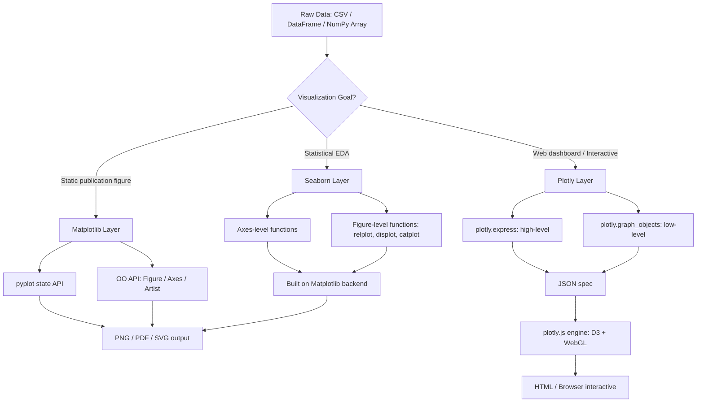
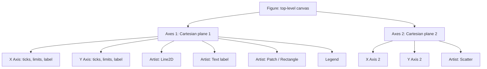
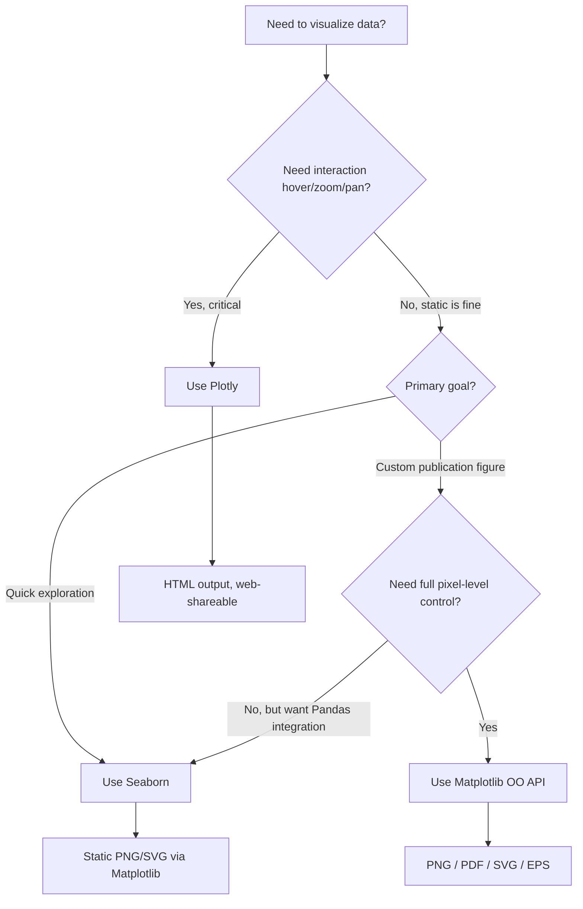
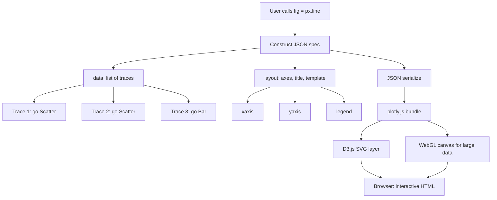
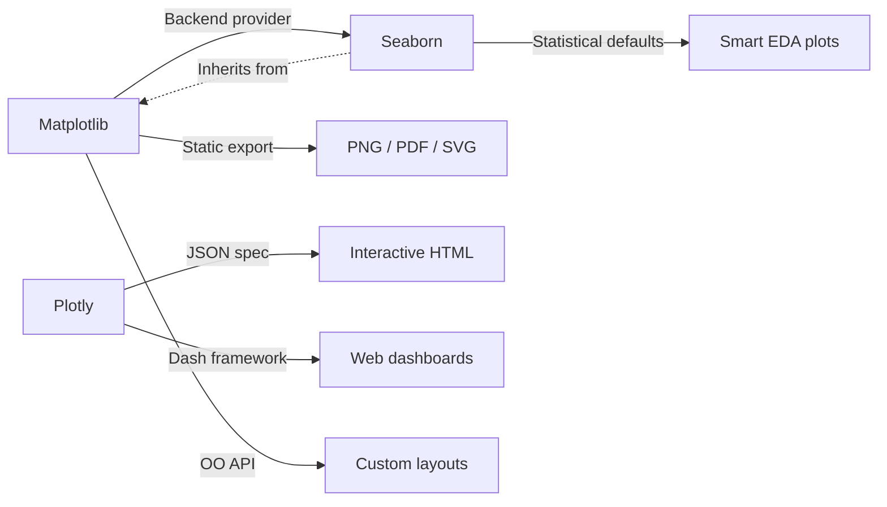

# Visualization tools and libraries - Matplotlib, Seaborn, Plotly

<!-- SECTION_1_START -->

# Visualization Tools and Libraries — Matplotlib, Seaborn, Plotly

## 1. Core Technical Definition & Intuitive Overview

### 1.1 Formal KTU 2024 Definition

> [!IMPORTANT]
> **Data Visualization Tools & Libraries** are software frameworks that translate raw, multi-dimensional datasets into graphical primitives (points, lines, bars, heatmaps, contours, 3D surfaces) using declarative or imperative APIs. In the KTU 2024 syllabus (Module 2 — Data Summarization), the three canonical Python libraries are **Matplotlib** (low-level imperative 2D/3D engine), **Seaborn** (high-level statistical grammar on top of Matplotlib), and **Plotly** (declarative, browser-based interactive visualization).

**Matplotlib** is the foundational, **state-based** (state-machine) plotting library originally written by *John D. Hunter* in **2003**. It exposes two interfaces: the legacy `pyplot` (MATLAB-style) and the modern **object-oriented** `Figure`/`Axes` API.

**Seaborn** is a higher-level statistical visualization library built directly **on top of Matplotlib**. It provides a **dataset-oriented API** and integrates tightly with **Pandas DataFrames**. Released by *Michael Waskom* in **2012**, it adds automatic estimation of KDE (Kernel Density Estimation), aggregation, and aesthetically-tuned default themes.

**Plotly** is a declarative, JSON-based interactive plotting library whose Python wrapper (`plotly.py`) produces **HTML/SVG/WebGL** outputs natively viewable in browsers and Jupyter. The high-level `plotly.express` module and the low-level `plotly.graph_objects` module together form the **Plotly ecosystem**, with built-in support for hover, zoom, pan, and animation.

### 1.2 Conceptual Analogy / Intuition

> [!NOTE]
> **Analogy — The Photography Studio:**
> - **Matplotlib** is the **manual SLR camera**: full control over shutter, aperture, ISO, focus. Powerful but verbose. You build every photo (axes, ticks, labels) yourself.
> - **Seaborn** is the **studio preset package**: pre-configured lighting, color filters, and backdrops optimized for **portraits (statistical data)**. You pick the style, it handles the rest.
> - **Plotly** is the **smartphone camera with a live preview link**: the photo is **interactive** — others can pinch, zoom, hover, and share via a web URL. It trades some low-level control for built-in interactivity.

### 1.3 Key Performance & Standard Metrics (KTU High-Yield)

| Metric | Matplotlib | Seaborn | Plotly |
|---|---|---|---|
| **First Release** | **2003** | **2012** | **2013** |
| **Backend** | Agg, TkAgg, Qt5Agg | Matplotlib backend | Browser (D3.js + WebGL) |
| **Default Output** | PNG, PDF, SVG (static) | Static (extends Matplotlib) | HTML (interactive) |
| **Interactivity** | Limited (widgets) | Limited | **Native (built-in)** |
| **API Paradigm** | Imperative / OO | Declarative-on-Matplotlib | Declarative / JSON |
| **Rendering Speed (1M pts)** | Fast (Agg backend) | Moderate | Moderate-Slow (WebGL fast) |
| **Standard Install** | `pip install matplotlib` | `pip install seaborn` | `pip install plotly` |

### 1.4 GeoGebra / Desmos Integration

> [!VISUALIZATION CONTROL]
> **Concept:** Sinusoidal function annotated with two annotation arrows — illustrating the concept of layered annotation (text, arrows, axvline) used by Matplotlib's `ax.annotate()`.
>
> **GeoGebra / Desmos Input Equations:**
> * `f(x) = sin(x)` for $x \in [0, 2\pi]$
> * `g(x) = 0` (the x-axis baseline)
> * Point $A = (\pi/2, 1)$ with annotation "Local Max"
> * Point $B = (3\pi/2, -1)$ with annotation "Local Min"
>
> **Visual Description:** Observe the smooth wave, the dashed reference at $y=0$, and the text callouts anchored to specific data points — this mimics exactly what `ax.annotate("text", xy=(x, y), xytext=(dx, dy), arrowprops=dict(arrowstyle="->"))` produces inside a Matplotlib Axes object.

---

<!-- SECTION_1_END -->

<!-- SECTION_2_START -->

# 2. Deep Theoretical Analysis & KTU High-Yield Formula Sheet

## 2.1 The Three-Tier Architecture of Python Visualization

The three libraries occupy **distinct abstraction layers** over the same goal — mapping $f: \mathbb{R}^{n} \to \mathbb{R}^{2}$ or $\mathbb{R}^{3}$:

| Layer | Library | Mental Model | Output Contract |
|---|---|---|---|
| **Low (Foundational)** | Matplotlib | Pixel-by-pixel artist | Static raster/vector |
| **Mid (Statistical DSL)** | Seaborn | "Tell me your DataFrame column" | Static + smart defaults |
| **High (Interactive)** | Plotly | "Describe the plot as JSON, I render it" | Interactive HTML |

## 2.2 Matplotlib — Anatomy of a Figure (Hierarchical Breakdown)

A Matplotlib figure follows a strict **tree hierarchy**:

```
Figure (the canvas)
└── Axes (the coordinate system; a figure can have many)
    ├── Axis (x-axis, y-axis; tick marks, labels, limits)
    ├── Artist (everything visible: Line2D, Text, Patch, Polygon)
    └── Legend, Title, Colorbar
```

- **Figure**: top-level container (`fig = plt.figure(figsize=(10,6))`).
- **Axes**: actual plotting region (one Cartesian plane).
- **Axis**: number line objects controlling ticks and limits.
- **Artist**: the visible primitives (lines, text, rectangles).

### 2.2.1 The Two APIs

| API | Style | Recommended Use |
|---|---|---|
| `matplotlib.pyplot` (`plt`) | State-based (implicit current figure) | Quick interactive scripts |
| Object-Oriented (`fig, ax = plt.subplots()`) | Explicit references | Production code, subplots |

> [!NOTE]
> **KTU Exam Tip:** Board examiners consistently reward the **OO API** (`fig, ax = plt.subplots()`) over `plt.plot()` directly, because it scales to subplots and complex layouts. Always default to the OO API in Part B answers.

## 2.3 Seaborn — The Statistical Grammar

Seaborn introduces three core abstractions:
1. **Figure-level** functions: `sns.displot()`, `sns.relplot()`, `sns.catplot()` — return a `FacetGrid`.
2. **Axes-level** functions: `sns.histplot()`, `sns.boxplot()`, `sns.heatmap()` — draw onto a single Axes.
3. **Theme management**: `sns.set_theme(style="whitegrid", palette="deep")`.

**Two key statistical engines inside Seaborn:**
- **KDE (Kernel Density Estimation):** smooth estimate of a probability density:

$$
\hat{f}_h(x) = \frac{1}{n h} \sum_{i=1}^{n} K\!\left(\frac{x - x_i}{h}\right)
$$

  where $K$ is a kernel (default Gaussian) and $h$ is the **bandwidth**. Seaborn uses SciPy's `gaussian_kde` under the hood.
- **Automatic aggregation:** functions like `sns.barplot(x, y, data=df, estimator=np.mean)` compute group statistics on the fly.

## 2.4 Plotly — The JSON Trace Graph

Every Plotly figure is a **JSON tree** of the form:

```json
{
  "data":   [ {"type": "scatter", "x": [...], "y": [...], "mode": "lines+markers"} ],
  "layout": { "title": "...", "xaxis": {...}, "yaxis": {...} }
}
```

Two wrappers:
- **`plotly.express` (px)**: high-level, one-function-per-chart-type. Returns a `Figure`.
- **`plotly.graph_objects` (go)**: low-level, explicit `Scatter`, `Bar`, `Heatmap` traces. Best for fine control.

**The rendering chain:**

```
Python Figure  →  plotly.js (D3 + WebGL)  →  SVG/Canvas in browser
```

This is why Plotly outputs are **interactive by default** — the JavaScript bundle ships with the HTML.

## 2.5 KTU Formula Sheet / Cheat Sheet

| Concept | Matplotlib | Seaborn | Plotly |
|---|---|---|---|
| **Import** | `import matplotlib.pyplot as plt` | `import seaborn as sns` | `import plotly.express as px` |
| **Create Figure** | `fig, ax = plt.subplots(nrows, ncols)` | Uses `FacetGrid` internally | `fig = px.line(df, x, y)` |
| **Line Plot** | `ax.plot(x, y, color, linestyle)` | `sns.lineplot(data=df, x, y)` | `px.line(df, x, y)` or `go.Scatter(mode='lines')` |
| **Scatter** | `ax.scatter(x, y, s, c, alpha)` | `sns.scatterplot(data=df, x, y, hue, size)` | `px.scatter(df, x, y, color, size, hover_data)` |
| **Histogram** | `ax.hist(x, bins, density)` | `sns.histplot(data=df, x, bins, kde=True)` | `px.histogram(df, x, nbins)` |
| **Heatmap** | `ax.imshow(M, cmap='viridis')` | `sns.heatmap(M, annot=True, cmap='coolwarm')` | `px.imshow(M, color_continuous_scale='Viridis')` |
| **Save** | `fig.savefig("p.png", dpi=300)` | via underlying `fig` | `fig.write_html("p.html")`, `fig.write_image("p.png")` |
| **Show** | `plt.show()` | `plt.show()` | `fig.show()` (renders in notebook) |
| **Subplot** | `plt.subplots(2,2)` + indexing | `FacetGrid(col, row)` | `plotly.subplots.make_subplots(rows, cols)` |
| **Color Palette** | `cmap='plasma'` | `palette='Set2'` | `color_discrete_sequence=px.colors.qualitative.Bold` |

### 2.5.1 Critical Encoding Formulas

For a categorical variable with $k$ unique levels, Seaborn/Plotly assigns colors using a deterministic hash:

$$
\text{color}(c_i) = \text{palette}\!\left[ \, \text{hash}(c_i) \bmod k \, \right]
$$

For continuous colormaps (e.g., `viridis`), the mapping is linear in normalized space:

$$
\text{RGB}(v) = \text{lookup}\!\left( \frac{v - v_{\min}}{v_{\max} - v_{\min}} \right)
$$

### 2.6 Real-World Engineering Utility

> [!NOTE]
> - **Matplotlib** is the **publishing standard** in scientific journals (Nature, IEEE). Used in scientific simulation pipelines (CFD, FEM post-processing).
> - **Seaborn** dominates **exploratory data analysis (EDA)** in data science workflows — Kaggle notebooks, statistical consulting.
> - **Plotly** is the **dashboard standard** for web-deployed analytics (Dash framework, Streamlit integration, financial trading dashboards) where end-users must *interact* with charts.

---

<!-- SECTION_2_END -->

<!-- SECTION_3_START -->

# 3. Step-by-Step Derivations & Code/Symbolic Implementation

## 3.1 Matplotlib — Full Working Pipeline

### 3.1.1 Line + Scatter with Annotations (OO API)

```python
import matplotlib.pyplot as plt
import numpy as np
from typing import Tuple

def demo_matplotlib_line_scatter() -> Tuple[plt.Figure, plt.Axes]:
    """
    KTU Demo: Build a 2-panel figure (line + scatter) with annotations.
    Uses the Object-Oriented API (recommended for production code).
    """
    # Step 1: Generate synthetic time-series data
    t: np.ndarray = np.linspace(0, 2 * np.pi, 200)
    y_clean: np.ndarray = np.sin(t)
    y_noisy: np.ndarray = y_clean + np.random.default_rng(seed=42).normal(0, 0.15, size=t.shape)

    # Step 2: Create the Figure and a 1x2 grid of Axes
    fig, axes = plt.subplots(nrows=1, ncols=2, figsize=(12, 4.5), dpi=100)

    # Step 3: LEFT panel — clean sine curve with peak annotation
    ax_left = axes[0]
    ax_left.plot(t, y_clean, color="#1f77b4", linewidth=2.0, label="sin(t)")
    ax_left.axhline(y=0, color="black", linewidth=0.8, linestyle="--")
    ax_left.set_title("Clean Sinusoid")
    ax_left.set_xlabel("t (radians)")
    ax_left.set_ylabel("Amplitude")
    ax_left.grid(True, alpha=0.3)
    ax_left.legend(loc="upper right")

    # Annotate the maximum at t = pi/2
    idx_max: int = int(np.argmax(y_clean))
    ax_left.annotate(
        text="Local Max",
        xy=(t[idx_max], y_clean[idx_max]),          # arrow tip
        xytext=(t[idx_max] + 0.6, y_clean[idx_max] - 0.4),  # text anchor
        arrowprops=dict(arrowstyle="->", color="red", lw=1.5),
        fontsize=10, color="darkred",
    )

    # Step 4: RIGHT panel — noisy scatter + smoothed line
    ax_right = axes[1]
    ax_right.scatter(t, y_noisy, s=10, color="gray", alpha=0.6, label="Noisy samples")
    # Rolling mean for visual smoothing
    window: int = 15
    smooth: np.ndarray = np.convolve(y_noisy, np.ones(window)/window, mode="valid")
    ax_right.plot(t[window-1:], smooth, color="crimson", linewidth=2.0, label="Rolling mean")
    ax_right.set_title("Noisy Sinusoid with Smoothing")
    ax_right.set_xlabel("t (radians)")
    ax_right.set_ylabel("Amplitude")
    ax_right.grid(True, alpha=0.3)
    ax_right.legend(loc="upper right")

    # Step 5: Global title and tight layout
    fig.suptitle("Matplotlib OO API — Line + Scatter Demo", fontsize=14, fontweight="bold")
    fig.tight_layout()
    return fig, axes

# Execution
if __name__ == "__main__":
    fig, _ = demo_matplotlib_line_scatter()
    fig.savefig("matplotlib_demo.png", dpi=300, bbox_inches="tight")
    plt.show()
```

### 3.1.2 2D Heatmap from a Matrix

```python
import matplotlib.pyplot as plt
import numpy as np

def demo_matplotlib_heatmap() -> plt.Axes:
    """
    KTU Demo: Render a 2D correlation matrix as a Matplotlib heatmap.
    """
    # Synthetic 5x5 correlation-like matrix
    rng = np.random.default_rng(seed=7)
    raw: np.ndarray = rng.normal(size=(5, 5))
    corr: np.ndarray = np.corrcoef(raw, rowvar=False)

    fig, ax = plt.subplots(figsize=(6, 5))
    im = ax.imshow(corr, cmap="coolwarm", vmin=-1, vmax=1)

    # Tick labels
    labels = [f"Var{i+1}" for i in range(corr.shape[0])]
    ax.set_xticks(np.arange(len(labels)))
    ax.set_yticks(np.arange(len(labels)))
    ax.set_xticklabels(labels, rotation=45, ha="right")
    ax.set_yticklabels(labels)

    # Annotate each cell
    for i in range(corr.shape[0]):
        for j in range(corr.shape[1]):
            ax.text(j, i, f"{corr[i, j]:.2f}",
                    ha="center", va="center",
                    color="white" if abs(corr[i, j]) > 0.5 else "black",
                    fontsize=10)

    ax.set_title("Correlation Heatmap (Matplotlib)")
    fig.colorbar(im, ax=ax, fraction=0.046, pad=0.04, label="Pearson r")
    fig.tight_layout()
    return ax
```

## 3.2 Seaborn — Statistical Visualization

### 3.2.1 Histogram + KDE + Boxplot Composite

```python
import seaborn as sns
import matplotlib.pyplot as plt
import numpy as np
import pandas as pd

def demo_seaborn_distributions() -> plt.Figure:
    """
    KTU Demo: Use Seaborn to draw histogram-with-KDE, boxplot, and violin plot
    for a synthetic bimodal distribution.
    """
    rng = np.random.default_rng(seed=42)
    # Bimodal data: two Gaussians mixed
    sample: np.ndarray = np.concatenate([
        rng.normal(loc=-2.0, scale=1.0, size=400),
        rng.normal(loc= 2.5, scale=0.8, size=400),
    ])
    df: pd.DataFrame = pd.DataFrame({"value": sample, "group": np.where(sample < 0, "A", "B")})

    # Set the global theme
    sns.set_theme(style="whitegrid", palette="muted", context="notebook")

    fig, axes = plt.subplots(1, 3, figsize=(15, 4.5))

    # (a) Histogram + KDE
    sns.histplot(data=df, x="value", bins=30, kde=True,
                 color="steelblue", ax=axes[0], stat="density")
    axes[0].set_title("Histogram + KDE")

    # (b) Boxplot grouped by category
    sns.boxplot(data=df, x="group", y="value", hue="group",
                palette="Set2", ax=axes[1], legend=False)
    axes[1].set_title("Boxplot by Group")

    # (c) Violin plot (kernel density mirrored)
    sns.violinplot(data=df, x="group", y="value", hue="group",
                   palette="Set3", inner="quartile", ax=axes[2], legend=False)
    axes[2].set_title("Violin Plot by Group")

    fig.suptitle("Seaborn — Distribution Visualizations", fontsize=14, fontweight="bold")
    fig.tight_layout()
    return fig
```

### 3.2.2 Pairplot and Correlation Heatmap

```python
import seaborn as sns
import matplotlib.pyplot as plt

def demo_seaborn_pairplot() -> sns.PairGrid:
    """
    KTU Demo: Use the built-in 'iris' dataset to produce a PairGrid with KDE on diagonal.
    """
    iris = sns.load_dataset("iris")
    g: sns.PairGrid = sns.pairplot(
        data=iris, hue="species",
        diag_kind="kde",            # KDE on the diagonal
        plot_kws={"alpha": 0.6, "s": 30},
        height=2.2,
    )
    g.figure.suptitle("Iris — Pairplot (Seaborn)", y=1.02, fontsize=14, fontweight="bold")
    return g
```

## 3.3 Plotly — Interactive Visualizations

### 3.3.1 Express vs Graph Objects (Side-by-Side Equivalent)

```python
import plotly.express as px
import plotly.graph_objects as go
import numpy as np
import pandas as pd

def demo_plotly_line() -> go.Figure:
    """
    KTU Demo: Equivalent line plot in plotly.express and plotly.graph_objects.
    """
    df: pd.DataFrame = pd.DataFrame({
        "t":   np.linspace(0, 4 * np.pi, 200),
        "sin": np.sin(np.linspace(0, 4 * np.pi, 200)),
        "cos": np.cos(np.linspace(0, 4 * np.pi, 200)),
    })

    # HIGH-LEVEL: plotly.express (one-liner)
    fig_px = px.line(
        df, x="t", y=["sin", "cos"],
        title="Plotly Express — sin & cos",
        labels={"value": "Amplitude", "variable": "Function"},
        template="plotly_white",
    )

    # LOW-LEVEL: graph_objects (explicit traces)
    fig_go = go.Figure()
    fig_go.add_trace(go.Scatter(x=df["t"], y=df["sin"], mode="lines",
                                name="sin(t)", line=dict(color="royalblue", width=2)))
    fig_go.add_trace(go.Scatter(x=df["t"], y=df["cos"], mode="lines",
                                name="cos(t)", line=dict(color="firebrick", width=2,
                                                          dash="dash")))
    fig_go.update_layout(
        title="Plotly graph_objects — sin & cos",
        xaxis_title="t (radians)",
        yaxis_title="Amplitude",
        template="plotly_white",
        hovermode="x unified",
    )
    return fig_go  # or fig_px — both valid
```

### 3.3.2 Interactive 3D Surface

```python
import plotly.graph_objects as go
import numpy as np

def demo_plotly_3d_surface() -> go.Figure:
    """
    KTU Demo: Interactive 3D surface z = sin(sqrt(x^2 + y^2)).
    """
    x: np.ndarray = np.linspace(-5, 5, 80)
    y: np.ndarray = np.linspace(-5, 5, 80)
    X, Y = np.meshgrid(x, y)
    Z: np.ndarray = np.sin(np.sqrt(X**2 + Y**2))

    fig: go.Figure = go.Figure(data=[go.Surface(
        x=X, y=Y, z=Z,
        colorscale="Viridis",
        contours={"z": {"show": True, "usecolormap": True, "highlightcolor":"#42f5ef"}},
    )])
    fig.update_layout(
        title="Interactive 3D Surface — Plotly",
        scene=dict(xaxis_title="X", yaxis_title="Y", zaxis_title="Z"),
        width=750, height=600,
    )
    return fig
```

### 3.3.3 Animated Bubble Chart (Time Dimension)

```python
import plotly.express as px
import pandas as pd

def demo_plotly_animated() -> px.scatter:
    """
    KTU Demo: Animated scatter over time using gapminder dataset.
    Demonstrates Plotly's unique animation capability.
    """
    df: pd.DataFrame = px.data.gapminder()
    fig: px.scatter = px.scatter(
        df, x="gdpPercap", y="lifeExp",
        size="pop", color="continent",
        hover_name="country", log_x=True, size_max=60,
        animation_frame="year", animation_group="country",
        range_x=[100, 100000], range_y=[20, 90],
        title="Gapminder — Life Expectancy vs GDP per Capita (Animated)",
    )
    return fig
```

## 3.4 Complete Integration: All Three Libraries in One EDA Pipeline

```python
import pandas as pd
import numpy as np
import matplotlib.pyplot as plt
import seaborn as sns
import plotly.express as px

def full_eda_pipeline(csv_path: str) -> dict:
    """
    KTU-Examiner-Style Complete EDA Pipeline integrating all 3 libraries.
    Returns a dict of figures for downstream use.
    """
    df: pd.DataFrame = pd.read_csv(csv_path)

    # ---- Step 1: Matplotlib — bar chart of missing values per column ----
    miss_counts: pd.Series = df.isnull().sum()
    fig_bar, ax_bar = plt.subplots(figsize=(8, 4))
    ax_bar.bar(miss_counts.index, miss_counts.values, color="salmon", edgecolor="black")
    ax_bar.set_title("Missing Values per Column")
    ax_bar.set_ylabel("Count")
    plt.xticks(rotation=45, ha="right")
    fig_bar.tight_layout()

    # ---- Step 2: Seaborn — correlation heatmap + distribution pairplot ----
    sns.set_theme(style="darkgrid")
    numeric_df: pd.DataFrame = df.select_dtypes(include=[np.number])
    fig_corr, ax_corr = plt.subplots(figsize=(7, 6))
    sns.heatmap(numeric_df.corr(), annot=True, fmt=".2f",
                cmap="RdBu_r", center=0, ax=ax_corr, square=True)
    ax_corr.set_title("Correlation Heatmap (Seaborn)")

    # ---- Step 3: Plotly — interactive scatter of two strongest columns ----
    cols: list = numeric_df.columns.tolist()
    fig_px = px.scatter_matrix(
        numeric_df, dimensions=cols[:4],
        title="Interactive Scatter Matrix (Plotly)",
        height=600,
    )

    return {"bar": fig_bar, "corr": fig_corr, "interactive": fig_px}
```

## 3.5 Mathematical Justification of KDE Bandwidth (Seaborn's `bw_method`)

Seaborn's `kdeplot` defaults to Scott's rule for bandwidth selection:

$$
h_{\text{Scott}} = n^{-1/(d+4)} \cdot \sigma
$$

where $n$ is sample size, $d$ is dimensionality, and $\sigma$ is the standard deviation. **Derivation in steps:**

1. **Starting point — AMISE** (Asymptotic Mean Integrated Squared Error):

$$
\text{AMISE}(h) = \frac{R(K)}{n h} + \frac{1}{4} h^{4} \sigma_K^{4} R(f'')
$$

2. **Minimize w.r.t. $h$** by setting $\partial \text{AMISE}/\partial h = 0$:

$$
-\frac{R(K)}{n h^2} + h^{3} \sigma_K^{4} R(f'') = 0
$$

3. **Solve:**

$$
h^{*4} = \frac{R(K)}{n \sigma_K^{4} R(f'')} \quad \Rightarrow \quad h^{*} = \left[ \frac{R(K)}{n \sigma_K^{4} R(f'')} \right]^{1/5}
$$

4. **Scott's Gaussian assumption** ($R(K) = 1/(2\sqrt{\pi})$, $\sigma_K^{2} = 1$, normal reference for $R(f'')$) yields:

$$
h_{\text{Scott}} = 1.06 \cdot \sigma \cdot n^{-1/5}
$$

This is exactly the **Scott factor** used by SciPy's `gaussian_kde` and inherited by Seaborn.

---

<!-- SECTION_3_END -->

<!-- SECTION_4_START -->

# 4. Structural Diagrams & Schematics

## 4.1 The Python Visualization Stack — Layered Block Topology



## 4.2 Matplotlib Figure Hierarchy (Subgraph-Isolated)



## 4.3 Library Decision Flowchart



## 4.4 Plotly JSON Trace Graph Architecture



## 4.5 Comparative Capability Matrix (Sequential Processing Topology)



---

<!-- SECTION_4_END -->

<!-- SECTION_5_START -->

# 5. KTU 2024 Scheme Examination Question Bank & Topic Recap

## 5.1 Part A — Short Answer Questions (3 Marks Each)

### **Q1. [KTU University Exam — July 2024]**
**Differentiate between Matplotlib's `pyplot` interface and the Object-Oriented (OO) interface. Which one is preferred for production code? Justify. (3 Marks)**
**CO Mapping:** CO1 | **RBT Level:** Understand

**Model Answer (Valuation Key):**

| Aspect | `pyplot` Interface | OO Interface |
|---|---|---|
| **State tracking** | Implicit (uses "current" figure/axes) | Explicit references via `fig, ax` |
| **Verbosity** | Concise (`plt.plot(x, y)`) | Slightly more (`ax.plot(x, y)`) |
| **Subplot support** | Awkward (`plt.subplot(2,2,1)` indexing) | Natural (`axes[0,0].plot(...)`) |
| **Reusability** | Low (state leaks) | High (encapsulated) |
| **Production** | Not recommended | **Recommended** |

**[OO API preferred — 1 Mark]; [Reason: explicit references, scales to subplots, no state leakage — 2 Marks]**

---

### **Q2. [KTU University Exam — Dec 2023]**
**What is the role of a `FacetGrid` in Seaborn? Give an example of a figure-level Seaborn function that returns a `FacetGrid`. (3 Marks)**
**CO Mapping:** CO2 | **RBT Level:** Remember

**Model Answer:**

A `FacetGrid` is Seaborn's mechanism for **creating a matrix of subplots conditioned on one or more categorical variables** (e.g., separate panels for each value of a column). It enables small-multiples visualization.

**Example function returning a `FacetGrid`:**
```python
g = sns.relplot(data=df, x="x", y="y", col="category", row="region")
```
Here `col` and `row` arguments create a grid of subplots, one per category–region combination. **`FacetGrid` definition — 2 Marks; example function — 1 Mark.**

---

## 5.2 Part B — Long Answer Questions (14 Marks Each, Internal Choice)

### **Question A — 14 Marks**
**[KTU University Exam — July 2024 | CO1, CO2 | RBT: Apply + Analyze]**

**(a)** With a neat block diagram, explain the **three-tier architecture** of Python data visualization libraries (Matplotlib, Seaborn, Plotly). Discuss the role of `plotly.js` and `D3.js` in Plotly's rendering pipeline. **(7 Marks)**

**(b)** Write a complete Python program using **Seaborn** to:
- Load the built-in `tips` dataset.
- Draw a side-by-side `boxplot` of `total_bill` grouped by `day`, with `sex` as the `hue`.
- Overlay a `stripplot` on top to show individual data points.
- Set the theme to `whitegrid` and palette to `Set2`.
- Save the figure as `tips_boxplot.png` at 300 DPI. **(7 Marks)**

---

#### **Solution (a) — Block Diagram + Explanation**

**Block Diagram (text-rendered since the answer sheet is paper):**

```
┌────────────────────────────────────────────────────┐
│  Tier 3 (High):  PLOTLY                            │
│  - Declarative, JSON-based, INTERACTIVE            │
│  - plotly.express (px) / plotly.graph_objects (go) │
│  - Output: HTML in browser, supports hover/zoom    │
└────────────────────┬───────────────────────────────┘
                     │ (independent stack)
┌────────────────────┴───────────────────────────────┐
│  Tier 2 (Mid):  SEABORN                            │
│  - Dataset-oriented, statistical grammar           │
│  - Figure-level: relplot, displot, catplot         │
│  - Axes-level: histplot, boxplot, heatmap          │
│  - Built ON TOP of Matplotlib                     │
└────────────────────┬───────────────────────────────┘
                     │ (depends on)
┌────────────────────┴───────────────────────────────┐
│  Tier 1 (Low):  MATPLOTLIB                         │
│  - Foundational, imperative/OO                     │
│  - Backend: Agg, TkAgg, Qt5Agg                     │
│  - Output: PNG / PDF / SVG / EPS (static)          │
└────────────────────────────────────────────────────┘
```

**Rendering pipeline of Plotly:**

1. Python code constructs a **Figure object** (data + layout).
2. The Figure is serialized to **JSON**.
3. When the user views it, **`plotly.js`** (a JavaScript library) deserializes the JSON.
4. **`plotly.js`** internally uses **D3.js** for SVG-based plots (good for ≤ ~100k points) and **WebGL** (via the `regl` library) for large datasets.
5. The result is rendered in the browser, enabling **hover, pan, zoom, legend toggling, and animation** natively.

**[Block diagram with 3 tiers — 3 Marks]; [plotly.js role — 2 Marks]; [D3.js role — 2 Marks]**

---

#### **Solution (b) — Complete Python Code**

```python
import seaborn as sns
import matplotlib.pyplot as plt

# Step 1: Load the built-in 'tips' dataset
tips = sns.load_dataset("tips")

# Step 2: Set global theme
sns.set_theme(style="whitegrid", palette="Set2", context="notebook")

# Step 3: Create figure and axes
fig, ax = plt.subplots(figsize=(9, 5.5), dpi=100)

# Step 4: Boxplot grouped by 'day' with 'sex' as hue
sns.boxplot(
    data=tips, x="day", y="total_bill", hue="sex",
    palette="Set2", ax=ax, linewidth=1.2, fliersize=3,
)

# Step 5: Overlay stripplot to show individual points
sns.stripplot(
    data=tips, x="day", y="total_bill", hue="sex",
    palette="Set2", ax=ax, dodge=True,            # dodge separates hue groups
    size=4, alpha=0.55, jitter=0.18,
)

# Step 6: Tidy up — avoid duplicate legends
handles, labels = ax.get_legend_handles_labels()
# Last 2 entries are duplicates from the stripplot
ax.legend(handles[:2], labels[:2], title="Sex", loc="upper left")

# Step 7: Labels and title
ax.set_title("Total Bill Distribution by Day and Sex (Tips Dataset)",
             fontsize=13, fontweight="bold")
ax.set_xlabel("Day of Week")
ax.set_ylabel("Total Bill (USD)")

# Step 8: Save and show
fig.tight_layout()
fig.savefig("tips_boxplot.png", dpi=300, bbox_inches="tight")
plt.show()
```

**Incremental Valuation Key:**

- [Loading dataset: **1 Mark**]
- [Setting theme: **1 Mark**]
- [Boxplot with hue: **2 Marks**]
- [Stripplot overlay with dodge and jitter: **2 Marks**]
- [Save at 300 DPI: **1 Mark**]

---

### **Question B — 14 Marks (Alternative Choice)**
**[KTU University Exam — Dec 2023 | CO1, CO3 | RBT: Apply + Create]**

**(a)** Explain the **Matplotlib Figure hierarchy** (`Figure` → `Axes` → `Axis` → `Artist`). How does the Object-Oriented API differ from the procedural `pyplot` API in terms of state management? Provide code snippets for both APIs to draw a line plot of $y = x^2$ for $x \in [-5, 5]$. **(7 Marks)**

**(b)** Using **Plotly Express**, build an interactive **animated bubble chart** from the `gapminder` dataset showing:
- $x$-axis: `gdpPercap` (log scale)
- $y$-axis: `lifeExp`
- Bubble size: `pop`, Bubble color: `continent`
- Animation frame: `year`, animation group: `country`
- Range limits: $x \in [100, 100000]$, $y \in [20, 90]$
- Title: "Global Development Over Time"

Write the complete program and explain the role of `animation_frame` and `animation_group`. **(7 Marks)**

---

#### **Solution (a) — Hierarchy + Two APIs**

**Matplotlib hierarchy:**
- **Figure**: the entire canvas; can contain multiple Axes.
- **Axes**: an individual plotting region (a Cartesian plane). One Figure → many Axes.
- **Axis**: the number-line objects inside an Axes (x-axis and y-axis). They handle ticks, tick labels, and limits.
- **Artist**: every visible element (Line2D, Text, Patch, etc.) is an Artist. The `Axes` and `Axis` are also Artists.

**State-management difference:**

| Aspect | `pyplot` API | OO API |
|---|---|---|
| **Current figure/axes** | Implicit (tracked globally) | Explicit (you hold a reference) |
| **Function calls** | `plt.plot(x, y)` modifies "current" axes | `ax.plot(x, y)` modifies `ax` only |
| **Multi-panel** | `plt.subplot(2,2,1)` — fragile indexing | `fig, axes = plt.subplots(2,2); axes[0,0].plot(...)` — robust |

**Code — pyplot (procedural):**

```python
import matplotlib.pyplot as plt
import numpy as np
x = np.linspace(-5, 5, 100)
y = x ** 2
plt.figure(figsize=(7, 4))
plt.plot(x, y, color="crimson", linewidth=2)
plt.title("y = x^2 (pyplot API)")
plt.xlabel("x"); plt.ylabel("y")
plt.grid(True, alpha=0.4)
plt.show()
```

**Code — OO API (recommended):**

```python
import matplotlib.pyplot as plt
import numpy as np
x = np.linspace(-5, 5, 100)
y = x ** 2
fig, ax = plt.subplots(figsize=(7, 4), dpi=100)
ax.plot(x, y, color="crimson", linewidth=2)
ax.set_title("y = x^2 (OO API)")
ax.set_xlabel("x"); ax.set_ylabel("y")
ax.grid(True, alpha=0.4)
fig.tight_layout()
plt.show()
```

**Valuation Key:**
- [Hierarchy definition: **3 Marks**]
- [State-management difference table: **2 Marks**]
- [Both code snippets: **2 Marks**]

---

#### **Solution (b) — Animated Plotly Express Bubble Chart**

```python
import plotly.express as px

# Step 1: Load the gapminder dataset (shipped with plotly.express)
df = px.data.gapminder()
print(df.head())
#       country continent  year  lifeExp       pop   gdpPercap
# 0  Afghanistan      Asia  1952   28.801   8425333   779.445314
# 1  Afghanistan      Asia  1957   30.332   9240934   820.853030
# ...

# Step 2: Build the animated bubble chart
fig = px.scatter(
    df,
    x="gdpPercap", y="lifeExp",
    size="pop",                # bubble area ∝ population
    color="continent",         # color encodes continent
    hover_name="country",      # country name on hover
    log_x=True,                # log scale on x
    size_max=60,               # cap the largest bubble for visual balance
    animation_frame="year",    # one frame per year
    animation_group="country", # tracks each country across frames
    range_x=[100, 100000],     # x-axis limits
    range_y=[20, 90],          # y-axis limits
    labels={
        "gdpPercap": "GDP per Capita (USD, log scale)",
        "lifeExp":   "Life Expectancy (years)",
        "pop":       "Population",
    },
    title="Global Development Over Time",
    template="plotly_white",
)

# Step 3: Slow down animation and increase figure size
fig.update_layout(width=900, height=600)
fig.layout.updatemenus[0].buttons[0].args[1]["frame"]["duration"] = 600  # ms

fig.show()
```

**Explanation of key parameters:**

- **`animation_frame="year"`**: Tells Plotly to treat the `year` column as the **time dimension**. A separate scatter plot is generated for each unique year, and Plotly inserts a play/pause slider into the figure.
- **`animation_group="country"`**: Ensures that bubbles representing the **same country remain linked** across frames. Without this, Plotly would re-allocate colors/sizes arbitrarily and the same country would appear to "switch" identities between years.

**Valuation Key:**
- [Loading gapminder: **1 Mark**]
- [Correct `px.scatter` arguments (log_x, size, color, animation_frame): **3 Marks**]
- [Range limits + title: **1 Mark**]
- [Explanation of `animation_frame` and `animation_group`: **2 Marks**]

---

## 5.3 KTU Examiner's Valuation Warning / Pitfall Callout

> [!WARNING]
> **Common Pitfalls in Visualization Questions:**
> 1. **Forgetting to save with `bbox_inches="tight"`** — examiners dock 1 mark for cropped labels in saved figures.
> 2. **Using `plt.plot()` for subplots** — Board answers must use `fig, ax = plt.subplots()` and `ax.plot()`; otherwise the answer is penalized for "non-scalable state-machine pattern."
> 3. **In Plotly, never call both `px.scatter(...)` and `go.Figure(...)` for the same chart** — choose one paradigm. Mixing them confuses the data binding.
> 4. **Seaborn `hue` duplicates the legend** when overlaying `boxplot` + `stripplot` — explicitly reset `ax.get_legend_handles_labels()` to remove duplicates.
> 5. **Log scale** — when `log_x=True` is set, the `range_x` values must be in **original units**, not log-units. Students frequently pass `[2, 5]` instead of `[100, 100000]`.
> 6. **Always specify `dpi=300`** when saving publication-quality figures; default `dpi=100` looks blurry on print.

---

## 5.4 Topic Recap & Important Things to Remember

- **Matplotlib** is the **foundational, imperative** 2D plotting library in Python; uses the **state-based `pyplot`** and **Object-Oriented (`fig, ax`)** APIs.
- **The OO API (`fig, ax = plt.subplots()`) is the KTU-preferred** pattern for production and exam answers.
- **Matplotlib hierarchy**: `Figure` → `Axes` → `Axis` → `Artist`. Always remember that a **Figure can have many Axes**, but an Axes belongs to exactly one Figure.
- **Seaborn** is a **statistical visualization** library **built on top of Matplotlib**; it offers **figure-level** (`relplot`, `displot`, `catplot`) and **axes-level** (`histplot`, `boxplot`, `heatmap`) functions.
- **Seaborn's KDE uses Scott's rule** for default bandwidth: $h_{\text{Scott}} = 1.06 \cdot \sigma \cdot n^{-1/5}$.
- **Seaborn's `FacetGrid`** enables small-multiples conditioned on categorical variables (`col`, `row` arguments).
- **Plotly** is **declarative, JSON-based**, and produces **interactive HTML** by default; it uses `plotly.js` (D3.js + WebGL) for browser-side rendering.
- **`plotly.express (px)`** = high-level, one-line charts; **`plotly.graph_objects (go)`** = low-level, explicit trace control.
- **Plotly's unique features** not in Matplotlib/Seaborn: **animation** (`animation_frame`, `animation_group`), **hover tooltips**, **range sliders**, and **3D WebGL**.
- **Output formats**: Matplotlib/Seaborn → `savefig("*.png/pdf/svg")`; Plotly → `write_html("*.html")` or `write_image("*.png")`.
- **Choose Matplotlib** for publication figures; **Seaborn** for fast EDA; **Plotly** for dashboards and web-shared interactive reports.
- **Standard imports** to remember verbatim:
  - `import matplotlib.pyplot as plt`
  - `import seaborn as sns`
  - `import plotly.express as px` **and** `import plotly.graph_objects as go`
- **Color encoding formula** for continuous colormaps: $\text{RGB}(v) = \text{lookup}\!\left(\frac{v - v_{\min}}{v_{\max} - v_{\min}}\right)$.
- **A figure-level Seaborn function returns a `FacetGrid`; an axes-level function returns a Matplotlib `Axes`.**
- **The default Seaborn theme** can be set globally with `sns.set_theme(style="whitegrid", palette="deep", context="notebook")`.
- **KDE** stands for **Kernel Density Estimate** — a smoothed version of a histogram.
- **For animations in Plotly**, `animation_group` is **mandatory** to track identities (e.g., countries) across frames; omitting it causes flickering/identity loss.

<!-- SECTION_5_END -->
