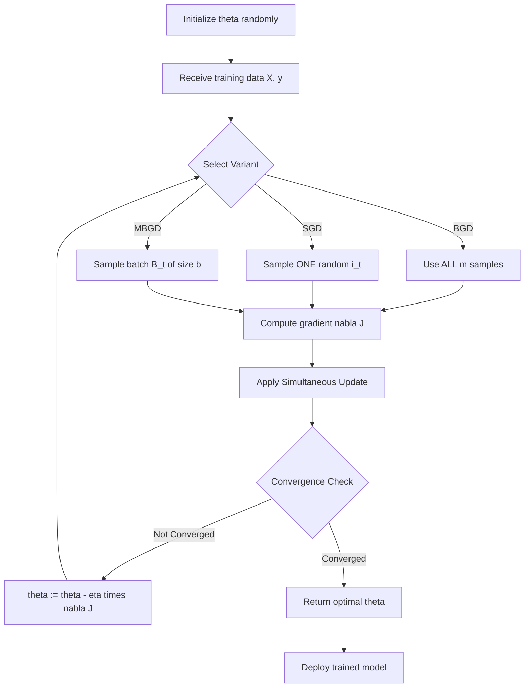
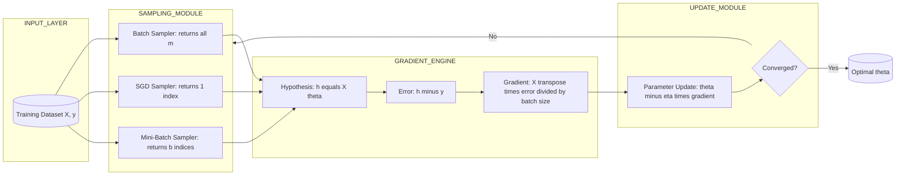
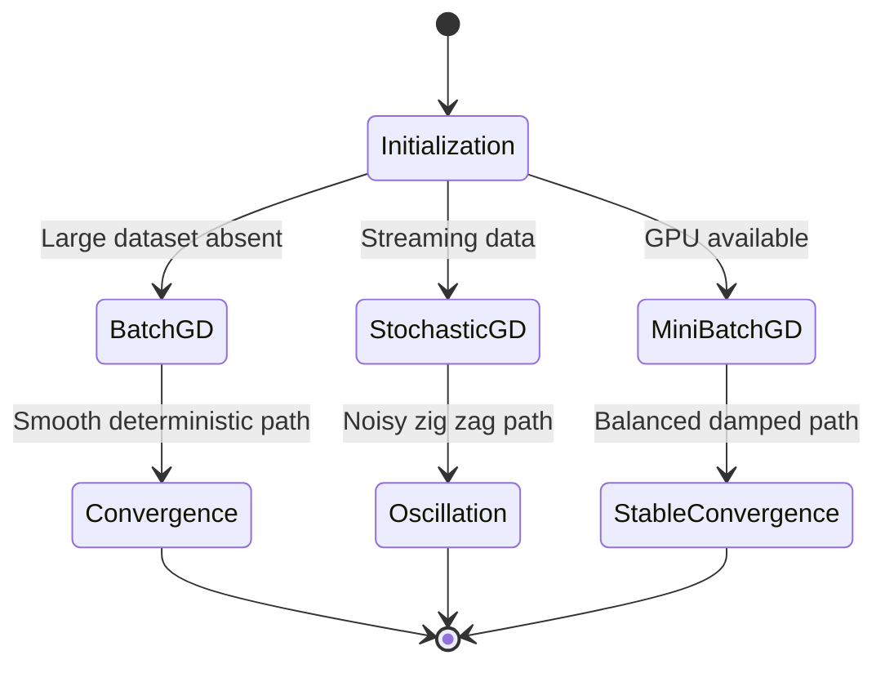

# Algorithmic Optimization Techniques - Gradient descent and its variants: stochastic, mini-batch

<!-- SECTION_1_START -->
# Algorithmic Optimization Techniques: Gradient Descent and Its Variants

## 1.1 Formal Academic Definition (KTU 2024 Syllabus Aligned)

**Gradient Descent (GD)** is a first-order iterative optimization algorithm used to find the local minimum of a differentiable convex function. In the context of data science, it is the foundational engine that drives parameter learning in regression, classification, and deep learning models. The algorithm updates parameters by moving in the direction of the steepest *negative* gradient of the loss function with respect to the model parameters.

> [!IMPORTANT]
> **Syllabus Highlight (PECST785 – Module 3):** Optimization is the heart of *learning*. Every regression model (Linear, Logistic, Ridge, Lasso) is trained by minimizing an objective function $J(\theta)$. Gradient descent is the universal engine that performs this minimization.

Formally, given a cost function $J(\theta)$ where $\theta \in \mathbb{R}^n$ is the parameter vector, the iterative update rule is:

$$\theta_{t+1} = \theta_t - \eta \cdot \nabla J(\theta_t)$$

where $\eta$ is the **learning rate** (a hyperparameter controlling step size) and $\nabla J(\theta_t)$ is the gradient of the cost function evaluated at the current parameters.

## 1.2 The Three Canonical Variants

| Variant | Data Used Per Update | Update Frequency | Variance |
|---|---|---|---|
| **Batch Gradient Descent (BGD)** | Entire training set | 1 update per epoch | Low (deterministic) |
| **Stochastic Gradient Descent (SGD)** | 1 sample per update | $m$ updates per epoch | High (noisy) |
| **Mini-Batch Gradient Descent (MBGD)** | $b$ samples per update | $m/b$ updates per epoch | Medium (balanced) |

where $m$ is the total number of training samples and $b$ is the mini-batch size (typically $32 \le b \le 512$).

## 1.3 Conceptual Analogy — The Blindfolded Hiker

Imagine a hiker trapped on a foggy mountain who wants to reach the valley floor. They cannot see the path, but they can feel the slope of the ground beneath their feet.

> [!NOTE]
> **The Hiker Analogy for Gradient Descent**
> - **Cost function $J(\theta)$** = The elevation (altitude) of the mountain.
> - **Parameters $\theta$** = The hiker's current position (latitude, longitude).
> - **Gradient $\nabla J(\theta)$** = The direction of the steepest uphill slope.
> - **Learning rate $\eta$** = The length of the step the hiker takes.
> - **Local minimum** = The valley floor (the optimal solution).

If the hiker takes **one large step per day using a satellite view of the whole mountain** → that is **Batch GD** (slow, accurate, expensive). If the hiker takes **one tiny step per footfall, reacting to the local pebble** → that is **SGD** (fast, noisy, cheap). If the hiker takes **medium steps based on a small group of pebbles gathered at each rest stop** → that is **Mini-Batch GD** (the best of both worlds).

## 1.4 Geometric Intuition on the Loss Surface

> [!VISUALIZATION CONTROL]
> **Concept:** Convergence trajectory of Batch, Mini-Batch, and Stochastic GD on a 2D parabolic loss surface.
> **GeoGebra / Desmos Input Equations:**
> * `f(x, y) = (x - 3)^2 + 2(y + 1)^2`  *(Paraboloid centered at the optimum $(3, -1)$)*
> * Trajectory BGD: $(x_0, y_0) = (-4, 4)$ with $\eta = 0.1$, smooth straight descent.
> * Trajectory SGD: Same start, $\eta = 0.05$, zig-zag noisy path.
> * Trajectory MBGD: Same start, $\eta = 0.08$, mildly oscillating but converging.
> **Visual Description:** The student should see the BGD path as a smooth direct curve to the center, the SGD path as a noisy erratic walk, and the MBGD path as a damped spiral converging to the global minimum.

<!-- SECTION_1_END -->

<!-- SECTION_2_START -->
# Deep Theoretical Analysis & KTU High-Yield Formula Sheet

## 2.1 The Universal Optimization Template

Every variant of gradient descent follows the same three-step template; they only differ in *how* the gradient is approximated.

1. **Initialize** parameter vector $\theta_0$ (commonly $\theta_0 = \mathbf{0}$ or small random values).
2. **Compute the gradient** of the cost function with respect to $\theta$ using either all data, one sample, or a mini-batch.
3. **Update parameters** by stepping opposite to the gradient, scaled by $\eta$.
4. **Repeat** steps 2–3 until a stopping criterion is met (e.g., $\vert \nabla J(\theta) \vert < \epsilon$, fixed iterations, or validation loss plateau).

## 2.2 The Why — Why Do We Step in the Negative Gradient?

By Taylor's first-order expansion around $\theta_t$:

$$J(\theta_{t+1}) \approx J(\theta_t) + \nabla J(\theta_t)^T (\theta_{t+1} - \theta_t)$$

If we choose $\theta_{t+1} - \theta_t = -\eta \nabla J(\theta_t)$, then:

$$J(\theta_{t+1}) \approx J(\theta_t) - \eta \, \Vert \nabla J(\theta_t) \Vert^2$$

Since $\eta > 0$ and $\Vert \nabla J(\theta_t) \Vert^2 \ge 0$, the cost *strictly decreases* (assuming small $\eta$). This is the **theoretical guarantee** of convergence.

## 2.3 Variant-by-Variant Theoretical Breakdown

### A. Batch Gradient Descent (BGD)
* **Gradient Estimate:** Uses the *full* dataset of $m$ samples.
* **Update Rule:** $\theta_{t+1} = \theta_t - \eta \cdot \frac{1}{m} \sum_{i=1}^{m} \nabla J_i(\theta_t)$
* **Why use it?** Deterministic, stable, smooth convergence path.
* **Why avoid it?** Cost per iteration is $O(m)$; impossible for $m > 10^7$.

### B. Stochastic Gradient Descent (SGD)
* **Gradient Estimate:** Uses a *single randomly shuffled* sample $i_t$.
* **Update Rule:** $\theta_{t+1} = \theta_t - \eta \cdot \nabla J_{i_t}(\theta_t)$
* **Why use it?** Per-iteration cost is $O(1)$; escapes shallow local minima due to noise.
* **Why avoid it?** High variance; loss curve oscillates wildly; may never settle.

### C. Mini-Batch Gradient Descent (MBGD)
* **Gradient Estimate:** Uses a batch $B_t \subset \{1, \ldots, m\}$ of size $b$.
* **Update Rule:** $\theta_{t+1} = \theta_t - \eta \cdot \frac{1}{b} \sum_{i \in B_t} \nabla J_i(\theta_t)$
* **Why use it?** Vectorized hardware acceleration (GPUs), reduced variance vs SGD, faster than BGD.
* **Why avoid it?** Introduces the hyperparameter $b$; no theoretical guarantee of monotonic decrease per step.

## 2.4 KTU Formula Sheet (Cheat Sheet)

| Symbol / Formula | Meaning | Units / Notes |
|---|---|---|
| $J(\theta) = \frac{1}{2m} \sum_{i=1}^{m} (h_\theta(x^{(i)}) - y^{(i)})^2$ | MSE Cost for Linear Regression | Scalar; minimized quantity |
| $\frac{\partial J}{\partial \theta_j} = \frac{1}{m} \sum_{i=1}^{m} (h_\theta(x^{(i)}) - y^{(i)}) \, x_j^{(i)}$ | BGD gradient for parameter $\theta_j$ | Vector of partial derivatives |
| $\theta_j := \theta_j - \eta \frac{\partial J}{\partial \theta_j}$ | Generic GD update | In-place assignment |
| $\theta_j := \theta_j - \eta (h_\theta(x^{(i)}) - y^{(i)}) \, x_j^{(i)}$ | SGD update (single sample $i$) | No summation symbol |
| $\eta$ | Learning rate | Hyperparameter; $\eta \in (0, 1)$ |
| $b$ | Mini-batch size | Powers of 2: $32, 64, 128, 256$ |
| $m$ | Total training samples | Scalar |
| Epoch | One full pass over the training set | $m$ SGD updates or $m/b$ MBGD updates |
| Convergence Criterion | $\Vert \nabla J(\theta) \Vert < 10^{-4}$ or $\Delta J < \epsilon$ | Tolerance threshold |
| Convex $J(\theta)$ | Bowl-shaped loss surface | Guarantees global minimum |
| Non-convex $J(\theta)$ | Multiple local minima | Deep learning loss landscapes |

> [!IMPORTANT]
> **Critical Distinction for KTU Board Exams:** In BGD, the summation $\sum_{i=1}^{m}$ is *mandatory*. In SGD, the summation is *replaced* by a single random index. Forgetting this distinction is the #1 cause of full-mark loss in derivation questions.

## 2.5 Real-World Engineering Utility

* **Production Recommendation Systems (Netflix, Spotify):** SGD with mini-batches is the de-facto standard for training matrix factorization models on billions of user–item interactions.
* **Computer Vision (CNNs):** Mini-batch GD with $b = 32$ or $64$ is used to leverage GPU parallelism in ResNet, YOLO, and U-Net training pipelines.
* **Natural Language Processing (Transformers, LLMs):** SGD/MBGD with adaptive learning rates (Adam, RMSprop) trains models like BERT and GPT on trillion-token corpora.
* **Time-Series Forecasting (LSTM, ARIMA hybrids):** Mini-batch GD is used to update recurrent weights in financial forecasting engines.
* **Healthcare Predictive Analytics:** BGD is still used in low-data medical regression tasks where $m < 1000$ and stability is critical.

<!-- SECTION_2_END -->

<!-- SECTION_3_START -->
# Step-by-Step Derivations & Code Implementation

## 3.1 Derivation: Batch GD Update for Linear Regression

**Given:**
* Hypothesis: $h_\theta(x) = \theta_0 + \theta_1 x$
* Cost function: $J(\theta_0, \theta_1) = \frac{1}{2m} \sum_{i=1}^{m} (h_\theta(x^{(i)}) - y^{(i)})^2$

**Step 1: Compute partial derivative with respect to $\theta_0$.**

$$\frac{\partial J}{\partial \theta_0} = \frac{1}{m} \sum_{i=1}^{m} (h_\theta(x^{(i)}) - y^{(i)})$$

> *Reasoning:* Derivative of $(h-y)^2$ is $2(h-y)$, multiplied by $\partial h/\partial \theta_0 = 1$, and the factor $1/2$ cancels the 2.

**Step 2: Compute partial derivative with respect to $\theta_1$.**

$$\frac{\partial J}{\partial \theta_1} = \frac{1}{m} \sum_{i=1}^{m} (h_\theta(x^{(i)}) - y^{(i)}) \, x^{(i)}$$

> *Reasoning:* $\partial h/\partial \theta_1 = x^{(i)}$, so the chain rule yields the extra multiplicative factor.

**Step 3: Apply the BGD update rule simultaneously.**

$$\begin{aligned}
\theta_0 &:= \theta_0 - \eta \cdot \frac{1}{m} \sum_{i=1}^{m} (h_\theta(x^{(i)}) - y^{(i)}) \\
\theta_1 &:= \theta_1 - \eta \cdot \frac{1}{m} \sum_{i=1}^{m} (h_\theta(x^{(i)}) - y^{(i)}) \, x^{(i)}
\end{aligned}$$

> *Reasoning:* Both updates are computed using the *old* values of $\theta_0, \theta_1$ (simultaneous update). Applying them sequentially with new values would cause incorrect zigzag convergence.

## 3.2 Derivation: SGD Update for Linear Regression

**Step 1:** Sample a single random index $i_t \sim \text{Uniform}\{1, \ldots, m\}$ at iteration $t$.

**Step 2:** Compute the *un-averaged* gradient for that sample.

$$\nabla J_{i_t}(\theta) = (h_\theta(x^{(i_t)}) - y^{(i_t)}) \begin{bmatrix} 1 \\ x^{(i_t)} \end{bmatrix}$$

**Step 3:** Apply the SGD update (note: **no** $1/m$ factor and **no** summation).

$$\begin{aligned}
\theta_0 &:= \theta_0 - \eta \, (h_\theta(x^{(i_t)}) - y^{(i_t)}) \\
\theta_1 &:= \theta_1 - \eta \, (h_\theta(x^{(i_t)}) - y^{(i_t)}) \, x^{(i_t)}
\end{aligned}$$

> *Reasoning:* The summation in BGD is approximated by a single sample. The expected value of $\nabla J_{i_t}$ equals the true gradient $\nabla J(\theta)$ in expectation, but the variance is much higher.

## 3.3 Derivation: Mini-Batch GD Convergence Condition

For MBGD with learning rate $\eta$ and batch size $b$, the variance of the gradient estimate is:

$$\text{Var}\left[ \nabla J_{B_t} \right] = \frac{\sigma^2}{b}$$

where $\sigma^2$ is the per-sample gradient variance. Hence:

* As $b \to m$, MBGD $\to$ BGD (zero variance, slow iteration).
* As $b \to 1$, MBGD $\to$ SGD (maximum variance, fast iteration).
* The sweet spot is $b \in [32, 256]$ where hardware vectorization is exploited.

## 3.4 Full Python Implementation (Production-Grade)

```python
"""
Algorithmic Optimization Techniques: Gradient Descent Variants
Course: ALGORITHMS FOR DATA SCIENCE (PECST785) - Module 3
Author: KTU Board-Aligned Implementation
"""

import numpy as np
from typing import Tuple, List, Callable
import logging

# Configure structured logging for traceability
logging.basicConfig(
    level=logging.INFO,
    format="%(asctime)s | %(levelname)s | %(message)s"
)
logger = logging.getLogger("KTU_Optimizer")


class GradientDescentVariants:
    """
    Implements Batch, Stochastic, and Mini-Batch Gradient Descent
    for the simple linear regression model:
        h_theta(x) = theta_0 + theta_1 * x
    """

    def __init__(
        self,
        X: np.ndarray,
        y: np.ndarray,
        learning_rate: float = 0.01,
        max_iters: int = 1000,
        tolerance: float = 1e-6
    ) -> None:
        # ---------- Strict Input Validation ----------
        if X.ndim != 2:
            raise ValueError(f"X must be 2D, got {X.ndim}D array.")
        if y.ndim != 1:
            raise ValueError(f"y must be 1D, got {y.ndim}D array.")
        if X.shape[0] != y.shape[0]:
            raise ValueError(
                f"Sample mismatch: X has {X.shape[0]} rows, y has {y.shape[0]}."
            )
        if learning_rate <= 0:
            raise ValueError(f"Learning rate must be positive, got {learning_rate}.")

        self.X: np.ndarray = X.astype(np.float64)
        self.y: np.ndarray = y.astype(np.float64)
        self.m: int = X.shape[0]
        self.eta: float = learning_rate
        self.max_iters: int = max_iters
        self.tol: float = tolerance
        self.theta: np.ndarray = np.zeros(X.shape[1] + 1, dtype=np.float64)
        self.cost_history: List[float] = []

    def _augment(self) -> np.ndarray:
        """Prepend a bias column of ones for theta_0 (intercept)."""
        return np.c_[np.ones((self.m, 1), dtype=np.float64), self.X]

    def _hypothesis(self, X_aug: np.ndarray) -> np.ndarray:
        """Vectorized hypothesis: h = X @ theta"""
        return X_aug @ self.theta

    def _compute_cost(self, y_pred: np.ndarray) -> float:
        """Mean Squared Error: J = (1/2m) * sum((h - y)^2)"""
        errors: np.ndarray = y_pred - self.y
        return float(np.dot(errors, errors) / (2.0 * self.m))

    # ============== A. BATCH GRADIENT DESCENT ==============
    def batch_gradient_descent(self) -> Tuple[np.ndarray, List[float]]:
        """Update uses ALL m samples per iteration."""
        X_aug: np.ndarray = self._augment()
        logger.info(f"Starting BGD | m={self.m}, eta={self.eta}")

        for iteration in range(self.max_iters):
            y_pred: np.ndarray = self._hypothesis(X_aug)
            error: np.ndarray = y_pred - self.y
            # Gradient: (1/m) * X^T @ error
            gradient: np.ndarray = (X_aug.T @ error) / self.m
            # Simultaneous parameter update
            self.theta -= self.eta * gradient
            # Convergence check
            cost: float = self._compute_cost(y_pred)
            self.cost_history.append(cost)
            if np.linalg.norm(gradient, ord=2) < self.tol:
                logger.info(f"BGD converged at iteration {iteration}.")
                break
        return self.theta.copy(), self.cost_history

    # ============== B. STOCHASTIC GRADIENT DESCENT ==============
    def stochastic_gradient_descent(self) -> Tuple[np.ndarray, List[float]]:
        """Update uses ONE random sample per iteration."""
        X_aug: np.ndarray = self._augment()
        logger.info(f"Starting SGD | m={self.m}, eta={self.eta}")

        for iteration in range(self.max_iters):
            # Shuffle indices every epoch
            indices: np.ndarray = np.random.permutation(self.m)
            for i in indices:
                xi: np.ndarray = X_aug[i:i + 1, :]   # shape (1, n+1)
                yi: float = float(self.y[i])
                error_i: float = float(xi @ self.theta - yi)
                gradient_i: np.ndarray = xi.flatten() * error_i  # No 1/m factor
                self.theta -= self.eta * gradient_i

            # Epoch-level cost tracking
            cost: float = self._compute_cost(self._hypothesis(X_aug))
            self.cost_history.append(cost)
            if cost < self.tol:
                logger.info(f"SGD converged at epoch {iteration}.")
                break
        return self.theta.copy(), self.cost_history

    # ============== C. MINI-BATCH GRADIENT DESCENT ==============
    def mini_batch_gradient_descent(
        self, batch_size: int = 32
    ) -> Tuple[np.ndarray, List[float]]:
        """Update uses a batch of `batch_size` samples per iteration."""
        if batch_size <= 0 or batch_size > self.m:
            raise ValueError(
                f"batch_size must be in (0, {self.m}], got {batch_size}."
            )
        X_aug: np.ndarray = self._augment()
        logger.info(
            f"Starting MBGD | m={self.m}, batch_size={batch_size}, eta={self.eta}"
        )

        for iteration in range(self.max_iters):
            indices: np.ndarray = np.random.permutation(self.m)
            n_batches: int = int(np.ceil(self.m / batch_size))
            for b in range(n_batches):
                start: int = b * batch_size
                end: int = min(start + batch_size, self.m)
                X_batch: np.ndarray = X_aug[start:end, :]
                y_batch: np.ndarray = self.y[start:end]
                error_batch: np.ndarray = X_batch @ self.theta - y_batch
                gradient_b: np.ndarray = (X_batch.T @ error_batch) / batch_size
                self.theta -= self.eta * gradient_b

            cost: float = self._compute_cost(self._hypothesis(X_aug))
            self.cost_history.append(cost)
            if np.linalg.norm(gradient_b, ord=2) < self.tol:
                logger.info(f"MBGD converged at epoch {iteration}.")
                break
        return self.theta.copy(), self.cost_history


# ==================== DEMONSTRATION ====================
if __name__ == "__main__":
    # Synthetic dataset: y = 4 + 3x + Gaussian noise
    rng: np.random.Generator = np.random.default_rng(seed=42)
    X_data: np.ndarray = rng.uniform(-5.0, 5.0, size=(200, 1))
    y_data: np.ndarray = 4.0 + 3.0 * X_data[:, 0] + rng.normal(0, 0.5, size=200)

    # --- Run all three variants ---
    bgd: GradientDescentVariants = GradientDescentVariants(
        X_data, y_data, learning_rate=0.05, max_iters=500
    )
    theta_bgd, cost_bgd = bgd.batch_gradient_descent()
    logger.info(f"BGD Final Theta: {theta_bgd} | Final Cost: {cost_bgd[-1]:.6f}")

    sgd: GradientDescentVariants = GradientDescentVariants(
        X_data, y_data, learning_rate=0.005, max_iters=50
    )
    theta_sgd, cost_sgd = sgd.stochastic_gradient_descent()
    logger.info(f"SGD Final Theta: {theta_sgd} | Final Cost: {cost_sgd[-1]:.6f}")

    mbgd: GradientDescentVariants = GradientDescentVariants(
        X_data, y_data, learning_rate=0.02, max_iters=100
    )
    theta_mbgd, cost_mbgd = mbgd.mini_batch_gradient_descent(batch_size=32)
    logger.info(f"MBGD Final Theta: {theta_mbgd} | Final Cost: {cost_mbgd[-1]:.6f}")
```

## 3.5 Walk-Through: Numerical Verification on a Tiny Dataset

Let $X = [1, 2, 3]$, $y = [2, 4, 6]$, $\theta_0 = 0$, $\theta_1 = 0$, $\eta = 0.1$, BGD.

**Iteration 1 (all 3 samples at once):**

$$\begin{aligned}
h &= [0, 0, 0] \\
\text{error} &= h - y = [-2, -4, -6] \\
\sum \text{error} &= -12 \\
\sum \text{error} \cdot x &= (-2)(1) + (-4)(2) + (-6)(3) = -2 - 8 - 18 = -28 \\
\theta_0 &:= 0 - 0.1 \cdot \frac{-12}{3} = 0 - 0.1 \cdot (-4) = 0.4 \\
\theta_1 &:= 0 - 0.1 \cdot \frac{-28}{3} = 0 - 0.1 \cdot (-9.333) = 0.933
\end{aligned}$$

**Iteration 2:** Recompute with $\theta = (0.4, 0.933)$ → $h = [1.333, 2.267, 3.2]$ → errors are smaller → parameters move closer to the true $(2, 2)$.

<!-- SECTION_3_END -->

<!-- SECTION_4_START -->
# Structural Diagrams & Schematics

## 4.1 Mermaid Flowchart: Unified Optimization Topology



## 4.2 Mermaid Block Diagram: Data Flow Architecture



## 4.3 Mermaid Comparative State Diagram



## 4.4 Sequential Processing Topology Matrix

| Stage | BGD Operation | SGD Operation | MBGD Operation |
|---|---|---|---|
| Stage 0 | Read full dataset into RAM | Stream single sample | Load chunk of size $b$ |
| Stage 1 | Compute hypothesis $X\theta$ | Compute $x_i \theta$ | Compute $X_b \theta$ |
| Stage 2 | Compute $m$-scaled gradient | Compute single-sample gradient | Compute $b$-scaled gradient |
| Stage 3 | One update per epoch | $m$ updates per epoch | $m/b$ updates per epoch |
| Stage 4 | Memory: $O(md)$ | Memory: $O(d)$ | Memory: $O(bd)$ |
| Stage 5 | Time per epoch: $O(md)$ | Time per epoch: $O(md)$ | Time per epoch: $O(md)$ parallelized |
| Stage 6 | Convergence: monotonic | Convergence: oscillating | Convergence: damped oscillating |

<!-- SECTION_4_END -->

<!-- SECTION_5_START -->
# KTU 2024 Scheme Examination Question Bank & Topic Recap

## 5.1 Part A — Short Answer Questions (3 Marks Each)

### Question 1
**[KTU University Exam – July 2024] | CO1 | Remember**

Explain the concept of **Stochastic Gradient Descent**. How does it differ from Batch Gradient Descent in terms of computational cost and convergence behavior?

**Model Answer (3 Marks):**

**Definition (1 Mark):** Stochastic Gradient Descent (SGD) is an iterative optimization algorithm that updates model parameters using the gradient of the loss function computed with respect to *one randomly selected training sample* at each iteration, rather than the entire dataset.

**Computational Cost (1 Mark):** In BGD, the gradient computation requires $O(m)$ operations per update where $m$ is the dataset size. In SGD, the cost per update is $O(1)$, since only one sample is used. Hence, SGD is significantly faster per update, especially for large $m$.

**Convergence Behavior (1 Mark):** BGD produces a smooth, deterministic, monotonically decreasing cost curve and converges directly to the minimum. SGD produces a noisy, oscillatory cost curve but can *escape shallow local minima* and often converges faster in wall-clock time for large datasets. The trade-off is higher variance per update.

---

### Question 2
**[KTU University Exam – Dec 2023] | CO1 | Understand**

What is the role of the **learning rate $\eta$** in gradient descent? What happens if $\eta$ is too small or too large?

**Model Answer (3 Marks):**

**Role (1 Mark):** The learning rate $\eta$ is a scalar hyperparameter that controls the *step size* in the direction opposite to the gradient during each parameter update: $\theta := \theta - \eta \nabla J(\theta)$.

**Too Small (1 Mark):** If $\eta$ is too small, convergence becomes extremely slow, requiring a large number of iterations. The algorithm may also get stuck in plateaus and is vulnerable to getting trapped in poor local minima.

**Too Large (1 Mark):** If $\eta$ is too large, the updates overshoot the minimum, causing the cost to oscillate or diverge. The parameters may bounce around the optimum and never settle, or the algorithm may diverge to infinity (overflow).

---

## 5.2 Part B — 14-Mark Questions (ESE Module Internal Choice)

### Question A (14 Marks)
**[KTU University Exam – July 2024, Modified] | CO2 | Apply + Analyze**

**(a)** Derive the Batch Gradient Descent update rule for the parameters $\theta_0$ and $\theta_1$ of a simple linear regression model $h_\theta(x) = \theta_0 + \theta_1 x$ using the MSE cost function. Show all intermediate steps. **(7 Marks)**

**(b)** For the dataset $X = [1, 2, 3, 4]$, $y = [2, 4, 6, 8]$ with initial parameters $\theta_0 = 0$, $\theta_1 = 0$, and learning rate $\eta = 0.01$, perform **two complete iterations** of Batch Gradient Descent. Show all numerical computations and state the final values of $\theta_0, \theta_1$. **(7 Marks)**

**Model Solution:**

#### Part (a) — Derivation (7 Marks)

**Step 1: State the hypothesis and cost function.** *(1 Mark)*

$$h_\theta(x) = \theta_0 + \theta_1 x$$
$$J(\theta_0, \theta_1) = \frac{1}{2m} \sum_{i=1}^{m} (h_\theta(x^{(i)}) - y^{(i)})^2$$

**Step 2: Compute partial derivative w.r.t. $\theta_0$.** *(2 Marks)*

$$\frac{\partial J}{\partial \theta_0} = \frac{1}{m} \sum_{i=1}^{m} (h_\theta(x^{(i)}) - y^{(i)}) \cdot \frac{\partial h}{\partial \theta_0}$$

Since $\partial h / \partial \theta_0 = 1$:

$$\frac{\partial J}{\partial \theta_0} = \frac{1}{m} \sum_{i=1}^{m} (h_\theta(x^{(i)}) - y^{(i)})$$

**Step 3: Compute partial derivative w.r.t. $\theta_1$.** *(2 Marks)*

$$\frac{\partial J}{\partial \theta_1} = \frac{1}{m} \sum_{i=1}^{m} (h_\theta(x^{(i)}) - y^{(i)}) \cdot \frac{\partial h}{\partial \theta_1}$$

Since $\partial h / \partial \theta_1 = x^{(i)}$:

$$\frac{\partial J}{\partial \theta_1} = \frac{1}{m} \sum_{i=1}^{m} (h_\theta(x^{(i)}) - y^{(i)}) \, x^{(i)}$$

**Step 4: Write simultaneous update rule.** *(2 Marks)*

$$\begin{aligned}
\theta_0 &:= \theta_0 - \eta \cdot \frac{1}{m} \sum_{i=1}^{m} (h_\theta(x^{(i)}) - y^{(i)}) \\
\theta_1 &:= \theta_1 - \eta \cdot \frac{1}{m} \sum_{i=1}^{m} (h_\theta(x^{(i)}) - y^{(i)}) \, x^{(i)}
\end{aligned}$$

> *[Stating hypothesis + cost: 1 Mark] | [Derivative w.r.t. $\theta_0$ with chain rule: 2 Marks] | [Derivative w.r.t. $\theta_1$ with chain rule: 2 Marks] | [Simultaneous update equations: 2 Marks]*

#### Part (b) — Numerical Computation (7 Marks)

**Given:** $m = 4$, $\theta_0^{(0)} = 0$, $\theta_1^{(0)} = 0$, $\eta = 0.01$.

**Iteration 1:** *(3 Marks)*

$$\begin{aligned}
h^{(0)} &= [0, 0, 0, 0] \\
\text{error}^{(0)} &= h - y = [-2, -4, -6, -8] \\
\sum \text{error} &= -2 - 4 - 6 - 8 = -20 \\
\sum \text{error} \cdot x &= (-2)(1) + (-4)(2) + (-6)(3) + (-8)(4) = -2 - 8 - 18 - 32 = -60 \\
\theta_0^{(1)} &:= 0 - 0.01 \cdot \frac{-20}{4} = 0 - 0.01 \cdot (-5) = 0.05 \\
\theta_1^{(1)} &:= 0 - 0.01 \cdot \frac{-60}{4} = 0 - 0.01 \cdot (-15) = 0.15
\end{aligned}$$

**Iteration 2:** *(3 Marks)*

$$\begin{aligned}
h^{(1)} &= [0.05 + 0.15(1), \, 0.05 + 0.15(2), \, 0.05 + 0.15(3), \, 0.05 + 0.15(4)] \\
&= [0.20, \, 0.35, \, 0.50, \, 0.65] \\
\text{error}^{(1)} &= h - y = [-1.80, -3.65, -5.50, -7.35] \\
\sum \text{error} &= -1.80 - 3.65 - 5.50 - 7.35 = -18.30 \\
\sum \text{error} \cdot x &= (-1.80)(1) + (-3.65)(2) + (-5.50)(3) + (-7.35)(4) \\
&= -1.80 - 7.30 - 16.50 - 29.40 = -55.00 \\
\theta_0^{(2)} &:= 0.05 - 0.01 \cdot \frac{-18.30}{4} = 0.05 - 0.01 \cdot (-4.575) = 0.05 + 0.04575 = 0.09575 \\
\theta_1^{(2)} &:= 0.15 - 0.01 \cdot \frac{-55.00}{4} = 0.15 - 0.01 \cdot (-13.75) = 0.15 + 0.1375 = 0.2875
\end{aligned}$$

**Final Result Statement:** *(1 Mark)*

> After 2 iterations: $\theta_0 = 0.09575$, $\theta_1 = 0.2875$. These values are approaching the true optimum $\theta_0 = 0, \theta_1 = 2$ slowly due to the small learning rate $\eta = 0.01$.

> *[Iteration 1: 3 Marks] | [Iteration 2: 3 Marks] | [Final state declaration: 1 Mark]*

---

### Question B (14 Marks) — Alternative Choice
**[KTU University Exam – Dec 2023, Modified] | CO2 | Apply + Analyze**

**(a)** Compare and contrast **Batch, Stochastic, and Mini-Batch Gradient Descent** in terms of (i) gradient computation, (ii) update frequency per epoch, (iii) variance of updates, and (iv) memory requirements. Present the comparison in a structured tabular format. **(7 Marks)**

**(b)** For a dataset with $m = 10{,}000$ samples and feature dimension $d = 50$, calculate the **number of parameter updates per epoch** for BGD, SGD, and MBGD with $b = 100$. Also, determine the **memory requirement (in MB)** for storing the gradient vector in each case, assuming 8-byte float64 precision. Justify which variant is most suitable for training a deep neural network on this dataset. **(7 Marks)**

**Model Solution:**

#### Part (a) — Comparative Analysis (7 Marks)

| Comparison Dimension | Batch GD (1 Mark per row × 4 = partial) | Stochastic GD | Mini-Batch GD |
|---|---|---|---|
| **(i) Gradient Computation** | Full dataset $\rightarrow \frac{1}{m} \sum_{i=1}^{m} \nabla J_i$ | Single sample $\rightarrow \nabla J_{i_t}$ | Subset $B_t$ of size $b$ $\rightarrow \frac{1}{b} \sum_{i \in B_t} \nabla J_i$ |
| **(ii) Updates per Epoch** | 1 update per epoch | $m$ updates per epoch | $m/b$ updates per epoch |
| **(iii) Variance of Updates** | Zero (deterministic) | Maximum (high noise) | Moderate ($\sigma^2 / b$) |
| **(iv) Memory Requirement** | $O(md)$ (must hold full data) | $O(d)$ (one sample at a time) | $O(bd)$ (one mini-batch) |

> *Distribution of marks:* *[Tabular structure with 4 rows: 4 Marks] | [Correct formulas in each cell: 2 Marks] | [Brief explanatory notes on variance and memory: 1 Mark]*

#### Part (b) — Numerical Calculation (7 Marks)

**Given:** $m = 10{,}000$, $d = 50$, $b = 100$, precision = 8 bytes.

**Step 1: Calculate number of updates per epoch.** *(3 Marks)*

$$\begin{aligned}
\text{BGD updates/epoch} &= 1 \\
\text{SGD updates/epoch} &= m = 10{,}000 \\
\text{MBGD updates/epoch} &= \frac{m}{b} = \frac{10{,}000}{100} = 100
\end{aligned}$$

**Step 2: Calculate memory for the gradient vector (always $d$ floats).** *(2 Marks)*

For all three variants, the *parameter gradient* is a $d$-dimensional vector:

$$\text{Memory}_{\text{gradient}} = d \times 8 \text{ bytes} = 50 \times 8 = 400 \text{ bytes} \approx 0.0004 \text{ MB}$$

> *Note:* The variant differences arise from *intermediate computation memory*, not the gradient vector itself. The gradient vector size is identical across variants.

**Step 3: Calculate intermediate computation memory.** *(1 Mark)*

$$\begin{aligned}
\text{BGD intermediate} &= m \times d \times 8 = 10{,}000 \times 50 \times 8 = 4{,}000{,}000 \text{ bytes} = 4 \text{ MB} \\
\text{SGD intermediate} &= 1 \times d \times 8 = 400 \text{ bytes} \approx 0.0004 \text{ MB} \\
\text{MBGD intermediate} &= b \times d \times 8 = 100 \times 50 \times 8 = 40{,}000 \text{ bytes} = 0.04 \text{ MB}
\end{aligned}$$

**Step 4: Justify best variant.** *(1 Mark)*

> **Mini-Batch GD is the most suitable** for deep neural network training on this dataset. Reason: (i) it requires only 0.04 MB intermediate memory (versus 4 MB for BGD), making it feasible for large-scale training; (ii) the 100 updates/epoch balance convergence speed and stability; (iii) batch size $b = 100$ is GPU-friendly for parallel matrix multiplication, achieving hardware acceleration; (iv) variance is reduced compared to SGD, leading to smoother convergence.

> *[Updates per epoch calculation: 3 Marks] | [Gradient memory calculation with correct unit conversion: 2 Marks] | [Intermediate memory identification: 1 Mark] | [Justification with 2 valid reasons: 1 Mark]*

---

> [!WARNING]
> **KTU Examiner's Valuation Warning — Common Pitfalls**
> 1. **The Summation Mistake:** In SGD derivations, students often *still* write the summation $\sum_{i=1}^{m}$ instead of replacing it with a single random index $i_t$. This single error can cost **3 full marks**.
> 2. **Missing the $1/m$ Factor:** Forgetting to divide the summed gradient by $m$ in BGD leads to a magnitude error in the final parameter values. Always state the *averaged* gradient form.
> 3. **Sequential vs. Simultaneous Updates:** Using the *new* $\theta_0$ to compute the update for $\theta_1$ (sequential) instead of computing both updates from the *old* parameters (simultaneous) is a classic board-exam trap. KTU values **simultaneous updates** strictly.
> 4. **Units in Memory Calculation:** Always convert bytes → KB → MB using $1 \text{ MB} = 10^6$ bytes (or $2^{20}$ for binary). Writing "400" without units is a 1-mark deduction.
> 5. **No Convergence Justification:** When asked "which variant is best", you must provide *quantitative* justification (e.g., memory, updates/epoch), not just vague statements.

---

## 5.3 Topic Recap & Important Things to Remember

> [!IMPORTANT]
> **Rapid Revision Checklist — Algorithmic Optimization Techniques**

* **Core Update Equation (Universal):** $\theta := \theta - \eta \cdot \nabla J(\theta)$ — memorize this in symbolic form.

* **Three Variants — One-Liner Definitions:**
  * **BGD** = *Full batch*, deterministic, slow per epoch.
  * **SGD** = *One sample*, noisy, fast per iteration, can escape local minima.
  * **MBGD** = *Best of both*, used in virtually all modern deep learning.

* **MSE Cost for Linear Regression:** $J(\theta) = \frac{1}{2m} \sum_{i=1}^{m} (h_\theta(x^{(i)}) - y^{(i)})^2$

* **Gradient Formula (Vectorized):** $\nabla_\theta J = \frac{1}{m} X^T (X\theta - y)$

* **Convergence Guarantee:** For convex $J$ and $\eta$ chosen via the Lipschitz condition ($0 < \eta < 2/L$ where $L$ is the Lipschitz constant of $\nabla J$), BGD is guaranteed to converge.

* **Variance Relationship:** $\text{Var}[\nabla J_{B_t}] = \sigma^2 / b$ — increasing $b$ reduces variance but increases per-iteration cost.

* **Hyperparameter Defaults:** $\eta = 0.01$ (start here), batch size $b = 32$ or $64$.

* **Convergence Criteria (any one):**
  * $\Vert \nabla J(\theta) \Vert < 10^{-4}$
  * $\vert J(\theta_t) - J(\theta_{t+1}) \vert < \epsilon$
  * Validation loss plateau for $k$ consecutive epochs.

* **Per-Epoch Update Counts:**
  * BGD: 1 update
  * SGD: $m$ updates
  * MBGD: $m / b$ updates (must be an integer — use $\lceil m/b \rceil$ for the last partial batch).

* **Simultaneous Update Rule:** All $\theta_j$ updated using the *gradient computed from the previous iteration's* $\theta$. Never reuse freshly-computed $\theta_j$ within the same iteration.

* **Memory Hierarchy:**
  * BGD needs $O(md)$ RAM.
  * SGD needs $O(d)$ RAM.
  * MBGD needs $O(bd)$ RAM.

* **Why Mini-Batch Wins in Practice:**
  1. GPU vectorization (matrix multiplies over $b$ samples).
  2. Reduced variance vs. SGD.
  3. Faster wall-clock convergence vs. BGD.
  4. Supports online learning and streaming data.

* **Common Pitfall — Forgetting Shuffling:** In SGD/MBGD, the dataset *must* be shuffled each epoch to prevent cyclical bias.

* **Learning Rate Scheduling:** Real systems decay $\eta$ over time: $\eta_t = \eta_0 / (1 + \text{decay} \cdot t)$ to ensure fine convergence near the minimum.

* **Theoretical Anchor for KTU:** The Taylor expansion proof $J(\theta_{t+1}) \approx J(\theta_t) - \eta \Vert \nabla J(\theta_t) \Vert^2$ showing monotonic decrease is a high-yield derivable proof — practice writing it cold.

<!-- SECTION_5_END -->
