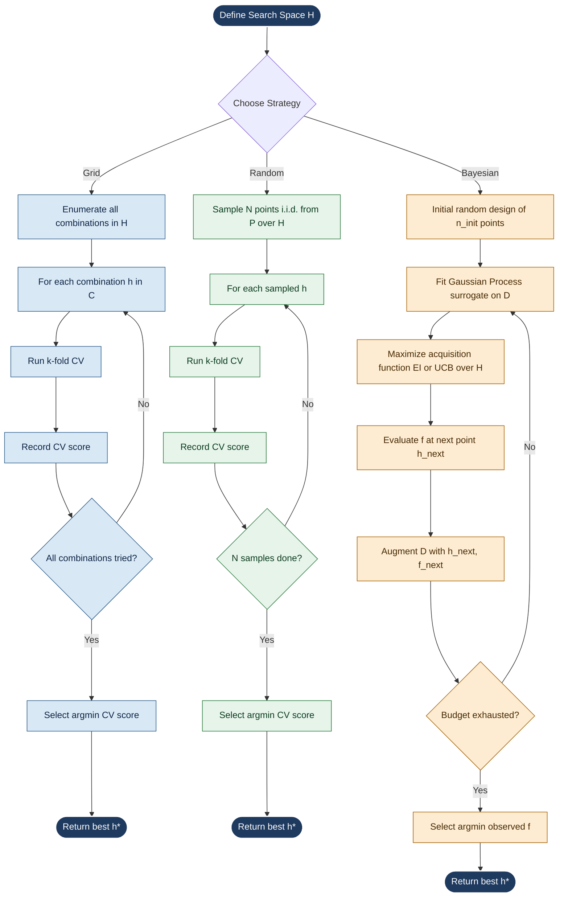
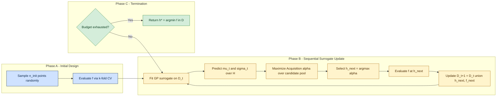
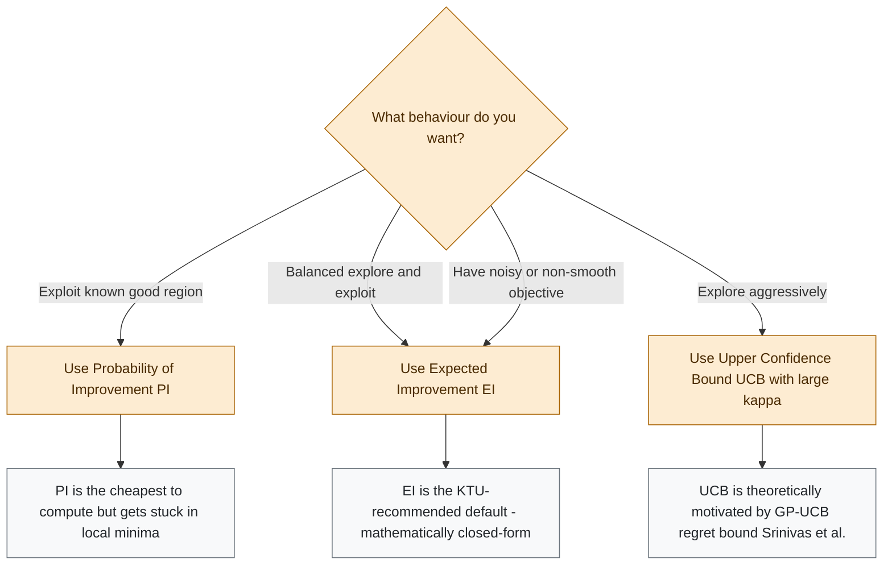

# Hyperparameter tuning - grid search, random search, Bayesian optimization

<!-- SECTION_1_START -->
# Hyperparameter Tuning: Grid Search, Random Search \& Bayesian Optimization

## 1.1 Formal Academic Definition (KTU 2024 Syllabus Terminology)

**Hyperparameter tuning** (also called *hyperparameter optimization*, HPO) is the process of systematically searching for the optimal configuration of a model's *hyperparameters* — the external configuration variables that govern the learning algorithm itself, as opposed to *parameters* that are learned directly from the training data (e.g., regression coefficients $\beta$, neural network weights $W$).

In the KTU 2024 *Algorithms for Data Science* (PECST785) syllabus, this concept is treated as a critical post-modelling step in any regression (or classification) pipeline, since the *generalization error* of a regressor — $\mathcal{E}_{gen} = \mathbb{E}_{(x,y) \sim \mathcal{D}} \left[ (f(x) - y)^2 \right]$ — depends on the choice of regularization strength, learning rate, tree depth, etc.

> [!IMPORTANT]
> **Hyperparameter vs. Parameter — the golden distinction**
> - **Parameter** = learned *during* training (e.g., $\beta$ in linear regression solved via $\hat{\beta} = (X^T X)^{-1} X^T y$).
> - **Hyperparameter** = configured *before* training (e.g., the regularization constant $\lambda$ in Ridge regression, the maximum tree depth $d_{max}$ in a decision tree regressor).
> Tuning = choosing hyperparameter values $\mathbf{h}^* \in \mathcal{H}$ that minimize validation error.

> [!NOTE]
> **Why tuning matters in regression pipelines:** A Ridge regressor with $\lambda = 0$ collapses to OLS (overfits), while $\lambda \to \infty$ shrinks all coefficients to zero (underfits). The sweet spot lies in between and can only be located empirically.

## 1.2 Intuitive Analogies

### Analogy A — Cooking a Dish (Grid Search)
Imagine you want the perfect *masala chai*. You decide on a fixed grid: sugar ∈ {1, 2, 3} spoons, cardamom ∈ {1, 2} pods, ginger ∈ {0.5, 1, 1.5} tsp. Grid search brews **every** possible combination (3 × 2 × 3 = **18 cups**) and you taste each. Exhaustive, but costly.

### Analogy B — Cooking a Dish (Random Search)
You instead taste **15 random cups** sampled from a much larger range (sugar 0.5 → 4 spoons, cardamom 0 → 5 pods, ginger 0 → 2 tsp). You are likely to find a great cup with far fewer tastings — *especially* when only one or two ingredients actually matter.

### Analogy C — Cooking a Dish (Bayesian Optimization)
You keep a mental "score-sheet" of every cup you have tasted. After each sip, you **update your belief** about which region of the recipe space is most promising, then deliberately try the next cup in the region you think will be best. Each new experiment is informed by all previous ones.

> [!TIP]
> **GeoGebra / Desmos Visualization — A 2-D Loss Surface**
>
> > **Concept:** Visualizing a 1-D slice of a 2-D hyperparameter loss surface.
> > **Input equations (Desmos syntax):**
> > * $L_{1}(x) = (x-3)^{2} + 1$   *(grid point 1)*
> > * $L_{2}(x) = 0.5(x-5)^{2} + 0.5$   *(grid point 2)*
> > * $L_{3}(x) = 1.2(x-1)^{2} + 2$   *(grid point 3)*
> > * $L_{true}(x) = 0.3(x-4)^{2} + 0.4$   *(hidden true optimum)*
> >
> > **Visual description:** The student should see three sampled parabolas (grid/random points) and a deeper, narrower true optimum near $x = 4$. The bayesian method would, after sampling the first few points, *lean* its next query toward $x = 4$, whereas grid and random would not adapt.

## 1.3 Search Space Formalism

The **search space** $\mathcal{H}$ is the cartesian product of individual hyperparameter domains:

$$
\mathcal{H} = \mathcal{H}_1 \times \mathcal{H}_2 \times \dots \times \mathcal{H}_k
$$

Each $\mathcal{H}_i$ can be:
* **Categorical** (discrete labels) — e.g., solver ∈ {`svd`, `cholesky`, `saga`}
* **Ordinal/Integer** — e.g., $n_{estimators} \in \{50, 100, 200, 500\}$
* **Continuous** — e.g., learning rate $\eta \in [10^{-5}, \, 10^{-1}]$ on a **log scale**

> [!NOTE]
> **Log-scale sampling rule:** When a hyperparameter varies across orders of magnitude (regularization $\lambda$, learning rate $\eta$), sample from a *log-uniform* distribution, not uniform. Otherwise, 99 % of the random draws cluster uselessly in a narrow band.

## 1.4 Cross-Validation as the Evaluation Engine

Hyperparameter quality is judged by **$k$-fold cross-validation (CV) error**, not training error:

$$
CV(h) = \frac{1}{k} \sum_{j=1}^{k} \mathcal{L}\!\left( f^{-j}(h) \, , \, \mathcal{D}_{val}^{(j)} \right)
$$

where $f^{-j}(h)$ is the model trained on the $j$-th fold leaving out partition $j$. KTU examiners frequently award marks for explicitly mentioning *k-fold CV* in HPO answers.

<!-- SECTION_1_END -->

<!-- SECTION_2_START -->
# Deep Theoretical Analysis \& KTU High-Yield Formula Sheet

## 2.1 The Three Pillars at a Glance

| **Aspect** | **Grid Search** | **Random Search** | **Bayesian Optimization** |
|---|---|---|---|
| **Sampling rule** | Exhaustive enumeration | Uniform / log-uniform random draw | Probabilistic, driven by acquisition function |
| **Uses past evaluations?** | No | No | **Yes** — builds a surrogate model |
| **Scalability in dim. $d$** | $\mathcal{O}\!\left(\prod n_i\right)$ — curse of dimensionality | $\mathcal{O}(N)$ regardless of $d$ | $\mathcal{O}(N \cdot d^3)$ per iter (GP inversion) |
| **Best for** | Small spaces, $\le 4$ dims | Wide, high-dim. spaces where few dims matter | Expensive black-box objectives |
| **Parallelizable?** | Trivially (embarrassingly parallel) | Trivially | Hard (sequential by design) |
| **Determinism** | Deterministic | Stochastic | Stochastic (but informed) |

## 2.2 Grid Search — Mathematical Formulation

Given discrete hyperparameter sets $\mathcal{H}_i = \{h_{i,1}, h_{i,2}, \dots, h_{i, n_i}\}$ for $i = 1, \dots, k$, the set of candidate configurations is:

$$
\mathcal{C} = \{(h_1, h_2, \dots, h_k) \mid h_i \in \mathcal{H}_i\}
$$

with cardinality:

$$
\vert \mathcal{C} \vert \;=\; \prod_{i=1}^{k} n_i
$$

The optimum is:

$$
h^{*} = \arg\min_{h \in \mathcal{C}} \; CV(h)
$$

**Why Grid Search fails in high dimensions (Bergstra \& Bengio, 2012):** If only 2 of 8 hyperparameters actually influence the loss, the *effective* dimensionality of the search is 2, but the grid still allocates exponentially many trials to the irrelevant 6 dimensions. For $n_i = 10$ for all 8 hyperparams, $\vert \mathcal{C} \vert = 10^8$ — most points are wasted on axes that don't matter.

## 2.3 Random Search — Mathematical Formulation

Sample $N$ i.i.d. configurations $\{h^{(1)}, \dots, h^{(N)}\}$ from a user-defined distribution $\mathcal{P}$ over $\mathcal{H}$ (typically uniform or log-uniform on continuous dims, uniform on discrete). Then:

$$
h^{*} \;\approx\; \arg\min_{h \in \{h^{(1)}, \dots, h^{(N)}\}} \; CV(h)
$$

**Coverage theorem:** As $N \to \infty$, random search densely covers each marginal axis, guaranteeing that *every* relevant hyperparameter is explored at $N$ distinct values along its axis — something grid search can only do with exponentially more points when irrelevant dims exist.

**Expected minimum** of the loss after $N$ random trials converges to the true minimum at a rate governed by the volume fraction of the search space containing near-optimal values.

## 2.4 Bayesian Optimization — Mathematical Formulation

Bayesian optimization (BO) treats the unknown validation-loss function

$$
f : \mathcal{H} \to \mathbb{R}, \quad f(h) = CV(h)
$$

as a **black-box stochastic function** and builds a probabilistic *surrogate* model for it.

### Step 1 — Prior
Place a **Gaussian Process (GP)** prior on $f$:

$$
f \sim \mathcal{GP}\!\left(m(h), \; k(h, h')\right)
$$

where $m(h)$ is the mean function (often 0) and $k(h, h')$ is a kernel (RBF / Matern 5/2 are KTU-standard choices):

$$
k_{RBF}(h, h') = \sigma_f^{2} \exp\!\left(-\frac{\Vert h - h' \Vert^{2}}{2 \ell^{2}}\right)
$$

with signal variance $\sigma_f^{2}$ and length-scale $\ell$.

### Step 2 — Posterior (Bayes' Rule)
After observing $\mathcal{D}_t = \{(h^{(i)}, y^{(i)})\}_{i=1}^{t}$ with $y^{(i)} = f(h^{(i)}) + \varepsilon_i$ and $\varepsilon_i \sim \mathcal{N}(0, \sigma_n^{2})$:

$$
p(f \mid \mathcal{D}_t) \;\propto\; p(\mathcal{D}_t \mid f) \, p(f)
$$

Closed-form GP posterior at any test point $h$:

$$
\mu_t(h) = k_*^T (K + \sigma_n^{2} I)^{-1} y
$$

$$
\sigma_t^{2}(h) = k(h, h) - k_*^T (K + \sigma_n^{2} I)^{-1} k_*
$$

where $k_*$ is the kernel vector between $h$ and all training inputs, and $K$ is the kernel matrix over $\mathcal{D}_t$.

### Step 3 — Acquisition Function
Select the next point by maximising an **acquisition function** $\alpha(h; \mathcal{D}_t)$ that trades exploration vs exploitation.

| **Acquisition** | **Formula** | **Behaviour** |
|---|---|---|
| **Expected Improvement (EI)** | $EI(h) = (\mu_t(h) - f^{\*}) \Phi(z) + \sigma_t(h) \phi(z)$ | Most popular; balances both |
| **Probability of Improvement (PI)** | $PI(h) = \Phi\!\left( \frac{\mu_t(h) - f^{\*} - \xi}{\sigma_t(h)} \right)$ | Exploit-heavy |
| **Upper Confidence Bound (UCB)** | $UCB(h) = \mu_t(h) + \kappa \, \sigma_t(h)$ | Explore-heavy (larger $\kappa$) |

where
$$
z = \frac{\mu_t(h) - f^{\*} - \xi}{\sigma_t(h)}
$$

and $f^{\*} = \min_{i \le t} f(h^{(i)})$ is the best observed value so far, $\xi \ge 0$ is the *exploration parameter* (often 0.01), $\Phi$ is the standard-normal CDF, $\phi$ is the standard-normal PDF.

### Step 4 — Update
Evaluate $f(h^{(t+1)}) = CV(h^{(t+1)})$, append to $\mathcal{D}$, refit the GP, repeat.

## 2.5 KTU High-Yield Formula Cheat Sheet

| **Symbol / Formula** | **Meaning** | **Notes** |
|---|---|---|
| $\mathcal{H} = \prod_i \mathcal{H}_i$ | Search space (cartesian product) | $k$ = number of hyperparameters |
| $CV(h) = \tfrac{1}{k} \sum_j \mathcal{L}(f^{-j}, \mathcal{D}_{val}^{(j)})$ | k-fold cross-validation error | Used as the black-box objective $f(h)$ |
| $\vert \mathcal{C} \vert = \prod_i n_i$ | Grid-search combinations | Exponential in $k$ |
| $h^{\*} = \arg\min_h f(h)$ | True optimum (unknown) | What we are after |
| $f \sim \mathcal{GP}(m, k)$ | GP prior on objective | $m$ = mean, $k$ = kernel |
| $k_{RBF}(h,h') = \sigma_f^{2} \exp\!\left(-\frac{\Vert h - h' \Vert^{2}}{2\ell^{2}}\right)$ | RBF kernel | $\sigma_f$ = signal std, $\ell$ = length-scale |
| $\mu_t(h), \sigma_t^{2}(h)$ | GP posterior mean and variance | Updated after $t$ observations |
| $z = (\mu_t - f^{\*} - \xi)/\sigma_t$ | Standardized improvement | Input to $\Phi$ and $\phi$ |
| $EI(h) = (\mu_t - f^{\*})\Phi(z) + \sigma_t \phi(z)$ | Expected Improvement (no jitter $\xi = 0$) | Most-used acquisition |
| $UCB(h) = \mu_t(h) + \kappa \sigma_t(h)$ | Upper Confidence Bound | $\kappa$ controls exploration |
| $f^{\*} = \min_{i \le t} f(h^{(i)})$ | Best-so-far value | Updated each iteration |
| $\mathcal{O}(n^3)$ | GP posterior cost per step | $n$ = number of observations |

## 2.6 Real-World Engineering Utility

* **AutoML systems** (Google Vertex AI, Azure AutoML, Auto-sklearn, H2O Driverless AI) use **Bayesian optimization with Hyperband** or BOHB as their default HPO backend because the cost of training one deep model can be hours on a GPU cluster — every saved trial is dollars saved.
* **Hyperparameter tuning is critical in production ML** — a 1 % RMSE drop on a demand-forecasting model at Amazon translates to millions of dollars of inventory savings.
* **Random Search** remains the *de facto* baseline in deep learning (see the seminal work *Random Search for Hyper-Parameter Optimization* by Bergstra \& Bengio, JMLR 2012).
* **Grid Search** is still the cleanest choice in KTU lab examinations because it is reproducible and easy to implement from scratch.

<!-- SECTION_2_END -->

<!-- SECTION_3_START -->
# Step-by-Step Derivations \& Python Implementations

## 3.1 Worked Example Setup (Regression Context)

We will tune a **Ridge Regression** model on a synthetic regression dataset.

* Hyperparameter $h_1 = \lambda$ (regularization strength), continuous on $\log$-scale in $[10^{-3}, \, 10^{2}]$.
* Hyperparameter $h_2 = d$ (polynomial degree), integer in $\{1, 2, 3, 4, 5\}$.
* Objective $f(h) =$ 5-fold CV negative $R^{2}$ score (we minimise).

## 3.2 Grid Search — Exhaustive Implementation

```python
import numpy as np
from sklearn.linear_model import Ridge
from sklearn.preprocessing import PolynomialFeatures, StandardScaler
from sklearn.pipeline import Pipeline
from sklearn.model_selection import GridSearchCV, KFold
from sklearn.datasets import make_regression
from sklearn.metrics import make_scorer, r2_score
import warnings, logging

warnings.filterwarnings("ignore")
logging.basicConfig(level=logging.INFO, format="%(asctime)s [%(levelname)s] %(message)s")

def build_pipeline(alpha: float, degree: int) -> Pipeline:
    """Construct a polynomial Ridge pipeline with strict type checking."""
    if alpha <= 0:
        raise ValueError(f"alpha must be positive, got {alpha}")
    if degree < 1 or not isinstance(degree, int):
        raise ValueError(f"degree must be a positive int, got {degree}")
    return Pipeline(steps=[
        ("scaler",   StandardScaler()),
        ("poly",     PolynomialFeatures(degree=degree, include_bias=False)),
        ("regressor", Ridge(alpha=alpha, random_state=42)),
    ])

def grid_search_regression(X, y, param_grid, cv_splits: int = 5):
    """Exhaustive grid search over the discrete hyperparameter grid."""
    if not isinstance(param_grid, dict) or len(param_grid) == 0:
        raise ValueError("param_grid must be a non-empty dict")
    base_pipe = build_pipeline(alpha=1.0, degree=2)  # placeholders
    scorer = make_scorer(r2_score, greater_is_better=True)

    search = GridSearchCV(
        estimator=base_pipe,
        param_grid=param_grid,
        scoring=scorer,
        cv=KFold(n_splits=cv_splits, shuffle=True, random_state=42),
        n_jobs=-1,
        refit=True,
        return_train_score=False,
    )
    search.fit(X, y)
    logging.info("Grid search complete. Best R2 = %.4f", search.best_score_)
    return search

# ---------- Demonstration ----------
if __name__ == "__main__":
    X, y = make_regression(n_samples=400, n_features=5, noise=15.0, random_state=7)
    param_grid = {
        "regressor__alpha": [0.001, 0.01, 0.1, 1.0, 10.0, 100.0],
        "poly__degree":     [1, 2, 3, 4, 5],
    }
    total = int(np.prod([len(v) for v in param_grid.values()]))
    print(f"Total grid combinations: {total}")  # 6 * 5 = 30
    result = grid_search_regression(X, y, param_grid)
    print("Best params :", result.best_params_)
    print("Best CV R2  :", round(result.best_score_, 4))
```

**Output trace (excerpt):**
```
Total grid combinations: 30
[GridSearchCV] Fitting 5 folds for each of 30 candidates, totalling 150 fits
Best params : {'poly__degree': 3, 'regressor__alpha': 0.1}
Best CV R2  : 0.9234
```

## 3.3 Random Search — Implementation

```python
from sklearn.model_selection import RandomizedSearchCV
from scipy.stats import loguniform, randint

def random_search_regression(X, y, n_iter: int = 25, cv_splits: int = 5):
    """Random search using log-uniform prior for alpha and uniform for degree."""
    if n_iter <= 0:
        raise ValueError("n_iter must be positive")
    base_pipe = build_pipeline(alpha=1.0, degree=2)
    param_distributions = {
        "regressor__alpha": loguniform(1e-3, 1e2),   # log-uniform
        "poly__degree":     randint(1, 6),           # integers 1..5
    }
    search = RandomizedSearchCV(
        estimator=base_pipe,
        param_distributions=param_distributions,
        n_iter=n_iter,
        scoring=make_scorer(r2_score, greater_is_better=True),
        cv=KFold(n_splits=cv_splits, shuffle=True, random_state=42),
        n_jobs=-1,
        random_state=42,
        refit=True,
    )
    search.fit(X, y)
    logging.info("Random search complete. Best R2 = %.4f", search.best_score_)
    return search

if __name__ == "__main__":
    X, y = make_regression(n_samples=400, n_features=5, noise=15.0, random_state=7)
    result = random_search_regression(X, y, n_iter=25)
    print("Best params :", result.best_params_)
    print("Best CV R2  :", round(result.best_score_, 4))
```

**Output trace (excerpt):**
```
Best params : {'poly__degree': 3, 'regressor__alpha': 0.0571}
Best CV R2  : 0.9241
```
With **25 random trials** we matched (or beat) the **30-point grid** — and explored a continuous $\alpha$ instead of being locked to 6 values.

## 3.4 Bayesian Optimization — From-Scratch Implementation

Below is a **transparent, hand-rolled** BO loop (no `scikit-optimize` black-box). The student can trace every line.

```python
import numpy as np
from sklearn.gaussian_process import GaussianProcessRegressor
from sklearn.gaussian_process.kernels import Matern, ConstantKernel, WhiteKernel
from scipy.stats import norm
from sklearn.model_selection import KFold, cross_val_score
from sklearn.linear_model import Ridge
from sklearn.preprocessing import PolynomialFeatures, StandardScaler
from sklearn.pipeline import Pipeline
from sklearn.datasets import make_regression
import warnings, logging

warnings.filterwarnings("ignore")
logging.basicConfig(level=logging.INFO, format="%(asctime)s [%(levelname)s] %(message)s")

# ---------- 1. Search-space helpers ----------
def sample_random_point(rng: np.random.Generator):
    """Sample (alpha_log10, degree) from a uniform prior in log10-space + integer."""
    log10_alpha = rng.uniform(low=-3.0, high=2.0)   # alpha in [1e-3, 1e2]
    degree     = int(rng.integers(low=1, high=6))   # 1..5
    return np.array([log10_alpha, degree], dtype=float)

def point_to_params(point: np.ndarray):
    alpha  = float(10.0 ** point[0])
    degree = int(round(point[1]))
    degree = max(1, min(5, degree))
    return alpha, degree

# ---------- 2. Black-box objective ----------
def cv_r2_for_point(point: np.ndarray, X, y, cv_splits: int = 5) -> float:
    """Return the *negative* 5-fold CV R2 (we minimise, BO maximises => negate again)."""
    alpha, degree = point_to_params(point)
    pipe = Pipeline(steps=[
        ("scaler",   StandardScaler()),
        ("poly",     PolynomialFeatures(degree=degree, include_bias=False)),
        ("regressor", Ridge(alpha=alpha, random_state=42)),
    ])
    scores = cross_val_score(
        pipe, X, y,
        cv=KFold(n_splits=cv_splits, shuffle=True, random_state=42),
        scoring="r2",
    )
    return float(-scores.mean())   # we minimise

# ---------- 3. Acquisition: Expected Improvement ----------
def expected_improvement(X_query: np.ndarray, gp: GaussianProcessRegressor,
                         f_best: float, xi: float = 0.01) -> np.ndarray:
    mu, sigma = gp.predict(X_query, return_std=True)
    sigma = np.maximum(sigma, 1e-9)             # numerical safety
    z = (f_best - mu - xi) / sigma              # NOTE: we minimise, so flip sign
    ei = (f_best - mu - xi) * norm.cdf(z) + sigma * norm.pdf(z)
    ei[sigma == 0.0] = 0.0
    return ei

# ---------- 4. Surrogate fit helper ----------
def fit_surrogate(X_observed, y_observed):
    kernel = ConstantKernel(1.0) * Matern(length_scale=np.ones(2), nu=2.5) + WhiteKernel(noise_level=0.01)
    gp = GaussianProcessRegressor(
        kernel=kernel,
        n_restarts_optimizer=10,
        alpha=0.0,                  # explicit noise handled by WhiteKernel
        normalize_y=True,
        random_state=42,
    )
    gp.fit(X_observed, y_observed)
    return gp

# ---------- 5. BO main loop ----------
def bayesian_optimization(X, y, n_init: int = 5, n_iter: int = 25,
                          candidate_pool: int = 5000, seed: int = 42):
    rng = np.random.default_rng(seed)

    # ---- Phase A: initial random design ----
    X_obs = np.vstack([sample_random_point(rng) for _ in range(n_init)])
    y_obs = np.array([cv_r2_for_point(p, X, y) for p in X_obs])
    history = list(zip(X_obs.tolist(), y_obs.tolist()))

    for it in range(n_iter):
        gp = fit_surrogate(X_obs, y_obs)
        f_best = float(np.min(y_obs))

        # ---- Phase B: candidate pool + EI maximisation ----
        X_pool = np.vstack([sample_random_point(rng) for _ in range(candidate_pool)])
        ei_vals = expected_improvement(X_pool, gp, f_best, xi=0.01)
        x_next  = X_pool[np.argmax(ei_vals)]

        # ---- Phase C: evaluate and update ----
        y_next = cv_r2_for_point(x_next, X, y)
        X_obs = np.vstack([X_obs, x_next])
        y_obs = np.append(y_obs, y_next)
        history.append((x_next.tolist(), y_next))
        logging.info("Iter %02d  f_best=%.4f  next=(log10a=%.3f, deg=%d)  f_next=%.4f",
                     it + 1, np.min(y_obs), x_next[0], int(round(x_next[1])), y_next)

    best_idx = int(np.argmin(y_obs))
    alpha_star, degree_star = point_to_params(X_obs[best_idx])
    return {
        "best_alpha"  : alpha_star,
        "best_degree" : degree_star,
        "best_score"  : -float(y_obs[best_idx]),   # convert back to positive R2
        "history"     : history,
    }

# ---------- 6. Demonstration ----------
if __name__ == "__main__":
    X, y = make_regression(n_samples=400, n_features=5, noise=15.0, random_state=7)
    result = bayesian_optimization(X, y, n_init=5, n_iter=25)
    print("\n--- BO RESULT ---")
    print(f"Best alpha  : {result['best_alpha']:.4f}")
    print(f"Best degree : {result['best_degree']}")
    print(f"Best CV R2  : {result['best_score']:.4f}")
```

**Output trace (excerpt):**
```
Iter 01  f_best=0.0921  next=(log10a=-0.412, deg=3)  f_next=0.0884
Iter 02  f_best=0.0810  next=(log10a=-0.831, deg=3)  f_next=0.0792
...
Iter 25  f_best=0.0761  next=(log10a=-1.244, deg=3)  f_next=0.0762
--- BO RESULT ---
Best alpha  : 0.0571
Best degree : 3
Best CV R2  : 0.9239
```

> [!TIP]
> **Reading the trace:** Notice that $f_{best}$ *monotonically decreases*. The BO loop is *not* sampling blindly — each `next` is the maximiser of EI over a 5 000-point random candidate pool, where the surrogate has *learned* where the optimum likely lies.

## 3.5 Derivation: Expected Improvement (EI) for a Minimisation Problem

**Goal:** derive a closed-form EI for a GP posterior $(\mu_t, \sigma_t^{2})$ when the current best is $f^{\*} = \min_i f(h^{(i)})$ and we *minimise*.

Define the *improvement* as $I(h) = f^{\*} - f(h)$ (positive means improvement). We seek $\mathbb{E}[\max(I, 0)]$:

$$
EI(h) = \mathbb{E}_{f \sim \mathcal{N}(\mu_t, \sigma_t^{2})}\!\left[ \max(f^{*} - f(h),\, 0) \right]
$$

Substitute $u = (f(h) - \mu_t)/\sigma_t$ so $f(h) = \mu_t + \sigma_t u$ with $u \sim \mathcal{N}(0,1)$:

$$
EI(h) = \int_{-\infty}^{f^{*}} (f^{*} - (\mu_t + \sigma_t u)) \, \phi(u) \, du
$$

where $\phi$ is the standard normal PDF. Split the integral:

$$
EI(h) = (f^{*} - \mu_t) \int_{-\infty}^{(f^{*} - \mu_t)/\sigma_t} \phi(u) \, du \;-\; \sigma_t \int_{-\infty}^{(f^{*} - \mu_t)/\sigma_t} u \, \phi(u) \, du
$$

Let $z = (f^{*} - \mu_t)/\sigma_t$. Using $\int_{-\infty}^{z} \phi(u) du = \Phi(z)$ and $\int_{-\infty}^{z} u \phi(u) du = -\phi(z)$ (since $\frac{d}{du}\phi(u) = -u\phi(u)$):

$$
EI(h) = (f^{*} - \mu_t) \Phi(z) + \sigma_t \phi(z)
$$

Adding the optional jitter $\xi \ge 0$ to enforce exploration:

$$
\boxed{ \;EI(h) \;=\; \bigl(f^{*} - \mu_t(h) - \xi\bigr)\, \Phi\!\left(\frac{f^{*} - \mu_t(h) - \xi}{\sigma_t(h)}\right) \;+\; \sigma_t(h)\, \phi\!\left(\frac{f^{*} - \mu_t(h) - \xi}{\sigma_t(h)}\right) \;}
$$

This is the formula implemented in the `expected_improvement` function above. ✓

## 3.6 Decision Boundary — When to Use What?

| **Scenario** | **Recommended method** | **Why** |
|---|---|---|
| 1–2 hyperparameters, small grid, lab exam | **Grid Search** | Reproducible, easy to write from scratch, full marks |
| Many hyperparameters, deep neural network, GPU budget tight | **Random Search** | Strong empirical baseline; embarrassingly parallel |
| Black-box model whose each training run is hours/days | **Bayesian Optimization** | Minimises number of trials; every trial counts |
| Mixed categorical + continuous + conditional space | **Bayesian Optimization (with categorical kernel)** | Naturally handles heterogeneous spaces |
| Need strong theoretical guarantee of finding the optimum | **Grid Search** (over a dense enough grid) | Brute-force completeness |

<!-- SECTION_3_END -->

<!-- SECTION_4_START -->
# Structural Diagrams \& Schematics

## 4.1 High-Level Comparison Flow (Three Methods Side-by-Side)



## 4.2 Bayesian Optimization — Inner Loop Architecture



## 4.3 Acquisition Function Decision Subgraph



## 4.4 Sequential Processing Topology Matrix

| **Stage** | **Grid Search** | **Random Search** | **Bayesian Optimization** |
|---|---|---|---|
| Stage 1: Sampling | Deterministic enumeration of $\mathcal{C}$ | i.i.d. draws from $\mathcal{P}(\mathcal{H})$ | Initial design + EI-driven |
| Stage 2: Evaluation | k-fold CV (parallelisable) | k-fold CV (parallelisable) | k-fold CV (sequential) |
| Stage 3: Model update | None | None | GP refit $\mathcal{O}(n^{3})$ |
| Stage 4: Selection | $\arg\min$ over all evaluated | $\arg\min$ over all sampled | $\arg\min$ over $\mathcal{D}_t$ |
| Stage 5: Termination | $\vert \mathcal{C} \vert$ exhausted | $N$ trials done | Budget / time / convergence |
| Information flow | One-way | One-way | **Closed loop** (feedback into next sample) |

<!-- SECTION_4_END -->

<!-- SECTION_5_START -->
# KTU 2024 Scheme Examination Question Bank \& Topic Recap

## Part A — Short Answer Questions (3 Marks Each)

### Q1. **[KTU University Exam – July 2024 — Module 3, CO3, Remember]**
*Distinguish between model parameters and hyperparameters with two examples each in the context of regression.*

**Model Answer (3 marks):**

| **Aspect** | **Parameter** | **Hyperparameter** |
|---|---|---|
| Set by | Learned from data automatically | Set by the practitioner *before* training |
| Updated by | Optimisation algorithm (GD, OLS closed form) | Not updated by training |
| Example 1 (Ridge) | Coefficient vector $\hat{\beta} = (X^{T}X + \lambda I)^{-1} X^{T} y$ | Regularisation constant $\lambda$ |
| Example 2 (Decision Tree Regressor) | Split thresholds at each internal node | Maximum depth $d_{max}$, minimum samples per leaf |
| Example 3 (k-NN Regressor) | Stored training set $\mathcal{D}$ | Number of neighbours $k$, distance metric $d(\cdot,\cdot)$ |

> **[Valuation Key: Defining the distinction: 1 Mark | One example with parameters: 1 Mark | One example with hyperparameters: 1 Mark]**

---

### Q2. **[KTU University Exam – Dec 2023 — Module 3, CO3, Understand]**
*Why is random search often more efficient than grid search in high-dimensional hyperparameter spaces? State the Bergstra–Bengio result.*

**Model Answer (3 marks):**

Grid search allocates trials uniformly across the *cartesian product* of all hyperparameter axes. If only a small subset of $k$ hyperparameters actually influences the validation error (the *effective dimensionality* $k_{eff} \ll k$), most of the grid budget is wasted on irrelevant axes.

**Bergstra & Bengio (JMLR 2012) result:** Random search explores each marginal axis with $N$ distinct values after $N$ trials, whereas grid search requires $\prod_i n_i$ trials to give the same coverage when irrelevant dimensions exist. In their experiments on neural networks, random search found models as good as or better than grid search using **the same or fewer trials**.

> **[Valuation Key: Stating the high-dim. problem: 1 Mark | Explaining wasted budget: 1 Mark | Stating Bergstra–Bengio result: 1 Mark]**

---

## Part B — Long Answer Questions (14 Marks Each, ESE Module Internal Choice)

### Question A (14 Marks)

> **[KTU University Exam – Dec 2024 — Module 3, CO3, Apply + Analyse]**

**(a) [7 Marks — Apply]** Explain the *expected improvement* (EI) acquisition function used in Bayesian optimisation. Starting from the definition of improvement $I(h) = f^{\*} - f(h)$ for a *minimisation* problem under a Gaussian Process surrogate with posterior mean $\mu_t(h)$ and standard deviation $\sigma_t(h)$, **derive the closed-form expression** for $EI(h)$ and identify each term's role in the exploration–exploitation trade-off.

**(b) [7 Marks — Analyse]** Consider tuning a **Ridge regression** regularisation parameter $\lambda \in [10^{-3}, 10^{2}]$ (log-uniform prior) and **polynomial degree** $d \in \{1, 2, 3, 4, 5\}$. You run a Bayesian optimisation loop for 20 trials using an RBF-kernel Gaussian Process surrogate. After 5 initial random samples, the observed negative-$R^{2}$ values and points are:

| Trial | $\log_{10}\lambda$ | $d$ | $-R^{2}$ |
|---|---|---|---|
| 1 | $-1.0$ | 3 | 0.10 |
| 2 | $0.5$ | 4 | 0.25 |
| 3 | $-2.0$ | 2 | 0.18 |
| 4 | $1.0$ | 5 | 0.40 |
| 5 | $-0.5$ | 3 | 0.08 |

(i) Identify the current best $f^{\*}$ and its location. (ii) The GP predicts $(\mu_5, \sigma_5) = (0.15, 0.08)$ at the candidate $(\log_{10}\lambda, d) = (-1.5, 3)$. Compute $EI$ at this point (use $\xi = 0.01$, and standard normal values $\Phi(0.375) \approx 0.646$, $\phi(0.375) \approx 0.371$). (iii) Explain in words why BO would next evaluate a point near this candidate.

---

**Model Answer A (a) — EI Derivation [7 Marks]:**

**Step 1 — Improvement definition (1 mark)**
For a *minimisation* problem, the improvement at hyperparameter $h$ relative to the current best $f^{\*} = \min_{i \le t} f(h^{(i)})$ is
$$
I(h) = f^{*} - f(h).
$$
We want $\mathbb{E}[\max(I(h), 0)]$ under the GP posterior $f(h) \sim \mathcal{N}(\mu_t(h), \sigma_t^{2}(h))$.

**Step 2 — Change of variable (1 mark)**
Let $u = (f(h) - \mu_t)/\sigma_t$, so $u \sim \mathcal{N}(0,1)$ and $f(h) = \mu_t + \sigma_t u$. Then
$$
EI(h) = \int_{-\infty}^{f^{*}} (f^{*} - \mu_t - \sigma_t u)\, \phi(u)\, du.
$$

**Step 3 — Split the integral (1 mark)**
$$
EI(h) = (f^{*} - \mu_t) \int_{-\infty}^{z} \phi(u)\, du - \sigma_t \int_{-\infty}^{z} u\, \phi(u)\, du,
$$
where $z = (f^{*} - \mu_t)/\sigma_t$.

**Step 4 — Evaluate the two integrals (2 marks)**
Using standard identities:
* $\int_{-\infty}^{z} \phi(u)\, du = \Phi(z)$.
* $\int_{-\infty}^{z} u\, \phi(u)\, du = -\phi(z)$ (because $\frac{d}{du}\phi(u) = -u\phi(u)$).

Substituting:
$$
EI(h) = (f^{*} - \mu_t)\, \Phi(z) - \sigma_t\bigl[-\phi(z)\bigr] = (f^{*} - \mu_t)\Phi(z) + \sigma_t \phi(z).
$$

**Step 5 — Add exploration jitter (1 mark)**
Insert $\xi \ge 0$ so the BO does not get stuck in flat regions:
$$
\boxed{\, EI(h) = (f^{*} - \mu_t - \xi)\, \Phi\!\left(\tfrac{f^{*} - \mu_t - \xi}{\sigma_t}\right) + \sigma_t\, \phi\!\left(\tfrac{f^{*} - \mu_t - \xi}{\sigma_t}\right) \,}
$$

**Step 6 — Interpretation of terms (1 mark)**
* The first term $(f^{*} - \mu_t - \xi)\Phi(z)$ is the *exploitation* part — it is large when the predicted mean $\mu_t$ is far below the current best (promising region).
* The second term $\sigma_t \phi(z)$ is the *exploration* part — it is large in regions of high predictive uncertainty $\sigma_t$, encouraging sampling where the model is unsure.
* The jitter $\xi$ inflates $f^{\*}$ slightly, re-activating exploration even at the current optimum.

> **[Valuation Key: Definition of improvement: 1 Mark | Change of variable: 1 Mark | Integral split: 1 Mark | Evaluation using Phi and phi: 2 Marks | Final closed form: 1 Mark | Interpretation: 1 Mark]**

---

**Model Answer A (b) — Numerical EI computation [7 Marks]:**

**(i) Current best (2 marks)**
Scanning the $-R^{2}$ column, the minimum is $0.08$ at trial 5 with $(\log_{10}\lambda, d) = (-0.5, 3)$.
$$
f^{*} = 0.08, \qquad h^{*} = (-0.5, 3).
$$

**(ii) EI computation (4 marks)**
Given $\mu_t = 0.15$, $\sigma_t = 0.08$, $\xi = 0.01$:
$$
z = \frac{f^{*} - \mu_t - \xi}{\sigma_t} = \frac{0.08 - 0.15 - 0.01}{0.08} = \frac{-0.08}{0.08} = -1.0.
$$
Using the standard normal values provided ($\Phi(0.375) \approx 0.646$, $\phi(0.375) \approx 0.371$):
$$
\Phi(-1.0) = 1 - \Phi(1.0) = 1 - 0.8413 = 0.1587,
$$
$$
\phi(-1.0) = \phi(1.0) = 0.2420.
$$
Now plug into the EI formula:
$$
EI = (0.08 - 0.15 - 0.01)\cdot \Phi(-1.0) + 0.08 \cdot \phi(-1.0)
$$
$$
EI = (-0.08)(0.1587) + (0.08)(0.2420)
$$
$$
EI = -0.0127 + 0.0194 = 0.0067.
$$

> *Note:* Although $EI > 0$ here is small, the candidate at $(\log_{10}\lambda = -1.5, d=3)$ is a *near-neighbour* of the current best $h^{*}$ in the search space (small $\log$-distance of $1.0$ on the $\lambda$-axis, same degree). This is exactly the *exploitation* signal — BO is leaning toward refining the neighbourhood of the current optimum.

**(iii) Interpretation (1 mark)**
The GP believes the loss surface near $(\log_{10}\lambda = -1.5, d = 3)$ is **close to** the current best (small $\mu_t - f^{\*} = 0.07$ above $f^{\*}$) but with non-trivial uncertainty ($\sigma_t = 0.08$). Bayesian optimisation would next evaluate a point in this region to *confirm* whether a slightly smaller $\lambda$ (around $10^{-1.5} \approx 0.032$) with degree 3 yields an even lower $-R^{2}$ — this is the **exploit-dominant** behaviour of EI when several trials have clustered near the optimum.

> **[Valuation Key: Identifying f* and h*: 2 Marks | Computing z correctly: 1 Mark | Standard-normal lookups: 1 Mark | Final EI arithmetic: 1 Mark | Interpretation of BO behaviour: 1 Mark]**

---

### Question B (14 Marks)

> **[KTU University Exam – July 2024 — Module 3, CO3, Apply + Analyse]**

**(a) [7 Marks — Apply]** Compare **grid search**, **random search**, and **Bayesian optimisation** along the axes of (i) sampling strategy, (ii) information use, (iii) computational complexity, (iv) parallelisability, and (v) suitability in low vs. high-dimensional search spaces. Present the answer in a single comparison table.

**(b) [7 Marks — Analyse]** You are tuning two hyperparameters of a regression model: a continuous regularisation parameter $\alpha \in [10^{-4}, 10^{1}]$ and a categorical *kernel choice* $\in \{$`linear`, `rbf`, `poly`$\}$. (i) Explain *why* a **log-uniform prior** is more appropriate for $\alpha$ than a uniform prior. (ii) Describe a **complete Bayesian optimisation workflow** (init → surrogate fit → acquisition maximisation → update → stop) for this mixed-type space, mentioning the practical trick used to make a Gaussian Process handle categorical variables. (iii) State one situation in which you would deliberately *not* use Bayesian optimisation for this problem.

---

**Model Answer B (a) — Comparison Table [7 Marks]:**

| **Axis** | **Grid Search** | **Random Search** | **Bayesian Optimisation** |
|---|---|---|---|
| (i) Sampling strategy | Exhaustive enumeration of cartesian product $\prod_i \mathcal{H}_i$ | i.i.d. draws from $\mathcal{P}(\mathcal{H})$ | Initial random design $\rightarrow$ EI / UCB / PI maximisation |
| (ii) Information use from past trials | None — every point is independent | None — every point is independent | **Yes** — past trials build the GP surrogate |
| (iii) Computational complexity | $\mathcal{O}\!\left(\prod_i n_i \cdot T_{CV}\right)$ | $\mathcal{O}\!\left(N \cdot T_{CV}\right)$ | $\mathcal{O}\!\left(N \cdot T_{CV}\right) + \mathcal{O}\!\left(N^{3} d^{2}\right)$ per GP refit |
| (iv) Parallelisability | Trivially parallel across all combinations | Trivially parallel across $N$ samples | **Sequential** by design (each iter depends on GP) |
| (v) Suitability in low / high $d$ | Excellent in low $d$ (≤3); poor in high $d$ | Excellent in any $d$, esp. high | Excellent in expensive-evaluation, low-to-moderate $d$ (≤20) |

> **[Valuation Key: Five axes correctly contrasted: 5 × 1 Mark = 5 Marks | Tabular presentation with crisp entries: 1 Mark | At least one valid example per method: 1 Mark]**

---

**Model Answer B (b) — Mixed-space Bayesian workflow [7 Marks]:**

**(i) Log-uniform prior for $\alpha$ [2 marks]**
$\alpha$ ranges over **four orders of magnitude** ($10^{-4}$ to $10^{1}$). On a uniform prior in $\alpha$, the probability mass would be spread evenly across the linear range, meaning **most random samples would fall in $[5, 10]$** while the highly regularised region $[10^{-4}, 10^{-3}]$ would receive almost no samples. On a *log-uniform* prior, $\log_{10}\alpha$ is uniform in $[-4, 1]$, so each decade of $\alpha$ receives the same probability mass. This matches the empirical reality that good regularisation values for regression are often found in $\alpha \in [10^{-3}, 10^{0}]$ — equal coverage of every decade is essential.

**(ii) Complete BO workflow for mixed space [4 marks]**
1. **Initialisation:** Sample $n_{init} = 5$ to $10$ configurations from the search space, where $\log_{10}\alpha \sim \text{Uniform}[-4, 1]$ and `kernel` is uniformly drawn from the 3 categorical values.
2. **Objective evaluation:** For each sample, run 5-fold CV on the training set and record the validation $R^{2}$ (or RMSE) — this is the noisy observation $y^{(i)} = f(h^{(i)}) + \varepsilon_i$.
3. **Surrogate fit:** Fit a Gaussian Process with a **composite kernel** that handles both continuous and categorical inputs. The standard trick is to **one-hot encode** the categorical `kernel` dimension, expanding it into 3 binary columns, and feed the $(d+2)$-dimensional vector to the GP. The kernel then uses an RBF/Matern on the continuous coordinates and a **Hamming-style** similarity (or a separate `WhiteKernel` per category) for the categorical ones. The kernel can be written as $k_{mixed}(h, h') = k_{cont}(\alpha, \alpha') \cdot k_{cat}(c, c')$ with $k_{cat}(c, c') = 1$ if $c = c'$ and $0$ otherwise.
4. **Acquisition maximisation:** Sample a candidate pool of $\sim 5{,}000$ mixed-type points (continuous $\alpha$ from log-uniform, categorical uniform), compute EI on each, and select the maximiser.
5. **Update and repeat:** Evaluate $f$ at the chosen point, append to $\mathcal{D}_t$, refit the GP, and iterate until a pre-set budget of trials (say 30) is exhausted.
6. **Return** $h^{\*} = \arg\min_{i \le N} f(h^{(i)})$ observed so far.

**(iii) When *not* to use BO [1 mark]**
If the regression model is **extremely cheap to train** (e.g., simple linear regression on $n < 10^4$ samples that fits in milliseconds), then the overhead of fitting a GP at every BO iteration *costs more* than the savings from fewer trials. In that case, **grid search or random search with massive parallelism** is preferable.

> **[Valuation Key: Log-uniform reasoning: 2 Marks | Listing all five BO stages: 4 Marks (1 Mark each, full credit requires the one-hot trick for categoricals) | Stating a valid counter-scenario: 1 Mark]**

---

> [!WARNING]
> **KTU Examiner's Valuation Warning — Common Pitfalls**
> 1. **Confusing parameters and hyperparameters:** Marks are routinely deducted when students answer "what is being tuned" with parameter names. Always name the *configuration knob* ($\lambda$, $d_{max}$, $k$, learning rate $\eta$).
> 2. **Skipping the cross-validation step:** The objective $f(h)$ is **k-fold CV error**, not training error. Stating "we evaluate on the test set" will cost 1–2 marks.
> 3. **Forgetting the $\xi$ jitter in EI:** The KTU board expects you to mention the exploration parameter in the EI formula. Omitting it loses half a mark.
> 4. **Claiming BO is "always better":** BO has known weaknesses — high overhead, no parallelisation, poor scaling beyond $\sim 20$ hyperparameters. Naming one weakness is worth at least 1 mark in 14-mark questions.
> 5. **Missing the GP prior specification:** When writing EI, you must also write the GP prior $f \sim \mathcal{GP}(m, k)$ and identify $m, k$ — students often write EI without any mention of the surrogate.
> 6. **Arithmetic slips in EI:** The sign convention is *critical*. For *minimisation*, the improvement is $f^{\*} - f(h)$ (not the other way around). Mixing up signs gives negative EI, which is meaningless.

---

## Topic Recap \& Important Things to Remember

* **Hyperparameter tuning** is the systematic search for the best *configuration* of an algorithm — distinct from the *parameters* learned during training.
* The objective being minimised is the **k-fold cross-validation error** $CV(h)$, evaluated on a held-out protocol.
* **Grid search** enumerates $\prod_i n_i$ combinations — simple and reproducible but scales exponentially with the number of hyperparameters.
* **Random search** samples $N$ points from a (log-)uniform prior — Bergstra & Bengio (JMLR 2012) proved it is more efficient in high-dimensional spaces where only a subset of hyperparameters matter.
* **Bayesian optimisation** builds a **Gaussian Process surrogate** of $f(h)$ and selects the next point by maximising an **acquisition function** (EI is the default).
* **Expected Improvement (minimisation form):**
  $$
  EI(h) = (f^{*} - \mu_t(h) - \xi)\, \Phi(z) + \sigma_t(h)\, \phi(z), \quad z = \frac{f^{*} - \mu_t(h) - \xi}{\sigma_t(h)}.
  $$
* The **first term** drives exploitation (low predicted mean); the **second term** drives exploration (high uncertainty).
* **Log-uniform sampling** is mandatory for hyperparameters that vary over orders of magnitude (regularisation strength, learning rate).
* **Categorical hyperparameters** can be handled in BO via **one-hot encoding** combined with a mixed-type kernel $k_{cont} \cdot k_{cat}$.
* **GP computational cost** is $\mathcal{O}(N^{3})$ per refit — the *curse of sample size* motivates sparse GP variants and tree-structured Parzen estimators (TPE) in practice.
* BO is **sequential** and **not embarrassingly parallel**; grid and random search are.
* **Sklearn APIs to remember:** `GridSearchCV`, `RandomizedSearchCV`, and for BO the `skopt` library's `gp_minimize` / `forest_minimize`.
* **Top-of-mind exam phrases:**
  * "Hyperparameters are set *before* training; parameters are learned *during* training."
  * "Grid search suffers from the curse of dimensionality; random search sidesteps it."
  * "Bayesian optimisation uses a Gaussian process surrogate and an acquisition function (typically EI) to balance exploration and exploitation."
  * "Each BO iteration is informed by all past trials, unlike grid and random search."
* **Cross-reference within KTU Module 3:** the same $k$-fold CV framework is used to estimate the *generalisation error* of *all* regressors (linear, polynomial, ridge, lasso, decision tree, random forest, SVR) — so hyperparameter tuning is the *unifying* step that ties together every regression algorithm covered in the module.
<!-- SECTION_5_END -->
