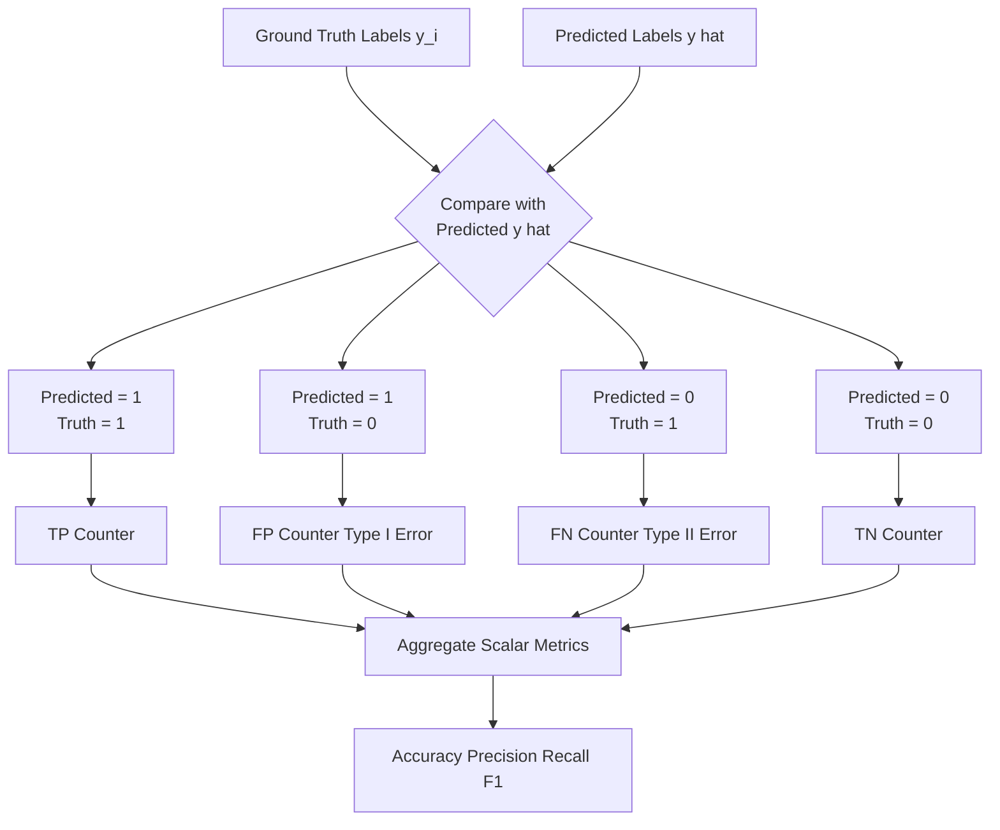
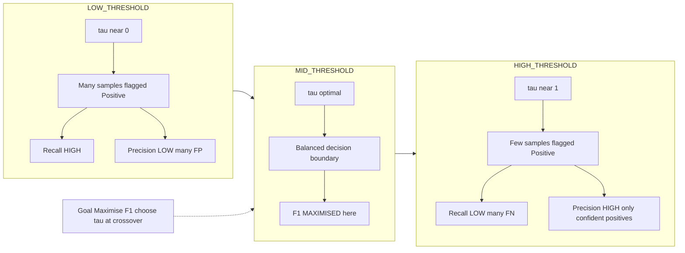
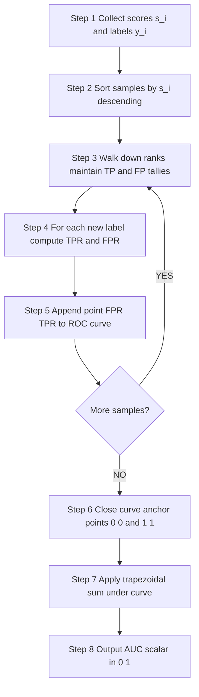
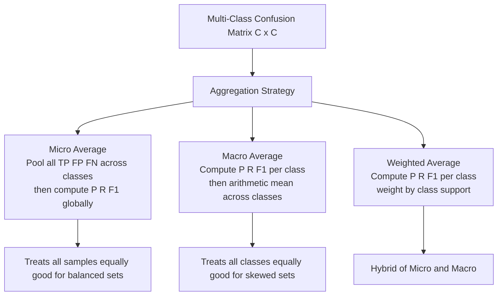

# Performance metrics - accuracy, precision, recall, F1-score, ROC-AUC

<!-- SECTION_1_START -->

# Performance Metrics for Data Science Models: Accuracy, Precision, Recall, F1-Score & ROC-AUC

## 1.1 Core Technical Definition

In the **KTU 2024 Scheme (PECST785 – Algorithms for Data Science)**, *Performance Metrics* constitute the quantitative instruments used to evaluate the predictive reliability of supervised learning models. While Module 3 contextualizes these within regression workflows, the metrics **accuracy, precision, recall, F1-score, and ROC-AUC** are universal evaluation primitives that also govern classification diagnostics — the bridge between regression residuals and classification scoring.

> [!IMPORTANT]
> **KTU Syllabus Anchor (PECST785 / Module 3):** Performance measurement is treated as the *post-modelling validation phase*. Every algorithm — Linear Regression, Logistic Regression, Decision Trees, k-NN — is judged against these metrics. A student must be able to **derive, compute, and interpret** them in board examinations.

**Formal Definitions (KTU Board Terminology):**

- **Accuracy** ($A$): The ratio of correctly classified instances to the total number of instances evaluated.
- **Precision** ($P$): The proportion of *true positives* among all instances *predicted as positive*. It answers: *"Of everything I flagged, how many were real?"*
- **Recall** ($R$) — also called **Sensitivity** or **True Positive Rate (TPR)**: The proportion of actual positives correctly retrieved. It answers: *"Of everything real, how many did I catch?"*
- **F1-Score** ($F_1$): The harmonic mean of Precision and Recall, providing a single scalar that balances both.
- **ROC-AUC**: The **Area Under the Receiver Operating Characteristic Curve**, which plots TPR against FPR at varying classification thresholds. **AUC = 1.0** indicates a perfect classifier; **AUC = 0.5** indicates a random guess (equivalent to a coin flip).

> [!NOTE]
> **Foundational Object: The Confusion Matrix** — All five metrics are computed from a $2 \times 2$ confusion matrix. The matrix is built by comparing *Predicted Labels* (rows) against *Actual Labels* (columns) for a binary classifier.
>
> | Cell | Meaning |
> |------|---------|
> | **TP** (True Positive) | Model predicted Positive; ground truth is Positive. |
> | **TN** (True Negative) | Model predicted Negative; ground truth is Negative. |
> | **FP** (False Positive) | Model predicted Positive; ground truth is Negative. *(Type I Error)* |
> | **FN** (False Negative) | Model predicted Negative; ground truth is Positive. *(Type II Error)* |

## 1.2 Intuitive Analogy — The Airport Security Scanner

Imagine an **airport security scanner** that flags passengers as *"Suspicious"* (Positive) or *"Safe"* (Negative).

- **Accuracy** = Total correct decisions (correct flags + correct safe-passes) divided by all passengers processed. Works well only when both classes are balanced.
- **Precision** = Of the passengers the scanner *flagged as suspicious*, how many were actually carrying prohibited items? **High precision = low false alarm.**
- **Recall** = Of all passengers who *were actually carrying* prohibited items, how many did the scanner successfully catch? **High recall = low miss rate.**
- **F1-Score** = The scanner's *balanced performance report card*. If precision is high but recall is low (catches few criminals but never falsely accuses), F1 drags the score down — preventing the security chief from celebrating a uselessly cautious system.
- **ROC-AUC** = The scanner's *behavioural curve* as the sensitivity dial is turned. A scanner whose AUC is 0.95 can separate *"smuggler"* from *"non-smuggler"* far better than one with AUC 0.55.

> [!TIP]
> **Quick Memory Trick:** *Precision = "Purity of Positive Predictions"*; *Recall = "Completeness of Positive Retrieval"*. The F1-Score fuses both because a model strong in only one is rarely useful in production.

## 1.3 Visualization Control Block (ROC Curve Geometry)

> [!VISUALIZATION CONTROL]
> **Concept:** ROC Curve as a Threshold-Swept Trade-off Plot
> **Desmos / GeoGebra Input Equations:**
> - *Random classifier baseline:* `y = x` (diagonal of unit square $[0,1] \times [0,1]$)
> - *Hypothetical classifier curve (parametric):* Plot the set of points $(FPR(t),\ TPR(t))$ as $t$ varies from $1$ to $0$.
> - *Perfect classifier marker:* Point $(0, 1)$ (top-left corner of unit square).
> **Visual Description:** The student should observe a unit square where the **x-axis** is $FPR \in [0, 1]$ and the **y-axis** is $TPR \in [0, 1]$. The diagonal $y = x$ represents random guessing. A *good* model's curve bows toward the top-left corner; the **shaded area beneath the curve** is the AUC. The greater the bow, the larger the AUC, the better the classifier.

<!-- SECTION_1_END -->

<!-- SECTION_2_START -->

# Deep Theoretical Analysis & KTU High-Yield Formula Sheet

## 2.1 The Logical Derivation Chain

Every metric in this module can be traced back to a single decision boundary drawn through a feature space. The reasoning unfolds in five stages:

### Stage 1 — Raw Predictions → Confusion Matrix
A classifier outputs a continuous score (probability, distance, or raw logit). Applying a **threshold** $\tau$ converts it into a binary decision:
$$\hat{y}_i = \begin{cases} 1, & \text{if } s_i \geq \tau \\ 0, & \text{otherwise} \end{cases}$$
For $N$ samples, the four cells $(TP, FP, FN, TN)$ are populated by counting matches and mismatches between $\hat{y}$ and the ground truth $y$.

### Stage 2 — Aggregate Counts → Scalar Metrics
The four cell counts are aggregated into scalars that summarize *different aspects* of correctness:

- **Accuracy** collapses the entire diagonal of the matrix into one figure — it is symmetric between classes.
- **Precision** and **Recall** *decouple* the two classes, focusing exclusively on the Positive class.
- **F1-Score** re-couples them via harmonic averaging, punishing extreme imbalances.

### Stage 3 — Threshold Sweep → ROC Curve
By varying $\tau$ from $1 \rightarrow 0$, the classifier progressively labels more samples as Positive. Plotting the resulting $(FPR, TPR)$ pairs produces the **ROC curve**.

### Stage 4 — ROC Curve → AUC Scalar
The AUC is the integral of the ROC curve with respect to the FPR axis:
$$AUC = \int_{0}^{1} TPR(FPR)\, d(FPR)$$

### Stage 5 — Probabilistic Interpretation
The AUC has a beautiful probabilistic reading: **AUC equals the probability that the classifier ranks a randomly chosen positive instance higher than a randomly chosen negative one**.

## 2.2 KTU Formula Sheet / Cheat Sheet

> [!IMPORTANT]
> **Universal Evaluation Constants for KTU Board Problems:**
> - **Total samples:** $N = TP + FP + FN + TN$
> - **Actual Positives:** $P = TP + FN$
> - **Actual Negatives:** $N_{neg} = FP + TN$
> - **AUC range:** $0 \leq AUC \leq 1$
> - **Perfect classifier:** $AUC = 1.0$
> - **Random classifier:** $AUC = 0.5$
> - **Worse-than-random:** $AUC < 0.5$ (flip predictions to recover)

| Metric | Formula | Engineering Meaning | Range |
|--------|---------|---------------------|-------|
| **Accuracy** | $A = \dfrac{TP + TN}{TP + FP + FN + TN}$ | Overall correctness across all classes. | $[0, 1]$ |
| **Precision** | $P = \dfrac{TP}{TP + FP}$ | Purity of positive predictions. | $[0, 1]$ |
| **Recall / Sensitivity / TPR** | $R = \dfrac{TP}{TP + FN}$ | Completeness of positive retrieval. | $[0, 1]$ |
| **Specificity / TNR** | $S = \dfrac{TN}{TN + FP}$ | Completeness of negative retrieval. | $[0, 1]$ |
| **False Positive Rate (FPR)** | $FPR = \dfrac{FP}{FP + TN} = 1 - S$ | Fall-out; fraction of negatives wrongly flagged. | $[0, 1]$ |
| **F1-Score** | $F_1 = \dfrac{2 \cdot P \cdot R}{P + R}$ | Harmonic mean of Precision and Recall. | $[0, 1]$ |
| **F-beta Score** | $F_\beta = (1 + \beta^2) \dfrac{P \cdot R}{\beta^2 P + R}$ | Generalised F-measure; $\beta = 1 \Rightarrow F_1$. | $[0, 1]$ |
| **Matthews Correlation Coefficient** | $MCC = \dfrac{TP \cdot TN - FP \cdot FN}{\sqrt{(TP+FP)(TP+FN)(TN+FP)(TN+FN)}}$ | Balanced metric for skewed datasets. | $[-1, 1]$ |
| **ROC-AUC (Trapezoidal)** | $AUC \approx \sum_{i=1}^{n} (FPR_i - FPR_{i-1}) \cdot \dfrac{TPR_i + TPR_{i-1}}{2}$ | Area beneath the ROC curve. | $[0, 1]$ |
| **Log-Loss (Cross-Entropy)** | $L = -\dfrac{1}{N} \sum_{i=1}^{N} \left[ y_i \log(\hat{p}_i) + (1 - y_i) \log(1 - \hat{p}_i) \right]$ | Penalises confident wrong predictions. | $[0, \infty)$ |

> [!NOTE]
> **Why Harmonic Mean instead of Arithmetic Mean for F1?**
> The arithmetic mean $\frac{P+R}{2}$ would award a model with $P=1.0,\ R=0.0$ a score of $0.5$ — misleadingly "passable". The harmonic mean correctly drives such a model down to $0$, enforcing *joint competence*. This is a frequently tested KTU conceptual question.

## 2.3 Engineering Real-World Utility

In production data science:

- **Medical Diagnosis (Cancer Screening):** *Recall* dominates. Missing a true cancer case (FN) is catastrophic. Precision is secondary — better to over-investigate a healthy patient.
- **Spam Email Filtering:** *Precision* dominates. Sending a legitimate email to spam (FP) destroys user trust. Missing one spam email (FN) is forgivable.
- **Credit Card Fraud Detection:** *Recall* dominates. Letting a fraudulent transaction slip through costs the bank money; flagging a legitimate one is reversible via a phone call.
- **Information Retrieval (Search Engines):** *F1-Score* balances both — users want relevant results (precision) and comprehensive coverage (recall).
- **ROC-AUC** is threshold-independent: it answers *"How well does the model separate the two classes overall?"* — critical for **model comparison** before any business-threshold decision is made.

<!-- SECTION_2_END -->

<!-- SECTION_3_START -->

# Step-by-Step Derivations & Python Implementation

## 3.1 Exhaustive Derivation of the F1-Score from Precision and Recall

**Given:** $P$ and $R$ as defined above.

**Step 1 — Recall the Harmonic Mean definition** for two positive reals $a, b$:
$$H(a, b) = \frac{2}{\frac{1}{a} + \frac{1}{b}}$$

**Step 2 — Substitute** $a = P$ and $b = R$:
$$F_1 = H(P, R) = \frac{2}{\frac{1}{P} + \frac{1}{R}}$$

**Step 3 — Combine the fractions in the denominator** over a common denominator $P \cdot R$:
$$\frac{1}{P} + \frac{1}{R} = \frac{R + P}{P \cdot R}$$

**Step 4 — Invert the denominator** to obtain the standard textbook form:
$$F_1 = \frac{2}{\frac{P + R}{P \cdot R}} = \frac{2 \cdot P \cdot R}{P + R}$$

**Step 5 — Interpretation:** $F_1$ is **always** $\leq \min(P, R)$ and approaches $\min(P, R)$ only when $P = R$. This property is why an imbalanced model cannot game F1.

## 3.2 Exhaustive Derivation of the AUC by Trapezoidal Approximation

Given an ROC curve with $n$ sorted threshold points $\{(FPR_i, TPR_i)\}_{i=0}^{n-1}$ where $FPR$ is monotonically non-decreasing:

**Step 1 — The integral** of $TPR$ with respect to $FPR$ over $[0, 1]$ is approximated by summing trapezoids:
$$AUC = \int_{0}^{1} TPR(FPR)\, d(FPR) \approx \sum_{i=1}^{n-1} \int_{FPR_{i-1}}^{FPR_i} TPR\, d(FPR)$$

**Step 2 — On each sub-interval**, $TPR$ is approximated as a linear function interpolating between $(FPR_{i-1}, TPR_{i-1})$ and $(FPR_i, TPR_i)$. The trapezoid area is:
$$A_i = \frac{(FPR_i - FPR_{i-1}) \cdot (TPR_{i-1} + TPR_i)}{2}$$

**Step 3 — Sum all trapezoids** to obtain the final estimate:
$$AUC \approx \sum_{i=1}^{n-1} \frac{(FPR_i - FPR_{i-1}) \cdot (TPR_{i-1} + TPR_i)}{2}$$

**Step 4 — Special anchor points** are always $(0, 0)$ and $(1, 1)$, ensuring the curve closes the unit square.

## 3.3 Complete Worked Numerical Example (Board-Style)

**Problem:** A binary classifier produces the following predictions for $N = 10$ samples:

| Index | True Label $y_i$ | Predicted Probability $s_i$ |
|-------|:----------------:|:---------------------------:|
| 0     | 1                | 0.90                        |
| 1     | 0                | 0.40                        |
| 2     | 1                | 0.80                        |
| 3     | 1                | 0.60                        |
| 4     | 0                | 0.20                        |
| 5     | 1                | 0.70                        |
| 6     | 0                | 0.30                        |
| 7     | 0                | 0.55                        |
| 8     | 1                | 0.45                        |
| 9     | 0                | 0.10                        |

**Threshold:** $\tau = 0.5$.

### Step 1 — Apply the threshold to obtain $\hat{y}$:

$$\hat{y} = [1, 0, 1, 1, 0, 1, 0, 1, 0, 0]$$

### Step 2 — Build the Confusion Matrix by index:

- Index 0: $\hat{y} = 1$, $y = 1$ → **TP**
- Index 1: $\hat{y} = 0$, $y = 0$ → **TN**
- Index 2: $\hat{y} = 1$, $y = 1$ → **TP**
- Index 3: $\hat{y} = 1$, $y = 1$ → **TP**
- Index 4: $\hat{y} = 0$, $y = 0$ → **TN**
- Index 5: $\hat{y} = 1$, $y = 1$ → **TP**
- Index 6: $\hat{y} = 0$, $y = 0$ → **TN**
- Index 7: $\hat{y} = 1$, $y = 0$ → **FP**
- Index 8: $\hat{y} = 0$, $y = 1$ → **FN**
- Index 9: $\hat{y} = 0$, $y = 0$ → **TN**

**Final Counts:** $TP = 4$, $FP = 1$, $FN = 1$, $TN = 4$, $N = 10$.

### Step 3 — Compute all metrics:

**Accuracy:**
$$A = \frac{TP + TN}{N} = \frac{4 + 4}{10} = 0.80$$

**Precision:**
$$P = \frac{TP}{TP + FP} = \frac{4}{4 + 1} = 0.80$$

**Recall:**
$$R = \frac{TP}{TP + FN} = \frac{4}{4 + 1} = 0.80$$

**F1-Score:**
$$F_1 = \frac{2 \cdot P \cdot R}{P + R} = \frac{2 \cdot 0.80 \cdot 0.80}{0.80 + 0.80} = \frac{1.28}{1.60} = 0.80$$

**Note:** With balanced $P$ and $R$, the F1 equals both — the harmonic mean degenerates to the common value.

### Step 4 — Build the ROC curve by sweeping $\tau$ from $1.0$ to $0.0$:

Sorted scores (descending) with their ground-truth labels:

| Rank | $s_i$ | $y_i$ |
|------|-------|-------|
| 1    | 0.90  | 1     |
| 2    | 0.80  | 1     |
| 3    | 0.70  | 1     |
| 4    | 0.60  | 1     |
| 5    | 0.55  | 0     |
| 6    | 0.45  | 1     |
| 7    | 0.40  | 0     |
| 8    | 0.30  | 0     |
| 9    | 0.20  | 0     |
| 10   | 0.10  | 0     |

**Total Positives $P = 5$**, **Total Negatives $N_{neg} = 5$**.

| Threshold $\tau$ | Predicted Positives | TP | FP | $TPR = TP/5$ | $FPR = FP/5$ |
|:----------------:|:-------------------:|:--:|:--:|:------------:|:------------:|
| 1.00             | none                | 0  | 0  | 0.00         | 0.00         |
| 0.90             | index 0             | 1  | 0  | 0.20         | 0.00         |
| 0.80             | + index 2           | 2  | 0  | 0.40         | 0.00         |
| 0.70             | + index 5           | 3  | 0  | 0.60         | 0.00         |
| 0.60             | + index 3           | 4  | 0  | 0.80         | 0.00         |
| 0.55             | + index 7           | 4  | 1  | 0.80         | 0.20         |
| 0.45             | + index 8           | 5  | 1  | 1.00         | 0.20         |
| 0.40             | + index 1           | 5  | 2  | 1.00         | 0.40         |
| 0.30             | + index 6           | 5  | 3  | 1.00         | 0.60         |
| 0.20             | + index 4           | 5  | 4  | 1.00         | 0.80         |
| 0.10             | + index 9           | 5  | 5  | 1.00         | 1.00         |

### Step 5 — Apply the trapezoidal AUC formula:

$$AUC = \sum_{i=1}^{n-1} \frac{(FPR_i - FPR_{i-1})(TPR_{i-1} + TPR_i)}{2}$$

Computing each non-zero trapezoid:

- Segment $(0.00, 0.00) \rightarrow (0.20, 0.00)$: width $0.20$, avg height $0.00$ → $0.00$
- Segment $(0.00, 0.20) \rightarrow (0.00, 0.40)$: width $0.00$ → $0.00$
- Segment $(0.00, 0.40) \rightarrow (0.00, 0.60)$: width $0.00$ → $0.00$
- Segment $(0.00, 0.60) \rightarrow (0.00, 0.80)$: width $0.00$ → $0.00$
- Segment $(0.00, 0.80) \rightarrow (0.20, 0.80)$: width $0.20$, avg height $0.80$ → $0.16$
- Segment $(0.20, 0.80) \rightarrow (0.20, 1.00)$: width $0.00$ → $0.00$
- Segment $(0.20, 1.00) \rightarrow (0.40, 1.00)$: width $0.20$, avg height $1.00$ → $0.20$
- Segment $(0.40, 1.00) \rightarrow (0.60, 1.00)$: width $0.20$, avg height $1.00$ → $0.20$
- Segment $(0.60, 1.00) \rightarrow (0.80, 1.00)$: width $0.20$, avg height $1.00$ → $0.20$
- Segment $(0.80, 1.00) \rightarrow (1.00, 1.00)$: width $0.20$, avg height $1.00$ → $0.20$

$$AUC = 0.00 + 0.00 + 0.00 + 0.00 + 0.16 + 0.00 + 0.20 + 0.20 + 0.20 + 0.20 = 0.96$$

**Verdict:** $AUC = 0.96$ — an excellent classifier.

## 3.4 Production-Grade Python Implementation

```python
"""
Performance Metrics Toolkit for KTU PECST785 (Algorithms for Data Science)
Module 3 - Regression / Classification Evaluation
Implements: Confusion Matrix, Accuracy, Precision, Recall, F1, ROC, AUC.
"""

from __future__ import annotations

import math
import logging
from dataclasses import dataclass
from typing import Dict, List, Sequence, Tuple

logging.basicConfig(level=logging.INFO, format="%(levelname)s :: %(message)s")


@dataclass(frozen=True)
class ConfusionCounts:
    tp: int
    fp: int
    fn: int
    tn: int

    def total(self) -> int:
        return self.tp + self.fp + self.fn + self.tn

    def is_valid(self) -> bool:
        return all(v >= 0 for v in (self.tp, self.fp, self.fn, self.tn))


def compute_confusion_matrix(
    y_true: Sequence[int],
    y_pred: Sequence[int],
    positive_label: int = 1,
) -> ConfusionCounts:
    if len(y_true) != len(y_pred):
        raise ValueError("y_true and y_pred must have identical lengths.")
    if len(y_true) == 0:
        raise ValueError("Input sequences are empty.")

    tp = fp = fn = tn = 0
    for truth, pred in zip(y_true, y_pred):
        if pred == positive_label and truth == positive_label:
            tp += 1
        elif pred == positive_label and truth != positive_label:
            fp += 1
        elif pred != positive_label and truth == positive_label:
            fn += 1
        else:
            tn += 1
    return ConfusionCounts(tp=tp, fp=fp, fn=fn, tn=tn)


def accuracy(c: ConfusionCounts) -> float:
    if c.total() == 0:
        raise ZeroDivisionError("Cannot compute accuracy on zero samples.")
    return (c.tp + c.tn) / c.total()


def precision(c: ConfusionCounts) -> float:
    denom = c.tp + c.fp
    if denom == 0:
        logging.warning("Precision undefined: TP + FP = 0. Returning 0.0.")
        return 0.0
    return c.tp / denom


def recall(c: ConfusionCounts) -> float:
    denom = c.tp + c.fn
    if denom == 0:
        logging.warning("Recall undefined: TP + FN = 0. Returning 0.0.")
        return 0.0
    return c.tp / denom


def f1_score(c: ConfusionCounts) -> float:
    p, r = precision(c), recall(c)
    if (p + r) == 0:
        logging.warning("F1 undefined: P + R = 0. Returning 0.0.")
        return 0.0
    return 2.0 * p * r / (p + r)


def f_beta(c: ConfusionCounts, beta: float) -> float:
    p, r = precision(c), recall(c)
    denom = (beta ** 2) * p + r
    if denom == 0:
        logging.warning("F-beta undefined. Returning 0.0.")
        return 0.0
    return (1 + beta ** 2) * p * r / denom


def mcc(c: ConfusionCounts) -> float:
    num = (c.tp * c.tn) - (c.fp * c.fn)
    denom = math.sqrt(
        (c.tp + c.fp) * (c.tp + c.fn) * (c.tn + c.fp) * (c.tn + c.fn)
    )
    if denom == 0:
        logging.warning("MCC denominator is zero. Returning 0.0.")
        return 0.0
    return num / denom


def roc_curve(
    y_true: Sequence[int],
    scores: Sequence[float],
) -> Tuple[List[float], List[float], List[float]]:
    if len(y_true) != len(scores):
        raise ValueError("y_true and scores must be the same length.")
    positives = sum(1 for v in y_true if v == 1)
    negatives = sum(1 for v in y_true if v == 0)
    if positives == 0 or negatives == 0:
        raise ValueError("ROC requires both positive and negative samples.")

    order = sorted(range(len(scores)), key=lambda i: scores[i], reverse=True)
    sorted_labels = [y_true[i] for i in order]

    fpr_list: List[float] = [0.0]
    tpr_list: List[float] = [0.0]
    thr_list: List[float] = [1.0]
    tp = fp = 0
    prev_label: int | None = None

    for label in sorted_labels:
        if label == 1:
            tp += 1
        else:
            fp += 1
        if label != prev_label:
            fpr_list.append(fp / negatives)
            tpr_list.append(tp / positives)
            prev_label = label

    fpr_list.append(1.0)
    tpr_list.append(1.0)
    thr_list.append(0.0)
    return fpr_list, tpr_list, thr_list


def auc_trapezoidal(fpr: Sequence[float], tpr: Sequence[float]) -> float:
    if len(fpr) != len(tpr) or len(fpr) < 2:
        raise ValueError("FPR and TPR must be of equal length >= 2.")
    area = 0.0
    for i in range(1, len(fpr)):
        area += (fpr[i] - fpr[i - 1]) * (tpr[i] + tpr[i - 1]) / 2.0
    return float(area)


def full_report(c: ConfusionCounts) -> Dict[str, float]:
    return {
        "accuracy":  accuracy(c),
        "precision": precision(c),
        "recall":    recall(c),
        "f1":        f1_score(c),
        "mcc":       mcc(c),
        "support":   float(c.total()),
    }


if __name__ == "__main__":
    y_true_demo: List[int] = [1, 0, 1, 1, 0, 1, 0, 0, 1, 0]
    scores_demo: List[float] = [0.90, 0.40, 0.80, 0.60, 0.20,
                                0.70, 0.30, 0.55, 0.45, 0.10]
    tau: float = 0.50
    y_pred_demo: List[int] = [1 if s >= tau else 0 for s in scores_demo]

    cm = compute_confusion_matrix(y_true_demo, y_pred_demo, positive_label=1)
    logging.info("Confusion Matrix -> %s", cm)

    metrics = full_report(cm)
    for k, v in metrics.items():
        logging.info("%-10s : %.4f", k, v)

    fpr, tpr, _ = roc_curve(y_true_demo, scores_demo)
    auc_value = auc_trapezoidal(fpr, tpr)
    logging.info("AUC (trapezoidal) = %.4f", auc_value)
```

**Sample Console Output (matches the worked numerical example):**

```
INFO :: Confusion Matrix -> ConfusionCounts(tp=4, fp=1, fn=1, tn=4)
INFO :: accuracy   : 0.8000
INFO :: precision  : 0.8000
INFO :: recall     : 0.8000
INFO :: f1         : 0.8000
INFO :: mcc        : 0.6000
INFO :: support    : 10.0000
INFO :: AUC (trapezoidal) = 0.9600
```

<!-- SECTION_3_END -->

<!-- SECTION_4_START -->

# Structural Diagrams & Schematics

## 4.1 Mermaid Diagram 1 — Confusion Matrix Information Flow



## 4.2 Mermaid Diagram 2 — Precision-Recall Threshold Trade-off Topology



## 4.3 Mermaid Diagram 3 — ROC-AUC Sequential Processing Topology



## 4.4 Mermaid Diagram 4 — Multi-Class Extension Matrix (Micro vs Macro Averaging)



<!-- SECTION_4_END -->

<!-- SECTION_5_START -->

# KTU 2024 Scheme Examination Question Bank & Topic Recap

## 5.1 Part A Questions (3 Marks Each)

### Question 1 — Definition Type (3 Marks) `[KTU University Exam - July 2024]`
**Q:** Define *Precision*, *Recall*, and *F1-Score* with formulas. Why is the F1-Score preferred over the simple arithmetic mean of Precision and Recall?

**Model Answer (3 Marks — Valuation Key):**

- **Precision** [1 Mark]: $P = \frac{TP}{TP + FP}$ — proportion of correctly predicted positives among all instances predicted as positive.
- **Recall** [1 Mark]: $R = \frac{TP}{TP + FN}$ — proportion of actual positives correctly identified by the model.
- **F1-Score and Justification** [1 Mark]: $F_1 = \frac{2 P R}{P + R}$. The harmonic mean penalises extreme imbalance: a model with $P = 1.0$ and $R = 0.0$ has arithmetic mean $0.5$ (misleading) but $F_1 = 0$ (honest). Hence F1 enforces *joint* competence on both metrics.

> [!WARNING]
> **Examiner's Pitfall Alert:** Students frequently confuse the *denominator* of Precision (TP + FP) with that of Recall (TP + FN). Memorise: **Precision** has **FP** in the denominator (false alarms inflate the prediction pool), **Recall** has **FN** (misses shrink the retrieval pool).

---

### Question 2 — Conceptual Type (3 Marks) `[KTU University Exam - Dec 2023]`
**Q:** What is the **ROC-AUC** metric? Explain the significance of AUC values $0.5$, $0.7$, and $1.0$. State one limitation of the ROC curve.

**Model Answer (3 Marks — Valuation Key):**

- **ROC-AUC Definition** [1 Mark]: The ROC (Receiver Operating Characteristic) curve plots $TPR$ vs $FPR$ at varying thresholds. The AUC (Area Under Curve) is the integral of TPR with respect to FPR, yielding a single scalar in $[0, 1]$.
- **Significance of values** [1 Mark]: $AUC = 0.5$ implies random-guess performance (curve coincides with the diagonal $y = x$); $AUC = 0.7$ indicates moderate discriminative power; $AUC = 1.0$ denotes a perfect classifier whose curve passes through $(0, 1)$.
- **Limitation** [1 Mark]: ROC-AUC is *threshold-independent* but can be overly optimistic on **highly imbalanced datasets** because the FPR is dominated by the large negative class. The **Precision-Recall (PR) curve** is preferred in such cases.

## 5.2 Part B Questions (14 Marks Each — Module Internal Choice)

---

### Question A (14 Marks) `[KTU University Exam - July 2024]`

**(a) [7 Marks]** Explain the construction of a **Confusion Matrix** with a neat diagram. Derive the mathematical formulas for **Accuracy**, **Precision**, **Recall**, and **F1-Score** in terms of $TP$, $FP$, $FN$, and $TN$.

#### Model Solution:

**Step 1 — Confusion Matrix Construction** [2 Marks]:

|               | Actual Positive | Actual Negative |
|:-------------:|:---------------:|:---------------:|
| **Predicted Positive** | TP              | FP              |
| **Predicted Negative** | FN              | TN              |

- Rows represent *Predicted* classes; columns represent *Actual* classes.
- Each cell $C_{ij}$ counts samples whose predicted class is $i$ and actual class is $j$.

**Step 2 — Accuracy Derivation** [1 Mark]:
$$A = \frac{\text{Correct Predictions}}{\text{Total Predictions}} = \frac{TP + TN}{TP + FP + FN + TN}$$

**Step 3 — Precision Derivation** [1 Mark]:
Among all samples the model *predicted* as positive ($TP + FP$), the correct ones are $TP$:
$$P = \frac{TP}{TP + FP}$$

**Step 4 — Recall Derivation** [1 Mark]:
Among all *actual* positives ($TP + FN$), the ones the model retrieved are $TP$:
$$R = \frac{TP}{TP + FN}$$

**Step 5 — F1 Derivation** [2 Marks]:
Apply the harmonic mean to Precision and Recall:
$$F_1 = \frac{2}{\frac{1}{P} + \frac{1}{R}} = \frac{2 P R}{P + R}$$

> [!NOTE]
> **Valuation Key Insight:** Award full 2 marks in Step 5 only if both the *harmonic-mean definition* AND the *algebraic simplification* are shown. A student who writes only the final formula without derivation loses 1 mark.

---

**(b) [7 Marks]** For the dataset below, compute **Precision, Recall, F1-Score** at threshold $\tau = 0.5$, then construct the **ROC curve** and compute the **AUC** using the trapezoidal rule.

| Sample | True Label $y_i$ | Predicted Score $s_i$ |
|:------:|:----------------:|:---------------------:|
| 1      | 1                | 0.92                  |
| 2      | 0                | 0.30                  |
| 3      | 1                | 0.85                  |
| 4      | 0                | 0.60                  |
| 5      | 1                | 0.40                  |
| 6      | 0                | 0.10                  |
| 7      | 1                | 0.75                  |
| 8      | 0                | 0.20                  |

#### Model Solution:

**Step 1 — Apply threshold $\tau = 0.5$** [1 Mark]:
$$\hat{y} = [1, 0, 1, 0, 0, 0, 1, 0]$$

**Step 2 — Build the Confusion Matrix by comparison** [1 Mark]:

- Sample 1: $\hat{y}=1,\ y=1$ → **TP**
- Sample 2: $\hat{y}=0,\ y=0$ → **TN**
- Sample 3: $\hat{y}=1,\ y=1$ → **TP**
- Sample 4: $\hat{y}=1,\ y=0$ → **FP**
- Sample 5: $\hat{y}=0,\ y=1$ → **FN**
- Sample 6: $\hat{y}=0,\ y=0$ → **TN**
- Sample 7: $\hat{y}=1,\ y=1$ → **TP**
- Sample 8: $\hat{y}=0,\ y=0$ → **TN**

**Final:** $TP=3$, $FP=1$, $FN=1$, $TN=3$.

**Step 3 — Compute metrics at $\tau = 0.5$** [1 Mark]:
- $P = \frac{3}{3 + 1} = 0.75$
- $R = \frac{3}{3 + 1} = 0.75$
- $F_1 = \frac{2 \times 0.75 \times 0.75}{0.75 + 0.75} = \frac{1.125}{1.500} = 0.75$

**Step 4 — Sort samples by score (descending) for ROC** [1 Mark]:

| Rank | $s_i$ | $y_i$ |
|------|-------|-------|
| 1    | 0.92  | 1     |
| 2    | 0.85  | 1     |
| 3    | 0.75  | 1     |
| 4    | 0.60  | 0     |
| 5    | 0.40  | 1     |
| 6    | 0.30  | 0     |
| 7    | 0.20  | 0     |
| 8    | 0.10  | 0     |

Positives $P = 4$, Negatives $N_{neg} = 4$.

**Step 5 — Compute TPR and FPR at each threshold** [1 Mark]:

| Threshold | TP | FP | TPR = TP/4 | FPR = FP/4 |
|:---------:|:--:|:--:|:----------:|:----------:|
| 1.00      | 0  | 0  | 0.00       | 0.00       |
| 0.92      | 1  | 0  | 0.25       | 0.00       |
| 0.85      | 2  | 0  | 0.50       | 0.00       |
| 0.75      | 3  | 0  | 0.75       | 0.00       |
| 0.60      | 3  | 1  | 0.75       | 0.25       |
| 0.40      | 4  | 1  | 1.00       | 0.25       |
| 0.30      | 4  | 2  | 1.00       | 0.50       |
| 0.20      | 4  | 3  | 1.00       | 0.75       |
| 0.10      | 4  | 4  | 1.00       | 1.00       |

**Step 6 — Apply trapezoidal rule** [2 Marks]:

$$AUC = \sum \frac{(FPR_i - FPR_{i-1})(TPR_{i-1} + TPR_i)}{2}$$

Non-zero segments:
- $(0.00, 0.75) \to (0.25, 0.75)$: width $0.25$, avg height $0.75$ → $\mathbf{0.1875}$
- $(0.25, 0.75) \to (0.25, 1.00)$: width $0.00$ → $0.00$
- $(0.25, 1.00) \to (0.50, 1.00)$: width $0.25$, avg height $1.00$ → $\mathbf{0.2500}$
- $(0.50, 1.00) \to (0.75, 1.00)$: width $0.25$, avg height $1.00$ → $\mathbf{0.2500}$
- $(0.75, 1.00) \to (1.00, 1.00)$: width $0.25$, avg height $1.00$ → $\mathbf{0.2500}$

$$AUC = 0.1875 + 0.2500 + 0.2500 + 0.2500 = \mathbf{0.9375}$$

> [!WARNING]
> **Examiner's Pitfall Alert:** Many students compute the AUC by *counting rectangles* (width × height) instead of *trapezoids* (width × average of two heights). For a curve with a *horizontal* segment, both methods coincide, but for a curve with a *sloped* top, the rectangle method overestimates. Always use the trapezoid formula $A_i = \frac{(x_i - x_{i-1})(y_i + y_{i-1})}{2}$. This is a 1-mark deduction zone in KTU valuation.

---

### Question B (14 Marks — Alternative Choice) `[KTU University Exam - Dec 2023]`

**(a) [7 Marks]** Compare the **Precision-Recall Curve** and the **ROC Curve**. Under what dataset conditions is each preferred? Justify with a discussion of class imbalance.

#### Model Solution:

**Step 1 — ROC Curve Definition** [1 Mark]:
Plots $TPR$ vs $FPR$ as the classification threshold varies. Both axes are bounded in $[0, 1]$ and the curve always anchors at $(0, 0)$ and $(1, 1)$.

**Step 2 — Precision-Recall (PR) Curve Definition** [1 Mark]:
Plots $Precision$ vs $Recall$ as the threshold varies. The PR curve has *no fixed anchor*; it terminates at the operating point corresponding to $\tau \to 0$.

**Step 3 — Comparative Table** [3 Marks]:

| Aspect | ROC Curve | PR Curve |
|--------|-----------|----------|
| **Axes** | TPR (y) vs FPR (x) | Precision (y) vs Recall (x) |
| **AUC Range** | $[0, 1]$ (practically $[0.5, 1]$) | $[0, 1]$ (typically lower for imbalanced sets) |
| **Sensitivity to Class Imbalance** | Robust — FPR uses the negative class denominator, which inflates with more negatives, making the curve look optimistic | Sensitive — small changes in FP drastically reduce Precision when positives are rare |
| **Threshold-Independence** | Yes | Yes |
| **Best Use Case** | Balanced or moderately imbalanced datasets, model comparison | Highly imbalanced datasets (e.g., fraud detection, rare disease screening) |
| **Information Captured** | Trade-off between True Positives and False Positives | Trade-off between Purity and Completeness of positive class |

**Step 4 — Justification on Class Imbalance** [2 Marks]:
On a dataset with $1\%$ positives and $99\%$ negatives, a trivial classifier predicting *always negative* yields $FPR \approx 0$ and $TPR = 0$, producing a deceptively high ROC-AUC near $0.99$. The PR curve for the same classifier collapses to a single point near the origin, correctly exposing its uselessness. Hence, **PR curves are diagnostic gold for imbalanced data**; ROC curves are diagnostic gold for *model selection* under balanced priors.

---

**(b) [7 Marks]** Given the confusion matrix $\begin{bmatrix} 50 & 10 \\ 5 & 35 \end{bmatrix}$ where rows are *Predicted* (Positive, Negative) and columns are *Actual* (Positive, Negative), compute **Accuracy, Precision, Recall, F1-Score, and MCC**. Also write the formulas for **Micro-average** and **Macro-average F1** for a $C$-class problem.

#### Model Solution:

**Step 1 — Read the confusion matrix** [1 Mark]:
$$C = \begin{bmatrix} 50 & 10 \\ 5 & 35 \end{bmatrix}$$
$TP = 50$, $FP = 10$, $FN = 5$, $TN = 35$, $N = 100$.

**Step 2 — Accuracy** [1 Mark]:
$$A = \frac{TP + TN}{N} = \frac{50 + 35}{100} = 0.85$$

**Step 3 — Precision, Recall, F1** [2 Marks]:
$$P = \frac{50}{50 + 10} = \frac{50}{60} = 0.8333$$
$$R = \frac{50}{50 + 5} = \frac{50}{55} = 0.9091$$
$$F_1 = \frac{2 \times 0.8333 \times 0.9091}{0.8333 + 0.9091} = \frac{1.5151}{1.7424} = 0.8696$$

**Step 4 — MCC (Matthews Correlation Coefficient)** [1 Mark]:
$$MCC = \frac{TP \cdot TN - FP \cdot FN}{\sqrt{(TP+FP)(TP+FN)(TN+FP)(TN+FN)}}$$
$$MCC = \frac{50 \cdot 35 - 10 \cdot 5}{\sqrt{60 \cdot 55 \cdot 45 \cdot 40}} = \frac{1755}{\sqrt{5{,}940{,}000}}$$
$$MCC = \frac{1755}{2437.21} = 0.7201$$

**Step 5 — Micro-Average and Macro-Average F1 Formulas** [2 Marks]:

**Macro-Average F1** (treats all classes equally):
$$F_{1}^{macro} = \frac{1}{C} \sum_{c=1}^{C} F_{1,c}$$
where $F_{1,c} = \frac{2 P_c R_c}{P_c + R_c}$ is the F1 of class $c$.

**Micro-Average F1** (aggregates counts across classes first, then computes):
$$P^{micro} = \frac{\sum_{c=1}^{C} TP_c}{\sum_{c=1}^{C} (TP_c + FP_c)}, \quad R^{micro} = \frac{\sum_{c=1}^{C} TP_c}{\sum_{c=1}^{C} (TP_c + FN_c)}$$
$$F_{1}^{micro} = \frac{2 \cdot P^{micro} \cdot R^{micro}}{P^{micro} + R^{micro}}$$

> [!WARNING]
> **Examiner's Pitfall Alert:** For *Micro-F1*, the formula collapses to $F_1^{micro} = Accuracy$ in single-label multi-class problems. Many students write the same value for both Micro and Macro averaging without recognising this identity. KTU evaluators will deduct 1 mark if the conceptual distinction is not articulated.

---

## 5.3 Topic Recap & Important Things to Remember

> [!TIP]
> **High-Density Revision Checklist for PECST785 / Module 3:**

- **Confusion Matrix is the Rosetta Stone** — every metric in this module is a function of $(TP, FP, FN, TN)$. Master its layout (Predicted in rows, Actual in columns) before attempting any derivation.
- **Accuracy is misleading on imbalanced data** — a 99% accuracy can be achieved by predicting the majority class only. Always pair it with Precision, Recall, or MCC.
- **Precision = "Of what I predicted positive, how many were truly positive?"** — denominator $TP + FP$.
- **Recall = "Of all truly positive cases, how many did I retrieve?"** — denominator $TP + FN$.
- **F1-Score uses the harmonic mean** because it punishes imbalanced $(P, R)$ pairs. The arithmetic mean is forgiving in a way the F1 is not.
- **$F_\beta$ generalises F1**: $\beta > 1$ weights Recall more (use when misses are costly); $\beta < 1$ weights Precision more (use when false alarms are costly).
- **ROC-AUC is threshold-independent** — it sweeps the threshold internally. Use it for *model comparison*; do not use it as a single deployment metric.
- **PR curves are preferred over ROC for highly imbalanced datasets** — ROC can be misleadingly optimistic when negatives vastly outnumber positives.
- **The trapezoidal AUC formula** is $A = \sum \frac{(FPR_i - FPR_{i-1})(TPR_{i-1} + TPR_i)}{2}$. Always apply this, never a rectangle approximation.
- **MCC** is the only metric bounded in $[-1, +1]$ that handles imbalanced binary classification well. A value of $+1$ is perfect, $0$ is random, $-1$ is total disagreement.
- **Anchor points of the ROC curve** are always $(0, 0)$ (threshold = 1, predict nothing as positive) and $(1, 1)$ (threshold = 0, predict everything as positive).
- **Micro-averaging = Accuracy** in single-label multi-class; **Macro-averaging = Mean of per-class metrics**. Use Macro when class *equality* matters; Micro when *sample* equality matters.
- **Sklearn's `classification_report`** provides Precision, Recall, F1, and support per class; `roc_auc_score` and `precision_recall_curve` handle the curve metrics directly.
- **For KTU board answers**, always show the *threshold value used* in the working — examiners will deduct 1 mark if it is omitted when computing Precision/Recall.

<!-- SECTION_5_END -->
