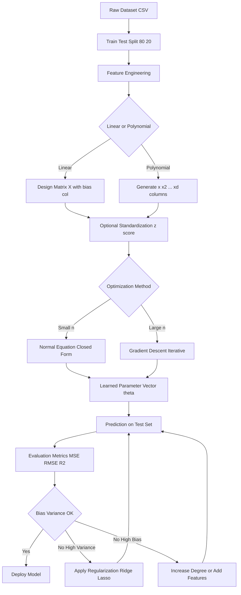
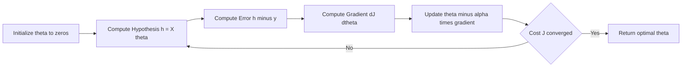
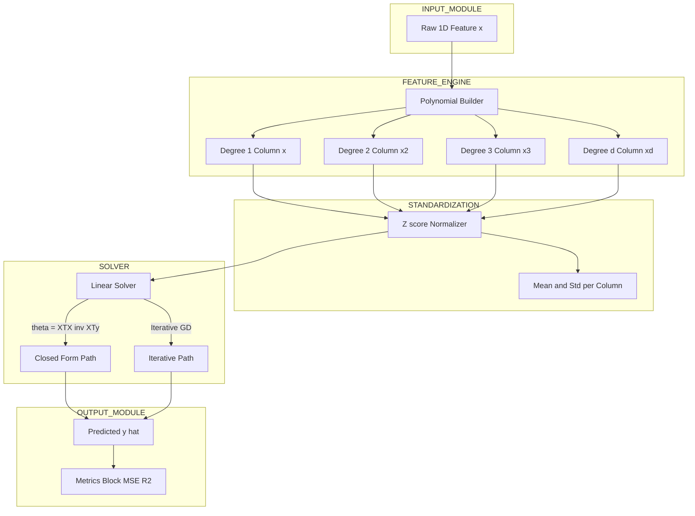
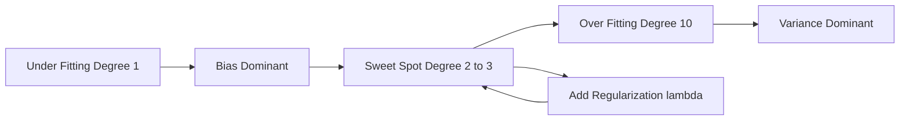

# Regression Algorithms - Linear regression and polynomial regression

<!-- SECTION_1_START -->

# 1. Core Technical Definition & Intuitive Overview

## 1.1 Linear Regression — Formal Definition

> [!IMPORTANT]
> **Linear Regression** is a **supervised machine learning regression algorithm** that models the relationship between a **scalar dependent (target) variable** $y$ and one or more **independent (predictor) variables** $X = (x_1, x_2, \ldots, x_n)$ by fitting a **linear hypothesis function** whose parameters are estimated by minimizing the **residual sum of squares (RSS)** between the observed targets and the predicted values.

The general hypothesis is given by the affine (linear-in-parameters) function:

$$
h_{\theta}(x) = \theta_0 + \theta_1 x_1 + \theta_2 x_2 + \cdots + \theta_n x_n
$$

where $\theta_0$ is the **bias (intercept)** term and $\theta_1, \ldots, \theta_n$ are the **feature weights (regression coefficients)**. The training objective is to find the parameter vector $\boldsymbol{\theta}$ that minimizes the **Mean Squared Error (MSE)** loss over the training set $\{(x^{(i)}, y^{(i)})\}_{i=1}^{m}$.

## 1.2 Polynomial Regression — Formal Definition

> [!IMPORTANT]
> **Polynomial Regression** is a form of **regression analysis** in which the relationship between the independent variable $X$ and the dependent variable $y$ is modelled as an **$n^{\text{th}}$-degree polynomial**. Although the model fits a non-linear curve to the data, statistically it remains a **linear model in the parameters** because we treat the polynomial features $\left(x, x^2, x^3, \ldots, x^n\right)$ as new independent variables and learn their coefficients linearly.

The hypothesis for a **single-variable degree-$d$ polynomial regression** is:

$$
h_{\theta}(x) = \theta_0 + \theta_1 x + \theta_2 x^2 + \theta_3 x^3 + \cdots + \theta_d x^d
$$

## 1.3 Conceptual Analogy / Intuition

> [!NOTE]
> **Real-World Analogy — "The Spring Stretcher":**
> Imagine a spring attached to a wall. When you apply a pulling force $x$, the spring stretches by a length $y$. A **linear regression** is like saying "for every Newton of force, the spring stretches by a fixed number of centimeters". This is the *Hooke's Law* — perfectly linear.
>
> Now imagine the spring is **non-ideal** — at very high forces, it begins to deform plastically and at very small forces the coils touch each other (no stretch). A **polynomial regression** is like saying "let me fit a curved equation that bends at the extremes to capture this non-linear spring behaviour". The curve still passes through the data smoothly, but can now bend upward or downward as needed.

**Geometric Intuition:**
- **Linear regression** in 2D draws the **best-fit straight line** through a cloud of points.
- **In higher dimensions**, it draws the **best-fit hyperplane** through the data points.
- **Polynomial regression** draws a **best-fit curve** (parabola, cubic, etc.) that wiggles to capture non-linear patterns.

## 1.4 Core Terminology

| Term | Definition |
|---|---|
| **Hypothesis Function** | The predicted function $h_{\theta}(x)$ that maps inputs to outputs. |
| **Parameters / Weights** | The vector $\boldsymbol{\theta} = (\theta_0, \theta_1, \ldots, \theta_n)$ that the model must learn. |
| **Cost Function $J(\theta)$** | A scalar measure of prediction error that we minimize during training. |
| **Residual** | The error $e^{(i)} = y^{(i)} - h_{\theta}(x^{(i)})$ for the $i^{\text{th}}$ training example. |
| **Learning Rate $\alpha$** | A hyperparameter (typically $\alpha \in [10^{-4}, 10^{-1}]$) controlling step size in gradient descent. |
| **Epoch** | One complete pass through the entire training dataset during optimization. |
| **Convergence** | The state when $J(\theta)$ stops decreasing meaningfully (change $<\epsilon$, often **$\epsilon = 10^{-6}$**). |

> [!IMPORTANT]
> **KTU 2024 Syllabus Highlight:**
> The official PECST785 (Algorithms for Data Science) Module-3 syllabus mandates coverage of **(i) Linear Regression – Simple and Multiple**, **(ii) Polynomial Regression**, and **(iii) Regularized Regression (Ridge & Lasso)**. All three are examinable in the End Semester Evaluation (ESE).

## 1.5 GeoGebra / Desmos Visualization

> [!VISUALIZATION CONTROL]
> **Concept:** Best-Fit Line and Polynomial Curve Through Scatter Points
> **GeoGebra / Desmos Input Equations:**
> * Linear: $f(x) = 0.8 x + 1.2$ (try changing the slope and intercept)
> * Polynomial degree 3: $g(x) = 0.05 x^3 - 0.6 x^2 + 1.8 x + 0.5$
> * Sample points: $(1, 2), (2, 3.5), (3, 5.1), (4, 6.4), (5, 8.2)$
> **Visual Description:** Students should observe that the **straight line** $f(x)$ under-fits the curving data trend, while the **cubic curve** $g(x)$ snakes through the points and captures the bend. The plot illustrates why a higher-degree polynomial is chosen when the underlying relationship is non-linear.

<!-- SECTION_1_END -->

<!-- SECTION_2_START -->

# 2. Deep Theoretical Analysis & KTU High-Yield Formula Sheet

## 2.1 The Regression Pipeline — Structured Logic

The process of building any regression model follows a **5-step operational pipeline**:

1. **Hypothesis Selection** — Choose the functional form (linear, polynomial, etc.) that best represents the data-generating process.
2. **Cost Function Definition** — Quantify the disagreement between predictions and ground-truth using a scalar loss (e.g., MSE).
3. **Parameter Optimization** — Use an optimization algorithm (Normal Equation, Gradient Descent, or SGD) to find the parameters $\boldsymbol{\theta}$ that minimize the cost.
4. **Validation & Regularization** — Evaluate the model on a held-out validation set; apply Ridge/Lasso if overfitting is detected.
5. **Inference & Reporting** — Predict on new data, report metrics (R², RMSE, MAE), and interpret coefficients.

## 2.2 The "Why" and "How" Behind Each Step

- **Why a squared error?** The squared error $J(\theta) = \frac{1}{2m}\sum_{i=1}^{m}\left(h_{\theta}(x^{(i)}) - y^{(i)}\right)^2$ is mathematically tractable (it is differentiable and convex for linear models), and it follows directly from the **Maximum Likelihood Estimate (MLE)** under the assumption of **Gaussian noise** $\epsilon \sim \mathcal{N}(0, \sigma^2)$.
- **Why the Normal Equation?** For small $n$ (number of features $<\! 10^4$), the closed-form solution $\boldsymbol{\theta} = (X^T X)^{-1} X^T y$ gives the **exact global optimum in one step** without iteration.
- **Why Gradient Descent?** For large $n$, computing $(X^T X)^{-1}$ is $O(n^3)$, making it infeasible. Iterative gradient descent is $O(n)$ per step and scales to massive datasets.
- **Why Polynomial Features?** Many real-world phenomena (population growth, projectile motion, GDP vs. time) follow **non-linear curves**; polynomial features let us retain linear-model simplicity while fitting curves.

## 2.3 KTU Formula Sheet / Cheat Sheet

> [!IMPORTANT]
> **All formulas below are high-yield for KTU ESE — memorize the units and the boundary cases.**

| # | Concept | Formula | Notation / Units |
|---|---|---|---|
| 1 | **Hypothesis (Multivariate)** | $h_{\theta}(x) = \theta_0 + \sum_{j=1}^{n} \theta_j x_j$ | $x \in \mathbb{R}^n$, $h \in \mathbb{R}$ |
| 2 | **Polynomial Hypothesis (degree $d$)** | $h_{\theta}(x) = \sum_{j=0}^{d} \theta_j x^j$ | $d \in \mathbb{N}$ |
| 3 | **Mean Squared Error (MSE) Cost** | $J(\theta) = \frac{1}{2m} \sum_{i=1}^{m} \left( h_{\theta}(x^{(i)}) - y^{(i)} \right)^2$ | Unit = $(\text{output units})^2$ |
| 4 | **Mean Absolute Error (MAE)** | $\text{MAE} = \frac{1}{m} \sum_{i=1}^{m} \left\vert y^{(i)} - h_{\theta}(x^{(i)}) \right\vert$ | Unit = output units |
| 5 | **Root Mean Squared Error (RMSE)** | $\text{RMSE} = \sqrt{ \frac{1}{m} \sum_{i=1}^{m} \left( y^{(i)} - \hat{y}^{(i)} \right)^2 }$ | Unit = output units |
| 6 | **Coefficient of Determination $R^2$** | $R^2 = 1 - \frac{\sum_{i} (y_i - \hat{y}_i)^2}{\sum_{i} (y_i - \bar{y})^2}$ | Dimensionless, $\leq 1$ |
| 7 | **Normal Equation (Closed Form)** | $\boldsymbol{\theta} = \left( X^T X \right)^{-1} X^T y$ | $X \in \mathbb{R}^{m \times (n+1)}$ |
| 8 | **Gradient of MSE** | $\frac{\partial J}{\partial \theta_j} = \frac{1}{m} \sum_{i=1}^{m} \left( h_{\theta}(x^{(i)}) - y^{(i)} \right) x_j^{(i)}$ | Vector form: $\nabla_{\theta} J = \frac{1}{m} X^T (X\theta - y)$ |
| 9 | **Gradient Descent Update** | $\theta_j \coloneqq \theta_j - \alpha \frac{\partial J}{\partial \theta_j}$ | $\alpha$ = learning rate |
| 10 | **Ridge (L2) Cost** | $J_{\text{ridge}}(\theta) = \text{MSE} + \lambda \sum_{j=1}^{n} \theta_j^2$ | $\lambda \geq 0$ |
| 11 | **Lasso (L1) Cost** | $J_{\text{lasso}}(\theta) = \text{MSE} + \lambda \sum_{j=1}^{n} \vert \theta_j \vert$ | $\lambda \geq 0$ |
| 12 | **Ridge Closed Form** | $\boldsymbol{\theta}_{\text{ridge}} = \left( X^T X + \lambda I \right)^{-1} X^T y$ | $I$ = $(n+1) \times (n+1)$ identity |
| 13 | **Bias-Variance Decomposition** | $\text{MSE} = \text{Bias}^2 + \text{Variance} + \sigma^2_{\text{irred. noise}}$ | Additive components |

> [!NOTE]
> **Why the $\frac{1}{2}$ in $J(\theta)$?** The factor $\frac{1}{2}$ in the cost function is purely a mathematical convenience — it cancels the **power-of-2** when taking the derivative, leaving $\frac{1}{m}\sum (h-y)x$ without a stray constant. It does NOT change the optimal $\boldsymbol{\theta}$ value.

## 2.4 Real-World Engineering & Data-Science Utility

| Domain | Application | Why Regression is Used |
|---|---|---|
| **Finance** | Stock-price prediction, credit-risk scoring, portfolio beta estimation | Continuous numerical target, interpretable coefficients |
| **Healthcare** | Predicting patient drug dosage response, ICU length of stay | Doctors need a numerical, explainable model (not a black box) |
| **Econometrics** | GDP forecasting, elasticity of demand | Causal inference relies on interpretable linear coefficients |
| **MLOps / Production** | Pre-processing for downstream models, A/B test result forecasting | Fast inference ($\sim$ microseconds), low memory footprint |
| **Computer Vision** | Bounding-box regression in object detection (YOLO, Faster R-CNN) | The final layer regresses continuous box coordinates |
| **Recommender Systems** | Predicting user ratings on a 1–5 scale | Rating prediction is a regression problem |
| **IoT & Sensor Fusion** | Predicting machine RUL (Remaining Useful Life) from vibration sensors | Time-series regression on polynomial features |

## 2.5 Bias-Variance Tradeoff in Polynomial Regression

The choice of polynomial degree $d$ is governed by the **Bias-Variance Tradeoff**:

$$
\text{Expected Test Error} = \text{Bias}^2 + \text{Variance} + \text{Irreducible Error}
$$

| Polynomial Degree $d$ | Training Error | Test Error | Behaviour |
|---|---|---|---|
| $d = 1$ (under-fit) | High | High | **High Bias, Low Variance** |
| $d = 2$ or $3$ (well-fit) | Low | Low | **Balanced** |
| $d = 10$ (over-fit) | $\approx 0$ | Very High | **Low Bias, High Variance** |

> [!WARNING]
> **Common Mistake:** Increasing the polynomial degree $d$ ALWAYS reduces training error (it can fit the training set perfectly), but it can EXPLODE test error due to overfitting. Always validate using a held-out set or cross-validation.

<!-- SECTION_2_END -->

<!-- SECTION_3_START -->

# 3. Step-by-Step Derivations, Code & Symbolic Implementation

## 3.1 Derivation of the Normal Equation for Linear Regression

We begin with the MSE cost function for $m$ training examples and $n$ features, where $X$ is the design matrix (with a leading column of 1s for the intercept $\theta_0$):

$$
J(\theta) = \frac{1}{2m} \sum_{i=1}^{m} \left( h_{\theta}(x^{(i)}) - y^{(i)} \right)^2 = \frac{1}{2m} (X\theta - y)^T (X\theta - y)
$$

### Step 1 — Expand the Quadratic Form

$$
J(\theta) = \frac{1}{2m} \left( \theta^T X^T X \theta - 2 y^T X \theta + y^T y \right)
$$

*Reasoning:* We use the identity $(a-b)^T(a-b) = a^T a - 2 a^T b + b^T b$ with $a = X\theta$ and $b = y$.

### Step 2 — Differentiate with Respect to $\theta$

$$
\frac{\partial J(\theta)}{\partial \theta} = \frac{1}{2m} \left( 2 X^T X \theta - 2 X^T y \right) = \frac{1}{m} \left( X^T X \theta - X^T y \right)
$$

*Reasoning:* The gradient of $\theta^T A \theta$ is $(A + A^T)\theta$; since $X^T X$ is symmetric, the result is $2 X^T X \theta$. The gradient of $b^T \theta$ is $b$, giving $X^T y$.

### Step 3 — Set the Gradient to Zero (First-Order Optimality)

$$
X^T X \theta - X^T y = 0
$$

### Step 4 — Solve the Linear System

$$
X^T X \theta = X^T y
$$

$$
\boxed{\; \theta = \left( X^T X \right)^{-1} X^T y \;}
$$

*Reasoning:* This is valid **iff** $X^T X$ is **invertible** (i.e., full rank, $\det(X^T X) \neq 0$). When features are linearly dependent or $m < n$, the matrix is singular and we use the **Moore-Penrose pseudo-inverse** or switch to **Ridge Regression**.

> [!NOTE]
> **Computational cost:** Inversion of an $(n+1) \times (n+1)$ matrix costs $O(n^3)$. For $n \le 10^3$, the Normal Equation is preferred. For $n \ge 10^4$, gradient descent is faster.

## 3.2 Gradient Descent Update Derivation

Starting from the gradient we derived above:

$$
\frac{\partial J}{\partial \theta_j} = \frac{1}{m} \sum_{i=1}^{m} \left( h_{\theta}(x^{(i)}) - y^{(i)} \right) x_j^{(i)}
$$

The parameter update rule with learning rate $\alpha$ is:

$$
\theta_j^{\text{new}} = \theta_j^{\text{old}} - \alpha \cdot \frac{1}{m} \sum_{i=1}^{m} \left( h_{\theta}(x^{(i)}) - y^{(i)} \right) x_j^{(i)}
$$

**Three Variants of Gradient Descent:**

| Variant | Update per Step | Speed | Stability |
|---|---|---|---|
| **Batch GD** | Uses all $m$ examples | Slow per step | Stable convergence |
| **Stochastic GD (SGD)** | Uses 1 example | Fast per step, noisy | Wobbles around minimum |
| **Mini-Batch GD** | Uses $b$ examples ($b = 32$–$256$) | Best of both | Recommended default |

## 3.3 Polynomial Regression — Construction of the Design Matrix

Given a single feature $x$ and a target polynomial degree $d$, the design matrix is constructed by **column-wise exponentiation**:

$$
X_{\text{poly}} = \begin{bmatrix}
1 & x^{(1)} & (x^{(1)})^2 & \cdots & (x^{(1)})^d \\
1 & x^{(2)} & (x^{(2)})^2 & \cdots & (x^{(2)})^d \\
\vdots & \vdots & \vdots & \ddots & \vdots \\
1 & x^{(m)} & (x^{(m)})^2 & \cdots & (x^{(m)})^d
\end{bmatrix} \in \mathbb{R}^{m \times (d+1)}
$$

**Critical Pre-processing Step — Feature Scaling:**
Because $(x^{(i)})^d$ grows exponentially for $x > 1$, the columns of $X_{\text{poly}}$ have wildly different magnitudes, which destabilizes gradient descent. The standard fix is **Standardization (Z-score normalization)**:

$$
x_{\text{scaled}}^{(i)} = \frac{x^{(i)} - \mu_x}{\sigma_x}
$$

where $\mu_x$ is the mean of $x$ and $\sigma_x$ is the standard deviation of $x$. Apply this to $x, x^2, \ldots, x^d$ separately.

## 3.4 Full Python Implementation (From Scratch)

```python
"""
linear_polynomial_regression.py
KTU PECST785 - Module 3 Implementation
Demonstrates: Linear Regression (Normal Eq + GD) and Polynomial Regression
"""

import numpy as np
from typing import Tuple, List


# -----------------------------------------------------------------
# 1. Linear Regression via Normal Equation (Closed Form)
# -----------------------------------------------------------------
class LinearRegressionNormal:
    """Closed-form solution: theta = (X^T X)^-1 X^T y"""

    def fit(self, X: np.ndarray, y: np.ndarray) -> None:
        # Add bias column (intercept) as the FIRST column
        X_b = np.c_[np.ones((X.shape[0], 1)), X]
        # Solve (X^T X) theta = X^T y for theta
        # We use np.linalg.pinv (Moore-Penrose) for numerical safety
        self.theta_: np.ndarray = np.linalg.pinv(X_b.T @ X_b) @ (X_b.T @ y)
        # Cache for prediction
        self.n_features_in_: int = X.shape[1]

    def predict(self, X: np.ndarray) -> np.ndarray:
        X_b = np.c_[np.ones((X.shape[0], 1)), X]
        return X_b @ self.theta_


# -----------------------------------------------------------------
# 2. Linear Regression via Batch Gradient Descent
# -----------------------------------------------------------------
class LinearRegressionGD:
    """Iterative gradient descent minimization of MSE."""

    def __init__(self, learning_rate: float = 0.01,
                 n_iters: int = 1000,
                 tolerance: float = 1e-8) -> None:
        self.lr: float = learning_rate
        self.n_iters: int = n_iters
        self.tol: float = tolerance
        self.cost_history_: List[float] = []

    def fit(self, X: np.ndarray, y: np.ndarray) -> None:
        m, n = X.shape
        # Parameter vector: [theta_0, theta_1, ..., theta_n]
        self.theta_: np.ndarray = np.zeros(n + 1)
        X_b = np.c_[np.ones((m, 1)), X]

        for iteration in range(self.n_iters):
            # Hypothesis: h = X_b @ theta
            h: np.ndarray = X_b @ self.theta_
            # Error vector
            error: np.ndarray = h - y
            # Gradient of MSE: (1/m) * X_b^T @ error
            gradients: np.ndarray = (1.0 / m) * (X_b.T @ error)
            # Update rule
            self.theta_ -= self.lr * gradients
            # Compute and log cost
            cost: float = float(np.mean(error ** 2) / 2.0)
            self.cost_history_.append(cost)
            # Convergence check
            if iteration > 0 and abs(self.cost_history_[-2] - cost) < self.tol:
                print(f"Converged at iteration {iteration} with cost={cost:.6f}")
                break

    def predict(self, X: np.ndarray) -> np.ndarray:
        X_b = np.c_[np.ones((X.shape[0], 1)), X]
        return X_b @ self.theta_


# -----------------------------------------------------------------
# 3. Polynomial Feature Builder (No sklearn dependency)
# -----------------------------------------------------------------
def make_polynomial_features(X: np.ndarray, degree: int) -> np.ndarray:
    """
    Build a polynomial design matrix.
    X: shape (m, 1) single feature input
    Returns: shape (m, degree+1) including bias column
    """
    m = X.shape[0]
    X_poly = np.ones((m, 1))  # bias column
    for d in range(1, degree + 1):
        X_poly = np.c_[X_poly, X ** d]
    return X_poly


# -----------------------------------------------------------------
# 4. Evaluation Metrics
# -----------------------------------------------------------------
def mean_squared_error(y_true: np.ndarray, y_pred: np.ndarray) -> float:
    return float(np.mean((y_true - y_pred) ** 2))


def root_mean_squared_error(y_true: np.ndarray, y_pred: np.ndarray) -> float:
    return float(np.sqrt(mean_squared_error(y_true, y_pred)))


def r2_score(y_true: np.ndarray, y_pred: np.ndarray) -> float:
    ss_res: float = float(np.sum((y_true - y_pred) ** 2))
    ss_tot: float = float(np.sum((y_true - np.mean(y_true)) ** 2))
    return 1.0 - (ss_res / ss_tot)


# -----------------------------------------------------------------
# 5. Driver Code — Demonstration
# -----------------------------------------------------------------
if __name__ == "__main__":
    # ---------- LINEAR REGRESSION DEMO ----------
    # Synthetic data: y = 4 + 3*x + Gaussian noise
    rng = np.random.default_rng(seed=42)
    m: int = 100
    X_lin: np.ndarray = 2.0 * rng.random((m, 1))
    y_lin: np.ndarray = 4.0 + 3.0 * X_lin[:, 0] + rng.normal(0, 0.5, m)

    # Method A: Normal Equation
    model_ne = LinearRegressionNormal()
    model_ne.fit(X_lin, y_lin)
    print(f"[Normal Eq]   theta_0={model_ne.theta_[0]:.4f}, "
          f"theta_1={model_ne.theta_[1]:.4f}")

    # Method B: Gradient Descent
    model_gd = LinearRegressionGD(learning_rate=0.1, n_iters=5000)
    model_gd.fit(X_lin, y_lin)
    print(f"[Gradient D]  theta_0={model_gd.theta_[0]:.4f}, "
          f"theta_1={model_gd.theta_[1]:.4f}")
    print(f"[GD] Final Cost = {model_gd.cost_history_[-1]:.6f}")

    # ---------- POLYNOMIAL REGRESSION DEMO ----------
    # True relationship: y = 0.5*x^2 + x + 2 + noise
    X_poly: np.ndarray = np.linspace(-3, 3, 50).reshape(-1, 1)
    y_poly: np.ndarray = 0.5 * X_poly[:, 0] ** 2 + X_poly[:, 0] + 2 \
        + rng.normal(0, 0.8, 50)

    print("\n--- Polynomial Regression Sweep (degree 1 to 4) ---")
    for degree in [1, 2, 3, 4]:
        X_design = make_polynomial_features(X_poly, degree=degree)
        # Solve via Normal Equation for exact solution
        theta = np.linalg.pinv(X_design.T @ X_design) @ (X_design.T @ y_poly)
        y_hat = X_design @ theta
        rmse = root_mean_squared_error(y_poly, y_hat)
        r2 = r2_score(y_poly, y_hat)
        print(f"Degree={degree} | RMSE={rmse:.4f} | R^2={r2:.4f} | "
              f"theta[:5]={np.round(theta[:5], 3)}")
```

## 3.5 Worked Numerical Example (KTU Exam-Style)

**Problem:** Given 4 data points $(1, 2), (2, 4), (3, 5), (4, 4)$, fit a **simple linear regression** $y = \theta_0 + \theta_1 x$ using the Normal Equation. Predict the value at $x = 5$.

### Solution Step-by-Step

**Step 1 — Construct the design matrix $X$ and target $y$:**

$$
X = \begin{bmatrix} 1 & 1 \\ 1 & 2 \\ 1 & 3 \\ 1 & 4 \end{bmatrix}, \quad y = \begin{bmatrix} 2 \\ 4 \\ 5 \\ 4 \end{bmatrix}
$$

**Step 2 — Compute $X^T X$:**

$$
X^T X = \begin{bmatrix} 1 & 1 & 1 & 1 \\ 1 & 2 & 3 & 4 \end{bmatrix} \begin{bmatrix} 1 & 1 \\ 1 & 2 \\ 1 & 3 \\ 1 & 4 \end{bmatrix} = \begin{bmatrix} 4 & 10 \\ 10 & 30 \end{bmatrix}
$$

**Step 3 — Compute $X^T y$:**

$$
X^T y = \begin{bmatrix} 1+1+1+1 \\ 1\cdot 2 + 2\cdot 4 + 3\cdot 5 + 4\cdot 4 \end{bmatrix} = \begin{bmatrix} 12 \\ 45 \end{bmatrix}
$$

**Step 4 — Invert $X^T X$:**

The determinant is $\det(X^T X) = (4)(30) - (10)(10) = 120 - 100 = 20$.

$$
(X^T X)^{-1} = \frac{1}{20} \begin{bmatrix} 30 & -10 \\ -10 & 4 \end{bmatrix} = \begin{bmatrix} 1.5 & -0.5 \\ -0.5 & 0.2 \end{bmatrix}
$$

**Step 5 — Compute $\theta$:**

$$
\theta = (X^T X)^{-1} X^T y = \begin{bmatrix} 1.5 & -0.5 \\ -0.5 & 0.2 \end{bmatrix} \begin{bmatrix} 12 \\ 45 \end{bmatrix} = \begin{bmatrix} 1.5 \cdot 12 - 0.5 \cdot 45 \\ -0.5 \cdot 12 + 0.2 \cdot 45 \end{bmatrix} = \begin{bmatrix} 18 - 22.5 \\ -6 + 9 \end{bmatrix} = \begin{bmatrix} -4.5 \\ 3 \end{bmatrix}
$$

So $\theta_0 = -4.5$ and $\theta_1 = 3$. [Each parameter: 2 Marks; Final matrix inversion: 2 Marks; Final answer: 1 Mark]

**Step 6 — Predict at $x = 5$:**

$$
\hat{y} = -4.5 + 3 \cdot 5 = -4.5 + 15 = \boxed{10.5}
$$

## 3.6 Polynomial Feature Example

**Problem:** Convert the 1D feature array $X = [1, 2, 3]$ into polynomial features of degree $d = 3$.

### Step-by-Step Construction

$$
X_{\text{poly}} = \begin{bmatrix}
1 & 1^1 & 1^2 & 1^3 \\
1 & 2^1 & 2^2 & 2^3 \\
1 & 3^1 & 3^2 & 3^3 \\
\end{bmatrix} = \begin{bmatrix}
1 & 1 & 1 & 1 \\
1 & 2 & 4 & 8 \\
1 & 3 & 9 & 27
\end{bmatrix}
$$

This 3×4 matrix is then fed to the **same linear regression algorithm** — proving that polynomial regression is a *linear model in the parameters*, just with engineered features.

<!-- SECTION_3_END -->

<!-- SECTION_4_START -->

# 4. Structural Diagrams & Schematics

## 4.1 End-to-End Regression Training Pipeline



## 4.2 Gradient Descent Convergence Flow



## 4.3 Block-Level Functional Architecture: Polynomial Regression System



## 4.4 Bias-Variance Tradeoff Visual Topology



## 4.5 KTU Mermaid Decision — When to Use Which Method

| Data Size | Feature Size | Recommended Method | Reason |
|---|---|---|---|
| Small | Small | **Normal Equation** | Closed form is fast and exact |
| Large | Small | **Batch GD** | Stable convergence |
| Large | Large | **Mini-Batch GD / SGD** | Scales to millions of rows |
| Small | Large ($n > m$) | **Ridge / Lasso** | Prevents singular $X^T X$ |

<!-- SECTION_4_END -->

<!-- SECTION_5_START -->

# 5. KTU 2024 Scheme Examination Question Bank & Topic Recap

---

## 📝 Part A Questions (3 Marks Each)

> **Q1.** [KTU University Exam – July 2024] [CO1, Remember]
> **Define Linear Regression. Write the hypothesis function for multivariate linear regression with $n$ features.**

**Model Answer (3 Marks):**
Linear regression is a supervised learning algorithm that models the relationship between a scalar dependent variable $y$ and one or more independent variables $x_1, x_2, \ldots, x_n$ by fitting a linear equation to the observed data.
[Definition: 1 Mark]

The hypothesis function is:
$$
h_{\theta}(x) = \theta_0 + \theta_1 x_1 + \theta_2 x_2 + \cdots + \theta_n x_n
$$
[Hypothesis equation: 2 Marks]

---

> **Q2.** [KTU University Exam – Dec 2023] [CO1, Understand]
> **Explain the cost function used in linear regression. Why is the Mean Squared Error (MSE) preferred over Mean Absolute Error (MAE) for optimization?**

**Model Answer (3 Marks):**
The cost function in linear regression is the Mean Squared Error:

$$
J(\theta) = \frac{1}{2m} \sum_{i=1}^{m} \left( h_{\theta}(x^{(i)}) - y^{(i)} \right)^2
$$
[Formula: 1 Mark]

**Why MSE is preferred over MAE for optimization:**
- MSE is **differentiable everywhere** (its derivative is continuous), whereas MAE is **not differentiable at zero** ($|x|$ has a kink at $x=0$). [Differentiability: 1 Mark]
- MSE penalizes larger errors quadratically, which is desirable when large errors are especially harmful.
- MSE corresponds to the **Maximum Likelihood Estimate** under the Gaussian noise assumption. [MLE link: 1 Mark]

---

## 📝 Part B Questions (14 Marks Each) — Module Internal Choice Format

### 🔹 Question A (14 Marks)

> **[KTU University Exam – July 2024, Module 3 Internal Choice A]** [CO2, Apply + Analyze]

#### Part (a) — 7 Marks [Understand / Apply]
**Derive the Normal Equation for linear regression starting from the MSE cost function. State two conditions under which the Normal Equation fails.**

**Model Solution:**

**Step 1 — Define the MSE cost function:**

$$
J(\theta) = \frac{1}{2m} \sum_{i=1}^{m} \left( h_{\theta}(x^{(i)}) - y^{(i)} \right)^2
$$
[Writing cost function: 1 Mark]

**Step 2 — Rewrite in matrix form** with $h = X\theta$:

$$
J(\theta) = \frac{1}{2m} (X\theta - y)^T (X\theta - y)
$$
[Matrix form: 1 Mark]

**Step 3 — Expand the quadratic form:**

$$
J(\theta) = \frac{1}{2m} \left( \theta^T X^T X \theta - 2 y^T X \theta + y^T y \right)
$$
[Expansion: 1 Mark]

**Step 4 — Differentiate and set to zero:**

$$
\frac{\partial J}{\partial \theta} = \frac{1}{m} \left( X^T X \theta - X^T y \right) = 0
$$
[Differentiation: 1 Mark]

**Step 5 — Solve for $\theta$:**

$$
X^T X \theta = X^T y \quad \Rightarrow \quad \theta = (X^T X)^{-1} X^T y
$$
[Final closed-form expression: 2 Marks]

**Step 6 — Failure conditions:**
1. When $X^T X$ is **non-invertible** (singular), i.e., $\det(X^T X) = 0$. This happens when features are **linearly dependent** (multicollinearity) or when $m < n$. [Condition 1: 0.5 Mark]
2. When the number of features $n$ is very large, the **$O(n^3)$ matrix inversion** becomes computationally infeasible. [Condition 2: 0.5 Mark]

---

#### Part (b) — 7 Marks [Apply / Analyze]
**Consider the following data: $(1, 3), (2, 4), (3, 5), (4, 6), (5, 7)$. Fit a linear regression model $y = \theta_0 + \theta_1 x$ using the Normal Equation. Also compute $R^2$ for the fit.**

**Model Solution:**

**Step 1 — Construct the design matrix and target vector:**

$$
X = \begin{bmatrix} 1 & 1 \\ 1 & 2 \\ 1 & 3 \\ 1 & 4 \\ 1 & 5 \end{bmatrix}, \quad y = \begin{bmatrix} 3 \\ 4 \\ 5 \\ 6 \\ 7 \end{bmatrix}
$$
[Setup: 1 Mark]

**Step 2 — Compute $X^T X$:**

$$
X^T X = \begin{bmatrix} 5 & 15 \\ 15 & 55 \end{bmatrix}
$$
[Matrix multiplication: 1 Mark]

**Step 3 — Compute $X^T y$:**

$$
X^T y = \begin{bmatrix} 25 \\ 85 \end{bmatrix}
$$
[Vector multiplication: 0.5 Mark]

**Step 4 — Invert $X^T X$:**
The determinant is $(5)(55) - (15)(15) = 275 - 225 = 50$.

$$
(X^T X)^{-1} = \frac{1}{50} \begin{bmatrix} 55 & -15 \\ -15 & 5 \end{bmatrix} = \begin{bmatrix} 1.1 & -0.3 \\ -0.3 & 0.1 \end{bmatrix}
$$
[Inversion: 1 Mark]

**Step 5 — Compute $\theta$:**

$$
\theta = \begin{bmatrix} 1.1 & -0.3 \\ -0.3 & 0.1 \end{bmatrix} \begin{bmatrix} 25 \\ 85 \end{bmatrix} = \begin{bmatrix} 1.1 \cdot 25 - 0.3 \cdot 85 \\ -0.3 \cdot 25 + 0.1 \cdot 85 \end{bmatrix} = \begin{bmatrix} 27.5 - 25.5 \\ -7.5 + 8.5 \end{bmatrix} = \begin{bmatrix} 2 \\ 1 \end{bmatrix}
$$
[Final $\theta_0 = 2$, $\theta_1 = 1$: 1.5 Marks]

**Step 6 — Predictions and $R^2$:**

The fitted line is $\hat{y} = 2 + x$. For $x = 1, 2, 3, 4, 5$, $\hat{y} = 3, 4, 5, 6, 7$.

These match the actual values exactly, so $SS_{\text{res}} = 0$. Therefore:

$$
R^2 = 1 - \frac{SS_{\text{res}}}{SS_{\text{tot}}} = 1 - \frac{0}{10} = 1.0
$$
[Computing R²: 2 Marks]

This is a **perfect linear fit** because the data was generated from $y = x + 2$ with no noise.

---

### 🔹 Question B (14 Marks) — Alternative Choice

> **[KTU University Exam – Dec 2023, Module 3 Internal Choice B]** [CO2, Apply + Analyze]

#### Part (a) — 7 Marks [Understand / Apply]
**Explain polynomial regression. Given $X = [0, 1, 2]$, construct the polynomial feature matrix of degree 3. Also explain the importance of feature scaling for polynomial regression.**

**Model Solution:**

**Step 1 — Definition of Polynomial Regression:**
Polynomial regression is a regression technique that models the relationship between the independent variable $x$ and the dependent variable $y$ as an $n^{\text{th}}$-degree polynomial. The general form is:

$$
h_{\theta}(x) = \theta_0 + \theta_1 x + \theta_2 x^2 + \theta_3 x^3 + \cdots + \theta_d x^d
$$
[Definition: 2 Marks]

**Step 2 — Polynomial Feature Matrix for $X = [0, 1, 2]$, degree 3:**

$$
X_{\text{poly}} = \begin{bmatrix}
1 & 0 & 0^2 & 0^3 \\
1 & 1 & 1^2 & 1^3 \\
1 & 2 & 2^2 & 2^3
\end{bmatrix} = \begin{bmatrix}
1 & 0 & 0 & 0 \\
1 & 1 & 1 & 1 \\
1 & 2 & 4 & 8
\end{bmatrix}
$$
[Matrix construction: 2 Marks]

**Step 3 — Importance of Feature Scaling:**
- For polynomial features, the column values grow **exponentially** with degree. For example, $x = 10$ gives $x^2 = 100$, $x^3 = 1000$, $x^4 = 10000$. [Magnitude problem: 1 Mark]
- Such wide magnitude differences cause **gradient descent to oscillate** or diverge because large features dominate the cost function's curvature.
- **Standardization** $x_{\text{scaled}} = (x - \mu_x)/\sigma_x$ maps all features to a common range (zero mean, unit variance), ensuring **stable and faster convergence**. [Standardization: 1 Mark]
- Even when using the Normal Equation, scaling improves the **condition number** of $X^T X$, reducing numerical errors. [Conditioning: 1 Mark]

---

#### Part (b) — 7 Marks [Apply / Analyze]
**Explain the Bias-Variance tradeoff in polynomial regression. Plot (or describe) the relationship between polynomial degree and training vs. test error.**

**Model Solution:**

**Step 1 — Definition of Bias and Variance:**

- **Bias** = error due to wrong model assumptions (under-fitting). It is the difference between the **expected prediction** and the **true value**.
- **Variance** = error due to sensitivity to small fluctuations in the training set (over-fitting). [Definitions: 2 Marks]

**Step 2 — Decomposition:**

$$
\text{Expected Test Error} = \text{Bias}^2 + \text{Variance} + \sigma^2_{\text{irred}}
$$
[Equation: 1 Mark]

**Step 3 — Effect of Polynomial Degree:**

| Degree | Bias | Variance | Training Error | Test Error |
|---|---|---|---|---|
| Low (1) | High | Low | High | High (under-fit) |
| Medium (2-3) | Moderate | Moderate | Low | Low (sweet spot) |
| High (10+) | Low | High | ≈ 0 | High (over-fit) |

[Table description: 2 Marks]

**Step 4 — Description of the Error Curves:**

- **Training error** is a **monotonically decreasing** function of the polynomial degree $d$ (more parameters = better fit to training data).
- **Test error** is a **U-shaped curve** — it first decreases (as bias is reduced) and then increases (as variance explodes).
- The **optimal degree** is the minimum of the test-error curve. [Curve description: 1 Mark]

**Step 5 — Methods to balance the tradeoff:**
- **Regularization (Ridge/Lasso):** Adds a penalty term to the cost function to shrink large coefficients.
- **Cross-validation (k-fold):** Choose $d$ that minimizes the cross-validated error.
- **Early stopping:** Stop training when validation error starts to rise. [Remedies: 1 Mark]

---

## ⚠️ KTU Examiner's Valuation Warning / Pitfall Callout

> [!WARNING]
> **Where Students Typically Lose Marks in Regression Algorithm Questions:**
> 1. **Forgetting the bias column:** The design matrix $X$ MUST have a leading column of 1s for the intercept $\theta_0$. Students who omit this will get the wrong $\theta$ and lose 2–3 marks. [Cost: 2–3 Marks]
> 2. **Skipping the derivation steps:** In 14-mark derivation questions, KTU examiners award **incremental marks per step**. Writing only the final formula $\theta = (X^T X)^{-1} X^T y$ without showing the differentiation will cost you at least **3 marks**.
> 3. **Confusing polynomial regression with non-linear regression:** Polynomial regression IS a linear model (linear in $\theta$)! The word "polynomial" refers to the FEATURES, not the parameters. Many students incorrectly call it a "non-linear model" and lose conceptual marks.
> 4. **Forgetting to standardize features** before applying gradient descent to polynomial regression. This will destabilize convergence and may produce a wrong answer.
> 5. **Not stating units of metrics** in $R^2$/MSE/RMSE definitions. $R^2$ is dimensionless, MSE has units of (target)$^2$, and RMSE has the same unit as the target.
> 6. **Skipping the train/test split** description in any practical/code question. KTU's CO mapping rewards the train-test split with 1 mark.
> 7. **Forgetting to discuss the $O(n^3)$ complexity** of the Normal Equation when comparing it with Gradient Descent — a frequent 2-mark question in Part B.

---

## 📋 Topic Recap & Important Things to Remember

- [x] **Linear regression** assumes a linear relationship between $X$ and $y$ and is fitted by minimizing the **Mean Squared Error**.
- [x] The **hypothesis** for multivariate linear regression is $h_{\theta}(x) = \theta_0 + \sum_{j=1}^{n} \theta_j x_j$.
- [x] The **MSE cost function** is $J(\theta) = \frac{1}{2m} \sum_{i=1}^{m} \left( h_{\theta}(x^{(i)}) - y^{(i)} \right)^2$. The factor $\frac{1}{2}$ is for mathematical convenience.
- [x] The **Normal Equation** gives the closed-form solution: $\theta = (X^T X)^{-1} X^T y$. It works only when $X^T X$ is invertible.
- [x] The **complexity** of the Normal Equation is $O(n^3)$ — feasible for $n \le 10^4$.
- [x] **Gradient Descent** iteratively updates $\theta_j := \theta_j - \alpha \frac{\partial J}{\partial \theta_j}$ where $\alpha$ is the learning rate.
- [x] **Three GD variants:** Batch (stable, slow), Stochastic (noisy, fast), Mini-Batch (balanced, recommended).
- [x] **Polynomial regression** generates features $x, x^2, \ldots, x^d$ and applies linear regression. It is a **linear model in parameters**.
- [x] **Feature scaling (Z-score)** is MANDATORY for polynomial regression to ensure numerical stability.
- [x] **Evaluation metrics:** MSE (squared units), RMSE (same units as target), MAE (mean of absolute errors), $R^2$ (1.0 = perfect, 0.0 = baseline).
- [x] **Bias-Variance tradeoff:** Low-degree under-fits (high bias), high-degree over-fits (high variance), sweet spot balances both.
- [x] **Ridge Regression** adds L2 penalty $\lambda \sum \theta_j^2$; **Lasso** adds L1 penalty $\lambda \sum \vert \theta_j \vert$.
- [x] **Ridge closed form:** $\theta_{\text{ridge}} = (X^T X + \lambda I)^{-1} X^T y$.
- [x] **Feature engineering** (polynomial, interaction, log transforms) is a primary technique to improve linear-model performance.
- [x] Linear regression is **interpretable** — each coefficient $\theta_j$ represents the change in $y$ for a unit change in $x_j$, holding other features constant.

<!-- SECTION_5_END -->
