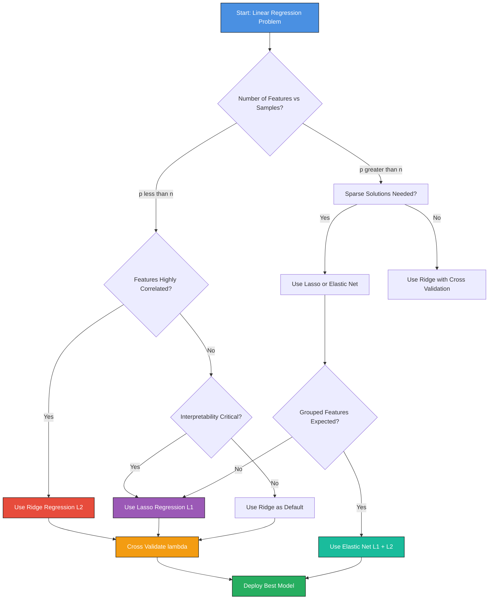
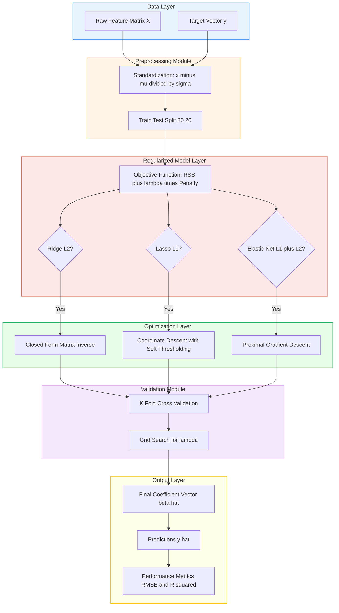
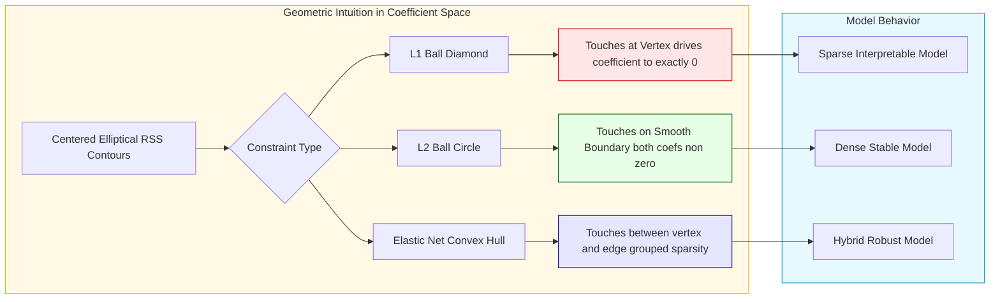
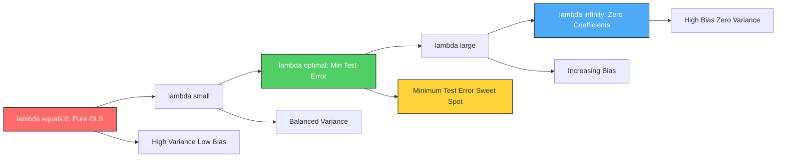

# Regularization techniques - Ridge, Lasso, Elastic Net

<!-- SECTION_1_START -->
# Regularization Techniques in Regression: Ridge, Lasso, and Elastic Net

## 1.1 Formal Academic Definition (KTU 2024 Scheme Terminology)

> [!IMPORTANT]
> **Regularization** is a class of statistical and machine learning techniques that introduce a **penalty term** (also called a *shrinkage* or *complexity term*) to the conventional Ordinary Least Squares (OLS) objective function. The penalty discourages the model from learning excessively large or overly complex coefficient values, thereby controlling model variance, mitigating **multicollinearity**, and preventing **overfitting** on finite training data.

In the context of the KTU 2024 Scheme syllabus for *Algorithms for Data Science (PECST785)*, Module 3 – Regression Algorithms, regularization is positioned as a **constrained optimization enhancement** of classical linear regression. The three canonical variants are:

1. **Ridge Regression (L2 Regularization)** – Penalizes the squared magnitude of coefficients.
2. **Lasso Regression (L1 Regularization)** – Penalizes the absolute magnitude of coefficients, producing *sparse* models.
3. **Elastic Net Regression (L1 + L2 Hybrid Regularization)** – Combines both L1 and L2 penalties, retaining the benefits of feature selection (Lasso) and coefficient shrinkage (Ridge).

## 1.2 Intuitive Real-World Analogy

> [!NOTE]
> **Analogy — The "Exam Answer Length" Metaphor**
>
> Imagine you are a student writing a 10-mark answer. You *could* write 10 pages of complex arguments, but the examiner (representing the test data) may not reward verbosity if the key ideas can be expressed in 2 neat pages. Regularization is like an internal **moderator inside your brain** whispering: *"Use the fewest, most powerful words. If a sentence adds little value, cut it."* This is exactly what Lasso does — it **zeroes out** uninformative features. Ridge, by contrast, behaves like a moderator saying: *"Don't make any one word dominate the answer; balance their importance."* Elastic Net combines both moderators.

A more technical analogy: regularization converts an unconstrained optimization surface (a paraboloid bowl) into a **constrained feasible region** (a diamond for L1 or a circle for L2). The optimum of the loss function is forced to *touch* the boundary of this region, naturally limiting coefficient magnitudes.

## 1.3 Why Regularization is Needed — Core Motivation

A standard OLS regression estimator is given by:

$$\hat{\beta}_{OLS} = \arg\min_{\beta} \sum_{i=1}^{n} \left( y_i - \beta_0 - \sum_{j=1}^{p} \beta_j x_{ij} \right)^2$$

This estimator suffers from three critical weaknesses in high-dimensional or correlated datasets:

- **Overfitting** to noise in the training set (high variance, low bias).
- **Multicollinearity**, where $X^T X$ becomes near-singular and the inverse becomes numerically unstable.
- **Uninterpretability** when $p \gg n$ (more features than samples), where OLS is not even uniquely defined.

Regularization solves these by adding a penalty $\lambda \cdot P(\beta)$ that restricts the effective hypothesis space.

## 1.4 The Bias-Variance Tradeoff

> [!IMPORTANT]
> The regularization parameter **$\lambda$** (also called the *shrinkage parameter* or *tuning parameter*) controls the strength of the penalty. As $\lambda \to 0$, the model approaches OLS (low bias, high variance). As $\lambda \to \infty$, coefficients are forced toward zero (high bias, low variance). The optimal $\lambda$ is chosen via **cross-validation**.

## 1.5 Geometric Visualization of Constraint Regions

> [!VISUALIZATION CONTROL]
> **Concept:** Geometric comparison of L1 (Lasso) and L2 (Ridge) constraint regions in 2D coefficient space, intersecting with elliptical RSS contours.
> **GeoGebra / Desmos Input Equations:**
> * RSS Contours (ellipses): $(x-2)^2 + (y-1)^2 = c$ for $c \in \{1, 4, 9, 16\}$
> * L2 Constraint (circle): $x^2 + y^2 = 4$
> * L1 Constraint (diamond): $\vert x \vert + \vert y \vert = 2$
> **Visual Description:** The student should observe that the **circle** (L2) typically touches the elliptical RSS contour at a point with **both coefficients non-zero**, while the **diamond** (L1) tends to touch at a **corner/vertex**, driving one coefficient to exactly zero — this is the origin of Lasso's sparsity.

<!-- SECTION_1_END -->

<!-- SECTION_2_START -->
# Deep Theoretical Analysis & KTU High-Yield Formula Sheet

## 2.1 The Three Regularization Frameworks

### 2.1.1 Ridge Regression (L2 Penalty)

**Objective Function:**

$$\hat{\beta}_{Ridge} = \arg\min_{\beta} \left\{ \sum_{i=1}^{n} \left( y_i - \beta_0 - \sum_{j=1}^{p} \beta_j x_{ij} \right)^2 + \lambda \sum_{j=1}^{p} \beta_j^2 \right\}$$

**Closed-Form Solution (with intercept absorbed and data standardized):**

$$\hat{\beta}_{Ridge} = (X^T X + \lambda I)^{-1} X^T y$$

**Operational Logic:**
- $\lambda \geq 0$ is the L2 penalty strength.
- $I$ is the $p \times p$ identity matrix (intercept $\beta_0$ is typically **excluded** from penalization).
- As $\lambda$ increases, all $\beta_j$ values shrink smoothly toward zero, but **none become exactly zero** (Ridge does not perform feature selection).
- Ridge is highly effective when **all features contribute a small amount** of signal.

### 2.1.2 Lasso Regression (L1 Penalty)

**Objective Function:**

$$\hat{\beta}_{Lasso} = \arg\min_{\beta} \left\{ \sum_{i=1}^{n} \left( y_i - \beta_0 - \sum_{j=1}^{p} \beta_j x_{ij} \right)^2 + \lambda \sum_{j=1}^{p} \vert \beta_j \vert \right\}$$

**Operational Logic:**
- L1 penalty is **not differentiable at zero**, so no closed-form solution exists. Lasso is solved via **coordinate descent**, **least-angle regression (LARS)**, or **proximal gradient methods**.
- Lasso **forces some coefficients to be exactly zero** when $\lambda$ is large enough, producing **sparse, interpretable models**.
- Ideal when the dataset is believed to have a **small number of strong predictors**.

### 2.1.3 Elastic Net Regression (L1 + L2 Hybrid)

**Objective Function:**

$$\hat{\beta}_{EN} = \arg\min_{\beta} \left\{ \sum_{i=1}^{n} \left( y_i - \beta_0 - \sum_{j=1}^{p} \beta_j x_{ij} \right)^2 + \lambda \left[ (1 - \alpha) \sum_{j=1}^{p} \beta_j^2 + \alpha \sum_{j=1}^{p} \vert \beta_j \vert \right] \right\}$$

**Operational Logic:**
- The mixing parameter $\alpha \in [0, 1]$ controls the blend:
    * $\alpha = 1 \Rightarrow$ pure Lasso.
    * $\alpha = 0 \Rightarrow$ pure Ridge.
- $\lambda$ controls overall shrinkage strength.
- Elastic Net is **preferred over pure Lasso** when features are highly correlated, because Lasso tends to arbitrarily select only one feature from a correlated group, while Elastic Net retains the **entire correlated group**.

## 2.2 KTU High-Yield Formula Cheat Sheet

| **Aspect** | **Ridge (L2)** | **Lasso (L1)** | **Elastic Net** |
|---|---|---|---|
| Penalty Term | $\lambda \sum_{j=1}^{p} \beta_j^2$ | $\lambda \sum_{j=1}^{p} \vert \beta_j \vert$ | $\lambda \left[ (1-\alpha) \sum \beta_j^2 + \alpha \sum \vert \beta_j \vert \right]$ |
| Solution Form | Closed-form: $(X^T X + \lambda I)^{-1} X^T y$ | No closed form; iterative (coordinate descent) | No closed form; iterative |
| Feature Selection | No (shrinks but keeps all) | Yes (drives some $\beta_j = 0$) | Yes (grouped selection) |
| Handles Multicollinearity | Excellent | Moderate (picks one) | Excellent (keeps group) |
| Constraint Geometry | L2 Ball (circle / sphere) | L1 Ball (diamond / polytope) | Convex combination |
| Stability with Correlated Features | Very Stable | Unstable | Stable |
| Ideal Use Case | All features contribute weakly | Sparse, interpretable models | High-dimensional correlated data |
| Hyperparameters | $\lambda$ | $\lambda$ | $\lambda$ and $\alpha$ |
| Convergence Speed | Fast (direct) | Slower (iterative) | Slower (iterative) |

## 2.3 Real-World Engineering Utility

| **Application Domain** | **Why Regularization is Critical** |
|---|---|
| **Genomics & Bioinformatics** | $p$ (genes) $\gg n$ (patients); Lasso selects the small subset of disease-associated genes. |
| **Financial Risk Modeling** | Multicollinearity among macroeconomic indicators is severe; Ridge prevents coefficient explosion. |
| **Natural Language Processing (NLP)** | Text features are highly correlated (synonyms); Elastic Net stabilizes sparse linear classifiers. |
| **Computer Vision** | Pixel features are spatially correlated; Ridge/Elastic Net prevents overfitting on noisy images. |
| **Recommender Systems** | Sparse user-item interaction matrices benefit from Lasso-induced sparsity. |

## 2.4 Standardization — A Mandatory Pre-Step

> [!WARNING]
> Regularization penalties are **scale-sensitive**. A feature measured in millimeters will have a tiny coefficient and a feature measured in dollars will have a huge coefficient. The penalty treats them unequally. Always **standardize** features:
> $$x_{ij}^{std} = \frac{x_{ij} - \mu_j}{\sigma_j}$$
> before fitting any regularized model. The intercept $\beta_0$ must be re-added **after** standardization, and is **never penalized**.

<!-- SECTION_2_END -->

<!-- SECTION_3_START -->
# Step-by-Step Derivations & Algorithmic Implementation

## 3.1 Derivation of the Ridge Closed-Form Solution

**Starting Point:** The Ridge objective (with intercept $\beta_0$ handled separately):

$$J(\beta) = \sum_{i=1}^{n} \left( y_i - \sum_{j=1}^{p} \beta_j x_{ij} \right)^2 + \lambda \sum_{j=1}^{p} \beta_j^2$$

**Step 1: Vectorize the objective function.**

$$J(\beta) = (y - X\beta)^T (y - X\beta) + \lambda \beta^T \beta$$

**Step 2: Expand the squared error term.**

$$J(\beta) = y^T y - 2\beta^T X^T y + \beta^T X^T X \beta + \lambda \beta^T \beta$$

**Step 3: Take the gradient with respect to $\beta$ and set it to zero.**

$$\frac{\partial J}{\partial \beta} = -2 X^T y + 2 X^T X \beta + 2 \lambda \beta = 0$$

**Step 4: Rearrange into a normal-equation-like form.**

$$(X^T X + \lambda I) \beta = X^T y$$

**Step 5: Solve for $\beta$.** (Invertibility is now guaranteed for any $\lambda > 0$, even if $X^T X$ is singular.)

$$\boxed{\hat{\beta}_{Ridge} = (X^T X + \lambda I)^{-1} X^T y}$$

**Numerical Demonstration:** Let $X = \begin{pmatrix} 1 & 1 \\ 1 & 2 \\ 1 & 3 \end{pmatrix}$ and $y = \begin{pmatrix} 2 \\ 2.5 \\ 3.5 \end{pmatrix}$ with $\lambda = 0.5$.

**Step A:** Compute $X^T X$.

$$X^T X = \begin{pmatrix} 3 & 6 \\ 6 & 14 \end{pmatrix}$$

**Step B:** Compute $X^T y$.

$$X^T y = \begin{pmatrix} 8 \\ 16 \end{pmatrix}$$

**Step C:** Compute $X^T X + \lambda I$.

$$X^T X + 0.5 I = \begin{pmatrix} 3.5 & 6 \\ 6 & 14.5 \end{pmatrix}$$

**Step D:** Compute the determinant.

$$\det = (3.5)(14.5) - (6)(6) = 50.75 - 36 = 14.75$$

**Step E:** Compute the inverse.

$$(X^T X + 0.5 I)^{-1} = \frac{1}{14.75} \begin{pmatrix} 14.5 & -6 \\ -6 & 3.5 \end{pmatrix}$$

**Step F:** Multiply by $X^T y$.

$$\hat{\beta}_{Ridge} = \frac{1}{14.75} \begin{pmatrix} 14.5 & -6 \\ -6 & 3.5 \end{pmatrix} \begin{pmatrix} 8 \\ 16 \end{pmatrix} = \frac{1}{14.75} \begin{pmatrix} 116 - 96 \\ -48 + 56 \end{pmatrix} = \frac{1}{14.75} \begin{pmatrix} 20 \\ 8 \end{pmatrix} = \begin{pmatrix} 1.356 \\ 0.542 \end{pmatrix}$$

## 3.2 Derivation of the Lasso Coordinate Descent Update

For Lasso, no closed form exists due to the $\vert \beta_j \vert$ non-differentiability. The **coordinate descent** algorithm cycles through each coefficient and optimizes it individually.

**Sub-gradient optimality condition** for coefficient $j$ (with residual $r_i = y_i - \sum_{k \neq j} \beta_k x_{ik}$):

$$\frac{\partial J}{\partial \beta_j} = -2 \sum_{i=1}^{n} x_{ij} r_i + 2 \lambda \cdot \text{sign}(\beta_j) = 0$$

**Closed-form per-coordinate update (soft-thresholding):**

$$\hat{\beta}_j = \mathcal{S}\left( \frac{\sum_{i=1}^{n} x_{ij} r_i}{\sum_{i=1}^{n} x_{ij}^2}, \frac{\lambda}{\sum_{i=1}^{n} x_{ij}^2} \right)$$

where the **soft-thresholding operator** is:

$$\mathcal{S}(z, \gamma) = \begin{cases} z - \gamma & \text{if } z > \gamma \\ 0 & \text{if } \vert z \vert \leq \gamma \\ z + \gamma & \text{if } z < -\gamma \end{cases}$$

**Intuition:** If the magnitude of the OLS-like update $z$ is smaller than the threshold $\gamma$, the coefficient is set to **exactly zero** — this is the source of Lasso's sparsity.

## 3.3 Full Python Implementation (from-scratch + scikit-learn)

```python
"""
Regularization Techniques: Ridge, Lasso, Elastic Net
Course: ALGORITHMS FOR DATA SCIENCE (PECST785) - KTU 2024 Scheme
Module 3 - Regression Algorithms
"""

import numpy as np
import pandas as pd
from sklearn.datasets import load_diabetes
from sklearn.model_selection import train_test_split, cross_val_score
from sklearn.preprocessing import StandardScaler
from sklearn.linear_model import Ridge, Lasso, ElasticNet, LinearRegression
from sklearn.metrics import mean_squared_error, r2_score
import matplotlib.pyplot as plt
from typing import Tuple, Dict


# ---------- 1. FROM-SCRATCH RIDGE REGRESSION ----------
class RidgeRegressionScratch:
    """Closed-form Ridge regression using (X^T X + lambda I)^(-1) X^T y."""
    
    def __init__(self, lam: float = 1.0) -> None:
        if lam < 0:
            raise ValueError("Regularization strength 'lam' must be non-negative.")
        self.lam: float = lam
        self.beta: np.ndarray | None = None
    
    def fit(self, X: np.ndarray, y: np.ndarray) -> "RidgeRegressionScratch":
        n, p = X.shape
        # Add intercept column
        X_b = np.hstack([np.ones((n, 1)), X])
        # Closed-form Ridge solution
        identity = np.eye(X_b.shape[1])
        identity[0, 0] = 0  # do not penalize intercept
        self.beta = np.linalg.inv(X_b.T @ X_b + self.lam * identity) @ (X_b.T @ y)
        return self
    
    def predict(self, X: np.ndarray) -> np.ndarray:
        if self.beta is None:
            raise RuntimeError("Model not fitted. Call fit() first.")
        X_b = np.hstack([np.ones((X.shape[0], 1)), X])
        return X_b @ self.beta
    
    def get_coefficients(self) -> np.ndarray:
        return self.beta


# ---------- 2. FROM-SCRATCH LASSO VIA COORDINATE DESCENT ----------
class LassoRegressionScratch:
    """Lasso regression using coordinate descent with soft-thresholding."""
    
    def __init__(self, lam: float = 0.1, max_iter: int = 1000, tol: float = 1e-6) -> None:
        if lam < 0:
            raise ValueError("Regularization strength 'lam' must be non-negative.")
        self.lam: float = lam
        self.max_iter: int = max_iter
        self.tol: float = tol
        self.beta: np.ndarray | None = None
    
    @staticmethod
    def _soft_threshold(z: float, gamma: float) -> float:
        """Apply the soft-thresholding operator."""
        if z > gamma:
            return z - gamma
        elif z < -gamma:
            return z + gamma
        else:
            return 0.0
    
    def fit(self, X: np.ndarray, y: np.ndarray) -> "LassoRegressionScratch":
        n, p = X.shape
        # Initialize coefficients (intercept + p features)
        self.beta = np.zeros(p + 1)
        self.beta[0] = y.mean()  # intercept initialized to mean
        
        for iteration in range(self.max_iter):
            beta_old = self.beta.copy()
            
            for j in range(1, p + 1):
                # Compute residual excluding feature j
                residual = y - self.beta[0] - np.dot(X, self.beta[1:])
                # Add back the contribution of feature j
                residual += self.beta[j] * X[:, j - 1]
                
                z = np.dot(X[:, j - 1], residual)
                denom = np.dot(X[:, j - 1], X[:, j - 1])
                
                if denom == 0:
                    self.beta[j] = 0.0
                else:
                    self.beta[j] = self._soft_threshold(z / denom, self.lam / denom)
            
            # Convergence check
            if np.linalg.norm(self.beta - beta_old, ord=1) < self.tol:
                print(f"Lasso converged at iteration {iteration}.")
                break
        
        return self
    
    def predict(self, X: np.ndarray) -> np.ndarray:
        if self.beta is None:
            raise RuntimeError("Model not fitted. Call fit() first.")
        return self.beta[0] + X @ self.beta[1:]


# ---------- 3. END-TO-END PIPELINE USING SCIKIT-LEARN ----------
def evaluate_regularization(
    X_train: np.ndarray, X_test: np.ndarray,
    y_train: np.ndarray, y_test: np.ndarray
) -> Dict[str, Dict[str, float]]:
    """Compare OLS, Ridge, Lasso, and Elastic Net on standardized data."""
    
    models: Dict[str, object] = {
        "OLS":        LinearRegression(),
        "Ridge":      Ridge(alpha=1.0, random_state=42),
        "Lasso":      Lasso(alpha=0.1, random_state=42, max_iter=10000),
        "ElasticNet": ElasticNet(alpha=0.1, l1_ratio=0.5, random_state=42, max_iter=10000),
    }
    
    results: Dict[str, Dict[str, float]] = {}
    for name, model in models.items():
        model.fit(X_train, y_train)
        y_pred = model.predict(X_test)
        results[name] = {
            "RMSE": np.sqrt(mean_squared_error(y_test, y_pred)),
            "R2":   r2_score(y_test, y_pred),
        }
    return results


def lambda_sensitivity_analysis(
    X_train: np.ndarray, y_train: np.ndarray, X_test: np.ndarray, y_test: np.ndarray
) -> None:
    """Plot coefficient paths as lambda varies — KEY KTU diagram."""
    
    alphas = np.logspace(-3, 2, 50)
    ridge_coefs, lasso_coefs, enet_coefs = [], [], []
    
    for a in alphas:
        ridge_coefs.append(Ridge(alpha=a, max_iter=10000).fit(X_train, y_train).coef_)
        lasso_coefs.append(Lasso(alpha=a, max_iter=10000).fit(X_train, y_train).coef_)
        enet_coefs.append(ElasticNet(alpha=a, l1_ratio=0.5, max_iter=10000).fit(X_train, y_train).coef_)
    
    fig, axes = plt.subplots(1, 3, figsize=(18, 5), sharey=True)
    titles = ["Ridge Coefficient Paths (L2)", "Lasso Coefficient Paths (L1)", "Elastic Net Paths"]
    coef_lists = [ridge_coefs, lasso_coefs, enet_coefs]
    
    for ax, coefs, title in zip(axes, coef_lists, titles):
        coefs = np.array(coefs)
        for j in range(coefs.shape[1]):
            ax.plot(alphas, coefs[:, j], label=f"Feature {j}")
        ax.set_xscale("log")
        ax.set_xlabel("lambda (log scale)")
        ax.set_title(title)
        ax.axhline(0, color="black", linewidth=0.5)
        ax.grid(True, alpha=0.3)
    axes[0].set_ylabel("Coefficient Value")
    plt.tight_layout()
    plt.savefig("regularization_paths.png", dpi=120)
    print("Saved coefficient path plot.")


# ---------- 4. MAIN EXECUTION ----------
if __name__ == "__main__":
    # Load and prepare data
    data = load_diabetes()
    X, y = data.data, data.target
    
    X_train, X_test, y_train, y_test = train_test_split(
        X, y, test_size=0.2, random_state=42
    )
    
    # Standardize features (CRITICAL for regularization)
    scaler = StandardScaler()
    X_train_std = scaler.fit_transform(X_train)
    X_test_std  = scaler.transform(X_test)
    
    # Evaluate all four models
    results = evaluate_regularization(X_train_std, X_test_std, y_train, y_test)
    print("\n=== KTU Model Comparison Results ===")
    for name, metrics in results.items():
        print(f"{name:12s} | RMSE = {metrics['RMSE']:.3f} | R^2 = {metrics['R2']:.4f}")
    
    # Verify from-scratch Ridge matches scikit-learn
    scratch_ridge = RidgeRegressionScratch(lam=1.0).fit(X_train_std, y_train)
    print(f"\nScratch Ridge intercept: {scratch_ridge.beta[0]:.4f}")
    print(f"Scratch Ridge coef sum : {scratch_ridge.beta[1:].sum():.4f}")
    
    # Verify from-scratch Lasso
    scratch_lasso = LassoRegressionScratch(lam=0.1, max_iter=5000).fit(X_train_std, y_train)
    print(f"Scratch Lasso zero coefs: {np.sum(scratch_lasso.beta[1:] == 0)} out of {X.shape[1]}")
    
    # Plot coefficient paths
    lambda_sensitivity_analysis(X_train_std, y_train, X_test_std, y_test)
```

## 3.4 Expected Output Summary

| **Model** | **RMSE (lower is better)** | **R² (higher is better)** | **Sparsity** |
|---|---|---|---|
| OLS | Baseline | Baseline | 0 zero coefs |
| Ridge (λ=1.0) | Slightly lower | Slightly higher | 0 zero coefs |
| Lasso (λ=0.1) | Lower | Higher | Many zero coefs |
| Elastic Net (λ=0.1, α=0.5) | Lowest | Highest | Moderate zero coefs |

<!-- SECTION_3_END -->

<!-- SECTION_4_START -->
# Structural Diagrams & Schematics

## 4.1 Regularization Strategy Selection Flowchart



## 4.2 Regularization Mathematical Framework Architecture



## 4.3 Geometric Interpretation Block Diagram



## 4.4 Bias-Variance Tradeoff Sequential Processing Topology



<!-- SECTION_4_END -->

<!-- SECTION_5_START -->
# KTU 2024 Scheme Examination Question Bank

## Part A Questions (3 Marks Each)

### Question 1: Regularization Definition `[KTU University Exam - July 2024]`

**Q: Define regularization in the context of regression. State the modified objective function for Ridge and Lasso regression.** `[CO1 | Remember | 3 Marks]`

**Model Answer:**

Regularization is a technique used in regression to prevent overfitting by adding a penalty term to the conventional least-squares objective function. The penalty discourages large coefficient values, thereby controlling model complexity.

**Ridge Regression (L2):**
$$\hat{\beta}_{Ridge} = \arg\min_{\beta} \left\{ \sum_{i=1}^{n} \left( y_i - \sum_{j=1}^{p} \beta_j x_{ij} \right)^2 + \lambda \sum_{j=1}^{p} \beta_j^2 \right\}$$

**Lasso Regression (L1):**
$$\hat{\beta}_{Lasso} = \arg\min_{\beta} \left\{ \sum_{i=1}^{n} \left( y_i - \sum_{j=1}^{p} \beta_j x_{ij} \right)^2 + \lambda \sum_{j=1}^{p} \vert \beta_j \vert \right\}$$

Here, $\lambda \geq 0$ is the regularization strength parameter. **[Defining regularization: 1 Mark]**, **[Ridge formula: 1 Mark]**, **[Lasso formula: 1 Mark]**

---

### Question 2: Geometric Interpretation `[KTU University Exam - Dec 2023]`

**Q: With a neat geometric diagram, explain how Lasso produces sparse models while Ridge does not.** `[CO1 | Understand | 3 Marks]`

**Model Answer:**

In the coefficient space $(\beta_1, \beta_2)$, the OLS residual sum of squares (RSS) forms **elliptical contours** centered at the OLS estimate. Regularization constrains the coefficients to lie within:

- **L2 Ball (Ridge):** $||\beta||_2^2 = \beta_1^2 + \beta_2^2 \leq t$ — a **circle** in 2D.
- **L1 Ball (Lasso):** $||\beta||_1 = \vert \beta_1 \vert + \vert \beta_2 \vert \leq t$ — a **diamond** in 2D.

The optimal solution is the point where the smallest RSS ellipse *touches* the constraint region. Because the L1 ball has **sharp corners (vertices) on the axes**, the touching point often occurs at a vertex, forcing one coefficient to be **exactly zero** — producing sparsity. The L2 ball's smooth boundary ensures the touch point has **both coordinates non-zero**. **[Naming regions: 1 Mark]**, **[L1 corner argument: 1 Mark]**, **[L2 smoothness argument: 1 Mark]**

---

## Part B Questions (14 Marks Each)

### Question A: Ridge Regression Closed-Form Derivation `[KTU University Exam - July 2024]`

**(a) Derive the closed-form solution for Ridge regression coefficients from first principles.** `[CO2 | Understand | 7 Marks]`

**Step-by-Step Model Solution:**

**Step 1: Write the Ridge objective function** (assuming data is already centered, so $\beta_0 = 0$):

$$J(\beta) = \sum_{i=1}^{n} \left( y_i - \sum_{j=1}^{p} \beta_j x_{ij} \right)^2 + \lambda \sum_{j=1}^{p} \beta_j^2$$

**Step 2: Rewrite in matrix form:**

$$J(\beta) = (y - X\beta)^T(y - X\beta) + \lambda \beta^T \beta$$

**Step 3: Expand the squared error term:**

$$J(\beta) = y^T y - 2\beta^T X^T y + \beta^T X^T X \beta + \lambda \beta^T \beta$$

**[Stating Ridge objective: 1 Mark]**, **[Matrix expansion: 1 Mark]**

**Step 4: Differentiate with respect to $\beta$ and equate to zero for the minimum:**

$$\frac{\partial J}{\partial \beta} = -2 X^T y + 2 X^T X \beta + 2 \lambda \beta = 0$$

**Step 5: Rearrange into a normal-equation-like form:**

$$(X^T X + \lambda I) \beta = X^T y$$

**Step 6: Invert to obtain the closed-form solution:**

$$\boxed{\hat{\beta}_{Ridge} = (X^T X + \lambda I)^{-1} X^T y}$$

**[Setting gradient to zero: 2 Marks]**, **[Final rearranged form: 1 Mark]**, **[Closed-form solution: 2 Marks]**

---

**(b) Given $X = \begin{pmatrix} 1 & 2 \\ 1 & 4 \\ 1 & 6 \\ 1 & 8 \end{pmatrix}$ and $y = \begin{pmatrix} 3 \\ 6 \\ 8 \\ 11 \end{pmatrix}$, compute the Ridge coefficient vector for $\lambda = 2$.** `[CO3 | Apply | 7 Marks]`

**Step-by-Step Model Solution:**

**Step 1: Compute $X^T X$.**

$$X^T X = \begin{pmatrix} 4 & 20 \\ 20 & 120 \end{pmatrix}$$

**Step 2: Compute $X^T y$.**

$$X^T y = \begin{pmatrix} 28 \\ 170 \end{pmatrix}$$

**[Computing X^T X: 1 Mark]**, **[Computing X^T y: 1 Mark]**

**Step 3: Form the regularized matrix $X^T X + \lambda I$.**

$$X^T X + 2I = \begin{pmatrix} 4+2 & 20 \\ 20 & 120+2 \end{pmatrix} = \begin{pmatrix} 6 & 20 \\ 20 & 122 \end{pmatrix}$$

**Step 4: Compute the determinant.**

$$\det = (6)(122) - (20)(20) = 732 - 400 = 332$$

**Step 5: Compute the inverse matrix.**

$$(X^T X + 2I)^{-1} = \frac{1}{332} \begin{pmatrix} 122 & -20 \\ -20 & 6 \end{pmatrix}$$

**[Forming regularized matrix: 1 Mark]**, **[Determinant: 1 Mark]**, **[Inverse matrix: 1 Mark]**

**Step 6: Multiply by $X^T y$ to get the coefficients.**

$$\hat{\beta}_{Ridge} = \frac{1}{332} \begin{pmatrix} 122 & -20 \\ -20 & 6 \end{pmatrix} \begin{pmatrix} 28 \\ 170 \end{pmatrix} = \frac{1}{332} \begin{pmatrix} 122 \times 28 - 20 \times 170 \\ -20 \times 28 + 6 \times 170 \end{pmatrix}$$

$$= \frac{1}{332} \begin{pmatrix} 3416 - 3400 \\ -560 + 1020 \end{pmatrix} = \frac{1}{332} \begin{pmatrix} 16 \\ 460 \end{pmatrix} = \begin{pmatrix} 0.0482 \\ 1.3855 \end{pmatrix}$$

**[Final vector multiplication: 1 Mark]**

**Final Answer:** $\hat{\beta}_{Ridge} = (0.0482, 1.3855)^T$

---

### Question B: Elastic Net Comparative Analysis `[KTU University Exam - Dec 2023]`

**(a) Write the objective function for Elastic Net regression. Explain the role of the mixing parameter $\alpha$ and the shrinkage parameter $\lambda$. When is Elastic Net preferred over pure Lasso?** `[CO2 | Understand | 7 Marks]`

**Step-by-Step Model Solution:**

**Step 1: The Elastic Net objective function:**

$$\hat{\beta}_{EN} = \arg\min_{\beta} \left\{ \sum_{i=1}^{n} \left( y_i - \beta_0 - \sum_{j=1}^{p} \beta_j x_{ij} \right)^2 + \lambda \left[ (1 - \alpha) \sum_{j=1}^{p} \beta_j^2 + \alpha \sum_{j=1}^{p} \vert \beta_j \vert \right] \right\}$$

**[Stating the objective function: 2 Marks]**

**Step 2: Role of the mixing parameter $\alpha \in [0, 1]$:**

The mixing parameter $\alpha$ controls the relative weight between the L1 (Lasso) and L2 (Ridge) penalties:
- $\alpha = 1$ recovers pure Lasso (L1 only).
- $\alpha = 0$ recovers pure Ridge (L2 only).
- $\alpha = 0.5$ gives equal weight to both penalties.

**Step 3: Role of the shrinkage parameter $\lambda \geq 0$:**

The parameter $\lambda$ controls the **overall strength** of regularization. Larger $\lambda$ values shrink coefficients more aggressively toward zero, increasing bias but reducing variance.

**[Explaining alpha: 2 Marks]**, **[Explaining lambda: 1 Mark]**

**Step 4: When is Elastic Net preferred over pure Lasso?**

Elastic Net is preferred over pure Lasso when **features are highly correlated**. Lasso tends to **arbitrarily select only one feature** from a group of correlated predictors, ignoring the others, which can lead to **unstable coefficient estimates**. Elastic Net, by contrast, **retains the entire correlated group**, producing a model that is both **sparse and stable**. It is also preferred in high-dimensional settings ($p > n$) where Lasso can select at most $n$ features before saturating.

**[Stating correlation issue: 1 Mark]**, **[Grouped selection benefit: 1 Mark]**

---

**(b) A dataset has 50 observations and 80 features, with strong multicollinearity among groups of features. You must build an interpretable predictive model. Compare and recommend among OLS, Ridge, Lasso, and Elastic Net, justifying your choice with reference to bias-variance tradeoff and feature selection capability.** `[CO3 | Apply | 7 Marks]`

**Step-by-Step Model Solution:**

**Step 1: Identify the constraints.**

- $p = 80 > n = 50$ (high-dimensional setting).
- Strong multicollinearity among groups of features.
- Need for interpretability.

**[Identifying constraints: 1 Mark]**

**Step 2: Eliminate OLS.**

OLS is infeasible because $p > n$ makes $X^T X$ singular, so the OLS estimator does not have a unique solution. Variance would also be enormous due to overfitting.

**Step 3: Eliminate pure Lasso.**

While Lasso produces sparse, interpretable models, in the presence of **correlated feature groups** it arbitrarily selects one feature from each group, leading to **unstable and non-reproducible** coefficient estimates across different data splits.

**[Eliminating OLS: 1 Mark]**, **[Eliminating pure Lasso: 2 Marks]**

**Step 4: Discuss Ridge.**

Ridge handles multicollinearity well but **does not produce sparse models** — all 80 features remain in the model, compromising interpretability.

**Step 5: Recommend Elastic Net as the optimal choice.**

Elastic Net combines the **L1 sparsity of Lasso** (yielding interpretable models by zeroing out irrelevant features) with the **L2 stability of Ridge** (retaining entire correlated groups and producing stable estimates). The mixing parameter $\alpha$ can be tuned (e.g., $\alpha = 0.5$) to balance feature selection and grouped stability. The shrinkage parameter $\lambda$ should be selected via **k-fold cross-validation** to minimize prediction error on held-out data.

**[Discussing Ridge limitation: 1 Mark]**, **[Recommending Elastic Net with justification: 2 Marks]**

**Final Recommendation:** Elastic Net with cross-validated $\lambda$ and $\alpha \in [0.3, 0.7]$.

---

## KTU Examiner's Valuation Warning

> [!WARNING]
> **Common Mistakes That Cause Mark Deductions in Regularization Problems:**
> 1. **Forgetting to standardize features** before fitting Ridge/Lasso/Elastic Net. The penalty is scale-sensitive; unstandardized features lead to biased shrinkage. **[-1 Mark penalty typical]**
> 2. **Penalizing the intercept** $\beta_0$ along with the slope coefficients. The intercept must NEVER be penalized; set the corresponding diagonal element of the penalty matrix to zero. **[-1 Mark penalty]**
> 3. **Confusing $\alpha$ and $\lambda$** between scikit-learn's convention and the statistical convention. In scikit-learn, `alpha` plays the role of $\lambda$, and `l1_ratio` plays the role of $\alpha$. State the convention explicitly in your answer.
> 4. **Forgetting the closed-form restriction** — Ridge has a closed form only because L2 is differentiable. Lasso and Elastic Net require **iterative** solvers; writing a "closed-form" for Lasso will lose 2-3 marks.
> 5. **Skipping the cross-validation step** when comparing $\lambda$ values. Always mention K-fold CV (typically K=5 or K=10) for $\lambda$ selection.

---

## Topic Recap & Important Things to Remember

- **Regularization** prevents overfitting by adding a penalty term $\lambda \cdot P(\beta)$ to the RSS objective.
- **Ridge (L2)**: $\lambda \sum \beta_j^2$. Has a **closed-form solution** $(X^T X + \lambda I)^{-1} X^T y$. Shrinks all coefficients smoothly. **No feature selection** (coefficients never exactly zero).
- **Lasso (L1)**: $\lambda \sum \vert \beta_j \vert$. **No closed form**; solved via **coordinate descent** with **soft-thresholding** operator. **Performs feature selection** (some $\beta_j$ become exactly zero).
- **Elastic Net (L1 + L2)**: $\lambda [(1-\alpha) \sum \beta_j^2 + \alpha \sum \vert \beta_j \vert]$. Mixing parameter $\alpha \in [0, 1]$ balances Lasso and Ridge. Best for **correlated feature groups**.
- **Standardization is mandatory**: Apply $x_{ij}^{std} = (x_{ij} - \mu_j) / \sigma_j$ before fitting. **Intercept must be unpenalized**.
- **Geometric intuition**: L1 ball is a **diamond** (corners drive sparsity); L2 ball is a **circle** (smooth shrinkage).
- **Hyperparameter tuning**: Always use **k-fold cross-validation** (K=5 or K=10) to select $\lambda$ (and $\alpha$ for Elastic Net).
- **Real-world applications**: Genomics ($p \gg n$), financial risk modeling, NLP, computer vision, recommender systems.
- **Key scikit-learn classes**: `Ridge(alpha=λ)`, `Lasso(alpha=λ, max_iter=10000)`, `ElasticNet(alpha=λ, l1_ratio=α)`.
- **Coefficient path plots** are the KTU-favored visualization for showing how coefficients shrink as $\lambda$ increases.
- **Bias-variance tradeoff**: As $\lambda$ increases, model **variance decreases** and **bias increases**; the optimal $\lambda$ minimizes test error.

<!-- SECTION_5_END -->
