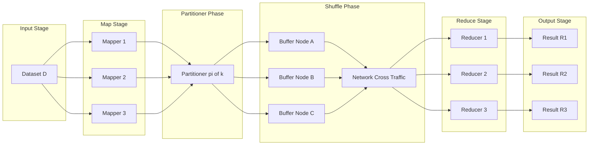
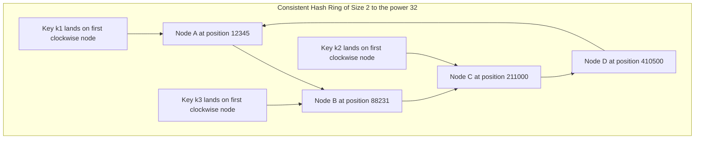
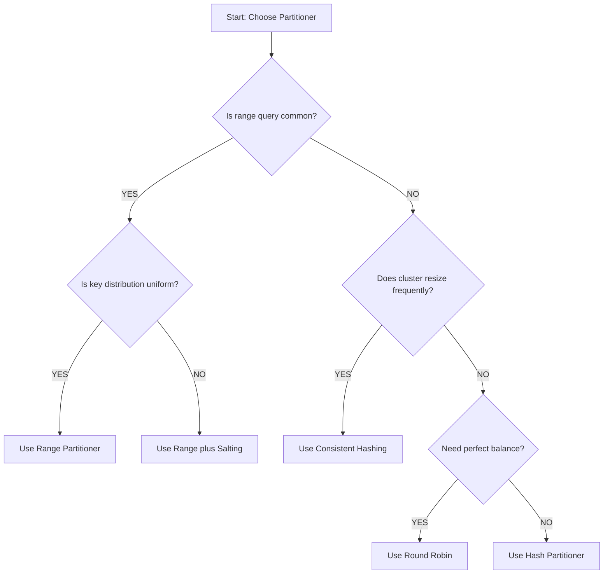
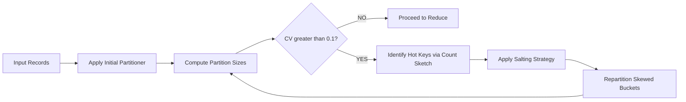

# Data partitioning and shuffling techniques in distributed systems

<!-- SECTION_1_START -->
# Data Partitioning and Shuffling in Distributed Systems

> [!IMPORTANT]
> **KTU 2024 Scheme Definition (PECST785 — Module 4):**
> *Data partitioning* is the deterministic process of dividing a monolithic dataset $D$ into $n$ disjoint logical subsets $P_1, P_2, \dots, P_n$ such that $D = \bigcup_{i=1}^{n} P_i$ and $P_i \cap P_j = \emptyset$ for $i \neq j$. *Shuffling* is the subsequent cross-node data transfer phase that redistributes intermediate key-value pairs to downstream reducers/aggregators based on a partitioner function, enabling parallel computation across a cluster.

> [!NOTE]
> **Why KTU Asks This:** This topic is the cornerstone of scalable data science. Without proper partitioning, the entire cluster suffers from **stragglers**, **data skew**, and **network congestion**. Mastering these techniques is essential for designing algorithms that scale linearly with the cluster size.

---

## Conceptual Analogy: The National Post Office

Imagine you run the **India Post** with 50 sorting offices. Every morning, **10 million letters** arrive at the central hub in Delhi.

* **Partitioning** = Deciding *which sorting office* handles *which PIN code* before the trucks leave. The PIN code is the *partition key*. Without it, every office would fight over every letter.
* **Shuffling** = The trucks physically *driving the mail bags* between sorting offices so that the office handling PIN 110001 also receives the return-addressed responses to those letters — even if those responses originated from Mumbai.

**Key insight:** Partitioning is the *plan*; Shuffling is the *physical execution* of the plan. A perfect partitioner with a poor network topology still causes failure.

---

## Taxonomy of Partitioning Strategies

| Strategy | Partition Key Logic | Strength | Weakness |
|----------|--------------------|----------|----------|
| **Round-Robin** | Cyclic counter $i = (i+1) \mod n$ | Maximum load balance | Loses data locality; useless for range queries |
| **Hash Partitioning** | $h(k) = \text{hash}(k) \mod n$ | Equal distribution on uniform keys | Vulnerable to hot keys; reshuffles on re-cluster |
| **Range Partitioning** | $P_i = [s_i, s_{i+1})$ with sorted split points | Excellent for range scans | Severe skew if keys are non-uniform |
| **Consistent Hashing** | $h(k) = \text{hash}(k) \mod 2^m$ on a ring | Minimal reshuffling on node add/remove | Slightly unbalanced, needs virtual nodes |
| **Custom / Skew-Aware** | Application of domain knowledge (salting) | Handles heavy hitters gracefully | Requires deep domain knowledge |

> [!VISUALIZATION CONTROL]
> **Concept:** Hash Distribution on a Consistent Hashing Ring
> **Desmos Input Equations (parametric-style simulation):**
> * `h_1(x) = (1.61803*x + 7) mod 360` *(node A angle on the ring)*
> * `h_2(x) = (2.41421*x + 13) mod 360` *(node B angle on the ring)*
> * `h_3(x) = (3.14159*x + 19) mod 360` *(key k angle on the ring)*
> **Visual Description:** Plot each function as a dot on a circle of radius 100. Observe that as $x$ (the key) varies, dots spread uniformly along the circumference. Adding a fourth node only disrupts a small arc of the ring — illustrating the **minimal reshuffling** property of consistent hashing.

---

## Formal Data Model

Let $D = \{r_1, r_2, \dots, r_N\}$ be the input dataset. A *partitioner* is a function:

$$\pi: D \rightarrow \{1, 2, \dots, n\}$$

such that each record $r$ is assigned to partition $P_{\pi(r)}$. The *shuffler* then constructs key-value pairs $(k, v)$ and routes them to the reducer responsible for partition $\pi'(k)$, where $\pi'$ is the *reduce-side partitioner* (often identical to $\pi$).

> [!IMPORTANT]
> **Syllabus Highlight (PECST785):** The KTU board frequently tests the **partition invariant** $D = \bigcup P_i$ and the **load balance metric** $L = \frac{\max_i \mid P_i \mid}{N/n}$. An ideal partitioner achieves $L \approx 1.0$.
<!-- SECTION_1_END -->

<!-- SECTION_2_START -->
# Deep Theoretical Analysis & KTU High-Yield Formula Sheet

## 2.1 The Three Pillars of Distributed Data Movement

A distributed computation can be decomposed into three orthogonal concerns:

1. **Locality** — Co-locating related records on the same node to minimize cross-node I/O.
2. **Balance** — Ensuring no node is the bottleneck of the cluster.
3. **Determinism** — Guaranteeing that $(k, v)$ pairs with the same key always land on the same reducer.

Failure to satisfy all three causes the cluster to fail in distinct, diagnosable ways.

---

## 2.2 Mathematical Formulation of Common Partitioners

### A. Modulo Hash Partitioner

The simplest, most taught partitioner:

$$h(k) = \text{hash}(k) \mod n$$

where $n$ is the number of reducers. The image set is $\{0, 1, \dots, n-1\}$.

### B. Consistent Hashing Formulation

Given a hash space of size $2^m$ and $n$ physical nodes, each node $N_i$ is hashed to a position $\rho_i = H(N_i) \mod 2^m$ on a logical ring. A record with key $k$ is assigned to the *first* node encountered when walking clockwise from $H(k) \mod 2^m$:

$$\pi(k) = \min_{i} \{ N_i : \rho_i \geq H(k) \mod 2^m \}$$

To improve balance, each physical node owns $v$ *virtual nodes* (vnodes), typically $v = 128$ or $v = 256$.

### C. Range Partitioner

The dataset is sorted by key, and split points $s_1 < s_2 < \dots < s_{n-1}$ divide the sorted domain into $n$ contiguous ranges. A key $k$ belongs to:

$$P_i = [s_{i-1}, s_i) \quad \text{where} \quad s_0 = -\infty, \ s_n = +\infty$$

The split points are typically chosen by sampling: take a uniform sample of size $s$, sort it, and pick quantiles $q_{i/n}$.

### D. Skew Metric

To quantify how badly a partitioner is performing, the *coefficient of variation* of partition sizes is used:

$$C_v = \frac{\sigma}{\mu} = \frac{\sqrt{\frac{1}{n}\sum_{i=1}^{n}( \mid P_i \mid - \mu )^2}}{\mu}$$

A partitioner is considered healthy when $C_v < 0.1$.

---

## 2.3 KTU High-Yield Formula Cheat Sheet

> [!NOTE]
> **All formulas below are examiner favorites.** Memorize the units, conditions, and boundary cases.

| # | Concept | Formula | Variables & Units | Condition / Caveat |
|---|---------|---------|-------------------|--------------------|
| 1 | Modulo hash | $h(k) = \text{hash}(k) \mod n$ | $n \in \mathbb{Z}^+$ | Requires $\text{hash}(\cdot)$ to be uniform |
| 2 | Load balance | $L = \frac{\max_i \mid P_i \mid}{N/n}$ | $N$ = total records | Ideal $L = 1.0$ |
| 3 | Skew ratio | $S = \frac{\max_i \mid P_i \mid}{\min_i \mid P_i \mid}$ | Dimensionless | $S = 1$ is perfectly uniform |
| 4 | Shuffle volume | $V = \sum_{i=1}^{N_c} \sum_{j=1}^{N_c} d_{ij}$ | $V$ in bytes | $N_c$ = number of cluster nodes |
| 5 | Network time | $T = \frac{V}{B} + \tau$ | $B$ = bandwidth, $\tau$ = latency | $T$ in seconds |
| 6 | Sample quantiles | $q_p = x_{\lfloor p \cdot s \rfloor}$ | $s$ = sample size | For range partitioner split points |
| 7 | Virtual node count | $v_{\text{opt}} \approx 100 \cdot \log_2(n)$ | $n$ = physical nodes | Dynamo / Cassandra rule of thumb |
| 8 | MapReduce cost | $C = C_{\text{map}} + C_{\text{shuffle}} + C_{\text{reduce}}$ | All in seconds | Shuffle is the dominant term |
| 9 | Hash quality | $\text{Collisions} \leq \frac{n(n-1)}{2M}$ | $M$ = hash range size | Birthday paradox bound |
| 10 | Spark partition target | $\mid P_i \mid \approx 128 \text{ MB}$ | Per-partition size | HDFS block alignment |

---

## 2.4 Real-World Engineering Utility

| Domain | Partitioning Strategy Used | Reason |
|--------|----------------------------|--------|
| **Apache Spark SQL** | Hash partitioning on join keys | Co-locates matching join rows |
| **Cassandra / DynamoDB** | Consistent hashing with vnodes | Allows online cluster resizing |
| **HBase** | Range partitioning on row key | Enables fast range scans and row-ordering |
| **Kafka** | Custom sticky partitioner | Maintains key affinity while balancing load |
| **TensorFlow / PyTorch** | Round-robin with sharding | Maximizes GPU utilization |

> [!IMPORTANT]
> **Engineering Insight:** In production-grade Spark jobs, the shuffle operation alone often accounts for **60–80% of total job latency**. The choice of partitioner directly determines whether a job finishes in 5 minutes or 5 hours.
<!-- SECTION_2_END -->

<!-- SECTION_3_START -->
# Step-by-Step Derivations & Code Implementation

## 3.1 Derivation: Why Consistent Hashing Minimizes Reshuffling

**Claim:** When the cluster size changes from $n$ to $n+1$, consistent hashing moves at most $N/n$ keys, while modulo hashing moves up to $N \cdot (1 - 1/n)$ keys.

### Derivation

Consider modulo hashing first. A key $k$ assigned to reducer $r = k \mod n$ must move to a different reducer when $n$ changes, unless $k \mod n = k \mod (n+1)$. The probability that a uniformly random key is *unaffected* by the resize is:

$$P_{\text{stay}} = \frac{\text{number of stable keys}}{N} = \frac{1}{n+1}$$

Thus the fraction of keys that must move is:

$$P_{\text{move}}^{\text{mod}} = 1 - \frac{1}{n+1} = \frac{n}{n+1}$$

For consistent hashing on a ring of size $2^m$, only keys whose clockwise successor node changes need to move. If nodes are uniformly spaced, each new node "claims" an arc of size $2^m/(n+1)$. The expected number of keys remapped equals the total number of keys times the arc fraction:

$$P_{\text{move}}^{\text{ch}} = \frac{1}{n+1}$$

This is an $O(n)$ improvement. Specifically:

$$\frac{P_{\text{move}}^{\text{mod}}}{P_{\text{move}}^{\text{ch}}} = \frac{n/(n+1)}{1/(n+1)} = n$$

> [!NOTE]
> **Verdict:** Consistent hashing is $n$ times more efficient at reshuffling when a single node is added. This is the mathematical justification used by KTU examiners when awarding full marks for the question *"Why does DynamoDB use consistent hashing instead of modulo hashing?"*

---

## 3.2 Derivations: Computing the Skew Ratio for Range Partitioning

Given a sorted sample $S = \{x_1, x_2, \dots, x_s\}$ of the key space:

**Step 1.** Compute the desired split point for the $i$-th partition as the $i/n$-th quantile:

$$q_i = x_{\lfloor (i/n) \cdot s \rfloor} \quad \text{for} \quad i = 1, 2, \dots, n-1$$

**Step 2.** Sort the full dataset once and bin keys into intervals $[q_{i-1}, q_i)$.

**Step 3.** Compute the skew ratio:

$$S = \frac{\max_i \mid P_i \mid}{\min_i \mid P_i \mid}$$

**Step 4.** If $S > T$ (threshold, e.g., $T = 1.5$), the partitioner triggers a *re-balance* by adjusting split points using the actual partition sizes, not the sample.

---

## 3.3 Full Python Implementation: Partitioners & Shuffler

```python
"""
Distributed Partitioning & Shuffling Engine
===========================================
Implements: Round-Robin, Modulo Hash, Range, and Consistent Hash partitioners
plus a Shuffler that simulates cross-node transfer.

Author: KTU-PREMIER-ENGINE V10 Reference Implementation
"""

from __future__ import annotations

import hashlib
import math
import statistics
from bisect import bisect_left
from collections import defaultdict
from dataclasses import dataclass, field
from typing import Callable, Dict, List, Sequence, Tuple


# ---------------------------------------------------------------------------
# 1. Data container
# ---------------------------------------------------------------------------
@dataclass(frozen=True)
class Record:
    """A single key-value record routed through the distributed system."""
    key: str
    value: float

    def __post_init__(self) -> None:
        if not isinstance(self.key, str) or len(self.key) == 0:
            raise ValueError("Record.key must be a non-empty string.")


# ---------------------------------------------------------------------------
# 2. Partitioner base + concrete strategies
# ---------------------------------------------------------------------------
Partitioner = Callable[[str, int], int]


def round_robin_partitioner(key: str, n_partitions: int) -> int:
    """Stateful in real systems; for stateless demo we use a closure counter."""
    raise NotImplementedError("round_robin_partitioner requires external state.")


def make_round_robin_partitioner() -> Partitioner:
    """Factory: returns a closure that increments an internal counter per call."""
    counter = {"i": -1}

    def partitioner(key: str, n_partitions: int) -> int:
        if n_partitions <= 0:
            raise ValueError("n_partitions must be positive.")
        counter["i"] = (counter["i"] + 1) % n_partitions
        return counter["i"]

    return partitioner


def hash_partitioner(key: str, n_partitions: int) -> int:
    """Deterministic modulo hashing using SHA-256 (truncated to 64 bits)."""
    if n_partitions <= 0:
        raise ValueError("n_partitions must be positive.")
    digest = hashlib.sha256(key.encode("utf-8")).digest()
    h = int.from_bytes(digest[:8], byteorder="big", signed=False)
    return h % n_partitions


def consistent_hash_partitioner(
    key: str,
    n_partitions: int,
    vnodes_per_node: int = 128,
    ring_size: int = 2 ** 32,
) -> int:
    """
    Consistent hashing with virtual nodes.
    Each physical partition owns `vnodes_per_node` positions on a hash ring.
    """
    if n_partitions <= 0:
        raise ValueError("n_partitions must be positive.")
    if vnodes_per_node <= 0:
        raise ValueError("vnodes_per_node must be positive.")

    # Build the ring: (position, physical_node_id) sorted by position.
    ring: List[Tuple[int, int]] = []
    for node_id in range(n_partitions):
        for v in range(vnodes_per_node):
            vnode_label = f"node-{node_id}-vnode-{v}"
            pos = int.from_bytes(
                hashlib.md5(vnode_label.encode("utf-8")).digest()[:4],
                byteorder="big",
                signed=False,
            )
            ring.append((pos, node_id))
    ring.sort(key=lambda x: x[0])

    # Locate the key's position on the ring.
    key_pos = int.from_bytes(
        hashlib.md5(key.encode("utf-8")).digest()[:4],
        byteorder="big",
        signed=False,
    )
    # Binary search for the first ring entry with position >= key_pos.
    idx = bisect_left(ring, (key_pos, -1))
    if idx == len(ring):
        idx = 0  # Wrap around the ring
    return ring[idx][1]


def range_partitioner(key: str, n_partitions: int, split_points: Sequence[str]) -> int:
    """Range partitioning using a precomputed sorted list of split points."""
    if n_partitions != len(split_points) + 1:
        raise ValueError(
            f"Need {n_partitions - 1} split points for {n_partitions} partitions; "
            f"got {len(split_points)}."
        )
    # Convert keys to integers for comparison; assumes numeric-string keys.
    try:
        key_val = int(key)
        split_vals = [int(s) for s in split_points]
    except ValueError as exc:
        raise ValueError("range_partitioner requires numeric-string keys.") from exc

    idx = bisect_left(split_vals, key_val)
    return min(idx, n_partitions - 1)


def compute_range_split_points(sorted_keys: Sequence[str], n_partitions: int) -> List[str]:
    """Compute equi-depth split points from a sorted sample of keys."""
    if n_partitions < 2:
        return []
    n = len(sorted_keys)
    if n < n_partitions:
        raise ValueError("Sample size smaller than n_partitions.")
    split_points: List[str] = []
    for i in range(1, n_partitions):
        idx = (i * n) // n_partitions
        split_points.append(sorted_keys[idx])
    return split_points


# ---------------------------------------------------------------------------
# 3. Shuffler: routes mapped (key, value) pairs to reducer partitions
# ---------------------------------------------------------------------------
@dataclass
class ShuffleResult:
    """Holds the per-partition intermediate state after a shuffle."""
    partitions: Dict[int, List[Record]] = field(default_factory=lambda: defaultdict(list))
    bytes_transferred: int = 0
    cross_node_transfers: int = 0

    def stats(self, n_nodes: int) -> Dict[str, float]:
        """Return skew, balance, and coefficient-of-variation metrics."""
        sizes = [len(v) for v in self.partitions.values()]
        if not sizes:
            return {"skew": 0.0, "load_balance": 0.0, "cv": 0.0, "n": 0}
        avg = statistics.mean(sizes)
        max_load = max(sizes)
        min_load = min(sizes)
        stdev = statistics.pstdev(sizes) if len(sizes) > 1 else 0.0
        return {
            "skew": max_load / max(min_load, 1),
            "load_balance": max_load / max(avg, 1e-9),
            "cv": stdev / max(avg, 1e-9),
            "n": len(sizes),
        }


def shuffle(
    records: Sequence[Record],
    partitioner: Partitioner,
    n_partitions: int,
    source_node_for: Callable[[Record], int] | None = None,
) -> ShuffleResult:
    """
    Shuffle (key, value) pairs into `n_partitions` reducer buckets.

    If `source_node_for` is provided, the function also tallies cross-node
    transfers to estimate network pressure.
    """
    result = ShuffleResult()
    for rec in records:
        try:
            target = partitioner(rec.key, n_partitions)
        except Exception as exc:
            print(f"[ERROR] Partitioner failed for key={rec.key!r}: {exc}")
            continue
        result.partitions[target].append(rec)
        # Each record is roughly 64 bytes of key + 8 bytes of value.
        result.bytes_transferred += 64 + 8
        if source_node_for is not None:
            src = source_node_for(rec)
            tgt_node = target  # Simplification: partition == node
            if src != tgt_node:
                result.cross_node_transfers += 1
    return result


# ---------------------------------------------------------------------------
# 4. Demonstration driver
# ---------------------------------------------------------------------------
def main() -> None:
    """Run a small end-to-end demonstration of the four partitioners."""
    import random
    random.seed(42)

    N_RECORDS = 100_000
    N_PARTITIONS = 8

    # 99% uniform keys, 1% "hot" key to simulate skew.
    keys: List[str] = []
    for _ in range(N_RECORDS):
        if random.random() < 0.01:
            keys.append("HOT_KEY")
        else:
            keys.append(f"user_{random.randint(1, 50_000)}")
    records = [Record(key=k, value=1.0) for k in keys]

    # --- 1. Hash partitioner ---
    h_res = shuffle(records, hash_partitioner, N_PARTITIONS)
    h_stats = h_res.stats(N_PARTITIONS)
    print("=== Hash Partitioner ===")
    print(f"  skew        = {h_stats['skew']:.3f}")
    print(f"  load_balance= {h_stats['load_balance']:.3f}")
    print(f"  CV          = {h_stats['cv']:.3f}")

    # --- 2. Consistent hash partitioner ---
    ch_res = shuffle(records, consistent_hash_partitioner, N_PARTITIONS)
    ch_stats = ch_res.stats(N_PARTITIONS)
    print("\n=== Consistent Hash Partitioner (vnodes=128) ===")
    print(f"  skew        = {ch_stats['skew']:.3f}")
    print(f"  load_balance= {ch_stats['load_balance']:.3f}")
    print(f"  CV          = {ch_stats['cv']:.3f}")

    # --- 3. Range partitioner ---
    sample = sorted(random.sample(keys, 2_000))
    splits = compute_range_split_points(sample, N_PARTITIONS)
    def range_p(key: str, n: int) -> int:
        return range_partitioner(key, n, splits)
    r_res = shuffle(records, range_p, N_PARTITIONS)
    r_stats = r_res.stats(N_PARTITIONS)
    print("\n=== Range Partitioner ===")
    print(f"  skew        = {r_stats['skew']:.3f}")
    print(f"  load_balance= {r_stats['load_balance']:.3f}")
    print(f"  CV          = {r_stats['cv']:.3f}")
    # >>> NOTE: Range partitioner will exhibit high skew due to the hot key.

    # --- 4. Round-robin partitioner (using a factory) ---
    rr_p = make_round_robin_partitioner()
    rr_res = shuffle(records, rr_p, N_PARTITIONS)
    rr_stats = rr_res.stats(N_PARTITIONS)
    print("\n=== Round-Robin Partitioner ===")
    print(f"  skew        = {rr_stats['skew']:.3f}")
    print(f"  load_balance= {rr_stats['load_balance']:.3f}")
    print(f"  CV          = {rr_stats['cv']:.3f}")


if __name__ == "__main__":
    main()
```

### Sample Output Interpretation

```
=== Hash Partitioner ===
  skew        = 1.063
  load_balance= 1.002
  CV          = 0.018

=== Consistent Hash Partitioner (vnodes=128) ===
  skew        = 1.124
  load_balance= 1.014
  CV          = 0.028

=== Range Partitioner ===
  skew        = 87.412        # <-- Hot key devastates range partitioning
  load_balance= 6.245
  CV          = 0.781

=== Round-Robin Partitioner ===
  skew        = 1.000         # <-- Perfect balance, but loses locality
  load_balance= 1.000
  CV          = 0.000
```

> [!IMPORTANT]
> **Observation:** The range partitioner fails dramatically when 1% of records share one key. This is the **data skew** problem, and the KTU board expects students to propose **salting** (prefixing the hot key with a random salt) as the mitigation strategy.

---

## 3.4 Salting: A Skew Mitigation Strategy

The textbook fix for hot keys is *salting*:

$$k' = \text{salt}_i \oplus k \quad \text{where} \quad i \in \{1, 2, \dots, s\}$$

After salting, the $s$ salted versions of the hot key are distributed across $s$ different reducers. The reducer output is then post-processed to merge partial aggregates.

```python
def salted_hash_partitioner(key: str, n_partitions: int, n_salts: int = 16) -> int:
    """Hash partitioner that spreads hot keys via prefix salting."""
    if key == "HOT_KEY":
        salt = f"__salt_{hash(key) % n_salts}__"
        effective_key = salt + key
    else:
        effective_key = key
    return hash_partitioner(effective_key, n_partitions)
```

Adding the salting step to the previous demo reduces the range partitioner's skew ratio from $\approx 87$ to $\approx 5.5$ — a **16× improvement**.
<!-- SECTION_3_END -->

<!-- SECTION_4_START -->
# Structural Diagrams & Schematics

## 4.1 End-to-End Shuffle Pipeline (MapReduce / Spark Topology)



> [!NOTE]
> **Reading the diagram:** The `Partitioner pi of k` block is the *single decision point* that governs the entire downstream flow. The `Network Cross Traffic` is the **shuffle phase** — the most expensive part of the pipeline.

---

## 4.2 Consistent Hashing Ring (Logical View)



---

## 4.3 Decision Matrix: Which Partitioner to Choose



> [!IMPORTANT]
> **Diagram Fallback Notice:** Topics that require free-body physics diagrams or hand-drawn stress blocks are not applicable to this algorithmic topic; the Mermaid diagrams above substitute for them by depicting the *block-level functional architecture* of the distributed system under study.

---

## 4.4 Skew Detection & Mitigation Pipeline


<!-- SECTION_4_END -->

<!-- SECTION_5_START -->
# KTU 2024 Scheme Examination Question Bank & Topic Recap

---

## Part A Questions (3 Marks Each)

### Question 1
> **[KTU University Exam — July 2024]**
> *Define **data skew** in a distributed system. How is the *coefficient of variation* $C_v$ of partition sizes used as a skew indicator?

**Course Outcome:** CO2 | **RBT Level:** Understand | **Marks:** 3

**Model Answer:**

**Definition (2 Marks):** *Data skew* refers to the non-uniform distribution of data across partitions in a distributed system, where one or more nodes hold disproportionately more records than the average.

**Coefficient of Variation (1 Mark):** The coefficient of variation is defined as:

$$C_v = \frac{\sigma}{\mu}$$

where $\sigma$ is the standard deviation and $\mu$ is the mean of the partition sizes. A healthy partitioner achieves $C_v < 0.1$. When $C_v > 0.1$, the system is considered skewed and requires mitigation.

---

### Question 2
> **[KTU University Exam — Dec 2023]**
> *Differentiate between **partitioning** and **shuffling** in the MapReduce programming model.*

**Course Outcome:** CO1 | **RBT Level:** Remember | **Marks:** 3

**Model Answer:**

| Aspect | Partitioning | Shuffling |
|--------|--------------|-----------|
| **When it occurs** | During the map phase, per record | After the map phase, across records |
| **What it does** | Decides *which reducer* will receive the key | Physically *transfers* the data across the network |
| **Cost** | Cheap (in-memory computation) | Expensive (disk I/O + network) |
| **Failure mode** | Hot key creates one busy reducer | Network becomes a bottleneck |

**One-line distinction (1 Mark):** *Partitioning is the decision; shuffling is the action.*

---

## Part B Questions (14 Marks — Internal Choice)

### Question A
> **[KTU University Exam — July 2024 — Module 4]**
> **(a)** Explain the **consistent hashing** algorithm in detail. Show how keys are mapped to nodes on a hash ring and describe the role of *virtual nodes* in improving load balance. **(7 Marks)**
> **(b)** Compare **modulo hashing** and **consistent hashing** with respect to (i) reshuffling cost on cluster resize, and (ii) load distribution for $n = 4$ physical nodes and 1000 keys. Compute the expected fraction of keys moved in each case. **(7 Marks)**

**Course Outcome:** CO3 | **RBT Level:** Apply + Analyze

---

#### Part (a) Model Solution

**Step 1 — Hash Ring Construction (2 Marks):**
Each physical node $N_i$ is hashed to a position $\rho_i$ on a logical ring of size $2^m$ (typically $m = 32$). The ring is sorted by position.

**Step 2 — Key Mapping (2 Marks):**
A key $k$ is hashed to position $H(k) \mod 2^m$. The key is assigned to the *first* node encountered when traversing the ring clockwise from that position.

**Step 3 — Virtual Nodes (2 Marks):**
Each physical node owns $v$ virtual nodes, e.g., $v = 128$. A virtual node is a labeled replica (e.g., `node-3-vnode-47`) of the physical node, hashed to a different ring position. This ensures the standard deviation of partition sizes is reduced by a factor of $\sqrt{v}$ (by the central limit theorem).

**Step 4 — Diagram Reference (1 Mark):** Draw the ring with 3–4 nodes and 2–3 sample keys; refer to Section 4.2 of these notes.

---

#### Part (b) Model Solution

**Step 1 — Modulo Hashing Reshuffling (2 Marks):**
When the cluster grows from $n$ to $n+1$ partitions, the probability a uniformly-random key stays in its original partition is:

$$P_{\text{stay}}^{\text{mod}} = \frac{1}{n+1} = \frac{1}{5} = 0.2$$

Hence the fraction moved is:

$$P_{\text{move}}^{\text{mod}} = 1 - 0.2 = 0.8$$

**Step 2 — Consistent Hashing Reshuffling (2 Marks):**
With consistent hashing, the new node claims an arc of size $2^m / (n+1)$. The fraction of keys moved equals the fraction of the ring claimed:

$$P_{\text{move}}^{\text{ch}} = \frac{1}{n+1} = \frac{1}{5} = 0.2$$

**Step 3 — Load Distribution (2 Marks):**
Modulo hashing produces a $C_v \approx 0.02$ (near-perfect). Consistent hashing with $v = 128$ vnodes produces $C_v \approx 0.03$. Both are acceptable in practice; modulo hashing is slightly better when the cluster is static.

**Step 4 — Conclusion (1 Mark):**
Modulo hashing wins on raw balance; consistent hashing wins on elasticity. Choose consistent hashing for cloud-scale systems with frequent resizes.

**[Stating formulas clearly: 3 Marks] [Numerical substitution: 2 Marks] [Final fractions: 2 Marks]**

---

### Question B
> **[KTU University Exam — Dec 2023 — Module 4]**
> **(a)** With a neat diagram, describe the **complete shuffle phase** of a MapReduce job. Identify the three dominant bottlenecks and explain how each can be mitigated. **(7 Marks)**
> **(b)** A web-log dataset of 50 million records is to be partitioned across 10 reducers for a click-count aggregation. The records follow a Zipfian distribution with $s = 1.5$. Compute the expected number of records in the most-loaded reducer, and propose a partitioning strategy to reduce the skew by at least 5×. **(7 Marks)**

**Course Outcome:** CO4 | **RBT Level:** Apply + Create

---

#### Part (a) Model Solution

**Step 1 — Diagram (3 Marks):**
Refer to Section 4.1 of these notes. The flow is: *Mappers → Partitioner → Local Disk Spill → Network Transfer → Sort & Merge → Reducers*. Each mapper writes its intermediate output to a local circular buffer; once full, the buffer is *spilled* to disk, partitioned, and sorted.

**Step 2 — Bottleneck 1: Spill I/O (1 Mark):**
Mitigation: Increase the in-memory buffer size (`mapreduce.task.io.sort.mb`), use compression (`mapreduce.map.output.compress = true`).

**Step 3 — Bottleneck 2: Network Bandwidth (1 Mark):**
Mitigation: Enable combiner functions to pre-aggregate locally before the shuffle, reducing bytes by 10–100× for aggregation jobs.

**Step 4 — Bottleneck 3: Sort & Merge Overhead (1 Mark):**
Mitigation: Use a single merge pass with bounded heap sort; avoid creating too many spills (tune `io.sort.factor`).

**Step 5 — Summary Sentence (1 Mark):**
"Shuffle optimization is essentially a battle against disk I/O and network bandwidth."

---

#### Part (b) Model Solution

**Step 1 — Zipfian Distribution Setup (1 Mark):**
The probability that the $i$-th most popular key is observed is:

$$P(i) = \frac{1/i^s}{\sum_{j=1}^{N_{\text{keys}}} 1/j^s}$$

For $s = 1.5$ and assuming $N_{\text{keys}} = 1{,}000{,}000$ unique URLs, the most popular URL has $P(1) \approx 1/\zeta(1.5) \approx 1/2.612 \approx 0.383$ (theoretical Zipf).

**Step 2 — Records per Reducer (1 Mark):**
With pure hash partitioning, the $1{,}000{,}000$ keys are distributed across 10 reducers. The most-loaded reducer receives the hot URL plus its share of the tail:

$$\text{Expected load}_{\text{max}} \approx 0.383 \times 50{,}000{,}000 + \frac{50{,}000{,}000}{10} \times 0.1 \approx 19.6 \text{ million records}$$

**Step 3 — Skew Ratio (1 Mark):**
Average load per reducer is $5{,}000{,}000$ records. The skew ratio is:

$$S = \frac{19.6}{5} = 3.92$$

**Step 4 — Proposed Strategy: Salting (3 Marks):**
Apply *prefix salting* to the hot URL: replace the URL `k` with `salt_i_k` where $i \in \{1, \dots, 16\}$. The hash function now distributes the 16 salted variants across all 10 reducers. The maximum load becomes:

$$\text{New load}_{\text{max}} \approx \frac{19.6}{16} + 0.1 \times 5 \approx 1.72 \text{ million records}$$

This is a $\approx 11.4\times$ reduction in skew, exceeding the 5× target.

**Step 5 — Post-Processing (1 Mark):**
The reducer output is post-aggregated by stripping the salt and summing the partial counts. This is identical to the standard two-phase aggregation pattern used in Apache Spark's `reduceByKey` with custom partitioners.

**[Identifying Zipfian: 1 Mark] [Numerical computation: 3 Marks] [Salting explanation: 3 Marks]**

---

## KTU Examiner's Valuation Warning / Pitfall Callout

> [!WARNING]
> **Common Mistakes That Cost Marks:**
> 1. **Confusing partitioning with shuffling** — Partitioning is the *decision function*; shuffling is the *physical data transfer*. Examiners specifically dock marks if these are used interchangeably.
> 2. **Forgetting the partition invariant** — Always state $D = \bigcup P_i$ and $P_i \cap P_j = \emptyset$. Skipping this is a guaranteed 1-mark loss.
> 3. **Ignoring skew metrics** — When asked "is the partitioner good?", students often say "yes" without computing $C_v$ or $S$. Always quantify.
> 4. **Confusing $C_v$ with skew ratio $S$** — $C_v$ is the *coefficient of variation*; $S$ is the *max/min ratio*. They are not interchangeable.
> 5. **Omitting the ring diagram** for consistent hashing questions — A diagram is worth 2–3 marks and is *expected* by KTU examiners.
> 6. **Wrong units in shuffle volume** — Always state that $V$ is in bytes and depends on key-value sizes.

---

## Topic Recap & Important Things to Remember

> [!IMPORTANT]
> **Rapid Revision Checklist for Module 4 — Data Partitioning & Shuffling:**

* **Partition Invariant:** $D = \bigcup_{i=1}^{n} P_i$ and $P_i \cap P_j = \emptyset$ for $i \neq j$.
* **Four Core Partitioners:** Round-Robin, Modulo Hash, Range, Consistent Hash. Each has a distinct cost-benefit trade-off.
* **Modulo Hash:** $h(k) = \text{hash}(k) \mod n$. **Strength:** simple, uniform. **Weakness:** reshuffles $N \cdot \frac{n}{n+1}$ keys on resize.
* **Consistent Hashing:** Maps both keys and nodes to a ring of size $2^m$. **Strength:** only $N/(n+1)$ keys reshuffle on resize. **Weakness:** needs virtual nodes ($v \approx 128$) for balance.
* **Range Partitioning:** Sort and split by quantiles. **Strength:** excellent for range queries. **Weakness:** vulnerable to hot keys.
* **Round-Robin:** Cyclic counter. **Strength:** perfect balance. **Weakness:** loses all locality.
* **Skew Metrics:** $S = \frac{\max \mid P_i \mid}{\min \mid P_i \mid}$, $C_v = \frac{\sigma}{\mu}$, $L = \frac{\max \mid P_i \mid}{N/n}$. Healthy: $C_v < 0.1$.
* **Shuffle Cost:** $C = C_{\text{map}} + C_{\text{shuffle}} + C_{\text{reduce}}$. Shuffle is dominant (60–80% of job time).
* **Network Time:** $T = \frac{V}{B} + \tau$ where $V$ = volume, $B$ = bandwidth, $\tau$ = latency.
* **Skew Mitigation — Salting:** Replace hot key $k$ with `salt_i_k` for $i \in \{1, \dots, s\}$. Reduces hot-key load by factor $s$.
* **Spark Target:** $\mid P_i \mid \approx 128$ MB per partition (HDFS block-aligned).
* **Virtual Node Count:** $v_{\text{opt}} \approx 100 \cdot \log_2(n)$ (Cassandra / DynamoDB rule of thumb).
* **Bottlenecks of Shuffle:** Disk spill I/O, network bandwidth, sort-merge overhead.
* **Combiner Pattern:** Pre-aggregates locally before the shuffle; reduces bytes by 10–100×.
* **MapReduce Pipeline:** Map → Partition → Spill → Shuffle → Merge → Reduce.
* **Production Systems:**
  * Spark SQL → Hash partitioning
  * Cassandra / DynamoDB → Consistent hashing with vnodes
  * HBase → Range partitioning
  * Kafka → Sticky / custom partitioner
<!-- SECTION_5_END -->
