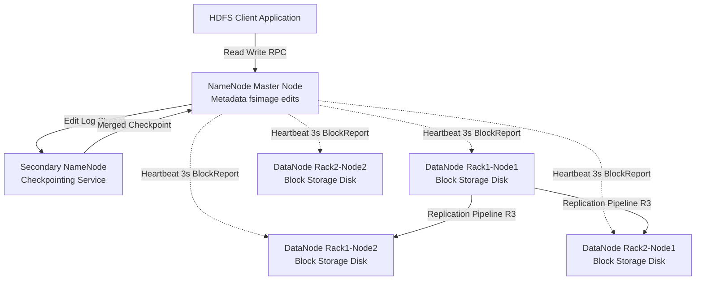
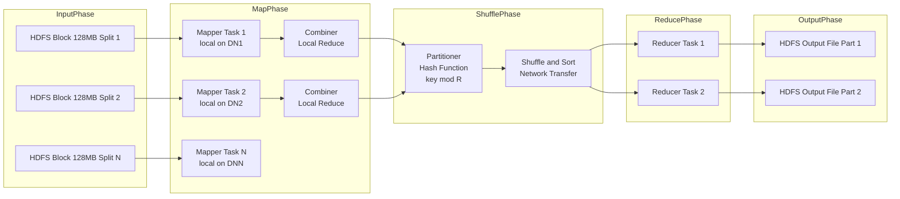
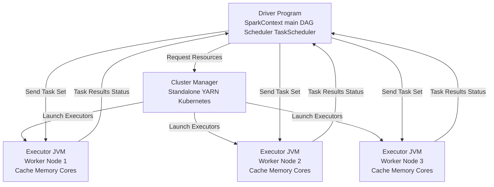
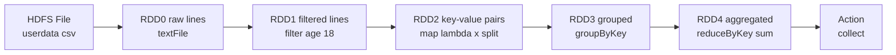
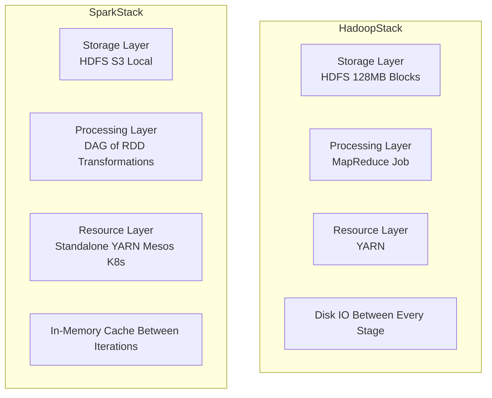

# Distributed computing frameworks - Hadoop, Spark

<!-- SECTION_1_START -->

# Distributed Computing Frameworks: Hadoop & Spark

## 1.1 Core Technical Definition

**Distributed Computing** is a computational paradigm in which a single problem is decomposed into multiple sub-problems, each processed concurrently on independent machines (nodes) interconnected through a network, producing a unified result. In the context of **Big Data Algorithms**, this approach is mandated by the **3 V's** — **Volume, Velocity, and Variety** — which exceed the storage and processing capacity of any single commodity server.

> [!NOTE]
> **Formal Definition (KTU 2024 Syllabus):** A distributed computing framework is a software layer that abstracts the complexities of network communication, fault tolerance, data partitioning, and task scheduling, allowing programmers to express parallel data-processing algorithms (like `Map`, `Reduce`, `Filter`, `Join`) over clusters of thousands of nodes.

### 1.1.1 Apache Hadoop

**Apache Hadoop** is an open-source, Java-based **distributed storage and batch processing framework** originally inspired by Google's seminal papers on the **Google File System (GFS)** and **MapReduce**. It consists of four core sub-projects:

1. **HDFS (Hadoop Distributed File System)** — handles storage
2. **MapReduce** — handles batch data processing
3. **YARN (Yet Another Resource Negotiator)** — handles cluster resource management
4. **Hadoop Common** — provides utilities and libraries

> [!IMPORTANT]
> **Hadoop's Design Philosophy:** "Bring the code to the data" — instead of moving huge datasets across the network, the processing logic is shipped to the machine where the data block physically resides.

### 1.1.2 Apache Spark

**Apache Spark** is a **fast, in-memory, general-purpose distributed computing engine** developed at UC Berkeley's AMPLab. It extends the MapReduce model by supporting **in-memory cluster computing**, enabling iterative algorithms (ML, graph processing, stream analytics) to run **up to 100× faster** than Hadoop MapReduce for certain workloads.

> [!IMPORTANT]
> **Spark's Core Abstraction:** The **Resilient Distributed Dataset (RDD)** — an immutable, fault-tolerant, partitioned collection of records that can be operated upon in parallel.

### 1.2 Conceptual Analogy & Intuition

> [!TIP]
> **Restaurant Kitchen Analogy**
>
> Imagine preparing a wedding banquet for 1,000 guests in a single tiny kitchen with one chef (this is a **single-node system**). It is impossible. Now, you hire 50 chefs, give each a portion of the recipe card, and arrange workstations across a large hall. This is **distributed computing**.
>
> - **Hadoop MapReduce** is like a chef who writes the recipe on paper, hands it to the head chef, then leaves the kitchen and waits for the result. Each iteration requires him to **come back, read from the fridge (disk), cook, and write back**. This is slow but very safe and reliable.
> - **Apache Spark** is like the same chef, but the ingredients are kept **on the counter (RAM/memory)**. He can taste, adjust, cook again, taste again — many iterations in minutes. Lightning fast for iterative recipes like **bread dough (ML training)** or **soup tasting (graph algorithms)**.

### 1.3 Physical Constants and Standard Metrics

| Parameter | Hadoop (HDFS) | Spark |
|---|---|---|
| **Default Block / Partition Size** | **128 MB** (configurable) | **128 MB** (default partition size) |
| **Default Replication Factor** | **3** (configurable) | N/A (delegated to underlying storage) |
| **Memory Usage** | Disk-based (writes to HDFS after each stage) | In-memory (caches RDDs) |
| **Latency** | High (seconds to minutes) | Low (milliseconds to seconds) |
| **Cluster Size (typical)** | Thousands of nodes | Thousands of nodes |

### 1.4 Visualization Control

> [!VISUALIZATION CONTROL]
> **Concept:** Data partitioning and parallel processing across a cluster
> **GeoGebra / Desmos Input Equations (Mock Layout):**
> * `Block_i = Dataset / 128MB` (lines of code in a code block, not a function plot)
> **Visual Description:** Visualize one large data rectangle being **horizontally sliced** into 8 strips (partitions). Each strip is replicated 3 times across 3 racks. Arrows flow from each strip up to a worker process performing a `map()` function, then outputs converge at a single `reduce()` node.

---

<!-- SECTION_1_END -->

<!-- SECTION_2_START -->

# Deep Theoretical Analysis & KTU High-Yield Formula Sheet

## 2.1 Hadoop Distributed File System (HDFS) — Architecture

HDFS follows a **Master-Slave (NameNode-DataNode) architecture**.

### 2.1.1 Components of HDFS

1. **NameNode (Master)**
   - Stores **metadata** (file names, permissions, block locations, replication factor).
   - Maintains the filesystem namespace in RAM + an edit log on disk.
   - **Single point of failure** (mitigated by Secondary NameNode / HA setup).

2. **DataNode (Slave / Worker)**
   - Stores the **actual data blocks** on local disks.
   - Periodically sends **heartbeat** signals (default: every 3 seconds) and **BlockReports** to the NameNode.
   - A file is split into blocks of **128 MB** by default.

3. **Secondary NameNode**
   - Performs **checkpointing** by merging the `fsimage` and `edits` log.
   - It is **NOT a backup NameNode** (a common KTU exam pitfall).

### 2.1.2 HDFS Write Pipeline (3-Stage Replication)

When a client writes a 1 GB file with replication factor 3:

$$
\text{Number of Blocks} = \left\lceil \frac{\text{File Size}}{\text{Block Size}} \right\rceil = \left\lceil \frac{1024 \text{ MB}}{128 \text{ MB}} \right\rceil = 8 \text{ blocks}
$$

Each of the 8 blocks is replicated 3 times, giving **24 physical blocks** distributed across the cluster.

## 2.2 Hadoop MapReduce — Programming Model

MapReduce is a **two-phase functional programming model** introduced by Dean and Ghemawat (Google, 2004).

### 2.2.1 The Two Phases

**Phase 1 — `map(k1, v1) -> list(k2, v2)`**
- Input key-value pair is transformed into intermediate key-value pairs.
- Runs on the node storing the data block (**data locality**).

**Phase 2 — `reduce(k2, list(v2)) -> list(k3, v3)`**
- All values for a given intermediate key are aggregated.
- Runs after a mandatory **Shuffle & Sort** phase.

### 2.2.2 Execution Flow (Detailed)

1. **Input Split** — file is divided into 128 MB splits.
2. **RecordReader** — converts raw bytes into (key, value) pairs.
3. **Mapper** — user-defined `map()` function executes.
4. **Combiner** *(optional, local reducer on mapper node — reduces network traffic)*.
5. **Partitioner** — routes intermediate output to a specific reducer.
6. **Shuffle & Sort** — framework groups all values for the same key.
7. **Reducer** — user-defined `reduce()` function executes.
8. **OutputFormat** — writes final results to HDFS.

> [!IMPORTANT]
> **KTU Board Favorite:** The number of reducers is determined by the user via `job.setNumReduceTasks(n)`. The number of mappers is **automatically** equal to the number of input splits.

## 2.3 Apache Spark — Architecture

### 2.3.1 Core Components (Driver–Executor Model)

1. **Driver Program** — contains the `main()` function and creates the `SparkContext`. It converts the user program into a **DAG (Directed Acyclic Graph)** of stages and tasks.
2. **Cluster Manager** — allocates resources. Options: **Standalone, YARN, Mesos, Kubernetes**.
3. **Executors** — JVM processes running on worker nodes that execute tasks and store data in memory/disk.
4. **SparkContext** — the entry point of any Spark application; coordinates the application with the cluster manager.

### 2.3.2 Resilient Distributed Dataset (RDD)

An **RDD** is the fundamental data structure of Spark. It is characterized by five properties:

- **Partitions** — atomic chunks of dataset distributed across nodes.
- **Dependencies** — lineage graph tracking how the RDD was derived.
- **Compute Function** — `f(partition_index) -> Iterator[T]`.
- **Partitioner** *(optional)* — e.g., `HashPartitioner` with `numPartitions = n`.
- **Preferred Locations** *(optional)* — HDFS block locations for data locality.

### 2.3.3 RDD Operations — Two Categories

| Type | Examples | Lazy / Eager | Triggers Job? |
|---|---|---|---|
| **Transformations** | `map`, `filter`, `flatMap`, `groupByKey`, `reduceByKey`, `join` | **Lazy** | No |
| **Actions** | `count`, `collect`, `take(n)`, `saveAsTextFile`, `reduce` | **Eager** | Yes |

> [!IMPORTANT]
> **Lazy Evaluation:** Transformations build a DAG. An **action** materializes the DAG, schedules jobs, and produces output. This is the cornerstone of Spark's optimization.

## 2.4 KTU High-Yield Formula Sheet

| Concept | Formula / Rule | Units / Notes |
|---|---|---|
| Number of HDFS blocks | $B = \lceil S / 128 \text{MB} \rceil$ | $S$ = file size in MB |
| Total physical storage | $T = B \times R$ | $R$ = replication factor (default 3) |
| MapReduce speedup (Amdahl's Law) | $S(N) = \dfrac{1}{f + \dfrac{1-f}{N}}$ | $f$ = sequential fraction, $N$ = nodes |
| Spark partition sizing rule | $P \approx 2 \text{ to } 3 \times \text{ cores per executor}$ | $P$ = total partitions |
| Recommended block size for Spark | **128 MB – 256 MB** | Smaller → more parallelism, more overhead |
| HDFS heartbeat interval | **3 seconds** | If missed 10×, DataNode declared dead |
| Replication pipeline | $R = 3$ (default) | Two replicas on same rack, one on different rack |
| Shuffle spill threshold | `spark.shuffle.file.buffer` = **32 KB** | Configurable memory buffer for sort |

## 2.5 Real-World Engineering Utility

> [!TIP]
> **Industry Applications**
>
> - **Hadoop** is the backbone of **data lake architecture** at companies like Facebook (now Meta), Yahoo, and LinkedIn. Used for **ETL pipelines, log aggregation, and archival storage**.
> - **Spark** is the engine of choice for **iterative ML** (MLlib), **real-time stream processing** (Spark Streaming / Structured Streaming), and **graph algorithms** (GraphFrames). Used by Netflix (recommendation), Uber (fare prediction), and Pinterest (ad ranking).
> - The modern **Lambda Architecture** combines both: Hadoop for batch layer, Spark Streaming for speed layer.

---

<!-- SECTION_2_END -->

<!-- SECTION_3_START -->

# Step-by-Step Derivations & Code/Symbolic Implementation

## 3.1 Derivation: Counting Blocks for a Given File Size

**Problem Statement:** Given a file of size $S$ MB, replication factor $R$, and block size $B_{\text{size}}$ MB, derive the total physical storage consumed in HDFS.

**Step 1 — Compute the number of logical blocks:**

$$
B = \left\lceil \frac{S}{B_{\text{size}}} \right\rceil
$$

**Step 2 — Multiply by replication factor to get total physical block count:**

$$
B_{\text{phys}} = B \times R
$$

**Step 3 — Compute total storage consumed in MB:**

$$
T = B_{\text{phys}} \times B_{\text{size}} = \left\lceil \frac{S}{B_{\text{size}}} \right\rceil \times R \times B_{\text{size}}
$$

**Worked Example:** $S = 1000$ MB, $B_{\text{size}} = 128$ MB, $R = 3$.

$$
B = \left\lceil \frac{1000}{128} \right\rceil = \lceil 7.8125 \rceil = 8 \text{ blocks}
$$

$$
B_{\text{phys}} = 8 \times 3 = 24 \text{ blocks}
$$

$$
T = 24 \times 128 = 3072 \text{ MB} = 3 \text{ GB}
$$

## 3.2 Hadoop MapReduce — WordCount Algorithm (Full Derivation)

**Problem:** Given a text corpus, count the frequency of every distinct word.

### 3.2.1 Mapper Logic (Pseudocode)

For each line of input, split by whitespace and emit `(word, 1)` for every word.

$$
\text{map}(k_1, v_1) \rightarrow \text{list}\langle (w, 1) \rangle
$$

### 3.2.2 Reducer Logic (Pseudocode)

For each unique key $w$, sum all associated 1s.

$$
\text{reduce}(w, [1, 1, 1, \ldots]) \rightarrow (w, \text{count})
$$

### 3.2.3 Full Python Implementation (Hadoop Streaming Interface)

```python
#!/usr/bin/env python3
"""
Hadoop MapReduce WordCount — Mapper Phase
Compatible with: hadoop jar <jar> -file mapper.py -mapper mapper.py ...
"""

import sys
import logging

# Configure logging for fault tolerance
logging.basicConfig(
    filename='mapper.log',
    level=logging.ERROR,
    format='%(asctime)s [%(levelname)s] %(message)s'
)


def emit(word: str, count: int = 1) -> None:
    """Emit a key-value pair to STDOUT, tab-separated, per Hadoop Streaming spec."""
    sys.stdout.write(f"{word}\t{count}\n")
    sys.stdout.flush()


def tokenize(line: str) -> list:
    """Split line into normalized lowercase tokens, stripping punctuation."""
    return [
        ''.join(ch for ch in word.lower() if ch.isalnum())
        for word in line.strip().split()
        if word.strip()
    ]


def main() -> None:
    """Read lines from STDIN, tokenize, and emit (word, 1) pairs."""
    try:
        for raw_line in sys.stdin:
            words = tokenize(raw_line)
            for w in words:
                if w:  # boundary check: skip empty strings
                    emit(w, 1)
    except Exception as exc:
        logging.error(f"Mapper crashed on line: {raw_line!r} — {exc}")
        sys.exit(1)


if __name__ == "__main__":
    main()
```

```python
#!/usr/bin/env python3
"""
Hadoop MapReduce WordCount — Reducer Phase
"""

import sys
import logging

logging.basicConfig(
    filename='reducer.log',
    level=logging.ERROR,
    format='%(asctime)s [%(levelname)s] %(message)s'
)


def main() -> None:
    """Aggregate counts per word, expecting sorted input from Shuffle phase."""
    current_word: str = None
    current_count: int = 0

    try:
        for raw_line in sys.stdin:
            line = raw_line.strip()
            if not line:
                continue

            parts = line.split('\t', 1)
            if len(parts) != 2:
                logging.error(f"Malformed line: {line!r}")
                continue

            word, count_str = parts
            try:
                count = int(count_str)
            except ValueError:
                logging.error(f"Non-integer count: {count_str!r}")
                continue

            if word == current_word:
                current_count += count
            else:
                if current_word is not None:
                    sys.stdout.write(f"{current_word}\t{current_count}\n")
                current_word = word
                current_count = count

        # Emit final word boundary
        if current_word is not None:
            sys.stdout.write(f"{current_word}\t{current_count}\n")
            sys.stdout.flush()
    except Exception as exc:
        logging.error(f"Reducer crashed — {exc}")
        sys.exit(1)


if __name__ == "__main__":
    main()
```

### 3.2.4 Step-by-Step Trace on Sample Input

**Input file:**
```
hello world
hello hadoop
hello spark
```

**Mapper Output (intermediate):**
```
hello   1
world   1
hello   1
hadoop  1
hello   1
spark   1
```

**After Shuffle & Sort (grouped by key):**
```
hadoop  [1]
hello   [1, 1, 1]
spark   [1]
world   [1]
```

**Reducer Output (final):**
```
hadoop  1
hello   3
spark   1
world   1
```

## 3.3 PySpark — WordCount Algorithm (Full Derivation)

```python
"""
PySpark WordCount — RDD-based implementation
Compatible with: spark-submit wordcount_rdd.py
"""

import logging
from pyspark.sql import SparkSession
from typing import List, Tuple

# Initialize logger for fault diagnosis
logging.basicConfig(level=logging.INFO, format='%(asctime)s [%(levelname)s] %(message)s')
logger = logging.getLogger(__name__)


def create_spark_session(app_name: str = "WordCountRDD") -> SparkSession:
    """Create a SparkSession with explicit master and configuration."""
    return (
        SparkSession.builder
        .appName(app_name)
        .master("local[*]")  # Use all local cores; change to "yarn" in cluster mode
        .config("spark.sql.shuffle.partitions", "4")
        .getOrCreate()
    )


def tokenize(line: str) -> List[str]:
    """Boundary-safe tokenization: lowercase, alphanumeric only, non-empty."""
    tokens: List[str] = [
        ''.join(ch for ch in word.lower() if ch.isalnum())
        for word in line.strip().split()
    ]
    return [t for t in tokens if t]


def wordcount(input_path: str, output_path: str) -> None:
    """Execute the distributed WordCount algorithm using RDD operations."""
    spark = create_spark_session()
    sc = spark.sparkContext
    sc.setLogLevel("WARN")

    try:
        # Lazy: build DAG of transformations
        lines_rdd = sc.textFile(input_path, minPartitions=4)
        logger.info(f"Input partitions: {lines_rdd.getNumPartitions()}")

        words_rdd = lines_rdd.flatMap(tokenize)              # Transformation
        pairs_rdd = words_rdd.map(lambda w: (w, 1))         # Transformation
        counts_rdd = pairs_rdd.reduceByKey(lambda a, b: a + b)  # Transformation (includes local combine)

        # Swap (word, count) -> (count, word) for sorting
        swapped_rdd = counts_rdd.map(lambda x: (x[1], x[0]))
        sorted_rdd = swapped_rdd.sortByKey(ascending=False)

        # Action: triggers DAG execution
        results = sorted_rdd.collect()
        logger.info(f"Distinct words found: {len(results)}")

        # Persist output to HDFS / local FS
        sorted_rdd.saveAsTextFile(output_path)

        # Display top 10 results
        for count, word in results[:10]:
            print(f"{word}\t{count}")

    except Exception as exc:
        logger.error(f"WordCount job failed: {exc}")
        raise
    finally:
        spark.stop()


if __name__ == "__main__":
    import sys
    if len(sys.argv) != 3:
        print("Usage: spark-submit wordcount_rdd.py <input_path> <output_path>")
        sys.exit(1)
    wordcount(sys.argv[1], sys.argv[2])
```

### 3.3.1 Step-by-Step Execution Trace

1. **`textFile(path, 4)`** → creates RDD with 4 partitions (lazy).
2. **`flatMap(tokenize)`** → RDD of individual words.
3. **`map(lambda w: (w, 1))`** → RDD of `(word, 1)` tuples.
4. **`reduceByKey(lambda a, b: a + b)`** → RDD of `(word, total_count)`. This is **map-side combined** and **shuffle-optimized** (much faster than `groupByKey`).
5. **`sortByKey(ascending=False)`** → RDD sorted by count descending.
6. **`collect()`** → **ACTION** triggers job execution and returns list to driver.

## 3.4 PySpark — DataFrame API Equivalent

```python
"""
PySpark WordCount — DataFrame API
"""
from pyspark.sql import SparkSession
from pyspark.sql import functions as F


def wordcount_df(input_path: str, output_path: str) -> None:
    spark = (
        SparkSession.builder
        .appName("WordCountDF")
        .master("local[*]")
        .getOrCreate()
    )

    try:
        df = spark.read.text(input_path)

        # explode splits each line's words into separate rows
        result_df = (
            df.select(F.explode(F.split(F.lower(F.col("value")), "\\s+")).alias("word"))
              .filter(F.col("word") != "")
              .groupBy("word")
              .count()
              .orderBy(F.col("count").desc())
        )

        # Action
        result_df.write.mode("overwrite").csv(output_path)
        result_df.show(10, truncate=False)
    finally:
        spark.stop()


if __name__ == "__main__":
    import sys
    wordcount_df(sys.argv[1], sys.argv[2])
```

---

<!-- SECTION_3_END -->

<!-- SECTION_4_START -->

# Structural Diagrams & Schematics

## 4.1 HDFS Architecture — Master-Slave Topology



## 4.2 Hadoop MapReduce — Data Flow Architecture



## 4.3 Apache Spark — Driver-Executor Architecture



## 4.4 Spark RDD Lineage — DAG Topology



## 4.5 Hadoop vs Spark — Comparative Block Architecture



---

<!-- SECTION_4_END -->

<!-- SECTION_5_START -->

# KTU 2024 Scheme Examination Question Bank & Topic Recap

## 5.1 Part A — Short Answer Questions (3 Marks Each)

### Question 1 `[KTU University Exam - July 2024]` — CO1, Remember
**Explain the role of the NameNode and DataNode in HDFS. Why is the NameNode called a single point of failure?**

**Model Answer (3 marks):**

- **[1 mark]** The **NameNode** is the master daemon that maintains the metadata of the entire filesystem, including the file-to-block mapping, block locations, and access permissions. It keeps this metadata in RAM for fast access and persists it to disk via the `fsimage` file and `edits` log.
- **[1 mark]** The **DataNodes** are slave daemons that store the actual data blocks (default size 128 MB) on local disks. They send heartbeat signals every 3 seconds and periodic BlockReports to the NameNode.
- **[1 mark]** The NameNode is a **single point of failure** because if it crashes, the entire cluster becomes inaccessible — there is no node that can independently resolve a block's location. This is mitigated in Hadoop 2.x+ using **High Availability (HA)** with a Standby NameNode backed by ZooKeeper-based leader election.

---

### Question 2 `[KTU University Exam - Dec 2023]` — CO2, Understand
**Differentiate between Transformations and Actions in Apache Spark with two examples each.**

**Model Answer (3 marks):**

| Aspect | Transformations | Actions |
|---|---|---|
| Execution Type | Lazy (not executed immediately) | Eager (trigger job) |
| Return Type | New RDD | Result value or write to external storage |
| Example 1 | `map(lambda x: x * 2)` | `count()` |
| Example 2 | `filter(lambda x: x > 10)` | `collect()` |
| Optimization | Catalyst optimizer analyzes DAG | Materializes DAG into jobs |

**[1 mark]** Transformations like `map` and `filter` return a new RDD and are lazily evaluated; they are not executed until an action is triggered.
**[1 mark]** Actions like `count()` and `collect()` trigger the DAG execution, run the job on the cluster, and return results to the driver.
**[1 mark]** Because of lazy evaluation, Spark can optimize the entire DAG before execution (e.g., pipelining map and filter operations).

---

## 5.2 Part B — Long Answer Questions (14 Marks, Internal Choice)

### Question A `[KTU University Exam - Dec 2024]` — CO2, Apply

**(a)** With a neat block diagram, explain the **Hadoop architecture** and the **HDFS write pipeline** for a file with replication factor 3. (7 marks)

**(b)** A 5 GB file is stored in HDFS with a default block size of 128 MB and a replication factor of 3. Calculate: (i) the number of logical blocks, (ii) the number of physical blocks stored, and (iii) the total physical storage consumed. (7 marks)

#### Solution A(a) — Hadoop Architecture & Write Pipeline

**Block Diagram (Textual Description for Board):**

The Hadoop architecture consists of:
1. **HDFS Layer** — NameNode (master) + multiple DataNodes (slaves) connected via TCP.
2. **MapReduce Layer** — JobTracker (in Hadoop 1.x) / ApplicationMaster (in Hadoop 2.x+) + TaskTrackers.
3. **YARN Layer** — ResourceManager + NodeManagers.

**HDFS Write Pipeline Steps:** (5 marks for diagram + 2 marks for explanation)

1. The **client** contacts the NameNode to get the list of DataNodes that will host the replicas of the first block.
2. The client writes the block to the **first DataNode** in the pipeline.
3. The first DataNode forwards the data packet to the **second DataNode**, which forwards to the **third**.
4. Each DataNode sends an **acknowledgment packet** up the pipeline.
5. The client receives all acknowledgments, then proceeds to the next block.

- **[Diagram: 3 marks]** showing Client → DN1 → DN2 → DN3 with ack arrows
- **[Pipeline stages: 2 marks]** listing the 5 steps above
- **[Replication strategy: 1 mark]** mentioning 2 replicas on same rack, 1 on different rack
- **[Data integrity: 1 mark]** checksum verification at each DataNode

#### Solution A(b) — Storage Calculation

**Given:** $S = 5 \text{ GB} = 5120 \text{ MB}$, $B_{\text{size}} = 128 \text{ MB}$, $R = 3$.

**(i) Number of logical blocks:**

$$
B = \left\lceil \frac{S}{B_{\text{size}}} \right\rceil = \left\lceil \frac{5120}{128} \right\rceil = \lceil 40.0 \rceil = 40 \text{ blocks}
$$

- **[Stating formula: 1 mark]**
- **[Substitution: 1 mark]**
- **[Final value: 1 mark]**

**(ii) Number of physical block copies:**

$$
B_{\text{phys}} = B \times R = 40 \times 3 = 120 \text{ physical blocks}
$$

- **[Formula: 1 mark]**
- **[Answer: 1 mark]**

**(iii) Total physical storage:**

$$
T = B_{\text{phys}} \times B_{\text{size}} = 120 \times 128 \text{ MB} = 15360 \text{ MB} = 15 \text{ GB}
$$

- **[Formula: 1 mark]**
- **[Final answer in GB: 1 mark]**

---

### Question B `[KTU University Exam - July 2024]` — CO3, Apply

**(a)** With a neat diagram, explain the **Spark architecture**. List the responsibilities of the Driver program and Executors. (7 marks)

**(b)** Write a **PySpark program** using RDD operations to compute the **top 5 most frequent words** from a text file stored at `/data/input.txt`. Show the complete transformation chain. (7 marks)

#### Solution B(a) — Spark Architecture

**Components of Spark Architecture (with diagram):**

- **[Diagram: 3 marks]** (Driver → Cluster Manager → 2-3 Executors with arrows)
- **Driver Program** [2 marks]:
  - Runs the user's `main()` function and creates the `SparkContext`.
  - Builds the **DAG** of RDD operations.
  - Schedules tasks via the **TaskScheduler**.
  - Coordinates with the **Cluster Manager** for resource allocation.
  - Returns results from action operations to the user.
- **Executors** [2 marks]:
  - JVM processes launched on **worker nodes**.
  - Execute **tasks** assigned by the driver.
  - Store RDD partitions in **memory** (cache) and/or on **disk**.
  - Report task status and results back to the driver.

#### Solution B(b) — Top-5 Word Frequency in PySpark

**Complete Program:**

```python
from pyspark.sql import SparkSession

def top5_words(input_path: str) -> list:
    """Compute top-5 most frequent words in a text file using RDD operations."""
    spark = SparkSession.builder.appName("Top5Words").master("local[*]").getOrCreate()
    sc = spark.sparkContext

    try:
        # Step 1: Read file as RDD of lines
        lines = sc.textFile(input_path)

        # Step 2: flatMap -> tokenize each line
        words = lines.flatMap(lambda line: line.strip().lower().split())

        # Step 3: map -> (word, 1)
        pairs = words.map(lambda w: (w, 1))

        # Step 4: reduceByKey -> (word, total_count) - uses combiner for efficiency
        counts = pairs.reduceByKey(lambda a, b: a + b)

        # Step 5: swap -> (count, word)
        swapped = counts.map(lambda x: (x[1], x[0]))

        # Step 6: sortByKey descending
        sorted_counts = swapped.sortByKey(ascending=False)

        # Step 7: take(5) action
        top5 = sorted_counts.take(5)

        return top5

    finally:
        spark.stop()


if __name__ == "__main__":
    result = top5_words("/data/input.txt")
    for count, word in result:
        print(f"{word}\t{count}")
```

**Valuation Key:**

- **[Reading file via textFile: 1 mark]**
- **[flatMap tokenization: 1 mark]**
- **[Map to (word, 1): 1 mark]**
- **[reduceByKey with combiner: 1 mark]**
- **[Swap and sortByKey: 1 mark]**
- **[take(5) action triggering job: 1 mark]**
- **[Final output display loop: 1 mark]**

---

## 5.3 KTU Examiner's Valuation Warning / Pitfall Callout

> [!WARNING]
> **Common Mark-Deduction Pitfalls in KTU Valuation:**
>
> 1. **Do not** write "Secondary NameNode is the backup of NameNode" — this is **factually incorrect** and costs 1 mark. The Secondary NameNode only performs **checkpointing**.
> 2. **Do not** confuse **transformations** with **actions**. Always clarify that transformations are **lazy** and only an action triggers the DAG execution.
> 3. **Do not** forget to mention the default **replication factor (3)** and **block size (128 MB)** in HDFS questions. The examiner awards 1 mark for stating these.
> 4. **Do not** use `groupByKey` when `reduceByKey` is appropriate — `reduceByKey` performs a **local combine** on the mapper side, drastically reducing network shuffle.
> 5. In **Spark architecture** questions, always draw the **Driver, Cluster Manager, and Executors** as **three separate boxes** with labeled arrows. A single-box diagram is marked down.
> 6. For **calculation problems**, **always show the formula first**, then substitute values, then compute. Skipping the formula costs 1 mark even if the answer is correct.

---

## 5.4 Topic Recap & Important Things to Remember

- **Hadoop** is a **disk-based, batch-oriented** framework built on **HDFS** (storage) + **MapReduce** (compute) + **YARN** (resources).
- **HDFS** uses a **NameNode (master) + DataNode (slave)** architecture with a default **block size of 128 MB** and **replication factor of 3**.
- **MapReduce** has two phases: **Map** (data-local transformation) and **Reduce** (aggregation), separated by a mandatory **Shuffle & Sort** stage.
- The **Number of Mappers** = Number of input splits (automatic). The **Number of Reducers** is user-set via `setNumReduceTasks(n)`.
- **Spark** is an **in-memory**, general-purpose engine that extends MapReduce with **DAG-based execution** and **lazy evaluation**.
- The **RDD** (Resilient Distributed Dataset) is Spark's core abstraction, characterized by **partitions, dependencies, compute function, partitioner, and preferred locations**.
- **Transformations** are **lazy** (build DAG). **Actions** are **eager** (trigger execution).
- **Use `reduceByKey` over `groupByKey`** for performance — the former does a map-side combine.
- **Hadoop is best for batch ETL and archival storage**. **Spark is best for iterative ML, streaming, and interactive analytics**.
- Default Spark **shuffle partitions** = 200; **partitions per core** ≈ 2–3.
- Key formulas: $B = \lceil S / 128 \rceil$, $B_{\text{phys}} = B \times R$, $T = B_{\text{phys}} \times B_{\text{size}}$.
- **NameNode heartbeat interval** = 3 seconds; **10 missed heartbeats** = DataNode declared dead.
- Always use **try/except/finally** blocks in distributed code to **log errors** and **stop SparkContext** cleanly.

---

<!-- SECTION_5_END -->
