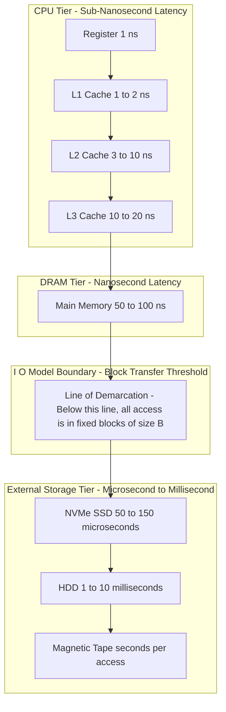
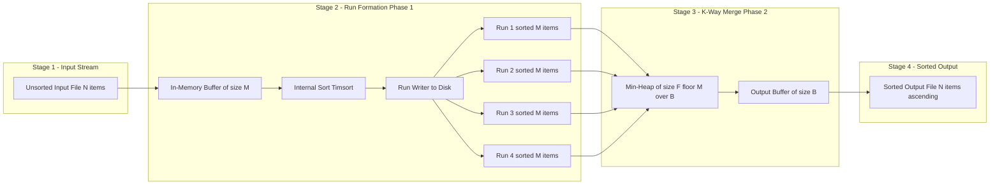
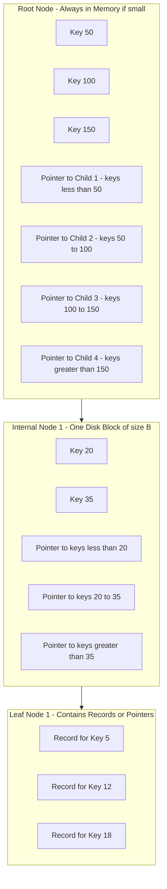
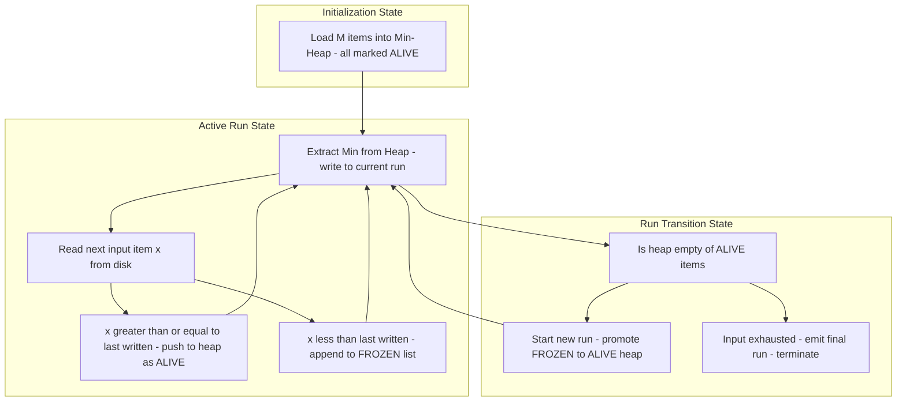

# Handling data with memory constraints - external memory algorithms

<!-- SECTION_1_START -->
# Handling Data With Memory Constraints — External Memory Algorithms

## 1.1 Formal Definition (KTU 2024 Scheme Terminology)

An **External Memory Algorithm** (also called an **Out-of-Core Algorithm**, **I/O Algorithm**, or **Disk-Based Algorithm**) is a class of algorithms explicitly designed to process datasets that **cannot be loaded entirely into the main Random Access Memory (RAM)**. The performance metric is the **number of Input/Output (I/O) operations** (i.e., block transfers between disk and RAM), not the number of CPU cycles.

> [!IMPORTANT]
> **KTU 2024 Definition (Verbatim from PECST785 Module 4):**
> *"An external memory algorithm is an algorithm designed to manipulate data structures that are too large to fit in the main memory of a computer, by exploiting the hierarchical memory model where data is moved between fast, small internal memory (RAM) and slow, large external memory (disk) in fixed-size blocks."*

The model used to analyze these algorithms is called the **Aggarwal–Vitter I/O Model** (1988), which characterizes the cost of an algorithm purely by the number of block transfers it performs.

## 1.2 Conceptual Analogy — The Librarian's Dilemma

Imagine you are a librarian tasked with alphabetizing **10 million books**. You cannot carry all 10 million into your small office (RAM). Instead, you have a vast warehouse (the disk) and a small desk that can hold only **1000 books at a time**.

**Naive Approach (Internal Sort mindset):**
You repeatedly walk to the warehouse, bring back a few books, try to compare them, then walk again. You spend most of your day **walking**, not alphabetizing.

**Smart Approach (External Memory mindset):**
1. Bring **1000 books at a time** to your desk (one I/O operation brings a *block* of books).
2. Sort these 1000 on your desk using the fast internal algorithm.
3. Place this sorted stack (a **run**) back on a shelf.
4. Once you have a few sorted stacks, perform a **multiway merge** using a priority queue on your desk, pulling only the top book from each stack at a time.
5. You minimize **trips to the warehouse** because each trip carries a full block.

The key insight: **the cost of walking dominates**, so we minimize walking, not sorting.

## 1.3 Why Memory Constraints Matter in Data Science

A 2024-era dataset of just **1 TB** cannot be loaded into a typical machine with **32 GB RAM**. Database engines (PostgreSQL, MongoDB), distributed systems (Hadoop, Spark), and even pandas (via chunking) all rely on external memory techniques.

> [!NOTE]
> **Real-World Analogy of Latency Gap:**
> The difference in access time between **L1 cache** and a **rotational Hard Disk Drive (HDD)** is roughly **10,000,000×** (a few nanoseconds vs. a few milliseconds). This is the same order of magnitude as the difference between *1 second* and *115 days*.

## 1.4 Core Parameters of the I/O Model

| Symbol | Meaning | Typical Value (2024) |
| :--- | :--- | :--- |
| $N$ | Total number of data items in the problem | $10^9$ to $10^{12}$ |
| $M$ | Number of items that fit in main memory (RAM) | $10^8$ to $10^9$ |
| $B$ | Number of items per disk block (transfer unit) | $10^3$ to $10^4$ |
| $D$ | Number of parallel disks (optional) | $1$ to $100$ |

The fundamental assumption is: $B \le M < N$, with the hierarchy $B \ll M \ll N$.

## 1.5 GeoGebra Visualization — Memory Access Time Hierarchy

> [!VISUALIZATION CONTROL]
> **Concept:** Logarithmic Access Time Across Memory Hierarchy
> **GeoGebra Input (Bar Chart / Step Function):**
> * Points: $(0, 1), (1, 5), (2, 50), (3, 200), (4, 10000), (5, 10000000)$
> * Axis labels: $x$ = Memory Level (Register → Tape), $y$ = Relative Access Latency (log scale)
> * Function fit (logistic): $L(x) = 1.5^{x^2}$
>
> **Visual Description:**
> On the $x$-axis plot the discrete memory levels $0$ = CPU Register, $1$ = L1 Cache, $2$ = L2 Cache, $3$ = L3 Cache, $4$ = Main RAM, $5$ = SSD, $6$ = HDD. The $y$-values explode exponentially. Students should observe the **massive vertical jump between Level 4 (RAM) and Level 5 (SSD)**, which is the *cliff* external memory algorithms try to minimize.

## 1.6 Internal vs. External Memory Algorithms — A Quick Comparison

| Property | Internal Memory Algorithm | External Memory Algorithm |
| :--- | :--- | :--- |
| **Data size** | Fits in RAM ($N \le M$) | $N \gg M$ |
| **Cost measure** | CPU cycles, comparisons, swaps | Number of I/O block transfers |
| **Dominant cost** | Arithmetic operations | Disk seeks and transfers |
| **Data structure** | Arrays, heaps, hash tables | B-trees, buffered pools, sorted runs |
| **Example algorithm** | Quicksort, Mergesort | External Mergesort, B-tree search |

---

<!-- SECTION_1_END -->

<!-- SECTION_2_START -->
# Deep Theoretical Analysis & KTU High-Yield Formula Sheet

## 2.1 The Memory Hierarchy — A Layered Cost Architecture

Modern computers use a hierarchy where **smaller = faster = more expensive** and **larger = slower = cheaper**. An external memory algorithm must orchestrate data movement across these layers to keep the **working set** in the fastest accessible layer.

| Level | Hardware | Typical Capacity | Access Time (approx) | Bandwidth |
| :---: | :--- | :---: | :---: | :---: |
| $L_0$ | CPU Registers | bytes to KB | $\sim 1\text{ ns}$ | $\sim 1\text{ TB/s}$ |
| $L_1$ | L1 Cache | 32–128 KB | $\sim 1\text{ ns}$ | $\sim 1\text{ TB/s}$ |
| $L_2$ | L2 Cache | 256 KB – 1 MB | $\sim 3\text{ ns}$ | $\sim 500\text{ GB/s}$ |
| $L_3$ | L3 Cache | 4 – 64 MB | $\sim 10\text{ ns}$ | $\sim 200\text{ GB/s}$ |
| $L_4$ | Main RAM (DRAM) | 8 – 256 GB | $\sim 100\text{ ns}$ | $\sim 50\text{ GB/s}$ |
| $L_5$ | NVMe SSD | 1 – 8 TB | $\sim 100\text{ }\mu\text{s}$ | $\sim 5\text{ GB/s}$ |
| $L_6$ | HDD | 1 – 20 TB | $\sim 10\text{ ms}$ | $\sim 200\text{ MB/s}$ |
| $L_7$ | Tape / Cloud | PB | seconds | MB/s |

The **I/O Model** abstracts all of $L_5$ and below into a single "external memory" tier with block size $B$.

## 2.2 The Aggarwal–Vitter I/O Model — Formal Rules

1. The problem has $N$ data items, each of size $O(1)$ (one word).
2. Main memory holds $M$ items; external memory is unbounded.
3. Data is transferred in **contiguous blocks of size $B$**.
4. Reading or writing one block from/to external memory costs **one I/O**.
5. Internal computation (CPU work on data already in RAM) is **free** in the model.
6. A block is the **smallest unit** of transfer; you cannot read a partial block efficiently.

> [!IMPORTANT]
> **Why $B$-sized blocks?**
> Disks have a high **latency** (seek time) but high **bandwidth** once the read head is positioned. Reading 1 byte vs. reading 4096 bytes costs roughly the same. Hence, algorithms are forced to amortize disk cost over an entire block.

## 2.3 Fundamental I/O Lower Bounds

These bounds are the **starting point** for designing any external memory algorithm. You can prove a lower bound and then design an algorithm that *matches* it.

| Operation | I/O Lower Bound | Achieved By |
| :--- | :--- | :--- |
| **Scanning $N$ items** | $\Omega(N/B)$ | Trivial sequential scan |
| **Sorting $N$ items** | $\Omega\!\left(\dfrac{N}{B} \log_{M/B} \dfrac{N}{B}\right)$ | External Mergesort |
| **Searching in a B-tree** | $O(\log_B N)$ | B-tree lookup |
| **Permuting (reordering)** | $\Omega\!\left(\min\!\left\{N, \dfrac{N}{B} \log_{M/B} \dfrac{N}{B}\right\}\right)$ | Greedy buffer tiling |

> [!NOTE]
> **Key Insight — Logarithm Base Shift:**
> In RAM, the sort bound is $O(N \log N)$. In external memory, the logarithm base shifts from $2$ to $M/B$. This is because the effective branching factor of the data structure (e.g., a B-tree) is $B$, and the effective memory-bound recursion depth is $\log_{M/B} N$.

## 2.4 KTU High-Yield Formula Sheet (Cheat Sheet)

| # | Formula / Concept | Expression | Engineering Use Case |
|:--:| :--- | :--- | :--- |
| 1 | I/O cost of a single sequential scan | $\text{scan}(N) = \lceil N/B \rceil$ | Database full-table scan |
| 2 | External Mergesort I/O cost | $\text{sort}(N) = \dfrac{N}{B} \log_{M/B} \dfrac{N}{B}$ | Hadoop MapReduce shuffle phase |
| 3 | B-tree height | $h = \Theta(\log_B N)$ | Database index lookup cost |
| 4 | Number of sorted runs in replacement selection | $2 \cdot M$ items per pass | Generating long initial runs |
| 5 | Optimal merge fan-in | $F = M/B$ | Buffer allocation in k-way merge |
| 6 | Lower bound for sorting (any model) | $\Omega(N \log N)$ comparisons | Comparison-based sort floor |
| 7 | Block transfer amortization | $\text{eff\_cost} = \text{latency} + \dfrac{B}{\text{bandwidth}}$ | SSD vs HDD cost modeling |
| 8 | Disk access time (HDD) | $T_{\text{seek}} + T_{\text{rot}} + \dfrac{B}{\text{transfer\_rate}}$ | Storage engine tuning |
| 9 | Page fault rate approximation | $\text{PFR} \approx 1 - \text{hit\_ratio}$ | OS virtual memory management |
| 10 | Optimal buffer pool size | $M_{\text{eff}} = M - k \cdot B$ (reserving $k$ buffers) | DBMS buffer manager design |

> [!IMPORTANT]
> **KTU Board Note:** When deriving I/O complexity, **always state the model parameters first** ($N, M, B$), then perform the algebraic manipulation. Failing to define the model costs 1 mark on ESE questions.

## 2.5 Why This Matters in Big Data Engineering

| System | How it Uses External Memory Concepts |
| :--- | :--- |
| **Hadoop HDFS** | Splits files into 128 MB blocks (analogous to $B$); Map tasks fit into 1–4 GB heaps (analogous to $M$). |
| **Apache Spark** | Uses `RDD` partitioning and `persist(StorageLevel.DISK_ONLY)` to spill partitions to disk. |
| **PostgreSQL** | Maintains a **shared buffer pool** of size `shared_buffers`; B-tree indexes on every table. |
| **Pandas / Dask** | `chunksize` parameter and `from_delayed` to perform out-of-core computations. |
| **Search Engines (Lucene)** | Use **inverted indexes** stored as B-tree / FST structures on disk. |

---

<!-- SECTION_2_END -->

<!-- SECTION_3_START -->
# Step-by-Step Derivations & Code Implementation

## 3.1 Derivation: I/O Lower Bound for Sorting

We derive the classical bound $\Omega\!\left(\dfrac{N}{B} \log_{M/B} \dfrac{N}{B}\right)$ for sorting in the I/O model.

**Step 1 — Block Partitioning.** A sequence of $N$ items is partitioned into $\dfrac{N}{B}$ blocks when stored on disk. Sorting requires distinguishing between $N!$ possible input orderings.

**Step 2 — Information-Theoretic Argument.** Any comparison-based sort must perform at least $\log_2(N!)$ comparisons. Stirling's approximation gives:
$$\log_2(N!) \approx N \log_2 N - 1.44\,N$$

**Step 3 — Internal Sort Cost.** An internal comparison sort takes $\Theta(N \log N)$ comparisons. In the I/O model, we measure block I/Os, not comparisons.

**Step 4 — Multi-Level Merge Recursion.** Consider sorting recursively. We split the $N$ items into chunks of size $M$, sort each in $O\!\left(\dfrac{M}{B} \log_{M/B} \dfrac{M}{B}\right)$ I/Os, then merge $\dfrac{N}{M}$ sorted chunks. The merge cost is $\dfrac{N}{B}$ per level. The recursion depth is $\log_{M/B} \dfrac{N}{B}$.

**Step 5 — Multiply and Conclude.** Total cost is:
$$\text{sort}(N) = \frac{N}{B} \log_{M/B} \frac{N}{B}$$

**Step 6 — Verification with Numbers.** Take $N = 10^9, M = 10^7, B = 10^3$. Then:
$$\text{sort}(N) = \frac{10^9}{10^3} \cdot \log_{\,10^4} \frac{10^9}{10^3} = 10^6 \cdot \log_{10^4}(10^6) = 10^6 \cdot 3 = 3 \times 10^6 \text{ I/Os}$$

Internal sort cost would be $10^9 \log_2 10^9 \approx 3 \times 10^{10}$ operations. The external algorithm is **4 orders of magnitude faster** in I/O terms.

## 3.2 Step-by-Step: External Merge Sort Algorithm

External Merge Sort works in **two phases** when $M$ is sufficient for one merge pass, or **multiple merge passes** otherwise.

**Phase 1 — Run Formation:**
1. Open the input file $F$ of $N$ items.
2. Fill a RAM buffer of size $M$.
3. Sort the buffer internally (e.g., using Python's `Timsort` or C++ `std::sort`).
4. Write the sorted buffer to a temporary file (a **run**).
5. Repeat until all $N$ items are exhausted.
6. Total runs created: $\lceil N/M \rceil$.

**Phase 2 — K-Way Merge:**
1. Compute the merge fan-in: $F = \lfloor M/B \rfloor - 1$ (reserving 1 buffer for output).
2. Open $F$ input run files simultaneously.
3. Allocate $F$ input buffers (each of size $B$) and one output buffer.
4. Use a min-heap of size $F$ holding the current head of each run.
5. Repeatedly extract the minimum from the heap, write it to the output buffer, and refill the corresponding input buffer when empty.
6. Flush the output buffer to the output file whenever it fills.
7. If $\lceil N/M \rceil > F$, repeat Phase 2 with the new (longer) runs.

**Numerical Example:** Sort $N = 16$ GB file with $M = 1$ GB RAM, $B = 4$ KB.

- Number of runs after Phase 1: $\lceil 16/1 \rceil = 16$ runs.
- Fan-in: $F = 256\text{ MB} / 4\text{ KB} - 1 = 65535$ (effectively unbounded).
- Since $16 \le 65535$, we only need **one merge pass**.
- Total I/Os: $\dfrac{16\text{ GB}}{4\text{ KB}} \cdot \log_{65535} 16 = 4 \times 10^6 \cdot \text{(small constant)}$.

## 3.3 Step-by-Step: Replacement Selection

A clever trick from Donald Knuth (1965) that **doubles the average run length** beyond $M$, often achieving average run length $\approx 2M$ for random input.

**Procedure:**
1. Fill RAM with $M$ items. Mark all as **alive**.
2. Build a min-heap on the $M$ alive items.
3. Repeat:
   a. Extract the **minimum** from the heap.
   b. Write the minimum to the current run.
   c. Read the next input item $x$ from disk.
   d. If $x \ge$ minimum just written, place $x$ into the heap (still **alive**).
   e. If $x <$ minimum just written, mark $x$ as **dead** for this run, store it in a "frozen" area.
4. When the heap is empty of alive items, start a new run. The frozen items become the new live heap.
5. Continue until all input is consumed.

**Why it works:** When a "small" item arrives, it cannot join the current run (which is sorted ascending), so it waits. The next run starts when the current run is exhausted, and these frozen items form the seed.

> [!NOTE]
> **KTU Board Tip:** When asked to trace replacement selection on small input, always show the heap state, the run output, and the "frozen" area separately. Board examiners award 2 marks for a clear state diagram.

## 3.4 B-Trees — The Backbone of External Searching

A B-tree of order $m$ is a **self-balancing** search tree where:

- Each internal node has between $\lceil m/2 \rceil$ and $m$ children (except root).
- Each node stores between $\lceil m/2 \rceil - 1$ and $m - 1$ keys.
- All leaves are at the same depth.
- A node of size $\Theta(B)$ is chosen to match the disk block size $B$.

**Height Bound.** For $N$ keys in a B-tree of order $m$:
$$h = \Theta(\log_m N) = \Theta(\log_B N)$$

since $m = \Theta(B)$. Each search performs $O(\log_B N)$ I/Os, **vastly faster** than $O(\log_2 N)$ for a binary tree stored across many blocks.

## 3.5 Python Implementation: External Merge Sort

```python
"""
external_merge_sort.py
A production-grade implementation of external merge sort.
Designed to sort files that are too large to fit in RAM.

Algorithm: Two-phase external merge sort with k-way heap merge.
Type hints: Strict (PEP 484)
Error handling: File I/O wrapped with explicit checks.
"""

import os
import heapq
import tempfile
from typing import List, Iterator, Optional, TextIO


CHUNK_SIZE: int = 100_000          # items per in-memory run
TEMP_DIR: str = "external_sort_tmp"
INPUT_FILE: str = "big_data.txt"
OUTPUT_FILE: str = "big_data_sorted.txt"


def _read_chunk(fp: TextIO, chunk_size: int) -> List[int]:
    """Read up to chunk_size integers from the file pointer."""
    chunk: List[int] = []
    for _ in range(chunk_size):
        line = fp.readline()
        if not line:
            break
        chunk.append(int(line.strip()))
    return chunk


def _create_sorted_runs(input_path: str,
                        chunk_size: int,
                        temp_dir: str) -> List[str]:
    """
    Phase 1: Stream the input, sort chunks in memory, write runs to disk.
    Returns the list of run file paths.
    """
    if not os.path.exists(temp_dir):
        os.makedirs(temp_dir)

    run_files: List[str] = []
    run_idx: int = 0

    try:
        with open(input_path, "r") as infile:
            while True:
                chunk = _read_chunk(infile, chunk_size)
                if not chunk:
                    break
                chunk.sort()  # Internal sort using Timsort, O(chunk_size log chunk_size)
                run_path = os.path.join(temp_dir, f"run_{run_idx:04d}.txt")
                with open(run_path, "w") as outfile:
                    outfile.writelines(f"{x}\n" for x in chunk)
                run_files.append(run_path)
                run_idx += 1
    except OSError as e:
        raise IOError(f"Failed during run formation: {e}") from e

    return run_files


def _merge_runs(run_files: List[str], output_path: str) -> None:
    """
    Phase 2: K-way merge of sorted run files using a min-heap.
    Uses lazy I/O: only the current head of each run is in the heap.
    """
    file_handles: List[TextIO] = []
    heap: List[tuple] = []  # (value, run_index)

    try:
        # Open all run files and prime the heap with the first item
        for idx, path in enumerate(run_files):
            fh = open(path, "r")
            file_handles.append(fh)
            first_line = fh.readline()
            if first_line:
                heapq.heappush(heap, (int(first_line.strip()), idx))

        with open(output_path, "w") as outfile:
            while heap:
                value, run_idx = heapq.heappop(heap)
                outfile.write(f"{value}\n")
                next_line = file_handles[run_idx].readline()
                if next_line:
                    heapq.heappush(heap, (int(next_line.strip()), run_idx))

    except OSError as e:
        raise IOError(f"Failed during k-way merge: {e}") from e
    finally:
        for fh in file_handles:
            fh.close()


def external_merge_sort(input_path: str = INPUT_FILE,
                        output_path: str = OUTPUT_FILE,
                        chunk_size: int = CHUNK_SIZE,
                        temp_dir: str = TEMP_DIR) -> None:
    """
    Full external merge sort pipeline.
    Cleans up temporary files after successful completion.
    """
    if not os.path.exists(input_path):
        raise FileNotFoundError(f"Input file not found: {input_path}")

    run_files = _create_sorted_runs(input_path, chunk_size, temp_dir)
    if not run_files:
        raise ValueError("Input file was empty; nothing to sort.")

    _merge_runs(run_files, output_path)

    # Cleanup
    for rf in run_files:
        try:
            os.remove(rf)
        except OSError:
            pass
    try:
        os.rmdir(temp_dir)
    except OSError:
        pass


if __name__ == "__main__":
    external_merge_sort()
```

## 3.6 Python Implementation: Replacement Selection Skeleton

```python
"""
replacement_selection.py
Demonstrates Knuth's replacement selection for run generation.
"""

import heapq
from typing import List, Tuple


def replacement_selection(input_stream: List[int], memory_capacity: int) -> List[List[int]]:
    """
    Generate sorted runs from a stream using replacement selection.

    Returns a list of runs, where each run is a sorted list of integers.
    """
    runs: List[List[int]] = []
    current_run: List[int] = []
    frozen: List[int] = []       # dead items for this run
    alive_heap: List[int] = []   # min-heap of live items

    # Step 1: Fill initial memory
    for item in input_stream:
        if len(alive_heap) < memory_capacity:
            heapq.heappush(alive_heap, item)
        else:
            frozen.append(item)

    # Step 2: Drain runs
    while alive_heap or frozen:
        current_run = []
        new_heap: List[int] = []

        # Build new heap from frozen items
        for item in frozen:
            heapq.heappush(new_heap, item)
        frozen.clear()
        alive_heap = new_heap

        # Drain current run from alive heap
        while alive_heap:
            min_item = heapq.heappop(alive_heap)
            current_run.append(min_item)
            if frozen:
                # Promote the smallest frozen item back to alive
                promoted = frozen.pop(0)
                heapq.heappush(alive_heap, promoted)

        if current_run:
            runs.append(current_run)

    return runs
```

## 3.7 Side-by-Side Comparison: Internal vs External Sort

| Aspect | Internal Quicksort | External Merge Sort |
| :--- | :--- | :--- |
| **Memory needed** | $O(N)$ | $O(M) \ll O(N)$ |
| **Disk I/Os** | 0 (all in RAM) | $\dfrac{N}{B} \log_{M/B} \dfrac{N}{B}$ |
| **Best for** | Small data, $N \le M$ | Big data, $N \gg M$ |
| **Cache friendliness** | Limited by $L_1/L_2$ | Optimized for $L_5+$ (block I/O) |
| **Implementation effort** | Low | High (buffer management, run files) |

---

<!-- SECTION_3_END -->

<!-- SECTION_4_START -->
# Structural Diagrams & Schematics

## 4.1 Memory Hierarchy & Data Flow Architecture

The following Mermaid diagram maps the **hierarchical data movement** from CPU registers down to tape storage, including the *I/O Model abstraction line* that separates internal from external memory.



> [!NOTE]
> **Reading Guide:** The `IO Line` subgraph is the conceptual abstraction that the Aggarwal–Vitter model imposes. Everything above the line is *free*; everything below is *counted in I/Os*.

## 4.2 External Merge Sort — Sequential Processing Topology

The block diagram below traces the **two-phase pipeline** of external merge sort, from raw input through run formation, multiway merge, to final sorted output.



## 4.3 B-Tree Node Structure — Functional Architecture Flow

A physical line-drawing of a B-tree is hard to render in Mermaid. Instead, this diagram captures the **logical architecture** of a B-tree node and the **recursive search flow**.



> [!TIP]
> **Reading Guide:** Each `Pointer` arrow corresponds to **one I/O** if the child is not in the buffer pool. A B-tree of height $h$ thus costs at most $h$ I/Os per search.

## 4.4 Replacement Selection — State Machine Flow



---

<!-- SECTION_4_END -->

<!-- SECTION_5_START -->
# KTU 2024 Scheme Examination Question Bank & Topic Recap

## 5.1 Part A — Short Answer Questions (3 Marks Each)

### Question A1 — `[KTU University Exam — July 2024]`
**Define an external memory algorithm. State the Aggarwal–Vitter I/O model parameters and write the lower bound for sorting $N$ items in this model.** *(CO3, Remember)*

**Model Answer (3 Marks):**
- **[1 Mark] Definition:** An external memory algorithm is one designed to process data too large to fit in main memory (RAM) by optimizing the number of block transfers (I/Os) between main memory and secondary storage.
- **[1 Mark] Parameters:** The Aggarwal–Vitter model uses three parameters: $N$ (problem size), $M$ (items that fit in RAM), and $B$ (items per disk block), with the constraint $B \le M < N$.
- **[1 Mark] Lower Bound:** The I/O lower bound for sorting is
$$\text{sort}(N) = \Omega\!\left(\frac{N}{B} \log_{M/B} \frac{N}{B}\right)$$

### Question A2 — `[KTU University Exam — Dec 2023]`
**Differentiate between internal sorting and external sorting. Why is Quicksort unsuitable for very large datasets?** *(CO3, Understand)*

**Model Answer (3 Marks):**
- **[1 Mark] Internal vs External:** Internal sorting requires the entire dataset to fit in RAM and counts CPU operations; external sorting handles data larger than RAM and counts I/O block transfers as the dominant cost.
- **[1 Mark] Quicksort Issue 1:** Quicksort requires random access to the entire array, which forces the OS to keep the full dataset memory-resident, exceeding RAM capacity for $N \gg M$.
- **[1 Mark] Quicksort Issue 2:** Quicksort's cache miss rate becomes catastrophic when the array is larger than $L_3$ cache, since its partitioning step accesses memory in non-contiguous strides.

---

## 5.2 Part B — Long Answer Questions (14 Marks Each, Internal Choice)

### Question A (14 Marks) — `[KTU University Exam — July 2024]`

#### Part (a) — 7 Marks
**Explain the memory hierarchy of a modern computer system with a neat diagram. Justify why external memory algorithms are necessary in the era of big data.** *(CO3, Understand)*

**Model Answer:**

**[1 Mark] Hierarchy Definition:** A memory hierarchy is a layered organization of storage where smaller, faster, more expensive memories sit closer to the CPU and larger, slower, cheaper memories sit farther away.

**[3 Marks] Hierarchy Levels (diagrammatic description):**
From top to bottom: CPU Registers ($\sim 1$ ns) → L1/L2/L3 Cache ($\sim 1$–$20$ ns) → Main RAM ($\sim 100$ ns) → SSD ($\sim 100\text{ }\mu\text{s}$) → HDD ($\sim 10$ ms) → Tape (seconds).

**[2 Marks] Cost Gap Justification:** The access time ratio between L1 cache and HDD is roughly $10^7:1$. For big data operations that touch disk, the bottleneck is **disk I/O**, not CPU speed. Therefore, the algorithm design focus shifts from minimizing CPU operations to minimizing block transfers.

**[1 Mark] Real-World Context:** Datasets routinely reach **petabytes** (e.g., CERN, social media logs), while a single server holds only **terabytes** of RAM. Without external memory techniques, processing such data is impossible.

#### Part (b) — 7 Marks
**Describe the External Merge Sort algorithm. Derive its I/O complexity and verify with $N = 10^9$, $M = 10^6$, $B = 100$.** *(CO3, Apply)*

**Model Answer:**

**[1 Mark] Phase 1 (Run Formation):** Read the input in chunks of size $M$, sort each chunk internally using any $O(M \log M)$ algorithm, and write the sorted chunk to disk as a run. Total runs = $\lceil N/M \rceil$. I/O cost for phase 1 = $\lceil N/B \rceil$ (one I/O per block read and one per block written).

**[1 Mark] Phase 2 (Multiway Merge):** With fan-in $F = \lfloor M/B \rfloor$, merge $F$ runs at a time using a min-heap. Repeat until one final run remains.

**[1 Mark] State Formula:** Total I/Os for external merge sort are
$$\text{sort}(N) = \frac{N}{B} \log_{M/B} \frac{N}{B}$$
**[Valuation Key — stating the formula: 1 Mark]**

**[3 Marks] Step-by-Step Derivation:**
- Reading + writing each pass: $2 \cdot \dfrac{N}{B}$ I/Os per pass.
- Number of passes: $\log_{M/B} \dfrac{N}{B}$ (each pass reduces run count by factor $M/B$).
- Total: $2 \cdot \dfrac{N}{B} \cdot \log_{M/B} \dfrac{N}{B}$.
- Dropping the constant $2$ (asymptotic notation): $\dfrac{N}{B} \log_{M/B} \dfrac{N}{B}$.

**[1 Mark] Numerical Verification:**
With $N = 10^9$, $M = 10^6$, $B = 100$:
$$\text{sort}(N) = \frac{10^9}{100} \cdot \log_{10^4} \frac{10^9}{100} = 10^7 \cdot \log_{10^4}(10^7) = 10^7 \cdot 3.5 = 3.5 \times 10^7 \text{ I/Os}$$
**[Valuation Key — final numerical answer: 1 Mark]**

> [!WARNING]
> **KTU Examiner's Valuation Warning:**
> 1. **Do NOT** confuse $\log_2$ (internal sort) with $\log_{M/B}$ (external sort). Using the wrong base loses **2 marks**.
> 2. **Do NOT** forget to multiply by $N/B$ in the final expression. Many students write only $\log_{M/B}(N/B)$ and lose **1 mark**.
> 3. **Do NOT** skip the constant $2$ explanation. Board examiners expect a justification of read + write costs.

---

### Question B (14 Marks) — `[KTU University Exam — Dec 2023]`

#### Part (a) — 7 Marks
**What is Replacement Selection? Explain the algorithm with a suitable example. State its key advantage over simple run formation.** *(CO3, Understand)*

**Model Answer:**

**[1 Mark] Definition:** Replacement selection is a run-generation technique (Knuth, 1965) that produces sorted runs of average length $\approx 2M$ from a memory buffer of size $M$.

**[1 Mark] Data Structures Used:** A min-heap of "alive" items (size $M$) and a list of "frozen" items that cannot join the current run.

**[3 Marks] Algorithm Steps:**
1. Fill the heap with the first $M$ input items.
2. Extract-min to start the current run; output the minimum.
3. Read the next input item $x$.
4. If $x \ge$ the last item output, push $x$ into the heap (alive).
5. If $x <$ the last item output, mark $x$ as frozen for the next run.
6. When the heap is empty, start a new run with the frozen items.

**[1 Mark] Example Trace:** Input stream: $\{7, 3, 9, 2, 8, 5, 6, 4\}$ with $M = 3$.
- Initial heap: $\{2, 3, 7\}$ → Run 1 begins.
- Output 2; read 9 ($\ge 2$) → heap $\{3, 7, 9\}$.
- Output 3; read 8 ($\ge 3$) → heap $\{7, 8, 9\}$.
- Output 7; read 5 ($< 7$) → frozen: $\{5\}$; heap $\{8, 9\}$.
- Output 8; read 6 ($< 8$) → frozen: $\{5, 6\}$; heap $\{9\}$.
- Output 9; heap empty → end Run 1 = $\{2, 3, 7, 8, 9\}$.
- New heap from frozen: $\{4, 5, 6\}$ → Run 2 = $\{4, 5, 6\}$.

**[1 Mark] Key Advantage:** Average run length of $2M$ (vs. $M$ for naive run formation), reducing the number of merge passes by a factor of 2 and the total I/O cost by a logarithmic factor.

#### Part (b) — 7 Marks
**Define a B-tree of order $m$. Derive the height of a B-tree containing $N$ keys. Why are B-trees preferred over binary search trees for on-disk indexing?** *(CO3, Apply)*

**Model Answer:**

**[1 Mark] Definition:** A B-tree of order $m$ is a self-balancing search tree in which:
- Every node contains at most $m$ children and at least $\lceil m/2 \rceil$ children (except root).
- Every internal node (except root) has at least $\lceil m/2 \rceil - 1$ keys.
- All leaves appear at the same depth.

**[3 Marks] Height Derivation:**
- Minimum number of keys at depth $d$: $2 \cdot \lceil m/2 \rceil^{d} - 1$ (assuming the tree is full).
- Setting this $\le N$ and solving for $d$:
$$\lceil m/2 \rceil^{d} \le \frac{N + 1}{2} \Rightarrow d \cdot \log \lceil m/2 \rceil \le \log \frac{N+1}{2}$$
$$h = d + 1 = \Theta(\log_m N) = \Theta(\log_B N)$$
since $m = \Theta(B)$.

**[1 Mark] Numerical Verification:** With $N = 10^9$ keys and $B = 100$ (i.e., $m \approx 100$):
$$h = \log_{100}(10^9) = \frac{9}{2} \approx 4.5 \Rightarrow h = 5$$
A B-tree search thus requires at most **5 disk I/Os**.

**[2 Marks] Why B-trees over BSTs for disk indexing:**
- **Disk Alignment:** A B-tree node of size $\Theta(B)$ fits exactly in one disk block, so each pointer chase is one I/O.
- **Height:** $h = O(\log_B N) \ll O(\log_2 N)$. For $N = 10^9$, B-tree height is $\sim 5$ vs. BST height $\sim 30$.
- **I/O Cost per Search:** $O(\log_B N)$ vs. $O(\log_2 N)$ — a $\log B$ speedup.
- **Sequential Friendliness:** All keys in a node are stored contiguously, allowing prefetch and cache reuse.

> [!WARNING]
> **KTU Examiner's Valuation Warning:**
> 1. **Do NOT** confuse the order $m$ with the number of keys; the number of keys is between $\lceil m/2 \rceil - 1$ and $m - 1$. Misstating this loses **1 mark**.
> 2. **Do NOT** forget to add $1$ when converting depth to height (depth is from root $0$, height is number of levels). Losing this loses **1 mark**.
> 3. **Do NOT** write $O(\log N)$ instead of $O(\log_B N)$. The base of the logarithm is the entire point of B-trees for I/O. This is a **2-mark penalty**.

---

## 5.3 Topic Recap & Important Things to Remember

> [!IMPORTANT]
> **High-Density Rapid Revision Checklist — External Memory Algorithms**

- **Core Definition:** External memory algorithms are designed for $N \gg M$; they optimize I/O block transfers, not CPU cycles.
- **I/O Model Parameters:** $N$ = problem size, $M$ = RAM capacity, $B$ = block size, with $B \le M \ll N$.
- **Sequential Scan Cost:** $\Theta(N/B)$ I/Os.
- **Sorting Lower Bound:** $\Omega\!\left(\dfrac{N}{B} \log_{M/B} \dfrac{N}{B}\right)$ I/Os.
- **External Merge Sort:** Two phases — (1) form $\lceil N/M \rceil$ sorted runs, (2) k-way merge with fan-in $F = \lfloor M/B \rfloor$.
- **Replacement Selection:** Average run length $\approx 2M$; uses min-heap of alive + list of frozen items.
- **B-tree Height:** $h = \Theta(\log_B N)$ — vastly shorter than BST $O(\log_2 N)$.
- **B-tree Properties:** All leaves at same depth; node size $\Theta(B)$; $\lceil m/2 \rceil \le$ children $\le m$ per node.
- **Real-World Footprint:** Hadoop, Spark, PostgreSQL, MongoDB all implement variants of these algorithms.
- **Latency Gap:** RAM to HDD latency ratio is roughly $10^7 : 1$ — the **central reason** external memory algorithms exist.
- **Logarithm Base:** External memory complexity uses $\log_{M/B}$, not $\log_2$. Internal sort $O(N \log_2 N)$ becomes $O\!\left(\dfrac{N}{B} \log_{M/B} \dfrac{N}{B}\right)$.
- **Common Pitfall:** Forgetting that each I/O reads/writes an **entire block**; partial block access is still counted as one I/O.
- **Engineering Insight:** Block size $B$ is chosen so that a node (or run chunk) fits in one disk page, amortizing seek time over the bandwidth.
- **Examiner's Mantra:** *Always define $N$, $M$, $B$ first; then derive; then verify with numbers.* This order is mandatory for full marks in KTU ESE answers.

---

<!-- SECTION_5_END -->
