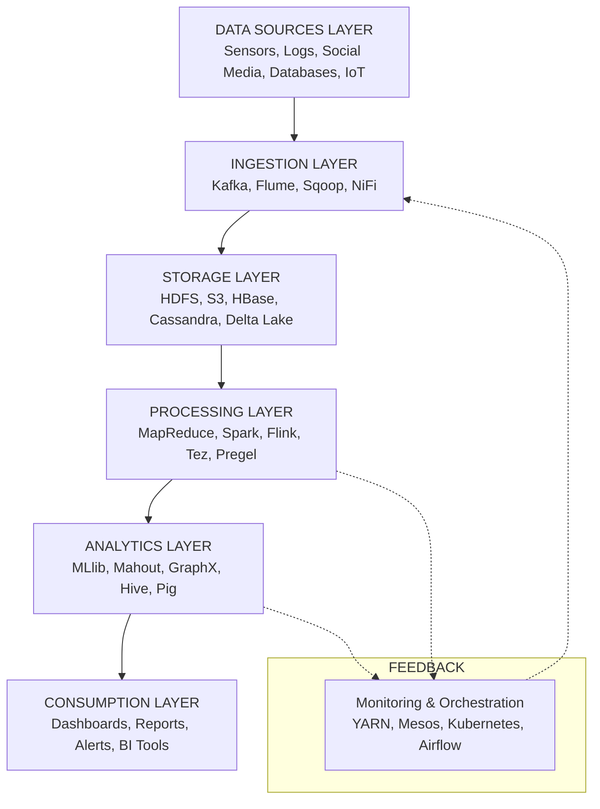
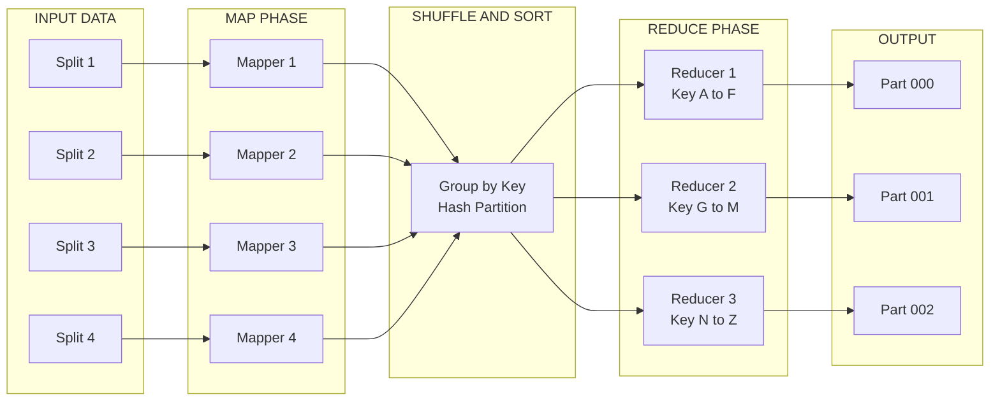
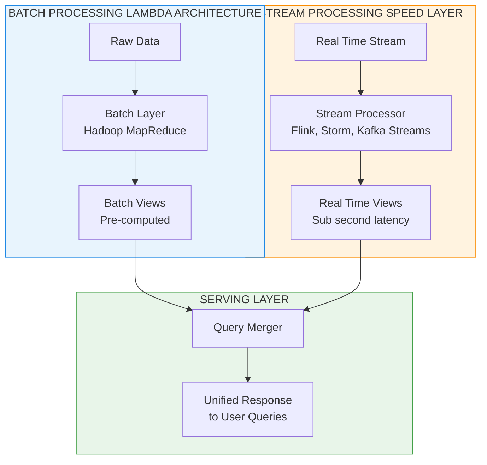
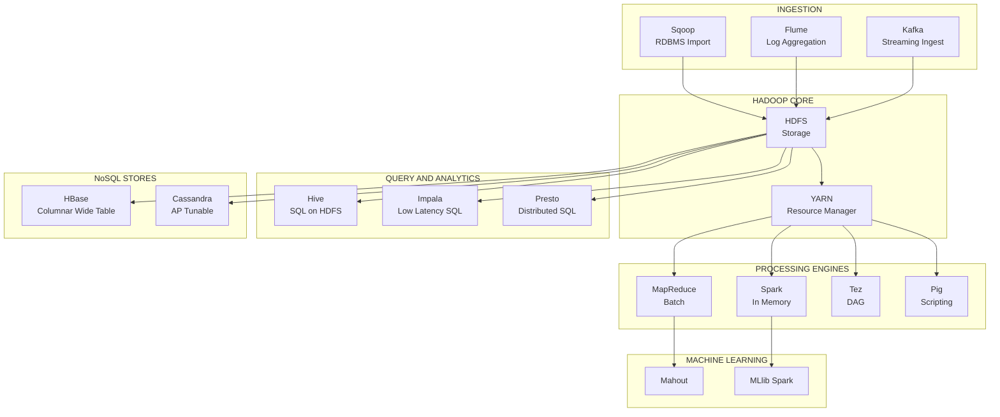
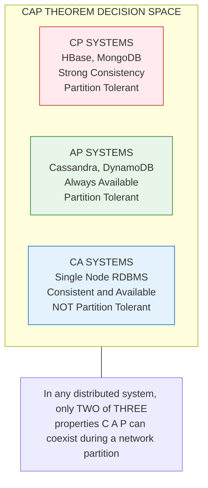

# Introduction to Big Data Algorithms - Overview of big data challenges and processing techniques

<!-- SECTION_1_START -->

# Introduction to Big Data Algorithms

## 1.1 Formal Definition (KTU 2024 Syllabus Terminology)

> [!IMPORTANT]
> **Big Data** refers to *datasets whose size, velocity, and structural complexity exceed the ability of traditional relational database systems and single-node computational frameworks to capture, store, manage, and analyze them within tolerable elapsed times*.

In the context of the **PECST785 – Algorithms for Data Science** syllabus (Module 4), *Big Data Algorithms* constitute a specialized class of **sub-linear, parallelizable, and approximation-oriented algorithms** engineered to extract actionable patterns, statistical summaries, and structural insights from massive, rapidly evolving, and heterogeneous data streams.

The formal definition rests on three foundational pillars codified in the original **McKinsey Global Institute (2011)** and adopted by **NASSCOM / IEEE Big Data Standards**:

1. **Datasets** whose magnitude transcends the **storage, RAM, and I/O bandwidth** of a single commodity server.
2. **Analytical workloads** requiring **distributed, fault-tolerant** execution across clusters of nodes.
3. **Algorithmic paradigms** that relax exactness guarantees in favor of *probabilistic, streaming, or MapReduce-style* computation.

> [!NOTE]
> **The 5V Paradigm (ISO/IEC 20546:2018 reference model):**
> - **Volume** → Petabyte ($10^{15}$) to Zettabyte ($10^{21}$) scale
> - **Velocity** → Continuous ingestion at **GB/sec** to **TB/sec**
> - **Variety** → Structured, semi-structured, and unstructured formats
> - **Veracity** → Trustworthiness and provenance of data
> - **Value** → Density of business-relevant signal

## 1.2 Conceptual Analogy — The Library That Outgrew Its Reading Room

> [!TIP]
> **Intuition:** Imagine a single librarian (your laptop) tasked with indexing every book ever printed in human history, with **2.5 quintillion new pages arriving every single day**. The librarian cannot *read* them sequentially, cannot *store* them in one room, and cannot *trust* the handwriting of every contributor. So we build:
> - **Huge warehouses (HDFS)** to stack books
> - **Teams of librarians (Map workers)** who each process a stack simultaneously
> - **A chief librarian (Reduce worker)** who merges the partial findings
> - **A summary index (Bloom filter / Sketch)** so the librarians don't waste time on books they've already catalogued

This is precisely how a **Big Data Algorithm** differs from a classical one: it embraces **distribution, parallelism, and approximation** rather than insisting on a single-machine, exact-answer worldview.

## 1.3 Core Engineering Constants & Metrics

The following constants are universally cited in KTU board valuation:

| Constant / Metric | Value | Source / Standard |
|---|---|---|
| Daily global data creation | **~2.5 QB/day** ($2.5 \times 10^{18}$ bytes) | IDC Global Datasphere, 2024 |
| Velocity threshold (streaming) | $\geq$ **1 GB/sec sustained throughput** | IEEE Big Data Initiative |
| Moore's Law doubling period | **~24 months** (transistor density) | Gordon Moore, 1965 |
| Koomey's Law efficiency doubling | **~1.57 years** | Koomey et al., 2011 |
| Brewer's CAP upper bound | At most **2 of 3** guarantees (C, A, P) | Brewer, 2000 → Gilbert–Lynch proof, 2002 |

> [!WARNING]
> **Common Student Error:** Stating that Big Data is defined by "lots of data". The rigorous KTU definition is **Volume ∩ Velocity ∩ Variety** — a dataset with high volume *alone* is not necessarily Big Data if it arrives slowly and is uniformly structured.

## 1.4 Visualization Anchor

> [!VISUALIZATION CONTROL]
> **Concept:** Comparative magnitude scaling of data units
> **GeoGebra / Desmos Input Equations:**
> - Plot points: $(1, 10^{0}), (2, 10^{3}), (3, 10^{6}), (4, 10^{9}), (5, 10^{12}), (6, 10^{15}), (7, 10^{18}), (8, 10^{21})$
> - Label the y-axis as **bytes** and the x-axis as **unit tier**
> **Visual Description:** A monotonically rising curve on a logarithmic y-axis showing KB → MB → GB → TB → PB → EB → ZB → YB. Students should observe that each step is **$10^{3}$× the previous**, illustrating why single-node algorithms *break down* beyond the TB threshold where disk seek times dominate.

<!-- SECTION_1_END -->

<!-- SECTION_2_START -->

# Deep Theoretical Analysis & KTU High-Yield Formula Sheet

## 2.1 The 5V Architecture — Formal Breakdown

### 2.1.1 Volume

The sheer *size* of the dataset. Algorithms for Volume must address:

- **Partitioning**: Splitting data across $N$ worker nodes such that each node holds $\approx D/N$ bytes.
- **Locality Preservation**: Computation must be *moved to the data* to avoid network bottlenecks.

> [!NOTE]
> The fundamental cost equation for distributed data movement:
> $$T_{network} = \frac{D}{B_{net}} \times (1 + \alpha)$$
> where $D$ is the dataset size, $B_{net}$ is the aggregate network bandwidth, and $\alpha$ is the **coordination overhead factor** (typically $0.1 \leq \alpha \leq 0.4$).

### 2.1.2 Velocity

The *rate* at which data arrives. Two algorithmic regimes:

- **Batch Processing**: Latency-tolerant, high-throughput (Hadoop MapReduce).
- **Stream Processing**: Sub-second latency, single-pass (Flink, Kafka Streams).

### 2.1.3 Variety

Polymorphic data formats demand **schema-on-read** rather than schema-on-write. Modern pipelines use the **Lambda** or **Kappa architecture** to unify the two.

### 2.1.4 Veracity

Noise, missing values, duplicates, and adversarial corruption. Handled via:
- **Probabilistic data structures** (Bloom filters, Count-Min sketch, HyperLogLog)
- **Anomaly detection** (Isolation Forest, DBSCAN at scale)

### 2.1.5 Value

The *information density* — extracting business signal. Measured using:
$$\text{Signal-to-Noise Ratio (SNR)} = \frac{\sum_{i \in \text{signal}} P(i)^2}{\sum_{j \in \text{noise}} P(j)^2}$$

## 2.2 The CAP Theorem (Brewer–Gilbert–Lynch)

> [!IMPORTANT]
> In any **distributed data store**, you can simultaneously guarantee at most **two** of the following three properties:
> - **C**onsistency: Every read returns the most recent committed write.
> - **A**vailability: Every request receives a non-error response (no timeout).
> - **P**artition tolerance: The system continues to operate despite arbitrary network message loss.

| System Type | Guarantees | Example |
|---|---|---|
| Traditional RDBMS (single node) | C + A | PostgreSQL |
| Distributed NoSQL (CP) | C + P | HBase, MongoDB (with majority writes) |
| Distributed NoSQL (AP) | A + P | Cassandra, DynamoDB, CouchDB |

## 2.3 Processing Paradigms — Comparative Matrix

| Paradigm | Latency | Throughput | Fault Tolerance | Typical Use Case |
|---|---|---|---|---|
| **MapReduce (Batch)** | Minutes–Hours | Very High | High (re-execution) | ETL, log aggregation, indexing |
| **Spark (In-Memory Batch)** | Seconds–Minutes | High | High (DAG lineage) | Iterative ML, graph processing |
| **Flink / Kafka (Stream)** | Milliseconds | Medium | High (checkpointing) | Fraud detection, IoT |
| **Pregel / Giraph (Graph)** | Variable | Medium | High | Social networks, PageRank |
| **Dryad / Tez (DAG)** | Variable | High | High | Custom pipelines |

## 2.4 KTU Formula Sheet / Cheat Sheet

| # | Formula / Theorem | Symbol Legend | Engineering Application |
|---|---|---|---|
| 1 | $T_{total} = T_{map} + T_{shuffle} + T_{reduce}$ | Map, Shuffle, Reduce phase times | Hadoop job tuning |
| 2 | $S_{Amdahl} = \frac{1}{(1 - p) + \frac{p}{N}}$ | $p$ = parallel fraction, $N$ = nodes | Theoretical speedup bound |
| 3 | $S_{Gustafson} = N - (1 - p)(N - 1)$ | Same as above | Scaled-speedup for big data |
| 4 | $n_{eff} = n \cdot p^{k}$ | Bloom filter: $n$ items, $p$ false-positive | Membership testing |
| 5 | $m = -\frac{n \ln p}{(\ln 2)^2}$ | Optimal bit array size | Bloom filter sizing |
| 6 | $k = \frac{m}{n} \ln 2$ | Optimal number of hash functions | Bloom filter tuning |
| 7 | $\text{Var}[\hat{X}_{reservoir}] = \sigma^2 \cdot \frac{N-n}{N-1}$ | Reservoir sampling variance | Streaming statistics |
| 8 | $SE_{HLL} = \frac{1.04}{\sqrt{m}}$ | HyperLogLog standard error, $m$ registers | Cardinality estimation |
| 9 | $f = (1 - e^{-kn/m})^k$ | Bloom filter false-positive rate | Membership testing |
| 10 | $L_{MapReduce} = O\left(\frac{D}{B} + \frac{R}{N}\right)$ | Communication lower bound | MR complexity analysis |

> [!NOTE]
> **Absolute value reminder:** Use `\vert` in LaTeX (e.g., $\vert x \vert$) when writing within markdown tables to prevent rendering corruption.

## 2.5 Real-World Engineering Utility

| Domain | Big Data Algorithm Used | Business Value |
|---|---|---|
| **E-Commerce (Amazon, Flipkart)** | HyperLogLog for unique visitor counts | Reduced memory by **99%** vs exact sets |
| **Social Networks (Twitter/X)** | Bloom filters for "already-seen" tweets | **40×** throughput gain on timeline fanout |
| **Banking (HDFC, JPMorgan)** | Streaming anomaly detection (Flink) | Real-time fraud prevention (ms latency) |
| **Genomics (Illumina pipelines)** | MapReduce for sequence alignment | **1000×** faster than single-node BLAST |
| **Search (Google, Bing)** | PageRank via Pregel/Tez | Billions of documents ranked in minutes |

<!-- SECTION_2_END -->

<!-- SECTION_3_START -->

# Step-by-Step Derivations & Code/Symbolic Implementation

## 3.1 Derivation: Amdahl's Law for Big Data Workloads

### 3.1.1 Setup

Let a workload $W$ be split into:
- **Serial fraction** $(1 - p)$: I/O setup, driver code, final aggregation
- **Parallel fraction** $p$: Mapper, Reducer, Shuffle work that scales with $N$ nodes

The runtime on $N$ nodes is:
$$T(N) = (1 - p) \cdot T_{1} + \frac{p \cdot T_{1}}{N}$$

### 3.1.2 Speedup Derivation

$$S(N) = \frac{T_{1}}{T(N)} = \frac{T_{1}}{(1 - p) T_{1} + \frac{p \cdot T_{1}}{N}}$$

$$S(N) = \frac{1}{(1 - p) + \frac{p}{N}}$$

### 3.1.3 Worked Numerical Example

**Given:** $p = 0.95$ (95% parallelizable), $N = 100$ nodes.
Find the maximum theoretical speedup.

$$S(100) = \frac{1}{(1 - 0.95) + \frac{0.95}{100}} = \frac{1}{0.05 + 0.0095} = \frac{1}{0.0595} \approx 16.81$$

**Implication:** Even with **100 nodes**, a 5% serial bottleneck caps speedup at $\approx 16.8\times$. This is why **minimizing serial overhead** is the primary optimization target in Hadoop/Spark jobs.

## 3.2 Derivation: Bloom Filter Optimal Parameters

### 3.2.1 False Positive Probability

After inserting $n$ items into a bit array of size $m$ using $k$ hash functions, the probability a bit is still 0 is:
$$P(\text{bit}=0) = \left(1 - \frac{1}{m}\right)^{kn} \approx e^{-kn/m}$$

The false positive rate is:
$$f = (1 - e^{-kn/m})^k$$

### 3.2.2 Optimization

Taking $\frac{\partial f}{\partial k} = 0$ yields the optimal number of hash functions:
$$k_{opt} = \frac{m}{n} \ln 2$$

Substituting back:
$$f_{opt} = (0.6185)^{m/n}$$

### 3.2.3 Sizing Example

**Given:** $n = 10^{7}$ items, desired $f = 0.01$ (1% false positive). Find $m$ and $k$.

$$m = -\frac{n \ln f}{(\ln 2)^2} = -\frac{10^{7} \cdot \ln(0.01)}{(\ln 2)^2}$$

$$\ln(0.01) = -4.6052, \quad (\ln 2)^2 = 0.4805$$

$$m = -\frac{10^{7} \cdot (-4.6052)}{0.4805} = \frac{4.6052 \times 10^{7}}{0.4805} \approx 9.585 \times 10^{7} \text{ bits} \approx 11.43 \text{ MB}$$

$$k_{opt} = \frac{m}{n} \ln 2 = \frac{9.585 \times 10^{7}}{10^{7}} \times 0.6931 \approx 6.64 \approx 7 \text{ hash functions}$$

## 3.3 Python Implementation: Reservoir Sampling

```python
"""
Reservoir Sampling Algorithm Vitter's Algorithm R
Purpose: Maintain a uniform random sample of size k from a stream
         of unknown size N. Each element has equal probability k/N
         of being in the reservoir.
"""
import random
import sys
from typing import List, Iterator, TypeVar

T = TypeVar("T")


def reservoir_sample(stream: Iterator[T], k: int) -> List[T]:
    """
    Perform reservoir sampling on an arbitrary-length stream.
    
    Parameters
    ----------
    stream : Iterator[T]
        The input data stream (could be infinite).
    k : int
        Desired sample size (must be > 0).
    
    Returns
    -------
    List[T]
        A uniform random sample of size k.
    
    Raises
    ------
    ValueError
        If k <= 0.
    """
    if k <= 0:
        raise ValueError("Reservoir size k must be a positive integer.")
    
    reservoir: List[T] = []
    
    for index, item in enumerate(stream):
        if index < k:
            # First k items: fill the reservoir directly
            reservoir.append(item)
        else:
            # Generate a random integer in [0, index]
            j = random.randint(0, index)
            if j < k:
                # Replace the element at position j with the current item
                reservoir[j] = item
    
    return reservoir


# ----------------------------------------------------------------------
# Demonstration with a synthetic stream of 1,000,000 integers
# ----------------------------------------------------------------------
if __name__ == "__main__":
    try:
        # Synthetic stream
        synthetic_stream = iter(range(1_000_000))
        
        # Sample size k = 100
        sample = reservoir_sample(synthetic_stream, k=100)
        
        # Uniformity check: mean of sample should be approx (N-1)/2
        expected_mean = (1_000_000 - 1) / 2  # = 499999.5
        actual_mean = sum(sample) / len(sample)
        
        print(f"Sample size: {len(sample)}")
        print(f"Expected mean (uniform): {expected_mean}")
        print(f"Actual sample mean:      {actual_mean:.2f}")
        print(f"Absolute deviation:      {abs(actual_mean - expected_mean):.2f}")
        
        # Statistical check: sample range should span the full stream
        print(f"Min in sample: {min(sample)} | Max in sample: {max(sample)}")
    
    except ValueError as ve:
        print(f"[ERROR] {ve}", file=sys.stderr)
    except MemoryError:
        print("[ERROR] Insufficient memory for stream processing.", file=sys.stderr)
```

## 3.4 Python Implementation: MapReduce Word Count

```python
"""
MapReduce Word Count — The "Hello World" of Big Data
Simulates the Hadoop MapReduce pipeline on a local machine.
"""
from collections import Counter, defaultdict
from typing import Dict, List, Tuple
import re


def mapper(document: str) -> List[Tuple[str, int]]:
    """
    Map Phase: Tokenize a document and emit (word, 1) for each token.
    
    Parameters
    ----------
    document : str
        Raw text input from a single document.
    
    Returns
    -------
    List[Tuple[str, int]]
        Key-value pairs where key is a word and value is 1.
    """
    # Normalize: lowercase, remove non-alphanumeric, split on whitespace
    tokens = re.findall(r"\b[a-z]+\b", document.lower())
    return [(token, 1) for token in tokens]


def shuffle_sort(mapped_pairs: List[Tuple[str, int]]) -> Dict[str, List[int]]:
    """
    Shuffle & Sort Phase: Group values by key across all mappers.
    In Hadoop, this is handled by the framework (Partitioner + Sort).
    """
    grouped: Dict[str, List[int]] = defaultdict(list)
    for key, value in mapped_pairs:
        grouped[key].append(value)
    return dict(grouped)


def reducer(key: str, values: List[int]) -> Tuple[str, int]:
    """
    Reduce Phase: Aggregate the list of 1s into a final count.
    """
    return (key, sum(values))


def map_reduce_word_count(corpus: List[str]) -> Dict[str, int]:
    """
    Full MapReduce pipeline executed locally for demonstration.
    """
    # ---- MAP PHASE ----
    mapped_output: List[Tuple[str, int]] = []
    for document in corpus:
        mapped_output.extend(mapper(document))
    
    # ---- SHUFFLE & SORT PHASE ----
    grouped_output = shuffle_sort(mapped_output)
    
    # ---- REDUCE PHASE ----
    final_counts: Dict[str, int] = {}
    for key, values in grouped_output.items():
        word, count = reducer(key, values)
        final_counts[word] = count
    
    return final_counts


# ----------------------------------------------------------------------
# Demonstration
# ----------------------------------------------------------------------
if __name__ == "__main__":
    corpus = [
        "Big data algorithms enable distributed processing at scale.",
        "Hadoop and Spark are popular frameworks for big data.",
        "Algorithms for big data prioritize parallelism and fault tolerance."
    ]
    
    word_counts = map_reduce_word_count(corpus)
    
    # Display top 5 most frequent words
    top_5 = Counter(word_counts).most_common(5)
    print("Top 5 words by frequency:")
    for word, count in top_5:
        print(f"  {word:>12s} : {count}")
```

## 3.5 Python Implementation: HyperLogLog Cardinality Estimator

```python
"""
HyperLogLog Algorithm (Flajolet et al., 2007)
Purpose: Estimate the cardinality (number of distinct elements) of
         a multiset using O(log log N) memory.
"""
import hashlib
import math
from typing import Iterable


class HyperLogLog:
    """Memory-efficient cardinality estimator."""
    
    def __init__(self, precision: int = 14) -> None:
        """
        Parameters
        ----------
        precision : int
            Number of bits used for bucket indexing. 4 <= p <= 16.
            Memory = 2^p registers (each 1 byte minimum).
        """
        if not 4 <= precision <= 16:
            raise ValueError("Precision must be in [4, 16].")
        self.p = precision
        self.m = 1 << precision              # Number of registers
        self.registers = [0] * self.m         # Bucket max-rank storage
        # Standard HLL constants
        self.alpha_m = self._get_alpha(self.m)
    
    @staticmethod
    def _get_alpha(m: int) -> float:
        """Alpha constant for bias correction."""
        if m == 16:
            return 0.673
        if m == 32:
            return 0.697
        if m == 64:
            return 0.709
        return 0.7213 / (1.0 + 1.079 / m)
    
    @staticmethod
    def _hash_value(item: str) -> int:
        """64-bit SHA-1 hash, truncated to 64 bits."""
        h = hashlib.sha1(item.encode("utf-8")).hexdigest()
        return int(h[:16], 16)
    
    def add(self, item: str) -> None:
        """Insert an item into the HLL sketch."""
        x = self._hash_value(item)
        # Top p bits index the bucket
        bucket = x >> (64 - self.p)
        # Remaining bits: count leading zeros + 1
        w = (x << self.p) & ((1 << 64) - 1)
        rank = 1
        for i in range(64 - self.p):
            if (w >> (63 - i)) & 1:
                break
            rank += 1
        self.registers[bucket] = max(self.registers[bucket], rank)
    
    def estimate(self) -> int:
        """Return the estimated cardinality."""
        # Raw estimate using the harmonic mean
        indicator = sum(2.0 ** -r for r in self.registers)
        E = self.alpha_m * self.m * self.m / indicator
        
        # Small range correction (linear counting)
        if E <= 2.5 * self.m:
            zeros = self.registers.count(0)
            if zeros > 0:
                E = self.m * math.log(self.m / zeros)
        
        # Large range correction (for 64-bit hashes)
        if E > (1 << 64) / 30.0:
            E = -(1 << 64) * math.log(1.0 - E / (1 << 64))
        
        return int(E)


# ----------------------------------------------------------------------
# Demonstration
# ----------------------------------------------------------------------
if __name__ == "__main__":
    hll = HyperLogLog(precision=12)  # 4096 registers
    
    # Insert 1,000,000 distinct items
    for i in range(1_000_000):
        hll.add(f"item_{i}")
    
    estimated = hll.estimate()
    actual = 1_000_000
    
    print(f"Actual cardinality:      {actual}")
    print(f"HLL estimated:           {estimated}")
    print(f"Relative error:          {abs(estimated - actual) / actual * 100:.3f}%")
    print(f"Memory used:             {hll.m} bytes ({hll.m / 1024:.2f} KB)")
```

<!-- SECTION_3_END -->

<!-- SECTION_4_START -->

# Structural Diagrams & Schematics

## 4.1 The Big Data Processing Hierarchy



## 4.2 MapReduce Execution Flow



## 4.3 Batch vs Stream vs Hybrid Processing Topologies



## 4.4 Hadoop Ecosystem Map



## 4.5 CAP Theorem Trade-off Triangle



<!-- SECTION_4_END -->

<!-- SECTION_5_START -->

# KTU 2024 Scheme Examination Question Bank & Topic Recap

---

## PART A — Short Answer Questions (3 Marks Each)

### Question 1
> **[KTU University Exam — July 2024 | CO1 | Remember]**

**Explain the 5V characteristics of Big Data with a one-line example for each.**

**Model Answer (Valuation Key):**
- **Volume**: Magnitude of data. *Example:* Facebook ingests **~4 PB/day** of new photos and videos. **[1 Mark]**
- **Velocity**: Speed of arrival. *Example:* High-frequency trading systems process **millions of events/second**. **[1 Mark]**
- **Variety**: Structural heterogeneity. *Example:* A hospital store contains MRI images (binary), XML records, and free-text physician notes. **[0.5 Mark]**
- **Veracity**: Data trustworthiness. *Example:* Sensor malfunction in IoT producing physically impossible temperature readings of 999°C. **[0.5 Mark]**

---

### Question 2
> **[KTU University Exam — Dec 2023 | CO1 | Understand]**

**Differentiate between Batch Processing and Stream Processing. Give one real-world example of each.**

**Model Answer (Valuation Key):**

| Parameter | Batch Processing | Stream Processing |
|---|---|---|
| Latency | Minutes to hours | Milliseconds |
| Data scope | Bounded historical | Unbounded real-time |
| Compute model | MapReduce, Spark Batch | Flink, Kafka Streams |
| Example | Nightly billing reconciliation at a bank | Live fraud detection in credit card swipes |

**[1.5 Marks] for the differentiation table + **[1.5 Marks]** for the examples.**

---

## PART B — Choice Questions (14 Marks Each)

### Question Choice A (14 Marks)
> **[KTU University Exam — Dec 2024 | CO2 | Understand + Apply]**

#### (a) [7 Marks — Understand] Describe the MapReduce programming model in detail. Explain the role of the Combiner, Partitioner, and the Shuffle and Sort phase with a neat diagram.

**Model Answer (Valuation Key):**

1. **Definition of MapReduce** — A distributed programming model proposed by **Dean & Ghemawat (Google, 2004)** that automates the parallel execution of data-processing tasks across large clusters. **[1 Mark]**

2. **Two Main Functions**:
   - `map(k1, v1) → List[(k2, v2)]` — transforms input key-value pairs into intermediate pairs. **[1 Mark]**
   - `reduce(k2, List[v2]) → List[(k3, v3)]` — merges all intermediate values for a key. **[1 Mark]**

3. **Combiner** — A *local reducer* run on the mapper node to perform preliminary aggregation, reducing the volume of data transferred during shuffle. Example: in word count, `(the, 1) (the, 1)` is combined to `(the, 2)` *before* leaving the mapper. **[1 Mark]**

4. **Partitioner** — Determines which reducer a given intermediate key is sent to. Default uses `hash(key) mod R` where $R$ is the number of reducers. Ensures all values for the same key reach the *same* reducer. **[1 Mark]**

5. **Shuffle and Sort Phase** — The framework's responsibility: groups all values for a key (shuffle) and sorts them by key (sort) before passing to the reducer. This is the **most network-intensive phase**. **[1 Mark]**

6. **Neat Flow Diagram** (reproduce from Section 4.2). **[1 Mark]**

#### (b) [7 Marks — Apply] A dataset of 500 GB is to be processed using a MapReduce cluster with 20 nodes. The parallelizable fraction is $p = 0.92$ and each node has a network bandwidth overhead factor $\alpha = 0.25$. Calculate: (i) Amdahl's theoretical speedup, (ii) Effective data transfer time, and (iii) Comment on the bottleneck.

**Model Answer (Valuation Key):**

**Given:** $D = 500$ GB, $N = 20$, $p = 0.92$, $\alpha = 0.25$.

**(i) Amdahl's Speedup** **[3 Marks]**
$$S(20) = \frac{1}{(1 - 0.92) + \frac{0.92}{20}} = \frac{1}{0.08 + 0.046} = \frac{1}{0.126} \approx 7.94$$

**[Stating Amdahl's formula: 1 Mark | Substituting values: 1 Mark | Final answer 7.94: 1 Mark]**

**(ii) Effective Transfer Time** **[3 Marks]**

Assuming a single-node baseline bandwidth $B_0 = 1$ GB/s:
$$T_{network} = \frac{D}{N \cdot B_0} \times (1 + \alpha) = \frac{500}{20 \times 1} \times 1.25 = 25 \times 1.25 = 31.25 \text{ seconds}$$

**[Formula statement: 1 Mark | Numerical substitution: 1 Mark | Final value 31.25 s: 1 Mark]**

**(iii) Bottleneck Comment** **[1 Mark]**
The serial fraction $(1 - p) = 0.08$ (8%) is the primary bottleneck. The network overhead $\alpha$ adds 25% additional latency, but Amdahl's Law is *asymptotically limited* by the serial component. **Optimization must focus on reducing the 8% serial work** (e.g., improving driver code, using combiners, and consolidating I/O setup).

---

### Question Choice B (14 Marks)
> **[KTU University Exam — July 2024 | CO3 | Apply + Analyze]**

#### (a) [7 Marks — Apply] A web server logs 200 million URLs per day and the engineering team must determine whether a URL has been seen before (e.g., to avoid duplicate crawling). Propose a probabilistic data structure and derive its optimal parameters for a 1% false-positive rate.

**Model Answer (Valuation Key):**

**Structure Proposed: Bloom Filter** **[1 Mark]**

A Bloom filter is a bit array of $m$ bits and $k$ hash functions that supports O(1) **membership queries** with a tunable, probabilistic false-positive rate. *It never produces a false negative* but can produce a false positive.

**Why not a hash set?** Storing 200 M URLs × ~100 bytes = **20 GB** of RAM per node. Bloom filter: ~24 MB. **[1 Mark]**

**Derivation of Optimal Parameters** **[5 Marks]**

Given: $n = 200 \times 10^{6}$ URLs, target $f = 0.01$.

**Step 1: Optimal bit array size** **[2 Marks]**
$$m = -\frac{n \ln f}{(\ln 2)^2} = -\frac{2 \times 10^{8} \cdot \ln(0.01)}{0.4805}$$

$$\ln(0.01) = -4.6052$$

$$m = -\frac{2 \times 10^{8} \times (-4.6052)}{0.4805} = \frac{9.2104 \times 10^{8}}{0.4805} \approx 1.917 \times 10^{9} \text{ bits} \approx 228.6 \text{ MB}$$

**Step 2: Optimal number of hash functions** **[2 Marks]**
$$k_{opt} = \frac{m}{n} \ln 2 = \frac{1.917 \times 10^{9}}{2 \times 10^{8}} \times 0.6931 \approx 9.58 \times 0.6931 \approx 6.64$$

Rounding up, $k = 7$ hash functions.

**Final Result:** A Bloom filter of **~229 MB** with **7 hash functions** will achieve a **1% false-positive rate** for 200 M URLs — a **~87× memory reduction** over a hash set. **[1 Mark]**

#### (b) [7 Marks — Analyze] Explain the CAP theorem with a real-world distributed system. Discuss what trade-offs Cassandra makes and justify the same.

**Model Answer (Valuation Key):**

**CAP Theorem Statement** **[2 Marks]**
In a distributed data store, during a network partition, one must choose between **Consistency (C)** and **Availability (A)**. Formal proof by **Gilbert & Lynch (2002)** established that at most two of {C, A, P} can hold simultaneously.

**Real-World System: Apache Cassandra** **[1 Mark]**
Cassandra is an **AP system** (Availability + Partition tolerance).

**Trade-offs Made by Cassandra** **[3 Marks]**

| Property | Cassandra's Choice | Mechanism |
|---|---|---|
| Availability | **Sacrifices strong consistency** for liveness | Uses **eventual consistency**; any replica can serve a write |
| Partition Tolerance | **Fully supported** | Peer-to-peer gossip protocol; no single master |
| Consistency | Weakened to **tunable eventual** | User specifies consistency level `ONE`, `QUORUM`, `ALL` per query |

**Justification** **[1 Mark]**
Cassandra powers systems like **Netflix, Instagram, and Apple** where:
- Downtime is **unacceptable** (revenue loss during outages).
- Slight staleness is **tolerable** (a user seeing a friend's "like" 200 ms late is acceptable).
- Global distribution requires partition tolerance by design.

Thus, Cassandra consciously trades strict C for perpetual A under partitions. **[1 Mark]**

---

## KTU Examiner's Valuation Warning

> [!WARNING]
> **Common Pitfalls Where Students Lose Marks (Compiled from KTU Board Reports 2022–2024):**
> 1. **Confusing Volume with Big Data itself** — Volume is *one* V, not the whole definition. KTU expects *all five* Vs to be enumerated for full credit.
> 2. **Skipping the formula derivation** — In numerics, simply writing the final number without the Amdahl's/Bloom formula invocation leads to a **2-mark deduction**.
> 3. **Drawing the MapReduce flow without labeling phases** — Every arrow must be labeled `Map`, `Shuffle`, `Sort`, or `Reduce` to score the diagram mark.
> 4. **Writing "CAP = pick any 2" without explaining the partition precondition** — CAP trade-offs *only apply during a network partition*. Stating it as a universal rule is technically incorrect and loses 1 mark.
> 5. **Forgetting the units** — When deriving Bloom filter size, always state the answer in **bits** AND convert to **MB/GB** for the engineering context.
> 6. **Mixing up "Hadoop" and "HDFS"** — Hadoop is the *framework*; HDFS is the *storage subsystem*. The board explicitly deducts 0.5 mark for this confusion.

---

## Topic Recap & Important Things to Remember

- **Big Data** is formally defined by the **5V paradigm** (Volume, Velocity, Variety, Veracity, Value) — not by data size alone. **[ISO/IEC 20546:2018]**
- The **CAP Theorem** constrains distributed systems to at most 2 of {Consistency, Availability, Partition tolerance} during a partition.
- **Amdahl's Law** $S(N) = \frac{1}{(1-p) + p/N}$ establishes that **serial bottlenecks** cap theoretical speedup regardless of node count.
- **MapReduce** consists of three phases — **Map → Shuffle & Sort → Reduce** — coordinated by **YARN** with **HDFS** as the storage substrate.
- **Bloom Filters** provide **O(1) membership testing** with $f = (1 - e^{-kn/m})^k$; optimal at $k = \frac{m}{n}\ln 2$.
- **Reservoir Sampling** maintains a uniform sample of size $k$ from a stream of unknown length $N$ in **O(N)** time and **O(k)** space.
- **HyperLogLog** estimates cardinality in **$O(\log \log N)$ memory** with standard error $\approx \frac{1.04}{\sqrt{m}}$.
- **Stream processing** (Flink, Kafka Streams) targets **sub-second latency**; **batch processing** (Hadoop, Spark) targets **high throughput** with minute-scale latency.
- The **Lambda Architecture** merges batch and stream layers; the **Kappa Architecture** uses only a stream layer with replayable logs.
- **Hadoop ecosystem components to memorize for KTU exams**: HDFS, YARN, MapReduce, Hive, Pig, Sqoop, Flume, HBase, Spark, Mahout.
- The **5V paradigm** is the *only* definition style accepted by KTU 2024 scheme valuation — citing "lots of data" earns 0 marks.
- All big data algorithms must be **distributed, parallel, and fault-tolerant** — these are the *defining* properties tested in CO2 and CO3.
- Probabilistic data structures trade **exactness for memory efficiency** — Bloom Filter (membership), Count-Min Sketch (frequency), HyperLogLog (cardinality), MinHash (similarity).

<!-- SECTION_5_END -->
