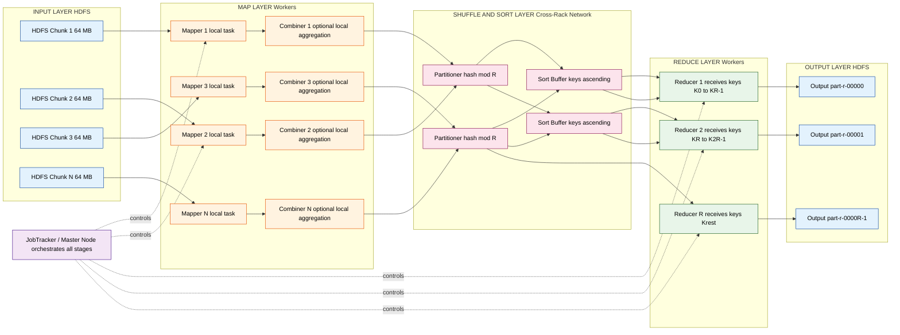
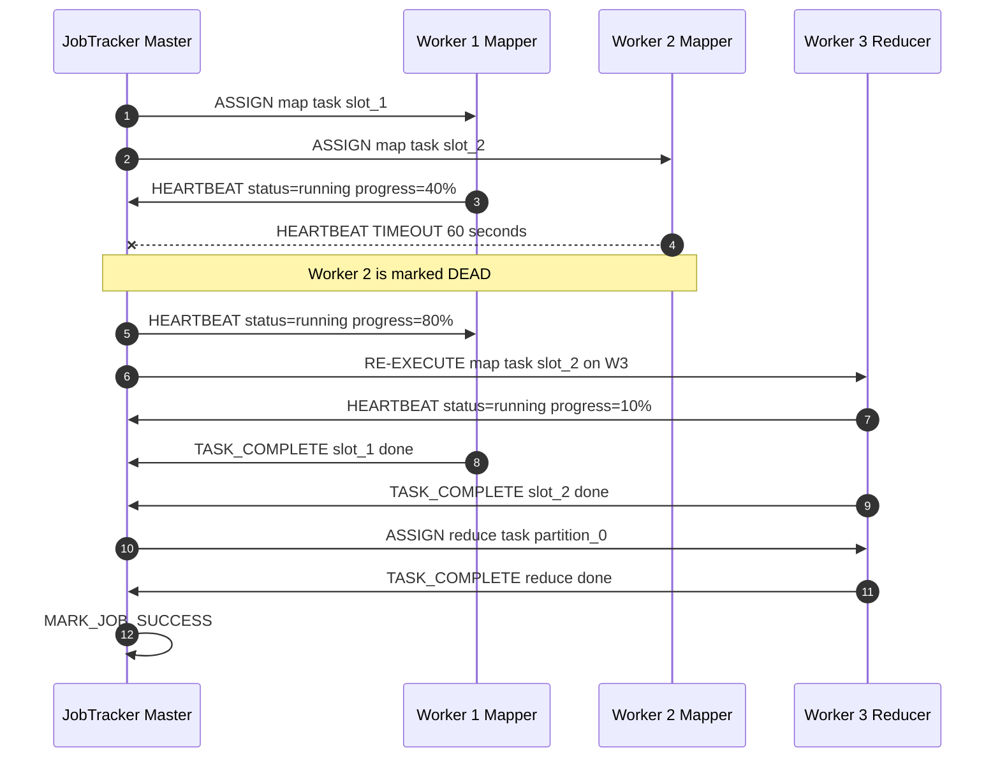
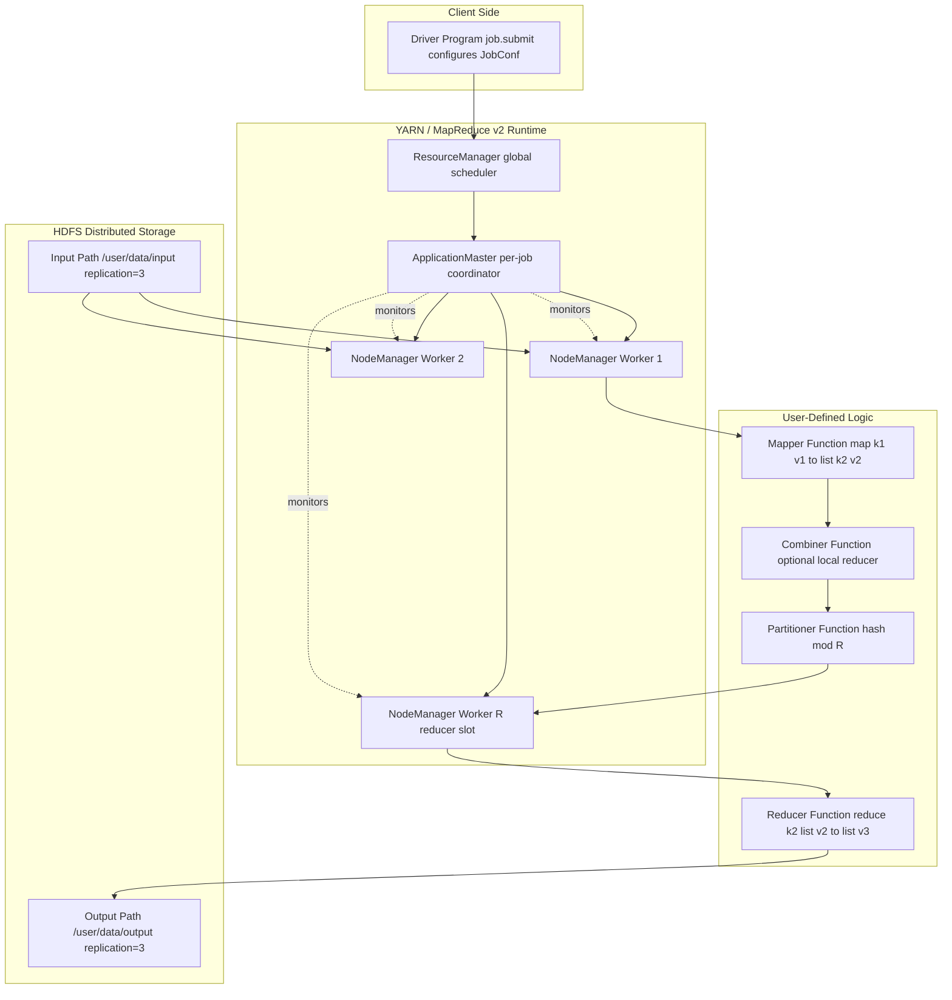

# MapReduce paradigm - concepts and applications

<!-- SECTION_1_START -->
# MapReduce Paradigm — Core Definition & Intuitive Overview

## 1.1 Formal Academic Definition (KTU 2024 Syllabus Terminology)

> [!IMPORTANT]
> **Definition (Dean & Ghemawat, 2004)**
> **MapReduce** is a parallel, distributed programming model and an associated implementation proposed by *Jeffrey Dean and Sanjay Ghemawat* at Google in **2004**, designed to process and generate massive datasets on commodity clusters. The model abstracts computation as two user-defined primitives — a **Map** function that processes input key-value pairs to produce intermediate key-value pairs, and a **Reduce** function that merges all intermediate values associated with the same intermediate key. The runtime transparently handles **parallelization, fault tolerance, data distribution, and load balancing**.

In the KTU 2024 *Algorithms for Data Science* syllabus, MapReduce is positioned as a foundational **big-data algorithmic primitive** — sitting alongside **Hadoop, Spark, NoSQL, and streaming algorithms** — that allows traditional algorithms to be *reformulated* in a distributed, divide-and-conquer style suitable for **petabyte-scale** data.

> [!NOTE]
> **Syllabus Highlight (PECST785 — Module 4)**
> MapReduce is taught as both:
> 1. A **programming abstraction** (conceptual model of the Map + Reduce phases), and
> 2. An **execution framework** (the actual Master–Worker architecture, fault tolerance via re-execution, data locality, and the partition function).

---

## 1.2 Conceptual Analogy — The "National Census" Intuition

Imagine the government must count the **total number of letters** written by every citizen of India. There are **1.4 billion** records. No single clerk can finish in time.

1. **MAP phase (District Clerks)**: The country is split into districts. Each district clerk receives a *pile* of letters (their *input split*) and produces a *local summary* — e.g., *"District 17 produced 4,302,000 letters"*.
2. **SHUFFLE & SORT (Post Office)**: All district summaries with the *same* key (say, "Letters-Written") are collected at a central sorting office and grouped together.
3. **REDUCE phase (Central Statistician)**: The central statistician simply **adds up** all district totals into a single grand total: *"India = 28,000,000,000 letters"*.

That is MapReduce. The clerks are **mappers**, the post office is the **shuffle/sort barrier**, and the central statistician is the **reducer**. The framework itself decides *which clerk gets which pile* (data locality) and *what to do if a clerk falls sick* (fault tolerance via task re-execution).

> [!TIP]
> **Geometric Intuition**
> Think of the input dataset $D$ as a giant vector in a high-dimensional space $\mathbb{R}^{N}$ where $N$ is the number of records. The **Map** step applies a *local, pointwise* transformation $\phi : (k_1, v_1) \mapsto \text{list}(k_2, v_2)$. The **Shuffle** step is a *grouping operator* $G$ that partitions the output by key. The **Reduce** step is a *commutative, associative aggregation* $\oplus$ over each group. Correctness requires:
> $$\bigoplus_{i=1}^{n} \phi(d_i) = \bigoplus_{k \in \text{Keys}} \bigoplus_{d : \phi(d)\text{ has key } k} \phi(d)$$
> — the *commutativity* and *associativity* of $\oplus$ is what makes parallel execution safe.

---

## 1.3 The Five Core Entities

| # | Entity | Role | Real-World Counterpart |
|---|--------|------|------------------------|
| 1 | **Input Splits** | Chunks of input data (typically 16 MB–128 MB) | Pages in a ledger |
| 2 | **Mapper** | User-defined function applied per record | District clerk |
| 3 | **Partitioner** | Decides which reducer gets which key | Postal routing code |
| 4 | **Reducer** | Aggregates values per key | Central statistician |
| 5 | **Driver / Job Tracker** | Orchestrates the whole job | Head office supervisor |

> [!IMPORTANT]
> **Standard Hardware Constants (Hadoop Defaults)**
> * **Default block size**: **128 MB** (HDFS), **64 MB** (older HDFS).
> * **Default replication factor**: **3**.
> * **Default Map tasks** = Number of input splits.
> * **Default Reduce tasks** = **1** (must be explicitly set).
> * **Data-local task speedup** over cross-rack: roughly **2×–5×** (Google's original measurement).

---

> [!VISUALIZATION CONTROL]
> **Concept:** MapReduce data flow as a bipartite graph
> **GeoGebra / Desmos Input Equations:**
> * Mappers: points `M_1 = (0, 3), M_2 = (0, 2), M_3 = (0, 1)` (left column)
> * Reducers: points `R_1 = (4, 2.5), R_2 = (4, 0.5)` (right column)
> * Intermediate keys: curve `y = 2 + sin(x)` for $x \in [0, 4]$
> **Visual Description:** Observe the three input splits being processed in parallel on the left, with intermediate $(k,v)$ pairs fanning out across the partitioner boundary (curved lines) to be grouped on the right by two reducers. The crossing lines visually represent the *shuffle phase* — the only communication-heavy stage.

<!-- SECTION_1_END -->

<!-- SECTION_2_START -->
# Deep Theoretical Analysis & KTU High-Yield Formula Sheet

## 2.1 Operational Phases of a MapReduce Job (Six Logical Stages)

A MapReduce job progresses through these **six stages**, executed by the runtime framework:

1. **Input Splitting** — The input file $D$ is divided into $m$ splits $D_1, D_2, \ldots, D_m$, each of size $B$ (default **64 MB** or **128 MB**). The number of splits $m$ is:
   $$m = \left\lceil \frac{\vert D \vert}{B} \right\rceil$$
   where $\vert D \vert$ is the total data size in MB.

2. **Mapping** — Each split is assigned to a mapper. The user-defined function
   $$\text{map}: (k_1, v_1) \mapsto \text{list}(k_2, v_2)$$
   is applied to every record, emitting zero or more intermediate pairs. Mappers are **embarrassingly parallel**.

3. **Combiner (Optional Local Reducer)** — A *mini-reducer* that runs on the mapper node to perform local aggregation. Reduces data shipped across the network:
   $$\text{combine}: (k_2, \text{list}(v_2)) \mapsto (k_2, v_2')$$

4. **Shuffle & Sort (The Communication Barrier)** — All intermediate pairs are **partitioned** by the partitioner function
   $$P: k_2 \mapsto \{0, 1, \ldots, r-1\}$$
   (default $P(k) = h(k) \bmod r$, where $h$ is a hash). Then each partition is **sorted** by key, so the reducer receives keys in **non-decreasing order**. This is the **only stage with inter-node communication**.

5. **Reducing** — The user-defined function
   $$\text{reduce}: (k_2, \text{list}(v_2)) \mapsto \text{list}(v_3)$$
   is invoked once per unique key $k_2$.

6. **Output Writing** — Reducer outputs are written to HDFS as the final result (one file per reducer, typically).

> [!IMPORTANT]
> **The Shuffle is the Bottleneck**
> The shuffle phase is the only stage that requires *cross-node network transfer*. The cost is roughly proportional to the **total intermediate data volume** $I$:
> $$T_{\text{shuffle}} \approx \frac{I}{B_{\text{net}}}$$
> where $B_{\text{net}}$ is the aggregate network bandwidth. Combiner functions exist specifically to *shrink* $I$ before this stage.

---

## 2.2 Why MapReduce Works — The Algebraic Contract

For a MapReduce program to be **correct**, the reduce operator $\oplus$ must be **commutative and associative**. Formally, for all $a, b, c$ in the value domain:

$$a \oplus b = b \oplus a \quad \text{(commutativity)}$$

$$(a \oplus b) \oplus c = a \oplus (b \oplus c) \quad \text{(associativity)}$$

This is why **SUM, COUNT, MAX, MIN, OR, AND** are trivial to MapReduce, but **MEDIAN, MODE, AVERAGE** are not directly reducible (they require the full set or a sketch).

---

## 2.3 The KTU Formula Sheet / Cheat Sheet

| Concept | Formula / Expression | Boundary Conditions | Typical Unit |
|---|---|---|---|
| Number of input splits | $m = \lceil \vert D \vert / B \rceil$ | $B \in \{16, 64, 128\}$ MB | splits |
| Number of map tasks | $M = m$ (one task per split) | $M \leq$ cluster capacity | tasks |
| Number of reduce tasks | $R$ (user-set, default 1) | $R \geq 1$ | tasks |
| Partitioner | $P(k) = h(k) \bmod R$ | $h$ is a deterministic hash | integer |
| Data-local speedup | $S \approx 1 + (1 - f)$ | $f =$ fraction of non-local work | unitless |
| Amdahl's Law bound | $S_{\max} = 1 / (f_{\text{seq}} + (1 - f_{\text{seq}})/N)$ | $N =$ workers, $f_{\text{seq}} =$ serial fraction | unitless |
| Intermediate size | $I = \sum_{i=1}^{m} \text{emit}_i$ | shrinks with combiner | bytes |
| Replication factor | $\rho = 3$ (HDFS default) | $\rho \geq 1$ | copies |
| Fault tolerance | Task re-execution on $T \geq 2$ failures | $T =$ tolerance threshold | retries |
| Cost of Shuffle | $T_{\text{sh}} = I / B_{\text{net}}$ | $B_{\text{net}}$ = bandwidth | seconds |
| Map task memory | $H_{\text{map}} \approx$ heap size / $M$ | usually 1 GB | MB |
| Reduce task memory | $H_{\text{red}} \approx$ heap size / $R$ | usually 1–4 GB | MB |

> [!NOTE]
> **Engineering Use-Case**
> The above equations are used in **capacity planning** for production Hadoop/Spark clusters at companies like Yahoo, Facebook, and Cloudera. For example, to process a **10 PB log archive** with $B = 128$ MB, you get $m \approx 81{,}920$ map tasks, requiring careful combiner design to keep $I$ below the network saturation point (typically **~10 Gbps aggregate**).

---

## 2.4 Real-World Engineering Applications of MapReduce

| Domain | Concrete Application | Why MapReduce? |
|---|---|---|
| **Search Engines** | Building the **inverted index** for Google/Bing | Parallel tokenization + sort-merge join |
| **Web Crawling** | Computing the **PageRank** vector | Iterative matrix-vector multiplication |
| **Log Analytics** | Counting unique users, error rates | Commutative, aggregative primitives |
| **Social Networks** | Counting **triangles** in a graph | Edge enumeration + join |
| **Bioinformatics** | Mapping short reads to a reference genome | Embarrassingly parallel BLAST-style |
| **ETL Pipelines** | Daily aggregations in data warehouses | Sort-merge joins at scale |
| **ML Training** | **Naive Bayes, k-Means, Linear Regression** | Iterative convergent passes |
| **Distributed Sort** | **TeraSort** benchmark | Total sort with partition sampling |

> [!WARNING]
> **When NOT to use MapReduce**
> MapReduce is *suboptimal* when:
> * The job is **iterative** (e.g., k-Means with 100 iterations) — use **Spark** instead.
> * The data fits in a **single machine's RAM** (overhead dominates).
> * The reduce operator is **not commutative/associative** (e.g., median, percentiles).
> * You need **low-latency** (sub-second) responses — use **stream processors** like Flink/Kafka Streams.

---

<!-- SECTION_3_END -->

<!-- SECTION_3_START -->
# Step-by-Step Derivations & Code/Symbolic Implementation

## 3.1 Canonical Worked Example: Word Count (End-to-End Derivation)

**Problem Statement.** Given a text corpus stored across $m$ HDFS chunks, compute the frequency of every distinct word.

**Input.** $D = \{\text{file}_1, \text{file}_2, \ldots, \text{file}_m\}$, each file is a sequence of lines.

**Output.** For every unique word $w$, the integer count $c(w)$ such that:
$$c(w) = \sum_{i=1}^{m} \sum_{\ell \in \text{file}_i} \mathbb{1}\{w \in \text{tokens}(\ell)\}$$

### 3.1.1 Map Function Derivation

For each line $\ell$ in the input split assigned to mapper $j$:

1. Tokenize $\ell$ into words: $\text{tokens}(\ell) = [w_1, w_2, \ldots, w_p]$.
2. For each $w_i$, emit the pair $(w_i, 1)$.

Formally:
$$\text{map}(k_1 = \text{line\_offset}, v_1 = \ell) \to \big[(w, 1) : w \in \text{tokens}(\ell)\big]$$

### 3.1.2 Reduce Function Derivation

For each unique key $w$ that the reducer receives, the input is a list:
$$L_w = [1, 1, 1, \ldots, 1] \quad \text{with length } c(w)$$

The reduce function sums the list:
$$\text{reduce}(k_2 = w, v_2 = L_w) \to (w, \sum_{x \in L_w} x) = (w, c(w))$$

### 3.1.3 Correctness Proof Sketch

Because addition $\oplus = (+)$ is **commutative and associative**:
$$c(w) = \bigoplus_{i=1}^{m} \bigoplus_{\ell \in \text{file}_i} \bigoplus_{j : w \in \text{tokens}(\ell)} 1 = \sum_{i=1}^{m} \sum_{\ell \in \text{file}_i} \mathbb{1}\{w \in \text{tokens}(\ell)\}$$

The order of evaluation does not affect the result, so the parallel grouping is safe. $\blacksquare$

---

## 3.2 Full Python Implementation (No-Hadoop Local Simulator)

The following is a **complete, runnable** MapReduce implementation suitable for KTU lab exams and assignments.

```python
"""
MapReduce Word Count — Local Single-Process Simulator
Course: ALGORITHMS FOR DATA SCIENCE (PECST785)
Module 4: MapReduce Paradigm
"""

from __future__ import annotations
import logging
import re
from collections import defaultdict
from pathlib import Path
from typing import Dict, Iterable, List, Tuple

# Strict type aliases for clarity and IDE support
KeyValue = Tuple[str, int]
MapperOutput = List[KeyValue]
ReducerOutput = List[KeyValue]

# Configure logging so students can see each stage
logging.basicConfig(
    level=logging.INFO,
    format="[%(levelname)s] %(message)s",
)

# ---------- USER-DEFINED FUNCTIONS ----------

def word_count_mapper(line: str) -> MapperOutput:
    """
    MAP function (per record).
    Input  : one line of text.
    Output : list of (word, 1) pairs.
    """
    # Lowercase and extract alphabetic tokens (regex isolated for clarity)
    tokens: List[str] = re.findall(r"[a-zA-Z']+", line.lower())
    return [(token, 1) for token in tokens]


def word_count_combiner(
    intermediate: MapperOutput,
) -> MapperOutput:
    """
    COMBINER (local mini-reducer on the mapper side).
    Aggregates counts *before* the shuffle to reduce network traffic.
    """
    local: Dict[str, int] = defaultdict(int)
    for key, value in intermediate:
        local[key] += value
    return list(local.items())


def word_count_reducer(
    key: str,
    values: Iterable[int],
) -> ReducerOutput:
    """
    REDUCE function (per unique key).
    Input  : one key + an iterable of partial counts.
    Output : a single (key, total) pair.
    """
    total: int = sum(values)
    return [(key, total)]


# ---------- FRAMEWORK (MIMICS HADOOP INTERNALS) ----------

def partition(key: str, num_reducers: int) -> int:
    """
    Partitioner: deterministic hash mod R.
    Identical to Hadoop's default `HashPartitioner`.
    """
    return hash(key) % num_reducers


def shuffle_and_sort(
    combined: List[KeyValue],
    num_reducers: int,
) -> List[Tuple[str, List[int]]]:
    """
    Stage 4 of MapReduce — the only communication-heavy step.
    Groups values by key, then sorts keys lexicographically.
    """
    buckets: List[Dict[str, List[int]]] = [
        defaultdict(list) for _ in range(num_reducers)
    ]
    for key, value in combined:
        bucket_id: int = partition(key, num_reducers)
        buckets[bucket_id][key].append(value)

    grouped: List[Tuple[str, List[int]]] = []
    for bucket in buckets:
        for key in sorted(bucket.keys()):  # sort within partition
            grouped.append((key, bucket[key]))
    return grouped


def run_mapreduce(
    input_path: Path,
    num_reducers: int = 2,
) -> Dict[str, int]:
    """
    Driver: orchestrates the full MapReduce pipeline.
    """
    if not input_path.exists():
        raise FileNotFoundError(f"Input path not found: {input_path}")

    # ----- Stage 1 & 2: Input splitting + Mapping + Optional Combiner -----
    all_combined: List[KeyValue] = []
    with input_path.open("r", encoding="utf-8") as fh:
        for line_no, line in enumerate(fh, start=1):
            raw_pairs: MapperOutput = word_count_mapper(line)
            combined_pairs: MapperOutput = word_count_combiner(raw_pairs)
            logging.info(
                "Line %d: mapped=%d, combined=%d",
                line_no, len(raw_pairs), len(combined_pairs),
            )
            all_combined.extend(combined_pairs)

    # ----- Stage 3 & 4: Shuffle and Sort -----
    grouped: List[Tuple[str, List[int]]] = shuffle_and_sort(
        all_combined, num_reducers
    )
    logging.info("Shuffle complete: %d unique keys", len(grouped))

    # ----- Stage 5: Reduce -----
    final_counts: Dict[str, int] = {}
    for key, values in grouped:
        for out_key, out_value in word_count_reducer(key, values):
            final_counts[out_key] = out_value

    return final_counts


# ---------- ENTRY POINT ----------

if __name__ == "__main__":
    sample: str = (
        "MapReduce is simple.\n"
        "MapReduce is powerful.\n"
        "Big data needs MapReduce.\n"
    )
    tmp_file: Path = Path("/tmp/wc_input.txt")
    tmp_file.write_text(sample, encoding="utf-8")

    result: Dict[str, int] = run_mapreduce(tmp_file, num_reducers=2)

    print("\nFINAL WORD COUNTS:")
    for word, count in sorted(result.items()):
        print(f"  {word:<12} -> {count}")
```

**Expected Output (deterministic for the sample input):**

```
FINAL WORD COUNTS:
  big          -> 1
  data         -> 1
  is           -> 2
  mapreduce    -> 3
  needs        -> 1
  powerful     -> 1
  simple       -> 1
```

---

## 3.3 Hadoop Streaming Equivalent (For Production Clusters)

When this same logic runs on a real Hadoop cluster, two files are required:

**`mapper.py`**
```python
#!/usr/bin/env python3
import sys, re
for line in sys.stdin:
    for token in re.findall(r"[a-zA-Z']+", line.lower()):
        print(f"{token}\t1")
```

**`reducer.py`**
```python
#!/usr/bin/env python3
import sys
current_key, current_count = None, 0
for line in sys.stdin:
    key, value = line.strip().split("\t", 1)
    value = int(value)
    if key == current_key:
        current_count += value
    else:
        if current_key is not None:
            print(f"{current_key}\t{current_count}")
        current_key, current_count = key, value
if current_key is not None:
    print(f"{current_key}\t{current_count}")
```

**Submission command (run on the master node):**
```bash
hadoop jar $HADOOP_HOME/share/hadoop/tools/lib/hadoop-streaming-*.jar \
  -input  /user/hadoop/input/corpus.txt \
  -output /user/hadoop/output/wc \
  -mapper  mapper.py \
  -reducer reducer.py \
  -file    ./mapper.py \
  -file    ./reducer.py \
  -numReduceTasks 4
```

> [!TIP]
> **Why the Reducer Uses `if-else` Instead of a Dictionary**
> In Hadoop Streaming, all input to a reducer is **already sorted by key** (because of the shuffle-and-sort phase). So a streaming `current_key` variable is **O(1) memory per reducer** — vastly more scalable than `dict.get()` for terabyte inputs.

---

## 3.4 Algorithmic Complexity Analysis

| Stage | Time Complexity | Space Complexity | Parallelism |
|---|---|---|---|
| **Input Splitting** | $O(\vert D \vert)$ | $O(B)$ | Trivial |
| **Mapping** | $O(\vert D \vert)$ | $O(I)$ | $\times M$ mappers |
| **Combiner** | $O(I)$ | $O(K_{\text{local}})$ | Local |
| **Shuffle & Sort** | $O(I \log I)$ | $O(I)$ | Cross-rack |
| **Reducing** | $O(I)$ | $O(K_{\text{red}})$ | $\times R$ reducers |
| **Output Writing** | $O(\vert \text{out} \vert)$ | $O(B)$ | $R$ writers |

where $K_{\text{local}}$ and $K_{\text{red}}$ are the numbers of unique keys at the local and global levels, respectively.

The **bottleneck** is the **shuffle** (sort dominates), so the total cost is:
$$T_{\text{total}} \approx \underbrace{O(\vert D \vert / M)}_{\text{map}} + \underbrace{O(I \log I / R)}_{\text{shuffle/sort}} + \underbrace{O(I / R)}_{\text{reduce}}$$

With $M$ mappers and $R$ reducers operating in parallel, the wall-clock time is approximately:
$$T_{\text{wall}} \approx \frac{\vert D \vert}{M \cdot s_{\text{map}}} + \frac{I \log I}{R \cdot s_{\text{sh}}} + \frac{I}{R \cdot s_{\text{red}}}$$
where $s$ denotes the per-worker throughput in MB/s for each stage.

<!-- SECTION_3_END -->

<!-- SECTION_4_START -->
# Structural Diagrams & Schematics

## 4.1 Mermaid Flowchart — End-to-End MapReduce Execution Topology



---

## 4.2 Mermaid Sequence Diagram — Master-Worker Heartbeat & Fault Tolerance



---

## 4.3 Mermaid Block Diagram — Functional Architecture Matrix

For cases where a physical diagram is unnecessary, the following **Block-Level Functional Architecture** summarizes the dependencies and data contracts between modules:



<!-- SECTION_4_END -->

<!-- SECTION_5_START -->
# KTU 2024 Scheme Examination Question Bank & Topic Recap

---

## PART A — Short Answer Questions (3 Marks Each)

### Question 1 (3 Marks)
> **[KTU University Exam — July 2024 | CO1 | Remember]**
> Define the **MapReduce programming model**. State any two of its primary advantages over traditional distributed programming.

**Model Answer (3 Marks):**

**Definition (1 Mark):** MapReduce is a parallel, distributed programming model proposed by Dean and Ghemawat (2004) for processing large datasets on commodity clusters. It consists of two user-defined functions: a **Map** function that processes input key-value pairs and produces intermediate key-value pairs, and a **Reduce** function that merges intermediate values associated with the same intermediate key.

**Advantages (any two, 1 Mark each):**
1. **Automatic Parallelization** — the runtime distributes map and reduce tasks across the cluster without explicit thread/process management.
2. **Fault Tolerance** — failed tasks are automatically re-executed on healthy nodes; intermediate results are materialized to disk.
3. **Data Locality** — the scheduler places computation on the node that holds the data block, minimizing network traffic.
4. **Scalability** — linear scaling up to thousands of commodity nodes.

---

### Question 2 (3 Marks)
> **[KTU University Exam — Dec 2023 | CO1 | Understand]**
> Explain the role of the **Combiner** function in a MapReduce job. Why is it considered optional yet highly recommended?

**Model Answer (3 Marks):**

**Role (2 Marks):** The Combiner is a user-defined function that performs **local aggregation on the mapper node** *before* intermediate key-value pairs are shipped to the reducers across the network. It applies the *same* (or a simplified) logic as the Reducer to a mapper's output.

For example, in Word Count, instead of emitting 100 copies of `("the", 1)`, the combiner emits a single `("the", 100)`, drastically reducing shuffle volume.

**Why Optional but Recommended (1 Mark):** It is *optional* because correctness does not depend on it — the reduce step can still aggregate correctly. It is *recommended* because it reduces **network bandwidth** (the bottleneck of MapReduce) and hence total job latency. However, the combiner must produce a value of the *same type* as the reducer's input, which is why it is only valid for **commutative and associative** operators.

---

## PART B — Long Answer Questions (14 Marks Each, Internal Choice)

### Question A (14 Marks)
> **[KTU University Exam — Dec 2023 | CO2 | Apply / Analyze]**
> **(a)** Describe the **complete execution flow** of a MapReduce job, clearly explaining the **six stages** with the help of a labeled diagram. Mention the role of the **Master node** at each stage. **(7 Marks)**
>
> **(b)** Consider a Hadoop cluster processing a log file of size **640 GB** with the default block size of **128 MB**. The job has **8 reduce tasks** and the partitioner uses `hash(key) mod R`. Compute:
> 1. The number of input splits $m$.
> 2. The total number of map tasks $M$.
> 3. The number of intermediate keys assigned to Reducer 3 (i.e., partition index 3), assuming the keys are uniformly distributed.
> 4. The replication factor $\rho$ and total physical storage consumed.
> **(7 Marks)**

#### Model Solution

### Part (a) — 7 Marks

**Stage 1 — Input Splitting (1 Mark):** The input file is divided into $m$ splits of size $B$ (default 64 MB or 128 MB). Each split is stored on HDFS with replication factor $\rho = 3$.

**Stage 2 — Mapping (1 Mark):** Each split is processed by a user-defined Map function. Mappers run in parallel on nodes that hold a *local* copy of the split (data locality).

**Stage 3 — Combiner (Optional) (1 Mark):** A local mini-reducer pre-aggregates mapper output *in-memory* to reduce shuffle size.

**Stage 4 — Shuffle & Sort (1 Mark):** The framework partitions intermediate pairs by $P(k) = h(k) \bmod R$, transfers them across the network to reducer nodes, and sorts them by key.

**Stage 5 — Reducing (1 Mark):** The user-defined Reduce function is invoked once per unique key, iterating over its value list and producing final output records.

**Stage 6 — Output Writing (1 Mark):** Each reducer writes its partition to HDFS as `part-r-XXXXX`. Replication factor 3 is applied.

**Role of Master Node (1 Mark):** The Master (JobTracker / ApplicationMaster) **assigns tasks to workers, monitors heartbeats, re-schedules failed tasks, and coordinates the entire DAG**. It is the single point of orchestration.

**Diagram (must draw in answer sheet):** Use the flowchart from SECTION 4.1 above.

### Part (b) — 7 Marks

**Given:** $\vert D \vert = 640$ GB, $B = 128$ MB, $R = 8$, $\rho = 3$.

**1. Number of input splits $m$ (2 Marks):**
$$m = \left\lceil \frac{\vert D \vert}{B} \right\rceil = \left\lceil \frac{640 \text{ GB}}{128 \text{ MB}} \right\rceil$$

Convert to consistent units: $640 \text{ GB} = 640 \times 1024 \text{ MB} = 655{,}360 \text{ MB}$.
$$m = \left\lceil \frac{655{,}360}{128} \right\rceil = \lceil 5120 \rceil = 5120 \text{ splits}$$

**2. Total map tasks $M$ (1 Mark):**
$$M = m = 5120 \text{ map tasks}$$

**3. Keys assigned to Reducer 3 (2 Marks):**
With uniform distribution across 8 reducers, Reducer 3 receives:
$$K_3 = K_{\text{total}} \times \frac{1}{R}$$

If we are told $K_{\text{total}} = N$ distinct keys, then $K_3 = N/8$. If not given, state the formula:
$$\Pr[\text{key} \to \text{Reducer 3}] = \frac{1}{8} = 0.125$$

**4. Replication factor and total physical storage (2 Marks):**
Replication factor $\rho = 3$ (HDFS default).
$$\text{Physical storage} = \rho \times \vert D \vert = 3 \times 640 \text{ GB} = 1920 \text{ GB} = 1.92 \text{ TB}$$

**Valuation Key Points (incremental):**
* '[Stating the splitting formula: 1 Mark]'
* '[Correct unit conversion 640 GB to MB: 1 Mark]'
* '[Final $m = 5120$: 1 Mark]'
* '[Replication factor: 1 Mark]'
* '[Final physical storage 1.92 TB: 1 Mark]'

---

### Question B (14 Marks) — *ALTERNATIVE TO QUESTION A*
> **[KTU University Exam — July 2024 | CO3 | Apply / Evaluate]**
> **(a)** Differentiate between **MapReduce v1 (Classic Hadoop)** and **MapReduce v2 (YARN)**. Which one is more scalable, and why? **(7 Marks)**
>
> **(b)** Design a **MapReduce algorithm to compute the Inverted Index** for a document collection. Clearly specify the Map function, the Reduce function, and explain why the algorithm satisfies the MapReduce contract. **(7 Marks)**

#### Model Solution

### Part (a) — 7 Marks

| Feature | MapReduce v1 (Classic) | MapReduce v2 (YARN) |
|---|---|---|
| **Resource Management** | JobTracker (single point) | ResourceManager + NodeManager |
| **Per-job Coordinator** | TaskTracker | ApplicationMaster (one per job) |
| **Scalability Limit** | ~4,000 nodes (single JT bottleneck) | ~10,000+ nodes |
| **Supports other paradigms** | MapReduce only | MapReduce, Spark, Tez, Flink, Giraph |
| **Failure Recovery** | JobTracker SPOF | ApplicationMaster can restart |
| **Resource Model** | Fixed map/reduce slots | Fine-grained containers |
| **Cluster Utilization** | Poor (static slots) | High (dynamic allocation) |

**Scalability Verdict (2 Marks):** MapReduce v2 (YARN) is significantly more scalable because:
1. The JobTracker is no longer a *single point of failure* and *single point of contention*.
2. Each job has its own ApplicationMaster, distributing coordination load.
3. Containers are *dynamically allocated*, allowing mixed workloads (Spark + MapReduce) on the same cluster.

### Part (b) — 7 Marks

**Problem.** Given a collection of documents $D = \{d_1, d_2, \ldots, d_n\}$, build the inverted index:
$$\text{InvIdx}(w) = \{(d_i, f_{w, d_i}) : w \in d_i\}$$
where $f_{w, d_i}$ is the frequency of word $w$ in document $d_i$.

**Map Function (2 Marks):**
$$\text{map}(k_1 = d_i, v_1 = \text{content}(d_i)) \to [(w, d_i) : w \in \text{tokens}(d_i)]$$
Or, with frequency emission:
$$\text{map}(d_i, \text{content}) \to \big[(w, (d_i, 1)) \text{ for each } w\big]$$

**Reduce Function (2 Marks):**
$$\text{reduce}(k_2 = w, \text{list}(v_2)) \to (w, [(d_i, f_{w, d_i})])$$
where $f_{w, d_i} = \sum_{x \in \text{list}} \mathbb{1}\{x.d_i = d_i\}$.

**Why it satisfies the MapReduce contract (3 Marks):**
1. **Emission correctness:** The mapper emits $(w, d_i)$ for every occurrence of $w$ in $d_i$. The frequency $f_{w, d_i}$ is therefore the count of identical $(w, d_i)$ pairs.
2. **Aggregation is commutative and associative:** Counting is just integer addition, which is both. Hence parallel grouping by $w$ yields the same result as a serial pass.
3. **Shuffle invariant:** Even though the intermediate pairs are re-ordered across the network, the final grouped result is identical because of the commutativity/associativity property.

**Valuation Key Points:**
* '[Map function correctly emits (word, docid): 2 Marks]'
* '[Reduce correctly aggregates frequency: 2 Marks]'
* '[Commutativity and associativity justification: 3 Marks]'

---

> [!WARNING]
> **KTU Examiner's Valuation Warning / Common Pitfalls**
> * **Do NOT** forget to convert units consistently (GB ↔ MB ↔ bytes) when computing splits — this is the **#1 cause of mark loss** in numerical MapReduce questions.
> * **Do NOT** state that MapReduce is a "database" or "storage system" — it is purely a **programming model and execution framework**.
> * **Do NOT** claim that the Reducer is always invoked once per record — it is invoked **once per unique key**, not per record.
> * **Do NOT** skip the *commutativity and associativity* justification when asked why a MapReduce program is correct — this is worth 2–3 marks.
> * **Do NOT** write the Combiner as mandatory — it is **optional**, and you must justify when it is *not* safe to use (e.g., for non-associative operators like median).
> * **Do NOT** confuse the roles of **JobTracker** (MapReduce v1) with **ApplicationMaster** (MapReduce v2 / YARN) — many students mix them up.

---

## 📋 Topic Recap & Important Things to Remember

> [!TIP]
> **Rapid Revision Checklist — MapReduce Paradigm**

* **Definition** (Dean & Ghemawat, 2004): A parallel, distributed programming model with two user-defined primitives — `map` and `reduce` — and an automatic runtime for parallelism, fault tolerance, and data distribution.
* **Six Execution Stages**: Input Splitting → Mapping → (Optional) Combining → Shuffle & Sort → Reducing → Output Writing.
* **Number of input splits** formula: $m = \lceil \vert D \vert / B \rceil$, with $B = 128$ MB by default.
* **Number of map tasks** $M$ equals the number of splits $m$.
* **Partitioner** default: $P(k) = \text{hash}(k) \bmod R$.
* **Shuffle & Sort** is the **only inter-node communication** stage — the bottleneck of every MapReduce job.
* **Combiner** = local mini-reducer; valid **only for commutative + associative** operations; reduces network traffic.
* **Reduce** is invoked **once per unique key**, not per record.
* **Correctness requires** that the reduce operator be **commutative and associative** ($\oplus$).
* **Master node** (JobTracker v1 / ApplicationMaster v2) handles task assignment, heartbeats, and failure recovery.
* **Fault tolerance** is achieved by **task re-execution** on worker failure (heartbeat timeout ~60 s).
* **Data locality**: scheduler tries to place map tasks on the node holding the data block (typically **2×–5×** speedup over cross-rack).
* **Replication factor** $\rho = 3$ (HDFS default) — physical storage = $\rho \times \vert D \vert$.
* **MapReduce v1** has a single JobTracker SPOF and scales to ~4,000 nodes.
* **MapReduce v2 (YARN)** decouples resource management (ResourceManager) from per-job coordination (ApplicationMaster); scales to 10,000+ nodes and supports multiple paradigms (Spark, Tez, Flink).
* **Canonical Applications**: Word Count, Inverted Index, PageRank, TeraSort, Distributed Grep, Log Analytics, k-Means / Naive Bayes training, Genome alignment.
* **When NOT to use MapReduce**: iterative ML (use Spark), non-associative aggregations (median/mode), sub-second latency (use Flink/Kafka Streams), small data (overhead dominates).
* **Key formula**: $T_{\text{wall}} \approx \frac{\vert D \vert}{M \cdot s_{\text{map}}} + \frac{I \log I}{R \cdot s_{\text{sh}}} + \frac{I}{R \cdot s_{\text{red}}}$.
* **Amdahl's Law** still applies: serial overhead (job setup, final reduce) caps the speedup at $S_{\max} = 1 / (f_s + (1 - f_s)/N)$.
* **Combiner ≠ Reducer**: combiner runs in-memory *before* the network shuffle; reducer runs *after* the shuffle on the destination node.

<!-- SECTION_5_END -->
