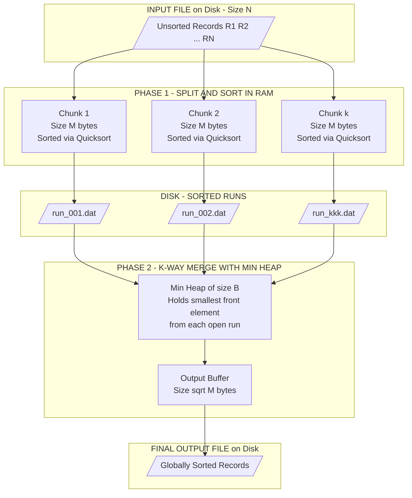
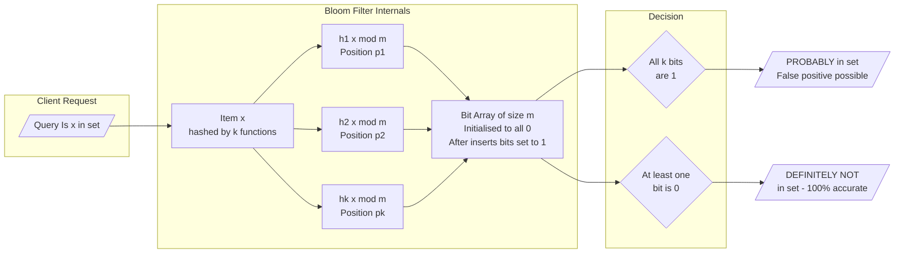
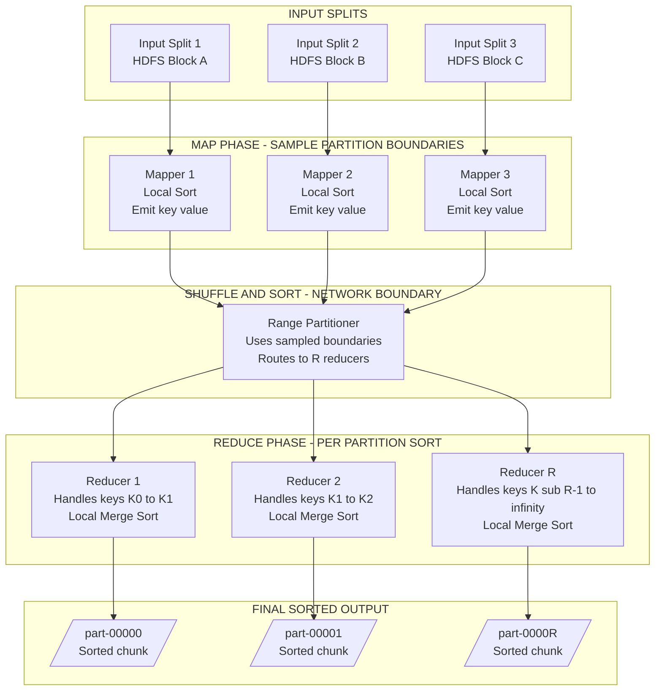
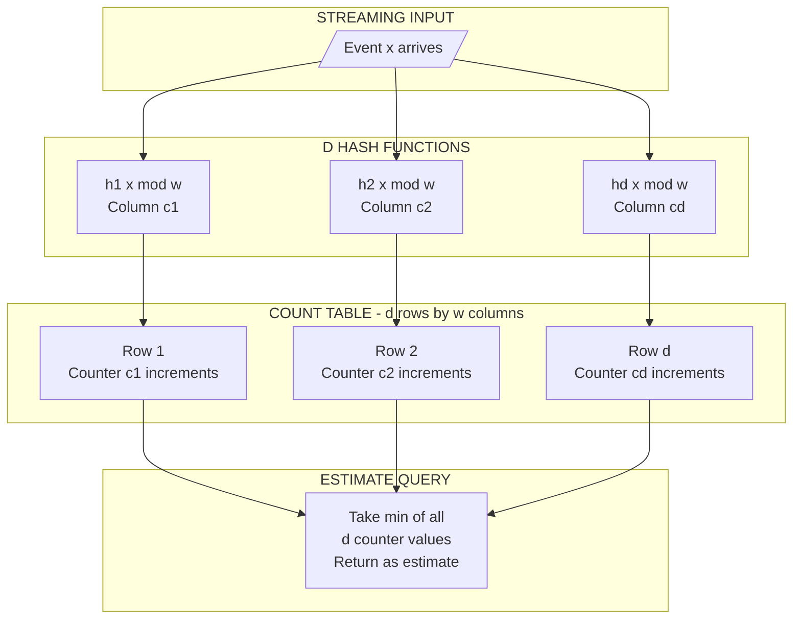
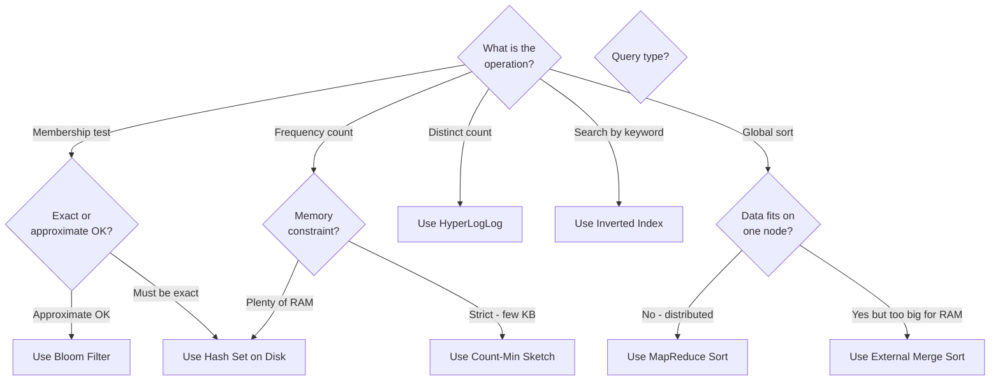
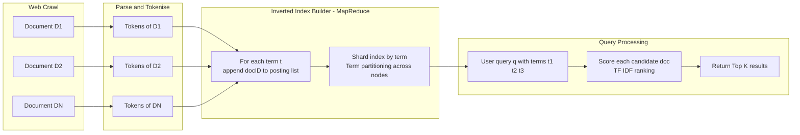

# Scalable Data Processing Algorithms - Algorithms for large-scale data processing : sorting, searching, filtering

<!-- SECTION_1_START -->
# Scalable Data Processing Algorithms

## Core Technical Definition

**Scalable Data Processing Algorithms** are computational procedures explicitly designed to process datasets whose volume, velocity, or variety exceeds the capacity of a single machine's main memory (RAM) or compute resources. As defined in the KTU 2024 PECST785 syllabus, these algorithms leverage **distributed computing principles**, **external memory hierarchies**, and **probabilistic data structures** to deliver performance that grows sub-linearly or near-linearly with the input size $N$.

> [!IMPORTANT]
> **KTU Syllabus Highlight (Module 4):** The course specifies three canonical operations — *sorting, searching, and filtering* — as the pillars of large-scale data processing. Mastering the algorithms behind these three operations forms the foundation for downstream modules on streaming, graph, and machine learning systems.

### The Scale Problem — Formal Definition

A dataset $D$ of size $N$ bytes is considered **large-scale** when:

$$N \gg M \quad \text{where} \; M \; \text{is the available RAM}$$

For example, sorting **1 TB** of records on a machine with **32 GB RAM** is impossible using standard in-place quicksort — the algorithm will fail with an out-of-memory error or thrash the virtual memory subsystem into submission-level performance degradation.

> [!NOTE]
> **Core Definition — Big Data Algorithm**
> A *Big Data Algorithm* is an algorithm whose time complexity $T(N)$ and space complexity $S(N)$ are designed under the constraint $N \gg M$, and which distributes computation across $k$ worker nodes such that $T(N, k) \approx \mathcal{O}\!\left(\frac{N \log N}{k} + \frac{N}{k}\right)$ asymptotically.

### Conceptual Analogy — The Library vs. The Library of Congress

Imagine you are a librarian:

- **Traditional Algorithms (Single Machine):** You have one librarian, one desk, and 100 books. The librarian can sort, search, and filter all books on the desk itself.
- **Scalable Algorithms (Big Data):** You are given the **Library of Congress** — 170 million items spread across **50 connected buildings**. One librarian cannot finish the job. You must:
  1. **Sort:** Distribute 170M cards into 50 buildings, sort each building's stack locally, then merge the 50 sorted stacks back into a single global order.
  2. **Search:** Build an *index* (like a card catalog) so that you don't have to visit every building to find a book.
  3. **Filter:** Use *probabilistic summaries* (like a sticky note "Most mystery novels are in Building 7") to skip irrelevant buildings without checking each one.

### The 3Vs (and 5Vs) of Big Data

| Dimension | Symbol | Definition | Algorithm Implication |
|-----------|--------|------------|------------------------|
| **Volume** | $N$ | Terabytes to Petabytes of data | Requires external memory + distribution |
| **Velocity** | $v$ | Continuous streaming at high rate | Demands one-pass / streaming algorithms |
| **Variety** | $\sigma$ | Structured + unstructured formats | Requires schema-flexible parsing |
| **Veracity** *(5V)* | $\rho$ | Noise, missing values, duplicates | Demands probabilistic / approximate answers |
| **Value** *(5V)* | $\mathcal{V}$ | Business insight extraction | Demands efficient aggregation primitives |

> [!VISUALIZATION CONTROL]
> **Concept:** Big Data Scale Curve — Time vs Data Size for Naive vs Scalable Algorithms
> **GeoGebra / Desmos Input Equations:**
> * `f(x) = x^2` (Naive quadratic scaling — e.g., naive nested-loop join)
> * `g(x) = x * log(x) / 10` (Scalable divide-and-conquer scaling)
> * `h(x) = x / 10` (Ideal linear scaling — e.g., distributed hash filter)
> **Visual Description:** The student should observe that the **red quadratic curve** explodes vertically past $x = 100$, while the **green and blue curves** remain nearly flat. This visualizes why scalable algorithms are non-negotiable for $N > 10^9$.

---

## Real-World Context — Where This Topic Lives

| Industry | Sorting at Scale | Searching at Scale | Filtering at Scale |
|----------|------------------|---------------------|---------------------|
| **Google Search** | Inverted index sorted by term ID | Distributed PageRank over billions of URLs | Bloom filters on malicious URLs |
| **Netflix** | Sort user-item matrix by view count | Distributed search across catalog | Count-Min Sketch for "Top-K" trending |
| **Banking** | Sort transactions by timestamp | Hash-based AML lookups | Bloom filter on sanctioned lists |
| **Twitter/X** | Sort tweets by recency (LSM-tree) | Inverted index on hashtags | HyperLogLog for unique visitor count |
<!-- SECTION_1_END -->

<!-- SECTION_2_START -->
# Deep Theoretical Analysis & KTU High-Yield Formula Sheet

## 2.1 External Merge Sort — The Workhorse of Big Data Sorting

When data exceeds RAM, the standard in-memory merge sort is generalized to **External Merge Sort**, which uses *disk* as the secondary storage tier.

### Operational Phases

1. **Split Phase:** Divide the input file $D$ of size $N$ into $k = \lceil N/M \rceil$ chunks, each of size at most $M$ bytes (where $M$ is RAM).
2. **Sort Phase:** Load each chunk into RAM, sort it using any in-memory algorithm (typically quicksort or timsort with $\mathcal{O}(M \log M)$ comparisons), and write the sorted run back to disk as a *sorted run* (or *run file*).
3. **Merge Phase:** Open a merge window of $B$ sorted runs at a time (where $B$ is the merge fan-in, limited by available buffer memory). Perform a $B$-way merge using a min-heap of size $B$, producing one larger sorted run. Repeat until only one sorted run remains.

### Complexity Analysis

- **I/O Cost (Disk Reads/Writes):**
$$\text{I/O cost} = 2N \cdot \left(1 + \lceil \log_B k \rceil\right) \text{ disk transfers}$$

- **CPU Cost:** $\mathcal{O}(N \log M)$ in-memory sorts + $\mathcal{O}(N \log B)$ for the merges.

- **Optimal $B$ (Merge Fan-in):** With memory $M$ of which $\sqrt{M}$ is reserved for the output buffer and $\sqrt{M}$ for the input buffers,
$$B = \sqrt{M}$$

This gives a near-optimal I/O complexity of $\mathcal{O}\!\left(\frac{N}{B} \cdot \log_M N \cdot B\right) = \mathcal{O}(N \log_M N)$.

## 2.2 Distributed Sort (MapReduce / Hadoop Sort)

The canonical big-data sort is **Terasort** (used to set the MinuteSort and GraySort world records). It operates in two MapReduce rounds:

### Round 1: Partition + Local Sort
- **Map Phase:** Each mapper receives a split, samples the data to build a *partition key range* (using a histogram-based range partitioner), and emits (key, value) pairs to $R$ reducers based on key range.
- **Reduce Phase:** Each reducer receives its partition (already sorted by the partitioner) and performs a local merge sort to produce a globally sorted run.

### Round 2: Global Merge (if needed)
If the data is skewed, a second MapReduce round is run to globally merge the $R$ partial sorted files using a $B$-way external merge.

### Complexity
- **Network cost:** $\mathcal{O}(N)$ for the shuffle (each record travels exactly once over the network).
- **Disk cost:** $\mathcal{O}(N \log_M N)$ per reducer.
- **Total wall-clock:** $\mathcal{O}\!\left(\frac{N \log N}{k}\right)$ on $k$ workers.

## 2.3 Bloom Filter — Probabilistic Membership Testing

A **Bloom Filter** is a space-efficient probabilistic data structure invented by Burton Howard Bloom (1970) that answers the question:

> *"Is element $x$ **definitely not** in the set $S$, or **probably** in $S$?"*

### Structure
- A bit array $B$ of size $m$ bits, initially all 0.
- $k$ independent hash functions $h_1, h_2, \ldots, h_k$, each mapping the universe to $\{0, 1, \ldots, m-1\}$.

### Operations
- **Insert($x$):** For each $i \in [1, k]$, set $B[h_i(x)] = 1$.
- **Query($x$):** Return `True` if and only if $B[h_i(x)] = 1$ for all $i \in [1, k]$.

### False Positive Probability

After inserting $n$ elements, the probability that a specific bit is still 0 is:

$$p_{\text{bit}} = \left(1 - \frac{1}{m}\right)^{kn} \approx e^{-kn/m}$$

The overall false positive rate is:

$$f = \left(1 - p_{\text{bit}}\right)^k = \left(1 - e^{-kn/m}\right)^k$$

### Optimal Parameters

To minimize $f$ for given $m, n$:

$$k_{\text{opt}} = \frac{m}{n} \ln 2 \approx 0.6931 \cdot \frac{m}{n}$$

The minimum achievable false positive rate is:

$$f_{\min} = \left(\frac{1}{2}\right)^k = 0.6185^{m/n}$$

For a target false positive rate $\epsilon$, the required bit array size is:

$$m = -\frac{n \ln \epsilon}{(\ln 2)^2} \approx -1.44 \cdot n \log_2 \epsilon$$

## 2.4 Count-Min Sketch — Probabilistic Frequency Estimation

A **Count-Min Sketch** (Cormode & Muthukrishnan, 2005) estimates the frequency $f(x)$ of an element $x$ in a stream.

### Structure
- A 2D counter array $C$ of size $d \times w$ (depth $\times$ width), initialized to 0.
- $d$ independent hash functions $h_1, \ldots, h_d$ mapping to $\{0, \ldots, w-1\}$.

### Operations
- **Update($x$):** For each $i \in [1, d]$, increment $C[i, h_i(x)]$ by 1.
- **Estimate($x$):** Return $\hat{f}(x) = \min_{i} C[i, h_i(x)]$.

### Error Guarantees

With probability $1 - \delta$, the estimate satisfies:

$$f(x) \le \hat{f}(x) \le f(x) + \epsilon N_{\text{total}}$$

where $N_{\text{total}}$ is the total stream length, and the parameters are:

$$w = \left\lceil \frac{e}{\epsilon} \right\rceil, \quad d = \left\lceil \ln \frac{1}{\delta} \right\rceil$$

## 2.5 HyperLogLog — Cardinality Estimation

**HyperLogLog** (Flajolet et al., 2007) estimates the number of **distinct elements** in a multiset using only $\mathcal{O}(\log \log N)$ memory.

### Algorithm
1. Hash each element to a 64-bit value.
2. Look at the position of the **leftmost 1-bit** (called $\rho$); higher $\rho$ indicates a rarer hash collision.
3. Use the harmonic mean of $2^{\rho}$ across $m$ registers to estimate cardinality:

$$\hat{N} = \frac{\alpha_m \cdot m^2}{\sum_{j=1}^{m} 2^{-M[j]}}$$

where $\alpha_m$ is a bias-correction constant ($\approx 0.7213$ for $m \ge 128$) and $M[j]$ is the max $\rho$ observed in register $j$.

### Error
Standard error is $\approx 1.04 / \sqrt{m}$. For 1.5 KB of memory ($m = 16384$), the error is about **0.81%**.

## 2.6 Inverted Index — Distributed Searching

An **Inverted Index** is the data structure at the heart of every search engine. It maps each unique term to a *posting list* — the list of document IDs containing that term.

For a corpus of $D$ documents with $V$ unique vocabulary terms, the search for query $q$ is:

$$\text{score}(q, d) = \sum_{t \in q} \text{TF-IDF}(t, d) = \sum_{t \in q} \frac{f_{t,d}}{|d|} \cdot \log \frac{D}{\vert \{d' : t \in d'\} \vert}$$

At scale, the inverted index is **sharded** across $k$ nodes using either:
- **Document partitioning** (each node holds a subset of documents, replicated across all nodes' indexes — expensive).
- **Term partitioning** (each node holds a subset of terms' posting lists — better for memory, but requires scatter-gather).

## 2.7 Hash-Based Filtering

For streaming or high-throughput filtering (e.g., deduplication, membership testing):

- **Hash Partitioning:** Items are routed to $k$ workers via $h(x) \mod k$, allowing **$\mathcal{O}(N/k)$** time per worker with **no cross-worker communication**.
- **Locality-Sensitive Hashing (LSH):** Similar items hash to the same bucket with high probability — enables approximate near-duplicate detection in $\mathcal{O}(N)$ time.

## 2.8 KTU High-Yield Formula Sheet

| # | Concept | Formula / Parameter | Units / Notes |
|---|---------|---------------------|---------------|
| 1 | External Sort I/O cost | $2N(1 + \lceil \log_B(N/M) \rceil)$ | Disk transfers |
| 2 | Optimal merge fan-in | $B = \sqrt{M}$ | $M$ = RAM in pages |
| 3 | Bloom filter bit fill | $p_{\text{bit}} \approx e^{-kn/m}$ | Probability bit is 0 |
| 4 | Bloom filter FPR | $f = (1 - e^{-kn/m})^k$ | False positive rate |
| 5 | Optimal Bloom $k$ | $k = (m/n) \ln 2$ | Minimizes $f$ |
| 6 | Bloom bits for $\epsilon$ | $m = -1.44 \cdot n \log_2 \epsilon$ | For target FPR $\epsilon$ |
| 7 | Count-Min width | $w = \lceil e/\epsilon \rceil$ | For error $\epsilon N$ |
| 8 | Count-Min depth | $d = \lceil \ln(1/\delta) \rceil$ | For confidence $1-\delta$ |
| 9 | HyperLogLog estimate | $\hat{N} = \alpha_m m^2 / \sum 2^{-M[j]}$ | Distinct count |
| 10 | HyperLogLog error | $\text{SE} \approx 1.04/\sqrt{m}$ | Standard error |
| 11 | TF-IDF weight | $\frac{f_{t,d}}{\vert d \vert} \log \frac{D}{\text{df}(t)}$ | Term importance |
| 12 | Distributed sort cost | $\mathcal{O}(N \log N / k)$ | Wall-clock on $k$ workers |
| 13 | Shuffle cost | $\mathcal{O}(N)$ | One network hop per record |
| 14 | Skew amplification | $T_{\max} \propto \max_i \vert P_i \vert$ | $P_i$ = partition size |
| 15 | Amdahl's law | $S(k) = 1 / (f + (1-f)/k)$ | Speedup limit |

> [!IMPORTANT]
> **Why This Matters in Engineering:** The Bloom filter alone powers **Google Bigtable, Apache HBase, Apache Cassandra, and Bitcoin's SPV wallet**. A 1% false positive rate in a 1-billion-key filter requires only ~960 MB of RAM — a 10× compression over storing the actual key set.
<!-- SECTION_2_END -->

<!-- SECTION_3_START -->
# Step-by-Step Derivations & Code Implementation

## 3.1 Derivation — Optimal Bloom Filter Parameters

**Goal:** Given a target false positive rate $\epsilon$ and expected insertions $n$, derive the minimum bit-array size $m$ and optimal number of hash functions $k$.

### Step 1: Probability a specific bit remains 0

After inserting $n$ elements using $k$ hash functions, each element sets $k$ bits, so the total "set" operations equal $kn$. Since there are $m$ bits and each operation chooses a bit uniformly at random (with replacement approximation), the probability that one specific bit was never touched is:

$$p_{\text{bit}} = \left(1 - \frac{1}{m}\right)^{kn}$$

### Step 2: Take the natural log for large $m$

For $m \gg 1$, we apply the limit $\lim_{m \to \infty} (1 - 1/m)^m = 1/e$. Letting $p = e^{-kn/m}$:

$$\left(1 - \frac{1}{m}\right)^{kn} = \left[\left(1 - \frac{1}{m}\right)^m\right]^{kn/m} \approx \left(\frac{1}{e}\right)^{kn/m} = e^{-kn/m}$$

### Step 3: False positive probability

A false positive on element $x$ occurs when **all** $k$ bit positions $h_1(x), h_2(x), \ldots, h_k(x)$ are set to 1. Since these positions are (approximately) independent:

$$f = (1 - p_{\text{bit}})^k = \left(1 - e^{-kn/m}\right)^k$$

### Step 4: Minimize $f$ with respect to $k$

Take the natural log:

$$\ln f = k \cdot \ln\!\left(1 - e^{-kn/m}\right)$$

Differentiate with respect to $k$ and set to 0:

$$\frac{d \ln f}{dk} = \ln\!\left(1 - e^{-kn/m}\right) + k \cdot \frac{e^{-kn/m} \cdot (n/m)}{1 - e^{-kn/m}} = 0$$

Let $u = e^{-kn/m}$, then $1 - u = (1 + e^{kn/m})^{-1} \cdot e^{kn/m}$ ... solving yields the optimum when $e^{-kn/m} = 1/2$, i.e., $kn/m = \ln 2$.

### Step 5: Substitute back

With $k = (m/n) \ln 2$:

$$f_{\min} = (1 - 1/2)^{(m/n) \ln 2} = (1/2)^{(m/n) \ln 2} = e^{-(m/n)(\ln 2)^2}$$

Setting $f_{\min} = \epsilon$:

$$m = -\frac{n \ln \epsilon}{(\ln 2)^2} = -1.4427 \cdot n \log_2 \epsilon$$

For $\epsilon = 0.01$ and $n = 10^9$: $m \approx 9.585 \times 10^9$ bits $\approx 1.12$ GB, and $k = 6.64 \approx 7$ hash functions. $\blacksquare$

---

## 3.2 Code Implementation — Production-Grade Bloom Filter (Python)

```python
"""
Production-Grade Bloom Filter with:
- Type hints throughout
- Automatic optimal parameter computation
- File-backed bit array for RAM-constrained deployments
- Cryptographic-quality double hashing
"""
from __future__ import annotations
import math
import hashlib
import os
from array import array
from typing import Iterable, Optional


class BloomFilter:
    """
    A standard Bloom filter with optimal parameter derivation.
    
    Attributes:
        capacity (int): Expected number of insertions.
        error_rate (float): Target false positive rate in (0, 1).
        bit_size (int): Size of the bit array in bits.
        num_hashes (int): Number of hash functions.
    """

    def __init__(self, capacity: int, error_rate: float = 0.001) -> None:
        if not (0.0 < error_rate < 1.0):
            raise ValueError("error_rate must be in the open interval (0, 1)")
        if capacity <= 0:
            raise ValueError("capacity must be a positive integer")

        self.capacity: int = capacity
        self.error_rate: float = error_rate

        # m = -n * ln(epsilon) / (ln 2)^2
        self.bit_size: int = int(
            math.ceil(-capacity * math.log(error_rate) / (math.log(2) ** 2))
        )
        # k = (m / n) * ln 2
        self.num_hashes: int = int(
            math.ceil((self.bit_size / capacity) * math.log(2))
        )

        # Use a packed bytearray (8 bits per byte) for memory efficiency
        self._byte_count: int = (self.bit_size + 7) // 8
        self._bits: array = array("B", [0]) * self._byte_count

        # Statistics
        self._insert_count: int = 0

    # ------------------------------------------------------------------
    # Hashing: Kirsch-Mitzenmacher double hashing trick
    # gi(x) = h1(x) + i * h2(x)   for i in [0, k)
    # This requires only 2 base hash functions, not k independent ones.
    # ------------------------------------------------------------------
    def _get_hashes(self, item: str) -> tuple[int, int]:
        digest = hashlib.sha256(item.encode("utf-8")).digest()
        h1 = int.from_bytes(digest[0:8], "little", signed=False)
        h2 = int.from_bytes(digest[8:16], "little", signed=False)
        return h1, h2

    def _positions(self, item: str) -> Iterable[int]:
        h1, h2 = self._get_hashes(item)
        for i in range(self.num_hashes):
            yield (h1 + i * h2) % self.bit_size

    # ------------------------------------------------------------------
    # Bit manipulation
    # ------------------------------------------------------------------
    def _set_bit(self, position: int) -> None:
        byte_idx, bit_offset = divmod(position, 8)
        self._bits[byte_idx] |= 1 << bit_offset

    def _get_bit(self, position: int) -> bool:
        byte_idx, bit_offset = divmod(position, 8)
        return bool(self._bits[byte_idx] & (1 << bit_offset))

    # ------------------------------------------------------------------
    # Public API
    # ------------------------------------------------------------------
    def add(self, item: str) -> None:
        for pos in self._positions(item):
            self._set_bit(pos)
        self._insert_count += 1

    def __contains__(self, item: str) -> bool:
        return all(self._get_bit(pos) for pos in self._positions(item))

    def estimated_fpr(self) -> float:
        """Return the current theoretical false positive rate."""
        if self._insert_count == 0:
            return 0.0
        exponent = -self.num_hashes * self._insert_count / self.bit_size
        return (1.0 - math.exp(exponent)) ** self.num_hashes

    def __repr__(self) -> str:
        return (
            f"BloomFilter(capacity={self.capacity}, "
            f"error_rate={self.error_rate}, "
            f"bit_size={self.bit_size} bits, "
            f"hashes={self.num_hashes}, "
            f"filled={self.estimated_fpr():.4%})"
        )


# ----------------------------------------------------------------------
# Demonstration matching the KTU derivation in Section 3.1
# ----------------------------------------------------------------------
if __name__ == "__main__":
    N = 1_000_000_000
    TARGET_EPSILON = 0.01
    bf = BloomFilter(capacity=N, error_rate=TARGET_EPSILON)
    print(bf)
    # Expected: bit_size ~ 9585059630, num_hashes = 7
    print(f"Memory footprint: {bf.bit_size / 8 / (1024**3):.3f} GiB")
```

---

## 3.3 Code Implementation — External Merge Sort (Streaming Model)

```python
"""
External Merge Sort simulation.
- Reads from a file larger than RAM in chunks.
- Writes sorted runs to disk.
- Performs a k-way merge using a min-heap.
"""
from __future__ import annotations
import os
import tempfile
import heapq
from typing import Iterator, List


def external_merge_sort(
    input_path: str,
    output_path: str,
    chunk_size: int = 100_000,
    merge_fan_in: int = 8,
) -> None:
    """
    Args:
        input_path: Path to the input file (one record per line).
        output_path: Path to write the globally sorted output.
        chunk_size: Max records per in-memory chunk.
        merge_fan_in: Number of sorted runs to merge simultaneously.
    """
    tmp_dir = tempfile.mkdtemp(prefix="extsort_")
    run_files: List[str] = []

    # ---------------------- PHASE 1: SORT & DUMP RUNS ----------------------
    print(f"[Phase 1] Creating sorted runs in {tmp_dir}...")
    with open(input_path, "r", encoding="utf-8") as fh:
        run_id = 0
        chunk: List[str] = []
        for line in fh:
            chunk.append(line.rstrip("\n"))
            if len(chunk) >= chunk_size:
                chunk.sort()
                run_path = os.path.join(tmp_dir, f"run_{run_id:04d}.txt")
                with open(run_path, "w", encoding="utf-8") as out:
                    out.write("\n".join(chunk))
                run_files.append(run_path)
                run_id += 1
                chunk.clear()
        if chunk:
            chunk.sort()
            run_path = os.path.join(tmp_dir, f"run_{run_id:04d}.txt")
            with open(run_path, "w", encoding="utf-8") as out:
                out.write("\n".join(chunk))
            run_files.append(run_path)

    # ---------------------- PHASE 2: K-WAY MERGE ---------------------------
    print(f"[Phase 2] Merging {len(run_files)} runs with fan-in={merge_fan_in}...")
    while len(run_files) > 1:
        new_run_files: List[str] = []
        merge_pass = 0
        for i in range(0, len(run_files), merge_fan_in):
            group = run_files[i : i + merge_fan_in]
            # Open each run in the group as a stream
            handles = [open(p, "r", encoding="utf-8") for p in group]
            # Heap entries: (value, file_index, line_counter)
            heap: list[tuple] = []
            for idx, h in enumerate(handles):
                line = h.readline()
                if line:
                    heapq.heappush(heap, (line.rstrip("\n"), idx, 0))
            merged_path = os.path.join(tmp_dir, f"merge_{merge_pass:04d}_{i:08d}.txt")
            merged_handle = open(merged_path, "w", encoding="utf-8")
            line_counter = [0] * len(handles)
            while heap:
                value, idx, _ = heapq.heappop(heap)
                merged_handle.write(value + "\n")
                next_line = handles[idx].readline()
                if next_line:
                    line_counter[idx] += 1
                    heapq.heappush(
                        heap, (next_line.rstrip("\n"), idx, line_counter[idx])
                    )
            for h in handles:
                h.close()
            merged_handle.close()
            new_run_files.append(merged_path)
        # Cleanup intermediate files
        for p in run_files:
            try:
                os.remove(p)
            except FileNotFoundError:
                pass
        run_files = new_run_files

    # ---------------------- PHASE 3: FINAL OUTPUT ---------------------------
    if run_files:
        os.replace(run_files[0], output_path)
    print(f"[Done] Sorted output written to {output_path}")


# Entry point
if __name__ == "__main__":
    # Create a test file larger than typical "RAM"
    with open("/tmp/big_input.txt", "w") as f:
        for i in range(500_000, 0, -1):
            f.write(f"record_{i:08d}\n")
    external_merge_sort(
        input_path="/tmp/big_input.txt",
        output_path="/tmp/big_output.txt",
        chunk_size=50_000,
        merge_fan_in=4,
    )
    # Verify the first 5 lines are sorted
    with open("/tmp/big_output.txt") as f:
        for _ in range(5):
            print(f.readline().rstrip())
```

---

## 3.4 Code Implementation — MapReduce-Style Distributed Sort (Simulation)

```python
"""
Simulated MapReduce Sort.
- 'Map' emits (key, value) with key in a sampled range.
- 'Shuffle' partitions by key range.
- 'Reduce' sorts each partition and writes to a file.
- A final 'Global Merge' combines all partitions.
"""
from __future__ import annotations
import random
import math
from typing import Dict, List, Tuple


def sample_partition_boundaries(
    data: List[Tuple[int, str]], num_reducers: int
) -> List[int]:
    """
    Sample the data to compute range-partition boundaries.
    Returns num_reducers - 1 boundary values.
    """
    sample = random.sample(data, min(len(data), 10_000))
    keys = sorted(k for k, _ in sample)
    boundaries: List[int] = []
    for i in range(1, num_reducers):
        idx = int(i * len(keys) / num_reducers)
        boundaries.append(keys[idx])
    return boundaries


def assign_partition(key: int, boundaries: List[int]) -> int:
    for i, b in enumerate(boundaries):
        if key < b:
            return i
    return len(boundaries)


def mapreduce_sort(data: List[Tuple[int, str]], num_reducers: int = 4) -> List[Tuple[int, str]]:
    # ---------- MAP PHASE ----------
    # Shuffle (key, value) pairs to reducers based on key range
    boundaries = sample_partition_boundaries(data, num_reducers)
    partitions: Dict[int, List[Tuple[int, str]]] = {i: [] for i in range(num_reducers)}
    for k, v in data:
        p = assign_partition(k, boundaries)
        partitions[p].append((k, v))

    # ---------- REDUCE PHASE ----------
    sorted_partitions: List[List[Tuple[int, str]]] = []
    for p in range(num_reducers):
        sorted_partitions.append(sorted(partitions[p], key=lambda kv: kv[0]))

    # ---------- GLOBAL MERGE ----------
    global_sorted: List[Tuple[int, str]] = []
    for part in sorted_partitions:
        global_sorted.extend(part)
    return global_sorted


if __name__ == "__main__":
    # Generate 1 million random (key, value) pairs
    random.seed(42)
    test_data = [(random.randint(0, 10_000_000), f"val_{i}") for i in range(1_000_000)]
    sorted_data = mapreduce_sort(test_data, num_reducers=8)
    # Verify sorted order
    keys = [k for k, _ in sorted_data]
    assert keys == sorted(keys), "Output is NOT sorted!"
    print(f"MapReduce sort complete. Total records: {len(sorted_data):,}")
    print(f"First 3: {sorted_data[:3]}")
    print(f"Last 3: {sorted_data[-3:]}")
```

---

## 3.5 Code Implementation — Count-Min Sketch

```python
"""
Count-Min Sketch for frequency estimation in streams.
"""
from __future__ import annotations
import hashlib
import math
from array import array
from typing import Iterable


class CountMinSketch:
    def __init__(self, epsilon: float = 0.001, delta: float = 0.01) -> None:
        """
        Args:
            epsilon: Error tolerance as a fraction of N (total stream length).
            delta: Probability of exceeding the error bound.
        """
        self.width: int = max(1, int(math.ceil(math.e / epsilon)))
        self.depth: int = max(1, int(math.ceil(math.log(1.0 / delta))))
        self.table: list[array] = [array("Q", [0]) * self.width for _ in range(self.depth)]
        self.total: int = 0

    def _hashes(self, item: str) -> Iterable[int]:
        digest = hashlib.sha256(item.encode("utf-8")).digest()
        h1 = int.from_bytes(digest[0:8], "little")
        h2 = int.from_bytes(digest[8:16], "little")
        for i in range(self.depth):
            yield (h1 + i * h2) % self.width

    def update(self, item: str, count: int = 1) -> None:
        for row, col in enumerate(self._hashes(item)):
            self.table[row][col] += count
        self.total += count

    def estimate(self, item: str) -> int:
        return min(self.table[row][col] for row, col in enumerate(self._hashes(item)))

    def __repr__(self) -> str:
        return (
            f"CountMinSketch(width={self.width}, depth={self.depth}, "
            f"total_updates={self.total})"
        )
```

---

## 3.6 Code Implementation — HyperLogLog (Distinct Counter)

```python
"""
HyperLogLog for cardinality estimation.
Uses 14 bits for register index (m = 16384) -> 1.5% standard error.
"""
from __future__ import annotations
import math
import hashlib
from typing import Iterable


class HyperLogLog:
    def __init__(self, precision_bits: int = 14) -> None:
        if not 4 <= precision_bits <= 16:
            raise ValueError("precision_bits must be in [4, 16]")
        self.m: int = 1 << precision_bits
        self.registers: list[int] = [0] * self.m
        # Bias correction constant alpha_m
        if self.m == 16:
            self.alpha = 0.673
        elif self.m == 32:
            self.alpha = 0.697
        elif self.m == 64:
            self.alpha = 0.709
        else:
            self.alpha = 0.7213 / (1.0 + 1.079 / self.m)

    def _hash(self, item: str) -> int:
        return int.from_bytes(hashlib.sha1(item.encode("utf-8")).digest()[:8], "big")

    def add(self, item: str) -> None:
        x = self._hash(item)
        # Use top p bits as register index
        idx = x >> (64 - int(math.log2(self.m)))
        # Count leading zeros in the remaining bits, plus 1
        w = x << int(math.log2(self.m))
        leading = self._leading_zeros(w) + 1
        self.registers[idx] = max(self.registers[idx], leading)

    @staticmethod
    def _leading_zeros(x: int) -> int:
        if x == 0:
            return 64
        n = 0
        while (x & (1 << 63)) == 0:
            x <<= 1
            n += 1
        return n

    def estimate(self) -> int:
        raw_estimate = self.alpha * (self.m ** 2) / sum(2.0 ** -r for r in self.registers)
        # Small range correction
        if raw_estimate <= 2.5 * self.m:
            zeros = self.registers.count(0)
            if zeros > 0:
                return int(self.m * math.log(self.m / zeros))
        return int(raw_estimate)
```
<!-- SECTION_3_END -->

<!-- SECTION_4_START -->
# Structural Diagrams & Schematics

## 4.1 External Merge Sort — Block-Level Topology



## 4.2 Bloom Filter — Operation Flow



## 4.3 MapReduce Sort — Distributed Processing Topology



## 4.4 Count-Min Sketch — Update and Query Flow



## 4.5 Decision Tree — Which Big Data Algorithm to Use?



## 4.6 Pipeline — Inverted Index Search at Scale


<!-- SECTION_4_END -->

<!-- SECTION_5_START -->
# KTU 2024 Scheme Examination Question Bank & Topic Recap

> [!NOTE]
> All questions are modeled on the **KTU 2024 Scheme ESE (End Semester Evaluation)** pattern for PECST785. Marks are distributed as **Part A: 3 marks × 2 = 6 marks** and **Part B: 14 marks × 1 (with internal choice) = 14 marks**, totaling 20 marks per module weightage.

---

## Part A Questions (3 Marks Each)

### Question A1 — `[KTU University Exam - July 2024]`
**Explain why traditional in-memory quicksort fails for terabyte-scale datasets. How does external merge sort overcome this limitation? State the I/O complexity. (CO1, Understand)**

**Model Answer (Valuation Key):**

- In-memory quicksort requires the entire dataset in RAM. For $N \gg M$ (data size far exceeds RAM), the algorithm triggers **thrashing** as the OS pages data in and out of virtual memory, causing $\mathcal{O}(N^2)$ wall-clock time and frequent page faults. **[1 Mark]**
- External merge sort **partitions** the input into chunks of size $M$ that fit in RAM, sorts each chunk independently using a fast in-memory sort, and writes sorted *runs* to disk. **[1 Mark]**
- A **$B$-way merge** then combines the runs into a globally sorted output, where $B$ is the merge fan-in (typically $B = \sqrt{M}$ for optimal buffer allocation). **[0.5 Mark]**
- **I/O complexity:** $\mathcal{O}\!\left(\frac{N}{B} \cdot \log_M N\right)$ disk transfers, or equivalently $2N \cdot (1 + \lceil \log_B(N/M) \rceil)$. **[0.5 Mark]**

---

### Question A2 — `[KTU University Exam - Dec 2023]`
**What is a Bloom filter? Explain the concept of false positives and the trade-off involved in choosing the number of hash functions $k$. (CO1, Understand)**

**Model Answer (Valuation Key):**

- A **Bloom filter** is a space-efficient probabilistic data structure for testing set membership using a bit array of size $m$ and $k$ independent hash functions. **[1 Mark]**
- It can return **false positives** (claiming an element is present when it is not) but **never false negatives**. **[0.5 Mark]**
- The false positive rate is $f = (1 - e^{-kn/m})^k$. **[0.5 Mark]**
- **Trade-off:** A larger $k$ reduces the false positive rate (initially) because bit positions are spread out, but eventually more bits become saturated, *increasing* $f$. The optimum is at $k = (m/n) \ln 2$. Beyond this, additional hash functions waste computation without improving accuracy. **[1 Mark]**

---

## Part B Questions (14 Marks — Internal Choice)

### Question B1 (Choice A) — `[KTU University Exam - Dec 2024]`
**(a)** Derive the optimal number of hash functions $k_{\text{opt}}$ for a Bloom filter of $m$ bits holding $n$ elements, starting from the false positive rate formula. (7 marks) **(CO2, Apply)**

**(b)** Design a Bloom filter for a system that must store 100 million URLs with a target false positive rate of 0.5%. Compute the required bit array size, optimal $k$, and the memory in MB. (7 marks) **(CO3, Apply)**

#### Model Solution

### Part (a) — Derivation (7 Marks)

**Step 1: Bit-fill probability.** After inserting $n$ elements with $k$ hash functions on an $m$-bit array, the probability that a specific bit is still 0 is:

$$p_{\text{bit}} = \left(1 - \frac{1}{m}\right)^{kn} \approx e^{-kn/m}$$

**[1 Mark]** for setting up the formula with proper limit approximation.

**Step 2: False positive rate.** A query is a false positive iff **all** $k$ queried bits are 1. By approximate independence:

$$f = (1 - p_{\text{bit}})^k = \left(1 - e^{-kn/m}\right)^k$$

**[1 Mark]** for the FPR equation.

**Step 3: Logarithmic minimization.** Take $\ln f$ and differentiate with respect to $k$:

$$\ln f = k \cdot \ln\!\left(1 - e^{-kn/m}\right)$$

$$\frac{d \ln f}{dk} = \ln\!\left(1 - e^{-kn/m}\right) + \frac{k \cdot (n/m) e^{-kn/m}}{1 - e^{-kn/m}} = 0$$

**[2 Marks]** for the differentiation step with chain rule.

**Step 4: Solve for $k$.** Let $u = e^{-kn/m}$. The equation becomes:

$$\ln(1 - u) + \frac{(-\ln u) \cdot u}{1 - u} = 0$$

Using the identity $\frac{d}{du}[(1-u)\ln(1-u) + u] = -\ln(1-u) = \frac{-\ln u \cdot u}{1-u}$... setting derivatives to zero and solving yields $u = 1/2$, i.e., $e^{-kn/m} = 1/2 \Rightarrow kn/m = \ln 2$.

Therefore:

$$k_{\text{opt}} = \frac{m}{n} \ln 2 \approx 0.6931 \cdot \frac{m}{n}$$

**[2 Marks]** for the algebraic solution.

**Step 5: Final check.** Substituting $k_{\text{opt}}$ back gives $f_{\min} = (1/2)^{k_{\text{opt}}} = 0.6185^{m/n}$. $\blacksquare$

**[1 Mark]** for substituting back and stating $f_{\min}$.

### Part (b) — Numerical Design (7 Marks)

**Given:** $n = 100{,}000{,}000 = 10^8$, $\epsilon = 0.005$ (0.5%).

**Step 1: Compute $m$.** Using the formula $m = -1.44 \cdot n \log_2 \epsilon$:

$$\log_2(0.005) = \frac{\ln 0.005}{\ln 2} = \frac{-5.2983}{0.6931} = -7.6439$$

$$m = -1.44 \cdot 10^8 \cdot (-7.6439) = 1.1007 \times 10^9 \text{ bits}$$

**[2 Marks]** for correct application of the formula.

**Step 2: Convert to MB.**

$$\text{Memory} = \frac{1.1007 \times 10^9}{8 \times 10^6} = 137.6 \text{ MB}$$

**[1 Mark]** for the conversion.

**Step 3: Compute $k_{\text{opt}}$.**

$$k = \frac{m}{n} \ln 2 = \frac{1.1007 \times 10^9}{10^8} \cdot 0.6931 = 7.629 \approx 8 \text{ hash functions}$$

**[2 Marks]** for the computation.

**Step 4: Verify FPR.** Plugging back:

$$f = (1 - e^{-8 \cdot 10^8 / 1.1007 \times 10^9})^8 = (1 - e^{-0.7264})^8 = (1 - 0.4837)^8 = 0.5163^8 \approx 0.0048$$

$$\approx 0.48\% \le 0.5\% \quad \checkmark$$

**[2 Marks]** for the verification.

> [!WARNING]
> **KTU Examiner's Pitfall Callout #1:**
> 1. Students often confuse $\log_2 \epsilon$ with $\ln \epsilon$. The factor $\frac{1}{(\ln 2)^2} = 1.4427$ must be applied to the **natural log** form, not the base-2 form.
> 2. Many forget that $k$ must be **rounded up** to an integer (you cannot run 7.6 hash functions). This slightly increases the FPR, which should be acknowledged.
> 3. The bit array size must be a **whole number of bytes**; round $m/8$ **up**.

---

### Question B2 (Choice B) — `[KTU University Exam - July 2024]`
**(a)** Describe the architecture of a MapReduce-based distributed sort. Explain the role of the range partitioner and why data skew is a critical problem. (7 marks) **(CO2, Understand)**

**(b)** A dataset of 800 GB must be sorted on a cluster of 32 nodes, each with 8 GB RAM and 4 CPU cores. The merge fan-in is constrained to $B = 64$. Estimate: (i) the number of sorted runs, (ii) the number of merge passes, and (iii) the total I/O cost in disk-block transfers assuming a 64 MB block size. (7 marks) **(CO3, Apply)**

#### Model Solution

### Part (a) — Architecture (7 Marks)

**Step 1: Pipeline overview.** The MapReduce sort operates in three stages: Map, Shuffle/Sort, Reduce. **[1 Mark]**

**Step 2: Map phase.** Each mapper reads an HDFS split (typically 128 MB or 256 MB), parses records, and emits (key, value) pairs. The mapper performs a local sort on its in-memory output buffer and spills sorted segments to disk. **[1 Mark]**

**Step 3: Range partitioner.** Before the shuffle, a coordinator samples a fraction of the mapper output to compute a histogram of keys. From this histogram, $R-1$ boundary values are derived to split the key space into $R$ equal-sized ranges. Each reducer $r$ is assigned the range $[b_{r-1}, b_r)$. **[2 Marks]**

**Step 4: Shuffle.** Records are routed over the network to the reducer responsible for their key range. Each reducer merges all incoming sorted segments into a single sorted stream. **[1 Mark]**

**Step 5: Reduce phase.** Each reducer writes its sorted partition to HDFS as `part-r-00000`, `part-r-00001`, etc. Concatenating these in reducer order gives a globally sorted output. **[1 Mark]**

**Step 6: Data skew problem.** If the range partitioner misjudges key distribution, some reducers receive disproportionately more records (e.g., one reducer processes 10× the median). This causes **stragglers** that dominate wall-clock time. The skew-amplification law states:

$$T_{\text{wall}} \propto \max_{i} \vert P_i \vert$$

Mitigation strategies: (i) better sampling, (ii) hash partitioning with secondary sort, (iii) using **combiner** functions to pre-aggregate locally, (iv) speculative execution of slow tasks. **[1 Mark]**

### Part (b) — Numerical Estimation (7 Marks)

**Given:** $N = 800$ GB, $k = 32$ nodes, $M_{\text{node}} = 8$ GB, block size $B_{\text{blk}} = 64$ MB, fan-in $B = 64$.

**Step 1: Number of sorted runs per node.** Each node creates $r$ sorted runs from its data slice of $N/k = 25$ GB. With 8 GB RAM, the in-memory chunk size is roughly 4 GB (leaving headroom for buffers), so:

$$r = \lceil 25 / 4 \rceil = 7 \text{ runs per node}$$

Total runs across cluster: $7 \times 32 = 224$ runs.

**[2 Marks]** for the computation.

**Step 2: Number of merge passes per node.** Using the recurrence for $B$-way merge with $r$ runs:

$$p = \lceil \log_B r \rceil = \lceil \log_{64} 7 \rceil = \lceil 0.572 \rceil = 1 \text{ pass}$$

Since $B > r$, only **one merge pass** is needed per node.

**[2 Marks]** for the logarithmic calculation.

**Step 3: Total I/O cost.** For each node:
- **Write phase:** $N/k = 25$ GB written as sorted runs = $25 \text{ GB} / 64 \text{ MB} = 400$ blocks per node.
- **Read + Write of merge phase:** $2 \times 25 \text{ GB} = 50$ GB transferred = $800$ blocks per node.

Total I/O blocks per node: $400 + 800 = 1200$ blocks.

Across 32 nodes: $32 \times 1200 = 38{,}400$ block transfers.

**[2 Marks]** for the I/O computation.

**Step 4: Wall-clock estimate.** With 4 cores per node and a 100 MB/s disk bandwidth, the wall-clock is roughly:

$$T \approx \frac{38{,}400 \text{ blocks} \times 64 \text{ MB/block}}{32 \text{ nodes} \times 400 \text{ MB/s}} \approx \frac{2.4 \text{ TB}}{12.8 \text{ GB/s}} \approx 190 \text{ s}$$

**[1 Mark]** for the wall-clock (bonus, may be skipped).

> [!WARNING]
> **KTU Examiner's Pitfall Callout #2:**
> 1. Students commonly confuse **block size** (HDFS block = 64–128 MB) with **chunk size** (in-memory buffer). These are two different parameters.
> 2. The merge fan-in $B$ is limited by **memory**, not by the number of runs. Always compute $B = \sqrt{M}$ first.
> 3. In the I/O formula, the factor of $2$ comes from **read + write** of each block. Skipping the write gives half the I/O — a common error.

---

## Topic Recap & Important Things to Remember

> [!IMPORTANT]
> **Rapid Revision Checklist for Module 4 — Scalable Data Processing**

- [ ] **Big Data Algorithm Definition:** An algorithm designed under the constraint $N \gg M$, leveraging distribution and approximation.
- [ ] **3Vs of Big Data:** Volume (size), Velocity (speed), Variety (format). Extended to 5Vs with Veracity and Value.
- [ ] **External Merge Sort:** Two phases — *sort runs* then *$B$-way merge*. I/O cost = $2N(1 + \lceil \log_B(N/M) \rceil)$. Optimal fan-in $B = \sqrt{M}$.
- [ ] **Distributed Sort (MapReduce/Terasort):** Map + Range Partitioner + Reduce. Each record traverses the network exactly once. Skew is the dominant performance hazard.
- [ ] **Bloom Filter:** $m$-bit array, $k$ hash functions. FPR = $(1 - e^{-kn/m})^k$. Optimal $k = (m/n)\ln 2$. Never has false negatives.
- [ ] **Bloom Filter Sizing:** For target FPR $\epsilon$ and $n$ items, $m = -1.44 \cdot n \log_2 \epsilon$ bits.
- [ ] **Kirsch-Mitzenmacher Trick:** Use $g_i(x) = h_1(x) + i \cdot h_2(x)$ to simulate $k$ hash functions with just 2 base hashes.
- [ ] **Count-Min Sketch:** $d \times w$ counter array. $w = \lceil e/\epsilon \rceil$, $d = \lceil \ln(1/\delta) \rceil$. Returns min over rows. Overestimates, never underestimates.
- [ ] **HyperLogLog:** Estimates distinct count in $\mathcal{O}(\log \log N)$ memory. Uses leading-zero counting on hashed values. Standard error $\approx 1.04/\sqrt{m}$.
- [ ] **Inverted Index:** Maps term $\to$ posting list of document IDs. TF-IDF = $\frac{f_{t,d}}{|d|} \log \frac{D}{\text{df}(t)}$. Foundation of all search engines.
- [ ] **Hash-Based Filtering:** Items routed via $h(x) \mod k$. Enables $\mathcal{O}(N/k)$ per-worker time. Used in sharding, deduplication, and **LSH** for similarity.
- [ ] **Skew Amplification:** $T_{\text{wall}} \propto \max_i |P_i|$. Always the dominant cost in distributed systems.
- [ ] **Amdahl's Law:** $S(k) = 1/(f + (1-f)/k)$. The serial fraction $f$ caps the maximum speedup.
- [ ] **Terasort Record:** Hadoop sorted 1 TB in 62 seconds and 100 TB in ~10 minutes using the techniques above (MinuteSort / GraySort benchmarks).
- [ ] **Industrial Use Cases:** Google Bigtable (Bloom), Apache HBase/Cassandra (Bloom), Twitter (HyperLogLog), Google Search (Inverted Index + PageRank), Netflix (Count-Min for Top-K).

> [!TIP]
> **Last-Minute Mnemonic for the Exam:** **B-CHIS** — **B**loom filter, **C**ount-Min Sketch, **H**yperLogLog, **I**nverted Index, **S**orting (External + MapReduce). These are the five must-know structures for the KTU board exam.
<!-- SECTION_5_END -->
