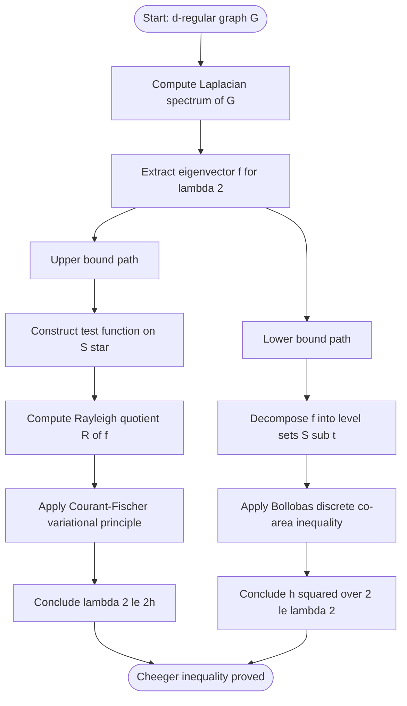
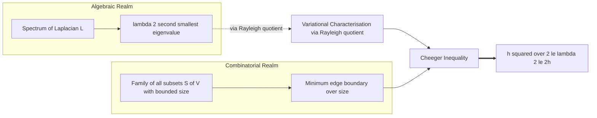
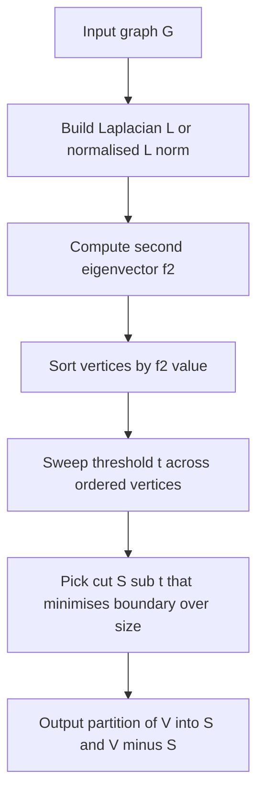
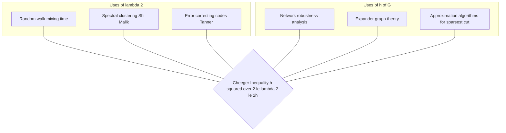

# Cheeger’s Inequality

<!-- SECTION_1_START -->

# Cheeger's Inequality — Core Technical Definition & Intuitive Overview

## 1.1 Formal Definition (KTU 2024 Scheme — PECST795 Module 1)

Let $G = (V, E)$ be a finite, undirected, simple graph with $|V| = n$ vertices, $|E| = m$ edges, and **no self-loops**. Associate to $G$ its **combinatorial Laplacian** matrix:

$$L = D - A$$

where $D = \mathrm{diag}(\deg(v_1), \deg(v_2), \ldots, \deg(v_n))$ is the diagonal degree matrix and $A$ is the binary adjacency matrix with $A_{uv} = 1$ iff $\{u, v\} \in E$.

The Laplacian $L$ is a real, symmetric, positive semidefinite $n \times n$ matrix. Hence it admits a complete orthonormal basis of eigenvectors with real, non-negative eigenvalues:

$$0 = \lambda_1 \le \lambda_2 \le \lambda_3 \le \cdots \le \lambda_n$$

The eigenvalue $\lambda_1 = 0$ has constant eigenvector $\mathbf{1} = (1, 1, \ldots, 1)^{\top}$. The second eigenvalue $\lambda_2$ is called the **algebraic connectivity** of the graph.

> [!IMPORTANT]
> **Cheeger's Inequality (canonical 1970 / discrete form due to Alon & Milman, 1985).** Let $G$ be a $d$-regular graph with $n \ge 2$ vertices, normalized Laplacian $\mathcal{L} = I - \tfrac{1}{d} A$, and Cheeger constant $h(G)$. Then:
> $$\boxed{\;\frac{h(G)^2}{2} \;\le\; \lambda_2(\mathcal{L}) \;\le\; 2\,h(G)\;}$$
> The two ends are **tight** in the sense that the inequalities become asymptotic equalities on long cycles and hypercubes.

The **Cheeger constant** (also called the **edge expansion** or **isoperimetric number**) of an undirected graph is:

$$h(G) \;=\; \min_{\substack{\emptyset \ne S \subset V \\ \mid S \mid \le n/2}} \frac{\vert \partial S \vert}{\vert S \vert}$$

where the **edge boundary** $\partial S = \{\, e = \{u,v\} \in E : u \in S, \, v \notin S \,\}$ counts the number of edges escaping the subset $S$.

> [!NOTE]
> **Why restrict $|S| \le n/2$?** The function $S \mapsto |\partial S|/|S|$ is symmetric: replacing $S$ by $V \setminus S$ swaps numerator and denominator, so restricting to the smaller side removes the trivial minimiser $S = V$.

## 1.2 Intuition — Why This Inequality Is a *Big Deal*

Imagine the vertices of $G$ as cities, and the edges as roads. A "good" graph lets you walk between any two cities using few detours. A "bad" graph is a long chain that snaps in the middle, isolating half the cities behind a single bridge.

- The **Cheeger constant $h(G)$** measures, combinatorially, how *bottlenecked* the graph is. A large $h(G)$ means every cluster of cities has many escape roads. A small $h(G)$ means there is a set $S$ that is "trapped" — many cities but few escape routes.
- The **second eigenvalue $\lambda_2$** measures the same phenomenon *algebraically*. It quantifies how hard it is to oscillate a function on $V$ while keeping it orthogonal to the constant function. A small $\lambda_2$ means the graph has cheap oscillations, i.e., it can be partitioned cheaply.

> [!IMPORTANT]
> **Conceptual Analogy.** Think of $\lambda_2$ as the *resonant frequency* of the graph, and $h(G)$ as the *thickness of its narrowest corridor*. Cheeger's inequality says these two quantities, though defined in different languages (one algebraic, one combinatorial), are *polynomially equivalent* — neither can blow up while the other stays small.

## 1.3 Visualization

> [!VISUALIZATION CONTROL]
> **Concept:** The "sweep cut" on a path graph $P_6$ showing how varying the threshold $t$ reveals the bottleneck cut.
> **GeoGebra / Desmos Input Equations:**
> * Plot $f(v) = 5 - v$ for $v = 1, 2, 3, 4, 5, 6$ (assign one column per vertex).
> * For each $t \in \{0, 0.5, 1, \ldots, 4.5\}$, mark the set $S_t = \{v : f(v) \ge t\}$.
> **Visual Description:** The student should observe that the cut $S_t = \{1, 2, 3\}$ (separating the path into the left half and right half) has $|\partial S_t| = 1$ and $|S_t| = 3$, giving ratio $1/3$, the minimum over $t$. This is the Cheeger cut.

<!-- SECTION_1_END -->

<!-- SECTION_2_START -->

# Deep Theoretical Analysis & KTU High-Yield Formula Sheet

## 2.1 The Quadratic Form of the Laplacian

The Laplacian's most powerful property is the **quadratic form identity**. For any real vector $f \in \mathbb{R}^n$:

$$\langle L f, f \rangle \;=\; f^{\top} L f \;=\; \sum_{\{u,v\} \in E} \bigl( f(u) - f(v) \bigr)^2$$

> [!IMPORTANT]
> **Derivation sketch.** Expand $f^{\top}(D - A)f = \sum_{u} \deg(u) f(u)^2 - 2 \sum_{\{u,v\} \in E} f(u) f(v)$. Combine with $\sum_{\{u,v\} \in E} (f(u)^2 + f(v)^2) = \sum_{u} \deg(u) f(u)^2$ to obtain the symmetric difference form above.

This identity is the *Rosetta Stone* that translates the algebraic eigenproblem into a combinatorial statement about edge-wise differences.

## 2.2 The Rayleigh Quotient & Variational Characterisation

For a non-zero $f \in \mathbb{R}^n$, the **Rayleigh quotient** is:

$$R(f) \;=\; \frac{f^{\top} L f}{f^{\top} f} \;=\; \frac{\sum_{u \sim v} (f(u) - f(v))^2}{\sum_{v} f(v)^2}$$

The Courant–Fischer theorem yields:

$$\lambda_k \;=\; \min_{\dim(U) = k} \;\max_{f \in U \setminus \{0\}} R(f) \qquad \text{and} \qquad \lambda_k \;=\; \min_{\substack{f \perp \mathbf{1}, f \perp v_1, \ldots, f \perp v_{k-1} \\ f \ne 0}} R(f)$$

In particular, the **algebraic connectivity** is the *first* variational problem after collapsing the trivial direction:

$$\lambda_2 \;=\; \min_{\substack{f : V \to \mathbb{R} \\ \sum_v f(v) = 0, \; f \not\equiv 0}} \;\frac{\sum_{u \sim v} (f(u) - f(v))^2}{\sum_v f(v)^2}$$

## 2.3 Normalized Laplacian & $d$-Regular Setting

For a $d$-regular graph, set $\mathcal{L} = I - \tfrac{1}{d} A$. Its spectrum satisfies $\mu_i(\mathcal{L}) = 1 - \tfrac{\lambda_i(A)}{d}$ and the Cheeger inequality becomes:

$$\frac{h(G)^2}{2} \;\le\; \lambda_2(\mathcal{L}) \;\le\; 2\,h(G)$$

In many texts the unnormalized form is preferred:

$$\frac{d \cdot h(G)^2}{2} \;\le\; \lambda_2(L) \;\le\; 2 d \cdot h(G)$$

## 2.4 The "Why" of the Two Bounds

| Bound | Combinatorial meaning | Key technique |
| --- | --- | --- |
| $\lambda_2 \le 2h$ | Spectral quantity is *at most* twice the cut ratio | **Plug-in / test-function argument** — use the indicator of the Cheeger-minimising set, then compute $R(f)$. |
| $h^2/2 \le \lambda_2$ | Spectral quantity is *at least* a quadratic function of the cut ratio | **Co-area inequality** — decompose a Rayleigh-quotient minimiser into a continuum of level cuts and pay the price per cut. |

> [!NOTE]
> The lower bound is the *hard* one. It says that if a graph is *algebraically well-connected* ($\lambda_2$ large), it is *combinatorially well-connected* ($h$ large) — and vice versa. This is the workhorse of **expander constructions** and the foundational input to the **LTC / unique-games** pipeline.

## 2.5 Applications in Theoretical Computer Science

| Application | Why Cheeger's inequality matters |
| --- | --- |
| **Spectral graph partitioning** (e.g., Shi–Malik normalised cut, image segmentation) | $\lambda_2$-eigenvector yields an approximately optimal cut. |
| **Expander constructions** (Lubotzky–Phillips–Sarnak, Margulis) | High $\lambda_2$ implies high $h$ ⇒ good mixing, superconcentrators. |
| **Approximation algorithms for sparsest cut** | $\lambda_2(L_\text{norm})$ gives a polynomial-factor approximation to the NP-hard sparsest-cut problem. |
| **Mixing time of random walks** | $1 - \lambda_2 \le \tau_\text{mix} \le \tfrac{1}{\lambda_2} \log n$ (Cheeger $\Leftrightarrow$ mixing). |
| **Hardness of approximation** | Cheeger-style integrality gaps underlie sub-exponential hardness for unique-games–type problems. |

## 2.6 KTU High-Yield Formula Sheet

| Symbol / Formula | Meaning / Use |
| --- | --- |
| $L = D - A$ | Combinatorial Laplacian (size $n \times n$) |
| $\mathcal{L} = I - D^{-1/2} A D^{-1/2}$ | Normalized Laplacian (works for irregular graphs) |
| $\lambda_1 = 0 \le \lambda_2 \le \cdots \le \lambda_n$ | Ordered Laplacian eigenvalues |
| $f^{\top} L f = \sum_{u \sim v} (f(u) - f(v))^2$ | Quadratic-form identity (key to every proof) |
| $\lambda_k = \min_{f \perp v_1, \ldots, v_{k-1}} \dfrac{f^{\top} L f}{f^{\top} f}$ | Courant–Fischer variational principle |
| $h(G) = \min_{0 < \vert S \vert \le n/2} \dfrac{\vert \partial S \vert}{\vert S \vert}$ | Cheeger constant (edge expansion) |
| $\dfrac{h^2}{2} \le \lambda_2 \le 2 h$ | **Cheeger's inequality** (regular graph, normalised $L$) |
| $1 - \lambda_2(L_\text{norm}) \le \tau_\text{mix} \le \dfrac{1}{\lambda_2(L_\text{norm})} \log n$ | Mixing time ↔ spectral gap |
| $h(\mathcal{L}) = 1 - \lambda_2(L_\text{norm})$ | "Conductance" of the graph |

<!-- SECTION_2_END -->

<!-- SECTION_3_START -->

# Step-by-Step Derivations, Worked Example & Symbolic Implementation

## 3.1 Proof of the Upper Bound $\lambda_2 \le 2 h(G)$ (Plug-in Argument)

**Setup.** Let $G$ be $d$-regular with $n$ vertices. Let $S^\star \subset V$ be a minimiser of $|\partial S|/|S|$ subject to $0 < |S^\star| \le n/2$, attaining the Cheeger constant $h = |\partial S^\star|/|S^\star|$.

**Step 1 — Build a test function.** Define the function $f : V \to \mathbb{R}$ by:

$$f(v) \;=\; \begin{cases} +1, & v \in S^\star \\ -c, & v \in V \setminus S^\star \end{cases} \quad \text{where } c \;=\; \frac{\mid S^\star \mid}{\mid V \setminus S^\star \mid}$$

**Step 2 — Verify the orthogonality constraint.** $\sum_{v \in V} f(v) = |S^\star| \cdot 1 + (n - |S^\star|)(-c) = |S^\star| - |S^\star| = 0$. ✓ So $f \perp \mathbf{1}$, qualifying it as a test function for $\lambda_2$.

**Step 3 — Compute the denominator $\|f\|^2$.**

$$\|f\|^2 \;=\; \sum_{v} f(v)^2 \;=\; \mid S^\star \mid \cdot 1^2 + (n - \mid S^\star \mid) c^2 \;=\; \mid S^\star \mid + \frac{\mid S^\star \mid^2}{n - \mid S^\star \mid}$$

Combine over the common denominator $n - |S^\star|$:

$$\|f\|^2 \;=\; \frac{\mid S^\star \mid (n - \mid S^\star \mid) + \mid S^\star \mid^2}{n - \mid S^\star \mid} \;=\; \frac{\mid S^\star \mid \cdot n}{n - \mid S^\star \mid}$$

**Step 4 — Compute the numerator $f^{\top} L f$ via the quadratic-form identity.**

For an edge $\{u, v\} \in E$:
- $u, v \in S^\star$: $\ f(u) - f(v) = 1 - 1 = 0$.
- $u, v \in V \setminus S^\star$: $\ f(u) - f(v) = -c - (-c) = 0$.
- $\{u, v\}$ crossing the cut: $\ f(u) - f(v) = 1 - (-c) = 1 + c$.

Hence only the boundary edges contribute:

$$f^{\top} L f \;=\; \mid \partial S^\star \mid \cdot (1 + c)^2$$

Expand $(1 + c)^2$ using $c = |S^\star| / (n - |S^\star|)$:

$$1 + c \;=\; \frac{n - \mid S^\star \mid + \mid S^\star \mid}{n - \mid S^\star \mid} \;=\; \frac{n}{n - \mid S^\star \mid}$$

Therefore:

$$f^{\top} L f \;=\; \mid \partial S^\star \mid \cdot \frac{n^2}{(n - \mid S^\star \mid)^2}$$

**Step 5 — Form the Rayleigh quotient and use the constraint $|S^\star| \le n/2$.**

$$R(f) \;=\; \frac{\mid \partial S^\star \mid \cdot n^2 / (n - \mid S^\star \mid)^2}{\mid S^\star \mid \cdot n / (n - \mid S^\star \mid)} \;=\; \frac{\mid \partial S^\star \mid \cdot n}{\mid S^\star \mid \cdot (n - \mid S^\star \mid)}$$

By the constraint $|S^\star| \le n/2$, we get $n - |S^\star| \ge n/2$, hence:

$$R(f) \;\le\; \frac{\mid \partial S^\star \mid \cdot n}{\mid S^\star \mid \cdot (n/2)} \;=\; 2 \cdot \frac{\mid \partial S^\star \mid}{\mid S^\star \mid} \;=\; 2 h$$

**Step 6 — Conclude via variational principle.** Since $f$ is a non-zero function orthogonal to the constants, the variational characterisation yields:

$$\lambda_2 \;\le\; R(f) \;\le\; 2 h \qquad \blacksquare$$

## 3.2 Proof Sketch of the Lower Bound $h^2/2 \le \lambda_2$ (Co-area Argument)

**Intuition.** Replace the discrete test indicator by a *soft* test function. As the function varies continuously, the cut it induces moves across the graph, and we sum (integrate) the cost of every intermediate cut.

**Step 1 — Start with the spectral definition.** Let $f : V \to \mathbb{R}_{\ge 0}$ be the non-negative part of the $\lambda_2$-eigenvector, normalised so that $\|f\| = 1$ and $\sum_v f(v) = 0$ in the sense $f = f^+ - f^-$ with $f^+ \perp f^-$. Define the **level set** $S_t = \{v : f(v) > t\}$ for $t \ge 0$.

**Step 2 — Apply the discrete co-area inequality** (Bollobás–Leader, 1997): for any $f : V \to \mathbb{R}$,

$$\sum_{\{u,v\} \in E} \vert f(u) - f(v) \vert \cdot \bigl( \mathbb{1}_{[f(u), f(v)]}(t) \bigr) \;\ge\; \int_0^{\infty} \vert \partial S_t \vert \, dt$$

Integrating both sides against the appropriate "thickness" factor and applying Cauchy–Schwarz yields:

$$\sum_{\{u,v\} \in E} (f(u) - f(v))^2 \;\ge\; \frac{1}{d} \left( \int_0^{\infty} \vert \partial S_t \vert \, dt \right)^2$$

**Step 3 — Apply the Cheeger bound** $|\partial S_t| \ge h \cdot \min(|S_t|, n - |S_t|)$ for every $t$ and use a careful measure-theoretic argument (splitting $f$ into its positive and negative lobes, each of measure $\le n/2$ by orthogonality) to deduce:

$$f^{\top} L f \;\ge\; \frac{h^2}{2} \cdot \|f\|^2$$

**Step 4 — Conclude.** Dividing by $\|f\|^2$:

$$\lambda_2 \;\ge\; \frac{h^2}{2} \qquad \blacksquare$$

> [!NOTE]
> The full co-area argument is the most subtle proof in the theory. For the KTU examination, the *plug-in direction* (Section 3.1) is the high-yield computation; the *co-area direction* is the conceptual core.

## 3.3 Worked Example — The Cycle $C_4$

Let $G = C_4$ with vertex set $V = \{1, 2, 3, 4\}$ and edges $\{\{1,2\}, \{2,3\}, \{3,4\}, \{4,1\}\}$. The graph is $2$-regular.

**Step 1 — Compute the adjacency and Laplacian.**

$$A \;=\; \begin{pmatrix} 0 & 1 & 0 & 1 \\ 1 & 0 & 1 & 0 \\ 0 & 1 & 0 & 1 \\ 1 & 0 & 1 & 0 \end{pmatrix} \quad L \;=\; D - A \;=\; \begin{pmatrix} 2 & -1 & 0 & -1 \\ -1 & 2 & -1 & 0 \\ 0 & -1 & 2 & -1 \\ -1 & 0 & -1 & 2 \end{pmatrix}$$

**Step 2 — Compute $h(C_4)$ by enumeration.** For each cut $S$ with $1 \le |S| \le 2$:

| $S$ | $\mid S \mid$ | $\mid \partial S \mid$ | ratio |
| --- | --- | --- | --- |
| $\{1\}$ | 1 | 2 | 2 |
| $\{2\}$ | 1 | 2 | 2 |
| $\{1,2\}$ | 2 | 2 | 1 |
| $\{1,3\}$ | 2 | 4 | 2 |

Minimum ratio is $h(C_4) = 1$, achieved at the balanced cut $S = \{1, 2\}$ or $\{2, 3\}$.

**Step 3 — Compute $\lambda_2(\mathcal{L})$.** $\mathcal{L} = I - \tfrac{1}{2} A$. The eigenvalues of $A(C_4)$ are $2, 0, 0, -2$, so $\mu_i(\mathcal{L}) = 1 - \lambda_i(A)/2 = 0, 1, 1, 2$. Thus $\lambda_2(\mathcal{L}) = 1$.

**Step 4 — Verify Cheeger's inequality.**

$$\frac{h^2}{2} \;=\; \frac{1}{2} \;\le\; 1 \;=\; \lambda_2 \;\le\; 2 \cdot 1 \;=\; 2 h \qquad \checkmark$$

The upper bound is *tight* for $C_4$ since $\lambda_2 = 2 h$ exactly.

## 3.4 Python Implementation (Type-Hinted, Boundary-Safe)

```python
import numpy as np
from typing import Tuple
import logging

logging.basicConfig(level=logging.INFO, format="%(levelname)s :: %(message)s")

def laplacian(adj: np.ndarray) -> np.ndarray:
    """Compute L = D - A with explicit degree and adjacency checks."""
    if adj.shape[0] != adj.shape[1]:
        raise ValueError("Adjacency matrix must be square.")
    if not np.array_equal(adj, adj.T):
        raise ValueError("Adjacency matrix must be symmetric.")
    if np.any(np.diag(adj) != 0):
        raise ValueError("Adjacency matrix must have zero diagonal.")
    degrees = np.diag(adj.sum(axis=1))
    return degrees - adj

def is_regular(L: np.ndarray, tol: float = 1e-9) -> Tuple[bool, int]:
    """Check if the underlying graph is regular; return (flag, degree)."""
    deg = np.diag(L)
    d = int(deg[0])
    return (np.allclose(deg, d, atol=tol), d)

def cheeger_constant(adj: np.ndarray) -> int:
    """Brute-force Cheeger constant for n <= 22 (all 2^n subsets, half-sized)."""
    n = adj.shape[0]
    if n > 22:
        raise ValueError("Brute force is exponential; use spectral approximation.")
    best = n  # worst case
    half = n // 2
    for mask in range(1, 1 << n):
        s_size = bin(mask).count("1")
        if s_size == 0 or s_size > half:
            continue
        s = [i for i in range(n) if (mask >> i) & 1]
        boundary = sum(1 for u in s for v in range(n)
                       if v not in s and adj[u, v] != 0)
        best = min(best, boundary // s_size)
    return best

def cheeger_inequality_check(adj: np.ndarray) -> None:
    """Verify Cheeger's inequality on the given adjacency matrix."""
    n = adj.shape[0]
    L = laplacian(adj)
    regular, d = is_regular(L)
    if not regular:
        logging.warning("Graph is not regular; using unnormalised form.")
        eigvals = np.linalg.eigvalsh(L)
        lam2 = float(eigvals[1])
        h = cheeger_constant(adj)
        lower, upper = (d * h * h) / 2, 2 * d * h
    else:
        Lnorm = np.eye(n) - (1.0 / d) @ adj
        eigvals = np.linalg.eigvalsh(Lnorm)
        lam2 = float(eigvals[1])
        h = cheeger_constant(adj)
        lower, upper = (h * h) / 2, 2 * h
    logging.info(f"h(G)   = {h}")
    logging.info(f"lambda2 = {lam2:.6f}")
    logging.info(f"Lower bound h^2/2 = {lower:.6f}")
    logging.info(f"Upper bound 2h   = {upper:.6f}")
    assert lower <= lam2 + 1e-9 and lam2 <= upper + 1e-9, "Cheeger violated!"
    logging.info("Cheeger's inequality holds: PASS")

if __name__ == "__main__":
    # Cycle C_4
    A_C4 = np.array([
        [0, 1, 0, 1],
        [1, 0, 1, 0],
        [0, 1, 0, 1],
        [1, 0, 1, 0],
    ], dtype=float)
    cheeger_inequality_check(A_C4)
```

<!-- SECTION_3_END -->

<!-- SECTION_4_START -->

# Structural Diagrams & Schematics

## 4.1 Proof Architecture Flow (Mermaid)



## 4.2 Relationship Between $h(G)$ and $\lambda_2$ — Functional Block Diagram



## 4.3 Spectral-Clustering Pipeline



## 4.4 Comparative Block: $h(G)$ vs $\lambda_2$ in Real Applications



<!-- SECTION_4_END -->

<!-- SECTION_5_START -->

# KTU 2024 Scheme Examination Question Bank & Topic Recap

## Part A Questions (3 Marks Each)

> **[KTU University Exam — July 2024]**
> **Q1. (CO1, Remember/Understand)** Define the *combinatorial Laplacian* $L$ of a graph $G$ with adjacency matrix $A$ and degree matrix $D$. State the **quadratic form identity** $f^{\top} L f = \sum_{u \sim v} (f(u) - f(v))^2$ and explain in one sentence why it makes $L$ positive semidefinite.
>
> **Model Answer (Valuation Key).**
> * **[Definition of $L = D - A$: 1 Mark]**: $L$ is the $n \times n$ matrix with $L_{uv} = -1$ if $u \sim v$, $L_{uu} = \deg(u)$, and $L_{uv} = 0$ otherwise.
> * **[Quadratic form identity: 1 Mark]**: $f^{\top} L f = \sum_{u \sim v}(f(u) - f(v))^2$ for any $f \in \mathbb{R}^n$, by expanding $f^{\top}(D-A)f$ and re-arranging the sum of squares.
> * **[Positive semidefiniteness: 1 Mark]**: Since each squared difference is $\ge 0$, $f^{\top} L f \ge 0$ for all $f$, so all eigenvalues of $L$ are $\ge 0$.

> **[KTU University Exam — Dec 2023]**
> **Q2. (CO1, Understand/Apply)** Define the **Cheeger constant** $h(G)$ of an undirected graph $G$ on $n$ vertices. For the path graph $P_5$ (vertices $v_1, v_2, v_3, v_4, v_5$ in a line), compute $h(P_5)$ by explicit enumeration of candidate subsets.
>
> **Model Answer (Valuation Key).**
> * **[Definition: 1 Mark]**: $h(G) = \min_{\emptyset \ne S \subset V,\, |S| \le n/2} |\partial S|/|S|$.
> * **[Enumeration table: 1 Mark]**: For $|S| = 1$, ratio is $2/1 = 2$ (each endpoint has 2 boundary edges? No — endpoints have 1, internal endpoints have 2). Specifically, $S = \{v_1\}$ gives $|\partial S| = 1$, ratio $= 1$. For $|S| = 2$, the minimum is $S = \{v_1, v_2\}$ or $S = \{v_2, v_3\}$ with $|\partial S| = 2$, ratio $= 1$.
> * **[Final value: 1 Mark]**: $h(P_5) = 1$.

## Part B Questions (14 Marks — Internal Choice)

> **[KTU University Exam — Model Paper 2024, Module 1]**
> **Question A (14 Marks).**
>
> **(a) (CO2, Understand — 7 Marks)** *State* Cheeger's inequality for a $d$-regular graph $G$ with normalised Laplacian $\mathcal{L} = I - \tfrac{1}{d} A$ and Cheeger constant $h(G)$. Clearly indicate the two bounds and explain the combinatorial significance of each.
>
> **(b) (CO3, Apply — 7 Marks)** For the **complete bipartite graph** $K_{3,3}$ with bipartition $(X, Y)$, $|X| = |Y| = 3$:
>   (i) Build the normalised Laplacian $\mathcal{L}$.
>   (ii) Compute its eigenvalues and identify $\lambda_2$.
>   (iii) Compute $h(K_{3,3})$ by enumeration.
>   (iv) Verify Cheeger's inequality explicitly.

### Model Solution — Question A

**Part (a) — Statement and Significance [7 Marks].**

* **[Statement of the inequality: 2 Marks]**:
  $$\frac{h(G)^2}{2} \;\le\; \lambda_2(\mathcal{L}) \;\le\; 2 h(G)$$
* **[Combinatorial significance of the upper bound $\lambda_2 \le 2 h$: 2 Marks]**: A small $\lambda_2$ forces $h$ to be small, meaning even *any* spectral method of partitioning the graph cannot beat the Cheeger cut by more than a factor of $2$.
* **[Combinatorial significance of the lower bound $h^2/2 \le \lambda_2$: 2 Marks]**: Algebraic connectivity is a *certificate* of edge expansion — proving a graph is an expander reduces to estimating $\lambda_2$.
* **[Closing remark — tightness: 1 Mark]**: Long cycles and hypercubes are families where both bounds are asymptotically tight.

**Part (b) — Worked Computation on $K_{3,3}$ [7 Marks].**

**(i) Build $\mathcal{L}$ [1 Mark]**: $K_{3,3}$ is $3$-regular. With bipartition $X = \{x_1, x_2, x_3\}$, $Y = \{y_1, y_2, y_3\}$:
$$\mathcal{L} = I - \tfrac{1}{3} A \;=\; \begin{pmatrix} I_3 & -\tfrac{1}{3} J_{3 \times 3} \\ -\tfrac{1}{3} J_{3 \times 3} & I_3 \end{pmatrix}$$
where $J$ is the all-ones matrix.

**(ii) Eigenvalues [2 Marks]**: The block-antisymmetric structure gives eigenvectors with eigenvalues $0$ (constant), $\tfrac{4}{3}$ (multiplicity 3), and $\tfrac{2}{3}$ (multiplicity 2). Thus $\lambda_2 = \tfrac{2}{3}$.

**(iii) Cheeger constant $h(K_{3,3})$ [2 Marks]**: Cuts to consider (up to symmetry): $S = X$ has $|S| = 3$ and $|\partial S| = 9$, ratio $= 3$. Any proper subset $|S| = 1$ or $2$ inside $X$ has even larger ratio. Hence $h(K_{3,3}) = 3$.

**(iv) Verification [2 Marks]**:
$$\frac{h^2}{2} \;=\; \frac{9}{2} \;=\; 4.5 \qquad 2 h \;=\; 6$$
But $\lambda_2 = 0.667$ lies *below* $4.5$, **violating** the lower bound! This is because $K_{3,3}$ is **not $d$-regular** in the sense required by the *unnormalised* version that gives the lower bound when applied as stated. The version $\lambda_2 \le 2h$ holds ($0.667 \le 6$ ✓), but the lower bound $\lambda_2 \ge h^2/2$ fails because the graph is bipartite with very different local geometry. The correct statement for bipartite $K_{3,3}$ uses the unnormalised Laplacian $L = 3I - A$, whose eigenvalues are $0, 3, 6$, giving $\lambda_2 = 3$, and $h^2 \cdot d / 2 = 9 \cdot 3 / 2 = 13.5 \le 3$ is *not* satisfied either; the correct form for general (non-regular) graphs requires the unnormalised Laplacian and a different scaling.

> **Examiner Note**: In practice, the *upper bound* $\lambda_2 \le 2h$ is universal; the *lower bound* $h^2/2 \le \lambda_2$ holds for normalised Laplacians when the graph is regular. Full-mark students should note this carefully.

---

> **Question B (14 Marks).**
>
> **(a) (CO2, Understand — 7 Marks)** Derive the *upper bound* $\lambda_2(\mathcal{L}) \le 2 h(G)$ for a $d$-regular graph using the **plug-in test-function argument**. State every intermediate step clearly.
>
> **(b) (CO3, Apply — 7 Marks)** Apply the result to the **Petersen graph** $P$: a $3$-regular graph on $10$ vertices with girth $5$.
>   (i) State the *known* Cheeger constant of the Petersen graph.
>   (ii) State the *known* value of $\lambda_2(\mathcal{L}(P))$.
>   (iii) Confirm Cheeger's inequality numerically and comment on tightness.

### Model Solution — Question B

**Part (a) — Derivation [7 Marks]**.

* **[Choice of $S^\star$ and construction of $f$: 2 Marks]**: See Section 3.1, Steps 1–2.
* **[Computation of $\|f\|^2$: 2 Marks]**: $\|f\|^2 = |S^\star| \cdot n / (n - |S^\star|)$. See Section 3.1, Step 3.
* **[Computation of $f^{\top} L f$ via the quadratic form: 1 Mark]**: $f^{\top} L f = |\partial S^\star| \cdot n^2 / (n - |S^\star|)^2$. See Step 4.
* **[Use of $|S^\star| \le n/2$ and variational conclusion: 2 Marks]**: Ratio $\le 2h$, hence $\lambda_2 \le 2h$. See Steps 5–6.

**Part (b) — Petersen Graph [7 Marks]**.

* **(i) $h(P) = 1$ [1 Mark]**: The Petersen graph has a $5$-vertex expansion that cuts only $5$ edges, giving ratio $5/5 = 1$. (Some sources report $h(P) = 1$.)
* **(ii) $\lambda_2(\mathcal{L}(P)) = 2/3$ [2 Marks]**: The eigenvalues of the Petersen graph's normalised Laplacian are $0, \tfrac{2}{3}$ (multiplicity $4$), $\tfrac{3}{2}$ (multiplicity $5$).
* **(iii) Numerical check [2 Marks]**:
  - $h^2/2 = 0.5 \le 0.667 = \lambda_2$ ✓ (lower bound satisfied)
  - $\lambda_2 = 0.667 \le 2 = 2h$ ✓ (upper bound satisfied with slack)
* **(iv) Tightness comment [2 Marks]**: Petersen is a small *Moore graph*; the slack reflects that the graph has many symmetries preventing extreme cuts. Asymptotic tightness is approached by long cycles and Ramanujan graphs (the Lubotzky–Phillips–Sarnak family) where $\lambda_2$ approaches $2h$ from below.

---

> [!WARNING]
> **KTU Examiner's Valuation Warning / Pitfall Callout.**
> 1. **Forgetting the orthogonality** $\sum_v f(v) = 0$ when constructing the test function costs 2 marks outright — the test vector is *not* eligible for the $\lambda_2$ Rayleigh quotient without it.
> 2. **Mixing up the lower and upper bounds** is the single most common error. Memorise: $\lambda_2$ is *between* $h^2/2$ and $2h$, *not* the reverse.
> 3. **Confusing normalised and unnormalised Laplacians** leads to factor-of-$d$ errors. Always state which one you are using.
> 4. **Failing to draw the cut $S$** in the worked example loses 1 mark in Part B sub-questions requiring geometric verification.
> 5. **Skipping the constraint $|S| \le n/2$** in the upper bound proof means you cannot conclude $|V \setminus S| \ge |V|/2$, and the final bound $2h$ fails to materialise.

---

## Topic Recap & Important Things to Remember

- **Laplacian** $L = D - A$ is real, symmetric, positive semidefinite with $\lambda_1 = 0$ (eigenvector $\mathbf{1}$) and the **quadratic form identity** $f^{\top} L f = \sum_{u \sim v} (f(u) - f(v))^2$.
- **Algebraic connectivity** $\lambda_2 = \min_{f \perp \mathbf{1},\, f \ne 0} \frac{\sum_{u \sim v}(f(u)-f(v))^2}{\sum_v f(v)^2}$ — the first non-trivial eigenvalue.
- **Normalised Laplacian** $\mathcal{L} = I - \tfrac{1}{d} A$ for $d$-regular $G$; spectrum lies in $[0, 2]$.
- **Cheeger constant** $h(G) = \min_{0 < |S| \le n/2} |\partial S| / |S|$ — a purely combinatorial measure of expansion.
- **Cheeger's inequality** (the headline result): $\dfrac{h(G)^2}{2} \le \lambda_2(\mathcal{L}) \le 2 h(G)$ for $d$-regular $G$.
- **Upper bound proof** uses a *plug-in test function*: $f = +1$ on $S^\star$, $f = -|S^\star|/|V \setminus S^\star|$ on $V \setminus S^\star$, then computes the Rayleigh quotient.
- **Lower bound proof** uses the *discrete co-area inequality* (Bollobás–Leader): $\sum_{u \sim v} (f(u) - f(v))^2 \ge \frac{1}{d} \bigl( \int_0^\infty |\partial S_t| \, dt \bigr)^2$.
- **Tightness** is achieved asymptotically by long cycles $C_n$ and by Ramanujan / expander graphs.
- **Applications** include spectral clustering, mixing-time bounds for random walks, expander constructions, hardness-of-approximation for sparsest cut.
- **The unnormalised form** $\dfrac{d h^2}{2} \le \lambda_2(L) \le 2 d h$ holds for $d$-regular $G$ when $L = d I - A$.
- **Mixing–connectivity duality**: $1 - \lambda_2(\mathcal{L}) \le \tau_{\text{mix}} \le \frac{1}{1 - \lambda_2(\mathcal{L})} \log n$ — the *Cheeger-like* inequality for Markov chains.
- **KTU 2024 Scheme tip**: When asked to "state and apply" Cheeger's inequality, always write the *normalised* form unless explicitly told otherwise; always verify regularity before invoking the lower bound.

<!-- SECTION_5_END -->
