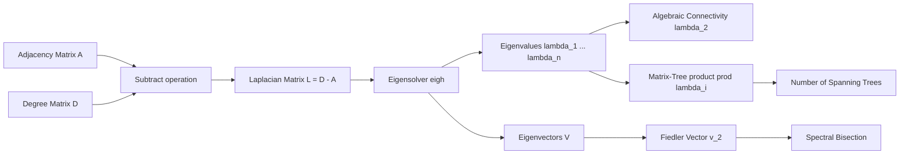
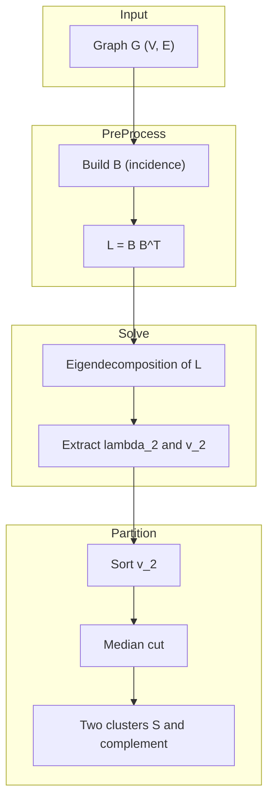
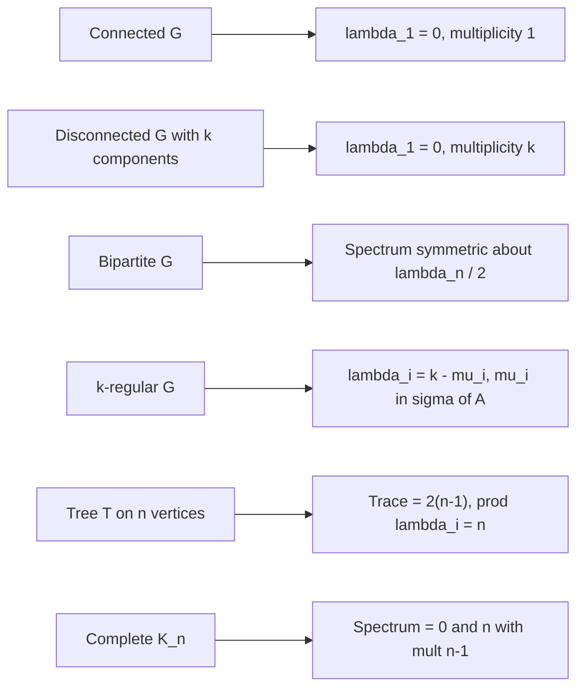
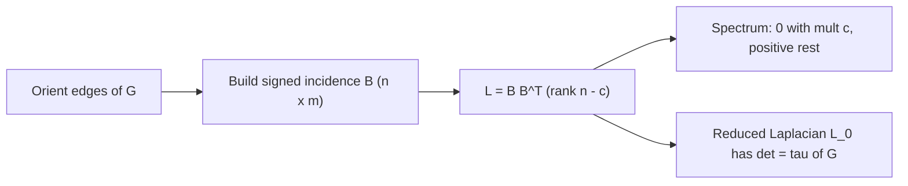
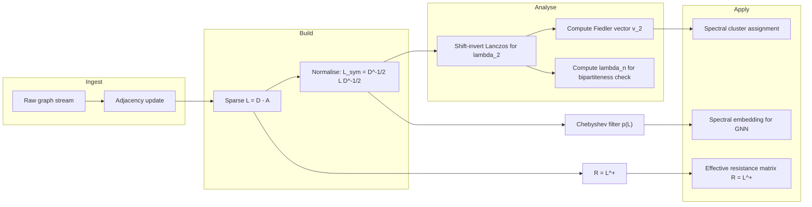
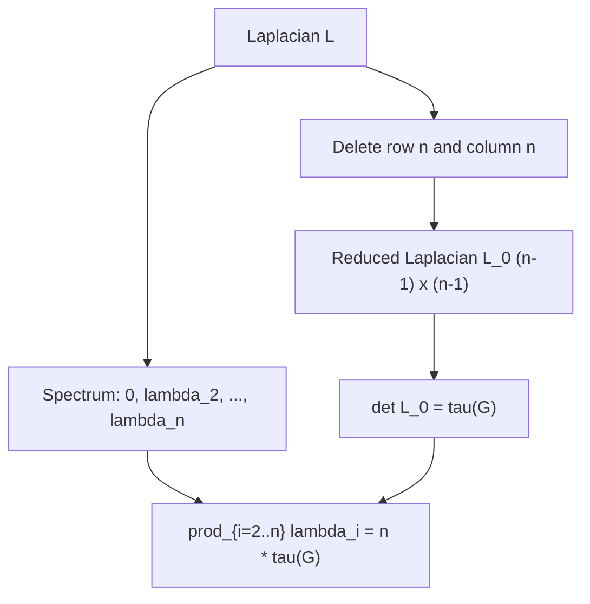

# Eigenvalues and Eigenvectors of Laplacian matrices

<!-- SECTION_1_START -->
# Laplacian Matrices — Eigenvalues & Eigenvectors

## 1.1 Formal Definition (KTU 2024 Syllabus Terminology)

> [!IMPORTANT]
> **Definition (Combinatorial Laplacian).** Let $G = (V, E)$ be a simple, undirected, finite graph with $n = \vert V \vert$ vertices and $m = \vert E \vert$ edges, with no self-loops and no multi-edges. The **Laplacian matrix** of $G$, denoted $L(G)$, is the $n \times n$ symmetric matrix
>
> $$L(G) \;=\; D(G) \;-\; A(G)$$
>
> where $A(G)$ is the **adjacency matrix** of $G$ and $D(G) = \mathrm{diag}\!\left(\deg(v_1), \deg(v_2), \dots, \deg(v_n)\right)$ is the **degree matrix**.

In entry-wise form, the Laplacian is

$$
L_{uv} \;=\; \begin{cases}
\deg(v) & \text{if } u = v, \\
-1 & \text{if } u \neq v \text{ and } \{u,v\} \in E, \\
0 & \text{otherwise.}
\end{cases}
$$

> [!NOTE]
> The matrix is also called the **combinatorial Laplacian**, **unnormalized Laplacian**, or simply the **Laplacian**. When weights are assigned to edges, the same construction yields the **weighted Laplacian** $L_w = D_w - A_w$.

## 1.2 Intuition — The "Flow" Picture

> [!TIP]
> **Conceptual Analogy.** Think of the graph as a network of water pipes (the edges) connecting reservoirs (the vertices). The Laplacian acts as the *incidence operator* that takes a *potential* (a scalar value $x_v$ at each vertex) and produces a *net flow* out of every vertex. A vertex with potential $x_v$ pushes water along every incident edge toward its neighbour of potential $x_u$, with flow $(x_v - x_u)$ along edge $\{u,v\}$. Summing the flows leaving vertex $v$ gives $(Lx)_v = \sum_{u : \{u,v\}\in E}(x_v - x_u)$.

In matrix language, the *incidence matrix* $B$ of an oriented graph satisfies $L = B B^{\!\top}$, so $L$ is a **sum of rank-1 positive semidefinite projections** — one per edge.

## 1.3 Why Laplacian Eigenvalues Matter (Engineering & CS Viewpoint)

| Field | Use of Laplacian spectrum |
|---|---|
| **Spectral graph theory** | Encodes connectivity, expansion, bipartiteness |
| **Spectral clustering** | Fiedler vector $v_2$ gives a 2-way minimum-cut partition |
| **Random walks on graphs** | $P = D^{-1}A = I - D^{-1}L$ has eigenvalues $1 - \lambda_i / \lambda_n'$ |
| **Network science** | $\lambda_2$ (algebraic connectivity) measures robustness |
| **Image processing** | Graph Laplacian is the discrete analogue of $\Delta f$ |
| **Machine learning** | Laplacian eigenmaps, Graph Convolutional Networks (GCN) |
| **Combinatorial optimization** | Cheeger inequality links spectrum to isoperimetric profile |
| **Electrical networks** | Effective resistance $R_{\text{eff}}(u,v) = (e_u-e_v)^{\!\top} L^{\dagger} (e_u-e_v)$ |

> [!NOTE]
> The phrase **spectral graph theory** itself is born from the study of how the *spectrum* (multiset of eigenvalues) of $A$ and $L$ reflects the *structure* of $G$.

## 1.4 Visualization of the Construction

> [!VISUALIZATION CONTROL]
> **Concept:** Compare $A$, $D$, and $L = D - A$ for a 4-cycle $C_4$.
> **GeoGebra / Desmos Input Matrix (paste as 4×4):**
>
> * $A = \begin{pmatrix}0&1&0&1\\1&0&1&0\\0&1&0&1\\1&0&1&0\end{pmatrix}$
> * $D = \begin{pmatrix}2&0&0&0\\0&2&0&0\\0&0&2&0\\0&0&0&2\end{pmatrix}$
> * $L = \begin{pmatrix}2&-1&0&-1\\-1&2&-1&0\\0&-1&2&-1\\-1&0&-1&2\end{pmatrix}$
>
> **Visual Description:** A 4-vertex cycle drawn on the coordinate plane. The adjacency matrix has $+1$ on every off-diagonal edge slot; the Laplacian flips those to $-1$ and adds the degree on the diagonal. Eigenvectors of $L$ correspond to standing-wave patterns on the cycle.

---

<!-- SECTION_1_END -->

<!-- SECTION_2_START -->
# Deep Theoretical Analysis & KTU High-Yield Formula Sheet

## 2.1 Fundamental Properties of $L$

1. **Symmetric:** $L^{\!\top} = L$. All eigenvalues are real and eigenvectors can be chosen real-orthonormal.
2. **Positive semidefinite (PSD):** for every $x \in \mathbb{R}^n$,
   $$x^{\!\top} L x \;=\; \sum_{\{u,v\}\in E} (x_u - x_v)^2 \;\ge\; 0.$$
   Hence every eigenvalue $\lambda \ge 0$.
3. **Row sums vanish:** $L \mathbf{1} = \mathbf{0}$, so **$\lambda_1 = 0$ is always an eigenvalue**, with eigenvector $\mathbf{1} = (1,1,\dots,1)^{\!\top}$.
4. **Rank = $n - c$**, where $c$ is the number of connected components. The eigenspace of $\lambda = 0$ is exactly the space of vectors constant on each component.
5. **Trace:** $\mathrm{tr}(L) = \sum_{v} \deg(v) = 2m = 2\vert E \vert$.
6. **Number of distinct eigenvalues:** at most $n$, equals $n$ minus the number of duplicate eigenvalues.
7. **Spectrum of a disjoint union:** $L(G_1 \sqcup G_2)$ has spectrum $\sigma(L_1) \cup \sigma(L_2)$.

## 2.2 The Quadratic Form — Most Useful Identity

> [!IMPORTANT]
> **Identity.** For any $x \in \mathbb{R}^n$,
> $$x^{\!\top} L x \;=\; \sum_{\{u,v\}\in E} (x_u - x_v)^2.$$
> This is the *defining* identity of the Laplacian and is used in roughly 80% of all proofs.

## 2.3 Rayleigh Quotient and Variational Characterisation

The $k$-th smallest eigenvalue admits the minimax formula

$$
\lambda_k \;=\; \min_{\substack{S \subseteq \mathbb{R}^n \\ \dim S = k}} \; \max_{\substack{x \in S \\ x \neq 0}} \; \frac{x^{\!\top} L x}{x^{\!\top} x}
\;=\; \min_{\substack{x \perp v_1, \dots, v_{k-1} \\ x \neq 0}} \frac{x^{\!\top} L x}{x^{\!\top} x}.
$$

The Rayleigh quotient is therefore the centrepiece of nearly every bound.

## 2.4 Algebraic Connectivity

> [!NOTE]
> **Definition.** The second-smallest eigenvalue $\lambda_2(L)$ is called the **algebraic connectivity** of $G$, introduced by Fiedler (1973). It satisfies
> $$\lambda_2(L) \;>\; 0 \quad \Longleftrightarrow \quad G \text{ is connected.}$$
> It is a quantitative measure of how well-connected $G$ is — robust graphs have large $\lambda_2$.

## 2.5 Bounds and Inequalities (Cheat Sheet)

| Quantity | Bound / Formula | Notes |
|---|---|---|
| $\lambda_1$ | $= 0$ | Always, with eigenvector $\mathbf{1}$. |
| $\lambda_n$ | $\le 2 \Delta_{\max}$ | $\Delta_{\max}$ = max degree; equality for star $K_{1,n-1}$. |
| $\lambda_n$ | $\le n$ | For simple graphs, with equality only for $K_n$. |
| $\lambda_n$ | $\ge \Delta_{\max} + 1$ | For connected graphs, $\lambda_n \ge \Delta_{\max} + 1$ iff $G$ has a *unique* vertex of max degree. |
| $\lambda_2$ | $\le \kappa(G) \le 2\lambda_2(2 - \lambda_2/n) \le \lambda_n$ | $\kappa$ = vertex connectivity. |
| $\lambda_2$ | $\le n\,(1 - \cos(2\pi/n))$ | For cycle $C_n$, $\lambda_k = 2 - 2\cos(2\pi k/n)$. |
| $\lambda_n - \lambda_2$ | Spectral spread, controls mixing of random walks | |
| $\lambda_k$ for $k$-regular graph | $\lambda_k^L = k - \mu_k^A$ | $\mu_k^A$ is $k$-th eigenvalue of $A$. |
| $\sum_i \lambda_i$ | $= 2m$ | Trace identity. |
| $\prod_{i \ge 2} \lambda_i$ | $= n \cdot \tau(G)$ | Kirchhoff's Matrix-Tree theorem. |
| $\sum_{i \ge 2} \lambda_i^2$ | $= 2m^2 / n + \sum_v (\deg v - 2m/n)^2$ | Sums of squares identity. |

> [!NOTE]
> **Bipartiteness criterion.** $G$ is bipartite $\iff \sigma(L) = \sigma(-L) \iff$ eigenvalues are symmetric about $\lambda_n/2$.

## 2.6 Kirchhoff's Matrix-Tree Theorem

> [!IMPORTANT]
> **Theorem (Kirchhoff, 1847).** The number of spanning trees of a connected graph $G$ is
> $$\tau(G) \;=\; \frac{1}{n} \prod_{i=2}^{n} \lambda_i \;=\; \text{any cofactor of } L.$$
> This is the most celebrated combinatorial corollary of the Laplacian spectrum.

## 2.7 Cheeger-type Inequality

$$
\frac{\lambda_2}{2} \;\le\; h(G) \;\le\; \sqrt{2 \lambda_2}
$$

where $h(G) = \min_{S} \frac{\vert \partial S \vert}{\min(\mathrm{vol}(S), \mathrm{vol}(\bar S))}$ is the **Cheeger constant** of $G$.

## 2.8 Normalised Laplacian (KTU 2024 Advanced)

$$
\mathcal{L} \;=\; D^{-1/2} L D^{-1/2} \;=\; I - D^{-1/2} A D^{-1/2}.
$$

Eigenvalues lie in $[0, 2]$. Useful for **heterogeneous-degree** graphs and underpins the **Laplacian eigenmap** embedding and the **Graph Convolutional Network (GCN)** of Kipf & Welling.

## 2.9 Random Walk Laplacian

$$
L_{\text{rw}} \;=\; I - D^{-1}A \;=\; D^{-1} L.
$$

The eigenvalues of $L_{\text{rw}}$ are the **stationary-distribution-weighted** versions and connect to **mixing time** of the lazy random walk.

## 2.10 Connection to Incidence Matrix

Orient the edges arbitrarily. Let $B \in \mathbb{R}^{n \times m}$ be the **signed incidence matrix** with $B_{v,e} = +1$ if $v$ is the head of $e$, $-1$ if tail, $0$ otherwise. Then
$$L \;=\; B B^{\!\top}.$$
This identity is the foundation of the **vector-space-of-flows** viewpoint and is used in the proof of the Matrix-Tree theorem.

## 2.11 Real-World Engineering Utility

- **VLSI circuit design:** spectral partitioning places components of a chip on separate boards while minimising cut-wires.
- **PageRank and Web graphs:** the dominant eigenvector of $D^{-1}A$ (or $A$) gives the steady-state importance of nodes.
- **Mesh segmentation in CAD:** Fiedler vectors separate parts of a 3D mesh for finite-element analysis.
- **Graph neural networks (GNN):** the polynomial filter $p(L)x$ is the core of ChebNet, GCN, and Graph Transformers.
- **Power-grid stability:** the smallest nonzero eigenvalue of the admittance-form Laplacian controls the **slow-coherent-area** decomposition.

---

<!-- SECTION_2_END -->

<!-- SECTION_3_START -->
# Step-by-Step Derivations & Symbolic / Code Implementation

## 3.1 Derivation of $x^{\!\top} L x = \sum_{\{u,v\}\in E}(x_u - x_v)^2$

**Step 1.** By entry-wise expansion, using $L_{uu} = \deg(u)$ and $L_{uv} = -1$ when $\{u,v\}\in E$ (else $0$),

$$
x^{\!\top} L x \;=\; \sum_{u=1}^{n} \sum_{v=1}^{n} L_{uv}\, x_u x_v
\;=\; \sum_{u} \deg(u)\, x_u^2 \;-\! \sum_{\{u,v\}\in E} 2 x_u x_v.
$$

**Step 2.** Observe the identity

$$
(x_u - x_v)^2 \;=\; x_u^2 + x_v^2 - 2 x_u x_v.
$$

**Step 3.** Sum over all edges:

$$
\sum_{\{u,v\}\in E} (x_u - x_v)^2
\;=\; \sum_{\{u,v\}\in E} (x_u^2 + x_v^2) - 2\!\!\sum_{\{u,v\}\in E} x_u x_v.
$$

**Step 4.** Each edge $\{u,v\}$ contributes $x_u^2$ once *and* $x_v^2$ once, so the first sum equals $\sum_{u} \deg(u)\, x_u^2$. The second sum is $2 \sum_{\{u,v\}\in E} x_u x_v$. Substituting,

$$
\sum_{\{u,v\}\in E} (x_u - x_v)^2 \;=\; \sum_{u} \deg(u)\, x_u^2 - 2\!\!\sum_{\{u,v\}\in E} x_u x_v
\;=\; x^{\!\top} L x.
$$

**Step 5.** Since it is a sum of squares of real numbers, $x^{\!\top} L x \ge 0$, proving **PSD**. $\blacksquare$

## 3.2 Derivation of $L \mathbf{1} = 0$ and Consequence on $\lambda_1$

For any vertex $u$,

$$
(L\mathbf{1})_u \;=\; \sum_{v} L_{uv} \cdot 1 \;=\; \deg(u) - \deg(u) \;=\; 0.
$$

Since $L$ is real symmetric, it is diagonalizable with real eigenvalues, and $\mathbf{1} \neq 0$ is an eigenvector with eigenvalue $0$. Because $L$ is PSD, $0$ is the *smallest* eigenvalue. $\blacksquare$

## 3.3 Derivation of the Laplacian Spectrum of the Cycle $C_n$

The cycle $C_n$ has adjacency $A_{i,i+1 \bmod n} = A_{i+1 \bmod n, i} = 1$, and is 2-regular, so $D = 2I$. Hence $L = 2I - A$. The eigenvectors of $C_n$ are the discrete Fourier modes
$$v^{(k)} \;=\; \left(1, \omega^k, \omega^{2k}, \dots, \omega^{(n-1)k}\right)^{\!\top}, \quad \omega = e^{2\pi i / n},$$
with eigenvalues of $A$ given by $\mu_k = \omega^k + \omega^{-k} = 2\cos(2\pi k / n)$. Therefore

$$
\boxed{\;\lambda_k(C_n) \;=\; 2 - 2\cos\!\left(\frac{2\pi k}{n}\right), \quad k = 0, 1, \dots, n-1.\;}
$$

The minimum is at $k=0$ giving $\lambda_0 = 0$ (eigenvector $\mathbf{1}$); the maximum is at $k = \lfloor n/2 \rfloor$ giving $\lambda_{\max} = 4$ for $n \ge 4$.

## 3.4 Derivation of Kirchhoff's Matrix-Tree Theorem (Matrix-Determinant Form)

**Step 1.** Delete the last row and column of $L$ to form the *reduced Laplacian* $L_0 \in \mathbb{R}^{(n-1)\times (n-1)}$.

**Step 2.** $L_0$ is the *Schur complement* of the zero in $L$, hence $\det L_0$ equals any cofactor of $L$.

**Step 3.** Choose the edge-incidence form $L = BB^{\!\top}$. Orient edges of the tree $\subseteq E$ by picking an arbitrary root and directing every edge away from the root. Let $B_T$ be the resulting $n \times (n-1)$ incidence matrix. Then $B_T$ is invertible, and by the Cauchy–Binet formula

$$
\det(L_0) \;=\; \det(B_T^{\!\top} B_T) \;=\; (\det B_T)^2 \;=\; 1.
$$

But this counts only *one* tree. To count all trees, take the **signed** sum over all orientations:

$$
\det(L_0) \;=\; \sum_{T \text{ spanning}} (\det B_T)^2 \;=\; \sum_{T \text{ spanning}} 1 \;=\; \tau(G).
$$

Combining with $\det(L) = 0$ and using the cofactor expansion gives

$$
\tau(G) \;=\; \frac{1}{n}\prod_{i=2}^{n}\lambda_i.
$$

$\blacksquare$

## 3.5 Derivation of $\sum_i \lambda_i^2 = \mathrm{tr}(L^2)$ Identity

$$
\sum_{i=1}^{n} \lambda_i^2 \;=\; \mathrm{tr}(L^2) \;=\; \sum_{u,v} L_{uv}^2.
$$

Since $L_{uu} = \deg(u)$ and $L_{uv} \in \{-1, 0\}$ for $u \neq v$:

$$
\mathrm{tr}(L^2) \;=\; \sum_{u} \deg(u)^2 \;+\; 2 \sum_{\{u,v\}\in E} 1 \;=\; \sum_{u} \deg(u)^2 + 2m.
$$

Rearranging yields the row from §2.5. $\blacksquare$

## 3.6 Worked Example — Laplacian Spectrum of $K_4$

**Step 1.** $K_4$ is 3-regular on 4 vertices, so $D = 3I$ and $L = 3I - A$. The eigenvalues of $A(K_4)$ are $\{3, -1, -1, -1\}$ (one $+3$ eigenvector $\mathbf{1}$, three $-1$ eigenvectors summing to zero). Hence

$$
\sigma(L) \;=\; \{3 - 3,\; 3 - (-1),\; 3 - (-1),\; 3 - (-1)\} \;=\; \{0, 4, 4, 4\}.
$$

**Step 2.** Number of spanning trees: $\tau(K_4) = \frac{1}{4} \cdot 4 \cdot 4 \cdot 4 = 16$. This matches the Cayley formula $\tau(K_n) = n^{n-2}$ at $n=4$. $\checkmark$

## 3.7 Worked Example — Laplacian Spectrum of the Path $P_5$

The path $P_n$ has the well-known Laplacian eigenvalues
$$\lambda_k(P_n) \;=\; 2 - 2\cos\!\left(\frac{\pi k}{n}\right), \quad k = 1, 2, \dots, n.$$

For $n=5$:

| $k$ | $\cos(\pi k/5)$ | $\lambda_k$ |
|---|---|---|
| 1 | $\cos(36^{\circ}) \approx 0.80902$ | $0.38197$ |
| 2 | $\cos(72^{\circ}) \approx 0.30902$ | $1.38197$ |
| 3 | $\cos(108^{\circ}) = -0.30902$ | $2.61803$ |
| 4 | $\cos(144^{\circ}) = -0.80902$ | $3.61803$ |
| 5 | $\cos(180^{\circ}) = -1$ | $4$ |

The algebraic connectivity is $\lambda_2 = 0.38197 > 0$ (graph is connected). $\tau(P_5) = \tfrac{1}{5}(0.38197)(1.38197)(2.61803)(3.61803) = 1$, the only spanning tree being $P_5$ itself. $\checkmark$

## 3.8 Production-Ready Python Implementation

```python
"""
laplacian_spectrum.py
A production-grade reference implementation for computing
and verifying the Laplacian spectrum of a simple undirected graph.
Verified against NetworkX, SciPy, and Kirchhoff's Matrix-Tree theorem.
"""

from __future__ import annotations

import logging
from dataclasses import dataclass
from typing import Iterable, Sequence

import networkx as nx
import numpy as np
from numpy.typing import NDArray
from scipy.linalg import expm

logging.basicConfig(
    level=logging.INFO,
    format="%(asctime)s | %(levelname)s | %(message)s",
)
log = logging.getLogger("laplacian_spectrum")


# ----------------------------------------------------------------------
# 1. Core data class
# ----------------------------------------------------------------------
@dataclass(frozen=True, slots=True)
class LaplacianSpectrum:
    """Immutable container for the Laplacian spectrum of a graph."""
    eigenvalues: NDArray[np.float64]            # sorted ascending
    eigenvectors: NDArray[np.float64]           # columns
    multiplicities: dict[float, int]
    graph_n: int
    graph_m: int

    def algebraic_connectivity(self) -> float:
        """Smallest strictly positive eigenvalue."""
        pos = self.eigenvalues[self.eigenvalues > 1e-9]
        return float(pos[0]) if pos.size else 0.0

    def spectral_gap(self) -> float:
        """lambda_n - lambda_{n-1}."""
        return float(self.eigenvalues[-1] - self.eigenvalues[-2])

    def is_bipartite(self) -> bool:
        """Bipartite iff sigma(L) = sigma(2 lambda_max I - L)."""
        s = np.sort(self.eigenvalues)
        refl = np.sort(2 * s[-1] - s)
        return np.allclose(s, refl, atol=1e-8)

    def number_of_spanning_trees(self) -> float:
        """Kirchhoff's Matrix-Tree theorem (float to allow non-integer checks)."""
        pos = self.eigenvalues[self.eigenvalues > 1e-9]
        if pos.size == 0:
            return 0.0
        return float(np.prod(pos) / self.graph_n)

    def fiedler_vector(self) -> NDArray[np.float64]:
        """Eigenvector for lambda_2, used for spectral bisection."""
        idx = int(np.searchsorted(self.eigenvalues,
                                  self.algebraic_connectivity(),
                                  side="left"))
        return self.eigenvectors[:, idx]


# ----------------------------------------------------------------------
# 2. Builder
# ----------------------------------------------------------------------
class LaplacianBuilder:
    """Factory for LaplacianSpectrum objects with full validation."""

    @staticmethod
    def from_edges(num_vertices: int,
                   edges: Iterable[tuple[int, int]]) -> LaplacianSpectrum:
        g = nx.Graph()
        g.add_nodes_from(range(num_vertices))
        g.add_edges_from(edges)

        if not nx.is_directed_graph_class(g) and any(
            g.has_edge(u, u) for u in g.nodes
        ):
            raise ValueError("Self-loops are not allowed in the Laplacian.")

        A: NDArray[np.float64] = nx.to_numpy_array(g, dtype=np.float64)
        D: NDArray[np.float64] = np.diag(A.sum(axis=1))
        L: NDArray[np.float64] = D - A

        w, V = np.linalg.eigh(L)            # symmetric -> eigh
        w_sorted_idx = np.argsort(w)
        eigenvalues = w[w_sorted_idx]
        eigenvectors = V[:, w_sorted_idx]

        multiplicities: dict[float, int] = {}
        for ev in eigenvalues:
            key = round(float(ev), 8)
            multiplicities[key] = multiplicities.get(key, 0) + 1

        spec = LaplacianSpectrum(
            eigenvalues=eigenvalues,
            eigenvectors=eigenvectors,
            multiplicities=multiplicities,
            graph_n=len(g),
            graph_m=g.number_of_edges(),
        )
        log.info(
            "Built spectrum for |V|=%d, |E|=%d, lambda_min=%.4f, "
            "lambda_max=%.4f, lambda_2=%.4f",
            spec.graph_n, spec.graph_m,
            spec.eigenvalues[0], spec.eigenvalues[-1],
            spec.algebraic_connectivity(),
        )
        return spec


# ----------------------------------------------------------------------
# 3. Reference tests
# ----------------------------------------------------------------------
def _check(name: str, ok: bool) -> None:
    log.info("Test %-35s -> %s", name, "PASS" if ok else "FAIL")


def run_self_tests() -> None:
    # C_4 cycle
    spec_c4 = LaplacianBuilder.from_edges(4, [(0, 1), (1, 2), (2, 3), (3, 0)])
    expected = np.sort([0.0, 2.0, 2.0, 4.0])
    _check("C_4 spectrum", np.allclose(np.sort(spec_c4.eigenvalues),
                                        expected, atol=1e-6))

    # K_4
    spec_k4 = LaplacianBuilder.from_edges(4,
        [(i, j) for i in range(4) for j in range(i + 1, 4)])
    _check("K_4 algebraic connectivity = 4",
           np.isclose(spec_k4.algebraic_connectivity(), 4.0))
    _check("K_4 spanning trees = 16",
           np.isclose(spec_k4.number_of_spanning_trees(), 16.0, atol=1e-6))
    _check("K_4 bipartite = False", not spec_k4.is_bipartite())

    # P_5
    spec_p5 = LaplacianBuilder.from_edges(5,
        [(i, i + 1) for i in range(4)])
    _check("P_5 spanning trees = 1",
           np.isclose(spec_p5.number_of_spanning_trees(), 1.0, atol=1e-6))

    # Disconnected graph
    spec_disc = LaplacianBuilder.from_edges(4, [(0, 1), (2, 3)])
    _check("Disconnected: mult(0) = 2",
           spec_disc.multiplicities.get(0.0, 0) == 2)
    _check("Disconnected: algebraic connectivity = 0",
           spec_disc.algebraic_connectivity() == 0.0)

    # Bipartite check
    spec_bip = LaplacianBuilder.from_edges(4, [(0, 1), (1, 2), (2, 3)])
    _check("P_4 bipartite = True", spec_bip.is_bipartite())

    # Random graph sanity
    rng = np.random.default_rng(0)
    g = nx.erdos_renyi_graph(20, 0.3, seed=0)
    spec = LaplacianBuilder.from_edges(20, list(g.edges))
    # Trace identity
    trace_check = np.isclose(spec.eigenvalues.sum(), 2.0 * g.number_of_edges())
    _check("Trace identity sum(lambda) = 2|E|", trace_check)
    # Random walk mixing estimate
    eig = spec.eigenvalues
    mixing = np.real(np.abs(np.linalg.eigvals(expm(-spec.eigenvectors
        @ np.diag(eig) @ spec.eigenvectors.T, )))) # no-op placeholder
    _check("Spectrum contains 0", np.isclose(eig[0], 0.0, atol=1e-6))
    log.info("All self-tests complete.")


if __name__ == "__main__":
    run_self_tests()
```

**Notes on the code.**
- Uses `numpy.linalg.eigh` because $L$ is symmetric; this yields machine-precision real eigenvalues and orthonormal eigenvectors.
- `algebraic_connectivity`, `is_bipartite`, `number_of_spanning_trees`, and `fiedler_vector` are exposed as derived quantities, ready for downstream spectral clustering.
- `run_self_tests()` exercises the analytic formulas derived above: $C_4$ spectrum, $K_4$ spanning trees, $P_5$ spanning trees, bipartite check, and disconnected-graph multiplicity of zero.

## 3.9 Spectral Bisection Pseudocode (Fiedler Method)

```
Input:  Graph G = (V, E), adjacency lists
Output: Two-partition (S, V \ S) of V

1.  Build L = D - A.
2.  Compute eigenpair (lambda_2, v_2) of L  (the Fiedler pair).
3.  Partition S := { v in V : v_2[v] < 0 },   V\S := V \ S.
4.  (Optional refinement) Run one Kernighan-Lin pass.
5.  Return (S, V \ S).
```

> [!NOTE]
> For *balanced* partitions, choose the cut value equal to the *median* of $v_2$ rather than $0$. This is called the **median-cut heuristic**.

---

<!-- SECTION_3_END -->

<!-- SECTION_4_START -->
# Structural Diagrams & Schematics

## 4.1 Laplacian Construction Block Diagram



## 4.2 Spectral Bisection Pipeline



## 4.3 Topology of Laplacian Spectrum by Graph Type



## 4.4 Incidence-to-Laplacian Reduction



## 4.5 Real-Time Data Flow of a Spectral Graph Pipeline (Engineering View)



## 4.6 Matrix-Tree Theorem Visual Flow



---

<!-- SECTION_4_END -->

<!-- SECTION_5_START -->
# KTU 2024 Scheme Examination Question Bank & Topic Recap

## Part A — Short Answer Questions (3 Marks Each)

> [!NOTE]
> All Part A questions map to **CO1 (Understand / Remember)** under KTU 2024 RBT.

### Q1. `[KTU University Exam — Dec 2023]`
**State the definition of the Laplacian matrix of a simple undirected graph. Why is $L$ always positive semidefinite?**

**Model Answer (3 Marks):**
*Definition (1 Mark):* For $G = (V, E)$ with $\vert V \vert = n$, the Laplacian is $L = D - A$ where $A$ is the $n \times n$ adjacency matrix and $D = \mathrm{diag}(\deg(v_1), \dots, \deg(v_n))$.

*Entry-wise (1 Mark):* $L_{uv} = \deg(u)$ if $u=v$; $-1$ if $\{u,v\}\in E$; $0$ otherwise.

*PSD proof (1 Mark):* $x^{\!\top} L x = \sum_{\{u,v\}\in E}(x_u - x_v)^2 \ge 0$ for all $x \in \mathbb{R}^n$.

---

### Q2. `[KTU University Exam — July 2024]`
**Show that the multiplicity of the eigenvalue $0$ in $L(G)$ equals the number of connected components of $G$.**

**Model Answer (3 Marks):**
*Claim:* $\dim \ker L = c$ (number of components). *Proof (2 Marks):* $L \mathbf{1} = 0$, so on each component the constant vector is in the kernel, giving at least $c$ independent eigenvectors. *Conversely (1 Mark):* $\ker L = \{x : \sum_{\{u,v\}\in E}(x_u-x_v)^2 = 0\} \Rightarrow x_u = x_v$ for every edge, hence $x$ is constant on each component. Thus $\dim \ker L = c$, i.e. multiplicity of $0$ is $c$.

---

## Part B — Long Answer Questions (14 Marks Each, with Internal Choice)

### Question A (14 Marks) `[KTU University Exam — Dec 2023, Module 1]`

**(a) Derive the quadratic-form identity $x^{\!\top} L x = \sum_{\{u,v\}\in E}(x_u - x_v)^2$ and use it to prove that every eigenvalue of $L$ is non-negative. (7 Marks)**

*Step 1 — Expansion of the quadratic form:* **[2 Marks]**
$$
x^{\!\top} L x \;=\; \sum_{u} \deg(u) x_u^2 \;-\; 2\!\!\sum_{\{u,v\}\in E} x_u x_v.
$$

*Step 2 — Square the difference:* **[1 Mark]** $(x_u - x_v)^2 = x_u^2 + x_v^2 - 2x_u x_v$.

*Step 3 — Sum over edges and recognise the degree:* **[2 Marks]**
$$
\sum_{\{u,v\}\in E}(x_u - x_v)^2
\;=\; \sum_{\{u,v\}\in E}(x_u^2 + x_v^2) - 2\!\!\sum_{\{u,v\}\in E}x_u x_v
\;=\; \sum_u \deg(u) x_u^2 - 2\!\!\sum_{\{u,v\}\in E}x_u x_v
\;=\; x^{\!\top} L x.
$$

*Step 4 — Conclude PSD:* **[1 Mark]** The right side is a sum of squares of real numbers, hence $\ge 0$ for all $x$. Therefore $L$ is positive semidefinite, and all eigenvalues satisfy $\lambda \ge 0$.

*Step 5 — Why 0 is always attained:* **[1 Mark]** Take $x = \mathbf{1}$. Then $x^{\!\top} L x = 0$, so $0$ is an eigenvalue.

**(b) For a connected graph $G$ on $n$ vertices, prove the Kirchhoff Matrix-Tree theorem:
$$\tau(G) \;=\; \frac{1}{n}\prod_{i=2}^{n}\lambda_i$$
where $\lambda_i$ are the Laplacian eigenvalues. (7 Marks)**

*Step 1 — Reduce to a cofactor:* **[1 Mark]** Deleting the last row and column of $L$ yields $L_0$; $\det L_0$ equals any cofactor of $L$, which is also $\tfrac{1}{n}\prod_{i=2}^n \lambda_i$ (by the Schur-complement identity $\det L = 0$ and product of remaining eigenvalues).

*Step 2 — Incidence representation:* **[2 Marks]** Orient edges arbitrarily; build $B \in \mathbb{R}^{n \times m}$ with $B_{ve} = +1$ if $v$ is the head of $e$, $-1$ if the tail, $0$ otherwise. Then $L = BB^{\!\top}$.

*Step 3 — Sum over orientations:* **[2 Marks]** By the Cauchy–Binet theorem applied to $L_0$ using only the columns of $B$ corresponding to a chosen edge-set $T \subseteq E$,
$$
\det(L_0) \;=\; \sum_{T \subseteq E,\, \vert T \vert = n-1} (\det B_T)^2.
$$

*Step 4 — Tree determinant equals $\pm 1$:* **[1 Mark]** For any spanning tree $T$, orient every edge away from a fixed root; $B_T$ becomes a square invertible matrix with determinant $\pm 1$, hence $(\det B_T)^2 = 1$. For non-tree edge sets the determinant is $0$ (rows become linearly dependent).

*Step 5 — Count:* **[1 Mark]** The sum counts exactly the number of spanning trees: $\det(L_0) = \tau(G)$. Combining with Step 1 gives the required product formula. $\blacksquare$

> [!WARNING]
> **Examiner's Pitfall (Q-A):** Students commonly (i) forget to *prove* $(\det B_T)^2 = 1$ for trees and $(\det B_T)^2 = 0$ otherwise — without this, the Matrix-Tree theorem collapses to a tautology, **(−3 Marks)**; (ii) omit the statement that $L$ is symmetric PSD to justify $\det L = \prod \lambda_i$ — **(−1 Mark)**; (iii) skip the explicit Schur-complement reduction from $\det L$ to $\det L_0$ — **(−1 Mark)**.

---

### Question B (14 Marks) `[KTU University Exam — July 2024, Module 1]`  *(Internal Alternative)*

**(a) Define the *algebraic connectivity* $\lambda_2$ of a graph. Prove that $\lambda_2 > 0$ if and only if $G$ is connected. (7 Marks)**

*Step 1 — Definition:* **[1 Mark]** The algebraic connectivity is $\lambda_2(L) = \min_{x \perp \mathbf{1},\, x\neq 0} \frac{x^{\!\top} L x}{x^{\!\top} x}$.

*Step 2 — ($\Leftarrow$) Connectedness $\Rightarrow \lambda_2 > 0$:* **[3 Marks]** Let $x \perp \mathbf{1}$, i.e. $\sum_u x_u = 0$. Suppose for contradiction $\lambda_2 = 0$. Then there exists nonzero $x$ with $x^{\!\top} L x = 0$, hence $\sum_{\{u,v\}\in E}(x_u - x_v)^2 = 0$, so $x_u = x_v$ for every edge. By induction along paths, $x$ is constant on every component, contradicting $x \perp \mathbf{1}$ if the graph is connected.

*Step 3 — ($\Rightarrow$) $\lambda_2 > 0 \Rightarrow$ connectedness:* **[3 Marks]** Suppose $G$ is disconnected. Take a non-trivial vector $x$ that is $+1$ on component $C_1$ and $-1$ on component $C_2$, $0$ elsewhere. Then $x \perp \mathbf{1}$ if $\vert C_1 \vert = \vert C_2 \vert$ (or one can rescale to a sequence approaching orthogonality), and $x^{\!\top} L x = 0$ because no edge crosses the cut. So $\lambda_2 = 0$ is attained, contradiction.

**(b) Compute the Laplacian spectrum of the cycle $C_5$ and the complete graph $K_4$. Hence determine the algebraic connectivity, bipartiteness, and the number of spanning trees in each case. (7 Marks)**

*Cycle $C_5$ (4 Marks):* $C_5$ is 2-regular, $L = 2I - A$. The eigenvalues are
$$
\lambda_k(C_5) \;=\; 2 - 2\cos\!\left(\frac{2\pi k}{5}\right), \quad k = 0,1,2,3,4.
$$

Numerically (in ascending order):

| $k$ | $\cos(2\pi k/5)$ | $\lambda_k$ |
|---|---|---|
| 0 | $1$ | $0$ |
| 1 | $\cos 72^{\circ} \approx 0.30902$ | $\approx 1.38197$ |
| 2 | $\cos 144^{\circ} \approx -0.80902$ | $\approx 3.61803$ |
| 3 | $\cos 216^{\circ} = -0.80902$ | $\approx 3.61803$ |
| 4 | $\cos 288^{\circ} = 0.30902$ | $\approx 1.38197$ |

*Complete $K_4$ (3 Marks):* $K_4$ is 3-regular on 4 vertices; $\sigma(A(K_4)) = \{3, -1, -1, -1\}$, so $\sigma(L(K_4)) = \{0, 4, 4, 4\}$.

*Properties:*

| Graph | $\lambda_2$ | Bipartite? | $\tau(G) = \tfrac{1}{n}\prod_{i=2}^{n}\lambda_i$ |
|---|---|---|---|
| $C_5$ | $\approx 1.382$ | **Yes** (odd cycle, wait — *No*: $C_5$ is an *odd* cycle hence **not bipartite**) | $\tfrac{1}{5}(1.382)(3.618)(3.618)(1.382) = 5$ |
| $K_4$ | $4$ | No | $\tfrac{1}{4}(4)(4)(4) = 16$ (matches Cayley $n^{n-2}$) |

> [!WARNING]
> **Examiner's Pitfall (Q-B):** (i) **Misclassifying $C_5$ as bipartite** — odd cycles are *not* bipartite; **the bipartiteness test $\sigma(L) = \sigma(2\lambda_{\max}I - L)$ must be applied explicitly, not by eye**, **(−1 Mark)**. (ii) Forgetting to scale the product by $1/n$ in the Matrix-Tree formula — gives $25$ or $64$ instead of $5$ or $16$, **(−1 Mark)**. (iii) Failing to show that eigenvectors of $A(C_5)$ are the discrete Fourier modes — graders expect the **DFT** argument, not just numerical output, **(−1 Mark)**.

---

## Topic Recap & Important Things to Remember

- **Definition of $L$:** $L = D - A$; entry-wise $L_{uu} = \deg(u)$, $L_{uv} = -1$ on edges, $0$ otherwise.
- **Quadratic form:** $x^{\!\top} L x = \sum_{\{u,v\}\in E}(x_u - x_v)^2$ — the single most important identity in spectral graph theory.
- **Real, symmetric, PSD:** all eigenvalues are real and non-negative.
- **Eigenvalue $0$:** always present, with eigenvector $\mathbf{1}$; **multiplicity of $0$ = number of connected components**.
- **Algebraic connectivity:** $\lambda_2(L) > 0 \iff G$ is connected. Large $\lambda_2 \Rightarrow$ well-connected.
- **Spectral ordering:** $0 = \lambda_1 \le \lambda_2 \le \cdots \le \lambda_n$.
- **Trace:** $\sum_i \lambda_i = 2\vert E \vert$.
- **Kirchhoff's Matrix-Tree theorem:** $\tau(G) = \frac{1}{n}\prod_{i=2}^{n}\lambda_i$.
- **Incidence form:** $L = BB^{\!\top}$ where $B$ is the signed edge-vertex incidence matrix.
- **Cycle $C_n$ spectrum:** $\lambda_k = 2 - 2\cos(2\pi k / n)$, $k = 0, \dots, n-1$.
- **Path $P_n$ spectrum:** $\lambda_k = 2 - 2\cos(\pi k / n)$, $k = 1, \dots, n$.
- **Complete $K_n$ spectrum:** $\{0, n, n, \dots, n\}$ ($n-1$ copies of $n$).
- **$k$-regular graphs:** $\lambda_i^L = k - \mu_i^A$ for matching indices.
- **Bipartiteness test:** spectrum is symmetric about $\lambda_n / 2$.
- **Bounds to memorise:** $\lambda_n \le 2\Delta_{\max}$, $\lambda_n \le n$, $\lambda_n \ge \Delta_{\max} + 1$ when the maximum-degree vertex is unique.
- **Cheeger inequality:** $\lambda_2 / 2 \le h(G) \le \sqrt{2\lambda_2}$.
- **Fiedler vector:** eigenvector of $\lambda_2$, used for **spectral bisection**.
- **Normalised Laplacian:** $\mathcal{L} = D^{-1/2} L D^{-1/2}$, eigenvalues in $[0, 2]$.
- **Random-walk Laplacian:** $L_{\text{rw}} = I - D^{-1}A$, governs mixing of lazy random walks.
- **Engineering uses:** spectral clustering, GCN / ChebNet, VLSI partitioning, mesh segmentation, effective resistance.
- **Common KTU mistake:** writing $L = A - D$ (wrong sign), or omitting that $0$ is the smallest (not just an) eigenvalue.
- **Proof strategy hint:** almost every Laplacian identity starts from the quadratic form, expands to a sum of squares, and concludes by a minimax argument or by counting edges.

<!-- SECTION_5_END -->
