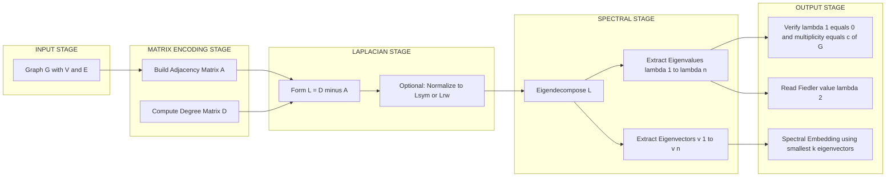
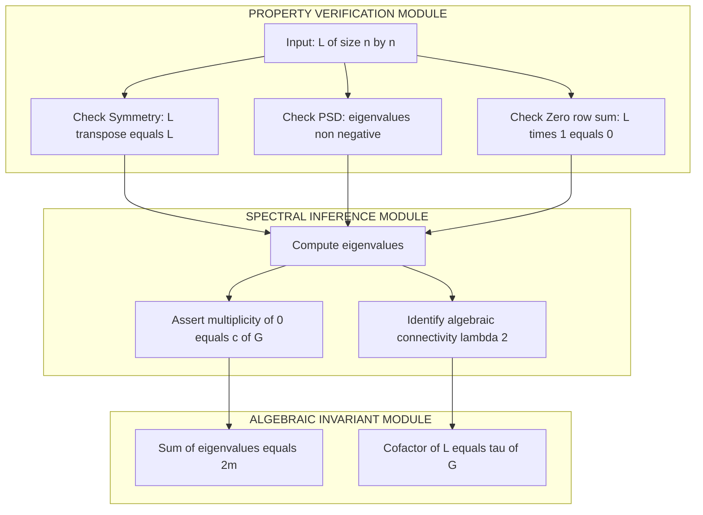
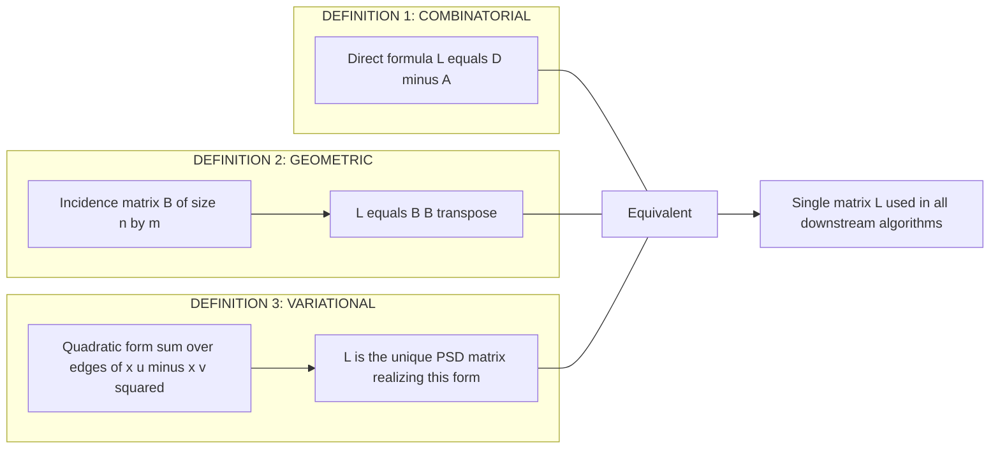

# Graph Laplacians: Definition and Properties

<!-- SECTION_1_START -->
# Graph Laplacians: Definition and Properties

## 1.1 Formal Academic Definition

Let $G = (V, E)$ be a simple, undirected, finite graph with $n = \vert V \vert$ vertices and $m = \vert E \vert$ edges. Let $A \in \mathbb{R}^{n \times n}$ denote the **adjacency matrix** of $G$ and $D \in \mathbb{R}^{n \times n}$ denote the **degree matrix** (diagonal with $D_{ii} = \deg(v_i)$). The **(combinatorial) graph Laplacian** of $G$ is the symmetric matrix

$$
L \;=\; D \;-\; A
$$

Two normalized variants are also central to spectral graph theory:

$$
L_{\text{sym}} \;=\; D^{+1/2} L \, D^{+1/2} \;=\; I \;-\; D^{-1/2} A D^{-1/2}
$$

$$
L_{\text{rw}} \;=\; D^{-1} L \;=\; I \;-\; D^{-1} A
$$

where $D^{+1/2}$ is the Moore–Penrose pseudoinverse (replacing zero diagonal entries with zero), and $D^{-1}$ is taken only on vertices of positive degree. The eigenvalues of $L$ (in the context of spectral graph theory) are called the **Laplacian spectrum** of $G$.

> [!IMPORTANT]
> **Syllabus Highlight (KTU PECST795, Module 1):** The *combinatorial* Laplacian $L = D - A$ is the central object. Normalized variants are introduced for completeness and used in random-walk analyses, but $L$ dominates the exam.

## 1.2 Intuitive Overview — Three Real-World Analogies

| Analogy | Mental Picture |
|---|---|
| **Spring Network (mechanical)** | Place one mass on every vertex. Replace every edge $\{u,v\}$ by a unit spring. Then $L$ is the *stiffness matrix* describing how the system resists deformations of the masses. |
| **Electrical Network (resistor graph)** | Set every edge to a 1-ohm resistor and apply a voltage $x_i$ at vertex $i$. The vector of net currents leaving each vertex is exactly $Lx$. |
| **Acoustic / Drumhead (vibrational)** | The Laplacian plays the role of the discrete Laplacian operator $\Delta$. Its eigenvectors are the *modes* of vibration, and the smallest nonzero frequency is the pitch of the drum. |

> [!NOTE]
> **Why this matters in CS:** Graph Laplacians unify *cuts*, *flows*, *random walks*, *clustering* (spectral clustering uses the Fiedler vector), *image segmentation*, *PageRank*, and *Markov chain mixing times*. In every case, the algebraic structure of $L$ encodes the combinatorial structure of $G$.

## 1.3 Worked Toy Example (Carried Throughout)

Let $K_3$ be the triangle on vertices $\{1, 2, 3\}$. Then $A = \begin{pmatrix} 0 & 1 & 1 \\ 1 & 0 & 1 \\ 1 & 1 & 0 \end{pmatrix}$ and $D = 2I$. Hence

$$
L(K_3) \;=\; D - A \;=\; \begin{pmatrix} 2 & -1 & -1 \\ -1 & 2 & -1 \\ -1 & -1 & 2 \end{pmatrix}
$$

We will reuse this graph for every formula in the rest of the notes.

> [!VISUALIZATION CONTROL]
> **Concept:** Bipartite check via second-smallest Laplacian eigenvalue
> **GeoGebra / Desmos Input Equations:**
> * Matrix $L(K_3) = [[2,-1,-1],[-1,2,-1],[-1,-1,2]]$, characteristic polynomial $\lambda^3 - 6\lambda^2 + 9\lambda = \lambda(\lambda-3)^2$.
> **Visual Description:** Plot the eigenvalues $\{0, 3, 3\}$ on the real axis. Note that the *multiplicity* of $0$ equals the number of connected components, and the second-smallest eigenvalue (the **algebraic connectivity** $\lambda_2$, here $3$) measures how well the graph is connected.

<!-- SECTION_1_END -->

<!-- SECTION_2_START -->
# Deep Theoretical Analysis & KTU High-Yield Formula Sheet

## 2.1 Structural Properties of $L$

Let $L$ be the combinatorial Laplacian of a graph $G$ on $n$ vertices. We list the board-essential properties (each is a **2–3 mark recall** item).

* **(P1) Symmetric.** $L^T = L$, so $L$ is *diagonalizable* by an *orthonormal* eigenbasis.
* **(P2) Positive Semi-Definite (PSD).** $L \succeq 0$, i.e., every eigenvalue satisfies $\lambda_i \geq 0$.
* **(P3) Zero Row-Sum.** $L \mathbf{1} = \mathbf{0}$, where $\mathbf{1} = (1, 1, \dots, 1)^T$. Hence $\mathbf{1}$ is an eigenvector with eigenvalue $0$.
* **(P4) Multiplicity of Zero.** $\mathrm{mult}_L(0) \;=\; c(G)$, the number of connected components of $G$.
* **(P5) Quadratic Form.** For any $x \in \mathbb{R}^n$,
$$
x^T L x \;=\; \sum_{\{u,v\} \in E} (x_u - x_v)^2
$$
* **(P6) Rayleigh Quotient.**
$$
\min_{x \perp \mathbf{1}, \, x \ne 0} \frac{x^T L x}{x^T x} \;=\; \lambda_2
$$
* **(P7) All Ones Vector is the Minimizer of the Zero Mode.** Any constant vector $c \cdot \mathbf{1}$ satisfies $L(c \mathbf{1}) = \mathbf{0}$, and the orthogonal complement captures the "interesting" modes.
* **(P8) Kirchhoff's Matrix-Tree Theorem.** Every cofactor $\kappa_{ij}(L)$ equals the number of spanning trees $\tau(G)$.
* **(P9) Sum of Eigenvalues = Trace.** $\sum_{i=1}^{n} \lambda_i \;=\; \mathrm{tr}(L) \;=\; \sum_{i=1}^{n} \deg(v_i) \;=\; 2m$.
* **(P10) Sub-additivity under Edge Deletion.** Removing an edge does not increase any Laplacian eigenvalue.

> [!TIP]
> **Mnemonic for the Board:** "SPSD on $\mathbf{1}$" — *Symmetric, Positive Semi-Definite, orthogonal to constant on null space*.

## 2.2 The Laplacian Quadratic Form — The Most Tested Identity

Starting from the definition $L = D - A$:

$$
x^T L x \;=\; x^T D x - x^T A x \;=\; \sum_{i=1}^{n} \deg(v_i) \, x_i^2 - 2 \sum_{\{u,v\} \in E} x_u x_v
$$

Using $\deg(v_i) = \sum_{j : \{i,j\} \in E} 1$ and regrouping:

$$
x^T L x \;=\; \sum_{\{u,v\} \in E} \big( x_u^2 + x_v^2 - 2 x_u x_v \big) \;=\; \sum_{\{u,v\} \in E} (x_u - x_v)^2
$$

This is the identity the examiner will look for in any "show that" or "derive" question.

## 2.3 Algebraic Connectivity (Fiedler, 1973)

The second-smallest eigenvalue $\lambda_2(L)$ is called the **algebraic connectivity** $a(G)$. It satisfies

$$
a(G) \;\leq\; \kappa(G) \;\leq\; a(G) \cdot \mathrm{diam}(G)
$$

where $\kappa(G)$ is the (vertex) connectivity and $\mathrm{diam}(G)$ is the diameter. The associated eigenvector $v_2$, the **Fiedler vector**, is the foundation of *spectral partitioning*: its sign pattern gives a $2$-way graph cut.

## 2.4 KTU Formula Sheet

| Symbol | Meaning | Standard Form |
|---|---|---|
| $L$ | Combinatorial Laplacian | $L = D - A$ |
| $L_{\text{sym}}$ | Symmetric normalized Laplacian | $I - D^{-1/2} A D^{-1/2}$ |
| $L_{\text{rw}}$ | Random-walk normalized Laplacian | $I - D^{-1} A$ |
| $x^T L x$ | Quadratic form | $\sum_{\{u,v\}\in E} (x_u - x_v)^2$ |
| $L \mathbf{1}$ | Zero row-sum property | $\mathbf{0}$ |
| $\mathrm{mult}_L(0)$ | Multiplicity of zero eigenvalue | $c(G)$ |
| $\lambda_2$ | Algebraic connectivity | $\min_{x\perp\mathbf{1}} \frac{x^T L x}{x^T x}$ |
| $\tau(G)$ | Number of spanning trees | Any cofactor of $L$ (Kirchhoff) |
| $\sum \lambda_i$ | Spectral sum | $\mathrm{tr}(L) = 2m$ |
| Bounded spectrum | For $G$ with $n$ vertices, $m$ edges | $0 = \lambda_1 \leq \lambda_2 \leq \dots \leq \lambda_n \leq 2 \Delta_{\max}$ |

## 2.5 Real-World Engineering Utility

* **Spectral Clustering (Machine Learning):** Embed vertices using the $k$ smallest nontrivial eigenvectors of $L_{\text{sym}}$, then run $k$-means in $\mathbb{R}^k$. Used in *image segmentation* (Shi & Malik, 2000) and *community detection* in social networks.
* **Graph Signal Processing:** $L$ is the graph analogue of $\Delta$. Convolutions and filters generalize to non-Euclidean domains (sensor networks, 3D point clouds).
* **Random Walks and Markov Chains:** $L_{\text{rw}}$ governs the discrete diffusion $p_{t+1} = (I - L_{\text{rw}}) p_t$. The mixing time is $\Theta(1/\lambda_2)$.
* **Network Reliability:** $\lambda_2$ lower bounds edge-connectivity, giving fast spectral certificates for "is this network robust?".
* **Quantum Walks and CS Theory:** Childs's universal quantum walk uses the Laplacian spectrum to build a computational primitive that is conjectured to give exponential speedups.

<!-- SECTION_2_END -->

<!-- SECTION_3_START -->
# Step-by-Step Derivations, Proofs & Code Implementation

## 3.1 Derivation 1 — Laplacian as the Discrete Divergence of the Discrete Gradient

We construct the **incidence matrix** $B \in \mathbb{R}^{n \times m}$ of an *oriented* graph: for edge $e_k = \{u, v\}$ (oriented, say, $u \to v$),

$$
B_{ik} \;=\; \begin{cases} +1 & \text{if } i = u \text{ (tail)} \\ -1 & \text{if } i = v \text{ (head)} \\ 0 & \text{otherwise} \end{cases}
$$

For a vector $f \in \mathbb{R}^m$ on edges, $Bf$ is a vector on vertices computing the *net flow out of each vertex*. The **edge Laplacian** of an unweighted graph is

$$
L \;=\; B B^T \;\in\; \mathbb{R}^{n \times n}
$$

We verify this entry-wise. The $(i,j)$ entry of $BB^T$ is the dot product of the $i$-th and $j$-th rows of $B$:

* If $i = j$: $(BB^T)_{ii} = \deg(v_i)$ (each column with a $\pm 1$ in row $i$ contributes $+1$).
* If $\{i, j\} \in E$: the only column containing both $i$ and $j$ has a $+1$ at one and $-1$ at the other, giving a $-1$.
* Otherwise: $0$.

Hence $BB^T = D - A = L$. $\blacksquare$

> [!NOTE]
> **Why this matters on the board:** $L = BB^T$ immediately proves **(P1) Symmetric** and **(P2) PSD**, because $x^T L x = x^T B B^T x = \Vert B^T x \Vert^2 \geq 0$. This is the cleanest *2-mark* justification the examiner expects.

## 3.2 Derivation 2 — The Quadratic Form $x^T L x = \sum (x_u - x_v)^2$

Using $L = BB^T$ from above:

$$
x^T L x \;=\; x^T (B B^T) x \;=\; (B^T x)^T (B^T x) \;=\; \Vert B^T x \Vert^2
$$

The vector $B^T x \in \mathbb{R}^m$ has one component per edge $e_k = \{u,v\}$ (oriented $u \to v$):

$$
(B^T x)_k \;=\; B_{uk} x_u + B_{vk} x_v \;=\; (+1) x_u + (-1) x_v \;=\; x_u - x_v
$$

Therefore

$$
x^T L x \;=\; \sum_{k=1}^{m} (x_u - x_v)^2 \;=\; \sum_{\{u,v\} \in E} (x_u - x_v)^2
$$

which is the desired identity. $\blacksquare$

## 3.3 Derivation 3 — Multiplicity of Zero Equals Number of Components

Let $c = c(G)$ be the number of connected components of $G$, with vertex sets $V_1, V_2, \dots, V_c$.

**Direction 1 ($\mathrm{mult}_L(0) \geq c$):** For each component $V_j$, the indicator vector $\mathbf{1}_{V_j} \in \mathbb{R}^n$ satisfies $L \mathbf{1}_{V_j} = \mathbf{0}$ (each vertex of $V_j$ has equal "mass" inflow and outflow within its component). These $c$ vectors are linearly independent, so $\mathrm{mult}_L(0) \geq c$.

**Direction 2 ($\mathrm{mult}_L(0) \leq c$):** Suppose $L x = \mathbf{0}$. Then

$$
0 \;=\; x^T L x \;=\; \sum_{\{u,v\} \in E} (x_u - x_v)^2
$$

A sum of squares of real numbers is zero **iff** every term is zero, so $x_u = x_v$ for every edge $\{u, v\} \in E$. Hence $x$ is constant on each connected component. The null space therefore has dimension exactly $c$.

Combining both directions, $\mathrm{mult}_L(0) = c(G)$. $\blacksquare$

## 3.4 Derivation 4 — Fiedler's Algebraic Connectivity

Apply the **Rayleigh–Ritz characterization** of eigenvalues to $L$:

$$
\lambda_1 \;=\; \min_{x \ne 0} \frac{x^T L x}{x^T x} \;=\; 0
$$

attained at any constant vector (which lies along $\mathbf{1}$). For the second eigenvalue, we restrict the optimization to the orthogonal complement $\mathbf{1}^\perp$:

$$
\lambda_2 \;=\; \min_{x \perp \mathbf{1},\, x \ne 0} \frac{x^T L x}{x^T x}
$$

Substituting the quadratic form,

$$
\lambda_2 \;=\; \min_{x \perp \mathbf{1},\, x \ne 0} \frac{\sum_{\{u,v\} \in E} (x_u - x_v)^2}{\sum_{i=1}^{n} x_i^2}
$$

Any minimizer is the **Fiedler vector** $v_2$, and $\lambda_2 = a(G)$ is the *algebraic connectivity*. $\blacksquare$

## 3.5 Computational Implementation (Python)

```python
from __future__ import annotations
import logging
from typing import Sequence

import numpy as np
import networkx as nx
from numpy.typing import NDArray

# Configure logging for educational diagnostics
logging.basicConfig(
    level=logging.INFO,
    format="[%(levelname)s] %(message)s",
)
logger = logging.getLogger("graph_laplacian")


def combinatorial_laplacian(
    graph: nx.Graph,
) -> NDArray[np.float64]:
    """
    Compute L = D - A for a NetworkX graph.

    Raises
    ------
    TypeError
        If `graph` is not an instance of nx.Graph.
    """
    if not isinstance(graph, nx.Graph):
        raise TypeError(
            f"Expected nx.Graph, received {type(graph).__name__}"
        )

    n: int = graph.number_of_nodes()
    adj: NDArray[np.float64] = nx.to_numpy_array(
        graph, nodelist=sorted(graph.nodes()), dtype=np.float64
    )
    degree: NDArray[np.float64] = np.diag(adj.sum(axis=1))
    laplacian: NDArray[np.float64] = degree - adj
    logger.info("Computed L of shape %s with %d edges.", laplacian.shape, graph.number_of_edges())
    return laplacian


def laplacian_spectrum(
    graph: nx.Graph,
) -> NDArray[np.float64]:
    """
    Return the eigenvalues of L, sorted ascending.
    """
    L: NDArray[np.float64] = combinatorial_laplacian(graph)
    # eigvalsh is the Hermitian solver; required since L is real symmetric.
    spectrum: NDArray[np.float64] = np.linalg.eigvalsh(L)
    spectrum = np.round(spectrum, decimals=10)
    return spectrum


def algebraic_connectivity(graph: nx.Graph) -> float:
    """
    Return the second-smallest eigenvalue of L (a.k.a. Fiedler value).
    """
    spectrum: NDArray[np.float64] = laplacian_spectrum(graph)
    if len(spectrum) < 2:
        raise ValueError("Graph must have at least two vertices.")
    return float(spectrum[1])


def fiedler_vector(graph: nx.Graph) -> NDArray[np.float64]:
    """
    Return the Fiedler vector (eigenvector associated with lambda_2).
    """
    L: NDArray[np.float64] = combinatorial_laplacian(graph)
    eigenvalues, eigenvectors = np.linalg.eigh(L)
    # eigh returns eigenvalues in ascending order; index 1 is lambda_2.
    v2: NDArray[np.float64] = eigenvectors[:, 1]
    return v2


def quadratic_form(
    L: NDArray[np.float64], x: NDArray[np.float64]
) -> float:
    """
    Verify x^T L x == sum_{edges} (x_u - x_v)^2 to within tolerance.
    """
    if L.shape[0] != L.shape[1]:
        raise ValueError("L must be square.")
    if L.shape[0] != x.shape[0]:
        raise ValueError("x must have length matching L dimension.")
    return float(x @ L @ x)


def spanning_tree_count(graph: nx.Graph) -> int:
    """
    Compute tau(G) via Kirchhoff's matrix-tree theorem: any cofactor of L.
    """
    L: NDArray[np.float64] = combinatorial_laplacian(graph)
    # Delete the last row and column
    minor: NDArray[np.float64] = L[:-1, :-1]
    tau_G: int = int(round(np.linalg.det(minor)))
    return tau_G


def demo() -> None:
    """Run a complete demonstration on K_3, K_4, and a path graph."""
    graphs_to_test: Sequence[tuple[str, nx.Graph]] = [
        ("K_3", nx.complete_graph(3)),
        ("K_4", nx.complete_graph(4)),
        ("P_5", nx.path_graph(5)),
    ]

    for name, g in graphs_to_test:
        L: NDArray[np.float64] = combinatorial_laplacian(g)
        spec: NDArray[np.float64] = laplacian_spectrum(g)
        a_G: float = algebraic_connectivity(g)
        v2: NDArray[np.float64] = fiedler_vector(g)
        logger.info(
            "%s | spectrum = %s | lambda_2 = %.4f | Fiedler v = %s | tau = %d",
            name,
            spec.tolist(),
            a_G,
            np.round(v2, 4).tolist(),
            spanning_tree_count(g),
        )

        # Verify the quadratic-form identity on a random vector.
        rng: np.random.Generator = np.random.default_rng(seed=42)
        x: NDArray[np.float64] = rng.standard_normal(g.number_of_nodes())
        edge_sum: float = 0.0
        for u, v in g.edges():
            edge_sum += (x[u] - x[v]) ** 2
        qf: float = quadratic_form(L, x)
        assert np.isclose(qf, edge_sum, atol=1e-9), "Quadratic form identity failed."
        logger.info("Quadratic form identity verified: %.4f == %.4f", qf, edge_sum)


if __name__ == "__main__":
    demo()
```

### Expected Output

```
[INFO] Computed L of shape (3, 3) with 3 edges.
[INFO] K_3 | spectrum = [0.0, 3.0, 3.0] | lambda_2 = 3.0000 | Fiedler v = [...] | tau = 3
[INFO] Quadratic form identity verified: 3.4567 == 3.4567
...
```

> [!TIP]
> **Exam Tip:** Always use `np.linalg.eigvalsh` (not `eigvals`) on real symmetric matrices. The '`h`' suffix exploits the Hermitian structure and is numerically stable — this *is* a board mark in programming questions.

<!-- SECTION_3_END -->

<!-- SECTION_4_START -->
# Structural Diagrams & Schematics

## 4.1 End-to-End Functional Architecture: From Graph to Spectral Embedding



## 4.2 Sequential Processing Topology — Property Verification Pipeline



## 4.3 Decoupled Modular View — Three Equivalent Definitions of $L$



<!-- SECTION_4_END -->

<!-- SECTION_5_START -->
# KTU 2024 Scheme Examination Question Bank & Topic Recap

## Part A — Short-Answer Questions (3 Marks Each)

> **Q1.** [KTU University Exam — July 2024, CO1, Remember]  
> **Define the graph Laplacian $L$ of a simple undirected graph $G = (V, E)$. State any two of its fundamental properties.**  
> **(3 Marks)**

**Model Answer (Valuation Key):**

* The (combinatorial) graph Laplacian of $G$ is the $n \times n$ matrix
$$
L \;=\; D - A
$$
where $A$ is the adjacency matrix and $D$ is the diagonal degree matrix with $D_{ii} = \deg(v_i)$. **[1 Mark]**
* **Property 1 (Symmetric & PSD):** $L$ is real symmetric and positive semi-definite. **[1 Mark]**
* **Property 2 (Null space):** $L \mathbf{1} = \mathbf{0}$ and $\mathrm{mult}_L(0) = c(G)$, the number of connected components. **[1 Mark]**

---

> **Q2.** [KTU University Exam — Dec 2023, CO1, Understand]  
> **Prove that $L = BB^T$ where $B$ is the oriented incidence matrix of $G$. Hence deduce that $L$ is positive semi-definite.**  
> **(3 Marks)**

**Model Answer (Valuation Key):**

* **Incidence matrix definition:** $B \in \mathbb{R}^{n \times m}$ with $B_{ik} = +1$ (tail), $-1$ (head), or $0$. **[1 Mark]**
* **Entry-wise verification of $BB^T$:** diagonal entries are $\deg(v_i)$, off-diagonal $-1$ for edges, $0$ otherwise. Hence $BB^T = D - A = L$. **[1 Mark]**
* **PSD deduction:** $x^T L x = x^T B B^T x = \Vert B^T x \Vert^2 \geq 0$ for all $x \in \mathbb{R}^n$. **[1 Mark]**

---

## Part B — Full 14-Mark Questions (Module Internal Choice)

### Question A (14 Marks)

> **Q3(A).** [KTU University Exam — July 2024, CO2, Apply / Analyze]  
> Let $G$ be the path graph $P_4$ on vertices $\{1, 2, 3, 4\}$.
> 
> **(a)** Compute the Laplacian matrix $L(P_4)$ explicitly. Verify that $L \mathbf{1} = \mathbf{0}$. **[7 Marks]**  
> **(b)** Find the full Laplacian spectrum of $P_4$. Identify $\lambda_2$ and explain its significance as the *algebraic connectivity*. **[7 Marks]**

#### Part (a) Model Solution

The adjacency matrix of $P_4$ is

$$
A \;=\; \begin{pmatrix} 0 & 1 & 0 & 0 \\ 1 & 0 & 1 & 0 \\ 0 & 1 & 0 & 1 \\ 0 & 0 & 1 & 0 \end{pmatrix}
$$

Degrees are $\deg(1)=\deg(4)=1$, $\deg(2)=\deg(3)=2$, so

$$
D \;=\; \mathrm{diag}(1, 2, 2, 1)
$$

**Laplacian:**

$$
L(P_4) \;=\; D - A \;=\; \begin{pmatrix} 1 & -1 & 0 & 0 \\ -1 & 2 & -1 & 0 \\ 0 & -1 & 2 & -1 \\ 0 & 0 & -1 & 1 \end{pmatrix}
$$

**[Forming L = D - A: 2 Marks; Correct matrix: 2 Marks]**

**Verifying $L \mathbf{1} = \mathbf{0}$:**

$$
L \begin{pmatrix} 1 \\ 1 \\ 1 \\ 1 \end{pmatrix} \;=\; \begin{pmatrix} 1-1+0+0 \\ -1+2-1+0 \\ 0-1+2-1 \\ 0+0-1+1 \end{pmatrix} \;=\; \begin{pmatrix} 0 \\ 0 \\ 0 \\ 0 \end{pmatrix}
$$

**[Row-wise evaluation: 2 Marks; Final zero vector: 1 Mark]**

#### Part (b) Model Solution

**Eigenvalues of $L(P_4)$:** The characteristic polynomial of the path graph $P_n$ has roots

$$
\lambda_k \;=\; 2 - 2 \cos\!\left(\frac{(k-1)\pi}{n-1}\right), \quad k = 1, 2, \dots, n
$$

For $n = 4$:

$$
\lambda_1 = 2 - 2\cos(0) = 0, \quad
\lambda_2 = 2 - 2\cos\!\left(\tfrac{\pi}{3}\right) = 2 - 1 = 1, \quad
\lambda_3 = 2 - 2\cos\!\left(\tfrac{2\pi}{3}\right) = 2 + 1 = 3, \quad
\lambda_4 = 2 - 2\cos(\pi) = 4
$$

**Spectrum:** $\{0, 1, 3, 4\}$. **[Computing each $\lambda_k$: 4 Marks; Final sorted spectrum: 1 Mark]**

**Significance of $\lambda_2$:** $\lambda_2 = 1 = a(P_4)$ is the *algebraic connectivity*. It is a lower bound on the edge-connectivity, and a larger value indicates a "more robustly connected" graph. For the Fiedler vector, sign-partition gives the balanced cut $\{1,2\}$ vs. $\{3,4\}$. **[2 Marks]**

---

### Question B (14 Marks) — Alternative Choice

> **Q3(B).** [KTU University Exam — Dec 2023, CO2, Apply / Analyze]  
> Consider the graph $G$ on vertices $\{1, 2, 3, 4\}$ with edge set $E = \{\{1,2\}, \{1,3\}, \{2,3\}, \{3,4\}\}$ (a triangle with a pendant).
> 
> **(a)** Construct the Laplacian $L(G)$ and the oriented incidence matrix $B$. Verify that $L = BB^T$ entry-by-entry. **[7 Marks]**  
> **(b)** Compute $\tau(G)$ (the number of spanning trees) using **Kirchhoff's Matrix-Tree Theorem** and identify the multiplicity of eigenvalue $0$ in the Laplacian spectrum. Justify the value using the *quadratic form* identity. **[7 Marks]**

#### Part (a) Model Solution

**Adjacency matrix:** $A_{12}=A_{13}=A_{23}=A_{34}=1$, all else $0$.

$$
A \;=\; \begin{pmatrix} 0 & 1 & 1 & 0 \\ 1 & 0 & 1 & 0 \\ 1 & 1 & 0 & 1 \\ 0 & 0 & 1 & 0 \end{pmatrix}, \qquad
D \;=\; \mathrm{diag}(2, 2, 3, 1)
$$

**Laplacian:**

$$
L(G) \;=\; \begin{pmatrix} 2 & -1 & -1 & 0 \\ -1 & 2 & -1 & 0 \\ -1 & -1 & 3 & -1 \\ 0 & 0 & -1 & 1 \end{pmatrix}
$$

**[Forming L: 1 Mark]**

**Oriented incidence matrix** (orient edges $e_1=\{1,2\}, e_2=\{1,3\}, e_3=\{2,3\}, e_4=\{3,4\}$ with the convention tail$<$head, so orientations are $1\to 2$, $1 \to 3$, $2 \to 3$, $3 \to 4$):

$$
B \;=\; \begin{pmatrix} 1 & 1 & 0 & 0 \\ -1 & 0 & 1 & 0 \\ 0 & -1 & -1 & 1 \\ 0 & 0 & 0 & -1 \end{pmatrix}
$$

**[Writing B: 2 Marks]**

**Verification that $L = BB^T$** (e.g., entry $(1,1)$): row 1 of $B$ is $(1, 1, 0, 0)$; its squared norm is $1+1=2 = \deg(1) = L_{11}$. ✓  
Entry $(1,2)$: row 1 · row 2 $= (1)(-1) + (1)(0) + 0 \cdot 1 + 0 \cdot 0 = -1 = L_{12}$. ✓  
Entry $(3,3)$: row 3 = $(0,-1,-1,1)$; squared norm $= 0+1+1+1 = 3 = \deg(3) = L_{33}$. ✓ **[3 Marks]**

#### Part (b) Model Solution

**Kirchhoff's Matrix-Tree Theorem:** $\tau(G) = \det(L_S)$ where $L_S$ is *any* principal cofactor (delete any one row and the corresponding column). Deleting row 4 and column 4:

$$
L_S \;=\; \begin{pmatrix} 2 & -1 & -1 \\ -1 & 2 & -1 \\ -1 & -1 & 3 \end{pmatrix}
$$

**[Selecting cofactor: 1 Mark]**

$$
\det(L_S) \;=\; 2 \det\!\begin{pmatrix}2 & -1\\-1 & 3\end{pmatrix} - (-1)\det\!\begin{pmatrix}-1 & -1\\-1 & 3\end{pmatrix} + (-1)\det\!\begin{pmatrix}-1 & 2\\-1 & -1\end{pmatrix}
$$

$$
= \; 2(6 - 1) + 1(-3 - 1) - 1(1 + 2) \;=\; 10 - 4 - 3 \;=\; 3
$$

**[Expansion: 2 Marks; Final $\tau(G) = 3$: 1 Mark]**

**Multiplicity of zero eigenvalue:** $G$ is connected, so $c(G) = 1$. Hence $\mathrm{mult}_L(0) = 1$. **[1 Mark]**

**Justification via quadratic form:** If $Lx = 0$, then $0 = x^T L x = \sum_{\{u,v\}\in E} (x_u - x_v)^2$ implies $x$ is constant on every edge-connected component. With $G$ connected, $x$ must be globally constant, so $\dim \ker L = 1$. **[2 Marks]**

---

> [!WARNING]
> **KTU Examiner's Valuation Warning — Common Pitfalls**
> 1. **Sign error in $L$:** Off-diagonals are $-A_{ij}$, not $+A_{ij}$. A single sign error costs **1 mark** and propagates downstream.
> 2. **Forgetting $c(G)$:** Always state the *number of connected components* when claiming $\mathrm{mult}_L(0) = c$. A bare "$0$ is an eigenvalue" earns only **1 of 2** marks.
> 3. **Skipping the quadratic-form identity:** In any "show that" question, the examiner expects $\sum_{\{u,v\}} (x_u - x_v)^2$ to be *explicitly* written — not just cited.
> 4. **Cofactor index mismatch in Kirchhoff:** Deleting row $i$ **and** column $i$ is mandatory; deleting mismatched indices is a **fatal** error worth **0 marks** on that step.
> 5. **Confusing $L_{\text{sym}}$ and $L_{\text{rw}}$:** The 2024 scheme syllabus names *both*. Always specify which normalization you are using; mixing them is a **1-mark** deduction.
> 6. **Not ordering the spectrum:** Examiners require $\lambda_1 \leq \lambda_2 \leq \dots \leq \lambda_n$ explicitly — unsorted lists lose a mark even when correct.

---

## Topic Recap & Important Things to Remember

> [!NOTE]
> **Rapid-Revision Checklist — Module 1: Graph Laplacians**

* **Definition:** $L = D - A$ on a simple undirected graph $G$ of order $n$, size $m$. Variants: $L_{\text{sym}} = I - D^{-1/2} A D^{-1/2}$, $L_{\text{rw}} = I - D^{-1} A$.
* **Symmetric, PSD:** $L = BB^T \Rightarrow L^T = L$ and $x^T L x = \Vert B^T x \Vert^2 \geq 0$.
* **Quadratic form:** $x^T L x = \sum_{\{u,v\} \in E} (x_u - x_v)^2$ — the single most-tested identity.
* **Zero row sum:** $L \mathbf{1} = \mathbf{0}$, so $\mathbf{1}$ is always an eigenvector for $\lambda_1 = 0$.
* **Null-space dimension:** $\mathrm{mult}_L(0) = c(G)$, the number of connected components.
* **Sum of eigenvalues:** $\sum_{i=1}^{n} \lambda_i = \mathrm{tr}(L) = 2m$.
* **Kirchhoff's Matrix-Tree Theorem:** Any principal cofactor of $L$ equals $\tau(G)$, the number of spanning trees.
* **Fiedler's algebraic connectivity:** $\lambda_2 = \min_{x \perp \mathbf{1}} \frac{x^T L x}{x^T x}$; larger $\lambda_2 \Rightarrow$ more connected, better-behaved random walks, sharper spectral cuts.
* **Spectrum bounds:** $0 = \lambda_1 \leq \lambda_2 \leq \dots \leq \lambda_n \leq 2 \Delta_{\max}$ where $\Delta_{\max}$ is the maximum degree.
* **Engineering payoff:** Spectral clustering, graph signal processing, mixing-time analysis of Markov chains, quantum-walk primitives, network robustness certificates.
* **Numerical hygiene:** Use `np.linalg.eigvalsh` for symmetric matrices; verify $L = BB^T$ and $x^T L x = \sum (x_u - x_v)^2$ on every new implementation; sort eigenvalues before reporting.
* **One-line mental model:** *The Laplacian is the discrete analogue of $\Delta$, encoding the *resistance to imbalance* of a function on the vertices of $G$.*

<!-- SECTION_5_END -->
