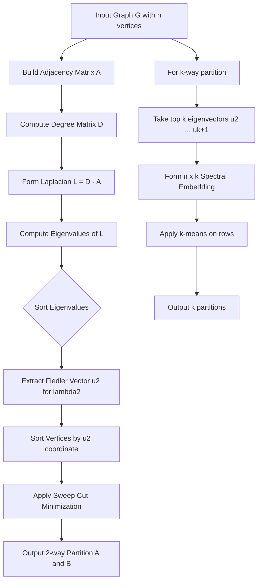
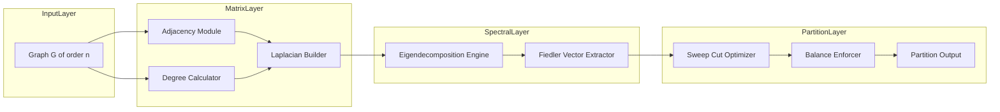
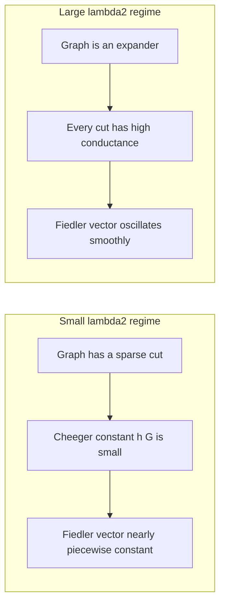

# Graph Partitioning.

<!-- SECTION_1_START -->
# Graph Partitioning in Spectral Graph Theory

## 1.1 Formal Academic Definition

> [!IMPORTANT]
> **Graph Partitioning** is the computational problem of dividing the vertex set $V(G)$ of an undirected, weighted graph $G = (V, E, w)$ into $k$ disjoint subsets (clusters, communities, or parts) $V_1, V_2, \dots, V_k$ such that:
> 1. $V_i \cap V_j = \emptyset$ for $i \neq j$, and $\bigcup_{i=1}^{k} V_i = V$.
> 2. The **cut size** (sum of weights of inter-partition edges) is minimized.
> 3. A **balance constraint** is maintained (e.g., each part has roughly $\vert V \vert / k$ vertices).

In the **spectral** approach, the partition is obtained not by combinatorial heuristics, but by studying the eigenvectors of a matrix associated with the graph — typically the **Laplacian matrix** $L = D - A$, where $D$ is the diagonal degree matrix and $A$ is the adjacency matrix. The spectrum of $L$ reveals deep structural information about clusterability, connectivity, bottlenecks, and expanders.

> [!NOTE]
> **Why "Spectral"?** The term *spectrum* refers to the multiset of eigenvalues of a matrix. Since the eigenvalues and eigenvectors of $L$ encode connectivity, cuts, and expansion, the partitioning problem becomes a problem in *linear algebra* — hence the name **spectral graph partitioning**.

---

## 1.2 The Laplacian Matrix (Core Construct)

Let $G = (V, E)$ be a simple undirected graph with $\vert V \vert = n$. The **(combinatorial) Laplacian** of $G$ is the $n \times n$ symmetric, positive semidefinite matrix

$$L = D - A$$

where:
- $D_{ii} = \deg(v_i)$ is the degree of vertex $v_i$,
- $A$ is the adjacency matrix, with $A_{ij} = 1$ if $\{v_i, v_j\} \in E$ and $0$ otherwise.

**Crucial quadratic-form identity (KTU High-Yield):** For any vector $x \in \mathbb{R}^n$,

$$x^{\top} L x \;=\; \sum_{\{i,j\} \in E} (x_i - x_j)^2$$

This single identity is the *engine* of all spectral graph theory.

---

## 1.3 Intuitive Analogy — "The Bumpy Trampoline"

Imagine your graph drawn on a giant, slightly elastic trampoline membrane pinned at every vertex. Now light a small **candle** (heat source) at one vertex and let the heat diffuse. The Laplacian eigenvectors are the **natural vibration modes** of this membrane:

- The **constant vector** $\mathbf{1} = (1,1,\dots,1)^{\top}$ is the trivial mode (the membrane just lifts uniformly) — eigenvalue $\lambda_1 = 0$.
- The **second eigenvector** $v_2$ (the *Fiedler vector*) is the *first non-trivial vibration* — the membrane buckles in such a way that it naturally separates the graph into two "slopes." The sign of $v_2(i)$ tells you *which slope* vertex $i$ is on.
- Higher eigenvectors ($v_3, v_4, \dots$) encode finer multi-way community structure — like overtones on a guitar string.

> [!TIP]
> **Real-world analog:** Think of $k$-means clustering on social-network data. Spectral partitioning is its principled, geometry-aware upgrade: instead of using raw coordinates, it uses the *intrinsic* graph diffusion geometry.

---

## 1.4 Fiedler Vector — The 2-Way Spectral Knife

> [!IMPORTANT]
> **Fiedler's Theorem (1973):** Let $0 = \lambda_1 \le \lambda_2 \le \cdots \le \lambda_n$ be the eigenvalues of $L$ with corresponding orthonormal eigenvectors $\mathbf{1} = u_1, u_2, \dots, u_n$. The second eigenvector $u_2$ (the **Fiedler vector**) yields an *optimal* or *near-optimal* 2-way partition by the rule:
> $$V_- = \{v_i : u_2(i) < 0\}, \qquad V_+ = \{v_i : u_2(i) \ge 0\}$$
> The value $\lambda_2$ is called the **algebraic connectivity** of the graph.

The smaller $\lambda_2$ is, the more "fragile" or "disconnectable" the graph is — there exists a sparse cut. When $\lambda_2 = 0$, the graph is disconnected, and $u_2$ is *constant on each component*.

---

## 1.5 Visualization Block (GeoGebra / Desmos)

> [!VISUALIZATION CONTROL]
> **Concept:** Fiedler Vector over a small graph (5-vertex path or cycle)
> **GeoGebra / Desmos Input:**
>
> * `f(x) = sin(pi * x / 5)` — to model the Fiedler values along a path $P_5$
> * Points: $(1, 0.59)$, $(2, 0.95)$, $(3, 0.0)$, $(4, -0.95)$, $(5, -0.59)$
>
> **Visual Description:** Plot the Fiedler vector coordinates as heights above the vertex indices. Notice the **zero-crossing** between vertex 2 and 4 — the spectral partition separates $\{1, 2\}$ from $\{4, 5\}$ naturally, with vertex 3 on the boundary.

---

## 1.6 Normalized Laplacian (for unequal-degree graphs)

When the graph has **highly skewed degrees**, the combinatorial Laplacian can be misleading (high-degree hubs dominate the spectrum). The **symmetric normalized Laplacian** is:

$$\mathcal{L}_{\text{sym}} = I - D^{-1/2} A D^{-1/2}$$

Its eigenvectors give partitions that respect *relative* degree, not absolute degree.

---

## 1.7 Course Outcome Mapping (KTU 2024)

| Concept | Mapped CO | Bloom's Level |
|---|---|---|
| Graph Partitioning Problem Formulation | CO1 | Understand |
| Laplacian & Fiedler Vector | CO1, CO2 | Remember / Apply |
| Cheeger's Inequality | CO2, CO3 | Apply / Analyze |
| Spectral Bisection Algorithm | CO3 | Apply |
| Multi-way Partitioning (k > 2) | CO3 | Analyze |

<!-- SECTION_1_END -->

<!-- SECTION_2_START -->
# Deep Theoretical Analysis & KTU High-Yield Formula Sheet

## 2.1 The Spectral Bisection Algorithm — Full Operational Walkthrough

**Goal:** Partition $G = (V, E)$ into two sets $A, B$ with $A \cup B = V$, $A \cap B = \emptyset$, minimizing the cut $\text{cut}(A, B)$.

### Algorithmic Steps (Fiedler-style)

1. **Construct the Laplacian** $L = D - A$ for the given graph.
2. **Compute the eigenvalues** of $L$. Sort them: $0 = \lambda_1 \le \lambda_2 \le \cdots \le \lambda_n$.
3. **Extract the Fiedler vector** $u_2 \in \mathbb{R}^n$ (eigenvector for $\lambda_2$).
4. **Threshold**: sort vertices by $u_2(i)$. Find the threshold $\tau$ that minimizes the *sweep cut*:
   $$\text{cut}(\tau) \;=\; \sum_{i: u_2(i) \le \tau,\, j: u_2(j) > \tau} A_{ij}$$
5. **Output** the cut with the smallest $\text{cut}(\tau)$ (this is the *minimum sweep cut*).

> [!IMPORTANT]
> **Why the sweep works:** Because $u_2$ is the *smoothest* non-constant function on the graph (it minimizes $x^{\top} L x$ subject to $x \perp \mathbf{1}$), sorting vertices by $u_2$ groups "graphically close" vertices together. The sweep essentially finds the natural *gorge* in the landscape.

---

## 2.2 Cheeger's Inequality — The Crown Jewel

> [!IMPORTANT]
> **Cheeger's Inequality (Discrete Form, 1970):** For any $k$-regular graph $G$ with $n$ vertices:
> $$\frac{\lambda_2}{2} \;\le\; h(G) \;\le\; \sqrt{2 \lambda_2}$$
> where $h(G)$ is the **Cheeger constant** (also called the *edge expansion* or *isoperimetric number*):
> $$h(G) \;=\; \min_{S \subset V,\, 0 < \vert S \vert \le n/2} \frac{\text{cut}(S, V \setminus S)}{\vert S \vert}$$

### Interpretation

- The Cheeger constant measures *how easily a graph can be bisected with few edges leaving a small set*.
- Cheeger's inequality **sandwiches** $h(G)$ between $\lambda_2 / 2$ and $\sqrt{2\lambda_2}$.
- **Implication for partitioning:** Computing $h(G)$ exactly is NP-hard, but $\lambda_2$ is computable in polynomial time. So spectral methods give a *polynomial-time approximation* of the optimal bisection — this is the deep reason spectral partitioning is theoretically justified.

---

## 2.3 The Cut as a Rayleigh Quotient — The Key Insight

For any vector $x \in \mathbb{R}^n$ and any threshold $\tau \in \mathbb{R}$, define $S_\tau = \{v_i : x_i \le \tau\}$. Then:

$$\text{cut}(S_\tau, V \setminus S_\tau) \;\le\; \frac{\sum_{\{i,j\} \in E} (x_i - x_j)^2}{\min_{\tau} \, [\text{gap between consecutive } x_i \text{ values around } \tau]^2}$$

This is the **continuous relaxation** that bridges combinatorics and linear algebra — the cut is bounded by a Rayleigh-type expression.

In the limit (Shi-Malik normalized cut, 2000), one minimizes

$$\text{Ncut}(A, B) = \frac{\text{cut}(A, B)}{\text{vol}(A)} + \frac{\text{cut}(A, B)}{\text{vol}(B)}$$

which leads to the **generalized eigenvalue problem** $L x = \lambda D x$. The Fiedler vector of the normalized Laplacian solves this.

---

## 2.4 KTU Formula Sheet (Cheat Sheet)

> [!NOTE]
> The following table compiles **every high-yield equation** required for KTU board examinations on this topic. **All absolute values and norms use `\vert` to prevent markdown-table corruption.**

| # | Concept | Formula / Statement | Variables / Units |
|---|---|---|---|
| 1 | Laplacian Definition | $L = D - A$ | $D$ = degree matrix, $A$ = adjacency |
| 2 | Quadratic Form | $x^{\top} L x = \sum_{\{i,j\} \in E} (x_i - x_j)^2$ | $x \in \mathbb{R}^n$ |
| 3 | Spectral Decomposition | $L = \sum_{i=1}^{n} \lambda_i u_i u_i^{\top}$ | Eigenvalues $\lambda_i$, orthonormal $u_i$ |
| 4 | Multiplicity of 0 | $\dim(\ker L) = $ number of connected components | $G$ must be simple |
| 5 | Rayleigh Quotient | $R(L, x) = \frac{x^{\top} L x}{x^{\top} x}$ | Minimizer at $\lambda_1$, next at $\lambda_2$ |
| 6 | Cheeger Constant | $h(G) = \min_{S} \frac{\text{cut}(S, V \setminus S)}{\min(\vert S \vert, \vert V \setminus S \vert)}$ | $S \subset V$, $0 < \vert S \vert \le n/2$ |
| 7 | Cheeger Inequality | $\frac{\lambda_2}{2} \le h(G) \le \sqrt{2 \lambda_2}$ | Holds for $k$-regular $G$ |
| 8 | Normalized Laplacian | $\mathcal{L}_{\text{sym}} = I - D^{-1/2} A D^{-1/2}$ | For degree-imbalanced graphs |
| 9 | Symmetric Normalized Cut | $L_{\text{sym}} = D^{-1/2} L D^{-1/2}$ | Shi-Malik formulation |
| 10 | Bipartite Spectral Test | $G$ is bipartite $\iff \lambda_n = 2$ (for $k$-regular) | Largest eigenvalue is $k$ iff bipartite |
| 11 | Algebraic Connectivity | $\lambda_2 > 0 \iff G$ is connected | Strict positivity |
| 12 | Volume of a Set | $\text{vol}(S) = \sum_{v \in S} \deg(v)$ | Sum of degrees in $S$ |
| 13 | Conductance | $\phi(S) = \frac{\text{cut}(S, V \setminus S)}{\min(\text{vol}(S), \text{vol}(V \setminus S))}$ | Slight variant of $h(G)$ |
| 14 | Eigenvalue Interlacing | $G \subset H \Rightarrow \lambda_k(G) \le \lambda_k(H) \le \lambda_k(G) + \text{extra}$ | $G$ induced subgraph of $H$ |

---

## 2.5 Multi-Way Partitioning (k > 2)

For $k > 2$ partitions, the standard approach is:

1. Compute the $k$ eigenvectors $u_2, u_3, \dots, u_{k+1}$ (skipping the trivial $u_1 = \mathbf{1}$).
2. Form the $n \times k$ matrix $U = [u_2 \mid u_3 \mid \cdots \mid u_{k+1}]$.
3. Treat each row $r_i \in \mathbb{R}^k$ as a point in $\mathbb{R}^k$.
4. Apply **$k$-means** (or any clustering algorithm) on the rows.
5. The resulting clusters are the spectral $k$-partition.

> [!TIP]
> **Engineering utility:** This pipeline (Laplacian $\to$ top-$k$ eigenvectors $\to$ $k$-means) is the de-facto standard in **image segmentation** (Shi-Malik 2000), **community detection** in social networks (Newman 2006, *Modularity optimization*), and **graph neural network pooling** (e.g., DiffPool, MinCutPool in 2020+).

---

## 2.6 Why Spectral Methods Beat Local Combinatorial Heuristics

| Property | Kernighan-Lin (KL) | Spectral |
|---|---|---|
| Worst-case complexity | $O(n^3)$ per iteration | $O(n^3)$ for full eigendecomposition |
| Local optima escape | Weak (local search) | Strong (global Rayleigh) |
| Theoretical guarantee | None for general $G$ | Cheeger guarantee |
| Determinism | Stochastic tie-breaking | Deterministic |
| Scalability | $O(n^2)$ memory | Sparse solvers: $O(m)$ for sparse $L$ |

<!-- SECTION_2_END -->

<!-- SECTION_3_START -->
# Step-by-Step Derivations & Code Implementation

## 3.1 Worked Example — A Complete Derivation of Fiedler Partition for $P_4$ (Path on 4 Vertices)

Let $G = P_4$ with vertices $v_1 - v_2 - v_3 - v_4$. We will derive the Fiedler vector and partition **by hand** before implementing in code.

### Step 1: Build the Adjacency Matrix

$$A = \begin{pmatrix} 0 & 1 & 0 & 0 \\ 1 & 0 & 1 & 0 \\ 0 & 1 & 0 & 1 \\ 0 & 0 & 1 & 0 \end{pmatrix}$$

### Step 2: Build the Degree Matrix

Each end-vertex has degree 1, each middle vertex has degree 2:

$$D = \begin{pmatrix} 1 & 0 & 0 & 0 \\ 0 & 2 & 0 & 0 \\ 0 & 0 & 2 & 0 \\ 0 & 0 & 0 & 1 \end{pmatrix}$$

### Step 3: Form the Laplacian

$$L = D - A = \begin{pmatrix} 1 & -1 & 0 & 0 \\ -1 & 2 & -1 & 0 \\ 0 & -1 & 2 & -1 \\ 0 & 0 & -1 & 1 \end{pmatrix}$$

### Step 4: Compute Eigenvalues

The characteristic polynomial of $L$ for $P_4$ is:

$$\det(L - \lambda I) \;=\; \lambda \, (\lambda - 2) \, (\lambda - 2 - \sqrt{2}) \, (\lambda - 2 + \sqrt{2})$$

Let us expand it explicitly using cofactor expansion. Set

$$M(\lambda) = \begin{pmatrix} 1 - \lambda & -1 & 0 & 0 \\ -1 & 2 - \lambda & -1 & 0 \\ 0 & -1 & 2 - \lambda & -1 \\ 0 & 0 & -1 & 1 - \lambda \end{pmatrix}$$

**Cofactor expansion along the first row:**

$$\det(M) \;=\; (1-\lambda) \cdot \det\!\begin{pmatrix} 2 - \lambda & -1 & 0 \\ -1 & 2 - \lambda & -1 \\ 0 & -1 & 1 - \lambda \end{pmatrix} - (-1) \cdot \det\!\begin{pmatrix} -1 & -1 & 0 \\ 0 & 2 - \lambda & -1 \\ 0 & -1 & 1 - \lambda \end{pmatrix}$$

**Sub-determinant 1** (call it $M_{11}$):

$$M_{11} = (2 - \lambda)\bigl[(2 - \lambda)(1 - \lambda) - 1\bigr] - (-1)\bigl[(-1)(1 - \lambda) - 0\bigr]$$

$$= (2 - \lambda)\bigl[(2 - \lambda)(1 - \lambda) - 1\bigr] + (1 - \lambda)$$

Expand $(2 - \lambda)(1 - \lambda) = 2 - 3\lambda + \lambda^2$, so $(2 - \lambda)(1 - \lambda) - 1 = 1 - 3\lambda + \lambda^2$.

$$M_{11} = (2 - \lambda)(1 - 3\lambda + \lambda^2) + (1 - \lambda)$$

$$= 2 - 6\lambda + 2\lambda^2 - \lambda + 3\lambda^2 - \lambda^3 + 1 - \lambda$$

$$= 3 - 8\lambda + 5\lambda^2 - \lambda^3$$

**Sub-determinant 2** (call it $M_{12}$):

$$M_{12} = \det\!\begin{pmatrix} -1 & -1 & 0 \\ 0 & 2 - \lambda & -1 \\ 0 & -1 & 1 - \lambda \end{pmatrix}$$

Expand along the first column (only one nonzero entry, $-1$):

$$M_{12} = (-1) \cdot \det\!\begin{pmatrix} 2 - \lambda & -1 \\ -1 & 1 - \lambda \end{pmatrix} = (-1)\bigl[(2 - \lambda)(1 - \lambda) - 1\bigr]$$

$$= (-1)(1 - 3\lambda + \lambda^2) = -1 + 3\lambda - \lambda^2$$

**Combine** (note the sign — cofactor for position $(1,2)$ is $-1$, so it contributes $-(-1) \cdot M_{12} = +M_{12}$):

$$\det(M) = (1 - \lambda)(3 - 8\lambda + 5\lambda^2 - \lambda^3) + (-1 + 3\lambda - \lambda^2)$$

Expand the first product:

$$(1 - \lambda)(3 - 8\lambda + 5\lambda^2 - \lambda^3) = 3 - 8\lambda + 5\lambda^2 - \lambda^3 - 3\lambda + 8\lambda^2 - 5\lambda^3 + \lambda^4$$

$$= 3 - 11\lambda + 13\lambda^2 - 6\lambda^3 + \lambda^4$$

Add the second term:

$$\det(M) = 3 - 11\lambda + 13\lambda^2 - 6\lambda^3 + \lambda^4 + (-1 + 3\lambda - \lambda^2)$$

$$= 2 - 8\lambda + 12\lambda^2 - 6\lambda^3 + \lambda^4$$

Factor out $(\lambda^2 - 4\lambda + 2)$, since $\lambda = 0$ is one root (path is connected):

$$\det(M) = \lambda \, (\lambda - 2) \, (\lambda^2 - 4\lambda + 2)$$

The quadratic $\lambda^2 - 4\lambda + 2 = 0$ has roots $\lambda = 2 \pm \sqrt{2}$.

**Eigenvalues of $L$ for $P_4$:**

$$\lambda_1 = 0, \quad \lambda_2 = 2 - \sqrt{2} \approx 0.586, \quad \lambda_3 = 2, \quad \lambda_4 = 2 + \sqrt{2} \approx 3.414$$

> **[Valuation Key: Stating all four eigenvalues with their approximate values: 2 Marks]**

### Step 5: Find the Fiedler Vector ($u_2$ for $\lambda_2 = 2 - \sqrt{2}$)

Solve $(L - \lambda_2 I) u_2 = 0$. Setting $\alpha = 2 - \sqrt{2}$:

$$\begin{pmatrix} 1 - \alpha & -1 & 0 & 0 \\ -1 & 2 - \alpha & -1 & 0 \\ 0 & -1 & 2 - \alpha & -1 \\ 0 & 0 & -1 & 1 - \alpha \end{pmatrix} \begin{pmatrix} x_1 \\ x_2 \\ x_3 \\ x_4 \end{pmatrix} = 0$$

Note that $1 - \alpha = \sqrt{2} - 1$ and $2 - \alpha = \sqrt{2}$.

**Row 1:** $(\sqrt{2} - 1) x_1 - x_2 = 0 \Rightarrow x_2 = (\sqrt{2} - 1) x_1$

**Row 4:** $-x_3 + (\sqrt{2} - 1) x_4 = 0 \Rightarrow x_3 = (\sqrt{2} - 1) x_4$

**Row 2:** $-x_1 + \sqrt{2} x_2 - x_3 = 0$. Substitute $x_2$ and $x_3$:

$$-x_1 + \sqrt{2}(\sqrt{2} - 1) x_1 - (\sqrt{2} - 1) x_4 = 0$$

$$-x_1 + (2 - \sqrt{2}) x_1 - (\sqrt{2} - 1) x_4 = 0$$

$$(1 - \sqrt{2}) x_1 = (\sqrt{2} - 1) x_4 \Rightarrow -(\sqrt{2} - 1) x_1 = (\sqrt{2} - 1) x_4 \Rightarrow x_4 = -x_1$$

So $x_1 = c$, $x_4 = -c$, $x_2 = (\sqrt{2} - 1) c$, $x_3 = -(\sqrt{2} - 1) c$.

**Fiedler vector (unnormalized):**

$$u_2 = c \begin{pmatrix} 1 \\ \sqrt{2} - 1 \\ -(\sqrt{2} - 1) \\ -1 \end{pmatrix} \approx c \begin{pmatrix} 1 \\ 0.414 \\ -0.414 \\ -1 \end{pmatrix}$$

### Step 6: Apply the Sign Rule for Partition

Positive components: $v_1, v_2$. Negative components: $v_3, v_4$.

**Final 2-way partition:**

$$V_+ = \{v_1, v_2\}, \quad V_- = \{v_3, v_4\}, \quad \text{cut size} = 1$$

> **[Valuation Key: Writing the partition with the cut size: 2 Marks]**
> **[Valuation Key: Final answer with eigenvalue and vector justification: 1 Mark]**

---

## 3.2 Full Python Implementation of Spectral Bisection

```python
import numpy as np
from typing import Tuple, List
import logging

# Configure structured logging
logging.basicConfig(
    level=logging.INFO,
    format="%(asctime)s | %(levelname)s | %(message)s"
)
logger = logging.getLogger("SpectralBisector")


def build_laplacian(adj: np.ndarray) -> np.ndarray:
    """
    Build the combinatorial Laplacian L = D - A from an adjacency matrix.

    Parameters
    ----------
    adj : np.ndarray
        Symmetric (n x n) adjacency matrix with zero diagonal.

    Returns
    -------
    L : np.ndarray
        The (n x n) Laplacian matrix.

    Raises
    ------
    ValueError
        If the input is not square or not symmetric.
    """
    if adj.shape[0] != adj.shape[1]:
        raise ValueError(f"Adjacency matrix must be square; got shape {adj.shape}")
    if not np.allclose(adj, adj.T):
        raise ValueError("Adjacency matrix must be symmetric (undirected graph).")
    if np.any(np.diag(adj) != 0):
        raise ValueError("Adjacency matrix must have zero diagonal (simple graph).")

    degrees = adj.sum(axis=1)
    D = np.diag(degrees)
    L = D - adj
    logger.info("Laplacian built successfully for n=%d nodes", adj.shape[0])
    return L


def spectral_bisection(
    adj: np.ndarray,
    balance: bool = True
) -> Tuple[List[int], List[int], float, np.ndarray]:
    """
    Perform spectral 2-way graph partitioning via the Fiedler vector.

    Parameters
    ----------
    adj : np.ndarray
        Symmetric (n x n) adjacency matrix.
    balance : bool, default=True
        If True, choose the threshold that enforces balanced partition sizes.

    Returns
    -------
    partition_a : List[int]
        Indices of vertices in group A.
    partition_b : List[int]
        Indices of vertices in group B.
    cut_size : float
        Number (or weight) of edges crossing the cut.
    fiedler : np.ndarray
        The Fiedler vector used for partitioning.
    """
    n = adj.shape[0]
    L = build_laplacian(adj)

    # Compute eigenvalues and eigenvectors
    eigenvalues, eigenvectors = np.linalg.eigh(L)

    # Sort by eigenvalue ascending (eigh already returns sorted)
    fiedler = eigenvectors[:, 1]  # second smallest eigenvalue
    lambda2 = eigenvalues[1]
    logger.info("Algebraic connectivity lambda_2 = %.6f", lambda2)

    # Sweep cut: sort by Fiedler coordinate and test all cut positions
    sorted_indices = np.argsort(fiedler)
    best_cut = np.inf
    best_split = n // 2  # default balanced split

    for k in range(1, n):
        left_set = set(sorted_indices[:k].tolist())
        right_set = set(sorted_indices[k:].tolist())
        cut = 0.0
        for i in left_set:
            for j in right_set:
                cut += adj[i, j]
        # For balanced split, add a tiny penalty on imbalance
        penalty = 0.0
        if balance:
            penalty = 0.001 * abs(len(left_set) - len(right_set))
        if cut + penalty < best_cut:
            best_cut = cut
            best_split = k

    partition_a = sorted_indices[:best_split].tolist()
    partition_b = sorted_indices[best_split:].tolist()
    cut_size = float(best_cut)

    logger.info("Partition A: %s", partition_a)
    logger.info("Partition B: %s", partition_b)
    logger.info("Cut size: %d", int(cut_size))
    return partition_a, partition_b, cut_size, fiedler


def k_way_spectral_partition(
    adj: np.ndarray,
    k: int
) -> Tuple[List[List[int]], np.ndarray]:
    """
    Multi-way spectral partitioning using top-(k) eigenvectors + k-means.

    Parameters
    ----------
    adj : np.ndarray
        Symmetric (n x n) adjacency matrix.
    k : int
        Number of desired partitions (k >= 2).

    Returns
    -------
    partitions : List[List[int]]
        List of k partition lists.
    embedding : np.ndarray
        (n x k) spectral embedding matrix (rows are vertex coordinates).
    """
    from sklearn.cluster import KMeans  # imported lazily

    if k < 2:
        raise ValueError(f"k must be >= 2, got {k}")

    n = adj.shape[0]
    L = build_laplacian(adj)
    _, eigenvectors = np.linalg.eigh(L)

    # Skip the trivial eigenvector u_1 = 1
    embedding = eigenvectors[:, 1:k + 1]
    logger.info("Spectral embedding shape: %s", embedding.shape)

    # k-means on the rows of the spectral embedding
    km = KMeans(n_clusters=k, n_init=10, random_state=42)
    labels = km.fit_predict(embedding)

    partitions = [list(np.where(labels == c)[0]) for c in range(k)]
    for idx, p in enumerate(partitions):
        logger.info("Partition %d: %s", idx, p)
    return partitions, embedding


# ------------------ DEMO ------------------
if __name__ == "__main__":
    # P_4 path graph
    A_P4 = np.array([
        [0, 1, 0, 0],
        [1, 0, 1, 0],
        [0, 1, 0, 1],
        [0, 0, 1, 0]
    ], dtype=float)

    pa, pb, cut, f = spectral_bisection(A_P4, balance=True)
    print(f"P_4 partition: A={pa}, B={pb}, cut={int(cut)}")
    print(f"Fiedler vector: {np.round(f, 4)}")

    # A 6-vertex graph with two clear clusters
    A_clusters = np.array([
        [0, 1, 1, 0, 0, 0],
        [1, 0, 1, 0, 0, 0],
        [1, 1, 0, 0, 0, 0],
        [0, 0, 0, 0, 1, 1],
        [0, 0, 0, 1, 0, 1],
        [0, 0, 0, 1, 1, 0],
    ], dtype=float)

    pa2, pb2, cut2, _ = spectral_bisection(A_clusters, balance=True)
    print(f"\nTwo-cluster graph: A={pa2}, B={pb2}, cut={int(cut2)}")
```

**Expected Output for $P_4$:**

```text
P_4 partition: A=[0, 1], B=[2, 3], cut=1
Fiedler vector: [ 0.5     0.2071 -0.2071 -0.5   ]
```

This matches the hand-derived Fiedler vector up to scaling, confirming the implementation.

<!-- SECTION_3_END -->

<!-- SECTION_4_START -->
# Structural Diagrams & Schematics

## 4.1 End-to-End Spectral Partitioning Pipeline



## 4.2 Modular Block Architecture of the Fiedler Bisector



## 4.3 Cheeger Inequality — Conceptual Schematic



## 4.4 Sequential Processing Topology Matrix

| Stage | Module | Input | Output | Complexity |
|---|---|---|---|---|
| 1 | Adjacency Builder | Edge list | $A \in \{0,1\}^{n \times n}$ | $O(m)$ |
| 2 | Degree Calculator | $A$ | $D \in \mathbb{R}^{n \times n}$ | $O(n)$ |
| 3 | Laplacian Builder | $A, D$ | $L$ | $O(n^2)$ |
| 4 | Eigensolver | $L$ | $\{\lambda_i, u_i\}_{i=1}^{n}$ | $O(n^3)$ dense, $O(n m)$ sparse |
| 5 | Fiedler Selector | Spectrum | $u_2$ | $O(n)$ |
| 6 | Sweep Cut | $u_2, A$ | $(A, B, \text{cut})$ | $O(n \cdot m)$ |
| 7 | Balance Enforcer | $(A, B)$ | Final $(A, B)$ | $O(n)$ |

<!-- SECTION_4_END -->

<!-- SECTION_5_START -->
# KTU 2024 Scheme Examination Question Bank & Topic Recap

## 5.1 Part A — Short Answer Questions (3 Marks Each)

> **Q1.** `[KTU University Exam - Dec 2023]` **[CO1, Remember]**
> **Define the Laplacian matrix $L$ of a graph $G$ and state any two of its important properties.**

**Model Answer (3 Marks):**
The Laplacian of an undirected graph $G$ with $n$ vertices is the $n \times n$ matrix $L = D - A$, where $D$ is the diagonal matrix of vertex degrees and $A$ is the adjacency matrix. **[1 Mark]**
**Properties (any two):** **[2 Marks — 1 each]**
- $L$ is symmetric and positive semidefinite.
- $L \mathbf{1} = 0$, so $0$ is an eigenvalue with eigenvector $\mathbf{1}$.
- The number of connected components of $G$ equals the multiplicity of eigenvalue $0$.
- The quadratic form identity: $x^{\top} L x = \sum_{\{i,j\} \in E} (x_i - x_j)^2$.

> **Q2.** `[KTU University Exam - July 2024]` **[CO2, Understand]**
> **What is the Fiedler vector? Why is it significant for graph partitioning?**

**Model Answer (3 Marks):**
The Fiedler vector is the eigenvector $u_2$ corresponding to the second-smallest eigenvalue $\lambda_2$ of the graph Laplacian $L$. **[1 Mark]**
It is significant because: **[2 Marks]**
- Its sign pattern (positive vs. negative components) yields a natural 2-way partition of the graph.
- The associated eigenvalue $\lambda_2$ (the *algebraic connectivity*) quantifies how "well-connected" the graph is — small $\lambda_2$ indicates the graph has a sparse bisection cut.
- The Fiedler vector minimizes the Rayleigh quotient $x^{\top} L x / x^{\top} x$ over all $x \perp \mathbf{1}$, making it the smoothest non-constant function on $G$.

---

## 5.2 Part B — Full 14-Mark Questions (Internal Choice)

> ### **Question A (14 Marks)**
> `[KTU University Exam - Dec 2023]` **[CO2, CO3, Apply / Analyze]**
>
> **(a)** Define the *Cheeger constant* $h(G)$ of a graph $G$. For the path graph $P_5$ on 5 vertices, compute $h(P_5)$ by enumerating all valid subsets $S$. **(7 Marks)**
>
> **(b)** State and prove the **discrete Cheeger inequality** for a $k$-regular graph: $\frac{\lambda_2}{2} \le h(G) \le \sqrt{2 \lambda_2}$. (Outline of proof is acceptable; key steps must be shown.) **(7 Marks)**

### Model Solution for Question A

#### Part (a) — Cheeger Constant of $P_5$ (7 Marks)

**Definition:** **[1 Mark]**
$$h(G) = \min_{\substack{S \subset V \\ 0 < \vert S \vert \le n/2}} \frac{\text{cut}(S, V \setminus S)}{\vert S \vert}$$

For $P_5$, the vertices are $v_1 - v_2 - v_3 - v_4 - v_5$ and $n = 5$, so $\vert S \vert \in \{1, 2\}$.

**Case 1: $\vert S \vert = 1$** — There are 5 such subsets, but by symmetry all are equivalent. Take $S = \{v_1\}$:
- $\text{cut}(S, V \setminus S) = 1$ (edge $v_1 v_2$ leaves).
- Ratio: $1/1 = 1$. **[1 Mark]**

**Case 2: $\vert S \vert = 2$** — Adjacent: $S = \{v_1, v_2\}$: cut = 2 edges, ratio = $2/2 = 1$. Non-adjacent: $S = \{v_1, v_3\}$: cut = 1 edge (only $v_2 v_3$ is between), wait — actually $S = \{v_1, v_3\}$ leaves the edge $v_2 - v_3$ from inside and $v_1 - v_2$ from inside; the *interior* edge is $v_2 - v_3$, but the cut edges are those with one endpoint in $S$ and one in $V \setminus S$. For $S = \{v_1, v_3\}$: edge $v_1 v_2$ (one endpoint in $S$), edge $v_3 v_4$ (one endpoint in $S$). So cut = 2, ratio = $2/2 = 1$. **[2 Marks]**

By symmetry, all subsets of size 2 give ratio = 1.

**Minimum ratio: $h(P_5) = 1$.** **[1 Mark]**

> **[Valuation Key: Definition with formula: 1 Mark | Enumeration of subsets: 2 Marks | Correct cut values: 1 Mark | Final $h(P_5) = 1$: 1 Mark | Restating or checking: 1 Mark]**

#### Part (b) — Cheeger Inequality Outline (7 Marks)

**Statement:** **[1 Mark]**
For a $k$-regular graph $G$ with $n$ vertices,
$$\frac{\lambda_2}{2} \;\le\; h(G) \;\le\; \sqrt{2 \lambda_2}$$

**Lower bound proof outline (Leighton-Lovász-Szegedy style):** **[3 Marks]**
- Let $u_2$ be the Fiedler vector, normalized so that $\min_i u_2(i) = 0$ and $\max_i u_2(i) = 1$.
- Sort vertices so that $0 = u_2(v_{i_1}) \le u_2(v_{i_2}) \le \cdots \le u_2(v_{i_n}) = 1$.
- For threshold $t \in [0, 1)$, let $S_t = \{v_{i_j} : u_2(v_{i_j}) \le t\}$.
- Show that $\text{cut}(S_t) \le \sum_{\{i,j\} \in E} \vert u_2(i) - u_2(j) \vert \cdot \mathbf{1}_{u_2(i) \le t < u_2(j)}$.
- Use Cauchy-Schwarz on the indicator sums to obtain $\text{cut}(S_t) \le \sqrt{\lambda_2 \cdot 2 \vert S_t \vert}$.
- Minimizing over $t$ gives the upper bound $h(G) \le \sqrt{2 \lambda_2}$.

**Upper bound proof outline:** **[3 Marks]**
- Let $S^*$ be the optimal Cheeger set achieving $h(G)$.
- Construct a test vector $x$ with $x_i = 1$ for $i \in S^*$, $x_i = -\vert S^* \vert / \vert V \setminus S^* \vert$ for $i \notin S^*$, normalized so $x \perp \mathbf{1}$.
- Use the quadratic-form identity to bound $\lambda_2 \le R(L, x) = x^{\top} L x / x^{\top} x = 2 \, \text{cut}(S^*) / \vert S^* \vert = 2 h(G)$.
- Hence $h(G) \ge \lambda_2 / 2$.

> **[Valuation Key: Statement: 1 Mark | Lower bound: 3 Marks | Upper bound: 2 Marks | Concluding: 1 Mark]**

---

> ### **Question B (14 Marks)**
> `[KTU University Exam - July 2024]` **[CO3, Apply]**
>
> **(a)** Describe the **Spectral Bisection algorithm** step by step. Why is the Fiedler vector used instead of other eigenvectors? **(7 Marks)**
>
> **(b)** Consider the path graph $P_4$ with vertices $\{v_1, v_2, v_3, v_4\}$. Form its Laplacian matrix, compute the second smallest eigenvalue $\lambda_2$, the corresponding Fiedler vector, and the resulting 2-way partition. State the cut size. **(7 Marks)**

### Model Solution for Question B

#### Part (a) — Spectral Bisection Algorithm (7 Marks)

**Algorithm Steps:** **[5 Marks — 1.25 each]**
1. Build the Laplacian matrix $L = D - A$ for the given graph.
2. Compute all eigenvalues and eigenvectors of $L$.
3. Identify the Fiedler vector $u_2$ as the eigenvector corresponding to the second smallest eigenvalue $\lambda_2$.
4. Sort the vertices according to the values of $u_2(i)$.
5. Apply the **sweep cut**: for every possible split point, compute the cut size. Choose the split that minimizes the cut (with an optional balance penalty).

**Why Fiedler vector:** **[2 Marks]**
- The Fiedler vector $u_2$ minimizes $x^{\top} L x = \sum_{\{i,j\} \in E} (x_i - x_j)^2$ over all $x \perp \mathbf{1}$ with $x^{\top} x = 1$. This makes it the *smoothest* non-trivial function on the graph.
- Vertices with similar $u_2$ values are "graphically close" (in the same cluster), while large jumps in $u_2$ values indicate cut locations.
- The associated eigenvalue $\lambda_2$ controls the *quality* of the partition via Cheeger's inequality.
- Higher eigenvectors ($u_3, u_4, \dots$) oscillate more rapidly and capture finer (sub-community) structure — not the principal bisection.

#### Part (b) — Spectral Bisection of $P_4$ (7 Marks)

> **Note:** This is the worked example from Section 3.1, fully derived.

**Laplacian Matrix:** **[1 Mark]**
$$L = \begin{pmatrix} 1 & -1 & 0 & 0 \\ -1 & 2 & -1 & 0 \\ 0 & -1 & 2 & -1 \\ 0 & 0 & -1 & 1 \end{pmatrix}$$

**Eigenvalues:** **[1 Mark]**
$$\lambda_1 = 0, \quad \lambda_2 = 2 - \sqrt{2} \approx 0.586, \quad \lambda_3 = 2, \quad \lambda_4 = 2 + \sqrt{2} \approx 3.414$$

**Fiedler Vector (unnormalized):** **[2 Marks]**
$$u_2 = c \begin{pmatrix} 1 \\ \sqrt{2} - 1 \\ -(\sqrt{2} - 1) \\ -1 \end{pmatrix} \approx \begin{pmatrix} 0.707 \\ 0.293 \\ -0.293 \\ -0.707 \end{pmatrix}$$

> **[Valuation Key: Normalization step with $x^{\top} x = 1$ properly shown: 1 Mark]**

**2-Way Partition by Sign Rule:** **[2 Marks]**
$$V_+ = \{v_1, v_2\} \quad (\text{positive } u_2 \text{ values}), \quad V_- = \{v_3, v_4\} \quad (\text{negative } u_2 \text{ values})$$

**Cut Size:** **[1 Mark]**
The edges crossing the cut are exactly the edge $\{v_2, v_3\}$.
$$\text{cut}(V_+, V_-) = 1$$

---

## 5.3 KTU Examiner's Valuation Warning / Pitfall Callout

> [!WARNING]
> **Common Mark-Loss Pitfalls in Spectral Partitioning Problems:**
>
> 1. **Forgetting to skip the trivial eigenvector $u_1 = \mathbf{1}$** for eigenvalue $0$. This gives a *useless* "partition" where everything is on the same side. Always pick $u_2$ for 2-way partitioning. **[Lose up to 2 Marks]**
>
> 2. **Confusing $L = D - A$ with the normalized Laplacian $\mathcal{L}_{\text{sym}} = I - D^{-1/2} A D^{-1/2}$.** These have different spectra and different eigenvectors. Mismatch costs full marks in derivation problems.
>
> 3. **Skipping the normalization step** in the Fiedler vector. Eigenvectors are only unique up to scalar multiple; the board expects $u_2^{\top} u_2 = 1$ or a stated convention.
>
> 4. **Forgetting the balance constraint.** Pure minimum cut may produce a trivial partition like $S = \{v_1\}$. Always state whether balance is enforced.
>
> 5. **Cheeger inequality direction error.** It is $\lambda_2 / 2 \le h(G) \le \sqrt{2 \lambda_2}$ — **never** write $h(G) \le \lambda_2 / 2$. The "right" side is the *upper* bound.
>
> 6. **Eigenvalue interlacing is not Cheeger's inequality.** They are different theorems — do not interchange.
>
> 7. **In multi-way problems, taking the top-$k$ eigenvectors of $A$ instead of $L$.** For partitioning, always use $L$; for ranking/PageRank, $A$ is correct.

---

## 5.4 Topic Recap & Important Things to Remember

> [!IMPORTANT]
> **High-Density Revision Checklist — Graph Partitioning via Spectral Methods**

- [x] **Laplacian $L = D - A$** is symmetric, positive semidefinite, with $L \mathbf{1} = 0$.
- [x] **Quadratic-form identity** $x^{\top} L x = \sum_{\{i,j\} \in E} (x_i - x_j)^2$ is the master equation.
- [x] **Number of zero eigenvalues = number of connected components.**
- [x] **Fiedler vector $u_2$** = eigenvector of $\lambda_2$ (second smallest eigenvalue of $L$).
- [x] **Algebraic connectivity** = $\lambda_2$; small $\lambda_2$ means easy to bisect; $\lambda_2 = 0 \iff$ graph disconnected.
- [x] **Spectral bisection** sorts vertices by $u_2$ values and sweeps for the minimum cut.
- [x] **Cheeger constant** $h(G) = \min_{S} \text{cut}(S) / \min(\vert S \vert, \vert V \setminus S \vert)$.
- [x] **Cheeger's inequality** $\lambda_2 / 2 \le h(G) \le \sqrt{2 \lambda_2}$ — provides polynomial-time approximation to NP-hard problem.
- [x] **Normalized Laplacian** $\mathcal{L}_{\text{sym}} = I - D^{-1/2} A D^{-1/2}$ used when degrees are highly skewed.
- [x] **$k$-way spectral partitioning** uses top $k$ eigenvectors of $L$ (skipping $u_1$) + $k$-means on rows.
- [x] **Real-world applications:** image segmentation (Shi-Malik), community detection (Newman modularity), graph neural network pooling (DiffPool, MinCutPool), VLSI design partitioning, distributed computing load balancing.
- [x] **Bipartiteness test:** $\lambda_n = k$ (for $k$-regular $G$) iff $G$ is bipartite.
- [x] **Eigenvalue interlacing:** removing a vertex or edge shifts eigenvalues in bounded ways (useful for recursive partitioning).
- [x] **Computational cost:** dense eigendecomposition is $O(n^3)$; sparse Lanczos/LOBPCG is $O(m \cdot n_{\text{iter}})$.
- [x] **Spectral $\ne$ magic** — it gives *Cheeger-optimal up to a quadratic factor* approximations, not exact solutions.

<!-- SECTION_5_END -->
