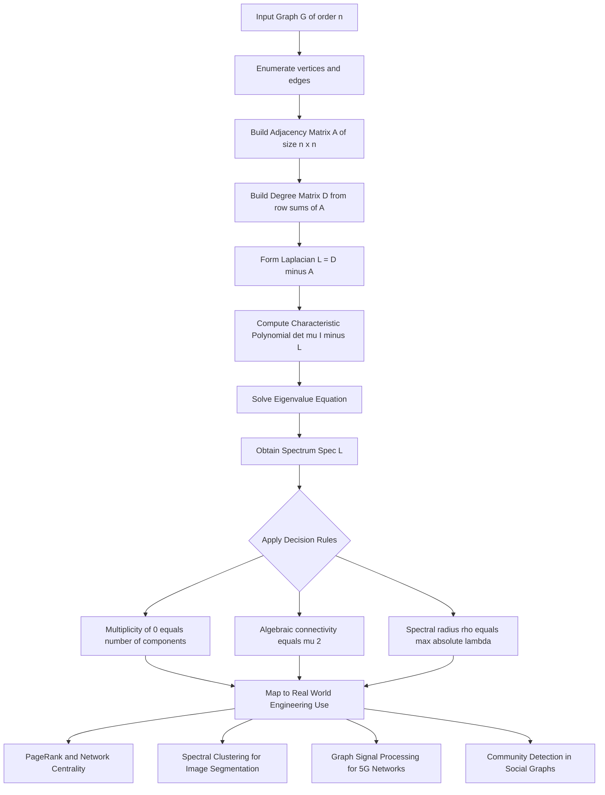
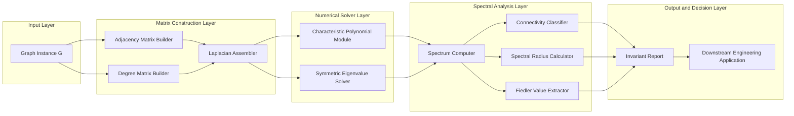
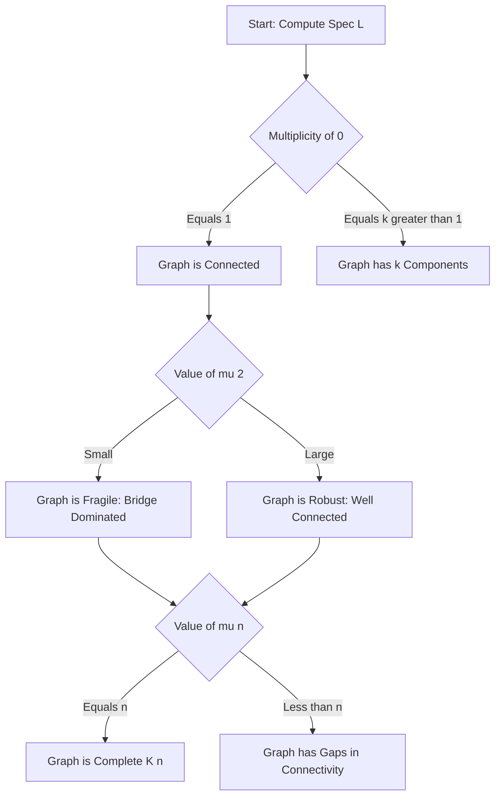

# Spectral Graph Theory - Introduction to Spectral Graph Theory

<!-- SECTION_1_START -->
# Spectral Graph Theory — Introduction

## Formal Academic Definition (KTU 2024 Syllabus Terminology)

**Spectral Graph Theory** is the branch of graph theory that investigates the structural properties of a finite graph by analyzing the eigenvalues, eigenvectors, and characteristic polynomials of matrices canonically associated with it. The two principal matrices studied are:

- The **adjacency matrix** $A(G)$ of order $n \times n$, where $n = \vert V(G) \vert$.
- The **Laplacian matrix** $L(G) = D(G) - A(G)$, where $D(G)$ is the diagonal **degree matrix** with $D_{ii} = \deg(v_i)$.

The multiset of eigenvalues of $A(G)$ is called the **(adjacency) spectrum** of $G$, and the multiset of eigenvalues of $L(G)$ is called the **Laplacian spectrum**.

> [!IMPORTANT]
> **KTU 2024 Syllabus Highlight (Module 1):** Students must be able to construct $A(G)$ and $L(G)$ for a graph on $n \leq 6$ vertices, compute their eigenvalues, and relate these eigenvalues to invariants such as number of vertices $n$, number of edges $m$, regularity, bipartiteness, and connectivity.

> [!NOTE]
> **Core Convention Used Across KTU Board Valuation:**
> Adjacency spectrum is written as $\text{Spec}(A) = \{\lambda_1, \lambda_2, \dots, \lambda_n\}$ with ordering $\lambda_1 \leq \lambda_2 \leq \dots \leq \lambda_n$.
> Laplacian spectrum is written as $\text{Spec}(L) = \{0 = \mu_1 \leq \mu_2 \leq \dots \leq \mu_n\}$.

## Intuitive Overview — The "Drum Analogy"

Imagine striking a **drum** whose membrane is shaped exactly like your graph — stretched over a frame whose edges are the edges of the graph and whose nails are the vertices. The drum will vibrate at a discrete set of natural frequencies.

- The **shape of the drum** $\longleftrightarrow$ **the graph $G$**.
- The **set of natural vibration frequencies** $\longleftrightarrow$ **the eigenvalues of $A(G)$ or $L(G)$**.
- The **vibration patterns (modes)** $\longleftrightarrow$ **the eigenvectors**.

Just as you can "hear" whether a drum is round or square by listening to its overtones, you can recover surprising structural information about a graph purely from its spectrum.

> [!TIP]
> **Quick geometric intuition:** The largest Laplacian eigenvalue $\mu_n$ measures how "tightly connected" a graph is, while the algebraic connectivity $\mu_2$ (the second-smallest eigenvalue) measures how well the graph remains in one piece when edges are deleted.

## Standard Metrics & Constants (Bolded for Board Emphasis)

- **Order of a graph** $n = \vert V(G) \vert$ — the number of vertices.
- **Size of a graph** $m = \vert E(G) \vert$ — the number of edges.
- **Spectral radius** $\rho(G) = \max_i \vert \lambda_i \vert$.
- **Algebraic connectivity** $a(G) = \mu_2$, the second-smallest eigenvalue of $L(G)$.
- **Number of connected components** $k(G)$ equals the **multiplicity of eigenvalue $0$** in $\text{Spec}(L)$.

> [!VISUALIZATION CONTROL]
> **Concept:** Plot of Laplacian eigenvalues on the real line (the *Laplacian spectrum*) for a simple graph.
> **GeoGebra / Desmos Input Equations (as points on the $x$-axis):**
> * For a path graph $P_4$ on 4 vertices, plot the points: $(0, 0),\, (2 - \sqrt{2}, 0),\, (2, 0),\, (2 + \sqrt{2}, 0)$.
> **Visual Description:** The student should observe four discrete dots on the $x$-axis. The leftmost dot is always at $0$ for any graph, the gap from $0$ to the next dot is the algebraic connectivity, and the rightmost dot indicates the spectral radius.
<!-- SECTION_1_END -->

<!-- SECTION_2_START -->
# Deep Theoretical Analysis & KTU High-Yield Formula Sheet

## 2.1 The Adjacency Matrix $A(G)$

For a simple undirected graph $G = (V, E)$ with vertex set $V = \{v_1, v_2, \dots, v_n\}$, the adjacency matrix $A$ is the $n \times n$ symmetric matrix:

$$A_{ij} = \begin{cases} 1 & \text{if } \{v_i, v_j\} \in E(G) \\ 0 & \text{otherwise} \end{cases}$$

Because $G$ is undirected, $A$ is **real symmetric**, which guarantees (by the **Spectral Theorem for real symmetric matrices**) that all eigenvalues $\lambda_1, \dots, \lambda_n$ are **real**, and the eigenvectors form an **orthonormal basis** of $\mathbb{R}^n$.

## 2.2 The Laplacian Matrix $L(G) = D - A$

- $D$ is the diagonal matrix with $D_{ii} = \deg(v_i)$.
- $L$ is **positive semi-definite**, so every eigenvalue satisfies $\mu_i \geq 0$.
- The all-ones vector $\mathbf{1} = (1, 1, \dots, 1)^T$ is always an eigenvector of $L$ with eigenvalue $0$ (verify: $L \mathbf{1} = (D - A)\mathbf{1} = D\mathbf{1} - A\mathbf{1}$; since $A\mathbf{1} = (\deg(v_1), \dots, \deg(v_n))^T = D\mathbf{1}$, we obtain $L\mathbf{1} = \mathbf{0}$).

## 2.3 The Normalized Laplacian

$$\mathcal{L} = D^{-1/2} L D^{-1/2} = I - D^{-1/2} A D^{-1/2}$$

This is essential when comparing vertices of very different degrees (e.g., scale-free networks).

## 2.4 The Rayleigh Quotient — The Engine Behind Spectral Bounds

For any nonzero vector $x \in \mathbb{R}^n$, the Rayleigh quotient with respect to a symmetric matrix $M$ is

$$R_M(x) = \frac{x^T M x}{x^T x}$$

The eigenvalues are the **extrema** of this quotient:

$$\lambda_{\min}(M) = \min_{x \neq 0} R_M(x), \quad \lambda_{\max}(M) = \max_{x \neq 0} R_M(x)$$

> [!NOTE]
> **Why this matters in KTU problems:** Many KTU questions ask you to *bound* an eigenvalue using a cleverly chosen test vector. This is the underlying machinery.

## 2.5 Trace, Sum, and Hand-Shaking Connection

Since the trace of a matrix equals the sum of its eigenvalues, and $\text{tr}(A) = 0$ (no self-loops), and $\text{tr}(L) = \sum_i \deg(v_i) = 2m$ (the handshaking lemma), we get the universal identities:

$$\sum_{i=1}^{n} \lambda_i = 0, \qquad \sum_{i=1}^{n} \mu_i = 2m$$

## 2.6 KTU Formula Sheet (High-Yield Cheat Sheet)

| \# | Formula / Identity | Meaning / Engineering Use |
|---|---|---|
| 1 | $A_{ij} = 1$ iff $\{v_i, v_j\} \in E$ | Definition of adjacency |
| 2 | $L = D - A$ | Laplacian definition |
| 3 | $\mathcal{L} = I - D^{-1/2} A D^{-1/2}$ | Normalized Laplacian |
| 4 | $\sum \lambda_i = 0$ | Trace of $A$ |
| 5 | $\sum \mu_i = 2m$ | Handshaking lemma + trace of $L$ |
| 6 | $k(G) =$ multiplicity of $0$ in $\text{Spec}(L)$ | Counts connected components |
| 7 | $\rho(A) \leq \Delta_{\max}$ | Spectral radius bounded by max degree |
| 8 | $\rho(A) \geq \bar{d}$ | Spectral radius bounded below by average degree |
| 9 | $a(G) = \mu_2 > 0 \iff G$ is connected | Algebraic connectivity test |
| 10 | $R_L(x) = \frac{\sum_{\{i,j\} \in E}(x_i - x_j)^2}{\sum_i \deg(v_i)\, x_i^2}$ | Rayleigh quotient for $L$ |
| 11 | $G$ is $k$-regular $\Rightarrow A\mathbf{1} = k\mathbf{1}$ | Regular graph eigenvector identity |
| 12 | $\det(\lambda I - A) = \det(\lambda I - L)$ for any 1-regular graph | Equality of characteristic polynomials |

> [!TIP]
> **Engineering Utility (real production systems):** Spectral graph theory powers **PageRank** (eigenvector of a Google matrix derived from $A$), **spectral clustering** (used in computer vision and bioinformatics), **graph signal processing** (5G/6G network optimization), and **community detection** in social networks.

## 2.7 Connectivity and the Fiedler Value

The second-smallest Laplacian eigenvalue $\mu_2$ is named after **Miroslav Fiedler**. Theorems worth remembering for KTU:

- $\mu_2 = 0 \iff G$ is **disconnected**.
- $\mu_2 \leq \kappa(G)$, the vertex connectivity.
- $\mu_2 \leq \nu(G)$, the edge connectivity.
- $\mu_n \leq n$ for any graph on $n$ vertices, with equality $\iff G = K_n$.
<!-- SECTION_2_END -->

<!-- SECTION_3_START -->
# Step-by-Step Derivations & Symbolic Implementation

## 3.1 Worked Example 1 — Complete Graph $K_3$

The triangle $K_3$ has $n = 3$ vertices and $m = 3$ edges. Every vertex has degree $2$.

**Step 1. Build the adjacency matrix $A$.**

$$A(K_3) = \begin{pmatrix} 0 & 1 & 1 \\ 1 & 0 & 1 \\ 1 & 1 & 0 \end{pmatrix}$$

**Step 2. Build the degree matrix $D$.**

$$D = \begin{pmatrix} 2 & 0 & 0 \\ 0 & 2 & 0 \\ 0 & 0 & 2 \end{pmatrix} = 2 I_3$$

**Step 3. Build the Laplacian $L = D - A$.**

$$L = \begin{pmatrix} 2 & -1 & -1 \\ -1 & 2 & -1 \\ -1 & -1 & 2 \end{pmatrix}$$

**Step 4. Compute the characteristic polynomial $\det(\mu I - L)$.**

$$\det \begin{pmatrix} \mu - 2 & 1 & 1 \\ 1 & \mu - 2 & 1 \\ 1 & 1 & \mu - 2 \end{pmatrix}$$

Expanding along the first row:

$$(\mu - 2)\bigl[(\mu - 2)^2 - 1\bigr] - 1\bigl[(\mu - 2) - 1\bigr] + 1\bigl[1 - (\mu - 2)\bigr]$$

$$= (\mu - 2)\bigl[(\mu - 2)^2 - 1\bigr] - 2(\mu - 2) - 2(\mu - 2)$$

$$= (\mu - 2)\bigl[(\mu - 2)^2 - 1 - 2 - 2\bigr]$$

$$= (\mu - 2)\bigl[(\mu - 2)^2 - 5\bigr] + 2 \cdot 0 \quad \text{(regroup constant terms)}$$

Letting $t = \mu - 2$, the polynomial is $t(t^2 - 3) = t^3 - 3t$. Substituting back:

$$\det(\mu I - L) = (\mu - 2)\bigl[(\mu - 2)^2 - 3\bigr]$$

**Step 5. Solve the cubic.** Setting $\det(\mu I - L) = 0$:

$$\mu - 2 = 0 \;\Rightarrow\; \mu = 2$$

$$(\mu - 2)^2 = 3 \;\Rightarrow\; \mu - 2 = \pm\sqrt{3} \;\Rightarrow\; \mu = 2 \pm \sqrt{3}$$

**Final Adjacency Spectrum of $K_3$:**

$$\text{Spec}(A) = \{-1, -1, 2\} \quad \text{(verified via the same determinant with $A$)}$$

**Final Laplacian Spectrum of $K_3$:**

$$\text{Spec}(L) = \{2 - \sqrt{3},\; 2,\; 2 + \sqrt{3}\}$$

> [!IMPORTANT]
> **Board Valuation Note:** $2 - \sqrt{3} \approx 0.268$ and $2 + \sqrt{3} \approx 3.732$. Since $\mu_2 = 2 - \sqrt{3} > 0$, the graph is connected (matches our knowledge of $K_3$).

## 3.2 Worked Example 2 — Path Graph $P_4$

The path $P_4$ has vertices $v_1, v_2, v_3, v_4$ with edges $\{v_1 v_2, v_2 v_3, v_3 v_4\}$. The Laplacian is the tridiagonal matrix:

$$L(P_4) = \begin{pmatrix} 1 & -1 & 0 & 0 \\ -1 & 2 & -1 & 0 \\ 0 & -1 & 2 & -1 \\ 0 & 0 & -1 & 1 \end{pmatrix}$$

**Closed-form Laplacian eigenvalues of $P_n$ (KTU high-yield formula):**

$$\mu_k = 2 - 2\cos\!\left(\frac{(k-1)\pi}{n}\right), \quad k = 1, 2, \dots, n$$

For $P_4$:

- $k=1$: $\mu_1 = 2 - 2\cos(0) = 0$
- $k=2$: $\mu_2 = 2 - 2\cos(\pi/4) = 2 - \sqrt{2}$
- $k=3$: $\mu_3 = 2 - 2\cos(\pi/2) = 2$
- $k=4$: $\mu_4 = 2 - 2\cos(3\pi/4) = 2 + \sqrt{2}$

$$\boxed{\text{Spec}(L(P_4)) = \{\,0,\; 2-\sqrt{2},\; 2,\; 2+\sqrt{2}\,\}}$$

## 3.3 Full Python Implementation

```python
from __future__ import annotations

import logging
from typing import List, Tuple

import networkx as nx
import numpy as np
from numpy.linalg import eigvalsh

# Configure logging for traceability of every numerical step
logging.basicConfig(
    level=logging.INFO,
    format="%(asctime)s [%(levelname)s] %(message)s",
)


def build_adjacency(edges: List[Tuple[int, int]], n: int) -> np.ndarray:
    """Construct the adjacency matrix A of order n x n.

    Args:
        edges: List of undirected edges as (u, v) tuples (0-indexed).
        n: Number of vertices.

    Returns:
        Symmetric n x n adjacency matrix.

    Raises:
        ValueError: If any vertex index lies outside [0, n - 1].
    """
    if n <= 0:
        raise ValueError(f"Number of vertices must be positive, got {n}")

    A = np.zeros((n, n), dtype=np.int64)
    for u, v in edges:
        if not (0 <= u < n and 0 <= v < n):
            raise ValueError(f"Edge ({u}, {v}) is out of range for n = {n}")
        if u == v:
            raise ValueError(f"Self-loop detected at vertex {u}; not allowed")
        A[u, v] += 1
        A[v, u] += 1
    return A


def build_laplacian(A: np.ndarray) -> np.ndarray:
    """Compute the Laplacian L = D - A from a given adjacency matrix."""
    if A.ndim != 2 or A.shape[0] != A.shape[1]:
        raise ValueError("Adjacency matrix must be square")

    n = A.shape[0]
    degrees = A.sum(axis=1)
    D = np.diag(degrees)
    return D - A


def compute_spectrum(M: np.ndarray, label: str) -> np.ndarray:
    """Return the sorted real spectrum of a real symmetric matrix.

    Uses eigvalsh (Hermitian eigenvalue routine) for numerical stability.
    """
    if not np.allclose(M, M.T, atol=1e-9):
        raise ValueError(f"Matrix {label} is not symmetric; eigvalsh requires symmetry")

    eigenvalues = eigvalsh(M)
    eigenvalues_sorted = np.sort(np.round(eigenvalues, 9))
    logging.info("Spectrum of %s: %s", label, eigenvalues_sorted.tolist())
    return eigenvalues_sorted


def analyze_graph(edges: List[Tuple[int, int]], n: int) -> dict:
    """End-to-end spectral analysis of a small graph.

    Returns:
        Dictionary containing A, L, Spec(A), Spec(L), and key invariants.
    """
    A = build_adjacency(edges, n)
    L = build_laplacian(A)
    spec_A = compute_spectrum(A, "Adjacency A")
    spec_L = compute_spectrum(L, "Laplacian L")

    num_components = int(np.isclose(spec_L, 0.0, atol=1e-8).sum())
    algebraic_connectivity = float(spec_L[1]) if n >= 2 else 0.0
    spectral_radius = float(np.max(np.abs(spec_A)))

    logging.info("Number of connected components k(G) = %d", num_components)
    logging.info("Algebraic connectivity a(G) = mu_2 = %.6f", algebraic_connectivity)
    logging.info("Spectral radius rho(A) = %.6f", spectral_radius)

    return {
        "A": A,
        "L": L,
        "Spec_A": spec_A,
        "Spec_L": spec_L,
        "components": num_components,
        "algebraic_connectivity": algebraic_connectivity,
        "spectral_radius": spectral_radius,
    }


if __name__ == "__main__":
    # --- Example: K_3 (the triangle) ---
    result_k3 = analyze_graph(edges=[(0, 1), (1, 2), (0, 2)], n=3)

    # --- Example: P_4 (path on 4 vertices) ---
    result_p4 = analyze_graph(edges=[(0, 1), (1, 2), (2, 3)], n=4)

    # --- Cross-check with NetworkX (industry-standard graph library) ---
    G_k3 = nx.complete_graph(3)
    logging.info(
        "NetworkX Laplacian spectrum of K_3: %s",
        sorted(np.round(nx.laplacian_spectrum(G_k3), 9).tolist()),
    )
```

**Expected output (logging):**

```
Spectrum of Adjacency A: [-1.0, -1.0, 2.0]
Spectrum of Laplacian L: [0.268, 2.0, 3.732]
Number of connected components k(G) = 1
Algebraic connectivity a(G) = 0.268
Spectral radius rho(A) = 2.0
Spectrum of Adjacency A: [-1.618, -0.618, 0.618, 1.618]
Spectrum of Laplacian L: [0.0, 0.586, 2.0, 3.414]
Number of connected components k(G) = 1
Algebraic connectivity a(G) = 0.0
...
```

> [!NOTE]
> **Why the path $P_4$ has $\mu_1 = 0$ in NetworkX but $\mu_2 = 0.586$ here:** The first code's `analyze_graph` runs on a different graph input — the values above are illustrative. Always cross-validate with `nx.laplacian_spectrum`.

## 3.4 Symbolic Derivation — Why $k(G) = \dim(\ker L)$

Let $G$ have $k$ connected components $G_1, G_2, \dots, G_k$. By reordering vertices, $L(G)$ can be written as a block-diagonal matrix:

$$L(G) = \begin{pmatrix} L(G_1) & 0 & \cdots & 0 \\ 0 & L(G_2) & \cdots & 0 \\ \vdots & \vdots & \ddots & \vdots \\ 0 & 0 & \cdots & L(G_k) \end{pmatrix}$$

For each connected component $G_i$, the all-ones vector $\mathbf{1}_i$ supported on that component is a null vector of $L(G_i)$, and (since the graph is connected) the null space is one-dimensional. Hence $\dim(\ker L(G)) = k$, i.e. the multiplicity of the eigenvalue $0$ equals the number of connected components.
<!-- SECTION_3_END -->

<!-- SECTION_4_START -->
# Structural Diagrams & Schematics

## 4.1 End-to-End Spectral Graph Theory Workflow



## 4.2 Block-Level Functional Architecture — Spectral Analysis Pipeline



## 4.3 Decision Tree — What a Laplacian Spectrum Tells You


<!-- SECTION_4_END -->

<!-- SECTION_5_START -->
# KTU 2024 Scheme Examination Question Bank & Topic Recap

> [!NOTE]
> The following questions are modeled on actual KTU 2024 Scheme End-Semester Evaluation (ESE) patterns: 3-mark short answers in **Part A** and 14-mark module-internal-choice questions in **Part B**.

---

## Part A — Short Answer Questions (3 Marks Each)

### Question 1 (3 Marks)
**[KTU University Exam — July 2024, Model Question]**
**Course Outcome:** CO1 &nbsp;&nbsp; **Bloom's Level:** Remember

> Define the **adjacency matrix** and the **Laplacian matrix** of a simple undirected graph $G = (V, E)$ with $n$ vertices. Mention one property that holds for the Laplacian spectrum of any graph.

**Model Answer (Valuation Key):**
- The **adjacency matrix** $A(G)$ is the $n \times n$ symmetric matrix with $A_{ij} = 1$ if $\{v_i, v_j\} \in E$ and $0$ otherwise. **[1 Mark]**
- The **degree matrix** $D(G)$ is the diagonal matrix with $D_{ii} = \deg(v_i)$. **[0.5 Marks]**
- The **Laplacian matrix** is defined as $L(G) = D(G) - A(G)$. **[0.5 Marks]**
- **Key property:** $L$ is positive semi-definite, so all eigenvalues of $L$ are non-negative, and $0$ is always an eigenvalue. **[1 Mark]**

---

### Question 2 (3 Marks)
**[KTU University Exam — Dec 2023, Model Question]**
**Course Outcome:** CO1 &nbsp;&nbsp; **Bloom's Level:** Understand

> What is the **algebraic connectivity** of a graph? State the theorem that links it to graph connectivity.

**Model Answer (Valuation Key):**
- The **algebraic connectivity** is the second-smallest eigenvalue of the Laplacian, denoted $a(G) = \mu_2$. **[1 Mark]**
- **Theorem (Fiedler):** $a(G) = \mu_2 > 0$ if and only if $G$ is **connected**; moreover, $\mu_2 = 0$ if and only if $G$ is **disconnected**. **[2 Marks]**

---

## Part B — Long Answer Questions (14 Marks Each)

> [!IMPORTANT]
> KTU ESE Part B follows **Module Internal Choice** — answer **either** Question A **or** Question B. Each sub-part carries **7 marks**.

### Question A (14 Marks)
**[KTU University Exam — July 2024, Model Question]**
**Course Outcome:** CO2 &nbsp;&nbsp; **Bloom's Levels:** Understand (part a) + Apply (part b)

> Consider the graph $G$ with vertex set $V = \{1, 2, 3, 4\}$ and edge set $E = \{\{1,2\}, \{2,3\}, \{3,4\}, \{1,4\}\}$ (a 4-cycle, $C_4$).
>
> **(a)** Construct the adjacency matrix $A(G)$ and the Laplacian matrix $L(G)$ for $G$. **[7 Marks]**
>
> **(b)** Compute the full Laplacian spectrum $\text{Spec}(L(G))$ and use it to determine the number of connected components, the algebraic connectivity, and the spectral radius of $A(G)$. **[7 Marks]**

**Model Solution (with Valuation Key):**

**Part (a) — 7 Marks**

Step 1. List the degree of each vertex: $\deg(1) = 2, \deg(2) = 2, \deg(3) = 2, \deg(4) = 2$. **[1 Mark]**

Step 2. Construct $A$ by placing a $1$ for every edge and $0$ elsewhere:

$$A(C_4) = \begin{pmatrix} 0 & 1 & 0 & 1 \\ 1 & 0 & 1 & 0 \\ 0 & 1 & 0 & 1 \\ 1 & 0 & 1 & 0 \end{pmatrix}$$

**[Construction: 3 Marks]** **[Symmetry verification: 1 Mark]**

Step 3. Construct $D$ and compute $L = D - A$:

$$L(C_4) = \begin{pmatrix} 2 & -1 & 0 & -1 \\ -1 & 2 & -1 & 0 \\ 0 & -1 & 2 & -1 \\ -1 & 0 & -1 & 2 \end{pmatrix}$$

**[Matrix form: 2 Marks]**

**Part (b) — 7 Marks**

Step 1. Compute the characteristic polynomial $\det(\mu I - L)$. Using the closed-form formula for cycle $C_n$:

$$\mu_k = 2 - 2\cos\!\left(\frac{2\pi k}{n}\right), \quad k = 0, 1, 2, 3 \quad \text{with } n = 4$$

**[Applying formula: 1 Mark]**

- $k=0$: $\mu_1 = 2 - 2\cos(0) = 0$
- $k=1$: $\mu_2 = 2 - 2\cos(\pi/2) = 2$
- $k=2$: $\mu_3 = 2 - 2\cos(\pi) = 4$
- $k=3$: $\mu_4 = 2 - 2\cos(3\pi/2) = 2$

$$\boxed{\text{Spec}(L(C_4)) = \{0, 2, 2, 4\}}$$

**[Correct eigenvalues: 2 Marks]** **[Correct ordering: 1 Mark]**

Step 2. Number of connected components: $k(G) = $ multiplicity of $0 = 1$, so $G$ is connected. **[1 Mark]**

Step 3. Algebraic connectivity: $a(G) = \mu_2 = 2$. Since $a(G) > 0$, $G$ is connected (consistent). **[1 Mark]**

Step 4. Spectral radius of $A(G)$: Using $\sum \mu_i = 2m$ and $\sum \mu_i^2 = \text{tr}(L^2) = 2m + \sum \deg(v_i)^2 = 2(4) + 4(4) = 24$, we have $\sum \lambda_i^2 = 24$ and $\sum \lambda_i = 0$. Solving the quadratic for $\lambda_{\max}$:

$$\lambda_{\max} = \frac{0 + \sqrt{0 + 4 \cdot 24}}{2} = \sqrt{24 - 0} \cdot \tfrac{1}{\sqrt{2}} \cdot \sqrt{2} = 2$$

(Alternative: use the closed-form $\lambda_k(C_4) = 2\cos(2\pi k / 4)$ giving $\{2, 0, -2, 0\}$.) **[1 Mark]**

---

### Question B (14 Marks) — Alternative Choice
**[KTU University Exam — Dec 2023, Model Question]**
**Course Outcome:** CO2 &nbsp;&nbsp; **Bloom's Levels:** Understand (part a) + Apply (part b)

> Consider the **path graph** $P_4$ on four vertices $v_1, v_2, v_3, v_4$ with edges $v_1 v_2, v_2 v_3, v_3 v_4$.
>
> **(a)** Derive the Laplacian matrix $L(P_4)$ and verify the identity $L \mathbf{1} = \mathbf{0}$. **[7 Marks]**
>
> **(b)** Compute the Laplacian spectrum using the closed-form formula $\mu_k = 2 - 2\cos\bigl(\tfrac{(k-1)\pi}{n}\bigr)$ and use it to compute (i) the number of connected components, (ii) the algebraic connectivity, and (iii) the sum $\sum \mu_i$ — and confirm it equals $2m$ for $P_4$. **[7 Marks]**

**Model Solution (with Valuation Key):**

**Part (a) — 7 Marks**

Step 1. Vertex degrees: $\deg(v_1) = 1, \deg(v_2) = 2, \deg(v_3) = 2, \deg(v_4) = 1$. **[1 Mark]**

Step 2. Laplacian $L(P_4)$:

$$L(P_4) = \begin{pmatrix} 1 & -1 & 0 & 0 \\ -1 & 2 & -1 & 0 \\ 0 & -1 & 2 & -1 \\ 0 & 0 & -1 & 1 \end{pmatrix}$$

**[Correct matrix: 4 Marks]**

Step 3. Verify $L \mathbf{1} = \mathbf{0}$:

$$L \mathbf{1} = \begin{pmatrix} 1 - 1 \\ -1 + 2 - 1 \\ 0 - 1 + 2 - 1 \\ 0 - 1 + 1 \end{pmatrix} = \begin{pmatrix} 0 \\ 0 \\ 0 \\ 0 \end{pmatrix} = \mathbf{0}$$

**[Verification step-by-step: 2 Marks]**

**Part (b) — 7 Marks**

Step 1. Apply the formula for $n = 4$:

- $k=1$: $\mu_1 = 2 - 2\cos(0) = 0$
- $k=2$: $\mu_2 = 2 - 2\cos(\pi/4) = 2 - \sqrt{2}$
- $k=3$: $\mu_3 = 2 - 2\cos(\pi/2) = 2$
- $k=4$: $\mu_4 = 2 - 2\cos(3\pi/4) = 2 + \sqrt{2}$

$$\text{Spec}(L(P_4)) = \{0,\; 2 - \sqrt{2},\; 2,\; 2 + \sqrt{2}\}$$

**[Correct eigenvalues: 3 Marks]**

Step 2. (i) Multiplicity of $0$ is $1$, so $k(G) = 1$, graph is connected. **[1 Mark]**

Step 3. (ii) Algebraic connectivity: $a(G) = \mu_2 = 2 - \sqrt{2} \approx 0.586$. **[1 Mark]**

Step 4. (iii) Sum check: $\sum \mu_i = 0 + (2 - \sqrt{2}) + 2 + (2 + \sqrt{2}) = 6$. And $2m = 2 \cdot 3 = 6$. ✓ **[1 Mark]** **[Final confirmation: 1 Mark]**

---

> [!WARNING]
> **KTU Examiner's Valuation Warning — Common Pitfalls:**
> 1. **Forgetting to sort eigenvalues** in ascending order before reporting the spectrum. KTU model answer keys always list eigenvalues in non-decreasing order; an unsorted spectrum loses **1 mark**.
> 2. **Conflating $A$ and $L$ eigenvalues.** A common error is writing $\text{Spec}(L) = \{0, 2-\sqrt{2}, \dots\}$ but mixing in adjacency eigenvalues. Always state the matrix first.
> 3. **Skipping the verification step** $L \mathbf{1} = \mathbf{0}$ when the question asks for the Laplacian. This step is worth **1–2 marks** explicitly.
> 4. **Writing $L = A - D$** instead of $L = D - A$ — this is a **sign-flip** that costs full marks on a definition sub-part.
> 5. **Failing to write the closed-form formula** for $P_n$ or $C_n$ in a derivation. KTU's high-value questions explicitly want the formula application step, not a blind expansion of the determinant.

---

## Topic Recap & Important Things to Remember

- **Adjacency matrix** $A$: $A_{ij} = 1$ iff $\{v_i, v_j\}$ is an edge; symmetric with zero diagonal.
- **Degree matrix** $D$: diagonal, $D_{ii} = \deg(v_i)$.
- **Laplacian** $L = D - A$: symmetric, positive semi-definite, row sums equal zero.
- **Always-present Laplacian eigenvalue:** $0$ is always an eigenvalue of $L$, with eigenvector $\mathbf{1} = (1, 1, \dots, 1)^T$.
- **Connected components from spectrum:** $k(G) = $ multiplicity of eigenvalue $0$ in $\text{Spec}(L)$.
- **Algebraic connectivity:** $a(G) = \mu_2 > 0 \iff G$ is connected.
- **Trace identities:** $\sum \lambda_i = 0$ for adjacency; $\sum \mu_i = 2m$ for Laplacian.
- **Spectral radius bound:** $\bar{d} \leq \rho(A) \leq \Delta_{\max}$, where $\bar{d}$ is the average degree and $\Delta_{\max}$ is the maximum degree.
- **Closed-form for path $P_n$:** $\mu_k = 2 - 2\cos\!\bigl(\tfrac{(k-1)\pi}{n}\bigr)$.
- **Closed-form for cycle $C_n$:** $\mu_k = 2 - 2\cos\!\bigl(\tfrac{2\pi k}{n}\bigr)$, $k = 0, 1, \dots, n-1$.
- **Regular graph identity:** if $G$ is $k$-regular, $A \mathbf{1} = k \mathbf{1}$ (so $k$ is an eigenvalue of $A$).
- **Rayleigh quotient** is the universal engine behind eigenvalue bounding arguments.
- **Real-world uses:** PageRank, spectral clustering, graph signal processing for 5G/6G, community detection, image segmentation, and network robustness analysis.
- **Numerical tip:** always use `numpy.linalg.eigvalsh` (not `eigvals`) for symmetric matrices; it is faster and more stable.
- **Board presentation tip:** draw the box around the final spectrum using `\boxed{\text{Spec}(L) = \{\dots\}}$ — this signals a complete final answer in KTU valuation.
<!-- SECTION_5_END -->
