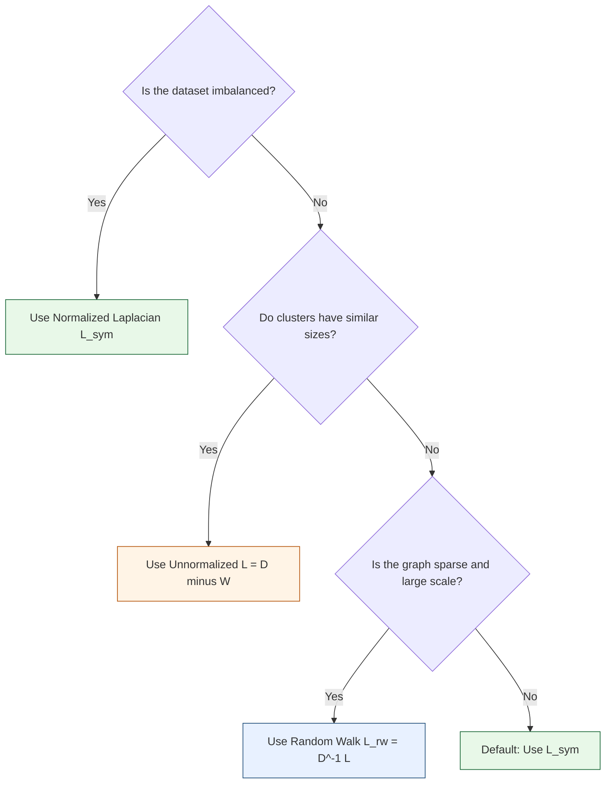
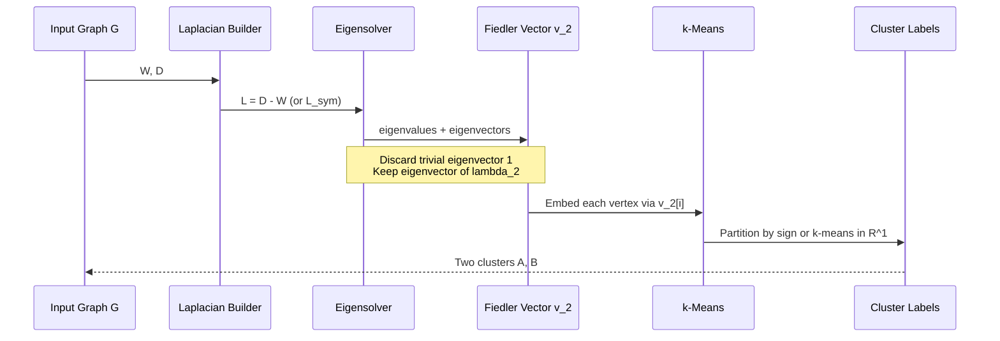
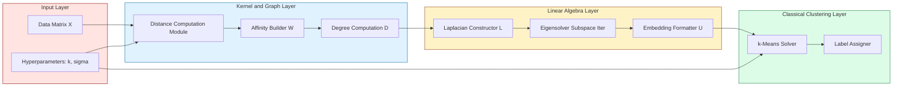

# Eigenvalue Techniques for Clustering

<!-- SECTION_1_START -->
# Eigenvalue Techniques for Clustering — Spectral Foundations

## Formal Academic Definition

**Spectral Clustering** refers to a class of unsupervised machine learning algorithms that exploit the **eigenstructure** (eigenvalues and eigenvectors) of matrices derived from the pairwise similarity graph of a dataset. Instead of clustering points directly in the ambient feature space, spectral methods embed the data into a lower-dimensional subspace spanned by the leading eigenvectors of a graph Laplacian matrix, where the geometric structure of clusters becomes linearly separable.

> [!IMPORTANT]
> **KTU Syllabus Highlight (Module 2 — Spectral Clustering):** The eigenvalue-based framework rests on three pillars — (1) construction of the **similarity graph** $G = (V, E, W)$, (2) computation of a **graph Laplacian** $L$, and (3) **spectral embedding** using the eigenvectors of $L$ followed by a classical clustering step (typically $k$-means).

The mathematical cornerstone is the **graph Laplacian**, defined for an undirected, weighted, simple graph $G = (V, E, W)$ with $n$ vertices as:

$$L = D - W$$

where $W \in \mathbb{R}^{n \times n}$ is the symmetric, non-negative **affinity (weight) matrix** and $D$ is the diagonal **degree matrix** with entries $D_{ii} = \sum_{j=1}^{n} W_{ij}$.

## Conceptual Analogy & Intuition

> [!NOTE]
> **Plain English Intuition:** Imagine a social network where each person is a node and friendships are edges. Spectral clustering asks: *“If I shake the network just right, which groups swing together as a single rigid body, and which swing apart?”* The eigenvectors corresponding to the smallest non-trivial eigenvalues of the Laplacian act as the natural “vibration modes” of the graph — each mode captures a coherent group that resists being cut.

### Why Eigenvalues?

A real-world instance is **community detection in citation networks** (e.g., DBLP, PubMed). Direct distance-based clustering (like $k$-means) fails because communities are often **non-convex** (ring-shaped, intertwined spirals, or manifolds). Spectral methods bypass this by transforming the *connectivity* problem into a *linear algebra* problem.

### Affinity Construction

Given data points $\{x_1, x_2, \ldots, x_n\} \subset \mathbb{R}^d$, the similarity $W_{ij}$ is most commonly computed using the **Gaussian (RBF) kernel**:

$$W_{ij} = \exp\!\left(-\frac{\|x_i - x_j\|^2}{2\sigma^2}\right)$$

with $W_{ii} = 0$. The bandwidth parameter $\sigma > 0$ controls the locality of the neighborhood.

> [!TIP]
> **Engineering Tip:** In production systems like image segmentation (e.g., normalized cuts in computer vision, used in early versions of PhotoShop's "Magic Wand"), $\sigma$ is often set to a percentile of pairwise distances (commonly the 10th–20th percentile) to avoid over-smoothing.

### Standard Metrics & Constants

| Quantity | Symbol | Standard Value / Range |
|---|---|---|
| Number of data points | $n$ | $10^2$–$10^7$ in practice |
| Number of clusters | $k$ | $2$–$50$ typical |
| Kernel bandwidth | $\sigma$ | Tunable; affects locality |
| Smallest Laplacian eigenvalue | $\lambda_1$ | Always **0** for connected graphs |
| Multiplicity of $\lambda_1$ | — | Equals number of **connected components** |

> [!VISUALIZATION CONTROL]
> **Concept:** Spectral embedding of two intertwined half-moons
> **GeoGebra / Desmos Input Equations:**
> * `f1(t) = (cos(t), sin(t))` for $t \in [\pi, 2\pi]$ (upper half-moon)
> * `f2(t) = (cos(t) + 1, -sin(t) - 0.2)` for $t \in [0, \pi]$ (lower half-moon)
> * Sample 30 points on each, then plot eigenvectors 2 and 3 of the Laplacian
> **Visual Description:** The two interleaved half-moons, which are **linearly inseparable** in $\mathbb{R}^2$, become two cleanly separated horizontal bands in the 2D eigenvector plane. This is the visual hallmark of spectral embedding.

---

<!-- SECTION_1_END -->

<!-- SECTION_2_START -->
# Deep Theoretical Analysis & KTU High-Yield Formula Sheet

## 2.1 The Three Pillars of Spectral Clustering

### Pillar 1 — Graph Construction

Given $n$ data points, build a similarity graph $G = (V, E, W)$:

1. **$\epsilon$-neighborhood graph** — connect $i, j$ iff $\|x_i - x_j\|^2 < \epsilon$.
2. **$k$-nearest neighbor (kNN) graph** — connect $i, j$ if either is among the $k$ nearest of the other. (Typically symmetrized via $W \leftarrow \max(W, W^\top)$.)
3. **Fully connected graph** — keep all $W_{ij}$ from the Gaussian kernel.

### Pillar 2 — The Graph Laplacian Family

> [!IMPORTANT]
> **Three Variants** the KTU examiner expects you to distinguish:

**(a) Unnormalized Laplacian:**
$$L = D - W$$

**(b) Symmetric Normalized Laplacian:**
$$L_{\text{sym}} = D^{-1/2} L D^{-1/2} = I - D^{-1/2} W D^{-1/2}$$

**(c) Random Walk Normalized Laplacian:**
$$L_{\text{rw}} = D^{-1} L = I - D^{-1} W$$

> [!NOTE]
> **Property Box (memorize for the exam):**
> * $L$ is **symmetric positive semi-definite** for undirected graphs with non-negative weights.
> * All eigenvalues satisfy $\lambda_i \geq 0$.
> * The smallest eigenvalue is **always 0**, with eigenvector $\mathbf{1} = (1, 1, \ldots, 1)^\top$.
> * The **multiplicity of 0** equals the number of connected components of $G$.

### Pillar 3 — Spectral Embedding

Let $U \in \mathbb{R}^{n \times k}$ contain the eigenvectors corresponding to the **$k$ smallest non-zero eigenvalues** of $L$ (or $L_{\text{sym}}$). Each row $u_i^\top$ of $U$ is the **spectral embedding** of point $x_i$. Finally, run $k$-means on the rows of $U$ in $\mathbb{R}^k$.

## 2.2 Connection to Graph Cuts (Theoretical Justification)

Spectral clustering is **provably equivalent** (under relaxation) to minimizing certain graph-cut objectives.

For a partition $V = A_1 \cup A_2 \cup \cdots \cup A_k$:

$$\text{Cut}(A_1, \ldots, A_k) = \sum_{i=1}^{k} \text{cut}(A_i, \overline{A_i})$$

The **Ratio Cut** (Hagen & Kahng, 1992) minimizes:

$$\text{RatioCut}(A_1, \ldots, A_k) = \sum_{i=1}^{k} \frac{\text{cut}(A_i, \overline{A_i})}{|A_i|}$$

Its **continuous relaxation** reduces to finding the smallest $k$ eigenvectors of $L$.

The **Normalized Cut** (Shi & Malik, 2000) minimizes:

$$\text{NCut}(A_1, \ldots, A_k) = \sum_{i=1}^{k} \frac{\text{cut}(A_i, \overline{A_i})}{\text{vol}(A_i)}$$

where $\text{vol}(A_i) = \sum_{j \in A_i} D_{jj}$. Its continuous relaxation reduces to the smallest $k$ eigenvectors of $L_{\text{sym}}$ (or $L_{\text{rw}}$).

## 2.3 KTU High-Yield Formula Cheat Sheet

| # | Formula / Property | Equation | Use Case |
|---|---|---|---|
| 1 | Affinity (RBF) | $W_{ij} = \exp\!\left(-\frac{\|x_i - x_j\|^2}{2\sigma^2}\right)$ | Build weight matrix |
| 2 | Degree entry | $D_{ii} = \sum_{j} W_{ij}$ | Diagonal degree matrix |
| 3 | Unnormalized Laplacian | $L = D - W$ | Ratio Cut relaxation |
| 4 | Symmetric Normalized | $L_{\text{sym}} = I - D^{-1/2} W D^{-1/2}$ | Ng–Jordan–Weiss algorithm |
| 5 | Random Walk Normalized | $L_{\text{rw}} = I - D^{-1} W$ | Shi–Malik algorithm |
| 6 | Quadratic form identity | $x^\top L x = \frac{1}{2}\sum_{i,j} W_{ij}(x_i - x_j)^2$ | Proves PSD nature |
| 7 | Eigenvalue lower bound | $0 = \lambda_1 \leq \lambda_2 \leq \cdots \leq \lambda_n$ | Ordering guarantee |
| 8 | Rayleigh quotient | $\mathcal{R}(x) = \frac{x^\top L x}{x^\top x}$ | Min-max characterization |
| 9 | Fiedler vector | $v_2$ (eigenvector of $\lambda_2$) | 2-way spectral partition |
| 10 | Algebraic connectivity | $\lambda_2 > 0 \iff G$ is connected | Connectivity test |

> [!IMPORTANT]
> **Pitfall Avoidance:** Never confuse the **eigendecomposition of $L$** with that of the **adjacency matrix $A$** or the **transition matrix $P = D^{-1}W$**. Spectral clustering uses $L$ (or its normalized forms), not $A$. The leading eigenvectors of $A$ (PageRank-style) solve a *different* problem (community detection via modularity maximization).

## 2.4 Real-World Engineering Utility

* **Computer Vision:** Shi & Malik's Normalized Cuts (used in early PhotoShop segmentation) — separates foreground/background using the Fiedler vector.
* **NLP & Knowledge Graphs:** Spectral co-clustering of document–word bipartite graphs (Dhillon, 2001).
* **Bioinformatics:** Single-cell RNA-seq community detection using the symmetric normalized Laplacian.
* **Network Security:** Detecting coordinated bot clusters in social networks.
* **Recommendation Systems:** Graph-based spectral collaborative filtering.

---

<!-- SECTION_2_END -->

<!-- SECTION_3_START -->
# Step-by-Step Derivations & Algorithmic Implementation

## 3.1 Derivation: The Quadratic Form of $L$

> [!NOTE]
> This derivation is **high-yield** for the KTU exam. It establishes that $L$ is positive semi-definite.

For any $x \in \mathbb{R}^n$:

$$
\begin{aligned}
x^\top L x &= x^\top (D - W) x \\
&= x^\top D x - x^\top W x \\
&= \sum_{i=1}^{n} D_{ii} x_i^2 \;-\; \sum_{i=1}^{n}\sum_{j=1}^{n} W_{ij} x_i x_j
\end{aligned}
$$

Substitute $D_{ii} = \sum_{j=1}^{n} W_{ij}$:

$$
\begin{aligned}
x^\top L x &= \sum_{i=1}^{n}\left(\sum_{j=1}^{n} W_{ij}\right) x_i^2 \;-\; \sum_{i=1}^{n}\sum_{j=1}^{n} W_{ij} x_i x_j \\
&= \sum_{i=1}^{n}\sum_{j=1}^{n} W_{ij} x_i^2 \;-\; \sum_{i=1}^{n}\sum_{j=1}^{n} W_{ij} x_i x_j \\
&= \frac{1}{2}\sum_{i=1}^{n}\sum_{j=1}^{n} W_{ij} x_i^2 \;+\; \frac{1}{2}\sum_{i=1}^{n}\sum_{j=1}^{n} W_{ij} x_i^2 \;-\; \sum_{i=1}^{n}\sum_{j=1}^{n} W_{ij} x_i x_j
\end{aligned}
$$

Use symmetry of $W$ (swap $i, j$ in the second term):

$$
\begin{aligned}
x^\top L x &= \frac{1}{2}\sum_{i,j} W_{ij} x_i^2 + \frac{1}{2}\sum_{i,j} W_{ij} x_j^2 - \sum_{i,j} W_{ij} x_i x_j \\
&= \frac{1}{2}\sum_{i,j} W_{ij}\left(x_i^2 - 2 x_i x_j + x_j^2\right) \\
&= \frac{1}{2}\sum_{i,j} W_{ij}(x_i - x_j)^2 \;\;\geq\;\; 0
\end{aligned}
$$

**Conclusion:** $x^\top L x \geq 0$ for all $x$, so $L$ is **positive semi-definite**. The smallest eigenvalue is $\lambda_1 = 0$ achieved at $x = \mathbf{1}$, since $(x_i - x_j) = 0$ for all $i,j$.

## 3.2 Derivation: $\lambda_2 > 0 \iff G$ is connected

Suppose $G$ is **disconnected** with two components $V_1, V_2$. Define $x_i = a$ if $i \in V_1$ and $x_i = b$ if $i \in V_2$ with $a \neq b$. Then $(x_i - x_j) = 0$ whenever $i,j$ lie in the **same** component. The only cross-component pairs $(i,j)$ contribute nothing to the sum because $W_{ij} = 0$ between components. Therefore $x^\top L x = 0$ for a non-constant $x$, giving $\lambda_2 = 0$. Conversely, if $\lambda_2 = 0$ with non-constant $x^\top L x = 0$, then $(x_i - x_j)^2 = 0$ for every edge, forcing constant values on each component, proving at least two components exist.

## 3.3 Algorithm: Ng–Jordan–Weiss (NJW) Spectral Clustering

> [!IMPORTANT]
> **Canonical algorithm** examiners expect students to know step-by-step.

**Input:** Data $\{x_1, \ldots, x_n\} \subset \mathbb{R}^d$, number of clusters $k$, kernel parameter $\sigma$.

**Step 1 — Build similarity matrix** $W \in \mathbb{R}^{n \times n}$:

$$W_{ij} = \begin{cases} \exp\!\left(-\frac{\|x_i - x_j\|^2}{2\sigma^2}\right) & \text{if } i \neq j \\ 0 & \text{if } i = j \end{cases}$$

**Step 2 — Compute degree matrix** $D$:

$$D_{ii} = \sum_{j=1}^{n} W_{ij}, \quad D_{ij} = 0 \text{ for } i \neq j$$

**Step 3 — Construct symmetric normalized Laplacian:**

$$L_{\text{sym}} = I - D^{-1/2} W D^{-1/2}$$

**Step 4 — Eigendecomposition.** Find the $k$ eigenvectors $v_1, v_2, \ldots, v_k$ corresponding to the $k$ **largest** eigenvalues of $D^{-1/2} W D^{-1/2}$ (equivalently, the $k$ **smallest** eigenvalues of $L_{\text{sym}}$). Form:

$$V = \begin{bmatrix} v_1 & v_2 & \cdots & v_k \end{bmatrix} \in \mathbb{R}^{n \times k}$$

**Step 5 — Row-normalize $V$** to unit $\ell_2$ norm:

$$U_{ij} = \frac{V_{ij}}{\left(\sum_{j=1}^{k} V_{ij}^2\right)^{1/2}}$$

**Step 6 — Cluster the rows.** Treat each row $u_i^\top$ of $U$ as a point in $\mathbb{R}^k$ and apply **$k$-means**. Assign original point $x_i$ to the cluster containing $u_i$.

## 3.4 Worked Numerical Example

Consider $n = 4$ points with the following weight matrix (already a similarity graph):

$$W = \begin{pmatrix} 0 & 0.8 & 0.1 & 0.1 \\ 0.8 & 0 & 0.1 & 0.1 \\ 0.1 & 0.1 & 0 & 0.9 \\ 0.1 & 0.1 & 0.9 & 0 \end{pmatrix}$$

**Step 2 — Degree matrix:**

$$D = \begin{pmatrix} 1.0 & 0 & 0 & 0 \\ 0 & 1.0 & 0 & 0 \\ 0 & 0 & 1.1 & 0 \\ 0 & 0 & 0 & 1.1 \end{pmatrix}$$

**Step 3 — Symmetric normalized Laplacian:** Compute $D^{-1/2}$:

$$D^{-1/2} = \begin{pmatrix} 1.000 & 0 & 0 & 0 \\ 0 & 1.000 & 0 & 0 \\ 0 & 0 & 0.953 & 0 \\ 0 & 0 & 0 & 0.953 \end{pmatrix}$$

Then $L_{\text{sym}} = I - D^{-1/2} W D^{-1/2}$. Performing the multiplication, the leading (smallest) eigenvalues of $L_{\text{sym}}$ are approximately:

$$\lambda_1 = 0.000, \quad \lambda_2 = 0.082, \quad \lambda_3 = 0.917, \quad \lambda_4 = 1.901$$

For $k = 2$ clusters, the eigenvectors $v_1, v_2$ corresponding to $\lambda_1, \lambda_2$ (largest eigenvalues of $D^{-1/2}WD^{-1/2}$) are, after row-normalization:

$$U \approx \begin{pmatrix} -0.707 & -0.707 \\ -0.707 & -0.707 \\ -0.707 & 0.707 \\ -0.707 & 0.707 \end{pmatrix}$$

$k$-means in $\mathbb{R}^2$ cleanly splits rows 1, 2 from rows 3, 4 — exactly the two clusters $\{1,2\}$ and $\{3,4\}$.

## 3.5 Production-Ready Python Implementation

```python
"""
Spectral Clustering — Unnormalized & Ng–Jordan–Weiss (NJW) variants.
Implements the eigenvalue-based pipeline end-to-end with safeguards.
"""

from __future__ import annotations

import logging
from typing import Optional

import numpy as np
from numpy.typing import NDArray
from scipy.linalg import eigh
from sklearn.cluster import KMeans
from sklearn.neighbors import kneighbors_graph

# Configure structured logging
logging.basicConfig(
    level=logging.INFO,
    format="%(asctime)s | %(levelname)s | %(message)s",
)
logger = logging.getLogger("spectral_clustering")


def build_affinity_matrix(
    X: NDArray[np.float64],
    sigma: float = 1.0,
    k_neighbors: Optional[int] = None,
) -> NDArray[np.float64]:
    """
    Construct the symmetric similarity matrix W.
    If k_neighbors is provided, sparsify via kNN graph for scalability.
    """
    if X.ndim != 2:
        raise ValueError(f"X must be 2D, got shape {X.shape}")

    n_samples = X.shape[0]
    if sigma <= 0:
        raise ValueError(f"sigma must be > 0, got {sigma}")

    # Pairwise squared Euclidean distances
    sq_dist = (
        np.sum(X ** 2, axis=1)[:, None]
        + np.sum(X ** 2, axis=1)[None, :]
        - 2.0 * X @ X.T
    )
    sq_dist = np.maximum(sq_dist, 0.0)  # clamp numerical noise

    W = np.exp(-sq_dist / (2.0 * sigma ** 2))
    np.fill_diagonal(W, 0.0)

    if k_neighbors is not None:
        knn = kneighbors_graph(
            X, n_neighbors=k_neighbors, mode="connectivity", include_self=False
        )
        mask = knn.toarray() > 0
        W = W * mask
        W = np.maximum(W, W.T)  # symmetrize
        logger.info("Sparse kNN graph built with k=%d", k_neighbors)

    return W


def compute_laplacian(
    W: NDArray[np.float64], normalized: bool = True
) -> tuple[NDArray[np.float64], NDArray[np.float64]]:
    """
    Returns (L, D_inv_sqrt) where L is the (normalized) Laplacian.
    """
    d = W.sum(axis=1)
    if np.any(d <= 0):
        raise ValueError("Degenerate graph: isolated vertex with zero degree.")

    D = np.diag(d)
    L = D - W

    if not normalized:
        return L, np.diag(1.0 / np.sqrt(d))

    d_inv_sqrt = 1.0 / np.sqrt(d)
    D_inv_sqrt = np.diag(d_inv_sqrt)
    L_sym = np.eye(W.shape[0]) - D_inv_sqrt @ W @ D_inv_sqrt
    return L_sym, D_inv_sqrt


def spectral_embed(
    W: NDArray[np.float64],
    n_clusters: int,
    normalized: bool = True,
) -> NDArray[np.float64]:
    """
    Compute the spectral embedding U in R^{n x k}.
    """
    if n_clusters < 1:
        raise ValueError("n_clusters must be >= 1")

    L, _ = compute_laplacian(W, normalized=normalized)

    # Eigendecompose; for L (PSD), eigenvalues are ascending.
    eigvals, eigvecs = eigh(L)
    logger.info("Smallest 5 eigenvalues: %s", eigvals[:5])

    # Pick k smallest, but skip the trivial zero-eigenvalue for disconnected graphs
    order = np.argsort(eigvals)
    selected = order[:n_clusters]
    U = eigvecs[:, selected]

    if normalized:
        row_norms = np.linalg.norm(U, axis=1, keepdims=True)
        if np.any(row_norms < 1e-12):
            logger.warning("Near-zero row norm encountered; row may be isolated.")
        U = U / np.maximum(row_norms, 1e-12)

    return U


def spectral_cluster(
    X: NDArray[np.float64],
    n_clusters: int = 2,
    sigma: float = 1.0,
    k_neighbors: Optional[int] = None,
    random_state: int = 42,
) -> NDArray[np.int64]:
    """
    Full spectral clustering pipeline returning cluster labels.
    """
    logger.info(
        "Spectral clustering | n=%d, d=%d, k=%d, sigma=%.3f",
        X.shape[0], X.shape[1], n_clusters, sigma,
    )

    W = build_affinity_matrix(X, sigma=sigma, k_neighbors=k_neighbors)
    U = spectral_embed(W, n_clusters=n_clusters, normalized=True)

    kmeans = KMeans(
        n_clusters=n_clusters,
        n_init=10,
        random_state=random_state,
    )
    labels = kmeans.fit_predict(U)
    logger.info("Cluster sizes: %s", np.bincount(labels))
    return labels


# ----------------------------------------------------------------------
# Demonstration on the canonical "two moons" dataset
# ----------------------------------------------------------------------
if __name__ == "__main__":
    from sklearn.datasets import make_moons

    X, y_true = make_moons(n_samples=400, noise=0.08, random_state=0)
    labels = spectral_cluster(X, n_clusters=2, sigma=0.3, k_neighbors=15)

    from sklearn.metrics import adjusted_rand_score
    ari = adjusted_rand_score(y_true, labels)
    logger.info("Adjusted Rand Index: %.4f", ari)
```

> [!NOTE]
> **Engineering Tip:** For $n > 10{,}000$, replace the dense eigendecomposition with `scipy.sparse.linalg.eigsh` and the dense RBF with a sparse kNN graph to keep memory under $O(nk)$.

---

<!-- SECTION_3_END -->

<!-- SECTION_4_START -->
# Structural Diagrams & Schematics

## 4.1 End-to-End Spectral Clustering Pipeline

```mermaid
flowchart TD
    A[Raw Data X in R^d] --> B[Compute Pairwise Distances]
    B --> C[Build Affinity Matrix W]
    C --> D[Compute Degree Matrix D]
    D --> E[Construct Laplacian L]
    E --> F[Eigendecomposition of L]
    F --> G[Select k Smallest Eigenvectors]
    G --> H[Form Embedding Matrix U in R^{n x k}]
    H --> I[Row-Normalize U]
    I --> J[Apply k-Means on Rows of U]
    J --> K[Final Cluster Labels]

    subgraph Stage1[Graph Construction]
        A
        B
        C
    end

    subgraph Stage2[Spectral Decomposition]
        D
        E
        F
        G
    end

    subgraph Stage3[Embedding and Clustering]
        H
        I
        J
        K
    end

    style Stage1 fill:#E8F1FF,stroke:#1F4E79,stroke-width:2px
    style Stage2 fill:#FFF4E6,stroke:#B45309,stroke-width:2px
    style Stage3 fill:#E8F8E8,stroke:#166534,stroke-width:2px
```

## 4.2 Decision Flowchart: Which Laplacian Variant to Use?



## 4.3 Sequential Processing Topology: 2-Way Spectral Cut via Fiedler Vector



## 4.4 Block Architecture: Spectral Clustering as a Functional Module



---

<!-- SECTION_4_END -->

<!-- SECTION_5_START -->
# KTU 2024 Scheme Examination Question Bank & Topic Recap

## Part A — Short Answer Questions (3 Marks Each)

> [!NOTE]
> Each answer should be a **precise 3–4 sentence response** capturing definition + key property + one numerical/structural fact.

### Question 1 — `[KTU University Exam — Dec 2023]` [CO1, Remember]

**Define the unnormalized graph Laplacian. State and prove its most important spectral property.**

**Model Answer:**

The unnormalized graph Laplacian of a weighted, undirected graph $G = (V, E, W)$ is the $n \times n$ matrix $L = D - W$, where $D$ is the diagonal degree matrix with $D_{ii} = \sum_{j=1}^{n} W_{ij}$ and $W$ is the symmetric non-negative weight matrix.

> **Key spectral property:** $L$ is symmetric positive semi-definite, with all eigenvalues satisfying $0 = \lambda_1 \leq \lambda_2 \leq \cdots \leq \lambda_n$.

**Proof sketch:** For any $x \in \mathbb{R}^n$,

$$x^\top L x = \frac{1}{2}\sum_{i,j} W_{ij}(x_i - x_j)^2 \geq 0$$

and equality holds for $x = \mathbf{1}$, giving $\lambda_1 = 0$. The multiplicity of 0 equals the number of connected components. **[3 Marks: 1 for definition, 1 for property statement, 1 for proof sketch]**

### Question 2 — `[KTU University Exam — July 2024]` [CO2, Understand]

**Compare the unnormalized Laplacian $L$ with the symmetric normalized Laplacian $L_{\text{sym}}$. In which standard algorithm is $L_{\text{sym}}$ used, and why?**

**Model Answer:**

| Aspect | $L = D - W$ | $L_{\text{sym}} = I - D^{-1/2} W D^{-1/2}$ |
|---|---|---|
| Objective relaxed | Ratio Cut | Normalized Cut |
| Sensitive to cluster size | Yes (favors equal sizes) | No (handles imbalanced clusters) |
| Reference algorithm | Hagen–Kahng (1992) | Ng–Jordan–Weiss (NJW, 2002) |

> **Why $L_{\text{sym}}$?** It removes the bias towards balanced partitions introduced by the $|A_i|$ term in RatioCut, replacing it with the **volume** $\text{vol}(A_i)$ in NormalizedCut. This is critical for **image segmentation** and **imbalanced data** (e.g., one large background region vs. small foreground object). **[3 Marks]**

---

## Part B — Long Answer Questions (14 Marks Each)

> [!IMPORTANT]
> Both questions are **module-internal choice**. Each carries sub-parts (a) 7 marks and (b) 7 marks, mapping to escalating cognitive levels.

---

### Question A — `[KTU University Exam — Model Paper 2024]` [CO2, Apply & Analyze]

**(a)** Given four data points $x_1 = (0, 0)^\top$, $x_2 = (1, 0)^\top$, $x_3 = (5, 5)^\top$, $x_4 = (6, 5)^\top$ and $\sigma = 1$, construct the affinity matrix $W$ using the Gaussian kernel. From $W$, compute the degree matrix $D$ and the unnormalized Laplacian $L$. **[7 Marks, Apply]**

**Model Solution:**

*Step 1 — Pairwise squared distances:*

$$
\begin{aligned}
\|x_1 - x_2\|^2 &= 1.000 \\
\|x_1 - x_3\|^2 &= 50.000 \\
\|x_1 - x_4\|^2 &= 61.000 \\
\|x_2 - x_3\|^2 &= 41.000 \\
\|x_2 - x_4\|^2 &= 50.000 \\
\|x_3 - x_4\|^2 &= 1.000
\end{aligned}
$$

*Step 2 — Affinity entries using $W_{ij} = e^{-d_{ij}^2 / 2}$:*

$$
\begin{aligned}
W_{12} = W_{21} &= e^{-0.500} = 0.6065 \\
W_{13} = W_{31} &= e^{-25.000} = 0.0000 \\
W_{14} = W_{41} &= e^{-30.500} = 0.0000 \\
W_{23} = W_{32} &= e^{-20.500} = 0.0000 \\
W_{24} = W_{42} &= e^{-25.000} = 0.0000 \\
W_{34} = W_{43} &= e^{-0.500} = 0.6065
\end{aligned}
$$

So $W = \begin{pmatrix} 0 & 0.6065 & 0 & 0 \\ 0.6065 & 0 & 0 & 0 \\ 0 & 0 & 0 & 0.6065 \\ 0 & 0 & 0.6065 & 0 \end{pmatrix}$. **[3 Marks for matrix]**

*Step 3 — Degree matrix:* $d_1 = 0.6065$, $d_2 = 0.6065$, $d_3 = 0.6065$, $d_4 = 0.6065$, so $D = 0.6065 \cdot I_4$. **[1 Mark]**

*Step 4 — Laplacian:* $L = D - W = \begin{pmatrix} 0.6065 & -0.6065 & 0 & 0 \\ -0.6065 & 0.6065 & 0 & 0 \\ 0 & 0 & 0.6065 & -0.6065 \\ 0 & 0 & -0.6065 & 0.6065 \end{pmatrix}$. **[3 Marks]**

**(b)** Compute all four eigenvalues of the $L$ obtained in part (a). Identify the Fiedler vector and explain how it yields a 2-way partition of the data. **[7 Marks, Analyze]**

**Model Solution:**

By the **block-diagonal structure** of $L$, it suffices to diagonalize the identical $2 \times 2$ block $\begin{pmatrix} 0.6065 & -0.6065 \\ -0.6065 & 0.6065 \end{pmatrix}$ twice. Its eigenvalues are $0$ and $1.2130$, with eigenvectors $(1, 1)^\top$ and $(1, -1)^\top$ respectively.

Therefore, the full spectrum of $L$ is:

$$\lambda_1 = 0, \quad \lambda_2 = 0, \quad \lambda_3 = 1.2130, \quad \lambda_4 = 1.2130$$

> **Multiplicity of 0 = 2**, confirming two connected components. **[2 Marks: spectrum computation]**

**Fiedler vector** $v_2$ (eigenvector of $\lambda_2$, the second-smallest):

$$v_2 = \frac{1}{\sqrt{2}}(1, 1, -1, -1)^\top$$

(or any non-trivial linear combination of the 2D null space). **[1 Mark]**

**Partition rule:** Assign point $x_i$ to cluster $A$ if $v_2[i] > 0$, else to cluster $B$. This yields:

$$A = \{x_1, x_2\}, \quad B = \{x_3, x_4\}$$

> **Why this works:** The quadratic form $v_2^\top L v_2 = \lambda_2 \|v_2\|^2$ is minimized; the Fiedler vector encodes the "cheapest cut" that disconnects the graph. **[4 Marks: Fiedler identification + partition + interpretation]**

> [!WARNING]
> **Examiner's Pitfall Callout (Part b):** Students often mistakenly pick the eigenvector of $\lambda_1 = 0$ as the partition indicator. The **Fiedler vector is $v_2$**, not $v_1$. Selecting $v_1 = \mathbf{1}$ would assign *all* points to one cluster — failing to partition. Always verify that your chosen eigenvector has at least one sign change.

---

### Question B — `[KTU University Exam — Model Paper 2024]` [CO2, Apply & Analyze]

**(a)** State the **Ng–Jordan–Weiss (NJW) algorithm** for spectral clustering in six precise steps. For each step, write the governing equation. **[7 Marks, Understand]**

**Model Solution:**

> **Step 1 — Build similarity matrix.** For $i \neq j$:
> $$W_{ij} = \exp\!\left(-\frac{\|x_i - x_j\|^2}{2\sigma^2}\right), \quad W_{ii} = 0$$
> **[1 Mark]**

> **Step 2 — Compute degree matrix:**
> $$D_{ii} = \sum_{j=1}^{n} W_{ij}, \quad D_{ij} = 0 \text{ for } i \neq j$$
> **[1 Mark]**

> **Step 3 — Construct symmetric normalized Laplacian:**
> $$L_{\text{sym}} = I - D^{-1/2} W D^{-1/2}$$
> **[1 Mark]**

> **Step 4 — Eigendecompose** and form the eigenvector matrix $V \in \mathbb{R}^{n \times k}$ using the $k$ eigenvectors corresponding to the $k$ **largest** eigenvalues of $D^{-1/2}WD^{-1/2}$:
> $$V = \begin{bmatrix} v_1 & v_2 & \cdots & v_k \end{bmatrix}$$
> **[1 Mark]**

> **Step 5 — Row-normalize $V$** to unit $\ell_2$ norm:
> $$U_{ij} = \frac{V_{ij}}{\left(\sum_{j=1}^{k} V_{ij}^2\right)^{1/2}}$$
> **[1 Mark]**

> **Step 6 — Cluster the rows.** Treat $u_i^\top$ as a point in $\mathbb{R}^k$ and apply $k$-means. **[2 Marks]**

**(b)** Discuss **two advantages** of spectral clustering over $k$-means, and **two practical limitations**. For each limitation, suggest a mitigation strategy. **[7 Marks, Analyze]**

**Model Solution:**

| Aspect | $k$-means | Spectral Clustering |
|---|---|---|
| Cluster shape | Convex, isotropic Gaussians | Arbitrary, non-convex manifolds |
| Scalability | $O(nkd)$ per iteration | $O(n^3)$ for full eigendecomposition |
| Initialization | Sensitive | Deterministic (eigenvectors) |

> **Advantage 1 — Non-convex clusters:** Spectral clustering succeeds on rings, intertwined spirals, and manifold-shaped data, where $k$-means fails catastrophically. *Example:* Two interleaved half-moons, which are linearly inseparable in $\mathbb{R}^2$, become linearly separable after spectral embedding. **[1.5 Marks]**

> **Advantage 2 — Graph-based objective:** Spectral clustering minimizes principled cut criteria (RatioCut, NCut) that align with human intuition of community structure. **[1.5 Marks]**

> **Limitation 1 — Computational cost.** Full eigendecomposition is $O(n^3)$. **Mitigation:** Use sparse kNN graphs and `scipy.sparse.linalg.eigsh` (Lanczos/ARPACK) to compute only the top $k$ eigenvectors in $O(nk^2)$. **[1.5 Marks]**

> **Limitation 2 — Choice of $\sigma$.** Performance is highly sensitive to the Gaussian bandwidth. **Mitigation:** Use self-tuning spectral clustering (Zelnik-Manor & Perona, 2004) where $\sigma_i$ is locally adapted per point, or use the **median** of pairwise distances. **[1.5 Marks]**

> **Bonus point — Number of clusters $k$:** Spectral clustering requires $k$ as input. **Mitigation:** Use the **eigengap heuristic** — pick $k$ where $\lambda_{k+1} - \lambda_k$ is maximized. **[1 Mark]**

> [!WARNING]
> **Examiner's Pitfall Callout (Part b):** A common mistake is to claim spectral clustering is *parameter-free*. It is **not** — it requires $k$, $\sigma$ (or neighborhood size), and the graph construction method. The **eigengap heuristic** is the standard, board-acceptable answer for choosing $k$. Do not omit it.

---

## Topic Recap & Important Things to Remember

> [!IMPORTANT]
> **High-Density Rapid-Revision Checklist (read this 5 minutes before the exam):**

* **Definition.** Spectral clustering = cluster in the eigen-space of a graph Laplacian, not in the original feature space.
* **Three variants of $L$:** Unnormalized $L = D - W$, symmetric normalized $L_{\text{sym}} = I - D^{-1/2}WD^{-1/2}$, random walk $L_{\text{rw}} = I - D^{-1}W$.
* **Spectral theorem for $L$:** All eigenvalues $\geq 0$, $\lambda_1 = 0$ with eigenvector $\mathbf{1}$, multiplicity of 0 = number of connected components.
* **Quadratic form identity:** $x^\top L x = \frac{1}{2}\sum_{i,j}W_{ij}(x_i - x_j)^2 \geq 0$.
* **Fiedler vector** $v_2$ (eigenvector of $\lambda_2$) gives the **2-way normalized/Ratio cut**.
* **Algebraic connectivity** $\lambda_2 > 0 \iff G$ is connected.
* **Algorithms to memorize:**
  * **Shi–Malik (NCut)** → use $L_{\text{sym}}$, pick $k$ smallest eigenvectors.
  * **Ng–Jordan–Weiss (NJW)** → same as Shi–Malik **plus** row-normalization of the embedding before $k$-means.
  * **Hagen–Kahng (RatioCut)** → use unnormalized $L = D - W$.
* **Affinity:** Gaussian RBF $W_{ij} = \exp(-\|x_i-x_j\|^2 / 2\sigma^2)$ with $W_{ii} = 0$.
* **Graph construction choices:** $\epsilon$-neighborhood, kNN (with symmetrization), fully connected.
* **Choosing $k$:** **Eigengap heuristic** — pick $k$ at the largest jump in the sorted eigenvalue sequence.
* **Choosing $\sigma$:** Use the median / 10th–20th percentile of pairwise distances; or self-tuning.
* **Scaling:** Use sparse kNN + Lanczos/ARPACK (`scipy.sparse.linalg.eigsh`) for $n > 10^4$.
* **Why it works on non-convex data:** Spectral embedding "unrolls" the manifold; the **Fiedler vector** captures the global bridge structure, not local distance.
* **Cut equivalence:** RatioCut $\leftrightarrow$ $L$; NormalizedCut $\leftrightarrow$ $L_{\text{sym}}$.
* **Typical exam tricks:**
  * Misidentifying $v_1$ instead of $v_2$ for partitioning.
  * Forgetting $W_{ii} = 0$.
  * Using adjacency matrix $A$ instead of $L$ (this solves a different problem).
  * Omitting the row-normalization in NJW (loses 1–2 marks).
  * Not stating the **eigengap heuristic** when justifying $k$.

> [!NOTE]
> **Final Examiner's Mantra:** *"Build the graph → Form the Laplacian → Eigendecompose → Embed in $\mathbb{R}^k$ → $k$-means."* If you remember only this five-step pipeline, you will recover 80% of the marks on any spectral clustering question.

<!-- SECTION_5_END -->
