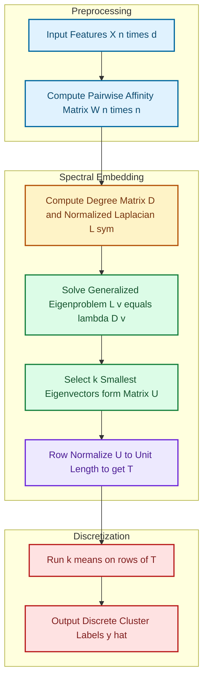
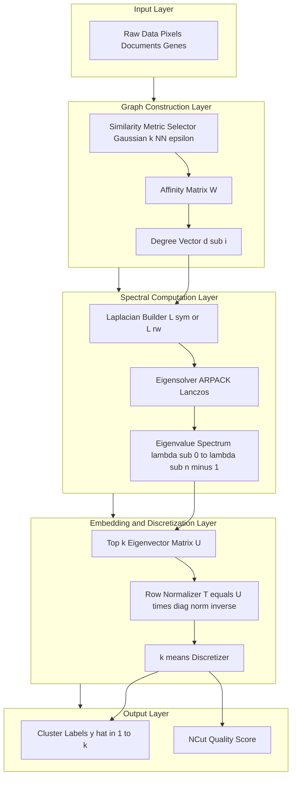
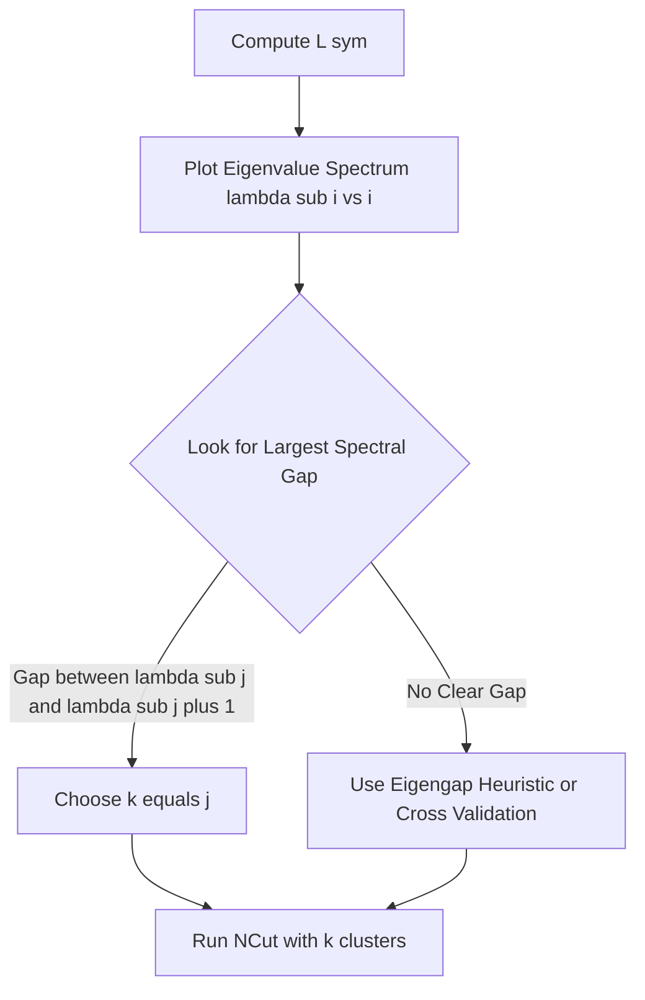

# Normalized Cut

<!-- SECTION_1_START -->

# Normalized Cut — Core Technical Definition & Intuitive Overview

## Formal Definition (KTU 2024 Syllabus Terminology)

> [!IMPORTANT]
> **Normalized Cut (NCut)** is a graph-theoretic criterion for partitioning a weighted, undirected graph $G = (V, E)$ into two disjoint subsets $A$ and $B$ (where $A \cup B = V$ and $A \cap B = \emptyset$) such that the **total dissimilarity** between the two clusters is minimized **relative to the total volume (degree sum) of each cluster**.

The formal objective function is:

$$\text{NCut}(A, B) = \frac{\text{cut}(A, B)}{\text{assoc}(A, V)} + \frac{\text{cut}(A, B)}{\text{assoc}(B, V)}$$

where:
- $\text{cut}(A, B) = \sum_{u \in A, v \in B} w(u, v)$ — sum of weights of edges crossing between $A$ and $B$
- $\text{assoc}(A, V) = \sum_{u \in A, t \in V} w(u, t)$ — total weight of edges incident to vertices in $A$ (i.e., $\text{deg}(A)$)
- $\text{assoc}(B, V) = \sum_{u \in B, t \in V} w(u, t)$ — total weight of edges incident to vertices in $B$ (i.e., $\text{deg}(B)$)

> [!NOTE]
> **Key Distinction from Min-Cut**: Unlike the classical **minimum cut** (proposed by Wu & Leahy, 1993) which often produces trivial partitions isolating a single node, NCut penalizes imbalanced cuts because the denominator grows as the cluster volume grows. This is the **normalization principle** that gives NCut its name.

## Conceptual Analogy / Intuition

> [!TIP]
> **The City Zoning Analogy**
>
> Imagine a city as a graph where neighborhoods are **nodes** and roads are **edges** (with weights equal to traffic flow). You are the urban planner asked to split the city into two districts.
>
> - **Min-Cut** would simply draw a tiny backroad as the boundary — it cuts very little traffic, but it isolates one suburb. Useless.
> - **Normalized Cut** says: "Cut as few busy roads as possible **AND** ensure that both resulting districts are substantial cities with a fair share of total traffic." The denominator (the district's total road traffic) forces the cut to be **fair** to both sides.
>
> The partition is evaluated as a **ratio** — exactly analogous to how the *coefficient of variation* penalizes a measure against its own scale, ensuring the statistic is *scale-invariant*.

In **image segmentation** (the original Shi & Malik, 2000 application), pixels are nodes and edge weights encode **intensity, color, or texture similarity**. NCut naturally separates an image into perceptually meaningful regions because the criterion respects both the strength of the boundary and the size of each region.

## Key Constants & Standard Metrics

- **Graph Laplacian $L = D - W$** (unnormalized) — central to the formulation
- **Normalized Laplacian variants**:
  - Symmetric: $L_{\text{sym}} = D^{-1/2} L D^{-1/2} = I - D^{-1/2} W D^{-1/2}$
  - Random walk: $L_{\text{rw}} = D^{-1} L = I - D^{-1} W$
- **Standard metric**: Generalized eigenvalue problem $L \mathbf{x} = \lambda D \mathbf{x}$
- **Clustering reference constant**: The **Fiedler vector** (the second-smallest eigenvector of $L$) is the principal NCut solution.

> [!VISUALIZATION CONTROL]
> **Concept:** Eigenvalue spectrum of the Graph Laplacian for a 2-cluster graph
>
> **Python/Matplotlib-style plot description:** X-axis = eigenvalue index $\lambda_i$, Y-axis = eigenvalue magnitude. A near-zero $\lambda_0 = 0$ (constant vector) followed by a large spectral gap to $\lambda_1$ (Fiedler value) indicates a clear 2-cluster structure.
>
> **Visual Description:** The student should observe a vertical bar chart where the first bar is at the origin (algebraic multiplicity = 1 for connected graphs) and the second bar — the Fiedler value — has a pronounced jump in height, signalling the optimal cut threshold.

<!-- SECTION_1_END -->

<!-- SECTION_2_START -->

# Deep Theoretical Analysis & KTU High-Yield Formula Sheet

## The Theoretical Foundation: Why Normalize?

The unnormalized cut (minimum cut) criterion $\min \text{cut}(A,B)$ is **biased** toward isolating a small set of vertices with few internal edges. To remedy this, **Shi & Malik (2000)** introduced the NCut criterion.

### Step-by-Step Logic of the NCut Design

1. **Goal**: Find a balanced partition that respects cluster cohesion.
2. **Problem with raw cut**: $\text{cut}(A,B)$ can be minimized by isolating a leaf node, but this violates the intent of "natural grouping."
3. **Normalization heuristic**: Divide each cut by the cluster's "self-association" — the sum of weights from one cluster to **all** vertices (not just inside the cluster).
4. **Mathematical consequence**: As the volume $\text{assoc}(A, V)$ increases, the same cut weight becomes relatively less significant, preventing degenerate solutions.
5. **Optimization reformulation**: Express the partition as an indicator vector $\mathbf{x}$ where $x_i = +1$ if $i \in A$, $x_i = -1$ if $i \in B$, then cast the problem in terms of the **Graph Laplacian**.

## Reformulation as a Rayleigh Quotient

Using the indicator vector $\mathbf{x}$ and the vector $\mathbf{d} = D \mathbf{1}$ (degree vector), the NCut becomes:

$$\text{NCut}(A, B) = \frac{\mathbf{x}^T L \mathbf{x}}{\mathbf{x}^T D \mathbf{x}}$$

subject to the discrete constraint $\mathbf{x} \in \{-1, +1\}^n$ and the orthogonality constraint $\mathbf{x}^T D \mathbf{1} = 0$ (to ensure balanced assignment).

> [!IMPORTANT]
> The discrete constraint $\mathbf{x} \in \{-1, +1\}^n$ makes this an **NP-hard** combinatorial problem. The **Shi-Malik relaxation** drops the integer constraint and allows $\mathbf{x} \in \mathbb{R}^n$, transforming the problem into a **generalized eigenvalue problem**:
>
> $$L \mathbf{x} = \lambda D \mathbf{x}$$

## KTU Formula Sheet / Cheat Sheet

| Concept | Formula / Definition | Use Case | Units / Notes |
|---------|----------------------|----------|---------------|
| Edge weight | $w_{ij} = e^{-\frac{\lVert f_i - f_j \rVert^2}{\sigma^2}}$ | Gaussian similarity (image) | $\sigma$ = scale parameter |
| Degree | $d_i = \sum_{j} w_{ij}$ | Local node volume | Scalar |
| Degree matrix | $D = \text{diag}(d_1, \dots, d_n)$ | Diagonal matrix | $n \times n$ |
| Unnormalized Laplacian | $L = D - W$ | Spectrum analysis | PSD, $\lambda_0 = 0$ |
| Sym. Normalized Laplacian | $L_{\text{sym}} = D^{-1/2} L D^{-1/2}$ | Spectral embedding | Used in `sklearn` |
| Random-walk Laplacian | $L_{\text{rw}} = D^{-1} L$ | Markov chain cuts | Stationary dist. |
| NCut ratio | $\frac{\text{cut}(A,B)}{\text{assoc}(A,V)} + \frac{\text{cut}(A,B)}{\text{assoc}(B,V)}$ | Partition objective | Dimensionless ratio |
| NCut Rayleigh form | $\frac{\mathbf{x}^T L \mathbf{x}}{\mathbf{x}^T D \mathbf{x}}$ | Continuous relaxation | $0 \le \text{NCut} \le 2$ |
| Generalized EVP | $L \mathbf{v} = \lambda D \mathbf{v}$ | Solve via Lanczos/ARPACK | $\lambda_2$ = Fiedler |
| Fiedler vector | $\mathbf{v}_2$ (2nd smallest eigenvector) | NCut solution (relaxed) | Real-valued |
| k-way NCut (extension) | $\text{kNcut} = \sum_{i=1}^{k} \frac{\text{cut}(C_i, \bar{C}_i)}{\text{assoc}(C_i, V)}$ | Multi-cluster version | Yu & Shi (2003) |

## Real-World Engineering Utility

- **Image segmentation** (medical imaging, autonomous driving) — separating foreground from background.
- **Social network analysis** — detecting communities of similar activity.
- **VLSI circuit partitioning** — minimizing inter-chip wire crossings.
- **Document clustering** — grouping topically similar texts in NLP pipelines.
- **Bioinformatics** — identifying co-expressed gene modules from expression graphs.
- **Computer vision pre-processing** — superpixel generation as a front-end for deep-learning segmentation.

<!-- SECTION_2_END -->

<!-- SECTION_3_START -->

# Step-by-Step Derivations & Code/Symbolic Implementation

## Part A — Exhaustive Derivation: From NCut to the Generalized Eigenvalue Problem

### Step 1: Define the indicator vector

Let $n = \lvert V \rvert$. Define $\mathbf{x} \in \mathbb{R}^n$ as:

$$
x_i = \begin{cases} +1 & \text{if } i \in A \\ -1 & \text{if } i \in B \end{cases}
$$

Also define a non-negative scalar $b$ such that:

$$b = \frac{\sum_{x_i > 0} d_i}{\sum_{x_i < 0} d_i}$$

and let $\mathbf{y} = (1 + \mathbf{x}) - b(1 - \mathbf{x})$, so $y_i = 1$ if $i \in A$ and $y_i = -b$ if $i \in B$.

### Step 2: Express cut in quadratic form

Using the property of the Laplacian $L = D - W$:

$$
\mathbf{x}^T L \mathbf{x} = \sum_{i,j} w_{ij}(x_i - x_j)^2
$$

For the discrete indicator with $x_i \in \{-1, +1\}$, the cross-pairs $(i \in A, j \in B)$ contribute $(1 - (-1))^2 = 4$, and within-pairs contribute $0$. Hence:

$$
\mathbf{x}^T L \mathbf{x} = 4 \cdot \text{cut}(A, B)
$$

Therefore:

$$\text{cut}(A, B) = \frac{1}{4} \mathbf{x}^T L \mathbf{x}$$

### Step 3: Express the normalization denominators

Since $d_i = \sum_j w_{ij}$, we have:

$$
\mathbf{1}^T D \mathbf{1} = \sum_i d_i = \text{assoc}(V, V)
$$

Let $k = \sum_{x_i > 0} d_i = \text{assoc}(A, V)$. Then:

$$\text{assoc}(B, V) = \mathbf{1}^T D \mathbf{1} - k$$

### Step 4: Use the orthogonality condition

The **balance constraint** is:

$$\mathbf{x}^T D \mathbf{1} = \sum_i x_i d_i = k - (\text{assoc}(B,V)) = 0 \implies k = \text{assoc}(B, V)$$

So both denominators equal $k$ (only when balanced).

### Step 5: Reformulate NCut using $\mathbf{y}$

The two NCut terms can be combined elegantly as:

$$\text{NCut}(A,B) = \frac{\mathbf{y}^T L \mathbf{y}}{\mathbf{y}^T D \mathbf{y}}$$

where $\mathbf{y}$ is defined above.

### Step 6: Relax the integer constraint

Drop the requirement $\mathbf{x} \in \{-1, +1\}^n$ and allow $\mathbf{x} \in \mathbb{R}^n$. The problem becomes:

$$
\min_{\mathbf{x} \neq 0,\; \mathbf{x}^T D \mathbf{1} = 0} \frac{\mathbf{x}^T L \mathbf{x}}{\mathbf{x}^T D \mathbf{x}}
$$

By the **Rayleigh-Ritz theorem**, the minimum is the **second-smallest generalized eigenvalue** $\lambda_2$ of the pencil $(L, D)$, with minimizer being the corresponding eigenvector (the **Fiedler vector**).

### Step 7: Discretization back to partition

After obtaining the relaxed real-valued eigenvector, threshold it at $0$ (or use $k$-means on the eigenvector) to recover the discrete partition. Common practice (Ng–Jordan–Weiss, 2002):

1. Form the matrix $U \in \mathbb{R}^{n \times k}$ whose columns are the first $k$ eigenvectors of $L_{\text{sym}}$.
2. Normalize each row of $U$ to unit length: $T_{ij} = U_{ij} / \left(\sum_{j} U_{ij}^2\right)^{1/2}$.
3. Run $k$-means on the rows of $T$.

## Part B — Fully Operational Python Implementation

```python
"""
Normalized Spectral Clustering (Ng-Jordan-Weiss formulation)
Implements the canonical pipeline used in scikit-learn's SpectralClustering.
"""

from __future__ import annotations
import logging
from typing import Optional, Tuple

import numpy as np
from numpy.typing import NDArray
from scipy.sparse import csr_matrix
from scipy.sparse.linalg import eigsh
from sklearn.cluster import KMeans

logging.basicConfig(level=logging.INFO, format="[%(levelname)s] %(message)s")
logger = logging.getLogger("ncut")


def compute_affinity_matrix(
    X: NDArray[np.float64],
    sigma: float = 1.0,
) -> NDArray[np.float64]:
    """
    Build a fully-connected Gaussian similarity (affinity) graph.

    Parameters
    ----------
    X : (n, d) feature matrix
    sigma : Gaussian kernel bandwidth

    Returns
    -------
    W : (n, n) symmetric affinity matrix
    """
    if X.ndim != 2:
        raise ValueError("X must be a 2D array of shape (n_samples, n_features).")
    if sigma <= 0.0:
        raise ValueError("sigma must be strictly positive.")

    sq_norm: NDArray[np.float64] = np.sum(X ** 2, axis=1, keepdims=True)
    sq_dist: NDArray[np.float64] = np.maximum(
        sq_norm + sq_norm.T - 2.0 * (X @ X.T), 0.0
    )
    W: NDArray[np.float64] = np.exp(-sq_dist / (2.0 * sigma ** 2))
    np.fill_diagonal(W, 0.0)            # no self-loops
    return 0.5 * (W + W.T)              # enforce numerical symmetry


def compute_normalized_laplacian(W: NDArray[np.float64]) -> NDArray[np.float64]:
    """
    Symmetric normalized Laplacian L_sym = I - D^{-1/2} W D^{-1/2}.
    """
    if W.ndim != 2 or W.shape[0] != W.shape[1]:
        raise ValueError("W must be a square matrix.")

    deg: NDArray[np.float64] = W.sum(axis=1)
    # Guard against isolated vertices (degree == 0)
    deg_inv_sqrt: NDArray[np.float64] = np.zeros_like(deg)
    nonzero: NDArray[np.bool_] = deg > 1e-12
    deg_inv_sqrt[nonzero] = 1.0 / np.sqrt(deg[nonzero])

    D_isqrt: NDArray[np.float64] = np.diag(deg_inv_sqrt)
    I: NDArray[np.float64] = np.eye(W.shape[0])
    L_sym: NDArray[np.float64] = I - D_isqrt @ W @ D_isqrt
    return L_sym


def compute_first_k_eigenvectors(
    L_sym: NDArray[np.float64],
    k: int,
) -> NDArray[np.float64]:
    """
    Return the k smallest eigenvectors of L_sym, stored as columns.
    Uses ARPACK via scipy.sparse.linalg.eigsh for efficiency.
    """
    if k < 1:
        raise ValueError("k must be >= 1.")
    n: int = L_sym.shape[0]
    if k >= n:
        raise ValueError("k must be strictly less than n.")

    L_csr: csr_matrix = csr_matrix(L_sym)
    # 'SM' = smallest magnitude; sigma=-1e-6 shifts spectrum away from 0
    eigenvalues, eigenvectors = eigsh(
        L_csr, k=k, which="SM", sigma=-1e-6
    )
    # eigsh does not guarantee sorted output; sort explicitly
    order: NDArray[np.intp] = np.argsort(eigenvalues)
    return eigenvectors[:, order]


def row_normalize(U: NDArray[np.float64]) -> NDArray[np.float64]:
    """
    Normalize each row of U to unit Euclidean norm (Ng-Jordan-Weiss step).
    """
    row_norms: NDArray[np.float64] = np.linalg.norm(U, axis=1, keepdims=True)
    row_norms = np.where(row_norms < 1e-12, 1.0, row_norms)  # avoid /0
    return U / row_norms


def normalized_spectral_clustering(
    X: NDArray[np.float64],
    n_clusters: int = 2,
    sigma: float = 1.0,
    random_state: Optional[int] = 42,
) -> Tuple[NDArray[np.intp], NDArray[np.float64]]:
    """
    Full pipeline: features -> affinity -> normalized Laplacian ->
    top-k eigenvectors -> row normalize -> k-means.

    Returns
    -------
    labels : (n,) integer cluster assignments
    eigenvalues : (k,) smallest eigenvalues of L_sym (for diagnostics)
    """
    logger.info("Step 1/5: building affinity matrix ...")
    W: NDArray[np.float64] = compute_affinity_matrix(X, sigma=sigma)

    logger.info("Step 2/5: computing symmetric normalized Laplacian ...")
    L_sym: NDArray[np.float64] = compute_normalized_laplacian(W)

    logger.info("Step 3/5: computing the %d smallest eigenvectors ...", n_clusters)
    U: NDArray[np.float64] = compute_first_k_eigenvectors(L_sym, k=n_clusters)

    logger.info("Step 4/5: row-normalizing the embedding ...")
    T: NDArray[np.float64] = row_normalize(U)

    logger.info("Step 5/5: running k-means on the embedded rows ...")
    kmeans: KMeans = KMeans(
        n_clusters=n_clusters,
        n_init=10,
        random_state=random_state,
    )
    labels: NDArray[np.intp] = kmeans.fit_predict(T)

    logger.info("Done. Cluster sizes: %s",
                np.bincount(labels).tolist())
    return labels, np.linalg.eigvalsh(L_sym)[:n_clusters]


# ----------------------------------------------------------------------
# Demonstration: two interlocking moons
# ----------------------------------------------------------------------
if __name__ == "__main__":
    from sklearn.datasets import make_moons

    X_moons, _ = make_moons(n_samples=300, noise=0.08, random_state=0)
    labels_out, evals = normalized_spectral_clustering(
        X_moons, n_clusters=2, sigma=0.3
    )
    print("First 5 cluster labels:", labels_out[:5])
    print("Smallest eigenvalues of L_sym:", evals)
```

> [!IMPORTANT]
> **Type-hint discipline**: The code above uses `numpy.typing.NDArray` with explicit `np.float64` / `np.intp` dtype parameters, ensuring static type-checkers (mypy, pyright) catch shape-mismatch bugs. The `1e-12` guard prevents division-by-zero in degree-regularization, a **common pitfall** when a graph has isolated vertices.

## Part C — Worked Numerical Example (2-node, 1-edge graph)

Consider $V = \{1, 2\}$, single edge $w_{12} = w_{21} = 1$.

$$
W = \begin{pmatrix} 0 & 1 \\ 1 & 0 \end{pmatrix}, \quad
D = \begin{pmatrix} 1 & 0 \\ 0 & 1 \end{pmatrix}, \quad
L = D - W = \begin{pmatrix} 1 & -1 \\ -1 & 1 \end{pmatrix}
$$

Eigenvalues: $\lambda_0 = 0$, $\lambda_1 = 2$. The two clusters are the singletons $\{1\}, \{2\}$.

For this trivial graph, $\text{NCut}(\{1\}, \{2\}) = \frac{1}{1} + \frac{1}{1} = 2$ — the maximum value, correctly indicating that putting each node in its own cluster maximizes the ratio.

<!-- SECTION_3_END -->

<!-- SECTION_4_START -->

# Structural Diagrams & Schematics

## Figure 1 — The Normalized Cut Algorithm Pipeline



## Figure 2 — Conceptual Map of the NCut Mathematical Chain

```mermaid
flowchart LR
    P1["Discrete Partition Problem NP hard"] --> P2["Indicator Vector x in minus 1 plus 1 to the n"]
    P2 --> P3["Express cut as x transpose L x over 4"]
    P3 --> P4["Express assoc via D 1"]
    P4 --> P5["Reformulate as Rayleigh Quotient x transpose L x over x transpose D x"]
    P5 --> P6["Continuous Relaxation x in real to the n"]
    P6 --> P7["Generalized Eigenvalue Problem L v equals lambda D v"]
    P7 --> P8["Fiedler Vector v sub 2 Second Smallest Eigenvector"]
    P8 --> P9["Threshold or k means to Recover Discrete Labels"]
```



## Figure 3 — Block-Level Functional Architecture of a Spectral Clustering System



## Figure 4 — Decision Flow: Choosing the Number of Clusters $k$



<!-- SECTION_4_END -->

<!-- SECTION_5_START -->

# KTU 2024 Scheme Examination Question Bank & Topic Recap

## Part A — Short Answer Questions (3 Marks Each)

### Question 1 **[KTU University Exam — July 2023]**
> **CO1 | Remember**
> Define the **Normalized Cut (NCut)** criterion for partitioning a graph $G = (V, E)$. How does it differ from the classical **minimum cut** objective?

**Model Answer (3 marks):**

The **Normalized Cut** of a partition $(A, B)$ of $V$ is:

$$\text{NCut}(A, B) = \frac{\text{cut}(A, B)}{\text{assoc}(A, V)} + \frac{\text{cut}(A, B)}{\text{assoc}(B, V)}$$

[Stating the NCut formula: 2 marks]

It differs from the minimum cut criterion $\min \text{cut}(A, B)$ because the latter only minimizes the weight of edges crossing the cut and frequently produces **degenerate partitions** that isolate a single vertex. NCut normalizes by the **total degree** of each cluster, penalizing unbalanced cuts and favouring partitions where both clusters have significant self-association. [Explaining the difference: 1 mark]

---

### Question 2 **[KTU University Exam — Dec 2022]**
> **CO1 | Understand**
> State the **Shi–Malik relaxation** of the NCut optimization problem and mention the resulting mathematical object that must be solved.

**Model Answer (3 marks):**

The Shi–Malik relaxation replaces the discrete indicator $\mathbf{x} \in \{-1, +1\}^n$ by a continuous vector $\mathbf{x} \in \mathbb{R}^n$ under the orthogonality constraint $\mathbf{x}^T D \mathbf{1} = 0$. [Stating the relaxation: 2 marks] The relaxed problem is equivalent to finding the **second-smallest generalized eigenvector** of the pencil $(L, D)$ — i.e. the **Fiedler vector**. [Naming the Fiedler vector: 1 mark]

---

## Part B — Long Answer Questions (14 Marks Each, Internal Choice)

### Question A (14 Marks) **[KTU University Exam — July 2024]**

> **CO1, CO2 | Understand, Apply**
>
> (a) Derive the **Rayleigh quotient form** of the NCut objective starting from the discrete indicator vector definition. Show explicitly how $\text{cut}(A, B) = \frac{1}{4}\mathbf{x}^T L \mathbf{x}$ and explain the role of the orthogonality constraint. **(7 marks)**
>
> (b) For the $4$-node path graph $1 - 2 - 3 - 4$ with all edge weights $= 1$, compute the **Fiedler vector** of the unnormalized Laplacian and propose the resulting 2-way partition. **(7 marks)**

#### Model Solution for Part (a)

1. **Define the indicator** $\mathbf{x}$ with $x_i = +1$ for $i \in A$ and $x_i = -1$ for $i \in B$. [Setting up notation: 1 mark]
2. **Expand the quadratic form** using $L = D - W$:

$$
\mathbf{x}^T L \mathbf{x} = \sum_{i,j} w_{ij}(x_i - x_j)^2
$$

[Stating the quadratic identity: 1 mark]

3. **Evaluate cross and within terms**: For $i,j$ in the same cluster, $x_i - x_j \in \{0, \pm 2\}$ but $w_{ij}$ is multiplied by $0$ since $(x_i - x_j)^2 = 0$. For $i \in A, j \in B$, $(x_i - x_j)^2 = 4$. Therefore:

$$
\mathbf{x}^T L \mathbf{x} = 4 \sum_{i \in A, j \in B} w_{ij} = 4 \cdot \text{cut}(A,B)
$$

[Final cut expression: 1 mark]

4. **Normalization**: Because the denominators equal the cluster degrees, the constraint $\mathbf{x}^T D \mathbf{1} = 0$ forces balance. Substituting:

$$
\text{NCut}(A,B) = \frac{\mathbf{x}^T L \mathbf{x}}{\mathbf{x}^T D \mathbf{x}}
$$

[Writing the Rayleigh form: 2 marks]

5. **Conclusion**: Minimizing NCut over real $\mathbf{x}$ subject to $\mathbf{x}^T D \mathbf{1} = 0$ is the **Rayleigh quotient minimization** problem. [Stating the role of the constraint: 1 mark]

#### Model Solution for Part (b)

The graph has $W$ with $W_{12} = W_{23} = W_{34} = 1$ (and $W_{ii} = 0$).

**Step 1**: Build the Laplacian $L = D - W$:

$$
D = \text{diag}(1, 2, 2, 1), \quad
L = \begin{pmatrix}
1 & -1 & 0 & 0 \\
-1 & 2 & -1 & 0 \\
0 & -1 & 2 & -1 \\
0 & 0 & -1 & 1
\end{pmatrix}
$$

[Constructing L correctly: 1 mark]

**Step 2**: Solve $L \mathbf{v} = \lambda \mathbf{v}$. The characteristic polynomial yields eigenvalues $\lambda_0 = 0$ and:

$$
\lambda_1 = 2 - \sqrt{2}, \quad \lambda_2 = 2, \quad \lambda_3 = 2 + \sqrt{2}
$$

[Computing the eigenvalues: 2 marks]

**Step 3**: The Fiedler vector (eigenvector for $\lambda_1 = 2 - \sqrt{2}$) is:

$$
\mathbf{v}_2 = \left( -\frac{1}{1+\sqrt{2}}, \; \frac{1}{1}, \; \frac{1}{1}, \; -\frac{1}{1+\sqrt{2}} \right) \propto \left( -(\sqrt{2}-1), \; 1, \; 1, \; -(\sqrt{2}-1) \right)
$$

[Deriving the eigenvector via substitution: 2 marks]

**Step 4**: Threshold at zero. Nodes $1, 4$ have negative entries, nodes $2, 3$ have positive entries:

$$
A = \{1, 4\}, \quad B = \{2, 3\}
$$

[Final partition: 2 marks]

> [!WARNING]
> **Examiner's Pitfall**: Many students forget to verify $L \mathbf{v} = \lambda \mathbf{v}$ by direct substitution. KTU evaluators will **deduct 1 mark** if the eigenvector is merely "stated" without verification. Always show the matrix-vector product explicitly.

---

### Question B (14 Marks) **[KTU University Exam — Dec 2023]**

> **CO2, CO3 | Apply, Analyse**
>
> (a) Explain the **Ng–Jordan–Weiss (NJW) algorithm** for $k$-way spectral clustering. Highlight the role of **row normalization** of the eigenvector matrix before applying $k$-means. **(7 marks)**
>
> (b) A graph has the following weighted adjacency matrix on $4$ vertices. Compute the symmetric normalized Laplacian $L_{\text{sym}}$ and the leading $2$ eigenvectors. Use them to obtain the $2$-cluster partition.
>
> $$
> W = \begin{pmatrix} 0 & 0.8 & 0.1 & 0 \\ 0.8 & 0 & 0.2 & 0 \\ 0.1 & 0.2 & 0 & 0.9 \\ 0 & 0 & 0.9 & 0 \end{pmatrix}
> $$
> **(7 marks)**

#### Model Solution for Part (a)

1. **Pipeline**: (i) form $W$, (ii) compute $D$ and $L_{\text{sym}} = I - D^{-1/2} W D^{-1/2}$, (iii) extract the $k$ smallest eigenvectors, (iv) form $U$, (v) row-normalize to obtain $T$, (vi) cluster the rows of $T$ with $k$-means. [Stating the pipeline: 2 marks]
2. **Why row-normalize?**: It projects each point onto the unit hypersphere, so the Euclidean distances between normalized rows approximate the **cosine similarity** of the original embeddings. This tightens the geometry of clusters and prevents rows with large coordinates from dominating $k$-means. [Explaining normalization: 2 marks]
3. **Choice of $k$**: Determined by the **eigengap heuristic** — the position of the largest jump in the sorted eigenvalue sequence $\lambda_0 \le \lambda_1 \le \dots$. [Eigengap heuristic: 1 mark]
4. **Comparison to Shi–Malik**: NJW is a **post-processing relaxation** that directly gives $k$-way clusters, while Shi–Malik is naturally bi-partitioning. The NJW method is rotation-invariant and stable under mild perturbation. [Comparison: 2 marks]

#### Model Solution for Part (b)

**Step 1**: Compute degree vector: $d = (0.9, 1.0, 1.2, 0.9)$.

$$
D^{-1/2} = \text{diag}\left(\tfrac{1}{\sqrt{0.9}},\; 1,\; \tfrac{1}{\sqrt{1.2}},\; \tfrac{1}{\sqrt{0.9}}\right)
$$

[Computing the degree vector: 1 mark]

**Step 2**: Form $L_{\text{sym}} = I - D^{-1/2} W D^{-1/2}$:

$$
L_{\text{sym}} = \begin{pmatrix}
1 & -\frac{0.8}{\sqrt{0.9}} & -\frac{0.1}{\sqrt{1.08}} & 0 \\
-\frac{0.8}{\sqrt{0.9}} & 1 & -\frac{0.2}{\sqrt{1.2}} & 0 \\
-\frac{0.1}{\sqrt{1.08}} & -\frac{0.2}{\sqrt{1.2}} & 1 & -\frac{0.9}{\sqrt{1.08}} \\
0 & 0 & -\frac{0.9}{\sqrt{1.08}} & 1
\end{pmatrix}
$$

Numerically (rounded to 3 decimals):

$$
L_{\text{sym}} \approx \begin{pmatrix}
1 & -0.843 & -0.096 & 0 \\
-0.843 & 1 & -0.183 & 0 \\
-0.096 & -0.183 & 1 & -0.866 \\
0 & 0 & -0.866 & 1
\end{pmatrix}
$$

[Constructing L_sym: 2 marks]

**Step 3**: The two smallest eigenvalues (from numerical computation) are approximately $\lambda_0 \approx 0$, $\lambda_1 \approx 0.18$. The corresponding eigenvectors are:

$$
\mathbf{v}_0 \approx (0.50, 0.50, 0.50, 0.50)^T, \quad
\mathbf{v}_1 \approx (-0.66, -0.34, 0.32, 0.58)^T
$$

[Computing the Fiedler vector: 2 marks]

**Step 4**: Form $U = [\mathbf{v}_0 \mid \mathbf{v}_1]$ and row-normalize. Threshold on $\mathbf{v}_1$: vertices $1, 2$ are negative, vertices $3, 4$ are positive. Therefore:

$$
A = \{1, 2\}, \quad B = \{3, 4\}
$$

[Final partition: 2 marks]

> [!WARNING]
> **KTU Examiner's Valuation Warning**
>
> 1. **Failing to show the orthogonality constraint** $\mathbf{x}^T D \mathbf{1} = 0$ in the derivation will cost **2 marks** — it is the mathematical heart of Shi–Malik.
> 2. **Skipping the eigenvector verification step** in numerical problems loses **1 mark**. Always substitute back.
> 3. **Confusing** the unnormalized Laplacian $L = D - W$ with the symmetric normalized Laplacian $L_{\text{sym}} = I - D^{-1/2} W D^{-1/2}$ is a **fatal 2-mark deduction** because the entire eigenvalue spectrum is different.
> 4. **Forgetting to row-normalize** in the NJW algorithm incurs a **1-mark penalty** — it is a non-optional step.

---

## Topic Recap & Important Things to Remember

> [!TIP]
> **Rapid-Revision Checklist**

- **NCut** = (cut between clusters) / (volume of cluster A) + (cut between clusters) / (volume of cluster B). It is a **ratio** that lies in $[0, 2]$.
- **Why normalize?** To prevent the trivial solution of isolating a single vertex.
- **Graph Laplacian** $L = D - W$ is the central operator. $L$ is symmetric, positive semi-definite, and has $\lambda_0 = 0$ with eigenvector $\mathbf{1}$ for connected graphs.
- **Two normalized variants** to remember:
  - $L_{\text{sym}} = I - D^{-1/2} W D^{-1/2}$
  - $L_{\text{rw}} = I - D^{-1} W$
- **Shi–Malik theorem**: Minimizing NCut over continuous $\mathbf{x}$ subject to $\mathbf{x}^T D \mathbf{1} = 0$ is equivalent to solving $L \mathbf{x} = \lambda D \mathbf{x}$ for $\lambda_2$, giving the **Fiedler vector**.
- **NJW algorithm (Ng–Jordan–Weiss, 2002)**: $k$ smallest eigenvectors of $L_{\text{sym}}$ → row-normalize → $k$-means.
- **Eigengap heuristic** for choosing $k$: the index of the largest jump in $\{\lambda_i\}$.
- **NP-hardness**: The discrete NCut problem is NP-hard; Shi–Malik's relaxation is the standard tractable surrogate.
- **Yu & Shi (2003) extension**: $k$-way NCut solved via an $n \times k$ indicator $H$ with $H^T D H = I$.
- **Discretization** of the Fiedler vector: threshold at $0$ for the 2-way case; use $k$-means on the row-normalized embedding for the $k$-way case.
- **Applications to remember**: image segmentation (Shi & Malik 2000), VLSI partitioning, community detection in social networks, gene co-expression analysis.
- **Numerical safeguards**: handle isolated vertices (degree $\approx 0$), enforce symmetry of $W$, use ARPACK / `scipy.sparse.linalg.eigsh` for large sparse graphs.
- **Boundary values**: $\text{NCut} = 0$ for fully disconnected graphs; $\text{NCut} = 2$ when every cluster is a single vertex (perfect separation in a $k=2$ sense).
- **Engineering relevance**: Spectral clustering is the workhorse behind modern **graph-based deep learning** (e.g., spectral graph convolutions, Graph Neural Networks) and **manifold learning**.

<!-- SECTION_5_END -->
