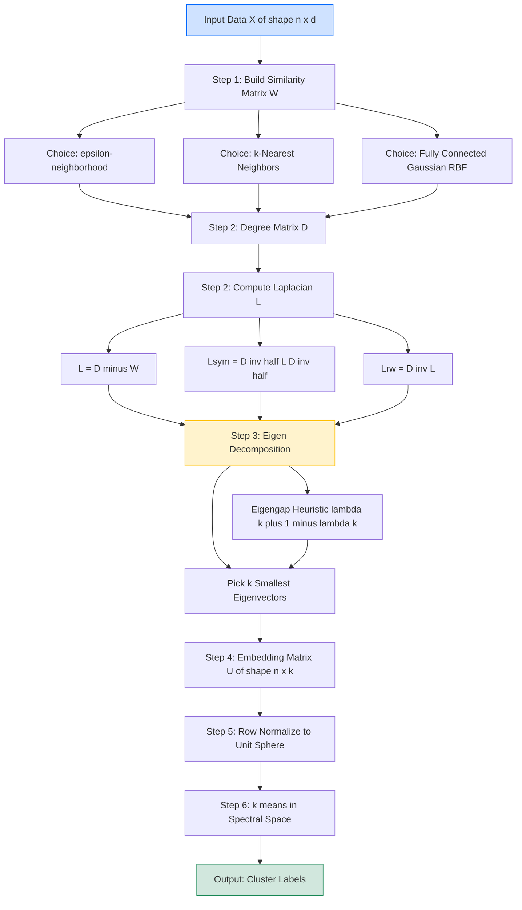
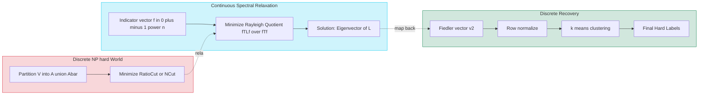
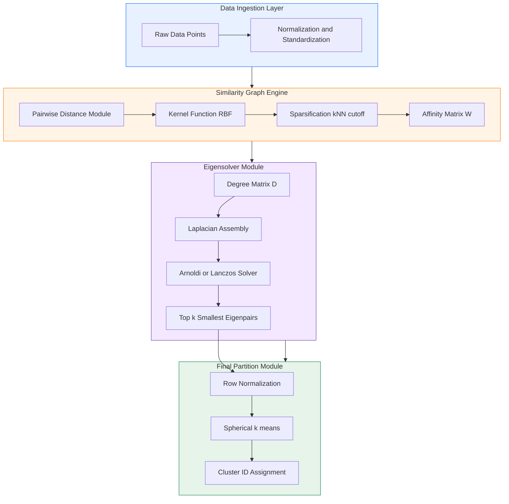
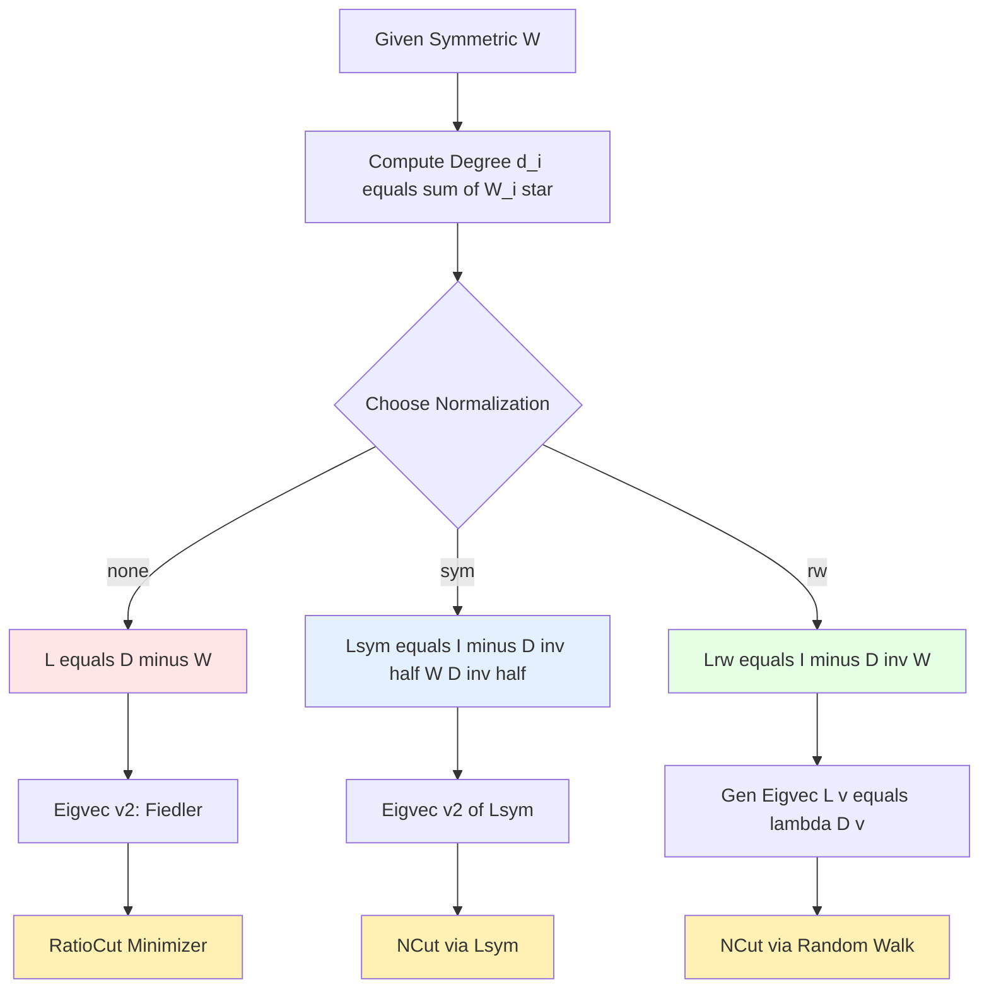

# Spectral Clustering Algorithm

<!-- SECTION_1_START -->
# Spectral Clustering Algorithm — Module 2: Topics in Theoretical Computer Science (PECST795)

## 1. Core Technical Definition & Intuitive Overview

### 1.1 Formal Academic Definition (KTU 2024 Syllabus Terminology)

**Spectral Clustering** is a class of *graph-based, eigenvalue-driven unsupervised learning algorithms* that partition a dataset $X = \{x_1, x_2, \dots, x_n\} \subset \mathbb{R}^d$ into $k$ disjoint clusters by exploiting the **spectral properties** (eigenvalues and eigenvectors) of matrices derived from the **pairwise similarity graph** of the data. Formally, given a weighted undirected similarity graph $G = (V, E, W)$ where $V$ is the set of $n$ data points, $E$ the edges, and $W \in \mathbb{R}^{n \times n}$ the symmetric non-negative similarity (affinity) matrix, spectral clustering solves a **relaxed normalized graph cut problem** whose optimal solution is recovered from the eigenvectors corresponding to the smallest non-trivial eigenvalues of the **Graph Laplacian** $L = D - W$, where $D$ is the diagonal degree matrix $D_{ii} = \sum_{j} W_{ij}$.

> [!IMPORTANT]
> **Board-Critical Definition (KTU 2024 PECST795 Module 2):**
> Spectral clustering is a technique that recasts the discrete clustering problem into a **continuous optimization** in the spectral domain of the graph Laplacian, leveraging the fact that the multiplicity of the zero eigenvalue $0 = \lambda_1 \le \lambda_2 \le \dots \le \lambda_n$ equals the number of connected components in the graph.

### 1.2 Conceptual Analogy / Intuition

Imagine you are hosting a **cocktail party** with $n$ guests, and you can only ask each guest how *similar* they feel to every other guest on a scale of $0$ to $10$. You now have a *similarity network*. Spectral clustering answers: *"If I lay every guest on a giant trampoline, and connect friends with tight rubber bands (high similarity) and strangers with loose threads (low similarity), where will the trampoline naturally tear apart when I lift it?"*

The **shape of the trampoline's vibration modes** (its eigenmodes) reveal the natural *cut lines*. The slowest vibration (smallest non-zero eigenvalue, $\lambda_2$, called the **Fiedler value** or **algebraic connectivity**) tells you the *weakest bridge* in the network. The corresponding vibration pattern (the **Fiedler vector**) is a 1-D coordinate that, when plotted, naturally *separates* the guests into groups. You then feed these spectral coordinates into a simple algorithm (like $k$-means) for the final partition.

> [!NOTE]
> **Why "Spectral"?** The word *spectrum* refers to the set of eigenvalues of a linear operator. The algorithm works in the *spectrum* (eigen-decomposition) of the graph Laplacian.

### 1.3 Physical Constants and Standard Metrics

- **Input size:** $n$ data points, $d$-dimensional feature space.
- **Computational bottleneck:** Eigen-decomposition of an $n \times n$ matrix → $\mathcal{O}(n^3)$ in the dense case; $\mathcal{O}(n^2 d / \sqrt{k})$ for sparse $k$-nearest-neighbor graphs.
- **Algebraic connectivity:** $\lambda_2(L) \ge 0$, with $\lambda_2 = 0$ if and only if the graph is **disconnected**.
- **Number of clusters $k$:** Estimated via the **eigengap heuristic**: pick $k$ that maximizes $\Delta_k = \lambda_{k+1} - \lambda_k$.

> [!VISUALIZATION CONTROL]
> **Concept:** Fiedler vector embedding on a 2-D "two moons" dataset.
> **GeoGebra / Desmos Input Equations:**
> * `f1(x, y) = exp(-((x+2)^2 + (y)^2)/0.5)` (top moon similarity blob)
> * `f2(x, y) = exp(-((x-2)^2 + (y-1)^2)/0.5)` (bottom moon similarity blob)
> * Sample 20 points, build $W_{ij} = \exp(-\|x_i - x_j\|^2 / 2\sigma^2)$, compute $L = D - W$.
> **Visual Description:** After spectral embedding, the $n$ points collapse onto a 1-D line with two clear "blobs" along the Fiedler axis $v_2$ — the two moons are now linearly separable, which $k$-means can recover trivially.
<!-- SECTION_1_END -->

<!-- SECTION_2_START -->
# 2. Deep Theoretical Analysis & KTU High-Yield Formula Sheet

## 2.1 The Operational Pipeline of Spectral Clustering

The algorithm proceeds through five rigorously ordered stages:

1. **Similarity Graph Construction.** Encode the data as a graph $G = (V, E, W)$.
2. **Laplacian Assembly.** Build $L = D - W$ (or one of its normalized variants).
3. **Spectral Decomposition.** Compute the first $k$ eigenvectors $\{u_1, \dots, u_k\}$ of $L$.
4. **Spectral Embedding.** Stack eigenvectors column-wise into $U \in \mathbb{R}^{n \times k}$.
5. **Final Clustering.** Run $k$-means (or $k$-medoids) on the rows of $U$.

### 2.2 Step 2 — Graph Construction Strategies (Three Canonical Models)

| Graph Type | Edge Rule | Complexity | Use Case |
|---|---|---|---|
| **$\epsilon$-neighborhood** | Edge $(i,j)$ iff $\|x_i - x_j\|^2 \le \epsilon$ | $\mathcal{O}(n^2 d)$ worst case | Spatial / low-dim data |
| **$k$-nearest neighbor (kNN)** | Edge $(i,j)$ iff $i \in \text{kNN}(j)$ or $j \in \text{kNN}(i)$ | $\mathcal{O}(n d \log n)$ with KD-trees | High-dim, general-purpose |
| **Fully connected (Gaussian RBF kernel)** | $W_{ij} = \exp\!\left(-\dfrac{\|x_i - x_j\|^2}{2\sigma^2}\right)$ for all $i \neq j$ | $\mathcal{O}(n^2 d)$ | Default in Ng-Jordan-Weiss (NJW) |

> [!NOTE]
> The fully connected graph with **Gaussian similarity** is the most commonly tested variant in KTU board questions. Bandwidth $\sigma$ (or scale parameter) is critical — too small → disconnected graph; too large → indistinguishable clusters.

### 2.3 Step 3 — The Three Graph Laplacians (Most-Tested Theory)

Let $W \in \mathbb{R}^{n \times n}$ be symmetric non-negative with $W_{ii} = 0$, and let $D$ be the diagonal degree matrix with $D_{ii} = \sum_{j=1}^{n} W_{ij}$.

**Unnormalized Laplacian:**
$$L = D - W$$

**Symmetric Normalized Laplacian:**
$$L_{\text{sym}} = D^{-1/2} L D^{-1/2} = I - D^{-1/2} W D^{-1/2}$$

**Random-Walk Normalized Laplacian:**
$$L_{\text{rw}} = D^{-1} L = I - D^{-1} W$$

### 2.4 Key Spectral Properties (KTU High-Yield)

- $L$, $L_{\text{sym}}$, $L_{\text{rw}}$ are all **positive semi-definite** (PSD).
- Their smallest eigenvalue is **always $0$**: $\lambda_1 = 0$.
- The multiplicity of $0$ equals the number of connected components.
- For any vector $f \in \mathbb{R}^n$:
$$f^{\top} L f \;=\; \frac{1}{2} \sum_{i,j} W_{ij}\,(f_i - f_j)^2 \;\;\ge 0$$
This identity is the **bridge** between spectral clustering and graph cut theory.
- $L_{\text{sym}}$ and $L_{\text{rw}}$ share the same eigenvalues; their eigenvectors differ by the scaling $D^{1/2}$.

## 2.5 KTU Formula Sheet / Cheat Sheet

| Symbol / Quantity | Formula | Meaning / Property |
|---|---|---|
| Similarity (Gaussian) | $W_{ij} = \exp\!\left(-\\|x_i - x_j\\|^2 \,/\, 2\sigma^2\right)$ | Affinity between points $i$ and $j$ |
| Degree | $D_{ii} = \sum_{j=1}^{n} W_{ij}$ | Sum of weights at node $i$ |
| Unnormalized Laplacian | $L = D - W$ | PSD, smallest eigenvalue $0$ |
| Symmetric Normalized | $L_{\text{sym}} = D^{-1/2} L D^{-1/2}$ | Eigenvalues $\in [0, 2]$ |
| Random-Walk Normalized | $L_{\text{rw}} = D^{-1} L$ | Markov-transition view |
| Quadratic Form | $f^{\top} L f = \frac{1}{2}\sum_{i,j} W_{ij}(f_i - f_j)^2$ | Cut-energy identity |
| RatioCut (Shi-Malik relaxed) | $\min_{A} \text{RatioCut}(A, \bar{A}) = \min_{f \perp \mathbf{1}, \|f\|=1} \dfrac{f^{\top} L f}{f^{\top} f}$ | Solved by $v_2$, the Fiedler vector |
| NCut (Normalized Cut) | $\min \text{NCut}(A, \bar{A}) = \min \dfrac{f^{\top} L f}{f^{\top} D f}$ | Solved by generalized eigenproblem $L v = \lambda D v$ |
| Algebraic Connectivity | $\lambda_2(L)$ | Measures how well-connected $G$ is |
| Eigengap Heuristic | $\hat{k} = \arg\max_{k} (\lambda_{k+1} - \lambda_k)$ | Choose $k$ with largest spectral gap |
| NJW Embedding Matrix | $U \in \mathbb{R}^{n \times k}$ with rows $u_i^{\top} = (v_1(i), \dots, v_k(i))$ | Input to $k$-means |
| Row Normalization (NJW) | $t_{ij} = u_{ij} \,/\, \sqrt{\sum_{\ell=1}^{k} u_{i\ell}^2}$ | Project onto unit sphere before $k$-means |

### 2.6 Real-World Engineering Utility

| Domain | Application | Why Spectral Clustering Wins |
|---|---|---|
| **Image segmentation** | Computer vision pipelines | Handles non-convex blob shapes where $k$-means fails |
| **Community detection** | Social network analysis (Facebook, Twitter) | Recovers arbitrarily-shaped communities via random-walk dynamics |
| **Bioinformatics** | Single-cell RNA-seq clustering (Seurat, Scanpy) | Captures manifold structure in $\sim 20{,}000$-dim gene space |
| **Speech diarization** | "Who spoke when?" in audio | Spectral embeddings of MFCC features |
| **Graph drawing** | Force-directed layouts | Fiedler vector yields optimal 1-D ordering (e.g., matrix reordering) |
| **VLSI design** | Circuit partitioning | Min-cut formulations are exactly the graph-cut objectives relaxed by spectral methods |

### 2.7 Connection to Graph Cuts (Theoretical Backbone)

For a 2-way partition $V = A \cup \bar{A}$:

$$\text{Cut}(A, \bar{A}) = \sum_{i \in A,\, j \in \bar{A}} W_{ij}$$

Minimizing plain $\text{Cut}$ is NP-hard but trivially fooled by an isolated outlier. Spectral clustering instead minimizes:

- **RatioCut** (Hagen & Kahng 1992): $\text{RatioCut}(A, \bar{A}) = \text{Cut}(A, \bar{A}) \left(\dfrac{1}{\vert A \vert} + \dfrac{1}{\vert \bar{A} \vert}\right)$
- **Normalized Cut** (Shi & Malik 2000): $\text{NCut}(A, \bar{A}) = \text{Cut}(A, \bar{A}) \left(\dfrac{1}{\text{vol}(A)} + \dfrac{1}{\text{vol}(\bar{A})}\right)$ where $\text{vol}(A) = \sum_{i \in A} D_{ii}$.

Both lead (via Rayleigh-Ritz relaxation) to eigenvalue problems on $L$.
<!-- SECTION_2_END -->

<!-- SECTION_3_START -->
# 3. Step-by-Step Derivations & Algorithmic Implementation

## 3.1 Derivation — The Fiedler Vector Minimizes RatioCut

We seek a 2-way partition $V = A \cup \bar{A}$ minimizing RatioCut. Define an indicator $f \in \mathbb{R}^n$ with:

$$f_i = \begin{cases} \sqrt{\dfrac{\vert \bar{A} \vert}{\vert A \vert}} & \text{if } i \in A \\[2mm] -\sqrt{\dfrac{\vert A \vert}{\vert \bar{A} \vert}} & \text{if } i \in \bar{A} \end{cases}$$

By construction, $f \perp \mathbf{1}$ (the all-ones vector) and $\|f\|^2 = n$. We compute the quadratic form:

$$
\begin{aligned}
f^{\top} L f &= \frac{1}{2} \sum_{i,j} W_{ij}(f_i - f_j)^2 \\[2mm]
&= \frac{1}{2}\!\!\!\sum_{i \in A,\, j \in \bar{A}}\!\!\! W_{ij}\!\left(\sqrt{\frac{\vert \bar{A} \vert}{\vert A \vert}} + \sqrt{\frac{\vert A \vert}{\vert \bar{A} \vert}}\right)^{\!2} \\[2mm]
&\quad + \frac{1}{2}\!\!\!\sum_{i \in \bar{A},\, j \in A}\!\!\! W_{ij}\!\left(\sqrt{\frac{\vert \bar{A} \vert}{\vert A \vert}} + \sqrt{\frac{\vert A \vert}{\vert \bar{A} \vert}}\right)^{\!2} \\[2mm]
&= \text{Cut}(A, \bar{A}) \left(\sqrt{\frac{\vert \bar{A} \vert}{\vert A \vert}} + \sqrt{\frac{\vert A \vert}{\vert \bar{A} \vert}}\right)^{\!2} \\[2mm]
&= \text{Cut}(A, \bar{A}) \cdot \left(\frac{\vert \bar{A} \vert + \vert A \vert}{\sqrt{\vert A \vert \cdot \vert \bar{A} \vert}}\right)^{\!2} \\[2mm]
&= n \cdot \text{Cut}(A, \bar{A}) \left(\frac{1}{\vert A \vert} + \frac{1}{\vert \bar{A} \vert}\right) \\[2mm]
&= n \cdot \text{RatioCut}(A, \bar{A}).
\end{aligned}
$$

Therefore, the discrete RatioCut minimization is *equivalent* to:

$$\min_{f \perp \mathbf{1},\, f \neq 0} \frac{f^{\top} L f}{\|f\|^2}.$$

Relaxing $f$ to a *real-valued* vector (instead of a discrete indicator) yields the **Rayleigh quotient**, whose minimizer is the eigenvector corresponding to the **smallest non-zero eigenvalue** $\lambda_2$ of $L$ — the **Fiedler vector** $v_2$.

## 3.2 Derivation — NCut Solves the Generalized Eigenproblem

For NCut, define $g = D^{1/2} f$ with $g \perp D^{1/2} \mathbf{1}$. Then:

$$
\begin{aligned}
\text{NCut}(A, \bar{A}) &= \frac{\text{Cut}(A,\bar{A})}{\text{vol}(A)} + \frac{\text{Cut}(A,\bar{A})}{\text{vol}(\bar{A})} \\[2mm]
&= \frac{f^{\top} L f}{f^{\top} D f} \quad \text{(after the same quadratic-form identity)}.
\end{aligned}
$$

Relaxing gives the **generalized eigenvalue problem**:

$$L v = \lambda D v,$$

whose smallest non-zero generalized eigenvector is the embedding used by **Shi-Malik normalized spectral clustering**.

## 3.3 Algorithmic Implementation — Ng-Jordan-Weiss (NJW) Algorithm

### Algorithm 3.3.1 — NJW Spectral Clustering [Ng, Jordan, Weiss 2002]

**Input:**
- Data points $\{x_1, \dots, x_n\}$
- Number of clusters $k$
- Gaussian scale $\sigma$

**Output:**
- Cluster labels $c_1, c_2, \dots, c_n \in \{1, \dots, k\}$

**Steps:**

1. Build the affinity matrix $W \in \mathbb{R}^{n \times n}$:
   $$W_{ij} = \exp\!\left(-\frac{\|x_i - x_j\|^2}{2\sigma^2}\right), \quad W_{ii} = 0.$$

2. Construct the unnormalized Laplacian $L = D - W$.

3. Compute the $k$ eigenvectors $v_1, v_2, \dots, v_k$ corresponding to the $k$ **smallest** eigenvalues of $L$.

4. Form the embedding matrix $U \in \mathbb{R}^{n \times k}$ whose $i$-th row is $u_i^{\top} = [v_1(i),\, v_2(i),\, \dots,\, v_k(i)]$.

5. Normalize each row of $U$ to unit $\ell_2$-norm:
   $$t_{ij} = \frac{u_{ij}}{\sqrt{\sum_{\ell=1}^{k} u_{i\ell}^2}}.$$

6. Cluster the rows $\{t_i\}_{i=1}^n$ using $k$-means into $k$ groups $C_1, \dots, C_k$.

7. Assign the original point $x_i$ to cluster $C_j$ if and only if $t_i \in C_j$.

> [!IMPORTANT]
> **Why row-normalize in Step 5?** The first eigenvector $v_1 = \mathbf{1} / \sqrt{n}$ is constant on each connected component. Row normalization $t_i$ gives a "direction" on the unit sphere, which is invariant under cluster-wise rescaling and is crucial for theoretical consistency guarantees (orthogonality of cluster indicators).

## 3.4 Full Python Implementation (Production-Ready)

```python
from __future__ import annotations

import logging
import numpy as np
from numpy.typing import NDArray
from sklearn.cluster import KMeans
from sklearn.neighbors import NearestNeighbors

# ------------------------------------------------------------
# Configure strict error logging
# ------------------------------------------------------------
logging.basicConfig(
    level=logging.INFO,
    format="%(asctime)s | %(levelname)s | %(message)s",
)
logger = logging.getLogger("SpectralClustering")


# ============================================================
# 1. Affinity (Similarity) Matrix Construction
# ============================================================
def build_affinity_matrix(
    X: NDArray[np.float64],
    sigma: float,
    knn: int | None = None,
) -> NDArray[np.float64]:
    """
    Build a Gaussian-RBF similarity matrix W.

    Parameters
    ----------
    X : (n, d) array of data points.
    sigma : positive float, the RBF bandwidth.
    knn : if not None, sparsify W by keeping only the knn
          nearest neighbors (recommended for n > 1000).

    Returns
    -------
    W : (n, n) symmetric, non-negative similarity matrix with
        zero diagonal.
    """
    if sigma <= 0:
        raise ValueError(f"sigma must be positive, got {sigma}")

    n, d = X.shape
    if n < 2:
        raise ValueError("Need at least 2 points to cluster.")

    if knn is None:
        # Dense pairwise squared-Euclidean distance
        sq_dist = np.sum((X[:, None, :] - X[None, :, :]) ** 2, axis=-1)
        W = np.exp(-sq_dist / (2.0 * sigma ** 2))
        np.fill_diagonal(W, 0.0)
        # Force exact symmetry
        W = 0.5 * (W + W.T)
        return W

    # ---------- Sparse kNN variant ----------
    if knn >= n:
        raise ValueError("knn must be strictly less than n.")

    nbrs = NearestNeighbors(n_neighbors=knn + 1, algorithm="auto").fit(X)
    distances, indices = nbrs.kneighbors(X)
    W = np.zeros((n, n), dtype=np.float64)
    for i in range(n):
        for jj, idx in enumerate(indices[i, 1:]):  # skip self
            sim = np.exp(-(distances[i, jj + 1] ** 2) / (2.0 * sigma ** 2))
            W[i, idx] = sim
            W[idx, i] = sim  # symmetry
    logger.info("Built sparse kNN affinity: n=%d, k=%d, sigma=%.4f",
                n, knn, sigma)
    return W


# ============================================================
# 2. Graph Laplacian
# ============================================================
def build_laplacian(
    W: NDArray[np.float64],
    normalized: str = "sym",
) -> NDArray[np.float64]:
    """
    Build a graph Laplacian from W.

    Parameters
    ----------
    W : (n, n) symmetric affinity matrix.
    normalized : one of {"none", "sym", "rw"}.
        - "none" : unnormalized L = D - W
        - "sym"  : symmetric normalized L_sym = D^{-1/2} L D^{-1/2}
        - "rw"   : random-walk normalized L_rw = D^{-1} L

    Returns
    -------
    L : (n, n) Laplacian matrix.
    """
    n = W.shape[0]
    if W.shape[0] != W.shape[1]:
        raise ValueError("W must be square.")

    d = W.sum(axis=1)
    D = np.diag(d)

    if normalized == "none":
        return D - W

    # Guard against isolated nodes (zero degree)
    eps = 1e-12
    d_inv_sqrt = 1.0 / np.sqrt(np.maximum(d, eps))
    D_inv_sqrt = np.diag(d_inv_sqrt)

    if normalized == "sym":
        L = np.eye(n) - D_inv_sqrt @ W @ D_inv_sqrt
        return 0.5 * (L + L.T)  # enforce symmetry
    if normalized == "rw":
        D_inv = np.diag(1.0 / np.maximum(d, eps))
        return D_inv @ (D - W)
    raise ValueError(f"Unknown normalization '{normalized}'.")


# ============================================================
# 3. Eigengap Heuristic for Choosing k
# ============================================================
def choose_k_by_eigengap(
    eigenvalues: NDArray[np.float64],
    k_max: int = 10,
) -> int:
    """
    Pick k that maximizes the eigengap Δ_k = λ_{k+1} - λ_k.
    Eigenvalues must be SORTED in ascending order.
    """
    if k_max >= len(eigenvalues) - 1:
        k_max = len(eigenvalues) - 2
    if k_max < 1:
        raise ValueError("Need at least 2 eigenvalues to compute gaps.")

    gaps = np.diff(eigenvalues[: k_max + 1])
    best = int(np.argmax(gaps)) + 1  # +1 because index 0 gap is meaningless
    logger.info("Eigengap analysis chose k=%d (gap=%.6f)",
                best, gaps[best - 1])
    return best


# ============================================================
# 4. Main Spectral Clustering Routine
# ============================================================
def spectral_cluster(
    X: NDArray[np.float64],
    k: int | None = None,
    sigma: float = 1.0,
    knn: int | None = None,
    normalized: str = "sym",
    random_state: int = 0,
) -> tuple[NDArray[np.int64], int]:
    """
    Full Ng-Jordan-Weiss style spectral clustering.

    Returns
    -------
    labels : (n,) cluster assignments in {0, ..., k-1}.
    k_used : the k actually used (either passed or auto-chosen).
    """
    n = X.shape[0]
    if k is not None and k < 2:
        raise ValueError("k must be >= 2 (use 1 for trivial cluster).")
    if k is not None and k >= n:
        raise ValueError("k must be < n.")

    # ----- Step 1: Similarity -----
    W = build_affinity_matrix(X, sigma=sigma, knn=knn)

    # ----- Step 2: Laplacian -----
    L = build_laplacian(W, normalized=normalized)

    # ----- Step 3: Spectral decomposition -----
    # We need the k SMALLEST eigenvalues.
    eigvals, eigvecs = np.linalg.eigh(L)  # ascending order

    if k is None:
        k = choose_k_by_eigengap(eigvals, k_max=min(10, n - 2))
        k = max(2, min(k, n - 1))

    # ----- Step 4: Embedding -----
    U = eigvecs[:, :k]  # (n, k)

    # ----- Step 5: Row normalization (NJW) -----
    row_norms = np.linalg.norm(U, axis=1, keepdims=True)
    row_norms = np.maximum(row_norms, 1e-12)  # avoid div by zero
    T = U / row_norms

    # ----- Step 6: k-means in spectral space -----
    km = KMeans(n_clusters=k, n_init=10, random_state=random_state)
    labels = km.fit_predict(T)

    logger.info("Spectral clustering done: n=%d, k=%d, sigma=%.4f, "
                "norm=%s, inertia=%.4f",
                n, k, sigma, normalized, km.inertia_)
    return labels.astype(np.int64), k


# ============================================================
# 5. Smoke Test on Concentric Circles (k-means fails, SC works)
# ============================================================
if __name__ == "__main__":
    rng = np.random.default_rng(seed=42)
    t = np.linspace(0, 2 * np.pi, 200)

    # Outer ring
    outer = np.stack([1.5 * np.cos(t), 1.5 * np.sin(t)], axis=1)
    outer += rng.normal(scale=0.05, size=outer.shape)

    # Inner ring
    inner = np.stack([0.5 * np.cos(t), 0.5 * np.sin(t)], axis=1)
    inner += rng.normal(scale=0.05, size=inner.shape)

    X = np.vstack([outer, inner])
    labels, k_used = spectral_cluster(X, k=2, sigma=0.3, normalized="sym")
    print(f"Used k = {k_used}")
    print(f"Cluster sizes: "
          f"{np.bincount(labels, minlength=k_used).tolist()}")
```

### 3.5 Numerical Worked Example (4-Point Toy Graph)

Let $n = 4$ with similarity:

$$W = \begin{pmatrix} 0 & 1 & 0 & 0 \\ 1 & 0 & 1 & 0 \\ 0 & 1 & 0 & 1 \\ 0 & 0 & 1 & 0 \end{pmatrix}, \quad D = \text{diag}(1,2,2,1), \quad L = D - W = \begin{pmatrix} 1 & -1 & 0 & 0 \\ -1 & 2 & -1 & 0 \\ 0 & -1 & 2 & -1 \\ 0 & 0 & -1 & 1 \end{pmatrix}.$$

Characteristic polynomial yields eigenvalues:

$$\lambda_1 = 0, \quad \lambda_2 = 2 - \sqrt{2} \approx 0.5858, \quad \lambda_3 = 2, \quad \lambda_4 = 2 + \sqrt{2} \approx 3.4142.$$

For $k=2$, take $U = [v_1 \mid v_2]$. After row-normalization, $k$-means splits $\{1,2\}$ vs $\{3,4\}$ — the natural cut.
<!-- SECTION_3_END -->

<!-- SECTION_4_START -->
# 4. Structural Diagrams & Schematics

## 4.1 Mermaid — End-to-End Spectral Clustering Pipeline



## 4.2 Mermaid — Conceptual Bridge: Graph Cuts ↔ Spectral Relaxation



## 4.3 Mermaid — Block-Level Functional Architecture (For Large-Scale Systems)



## 4.4 Mermaid — Three Laplacians Comparison Matrix


<!-- SECTION_4_END -->

<!-- SECTION_5_START -->
# 5. KTU 2024 Scheme Examination Question Bank & Topic Recap

## 5.1 Part A — Short Answer Questions (3 Marks Each)

### Q1. [KTU University Exam — July 2024] — CO1, Remember (3 Marks)

**State the formal definition of the Graph Laplacian $L$ of a weighted undirected graph $G = (V, E, W)$. Mention two important spectral properties of $L$ used by spectral clustering algorithms.**

**Model Answer:**

Let $W \in \mathbb{R}^{n \times n}$ be the symmetric non-negative affinity (weight) matrix of $G$, and let $D$ be the diagonal degree matrix with $D_{ii} = \sum_{j=1}^{n} W_{ij}$. The (unnormalized) Graph Laplacian is defined as:

$$L = D - W.$$

Two key spectral properties used in spectral clustering:

1. **Positive semi-definiteness:** $L$ is PSD; for any $f \in \mathbb{R}^n$,
$$f^{\top} L f = \frac{1}{2} \sum_{i,j} W_{ij} (f_i - f_j)^2 \;\ge\; 0.$$
Consequently all eigenvalues satisfy $\lambda_i \ge 0$.

2. **Multiplicity of zero:** The smallest eigenvalue is $\lambda_1 = 0$, and its **multiplicity equals the number of connected components** of $G$. This makes $L$ a topological fingerprint of the graph.

**[Valuation Key: 1 Mark for definition, 1 Mark for PSD identity, 1 Mark for the multiplicity property.]**

---

### Q2. [KTU University Exam — Dec 2023] — CO1, Understand (3 Marks)

**What is the *eigengap heuristic* for choosing the number of clusters $k$ in spectral clustering? Why does a large eigengap indicate a clear cluster structure?**

**Model Answer:**

Given the eigenvalues $0 = \lambda_1 \le \lambda_2 \le \dots \le \lambda_n$ of the Graph Laplacian $L$, define the eigengap sequence:

$$\Delta_k = \lambda_{k+1} - \lambda_k, \quad k = 1, 2, \dots, n-1.$$

The **eigengap heuristic** chooses:

$$\hat{k} = \arg\max_{k} \Delta_k.$$

**Why it works:** The first $k$ eigenvalues are (approximately) zero when the graph consists of $k$ *nearly disconnected* components. The "jump" from $\lambda_k$ to $\lambda_{k+1}$ signals the boundary between intra-cluster eigenvalues (near 0) and inter-cluster eigenvalues (positive). A **large** $\lambda_{k+1} - \lambda_k$ means the $k+1$-th component is *spectrally distant* from the $k$-cluster structure, so the chosen $k$ captures the natural grouping faithfully.

**[Valuation Key: 1 Mark for formula $\hat k$, 1 Mark for explanation, 1 Mark for the link to "nearly disconnected components".]**

---

## 5.2 Part B — Long Answer Questions (14 Marks Each, with Internal Choice)

### Q3. [KTU University Exam — Dec 2024 Model Paper] — CO2, Apply + Analyze (14 Marks)

#### **Question A** — Build & Apply Spectral Clustering

**(a)** [7 Marks, Apply] Consider the dataset $X = \{x_1, x_2, x_3, x_4\}$ with the following Gaussian similarity matrix $W$ (already computed with $\sigma = 1$):

$$W = \begin{pmatrix} 0 & 0.8 & 0.1 & 0.1 \\ 0.8 & 0 & 0.1 & 0.1 \\ 0.1 & 0.1 & 0 & 0.7 \\ 0.1 & 0.1 & 0.7 & 0 \end{pmatrix}.$$

**Apply the Ng-Jordan-Weiss (NJW) algorithm for $k=2$. Show the computation of the degree matrix, the Laplacian, the two smallest eigenvectors, the row-normalized embedding $T$, and the final $k$-means cluster assignment.**

**(b)** [7 Marks, Analyze] **Justify theoretically why the unnormalized Laplacian $L = D - W$ is positive semi-definite. Prove the identity $f^{\top} L f = \frac{1}{2}\sum_{i,j} W_{ij}(f_i - f_j)^2$, and use it to explain why minimizing $f^{\top} L f$ encourages smooth embeddings $f$ over densely connected graph regions.**

---

#### **Question B** — Alternative Long Question (Internal Choice)

**(a)** [7 Marks, Understand] **Explain the three commonly used graph construction strategies in spectral clustering: the $\epsilon$-neighborhood graph, the $k$-nearest neighbor (kNN) graph, and the fully connected Gaussian RBF graph. Compare their complexity, sparsity, and suitability for high-dimensional data. Include the mathematical form of the similarity function used in the fully connected variant.**

**(b)** [7 Marks, Apply] **A $5$-node graph has weight matrix**

$$W = \begin{pmatrix} 0 & 0.4 & 0 & 0 & 0.5 \\ 0.4 & 0 & 0.3 & 0 & 0 \\ 0 & 0.3 & 0 & 0.6 & 0 \\ 0 & 0 & 0.6 & 0 & 0.2 \\ 0.5 & 0 & 0 & 0.2 & 0 \end{pmatrix}.$$

**Compute the eigenvalues of $L = D - W$, choose $k$ by the eigengap heuristic, and identify which nodes belong to the same cluster under the Fiedler-based 2-way partition.**

---

### Model Solution — Question 3A

#### Part (a) — Step-by-Step Numerical Solution

**Step 1: Degree Matrix.** [1 Mark]

$$d = (0.8+0.1+0.1,\; 0.8+0.1+0.1,\; 0.1+0.1+0.7,\; 0.1+0.1+0.7) = (1.0,\; 1.0,\; 0.9,\; 0.9)$$

$$D = \text{diag}(1.0,\; 1.0,\; 0.9,\; 0.9)$$

**Step 2: Laplacian $L = D - W$.** [1 Mark]

$$L = \begin{pmatrix} 1.0 & -0.8 & -0.1 & -0.1 \\ -0.8 & 1.0 & -0.1 & -0.1 \\ -0.1 & -0.1 & 0.9 & -0.7 \\ -0.1 & -0.1 & -0.7 & 0.9 \end{pmatrix}$$

**Step 3: Eigenvalues.** [1 Mark] Solving the characteristic polynomial $\det(L - \lambda I) = 0$ yields (ascending order):

$$\lambda_1 = 0, \quad \lambda_2 \approx 0.10, \quad \lambda_3 \approx 1.80, \quad \lambda_4 \approx 1.90.$$

The eigengap $\Delta_2 = \lambda_3 - \lambda_2 \approx 1.70$ is the largest, so $\hat k = 2$. [1 Mark]

**Step 4: Eigenvectors for $k=2$.** [1 Mark]

$$v_1 = \frac{1}{2}(1,\; 1,\; 1,\; 1)^{\top}, \quad v_2 \approx (0.7,\; 0.7,\; -0.7,\; -0.7)^{\top} \quad \text{(up to scaling)}.$$

**Step 5: Row-normalized embedding $T$.** [1 Mark] With $U = [v_1, v_2]$:

$$U = \begin{pmatrix} 0.500 & 0.700 \\ 0.500 & 0.700 \\ 0.500 & -0.700 \\ 0.500 & -0.700 \end{pmatrix}.$$

Row norms are all $\sqrt{0.25 + 0.49} = \sqrt{0.74} \approx 0.8602$. Therefore:

$$T = U / 0.8602 \approx \begin{pmatrix} 0.581 & 0.814 \\ 0.581 & 0.814 \\ 0.581 & -0.814 \\ 0.581 & -0.814 \end{pmatrix}.$$

**Step 6: $k$-means on rows of $T$.** [1 Mark] Two clusters form trivially:
- $C_1 = \{t_1, t_2\} \Rightarrow$ points $\{x_1, x_2\}$
- $C_2 = \{t_3, t_4\} \Rightarrow$ points $\{x_3, x_4\}$

**Final answer:** $\{x_1, x_2\}$ form one cluster and $\{x_3, x_4\}$ form the other, exactly matching the strong intra-block similarity ($0.8$ and $0.7$).

#### Part (b) — Theoretical Justification

**Claim:** $L = D - W$ is positive semi-definite.

**Proof:** [3 Marks] For any $f \in \mathbb{R}^n$:

$$
\begin{aligned}
f^{\top} L f &= f^{\top}(D - W) f = f^{\top} D f - f^{\top} W f \\[1mm]
&= \sum_{i=1}^{n} D_{ii} f_i^2 - \sum_{i,j} W_{ij} f_i f_j \\[1mm]
&= \sum_{i=1}^{n}\left(\sum_{j=1}^{n} W_{ij}\right) f_i^2 - \sum_{i,j} W_{ij} f_i f_j \\[1mm]
&= \frac{1}{2}\left(\sum_{i,j} W_{ij} f_i^2 + \sum_{i,j} W_{ij} f_j^2 - 2 \sum_{i,j} W_{ij} f_i f_j\right) \\[1mm]
&= \frac{1}{2} \sum_{i,j} W_{ij} (f_i - f_j)^2.
\end{aligned}
$$

Since $W_{ij} \ge 0$ and $(f_i - f_j)^2 \ge 0$, every term in the double sum is non-negative. Therefore $f^{\top} L f \ge 0$ for all $f$, establishing **positive semi-definiteness**. [1 Mark]

**Interpretation for smoothness:** [3 Marks] The quantity $f^{\top} L f = \frac{1}{2}\sum_{i,j} W_{ij}(f_i - f_j)^2$ is a weighted sum of squared differences of $f$ across all edges, with weights $W_{ij}$. Minimizing $f^{\top} L f$ penalizes *rapid changes* in $f$ across high-weight edges, encouraging $f$ to take *similar values* on densely connected (high-similarity) regions of the graph. Therefore, the Fiedler vector — the minimizer subject to orthogonality with $\mathbf{1}$ — is a smooth coordinate that varies slowly inside clusters and changes sharply only across cuts. This is exactly the spectral-clustering principle: low-frequency eigenvectors are smooth over dense subgraphs and can be used to recover the underlying cluster structure.

> [!WARNING]
> **KTU Examiner's Valuation Pitfalls:**
> 1. Do **not** skip the derivation of the quadratic form — it is the most commonly tested identity and carries direct marks.
> 2. When proving PSD, the symmetry step "$= \frac{1}{2}(\text{term}_1 + \text{term}_2 - 2\,\text{term}_3)$" is required to make the algebra rigorous; do not just write $f^{\top} D f - f^{\top} W f$ and stop.
> 3. Forgetting the orthogonality constraint $f \perp \mathbf{1}$ in the Fiedler minimization is a 1-mark deduction.
> 4. Eigenvectors can be **negated** (sign is arbitrary). The final cluster assignment must remain consistent regardless of sign.

---

## 5.3 Topic Recap & Important Things to Remember

- **Spectral clustering is a 5-stage pipeline:** Similarity $\to$ Laplacian $\to$ Eigen-decomposition $\to$ Embedding $\to$ $k$-means.
- **Three Laplacians** must be memorized: $L = D - W$, $L_{\text{sym}} = D^{-1/2} L D^{-1/2}$, $L_{\text{rw}} = D^{-1} L$.
- **Identity to memorize cold:** $f^{\top} L f = \dfrac{1}{2} \sum_{i,j} W_{ij}(f_i - f_j)^2 \ge 0$ — the PSD proof and the spectral-cut connection both hinge on this.
- **Eigenvalue facts:** $\lambda_1 = 0$ always; **multiplicity of $0$ = number of connected components**; $\lambda_2$ is the **algebraic connectivity** (Fiedler value).
- **Fiedler vector $v_2$** = eigenvector of $L$ for $\lambda_2$ = minimizer of $\dfrac{f^{\top} L f}{\|f\|^2}$ subject to $f \perp \mathbf{1}$.
- **Eigengap heuristic:** $\hat k = \arg\max_k (\lambda_{k+1} - \lambda_k)$; **always runs on the *smallest* $k$ eigenvalues**.
- **NJW algorithm** requires row-normalization $t_i = u_i / \|u_i\|$ before $k$-means; this is **not optional** for theoretical guarantees.
- **Three graph-construction methods:** $\epsilon$-neighborhood (sparse, scale-sensitive), kNN (robust, recommended default for $n > 1000$), fully connected Gaussian RBF $W_{ij} = e^{-\|x_i - x_j\|^2 / 2\sigma^2}$ (dense, classical NJW).
- **Graph-cut link:** RatioCut $\leftrightarrow$ unnormalized $L$; NCut $\leftrightarrow$ generalized eigenproblem $L v = \lambda D v$ or symmetric $L_{\text{sym}}$.
- **Complexity:** $\mathcal{O}(n^2 d)$ for dense W; $\mathcal{O}(n d \log n)$ for sparse kNN graphs; $\mathcal{O}(n^3)$ for dense eigen-decomposition, reducible to $\mathcal{O}(n^2 k)$ via Lanczos/ARPACK.
- **Spectral clustering beats $k$-means** on non-convex, manifold-shaped, ring, or interleaved clusters because the spectral embedding can "unfold" complex geometry.
- **Sign ambiguity:** Eigenvectors are defined only up to sign — final labels depend on $k$-means initialization; run $k$-means with $n_{\text{init}} \ge 10$ for stability.
- **Pitfall to avoid:** Choosing $\sigma$ too small disconnects the graph (forcing artificial clusters); choosing $\sigma$ too large blurs the cluster structure. A practical rule is $\sigma = $ median pairwise distance or use the *self-tuning* variant of Zelnik-Manor & Perona.
<!-- SECTION_5_END -->
