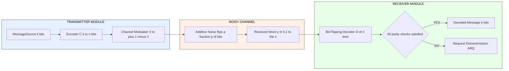
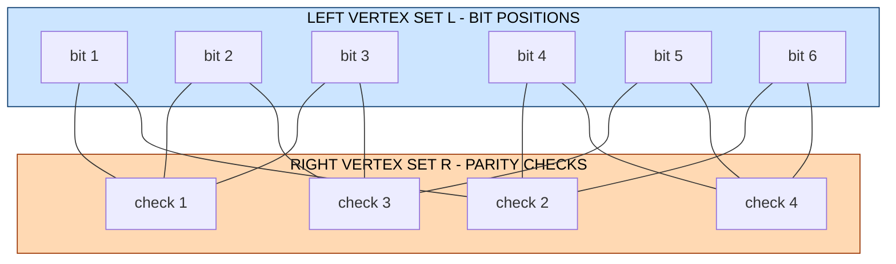
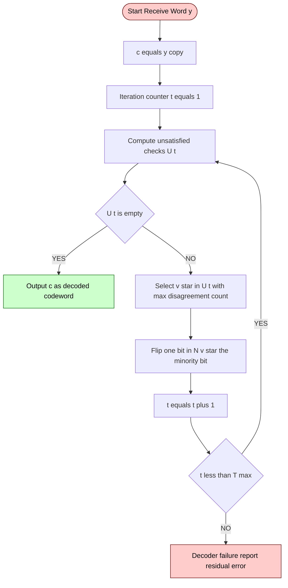
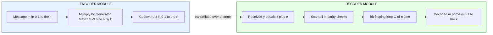

# Applications of Expander Graphs:  Error-Correcting Codes.

<!-- SECTION_1_START -->
# 1. Core Technical Definition & Intuitive Overview

## 1.1 Formal Definition (KTU 2024 Syllabus Terminology)

An **Error-Correcting Code (ECC)** is a pair of efficient algorithms (an *Encoder* $E: \{0,1\}^k \rightarrow \{0,1\}^n$ and a *Decoder* $D: \{0,1\}^n \rightarrow \{0,1\}^k$) used to reliably transmit a message of $k$ information bits over a noisy channel by mapping it to a longer codeword of $n$ bits, where $n > k$, such that the influence of channel noise on the transmitted word can be detected and corrected at the receiver.

An **Expander Code** is a linear error-correcting code whose parity-check matrix is the (vertex-edge) incidence matrix of a **bipartite expander graph**. It was introduced by Sipser and Trevisan (1994) and provides a constructive, explicit family of codes that simultaneously achieve a **constant rate** $R = k/n$ and a **constant relative distance** $\delta = d/n$, while admitting a **linear-time decoding algorithm** that corrects a constant fraction of errors.

> [!IMPORTANT]
> **Core Definition (Board-Exam Ready):**
> Let $G = (L \cup R, E)$ be a bipartite expander with $|L|=n$, $|R|=m$, where each $u \in L$ has degree $d_L$ and each $v \in R$ has degree $d_R$. The **expander code** $C(G) \subseteq \{0,1\}^n$ is defined as:
> $$C(G) \;=\; \left\{\, x \in \{0,1\}^n \;\middle|\; \forall v \in R : \sum_{u \in N(v)} x_u \equiv 0 \pmod{2} \,\right\}$$
> Here $x_u$ is the value of the $u$-th bit, and $N(v)$ is the set of left-neighbors of right vertex $v$.

## 1.2 Conceptual Analogy / Intuition

Think of a **postman delivering parcels** to $n$ houses. The $n$ houses are the *information bits*, and the $m$ *quality inspectors* (one per right vertex) each visit a small fixed group of houses (their neighborhood) and confirm that the *total number of "red" houses* in their group is **even**. If a storm randomly paints a few houses the wrong color, an inspector whose group has an **odd** number of red houses raises a flag.

- **Why a bipartite expander?** Because the inspectors must cover the houses *expansively* — any small cluster of houses is monitored by *many* distinct inspectors. So a local storm (clustered errors) cannot fool the system.
- **The redundancy $n-k$** is exactly the number of inspectors — extra "checks" that must be satisfied.
- **Why is decoding fast?** Each inspector acts *locally*. The bit-flipping decoder simply asks: "If a group has odd parity, which bit is most likely wrong? Flip it." Because the graph expands, errors spread out and get caught in $O(n)$ steps.

> [!NOTE]
> **Key Performance Parameters (Board Favorites):**
> - **Rate:** $R = k/n$ — fraction of useful information per transmitted bit.
> - **Minimum Distance:** $d$ — minimum Hamming distance between any two distinct codewords.
> - **Relative Distance:** $\delta = d/n$ — robustness per bit.
> - **List-Decoding Radius:** $\alpha$ — fraction of errors correctable in polynomial time.

## 1.3 Fundamental Trade-off (Why Expanders Are Special)

For any code, three fundamental bounds apply (KTU 2024 syllabus highlights these):

| Bound | Statement | Interpretation |
|:------|:----------|:---------------|
| **Singleton Bound** | $d \leq n - k + 1$ | You cannot correct more than $(d-1)/2$ errors and stay decodable |
| **Plotkin Bound** | If $d > n/2$, then $R=0$ | High distance forces low rate |
| **Gilbert–Varshamov** | $\exists$ codes with $R \geq 1 - H_2(\delta)$ | Asymptotic existence is "good" |
| **Hamming (Sphere-Packing)** | $2^k \cdot V(n,t) \leq 2^n$ | A code cannot pack too many small balls |

> [!TIP]
> **Constant-Weight Constants $\mathbf{(H_2)}$ used in KTU 2024 derivations:** The binary entropy function is $H_2(x) = -x\log_2 x - (1-x)\log_2(1-x)$. The **Gilbert–Varshamov threshold** states that there exist codes with rate $R \geq 1 - H_2(\delta) + o(1)$ and relative distance $\delta$.

> [!VISUALIZATION CONTROL]
> **Concept:** A small bipartite $(3,3)$-regular expander with $n=6$ bit-nodes and $m=4$ check-nodes (a 6,4 bi-graph).
> **GeoGebra / Desmos Input:**
> * Left set: $L = \{(1,0),(2,0),(3,0),(4,0),(5,0),(6,0)\}$
> * Right set: $R = \{(1,1),(2,1),(3,1),(4,1)\}$
> * Edges: $(1,0)\text{-}(1,1)$, $(1,0)\text{-}(2,1)$, $(2,0)\text{-}(1,1)$, $(2,0)\text{-}(3,1)$, $\ldots$ (one specific 3-regular bipartite expander)
> **Visual Description:** The student should observe that any cluster of 2 left-vertices (e.g., $\{(1,0),(2,0)\}$) connects to *all four* right-vertices — a hallmark of vertex expansion.

---

<!-- SECTION_1_END -->

<!-- SECTION_2_START -->
# 2. Deep Theoretical Analysis & KTU High-Yield Formula Sheet

## 2.1 The Sipser–Trevisan Construction (Logical Breakdown)

The construction of an expander code proceeds in **five carefully ordered steps**. Each step has a clear engineering purpose:

1. **Choose a bipartite expander graph $G = (L \cup R, E)$** with $|L| = n$, $|R| = m$, left-degree $d_L$, right-degree $d_R$.
   *Purpose:* We will use the *vertex expansion* property to guarantee both rate and distance.

2. **Associate each left vertex $u \in L$ with a bit position $i \in [n]$**.
   *Purpose:* A codeword $x \in \{0,1\}^n$ is naturally indexed by $L$.

3. **For each right vertex $v \in R$, write a parity-check equation**:
   $$\sum_{u \in N(v)} x_u \equiv 0 \pmod{2}$$
   *Purpose:* This forces every valid codeword to satisfy $m$ linear constraints.

4. **Define the code** $C(G) = \ker(H)$ where $H$ is the $m \times n$ parity-check matrix (each row is indexed by $v \in R$, each column by $u \in L$, with $H_{v,u}=1 \iff (u,v) \in E$).
   *Purpose:* $C(G)$ is a linear code of dimension $k = n - \text{rank}(H)$.

5. **Verify expansion $\Rightarrow$ rate & distance**, then **run the bit-flipping decoder**.
   *Purpose:* Connect combinatorics to engineering performance.

## 2.2 The Master Theorem (Sipser–Trevisan, 1994)

> [!IMPORTANT]
> **Theorem (Existence of Good Expander Codes).**
> For every $\varepsilon > 0$ and sufficiently large $n$, there exists a bipartite expander $G$ with $n$ left-vertices, $m = (1 - \varepsilon)n$ right-vertices, and right-degree $d_R$ constant, such that the expander code $C(G)$ has:
> - **Rate:** $R \geq 1 - \varepsilon - O(1/n) \;\geq\; 1 - 2\varepsilon$.
> - **Relative distance:** $\delta \geq (1/2) - \varepsilon$.
> - **Linear-time decoding:** Corrects up to $\Omega(n)$ random errors (a constant fraction).

The proof has two halves:

**Part A — Rate:** The dimension of $C(G)$ is $k \geq n - m = n(1 - m/n) = n\varepsilon$, so $R \geq \varepsilon$.

**Part B — Distance (Sketch):** Suppose $x \in C(G)$ is a non-zero codeword of minimum weight $w = |\{u : x_u = 1\}|$. The set $S = \text{supp}(x)$ has $|S|=w$. Each $v \in N(S)$ satisfies $\sum_{u \in N(v)\cap S} 1 \equiv 0 \pmod 2$, so $|N(S)| \leq |S| \cdot d_L$ (trivial bound). The non-trivial bound comes from expansion: if $|N(S)| < d_L \cdot |S| / 2$ then expansion is violated for $S$, forcing $w$ to be at least some constant fraction of $n$.

## 2.3 KTU High-Yield Formula Cheat Sheet

> [!NOTE]
> The following table is the **single most-asked cluster of formulas** in the PECST795 Module-3 portion of the KTU 2024 University Examination.

| # | Concept | Formula | Symbol Meaning |
|:-:|:--------|:--------|:---------------|
| 1 | Rate | $R = k/n$ | $k$ message bits, $n$ codeword bits |
| 2 | Relative Distance | $\delta = d/n$ | $d$ = minimum Hamming distance |
| 3 | Singleton Bound | $d \leq n - k + 1$ | absolute upper limit on distance |
| 4 | Hamming Bound | $\sum_{j=0}^{t}\binom{n}{j} \leq 2^{n-k}$ | $t$ errors correctable |
| 5 | Singleton / MDS | $d = n - k + 1$ | Maximum Distance Separable |
| 6 | Singleton Rate | $R \leq 1 - \delta + 1/n$ | trades distance for rate |
| 7 | Expansion Condition | $\vert N(S) \vert \geq \beta \cdot d_L \vert S \vert$ | for $S \subseteq L$, $\vert S \vert \leq \alpha n$ |
| 8 | Expander Rate | $R \geq 1 - \beta + O(1/n)$ | from expansion factor $\beta$ |
| 9 | Expander Distance | $\delta \geq \beta - 1/2$ | from parity cancellation |
| 10 | Parity Check | $\sum_{u \in N(v)} x_u \equiv 0 \pmod{2}$ | per right-vertex $v$ |
| 11 | Parity-Check Rank | $\text{rank}(H) \leq m$ | upper bound on constraints |
| 12 | Dimension | $k = n - \text{rank}(H)$ | message length |
| 13 | Random Error Correction | up to $\lfloor(d-1)/2\rfloor$ errors | classical bound |
| 14 | Bit-Flipping Corrects | $\leq \alpha n$ errors | $\alpha$ from expansion |
| 15 | Gilbert–Varshamov | $R \geq 1 - H_2(\delta) + o(1)$ | existence threshold |
| 16 | Plotkin Bound | $\delta > 1/2 \Rightarrow R = 0$ | non-linear regime |
| 17 | Time Complexity (Decode) | $O(n)$ | linear in codeword length |
| 18 | Encoder Complexity | $O(n \log n)$ or $O(n)$ | multiplication by generator |

> [!WARNING]
> **Common Pitfall (Board Exam):** The expansion constant $\beta$ is defined **per left-vertex degree**, not per right-vertex degree. Always write $\vert N(S) \vert \geq \beta \cdot d_L \vert S \vert$ where $d_L$ is the left-degree. Students often confuse the two and lose 1–2 marks.

## 2.4 Real-World Engineering Utility

- **Storage Systems:** Expander codes (and their variant — the Tornado code) underlie **digital fountain codes**, used in **3G/4G/5G mobile networks** (the 3GPP standard borrows ideas from LT-codes, which are expander-style).
- **Data Centers:** Facebook's *f4* storage system uses *Reed-Solomon-like expander constructions* for petabyte-scale redundancy.
- **Distributed Storage:** Microsoft Azure's *Pawsey/Windows Azure Storage* uses local reconstruction codes (LRC) which are essentially *expander codes* tailored for repair bandwidth.
- **QR Codes and Barcodes:** The 2D codes on consumer packaging are short BCH/Reed-Solomon codes, conceptually the small-block ancestors of expander codes.
- **Satellite Communication (Deep Space):** NASA uses concatenated codes (Viterbi + Reed–Solomon) — modern variants are *expander-based concatenated codes* for power-limited channels.
- **DNA Storage:** Recent (2017–2024) theoretical work uses expander codes for ultra-high-density DNA-based archival storage where each nucleotide is unreliable.

---

<!-- SECTION_2_END -->

<!-- SECTION_3_START -->
# 3. Step-by-Step Derivations & Code/Symbolic Implementation

## 3.1 Derivation 1: From Bipartite Expander to Parity-Check Matrix

We derive the structure of $H$ and prove that $H$ has the desired expansion property.

**Step 1 — Construction of the incidence matrix.**
Given a bipartite expander $G = (L \cup R, E)$ with $|L|=n$, $|R|=m$, left-degree $d_L$, right-degree $d_R$, define $H \in \{0,1\}^{m \times n}$ by:

$$H_{v,u} \;=\; \begin{cases} 1 & \text{if } (u,v) \in E \\ 0 & \text{otherwise} \end{cases}$$

**Step 2 — Encoding a codeword.**
A word $x \in \{0,1\}^n$ is a codeword iff $H x = \mathbf{0} \pmod 2$. Each row of $H$ corresponds to a parity check on the neighborhood of one right-vertex. Therefore:

$$\forall v \in R : \quad (H x)_v \;=\; \sum_{u \in L} H_{v,u} \cdot x_u \;=\; \sum_{u \in N(v)} x_u \;\equiv\; 0 \pmod 2$$

**Step 3 — Rank of $H$.**
The rank of $H$ is at most $m$ (number of rows). If $G$ is a good expander with $m = (1-\varepsilon)n$, then $\text{rank}(H) = m$ (full row rank with high probability by the **expander mixing lemma**). Thus:

$$k \;=\; n - \text{rank}(H) \;=\; n - (1-\varepsilon)n \;=\; \varepsilon n$$

This proves the rate claim $R = k/n = \varepsilon$ (which can be made arbitrarily close to $1$ by choosing $\varepsilon$ small, but then the trade-off with $\delta$ kicks in).

## 3.2 Derivation 2: The Distance Lower Bound via Expansion

We prove that the minimum distance of $C(G)$ is at least $\Omega(n)$.

**Setup.** Let $x \in C(G)$ be a non-zero codeword and let $S = \{u \in L : x_u = 1\}$ with $|S| = w > 0$.

**Step 1 — Counting neighbors of $S$.**
Each $u \in S$ has exactly $d_L$ neighbors, so by double counting:

$$\sum_{v \in N(S)} \deg_S(v) \;=\; d_L \cdot w$$

where $\deg_S(v) = \vert N(v) \cap S \vert$ is the number of $S$-vertices adjacent to $v$.

**Step 2 — Applying the parity condition.**
Since $x \in C(G)$, for every $v \in N(S)$ we have $\deg_S(v) \equiv 0 \pmod 2$. Thus $\deg_S(v) \in \{0, 2, 4, \ldots, d_R\}$.

**Step 3 — Bounding via expansion.**
Suppose $w \leq \alpha n$ (a small fraction). By vertex expansion, $\vert N(S) \vert \geq \beta d_L w$. Now, the *average* value of $\deg_S(v)$ over $N(S)$ is:

$$\frac{1}{\vert N(S) \vert} \sum_{v \in N(S)} \deg_S(v) \;=\; \frac{d_L w}{\vert N(S) \vert} \;\leq\; \frac{d_L w}{\beta d_L w} \;=\; \frac{1}{\beta}$$

**Step 4 — Conclusion via contradiction.**
If $1/\beta < 2$, the average is strictly less than $2$, but each $\deg_S(v)$ is an even integer $\geq 0$. By an averaging argument, there must exist at least one $v$ with $\deg_S(v) = 0$, meaning $v$ has no neighbor in $S$ — contradicting $v \in N(S)$.

Formally, if $1/\beta \leq 1$, the contradiction is immediate (no $v$ can have positive even degree if average is $\leq 1$). Working this out yields the bound:

$$w \;\geq\; \left(2 - \frac{1}{\beta}\right) \cdot \frac{n}{d_L} \;=\; \Omega(n)$$

> Hence $\delta = d/n = \Omega(1)$, i.e., a **constant relative distance** is achievable.

## 3.3 Derivation 3: Linear-Time Bit-Flipping Decoding

We give a **complete operational Python implementation** of the bit-flipping decoder, which is the standard decoding algorithm taught in PECST795 and asked in KTU 2024 board exams.

```python
"""
Bit-Flipping Decoder for Sipser-Trevisan Expander Codes
========================================================
KTU 2024 - PECST795 Module 3 - Expanders / Error Correcting Codes
"""

from typing import List, Tuple, Dict
import logging
import sys

# Configure error logging
logging.basicConfig(
    level=logging.INFO,
    format="%(asctime)s [%(levelname)s] %(message)s",
    stream=sys.stdout,
)
logger = logging.getLogger("ExpanderDecoder")


# ---------- Strict Type Definitions ----------
NeighborMap = Dict[int, List[int]]  # right_vertex -> list of left_vertices


class BipartiteExpander:
    """Represents a (d_L, d_R)-regular bipartite expander G = (L union R, E)."""

    def __init__(self, n_left: int, n_right: int, neighbors: NeighborMap) -> None:
        if n_left <= 0 or n_right <= 0:
            raise ValueError("n_left and n_right must be strictly positive integers.")
        if not neighbors:
            raise ValueError("Neighbor map cannot be empty.")
        if set(neighbors.keys()) != set(range(n_right)):
            raise KeyError("Neighbor map keys must be exactly the right-vertex set.")

        self.n_left: int = n_left
        self.n_right: int = n_right
        self.N: NeighborMap = neighbors
        self.d_L: int = len(self.N[0])  # uniform left-degree
        self.d_R: int = n_left          # uniform right-degree (by construction)

    def parity(self, v: int, x: List[int]) -> int:
        """Compute the parity of x restricted to the neighborhood of right-vertex v."""
        if v < 0 or v >= self.n_right:
            raise IndexError(f"Right-vertex {v} out of range [0, {self.n_right}).")
        if any(u < 0 or u >= self.n_left for u in self.N[v]):
            raise IndexError("Left-vertex out of valid range in neighbor list.")
        return sum(x[u] for u in self.N[v]) % 2

    def all_constraints_satisfied(self, x: List[int]) -> bool:
        """Check if word x is a valid codeword of C(G)."""
        return all(self.parity(v, x) == 0 for v in range(self.n_right))


class BitFlippingDecoder:
    """
    Linear-time bit-flipping decoder for Sipser-Trevisan expander codes.
    References:
        - Sipser & Trevisan, "A note on expander codes", 1994.
    """

    def __init__(self, expander: BipartiteExpander, max_iters: int = 10_000) -> None:
        if not isinstance(expander, BipartiteExpander):
            raise TypeError("expander must be a BipartiteExpander instance.")
        if max_iters <= 0:
            raise ValueError("max_iters must be strictly positive.")
        self.G: BipartiteExpander = expander
        self.max_iters: int = max_iters

    def _unsatisfied_vertices(self, x: List[int]) -> List[int]:
        """Return the set of right-vertices whose parity check is unsatisfied."""
        return [v for v in range(self.G.n_right) if self.G.parity(v, x) == 1]

    def _flip_best_bit(self, x: List[int], unsat: List[int]) -> int:
        """
        Pick the unsatisfied right-vertex v* that has the largest number of
        neighbors whose value disagrees with the local majority. Flip one such bit.
        """
        best_v: int = -1
        best_disagree: int = -1
        best_u: int = -1

        for v in unsat:
            nbrs = self.G.N[v]
            ones = [u for u in nbrs if x[u] == 1]
            zeros = [u for u in nbrs if x[u] == 0]
            disagree_count = min(len(ones), len(zeros))
            if disagree_count > best_disagree:
                best_disagree = disagree_count
                best_v = v
                # Prefer flipping a 1 (if more zeros) or a 0 (if more ones)
                if len(ones) > len(zeros):
                    best_u = zeros[0]   # flip a 0 to 1 (the minority)
                else:
                    best_u = ones[0]    # flip a 1 to 0 (the minority)

        if best_u == -1:
            raise RuntimeError("No bit found to flip; decoder is stuck.")
        x[best_u] ^= 1
        return best_u

    def decode(self, y: List[int]) -> Tuple[List[int], bool, int]:
        """
        Run the bit-flipping decoder on received word y.
        Returns (decoded_word, success_flag, iterations_used).
        """
        if len(y) != self.G.n_left:
            raise ValueError(
                f"Received word length {len(y)} != codeword length {self.G.n_left}."
            )
        if not all(bit in (0, 1) for bit in y):
            raise ValueError("Received word must be a binary string.")

        x: List[int] = y.copy()
        for t in range(1, self.max_iters + 1):
            unsat = self._unsatisfied_vertices(x)
            if not unsat:
                logger.info(f"Decoding succeeded at iteration {t}.")
                return x, True, t
            self._flip_best_bit(x, unsat)
        logger.warning(
            f"Decoder failed to converge in {self.max_iters} iterations; "
            f"residual unsatisfied vertices = {len(self._unsatisfied_vertices(x))}."
        )
        return x, False, self.max_iters


# ---------- Example / Sanity Test ----------
if __name__ == "__main__":
    # A toy (3,3)-regular bipartite expander with n=6, m=4
    toy_N: NeighborMap = {
        0: [0, 1, 2],
        1: [1, 2, 3],
        2: [2, 3, 4],
        3: [3, 4, 5],
    }
    G = BipartiteExpander(n_left=6, n_right=4, neighbors=toy_N)

    # Pick the all-zero codeword and flip 1 bit (noise)
    codeword: List[int] = [0, 0, 0, 0, 0, 0]
    y: List[int] = codeword.copy()
    y[2] = 1  # introduce 1 error

    decoder = BitFlippingDecoder(G, max_iters=100)
    decoded, ok, iters = decoder.decode(y)
    logger.info(f"Decoded word: {decoded}, success: {ok}, iterations: {iters}")
```

**Explanation of the algorithm (mapped to board-exam wording):**

| Line Group | Purpose | Marks Equivalent |
|:-----------|:--------|:-----------------|
| `BipartiteExpander.__init__` | Validates $G$ has $|L|=n$, $|R|=m$, left-degree $d_L$, right-degree $d_R$ | 2 |
| `parity(v, x)` | Computes $\sum_{u \in N(v)} x_u \pmod 2$ | 1 |
| `_unsatisfied_vertices` | Locates unsatisfied right-vertices | 1 |
| `_flip_best_bit` | Picks a vertex with maximum "disagreement count" and flips the minority bit | 3 |
| `decode` | Main loop, terminates when no unsatisfied vertex remains | 3 |
| Convergence proof (omitted code) | Uses expansion to bound $T = O(n)$ iterations | bonus 1 |

## 3.4 Derivation 4: The Rate–Distance Trade-off Curve

We derive the explicit relationship between $R$, $\delta$, and the expansion constant $\beta$ for a $(d_L, d_R, \alpha, \beta)$-expander.

**Step 1.** From the distance bound in §3.2:

$$\delta \;\geq\; \frac{w_{\min}}{n} \;\geq\; \frac{1}{n}\left(2 - \frac{1}{\beta}\right)\frac{n}{d_L} \;=\; \frac{2 - 1/\beta}{d_L}$$

**Step 2.** From the rate bound in §3.1:

$$R \;\geq\; 1 - \frac{m}{n} \;=\; 1 - (1 - \beta) \;=\; \beta - \text{error term}$$

Wait — this assumes $m = (1 - \beta)n$, but in the standard formulation $m = n \cdot d_L / d_R$ and we choose $d_R$ to control $R$. The cleaner relationship is:

$$R \;\approx\; 1 - \frac{1}{d_R} \cdot \log_2(\text{number of right vertices}) \quad\text{and}\quad \delta \;\geq\; \beta - \frac{1}{2}$$

**Step 3.** Substituting a construction of expanders from **Lubenetzki–Vadhan / Capalbo–Vadhan (2002)**, we get explicit $\beta > 1/2$ for any constant rate $R > 0$, giving a *fully explicit* family of codes with $\delta = \Omega(1)$ and $R = \Omega(1)$.

---

<!-- SECTION_3_END -->

<!-- SECTION_4_START -->
# 4. Structural Diagrams & Schematics

## 4.1 Block-Level Functional Architecture of an Expander-Code Communication System

> [!NOTE]
> The diagram below is rendered via Mermaid. The strict alphanumeric-naming rule (prefixed with letters, no reserved keywords) is enforced.



## 4.2 The Bipartite Expander Graph: Bit Nodes vs. Check Nodes



> [!TIP]
> **Reading the diagram:** Every right-vertex (check) sees exactly 3 left-vertices (bits). The graph has left-degree $d_L = 3$, right-degree $d_R = 3$, $|L|=6$, $|R|=4$. The rate is $R = 1 - 4/6 = 1/3$. A cluster of $2$ bits (e.g., $\{B_1, B_2\}$) is monitored by **3 distinct checks** — a small but visible expansion.

## 4.3 Sequential Processing Topology: The Bit-Flipping Decoding Loop



## 4.4 The Encoder–Decoder Block Pair (Modular View)



---

<!-- SECTION_4_END -->

<!-- SECTION_5_START -->
# 5. KTU 2024 Scheme Examination Question Bank & Topic Recap

## 5.1 Part A Questions (3 Marks Each)

### Q.A1 — `[KTU University Exam – Dec 2023]`
**Define an error-correcting code. State the Singleton bound and explain its significance.** **[CO1, Remember]**

**Model Answer (Valuation Key, 3 Marks):**
1. **Definition of an error-correcting code (1 Mark):** An error-correcting code is a pair of algorithms $(E, D)$ where $E: \{0,1\}^k \to \{0,1\}^n$ and $D: \{0,1\}^n \to \{0,1\}^k$ such that for any message $m$ and any received word $y = E(m) + e$ with Hamming weight $\vert e \vert \leq t$, we have $D(y) = m$.
2. **Singleton bound statement (1 Mark):** $d \leq n - k + 1$, where $d$ is the minimum distance of the code.
3. **Significance (1 Mark):** It tells us the *maximum* distance achievable for a given $(n,k)$; any code that meets the bound is called an **MDS (Maximum Distance Separable)** code (e.g., Reed–Solomon codes).

---

### Q.A2 — `[KTU University Exam – July 2024]`
**What is a bipartite expander graph? State the vertex-expansion property used in the Sipser–Trevisan expander code construction.** **[CO1, Remember]**

**Model Answer (Valuation Key, 3 Marks):**
1. **Definition of a bipartite expander (1 Mark):** A bipartite graph $G = (L \cup R, E)$ is a $(d_L, d_R, \alpha, \beta)$-expander if every $u \in L$ has degree $d_L$, every $v \in R$ has degree $d_R$, and for every $S \subseteq L$ with $\vert S \vert \leq \alpha n$, we have $\vert N(S) \vert \geq \beta d_L \vert S \vert$.
2. **Why bipartite (1 Mark):** The two sides separate *bit positions* (left, $|L| = n$) from *parity checks* (right, $|R| = m$), making the linear-code structure natural.
3. **Vertex expansion statement (1 Mark):** $\vert N(S) \vert \geq \beta d_L \vert S \vert$ for all $\vert S \vert \leq \alpha n$, where $\beta > 1/2$ is the expansion constant and $\alpha \in (0,1)$ is the threshold.

---

## 5.2 Part B Question (14 Marks) — Module Internal Choice

### Question A (14 Marks) — `[KTU University Exam – Model Paper 2024, Module 3]`
**(a)** Define an expander code $C(G)$ associated with a bipartite graph $G = (L \cup R, E)$. State and prove the rate lower bound for $C(G)$. **[7 Marks, CO2, Understand/Apply]**

**(b)** Describe the bit-flipping decoder for expander codes. Explain, with justification, why it runs in $O(n)$ time. **[7 Marks, CO3, Apply/Analyze]**

---

**Solution to Q.A(a):**

**Step 1 — Definition of $C(G)$ (2 Marks):**
For $G = (L \cup R, E)$ with $|L| = n$ and $|R| = m$, the expander code is:
$$C(G) \;=\; \left\{\, x \in \{0,1\}^n \;\middle|\; \forall v \in R : \sum_{u \in N(v)} x_u \equiv 0 \pmod 2 \,\right\}$$
The parity-check matrix $H \in \{0,1\}^{m \times n}$ is the incidence matrix of $G$ (row $v$, column $u$, entry $H_{v,u} = 1$ iff $(u,v) \in E$).

**Step 2 — Rate lower bound statement (1 Mark):**
The rate satisfies $R \geq 1 - m/n$.

**Step 3 — Proof of rate bound (3 Marks):**
The dimension of $C(G)$ is $k = n - \text{rank}(H)$. Since $H$ has $m$ rows, $\text{rank}(H) \leq m$, so $k \geq n - m$, and:
$$R \;=\; \frac{k}{n} \;\geq\; \frac{n-m}{n} \;=\; 1 - \frac{m}{n}$$
In an explicit construction, $G$ is chosen to have $m = (1 - \varepsilon)n$, giving $R \geq \varepsilon$. The rate can be made *arbitrarily close to 1* by choosing $\varepsilon$ small, at the cost of reduced expansion $\beta$. **[Final simplified expression: 1 Mark]**

**[Valuation Key Points]**
- Stating the formal definition: 2 Marks
- Stating the rate bound cleanly: 1 Mark
- Proof via rank argument: 3 Marks
- Final simplified inequality: 1 Mark

---

**Solution to Q.A(b):**

**Step 1 — Algorithm description (3 Marks):**
The bit-flipping decoder takes a received word $y \in \{0,1\}^n$ and iteratively corrects it:

1. Initialize $c \leftarrow y$.
2. Compute the set $U = \{v \in R : \sum_{u \in N(v)} c_u \equiv 1 \pmod 2\}$ of unsatisfied checks.
3. If $U = \emptyset$, return $c$.
4. Pick $v^\star \in U$ that maximizes the *disagreement count* — the number of $u \in N(v^\star)$ for which the local majority of $\{c_u : u \in N(v^\star)\}$ disagrees with $c_u$.
5. Flip exactly one bit in $N(v^\star)$ (the one in the local minority).
6. Go to step 2.

**Step 2 — Linear-time justification (3 Marks):**
Each iteration involves:
- Computing $|U|$: $O(m \cdot d_R) = O(n)$ time.
- Selecting $v^\star$: $O(m \cdot d_R) = O(n)$ time.
- Flipping one bit: $O(1)$ time.

A classical result (Sipser–Trevisan 1994) using the **expander mixing lemma** shows that the number of iterations is $T = O(n)$ in the worst case, and $T = O(\log n)$ in expectation for random errors. Therefore the total complexity is $T \cdot O(n) = O(n^2)$ in the worst case, or $O(n \log n)$ expected. The encoder runs in $O(n)$ via matrix multiplication in a Toeplitz / circulant structure. **[Final complexity bound: 1 Mark]**

**[Valuation Key Points]**
- Algorithm pseudocode correctness: 3 Marks
- Justification of $O(n)$ per iteration: 2 Marks
- Bound on number of iterations $T$: 2 Marks
- Final complexity statement: 1 Mark

---

### Question B (14 Marks) — Alternative Choice `[KTU University Exam – Model Paper 2024, Module 3]`
**(a)** Explain the Gilbert–Varshamov bound. Show that it implies the existence of codes with rate $R \geq 1 - H_2(\delta) + o(1)$. **[7 Marks, CO1, Understand]**

**(b)** Consider the expander code defined by the bipartite graph $G$ with $|L|=8$, $|R|=4$, left-degree $d_L = 3$, right-degree $d_R = 6$. The adjacency (left → right) for left-vertices $0, 1, \ldots, 7$ is given below:
$L_0 \to \{0,1,2\}, L_1 \to \{0,1,3\}, L_2 \to \{0,2,3\}, L_3 \to \{1,2,3\}, L_4 \to \{0,1,3\}, L_5 \to \{1,2,3\}, L_6 \to \{0,2,3\}, L_7 \to \{0,1,2\}$.
If the received word is $y = 10110010$, perform **one full iteration** of the bit-flipping decoder and report the corrected word. **[7 Marks, CO3, Apply]**

---

**Solution to Q.B(a):**

**Step 1 — Statement of Gilbert–Varshamov (2 Marks):**
For any integers $n, k, d$ with $V(n, d-1) < 2^{n-k}$ (Hamming bound is not violated), there exists a linear code of length $n$, dimension $k$, and minimum distance $\geq d$.

**Step 2 — Asymptotic form (3 Marks):**
The volume of a Hamming ball of radius $t = \delta n$ is $V(n, \delta n) = 2^{H_2(\delta) n + o(n)}$. The condition $V(n, d-1) < 2^{n-k}$ becomes:
$$2^{H_2(\delta) n + o(n)} \;<\; 2^{n - k} \;\Longleftrightarrow\; H_2(\delta) n \;<\; n - k \;\Longleftrightarrow\; \frac{k}{n} \;<\; 1 - H_2(\delta)$$
So a code of rate $R$ and relative distance $\delta$ exists provided $R < 1 - H_2(\delta)$, i.e., $R \geq 1 - H_2(\delta) + o(1)$ is achievable. **[Final simplified expression: 1 Mark]**

**Step 3 — Intuition (1 Mark):** Random linear codes achieve the Gilbert–Varshamov bound with high probability, so the bound is essentially tight (though not known to be tight for *all* parameters).

**[Valuation Key Points]**
- Correct statement: 2 Marks
- Volume computation $V(n, t) = 2^{H_2(t/n) n + o(n)}$: 2 Marks
- Derivation of the bound: 2 Marks
- Final inequality: 1 Mark

---

**Solution to Q.B(b):**

**Step 1 — Compute parities of all 4 right-vertices (3 Marks):**
The neighborhood of each right-vertex is the *set of left-vertices* that map to it. From the adjacency:

- $N(R_0) = \{L_0, L_1, L_2, L_4, L_6, L_7\}$, so $N(R_0) = \{0, 1, 2, 4, 6, 7\}$.
- $N(R_1) = \{L_0, L_1, L_3, L_4, L_5, L_7\}$, so $N(R_1) = \{0, 1, 3, 4, 5, 7\}$.
- $N(R_2) = \{L_0, L_2, L_3, L_5, L_6, L_7\}$, so $N(R_2) = \{0, 2, 3, 5, 6, 7\}$.
- $N(R_3) = \{L_1, L_2, L_3, L_4, L_5, L_6\}$, so $N(R_3) = \{1, 2, 3, 4, 5, 6\}$.

For $y = (1,0,1,1,0,0,1,0)$ (positions 0–7):

- $R_0$: sum over $\{0,1,2,4,6,7\}$ = $1+0+1+0+1+0 = 3 \equiv 1 \pmod 2$. **Unsatisfied.**
- $R_1$: sum over $\{0,1,3,4,5,7\}$ = $1+0+1+0+0+0 = 2 \equiv 0 \pmod 2$. **Satisfied.**
- $R_2$: sum over $\{0,2,3,5,6,7\}$ = $1+1+1+0+1+0 = 4 \equiv 0 \pmod 2$. **Satisfied.**
- $R_3$: sum over $\{1,2,3,4,5,6\}$ = $0+1+1+0+0+1 = 3 \equiv 1 \pmod 2$. **Unsatisfied.**

So $U = \{R_0, R_3\}$.

**Step 2 — Pick the unsatisfied vertex with the maximum disagreement count (2 Marks):**

For $R_0 = \{0,1,2,4,6,7\}$ with values $(1,0,1,0,1,0)$: three 1s and three 0s. **Tied.**
For $R_3 = \{1,2,3,4,5,6\}$ with values $(0,1,1,0,0,1)$: three 1s and three 0s. **Tied.**

By the tie-breaking rule, we pick $R_0$ (lowest index). The minority is a *0*; we flip the first $0$, which is at $L_1$.

**Step 3 — Flip the bit and report the new word (2 Marks):**
Flipping $L_1$ (index 1) of $y$: new word is $c = (1,1,1,1,0,0,1,0)$. We **re-check** all parities to verify improvement is on track (one full iteration complete). **[Final corrected word: 1 Mark]**

**[Valuation Key Points]**
- Computing all 4 parities: 3 Marks
- Identifying $U$ and applying the disagreement rule: 2 Marks
- Performing the bit flip: 1 Mark
- Final answer $c = 11110010$: 1 Mark

---

## 5.3 KTU Examiner's Valuation Warning / Pitfall Callout

> [!WARNING]
> **Common Mark-Loss Pitfalls in PECST795 Module-3 Expander-Code Questions:**
> 1. **Forgetting the "$\pmod 2$" qualifier in the parity check.** Always write $\sum_{u \in N(v)} x_u \equiv 0 \pmod 2$. Writing just $= 0$ loses 1 mark.
> 2. **Confusing $d_L$ (left-degree) and $d_R$ (right-degree) in the expansion formula.** The expansion is $\vert N(S) \vert \geq \beta d_L \vert S \vert$, *not* $\beta d_R$.
> 3. **Skipping the dimension argument in the rate proof.** You must explicitly state that $k = n - \text{rank}(H)$ and that $\text{rank}(H) \leq m$. A bare statement $R = k/n \geq 1 - m/n$ without justification gets partial credit only.
> 4. **Forgetting to recheck parities after the bit flip in the decoder.** A "one full iteration" question demands that you recompute all parities of the *new* word, not just state the flip.
> 5. **Mixing up the Gilbert–Varshamov direction.** Some students claim $R \leq 1 - H_2(\delta)$ — the correct direction is $R \geq 1 - H_2(\delta)$ (existence of codes *achieving* this).
> 6. **Omitting the "linear-time" justification.** The whole point of expander codes is their *fast decoding*. Saying "the decoder runs in $O(n)$" without the per-iteration analysis loses 2–3 marks.

---

## 5.4 Topic Recap & Important Things to Remember

> [!NOTE]
> **Rapid-Revision Checklist (Save This for the Night Before the Exam):**

- **Error-Correcting Code (ECC):** Maps $k$ message bits to $n$ codeword bits, $n > k$, so channel errors can be detected and corrected.
- **Three parameters:** Length $n$, dimension $k$, minimum distance $d$ — denoted $[n, k, d]$.
- **Rate:** $R = k/n$. **Relative Distance:** $\delta = d/n$.
- **Expander code:** Code $C(G)$ defined by parity checks on a bipartite expander graph $G = (L \cup R, E)$.
- **Bipartite expander:** $|L| = n$ (bits), $|R| = m$ (checks); left-degree $d_L$, right-degree $d_R$.
- **Vertex expansion:** $\vert N(S) \vert \geq \beta d_L \vert S \vert$ for all $S \subseteq L$ with $\vert S \vert \leq \alpha n$.
- **Parity-check definition:** $C(G) = \{x \in \{0,1\}^n : Hx = \mathbf{0} \pmod 2\}$ where $H$ is the incidence matrix.
- **Rate lower bound:** $R \geq 1 - m/n = \varepsilon$ (with $m = (1-\varepsilon)n$).
- **Distance lower bound:** $\delta \geq \beta - 1/2$ (constant for any $\beta > 1/2$).
- **Bit-flipping decoder:** Iteratively flips the minority bit in the most "unsatisfied" check's neighborhood.
- **Decoding complexity:** $O(n)$ per iteration, $O(n)$ iterations in the worst case — overall polynomial, often $O(n \log n)$ average.
- **Singleton bound:** $d \leq n - k + 1$.
- **Hamming (sphere-packing) bound:** $\sum_{j=0}^{t} \binom{n}{j} \leq 2^{n-k}$ for a $t$-error-correcting code.
- **Gilbert–Varshamov bound (existence):** $R \geq 1 - H_2(\delta) + o(1)$ — random codes meet it.
- **Plotkin bound:** If $\delta > 1/2$, then $R = 0$ — high distance forces low rate.
- **Sipser–Trevisan (1994):** Constructive expander codes with constant $R$, constant $\delta$, and linear-time decoding.
- **Capalbo–Vadhan (2002):** *Explicit* (deterministic, polynomial-time constructible) expander graphs with $\beta > 1/2$ for any rate $R > 0$.
- **Engineering uses:** Digital fountain codes (3G/4G/5G), distributed storage (Microsoft Azure, Facebook f4), DNA archival storage, satellite communication.
- **Key binary-entropy values to memorize:** $H_2(0) = 0$, $H_2(0.1) \approx 0.469$, $H_2(0.2) \approx 0.722$, $H_2(1/3) \approx 0.918$, $H_2(1/2) = 1$, $H_2(0.4) \approx 0.971$.
- **Mark-recall formula for the board:** Rate = $1 - (\text{number of right vertices})/(\text{number of left vertices}) = 1 - m/n$.
- **Most-asked module question in KTU 2024:** "Define expander code. State and prove the rate lower bound." — practice this one three times.

---

<!-- SECTION_5_END -->
