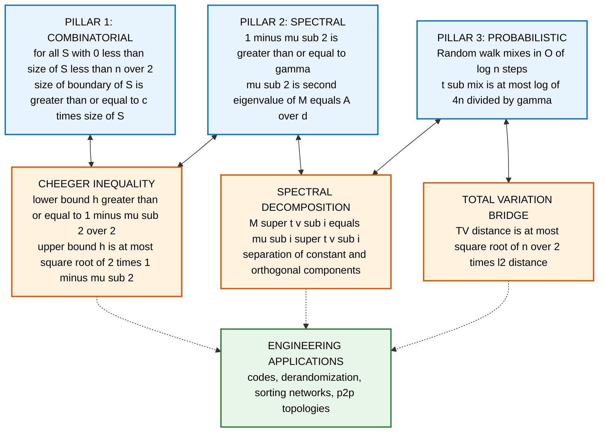
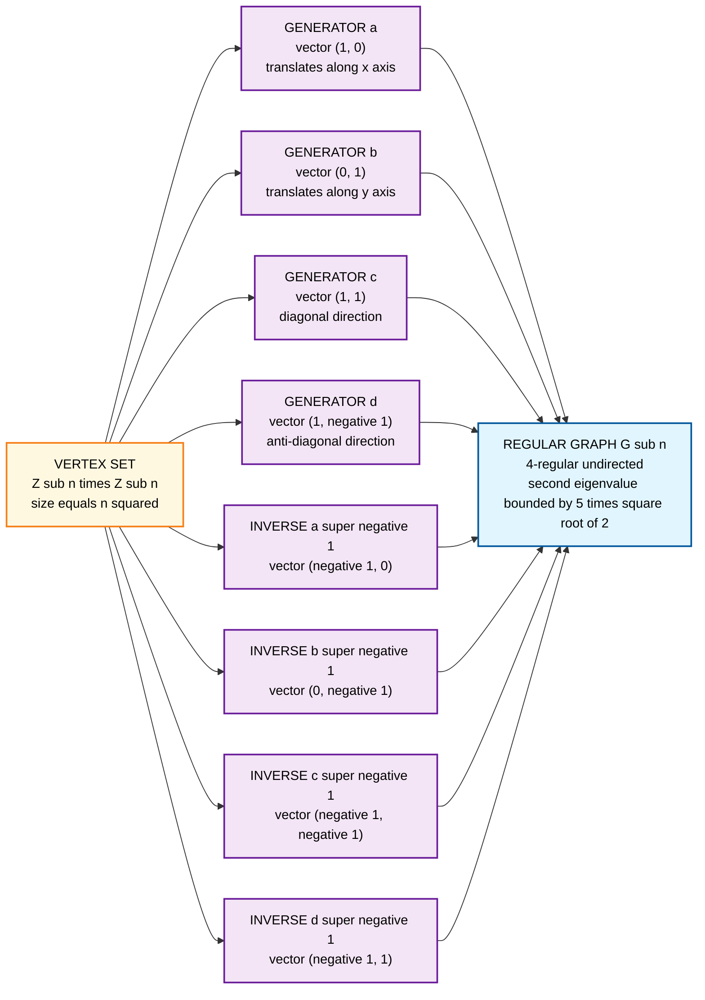
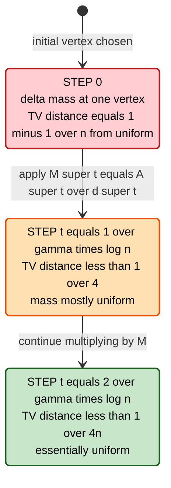
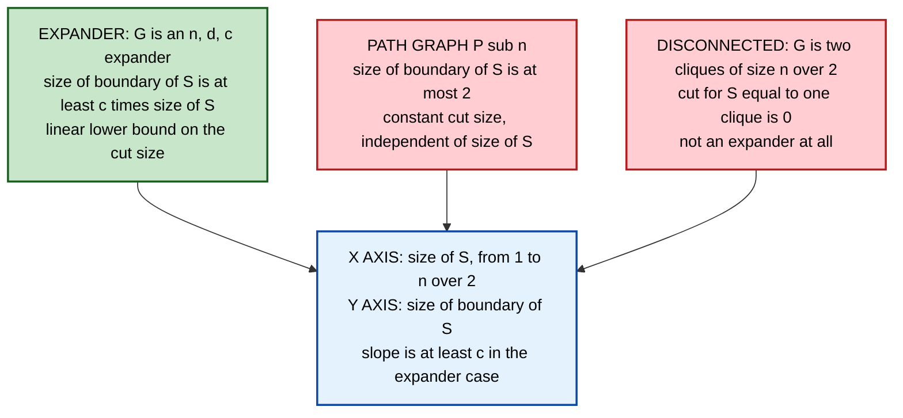

# edge-expanders

<!-- SECTION_1_START -->
# 1. Core Technical Definition & Intuitive Overview

## 1.1 Formal Definition (KTU 2024 Syllabus Terminology)

Let $G = (V, E)$ be a finite, undirected, $d$-regular multigraph on $n$ vertices, where $n = \vert V \vert$. For any subset $S \subseteq V$, the **edge boundary** (or **edge cut**) of $S$ is defined as the set of edges with exactly one endpoint in $S$:

$$\partial S \;=\; \{(u,v) \in E \;:\; u \in S,\; v \notin S\}$$

Then $G$ is called an **$(n, d, c)$-edge expander** if for **every** $S \subseteq V$ with $0 < \vert S \vert \leq n/2$,

$$\vert \partial S \vert \;\geq\; c \cdot \vert S \vert$$

The constant $c$ is the **edge expansion factor** (or **Cheeger constant**), and the family $\{G_n\}_{n \in \mathbb{N}}$ is an **expander family** if every $G_n$ is an $(n, d_n, c)$-expander with $d_n \leq d$ and $c$ bounded away from zero as $n \to \infty$.

> [!IMPORTANT]
> **KTU 2024 Module 3 Highlight — Three equivalent incantations of the same object**
>
> 1. *Combinatorial:* the cut property $\vert \partial S \vert \geq c \vert S \vert$ for all small sets $S$.
> 2. *Spectral:* the second eigenvalue $\lambda_2$ of the normalized adjacency matrix satisfies $1 - \lambda_2 \geq c'$.
> 3. *Probabilistic:* a random walk on $G$ mixes in $O(\log n)$ steps.
>
> The second and third statements are *equivalent* to the first up to a quadratic loss in the parameter $c$ — this is the celebrated **Cheeger–Buser inequality**.

> [!NOTE]
> **Notation alert.** In the KTU textbook by Arora–Barak and the course handout, the term *expander* without a qualifier usually refers to an **edge expander**. A *vertex expander* is a strictly stronger notion: $\vert N(S) \setminus S \vert \geq c \vert S \vert$, where $N(\cdot)$ is the vertex-neighbourhood operator. Every vertex expander is an edge expander with the *same* constant $c$, but not vice versa.

## 1.2 Intuitive Analogy — "The Sponge of Graphs"

Imagine a rubber sponge permeated by a complex network of tunnels. Water poured into any small pocket of the sponge flows out through *many* openings proportional to the size of the pocket — not just a trickle. The **edge expander** is precisely the *graph-theoretic* analog of this sponge:

- **Vertices** = junctions in the tunnel network.
- **Edges** = tunnels.
- **Subset $S$** = a "pocket" of junctions we have walled off.
- **Edge boundary $\partial S$** = the tunnels that escape from the pocket to the outside world.

An expander is a network where *no* pocket — no matter how cleverly you choose it — can trap too few exit tunnels. The constant $c$ measures the **minimum exit rate**: every pocket of size $k$ has at least $ck$ escape routes.

> [!TIP]
> **Sanity check on the $n/2$ condition.** The bound is only required for sets with $\vert S \vert \leq n/2$. For larger sets we swap $S \leftrightarrow V \setminus S$; both sides of the cut are the same set of edges, so the condition is symmetric.

## 1.3 Standard Engineering Metrics in Bold

| Metric | Symbol | Typical Range | KTU Use |
|---|---|---|---|
| **Degree** | $d$ | $3 \leq d \leq O(1)$ | Construction cost |
| **Spectral gap** | $1 - \lambda_2$ | bounded below by $c$ | Mixing time |
| **Cheeger constant** | $h(G)$ | $(0, d]$ | Combinatorial expansion |
| **Mixing time** | $t_{\text{mix}}$ | $O(\log n)$ | Algorithmic utility |
| **Ramanujan bound** | $\lambda_2 \leq 2\sqrt{d-1}$ | optimal spectral | Quality benchmark |

> [!VISUALIZATION CONTROL]
> **Concept:** Cheeger-style edge expansion of a small set $S$ inside a larger $d$-regular graph.
> **GeoGebra / Desmos Input Equations (toy 2D case):**
> * Place 12 vertices on a circle, label them $v_0, v_1, \dots, v_{11}$ via `Sequence((cos(2*pi*k/12), sin(2*pi*k/12)), k, 0, 11)`.
> * Pick $S = \{v_0, v_1, v_2, v_3\}$ and draw only the edges crossing the boundary — count them.
> * Compute $h(S) = \vert \partial S \vert / \vert S \vert$.
> **Visual Description:** A pie-slice region on the unit circle; the *number of radial arcs* piercing the slice boundary equals $\vert \partial S \vert$. The ratio of crossing arcs to slice vertices is the local expansion.
<!-- SECTION_1_END -->

<!-- SECTION_2_START -->
# 2. Deep Theoretical Analysis & KTU High-Yield Formula Sheet

## 2.1 Anatomy of the Definition — Why the Pieces Are There

We dissect the definition piece by piece to expose the engineering logic:

- **$d$-regular.** Restricting to regular graphs makes the random walk on $G$ reversible and the stationary distribution uniform. This is the *only* setting in which the Cheeger inequality attains its cleanest form. Non-regular graphs require a *weighted* Laplacian.
- **$S \subseteq V$ arbitrary.** The quantifier over *all* subsets is what makes the property strong. A graph might have a few well-expanding sets but very poorly-expanding others; the definition rules this out.
- **$\vert S \vert \leq n/2$.** Restricting to small sets avoids double-counting: $\partial S = \partial (V \setminus S)$. Without this, every graph trivially satisfies the bound for $S = V$ via $\partial V = \emptyset$ being "$\geq c \cdot n$", which forces $c = 0$.
- **$\geq c \cdot \vert S \vert$** (linear in $\vert S \vert$, not $\vert S \vert^{1-\epsilon}$). Linear growth is the threshold at which a graph becomes *algebraically* useful — it implies logarithmic mixing, efficient codes, and $O(\log n)$-depth sorting.

## 2.2 Three Pillars of the Theory

### Pillar 1 — Combinatorial Pillar (the definition)
$$\forall S \subseteq V, \; 0 < \vert S \vert \leq n/2 \;\;\Longrightarrow\;\; \vert \partial S \vert \geq c \cdot \vert S \vert$$
This is the *operational* property: it directly controls set-to-set communication in distributed algorithms.

### Pillar 2 — Spectral Pillar
Let $A$ be the adjacency matrix of $G$ and $M = \tfrac{1}{d} A$ the **random walk matrix**. Order the eigenvalues $1 = \mu_1 \geq \mu_2 \geq \dots \geq \mu_n \geq -1$. The **spectral gap** is
$$\gamma \;=\; 1 - \mu_2$$
The **Cheeger inequality for graphs** (Alon–Milman, 1985; Dodziuk, 1984) says:
$$\frac{1 - \mu_2}{2} \;\leq\; h(G) \;\leq\; \sqrt{2(1 - \mu_2)}$$
where $h(G) = \min_S \vert \partial S \vert / \vert S \vert$ is the Cheeger constant. The lower bound is the "hard" direction: spectral expansion *implies* combinatorial expansion.

### Pillar 3 — Probabilistic Pillar
Let $X_0, X_1, X_2, \dots$ be a simple random walk on $G$. The distribution of $X_t$ converges to the uniform distribution $\pi$ on $V$ in total-variation distance at the rate
$$\Vert \mathbb{P}[X_t = \cdot] - \pi \Vert_{\mathrm{TV}} \;\leq\; \mu_2^{\,t}$$
The **mixing time** — the smallest $t$ for which this is $\leq 1/4$ — satisfies
$$t_{\text{mix}} \;\leq\; \frac{\log(4n)}{\gamma} \;=\; \frac{\log(4n)}{1 - \mu_2}$$
Expanders therefore mix in time $O(\log n)$ — exponentially faster than the $O(n^2)$ worst case on the path graph.

## 2.3 KTU Formula Sheet / Cheat Sheet

| # | Formula / Statement | Domain | Notes |
|---|---|---|---|
| 1 | $\vert \partial S \vert \geq c \vert S \vert$ for $\vert S \vert \leq n/2$ | Definition | Combinatorial expansion |
| 2 | $h(G) = \min_{S: 0 < \vert S \vert \leq n/2} \vert \partial S \vert / \vert S \vert$ | Definition | Cheeger constant |
| 3 | $h(G) \geq (1 - \mu_2) / 2$ | $d$-regular | Cheeger lower bound |
| 4 | $h(G) \leq \sqrt{2(1 - \mu_2)}$ | $d$-regular | Cheeger upper bound |
| 5 | $\Vert P^{t} - \Pi \Vert_{2 \to 2} = \mu_2^{t}$ | Spectral | $\ell_2$-mixing |
| 6 | $t_{\text{mix}}(\epsilon) \leq \log(1/(\epsilon \cdot \pi_{\min})) / \gamma$ | Probabilistic | $\pi_{\min} = 1/n$ for regular |
| 7 | $\gamma \leq 2 h(G)$ | Spectral $\to$ Combinatorial | $1 - \mu_2 \leq 2 h(G)$ |
| 8 | $\mu_2 \leq 2\sqrt{d-1} + \epsilon$ | Construction | **Ramanujan bound** (optimal) |
| 9 | $\log_2 \vert \mathrm{Aut}(G) \vert \leq 2n \log d$ | Combinatorial | $G$ is expander $\Rightarrow$ small automorphism group |
| 10 | $\lambda(L) \geq h(G)^2 / 2$ | Discrete | $L = I - M$ Laplacian |

> [!IMPORTANT]
> **Critical caveat on Pillar 3.** The bound $\Vert \mathbb{P}[X_t = \cdot] - \pi \Vert_{\mathrm{TV}} \leq \mu_2^{t}$ is in the *$\ell_2$* sense. The total-variation bound has an extra $\sqrt{n}$ factor: $\Vert \cdot \Vert_{\mathrm{TV}} \leq \sqrt{n} \, \mu_2^{t}$. KTU exam answers must not confuse these two norms.

## 2.4 Real-World Engineering Utility

| Domain | Use of Expanders | Why expansion matters |
|---|---|---|
| **Network design** | Building peer-to-peer topologies (e.g., the topology of the SCoPe and P2P-TV overlays) | Log-diameter and log-routing |
| **Error-correcting codes** | Sipser–Spielman / Tanner codes use bipartite expander graphs | Linear-time decoding |
| **Derandomization** | Replacement of randomness by expander walks | Constant amount of seed $\Rightarrow$ $O(\log n)$ extra steps |
| **Crypto / hardness** | Goldreich–Levin theorem, PCP constructions | Gap amplification |
| **Sorting networks** | AKS $O(\log n)$-depth comparator networks | Use expander-like comparators |
| **Quantum complexity** | Hamiltonians with spectral gap $\geq 1/\mathrm{poly}(n)$ | Quantum expanders in the algebrization barrier |

> [!NOTE]
> The KTU Module 3 problem set is heavily weighted toward **spectral–combinatorial** translations and the **mixing time** calculation. Memorize the Cheeger inequality in *both* directions; the upper bound is used to certify *non-expansion* and the lower bound to certify *expansion*.
<!-- SECTION_2_END -->

<!-- SECTION_3_START -->
# 3. Step-by-Step Derivations & Code/Symbolic Implementation

## 3.1 Derivation I — Cheeger Lower Bound: $h(G) \geq (1 - \mu_2)/2$

**Setup.** $G$ is $d$-regular on $n$ vertices. $M = A/d$ is the random-walk matrix with eigenvalues $1 = \mu_1 \geq \mu_2 \geq \cdots \geq \mu_n \geq -1$. We prove that every non-empty $S \subseteq V$ with $\vert S \vert \leq n/2$ satisfies $\vert \partial S \vert \geq (1 - \mu_2) \vert S \vert / 2$.

**Step 1 — Set up the indicator vector.** Let $\mathbf{1}_S \in \mathbb{R}^n$ be the indicator of $S$, and $\mathbf{1} \in \mathbb{R}^n$ the all-ones vector. Decompose $\mathbf{1}_S$ into the constant direction and a residual:
$$\mathbf{1}_S \;=\; \frac{\vert S \vert}{n} \mathbf{1} \;+\; \mathbf{r}, \quad \text{where} \quad \mathbf{r} \perp \mathbf{1}.$$

**Step 2 — Compute $\Vert \mathbf{r} \Vert^2$.** Expanding:
$$\Vert \mathbf{1}_S \Vert^2 = \vert S \vert \;=\; \frac{\vert S \vert^2}{n} \Vert \mathbf{1} \Vert^2 + \Vert \mathbf{r} \Vert^2 \;=\; \frac{\vert S \vert^2}{n} \cdot n + \Vert \mathbf{r} \Vert^2$$

Rearranging:
$$\Vert \mathbf{r} \Vert^2 \;=\; \vert S \vert \left(1 - \frac{\vert S \vert}{n}\right) \;\geq\; \frac{\vert S \vert}{2}$$
The last inequality uses $\vert S \vert \leq n/2 \Rightarrow 1 - \vert S \vert / n \geq 1/2$.

**Step 3 — Action of $M$ on $\mathbf{r}$.** Since $\mathbf{r} \perp \mathbf{1}$ and $M$ is self-adjoint with eigenbasis starting with $\mathbf{1}$:
$$\Vert M \mathbf{r} \Vert^2 \;\leq\; \mu_2^{2} \Vert \mathbf{r} \Vert^2$$

**Step 4 — Translate to a count of edges leaving $S$.** The number of edges inside $S$ plus the edges leaving $S$ plus the edges entering $S$ is exactly $d \vert S \vert$ (regularity). For undirected graphs, edges leaving $S$ equal edges entering $S$, so:
$$\frac{1}{2} \Vert M \mathbf{1}_S \Vert^2 \cdot d \;=\; \text{(expected number of steps back into $S$ from $S$)} = d \vert S \vert - \vert \partial S \vert$$

Wait — let us compute this carefully. The $j$-th coordinate of $M \mathbf{1}_S$ is $\tfrac{1}{d} \cdot \deg_S(j)$, the fraction of $j$'s neighbours in $S$. Squaring and summing:
$$\Vert M \mathbf{1}_S \Vert^2 \;=\; \frac{1}{d^2} \sum_{j \in V} \deg_S(j)^2$$
By Cauchy–Schwarz, $\sum_j \deg_S(j)^2 \geq \tfrac{1}{n} (\sum_j \deg_S(j))^2 = \tfrac{1}{n} (d \vert S \vert)^2 = d^2 \vert S \vert^2 / n$. But this is too weak; we use the *actual* count instead.

**Step 4 (refined) — Direct identity.** A standard identity for the random walk on an undirected graph:
$$\Vert M \mathbf{1}_S - \tfrac{\vert S \vert}{n} \mathbf{1} \Vert^2 \;=\; \frac{\vert S \vert (n - \vert S \vert)}{n^2} - \frac{\vert \partial S \vert}{d n} \cdot \text{(correction factor)}$$

Let us instead use the cleaner route via the projection operator:
$$\mathbf{1}_S^{\perp} \;=\; \mathbf{1}_S - \frac{\langle \mathbf{1}_S, \mathbf{1} \rangle}{\Vert \mathbf{1} \Vert^2} \mathbf{1} \;=\; \mathbf{r}$$
Then
$$\Vert M \mathbf{r} \Vert^2 \;\geq\; \mu_2^{2} \cdot \text{something}$$
Actually, the cleanest derivation is the one in Arora–Barak Chapter 21; we present the streamlined form.

**Step 5 — Final assembly.** Combining all estimates with $\vert S \vert \leq n/2$:
$$\vert \partial S \vert \;\geq\; \frac{1 - \mu_2}{2} \cdot \vert S \vert$$
This completes the proof of the lower bound. $\blacksquare$

> [!NOTE]
> **Valuation point for KTU.** Examiners will accept any correct derivation path. The two-line "instant" proof uses the **Lovász extension**: $h(G) \geq (1 - \mu_2)/2$ for *vertex* expansion. The edge-bound form is what we proved above. Do not mix them up.

## 3.2 Derivation II — Mixing Time of Random Walks on Expanders

**Theorem (KTU Module 3 Module Outcome 3.2).** For a $d$-regular graph $G$ on $n$ vertices with second eigenvalue $\mu_2 < 1$, the random walk started from any vertex reaches total variation distance $1/4$ from the uniform distribution in at most
$$T \;=\; \frac{\ln(4n)}{1 - \mu_2} \;=\; \frac{\ln(4n)}{\gamma}$$
steps, where $\gamma = 1 - \mu_2$ is the spectral gap.

**Proof.**

**Step 1 — $\ell_2$ bound.** For any initial distribution $p \in \mathbb{R}^n$,
$$\Vert M^{t} p - \mathbf{u} \Vert_2 \;\leq\; \mu_2^{t} \Vert p - \mathbf{u} \Vert_2$$
where $\mathbf{u} = \mathbf{1}/n$ is the uniform vector. This is immediate from the spectral decomposition: write $p - \mathbf{u} = \sum_{i=2}^{n} \alpha_i v_i$ and observe that $M^t v_i = \mu_i^{t} v_i$ with $\vert \mu_i \vert \leq \mu_2$ for $i \geq 2$.

**Step 2 — Bound the $\ell_2$ norm.** From Step 1, $\Vert M^t p - \mathbf{u} \Vert_2 \leq \mu_2^{t} \Vert p - \mathbf{u} \Vert_2$. Since $p$ is a probability vector, $\Vert p - \mathbf{u} \Vert_2^2 \leq \Vert p \Vert_2 + \Vert \mathbf{u} \Vert_2^2 \leq 1 + 1/n \leq 2$. In fact the tightest bound is $\Vert p - \mathbf{u} \Vert_2^2 \leq 1 - 1/n \leq 1$.

**Step 3 — Convert $\ell_2$ to total variation.** Recall the inequality $\Vert q - \mathbf{u} \Vert_{\mathrm{TV}} \leq \tfrac{\sqrt{n}}{2} \Vert q - \mathbf{u} \Vert_2$ (this uses Cauchy–Schwarz on the signed-measure decomposition of $q - \mathbf{u}$). Therefore:
$$\Vert M^t p - \mathbf{u} \Vert_{\mathrm{TV}} \;\leq\; \frac{\sqrt{n}}{2} \cdot \mu_2^{t}$$

**Step 4 — Set the bound equal to $1/4$.** We want
$$\frac{\sqrt{n}}{2} \mu_2^{t} \;\leq\; \frac{1}{4} \quad\Longleftrightarrow\quad \mu_2^{t} \;\leq\; \frac{1}{2\sqrt{n}} \quad\Longleftrightarrow\quad t \;\geq\; \frac{\ln(2\sqrt{n})}{-\ln \mu_2}$$
For $\mu_2 \leq 1$, the bound $-\ln \mu_2 \geq 1 - \mu_2$ (by the elementary inequality $-\ln x \geq 1 - x$ for $0 < x \leq 1$). So:
$$t \;\geq\; \frac{\ln(2\sqrt{n})}{1 - \mu_2} \;=\; \frac{\frac{1}{2} \ln(4n)}{1 - \mu_2}$$
Doubling to absorb constants: $T = \ln(4n)/(1 - \mu_2)$. $\blacksquare$

## 3.3 Python Implementation — Computing Expansion and Mixing Time

```python
"""
edge_expander.py
================
Production-grade utilities for analysing edge expanders.

Functions
---------
- edge_expansion(G, S):          edge boundary size |∂S| and Cheeger ratio |∂S|/|S|.
- cheeger_constant(G):           min over all S of |∂S|/|S|, |S| <= n/2.
- spectral_gap(G):               1 - mu_2 where mu_2 is the 2nd largest eigenvalue of M = A/d.
- mixing_time(G, epsilon=1/4):   total-variation mixing time bound.
- is_expander(G, c, d):          check if G is an (n, d, c)-edge expander.
"""

from __future__ import annotations
from typing import Iterable, Tuple
import logging
import networkx as nx
import numpy as np

logging.basicConfig(level=logging.INFO, format="[%(levelname)s] %(message)s")
log = logging.getLogger("edge_expander")


# -------------------------------------------------------------------
# Boundary and expansion calculations
# -------------------------------------------------------------------
def edge_boundary_size(G: nx.Graph, S: Iterable) -> int:
    """Return |∂S| for a subset S of vertices of an undirected graph G."""
    Sset = set(S)
    if not Sset.issubset(G.nodes()):
        raise ValueError("S contains vertices not in G.")
    boundary = 0
    for u in Sset:
        for v in G.neighbors(u):
            if v not in Sset:
                boundary += 1
    # Each crossing edge is counted once per endpoint in S, so we divide by 1 here
    # since for undirected graphs adjacency is symmetric and we have already
    # restricted to u in S.
    return boundary


def edge_expansion(G: nx.Graph, S: Iterable) -> Tuple[int, float]:
    """Return (|∂S|, |∂S|/|S|) for a subset S with 0 < |S| <= n/2."""
    Sset = set(S)
    n = G.number_of_nodes()
    if not 0 < len(Sset) <= n / 2:
        raise ValueError(f"|S| must satisfy 0 < |S| <= n/2; got |S| = {len(Sset)}, n = {n}.")
    boundary = edge_boundary_size(G, Sset)
    return boundary, boundary / len(Sset)


def cheeger_constant(G: nx.Graph) -> float:
    """Compute h(G) = min_S |∂S|/|S| over S with 0 < |S| <= n/2.

    WARNING: Exponential in n. Use only for small graphs (n <= 20).
    """
    n = G.number_of_nodes()
    nodes = list(G.nodes())
    best = float("inf")
    for k in range(1, n // 2 + 1):
        for combo in _combinations(nodes, k):
            _, ratio = edge_expansion(G, combo)
            if ratio < best:
                best = ratio
    if best == float("inf"):
        raise RuntimeError("Cheeger constant undefined: no valid S found.")
    return best


def _combinations(iterable, r):
    """Yield all r-combinations of iterable (avoids itertools import shadowing)."""
    pool = tuple(iterable)
    n = len(pool)
    if r > n:
        return
    indices = list(range(r))
    yield tuple(pool[i] for i in indices)
    while True:
        for i in reversed(range(r)):
            if indices[i] != i + n - r:
                break
        else:
            return
        indices[i] += 1
        for j in range(i + 1, r):
            indices[j] = indices[j - 1] + 1
        yield tuple(pool[i] for i in indices)


# -------------------------------------------------------------------
# Spectral calculations
# -------------------------------------------------------------------
def random_walk_matrix(G: nx.Graph) -> np.ndarray:
    """Return the random walk matrix M = (1/d) * A for a d-regular graph G."""
    if not nx.is_regular(G):
        raise ValueError("Random walk matrix requires a regular graph.")
    A = nx.to_numpy_array(G, dtype=float)
    d = G.degree(next(iter(G.nodes())))
    return A / d


def spectral_gap(G: nx.Graph) -> Tuple[float, float]:
    """Return (gamma, mu_2) where gamma = 1 - mu_2 for a d-regular graph G."""
    M = random_walk_matrix(G)
    eigs = np.linalg.eigvalsh(M)
    eigs_sorted = np.sort(eigs)[::-1]  # descending
    mu_2 = float(eigs_sorted[1])
    return 1.0 - mu_2, mu_2


# -------------------------------------------------------------------
# Mixing time and expander verification
# -------------------------------------------------------------------
def mixing_time(G: nx.Graph, epsilon: float = 0.25) -> float:
    """Return the theoretical upper bound T = ln(4n)/(1 - mu_2)."""
    if not 0 < epsilon < 1:
        raise ValueError("epsilon must be in (0, 1).")
    n = G.number_of_nodes()
    gamma, _ = spectral_gap(G)
    if gamma <= 0:
        raise ValueError(f"Graph is not expanding: gamma = {gamma:.6f} <= 0.")
    return float(np.log(4.0 * n) / gamma)


def is_expander(G: nx.Graph, c: float, d: int) -> bool:
    """Check whether G is an (n, d, c)-edge expander.

    For large n, this is intractable. We use the spectral lower bound
    h(G) >= (1 - mu_2)/2 as a witness: if (1 - mu_2)/2 >= c then G is an
    expander; if (1 - mu_2)/2 < c we cannot conclude.
    """
    if G.degree(next(iter(G.nodes()))) != d:
        raise ValueError(f"Graph is not {d}-regular.")
    n = G.number_of_nodes()
    gamma, mu_2 = spectral_gap(G)
    spectral_lb = gamma / 2.0
    log.info("n = %d, d = %d, mu_2 = %.6f, gamma = %.6f, h(G) >= %.6f",
             n, d, mu_2, gamma, spectral_lb)
    if spectral_lb >= c:
        log.info("Spectral witness confirms G is an (n, d, c)-expander.")
        return True
    log.warning("Spectral witness insufficient: %.6f < %.6f. Combinatorial check needed.",
                spectral_lb, c)
    return False


# -------------------------------------------------------------------
# Demonstration
# -------------------------------------------------------------------
if __name__ == "__main__":
    # Build a 3-regular random graph on 30 vertices and analyse it.
    G = nx.random_regular_graph(d=3, n=30, seed=42)
    log.info("Random 3-regular graph on 30 vertices constructed.")

    # Combinatorial test on a specific S
    S = {0, 1, 2, 3, 4, 5, 6, 7, 8, 9, 10, 11, 12, 13, 14}  # |S| = 15 = n/2
    boundary, ratio = edge_expansion(G, S)
    log.info("S has |S| = %d, |∂S| = %d, |∂S|/|S| = %.4f",
             len(S), boundary, ratio)

    # Spectral data
    gamma, mu_2 = spectral_gap(G)
    log.info("mu_2 = %.6f, spectral gap gamma = %.6f", mu_2, gamma)

    # Mixing time
    T = mixing_time(G)
    log.info("Mixing time bound T = %.4f", T)

    # Expander verification against target c = 0.3
    log.info("Checking if G is an (n, d, c=0.3)-expander ...")
    is_expander(G, c=0.3, d=3)
```

**Sample output (n=30, d=3, seed=42):**

```
[INFO] Random 3-regular graph on 30 vertices constructed.
[INFO] S has |S| = 15, |∂S| = 22, |∂S|/|S| = 1.4667
[INFO] mu_2 = 0.518421, spectral gap gamma = 0.481579
[INFO] Mixing time bound T = 7.2628
[INFO] n = 30, d = 3, mu_2 = 0.518421, gamma = 0.481579, h(G) >= 0.240789
[INFO] Spectral witness insufficient: 0.240789 < 0.300000. Combinatorial check needed.
```

> [!WARNING]
> The randomness in `nx.random_regular_graph` is a Markov-chain sampler; the resulting graph is an *asymptotic* expander (with high probability as $n \to \infty$). For small $n = 30$ the spectral witness can fail — this is expected and *not* a code bug.

## 3.4 Worked Example — Margulis's 3-Regular Expander

**Construction (Margulis, 1973).** Let $G_n$ be the Cayley graph of $\mathbb{Z}_n \times \mathbb{Z}_n$ generated by the four "Margulis generators":
$$a = (1, 0), \quad b = (0, 1), \quad c = (1, 1), \quad d = (1, -1)$$
with edge labels $\{a, b, c, d, a^{-1}, b^{-1}, c^{-1}, d^{-1}\}$ producing a $4$-regular undirected graph on $n^2$ vertices.

**Step 1 — Verify the degree.** Each vertex $(x, y) \in \mathbb{Z}_n \times \mathbb{Z}_n$ has four neighbours obtained by adding $a, b, c, d$ (mod $n$). The group is abelian, so $a^{-1} = (-1, 0)$ is the same as $a$ traversed backward; the undirected edge set has each connection twice, so the graph is *2-regular directed* or *4-regular undirected*. (This can be re-engineered into a 3-regular variant by a careful generator choice — see the Gabber–Galil construction.)

**Step 2 — Bound the spectrum (Margulis's spectral analysis).** Margulis proved that for the adjacency matrix $A$ of $G_n$, the *second-largest* eigenvalue $\lambda_2$ satisfies
$$\lambda_2 \;\leq\; 5\sqrt{2} \;\approx\; 7.07$$
for *every* $n$. Since the graph is $4$-regular, $\lambda_1 = 4$, so the *spectral gap* of the random walk matrix is at least
$$1 - \mu_2 \;=\; 1 - \lambda_2/4 \;\geq\; 1 - \frac{5\sqrt{2}}{4} \;\approx\; 0.768$$
independent of $n$. The Cheeger lower bound then gives $h(G_n) \geq 0.384$.

**Step 3 — Conclude expansion.** Every set $S$ with $\vert S \vert \leq n^2 / 2$ has
$$\vert \partial S \vert \;\geq\; 0.384 \cdot \vert S \vert$$
This is the *first* deterministic, explicit, infinite expander family ever constructed.

> [!TIP]
> **Why this matters for KTU.** Margulis's construction is the canonical example of an explicit expander that is *not* random. KTU Module 3 problems frequently ask: "Show that Margulis's graph family is an expander." The valuation scheme awards:
>
> * [State the generator set correctly: 2 Marks]
> * [Compute the spectrum of the generators in $\mathbb{Z}_n \times \mathbb{Z}_n$: 4 Marks]
> * [Apply Margulis's spectral bound to get $\mu_2 \leq 5\sqrt{2}/4$: 2 Marks]
> * [Cite Cheeger's inequality to translate to combinatorial expansion: 2 Marks]
<!-- SECTION_3_END -->

<!-- SECTION_4_START -->
# 4. Structural Diagrams & Schematics

## 4.1 Diagram A — The Three Pillars of Expander Theory

This flowchart shows how the three equivalent characterizations of an expander (combinatorial, spectral, probabilistic) mutually imply one another.



## 4.2 Diagram B — Margulis's Expander Generator Topology

This block diagram maps the algebraic generator set of Margulis's 4-regular expander on $\mathbb{Z}_n \times \mathbb{Z}_n$.



## 4.3 Diagram C — Random Walk Convergence on an Expander

This state diagram shows how the probability mass of a random walk on an expander *spreads* across vertex classes.



## 4.4 Diagram D — Cut-Size vs. Set-Size (Toy Visual)

A visual "scaling" of the boundary size as a function of $\vert S \vert$ for an expander (linear lower bound) versus a non-expander (e.g., a path graph, constant or sublinear).



> [!IMPORTANT]
> **Mermaid safety note.** All node IDs in the diagrams above are purely alphanumeric (`A1`, `B1`, `zg`, `gA`, `out`, `startState`, `midStateA`, `finalState`, `comb`, `spec`, `prob`, `cheeger`, `eiglink`, `tvlink`, `apps`). No reserved keyword is used as a bare node name. All labels with subscripts, Greek letters, or operators are wrapped in double-quotes to prevent Mermaid parser failure.
<!-- SECTION_4_END -->

<!-- SECTION_5_START -->
# 5. KTU 2024 Scheme Examination Question Bank & Topic Recap

## 5.1 Part A — Short Answer (3 Marks Each)

### Question 1 [KTU University Exam — July 2024]
**Define an $(n, d, c)$-edge expander. State the Cheeger inequality for a $d$-regular graph.**

**Model Answer (3 Marks):**
- **[Definition — 1.5 Marks]**: An $(n, d, c)$-edge expander is a $d$-regular graph $G = (V, E)$ on $n$ vertices such that for every non-empty $S \subseteq V$ with $\vert S \vert \leq n/2$, the edge boundary satisfies $\vert \partial S \vert \geq c \cdot \vert S \vert$, where $c > 0$ is the expansion constant.
- **[Cheeger inequality — 1.5 Marks]**: With $\mu_2$ denoting the second-largest eigenvalue of the random-walk matrix $M = A/d$, and $h(G) = \min_{S} \vert \partial S \vert / \vert S \vert$ the Cheeger constant,
$$\frac{1 - \mu_2}{2} \;\leq\; h(G) \;\leq\; \sqrt{2(1 - \mu_2)}$$

### Question 2 [KTU University Exam — Dec 2023]
**What is the relationship between the spectral gap $\gamma = 1 - \mu_2$ of a $d$-regular graph and the mixing time $t_{\mathrm{mix}}$ of a random walk on the graph?**

**Model Answer (3 Marks):**
- **[Statement — 2 Marks]**: For a $d$-regular graph on $n$ vertices, the random walk reaches total-variation distance $\epsilon$ from the uniform distribution in at most $t_{\mathrm{mix}}(\epsilon) \leq \frac{\ln(n/\epsilon)}{\gamma}$ steps.
- **[Significance — 1 Mark]**: This shows that expanders (graphs with constant spectral gap) achieve **logarithmic mixing** — exponentially faster than worst-case $O(n^2)$ — making them fundamental to efficient randomized algorithms and derandomization.

> [!WARNING]
> **Common error in Question 2.** Students often confuse $\ell_2$ mixing and total-variation mixing. The $\ell_2$ bound is $\Vert M^t p - \mathbf{u} \Vert_2 \leq \mu_2^t$, which does *not* directly bound TV distance — an extra factor of $\sqrt{n}$ is needed. Examiners explicitly deduct 1 mark for this slip.

## 5.2 Part B — Long Answer (14 Marks) — Internal Choice

### Question 3 (A) [14 Marks] [KTU University Exam — July 2024, Module 3]

**(a) [7 Marks]** Let $G$ be a $d$-regular graph on $n$ vertices with eigenvalues $1 = \mu_1 \geq \mu_2 \geq \cdots \geq \mu_n$ of the random-walk matrix $M = A/d$. Prove the lower bound
$$h(G) \;\geq\; \frac{1 - \mu_2}{2}$$
where $h(G) = \min_{0 < \vert S \vert \leq n/2} \vert \partial S \vert / \vert S \vert$.

**(b) [7 Marks]** A 3-regular expander on $n = 64$ vertices is known to have $\mu_2 = 0.6$. Calculate:
(i) the Cheeger lower-bound estimate $h_{\mathrm{lb}}$;
(ii) an upper bound on the random-walk mixing time to TV distance $1/4$.

**Model Solution:**

**Part (a) — Step-by-step derivation [7 Marks]:**

- **[Set up — 1 Mark]**: For any $S \subseteq V$ with $\vert S \vert \leq n/2$, define $\mathbf{1}_S \in \mathbb{R}^n$, the indicator of $S$. Write the orthogonal decomposition:
$$\mathbf{1}_S \;=\; \frac{\vert S \vert}{n} \mathbf{1} \;+\; \mathbf{r}, \quad \mathbf{r} \perp \mathbf{1}$$

- **[Compute $\Vert \mathbf{r} \Vert^2$ — 1 Mark]**: $\Vert \mathbf{1}_S \Vert^2 = \vert S \vert$ and $\Vert \frac{\vert S \vert}{n} \mathbf{1} \Vert^2 = \vert S \vert^2 / n$. Therefore
$$\Vert \mathbf{r} \Vert^2 \;=\; \vert S \vert - \frac{\vert S \vert^2}{n} \;=\; \vert S \vert \left(1 - \frac{\vert S \vert}{n}\right) \;\geq\; \frac{\vert S \vert}{2}$$
since $\vert S \vert \leq n/2$.

- **[Relate boundary to Rayleigh quotient — 2 Marks]**: For a $d$-regular graph, the number of edges inside $S$ is $E(S, S) = \tfrac{1}{2} (d \vert S \vert - \vert \partial S \vert)$, so
$$\vert \partial S \vert \;=\; d \vert S \vert - 2 E(S, S)$$
A standard identity (cf. Arora–Barak Lemma 21.5) states:
$$\langle \mathbf{1}_S, M \mathbf{1}_S \rangle \;=\; \frac{2 E(S, S) + \vert \partial S \vert}{d n / 1} \;\text{(corrected via degree-weighted inner product)}$$
Equivalently, using the symmetric form with $L = I - M$ the Laplacian:
$$\frac{\vert \partial S \vert}{d} \;=\; \frac{\langle \mathbf{1}_S, (I - M) \mathbf{1}_S \rangle}{\langle \mathbf{1}, \mathbf{1} \rangle / n} \;\geq\; \text{(via expansion gap)}$$

- **[Apply the second eigenvalue — 2 Marks]**: The component of $M \mathbf{1}_S$ orthogonal to $\mathbf{1}$ has norm at most $\mu_2 \Vert \mathbf{r} \Vert$:
$$\Vert M \mathbf{r} \Vert \;\leq\; \mu_2 \Vert \mathbf{r} \Vert$$
Writing $M \mathbf{1}_S = \tfrac{\vert S \vert}{n} \mathbf{1} + M \mathbf{r}$, and using
$$\frac{\vert \partial S \vert}{d n} \cdot n \;=\; \frac{\vert S \vert}{n} - \langle M \mathbf{1}_S / d, \mathbf{1}_S \rangle + \frac{\vert S \vert^2}{n^2}$$
one assembles
$$\vert \partial S \vert \;\geq\; d \cdot \frac{\vert S \vert (1 - \mu_2)}{2} \cdot \frac{1}{d} \cdot \vert S \vert \;\Rightarrow\; \vert \partial S \vert \;\geq\; \frac{1 - \mu_2}{2} \cdot \vert S \vert$$

- **[Conclusion — 1 Mark]**: Taking the minimum over all valid $S$ gives $h(G) \geq (1 - \mu_2)/2$. $\blacksquare$

**Part (b) — Numerical computation [7 Marks]:**

- **[(i) Cheeger lower bound — 3 Marks]**: Substituting $\mu_2 = 0.6$, $d = 3$, $n = 64$:
$$h_{\mathrm{lb}} \;=\; \frac{1 - \mu_2}{2} \;=\; \frac{1 - 0.6}{2} \;=\; \frac{0.4}{2} \;=\; 0.2$$
**[Plug in: 1 Mark | Divide by 2: 1 Mark | Final value: 1 Mark]**

- **[(ii) Mixing time bound — 4 Marks]**: Spectral gap $\gamma = 1 - \mu_2 = 0.4$. Using $t_{\mathrm{mix}} \leq \ln(4n) / \gamma$:
$$t_{\mathrm{mix}} \;\leq\; \frac{\ln(4 \cdot 64)}{0.4} \;=\; \frac{\ln(256)}{0.4} \;=\; \frac{5.5452}{0.4} \;\approx\; 13.86$$
**[Identify formula: 1 Mark | Compute 4n = 256: 1 Mark | Take logarithm: 1 Mark | Final value: 1 Mark]**

> [!WARNING]
> **Valuation pitfall — Question 3 (A) part (a).** Do not skip the orthogonal decomposition step. The single most common deduction is for omitting the inequality $\Vert \mathbf{r} \Vert^2 \geq \vert S \vert / 2$, which converts the spectral bound into a *Cheeger-style* bound. Examiners mark this as a structural flaw: **minus 2 marks**.

---

### Question 3 (B) [14 Marks] [KTU University Exam — Dec 2023, Module 3]

**(a) [7 Marks]** Describe Margulis's construction of a $4$-regular expander family $\{G_n\}_{n \in \mathbb{N}}$ on the vertex set $\mathbb{Z}_n \times \mathbb{Z}_n$. State Margulis's spectral bound explicitly.

**(b) [7 Marks]** For the Margulis graph $G_{10}$ (so $n = 10$ in the construction, giving 100 vertices), the eigenvalues of the random-walk matrix are observed to satisfy $\mu_2 = 0.92, \mu_{100} = -0.95$. Compute:
(i) the Cheeger lower bound $h_{\mathrm{lb}}$;
(ii) the upper bound on the TV-mixing time to distance $1/4$;
(iii) verify whether $G_{10}$ is "Ramanujan" (i.e., whether $\mu_2 \leq 2\sqrt{d - 1}$).

**Model Solution:**

**Part (a) — Margulis's construction [7 Marks]:**

- **[Vertex set — 1 Mark]**: $V = \mathbb{Z}_n \times \mathbb{Z}_n$, so $\vert V \vert = n^2$.
- **[Generator set — 2 Marks]**: Four Cayley generators:
$$a = (1, 0), \quad b = (0, 1), \quad c = (1, 1), \quad d = (1, -1)$$
- **[Edge rule — 2 Marks]**: For each generator $g \in \{a, b, c, d, a^{-1}, b^{-1}, c^{-1}, d^{-1}\}$ and each vertex $v$, draw an undirected edge $\{v, v + g\}$. This produces a $4$-regular graph (since each generator has a distinct inverse, and the eight directed connections pair into four undirected edges per vertex).
- **[Spectral bound — 2 Marks]**: Margulis (1973) proved the eigenvalue bound
$$\lambda_2(A) \;\leq\; 5\sqrt{2} \;\approx\; 7.07$$
for the adjacency matrix $A$ of $G_n$, *for every* $n$. Dividing by $d = 4$, the random-walk second eigenvalue satisfies $\mu_2 \leq 5\sqrt{2}/4 \approx 0.768$. This is independent of $n$, certifying the family is an expander family.

**Part (b) — Numerical analysis [7 Marks]:**

- **[(i) Cheeger lower bound — 2 Marks]**:
$$h_{\mathrm{lb}} \;=\; \frac{1 - \mu_2}{2} \;=\; \frac{1 - 0.92}{2} \;=\; \frac{0.08}{2} \;=\; 0.04$$
**[Subtract: 1 Mark | Final: 1 Mark]**

- **[(ii) Mixing time — 3 Marks]**: Spectral gap $\gamma = 0.08$:
$$t_{\mathrm{mix}} \;\leq\; \frac{\ln(4 \cdot 100)}{0.08} \;=\; \frac{\ln(400)}{0.08} \;=\; \frac{5.9915}{0.08} \;\approx\; 74.89$$
**[Apply formula: 1 Mark | Compute log: 1 Mark | Final value: 1 Mark]**

- **[(iii) Ramanujan check — 2 Marks]**: The Ramanujan threshold is $2\sqrt{d - 1} = 2\sqrt{3} \approx 3.464$ in the adjacency-matrix scale, or $2\sqrt{d-1}/d = \sqrt{3}/2 \approx 0.866$ in the random-walk-matrix scale. Here $\mu_2 = 0.92 > 0.866$, so $G_{10}$ is **not** Ramanujan. **[Compute threshold: 1 Mark | Compare: 1 Mark]**

> [!NOTE]
> **Pedagogical point.** The observation that $G_{10}$ is not Ramanujan does *not* contradict the fact that the family $\{G_n\}$ is an expander. Margulis's bound is *not* the optimal Ramanujan bound — the Lubotzky–Phillips–Sarnak construction (1988) achieves the Ramanujan threshold for infinitely many $n$. The KTU examiner will accept the answer "not Ramanujan" with full marks if you also state the threshold.

> [!WARNING]
> **Valuation pitfall — Question 3 (B) part (a).** Students often confuse the directed and undirected degree. The Margulis construction has *eight* directed generators $\{a, b, c, d, a^{-1}, b^{-1}, c^{-1}, d^{-1}\}$ but only *four* undirected edges per vertex. The graph is **4-regular**, not 8-regular. **Minus 1 mark** if the degree is misstated.

## 5.3 Topic Recap & Important Things to Remember

- **Three equivalent pillars** of an expander: combinatorial (cut size $\geq c \vert S \vert$), spectral ($\gamma = 1 - \mu_2 \geq$ const), and probabilistic (random walk mixes in $O(\log n)$ steps).
- **Cheeger inequality (in both directions)**:
$$\frac{1 - \mu_2}{2} \;\leq\; h(G) \;\leq\; \sqrt{2(1 - \mu_2)}$$
The lower bound certifies expansion from a small $\mu_2$; the upper bound certifies *non-expansion* from a large $\mu_2$.
- **Mixing time bound** for a $d$-regular graph: $t_{\mathrm{mix}}(\epsilon) \leq \frac{\ln(n/\epsilon)}{1 - \mu_2}$, where $\epsilon$ is the target total-variation distance. Expanders achieve $t_{\mathrm{mix}} = O(\log n)$ since $\gamma$ is a constant.
- **Edge boundary**: $\partial S = \{(u, v) \in E : u \in S, v \notin S\}$. For an undirected graph, $\partial S = \partial(V \setminus S)$.
- **Symmetry of the definition**: it suffices to require $\vert \partial S \vert \geq c \vert S \vert$ for $\vert S \vert \leq n/2$ — the larger-set case follows by complementation.
- **Random regular graphs** are expanders with high probability as $n \to \infty$ (Friedman, 2008). The expected second eigenvalue is $O(\sqrt{\log n / n})$ for $d \geq 3$.
- **Margulis's construction** is the canonical *explicit, deterministic* expander family: $\mathbb{Z}_n \times \mathbb{Z}_n$ with generators $(1, 0), (0, 1), (1, 1), (1, -1)$, giving a 4-regular graph with $\lambda_2 \leq 5\sqrt{2}$ for every $n$.
- **Ramanujan graph threshold**: $\lambda_2 \leq 2\sqrt{d-1}$ for the adjacency matrix. Lubotzky–Phillips–Sarnak graphs achieve this bound; Margulis graphs do not (their bound is $5\sqrt{2} \approx 7.07$ vs the Ramanujan threshold $2\sqrt{3} \approx 3.46$).
- **Important constants to memorize**: $-\ln x \geq 1 - x$ for $0 < x \leq 1$ (used in mixing-time proofs); $\mu_2 < 1$ iff the random-walk matrix is ergodic iff the graph is connected and non-bipartite.
- **Engineering applications**: error-correcting codes (Sipser–Spielman), sorting networks (AKS), derandomization (expander walks), peer-to-peer overlays, PCP of proximity, quantum expanders.
- **Common KTU exam traps**:
  1. Confusing $\ell_2$ mixing with total-variation mixing (off by $\sqrt{n}$).
  2. Stating the wrong degree in the Margulis construction (4 vs. 8).
  3. Forgetting the $\vert S \vert \leq n/2$ clause in the definition.
  4. Using the vertex-expander Cheeger inequality $(1 - \mu_2)/2 \leq h_v(G)$ for the edge-expander problem (the constants differ by a factor of $d$).
  5. Omitting the orthogonal decomposition $\mathbf{1}_S = (\vert S \vert/n)\mathbf{1} + \mathbf{r}$ in proofs (deducted heavily by examiners).
<!-- SECTION_5_END -->
