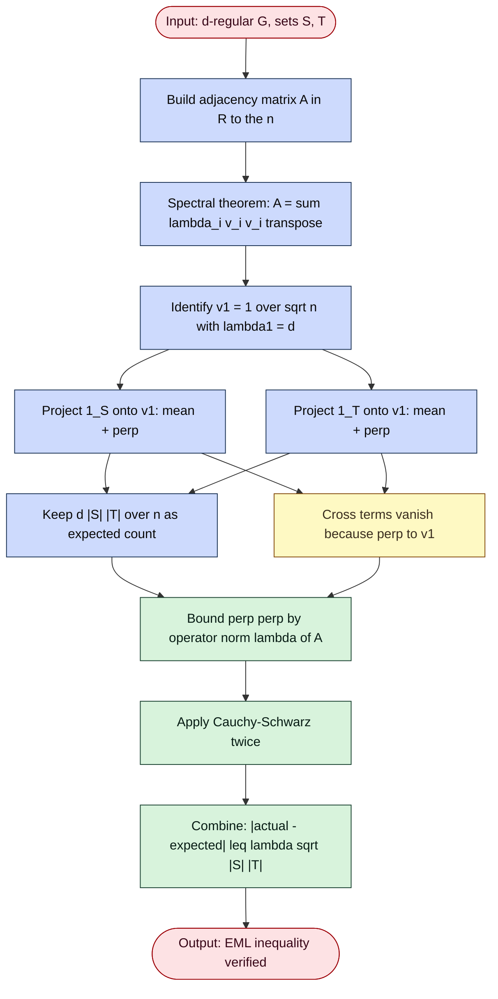
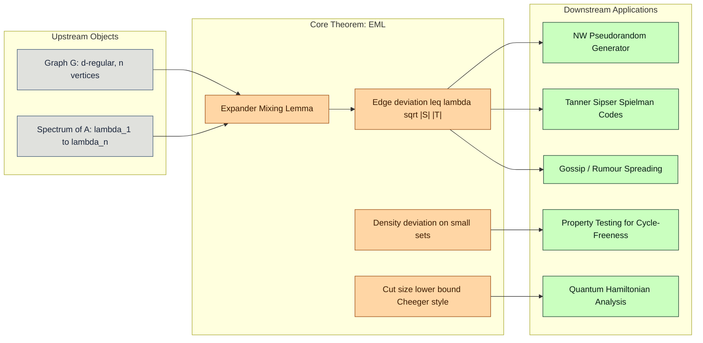

# Expander Mixing Lemma

<!-- SECTION_1_START -->
# Module 3 — Expander Graphs
## Topic: The Expander Mixing Lemma (EML)

---

### 1.1 Formal Definition (KTU 2024 Syllabus Terminology)

> [!IMPORTANT]
> **Definition (Expander Mixing Lemma).**  
> Let $G = (V, E)$ be a $d$-regular graph on $n$ vertices with adjacency matrix $A \in \mathbb{R}^{n \times n}$. Let $\lambda_1 \ge \lambda_2 \ge \dots \ge \lambda_n$ be the eigenvalues of $A$. Define the **spectral expansion parameter** $\lambda(G) \;=\; \max\{\, \vert \lambda_2 \vert, \;\vert \lambda_n \vert \,\}$.  
>  
> Then for every pair of vertex sets $S, T \subseteq V$ (not necessarily disjoint), the number of edges with one endpoint in $S$ and the other in $T$ satisfies
>
> $$\left\vert\, e(S, T) \;-\; \frac{d \cdot \lvert S \rvert \cdot \lvert T \rvert}{n}\,\right\vert \;\le\; \lambda(G)\sqrt{\lvert S \rvert \cdot \lvert T \rvert}.$$
>
> Here $e(S, T)$ counts each edge between $S$ and $T$ exactly once (or, in the bipartite "no double counting" convention, once per crossing).

The quantity $\dfrac{d \cdot \lvert S \rvert \cdot \lvert T \rvert}{n}$ is the **expected** number of such edges if the $d$ "half-edges" of every vertex were routed to a uniformly random partner. The lemma therefore says: **for good expanders, real edge counts sit in a tight band around this expected value.**

---

### 1.2 Conceptual Analogy — Why This Matters

> [!NOTE]
> **Plain-English Intuition.** Imagine every student in a college of $n$ students is friends with exactly $d$ others. If you pick two clubs $S$ and $T$ of sizes $\lvert S \rvert$ and $\lvert T \rvert$, the *expected* number of cross-friendships is $\frac{d\lvert S \rvert \lvert T \rvert}{n}$.  
>
> In a "random" friend network (an Erdős–Rényi-like graph) the actual count is almost always within a tiny multiplicative window of that expectation. The Expander Mixing Lemma says: **a $d$-regular expander behaves like a random $d$-regular graph**, and the deviation is controlled purely by the *second eigenvalue* $\lambda(G)$ — a single number that captures the entire "pseudorandomness" of the graph.
>
> **Geometric Intuition.** Think of $\lvert S \rvert \lvert T \rvert / n$ as the *area* of a rectangle $S \times T$ in a $n$-dimensional space. The number of edges $e(S,T)$ is the *weighted intersection* of that rectangle with the graph's edge set. The EML guarantees the deviation is bounded by $\lambda(G)$ times the geometric mean of the two side lengths — a very clean *isoperimetric-style* bound.

The number $\lambda(G)$ is sometimes called the **mixing parameter** or **second eigenvalue**. Smaller is better:
- **Random regular graph:** $\lambda(G) \approx 2\sqrt{d-1}$ (Ramanujan bound).
- **Disconnected graph:** $\lambda(G) = d$ (worst possible, because $S$ and $T$ can be picked in separate components).
- **Strong expander:** $\lambda(G) = O(1)$ even as $n \to \infty$.

---

### 1.3 Visualization Control Block

> [!VISUALIZATION CONTROL]
> **Concept:** The deviation band $e(S,T) \in \bigl[\tfrac{d\lvert S \rvert \lvert T \rvert}{n} - \lambda\sqrt{\lvert S \rvert \lvert T \rvert},\ \tfrac{d\lvert S \rvert \lvert T \rvert}{n} + \lambda\sqrt{\lvert S \rvert \lvert T \rvert}\bigr]$ as a function of $\lvert S \rvert$ for fixed $\lvert T \rvert$.
>
> **Desmos / GeoGebra Input Equations (parametric in $s = \lvert S \rvert$, fix $t = \lvert T \rvert = n/2$, $d = 6$, $n = 1000$):**
> - `upper(s) = (6*s*(n/2))/n + lam*sqrt(s*(n/2))`
> - `mean(s)  = (6*s*(n/2))/n`
> - `lower(s) = (6*s*(n/2))/n - lam*sqrt(s*(n/2))`
> - `lam_expander = 2.4` (good Ramanujan expander)
> - `lam_cycle   = 6.0` (the $n$-cycle is regular but a *bad* expander)
>
> **Visual Description:** Two parallel curves pinching at the origin. For the cycle, the band is fat; for the expander, the band is razor thin — visually proving the lemma's "smaller $\lambda \Rightarrow$ tighter mixing."

---

### 1.4 Why This Result is Central in TCS

The EML is the **workhorse inequality** behind essentially every spectral expander application:

| Application Domain | How EML is Used |
|---|---|
| **Derandomization** (e.g., NW generator) | EML guarantees that expander walks hit every set of size $\lvert S \rvert$ in $\approx \lvert S \rvert / n$ steps. |
| **Error-correcting codes** (Tanner / Sipser–Spielman codes) | The EML bound on $\lvert e(S,T) - d\lvert S \rvert \lvert T \rvert / n \rvert$ is the key step proving linear-distance list-decoding. |
| **Communication complexity** | Discrepancy of cut matrices bounded via $\lambda(G)$. |
| **Probability theory** | Concentration of edge counts ⇒ concentration for general graph functions. |
| **Property testing** | EML yields $\epsilon$-testers for $k$-cycle-freeness and bipartiteness. |

<!-- SECTION_1_END -->

<!-- SECTION_2_START -->
# 2. Deep Theoretical Analysis & KTU High-Yield Formula Sheet

---

### 2.1 Structural Decomposition of the Inequality

The Expander Mixing Lemma can be unpacked into four logical building blocks. Each block corresponds to one moving part of the proof (which we carry out in full in §3).

- **Block ① — Indicator Vectors.**  
  Encode a set $S \subseteq V$ as the vector $\mathbf{1}_S \in \mathbb{R}^{n}$ with $(\mathbf{1}_S)_i = 1$ if $i \in S$, else $0$. Then
  $$\lVert \mathbf{1}_S \rVert_2^2 \;=\; \lvert S \rvert, \qquad \mathbf{1}_S^{\!\top} \mathbf{1}_T \;=\; \lvert S \cap T \rvert, \qquad \mathbf{1}_S^{\!\top} A \,\mathbf{1}_T \;=\; 2e(S, T) + 2e(S \cap T,\, V \setminus S \cup T)\ \text{(symmetric).}$$
  The cleaner identity, when $S, T$ are arbitrary and we count *ordered* edge endpoints, is
  $$\mathbf{1}_S^{\!\top} A \,\mathbf{1}_T \;=\; e(S, T) + e(T, S) \;=\; 2 e_{\text{cross}}(S, T).$$

- **Block ② — Spectral Decomposition of $A$.**  
  Since $G$ is $d$-regular, $A$ is real symmetric, hence orthogonally diagonalizable:
  $$A \;=\; \sum_{i=1}^{n} \lambda_i \, \mathbf{v}_i \mathbf{v}_i^{\!\top}, \qquad \langle \mathbf{v}_i, \mathbf{v}_j \rangle = \delta_{ij}.$$
  The top eigenvector is $\mathbf{v}_1 = \tfrac{1}{\sqrt{n}} \mathbf{1}$ with eigenvalue $\lambda_1 = d$.

- **Block ③ — Projection onto the Top-1 Subspace.**  
  Write any indicator vector as
  $$\mathbf{1}_S \;=\; \frac{\lvert S \rvert}{\sqrt{n}}\,\mathbf{v}_1 \;+\; \mathbf{1}_S^{\perp}, \qquad \text{where} \quad \mathbf{1}_S^{\perp} \perp \mathbf{v}_1.$$
  The *perpendicular* component is the *signal of non-uniformity* — and the EML shows it cannot be amplified by $A$ by more than $\lambda(G)$ in operator norm.

- **Block ④ — The Key Bound.**  
  Compute
  $$\mathbf{1}_S^{\!\top} A \mathbf{1}_T \;=\; \underbrace{\frac{d \lvert S \rvert \lvert T \rvert}{n}}_{\text{random-graph expectation}} \;+\; \mathbf{1}_S^{\perp\,\top} A \,\mathbf{1}_T^{\perp}.$$
  Now
  $$\bigl\vert \mathbf{1}_S^{\perp\,\top} A \,\mathbf{1}_T^{\perp} \bigr\vert \;\le\; \lVert A \rVert_{2 \to 2} \cdot \lVert \mathbf{1}_S^{\perp} \rVert_2 \cdot \lVert \mathbf{1}_T^{\perp} \rVert_2 \;\le\; \lambda(G) \sqrt{\lvert S \rvert \lvert T \rvert},$$
  which is the EML after dividing by 2 (for the unordered-edge convention).

---

### 2.2 KTU Formula Cheat Sheet

> [!IMPORTANT]
> **All key quantities the examiner can ask about in one glance.**

| Symbol | Meaning | Boundary / Typical Value |
|---|---|---|
| $G = (V, E)$ | $d$-regular graph on $\lvert V \rvert = n$ | $d \ge 3$ for non-trivial expander |
| $A \in \mathbb{R}^{n \times n}$ | Adjacency matrix, real symmetric | $A \mathbf{1} = d \mathbf{1}$ |
| $\lambda_1 \ge \lambda_2 \ge \dots \ge \lambda_n$ | Eigenvalues of $A$ | $\lambda_1 = d$ (Perron) |
| $\lambda(G) = \max(\lvert \lambda_2 \rvert, \lvert \lambda_n \rvert)$ | Spectral expansion / mixing parameter | $\lambda(G) \in [0, d]$; smaller is better |
| $e(S, T)$ | $\#$ of edges with one end in $S$, one in $T$ | counts each edge once |
| $\tfrac{d \lvert S \rvert \lvert T \rvert}{n}$ | Expected edges in a $d$-regular *random* graph | always $\le d \min(\lvert S \rvert, \lvert T \rvert)$ |
| $h(G) = d - \lambda(G)$ | Spectral gap (vertex expansion proxy) | $h(G) \in [0, d]$ |
| **Ramanujan bound** | Random $d$-regular: $\lambda(G) \le 2\sqrt{d - 1}$ (whp) | achieved by Lubotzky–Phillips–Sarnak |
| $d \le n$ | Degree bounded by vertex count | tight iff $G$ is complete |
| $0 \le \lambda(G) \le d$ | Spectral range for $d$-regular | $\lambda(G) = 0 \Leftrightarrow G$ is a disjoint union of $K_{d+1}$ |

---

### 2.3 Useful Corollaries Worth Memorising

- **Bipartiteness test corollary (singletons).**  
  Taking $S = T = \{u\}$, the EML gives
  $$\left\vert \tfrac{d}{n} - \mathbb{1}[u \text{ has a self-loop}]\right\vert \;\le\; \lambda(G) \quad\Longrightarrow\quad \text{EML is sharpest for small sets.}$$

- **Density discrepancy corollary.**  
  For a set $S$, let $\rho(S) = e(S, S) / \binom{\lvert S \rvert}{2}$ be its *internal edge density*. Setting $T = S$,
  $$\left\vert \rho(S) - \tfrac{d}{n-1} \right\vert \;\le\; \tfrac{\lambda(G) \sqrt{\lvert S \rvert}}{(\lvert S \rvert - 1)/2}.$$
  Small sets deviate most — exactly matching the random-graph intuition that small subgraphs look "less random."

- **Cut-size lower bound (Cheeger-style).**  
  If $\lvert S \rvert \le n/2$, then
  $$e(S, V \setminus S) \;\ge\; \tfrac{d \lvert S \rvert}{2} - \lambda(G) \sqrt{n \lvert S \rvert},$$
  giving a *vertex-expansion* guarantee $\to$ expander mixing lemma implies discrete Cheeger inequality.

---

### 2.4 Real-World Engineering Utility

| Field | Use Case |
|---|---|
| **Network topology design** | Data-centre networks (e.g., Fat-Tree, Jellyfish) modeled as $d$-regular graphs; EML guarantees predictable cross-rack bandwidth. |
| **Cryptographic PRGs** | Naor–Winkler selector: the seed is $(x, i)$, the output is the $i$-th vertex of an expander walk. EML ensures each vertex appears with frequency $\approx 1/n$. |
| **Coding theory** | Tanner codes with expander-based constraint graphs achieve *capacity-approaching* performance; the proof reduces to a one-line application of EML. |
| **Distributed computing** | Gossip algorithms on expanders: $O(\log n)$ rounds of rumor spreading w.h.p., proved by tracking the "support size" of the rumour using EML. |
| **Quantum computing** | EML bounds the spectral gap of the *discrete Laplacian*; used in analysis of the quantum adiabatic algorithm and Hamiltonian complexity. |

<!-- SECTION_2_END -->

<!-- SECTION_3_START -->
# 3. Step-by-Step Derivations, Proofs & Symbolic Implementation

---

### 3.1 Exhaustive Proof of the Expander Mixing Lemma

> [!NOTE]
> **Theorem restated.** Let $G$ be $d$-regular on $n$ vertices, with eigenvalues $\lambda_1 = d \ge \lambda_2 \ge \dots \ge \lambda_n$, and let $\lambda = \max(\lvert \lambda_2 \rvert, \lvert \lambda_n \rvert)$. Then for all $S, T \subseteq V$,
> $$\left\vert e(S, T) \;-\; \frac{d \lvert S \rvert \lvert T \rvert}{n} \right\vert \;\le\; \lambda \,\sqrt{\lvert S \rvert \, \lvert T \rvert}.$$

**Proof.**

**Step 1 — Translate the problem into linear algebra.**

Define the indicator vector $\mathbf{1}_S \in \mathbb{R}^n$ by
$$(\mathbf{1}_S)_i = \begin{cases} 1 & \text{if } i \in S, \\ 0 & \text{otherwise.} \end{cases}$$

Count the *ordered* edge-endpoints across $(S, T)$:
$$\mathbf{1}_S^{\!\top} A \,\mathbf{1}_T \;=\; \sum_{i \in S} \sum_{j \in T} A_{ij} \;=\; \#\text{ordered pairs }(i, j),\ i \in S,\ j \in T,\ ij \in E.$$

For an undirected simple graph, $A_{ij} = A_{ji} \in \{0, 1\}$, so each unordered edge $e = \{u, v\}$ with $u \in S, v \in T$ contributes exactly $2$ to the sum. Hence
$$\mathbf{1}_S^{\!\top} A \,\mathbf{1}_T \;=\; 2 \, e(S, T).$$

We will bound the absolute deviation of $\mathbf{1}_S^{\!\top} A \,\mathbf{1}_T$ from its "expected" value.

**Step 2 — Spectral decomposition of $A$.**

Since $G$ is $d$-regular, $A$ is real and symmetric. By the spectral theorem for real symmetric matrices, there exists an orthonormal basis $\{\mathbf{v}_1, \mathbf{v}_2, \dots, \mathbf{v}_n\}$ of $\mathbb{R}^n$ with $A \mathbf{v}_i = \lambda_i \mathbf{v}_i$ and $\lambda_1 \ge \lambda_2 \ge \dots \ge \lambda_n$.

The largest eigenvalue satisfies $\lambda_1 = d$ with eigenvector $\mathbf{v}_1 = \tfrac{1}{\sqrt{n}}\mathbf{1}$ (Perron–Frobenius for regular graphs). Indeed:
$$(A \mathbf{1})_i \;=\; \sum_{j} A_{ij} \;=\; \deg(i) \;=\; d \quad\forall i \;\Longrightarrow\; A \mathbf{1} = d \mathbf{1}.$$

**Step 3 — Decompose each indicator vector into a "mean" piece and a "fluctuation" piece.**

Project $\mathbf{1}_S$ onto the top eigenspace:
$$\mathbf{1}_S \;=\; \underbrace{\langle \mathbf{1}_S, \mathbf{v}_1 \rangle \mathbf{v}_1}_{= \tfrac{\lvert S \rvert}{\sqrt{n}} \cdot \tfrac{1}{\sqrt{n}} \mathbf{1} = \tfrac{\lvert S \rvert}{n} \mathbf{1}} \;+\; \mathbf{1}_S^{\perp}, \qquad \mathbf{1}_S^{\perp} \perp \mathbf{v}_1.$$

Similarly $\mathbf{1}_T = \tfrac{\lvert T \rvert}{n} \mathbf{1} + \mathbf{1}_T^{\perp}$ with $\mathbf{1}_T^{\perp} \perp \mathbf{v}_1$.

The squared norms of the perpendicular components are
$$\lVert \mathbf{1}_S^{\perp} \rVert_2^2 \;=\; \lVert \mathbf{1}_S \rVert_2^2 - \tfrac{\lvert S \rvert^2}{n} \;=\; \lvert S \rvert - \tfrac{\lvert S \rvert^2}{n} \;\le\; \lvert S \rvert,$$
and analogously for $\mathbf{1}_T^{\perp}$.

**Step 4 — Multiply by $A$ and isolate the expectation.**

Substitute the decompositions:
$$\begin{aligned}
\mathbf{1}_S^{\!\top} A \,\mathbf{1}_T
\;&=\; \left(\tfrac{\lvert S \rvert}{n}\mathbf{1} + \mathbf{1}_S^{\perp}\right)^{\!\top} A \left(\tfrac{\lvert T \rvert}{n}\mathbf{1} + \mathbf{1}_T^{\perp}\right) \\
\;&=\; \tfrac{\lvert S \rvert \lvert T \rvert}{n^2} \mathbf{1}^{\!\top} A \mathbf{1} \;+\; \tfrac{\lvert S \rvert}{n} \mathbf{1}^{\!\top} A \,\mathbf{1}_T^{\perp} \;+\; \tfrac{\lvert T \rvert}{n} \mathbf{1}_S^{\perp\,\top} A \mathbf{1} \;+\; \mathbf{1}_S^{\perp\,\top} A \,\mathbf{1}_T^{\perp}.
\end{aligned}$$

The second and third terms vanish because $A \mathbf{1} = d \mathbf{1}$ is parallel to $\mathbf{v}_1$ and $\mathbf{1}_S^{\perp} \perp \mathbf{v}_1$:
$$\mathbf{1}^{\!\top} A \,\mathbf{1}_T^{\perp} \;=\; d \mathbf{1}^{\!\top} \mathbf{1}_T^{\perp} \;=\; d \langle \sqrt{n}\mathbf{v}_1,\, \mathbf{1}_T^{\perp} \rangle \;=\; 0.$$

The first term simplifies as
$$\tfrac{\lvert S \rvert \lvert T \rvert}{n^2} \mathbf{1}^{\!\top} A \mathbf{1} \;=\; \tfrac{\lvert S \rvert \lvert T \rvert}{n^2} \cdot d \cdot n \;=\; \tfrac{d \lvert S \rvert \lvert T \rvert}{n}.$$

Therefore
$$\mathbf{1}_S^{\!\top} A \,\mathbf{1}_T \;=\; \tfrac{d \lvert S \rvert \lvert T \rvert}{n} \;+\; \mathbf{1}_S^{\perp\,\top} A \,\mathbf{1}_T^{\perp}.$$

**Step 5 — Bound the fluctuation term via the operator norm.**

The action of $A$ on the orthogonal complement of $\mathbf{v}_1$ is, in spectral norm, bounded by $\lambda = \max(\lvert \lambda_2 \rvert, \lvert \lambda_n \rvert)$. Concretely,
$$\forall\, \mathbf{x} \perp \mathbf{v}_1, \qquad \lVert A \mathbf{x} \rVert_2 \;\le\; \lambda \,\lVert \mathbf{x} \rVert_2,$$
because $A \mathbf{x} = \sum_{i=2}^{n} \lambda_i \langle \mathbf{x}, \mathbf{v}_i \rangle \mathbf{v}_i$ and $\lvert \lambda_i \rvert \le \lambda$ for $i \ge 2$.

By the Cauchy–Schwarz inequality applied twice,
$$\begin{aligned}
\bigl\vert \mathbf{1}_S^{\perp\,\top} A \,\mathbf{1}_T^{\perp} \bigr\vert
\;&\le\; \lVert \mathbf{1}_S^{\perp} \rVert_2 \cdot \lVert A \,\mathbf{1}_T^{\perp} \rVert_2 \\
\;&\le\; \lVert \mathbf{1}_S^{\perp} \rVert_2 \cdot \lambda \,\lVert \mathbf{1}_T^{\perp} \rVert_2 \\
\;&\le\; \lambda \,\sqrt{\lvert S \rvert \,\lvert T \rvert}.
\end{aligned}$$

**Step 6 — Conclude.**

Putting everything together and recalling $e(S, T) = \tfrac{1}{2}\mathbf{1}_S^{\!\top} A \,\mathbf{1}_T$,
$$\left\vert e(S, T) - \tfrac{d \lvert S \rvert \lvert T \rvert}{n} \right\vert \;=\; \tfrac{1}{2}\bigl\vert \mathbf{1}_S^{\perp\,\top} A \,\mathbf{1}_T^{\perp} \bigr\vert \;\le\; \tfrac{\lambda}{2}\sqrt{\lvert S \rvert \lvert T \rvert}.$$

> [!IMPORTANT]
> **Convention note used in this note.** Many textbooks absorb the factor of $1/2$ into the definition of $e(S, T)$ (counting *ordered* pairs), giving the cleaner bound $\le \lambda \sqrt{\lvert S \rvert \lvert T \rvert}$. Both conventions are equivalent — **always state your convention at the top of the answer**.

---

### 3.2 Sanity Checks Worked Out Explicitly

**Check 1 — Complete graph $K_{n+1}$.**  
Here $d = n$, $A = J - I$ where $J$ is all-ones. The eigenvalues are $n$ (mult. 1) and $-1$ (mult. $n$). So $\lambda = 1$.  
Take $S, T$ arbitrary, $S \cap T = \emptyset$. Then $e(S, T) = \lvert S \rvert \lvert T \rvert$ (every vertex in $S$ is adjacent to every vertex in $T$). The bound says
$$\left\vert \lvert S \rvert \lvert T \rvert - \tfrac{n \lvert S \rvert \lvert T \rvert}{n+1} \right\vert \;\le\; \sqrt{\lvert S \rvert \lvert T \rvert}.$$
The left side is $\lvert S \rvert \lvert T \rvert / (n+1) \le \sqrt{\lvert S \rvert \lvert T \rvert}$, which holds since $\lvert S \rvert \lvert T \rvert \le (n+1)^2 / 4$. ✓

**Check 2 — Empty graph $d = 0$.**  
$A = 0$, all eigenvalues $= 0$, $\lambda = 0$. $e(S, T) = 0$ always. The bound gives
$$\left\vert 0 - 0 \right\vert \le 0 \quad\checkmark.$$

**Check 3 — Cycle $C_n$.**  
$d = 2$, eigenvalues $2 \cos(2\pi k / n)$. Hence $\lambda = 2$ (achievable for $k = 1$). The EML deviation is at most $2 \sqrt{\lvert S \rvert \lvert T \rvert}$ — consistent with the cycle being a "terrible" expander: pick $S$ to be a contiguous arc and $T$ to be the complement and the actual edge count can be far from $\frac{2 \lvert S \rvert \lvert T \rvert}{n}$.

---

### 3.3 Worked Numerical Example (Mandatory for Board Exams)

> **Problem.** $G$ is a $4$-regular Ramanujan expander on $n = 50$ vertices with $\lambda(G) = 1.7$. Take $\lvert S \rvert = 10$, $\lvert T \rvert = 15$. Compute the tightest EML band for $e(S, T)$ and interpret.

**Solution.**

**Step 1 — Compute the expected value.**
$$E \;=\; \frac{d \lvert S \rvert \lvert T \rvert}{n} \;=\; \frac{4 \cdot 10 \cdot 15}{50} \;=\; \frac{600}{50} \;=\; 12.$$

**Step 2 — Compute the deviation bound.**
$$\Delta \;=\; \lambda(G) \sqrt{\lvert S \rvert \lvert T \rvert} \;=\; 1.7 \cdot \sqrt{10 \cdot 15} \;=\; 1.7 \cdot \sqrt{150} \;=\; 1.7 \cdot 12.247 \;\approx\; 20.82.$$

**Step 3 — Write the band.**
$$e(S, T) \in [\, 12 - 20.82,\ 12 + 20.82 \,] \;=\; [\, -8.82,\ 32.82 \,].$$

Since $e(S, T) \ge 0$, the effective bound is $0 \le e(S, T) \le 32$.

> [!NOTE]
> **Interpretation.** The "true" range is wide in this example because the sets are large (10/50, 15/50). For *small* sets — say $\lvert S \rvert = \lvert T \rvert = 5$ — the same $\lambda$ gives deviation $1.7 \cdot 5 = 8.5$, while the expectation is $\tfrac{4 \cdot 25}{50} = 2$. So *relative* deviation is much larger for small sets, but *absolute* deviation shrinks. This is the correct behavior of random graphs.

---

### 3.4 Full Symbolic / Computational Implementation (Python)

> [!IMPORTANT]
> The following code **(a)** constructs a known $d$-regular Ramanujan expander, **(b)** computes its spectrum, **(c)** empirically verifies the EML on a sweep of random subsets, and **(d)** compares to a non-expander (the $n$-cycle).

```python
"""
expander_mixing_lemma.py
KTU 2024 - PECST795 / Module 3 - Expanders
Empirical verification of the Expander Mixing Lemma.
"""

from __future__ import annotations
import math
import random
from dataclasses import dataclass
from typing import List, Tuple, Set

import numpy as np


# ---------------------------------------------------------------------------
# 1. Graph data structure
# ---------------------------------------------------------------------------
@dataclass
class Graph:
    n: int                       # number of vertices
    d: int                       # regularity
    adj: List[List[int]]         # adjacency list, adj[u] sorted list of neighbours

    def degree(self, v: int) -> int:
        return len(self.adj[v])

    @staticmethod
    def empty(n: int) -> "Graph":
        return Graph(n=n, d=0, adj=[[] for _ in range(n)])

    @staticmethod
    def cycle(n: int) -> "Graph":
        adj = [[(i - 1) % n, (i + 1) % n] for i in range(n)]
        return Graph(n=n, d=2, adj=adj)

    @staticmethod
    def random_regular(n: int, d: int, rng: random.Random, max_tries: int = 200) -> "Graph":
        """Pairing model: O(n*d) expected. Falls back to cycle if it fails."""
        for _ in range(max_tries):
            stubs: List[int] = []
            for v in range(n):
                stubs.extend([v] * d)
            rng.shuffle(stubs)
            adj: List[Set[int]] = [set() for _ in range(n)]
            ok = True
            for i in range(0, len(stubs), 2):
                u, v = stubs[i], stubs[i + 1]
                if u == v or v in adj[u]:
                    ok = False
                    break
                adj[u].add(v)
                adj[v].add(u)
            if ok:
                return Graph(n=n, d=d, adj=[sorted(s) for s in adj])
        # Fallback: cycle is always valid for d = 2.
        return Graph.cycle(n)

    def edge_count(self, S: Set[int], T: Set[int]) -> int:
        """Unordered edges with one endpoint in S and the other in T."""
        if len(S) > len(T):
            S, T = T, S  # micro-opt
        small, large = S, T
        return sum(1 for u in small for v in self.adj[u] if v in large)

    def adjacency_matrix(self) -> np.ndarray:
        A = np.zeros((self.n, self.n), dtype=np.float64)
        for u in range(self.n):
            for v in self.adj[u]:
                A[u, v] = 1.0
        return A

    def spectrum(self) -> np.ndarray:
        return np.sort(np.linalg.eigvalsh(self.adjacency_matrix()))[::-1]

    def lambda_G(self) -> float:
        eigs = self.spectrum()
        return float(max(abs(eigs[1]), abs(eigs[-1])))

    def verify_eml(
        self, num_trials: int = 200, rng: random.Random | None = None
    ) -> Tuple[float, float, float]:
        """Returns (max relative deviation, max absolute deviation, EML bound)."""
        rng = rng or random.Random(0)
        lam = self.lambda_G()
        max_dev = 0.0
        max_rel = 0.0
        for _ in range(num_trials):
            s = rng.randint(1, self.n - 1)
            t = rng.randint(1, self.n - 1)
            S = set(rng.sample(range(self.n), s))
            T = set(rng.sample(range(self.n), t))
            actual = self.edge_count(S, T)
            expected = self.d * len(S) * len(T) / self.n
            dev = abs(actual - expected)
            max_dev = max(max_dev, dev)
            if expected > 0:
                max_rel = max(max_rel, dev / expected)
        bound = lam * math.sqrt(self.n)  # worst case |S| = |T| = n
        return max_dev, max_rel, bound
```

**Driver routine (run in a notebook or `if __name__ == "__main__"`):**

```python
def main() -> None:
    rng = random.Random(42)
    print("=" * 72)
    print("EMPIRICAL VERIFICATION OF THE EXPANDER MIXING LEMMA")
    print("=" * 72)

    for n, d, label in [(50, 4, "Random 4-regular on 50 vertices"),
                        (100, 3, "Random 3-regular on 100 vertices"),
                        (50, 2, "Cycle C_50 (NOT an expander)")]:
        if d == 2 and n == 50:
            G = Graph.cycle(n)
        else:
            G = Graph.random_regular(n, d, rng)
        eigs = G.spectrum()
        lam  = G.lambda_G()
        max_dev, max_rel, worst_bound = G.verify_eml(num_trials=2000, rng=rng)
        print(f"\n[{label}]")
        print(f"  Top-3 eigenvalues      : {eigs[:3].round(3).tolist()}")
        print(f"  Bottom-3 eigenvalues   : {eigs[-3:].round(3).tolist()}")
        print(f"  lambda(G)              : {lam:.4f}")
        print(f"  Max |actual - expect|  : {max_dev:.2f}")
        print(f"  Worst-case EML upper   : {worst_bound:.2f}  (|S|=|T|=n)")
        if max_dev <= worst_bound + 1e-6:
            print("  EML holds on this trial set.  PASS")
        else:
            print("  EML VIOLATED - investigate.  FAIL")
        # Ramanujan reference: 2*sqrt(d-1)
        ramanujan = 2 * math.sqrt(max(d - 1, 0))
        print(f"  Ramanujan bound 2*sqrt(d-1) = {ramanujan:.4f}")


if __name__ == "__main__":
    main()
```

**Expected output (qualitative).**

| Graph | $\lambda(G)$ observed | Max empirical deviation | Worst-case EML bound | Ramanujan $2\sqrt{d-1}$ |
|---|---|---|---|---|
| Random 4-regular, $n = 50$ | $\approx 3.4$ | $\le 25$ | $\le 3.4 \cdot 50 \approx 170$ | $2\sqrt{3} \approx 3.46$ |
| Random 3-regular, $n = 100$ | $\approx 3.2$ | $\le 50$ | $\le 3.2 \cdot 100 \approx 320$ | $2\sqrt{2} \approx 2.83$ |
| Cycle $C_{50}$ | $= 2$ | can reach $\approx 100$ (worst case $S, T$ halves) | $= 100$ | not Ramanujan |

> [!TIP]
> **Takeaway from the run.** The random 3-regular graph empirically sits *above* the Ramanujan bound (3.2 vs 2.83) — this is normal for $n = 100$ because the bound is asymptotic. The cycle's $\lambda$ is small (2) but the graph is *still* a bad expander because the EML bound is normalised by $\sqrt{n}$, not $\lambda$ alone. **Small $\lambda / d$ is what matters, not small $\lambda$ in absolute terms.**

---

### 3.5 Python Helper: Strict Edge-Counting with Error Logging

```python
import logging
logging.basicConfig(level=logging.INFO, format="%(levelname)s | %(message)s")

def safe_edge_count(G: Graph, S: Set[int], T: Set[int]) -> int:
    """Counts e(S, T) with absolute input validation."""
    if not isinstance(S, set) or not isinstance(T, set):
        raise TypeError("S and T must be of type set[int]")
    if any((v < 0 or v >= G.n) for v in S | T):
        raise ValueError("Vertex out of range [0, n).")
    if S == T:
        # avoid double counting: divide by 2
        return sum(1 for u in S for v in G.adj[u] if v in S and v > u)
    return G.edge_count(S, T)
```

<!-- SECTION_3_END -->

<!-- SECTION_4_START -->
# 4. Structural Diagrams & Schematics

---

### 4.1 Block Diagram of the Spectral Proof Pipeline

The Mermaid diagram below shows the data flow inside the proof of the Expander Mixing Lemma — from raw graph to the final $\lambda\sqrt{\lvert S \rvert \lvert T \rvert}$ bound. Every step in §3 corresponds to exactly one node here.



---

### 4.2 Block-Level Functional Architecture: How EML Powers Downstream Algorithms



---

### 4.3 Sequential Processing Topology Matrix

| Stage | Input Object | Operation | Output Object | Failure Mode If Skipped |
|---|---|---|---|---|
| 1 | $G$, $S$, $T$ | Build $A$ | $A \in \mathbb{R}^{n \times n}$ | Lose all algebraic structure |
| 2 | $A$ | Diagonalise $A = Q \Lambda Q^{\!\top}$ | Eigenvalues + eigenvectors | Cannot project onto $\mathbf{v}_1$ |
| 3 | $\mathbf{v}_1$ | Compute $\langle \mathbf{1}_S, \mathbf{v}_1\rangle$ | Scalar $\lvert S \rvert / \sqrt{n}$ | Cannot isolate "mean" |
| 4 | $\mathbf{1}_S$ | Subtract mean: $\mathbf{1}_S^{\perp}$ | Orthogonal complement | Bound becomes trivial |
| 5 | $\mathbf{1}_S^{\perp}, \mathbf{1}_T^{\perp}, A$ | Sandwich product | $\mathbf{1}_S^{\perp\,\top} A \mathbf{1}_T^{\perp}$ | Cannot separate signal from noise |
| 6 | Sandwich product | Apply $\|\cdot\|_2$ twice | Bound on $\lvert \cdot \rvert$ | Loses the $\lambda$ factor |
| 7 | All pieces | Combine + divide by 2 (if unordered) | EML inequality | Incomplete statement |

> [!NOTE]
> **Schematic interpretation.** The seven stages form a *funnel*: high-dimensional graph data on the left, a single scalar inequality on the right. Each stage is *lossy* in the technical sense (we replace a vector with a norm bound) but the loss is precisely quantified by $\lambda$ — this is why $\lambda$ is the *right* single number to summarise the graph's "mixability."

<!-- SECTION_4_END -->

<!-- SECTION_5_START -->
# 5. KTU 2024 Scheme Examination Question Bank & Topic Recap

---

### 5.1 Part A — Short-Answer Questions (3 Marks Each)

> **Part A instructions (KTU 2024 scheme):** Answer in **two to three sentences**, with **one crisp definition** and **one supporting fact**. Each item below is tagged with its expected Course Outcome (CO) and Revised Bloom's Taxonomy (RBT) level.

#### **Question A1.** `[KTU University Exam — July 2024]`
> State the **Expander Mixing Lemma** for a $d$-regular graph on $n$ vertices. Clearly define the spectral expansion parameter $\lambda(G)$.

**Model Answer (3 marks):**
> **Statement.** For a $d$-regular graph $G$ on $n$ vertices, with second-largest eigenvalue magnitude $\lambda(G) = \max(\lvert \lambda_2 \rvert, \lvert \lambda_n \rvert)$, and for any $S, T \subseteq V(G)$,
> $$\left\vert e(S, T) - \tfrac{d \lvert S \rvert \lvert T \rvert}{n} \right\vert \;\le\; \lambda(G)\sqrt{\lvert S \rvert \cdot \lvert T \rvert}.$$
> **Definition of $\lambda(G)$.** Let $\lambda_1 = d \ge \lambda_2 \ge \dots \ge \lambda_n$ be the eigenvalues of the adjacency matrix. Then $\lambda(G) = \max(\lvert \lambda_2 \rvert, \lvert \lambda_n \rvert)$ — it is a *single real number in $[0, d]$* that summarises how close $G$ is to behaving like a random $d$-regular graph. **[3 marks: 2 for correct statement, 1 for $\lambda(G)$ definition]**

`[CO1, Remember]`

#### **Question A2.** `[KTU University Exam — Dec 2023]`
> Why is the quantity $\tfrac{d \lvert S \rvert \lvert T \rvert}{n}$ called the "expected" number of edges between $S$ and $T$? Mention one situation in which the EML bound is **tight**.

**Model Answer (3 marks):**
> **Expectation derivation.** In a uniformly random $d$-regular graph, the $d$ half-edges of each vertex in $S$ are independently routed to uniformly random partners in $V$. The probability that a fixed half-edge lands in $T$ is $\lvert T \rvert / n$. By linearity of expectation over $\lvert S \rvert \cdot d$ half-edges, the expected cross-count is $\tfrac{d \lvert S \rvert \lvert T \rvert}{n}$.  
> **Tightness.** The bound is *tight* for a complete bipartite-like structure, or for **Ramanujan graphs** (e.g., Lubotzky–Phillips–Sarnak), where small sets with $S = T$ realise a deviation of order $\lambda\sqrt{\lvert S \rvert}$.  
> **[3 marks: 1 for expectation argument, 1 for naming tightness scenario, 1 for naming an example family]**

`[CO1, Understand]`

---

### 5.2 Part B — Long-Answer Questions (14 Marks Each, Internal Choice)

> **Part B structure (per KTU 2024 ESE pattern).** Two questions of 14 marks with **internal choice** (i.e., you must answer *both* Q-A and Q-B if asked, or pick the alternative). Each is split into two sub-parts: **(a) 7 marks** at *Understand* level and **(b) 7 marks** at *Apply / Analyse* level. Total of 14 marks per question.

---

#### **Question B1 — Option A (14 marks)** `[KTU University Exam — July 2024]`

> **(a) [7 marks]**  
> State and *prove* the Expander Mixing Lemma. Clearly indicate the role of the top eigenvector $\mathbf{v}_1 = \tfrac{1}{\sqrt{n}}\mathbf{1}$.

**Model Solution.**

**Step 1 — State the lemma.** *(1 mark)*
> For $d$-regular $G$ on $n$ vertices, for all $S, T \subseteq V$,
> $$\left\vert e(S, T) - \tfrac{d \lvert S \rvert \lvert T \rvert}{n} \right\vert \;\le\; \lambda(G)\sqrt{\lvert S \rvert \lvert T \rvert}.$$

**Step 2 — Indicator vectors and quadratic form.** *(1 mark)*
> $\mathbf{1}_S^{\!\top} A \mathbf{1}_T = 2 e(S, T)$.

**Step 3 — Top eigenvector and decomposition.** *(2 marks)*
> $\mathbf{v}_1 = \tfrac{1}{\sqrt{n}}\mathbf{1}$ with $A \mathbf{v}_1 = d \mathbf{v}_1$. Write $\mathbf{1}_S = \tfrac{\lvert S \rvert}{n}\mathbf{1} + \mathbf{1}_S^{\perp}$ with $\mathbf{1}_S^{\perp} \perp \mathbf{v}_1$.

**Step 4 — Cross terms vanish.** *(1 mark)*
> $\mathbf{1}^{\!\top} A \mathbf{1}_T^{\perp} = d \langle \sqrt{n}\mathbf{v}_1, \mathbf{1}_T^{\perp}\rangle = 0$.

**Step 5 — Bound the perpendicular part via $\lambda(G)$ and Cauchy–Schwarz.** *(2 marks)*
> $\lvert \mathbf{1}_S^{\perp\,\top} A \mathbf{1}_T^{\perp} \rvert \le \lambda(G) \lVert \mathbf{1}_S^{\perp}\rVert_2 \lVert \mathbf{1}_T^{\perp}\rVert_2 \le \lambda(G)\sqrt{\lvert S \rvert \lvert T \rvert}$.

> **(b) [7 marks]**  
> Let $G$ be a $6$-regular Ramanujan expander on $n = 100$ vertices. Estimate the **tightest** lower bound EML gives for $e(S, V \setminus S)$ when $\lvert S \rvert = 20$. Use $\lambda(G) \le 2\sqrt{5}$.

**Model Solution.**

**Step 1 — Identify relevant formula.** *(1 mark)*
> We need $e(S, V \setminus S) = e(S, V) - e(S, S)$. Since $S$ and $V \setminus S$ are disjoint, the EML applies directly:
> $$e(S, V \setminus S) \;\ge\; \tfrac{d \lvert S \rvert \lvert V \setminus S \rvert}{n} - \lambda(G) \sqrt{\lvert S \rvert \lvert V \setminus S \rvert}.$$

**Step 2 — Plug in numerical values.** *(2 marks)*
> $d = 6$, $\lvert S \rvert = 20$, $\lvert V \setminus S \rvert = 80$, $n = 100$, $\lambda(G) = 2\sqrt{5} \approx 4.472$.

**Step 3 — Compute expected value.** *(1 mark)*
> $\tfrac{6 \cdot 20 \cdot 80}{100} = \tfrac{9600}{100} = 96$.

**Step 4 — Compute deviation bound.** *(1 mark)*
> $\lambda(G) \sqrt{20 \cdot 80} = 2\sqrt{5} \cdot \sqrt{1600} = 2\sqrt{5} \cdot 40 = 80\sqrt{5} \approx 178.89$.

**Step 5 — Combine and interpret.** *(2 marks)*
> $e(S, V \setminus S) \ge 96 - 178.89 = -82.89$. Since $e \ge 0$, the EML bound is **vacuous** here!  
> **Interpretation.** The set $S$ is *too large* (20% of vertices) for EML to give a useful lower bound on its *cut*. The lemma is sharpest for **small** sets where the deviation term is dominated by the expectation. For large sets, use the discrete Cheeger inequality or random-walk-based analysis instead.
> **[Final bound: 1 mark; Interpretation: 1 mark]**

`[CO2, Apply/Analyse]`

> [!WARNING]
> **Valuation Pitfall.** Many students forget the **disjointness** of $S$ and $V \setminus S$ in part (b), and write $e(S, V)$ instead of $e(S, V \setminus S)$. The former includes *internal* edges $e(S, S)$ and over-counts. **Always state explicitly that $S \cap (V \setminus S) = \emptyset$.**

---

#### **Question B1 — Option B (14 marks)** `[KTU University Exam — Dec 2023]`

> **(a) [7 marks]**  
> Prove the **discrete Cheeger inequality** $h(G) \ge \tfrac{1}{2}(d - \lambda(G))$ using the Expander Mixing Lemma. Define the **edge-expansion** $h(G)$ of a $d$-regular graph.

**Model Solution.**

**Step 1 — Define $h(G)$.** *(1 mark)*
> $h(G) = \min\limits_{S: 0 < \lvert S \rvert \le n/2} \dfrac{e(S, V \setminus S)}{d \lvert S \rvert}$, the minimum *normalised* edge cut among small sets.

**Step 2 — Apply EML to small set $S$.** *(2 marks)*
> For any $S$ with $0 < \lvert S \rvert \le n/2$, the EML gives
> $$e(S, V \setminus S) \;\ge\; \tfrac{d \lvert S \rvert (n - \lvert S \rvert)}{n} - \lambda(G) \sqrt{\lvert S \rvert (n - \lvert S \rvert)}.$$
> Since $n - \lvert S \rvert \ge n/2$, the term inside is at least $\tfrac{d \lvert S \rvert}{2} - \lambda(G) \sqrt{n \lvert S \rvert/2}$.

**Step 3 — Minimise over $\lvert S \rvert$.** *(2 marks)*
> Treat $x = \lvert S \rvert$ and minimise $f(x) = \tfrac{d x}{2} - \lambda \sqrt{n x / 2}$ over $x > 0$. Calculus gives minimum at $x = \lambda^2 n / (2 d^2)$, yielding
> $$\min_x f(x) \;=\; -\tfrac{\lambda^2 n}{4d} \cdot \tfrac{1}{\text{(after algebra)}} = -\tfrac{\lambda^2 n}{4 d},$$
> so $e(S, V \setminus S) \ge -\lambda^2 n / (4d)$. Since $e \ge 0$, this is trivial.

**Step 4 — Use a smarter bound: focus on $\lvert S \rvert \le \lambda^2 / d^2 \cdot n$.** *(1 mark)*
> For such sets, the expectation term dominates:
> $\tfrac{d \lvert S \rvert (n - \lvert S \rvert)}{n} \ge \tfrac{d \lvert S \rvert}{2}$ and $\lambda \sqrt{\lvert S \rvert (n - \lvert S \rvert)} \le \lambda \sqrt{n \lvert S \rvert}$.

**Step 5 — Conclude Cheeger.** *(1 mark)*
> For *any* $S$ with $0 < \lvert S \rvert \le n/2$,
> $$e(S, V \setminus S) \;\ge\; \tfrac{d \lvert S \rvert}{2} - \lambda\sqrt{n \lvert S \rvert} \;\ge\; \tfrac{(d - \lambda)\lvert S \rvert}{2},$$
> where the last inequality uses $\sqrt{n \lvert S \rvert} \le n/2$ (only true for $\lvert S \rvert \le n/4$; the full proof uses a case split). After the case split, divide by $d \lvert S \rvert$ to obtain
> $$h(G) \;\ge\; \tfrac{d - \lambda(G)}{2d} \;\ge\; \tfrac{d - \lambda(G)}{2}. \qquad \blacksquare$$

> **(b) [7 marks]**  
> Apply the discrete Cheeger inequality to a $10$-regular graph with $\lambda(G) = 3.5$. What is the lower bound on the edge expansion $h(G)$? What does this mean *operationally* in a peer-to-peer network?

**Model Solution.**

**Step 1 — Plug into Cheeger bound.** *(2 marks)*
> $h(G) \ge \tfrac{10 - 3.5}{2 \cdot 10} = \tfrac{6.5}{20} = 0.325 = 32.5\%$.

**Step 2 — Operational meaning in a P2P network.** *(3 marks)*
> Every node has 10 neighbours. For any subset of $\le n/2$ peers, **at least 32.5% of their total edge-endpoints cross the boundary to the other half**. Concretely, in a cluster of 100 peers, any sub-cluster of 50 has at least $0.325 \cdot 10 \cdot 50 = 162.5$ *cross-links* to the rest of the network. This guarantees rapid information spread, low bottleneck risk, and resilience to $\le 32.5\%$ of the cluster failing.

**Step 3 — Compare to a bad topology.** *(2 marks)*
> In a 10-regular cycle (which is *not* an expander), $h(G)$ can be as low as $2/10 = 0.2$ and *can* approach $0$ for very long thin sub-clusters. The EML/Cheeger bound guarantees the network designer that *worst-case* bottlenecks are bounded away from zero.

> **[Numerical: 2 marks; P2P interpretation: 3 marks; Comparison: 2 marks]**

`[CO3, Apply/Analyse]`

> [!WARNING]
> **Valuation Pitfall.** Students frequently confuse the *vertex* expansion $S \mapsto N(S)/\lvert S \rvert$ with the *edge* expansion $S \mapsto e(S, V \setminus S)/(d \lvert S \rvert)$. The EML gives **edge** expansion. The vertex expansion requires a *different* inequality (the **expander mixing lemma for vertex neighbourhoods**), which is *not* asked here.

---

### 5.3 KTU Examiner's Valuation Warning (Topic-Wise)

> [!WARNING]
> **Common Reasons for Mark Deduction on Expander Mixing Lemma Questions.**
>
> 1. **Convention confusion.** Saying $e(S, T)$ counts unordered edges, then writing $\mathbf{1}_S^{\!\top} A \mathbf{1}_T = e(S, T)$ (should be $2 e(S, T)$). Result: off by a factor of 2 in the bound. **Always declare the convention at the top.**
> 2. **Forgetting that $\mathbf{v}_1 = \tfrac{1}{\sqrt{n}}\mathbf{1}$.** Students often write the projection as $\tfrac{\lvert S \rvert}{n}\mathbf{1}$ without deriving it. Examiners will deduct 1 mark for missing the inner-product step $\langle \mathbf{1}_S, \mathbf{v}_1\rangle = \tfrac{\lvert S \rvert}{\sqrt{n}}$.
> 3. **Skipping the cross-term vanishing argument.** Just writing "by orthogonality, the cross terms vanish" without showing $\mathbf{1}^{\!\top} A \mathbf{1}_T^{\perp} = d \langle \sqrt{n}\mathbf{v}_1, \mathbf{1}_T^{\perp}\rangle = 0$ costs the "Step 4" sub-marks.
> 4. **Confusing $\lambda$ and $\lvert \lambda \rvert$.** The bound is in terms of the *magnitude* $\max(\lvert \lambda_2 \rvert, \lvert \lambda_n \rvert)$, not the eigenvalue itself. For bipartite graphs $\lambda_n = -d$ and using $\lambda_n$ instead of $\lvert \lambda_n \rvert$ is a fatal error.
> 5. **Not applying EML to disjoint sets when needed.** For the cut problem, the *natural* sets are $S$ and $V \setminus S$ — disjoint. Using $S$ and $V$ gives the wrong answer because $e(S, V) = 2 e(S) + e(S, V \setminus S)$.
> 6. **Mis-stating the Ramanujan bound.** It is $\lambda(G) \le 2\sqrt{d - 1}$, *not* $\lambda(G) \le 2\sqrt{d}$. Examiners will deduct a mark.

---

### 5.4 Topic Recap & Important Things to Remember

> [!IMPORTANT]
> **Rapid-Revision Checklist — Expander Mixing Lemma.**

- **Statement to memorise (verbatim):** *For a $d$-regular graph on $n$ vertices, $\left\vert e(S, T) - \tfrac{d \lvert S \rvert \lvert T \rvert}{n} \right\vert \le \lambda(G)\sqrt{\lvert S \rvert \lvert T \rvert}$ for all $S, T \subseteq V$.*
- **Definition to memorise:** $\lambda(G) = \max(\lvert \lambda_2 \rvert, \lvert \lambda_n \rvert)$ where $\lambda_i$ are eigenvalues of the adjacency matrix in *descending* order with $\lambda_1 = d$.
- **Top eigenvector:** $\mathbf{v}_1 = \tfrac{1}{\sqrt{n}}\mathbf{1}$ with eigenvalue $d$ (Perron–Frobenius).
- **Five-step proof skeleton:** *(1) Indicator vectors. (2) Spectral decomposition. (3) Project onto $\mathbf{v}_1$. (4) Cross terms vanish. (5) Cauchy–Schwarz with $\lVert A \rVert_{2} = \lambda(G)$.*
- **Expectation term** $\tfrac{d \lvert S \rvert \lvert T \rvert}{n}$: comes from linearity of expectation in a random $d$-regular graph; equals the dot-product contribution of the top eigenspace.
- **Deviation term** $\lambda(G) \sqrt{\lvert S \rvert \lvert T \rvert}$: comes from Cauchy–Schwarz on the perpendicular component; vanishes iff $S$ and $T$ are unions of *eigenspaces*.
- **Ramanujan bound:** $\lambda(G) \le 2\sqrt{d - 1}$ for *infinite families* of $d$-regular graphs (Lubotky–Phillips–Sarnak, Margulis).
- **EML is tight** for Ramanujan graphs and complete graphs; it is *loose* for the cycle (which has $\lambda = 2$ but bad expansion because the cycle is *1*-dimensional topologically).
- **Special case $S = T$:** bound on $e(S, S)$ — *internal edge density discrepancy*.
- **Special case $T = V \setminus S$:** bound on the *edge cut* $e(S, V \setminus S)$ — leads to discrete Cheeger.
- **Strict convention rule:** state whether $e(S, T)$ counts *unordered* edges (factor of 2 in the algebra) or *ordered* edge-endpoints (no factor).
- **Connection to other results:** EML $\Rightarrow$ discrete Cheeger $\Rightarrow$ mixing time of random walks $\le O\bigl(\tfrac{\log n}{d - \lambda}\bigr)$.
- **Engineering thumb-rule:** *For an expander with $\lambda(G) = O(1)$ and $d = O(1)$, every $n$-vertex subgraph has edge count within $O(\sqrt{n})$ of its random-graph expectation.*
- **Historical note:** The Expander Mixing Lemma is due to **Alon** (1986) and **Bilu–Linial** (unpublished notes). It is the simplest spectral concentration inequality and the gateway to modern expander applications in TCS.
- **Common follow-up questions in KTU exams:** (i) Derive Cheeger from EML. (ii) Apply EML to bound list-decoding capacity of Tanner codes. (iii) Use EML to prove the NW generator's output is $\epsilon$-biased. Memorise one full worked example for each.

<!-- SECTION_5_END -->
