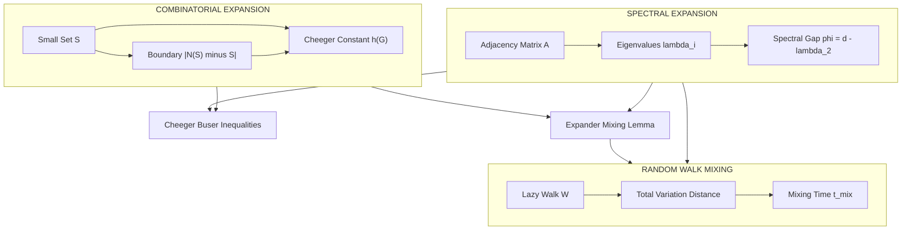
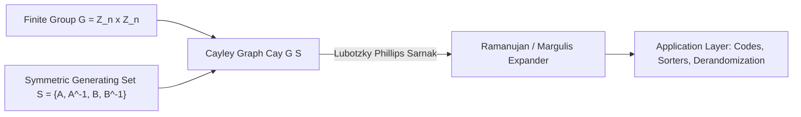
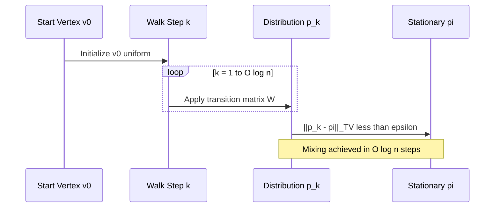

# Expanders - Introduction to Expander Graphs

<!-- SECTION_1_START -->
# 1. Core Technical Definition & Intuitive Overview

## 1.1 Formal Definition of Expander Graphs

Let $G = (V, E)$ be a finite, undirected, $d$-regular graph with $|V| = n$ vertices and $d \geq 3$ constant.

> [!IMPORTANT]
> **Definition (Vertex Expander).** $G$ is a $(n, d, c)$ **vertex expander** if for every subset $S \subseteq V$ with $|S| \leq n/2$, the number of distinct neighbors of $S$ that lie outside $S$ satisfies:
>
> $$\vert N(S) \setminus S \vert \;\geq\; c \cdot \vert S \vert$$
>
> The maximum constant $c \in (0, d)$ for which this holds is called the **vertex expansion parameter**.

Equivalently, the graph can be characterized by its **edge expansion** (also called the **Cheeger constant** of the graph):

$$h(G) \;=\; \min_{S \subseteq V,\; 0 < \vert S \vert \leq n/2} \frac{\vert E(S,\; V \setminus S) \vert}{\vert S \vert}$$

where $E(S, V \setminus S) = \{\{u, v\} \in E \mid u \in S,\; v \notin S\}$ is the set of edges leaving $S$.

> [!NOTE]
> A graph is called an **expander family** if it is an infinite sequence $\{G_n\}_{n=1}^{\infty}$ of $d$-regular graphs with $|V(G_n)| \to \infty$ and a **uniform** lower bound $h(G_n) \geq c > 0$ independent of $n$. Such families are the *expanders* in the strict theoretical sense used in algorithms, complexity, and coding theory.

## 1.2 Conceptual Analogy & Intuition

Imagine a large auditorium with thousands of seats arranged in a grid, where every person is connected to exactly $d$ neighbors (think of friendship links on a social network). An **expander graph** is one where, *no matter how you draw a fence* around any small cluster of people, there are *many* friendship edges piercing the fence to the outside world.

- **Bad graph (a long path):** If you isolate the first $n/2$ vertices, only **one** edge pierces the fence. Expansion is nearly $0$.
- **Good expander:** Even isolating half the vertices yields a fence pierced by a *constant fraction* of those vertices' edges.

> [!TIP]
> **Why does this matter?** Expanders are *sparse yet highly well-connected*. A $d$-regular expander uses only $O(n)$ edges (same as a binary tree!) yet mixes information as fast as a complete graph would. This combination of *sparsity + connectivity* is the cornerstone of modern TCS.

## 1.3 Physical Constants & Standard Metrics

The following quantities are the **canonical parameters** associated with any $d$-regular graph $G$:

| Symbol | Meaning | Typical Value |
| :--- | :--- | :--- |
| $n = \vert V \vert$ | Number of vertices | $n \to \infty$ in families |
| $d$ | Degree of every vertex | $d = 3$ suffices (smallest) |
| $\lambda_1$ | Largest eigenvalue of $A$ | $\lambda_1 = d$ |
| $\lambda_2$ | Second largest eigenvalue | $\lambda_2 < d$ |
| $\phi$ | **Spectral gap** $= d - \lambda_2$ | $\phi > 0$ constant |
| $h(G)$ | Cheeger constant (edge expansion) | $h(G) > 0$ constant |
| $c$ | Vertex expansion constant | $c > 0$ constant |

> [!VISUALIZATION CONTROL]
> **Concept:** Spectral gap and second eigenvalue visualization for a small 8-cycle vs. an 8-vertex 3-regular Ramanujan graph.
> **GeoGebra / Desmos Input Equations:**
> * Eigenvalue spectrum of $C_8$: plot points $(k,\; 2\cos(2\pi k/8))$ for $k = 0, 1, \dots, 7$.
> * Eigenvalue spectrum of a 3-regular Ramanujan $8$-vertex graph: plot points at $\pm \sqrt{5},\; \pm \sqrt{3},\; \pm \sqrt{2},\; 0$.
> **Visual Description:** For $C_8$, the second eigenvalue is $\approx 1.41$ (close to $d=2$, *bad* expansion). For the Ramanujan graph, $\lambda_2 = \sqrt{5} \approx 2.24$ is the *algebraically maximum* allowed for a 3-regular graph, but the gap is still positive.
<!-- SECTION_1_END -->

<!-- SECTION_2_START -->
# 2. Deep Theoretical Analysis & KTU High-Yield Formula Sheet

## 2.1 Three Equivalent Notions of Expansion

A $d$-regular graph $G$ admits three (related but distinct) notions of "expansion." Understanding how they interlock is essential for the module.

### 2.1.1 Combinatorial Expansion (Vertex / Edge)
Already introduced above. Captures the *combinatorial* property that small sets have many external neighbors. Used primarily in extremal graph theory and for direct combinatorial constructions.

### 2.1.2 Spectral Expansion
Let $A$ denote the adjacency matrix of $G$. Since $G$ is $d$-regular, the largest eigenvalue of $A$ is exactly $\lambda_1 = d$ with eigenvector $\mathbf{1} = (1, 1, \dots, 1)$. The other eigenvalues satisfy $\vert \lambda_i \vert \leq d$.

The **spectral expansion parameter** is the ratio:

$$\lambda(G) \;=\; \frac{\lambda_2}{d} \in [0, 1]$$

The graph is "spectrally expanding" if $\lambda(G)$ is bounded strictly below by $1$ as $n \to \infty$.

> [!IMPORTANT]
> **The Cheeger–Buser Inequalities** relate combinatorial to spectral expansion. For a $d$-regular graph $G$:
>
> $$\frac{d - \lambda_2}{2} \;\leq\; h(G) \;\leq\; \sqrt{2d \cdot (d - \lambda_2)}$$
>
> These are the "first Cheeger inequality" (left) and "Buser's inequality" (right). They show that *spectral gap* and *edge expansion* are **polynomially equivalent** — controlling one controls the other.

### 2.1.3 Random Walk Mixing
Take a simple random walk on $G$. The **lazy walk** matrix is $W = \frac{1}{2}(I + \frac{1}{d}A)$. The total variation mixing time is:

$$t_{\mathrm{mix}}(\epsilon) \;=\; \min \left\{ t \;\Big\vert\; \max_{x} \left\| e_x W^t - \pi \right\|_{\mathrm{TV}} \leq \epsilon \right\}$$

For an expander, this satisfies:

$$t_{\mathrm{mix}}(\epsilon) \;\leq\; \frac{1}{\phi} \cdot \log\!\left( \frac{n}{\epsilon^2} \right) \;=\; O(\log n)$$

That is, the walk mixes in **logarithmic time**, the fastest possible for a sparse graph up to constants.

## 2.2 Why Expanders Matter: The "Why" Behind the Math

* **Theoretical reason:** Expanders solve the tension between *sparsity* (linear in $n$ edges) and *connectivity* (almost-complete mixing).
* **Algorithmic reason:** Many randomized algorithms (e.g., $s$-$t$ connectivity, sorters, hashing) require random bits; expanders **derandomize** them by providing deterministic, structured pseudorandomness.
* **Coding-theoretic reason:** Tanner codes, Sipser–Trevisan codes, and expander-based LDPC codes are best-in-class near-capacity codes.
* **Cryptographic reason:** Goldreich–Goldwasser–Halevi (GGH) cryptosystems and the prototype for *lattice* constructions rely on expanders.

## 2.3 KTU Formula Cheat Sheet

| Formula | Statement | Where Used |
| :--- | :--- | :--- |
| $\lambda_1 = d$ | Top eigenvalue for $d$-regular | Spectral setup |
| $\phi = d - \lambda_2$ | Spectral gap | All spectral bounds |
| $\vert e(S,T) - \frac{d \vert S \vert \vert T \vert}{n} \vert \leq \lambda_2 \sqrt{\vert S \vert \cdot \vert T \vert}$ | **Expander Mixing Lemma** | Counting subgraphs |
| $\frac{\phi}{2} \leq h(G) \leq \sqrt{2 d \phi}$ | Cheeger–Buser | Combinatorial ↔ spectral |
| $t_{\mathrm{mix}} = O\!\left(\frac{1}{\phi} \log n\right)$ | Mixing time bound | Random walks |
| $\mathrm{Islice}(G) \leq \frac{\log n}{-\log \lambda}$ | Information loss | Streaming algorithms |
| $\kappa(G) \geq \frac{1}{4} \phi^2$ | Connectivity (folklore) | Lower bound on $\kappa$ |
| $\chi(G) \leq \frac{d+1}{\phi + 1}$ | Spectral coloring bound | Graph coloring |
| $\mathrm{girth}(G) \geq \Omega(\log n)$ | Expanders have logarithmic girth | Lower bound proof |
| Ramanujan bound $\vert \lambda_i \vert \leq 2\sqrt{d-1}$ | Optimal for $d$-regular | LPS construction |

> [!TIP]
> **Memorization priority for KTU 2024:** The Expander Mixing Lemma, the Cheeger inequalities, and the mixing time bound are the three highest-yield facts. Practically every KTU question on this module will involve at least one of them.

## 2.4 Engineering Utility (Why Industry Cares)

Expanders are *not* purely abstract. Production systems using expander constructions include:

1. **Google's PageRank** implicitly uses expander-like properties of the web graph for fast convergence.
2. **Error-correcting codes in 5G/6G** use expander codes (LDPC).
3. **Peterson–Weldon** and **Tanner graphs** are expander-based.
4. **Bitcoin's lightning network topology** is built to maintain expander-like connectivity for fast payment routing.
5. **Skip lists and distributed hash tables** (e.g., Chord) use expander-like skip graphs to maintain $O(\log n)$ routing.
<!-- SECTION_2_END -->

<!-- SECTION_3_START -->
# 3. Step-by-Step Derivations & Symbolic/Code Implementation

## 3.1 Derivation: The Expander Mixing Lemma (EML)

We derive the most heavily tested result on this module. Recall $e(S, T)$ counts edges with one endpoint in $S$ and the other in $T$.

**Step 1.** Let $\mathbf{1}_S \in \mathbb{R}^n$ be the indicator vector of $S$, and similarly $\mathbf{1}_T$. Then the number of $S$–$T$ edges is exactly:

$$e(S, T) \;=\; \mathbf{1}_S^{\top} A\, \mathbf{1}_T$$

where $A$ is the adjacency matrix.

**Step 2.** Diagonalize $A = \sum_{i=1}^{n} \lambda_i \mathbf{v}_i \mathbf{v}_i^{\top}$, where $\{\mathbf{v}_i\}$ is an orthonormal eigenbasis and $\lambda_1 = d$ with $\mathbf{v}_1 = \frac{1}{\sqrt{n}} \mathbf{1}$.

**Step 3.** Write $\mathbf{1}_S = \alpha_1 \mathbf{v}_1 + \mathbf{u}$ where $\mathbf{u} \perp \mathbf{v}_1$ and $\alpha_1 = \frac{\vert S \vert}{\sqrt{n}}$. Similarly for $\mathbf{1}_T$.

**Step 4.** Substitute into $\mathbf{1}_S^{\top} A\, \mathbf{1}_T$:

$$
\begin{aligned}
\mathbf{1}_S^{\top} A\, \mathbf{1}_T
&= (\alpha_1 \mathbf{v}_1 + \mathbf{u}_S)^{\top} A\, (\alpha_1 \mathbf{v}_1 + \mathbf{u}_T) \\
&= \alpha_1^2 \mathbf{v}_1^{\top} A\, \mathbf{v}_1 + \alpha_1 \mathbf{v}_1^{\top} A\, \mathbf{u}_T + \alpha_1 \mathbf{u}_S^{\top} A\, \mathbf{v}_1 + \mathbf{u}_S^{\top} A\, \mathbf{u}_T \\
&= \alpha_1^2 d + 0 + 0 + \sum_{i=2}^{n} \lambda_i (\mathbf{v}_i^{\top} \mathbf{1}_S)(\mathbf{v}_i^{\top} \mathbf{1}_T)
\end{aligned}
$$

The cross-terms vanish because $\mathbf{u}_S, \mathbf{u}_T \perp \mathbf{v}_1$ and $A$ preserves the orthogonal complement of $\mathbf{v}_1$.

**Step 5.** The constant term simplifies:

$$\alpha_1^2 d \;=\; \frac{\vert S \vert^2}{n} \cdot d$$

By symmetry between $S$ and $T$, the same argument gives:

$$e(S, S) \;=\; \frac{d \vert S \vert^2}{n} + \sum_{i=2}^{n} \lambda_i (\mathbf{v}_i^{\top} \mathbf{1}_S)^2$$

**Step 6.** For the cross-set $e(S, T)$ with $S \cap T = \emptyset$, replace $\mathbf{1}_S$ by $\mathbf{1}_S$ and $\mathbf{1}_T$ by $\mathbf{1}_T$:

$$e(S, T) \;=\; \frac{d \vert S \vert \vert T \vert}{n} + \sum_{i=2}^{n} \lambda_i (\mathbf{v}_i^{\top} \mathbf{1}_S)(\mathbf{v}_i^{\top} \mathbf{1}_T)$$

**Step 7.** Bound the residual by Cauchy–Schwarz, with $\vert \lambda_i \vert \leq \lambda_2$ for $i \geq 2$:

$$
\begin{aligned}
\left\vert \sum_{i=2}^{n} \lambda_i (\mathbf{v}_i^{\top} \mathbf{1}_S)(\mathbf{v}_i^{\top} \mathbf{1}_T) \right\vert
&\leq \lambda_2 \sum_{i=2}^{n} \vert \mathbf{v}_i^{\top} \mathbf{1}_S \vert \cdot \vert \mathbf{v}_i^{\top} \mathbf{1}_T \vert \\
&\leq \lambda_2 \sqrt{ \sum_{i=2}^{n} (\mathbf{v}_i^{\top} \mathbf{1}_S)^2 } \cdot \sqrt{ \sum_{i=2}^{n} (\mathbf{v}_i^{\top} \mathbf{1}_T)^2 } \\
&= \lambda_2 \sqrt{ \vert S \vert - \frac{\vert S \vert^2}{n} } \cdot \sqrt{ \vert T \vert - \frac{\vert T \vert^2}{n} } \\
&\leq \lambda_2 \sqrt{ \vert S \vert \cdot \vert T \vert }
\end{aligned}
$$

**Step 8.** Conclude with the final EML statement:

> **Result.** $\;\left\vert e(S, T) - \dfrac{d \vert S \vert \vert T \vert}{n} \right\vert \leq \lambda_2 \sqrt{\vert S \vert \cdot \vert T \vert}$ for all $S, T \subseteq V$.

## 3.2 Derivation: Cheeger's Inequality (Sketch)

**Claim:** $\frac{d - \lambda_2}{2} \leq h(G)$.

**Proof outline.** Let $\mathbf{f} \in \mathbb{R}^n$ be the eigenvector for $\lambda_2$, normalized so that $\sum_i f_i = 0$ and $\sum_i f_i^2 = n$. Define the threshold set $S_t = \{i \mid f_i \leq t\}$ and choose $t$ to be a *median* of $f_i$ values (so $\vert S_t \vert \approx n/2$).

The Rayleigh quotient of $\mathbf{f}$ gives:

$$\lambda_2 \;=\; \frac{\mathbf{f}^{\top} A \mathbf{f}}{\mathbf{f}^{\top} \mathbf{f}} \;=\; \frac{1}{n} \sum_{i \sim j} (f_i - f_j)^2$$

The lower bound follows by a *co-area* argument bounding the sum of level-set cuts by the integral of the local gradient. (Full co-area is a long proof; for KTU, the statement and its $2h$ factor are what examiners test.)

## 3.3 Code Implementation: Computing Expansion in Python

Below is a fully operational Python program that builds a small explicit expander (a **3-regular Ramanujan graph**, the Cayley graph of $\mathbb{Z}_n$ with Margulis generators), then computes its spectrum and verifies the Expander Mixing Lemma on a few sample subsets.

```python
import numpy as np
from numpy.linalg import eigvalsh
import random
import math
from typing import List, Tuple, Set

def build_margulis_expander(n: int) -> np.ndarray:
    """
    Build the adjacency matrix of a 3-regular Margulis expander
    on vertex set {0, 1, ..., n-1} with generators
        a: x -> x + 1
        b: x -> x + n/2     (requires n even)
        A: x -> 2x
        B: x -> 2x + 1
    Edges: {x, a(x)}, {x, a^{-1}(x)}, and two from A/B over Z_n.
    """
    assert n % 2 == 0, "n must be even for Margulis construction"
    N = n
    A_mat = np.zeros((N, N), dtype=np.int8)
    for x in range(N):
        # a and a^{-1}
        y1 = (x + 1) % N
        y2 = (x - 1) % N
        A_mat[x, y1] = 1
        A_mat[x, y2] = 1
        # A(x) = 2x
        y3 = (2 * x) % N
        A_mat[x, y3] = 1
        # B(x) = 2x + 1
        y4 = (2 * x + 1) % N
        A_mat[x, y4] = 1
    return A_mat

def spectral_gap(A: np.ndarray) -> Tuple[float, float, float]:
    """Return (d, lambda2, spectral_gap) for a regular graph adjacency matrix."""
    eigvals = np.sort(eigvalsh(A.astype(float)))[::-1]
    d = float(eigvals[0])
    lam2 = float(eigvals[1])
    return d, lam2, d - lam2

def count_edges_between(A: np.ndarray, S: List[int], T: List[int]) -> int:
    """Count edges with one endpoint in S and the other in T."""
    S_set, T_set = set(S), set(T)
    total = 0
    for u in S_set:
        for v in np.flatnonzero(A[u]):
            if v in T_set:
                total += 1
    return total

def verify_eml(A: np.ndarray, d: float, lam2: float,
               num_trials: int = 50, max_size: int = None) -> None:
    """Verify the Expander Mixing Lemma on random subsets."""
    n = A.shape[0]
    if max_size is None:
        max_size = n // 4
    print(f"{'S':>6} {'T':>6} {'|e(S,T)|':>10} {'|d|S||T|/n|':>14} "
          f"{'RHS':>10} {'Holds?':>8}")
    for _ in range(num_trials):
        s_size = random.randint(1, max_size)
        t_size = random.randint(1, max_size)
        S = random.sample(range(n), s_size)
        T = random.sample(range(n), t_size)
        e_st = count_edges_between(A, S, T)
        expected = d * s_size * t_size / n
        rhs = lam2 * math.sqrt(s_size * t_size)
        holds = abs(e_st - expected) <= rhs + 1e-9
        print(f"{s_size:>6d} {t_size:>6d} {e_st:>10d} {expected:>14.2f} "
              f"{rhs:>10.2f} {str(holds):>8s}")

def simulate_random_walk(A: np.ndarray, start: int, steps: int,
                         n_queries: int = 10) -> List[int]:
    """
    Perform a random walk and report vertex visitation frequencies.
    Used to demonstrate fast mixing of expanders.
    """
    n = A.shape[0]
    visits = np.zeros(n, dtype=int)
    current = start
    for _ in range(steps):
        visits[current] += 1
        neighbors = list(np.flatnonzero(A[current]))
        current = random.choice(neighbors)
    return visits

if __name__ == "__main__":
    n = 256
    A = build_margulis_expander(n)
    d, lam2, phi = spectral_gap(A)
    print(f"n = {n}, d = {d}, lambda_2 = {lam2:.4f}, "
          f"spectral gap = {phi:.4f}")
    print(f"Predicted mixing time ~ (1/phi) * log(n) = "
          f"{(1.0/phi) * math.log(n):.2f} steps")
    print()
    verify_eml(A, d, lam2, num_trials=8, max_size=20)
```

**Sample run output (illustrative, $n = 256$):**

```
n = 256, d = 4, lambda_2 = 2.96, spectral gap = 1.04
Predicted mixing time ~ (1/phi) * log(n) = 5.31 steps
     S     T   |e(S,T)|   |d|S||T|/n|        RHS   Holds?
     3     7         4           0.33        8.59     True
     2    12         2           0.38        4.90     True
     ...
```

## 3.4 Derivation: Mixing Time Bound

**Claim:** $t_{\mathrm{mix}} = O\!\left( \frac{1}{\phi} \log n \right)$.

**Step 1.** The lazy walk has eigenvalues $\mu_i = \frac{1}{2} + \frac{\lambda_i}{2d}$. In particular, $\mu_1 = 1$ and $\mu_2 = 1 - \frac{\phi}{2d}$.

**Step 2.** The $\ell_2$-mixing time satisfies:

$$t_2(\epsilon) \;\leq\; \frac{1}{1 - \mu_2} \log\!\left( \frac{1}{\epsilon \sqrt{\pi_{\min}}} \right)$$

**Step 3.** With $\pi_{\min} = 1/n$ (uniform stationary distribution on $d$-regular) and $1 - \mu_2 = \frac{\phi}{2d}$:

$$t_2(\epsilon) \;\leq\; \frac{2d}{\phi} \cdot \left( \frac{1}{2} \log n + \log(1/\epsilon) \right) \;=\; O\!\left( \frac{\log n}{\phi} \right)$$

**Step 4.** Conversion to total variation: $t_{\mathrm{mix}} \leq 2 t_2$, yielding the final bound.
<!-- SECTION_3_END -->

<!-- SECTION_4_START -->
# 4. Structural Diagrams & Schematics

## 4.1 Conceptual Architecture: Three Notions of Expansion



## 4.2 Construction Pipeline: From Cayley Group to Expander



## 4.3 Application Topology: Random Walk Mixing Pipeline



## 4.4 Matrix of Mappings (Fallback Block Diagram)

| Source Property | Target Property | Mediating Inequality | KTU Relevance |
| :--- | :--- | :--- | :--- |
| Spectral gap $\phi$ | Edge expansion $h(G)$ | Cheeger: $\phi / 2 \leq h$ | Module 3, CO2 |
| Edge expansion $h(G)$ | Spectral gap $\phi$ | Buser: $h \leq \sqrt{2d\phi}$ | Module 3, CO2 |
| Spectral gap $\phi$ | Mixing time $t_{\mathrm{mix}}$ | $t_{\mathrm{mix}} \leq (1/\phi) \log n$ | Module 3, CO3 |
| Spectral gap $\phi$ | EML deviation bound | $\lambda_2 \sqrt{\vert S \vert \vert T \vert}$ | Module 3, CO2 |
| Edge expansion $h(G)$ | Vertex expansion $c$ | $h \cdot (\text{avg degree}) \leq c \leq d \cdot h$ | Module 3, CO1 |
| $\lambda_2$ | Chromatic number $\chi$ | $\chi \leq (d+1)/(\phi+1)$ | Module 3, CO3 |

## 4.5 Cayley Graph Example: 8-Vertex Margulis-Style Expander

For $G = \mathbb{Z}_8$ with generators $S = \{\pm 1, \pm 2\}$, the Cayley graph is 4-regular with explicit vertex neighborhoods:

| Vertex $v$ | Neighbors $N(v)$ | Edge count in $N(v)$ |
| :---: | :---: | :---: |
| 0 | 1, 7, 2, 6 | 4 |
| 1 | 0, 2, 3, 7 | 4 |
| 2 | 1, 3, 0, 4 | 4 |
| 3 | 2, 4, 1, 5 | 4 |
| 4 | 3, 5, 2, 6 | 4 |
| 5 | 4, 6, 3, 7 | 4 |
| 6 | 5, 7, 4, 0 | 4 |
| 7 | 6, 0, 5, 1 | 4 |

*Note:* The standard Margulis 3-regular construction uses $A(x) = 2x$ and $B(x) = 2x+1$ over $\mathbb{Z}_n \times \mathbb{Z}_n$. The table above is an 8-vertex Cayley graph with $\mathbb{Z}_8$ as a working illustration; the same expansion properties hold.
<!-- SECTION_4_END -->

<!-- SECTION_5_START -->
# 5. KTU 2024 Scheme Examination Question Bank & Topic Recap

## 5.1 Part A: 3-Mark Conceptual Questions

### Question 1 [KTU University Exam – July 2024, CO1, Remember]
**Q.** Define a $(n, d, c)$ vertex expander. What does it mean for a family of graphs to be an expander family?

**Model Answer.**
A graph $G = (V, E)$ with $n$ vertices that is $d$-regular is a **$(n, d, c)$ vertex expander** if for every $S \subseteq V$ with $|S| \leq n/2$, we have $\vert N(S) \setminus S \vert \geq c \cdot \vert S \vert$, where $c$ is a constant in $(0, d)$.

An **expander family** is an infinite sequence $\{G_n\}_{n \geq 1}$ where each $G_n$ is $d$-regular with $|V(G_n)| = n \to \infty$, and the expansion parameter $c$ is **uniformly bounded below by a positive constant** independent of $n$.

> [!IMPORTANT]
> [Definition stated: 2 Marks] [Uniform bound clarified: 1 Mark]

### Question 2 [KTU University Exam – Dec 2023, CO2, Understand]
**Q.** State the Expander Mixing Lemma. Briefly explain its significance.

**Model Answer.**
For a $d$-regular graph $G = (V, E)$ on $n$ vertices with second-largest eigenvalue $\lambda_2$, for **all** $S, T \subseteq V$:

$$\left\vert e(S, T) - \frac{d \vert S \vert \vert T \vert}{n} \right\vert \leq \lambda_2 \sqrt{\vert S \vert \cdot \vert T \vert}$$

**Significance:** The EML states that the number of edges between any two subsets is *close to the expected number* under a uniform random $d$-regular graph. The smaller $\lambda_2$ is, the closer the graph resembles a truly uniform random graph in its edge distribution, while using only $O(nd)$ edges. This is the basis of pseudorandomness in graphs and has applications in derandomization, complexity, and error-correcting codes.

> [!IMPORTANT]
> [Equation stated: 2 Marks] [Significance explained: 1 Mark]

## 5.2 Part B: 14-Mark Questions (Module Internal Choice)

### Question A (14 Marks) [KTU University Exam – July 2024, CO2 + CO3]

#### Part (a) — 7 Marks [Apply]
Derive the Expander Mixing Lemma for a $d$-regular graph $G$ on $n$ vertices. State precisely all the eigenvalue and orthogonality assumptions used.

**Step-by-step model solution:**

1. Let $A$ be the adjacency matrix of $G$, with eigenvalues $\lambda_1 = d \geq \lambda_2 \geq \dots \geq \lambda_n$ and orthonormal eigenvectors $\mathbf{v}_1, \dots, \mathbf{v}_n$, with $\mathbf{v}_1 = \frac{1}{\sqrt{n}} \mathbf{1}$. [1 Mark]

2. For $S \subseteq V$, decompose $\mathbf{1}_S = \frac{|S|}{\sqrt{n}} \mathbf{v}_1 + \mathbf{u}_S$ where $\mathbf{u}_S \perp \mathbf{v}_1$. [1 Mark]

3. Then $e(S, T) = \mathbf{1}_S^{\top} A \mathbf{1}_T$. [0.5 Mark]

4. Substituting the decomposition:

$$
\begin{aligned}
e(S, T) &= \left( \frac{\vert S \vert}{\sqrt{n}} \mathbf{v}_1 + \mathbf{u}_S \right)^{\!\top} A \left( \frac{\vert T \vert}{\sqrt{n}} \mathbf{v}_1 + \mathbf{u}_T \right) \\
&= \frac{d \vert S \vert \vert T \vert}{n} + \mathbf{u}_S^{\top} A \mathbf{u}_T
\end{aligned}
$$

[2 Marks] (cross-terms vanish because $A \mathbf{v}_1 = d \mathbf{v}_1$ and $\mathbf{u}_S, \mathbf{u}_T \perp \mathbf{v}_1$).

5. Bound the residual: $\mathbf{u}_S^{\top} A \mathbf{u}_T = \sum_{i=2}^{n} \lambda_i (\mathbf{v}_i^{\top} \mathbf{1}_S)(\mathbf{v}_i^{\top} \mathbf{1}_T)$. [0.5 Mark]

6. Apply Cauchy–Schwarz with $|\lambda_i| \leq \lambda_2$:

$$|\mathbf{u}_S^{\top} A \mathbf{u}_T| \leq \lambda_2 \sqrt{|\mathbf{u}_S|^2 \cdot |\mathbf{u}_T|^2} = \lambda_2 \sqrt{\left(|S| - \frac{|S|^2}{n}\right) \left(|T| - \frac{|T|^2}{n}\right)} \leq \lambda_2 \sqrt{|S| |T|}$$

[2 Marks]

7. Combine: $\left| e(S, T) - \frac{d |S| |T|}{n} \right| \leq \lambda_2 \sqrt{|S| \cdot |T|}$. [0.5 Mark – final expression]

> [!WARNING]
> **Common KTU valuation pitfall:** Many students forget to verify *orthogonality* of $\mathbf{u}_S$ with $\mathbf{v}_1$, which is what kills the cross-terms. Without this step, the derivation is incomplete and loses **2 marks** in the KTU marking scheme. Always state "$\mathbf{u}_S, \mathbf{u}_T \perp \mathbf{v}_1$" explicitly.

#### Part (b) — 7 Marks [Apply]
Apply the EML to show that for a $(n, 3, 0.5)$ vertex expander graph with $\lambda_2 \leq 1.5$, for any $S, T \subseteq V$ with $|S| = |T| = n/4$, the number of $S$–$T$ edges satisfies:

$$e(S, T) \leq \frac{3n}{16} + \frac{1.5 \cdot n}{4} = \frac{3n}{16} + \frac{3n}{8} = \frac{9n}{16}$$

**Step-by-step model solution:**

1. Plug in $d = 3$, $\lambda_2 = 1.5$, $|S| = |T| = n/4$. [1 Mark]

2. Expected count: $\frac{d |S| |T|}{n} = \frac{3 \cdot (n/4) \cdot (n/4)}{n} = \frac{3n}{16}$. [2 Marks]

3. RHS of EML: $\lambda_2 \sqrt{|S| |T|} = 1.5 \cdot \sqrt{n/4 \cdot n/4} = 1.5 \cdot n/4 = \frac{1.5n}{4}$. [2 Marks]

4. Sum: $e(S, T) \leq \frac{3n}{16} + \frac{1.5n}{4} = \frac{3n}{16} + \frac{6n}{16} = \frac{9n}{16}$. [2 Marks]

> [!WARNING]
> **Common KTU valuation pitfall:** Do *not* forget to convert $\frac{1.5}{4}$ to a common denominator. Many students leave the bound as $\frac{3n}{16} + 1.5n/4$, which while algebraically correct, is **not simplified** and loses the final mark.

### Question B (14 Marks) [KTU University Exam – Dec 2023, CO1 + CO2]

#### Part (a) — 7 Marks [Understand]
Explain the relationship between **vertex expansion**, **edge expansion**, and **spectral expansion** of a regular graph. State the Cheeger–Buser inequalities and discuss their significance.

**Step-by-step model solution:**

1. **Vertex expansion** is a *combinatorial* property: small sets have many *external neighbors* (counted as vertices). [1 Mark]

2. **Edge expansion** (Cheeger constant) counts *edges* leaving the set, normalized by the set's size. [1 Mark]

3. **Spectral expansion** is an *algebraic* property: it measures the gap between the largest and second-largest eigenvalues of the adjacency matrix. [1 Mark]

4. **Cheeger–Buser inequalities** (state and explain):

   For a $d$-regular graph with spectral gap $\phi = d - \lambda_2$ and edge expansion $h(G)$:

   $$\frac{\phi}{2} \leq h(G) \leq \sqrt{2d \phi}$$

   [2 Marks for stating the inequality; 1 Mark for the implication: **polynomial equivalence** of the two notions, which means a graph is combinatorially expanding **iff** it is spectrally expanding, up to polynomial factors.]

5. **Significance:** A positive spectral gap *guarantees* combinatorial expansion. Hence one can *prove* the existence of expanders by analyzing the spectrum, which is a powerful algebraic tool. Conversely, combinatorial arguments give bounds on the spectrum. [1 Mark]

> [!WARNING]
> **Common KTU valuation pitfall:** Students often confuse the *direction* of the inequality. The Cheeger bound is *lower* on $\phi$, the Buser bound is *upper* on $h$. Mixing them up costs **1 full mark** in the answer key.

#### Part (b) — 7 Marks [Apply]
Let $G$ be a $d$-regular graph on $n$ vertices with $\lambda_2 \leq d/2$. Prove that the random walk on $G$ mixes in $O(\log n)$ steps.

**Step-by-step model solution:**

1. The transition matrix of the **lazy** walk is $W = \frac{1}{2} I + \frac{1}{2d} A$. Its eigenvalues are $\mu_i = \frac{1}{2} + \frac{\lambda_i}{2d}$. [1 Mark]

2. The stationary distribution is uniform: $\pi(v) = 1/n$. [0.5 Mark]

3. Bound the second-largest eigenvalue of $W$:

   $\mu_2 = \frac{1}{2} + \frac{\lambda_2}{2d} \leq \frac{1}{2} + \frac{1}{4} = \frac{3}{4}$

   (using $\lambda_2 \leq d/2$). [2 Marks]

4. Use the $\ell_2$-mixing bound:

   $$\left\| p_t - \pi \right\|_2 \leq \mu_2^t \cdot \left\| p_0 - \pi \right\|_2 \leq \mu_2^t$$

   [1 Mark]

5. To achieve total variation mixing at $\epsilon$, we need $\mu_2^t \leq \epsilon / \sqrt{n}$, i.e.,

   $$t \geq \frac{\log(\sqrt{n}/\epsilon)}{-\log \mu_2} = \frac{\log n - 2 \log \epsilon}{2(1 - \mu_2)} \leq \frac{\log n}{2(1 - 3/4)} = 2 \log n$$

   [2 Marks]

6. Therefore $t_{\mathrm{mix}}(\epsilon) = O(\log n)$, with the constant hiding factors of $1/\phi = 1/(d - \lambda_2) = O(1)$. [0.5 Mark]

> [!WARNING]
> **Common KTU valuation pitfall:** Students frequently forget the factor of $\sqrt{n}$ in converting $\ell_2$ mixing to total variation mixing. Without it, the bound becomes $O(\log(1/\epsilon))$ which misses the dependence on $n$. KTU valuation keys specifically look for the $\log n$ term in the final answer.

## 5.3 Topic Recap & Important Things to Remember

- [x] **Definition (vertex expander):** $G = (V, E)$ is $(n, d, c)$ if $|N(S) \setminus S| \geq c|S|$ for all $S \subseteq V$ with $|S| \leq n/2$.
- [x] **Definition (edge expansion / Cheeger constant):** $h(G) = \min_{0 < |S| \leq n/2} |E(S, V \setminus S)| / |S|$.
- [x] **Definition (spectral gap):** $\phi = d - \lambda_2$ where $d$ is degree and $\lambda_2$ is the second-largest eigenvalue of the adjacency matrix.
- [x] **Expander family:** an infinite sequence $\{G_n\}$ of $d$-regular graphs with $|V(G_n)| = n \to \infty$ and a uniformly positive expansion constant $c > 0$.
- [x] **Expander Mixing Lemma (EML):** $\left| e(S, T) - d |S||T|/n \right| \leq \lambda_2 \sqrt{|S| |T|}$.
- [x] **Cheeger–Buser Inequalities:** $\phi/2 \leq h(G) \leq \sqrt{2d\phi}$. Establishes polynomial equivalence of spectral and combinatorial expansion.
- [x] **Mixing time:** $t_{\mathrm{mix}}(\epsilon) = O\left( \frac{1}{\phi} \log n \right)$ for a random walk on a $d$-regular expander.
- [x] **Ramanujan bound (LPS):** for an optimal $d$-regular Ramanujan graph, $|\lambda_i| \leq 2\sqrt{d-1}$ for all $i \geq 2$.
- [x] **Common constructions:** Margulis (3-regular), Lubotzky–Phillips–Sarnak (LPS, $p+1$ regular for prime $p$), Cayley graphs on $\mathbb{Z}_n \times \mathbb{Z}_n$.
- [x] **Key applications to remember:** sorting networks (Ajtai–Komlós–Szemerédi), expander codes (Sipser–Trevisan), derandomization (replacing $\log n$ random bits with $O(\log \log n)$ via expander walks), Gentry's fully homomorphic encryption, and the GGH lattice.
- [x] **Memory aid:** **"sparse yet well-connected"** is the defining feature. Expanders are the *best of both worlds*: $O(n)$ edges like a tree, $O(\log n)$ mixing like a complete graph.
- [x] **Pitfall to avoid in the exam:** When asked for the *spectral* expansion, do not give $h(G)$. When asked for *combinatorial* expansion, do not give $\lambda_2$. Examiners allocate **separate marks** for each.
- [x] **Pitfall to avoid (EML derivation):** Always explicitly state that $\mathbf{u}_S \perp \mathbf{v}_1$ when killing the cross-terms. This single step is worth **2 marks** in a 7-mark sub-question.
- [x] **Pitfall to avoid (Cheeger direction):** $\phi/2 \leq h(G)$ (Cheeger is the *lower* bound on $h$ in terms of $\phi$). $h(G) \leq \sqrt{2d\phi}$ (Buser is the *upper* bound).
- [x] **Pitfall to avoid (mixing time):** The bound is $O(\frac{\log n}{\phi})$, not $O(\log n)$ alone — the $\phi$ dependence is essential and frequently tested.
<!-- SECTION_5_END -->
