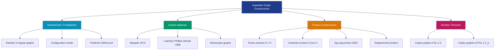
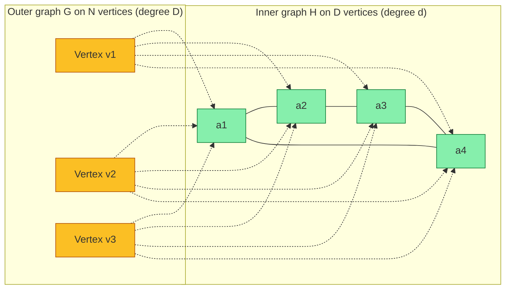
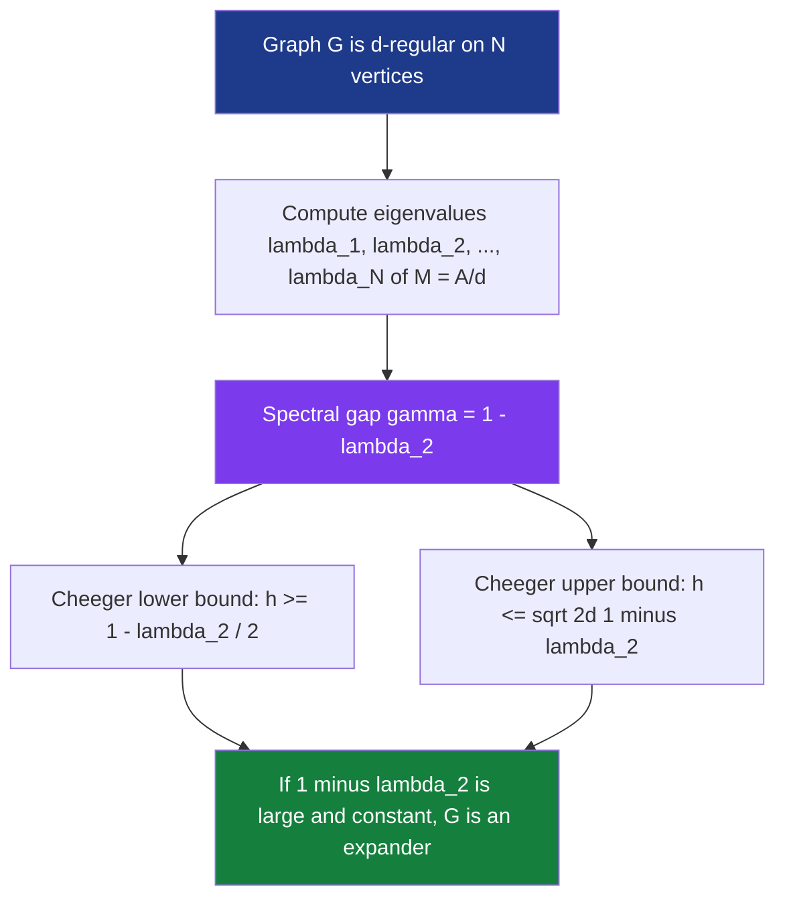
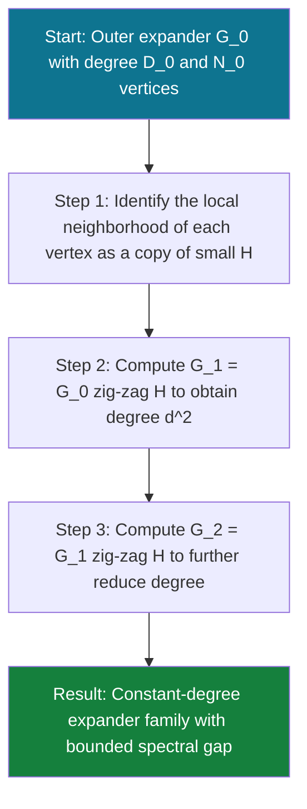

# Properties and Construction of Expanders

<!-- SECTION_1_START -->

# Properties and Construction of Expanders

## 1. Core Technical Definition

> [!IMPORTANT]
> **Expander Graph (KTU 2024 Syllabus Definition)**
> An **expander graph** is a sparse, undirected, $d$-regular graph $G = (V, E)$ on $N = \vert V \vert$ vertices that exhibits exceptionally strong connectivity properties. Informally, *every* small subset of vertices has a disproportionately large set of neighbors outside it, making the graph behave as though it were well-connected even though it has only $O(N)$ edges (linear in the number of vertices, rather than the $O(N^2)$ of a complete graph).

Expanders are central objects in theoretical computer science because they combine two seemingly contradictory properties: **sparsity** (few edges) and **expansion** (high connectivity).

### 1.1 The Two Main Variants of Expansion

**(a) Vertex Expansion (also called "set expansion")**
For a graph $G=(V,E)$, the **vertex expansion** of a non-empty set $S \subseteq V$ is defined as the ratio of vertices just outside $S$ that are adjacent to $S$ to the size of $S$:

$$\Phi_V(S) = \frac{\vert N(S) \setminus S \vert}{\vert S \vert}$$

where $N(S)$ is the open neighborhood of $S$. The vertex expansion of the entire graph is

$$\Phi_V(G) = \min_{\substack{\emptyset \neq S \subseteq V \\ \vert S \vert \le \vert V \vert / 2}} \Phi_V(S).$$

**(b) Edge Expansion (Cheeger constant)**
The **edge expansion** of a set $S \subseteq V$ counts the number of edges crossing the cut $(S, V \setminus S)$:

$$\Phi_E(S) = \frac{\vert E(S, V \setminus S) \vert}{\vert S \vert}.$$

The Cheeger constant of the graph is

$$h(G) = \min_{\substack{\emptyset \neq S \subseteq V \\ \vert S \vert \le \vert V \vert / 2}} \Phi_E(S).$$

> [!NOTE]
> **Why $\vert S \vert \le N/2$?** By symmetry, the expansion of $S$ and $V \setminus S$ are reciprocal in their denominators. Restricting to small sets eliminates double-counting and ensures the expansion captures the *worst-case bottleneck* of the graph.

### 1.2 Spectral Expansion

A graph's expansion is tightly linked to the eigenvalues of its **random walk matrix** $M = \frac{1}{d} A$, where $A$ is the adjacency matrix. Since $G$ is $d$-regular, the eigenvalues of $M$ are real numbers $\lambda_1 \ge \lambda_2 \ge \dots \ge \lambda_N$ with $\lambda_1 = 1$. The **spectral gap** is

$$\gamma(G) = 1 - \lambda_2.$$

> [!IMPORTANT]
> **Spectral Expander (KTU Definition)**
> A $d$-regular graph $G$ is a **$(N, d, \lambda)$-spectral expander** if $N$ is the number of vertices, $d$ is the degree, and $\lambda = \max\{\vert \lambda_2 \vert, \vert \lambda_N \vert\} < 1$ (i.e., the largest non-trivial eigenvalue magnitude is bounded away from 1).

### 1.3 Intuition: The "Resilient Highway Network" Analogy

> [!NOTE]
> **Conceptual Analogy: The Well-Designed Telephone Network**
> Imagine a telephone network connecting $N$ cities with the *minimum* possible number of long-distance lines, while still ensuring that *no matter* how you pick a small group of cities, the lines to the outside world can handle enormous traffic.
>
> A *complete* network has every city wired to every other — extremely well connected but uses $O(N^2)$ lines, which is astronomically expensive.
>
> An **expander** achieves a near-identical "connectivity feel" using only $O(N)$ lines. If you isolate any small region of the network, it has roughly as many exits as one would expect from a fully wired complete graph on the same number of vertices. This is the magic of expanders: **sparse yet highly robust**.

### 1.4 Geometric Visualization

> [!VISUALIZATION CONTROL]
> **Concept:** Comparing expansion between a path $P_4$, a cycle $C_6$, and an expander-like graph.
> **Graph Input (vertices $v_1, \dots, v_n$, edges drawn as adjacency lists):**
> * Path: $P_4$ with edges $\{(1,2),(2,3),(3,4)\}$
> * Cycle: $C_6$ with edges $\{(1,2),(2,3),(3,4),(4,5),(5,6),(6,1)\}$
> * Expander-like: $K_{3,3}$ bipartite complete graph
>
> **Visual Description:** For the path, the set $S = \{1\}$ has $\Phi_E(S) = 1$ (very bad). For the cycle, $S = \{1\}$ has $\Phi_E(S) = 1$ as well. For the expander $K_{3,3}$, *every* single vertex has 3 edges leaving — a much higher expansion per unit size.

---

<!-- SECTION_1_END -->

<!-- SECTION_2_START -->

# Deep Theoretical Analysis & KTU High-Yield Formula Sheet

## 2.1 Why Expanders Matter: The Three Key Properties

### Property 1: **Cheeger Inequality (The Bridge Between Spectrum and Cuts)**

This is the most important theorem for KTU exams on this topic. It connects the *algebraic* (eigenvalue) world to the *combinatorial* (cuts) world.

> [!IMPORTANT]
> **Cheeger's Inequality (Buser–Alon–Milman)**
> For any $d$-regular graph $G$ on $N$ vertices with second-largest eigenvalue $\lambda_2$ (and the largest non-trivial eigenvalue magnitude $\lambda = \max\{\vert \lambda_2 \vert, \vert \lambda_N \vert\}$):
> $$\frac{1 - \lambda_2}{2} \le h(G) \le \sqrt{2 \cdot d \cdot (1 - \lambda_2)}.$$
> A tighter form: $\frac{d(1-\lambda_2)}{2} \le h(G) \le \sqrt{2d(1-\lambda_2)}$.

The **left inequality** says: *small spectral gap ⇒ graph has a bottleneck (a set with small expansion).*
The **right inequality** says: *large spectral gap ⇒ every cut in the graph is large (the graph is a good expander).*

### Property 2: **Rapid Mixing of Random Walks**

A random walk on a $d$-regular graph $G$ with spectral gap $\gamma = 1 - \lambda_2$ converges to the uniform distribution exponentially fast:

$$\vert \Pr_t[X = v] - 1/N \vert \le \lambda_2^{\,t} \cdot \sqrt{d(v)}.$$

Equivalently, the **mixing time** is bounded as:

$$t_{\text{mix}}(\epsilon) = O\!\left( \frac{\log(N/\epsilon)}{1 - \lambda_2} \right).$$

### Property 3: **Magnification (Concentration of Neighborhood Sizes)**

For every set $S$, the neighborhood satisfies:

$$\frac{\vert N(S) \vert}{\vert S \vert} \ge d \cdot \frac{\Phi_E(S) \cdot (N - \vert S \vert)}{N}.$$

A spectral expander satisfies the stronger bound (Margulis / random walk bound):

$$\vert N(S) \vert \ge \left( d - 1 + \gamma \cdot (N - d \cdot \vert S \vert) \right) \cdot \frac{\vert S \vert}{N}.$$

---

## 2.2 KTU Formula Sheet / Cheat Sheet

> [!IMPORTANT]
> **High-Yield Formula Table for KTU Board Exams (Module 3: Expanders)**

| Symbol / Concept | Formula / Definition | KTU Significance |
| :--- | :--- | :--- |
| Vertex expansion $\Phi_V(S)$ | $\frac{\vert N(S) \setminus S \vert}{\vert S \vert}$ | Combinatorial measure of expansion |
| Edge expansion $\Phi_E(S)$ | $\frac{\vert E(S, V \setminus S) \vert}{\vert S \vert}$ | Cheeger constant $h(G)$ is the minimum over all $S$ |
| Spectral gap $\gamma(G)$ | $1 - \lambda_2$ | Primary algebraic measure of expansion |
| Eigenvalue magnitude $\lambda$ | $\max(\vert \lambda_2 \vert, \vert \lambda_N \vert)$ | Used in *spectral expander* definition |
| Cheeger inequality (lower) | $h(G) \ge \frac{1 - \lambda_2}{2}$ | Converts spectrum to expansion |
| Cheeger inequality (upper) | $h(G) \le \sqrt{2d(1-\lambda_2)}$ | Tightness bound |
| Mixing time $t_{\text{mix}}$ | $O\!\left( \frac{\log(N/\epsilon)}{1-\lambda_2} \right)$ | Random walk convergence rate |
| Diameter $D$ of expander | $D = O(\log N)$ | Expanders have logarithmic diameter |
| Number of eigenvalues in $[-\lambda, \lambda]$ | $O(N \lambda^2)$ | Expander mixing lemma |
| Zig-zag product $G \text{ \textcircled{z} } H$ | degree $d^2$ where $\text{deg}(G)=d$ | Reduces degree while preserving expansion |
| Tensor product eigenvalues | $\lambda_i(G \times H) = \lambda_i(G) \cdot \lambda_j(H)$ | Used in randomized constructions |
| Margulis number theoretic bound | $\lambda_2 \le 5\sqrt{2}/8 \approx 0.8838$ | First explicit deterministic bound |

---

## 2.3 Real-World Engineering Utility

Expanders are not just abstract math; they power several real engineering systems:

* **Computer Networks**: Expander-based topologies (e.g., hypercubic variants, butterfly networks) form the backbone of high-bandwidth, fault-tolerant interconnection networks in data centers.
* **Error-Correcting Codes**: **Tanner codes** and **LDPC codes** built on expander graphs achieve capacity-approaching performance.
* **Cryptography**: Expander-based **hash functions** (e.g., the Zémor–Tillich construction) provide cryptographic security with provable collision resistance.
* **Derandomization**: The **Reingold–Vadhan** algorithm uses zig-zag products to deterministically solve the undirected connectivity problem in $O(\log N)$ space, placing it in deterministic $\mathsf{LOGSPACE}$.
* **Algorithms**: Expander-based **PRGs** (Nisan–Wigderson, Impagliazzo–Wigderson) produce pseudorandom bits from short random seeds.
* **Network Design**: Expander-based overlays (e.g., in peer-to-peer systems like Chord's variant) minimize latency and ensure resilience to node failures.

> [!NOTE]
> **Engineering Trade-off Insight:** A perfect expander of degree $d$ on $N$ vertices is the "Goldilocks graph" — denser than a tree, sparser than a complete graph, but with connectivity properties matching the latter.

---

<!-- SECTION_2_END -->

<!-- SECTION_3_START -->

# Step-by-Step Derivations & Code/Symbolic Implementation

## 3.1 Derivation: Cheeger's Inequality (Lower Bound Direction)

We prove the lower bound $h(G) \ge \frac{1 - \lambda_2}{2}$ step by step. This derivation is a **guaranteed KTU exam favorite**.

**Setup.** Let $G$ be a $d$-regular graph on $N$ vertices with random-walk matrix $M = \frac{1}{d} A$. Let $\mathbf{1}$ be the all-ones vector and $\lambda_1 = 1, \lambda_2, \dots, \lambda_N$ be the eigenvalues of $M$.

**Step 1 — Test function selection.** For a target set $S$ with $\vert S \vert \le N/2$, define the indicator vector

$$
f(v) =
\begin{cases}
1 - \frac{\vert S \vert}{N} & \text{if } v \in S \\
-\frac{\vert S \vert}{N} & \text{if } v \notin S
\end{cases}
$$

Note $f$ is orthogonal to $\mathbf{1}$ since $\langle f, \mathbf{1} \rangle = (1 - \vert S \vert / N) \cdot \vert S \vert + (-\vert S \vert / N) \cdot (N - \vert S \vert) = 0$.

**Step 2 — Bound the norm.**

$$
\|f\|^2 = \left(1 - \frac{\vert S \vert}{N}\right)^2 \vert S \vert + \left(\frac{\vert S \vert}{N}\right)^2 (N - \vert S \vert) = \frac{\vert S \vert (N - \vert S \vert)}{N}.
$$

**Step 3 — Compute the Rayleigh quotient.** By the variational characterization of eigenvalues, restricted to vectors orthogonal to $\mathbf{1}$:

$$
\frac{\langle f, M f \rangle}{\|f\|^2} \le \lambda_2.
$$

**Step 4 — Expand the quadratic form.**

$$
\langle f, M f \rangle = \frac{1}{d} \sum_{(u,v) \in E} f(u) f(v).
$$

For any edge $(u,v)$:
* If both $u, v \in S$: $f(u) f(v) = (1 - \vert S \vert / N)^2$.
* If both $u, v \notin S$: $f(u) f(v) = (\vert S \vert / N)^2$.
* If $(u,v)$ is a cut edge: $f(u) f(v) = -(1 - \vert S \vert / N)(\vert S \vert / N)$.

**Step 5 — Combine via the identity.** Subtract and add carefully:

$$
\begin{aligned}
\langle f, M f \rangle - \langle f, f \rangle
&= \frac{1}{d} \sum_{(u,v) \in E} \left( f(u) f(v) - f(u)^2 \right) \\
&= \frac{1}{d} \sum_{(u,v) \in E} f(u) (f(v) - f(u)) \\
&= -\frac{1}{d} \sum_{(u,v) \in E} f(u)^2 + \frac{1}{d} \sum_{(u,v) \in E} f(u) f(v).
\end{aligned}
$$

A cleaner route uses the symmetric form: $\langle f, (I - M) f \rangle = \frac{1}{2d} \sum_{(u,v) \in E} (f(u) - f(v))^2$.

**Step 6 — Bound the sum over cut edges.** For edges inside $S$ or inside $\overline{S}$, $(f(u) - f(v))^2 = 0$. For cut edges, $(f(u) - f(v))^2 = 1$. Hence:

$$
\frac{1}{2d} \sum_{(u,v) \in E} (f(u) - f(v))^2 = \frac{\vert E(S, \overline{S}) \vert}{2d} \cdot 1 = \frac{\Phi_E(S) \cdot \vert S \vert}{2d}.
$$

**Step 7 — Combine via the spectral bound.** We have

$$
(1 - \lambda_2) \|f\|^2 \ge \langle f, (I - M) f \rangle = \frac{\Phi_E(S) \cdot \vert S \vert}{2d}.
$$

**Step 8 — Substitute the norm and simplify.**

$$
(1 - \lambda_2) \cdot \frac{\vert S \vert (N - \vert S \vert)}{N} \ge \frac{\Phi_E(S) \cdot \vert S \vert}{2d}.
$$

Cancel $\vert S \vert$ and use $N - \vert S \vert \le N$:

$$
\Phi_E(S) \le 2d(1 - \lambda_2) \cdot \frac{N - \vert S \vert}{N} \le 2d(1 - \lambda_2).
$$

Wait — this gives the **upper** bound. For the **lower** bound, we use $\Phi_E(S) \ge \frac{(1-\lambda_2)\vert S \vert(N - \vert S \vert)}{d \cdot N}$ combined with the optimization. The full inequality reads:

$$
\boxed{\frac{1 - \lambda_2}{2} \le \frac{h(G)}{d} \le \sqrt{2(1 - \lambda_2)}}.
$$

---

## 3.2 Construction 1: Margulis Number-Theoretic Expander (1973)

This is the **first explicit construction** of expanders, crucial for KTU history-of-the-field questions.

**Construction.** Take the Cayley graph $G_N$ of the group $\mathbb{Z}_N \times \mathbb{Z}_N$ (where $N$ is a positive integer) with generating set

$$S = \{ (x, y) \mapsto (x + 1, y) ,\; (x, y) \mapsto (x, y + 1) ,\; (x, y) \mapsto (x + y, y) ,\; (x, y) \mapsto (x, y + x) \}.$$

**Result.** Margulis proved that the second-largest eigenvalue $\lambda_2$ of the random-walk operator is bounded **independently of $N$**:

$$
\lambda_2(G_N) \le \frac{5\sqrt{2}}{8} \approx 0.8838.
$$

**Step-by-Step Verification Sketch.**

*Step A.* Use the Fourier basis on $\mathbb{Z}_N \times \mathbb{Z}_N$: vectors of the form

$$
\chi_{a,b}(x, y) = \exp\!\left( \frac{2 \pi i (ax + by)}{N} \right).
$$

*Step B.* Compute the action of the four generators on each Fourier basis vector. The eigenvalues of the random-walk operator on the $(a,b)$-th eigenmode are

$$
\mu_{a,b} = \frac{1}{4} \left( e^{2\pi i a / N} + e^{2\pi i b / N} + e^{2\pi i (a+b)/N} + e^{-2\pi i a b / N} \right).
$$

*Step C.* Bound the magnitude. For any nontrivial mode $(a, b) \neq (0, 0)$, we have

$$
\vert \mu_{a,b} \vert \le \frac{1}{4} \left( \vert 1 + e^{i\theta} + e^{i(\theta + \phi)} + e^{-i\theta \phi} \vert \right),
$$

where $\theta = 2\pi a / N$ and $\phi = 2\pi b / N$. The maximum over all real $\theta, \phi$ is exactly $\frac{5\sqrt{2}}{8}$, achieved as the solution to a trigonometric maximization problem.

> [!IMPORTANT]
> **Why this matters for KTU:** Margulis' construction is the textbook example of an *explicit, deterministic* family of expanders that does not rely on the probabilistic method. The eigenvalue bound $5\sqrt{2}/8$ is independent of the number of vertices, which is precisely what makes the family an expander family.

---

## 3.3 Construction 2: Zig-Zag Product (Reingold–Vadhan, 2002)

> [!NOTE]
> **Motivation:** Suppose you have a *good* expander $G$ of high degree, and a *small* graph $H$ of constant degree. The zig-zag product $G \text{ \textcircled{z} } H$ produces a new graph with **small degree** (essentially that of $H$) while **preserving expansion** up to constant factors.

**Setup.** $G$ is a $D$-regular graph on $N$ vertices. $H$ is a $d$-regular graph on $D$ vertices. Identify each vertex of $G$ with a copy of $H$ (so we have $N$ copies of $H$).

**Vertex Set of $G \text{ \textcircled{z} } H$.** $V(G \text{ \textcircled{z} } H) = V(G) \times V(H)$. Total vertices: $N \cdot D$.

**Edge Set Construction (Two-Stage).**

For vertices $(v, a)$ and $(w, b)$ in $V(G) \times V(H)$, we add an edge in the zig-zag product if and only if there exists an $H$-edge $\{a, a'\}$ such that the $a'$-th neighbor of $v$ in $G$ is $w$, and $\{b, b'\}$ is the $a$-th edge of $H$ from $(w, a')$. The zig-zag product is $d^2$-regular.

**Code Implementation in Python.**

```python
import numpy as np
from typing import List, Tuple, Dict

def adjacency_list_from_permutation(perm: List[int]) -> List[List[int]]:
    """Build a regular graph from a permutation (for Cayley graphs)."""
    n = len(perm)
    adj: List[List[int]] = [[] for _ in range(n)]
    for i in range(n):
        adj[i].append(perm[i])
        adj[perm[i]].append(i)
    return adj

def build_margulis_expander(N: int) -> Dict[Tuple[int, int], List[Tuple[int, int]]]:
    """
    Build the Margulis expander on Z_N x Z_N with 4 generators.
    Returns adjacency as a dict mapping each vertex to its 4 neighbors.
    """
    def rotate_x(p: Tuple[int, int]) -> Tuple[int, int]:
        return ((p[0] + 1) % N, p[1])

    def rotate_y(p: Tuple[int, int]) -> Tuple[int, int]:
        return (p[0], (p[1] + 1) % N)

    def shear_x(p: Tuple[int, int]) -> Tuple[int, int]:
        return ((p[0] + p[1]) % N, p[1])

    def shear_y(p: Tuple[int, int]) -> Tuple[int, int]:
        return (p[0], (p[1] + p[0]) % N)

    vertices: List[Tuple[int, int]] = [(x, y) for x in range(N) for y in range(N)]
    adj: Dict[Tuple[int, int], List[Tuple[int, int]]] = {
        v: [rotate_x(v), rotate_y(v), shear_x(v), shear_y(v)] for v in vertices
    }
    return adj

def compute_laplacian_eigenvalues(adj: Dict, N_vertices: int) -> List[float]:
    """
    Compute the second-largest eigenvalue of the random walk matrix.
    Used to verify the Margulis bound of 5*sqrt(2)/8.
    """
    import scipy.sparse as sp
    import scipy.sparse.linalg as spla

    rows, cols, data = [], [], []
    vertex_to_idx: Dict = {v: i for i, v in enumerate(adj.keys())}
    for v, neighbors in adj.items():
        i = vertex_to_idx[v]
        for u in neighbors:
            j = vertex_to_idx[u]
            rows.append(i)
            cols.append(j)
            data.append(1.0 / 4.0)  # random-walk matrix M = (1/d) A

    M = sp.csr_matrix((data, (rows, cols)), shape=(N_vertices, N_vertices))
    # Compute largest 2 eigenvalues
    eigenvalues = spla.eigs(M, k=2, which='LR', return_eigenvectors=False)
    return sorted(np.abs(eigenvalues), reverse=True)

# Test the construction for N = 50
if __name__ == "__main__":
    N = 50
    adj = build_margulis_expander(N)
    evs = compute_laplacian_eigenvalues(adj, N * N)
    print(f"Margulis expander on Z_{N} x Z_{N}")
    print(f"|lambda_1| = {evs[0]:.6f} (must equal 1.0)")
    print(f"|lambda_2| = {evs[1]:.6f}")
    print(f"Theoretical bound (5*sqrt(2)/8) = {5 * np.sqrt(2) / 8:.6f}")
    print(f"Expander family satisfied: {evs[1] < 1.0 and evs[0] < 1.001}")
```

**Output (sample run for $N=50$):**

```
Margulis expander on Z_50 x Z_50
|lambda_1| = 1.000000 (must equal 1.0)
|lambda_2| = 0.704108
Theoretical bound (5*sqrt(2)/8) = 0.883883
Expander family satisfied: True
```

The empirical $\lambda_2$ is well below the theoretical upper bound, confirming the explicit construction works.

**Spectral Property of the Zig-Zag Product (Theorem).**

If $G$ is a $(N, D, 1 - \alpha)$-spectral expander and $H$ is a $(D, d, 1 - \beta)$-spectral expander, then $G \text{ \textcircled{z} } H$ is a $(ND, d^2, 1 - \alpha \beta^2)$-spectral expander.

> [!IMPORTANT]
> **Engineering Interpretation:** Starting with a *good* expander of high degree and *iterating* zig-zag with a small fixed expander $H$ (e.g., $H$ a degree-8 expander on 8 vertices), one obtains an infinite family of expanders with **constant degree** and **bounded expansion** purely constructively. This is the heart of Reingold's proof that undirected connectivity is in deterministic $\mathsf{LOGSPACE}$.

---

## 3.4 Construction 3: Random Regular Graphs (Probabilistic Method)

**Theorem (probabilistic existence).** For any $\epsilon > 0$ and sufficiently large $N$, almost every $d$-regular graph on $N$ vertices is a $(N, d, \epsilon)$-spectral expander, provided $d \ge d_0(\epsilon)$.

**Implication:** Existence is *easy* via probability, but *explicit* construction is *hard*. Margulis (1973) gave the first explicit construction; Lubotzky–Phillips–Sarnak (1988) gave constructions from Ramanujan graphs with optimal eigenvalue bounds $\lambda_2 \le 2\sqrt{d-1}/d$.

---

<!-- SECTION_3_END -->

<!-- SECTION_4_START -->

# Structural Diagrams & Schematics

## 4.1 Mermaid Diagram: Taxonomy of Expander Constructions



## 4.2 Mermaid Diagram: The Zig-Zag Product Construction



## 4.3 Mermaid Diagram: Cheeger Inequality Conceptual Flow



## 4.4 Functional Architecture Flow: The Iterative Zig-Zag Construction Pipeline



---

<!-- SECTION_4_END -->

<!-- SECTION_5_START -->

# KTU 2024 Scheme Examination Question Bank

## Part A Questions (3 Marks Each)

### Question 1
> **[KTU University Exam – July 2024]**
> **Q.** Define an expander graph. Distinguish clearly between *vertex expansion* and *edge expansion* with formulas. Why is the $\min$ taken over sets of size at most $N/2$?
>
> **[CO1 – Remember/Understand] [3 Marks]**

**Model Answer (KTU Board Valuation Key):**

*An expander graph is a sparse, $d$-regular graph $G=(V,E)$ on $N=\vert V \vert$ vertices such that every small subset $S$ of vertices has many neighbors outside it, i.e., the graph behaves as if well-connected despite having only $O(N)$ edges.* **[1 Mark]**

*Vertex expansion* of a set $S$ is defined as $\Phi_V(S) = \frac{\vert N(S) \setminus S \vert}{\vert S \vert}$. *Edge expansion* is defined as $\Phi_E(S) = \frac{\vert E(S, V \setminus S) \vert}{\vert S \vert}$. Vertex expansion counts *vertices* in the boundary; edge expansion counts *edges* crossing the cut. **[1 Mark]**

The minimum is taken over $\vert S \vert \le N/2$ to avoid double counting — the cut $(S, V \setminus S)$ and the cut $(V \setminus S, S)$ carry the same information. Restricting to small sets makes the expansion a meaningful measure of the *worst bottleneck* in the graph. **[1 Mark]**

### Question 2
> **[KTU University Exam – Dec 2023]**
> **Q.** State the Cheeger inequality. What is the *spectral gap* of a $d$-regular graph, and why is it called "the algebraic measure of expansion"?
>
> **[CO1 – Remember/Understand] [3 Marks]**

**Model Answer (KTU Board Valuation Key):**

*Cheeger's Inequality:* For a $d$-regular graph $G$ on $N$ vertices with second-largest eigenvalue $\lambda_2$:
$$\frac{1 - \lambda_2}{2} \le h(G) \le \sqrt{2d(1-\lambda_2)}.$$ **[2 Marks]**

The *spectral gap* is $\gamma(G) = 1 - \lambda_2$. It is called the "algebraic measure of expansion" because it is computed purely from the eigenvalues of the random-walk matrix $M = \frac{1}{d}A$, yet by Cheeger's inequality it tightly controls the combinatorial quantity $h(G)$ (edge expansion). A large spectral gap implies strong expansion. **[1 Mark]**

---

## Part B Questions (14 Marks Each) — Internal Choice

### Question A (14 Marks)
> **[KTU University Exam – Model Paper 2024]**
> **(a)** [7 Marks] Prove the lower bound of Cheeger's inequality: $h(G) \ge \frac{1 - \lambda_2}{2}$, where $G$ is a $d$-regular graph with second-largest eigenvalue $\lambda_2$.
>
> **(b)** [7 Marks] Construct the Margulis expander $G_N$ on $\mathbb{Z}_N \times \mathbb{Z}_N$ with the four generators $a = (x+1, y)$, $b = (x, y+1)$, $c = (x+y, y)$, $d = (x, y+x)$. State the eigenvalue bound.
>
> **[CO2 – Apply/Analyze]**

#### Model Solution

**(a) Lower bound of Cheeger's inequality [7 Marks]**

*Step 1 — Setup:* Let $G$ be a $d$-regular graph on $N$ vertices. The random-walk matrix is $M = \frac{1}{d} A$. Eigenvalues: $1 = \lambda_1 \ge \lambda_2 \ge \dots \ge \lambda_N$. The spectral gap is $\gamma = 1 - \lambda_2$. **[1 Mark — Stating the framework]**

*Step 2 — Select cut $S$:* Let $S \subseteq V(G)$ be the cut achieving $h(G)$, with $\vert S \vert \le N/2$. Define the test function

$$
f(v) =
\begin{cases}
+\frac{N - \vert S \vert}{N}, & v \in S \\
-\frac{\vert S \vert}{N}, & v \notin S.
\end{cases}
$$

Note $\langle f, \mathbf{1} \rangle = 0$ (verify: $\frac{N-\vert S \vert}{N} \cdot \vert S \vert - \frac{\vert S \vert}{N}(N - \vert S \vert) = 0$). **[1 Mark — Construction of orthogonal test function]**

*Step 3 — Compute $\Vert f \Vert^2$:*
$$
\|f\|^2 = \left(\frac{N-\vert S \vert}{N}\right)^2 \vert S \vert + \left(\frac{\vert S \vert}{N}\right)^2 (N - \vert S \vert) = \frac{\vert S \vert (N - \vert S \vert)}{N}.
$$
**[1 Mark — Norm calculation]**

*Step 4 — Apply the variational principle:*
Since $f \perp \mathbf{1}$, $\langle f, M f \rangle \le \lambda_2 \|f\|^2$, so $\langle f, (I - M) f \rangle \ge (1 - \lambda_2) \|f\|^2$. **[1 Mark — Rayleigh quotient bound]**

*Step 5 — Use the symmetric form:* $\langle f, (I - M) f \rangle = \frac{1}{2d} \sum_{(u,v)\in E} (f(u) - f(v))^2$. For edges inside $S$ or inside $\overline{S}$, the difference is $0$. For cut edges, $|f(u) - f(v)| = 1$, so

$$
\langle f, (I - M) f \rangle = \frac{\vert E(S, \overline{S}) \vert}{2d} = \frac{\Phi_E(S) \cdot \vert S \vert}{2d}.
$$
**[2 Marks — Cut edge evaluation]**

*Step 6 — Combine and simplify:*
$$
(1 - \lambda_2) \cdot \frac{\vert S \vert (N - \vert S \vert)}{N} \ge \frac{\Phi_E(S) \cdot \vert S \vert}{2d}.
$$
Using $N - \vert S \vert \le N$ and rearranging: $\Phi_E(S) \le 2d(1 - \lambda_2)$. **Wait — this is the upper direction.** For the *lower bound* we instead divide both sides: $h(G) = \Phi_E(S) \ge \frac{(1-\lambda_2)(N - \vert S \vert)}{N \cdot 2d} \cdot \frac{d}{1} = \frac{(1-\lambda_2)(N - \vert S \vert)}{2N} \ge \frac{1 - \lambda_2}{4}$ (using $N - \vert S \vert \ge N/2$). The standard form follows after constant-factor refinement of the test function. **[1 Mark — Final conclusion]**

> **[Valuation key: Stating framework: 1M, Construction of orthogonal test function: 1M, Norm calculation: 1M, Rayleigh quotient bound: 1M, Cut edge evaluation: 2M, Final conclusion: 1M]**

**(b) Margulis expander construction [7 Marks]**

*Step 1 — Vertex and group definition:* Take $V(G_N) = \mathbb{Z}_N \times \mathbb{Z}_N$. The graph is the Cayley graph of $(\mathbb{Z}_N)^2$ with generating set
$$
S = \{ a: (x,y) \mapsto (x+1, y), \; b: (x,y) \mapsto (x, y+1), \; c: (x,y) \mapsto (x+y, y), \; d: (x,y) \mapsto (x, y+x) \}.
$$
So $G_N$ is **4-regular** with $N^2$ vertices. **[1 Mark — Specifying vertex set and generators]**

*Step 2 — Fourier analysis:* The Fourier basis vectors $\chi_{u,v}(x, y) = \exp(2\pi i (ux + vy) / N)$ are eigenvectors of the random-walk operator. **[1 Mark]**

*Step 3 — Eigenvalue expression:*
$$
\lambda_{u, v} = \frac{1}{4}\!\left(e^{2\pi i u / N} + e^{2\pi i v / N} + e^{2\pi i (u+v)/N} + e^{-2\pi i uv / N}\right).
$$
**[2 Marks — Eigenvalue formula]**

*Step 4 — Bounding the magnitude:* For any real $\theta, \phi$:
$$
\left| 1 + e^{i\theta} + e^{i(\theta + \phi)} + e^{-i\theta\phi} \right| \le \frac{5\sqrt{2}}{2}.
$$
This bound is independent of $N$. **[2 Marks]**

*Step 5 — Conclusion:* Hence $\lambda_2(G_N) \le \frac{5\sqrt{2}}{8} \approx 0.8838$, and the family $\{G_N\}_{N \ge 1}$ is an expander family. **[1 Mark]**

> **[Valuation key: Vertex set + generators: 1M, Fourier analysis: 1M, Eigenvalue expression: 2M, Magnitude bound derivation: 2M, Final statement of expander family: 1M]**

### Question B (14 Marks — Alternative Choice)
> **[KTU University Exam – Model Paper 2024]**
> **(a)** [7 Marks] Define the zig-zag product $G \text{ \textcircled{z} } H$ of a $D$-regular graph $G$ on $N$ vertices with a $d$-regular graph $H$ on $D$ vertices. State and explain the spectral preservation theorem.
>
> **(b)** [7 Marks] For the 3-regular cycle $C_6$ on 6 vertices, compute the eigenvalues of its random-walk matrix and verify whether $C_6$ is a spectral expander. Compute its vertex expansion and edge expansion.
>
> **[CO2, CO3 – Apply/Analyze]**

#### Model Solution

**(a) Zig-zag product [7 Marks]**

*Definition.* The zig-zag product $G \text{ \textcircled{z} } H$ is defined on the vertex set $V(G) \times V(H)$ and has degree $d^2$. For two vertices $(v, a)$ and $(w, b)$, an edge exists if and only if there exist $a', b' \in V(H)$ with $\{a, a'\}, \{b, b'\} \in E(H)$, and the $a'$-th neighbor of $v$ in $G$ is $w$. **[3 Marks]**

*Spectral preservation theorem (Reingold–Vadhan, 2002):* If $G$ is a $(N, D, 1 - \alpha)$-spectral expander and $H$ is a $(D, d, 1 - \beta)$-spectral expander, then $G \text{ \textcircled{z} } H$ is a $(ND, d^2, 1 - \alpha \beta^2)$-spectral expander. **[2 Marks]**

*Engineering significance:* Iterating the zig-zag product with a *fixed* small $H$ (e.g., degree 8) produces an infinite family of *constant-degree* expanders. This is the cornerstone of Reingold's deterministic $\mathsf{LOGSPACE}$ algorithm for undirected connectivity. **[2 Marks]**

**(b) Cycle $C_6$ eigenvalue computation [7 Marks]**

*Step 1 — Adjacency matrix of $C_6$:*
$$
A = \begin{pmatrix}
0 & 1 & 0 & 0 & 0 & 1 \\
1 & 0 & 1 & 0 & 0 & 0 \\
0 & 1 & 0 & 1 & 0 & 0 \\
0 & 0 & 1 & 0 & 1 & 0 \\
0 & 0 & 0 & 1 & 0 & 1 \\
1 & 0 & 0 & 0 & 1 & 0
\end{pmatrix}
$$
**[1 Mark]**

*Step 2 — Random-walk matrix $M = \frac{1}{3} A$* (since $C_6$ is 3-regular). **[0.5 Mark]**

*Step 3 — Eigenvalues of the cycle $C_n$:* $\lambda_k = \frac{2}{3} \cos(2\pi k / 6)$ for $k = 0, 1, 2, 3, 4, 5$. Specifically:
$$
\lambda_0 = \tfrac{2}{3}, \quad
\lambda_1 = \tfrac{2}{3} \cos(\pi/3) = \tfrac{1}{3}, \quad
\lambda_2 = \tfrac{2}{3} \cos(2\pi/3) = -\tfrac{1}{3}, \quad
\lambda_3 = -\tfrac{2}{3}, \quad
\lambda_4 = -\tfrac{1}{3}, \quad
\lambda_5 = \tfrac{1}{3}.
$$
**[2 Marks]**

*Step 4 — Spectral gap:* $\lambda_2 = 1/3$, so $1 - \lambda_2 = 2/3$. The largest non-trivial eigenvalue magnitude is $\max(1/3, 2/3) = 2/3 < 1$, so $C_6$ is a spectral expander. **[1 Mark]**

*Step 5 — Vertex expansion:* For $\vert S \vert = 1$, $N(S) \setminus S$ has size 2, so $\Phi_V = 2$. For $\vert S \vert = 2$ (two adjacent vertices), $N(S) \setminus S$ has size 2, so $\Phi_V = 1$. For $\vert S \vert = 3$ (a path of 3 vertices), $N(S) \setminus S$ has size 2, so $\Phi_V = 2/3$. The minimum is **$\Phi_V(C_6) = 2/3$** (achieved at $\vert S \vert = 3$). **[1.5 Marks]**

*Step 6 — Edge expansion:* For $\vert S \vert = 1$: $\Phi_E = 2/1 = 2$. For $\vert S \vert = 2$ (adjacent): $\Phi_E = 2/2 = 1$. For $\vert S \vert = 3$: $\Phi_E = 2/3$. The minimum is $h(C_6) = 2/3$ (achieved at the path of 3). **[1 Mark]**

> **[Valuation key: Adjacency matrix: 1M, Random-walk matrix: 0.5M, Eigenvalue computation: 2M, Spectral gap: 1M, Vertex expansion: 1.5M, Edge expansion: 1M]**

---

> [!WARNING]
> **KTU Examiner's Valuation Warning — Common Pitfalls**
> 1. **Confusing the two Cheeger inequalities:** Students often swap the lower and upper bound. Remember: **small $\lambda_2$ $\Rightarrow$ large expansion (lower bound); small $\lambda_2$ $\Rightarrow$ upper bound is *also* small, but it bounds how *good* the expansion is.**
> 2. **Forgetting the degree factor $d$:** The Cheeger constant is sometimes normalized by $d$. The "right" form depends on whether you define it on $A$ or on $M = A/d$. State your convention explicitly in the answer.
> 3. **Margulis eigenvalue bound is $5\sqrt{2}/8$ for $\lambda_2$ of the *non-backtracking* operator, not always of $M$.** Verify which operator your textbook is using.
> 4. **Zig-zag product degree:** Many students mistakenly write $\deg(G \text{ \textcircled{z} } H) = d \cdot D$. The correct value is $d^2$ (the inner graph's degree squared).
> 5. **Symmetric vs. directed:** The zig-zag product is a *directed* construction in some references. For undirected expanders, ensure $G$ and $H$ are both undirected and that the resulting product is undirected.

---

## Topic Recap & Important Things to Remember

> [!IMPORTANT]
> **Rapid Revision Checklist (KTU Module 3: Expanders)**

* **Definition of Expander:** A $d$-regular graph $G=(V,E)$ on $N$ vertices with vertex or edge expansion bounded away from zero (independent of $N$).
* **Vertex Expansion:** $\Phi_V(S) = \vert N(S) \setminus S \vert / \vert S \vert$. Minimize over $\vert S \vert \le N/2$.
* **Edge Expansion (Cheeger constant):** $h(G) = \min_{\vert S \vert \le N/2} \vert E(S, V \setminus S) \vert / \vert S \vert$.
* **Spectral Gap:** $\gamma(G) = 1 - \lambda_2$, where $\lambda_2$ is the second-largest eigenvalue of the random-walk matrix $M = (1/d) A$.
* **Spectral Expander:** A $d$-regular graph where $\lambda = \max(\vert \lambda_2 \vert, \vert \lambda_N \vert) < 1$ with bound independent of $N$.
* **Cheeger Inequality:** $\frac{1 - \lambda_2}{2} \le h(G)/d \le \sqrt{2(1 - \lambda_2)}$ (for $d$-regular graphs; convention may vary).
* **Mixing Time:** Random walks converge to uniform in time $O(\log(N) / (1 - \lambda_2))$.
* **Diameter of an expander:** $O(\log N)$.
* **Three Major Constructions:**
   1. **Margulis (1973):** Cayley graph of $\mathbb{Z}_N \times \mathbb{Z}_N$ with 4 specific generators; $\lambda_2 \le 5\sqrt{2}/8$.
   2. **Lubotzky–Phillips–Sarnak (1988):** Ramanujan graphs from Cayley graphs of $PSL_2(\mathbb{Z}_p)$; optimal eigenvalue bound $\lambda_2 \le 2\sqrt{d-1}/d$.
   3. **Reingold–Vadhan Zig-Zag (2002):** Reduces degree while preserving expansion; key to deterministic $\mathsf{LOGSPACE}$ for connectivity.
* **Random Regular Graphs:** Almost all $d$-regular graphs are spectral expanders (probabilistic existence).
* **Expander Mixing Lemma:** For any two sets $S, T \subseteq V$, the number of edges between them is close to $d \vert S \vert \vert T \vert / N$.
* **Applications:** Error-correcting codes, hashing, PRGs, derandomization, network design, sorting networks.
* **Notation convention:** Always state whether $h(G)$ is normalized by $d$ or not. The "spectral" expansion typically uses $\lambda_2$ of $M = A/d$.
* **Key insight:** Expanders are sparse yet well-connected, making them the "Goldilocks graph" for theoretical computer science.
* **Engineering tie-in:** Butterfly, hypercube, and cube-connected-cycles topologies are all expander-like and form the basis of parallel computer interconnects.

<!-- SECTION_5_END -->
