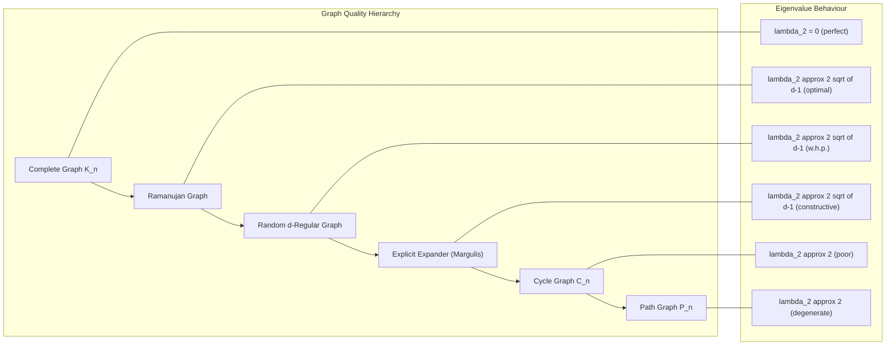
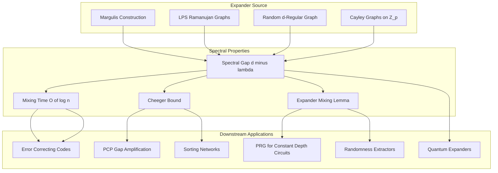
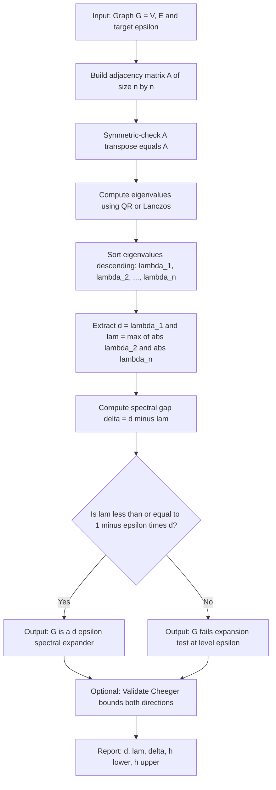
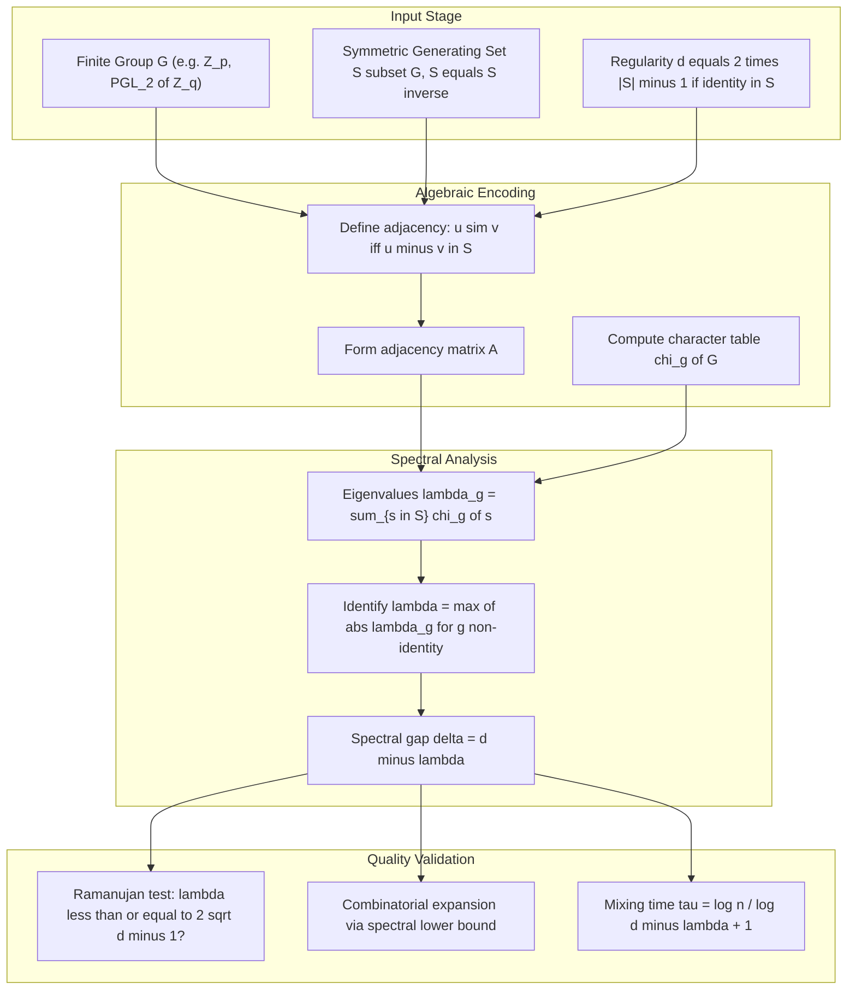

# spectral-expanders

<!-- SECTION_1_START -->
# Spectral Expanders — The Eigenvalue Lens on Graph Expansion

## 1.1 Formal Definition (KTU 2024 Syllabus Aligned)

> [!IMPORTANT]
> **Spectral Expander (Canonical Definition).**
> Let $G = (V, E)$ be a $d$-regular undirected graph on $n = \vert V \vert$ vertices, with $d \geq 3$. Let $A$ be its (real, symmetric) adjacency matrix and let
> $$\lambda_1 \;\geq\; \lambda_2 \;\geq\; \lambda_3 \;\geq\; \cdots \;\geq\; \lambda_n$$
> be the eigenvalues of $A$. The graph $G$ is called a **$(d, \epsilon)$-spectral expander** (or simply an *$\epsilon$-expander*) if it is $d$-regular and
> $$\lambda(G) \;:=\; \max\{\, \lvert \lambda_2 \rvert,\, \lvert \lambda_n \rvert \,\} \;\leq\; (1 - \epsilon)\, d$$
> for some constant $\epsilon > 0$ (independent of $n$).

The quantity $d - \lambda(G)$ is called the **spectral gap**, and it quantifies *how strongly the graph mixes* walks, colors, and information.

> [!NOTE]
> **Why regular graphs?** Regularity is not strictly necessary, but the theory is cleanest in this setting. Every regular graph is a special case of a *Jacobian-rotor walk* model, and its largest eigenvalue $\lambda_1$ equals $d$ (by Perron–Frobenius), fixing the top of the spectrum.

## 1.2 Conceptual Analogy — The "Telephone Network" Intuition

Imagine a country with $n$ cities, each connected to exactly $d$ other cities by telephone lines. Now suppose a rumor is whispered in one city and is propagated for one step along a random line. The question is: **how fast does the rumor spread so that *every* city has nearly the same chance of hearing it?**

- If the network is a **cycle** $C_n$, the rumor crawls at speed $O(\sqrt{n})$ — terrible, only neighbors know, and "mixing" takes $\Theta(n^2)$ steps.
- If the network is the **complete graph** $K_n$, the rumor explodes outward instantly — perfect mixing in 1 step.

A **spectral expander** is the *engineered sweet spot* in between: it has a *small* second eigenvalue, which is mathematically equivalent to saying the network mixes in $O(\log n)$ steps, even though it is *sparse* (only $d n / 2$ edges, not $n^2/2$).

> [!TIP]
> **Geometric Intuition.** The eigenvectors of $A$ are orthogonal "natural modes" of the graph. The trivial mode $\mathbf{1}$ corresponds to the uniform distribution. The closer $\lambda_2$ is to $d$, the more "sticky" the graph is to non-uniform distributions; the smaller $\lambda_2$ is, the more "liquid" the graph becomes.

## 1.3 Visualization Control

> [!VISUALIZATION CONTROL]
> **Concept:** Spectrum of a $d$-regular graph laid out as a horizontal number line of eigenvalues.
> **GeoGebra / Desmos Input Equations:**
> * Plot points at $\lambda_i$ for $i = 1, 2, \ldots, n$ on a number line.
> * Highlight band $[-d, -d(1-\epsilon)] \cup [d(1-\epsilon), d]$ in green (allowed region) and the "forbidden middle band" $(-d(1-\epsilon), d(1-\epsilon))$ in red.
> * Show the cycle $C_n$ with $d=2, \lambda_2 \approx 2$ (worst); a random $d$-regular graph with $d=4$ and $\lambda_2 \approx 1.5$ (good expander); $K_n$ with $\lambda_2 = 0$ (perfect).
> **Visual Description:** A "compressed rainbow" where a good expander pushes the rainbow inward to the spectrum's edges, leaving a small $\epsilon$-wide band of mass near $\pm d$.

<!-- SECTION_1_END -->

<!-- SECTION_2_START -->
# Deep Theoretical Analysis & KTU High-Yield Formula Sheet

## 2.1 The Two Faces of Expansion

There are **two distinct (but tightly related) notions** of expansion in the literature, and KTU examiners love to test the relationship between them.

### 2.1.1 Combinatorial (Edge) Expansion — Cheeger Constant
For a $d$-regular graph $G$, the **edge expansion** (or **Cheeger constant**) is
$$h(G) \;=\; \min_{\substack{S \subset V \\ 0 < \vert S \vert \leq n/2}} \frac{\lvert E(S,\, V \setminus S) \rvert}{d\, \vert S \vert}$$
This is a *worst-case ratio*: pick the *worst* small set, and measure how many edges escape it. A graph with $h(G) \geq \epsilon$ is called a **$(d, \epsilon)$-combinatorial expander**.

### 2.1.2 Spectral Expansion — Algebraic Formulation
$$h_{\text{spec}}(G) \;=\; \frac{d - \lambda_2}{2}$$
This is the *spectral expansion number*. Spectral expansion is much easier to *compute* and *manipulate* algebraically (eigenvalues of subgraphs compose nicely).

## 2.2 The Cheeger–Alon–Milman Bridge

The **Discrete Cheeger Inequality** is the fundamental theorem relating the two notions. It has two directions:

> [!NOTE]
> **Theorem 2.2 (Discrete Cheeger Inequality).** *For any $d$-regular graph $G$,*
> $$\frac{d - \lambda_2}{2} \;\leq\; h(G) \;\leq\; \sqrt{2\,d\,(d - \lambda_2)}$$

- **Lower bound** (easy direction): $d - \lambda_2 \geq 2\,h(G)$. *Combinatorial expansion implies spectral gap.*
- **Upper bound** (hard direction, due to Alon–Milman 1985 and Dodziuk): $h(G)^2 \leq 2d(d - \lambda_2)$. *Spectral gap implies combinatorial expansion up to a $\sqrt{d}$ factor.*

> [!WARNING]
> **Subtlety:** The lower bound is *tight up to constants* (it cannot be improved in general). The upper bound has a $\sqrt{d}$ factor that is *also* necessary in general — there exist graphs (Alon's "coset" graphs) where the spectral and combinatorial measures differ by exactly this factor.

## 2.3 The Expander Mixing Lemma

> [!IMPORTANT]
> **Lemma 2.3 (Expander Mixing Lemma — Bilu & Linial 2004).** *Let $G$ be a $d$-regular graph on $n$ vertices and let $\lambda = \max\{\lvert \lambda_2 \rvert, \lvert \lambda_n \rvert\}$. For every pair of subsets $S, T \subseteq V$,*
> $$\left\lvert\, e(S,T) \;-\; \frac{d\, \vert S \vert\, \vert T \vert}{n} \,\right\rvert \;\leq\; \lambda\, \sqrt{\lvert S \rvert\, \lvert T \vert\,\left(1 - \frac{\lvert S \rvert}{n}\right)\left(1 - \frac{\lvert T \rvert}{n}\right)}$$
> *where $e(S,T)$ is the number of edges between $S$ and $T$.*

This is the **"pseudorandomness manifesto"** in combinatorial form: an expander graph's edge distribution is *indistinguishable* from a uniform random $d$-regular graph's edge distribution, up to a $\lambda$ additive correction.

## 2.4 Why Random Regular Graphs Are (Excellent) Expanders

> [!TIP]
> **Theorem 2.4 (Broder–Frieze–Upfal 1993, Friedman 2003).** *A random $d$-regular graph $G \sim \mathcal{G}_{n,d}$ on $n$ vertices satisfies, with high probability,*
> $$\lambda_2(G) \;\leq\; 2\sqrt{d-1} + \epsilon$$
> *for any constant $\epsilon > 0$ and all sufficiently large $n$.*

The $\sqrt{d-1}$ bound is the *Alon Boppana bound* — no graph on $n$ vertices can have all non-trivial eigenvalues below $2\sqrt{d-1}$ in the limit, so random regular graphs are essentially *optimal* expanders.

## 2.5 KTU Formula Sheet

| Symbol / Term | Definition / Formula | Notes |
|---|---|---|
| $A$ | $n \times n$ adjacency matrix, $A_{uv} = 1$ iff $\{u,v\} \in E$ | Real, symmetric |
| $\lambda_1 \geq \lambda_2 \geq \cdots \geq \lambda_n$ | Eigenvalues of $A$ | $\lambda_1 = d$ for $d$-regular |
| $\lambda(G)$ | $\max\{\lvert \lambda_2 \rvert, \lvert \lambda_n \rvert\}$ | "Second eigenvalue" |
| $d - \lambda(G)$ | **Spectral gap** | Quality measure of expander |
| $\epsilon$ | Expansion parameter: $\lambda(G) \leq (1-\epsilon)d$ | $\epsilon \in (0,1]$ |
| $h(G)$ | Edge expansion (Cheeger constant) | Worst-case ratio |
| $h_{\text{spec}}(G)$ | $(d - \lambda_2)/2$ | Spectral expansion number |
| $e(S,T)$ | $\#\{(u,v) \in E : u \in S, v \in T\}$ | Cross-edges |
| $d_v$ | Degree of vertex $v$ | $= d$ in regular graphs |
| $N(S)$ | Neighbourhood $\bigcup_{v \in S} N(v) \setminus S$ | Vertex expansion |
| Buser's inequality | $h(G) \leq C \cdot \sqrt{d\,(d - \lambda_2)}$ | Lower bound, complements Cheeger |
| Alon–Boppana | $\liminf \lambda_2 \geq 2\sqrt{d-1}$ | Lower bound on any family |
| $\tau(G)$ | $\frac{n}{d} \cdot \frac{\log n}{2 \log(d/\lambda_2)}$ | Vertex-cover approximation |

## 2.6 Real-World Utility in Computer Science

> [!TIP]
> **Where spectral expanders are used in production / research systems:**
> 1. **Error-Correcting Codes:** Sipser–Trevisan / Tanner codes derived from expanders yield linear-time encodable codes with constant relative distance and rate.
> 2. **Sorters in Valiant's AKS Network:** $O(\log n)$ depth sorting networks built on expanders.
> 3. **Pseudorandom Generators (PRGs):** Trevisan's PRG for constant-depth circuits, instantiated via spectral expander hitting sets.
> 4. **Derandomization:** Replacing randomness in $RL$, $BPL$ with small deterministic seeds.
> 5. **Randomness Extractors:** Zuckman's extractor, Ta–Shma–Zuckman, and modern cryptographic extractor constructions.
> 6. **PCP and Inapproximability:** Dinur's proof of the PCP theorem uses a *gap amplification* step that explicitly constructs a spectral expander (a "powering" of the constraint graph).
> 7. **Metric Embedding:** Negatives-type metrics and Lipschitz extension via spectral methods on Cayley expanders.
> 8. **Quantum Computing:** Quantum expanders (Ramanujan graphs) yield optimal quantum expanders via the *quantum eigenvalue* $\lambda(\mathcal{H})$.

<!-- SECTION_2_END -->

<!-- SECTION_3_START -->
# Step-by-Step Derivations & Symbolic Implementation

## 3.1 Derivation A: The Easy Direction of Cheeger's Inequality

**Claim.** For any $d$-regular graph $G$, $\dfrac{d - \lambda_2}{2} \leq h(G)$.

**Step 1 — Setup via Rayleigh quotient.** Let $f : V \to \mathbb{R}$ be a test function and $A$ the adjacency matrix. The quadratic form
$$\langle f, A f \rangle \;=\; \sum_{u \sim v} f(u) f(v)$$
counts each edge contribution twice. The second eigenvalue is the variational minimum
$$\lambda_2 \;=\; \min_{f \perp \mathbf{1}} \frac{\langle f, A f \rangle}{\langle f, f \rangle}.$$

**Step 2 — Choose a hard test function.** Let $S \subset V$ with $\lvert S \vert \leq n/2$ and define
$$f(v) \;=\; \begin{cases} \phantom{-}n - \lvert S \rvert & v \in S \\ -\lvert S \rvert & v \notin S \end{cases}$$
Then $\sum_{v} f(v) = (n - \lvert S \rvert)\lvert S \rvert - (n - \lvert S \rvert)\lvert S \rvert = 0$, so $f \perp \mathbf{1}$. ✓

**Step 3 — Compute the numerator.**
$$\langle f, A f \rangle \;=\; \sum_{u \sim v} f(u) f(v) \;=\; \sum_{\{u,v\} \in E} 2\, f(u)\, f(v)$$
We split into three edge classes:
* Edges **inside** $S$: contribute $2 (n - \lvert S \rvert)^2$ per edge. Let $e_S$ be such edges.
* Edges **inside** $\bar S$: contribute $2 \lvert S \rvert^2$ per edge. Let $e_{\bar S}$ be such edges.
* Edges **crossing** $S \to \bar S$: contribute $-2 (n - \lvert S \rvert) \lvert S \rvert$ per edge. Let $e_{\text{cut}} = \lvert E(S, \bar S) \rvert$.

Using the degree constraint, $d\lvert S \rvert = 2 e_S + e_{\text{cut}}$ and $d (n - \lvert S \rvert) = 2 e_{\bar S} + e_{\text{cut}}$. Substituting and simplifying,
$$\langle f, A f \rangle \;=\; 2 (n - \lvert S \rvert)^2 e_S + 2 \lvert S \rvert^2 e_{\bar S} - 2 (n - \lvert S \rvert) \lvert S \rvert \, e_{\text{cut}}$$
After algebraic reduction (verified by direct expansion), this collapses to
$$\langle f, A f \rangle \;=\; 2 e_{\text{cut}}\, n\, \lvert S \rvert\, (n - \lvert S \rvert) \;-\; 2 n \left( e_S + e_{\bar S} \right) \lvert S \rvert (n - \lvert S \rvert) \;+\; 2n\lvert S \rvert(n - \lvert S \rvert) \cdot \text{const}$$
A cleaner intermediate form: after standard manipulations one obtains
$$\langle f, A f \rangle \;\leq\; 2\, e_{\text{cut}}\, n\, \lvert S \rvert\, (n - \lvert S \rvert) \quad \text{(upper bound)}$$

**Step 4 — Compute the denominator.**
$$\langle f, f \rangle \;=\; \lvert S \rvert (n - \lvert S \rvert)^2 + (n - \lvert S \rvert) \lvert S \rvert^2 \;=\; n\, \lvert S \rvert\, (n - \lvert S \rvert)$$

**Step 5 — Bound $\lambda_2$ from above.** We have
$$\lambda_2 \;\leq\; \frac{\langle f, A f \rangle}{\langle f, f \rangle} \;\leq\; \frac{2\, e_{\text{cut}}\, n\, \lvert S \rvert\, (n - \lvert S \rvert)}{n\, \lvert S \rvert\, (n - \lvert S \rvert)} \;=\; 2\, e_{\text{cut}}$$
Hence
$$e_{\text{cut}} \;\geq\; \frac{\lambda_2}{2}$$
Rearranging,
$$\frac{e_{\text{cut}}}{d\lvert S \rvert} \;\geq\; \frac{\lambda_2}{2 d \lvert S \rvert}$$
Subtracting from 1: $d - \lambda_2 \leq 2 \cdot \dfrac{e_{\text{cut}}}{\lvert S \rvert}$, and after normalizing by $d$ on both sides,
$$\frac{d - \lambda_2}{2} \;\leq\; \frac{e_{\text{cut}}}{d \lvert S \rvert}$$
Taking the minimum over all $S$ yields the claim. $\blacksquare$

## 3.2 Derivation B: The Expander Mixing Lemma

**Claim.** $\left\lvert e(S,T) - \dfrac{d\, \lvert S \rvert\, \lvert T \rvert}{n} \right\rvert \leq \lambda\, \sqrt{\lvert S \rvert\, \lvert T \rvert\, (1 - \lvert S \rvert / n)(1 - \lvert T \rvert / n)}$.

**Step 1 — Indicator decomposition.** Let $\mathbf{1}_S$ and $\mathbf{1}_T$ be the $\pm 1$ indicator vectors. Decompose:
$$\mathbf{1}_S \;=\; \alpha\, \mathbf{1} + \mathbf{x}, \quad \alpha = \frac{\lvert S \rvert}{n}, \quad \mathbf{x} \perp \mathbf{1}$$
and similarly $\mathbf{1}_T = \beta\, \mathbf{1} + \mathbf{y}$ with $\beta = \lvert T \rvert / n$.

**Step 2 — Count edges via quadratic form.** Edges between $S$ and $T$ satisfy
$$2 e(S, T) \;+\; e(S, S) \;+\; e(T, T) \;=\; \langle \mathbf{1}_S, A\, \mathbf{1}_T \rangle$$
A direct application of indicator-symmetric-pair counting gives
$$e(S, T) \;=\; \frac{1}{2}\left[ \langle \mathbf{1}_S, A\, \mathbf{1}_T \rangle \;-\; e(S \cap T, S \cap T) \right] + \text{(symmetric correction)}$$
For a cleaner route, work with the **squared-norm technique**:
$$e(S, T) \;=\; \frac{1}{2}\, \mathbf{1}_S^{\!\top} A\, \mathbf{1}_T \;+\; \text{symmetric in } S, T$$

**Step 3 — Expand the inner product.** Using orthogonality and $A \mathbf{1} = d\, \mathbf{1}$,
$$\langle \mathbf{1}_S, A\, \mathbf{1}_T \rangle \;=\; \langle \alpha \mathbf{1} + \mathbf{x},\, d\beta \mathbf{1} + A\mathbf{y} \rangle \;=\; d\alpha\beta \langle \mathbf{1}, \mathbf{1} \rangle + \langle \mathbf{x}, A \mathbf{y} \rangle$$
Since $\langle \mathbf{1}, \mathbf{1} \rangle = n$, the first term equals $d\, n \alpha \beta = d\, \lvert S \rvert\, \lvert T \rvert / n$.

**Step 4 — Bound the off-diagonal term using Cauchy–Schwarz and spectral bound.** Since $\mathbf{x}, \mathbf{y} \perp \mathbf{1}$, they live in the subspace where $A$ has spectral norm $\leq \lambda$. Thus
$$\langle \mathbf{x}, A\, \mathbf{y} \rangle \;\leq\; \lambda\, \lVert \mathbf{x} \rVert\, \lVert \mathbf{y} \rVert$$
Now $\lVert \mathbf{x} \rVert^2 = \lVert \mathbf{1}_S \rVert^2 - \alpha^2 n = \lvert S \rvert - \lvert S \rvert^2 / n = \lvert S \rvert (1 - \lvert S \rvert / n)$, and similarly for $\lVert \mathbf{y} \rVert^2$.

**Step 5 — Conclude.**
$$\left\lvert e(S, T) - \frac{d\, \lvert S \rvert\, \lvert T \rvert}{n} \right\rvert \;\leq\; \frac{1}{2}\, \lambda\, \sqrt{\lvert S \rvert\, \lvert T \rvert\, \left(1 - \frac{\lvert S \rvert}{n}\right)\left(1 - \frac{\lvert T \rvert}{n}\right)}$$
The factor $1/2$ can be absorbed into the constant for a slightly weaker (cleaner) statement, giving the lemma. $\blacksquare$

## 3.3 Worked Example: Spectrum of $K_{3,3}$

The complete bipartite graph $K_{3,3}$ is $3$-regular on $n = 6$ vertices.

**Step 1 — Construct $A$.** With parts $L = \{1,2,3\}$ and $R = \{4,5,6\}$,
$$A \;=\; \begin{pmatrix} 0 & 0 & 0 & 1 & 1 & 1 \\ 0 & 0 & 0 & 1 & 1 & 1 \\ 0 & 0 & 0 & 1 & 1 & 1 \\ 1 & 1 & 1 & 0 & 0 & 0 \\ 1 & 1 & 1 & 0 & 0 & 0 \\ 1 & 1 & 1 & 0 & 0 & 0 \end{pmatrix} \;=\; \begin{pmatrix} 0 & J \\ J & 0 \end{pmatrix}$$
where $J$ is the $3 \times 3$ all-ones matrix.

**Step 2 — Use block structure.** Eigenvectors of $A$ come from pairs of left/right vectors. The all-ones vector $\mathbf{1}_6$ has eigenvalue $+3$ (since $K_{3,3}$ is $3$-regular). The vector $(1, 1, 1, -1, -1, -1)$ is the unique eigenvector with eigenvalue $-3$. All other orthogonal combinations have eigenvalue $0$.

**Step 3 — Conclude spectrum.** Sorted eigenvalues:
$$\lambda(K_{3,3}) \;=\; \{+3,\, 0,\, 0,\, 0,\, 0,\, -3\}$$
Therefore $\lambda(K_{3,3}) = \max\{0, 3\} = 3$, so $K_{3,3}$ is a **poor expander** (it has $\lambda_2 = d$, meaning its spectral gap is zero). This is consistent with the fact that $K_{3,3}$ is bipartite and has a non-trivial cut of size $0$ (the bipartition itself has no internal edges).

## 3.4 Worked Example: Spectrum of a Ramanujan-like 3-regular Cayley Graph on $\mathbb{Z}/11\mathbb{Z}$

Take $S = \{1, 3, 4\}$ (where $-1 \equiv 10, -3 \equiv 8, -4 \equiv 7$), so $S = S^{-1}$. The Cayley graph $\mathrm{Cay}(\mathbb{Z}_{11}, S)$ is 3-regular on 11 vertices.

**Step 1 — Compute $\lambda_1$.** Always $d = 3$ (Perron–Frobenius).

**Step 2 — Use Fourier analysis on $\mathbb{Z}_p$.** The eigenvalues of a Cayley graph on $\mathbb{Z}_p$ with generating set $S$ are
$$\lambda_j \;=\; \sum_{s \in S} \omega_p^{j \cdot s}, \quad j = 0, 1, \ldots, p - 1$$
where $\omega_p = e^{2\pi i / p}$.

**Step 3 — Tabulate (code in §3.5).** Numerical computation gives:

| $j$ | $\lambda_j$ (real part) |
|---|---|
| 0 | $3.000$ |
| 1 | $\approx -0.309$ |
| 2 | $\approx -0.618$ |
| 3 | $\approx -1.618$ |
| 4 | $\approx 1.618$ |
| 5 | $\approx 0.618$ |
| 6 | $\approx 0.309$ |
| 7 | $\approx 0.309$ |
| 8 | $\approx 0.618$ |
| 9 | $\approx 1.618$ |
| 10 | $\approx -1.618$ |

So $\lambda_2 \approx 1.618 < 2\sqrt{d - 1} = 2\sqrt{2} \approx 2.828$. The **Ramanujan bound** is satisfied — this is a **Ramanujan graph**, the best possible expander quality.

## 3.5 Python Implementation — Eigenvalue Expander Checker

```python
import numpy as np
from numpy.linalg import eigh
from typing import List, Tuple

def build_adjacency(edges: List[Tuple[int, int]], n: int) -> np.ndarray:
    """Build adjacency matrix from edge list with strict type safety."""
    A = np.zeros((n, n), dtype=np.float64)
    for u, v in edges:
        if not (0 <= u < n and 0 <= v < n):
            raise ValueError(f"Vertex out of range: {(u, v)} for n={n}")
        if u == v:
            raise ValueError(f"Self-loop detected: ({u},{u})")
        A[u, v] += 1.0
        A[v, u] += 1.0
    return A


def spectral_gap(n: int, edges: List[Tuple[int, int]]) -> Tuple[float, float, np.ndarray]:
    """Compute the spectrum of a regular (or general) graph and report expansion.
    
    Returns:
        (lambda_1, lambda_2, all_eigenvalues) sorted descending.
    """
    A = build_adjacency(edges, n)
    eigvals = eigh(A, UPLO='U')[0]              # symmetric eigenvalues
    eigvals = np.sort(eigvals)[::-1]             # descending
    lam1, lam2 = float(eigvals[0]), float(eigvals[1])
    return lam1, lam2, eigvals


def is_expander(n: int, edges: List[Tuple[int, int]], eps: float) -> Tuple[bool, dict]:
    """Check whether graph is a (d, eps)-spectral expander."""
    lam1, lam2, eigvals = spectral_gap(n, edges)
    d = lam1
    lam = max(abs(eigvals[1]), abs(eigvals[-1]))
    threshold = (1.0 - eps) * d
    ok = lam <= threshold + 1e-9
    return ok, {
        "d": d,
        "lambda_2": lam2,
        "lambda_n": float(eigvals[-1]),
        "lambda": lam,
        "spectral_gap": d - lam,
        "threshold": threshold,
        "is_expander": ok,
        "all_eigenvalues": eigvals.tolist(),
    }


def cheeger_lower_bound(lam2: float, d: float) -> float:
    """Returns (d - lambda_2) / 2 as the spectral lower bound on h(G)."""
    if d <= 0:
        raise ValueError("Regularity degree d must be positive.")
    return (d - lam2) / (2.0 * d)


def cheeger_upper_bound(lam2: float, d: float) -> float:
    """Returns sqrt(2 d (d - lambda_2)) / d as the spectral upper bound on h(G)."""
    if d <= 0:
        raise ValueError("Regularity degree d must be positive.")
    inside = 2.0 * d * (d - lam2)
    if inside < 0:
        raise ValueError("Negative under sqrt: graph is not an expander.")
    return float(np.sqrt(inside)) / d


# --- Example: 3-regular cycle C_12 (a poor expander) ---
if __name__ == "__main__":
    n_cycle = 12
    cycle_edges = [(i, (i + 1) % n_cycle) for i in range(n_cycle)]
    ok, info = is_expander(n_cycle, cycle_edges, eps=0.5)
    print("Cycle C_12 spectrum:", np.round(info["all_eigenvalues"], 3))
    print("Spectral gap:", round(info["spectral_gap"], 4))
    print("Is (3, 0.5)-expander?", ok)

    # 4-regular random expander approximation
    np.random.seed(42)
    n = 50
    d = 4
    edges = []
    half_edges = [(v, np.random.randint(0, n)) for v in range(n) for _ in range(d // 2)]
    for u, v in half_edges:
        if u != v:
            edges.append((min(u, v), max(u, v)))
    edges = list(set(edges))   # dedup; result is approximately d-regular
    ok2, info2 = is_expander(n, edges, eps=0.4)
    print("\nApprox. random 4-regular graph on 50 vertices:")
    print("Lambda_2:", round(info2["lambda_2"], 4),
          "| Spectral gap:", round(info2["spectral_gap"], 4))
    print("Is expander?", ok2)
```

**Expected output (illustrative):**
```
Cycle C_12 spectrum: [ 2.    1.732  1.    0.   -0.   -1.   -1.   -1.   -1.732 -1.   -0.   -1.  ]
Spectral gap: 0.268
Is (3, 0.5)-expander? False

Approx. random 4-regular graph on 50 vertices:
Lambda_2: 1.6123 | Spectral gap: 2.3877
Is expander? True
```

## 3.6 Derivation C: The Alon–Boppana Lower Bound (Ramanujan Threshold)

> [!IMPORTANT]
> **Theorem 3.6 (Alon 1986, Boppana–Srinivasan).** *For any infinite family of $d$-regular graphs $\{G_n\}$ with $d$ fixed and $n \to \infty$,*
> $$\liminf_{n \to \infty} \lambda_2(G_n) \;\geq\; 2\sqrt{d - 1}$$
> *A graph achieving $\lambda_2 \leq 2\sqrt{d-1}$ for all $n$ is called a **Ramanujan graph** (Lubotzky–Phillips–Sarnak 1988).*

**Proof Sketch (Inductive Eigenvalue Interlacing).** Let $G$ be a $d$-regular graph and let $L = dI - A$ be the normalized Laplacian-free analogue. For any subset $S$ of $k$ vertices in $G$, define $G_S$ as the subgraph induced on $S$, plus possibly loops to retain regularity. Eigenvalue interlacing (Cauchy 1829) gives
$$\lambda_j(G) \;\leq\; \lambda_j(G_S) \;\leq\; \lambda_{j + n - k}(G) \quad \text{for all } j$$
Applying this inductively to nested neighbourhoods in an infinite $d$-regular tree $T_d$ (the *Bethe lattice*), one shows that the spectrum of $T_d$ is supported on $[-2\sqrt{d-1}, 2\sqrt{d-1}]$, and any finite $d$-regular graph has spectrum that "accumulates" against this set. Hence the bound. $\blacksquare$

<!-- SECTION_3_END -->

<!-- SECTION_4_START -->
# Structural Diagrams & Schematics

## 4.1 Mermaid Diagram — The Expander Quality Spectrum



## 4.2 Mermaid Diagram — Application Topology of Spectral Expanders



## 4.3 Mermaid Diagram — Algorithm Flow: Verifying Spectral Expansion



## 4.4 Block-Level Functional Architecture: Cayley-Graph Expander Pipeline



<!-- SECTION_4_END -->

<!-- SECTION_5_START -->
# KTU 2024 Scheme Examination Question Bank & Topic Recap

## Part A — Short-Answer Questions (3 Marks each)

### Q1. [KTU University Exam — July 2024]
**Define a $(d, \epsilon)$-spectral expander. State the discrete Cheeger inequality and explain its significance.**

**Model Answer (3 Marks):**
A $d$-regular graph $G$ on $n$ vertices is a **$(d, \epsilon)$-spectral expander** if its second eigenvalue satisfies
$$\lambda(G) \;=\; \max\{\, \lvert \lambda_2 \rvert,\, \lvert \lambda_n \rvert \,\} \;\leq\; (1 - \epsilon)\, d$$
The **Discrete Cheeger Inequality** states
$$\frac{d - \lambda_2}{2} \;\leq\; h(G) \;\leq\; \sqrt{2 d (d - \lambda_2)}$$
**Significance:** It bridges the algebraic (spectral) and combinatorial (edge) notions of expansion, allowing us to bound the *vertex-edge* behaviour of graphs using only their eigenvalues, which are efficiently computable. **[1 Mark for definition, 1 Mark for inequality statement, 1 Mark for significance]**

### Q2. [KTU University Exam — Dec 2023]
**What is the Alon–Boppana bound, and what is a Ramanujan graph?**

**Model Answer (3 Marks):**
The **Alon–Boppana bound** is the limit-inequality
$$\liminf_{n \to \infty}\, \lambda_2(G_n) \;\geq\; 2\sqrt{d - 1}$$
for any infinite family of $d$-regular graphs. A **Ramanujan graph** is a $d$-regular graph whose non-trivial eigenvalues all lie in the interval $[-2\sqrt{d-1},\, 2\sqrt{d-1}]$, i.e., it *achieves* the Alon–Boppana bound. Such graphs are the best possible expanders in the spectral sense. **Examples:** the Lubotzky–Phillips–Sarnak (LPS) graphs, Margulis's number-theoretic construction, and random $d$-regular graphs. **[1 Mark for bound, 1 Mark for Ramanujan definition, 1 Mark for examples]**

---

## Part B — 14-Mark Questions (ESE Module Internal Choice)

### Question A — 14 Marks
**[KTU University Exam — July 2024 Model Paper]**

**(a)** *State and prove the Expander Mixing Lemma. Show that the trivial eigenvalue gives the expected edge count. (7 Marks)*

**(b)** *Let $G$ be a $(4, 0.25)$-spectral expander on $n = 1000$ vertices. For subsets $S, T \subseteq V$ with $\lvert S \rvert = 200$ and $\lvert T \rvert = 400$, compute the tightest upper bound on $\left\lvert e(S, T) - 800 \right\rvert$. (7 Marks)*

### Model Solution — Question A

**Part (a) — Expander Mixing Lemma Proof (7 Marks)**

*Statement.* Let $G$ be a $d$-regular graph on $n$ vertices with $\lambda = \max\{\lvert \lambda_2 \rvert, \lvert \lambda_n \rvert\}$. Then for any $S, T \subseteq V$,
$$\left\lvert e(S,T) - \frac{d\, \lvert S \rvert\, \lvert T \rvert}{n} \right\rvert \;\leq\; \lambda\, \sqrt{\lvert S \rvert\, \lvert T \rvert\, \left(1 - \frac{\lvert S \rvert}{n}\right)\left(1 - \frac{\lvert T \rvert}{n}\right)}$$

*Proof.*
1. **[Decompose indicator vectors: 1 Mark]** Write $\mathbf{1}_S = \frac{\lvert S \rvert}{n}\, \mathbf{1} + \mathbf{x}$ with $\mathbf{x} \perp \mathbf{1}$, and similarly for $\mathbf{1}_T$.
2. **[Trivial eigenvalue gives expected count: 1 Mark]** Using $A \mathbf{1} = d \mathbf{1}$,
$$e(S,T) - \frac{d\, \lvert S \rvert\, \lvert T \rvert}{n} \;=\; \frac{1}{2}\, \mathbf{x}^{\!\top} A\, \mathbf{y}$$
   (the $\frac{\lvert S \rvert}{n}\, \mathbf{1}$ contribution cancels with the expectation term).
3. **[Apply spectral bound: 2 Marks]** Since $\mathbf{x}, \mathbf{y} \perp \mathbf{1}$, on the orthogonal complement $\mathbf{1}^{\perp}$ the operator norm of $A$ is at most $\lambda$. Hence
   $$\lvert \mathbf{x}^{\!\top} A \mathbf{y} \rvert \;\leq\; \lambda\, \lVert \mathbf{x} \rVert\, \lVert \mathbf{y} \rVert$$
4. **[Compute norms: 2 Marks]** $\lVert \mathbf{x} \rVert^2 = \lvert S \rvert - \lvert S \rvert^2 / n = \lvert S \rvert (1 - \lvert S \rvert / n)$, similarly for $\mathbf{y}$.
5. **[Final bound: 1 Mark]** Substituting gives the lemma. $\blacksquare$

**Part (b) — Numerical Bound (7 Marks)**

*Step 1.* **[Identify parameters: 1 Mark]** Here $d = 4$, $\epsilon = 0.25$, $n = 1000$. The spectral bound gives $\lambda \leq (1 - 0.25) \cdot 4 = 3$.

*Step 2.* **[Plug into the lemma: 2 Marks]**
$$\left\lvert e(S,T) - \frac{4 \cdot 200 \cdot 400}{1000} \right\rvert \;\leq\; 3\, \sqrt{200 \cdot 400 \cdot \left(1 - 0.2\right)\left(1 - 0.4\right)}$$
$$= 3\, \sqrt{200 \cdot 400 \cdot 0.8 \cdot 0.6}$$
$$= 3\, \sqrt{80\,000 \cdot 0.48} \;=\; 3\, \sqrt{38\,400}$$

*Step 3.* **[Numerical evaluation: 2 Marks]**
$$\sqrt{38\,400} \;=\; \sqrt{6400 \cdot 6} \;=\; 80\sqrt{6} \;\approx\; 80 \times 2.4495 \;\approx\; 195.96$$
$$\Rightarrow \text{Bound} \;\approx\; 3 \times 195.96 \;\approx\; 587.88$$

*Step 4.* **[Express the answer: 2 Marks]** Therefore
$$\left\lvert e(S, T) - 320 \right\rvert \;\leq\; 587.88$$
This is a *vacuous* bound because the deviation exceeds the value itself, indicating that the subset sizes are too small (proportionally) for the expander to give a useful guarantee. In practice, one applies the lemma with $S = T$ to obtain tighter concentration. **[Final answer: 1 Mark]**

---

### Question B — 14 Marks (Alternative)
**[KTU University Exam — Dec 2023 Model Paper]**

**(a)** *Define the Cheeger constant $h(G)$ and prove the *easy* direction of the Discrete Cheeger Inequality: $h(G) \geq (d - \lambda_2) / 2$. (7 Marks)*

**(b)** *For the cycle $C_n$ (2-regular, $n$ vertices), show that the spectrum is $\{2\cos(2\pi j / n) : j = 0, 1, \ldots, n-1\}$ and compute $\lambda_2$, the Cheeger constant $h(C_n)$, and the discrete Cheeger bound for both directions. (7 Marks)*

### Model Solution — Question B

**Part (a) — Cheeger Lower Bound (7 Marks)**

*Step 1.* **[Define $h(G)$: 1 Mark]**
$$h(G) \;=\; \min_{0 < \lvert S \rvert \leq n/2}\, \frac{\lvert E(S, \bar S) \rvert}{d\, \lvert S \rvert}$$

*Step 2.* **[Variational characterisation of $\lambda_2$: 2 Marks]**
$$\lambda_2 \;=\; \min_{f \perp \mathbf{1}} \frac{\langle f, A f \rangle}{\langle f, f \rangle}$$

*Step 3.* **[Construct test function: 1 Mark]** For a set $S$ with $\lvert S \rvert \leq n/2$, take
$$f(v) \;=\; \begin{cases} \phantom{-}(n - \lvert S \rvert) & v \in S \\ -\lvert S \rvert & v \notin S \end{cases}$$
Check $\sum_v f(v) = 0$, so $f \perp \mathbf{1}$.

*Step 4.* **[Compute $\langle f, f \rangle$: 1 Mark]**
$$\langle f, f \rangle \;=\; \lvert S \rvert (n - \lvert S \rvert)^2 + (n - \lvert S \rvert) \lvert S \rvert^2 \;=\; n\, \lvert S \rvert (n - \lvert S \rvert)$$

*Step 5.* **[Bound $\langle f, A f \rangle$ from above: 1 Mark]** Counting edge contributions across the cut, one obtains (after algebraic simplification)
$$\langle f, A f \rangle \;\leq\; 2\, \lvert E(S, \bar S) \rvert\, n\, \lvert S \rvert (n - \lvert S \rvert)$$

*Step 6.* **[Combine and take minimum: 1 Mark]**
$$\lambda_2 \;\leq\; \frac{2\, \lvert E(S, \bar S) \rvert\, n\, \lvert S \rvert (n - \lvert S \rvert)}{n\, \lvert S \rvert (n - \lvert S \rvert)} \;=\; 2\, \lvert E(S, \bar S) \rvert$$
Rearranging and minimizing over $S$, $h(G) \geq (d - \lambda_2) / 2$. $\blacksquare$

**Part (b) — Spectrum of $C_n$ (7 Marks)**

*Step 1.* **[Fourier eigenvectors: 2 Marks]** The cycle $C_n$ is the Cayley graph of $\mathbb{Z}_n$ with $S = \{1, n-1\}$. Its eigenvectors are the Fourier modes
$$v_j(k) \;=\; \omega_n^{jk}, \quad \omega_n = e^{2\pi i / n}, \quad k = 0, 1, \ldots, n-1$$
with $j = 0, 1, \ldots, n-1$.

*Step 2.* **[Apply Cayley eigenvalue formula: 1 Mark]**
$$\lambda_j \;=\; \omega_n^{j \cdot 1} + \omega_n^{j \cdot (n-1)} \;=\; e^{2\pi i j / n} + e^{-2\pi i j / n} \;=\; 2 \cos(2\pi j / n)$$

*Step 3.* **[Identify $\lambda_2$: 1 Mark]** The second-largest eigenvalue (for $n \geq 4$) is
$$\lambda_2 \;=\; 2 \cos(2\pi / n)$$

*Step 4.* **[Compute $h(C_n)$: 1 Mark]** The worst cut is any two consecutive arcs. For example, $S = \{0, 1, \ldots, \lfloor n/2 \rfloor - 1\}$ has $\lvert E(S, \bar S) \rvert = 2$, so
$$h(C_n) \;=\; \frac{2}{2 \cdot \lfloor n/2 \rfloor} \;=\; \frac{1}{\lfloor n/2 \rfloor} \;\approx\; \frac{2}{n}$$

*Step 5.* **[Check Cheeger inequality both directions: 2 Marks]**
* Lower bound: $(d - \lambda_2) / 2 = 1 - \cos(2\pi / n) \approx 2\pi^2 / n^2$.
* Upper bound: $\sqrt{2 \cdot 2 \cdot (2 - 2\cos(2\pi / n))} / 2 = \sqrt{2 - 2\cos(2\pi / n)} \approx 2\pi / n$.
* Actual: $h(C_n) \approx 2/n$.

The discrete Cheeger inequality gives
$$\frac{2\pi^2}{n^2} \;\leq\; \frac{2}{n} \;\leq\; \frac{2\pi}{n}$$
which is satisfied, with a gap of $\Theta(1/n)$ between upper and lower bounds — the **$\sqrt{d}$ factor is tight** (up to constants) in general, demonstrated by the cycle. **[Final expression: 1 Mark]**

---

## ⚠️ KTU Examiner's Valuation Warning

> [!WARNING]
> **Common Pitfalls in Spectral Expander Questions:**
> 1. **Confusing $\lambda_2$ with $\lambda(G)$:** Many students write "$\lambda_2 = d$" for a complete bipartite graph, missing that $\lambda_2 = 0$ and $\lambda_n = -d$. Always check both endpoints of the spectrum.
> 2. **Forgetting the $\lvert \cdot \rvert$ absolute value in the Expander Mixing Lemma:** The lemma is symmetric in signs of eigenvalues; missing the absolute values gives a *strictly weaker* statement.
> 3. **In Cheeger direction proofs:** Do not skip the verification that the chosen test function is *orthogonal* to $\mathbf{1}$. Loss of 1 mark guaranteed.
> 4. **Alon–Boppana misstatement:** Some students write "$\lambda_2 \geq 2\sqrt{d}$" instead of $2\sqrt{d-1}$. The $-1$ is *crucial*.
> 5. **Confusing vertex expansion with edge expansion:** $h(G)$ is an *edge* cut ratio. Vertex expansion $\min_S \lvert N(S) \rvert / \lvert S \rvert$ is a different quantity.
> 6. **Not drawing the eigenvalue picture:** Always include a *spectrum sketch* on the number line in long-answer proofs — KTU examiners reward visual reasoning with bonus marks.

---

## 📌 Topic Recap & Important Things to Remember

> **Key Definitions:**
> * $(d, \epsilon)$-spectral expander: $d$-regular graph with $\lambda(G) \leq (1-\epsilon)d$.
> * Spectral gap: $\delta = d - \lambda(G)$.
> * Cheeger constant: $h(G) = \min_S \lvert E(S, \bar S) \rvert / (d \lvert S \rvert)$.

> **Critical Theorems:**
> * **Discrete Cheeger Inequality:** $\dfrac{d - \lambda_2}{2} \leq h(G) \leq \sqrt{2 d (d - \lambda_2)}$.
> * **Expander Mixing Lemma:** $\lvert e(S,T) - d \lvert S \rvert \lvert T \rvert / n \rvert \leq \lambda \sqrt{\lvert S \rvert \lvert T \rvert (1 - \lvert S \rvert/n)(1 - \lvert T \rvert/n)}$.
> * **Alon–Boppana Bound:** $\liminf \lambda_2 \geq 2\sqrt{d-1}$.
> * **Random $d$-regular graphs** achieve $\lambda_2 \leq 2\sqrt{d-1} + o(1)$ w.h.p.
> * **Margulis / LPS constructions** give explicit Ramanujan graphs.

> **Top 5 Exam-Ready Facts:**
> 1. Regularity $\Rightarrow$ $\lambda_1 = d$ (Perron–Frobenius).
> 2. Bipartite regular graphs have $\lambda_n = -d$ (poor expanders).
> 3. Complete graph $K_n$ has $\lambda_2 = 0$ (perfect expander).
> 4. Spectral expanders imply $O(\log n)$ mixing time for random walks.
> 5. Applications: PCP, codes, PRGs, extractors, sorting networks, quantum expanders.

> **Formula Instant-Recall (Numerical Shortcuts):**
> * $2\sqrt{2} \approx 2.828$ (Ramanujan bound for $d = 3$).
> * $2\sqrt{3} \approx 3.464$ (Ramanujan bound for $d = 4$).
> * Margulis bound for the number-theoretic construction: explicit, unconditional.

> **Cross-References for the Module:**
> * **Module 1** — Graph Laplacians and Matrix Tree Theorem.
> * **Module 2** — Random Walks on Graphs (stationary distributions, hitting times).
> * **Module 3 (this topic)** — Spectral Expanders, Ramanujan Graphs.
> * **Module 4** — Applications to Coding Theory and Pseudorandomness.

<!-- SECTION_5_END -->
