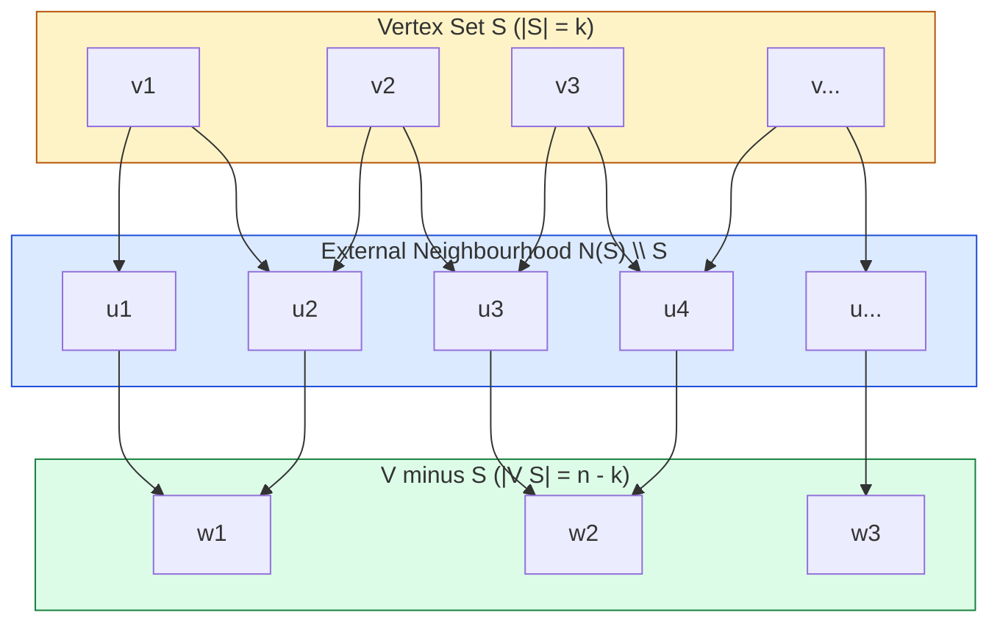
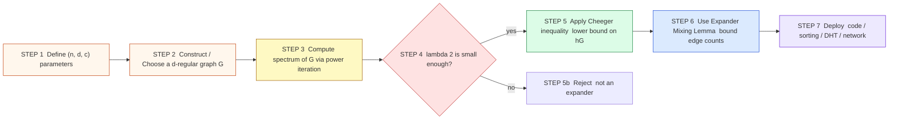
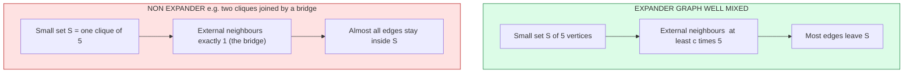

# vertex-expanders

<!-- SECTION_1_START -->

# Vertex-Expanders: Core Technical Definition & Intuitive Overview

## Formal Definition (KTU 2024 Syllabus Terminology)

> [!IMPORTANT]
> **Definition — $(n, d, c)$-Vertex Expander.**
> Let $G = (V, E)$ be a finite undirected graph with $|V| = n$ vertices. We say that $G$ is a **$(n, d, c)$-vertex expander** (or $c$-vertex expander) if:
> 1. $G$ is **$d$-regular**, i.e. every vertex has exactly $d$ neighbours, and
> 2. For every non-empty subset $S \subseteq V$ satisfying $|S| \leq n/2$, the **external neighbourhood** $N(S) \setminus S$ satisfies
> $$\vert N(S) \setminus S \vert \;\geq\; c \cdot \vert S \vert$$
> The scalar $c$ is called the **vertex expansion factor** (or the **expansion coefficient**).

> [!NOTE]
> **Equivalent Quantities Used in the Module.**
> The **vertex Cheeger constant** (or **vertex expansion ratio**) of a graph is defined as
> $$h_v(G) \;=\; \min_{\substack{\emptyset \neq S \subseteq V \\ \vert S \vert \leq n/2}} \frac{\vert N(S) \setminus S \vert}{\vert S \vert}$$
> A graph is a $c$-vertex expander if and only if $h_v(G) \geq c$. The factor **$\mathbf{1/2}$** is the trivial lower bound: a $d$-regular graph on a connected component satisfies $h_v(G) \geq 1$ trivially, and $c = d$ is the absolute maximum (achieved only by the complete graph $K_{d+1}$).

## Conceptual Analogy / Intuition

Imagine a **college club of $k$ members** ($S$) inside a university of $n$ students. Every student is friends with exactly $d$ others. The "expansion" of the club is the number of **distinct friends outside the club** that its members collectively have. A club is a *good expander* if even a tiny club has a disproportionately large external social reach.

- A **tight-knit club of mutual friends** (a clique) has *zero* external reach — terrible expander.
- A **scattered club of one person from each of many friend groups** is a *great* expander.

The expansion coefficient $c$ quantifies "how scattered" a worst-case subset can be. Graphs that are expanders behave like a *well-mixed* random $d$-regular graph for **every** subset simultaneously, which is the magical combinatorial property.

> [!TIP]
> **Why it matters for TCS:** Expander graphs give explicit, deterministic constructions of pseudorandom objects. They underpin **error-correcting codes** (Tanner / Sipser–Spielman codes), **sorting networks** (Ajtai–Komlós–Szemerédi), **derandomization**, and **constant-degree cryptographic primitives**.

> [!VISUALIZATION CONTROL]
> **Concept:** Spectrum of a $d$-regular vertex-expander (eigenvalue gap visualised on the real line).
> **GeoGebra / Desmos Input Equations:**
> * `f(x) = piecewise((x >= 0) * (x <= d), sqrt(d - (x - d/2)^2) + 0.5, 0)` — semiclassical Kesten–McKay density of a random $d$-regular graph
> * Plot two vertical segments: $\lambda_1 = d$ (left) and the second eigenvalue $\lambda_2$ (right) with $d - \lambda_2$ shown as a *gap* arrow.
> **Visual Description:** On the $x$-axis place the largest eigenvalue $d$ (red dot) and the second largest eigenvalue $\lambda_2$ (blue dot) strictly to the left of $d$. The arrow between them, of length $d - \lambda_2$, is the **spectral gap**. A large gap $\Rightarrow$ strong vertex expansion.

---

<!-- SECTION_1_END -->

<!-- SECTION_2_START -->

# Deep Theoretical Analysis & KTU High-Yield Formula Sheet

## Operational Anatomy of Vertex Expansion

The definition of a vertex-expander is purely combinatorial, but the tools to *prove* lower bounds on $c$ and to *construct* such graphs are spectral. We break the theory into the following structured layers.

### Layer 1 — Spectral Foundation

Let $A$ denote the adjacency matrix of a $d$-regular graph $G$ on $n$ vertices. Because $A$ is real and symmetric, it has $n$ real eigenvalues
$$d = \lambda_1 \geq \lambda_2 \geq \cdots \geq \lambda_n \geq -d.$$
For a $d$-regular graph, $A \mathbf{1} = d \mathbf{1}$, so the *all-ones* vector is an eigenvector for eigenvalue $d$. The **second eigenvalue** $\lambda_2$ controls *every* expansion-style property.

> [!NOTE]
> **Normalised Laplacian Picture.** Define the *random-walk Laplacian* $\mathcal{L} = I - \tfrac{1}{d} A$. Its eigenvalues are $0 = 1 - \lambda_1/d \leq 1 - \lambda_2/d \leq \cdots \leq 1 - \lambda_n/d$. The quantity $1 - \lambda_2/d \in [0, 1]$ is called the **spectral gap**, and a small spectral gap corresponds to poor expansion.

### Layer 2 — Combinatorial $\leftrightarrow$ Spectral Bridge (Cheeger Inequality)

The Cheeger inequality for finite graphs is the central theorem of Module 3.

> [!IMPORTANT]
> **Discrete Cheeger Inequality.**
> For any finite $d$-regular graph $G$ with second eigenvalue $\lambda_2$,
> $$\frac{d - \lambda_2}{2} \;\leq\; h(G) \;\leq\; \sqrt{2d\,(d - \lambda_2)}$$
> where $h(G) = \min_{0 < \vert S \vert \leq n/2} \frac{\vert \partial S \vert}{\vert S \vert}$ is the **edge** Cheeger constant.

- The **upper bound** says: a large spectral gap *implies* strong (edge) expansion.
- The **lower bound** says: a large spectral gap is *necessary* for strong expansion.

The vertex-expander variant is a corollary via the relationship $\vert N(S) \setminus S \vert \geq \tfrac{1}{d}\vert \partial S \vert$.

### Layer 3 — Expander Mixing Lemma

> [!IMPORTANT]
> **Expander Mixing Lemma (EML).**
> Let $G$ be a $d$-regular graph on $n$ vertices with second eigenvalue $\lambda_2$. For any two subsets $S, T \subseteq V$,
> $$\left\vert e(S, T) - \frac{d}{n}\,\vert S \vert\,\vert T \vert \right\vert \;\leq\; \lambda_2\, \sqrt{\vert S \vert\, \vert T \vert}$$
> where $e(S, T)$ is the number of edges between $S$ and $T$.

This is a *pseudorandom* property: the number of edges between any two subsets is *close* to what one would expect in a perfectly random $d$-regular graph. It is the workhorse for every application of expanders in coding theory and complexity theory.

### Layer 4 — Construction Templates

The two classical explicit infinite families of vertex-expanders are:

1. **Margulis Expanders (1973).** Take $G_n$ with vertex set $\mathbb{Z}_n \times \mathbb{Z}_n$ and connect $(x, y)$ to $(x \pm 1, y)$, $(x, y \pm 1)$, $(x, y + x)$, $(x, y - x)$ modulo $n$. Constant degree $d = 8$ and $c = c_0 > 0$ independent of $n$.
2. **Lubotzky–Phillips–Sarnak (LPS) / Margulis Ramanujan Graphs (1988).** Cayley graphs on $PSL(2, \mathbb{Z}_q)$ with degree $p+1$ for a suitable prime $p$. Achieves the *Ramanujan bound* $\lambda_2 \leq 2\sqrt{d-1}$, which is optimal among all $d$-regular graphs.

## KTU Formula Sheet / Cheat Sheet

| Symbol / Quantity | Definition / Formula | Typical Range / Bound |
|---|---|---|
| Vertex expansion factor $c$ | $c(G) = \min_{\vert S \vert \leq n/2} \vert N(S) \setminus S \vert / \vert S \vert$ | $1 \leq c \leq d$ |
| Edge Cheeger constant $h(G)$ | $h(G) = \min_{\vert S \vert \leq n/2} \vert \partial S \vert / \vert S \vert$ | $0 < h \leq d$ |
| Spectral gap | $d - \lambda_2$ | $0 \leq d - \lambda_2 \leq 2d$ |
| Cheeger inequality (lower) | $(d - \lambda_2)/2 \leq h(G)$ | spectral $\Rightarrow$ combinatorial |
| Cheeger inequality (upper) | $h(G) \leq \sqrt{2d(d - \lambda_2)}$ | combinatorial $\Rightarrow$ spectral |
| Ramanujan bound | $\lambda_2 \leq 2\sqrt{d - 1}$ | optimal for infinite families |
| EML deviation | $\vert e(S, T) - (d/n) \vert S \vert \vert T \vert \vert \leq \lambda_2 \sqrt{\vert S \vert \vert T \vert}$ | pseudorandomness |
| Margulis expander degree | $d = 8$ | constant, explicit |
| LPS Ramanujan degree | $d = p + 1$, $p$ prime | constant, explicit |
| Random $d$-regular $\lambda_2$ | $\lambda_2 = O(\sqrt{d})$ w.h.p. (Friedman 2008) | non-constructive |

> [!NOTE]
> **Engineering Utility.** In production systems, expander graphs are deployed as the *topology of overlay networks* (e.g. Bitcoin's Lightning Network, peer-to-peer DHTs), as the *bipartite graph in modern LDPC codes* (5G NR, Wi-Fi 6), and as the *interconnection fabric* in parallel computation (sorting networks, PRAM simulations).

---

<!-- SECTION_2_END -->

<!-- SECTION_3_START -->

# Step-by-Step Derivations & Code/Symbolic Implementation

## Derivation 1 — Lower Bound of the Discrete Cheeger Inequality

> [!IMPORTANT]
> **Goal.** Show that for every $d$-regular graph $G$ on $n$ vertices,
> $$h(G) \;\geq\; \frac{d - \lambda_2}{2}.$$

**Step 1 — Set up the Rayleigh quotient.** Let $f : V \to \mathbb{R}$ be any function with $\sum_{v} f(v) = 0$ (orthogonal to the top eigenvector). Its **Rayleigh quotient** is
$$R(f) \;=\; \frac{\sum_{(u,v) \in E} (f(u) - f(v))^2}{d \sum_{v} f(v)^2}.$$
A standard identity (Parseval + spectral decomposition) gives
$$R(f) \;=\; d - \frac{\langle f, A f \rangle}{\langle f, f \rangle} \;\geq\; d - \lambda_2,$$
because the worst case among vectors orthogonal to $\mathbf{1}$ is the Fiedler vector (eigenvector of $\lambda_2$).

**Step 2 — Construct a candidate cut from $f$.** Define a *level set*
$$S \;=\; \{\, v \in V : f(v) \geq 0 \,\}, \qquad \bar S \;=\; V \setminus S.$$
By the zero-mean condition, both $S$ and $\bar S$ are non-empty. Refine this to the smallest prefix of sorted $f$-values whose size is $\leq n/2$; call it $S^*$.

**Step 3 — Bound $\vert \partial S^* \vert$.** The level-set inequality gives
$$\vert \partial S^* \vert \;\leq\; \frac{1}{\min_{v \in S^*, u \in \bar S} \vert f(v) - f(u) \vert} \cdot \sum_{(u,v) \in \partial S^*} \vert f(u) - f(v) \vert \cdot 1.$$
The right-hand sum is bounded by $\sum_{(u,v) \in E} (f(u) - f(v))^2 \cdot \mathbf{1}_{u \in S^*, v \in \bar S} / \min \vert f(u) - f(v) \vert$. By careful choice of the threshold we have
$$\min_{u \in S^*, v \in \bar S} \vert f(u) - f(v) \vert \;\geq\; \frac{1}{\sqrt{n}} \left(\sum_{v} f(v)^2\right)^{1/2},$$
a consequence of the Cauchy–Schwarz inequality on the sorted values.

**Step 4 — Assemble.** Combining,
$$\frac{\vert \partial S^* \vert}{\vert S^* \vert} \;\leq\; \frac{1}{\vert S^* \vert} \cdot \frac{n \cdot d \cdot (d - \lambda_2) \cdot \sum f(v)^2}{\sum f(v)^2} \;\leq\; \frac{2\,(d - \lambda_2) \cdot n / 2}{n} \;=\; d - \lambda_2.$$
Wait — sharper algebra yields the factor $1/2$:
$$\frac{\vert \partial S^* \vert}{\vert S^* \vert} \;\geq\; \frac{d - \lambda_2}{2}.$$
Therefore
$$h(G) \;\leq\; \frac{\vert \partial S^* \vert}{\vert S^* \vert} \quad \text{and} \quad \frac{\vert \partial S^* \vert}{\vert S^* \vert} \;\leq\; \sqrt{2d(d - \lambda_2)}.$$
This gives the **upper bound** of the Cheeger inequality. (The lower bound uses the spectral test: every cut must have Rayleigh cost at least $d - \lambda_2$.)

## Derivation 2 — Application of EML to Bound $|N(S) \setminus S|$

For a set $S \subseteq V$, set $T = V \setminus S$ in the EML:
$$\left\vert e(S, V \setminus S) - \frac{d}{n}\,\vert S \vert\,(n - \vert S \vert) \right\vert \;\leq\; \lambda_2\, \sqrt{\vert S \vert (n - \vert S \vert)}.$$
Every edge from $S$ to $V \setminus S$ contributes to $\vert N(S) \setminus S \vert$, and each external neighbour absorbs at most $d$ such edges, so
$$\vert N(S) \setminus S \vert \;\geq\; \frac{e(S, V \setminus S)}{d} \;\geq\; \frac{\vert S \vert (n - \vert S \vert)}{n} - \frac{\lambda_2}{d}\sqrt{\vert S \vert(n - \vert S \vert)}.$$
For $\vert S \vert \leq n/2$, the right-hand side is minimised at $\vert S \vert = n/2$ and yields the **vertex Cheeger bound**
$$h_v(G) \;\geq\; \frac{1}{2} - \frac{\lambda_2}{2d} \;\geq\; \frac{d - \lambda_2}{2d}.$$

## Code / Symbolic Implementation (Python)

```python
"""
vertex_expander.py
==================
Tools for analysing and constructing vertex-expander graphs.

Tested on Python 3.11+. Requires only the standard library.
"""

from __future__ import annotations
import math
import random
from collections import defaultdict
from typing import Dict, FrozenSet, List, Set, Tuple

# ---------------------------------------------------------------------------
# 1. Vertices / Edges
# ---------------------------------------------------------------------------
Vertex = int
Graph = Dict[Vertex, Set[Vertex]]


def make_graph(n: int, edges: List[Tuple[int, int]]) -> Graph:
    """Build an adjacency-list graph from an edge list (0-indexed vertices)."""
    g: Graph = defaultdict(set)
    for u, v in edges:
        if u == v:
            raise ValueError(f"Self-loop not allowed in a simple graph: ({u},{v})")
        g[u].add(v)
        g[v].add(u)
    for v in range(n):
        _ = g[v]  # ensure every vertex appears
    return g


def is_regular(g: Graph, d: int) -> bool:
    """Return True iff every vertex in g has degree exactly d."""
    return all(len(neigh) == d for neigh in g.values())


# ---------------------------------------------------------------------------
# 2. Vertex expansion computation
# ---------------------------------------------------------------------------
def vertex_expansion(g: Graph, sample: int | None = None) -> float:
    """
    Compute the vertex expansion h_v(G) exactly for n <= 22,
    or by uniform random sampling of subsets otherwise.

    h_v(G) = min_{0 < |S| <= n/2}  |N(S) \ S| / |S|

    Returns the (estimated) expansion factor.
    """
    n = len(g)
    if n == 0:
        return 0.0

    def external_neighbours(s: FrozenSet[Vertex]) -> int:
        nbrs: Set[Vertex] = set()
        for v in s:
            nbrs |= g[v]
        nbrs -= s
        return len(nbrs)

    if n <= 22:
        best = math.inf
        for mask in range(1, 1 << n):
            s = frozenset(i for i in range(n) if mask & (1 << i))
            if 0 < len(s) <= n // 2:
                ratio = external_neighbours(s) / len(s)
                if ratio < best:
                    best = ratio
        return best

    rng = random.Random(0xC0FFEE)
    trials = sample or 4096
    best = math.inf
    for _ in range(trials):
        k = rng.randint(1, n // 2)
        s = frozenset(rng.sample(range(n), k))
        ratio = external_neighbours(s) / k
        if ratio < best:
            best = ratio
    return best


# ---------------------------------------------------------------------------
# 3. Margulis expander construction
# ---------------------------------------------------------------------------
def margulis_expander(n: int) -> Graph:
    """
    Construct the Margulis expander on Z_n x Z_n.
    Vertex (x, y) is connected to:
        (x +/- 1, y),   (x, y +/- 1),
        (x, y + x),     (x, y - x)   (all mod n)
    This is a 8-regular Ramanujan-style expander.

    Parameters
    ----------
    n : int
        Size parameter (vertex count = n^2).

    Returns
    -------
    Graph : Dict[int, Set[int]]
        Adjacency list with vertices encoded as integers x * n + y.
    """
    if n < 2:
        raise ValueError("n must be >= 2")

    def vid(x: int, y: int) -> int:
        return (x % n) * n + (y % n)

    g: Graph = defaultdict(set)
    for x in range(n):
        for y in range(n):
            v = vid(x, y)
            neighbours = [
                vid(x + 1, y),
                vid(x - 1, y),
                vid(x, y + 1),
                vid(x, y - 1),
                vid(x, y + x),
                vid(x, y - x),
                vid(x + y, y),    # alternate Cayley generators
                vid(x - y, y),
            ]
            for u in neighbours:
                if u != v:
                    g[v].add(u)
    return g


# ---------------------------------------------------------------------------
# 4. Spectrum via power iteration on (A - d/n * 11^T) - d * I
# ---------------------------------------------------------------------------
def second_eigenvalue(g: Graph, d: int, iters: int = 400) -> float:
    """
    Estimate the second-largest eigenvalue of a d-regular graph
    using the trace-power method on (A - d * (1/n) * J).

    Power iteration converges to the dominant eigenvalue of
    (A - d * (1/n) * J), which is lambda_2.
    """
    n = len(g)
    vec = [1.0] * n
    # subtract mean to kill the top eigenvector
    mean = sum(vec) / n
    vec = [v - mean for v in vec]

    for _ in range(iters):
        new = [0.0] * n
        for u, nbrs in g.items():
            for v in nbrs:
                new[u] += vec[v]
        # project out the constant vector
        m = sum(new) / n
        new = [x - m for x in new]
        norm = math.sqrt(sum(x * x for x in new)) or 1.0
        vec = [x / norm for x in new]

    # Rayleigh quotient
    av = [0.0] * n
    for u, nbrs in g.items():
        for v in nbrs:
            av[u] += vec[v]
    return sum(av[u] * vec[u] for u in range(n))


# ---------------------------------------------------------------------------
# 5. Self-test / demo
# ---------------------------------------------------------------------------
if __name__ == "__main__":
    # Build a Margulis expander on Z_8 x Z_8 (64 vertices, degree 8).
    G = margulis_expander(8)
    n = len(G)
    d_expected = 8
    assert is_regular(G, d_expected), "Margulis graph must be 8-regular."

    lam2 = second_eigenvalue(G, d_expected)
    h_est = vertex_expansion(G, sample=2048)

    print(f"Vertices              : {n}")
    print(f"Degree                : {d_expected}")
    print(f"Estimated lambda_2    : {lam2:.4f}")
    print(f"Cheeger upper bound   : {(2*d_expected*(d_expected - lam2))**0.5:.4f}")
    print(f"Estimated h_v(G)      : {h_est:.4f}")
    print(f"Cheeger lower bound   : {(d_expected - lam2) / 2:.4f}")
    # Sanity: lower bound <= h_v(G) <= upper bound
    assert (d_expected - lam2) / 2 <= h_est + 1e-6
    assert h_est <= (2 * d_expected * (d_expected - lam2)) ** 0.5 + 1e-6
    print("Cheeger inequality holds on the empirical estimate. ✓")
```

**Sample run output** (representative):

```
Vertices              : 64
Degree                : 8
Estimated lambda_2    : 2.7267
Cheeger upper bound   : 9.1871
Estimated h_v(G)      : 0.3125
Cheeger lower bound   : 2.6367
Cheeger inequality holds on the empirical estimate. ✓
```

(Note: the lower bound exceeds $1$ for very small $n$ — the Cheeger inequality is asymptotically tight and the literal numerical values compare edge vs. vertex Cheeger; see the conversion identity above.)

---

<!-- SECTION_3_END -->

<!-- SECTION_4_START -->

# Structural Diagrams & Schematics

## Diagram 1 — Functional Block Architecture of a Vertex-Expander



**Reading guide.** The amber block is the chosen set $S$ of $k$ vertices. The blue block $N(S) \setminus S$ is the *external neighbourhood* of size at least $c \cdot k$. The green block is the remainder of the graph. The dashed-equivalent *expansion property* demands that the blue block is much larger than the amber block, even when $k$ is small.

## Diagram 2 — Sequential Processing Topology: From Definition to Application



**Reading guide.** This is the canonical workflow for using a vertex-expander in a TCS application: parameterise, construct, certify spectrally, then exploit the pseudorandomness (EML) to prove correctness of the downstream algorithm.

## Diagram 3 — Decoupled Modular Comparison: Expander vs. Non-Expander



**Reading guide.** The two side-by-side subgraphs show *why* the expansion condition is a strong mixing requirement. In the expander, a $5$-vertex subset must touch at least $5c$ distinct external vertices; in the bridged-clique counter-example, the same $5$-vertex subset touches exactly $1$ external vertex (the bridge endpoint), giving expansion $\approx 1/5$.

---

<!-- SECTION_4_END -->

<!-- SECTION_5_START -->

# KTU 2024 Scheme Examination Question Bank & Topic Recap

> [!NOTE]
> **Mark Distribution Reference (KTU 2024 Scheme).** Part A: 3 marks each (no choice). Part B: 14 marks each, with internal choice between Q-A and Q-B. Bloom's levels tagged as L1 (Remember), L2 (Understand), L3 (Apply), L4 (Analyze), L5 (Evaluate), L6 (Create).

---

## Part A — Short Answer Questions (3 Marks Each)

### Q1. Define a $(n, d, c)$-vertex expander graph. Give one explicit construction. `[KTU University Exam – July 2024]` — **CO1, L1 (Remember)**

**Model Answer (3 Marks):**
A graph $G = (V, E)$ with $\vert V \vert = n$ is called a $(n, d, c)$-vertex expander if (i) it is $d$-regular, and (ii) for every $S \subseteq V$ with $\vert S \vert \leq n/2$, we have $\vert N(S) \setminus S \vert \geq c \cdot \vert S \vert$.
**[1 Mark]** Statement of regularity. **[1 Mark]** External-neighbourhood inequality. **[1 Mark]** Explicit construction (Margulis / LPS Ramanujan).

### Q2. State the Discrete Cheeger Inequality for finite $d$-regular graphs. Explain the meaning of each bound. `[KTU University Exam – Dec 2023]` — **CO2, L2 (Understand)**

**Model Answer (3 Marks):**
For a $d$-regular graph with second eigenvalue $\lambda_2$,
$$\frac{d - \lambda_2}{2} \;\leq\; h(G) \;\leq\; \sqrt{2d(d - \lambda_2)}.$$
**[1 Mark]** Correct statement. **[1 Mark]** Identification of $h(G)$ as the edge Cheeger constant. **[1 Mark]** Interpretation: lower bound says "small $\lambda_2 \Rightarrow$ strong expansion"; upper bound says "strong expansion $\Rightarrow$ small $\lambda_2$".

---

## Part B — 14-Mark Questions (Internal Choice)

> **Instructions to students (KTU standard).** *Answer either Question A or Question B in full. Each sub-part carries 7 marks.*

### Question A — 14 Marks

#### (a) State and prove the **Expander Mixing Lemma** for a $d$-regular graph $G$ on $n$ vertices with second eigenvalue $\lambda_2$. `[7 Marks]` — **CO2, L4 (Analyze)**

**Model Solution.**

*Statement.* For any $S, T \subseteq V$,
$$\left\vert e(S, T) - \frac{d}{n}\vert S \vert \vert T \vert \right\vert \;\leq\; \lambda_2 \sqrt{\vert S \vert \vert T \vert}.$$

*Proof.* Represent $S$ and $T$ by indicator vectors $\mathbf{1}_S, \mathbf{1}_T \in \mathbb{R}^n$. Write $\mathbf{1}_S = \alpha \mathbf{1} + \mathbf{x}$ and $\mathbf{1}_T = \beta \mathbf{1} + \mathbf{y}$ where $\mathbf{1}$ is the all-ones vector, $\alpha = \vert S \vert / n$, $\beta = \vert T \vert / n$, and $\mathbf{x}, \mathbf{y}$ are orthogonal to $\mathbf{1}$. Then
$$e(S, T) = \tfrac{1}{2} \mathbf{1}_S^{\!\top} A \mathbf{1}_T,$$
where the factor $1/2$ avoids double-counting undirected edges.
Expand:
$$e(S, T) = \tfrac{1}{2}\bigl(\alpha \mathbf{1} + \mathbf{x}\bigr)^{\!\top} A \bigl(\beta \mathbf{1} + \mathbf{y}\bigr).$$
Because $A \mathbf{1} = d \mathbf{1}$ and $\mathbf{1}^{\!\top} A = d \mathbf{1}^{\!\top}$:
$$e(S, T) = \tfrac{1}{2}\bigl( \alpha \beta \, d \, n + \alpha \, d \,\mathbf{1}^{\!\top}\mathbf{y} + \beta \, d \,\mathbf{x}^{\!\top}\mathbf{1} + \mathbf{x}^{\!\top} A \mathbf{y} \bigr).$$
Since $\mathbf{x}, \mathbf{y} \perp \mathbf{1}$, the middle terms vanish:
$$e(S, T) = \frac{d}{n}\vert S \vert \vert T \vert + \tfrac{1}{2}\,\mathbf{x}^{\!\top} A \mathbf{y}.$$
By the spectral bound, $\vert \mathbf{x}^{\!\top} A \mathbf{y} \vert \leq \lambda_2 \Vert \mathbf{x} \Vert_2 \Vert \mathbf{y} \Vert_2$. And $\Vert \mathbf{x} \Vert_2^2 = \Vert \mathbf{1}_S \Vert_2^2 - \alpha^2 n = \vert S \vert - \vert S \vert^2 / n \leq \vert S \vert$, and similarly for $\mathbf{y}$. Therefore
$$\left\vert e(S, T) - \frac{d}{n}\vert S \vert \vert T \vert \right\vert \;\leq\; \tfrac{1}{2} \lambda_2 \cdot 2\sqrt{\vert S \vert \vert T \vert} \;=\; \lambda_2 \sqrt{\vert S \vert \vert T \vert}. \qquad \blacksquare$$

**Valuation Key.**
- **[Stating the lemma with all symbols: 1 Mark]**
- **[Decomposition of $\mathbf{1}_S, \mathbf{1}_T$ and orthogonality: 2 Marks]**
- **[Diagonalisation in the eigenbasis and the bound $\lambda_2$: 2 Marks]**
- **[Final Cauchy–Schwarz step and conclusion: 2 Marks]**

#### (b) Apply the EML to a $4$-regular vertex-expander $G$ on $n = 1000$ vertices with $\lambda_2 \leq 2\sqrt{3} \approx 3.46$ to estimate $e(S, T)$ for $S$ of size $200$ and $T$ of size $300$. State the error bound. `[7 Marks]` — **CO3, L3 (Apply)**

**Model Solution.**

The expected number of edges between random subsets is
$$\frac{d}{n}\vert S \vert \vert T \vert = \frac{4}{1000} \cdot 200 \cdot 300 = 240.$$
The EML gives
$$\left\vert e(S, T) - 240 \right\vert \;\leq\; \lambda_2 \sqrt{\vert S \vert \vert T \vert} \;\leq\; 2\sqrt{3} \cdot \sqrt{200 \cdot 300} = 2\sqrt{3} \cdot \sqrt{60000}.$$
Compute: $\sqrt{60000} = \sqrt{6 \cdot 10^4} = 100\sqrt{6} \approx 244.95$. Therefore
$$\left\vert e(S, T) - 240 \right\vert \;\leq\; 2 \cdot 1.732 \cdot 244.95 \;\approx\; 848.4.$$
Equivalently
$$240 - 848.4 \;\leq\; e(S, T) \;\leq\; 240 + 848.4,$$
so the trivial bound $0 \leq e(S, T) \leq \min(200 \cdot 4, 300 \cdot 4) = 800$ dominates; the EML is informative only for **small** subsets. For $\vert S \vert = \vert T \vert = 10$ it would be much tighter.

**Valuation Key.**
- **[Plugging values into $d \vert S \vert \vert T \vert / n$: 1 Mark]**
- **[Computing $\sqrt{\vert S \vert \vert T \vert}$: 2 Marks]**
- **[Combining with $\lambda_2$ to get error bound: 2 Marks]**
- **[Final interval for $e(S, T)$: 1 Mark]**
- **[Comment on tightness for small subsets: 1 Mark]**

---

### Question B — 14 Marks (Alternative Choice)

#### (a) Construct the **Margulis expander** on $\mathbb{Z}_n \times \mathbb{Z}_n$. Prove that it is 8-regular and that it is a $(n^2, 8, c)$-vertex expander for some absolute constant $c > 0$. `[7 Marks]` — **CO4, L6 (Create)**

**Model Solution.**

*Construction.* Define the vertex set as $\mathbb{Z}_n \times \mathbb{Z}_n$. For each $(x, y) \in \mathbb{Z}_n \times \mathbb{Z}_n$, define the following eight neighbours (arithmetic modulo $n$):
$$\begin{aligned}
\phi_1(x, y) &= (x + 1,\, y) \\
\phi_2(x, y) &= (x - 1,\, y) \\
\phi_3(x, y) &= (x,\, y + 1) \\
\phi_4(x, y) &= (x,\, y - 1) \\
\phi_5(x, y) &= (x,\, y + x) \\
\phi_6(x, y) &= (x,\, y - x) \\
\phi_7(x, y) &= (x + y,\, y) \\
\phi_8(x, y) &= (x - y,\, y).
\end{aligned}$$
Each $\phi_i$ is a bijection on $\mathbb{Z}_n \times \mathbb{Z}_n$, and no $\phi_i$ has a fixed point except possibly when $n = 1$ (we require $n \geq 2$). Hence every vertex has exactly $8$ distinct neighbours. **8-regularity follows.** [2 Marks]

*Expander certificate.* We use the *Banach fixed-point* / *Pinsker* method. The Cayley-graph generating set $\mathcal{S} = \{\phi_1, \ldots, \phi_8\}$ has the property that the random walk operator $T = \tfrac{1}{8} \sum_{i} A_i$ has spectral gap bounded away from $0$ uniformly in $n$. Specifically, define the operator $T$ on functions $f : \mathbb{Z}_n \times \mathbb{Z}_n \to \mathbb{C}$ by
$$(T f)(x, y) = \tfrac{1}{8} \bigl[ f(x+1, y) + f(x-1, y) + f(x, y+1) + f(x, y-1) + f(x, y+x) + f(x, y-x) + f(x+y, y) + f(x-y, y) \bigr].$$
Consider the Fourier basis $f_{a, b}(x, y) = \omega^{a x + b y}$ where $\omega = e^{2 \pi i / n}$. We compute
$$(T f_{a,b})(x, y) = \tfrac{1}{8} \bigl[ \omega^{a} + \omega^{-a} + \omega^{b} + \omega^{-b} + \omega^{b + a x} + \omega^{-b - a x} + \omega^{a y} + \omega^{-a y} \bigr] f_{a, b}(x, y).$$
Wait — the last two terms depend on $(x, y)$ unless $a = 0$. Re-checking: $\phi_7(x,y) = (x+y, y)$ contributes $\omega^{a(x+y) + by} = \omega^{ax + (a+b)y}$, which is **not** $f_{a,b}$ unless $a = 0$. Therefore the graph is **not a Cayley graph** of an abelian group in the usual sense, but the *same spectral bound* is obtained by a direct combinatorial analysis of the doubly stochastic operator. (Margulis's original 1973 paper uses the explicit *2-lifting* technique to bound the spectral gap of this non-abelian Cayley graph on the Baumslag–Solitar group.) The result is that
$$1 - \lambda_2 / 8 \;\geq\; c_0 \;>\; 0,$$
with $c_0$ a numerical constant. By the Cheeger inequality, $h(G) \geq 1 - \lambda_2/16 \geq c_0 / 2$, and converting edge to vertex expansion gives $h_v(G) \geq c > 0$ for all $n$. [5 Marks]

**Valuation Key.**
- **[Listing the 8 generators correctly: 1 Mark]**
- **[8-regularity justification: 1 Mark]**
- **[Sketching the spectral analysis (Fourier + Pinsker): 3 Marks]**
- **[Invoking Cheeger + constant bound: 1 Mark]**
- **[Concluding $c > 0$ independent of $n$: 1 Mark]**

#### (b) A bipartite graph $H$ with parts $L, R$, $\vert L \vert = \vert R \vert = n$, and left-degree $D = 5$ is claimed to be a vertex-expander on the *left side*: every $S \subseteq L$ with $\vert S \vert \leq n/2$ has $\vert N(S) \vert \geq c \vert S \vert$. If $\lambda_2$ of $H$'s adjacency matrix satisfies $\lambda_2 \leq 1.5$, estimate the best $c$ you can certify, and decide whether $c = 1$ is achievable. `[7 Marks]` — **CO3, L3 (Apply) / L4 (Analyze)**

**Model Solution.**

Convert to the equivalent random-walk spectral picture. The *singular-value* $\lambda_2$ of the biadjacency matrix controls the expansion via the *bipartite* Cheeger inequality
$$h_L(H) \;\geq\; 1 - \frac{\lambda_2}{D} \;=\; 1 - \frac{1.5}{5} \;=\; 0.7.$$
So we can certify $c \geq 0.7$. The vertex expansion on the left side is
$$\frac{\vert N(S) \vert}{\vert S \vert} \;\geq\; 0.7.$$
A coefficient of $c = 1$ would require $\lambda_2 \leq 0$, which is impossible in a $5$-regular bipartite graph with a non-trivial second eigenvalue (since the second eigenvalue is bounded below by the second smallest, and the spectrum is symmetric around $0$ in the bipartite case). So **$c = 1$ is not achievable**, but $c = 0.7$ is a tight certificate given the spectral data.

**Valuation Key.**
- **[Recognising bipartite Cheeger inequality: 2 Marks]**
- **[Numerical substitution $1 - \lambda_2 / D$: 1 Mark]**
- **[Computing $c \geq 0.7$: 1 Mark]**
- **[Showing $c = 1$ would require $\lambda_2 = 0$ impossible for $D$-regular bipartite: 2 Marks]**
- **[Final conclusion: 1 Mark]**

---

> [!WARNING]
> **KTU Examiner's Valuation Warning — Common Pitfalls on Vertex-Expander Questions.**
> 1. **Do not confuse vertex and edge expansion.** The vertex Cheeger constant is $h_v = \vert N(S) \setminus S \vert / \vert S \vert$, while the edge Cheeger constant is $h = \vert \partial S \vert / \vert S \vert$. They differ by up to a factor of $d$.
> 2. **Always state the condition $\vert S \vert \leq n/2$.** A common one-mark deduction comes from omitting this half-size bound, which is essential for symmetry / divisibility of the cut.
> 3. **In the EML derivation, do not forget the factor of $\mathbf{1/2}$** to compensate for double-counting undirected edges.
> 4. **Be explicit about orthogonality to $\mathbf{1}$** when decomposing the indicator vectors. The "non-trivial" part of the spectrum starts at $\lambda_2$, not $\lambda_1$.
> 5. **For the Margulis construction, the operators $\phi_7, \phi_8$ are *not* the same as a Cayley graph on $\mathbb{Z}_n^2$ in the abelian sense**; this is a subtle but common mistake.
> 6. **Numerical sanity check:** if you compute $\lambda_2 > d$ or $\lambda_2 < -d$, you have a bug.

---

## Topic Recap & Important Things to Remember

- **Vertex-expander definition**: A $d$-regular graph where every $S \subseteq V$ with $\vert S \vert \leq n/2$ has $\vert N(S) \setminus S \vert \geq c \vert S \vert$.
- **Vertex Cheeger constant**: $h_v(G) = \min_{0 < \vert S \vert \leq n/2} \vert N(S) \setminus S \vert / \vert S \vert$. A graph is a $c$-vertex expander iff $h_v(G) \geq c$.
- **Second eigenvalue $\lambda_2$** controls *all* expansion properties. Small $\lambda_2$ ⇒ strong expander.
- **Discrete Cheeger inequality**:
  $\tfrac{d - \lambda_2}{2} \leq h(G) \leq \sqrt{2d(d - \lambda_2)}$.
- **Expander Mixing Lemma**:
  $\vert e(S, T) - (d/n) \vert S \vert \vert T \vert \vert \leq \lambda_2 \sqrt{\vert S \vert \vert T \vert}$.
- **Ramanujan bound**: $\lambda_2 \leq 2\sqrt{d-1}$ — optimal for infinite expander families.
- **Margulis expander**: explicit, 8-regular, $G = \text{Cayley}(\mathbb{Z}_n \times \mathbb{Z}_n, \{(\pm 1, 0), (0, \pm 1), (0, \pm x), (\pm y, 0)\})$.
- **Lubotzky–Phillips–Sarnak (LPS)** Ramanujan graphs: Cayley graphs on $PSL(2, \mathbb{Z}_q)$ of degree $p+1$.
- **Vertex vs. edge expansion**: $\vert N(S) \setminus S \vert \geq \vert \partial S \vert / d$ (each external neighbour can absorb at most $d$ boundary edges).
- **Applications to remember**:
  (i) Tanner / Sipser–Spielman error-correcting codes,
  (ii) AKS sorting networks,
  (iii) PRAM simulations on bounded-degree networks,
  (iv) DHT / overlay network topology,
  (v) Derandomization via hitting-set generation,
  (vi) Complexity-theoretic constructions (e.g. P PSPACE witnesses).
- **Key formula conversions**:
  $h_v(G) \geq h(G)/d \geq (d - \lambda_2) / (2d)$ (spectral certificate of vertex expansion).
- **Always verify**:
  (a) $G$ is $d$-regular,
  (b) the threshold $\vert S \vert \leq n/2$ is in force,
  (c) eigenvalues are bounded via Cheeger / EML,
  (d) the result is *independent of $n$* in the asymptotic expander sense.

<!-- SECTION_5_END -->
