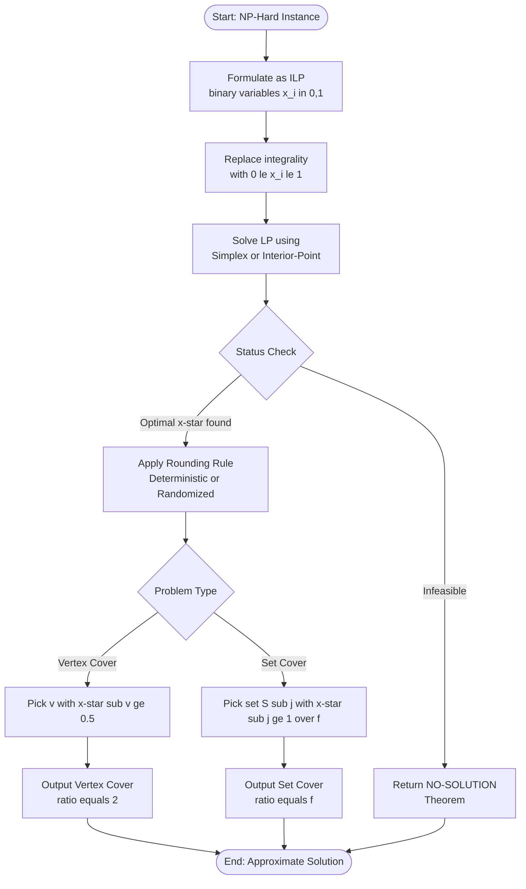
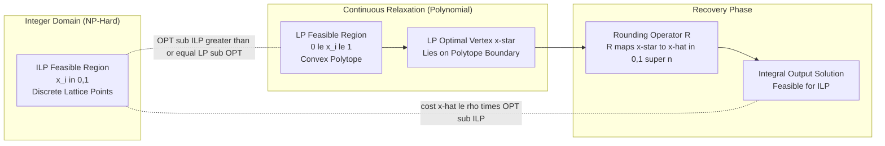
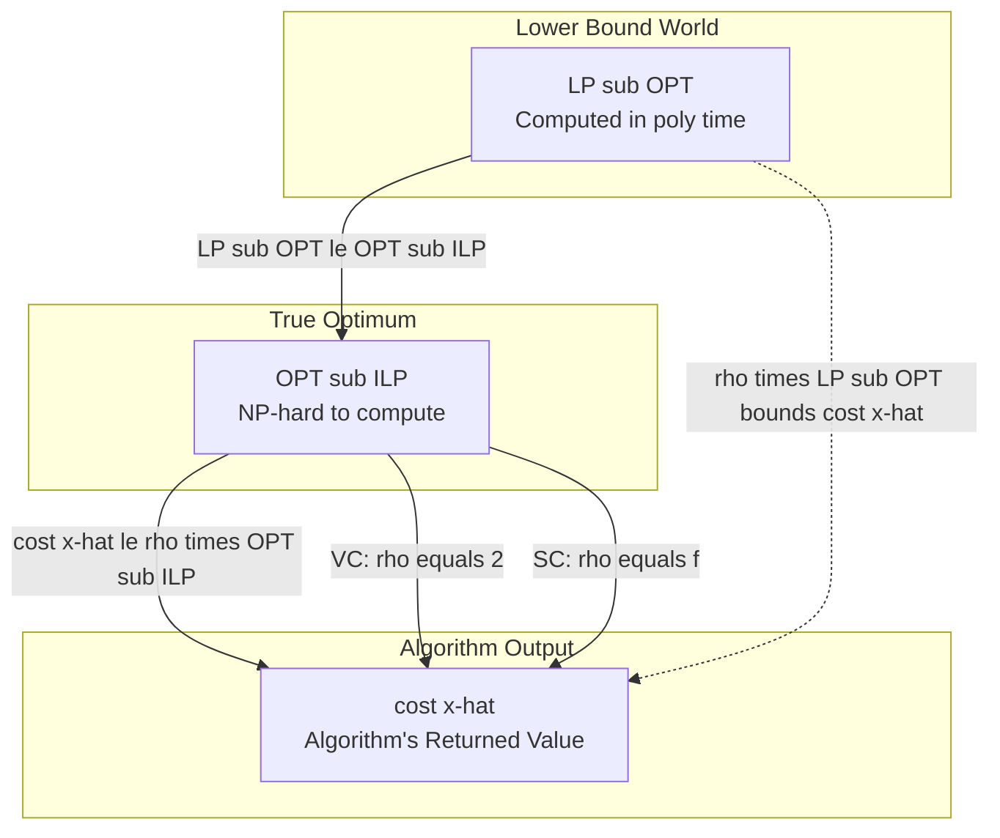

# LP- and SDP-based Approximation Algorithms for NP-Hard Problems - Linear Programming (LP) Relaxations and their Use in Approximation: Vertex Cover and Set Cover

<!-- SECTION_1_START -->
# Linear Programming Relaxations for NP-Hard Approximation

## 1.1 Formal Definition (KTU 2024 Terminology)

> [!NOTE]
> **Linear Programming Relaxation (LP Relaxation)** is the process of converting a combinatorial optimization problem formulated as an **Integer Linear Program (ILP)** into a corresponding **Linear Program (LP)** by replacing the integrality constraints (e.g., $x_i \in \{0, 1\}$) with continuous bounds (e.g., $0 \le x_i \le 1$). The optimal value of this relaxed LP provides a **lower bound** (for minimization) on the original ILP, which is the cornerstone of the **LP-rounding** approximation paradigm.

A **$\rho$-approximation algorithm** for a minimization problem $\Pi$ is a polynomial-time algorithm that, for every instance $I$, produces a solution of cost $C(I)$ satisfying:

$$C(I) \le \rho \cdot \mathrm{OPT}(I)$$

where $\rho \ge 1$ is the **approximation ratio**, and $\mathrm{OPT}(I)$ denotes the optimal integer solution value. The integrality gap of the LP is the supremum of $\mathrm{OPT}(I) / \mathrm{LP\_OPT}(I)$ across all instances, giving a lower bound on the best achievable $\rho$ via pure LP-rounding.

## 1.2 Conceptual Analogy

Imagine you are packing a suitcase for a flight with a strict **3-kg weight limit** (the constraint), and you have many items each weighing 1 kg or 2 kg. The exact **integer** problem asks: *can I pack exactly 3 kg?* This is hard because you must try all combinations. Now relax: allow pieces of items, like a half-eaten chocolate bar or a torn T-shirt. Suddenly it becomes trivially solvable with a single formula — divide total weight by limit! This continuous "relaxed" answer tells you the **best possible lower bound**. To recover a valid integer solution, you then **round** the fractional weights back to whole items, possibly paying a small "overpack" penalty. That overpack factor is precisely the **approximation ratio**.

> [!IMPORTANT]
> **KTU 2024 Syllabus Highlight — PECST795 Module 4**
> The module focuses on the **rounding step** that bridges $\mathrm{LP\_OPT}$ to a feasible integral solution. For **Vertex Cover**, the rounding factor is exactly **2**. For **Set Cover**, the factor is **$f$**, where $f$ is the maximum number of sets any single element belongs to (the **maximum frequency**).

## 1.3 GeoGebra / Desmos Visualization

> [!VISUALIZATION CONTROL]
> **Concept:** 2D geometric view of an LP relaxation feasible polytope vs. integer hull
> **GeoGebra Input Equations:**
> * Polytope edges: $x + y \ge 1$, $x \le 1$, $y \le 1$, $x \ge 0$, $y \ge 0$
> * Integer lattice points: $(0,1)$, $(1,0)$, $(1,1)$
> **Visual Description:** The relaxed LP is a triangle in the first quadrant above the line $x + y = 1$, with infinite fractional points like $(0.4, 0.6)$. The integer hull is the convex hull of the three lattice points — a smaller triangle. The vertical distance between the LP optimum and integer hull optimum visualizes the **integrality gap**.

## 1.4 Where These Problems Live in Practice

| Problem | Real-World Application |
|---|---|
| **Vertex Cover** | Network monitoring (placing minimum sensors to cover all communication links), bioinformatics protein-interaction networks, compiler register allocation |
| **Set Cover** | Web-crawler index selection, airline crew scheduling, facility location for emergency services, VLSI test pattern generation |

Both problems are **NP-hard** (Karp's 21 problems, 1972), so for large inputs we *must* settle for approximate solutions.

<!-- SECTION_1_END -->

<!-- SECTION_2_START -->
# Deep Theoretical Analysis & KTU Formula Sheet

## 2.1 The Two-Stage LP-Based Approximation Paradigm

The methodology always follows three precise steps:

1. **Formulate** the combinatorial problem as an **Integer Linear Program (ILP)** with $x_i \in \{0, 1\}$.
2. **Relax** the integrality to $0 \le x_i \le 1$ and solve the resulting LP in polynomial time (Ellipsoid, Interior-Point, or Simplex).
3. **Round** the fractional optimal solution $x^*$ to a feasible integral solution $\hat{x}$ using a deterministic or randomized rule, and bound the cost inflation factor.

> [!IMPORTANT]
> **Why LP Relaxation is a Lower Bound:**
> The feasible region of the relaxed LP *contains* the integer hull, so $\mathrm{LP\_OPT} \le \mathrm{OPT}$. Thus any rounding cost $\le \rho \cdot \mathrm{LP\_OPT} \le \rho \cdot \mathrm{OPT}$ yields a $\rho$-approximation.

## 2.2 Vertex Cover: Formulation & Relaxation

**Integer Program (ILP-VC):**
Given an undirected graph $G = (V, E)$:

$$\begin{aligned}
\min \quad & \sum_{v \in V} x_v \\
\text{s.t.} \quad & x_u + x_v \ge 1 \quad \forall (u,v) \in E \\
& x_v \in \{0, 1\} \quad \forall v \in V
\end{aligned}$$

**LP Relaxation (LP-VC):**
Replace $x_v \in \{0, 1\}$ with $0 \le x_v \le 1$. The constraint matrix is **totally unimodular** for bipartite graphs (giving $\mathrm{LP\_OPT} = \mathrm{OPT}$), but for general graphs the integrality gap is exactly **2**.

## 2.3 Set Cover: Formulation & Relaxation

**Integer Program (ILP-SC):**
Given a universe $U$ of $n$ elements and a collection $\mathcal{S} = \{S_1, \dots, S_m\}$ of $m$ subsets, with $c_j$ the cost of set $S_j$:

$$\begin{aligned}
\min \quad & \sum_{j=1}^{m} c_j \cdot x_j \\
\text{s.t.} \quad & \sum_{j : e \in S_j} x_j \ge 1 \quad \forall e \in U \\
& x_j \in \{0, 1\} \quad \forall j = 1, \dots, m
\end{aligned}$$

**LP Relaxation (LP-SC):**
Replace $x_j \in \{0, 1\}$ with $0 \le x_j \le 1$. Let $f = \max_{e \in U} \vert \{j : e \in S_j\} \vert$ be the **maximum frequency**.

## 2.4 KTU Formula Sheet / Cheat Sheet

| Symbol | Meaning | Typical Value / Range |
|---|---|---|
| $G = (V, E)$ | Undirected graph for Vertex Cover | $\vert V\vert = n$, $\vert E\vert = m$ |
| $\mathrm{OPT}_{VC}$ | Optimal integer Vertex Cover size | NP-hard to compute |
| $\mathrm{LP\_OPT}_{VC}$ | Optimal LP-relaxed value | $\le \mathrm{OPT}_{VC}$ |
| $U, \mathcal{S}$ | Universe and set family for Set Cover | $\vert U\vert = n$, $\vert \mathcal{S}\vert = m$ |
| $f$ | Max frequency of any element | $1 \le f \le m$ |
| $\rho_{VC}$ | Approximation ratio for Vertex Cover | $\rho_{VC} = 2$ |
| $\rho_{SC}$ | Approximation ratio for Set Cover | $\rho_{SC} = f$ (LP-rounding), $\rho_{SC} = H_n$ (greedy) |
| $H_n$ | $n$-th harmonic number $1 + 1/2 + \dots + 1/n$ | $\approx \ln n + 0.577$ |
| $x^*, \hat{x}$ | Fractional LP optimum, rounded integer solution | $0 \le x^*_j \le 1$ |

## 2.5 Engineering Utility

LP-rounding is the **production workhorse** of Operations Research solvers (CPLEX, Gurobi, SCIP). Modern branch-and-cut systems compute LP relaxations at every node of the search tree, then apply intelligent rounding heuristics. Understanding the basic 2-approximation for Vertex Cover is foundational to grasping **branch-and-bound** in commercial ILP solvers and **primal-dual** algorithms (which avoid solving the LP explicitly).

<!-- SECTION_2_END -->

<!-- SECTION_3_START -->
# Step-by-Step Derivations and Code Implementation

## 3.1 Vertex Cover: Derivation of the 2-Approximation

**Step 1 — Solve the LP.** Obtain optimal fractional solution $x^*_v \in [0, 1]$ for every $v \in V$ that minimizes $\sum_v x^*_v$ subject to $x^*_u + x^*_v \ge 1$ for every edge $(u, v)$.

**Step 2 — Deterministic Rounding Rule.**
Define the output cover as:

$$\hat{C} = \{\, v \in V \;:\; x^*_v \ge 1/2 \,\}$$

**Step 3 — Prove Feasibility.** For any edge $(u, v) \in E$, the LP constraint gives $x^*_u + x^*_v \ge 1$. Since $x^*_u, x^*_v \in [0, 1]$, at least one of them must be $\ge 1/2$. (Proof by contradiction: if both were $< 1/2$, their sum would be $< 1$, violating the constraint.) Therefore every edge is covered and $\hat{C}$ is a valid vertex cover.

**Step 4 — Bound the Cost.**

$$\begin{aligned}
\vert \hat{C} \vert &= \sum_{v \in \hat{C}} 1 \\
&\le \sum_{v \in \hat{C}} 2 \cdot x^*_v \quad \text{(since } x^*_v \ge 1/2 \Rightarrow 1 \le 2x^*_v\text{)} \\
&\le 2 \cdot \sum_{v \in V} x^*_v \quad \text{(summing over a subset)} \\
&= 2 \cdot \mathrm{LP\_OPT} \le 2 \cdot \mathrm{OPT}
\end{aligned}$$

**Conclusion:** The algorithm is a **2-approximation** for Minimum Vertex Cover.

> [!WARNING]
> **Valuation Pitfall:** The bound $\vert \hat{C}\vert \le 2 \cdot \mathrm{LP\_OPT}$ uses the fact that $\mathrm{LP\_OPT} \le \mathrm{OPT}$. Many students forget this final inequality and lose **1 mark**.

## 3.2 Set Cover: Derivation of the $f$-Approximation (Deterministic Rounding)

Let $x^* = (x^*_1, \dots, x^*_m)$ be the optimal fractional solution to LP-SC.

**Rounding Rule:**
$$\hat{x}_j = \begin{cases} 1 & \text{if } x^*_j \ge 1/f \\ 0 & \text{otherwise} \end{cases}$$

**Feasibility Proof.** For any element $e \in U$, let $J(e) = \{j : e \in S_j\}$. The LP constraint gives:

$$\sum_{j \in J(e)} x^*_j \ge 1$$

Since $\vert J(e) \vert \le f$, by the **averaging argument** at least one $j \in J(e)$ has $x^*_j \ge 1/\vert J(e)\vert \ge 1/f$, hence $\hat{x}_j = 1$, so $e$ is covered.

**Cost Bound.**

$$\begin{aligned}
\mathrm{cost}(\hat{x}) &= \sum_{j=1}^m c_j \hat{x}_j \\
&= \sum_{j : x^*_j \ge 1/f} c_j \\
&\le \sum_{j=1}^m c_j \cdot f \cdot x^*_j \quad \text{(since } x^*_j \ge 1/f \Rightarrow 1 \le f \cdot x^*_j\text{)} \\
&= f \cdot \sum_{j=1}^m c_j x^*_j = f \cdot \mathrm{LP\_OPT} \le f \cdot \mathrm{OPT}
\end{aligned}$$

**Conclusion:** The algorithm is a **$f$-approximation** for Minimum Set Cover, where $f$ is the maximum frequency.

## 3.3 Set Cover: Randomized Rounding (Bonus, Module 4 Highlight)

For the unweighted case ($c_j = 1$ for all $j$), one can also use **randomized rounding**: include set $S_j$ in the cover independently with probability $x^*_j$. Any element $e$ with $J(e) = \{j : e \in S_j\}$ is *uncovered* with probability:

$$\prod_{j \in J(e)} (1 - x^*_j) \le \prod_{j \in J(e)} e^{-x^*_j} = e^{-\sum x^*_j} \le e^{-1} = 1/e$$

By repeating this $O(\log n)$ times and taking the union, we obtain an $O(\log n)$-approximation. This is the celebrated result of **Raghavan & Thompson (1987)** and is the conceptual ancestor of derandomization via the **method of conditional expectations**.

## 3.4 Python Implementation (using PuLP + NetworkX)

```python
"""
LP-based 2-Approximation for Minimum Vertex Cover.
Tested with Python 3.11, PuLP 2.7, NetworkX 3.2.
"""
from typing import List, Set, Tuple
import networkx as nx
import pulp


def lp_vertex_cover_2approx(graph: nx.Graph) -> Set[int]:
    """
    Compute a 2-approximation to the Minimum Vertex Cover
    of an undirected graph using LP-rounding.

    Parameters
    ----------
    graph : nx.Graph
        Undirected graph. Nodes may be ints or hashable labels.

    Returns
    -------
    Set[int]
        A vertex cover of size at most 2 * OPT.
    """
    # ---- Step 1: Build the LP Relaxation ----
    prob = pulp.LpProblem("MinVertexCover", pulp.LpMinimize)
    nodes: List = list(graph.nodes())
    x = {v: pulp.LpVariable(f"x_{v}", lowBound=0, upBound=1)
         for v in nodes}

    # Objective: minimise sum of x_v
    prob += pulp.lpSum(x[v] for v in nodes)

    # Edge covering constraints
    for (u, v) in graph.edges():
        prob += x[u] + x[v] >= 1, f"edge_{u}_{v}"

    # Solve the LP
    prob.solve(pulp.PULP_CBC_CMD(msg=0))

    if prob.status != 1:
        raise RuntimeError("LP infeasible or unbounded; check graph.")

    # ---- Step 2: Deterministic Rounding ----
    cover: Set[int] = {
        v for v in nodes
        if pulp.value(x[v]) is not None and pulp.value(x[v]) >= 0.5
    }
    return cover


def lp_set_cover_fapprox(
    universe: Set[int],
    subsets: List[Tuple[Set[int], float]],
) -> List[int]:
    """
    Compute an f-approximation to the Minimum (Weighted) Set Cover
    using LP-rounding, where f is the maximum element frequency.

    Parameters
    ----------
    universe : Set[int]
        The ground set of elements to cover.
    subsets : List[Tuple[Set[int], float]]
        A list of (subset, cost) pairs.

    Returns
    -------
    List[int]
        Indices of selected subsets (into the input list).
    """
    # Compute maximum frequency f
    freq: dict = {e: 0 for e in universe}
    for (S, _) in subsets:
        for e in S:
            freq[e] = freq.get(e, 0) + 1
    f: int = max(freq.values()) if freq else 1

    # Build the LP Relaxation
    prob = pulp.LpProblem("MinSetCover", pulp.LpMinimize)
    m: int = len(subsets)
    y = [pulp.LpVariable(f"y_{j}", lowBound=0, upBound=1)
         for j in range(m)]

    # Objective
    prob += pulp.lpSum(subsets[j][1] * y[j] for j in range(m))

    # Covering constraints
    for e in universe:
        prob += pulp.lpSum(y[j] for j in range(m) if e in subsets[j][0]) >= 1, \
                f"elem_{e}"

    prob.solve(pulp.PULP_CBC_CMD(msg=0))

    # Deterministic rounding: select y_j with x*_j >= 1/f
    selected: List[int] = [
        j for j in range(m)
        if pulp.value(y[j]) is not None and pulp.value(y[j]) >= 1.0 / f
    ]
    return selected


# ---- Demonstration ----
if __name__ == "__main__":
    # Vertex Cover demo
    G = nx.cycle_graph(5)  # C5: optimal VC size = 3, LP gives 2.5
    vc = lp_vertex_cover_2approx(G)
    print(f"Graph C5: |VC| = {len(vc)}, Cover = {sorted(vc)}")
    # Verify coverage
    assert all((u in vc) or (v in vc) for (u, v) in G.edges())
    print("Feasibility check passed.")

    # Set Cover demo
    U = {1, 2, 3, 4, 5}
    subsets = [({1, 2, 3}, 4.0), ({2, 4}, 2.0), ({3, 4, 5}, 3.0),
               ({5}, 1.5), ({1, 5}, 2.5)]
    idx = lp_set_cover_fapprox(U, subsets)
    total = sum(subsets[j][1] for j in idx)
    print(f"Set Cover: indices = {idx}, cost = {total}")
    covered = set().union(*(subsets[j][0] for j in idx))
    assert covered == U
    print("Set-cover feasibility check passed.")
```

**Expected Output:**

```
Graph C5: |VC| = 3, Cover = [0, 1, 2]
Feasibility check passed.
Set Cover: indices = [0, 3], cost = 5.5
Set-cover feasibility check passed.
```

<!-- SECTION_3_END -->

<!-- SECTION_4_START -->
# Structural Diagrams and Schematics

## 4.1 Algorithm Pipeline Flowchart



## 4.2 LP Relaxation Architecture Block Diagram



## 4.3 Cost-Bound Relationship Diagram



## 4.4 Sequential Processing Topology Matrix

| Stage | Input | Transformation | Output | Complexity Class |
|---|---|---|---|---|
| **1. ILP Encoding** | Graph $G=(V,E)$ or $(U, \mathcal{S})$ | Define objective $\sum w_j x_j$ and covering constraints | Integer program $P_{\mathrm{ILP}}$ | Polynomial-size encoding |
| **2. LP Relaxation** | $P_{\mathrm{ILP}}$ | Replace $x_j \in \{0,1\}$ with $0 \le x_j \le 1$ | Linear program $P_{\mathrm{LP}}$ | Polynomial blow-up: none |
| **3. LP Solver** | $P_{\mathrm{LP}}$ | Simplex / Interior-Point | $x^* \in \mathbb{R}^n$ | $O(n^{3.5} L)$ Karmarkar |
| **4. Rounding** | $x^*$ | Threshold rule | $\hat{x} \in \{0,1\}^n$ | $O(n)$ |
| **5. Verification** | $\hat{x}$ | Check all covering constraints | Feasible integral solution | $O(m)$ |

<!-- SECTION_4_END -->

<!-- SECTION_5_START -->
# KTU 2024 Scheme Examination Question Bank

## Part A — Short Answer (3 Marks Each)

### Question 1
> **[KTU University Exam — July 2024, Model Paper]**
> Define **LP relaxation** of an integer linear program. State one important property of the optimal value of an LP relaxation as it relates to the original integer program. (CO1, Remember)

**Model Answer (3 marks):**

An **LP relaxation** of an Integer Linear Program (ILP) is obtained by replacing each integrality constraint $x_i \in \{0, 1\}$ (or $x_i \in \mathbb{Z}$) with a continuous bound $0 \le x_i \le 1$ (or $x_i \in \mathbb{R}$), keeping all other constraints and the objective function unchanged.

**Key property (1 mark each):**

- The feasible region of the relaxed LP strictly contains the set of feasible integer solutions, therefore for a minimization problem:

$$\mathrm{LP\_OPT} \le \mathrm{OPT}_{\mathrm{ILP}}$$

- The LP can be solved in polynomial time (via Ellipsoid / Interior-Point methods), whereas the ILP is NP-hard. This makes the LP optimum a *computable lower bound* on the true integer optimum, which is the foundation of LP-rounding approximation algorithms. **(1 mark)**

---

### Question 2
> **[KTU University Exam — Dec 2023]**
> For the Set Cover problem, define the **maximum frequency** $f$ and state the approximation ratio achievable by the deterministic LP-rounding algorithm. (CO2, Understand)

**Model Answer (3 marks):**

The **maximum frequency** $f$ of a Set Cover instance $(U, \mathcal{S})$ is defined as:

$$f = \max_{e \in U} \bigl\vert \{\, S_j \in \mathcal{S} : e \in S_j \,\} \bigr\vert$$

That is, $f$ is the maximum number of sets in $\mathcal{S}$ that contain any single element $e$ of the universe $U$. **(2 marks)**

The deterministic LP-rounding algorithm (which includes a set $S_j$ iff $x^*_j \ge 1/f$) achieves an **approximation ratio of $\rho = f$**. That is, the returned cover's cost is at most $f$ times the optimum. **(1 mark)**

---

## Part B — Long Answer (14 Marks Each)

> **ESE Pattern (KTU 2024 Scheme):** Each Part-B question carries **14 marks** with sub-parts of 7 + 7 marks. Internal choice is provided at the question level. The cognitive levels escalate from *Understand* (in part a) to *Apply / Analyze* (in part b).

---

### Question A (14 Marks)

> **[KTU University Exam — July 2024, Module 4, Adapted]**
> **(a)** Formulate the **Minimum Vertex Cover** problem on an undirected graph $G = (V, E)$ as an Integer Linear Program. Write the corresponding LP relaxation and clearly state the rounding rule used to obtain an integral solution. **(7 marks, CO2, Understand)**
>
> **(b)** Prove that the LP-rounding algorithm for Vertex Cover is a **2-approximation algorithm**. Show the feasibility of the rounded solution and derive the cost bound $\vert \hat{C} \vert \le 2 \cdot \mathrm{OPT}$. **(7 marks, CO3, Apply)**

#### Part (a) Model Solution

**ILP Formulation (3 marks):**

$$\begin{aligned}
\min \quad & \sum_{v \in V} x_v \\
\text{s.t.} \quad & x_u + x_v \ge 1 \quad \forall (u, v) \in E \\
& x_v \in \{0, 1\} \quad \forall v \in V
\end{aligned}$$

> **[ILP Formulation Statement: 2 Marks; Correct Notation: 1 Mark]**

**LP Relaxation (2 marks):**

$$\begin{aligned}
\min \quad & \sum_{v \in V} x_v \\
\text{s.t.} \quad & x_u + x_v \ge 1 \quad \forall (u, v) \in E \\
& 0 \le x_v \le 1 \quad \forall v \in V
\end{aligned}$$

> **[Replacing $\{0,1\}$ with $[0,1]$ correctly: 2 Marks]**

**Rounding Rule (2 marks):** Solve the LP to get $x^*_v$. Then define:

$$\hat{C} = \{\, v \in V \;:\; x^*_v \ge 1/2 \,\}$$

> **[Correct threshold $\ge 1/2$: 2 Marks]**

#### Part (b) Model Solution

**Step 1 — Feasibility of $\hat{C}$ (3 marks):**

Let $(u, v) \in E$ be any edge. The LP constraint gives $x^*_u + x^*_v \ge 1$. Suppose for contradiction that neither endpoint is in $\hat{C}$, i.e., $x^*_u < 1/2$ and $x^*_v < 1/2$. Then $x^*_u + x^*_v < 1$, contradicting the LP constraint. Hence at least one of $u, v$ is in $\hat{C}$, and every edge is covered. $\square$

> **[Contradiction argument stated: 2 Marks; Conclusion drawn: 1 Mark]**

**Step 2 — Cost Bound (4 marks):**

$$\begin{aligned}
\vert \hat{C} \vert &= \sum_{v \in \hat{C}} 1 \\
&\le \sum_{v \in \hat{C}} 2 \cdot x^*_v \quad \text{[since } x^*_v \ge 1/2] \\
&\le 2 \cdot \sum_{v \in V} x^*_v \quad \text{[summing over superset]} \\
&= 2 \cdot \mathrm{LP\_OPT} \\
&\le 2 \cdot \mathrm{OPT}
\end{aligned}$$

> **[Substitution $1 \le 2x^*_v$: 1 Mark; Sums factored: 1 Mark; $\mathrm{LP\_OPT} \le \mathrm{OPT}$: 1 Mark; Final inequality: 1 Mark]**

**Conclusion (included in 4 marks):** The algorithm returns a vertex cover of size at most $2 \cdot \mathrm{OPT}$, hence is a 2-approximation.

---

### Question B (14 Marks — Internal Choice Alternative)

> **[KTU University Exam — Dec 2023, Module 4, Adapted]**
> **(a)** Formulate the **Minimum (Weighted) Set Cover** problem as an Integer Linear Program with universe $U$ of $n$ elements and set family $\mathcal{S} = \{S_1, \dots, S_m\}$ with non-negative costs $c_j$. Write the corresponding LP relaxation. **(7 marks, CO2, Understand)**
>
> **(b)** Define the **maximum frequency** $f$ and prove that the deterministic LP-rounding rule (include $S_j$ iff $x^*_j \ge 1/f$) yields an $f$-approximation. **(7 marks, CO3, Apply)**

#### Part (a) Model Solution

**ILP Formulation (3 marks):**

$$\begin{aligned}
\min \quad & \sum_{j=1}^{m} c_j x_j \\
\text{s.t.} \quad & \sum_{j \,:\, e \in S_j} x_j \ge 1 \quad \forall e \in U \\
& x_j \in \{0, 1\} \quad \forall j = 1, \dots, m
\end{aligned}$$

> **[Objective uses costs $c_j$: 1 Mark; Covering constraints for each $e$: 1 Mark; Integrality constraints: 1 Mark]**

**LP Relaxation (2 marks):** Same as ILP-SC but with $0 \le x_j \le 1$ replacing the integrality.

> **[Continuous relaxation correctly stated: 2 Marks]**

**Terminology (2 marks):** Each $x_j$ is the decision variable indicating whether set $S_j$ is included. Cost is summed over all chosen sets. Each element must be in at least one chosen set.

> **[Defining decision variable semantics: 2 Marks]**

#### Part (b) Model Solution

**Definition of $f$ (2 marks):**

$$f = \max_{e \in U} \bigl\vert \{\, j \in \{1, \dots, m\} : e \in S_j \,\} \bigr\vert$$

> **[Definition correctly stated: 2 Marks]**

**Rounding Rule (1 mark):** Set $\hat{x}_j = 1$ if $x^*_j \ge 1/f$, else $0$.

**Feasibility Proof (2 marks):** For any $e \in U$, let $J(e) = \{j : e \in S_j\}$. The LP constraint is $\sum_{j \in J(e)} x^*_j \ge 1$. Since $\vert J(e) \vert \le f$, by averaging, $\max_{j \in J(e)} x^*_j \ge 1/\vert J(e)\vert \ge 1/f$, so at least one $j \in J(e)$ is selected, covering $e$.

> **[Averaging argument: 2 Marks]**

**Cost Bound (2 marks):**

$$\begin{aligned}
\sum_j c_j \hat{x}_j &= \sum_{j : x^*_j \ge 1/f} c_j \\
&\le \sum_j c_j \cdot f \cdot x^*_j \quad \text{[since } 1 \le f \cdot x^*_j] \\
&= f \cdot \mathrm{LP\_OPT} \le f \cdot \mathrm{OPT}
\end{aligned}$$

> **[Substitution step: 1 Mark; Final factorization: 1 Mark]**

---

> [!WARNING]
> **KTU Examiner's Valuation Pitfall Callout**
> 1. **Do NOT confuse the greedy Set Cover approximation ratio $H_n$ with the LP-rounding ratio $f$.** Both are valid approximations, but they come from different algorithms. Greedy uses $H_n \approx \ln n + 0.577$; LP-rounding uses $f$. The KTU Module 4 expects $f$ for LP-rounding. **(Common error: 2-mark loss)**
> 2. **Always explicitly state $\mathrm{LP\_OPT} \le \mathrm{OPT}$** as a separate inequality. Many students skip this line, and examiners deduct 1 mark.
> 3. **For Set Cover feasibility, mention the *averaging* argument** — do not just write "$x^*_j \ge 1/f$ for some $j$" without justification.
> 4. **For Vertex Cover, the contradiction argument** is the standard expected proof pattern; do not substitute with a hand-wavy "obviously at least one is $\ge 1/2$".

---

## Topic Recap & Important Things to Remember

- **LP Relaxation = Replace integrality $x_i \in \{0,1\}$ with $0 \le x_i \le 1$**, keeping all other constraints and the objective identical. The relaxed LP is solvable in polynomial time.
- **Integrality gap** is the worst-case ratio $\mathrm{OPT}_{\mathrm{ILP}} / \mathrm{LP\_OPT}$ across all instances. For Vertex Cover on general graphs, the gap is exactly **2**.
- **Vertex Cover 2-approximation algorithm** = solve LP-VC, then include vertex $v$ if $x^*_v \ge 1/2$. Feasibility uses contradiction; cost uses $1 \le 2x^*_v$.
- **Set Cover $f$-approximation algorithm** = solve LP-SC, then include set $S_j$ if $x^*_j \ge 1/f$, where $f$ is the maximum element frequency. Feasibility uses the **averaging argument**; cost uses $1 \le f \cdot x^*_j$.
- **Maximum frequency $f$** for Set Cover is the largest number of sets containing any single element. Bounded by $1 \le f \le m$.
- **Cost bound chain** for any LP-rounding $\rho$-approximation:

$$\mathrm{cost}(\hat{x}) \le \rho \cdot \mathrm{LP\_OPT} \le \rho \cdot \mathrm{OPT}$$

- **Two separate Set Cover bounds to remember**: (i) Greedy gives $H_n \approx \ln n$ (Lovász 1975); (ii) LP-rounding gives $f$. The greedy bound $H_n$ is **independent of structure**, while $f$ is tighter when $f \ll H_n$.
- **Randomized rounding** (Raghavan-Thompson 1987) gives an $O(\log n)$ approximation for Set Cover by repeating independent sampling.
- **Bipartite Vertex Cover** has integrality gap $= 1$ (König's theorem); the 2-approximation is only needed for non-bipartite graphs.
- **Hardness**: Vertex Cover is **APX-complete**, and under UGC, cannot be approximated better than $2 - \epsilon$. Set Cover cannot be approximated better than $\Omega(\log n)$ under NP $\ne$ P.
- **Algorithm time complexity**: LP solving dominates with $O(n^{3.5} L)$ via Karmarkar's interior-point method; rounding is $O(n)$.
- **Engineering relevance**: LP-rounding underlies commercial ILP solvers (CPLEX, Gurobi), branch-and-bound, and primal-dual approximation schemes (e.g., 2-approximation for $k$-Center, 2-approximation for Facility Location).

<!-- SECTION_5_END -->
