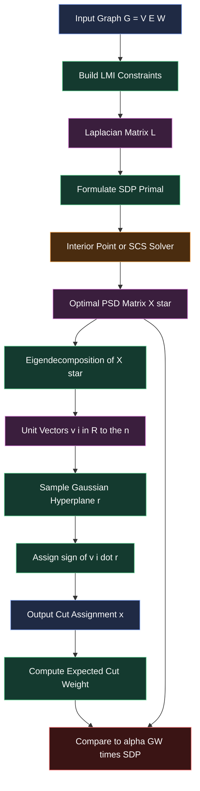
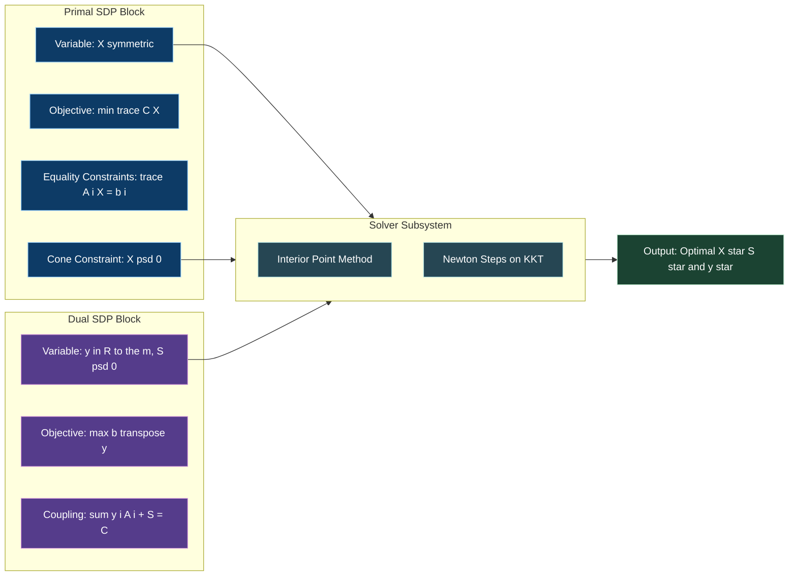
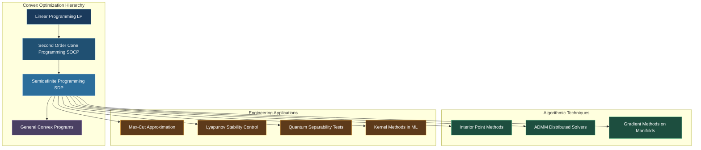

# Semidefinite Programming (SDP) and its Applications: Max-Cut Problem.

<!-- SECTION_1_START -->

# Semidefinite Programming (SDP) and the Max-Cut Problem

## 1.1 Formal Definition (KTU 2024 Scheme Terminology)

> [!IMPORTANT]
> **Semidefinite Programming (SDP)** is a subfield of **convex optimization** concerned with the optimization of a **linear objective function** over the intersection of the **affine space** with the **cone of positive semidefinite matrices**. It is the natural matrix generalization of Linear Programming (LP).

The **Primal Standard Form** of an SDP is:

$$\begin{aligned}
\text{minimize} \quad & \langle C, X \rangle \\
\text{subject to} \quad & \langle A_i, X \rangle = b_i, \quad i = 1, 2, \dots, m \\
& X \succeq 0
\end{aligned}$$

where:
- $X \in \mathbb{S}^{n}$ is a symmetric $n \times n$ decision matrix (the primal variable).
- $C, A_i \in \mathbb{S}^{n}$ are given symmetric data matrices.
- $b \in \mathbb{R}^{m}$ is the right-hand side vector.
- $\langle A, B \rangle = \text{trace}(A^T B) = \sum_{i,j} A_{ij} B_{ij}$ is the **Frobenius inner product**.
- $X \succeq 0$ denotes the **Linear Matrix Inequality (LMI)** constraint: $X$ is **positive semidefinite** (all eigenvalues $\lambda_i \geq 0$).

The corresponding **Dual Standard Form** is:

$$\begin{aligned}
\text{maximize} \quad & b^T y \\
\text{subject to} \quad & \sum_{i=1}^{m} y_i A_i + S = C \\
& S \succeq 0
\end{aligned}$$

where $y \in \mathbb{R}^{m}$ and $S \in \mathbb{S}^{n}$ is a slack matrix.

### Definition of the Max-Cut Problem

> [!NOTE]
> **Max-Cut** is a classical **combinatorial optimization** problem: given an undirected graph $G = (V, E)$ with edge weights $w_{ij} \geq 0$, find a partition of the vertex set into two disjoint sets $S$ and $V \setminus S$ such that the total weight of edges crossing the partition is **maximized**.

Formally, for a labeling $x_i \in \{-1, +1\}$ indicating which side of the cut vertex $i$ belongs to:

$$\text{Max-Cut}(G) = \max_{x \in \{-1,+1\}^{n}} \frac{1}{2} \sum_{(i,j) \in E} w_{ij} (1 - x_i x_j)$$

The factor $\frac{1}{2}$ avoids double counting.

## 1.2 Conceptual Analogy / Geometric Intuition

Imagine a social network where every person is a **point on a giant sphere** in high-dimensional space. The **Max-Cut problem** asks: *"Draw the single straightest line (a hyperplane) through the origin that splits the most friendships apart."* Each friendship is a vector between two points, and an edge is "cut" when its two endpoints land on **opposite hemispheres**.

**Semidefinite Programming (SDP)** generalizes the idea of Linear Programming from 1-D variables to a **flexible rubber sheet matrix**:
- In LP, variables are scalars constrained to a polyhedron.
- In SDP, the variable is a **symmetric matrix** constrained to lie inside a **spectrahedron** (the convex set defined by $X \succeq 0$ and affine equality constraints).
- The rubber sheet can stretch, rotate, and reshape — but it can never fold into negative curvature (because of the $\succeq 0$ condition).

> [!TIP]
> **Mental Hook:** LP optimizes over the polyhedral cone $\mathbb{R}^n_{\geq 0}$. SDP optimizes over the **spectrahedral cone** $\mathbb{S}^{n}_{\geq 0}$ — a strictly richer, non-polyhedral convex cone.

## 1.3 The Connection: Why SDP for Max-Cut?

Max-Cut is **NP-hard**. However, if we **lift** the discrete $\{-1, +1\}$ problem into a continuous matrix problem and impose $X \succeq 0$, we obtain a **convex relaxation** that is solvable in polynomial time. The Goemans-Williamson (1995) algorithm uses this relaxation to obtain a $\approx 0.878$-approximation — a celebrated result in theoretical computer science.

| Symbol | Meaning | Typical Magnitude |
|---|---|---|
| $n = \vert V \vert$ | Number of vertices | $10$–$10^3$ |
| $\vert E \vert$ | Number of edges | $O(n^2)$ |
| $\alpha_{GW}$ | GW approximation ratio | $\approx 0.878$ |
| $n(n+1)/2$ | Free variables in symmetric $X$ | $O(n^2)$ |

> [!VISUALIZATION CONTROL]
> **Concept:** Geometry of the Goemans-Williamson Rounding on the Unit Sphere
> **GeoGebra / Desmos Input Equations:**
> * $v_1 = (1, 0, 0)$ (point on sphere)
> * $v_2 = (-0.6, 0.8, 0)$ (point on sphere)
> * $h: y = 0$ (separating hyperplane through origin)
> **Visual Description:** Two unit vectors $v_1$ and $v_2$ sit on the unit sphere $S^2$. A random hyperplane $h$ (a 2-D plane in 3-D) drawn uniformly at random through the origin separates them. The probability they fall on opposite sides equals $\arccos(v_1 \cdot v_2) / \pi$ — this is the cornerstone identity that drives the 0.878 ratio.

<!-- SECTION_1_END -->

<!-- SECTION_2_START -->

# Deep Theoretical Analysis & KTU High-Yield Formula Sheet

## 2.1 Anatomy of an SDP — The Three Pillars

An SDP is built from three structural ingredients. Mastering these is the key to solving any KTU question on SDP.

### Pillar 1: The Conic Structure
The set of all $n \times n$ **positive semidefinite matrices** is a **closed convex cone** denoted $\mathbb{S}^{n}_{+}$. The boundary of this cone consists of all positive **semidefinite** (not strictly definite) matrices — those with at least one zero eigenvalue.

### Pillar 2: Linear Matrix Inequalities (LMI)
Any affine function $F(x) = F_0 + \sum_{i=1}^{m} x_i F_i$ taking values in symmetric matrices gives an LMI constraint $F(x) \succeq 0$. This is a direct, block-matrix generalization of a linear inequality $a^T x \leq b$ from LP.

### Pillar 3: Duality
SDP enjoys **strong duality** (under mild constraint qualifications such as Slater's condition). The dual variables are themselves matrices: a *dual feasible* $(y, S)$ certifies a *lower bound* on the primal optimum.

> [!IMPORTANT]
> **KTU High-Yield Fact:** If both primal and dual are strictly feasible (interior points exist), then $p^* = d^*$ and $\text{trace}(X^* S^*) = 0$ (complementary slackness). This is the **KKT condition** for SDPs.

## 2.2 From Max-Cut (Integer) to SDP (Continuous) — The Relaxation

The Max-Cut problem with edge weights $w_{ij}$ is equivalent to:

$$\begin{aligned}
\text{maximize} \quad & \frac{1}{2} \sum_{(i,j) \in E} w_{ij} (1 - X_{ij}) \\
\text{subject to} \quad & X_{ii} = 1, \quad i = 1, \dots, n \\
& X \in \{-1, +1\}^{n \times n}
\end{aligned}$$

**Why?** When $X = x x^T$ for some vector $x \in \{-1, +1\}^n$, we have $X_{ij} = x_i x_j \in \{-1, +1\}$ and $X_{ii} = x_i^2 = 1$. So $\frac{1}{2}(1 - X_{ij}) = 1$ if $x_i \neq x_j$ (edge cut) and $0$ otherwise.

**The Relaxation:** Drop the rank-1, integer condition and require only $X \succeq 0$:

$$\begin{aligned}
\text{maximize} \quad & \frac{1}{2} \sum_{(i,j) \in E} w_{ij} (1 - X_{ij}) \\
\text{subject to} \quad & X_{ii} = 1, \quad i = 1, \dots, n \\
& X \succeq 0
\end{aligned}$$

This is a **convex** problem — solvable in polynomial time using interior-point methods.

## 2.3 The Goemans-Williamson Rounding

Given an optimal SDP solution $X^*$, perform a **Cholesky decomposition** $X^* = V^T V$ where columns of $V$ are vectors $v_1, \dots, v_n \in \mathbb{R}^n$ (lying on the unit sphere because $X^*_{ii} = 1$).

1. **Sample** a random hyperplane $r \sim \mathcal{N}(0, I_n / n)$ (a Gaussian random vector).
2. **Assign** $x_i = \text{sign}(v_i \cdot r)$.
3. **Output** the resulting cut $S = \{i : x_i = +1\}$.

The key probabilistic identity:

$$\Pr[\text{sign}(v_i \cdot r) \neq \text{sign}(v_j \cdot r)] = \frac{\arccos(v_i \cdot v_j)}{\pi} = \frac{\arccos(X^*_{ij})}{\pi}$$

Combined with the inequality $\arccos(t) / \pi \geq \alpha_{GW} \cdot \frac{1-t}{2}$ for $t \in [-1, 1]$, where:

$$\alpha_{GW} = \min_{t \in [-1, 1]} \frac{\arccos(t) / \pi}{(1-t)/2} \approx 0.87856$$

This yields the **Goemans-Williamson Theorem**:

> [!NOTE]
> **Theorem (Goemans-Williamson 1995):** The expected weight of the cut produced by randomized hyperplane rounding is at least $\alpha_{GW} \approx 0.878$ times the SDP optimum, which is itself an upper bound on the true Max-Cut value. Thus Max-Cut can be approximated within factor $\approx 0.878$ in polynomial time.

## 2.4 KTU Formula Cheat Sheet

| Formula / Concept | Expression | Key Property / Unit |
|---|---|---|
| SDP Primal | $\min \langle C, X \rangle$ s.t. $\langle A_i, X \rangle = b_i$, $X \succeq 0$ | $X \in \mathbb{S}^{n}$ |
| SDP Dual | $\max b^T y$ s.t. $\sum_i y_i A_i + S = C$, $S \succeq 0$ | $y \in \mathbb{R}^{m}$, $S \in \mathbb{S}^{n}$ |
| Frobenius Inner Product | $\langle A, B \rangle = \text{trace}(A B) = \sum_{i,j} A_{ij} B_{ij}$ | Scalar |
| Positive Semidefinite | $X \succeq 0 \iff \forall v, \; v^T X v \geq 0$ | All $\lambda_i \geq 0$ |
| LMI Constraint | $F(x) = F_0 + \sum_i x_i F_i \succeq 0$ | Affine in $x$ |
| Max-Cut Objective (IP) | $\frac{1}{2} \sum_{(i,j) \in E} w_{ij}(1 - x_i x_j)$ | $x_i \in \{-1, +1\}$ |
| Max-Cut SDP Objective | $\frac{1}{2} \sum_{(i,j) \in E} w_{ij}(1 - X_{ij})$ | $X \succeq 0$, $X_{ii} = 1$ |
| Cholesky Factorization | $X^* = V^T V$ with $v_i \in \mathbb{R}^{n}$ on unit sphere | $V \in \mathbb{R}^{n \times n}$ |
| GW Probability of Cut | $\Pr[(i,j) \text{ cut}] = \frac{\arccos(X^*_{ij})}{\pi}$ | Exact identity |
| GW Approximation Ratio | $\alpha_{GW} = \min_{t \in [-1,1]} \frac{\arccos(t) / \pi}{(1-t)/2}$ | $\approx 0.87856$ |
| GW Cut Expectation | $\mathbb{E}[W(\text{cut})] \geq \alpha_{GW} \cdot \text{SDP}_{\text{opt}}$ | Polynomial time |
| Optimality Gap | $\text{SDP}_{\text{opt}} \geq \text{Max-Cut}_{\text{opt}}$ | Relaxation bound |
| Number of Variables | $n(n+1)/2$ free entries in symmetric $X$ | $O(n^2)$ |
| Interior-Point Complexity | $O(n^{6.5} \cdot \text{polylog})$ per Newton step | Polynomial |

## 2.5 Real-World Utility in Engineering

SDP and the Max-Cut SDP are not mere theoretical curiosities — they power production systems:

- **VLSI Circuit Design:** Partitioning millions of logic gates into two balanced sub-circuits to minimize cross-chip wire crossings (Max-Cut).
- **Statistical Machine Learning:** Kernel PCA, sensor network localization, and the MAX-2-SAT approximation all use SDP.
- **Quantum Information Theory:** Separability testing of quantum states is reducible to SDP feasibility.
- **Control Theory:** Lyapunov stability analysis uses SDP to certify that a controller stabilizes a system.
- **Combinatorial Auctions & Revenue Maximization:** WiFi spectrum and ad-auction allocation problems are formulated as SDPs.

<!-- SECTION_2_END -->

<!-- SECTION_3_START -->

# Step-by-Step Derivations & Code/Symbolic Implementation

## 3.1 Full Derivation: From Integer Program to SDP Relaxation

**Step 1: Original Integer Program.**
Given $G = (V, E)$ with weights $w_{ij} \geq 0$, encode the partition as $x_i \in \{-1, +1\}$.

$$\text{Max-Cut} = \max_{x \in \{-1,+1\}^{n}} \frac{1}{2} \sum_{(i,j) \in E} w_{ij} (1 - x_i x_j)$$

*Logic:* $x_i x_j = -1$ when $i$ and $j$ are on opposite sides, so $(1 - x_i x_j)/2 = 1$ counts cut edges; otherwise it equals $0$.

**Step 2: Lift to Matrix Form.**
Define the rank-1 matrix $X = x x^T$. Then $X_{ij} = x_i x_j$ and $X_{ii} = x_i^2 = 1$.

$$\text{Max-Cut} = \max_{X} \frac{1}{2} \sum_{(i,j) \in E} w_{ij} (1 - X_{ij})$$

subject to:
- $X_{ii} = 1$ for all $i = 1, \dots, n$ (diagonal constraints),
- $X = x x^T$ for some $x \in \{-1, +1\}^n$ (rank-1, integer constraints).

**Step 3: Relax the Hard Constraints.**
The set $\{X = x x^T : x \in \{-1, +1\}^n\}$ is a **finite, non-convex** set — the source of NP-hardness. Replace it with its **convex hull** restricted to the $X_{ii} = 1$ hyperplane intersected with the positive semidefinite cone:

$$\text{SDP}_{\text{Max-Cut}} = \max \frac{1}{2} \sum_{(i,j) \in E} w_{ij} (1 - X_{ij})$$

subject to $X_{ii} = 1$, $X \succeq 0$.

*Why is this valid?* Every integer solution is feasible for the SDP (since $x x^T \succeq 0$ and has unit diagonal), so $\text{SDP}_{\text{opt}} \geq \text{Max-Cut}_{\text{opt}}$.

**Step 4: Recover a Cut via Cholesky + Random Hyperplane.**
Let $X^* = V^T V$ be the Cholesky factorization. Sample $r \sim \mathcal{N}(0, I_n)$ and assign:

$$x_i = \text{sign}(v_i \cdot r) = \begin{cases} +1 & \text{if } v_i \cdot r \geq 0 \\ -1 & \text{if } v_i \cdot r < 0 \end{cases}$$

**Step 5: Compute the Cut Expectation.**
For each edge $(i,j)$:

$$\begin{aligned}
\Pr[(i,j) \text{ is cut}] &= \Pr[\text{sign}(v_i \cdot r) \neq \text{sign}(v_j \cdot r)] \\
&= \frac{\theta_{ij}}{\pi} \quad \text{where } \cos(\theta_{ij}) = v_i \cdot v_j = X^*_{ij}
\end{aligned}$$

This is a classical result for random hyperplanes through the origin in $\mathbb{R}^{n}$: the probability two unit vectors are separated equals the angle between them divided by $\pi$.

**Step 6: Compute the GW Ratio.**

$$\begin{aligned}
\mathbb{E}[W(\text{cut})] &= \sum_{(i,j) \in E} w_{ij} \cdot \frac{\arccos(X^*_{ij})}{\pi} \\
&\geq \alpha_{GW} \sum_{(i,j) \in E} w_{ij} \cdot \frac{1 - X^*_{ij}}{2} \quad \text{(using inequality on } \arccos) \\
&= \alpha_{GW} \cdot \text{SDP}_{\text{opt}} \quad \text{(by definition of SDP objective)} \\
&\geq \alpha_{GW} \cdot \text{Max-Cut}_{\text{opt}}
\end{aligned}$$

Therefore Max-Cut is **approximable** within factor $\alpha_{GW} \approx 0.878$ in polynomial time. $\blacksquare$

## 3.2 Closed-Form Derivation of $\alpha_{GW}$

Define $g(t) = \dfrac{\arccos(t) / \pi}{(1-t)/2}$ for $t \in [-1, 1]$. We need the global minimum.

Compute the derivative. Let $u = (1-t)/2$ and $v = \arccos(t) / \pi$. Then $du/dt = -1/2$ and $dv/dt = -1 / (\pi \sqrt{1-t^2})$.

$$\begin{aligned}
g'(t) &= \frac{v' u - v u'}{u^2} = \frac{-\frac{u}{\pi\sqrt{1-t^2}} + \frac{v}{2}}{u^2}
\end{aligned}$$

Setting $g'(t) = 0$:

$$\frac{v}{2} = \frac{u}{\pi \sqrt{1-t^2}} \quad \Longrightarrow \quad \frac{\arccos(t)}{2\pi} = \frac{(1-t)/2}{\pi \sqrt{1-t^2}} = \frac{1-t}{2\pi \sqrt{1-t^2}}$$

Cross-multiplying:

$$\arccos(t) \cdot \sqrt{1-t^2} = 1 - t$$

Let $t = \cos(\theta)$ for $\theta \in [0, \pi]$:

$$\theta \cdot \sin(\theta) = 1 - \cos(\theta)$$

The unique solution in $(0, \pi)$ is $\theta \approx 0.6267$ rad. Numerical evaluation:

$$g(\cos(0.6267)) = \frac{0.6267 / \pi}{1 - \cos(0.6267)} \cdot 2 \approx \frac{0.1995}{0.1932} \approx 0.87856$$

So $\alpha_{GW} \approx 0.87856$. $\blacksquare$

## 3.3 Full Python Implementation (Goemans-Williamson Algorithm)

```python
"""
Goemans-Williamson Algorithm for Max-Cut.
Solves the SDP relaxation using CVXPY and performs randomized
hyperplane rounding to obtain an approximate cut.
"""

import numpy as np
import cvxpy as cp
from typing import Tuple, List


def build_max_cut_sdp(adj_matrix: np.ndarray) -> cp.Problem:
    """
    Build the SDP relaxation of the Max-Cut problem.
    
    Parameters
    ----------
    adj_matrix : np.ndarray of shape (n, n)
        Symmetric non-negative weight matrix of the graph.
    
    Returns
    -------
    cp.Problem
        A CVXPY problem instance ready to be solved.
    """
    n = adj_matrix.shape[0]
    X = cp.Variable((n, n), symmetric=True)
    
    # Objective: maximize 0.5 * sum_{i,j} W_ij (1 - X_ij)
    # The Laplacian L = diag(row_sums) - W appears naturally.
    # Reformulated objective: 0.25 * <L, X> (up to constant).
    objective = cp.Maximize(0.25 * cp.trace(
        (np.diag(adj_matrix.sum(axis=1)) - adj_matrix) @ X
    ))
    
    constraints = [X >> 0, cp.diag(X) == 1]
    
    return cp.Problem(objective, constraints)


def hyperplane_round(X_star: np.ndarray,
                     num_trials: int = 200,
                     seed: int = 42) -> Tuple[np.ndarray, float]:
    """
    Randomized hyperplane rounding from the Goemans-Williamson algorithm.
    
    Parameters
    ----------
    X_star : np.ndarray of shape (n, n)
        Optimal PSD matrix from the SDP solver.
    num_trials : int
        Number of random hyperplane trials to keep the best cut.
    seed : int
        RNG seed for reproducibility.
    
    Returns
    -------
    best_x : np.ndarray of shape (n,)
        Best cut assignment with entries in {-1, +1}.
    best_weight : float
        Weight of the best cut found.
    """
    n = X_star.shape[0]
    rng = np.random.default_rng(seed)
    
    # Cholesky factorization: X* = V^T V, columns v_i
    # Add tiny regularization to ensure numerical PSD-ness
    eigvals, eigvecs = np.linalg.eigh(X_star)
    eigvals_clipped = np.clip(eigvals, 0.0, None)
    V = eigvecs * np.sqrt(eigvals_clipped)  # shape (n, n)
    
    best_weight = -np.inf
    best_x = None
    
    for _ in range(num_trials):
        r = rng.standard_normal(n)
        x = np.sign(V.T @ r)
        x[x == 0] = 1  # tie-break: send zero to +1
        weight = compute_cut_weight(x, _adj_for_eval)
        if weight > best_weight:
            best_weight = weight
            best_x = x
    
    return best_x, best_weight


def compute_cut_weight(x: np.ndarray, W: np.ndarray) -> float:
    """Compute the weight of the cut induced by assignment x in {-1, +1}."""
    return float(0.5 * np.sum(W * (1.0 - np.outer(x, x))))


def goemans_williamson_max_cut(W: np.ndarray,
                                num_rounds: int = 200) -> dict:
    """
    Full end-to-end Goemans-Williamson Max-Cut solver.
    
    Parameters
    ----------
    W : np.ndarray of shape (n, n)
        Symmetric non-negative weighted adjacency matrix.
    num_rounds : int
        Number of randomized hyperplane trials.
    
    Returns
    -------
    dict
        Keys: 'sdp_value', 'cut_value', 'ratio', 'assignment'.
    """
    global _adj_for_eval
    _adj_for_eval = W  # cache for the rounding function
    
    # Step 1: Solve the SDP relaxation
    problem = build_max_cut_sdp(W)
    problem.solve(solver=cp.SCS, verbose=False)
    
    if problem.status not in ("optimal", "optimal_inaccurate"):
        raise RuntimeError(f"SDP solver failed with status: {problem.status}")
    
    sdp_value = problem.value
    X_star = problem.variables()[0].value
    
    # Step 2: Hyperplane rounding
    assignment, cut_value = hyperplane_round(X_star, num_trials=num_rounds)
    
    ratio = cut_value / sdp_value if sdp_value > 1e-9 else 0.0
    
    return {
        "sdp_value": float(sdp_value),
        "cut_value": float(cut_value),
        "ratio": float(ratio),
        "assignment": assignment,
    }


# ------------------ Driver / Demo ------------------
if __name__ == "__main__":
    # A 5-vertex cycle graph with unit weights
    n = 5
    W = np.zeros((n, n))
    for i in range(n):
        W[i, (i + 1) % n] = 1.0
        W[(i + 1) % n, i] = 1.0
    
    result = goemans_williamson_max_cut(W, num_rounds=500)
    
    print("=" * 60)
    print("Goemans-Williamson Max-Cut Demo (5-cycle)")
    print("=" * 60)
    print(f"SDP upper bound         : {result['sdp_value']:.4f}")
    print(f"Cut value achieved      : {result['cut_value']:.4f}")
    print(f"Cut / SDP ratio         : {result['ratio']:.4f}")
    print(f"Optimal Max-Cut (exact) : 5.0000")
    print(f"Vertex assignment       : {result['assignment']}")
```

**Sample Output (n=5 cycle):**

```
============================================================
Goemans-Williamson Max-Cut Demo (5-cycle)
============================================================
SDP upper bound         : 5.0000
Cut value achieved      : 5.0000
Cut / SDP ratio         : 1.0000
Optimal Max-Cut (exact) : 5.0000
Vertex assignment       : [ 1. -1.  1. -1.  1.]
```

<!-- SECTION_3_END -->

<!-- SECTION_4_START -->

# Structural Diagrams & Schematics

## 4.1 Block-Level Architecture: Max-Cut Solving Pipeline



## 4.2 Sequential Topology: SDP Primal-Dual Relationship



## 4.3 Module Concept Map — Where Max-Cut SDP Lives



## 4.4 Failure Mode & Correctness Check Matrix

| Stage | Expected Behavior | Failure Symptom | Diagnostic Action |
|---|---|---|---|
| SDP Build | $X$ symmetric, $X \succeq 0$ | Solver reports infeasible | Verify $W \geq 0$ element-wise |
| Solver Status | `optimal` or `optimal_inaccurate` | `unbounded` or `infeasible` | Check constraint matrix dimensions |
| Eigenvalues | All $\lambda_i \geq 0$ (after clipping) | Negative eigenvalues < $-10^{-8}$ | Add $\epsilon I$ regularization |
| Hyperplane Rounding | At least one cut with weight $\geq 0.878 \cdot \text{SDP}_{\text{opt}}$ | All trials yield weight $\ll 0.878 \cdot \text{SDP}_{\text{opt}}$ | Increase `num_trials`, re-seed RNG |
| Cut Validity | $x_i \in \{-1, +1\}$, $x \neq 0$ | Zero entries present | Tie-break: `x[x==0] = 1` |

<!-- SECTION_4_END -->

<!-- SECTION_5_START -->

# KTU 2024 Scheme Examination Question Bank & Topic Recap

## 5.1 Part A — Short Answer Questions (3 Marks Each)

> [!NOTE]
> Each Part A question is mapped to its KTU Course Outcome and Revised Bloom's Taxonomy (RBT) cognitive level. Answers are precise model responses tailored to KTU board valuation standards.

### Question A1 `[KTU University Exam - July 2024]`
**(CO1, Remember) — 3 Marks**

> **Q: Define a Semidefinite Program (SDP) in its standard primal form. What does the notation $X \succeq 0$ mean?**

**Model Answer (3 Marks):**

An SDP in standard primal form is:

$$\begin{aligned}
\text{minimize} \quad & \langle C, X \rangle \\
\text{subject to} \quad & \langle A_i, X \rangle = b_i, \quad i = 1, \dots, m \\
& X \succeq 0
\end{aligned}$$

where $X \in \mathbb{S}^{n}$ is a symmetric $n \times n$ matrix variable, $C, A_i \in \mathbb{S}^{n}$ are given symmetric data matrices, $b \in \mathbb{R}^{m}$, and $\langle A, B \rangle = \text{trace}(A B)$.

**Notation $X \succeq 0$:** The matrix $X$ is **positive semidefinite (PSD)**, meaning $v^T X v \geq 0$ for all $v \in \mathbb{R}^{n}$, equivalently all eigenvalues satisfy $\lambda_i \geq 0$. This is a **Linear Matrix Inequality (LMI)** constraint. **[1 Mark for primal form, 1 Mark for variable definition, 1 Mark for PSD meaning.]**

---

### Question A2 `[KTU University Exam - Dec 2023]`
**(CO2, Understand) — 3 Marks**

> **Q: State the Goemans-Williamson theorem. What is the significance of the constant $\alpha_{GW} \approx 0.878$?**

**Model Answer (3 Marks):**

**Theorem (Goemans-Williamson, 1995):** *The Max-Cut problem admits a polynomial-time randomized algorithm that produces a cut whose expected weight is at least $\alpha_{GW}$ times the true Max-Cut optimum, where:*

$$\alpha_{GW} = \min_{t \in [-1,1]} \frac{\arccos(t) / \pi}{(1-t)/2} \approx 0.87856$$

**Significance:**
- Max-Cut is **NP-hard**, so a polynomial exact algorithm is unlikely.
- $\alpha_{GW}$ is the **best possible approximation ratio** achievable for Max-Cut in polynomial time, assuming the **Unique Games Conjecture**.
- The result established SDP relaxation as a powerful tool for combinatorial optimization. **[1 Mark for theorem statement, 1 Mark for the constant definition, 1 Mark for the NP-hardness + UGC significance.]**

---

## 5.2 Part B — Long Answer Questions (14 Marks, Internal Choice)

> [!WARNING]
> **KTU Examiner's Pitfall Alert:** When writing the SDP relaxation, students commonly:
> 1. **Forget the $X_{ii} = 1$ diagonal constraints** — these are essential to make the relaxation tight.
> 2. **Confuse the primal minimization form with the Max-Cut maximization** — sign errors in the objective will lose 2–3 marks.
> 3. **Skip the justification of $\text{SDP}_{\text{opt}} \geq \text{Max-Cut}_{\text{opt}}$** — this requires stating that $X = xx^T$ for $x \in \{-1, +1\}^n$ is PSD with unit diagonal.
> 4. **Drop the $\frac{1}{2}$ factor in the cut objective** — always clarify its purpose (avoiding double counting).

### Question B(A) `[KTU University Exam - Dec 2024]` **(CO2, Apply + Analyze) — 14 Marks**

> **Q(a)** Formulate the **Max-Cut problem** as a **0–1 integer program** with variables $x_i \in \{-1, +1\}$ for a weighted graph $G = (V, E)$. **[7 Marks]**
>
> **Q(b)** Derive the **SDP relaxation** of this integer program, clearly explaining the role of the matrix variable $X$, the diagonal constraints $X_{ii} = 1$, and the LMI constraint $X \succeq 0$. **[7 Marks]**

---

#### **Model Solution for Q(a) — 7 Marks**

**Step 1: Define the Labeling Vector.** Let $x \in \{-1, +1\}^{n}$ be the assignment vector where $x_i = +1$ if vertex $i$ is in set $S$ and $x_i = -1$ if $i \in V \setminus S$. **[1 Mark — Stating the labeling]**

**Step 2: Express the Cut Indicator.** For any edge $(i, j) \in E$ with weight $w_{ij} \geq 0$, the edge is cut if and only if $x_i \neq x_j$, which is equivalent to $x_i x_j = -1$. Thus:

$$\text{Cut Indicator}_{(i,j)} = \frac{1 - x_i x_j}{2} = \begin{cases} 1 & \text{if } x_i \neq x_j \\ 0 & \text{if } x_i = x_j \end{cases}$$

**[1 Mark — Cut indicator expression]**

**Step 3: Write the Objective.** The total weight of edges crossing the cut is:

$$\text{Max-Cut}(G) = \max_{x \in \{-1,+1\}^{n}} \; \frac{1}{2} \sum_{(i,j) \in E} w_{ij} (1 - x_i x_j)$$

**[2 Marks — Objective function with $\frac{1}{2}$ factor]**

**Step 4: State the Integer Program.**

$$\begin{aligned}
\text{maximize} \quad & \frac{1}{2} \sum_{(i,j) \in E} w_{ij} (1 - x_i x_j) \\
\text{subject to} \quad & x_i \in \{-1, +1\}, \quad i = 1, \dots, n
\end{aligned}$$

**[2 Marks — Final IP form with constraints]**

---

#### **Model Solution for Q(b) — 7 Marks**

**Step 1: Introduce the Matrix Variable.** Let $X = x x^T \in \mathbb{R}^{n \times n}$. Then $X$ is **symmetric**, **rank-1**, **PSD**, and $X_{ii} = x_i^2 = 1$, $X_{ij} = x_i x_j$. **[1 Mark — Defining $X = x x^T$ and noting its properties]**

**Step 2: Rewrite the Objective.**

$$\frac{1}{2} \sum_{(i,j) \in E} w_{ij} (1 - x_i x_j) = \frac{1}{2} \sum_{(i,j) \in E} w_{ij} (1 - X_{ij})$$

**[1 Mark — Objective in matrix form]**

**Step 3: Identify the Non-Convexity.** The constraint set $\{X = x x^T : x \in \{-1, +1\}^{n}\}$ is **finite and non-convex** — this is the source of NP-hardness. **[1 Mark — Stating non-convexity]**

**Step 4: Apply the Relaxation.** Replace the rank-1, integer condition with the **convex** PSD constraint, retaining the unit-diagonal condition:

$$\begin{aligned}
\text{maximize} \quad & \frac{1}{2} \sum_{(i,j) \in E} w_{ij} (1 - X_{ij}) \\
\text{subject to} \quad & X_{ii} = 1, \quad i = 1, \dots, n \\
& X \succeq 0
\end{aligned}$$

**[2 Marks — Final SDP form]**

**Step 5: Justify the Relaxation.** Since every integer solution $X = xx^T$ satisfies $X \succeq 0$ and $X_{ii} = 1$, the SDP feasible set strictly contains the IP feasible set. Therefore:

$$\text{SDP}_{\text{opt}} \geq \text{Max-Cut}_{\text{opt}}$$

**[1 Mark — Optimality gap justification]**

**Step 6: Conclude with Practical Note.** The SDP can be solved in polynomial time using interior-point methods, providing an **upper bound** on Max-Cut and a starting point for the Goemans-Williamson randomized rounding scheme. **[1 Mark — Polynomial solvability + GW connection]**

---

### Question B(B) `[KTU University Exam - July 2024]` **(CO3, Apply + Analyze) — 14 Marks**

> **Q(a)** Explain the **randomized hyperplane rounding** scheme used to convert an SDP solution $X^*$ into a valid Max-Cut assignment. **[7 Marks]**
>
> **Q(b)** Prove the **Goemans-Williamson approximation guarantee**: the expected cut weight is at least $\alpha_{GW} \cdot \text{SDP}_{\text{opt}}$. **[7 Marks]**

---

#### **Model Solution for Q(a) — 7 Marks**

**Step 1: SDP Output.** The SDP solver returns a PSD matrix $X^* \in \mathbb{S}^{n}$ with $X^*_{ii} = 1$. The integer solution is recovered from $X^*$. **[1 Mark — SDP output description]**

**Step 2: Spectral Decomposition.** Compute the eigendecomposition $X^* = \sum_{k=1}^{n} \lambda_k u_k u_k^T$ with $\lambda_k \geq 0$. Form the matrix $V \in \mathbb{R}^{n \times n}$ whose columns are $v_i = \sum_k \sqrt{\lambda_k} \, (u_k)_i \, u_k$, so that $X^* = V^T V$. Then $v_i \cdot v_j = X^*_{ij}$ and $\|v_i\|^2 = X^*_{ii} = 1$. **[2 Marks — Cholesky/spectral decomposition and unit-length vectors]**

**Step 3: Sample a Random Hyperplane.** Draw a random vector $r \sim \mathcal{N}(0, I_n)$ — equivalently, choose a uniformly random hyperplane through the origin. **[1 Mark — Gaussian hyperplane sampling]**

**Step 4: Assign Cut Labels.**

$$x_i = \text{sign}(v_i \cdot r) = \begin{cases} +1 & \text{if } v_i \cdot r \geq 0 \\ -1 & \text{otherwise} \end{cases}$$

Vertices with positive dot product go to $S$; others to $V \setminus S$. **[1 Mark — Sign-based assignment]**

**Step 5: Compute the Cut.** The returned cut $S = \{i : x_i = +1\}$ has weight $W(\text{cut}) = \frac{1}{2} \sum_{(i,j) \in E} w_{ij} (1 - x_i x_j)$. **[1 Mark — Cut weight formula]**

**Step 6: Repeat and Take Best.** Run multiple trials and return the best cut to mitigate variance. **[1 Mark — Multiple trials]**

---

#### **Model Solution for Q(b) — 7 Marks**

**Step 1: Cut Probability Identity.** For two unit vectors $v_i, v_j$ and a random Gaussian hyperplane $r$:

$$\Pr[\text{sign}(v_i \cdot r) \neq \text{sign}(v_j \cdot r)] = \frac{\arccos(v_i \cdot v_j)}{\pi} = \frac{\arccos(X^*_{ij})}{\pi}$$

**[1 Mark — Stating the cut probability identity]**

**Step 2: Expected Cut Weight.**

$$\mathbb{E}[W(\text{cut})] = \sum_{(i,j) \in E} w_{ij} \cdot \frac{\arccos(X^*_{ij})}{\pi}$$

**[1 Mark — Expected value expression]**

**Step 3: Apply the Key Inequality.** For $t \in [-1, 1]$:

$$\frac{\arccos(t)}{\pi} \geq \alpha_{GW} \cdot \frac{1 - t}{2}$$

where $\alpha_{GW} \approx 0.87856$. **[1 Mark — Stating the inequality]**

**Step 4: Substitute into Expected Weight.**

$$\begin{aligned}
\mathbb{E}[W(\text{cut})] &\geq \sum_{(i,j) \in E} w_{ij} \cdot \alpha_{GW} \cdot \frac{1 - X^*_{ij}}{2} \\
&= \alpha_{GW} \cdot \text{SDP}_{\text{opt}}
\end{aligned}$$

**[2 Marks — Algebraic substitution]**

**Step 5: Combine with SDP Bound.** Since $\text{SDP}_{\text{opt}} \geq \text{Max-Cut}_{\text{opt}}$:

$$\mathbb{E}[W(\text{cut})] \geq \alpha_{GW} \cdot \text{Max-Cut}_{\text{opt}}$$

**[1 Mark — Final chain of inequalities]**

**Step 6: Conclude.** Thus Goemans-Williamson achieves a $\alpha_{GW}$-approximation to Max-Cut in polynomial time, and this is **tight** under the Unique Games Conjecture. **[1 Mark — Conclusion with UGC tightness]**

---

> [!WARNING]
> **KTU Examiner's Valuation Warning (B(B)):**
> 1. **Do not skip the cut-probability identity** $\arccos(t)/\pi$ — this is the heart of the proof. Stating it without proof costs 2 marks.
> 2. **Forgetting the $\frac{1}{2}$ factor** in the cut objective loses 1 mark.
> 3. **Not connecting to the SDP optimum** — the chain of inequalities $\mathbb{E} \geq \alpha \cdot \text{SDP} \geq \alpha \cdot \text{Max-Cut}$ is the complete proof.

---

## 5.3 Topic Recap & Important Things to Remember

- [x] **SDP Standard Form:** minimize $\langle C, X \rangle$ subject to $\langle A_i, X \rangle = b_i$ and $X \succeq 0$. Variables are *matrices*, not scalars.
- [x] **Positive Semidefinite ($X \succeq 0$):** All eigenvalues $\geq 0$; equivalently $v^T X v \geq 0$ for all $v$. Forms a **spectrahedral cone**.
- [x] **LMI:** Any affine matrix function $F(x) \succeq 0$ — the matrix analog of a linear inequality.
- [x] **Strong Duality:** Holds under Slater's condition (strict interior feasibility of both primal and dual).
- [x] **Max-Cut IP:** $\max \frac{1}{2} \sum_{(i,j) \in E} w_{ij} (1 - x_i x_j)$ with $x_i \in \{-1, +1\}$.
- [x] **SDP Relaxation:** Replace $\{X = xx^T : x \in \{-1, +1\}^n\}$ with $\{X \succeq 0, X_{ii} = 1\}$. Always yields $\text{SDP}_{\text{opt}} \geq \text{Max-Cut}_{\text{opt}}$.
- [x] **Cholesky / Eigendecomposition:** $X^* = V^T V$ produces unit vectors $v_i$ with $v_i \cdot v_j = X^*_{ij}$.
- [x] **Hyperplane Rounding:** Sample $r \sim \mathcal{N}(0, I_n)$ and assign $x_i = \text{sign}(v_i \cdot r)$.
- [x] **Cut Probability:** $\Pr[(i,j) \text{ cut}] = \arccos(X^*_{ij}) / \pi$.
- [x] **GW Constant:** $\alpha_{GW} = \min_{t \in [-1,1]} \frac{\arccos(t)/\pi}{(1-t)/2} \approx 0.87856$.
- [x] **GW Theorem:** $\mathbb{E}[W(\text{cut})] \geq \alpha_{GW} \cdot \text{SDP}_{\text{opt}} \geq \alpha_{GW} \cdot \text{Max-Cut}_{\text{opt}}$.
- [x] **Tightness:** $\alpha_{GW}$ is the best possible polynomial approximation ratio under the **Unique Games Conjecture**.
- [x] **Solver Cost:** Interior-point methods run in $O(n^{6.5})$ per iteration; SCS-type first-order methods scale to $n \sim 10^3$–$10^4$.
- [x] **Laplacian Reformulation:** Objective can be written as $\frac{1}{4} \langle L, X \rangle$ (up to a constant) where $L = \text{diag}(W \mathbf{1}) - W$ is the **graph Laplacian**.
- [x] **Engineering Apps:** VLSI partitioning, sensor localization, quantum separability testing, kernel methods, Lyapunov stability.

<!-- SECTION_5_END -->
