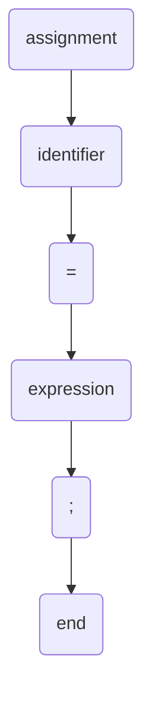

# PROGRAMMING LANGUAGES: Module 1: Introduction

## Topic: EBNFs and Syntax Diagrams

---

### **1. Introduction to Programming Language Syntax**

*   **Definition:** Syntax refers to the set of rules that defines the combinations of symbols that are considered to be correctly structured programs in a given programming language. It's like the grammar of a programming language.
*   **Importance:**
    *   Ensures programs are understandable by both humans and compilers/interpreters.
    *   Prevents ambiguity in code.
    *   Forms the basis for parsing and analysis during compilation.
*   **Formal vs. Informal Syntax:**
    *   **Informal:** Often described in natural language, which can be ambiguous and difficult to implement precisely.
    *   **Formal:** Uses mathematical notations to describe syntax precisely and unambiguously. EBNF and Syntax Diagrams are formal methods.

---

### **2. Extended Backus-Naur Form (EBNF)**

*   **Definition:** EBNF is a metasyntax notation used to express the context-free grammar of programming languages. It's an extension of Backus-Naur Form (BNF) that makes it more concise and easier to read.
*   **Purpose:** To provide a formal and unambiguous way to describe the structure of language constructs.

#### **Key EBNF Notations and Their Meanings**

*   **`::=` (is defined as):** Separates the non-terminal symbol on the left from its definition on the right.
    *   Example: `statement ::= assignment | if_statement`
*   **Non-terminal Symbols (Syntactic Categories):** Represent grammatical elements or structures of the language. Usually enclosed in angle brackets `< >` or written as plain words.
    *   Example: `<expression>`, `assignment`, `statement`
*   **Terminal Symbols (Lexical Tokens):** Represent the actual words or symbols of the language that appear in the program. These are usually enclosed in quotes or apostrophes.
    *   Example: `+`, `-`, `*`, `/`, `=`, `"if"`, `"while"`
*   **Repetition (Zero or More):** `{ ... }` or `*`
    *   Indicates that the enclosed element can appear zero or more times.
    *   Example: `identifier ::= letter { letter | digit }` (An identifier starts with a letter, followed by zero or more letters or digits.)
*   **Optionality (Zero or One):** `[ ... ]` or `?`
    *   Indicates that the enclosed element can appear zero or one time.
    *   Example: `variable_declaration ::= type [ "[" num_expression "]" ] identifier ;` (A variable can be declared with an optional array dimension.)
*   **Alternation (One of):** `|`
    *   Separates alternative definitions for a non-terminal.
    *   Example: `digit ::= "0" | "1" | "2" | "3" | "4" | "5" | "6" | "7" | "8" | "9"`
*   **Grouping:** `( ... )`
    *   Used to group elements to apply repetition or optionality to a sequence.
    *   Example: `if_statement ::= "if" "(" expression ")" statement [ "else" statement ]` (The `else` clause is optional and grouped.)
*   **Terminals as Keywords:** Keywords are often represented as unquoted, uppercase non-terminals or as quoted terminals. Consistency is important.
    *   Example: `IF_KEYWORD ::= "if"` or `if_statement ::= IF_KEYWORD ...`

#### **EBNF Examples**

**Example 1: A Simple Arithmetic Expression**

```ebnf
expression ::= term { ("+" | "-") term }
term       ::= factor { ("*" | "/") factor }
factor     ::= "(" expression ")" | number
number     ::= digit { digit }
digit      ::= "0" | "1" | "2" | "3" | "4" | "5" | "6" | "7" | "8" | "9"
```

**Explanation:**

*   An `expression` is a `term` followed by zero or more occurrences of `+` or `-` and another `term`.
*   A `term` is a `factor` followed by zero or more occurrences of `*` or `/` and another `factor`.
*   A `factor` is either an `expression` enclosed in parentheses or a `number`.
*   A `number` is one or more `digit`s.
*   A `digit` is one of the characters '0' through '9'.

**Example 2: A Simple Assignment Statement**

```ebnf
assignment ::= identifier "=" expression ";"
identifier ::= letter { letter | digit }
letter     ::= "a" | "b" | ... | "z" | "A" | "B" | ... | "Z"
digit      ::= "0" | "1" | ... | "9"
```

**Explanation:**

*   An `assignment` consists of an `identifier`, followed by `=`, an `expression`, and a `;`.
*   An `identifier` starts with a `letter` and can be followed by zero or more `letter`s or `digit`s.

---

### **3. Syntax Diagrams (State Transition Diagrams)**

*   **Definition:** Syntax diagrams are graphical representations of the syntax of a programming language. They use a flowchart-like structure to depict the allowed sequences of terminals and non-terminals.
*   **Purpose:** To provide a visual and intuitive way to understand and communicate the syntax rules.

#### **Key Syntax Diagram Components**

*   **Rectangles:** Represent non-terminal symbols. You follow the arrow from a non-terminal rectangle to its definition.
*   **Ovals/Rounded Rectangles:** Represent terminal symbols (keywords, operators, punctuation). These are the actual tokens that appear in the code.
*   **Arrows:** Indicate the flow of control and the sequence of symbols.
*   **Paths:** Different paths through the diagram represent alternative syntax constructions.
*   **Loops:** Represent repetition (zero or more times).
*   **Branches:** Represent choices or optional elements.

#### **Mapping EBNF to Syntax Diagrams**

| EBNF Construct         | Syntax Diagram Representation                                |
| :--------------------- | :----------------------------------------------------------- |
| `A ::= B`              | Arrow from `A` to `B` (or its diagram)                       |
| `A ::= "x"`            | Arrow from `A` to an oval labeled "x"                        |
| `A ::= B | C`          | `A` splits into two paths, one to `B`, one to `C`            |
| `A ::= [B]`            | `A` has two paths: one skipping `B`, one going through `B`   |
| `A ::= {B}`            | `A` has a loop that can go through `B` zero or more times    |
| `A ::= B C`            | `A` follows an arrow sequentially from `B` to `C`            |
| `A ::= (B | C) D`      | `A` branches to `B` or `C`, then continues to `D`            |

#### **Syntax Diagram Examples**

**Example 1: A Simple Arithmetic Expression (following the EBNF example)**

*   **`expression`:**
    ```
       +---------------------+
       |     term            |
       +---------------------+
                |
                v
       +---------------------+
       | "+ OR -" | (optional) |
       +---------------------+
                |
                v
       +---------------------+
       |     term            |
       +---------------------+
    ```
    *(This is a simplified representation; a full diagram would show the repetition.)*

    **More accurately, showing repetition:**

    ```mermaid
    graph TD
        A(expression) --> B(term)
        B --> C{+ OR -}
        C --> D(term)
        D --> C
        C -- optional --> E(end)
    ```
    *This diagram shows: expression -> term, then optionally (+ or -) followed by term, which can repeat.*

*   **`term`:** Similar structure to `expression` but with `*` or `/`.

*   **`factor`:**
    ```mermaid
    graph TD
        F(factor) --> G{"("}
        G --> H(expression)
        H --> I{")"}
        I --> J(number)
        J --> K(end)
        F --> L(number)
        L --> K
    ```
    *This shows that a factor is either an expression in parentheses or a number.*

*   **`number`:**
    ```mermaid
    graph TD
        N(number) --> D{digit}
        D --> M(digit)
        M --> D
        M -- optional --> P(end)
    ```
    *This shows a number is one or more digits.*

*   **`digit`:**
    ```mermaid
    graph TD
        DG(digit) --> OVAL("0" | "1" | ... | "9")
        OVAL --> P(end)
    ```

**Example 2: A Simple Assignment Statement**



---

### **4. Benefits and Drawbacks**

#### **EBNF**

*   **Benefits:**
    *   **Concise and Readable:** More compact and easier to understand than raw BNF for complex grammars.
    *   **Expressive Power:** Allows for convenient notation of optional and repetitive constructs.
    *   **Formal Basis:** Provides a solid foundation for compiler construction tools (parsers).
*   **Drawbacks:**
    *   **Steeper Learning Curve:** Can be intimidating for beginners compared to natural language descriptions.
    *   **Interpretation:** While formal, subtle differences in EBNF dialects can sometimes lead to minor ambiguities if not strictly adhered to.

#### **Syntax Diagrams**

*   **Benefits:**
    *   **Visual and Intuitive:** Excellent for understanding the flow and structure of language elements.
    *   **Beginner-Friendly:** Easier to grasp for those new to formal language definitions.
    *   **Good for Smaller Constructs:** Effective for defining specific keywords or simple statement types.
*   **Drawbacks:**
    *   **Cumbersome for Complex Grammars:** Can become extremely large and difficult to manage for entire programming languages.
    *   **Less Precise for Repetition/Optionality:** While loops and branches represent these, precisely defining the *exact* number of repetitions or the conditions for optionality can be less explicit than in EBNF.
    *   **Not directly implementable:** They primarily serve as a specification tool; EBNF is more directly convertible into parsing code.

---

### **5. Choosing Between EBNF and Syntax Diagrams**

*   **EBNF:** Generally preferred for defining the *complete* grammar of a programming language due to its conciseness, expressiveness, and formal nature, which aids in compiler development.
*   **Syntax Diagrams:** Excellent for explaining specific language features, keywords, or illustrating concepts to learners. They are often used as a complementary tool to EBNF for better understanding.

---

### **6. Practice Questions and Exercises**

**Question 1:**
What is the primary purpose of formal notations like EBNF and Syntax Diagrams in programming languages?

**Question 2:**
Translate the following EBNF rule into a syntax diagram:
`optional_clause ::= "[" statement "]" ;`

**Question 3:**
Write an EBNF rule for a simple `while` loop that includes a condition (an expression) and a body (a statement). The loop body should be repeatable.

**Question 4:**
Consider the following EBNF snippet:
`list ::= element { "," element } ;`
Describe what this rule means in natural language and identify any terminal and non-terminal symbols.

---

### **7. Answers**

**Answer 1:**
The primary purpose is to provide a precise, unambiguous, and formal definition of the syntax (grammar) of a programming language. This ensures consistency, aids in compiler/interpreter design, and helps programmers understand valid code structures.

**Answer 2:**
A syntax diagram for `optional_clause` would show:
*   A starting point.
*   An arrow leading to an oval labeled `[` (literal opening bracket).
*   This arrow then leads to a rectangle labeled `statement` (representing the non-terminal `statement`).
*   From `statement`, an arrow leads to an oval labeled `]` (literal closing bracket).
*   From the closing bracket, an arrow leads to the end point.
*   There would also be a direct path from the starting point to the end point, bypassing the `[` , `statement`, and `]` sequence, indicating that the clause is optional.

**Answer 3:**
```ebnf
while_loop ::= "while" "(" expression ")" statement { statement } ;
```
*   `"while"`: Terminal (keyword)
*   `"("`: Terminal (punctuation)
*   `expression`: Non-terminal
*   `")"`: Terminal (punctuation)
*   `statement`: Non-terminal
*   `{ statement }`: Indicates the loop body can contain zero or more statements.

**Answer 4:**
*   **Natural Language Description:** The rule defines a `list` as consisting of an `element`, followed by zero or more occurrences of a comma (`,`) and then another `element`.
*   **Terminal Symbols:** `,` (comma)
*   **Non-terminal Symbols:** `list`, `element`

---

### **8. Important Points to Remember**

*   **Formalisms are Key:** EBNF and Syntax Diagrams are crucial for precisely defining and understanding programming language syntax.
*   **EBNF for Power:** EBNF is generally more powerful and suitable for defining complete language grammars.
*   **Syntax Diagrams for Visualization:** Syntax diagrams are excellent for visualizing and explaining syntax constructs.
*   **Terminals vs. Non-terminals:** Understand the distinction between concrete symbols (terminals) and abstract grammatical categories (non-terminals).
*   **EBNF Operators:** Master the meaning of `::=`, `|`, `{}`, `[]`, and `()`.
*   **Syntax Diagram Components:** Recognize the roles of rectangles, ovals, and arrows.
*   **Ambiguity:** The goal of these formalisms is to eliminate ambiguity in language definition.
