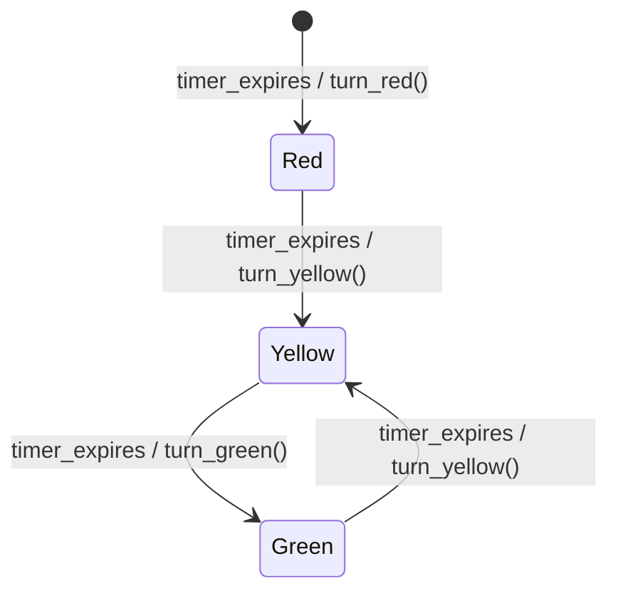
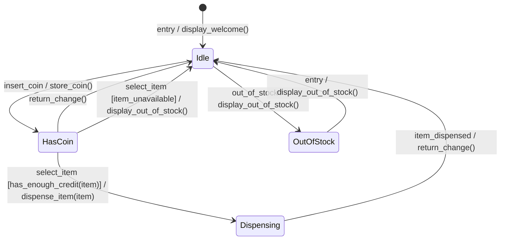
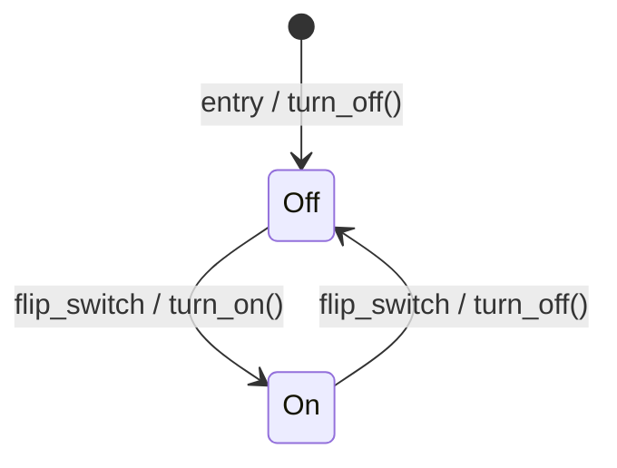
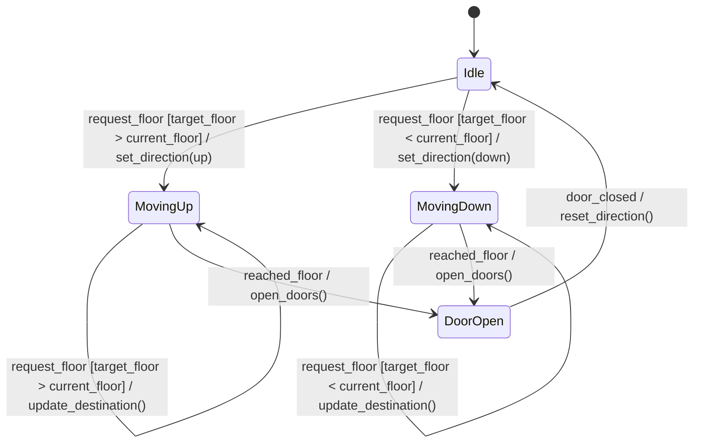

# Software Engineering: Module 2 - Software Design - State Diagrams

---

## 1. Introduction to State Diagrams

### 1.1 What are State Diagrams?

*   **Definition:** State diagrams, also known as **state-transition diagrams** or **finite state machines (FSMs)**, are graphical representations of the behavior of a system. They model the different **states** a system can be in and the **transitions** between these states triggered by **events**.
*   **Purpose:**
    *   To model the dynamic behavior of a system.
    *   To capture how an object or system responds to stimuli over time.
    *   To understand and design systems with complex reactive behavior.
    *   To visualize the lifecycle of an object or the states of a system.

### 1.2 Key Concepts and Definitions

*   **State:**
    *   A condition or status that an object or system can be in at a particular point in time.
    *   Represents a period during which the object or system is performing some activity or waiting for an event.
    *   States are typically represented by **rounded rectangles**.
    *   **Example:** In a traffic light system, states could be "Red," "Yellow," and "Green."

*   **Event:**
    *   A significant occurrence that can trigger a change in the state of an object or system.
    *   Events are instantaneous occurrences.
    *   Events are typically represented by **labels on the transition arrows**.
    *   **Types of Events:**
        *   **Signal:** An explicit message sent from one object to another (e.g., `button_pressed`, `timer_expires`).
        *   **Change Event:** A condition that becomes true or false (e.g., `door_is_open`, `temperature > 100`).
        *   **Time Event:** An event that occurs after a certain period or at a specific time (e.g., `after(5s)`, `at(noon)`).
        *   **Internal Event:** An event generated within the object itself.

*   **Transition:**
    *   The movement from one state to another, triggered by an event.
    *   Transitions are represented by **arrows** pointing from the source state to the target state.
    *   Transitions are labeled with the event that triggers them.
    *   A transition can optionally include an **action** to be performed when the transition occurs.

*   **Action:**
    *   An operation or behavior performed by an object when entering a state, exiting a state, or during a transition.
    *   Actions are often associated with transitions (e.g., `[guard] / action`).
    *   **Entry Action:** An action performed when entering a state (often denoted with `entry / action`).
    *   **Exit Action:** An action performed when exiting a state (often denoted with `exit / action`).
    *   **Do Activity:** An action that continues as long as the object remains in a particular state (often denoted with `do / activity`).

*   **Guard:**
    *   A condition that must be true for a transition to occur.
    *   Guards are typically enclosed in square brackets `[]` and follow the event label.
    *   They allow for conditional transitions.
    *   **Example:** `[count < 5]`.

### 1.3 When to Use State Diagrams

*   **Modeling reactive systems:** Systems that respond to external stimuli.
*   **Describing the lifecycle of objects:** How an object changes over time.
*   **Designing user interfaces:** Capturing the states of different UI components.
*   **Modeling state-dependent behavior:** Where the system's response depends on its current state.
*   **Representing complex control logic:** Where simple flowcharts become unwieldy.

---

## 2. Components of a State Diagram

### 2.1 States

*   **Initial State:**
    *   The state in which an object or system begins its life.
    *   Represented by a **filled circle**.
    *   There can be only one initial state for a state machine.

*   **Final State (Termination State):**
    *   Indicates that the object or system has reached the end of its lifecycle.
    *   Represented by a **filled circle within another circle**.
    *   Not all state machines have a final state; some may continue to exist indefinitely.

*   **Simple State:**
    *   A basic state without any internal substates.
    *   Represented by a rounded rectangle.
    *   Can contain entry, exit, and do actions.

*   **Composite State (Nested State):**
    *   A state that contains one or more nested state machines.
    *   Allows for hierarchical modeling, breaking down complex behavior into smaller, manageable parts.
    *   Represented by a larger rounded rectangle with internal states.

### 2.2 Transitions

*   **Transition Label:**
    *   `event [guard] / action`
    *   **Event:** The stimulus that causes the transition.
    *   **Guard:** A boolean condition that must be true for the transition to occur.
    *   **Action:** An operation performed during the transition.

*   **Self-Transition:**
    *   A transition from a state back to itself.
    *   Triggered by an event that doesn't require changing to a different state, but might involve performing an action.

### 2.3 Junctions and Choices

*   **Junction:**
    *   Used to merge multiple incoming transitions that are guarded.
    *   Ensures that only one outgoing path is taken based on guards.
    *   Represented by a **small filled circle**.
    *   A junction is not an event; it's a control structure.

*   **Choice (Decision Point):**
    *   Used to specify alternative transitions from a single point.
    *   One of the outgoing transitions is chosen based on the guards.
    *   Represented by a **diamond shape**.
    *   Similar to a junction, but conceptually represents a choice rather than a merge. Often the outgoing transitions from a choice point are mutually exclusive and cover all possibilities.

### 2.4 Fork and Join (Concurrency)

*   **Fork:**
    *   Splits a single flow of control into multiple concurrent flows.
    *   Represented by a **thick horizontal bar**.
    *   The outgoing transitions from a fork execute concurrently.

*   **Join:**
    *   Merges multiple concurrent flows back into a single flow.
    *   Represented by a **thick horizontal bar**.
    *   A join waits for all incoming concurrent flows to reach it before allowing the single outgoing transition to proceed.

---

## 3. Creating State Diagrams: A Step-by-Step Approach

1.  **Identify the Object/System:** Determine what entity or aspect of the system you are modeling.
2.  **Identify the States:** Define all the possible conditions or statuses the object/system can be in. Think about the significant changes in behavior.
3.  **Identify the Events:** Determine the stimuli or occurrences that cause the object/system to change from one state to another.
4.  **Identify the Transitions:** For each state, determine which events can cause a transition to another state.
5.  **Define Actions and Guards:** Specify any actions to be performed during transitions (entry, exit, or during transition) and any conditions (guards) that must be met for a transition to occur.
6.  **Add Initial and Final States:** Mark the starting and (if applicable) ending states of the object's lifecycle.
7.  **Refine and Organize:** Use composite states for complexity, junctions/choices for decisions, and forks/joins for concurrency as needed. Ensure the diagram is clear and easy to understand.

---

## 4. Examples

### 4.1 Traffic Light System

Let's model a simple traffic light:

*   **States:** `Red`, `Yellow`, `Green`
*   **Events:** `timer_expires` (when the current light's timer runs out)
*   **Actions:** `turn_red()`, `turn_yellow()`, `turn_green()`

**Explanation:**

*   The diagram starts at `Red` (implied initial state).
*   When `timer_expires` occurs, the action `turn_red()` is executed, and the state remains `Red` (or transitions to `Red` if the initial state was different). In this simplified example, we'll show the full cycle.
*   From `Red`, `timer_expires` triggers `turn_yellow()` and transitions to `Yellow`.
*   From `Yellow`, `timer_expires` triggers `turn_green()` and transitions to `Green`.
*   From `Green`, `timer_expires` triggers `turn_yellow()` and transitions back to `Yellow`.

*(Note: A more robust traffic light would have different timers for each state and potentially more states for turning red, pedestrian signals, etc.)*

### 4.2 Vending Machine

Let's model a simple vending machine:

*   **States:** `Idle`, `HasCoin`, `Dispensing`, `OutOfStock`
*   **Events:** `insert_coin`, `select_item`, `item_dispensed`, `item_unavailable`, `out_of_stock`

**Explanation:**

*   Starts in `Idle` with a welcome message.
*   Inserting a coin moves it to `HasCoin`.
*   From `HasCoin`, you can return change (back to `Idle`), dispense an item if you have enough credit, or be informed if the item is unavailable.
*   `Dispensing` leads back to `Idle` after the item is dispensed.
*   A separate `OutOfStock` state is introduced for when items run out.

---

## 5. Practice Questions and Exercises

**Question 1:**
What is the primary purpose of a state diagram in software engineering?

**Answer:**
The primary purpose of a state diagram is to model the dynamic behavior of a system, specifically how an object or system changes its state in response to events over time.

---

**Question 2:**
List and describe the three main components of a transition label in a state diagram.

**Answer:**
The three main components of a transition label are:
1.  **Event:** The stimulus that triggers the transition.
2.  **Guard:** A condition (in square brackets) that must be true for the transition to occur.
3.  **Action:** An operation performed during the transition.

---

**Question 3:**
Create a simple state diagram for a light switch that can be `On` or `Off`. The switch can be toggled by a `flip_switch` event. Include entry actions to represent the light state (e.g., `turn_on()`, `turn_off()`).

**Answer:**

---

**Question 4:**
Explain the difference between a junction and a choice point in a state diagram.

**Answer:**
*   **Junction:** Used to merge multiple incoming transitions that are guarded. It acts as a single point where one of potentially many incoming paths can arrive, and then proceeds to one outgoing path determined by guards. It's primarily about merging control flow.
*   **Choice (Decision Point):** Used to specify alternative transitions from a single point. An event triggers the choice, and the system then evaluates the guards on the outgoing transitions to select exactly one path. It's about making a decision among alternatives.

---

**Question 5:**
Consider a simple elevator. Identify at least three states and one event that could cause a transition between these states. Draw a partial state diagram showing these states and transitions.

**Answer:**

**Possible States:** `Idle`, `MovingUp`, `MovingDown`, `DoorOpen`
**Possible Event:** `request_floor` (a button press for a specific floor)

**Partial State Diagram:**

*(Note: This is a simplified example. A real elevator model would be much more complex.)*

---

## 6. Important Points to Remember

*   **State Diagrams capture behavior, not structure.** They complement class diagrams.
*   **Focus on significant changes:** States should represent distinct periods of behavior.
*   **Events are triggers:** They initiate state changes.
*   **Guards add conditions:** They enable conditional transitions.
*   **Actions represent activities:** They define what happens during transitions or within states.
*   **Hierarchy is powerful:** Composite states help manage complexity.
*   **Concurrency (fork/join) is for parallel activities.**
*   **Use state diagrams when the system's behavior is event-driven or state-dependent.**
*   **Be consistent with notation.** UML standard notation is recommended.
*   **Keep diagrams focused.** Model one object or subsystem at a time.

---
---
