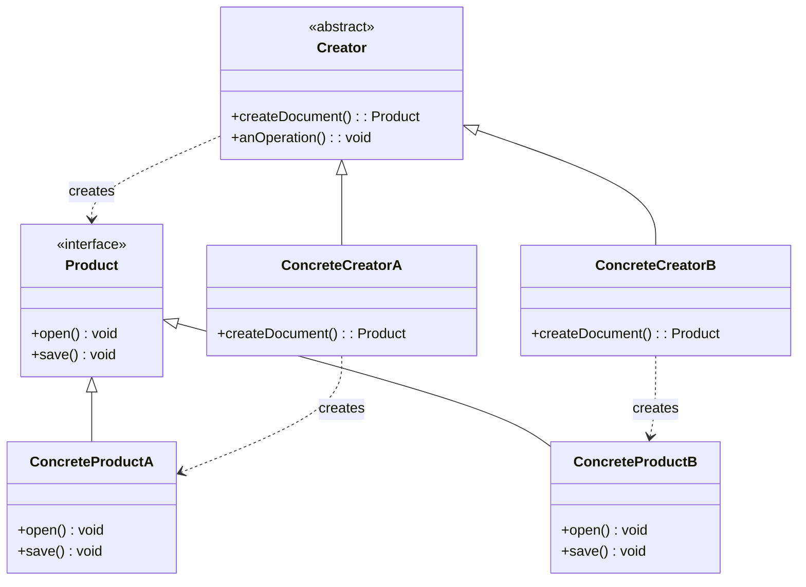

# Software Engineering: Module 2 - Software Design

## Topic: Creational Design Patterns - Factory Method

### 1. Introduction to Creational Design Patterns

Creational design patterns deal with **object creation mechanisms, trying to create objects in a manner suitable to the situation**. They are concerned with how objects are instantiated, offering more flexibility and reusability in the creation process compared to direct instantiation.

**Key Benefits of Creational Patterns:**
*   **Decoupling:** They decouple the client code from the concrete classes of objects it needs to create.
*   **Flexibility:** They allow for easier modification and extension of the system by changing the instantiation logic.
*   **Reusability:** They promote code reuse and maintainability.

### 2. The Factory Method Pattern

#### 2.1. Definition

The **Factory Method** pattern is a creational design pattern that **defines an interface for creating an object, but lets subclasses decide which class to instantiate**. The Factory Method pattern lets a class defer instantiation to subclasses.

**In simpler terms:** Instead of directly creating an object using `new`, you delegate the creation responsibility to a method (the "factory method"). This method can then be overridden by subclasses to create different types of objects.

#### 2.2. Intent

*   **Define an interface for creating an object, but let subclasses decide which class to instantiate.**
*   **Delegate responsibility of instantiation to subclasses.**

#### 2.3. Motivations

Consider a scenario where you have a document processing application that can handle different types of documents (e.g., PDF, Word, Plain Text). Your application needs to create these documents, but the specific type of document to be created might vary depending on the user's selection or the system's configuration.

*   **Problem:** If you directly use `new PDFDocument()`, `new WordDocument()`, etc., your main application code becomes tightly coupled to these concrete document classes. Adding a new document type (e.g., HTMLDocument) would require modifying the core application logic.
*   **Solution:** The Factory Method pattern allows you to create a framework for creating objects, where subclasses can decide which objects to instantiate.

#### 2.4. Structure (UML Diagram and Participants)

The Factory Method pattern involves the following participants:

*   **Product:**
    *   **Role:** Defines the interface of objects the factory method creates.
    *   **Example:** `Document` (interface or abstract class) with methods like `open()`, `save()`.
*   **ConcreteProduct:**
    *   **Role:** Implements the Product interface.
    *   **Example:** `PDFDocument`, `WordDocument`, `TextDocument` (classes that implement `Document`).
*   **Creator:**
    *   **Role:** Declares the factory method, which returns an object of type Product. It may also define a default implementation that returns a default ConcreteProduct object. The Creator may also call the factory method to create a Product.
    *   **Example:** `Application` (abstract class) with an abstract `createDocument()` method.
*   **ConcreteCreator:**
    *   **Role:** Overrides the factory method to return an instance of a ConcreteProduct.
    *   **Example:** `PDFApplication` (subclass of `Application`) that overrides `createDocument()` to return `new PDFDocument()`. `WordApplication` returns `new WordDocument()`.



#### 2.5. How it Works (Step-by-Step)

1.  **Creator declares the factory method.** This method is responsible for creating objects of the `Product` type.
2.  **ConcreteCreators override the factory method.** Each `ConcreteCreator` implements the `createDocument()` method to return a specific `ConcreteProduct`.
3.  **The Creator class uses the factory method.** The `Creator` class has methods (like `anOperation()`) that use the `Product` created by the factory method. The `Creator` doesn't know or care *which* concrete product is being created; it only interacts with the `Product` interface.
4.  **Client code instantiates a ConcreteCreator.** The client code decides which concrete creator to use (e.g., `PDFApplication` or `WordApplication`).
5.  **Client code calls the Creator's operations.** When the client calls methods on the `Creator` (e.g., `application.newDocument("MyDoc")`), the `Creator`'s `createDocument()` method is invoked, which in turn instantiates the appropriate `ConcreteProduct`.

#### 2.6. Example (Java)

Let's illustrate with the document processing example:

**1. Product Interface:**

```java
// Product Interface
interface Document {
    void open();
    void save();
}
```

**2. Concrete Products:**

```java
// Concrete Product A
class PDFDocument implements Document {
    @Override
    public void open() {
        System.out.println("Opening PDF Document...");
    }

    @Override
    public void save() {
        System.out.println("Saving PDF Document...");
    }
}

// Concrete Product B
class WordDocument implements Document {
    @Override
    public void open() {
        System.out.println("Opening Word Document...");
    }

    @Override
    public void save() {
        System.out.println("Saving Word Document...");
    }
}
```

**3. Creator Abstract Class:**

```java
// Creator Abstract Class
abstract class Application {

    // The Factory Method
    public abstract Document createDocument();

    // Common operations that use the product
    public void newDocument(String title) {
        System.out.println("Creating new document: " + title);
        Document doc = createDocument(); // Factory method called here
        System.out.println("Document created successfully.");
        doc.open();
        doc.save();
    }

    public void openDocument(String title) {
        System.out.println("Opening existing document: " + title);
        // In a real app, you'd load from a file, here we just simulate
        Document doc = createDocument(); // Still uses factory, but would load existing
        doc.open();
    }
}
```

**4. Concrete Creators:**

```java
// Concrete Creator A
class PDFApplication extends Application {
    @Override
    public Document createDocument() {
        return new PDFDocument(); // Returns a PDFDocument
    }
}

// Concrete Creator B
class WordApplication extends Application {
    @Override
    public Document createDocument() {
        return new WordDocument(); // Returns a WordDocument
    }
}
```

**5. Client Code:**

```java
public class Client {
    public static void main(String[] args) {
        // Client decides which application to use
        Application pdfApp = new PDFApplication();
        pdfApp.newDocument("MyResume.pdf");
        System.out.println("--------------------");

        Application wordApp = new WordApplication();
        wordApp.newDocument("MyReport.docx");
    }
}
```

**Output:**

```
Creating new document: MyResume.pdf
Document created successfully.
Opening PDF Document...
Saving PDF Document...
--------------------
Creating new document: MyReport.docx
Document created successfully.
Opening Word Document...
Saving Word Document...
```

#### 2.7. Advantages of Factory Method

*   **Decoupling:** The Creator is decoupled from the ConcreteProducts. It only depends on the Product interface.
*   **Extensibility:** You can easily introduce new ConcreteProducts without modifying the Creator class. You only need to add a new ConcreteCreator.
*   **Flexibility:** The choice of which ConcreteProduct to instantiate is deferred to subclasses, making the system more flexible and adaptable.
*   **Adherence to Open/Closed Principle:** The system can be extended with new document types without modifying existing code.

#### 2.8. Disadvantages of Factory Method

*   **Increased Number of Classes:** For each new ConcreteProduct, you typically need a corresponding ConcreteCreator, which can lead to a proliferation of classes, especially if the product hierarchy is large.
*   **Subclassing Dependency:** ConcreteCreators are subclasses of Creator, which might be undesirable in some scenarios.

#### 2.9. When to Use Factory Method

*   **When a class cannot anticipate the class of objects it must create.** The framework for creating objects is defined, but the concrete classes are not known until runtime.
*   **When a class wants its subclasses to specify the objects it creates.** A class makes decisions about which objects to create, but these decisions are delegated to subclasses.
*   **When a class wants to delegate the responsibility of creating objects to subclasses.** This is the core idea – letting subclasses handle instantiation.

#### 2.10. Relationship to Other Patterns

*   **Abstract Factory:** Factory Method is often used by Abstract Factory. An Abstract Factory can have methods that are Factory Methods, used to create products within its family.
*   **Template Method:** The Creator class often uses the Template Method pattern. The `anOperation()` method in the Creator might be a template method that calls the factory method.
*   **Simple Factory (Not a GoF Pattern):** Simple Factory is a procedural approach where a single factory class with a single factory method (often a static method) creates objects based on a parameter. Factory Method is an object-oriented approach that uses inheritance to delegate instantiation.

### 3. Practice Questions and Exercises

**Question 1:**
What is the primary purpose of the Factory Method design pattern?
a) To reduce the number of classes in a system.
b) To encapsulate object creation logic and allow subclasses to decide which class to instantiate.
c) To provide a way to create families of related objects.
d) To define a way to select an algorithm at runtime.

**Question 2:**
In the Factory Method pattern, which participant is responsible for declaring the factory method?
a) Product
b) ConcreteProduct
c) Creator
d) ConcreteCreator

**Question 3:**
Which of the following is a key advantage of using the Factory Method pattern?
a) It reduces the overall complexity of the codebase.
b) It tightly couples the Creator to concrete product implementations.
c) It promotes extensibility by allowing new products to be added without modifying the Creator.
d) It directly creates objects without any intermediate methods.

**Question 4:**
Consider a game where you need to create different types of characters (Warrior, Mage, Archer). Each character has a specific attack behavior. Design a system using the Factory Method pattern to create these characters.
*   Define a `Character` interface with an `attack()` method.
*   Create `Warrior`, `Mage`, and `Archer` concrete character classes implementing `Character`.
*   Create a `CharacterCreator` abstract class with a `createCharacter()` factory method.
*   Create `WarriorCreator`, `MageCreator`, and `ArcherCreator` concrete character creators.
*   Show how a `Game` class (which uses the `CharacterCreator`) would utilize the pattern.

---

### Answers to Practice Questions

**Answer 1:**
**b) To encapsulate object creation logic and allow subclasses to decide which class to instantiate.**

**Answer 2:**
**c) Creator**

**Answer 3:**
**c) It promotes extensibility by allowing new products to be added without modifying the Creator.**

**Answer 4:**
**Design for Question 4:**

**Product Interface:**
```java
interface Character {
    void attack();
}
```

**Concrete Products:**
```java
class Warrior implements Character {
    @Override
    public void attack() {
        System.out.println("Warrior swings their sword!");
    }
}

class Mage implements Character {
    @Override
    public void attack() {
        System.out.println("Mage casts a spell!");
    }
}

class Archer implements Character {
    @Override
    public void attack() {
        System.out.println("Archer shoots an arrow!");
    }
}
```

**Creator Abstract Class:**
```java
abstract class CharacterCreator {
    // The Factory Method
    public abstract Character createCharacter();

    // An operation that uses the character
    public void spawnCharacter() {
        Character character = createCharacter(); // Factory method called
        System.out.println("Spawning character...");
        character.attack();
    }
}
```

**Concrete Creators:**
```java
class WarriorCreator extends CharacterCreator {
    @Override
    public Character createCharacter() {
        return new Warrior();
    }
}

class MageCreator extends CharacterCreator {
    @Override
    public Character createCharacter() {
        return new Mage();
    }
}

class ArcherCreator extends CharacterCreator {
    @Override
    public Character createCharacter() {
        return new Archer();
    }
}
```

**Client Code (Game Class):**
```java
class Game {
    public void startGame(CharacterCreator creator) {
        System.out.println("Starting game with specific creator.");
        creator.spawnCharacter(); // Uses the creator to get and use a character
    }

    public static void main(String[] args) {
        Game game = new Game();

        // Instantiate different creators based on game mode or settings
        CharacterCreator warriorMode = new WarriorCreator();
        game.startGame(warriorMode);
        System.out.println("---");

        CharacterCreator mageMode = new MageCreator();
        game.startGame(mageMode);
        System.out.println("---");

        CharacterCreator archerMode = new ArcherCreator();
        game.startGame(archerMode);
    }
}
```

**Expected Output:**
```
Starting game with specific creator.
Spawning character...
Warrior swings their sword!
---
Starting game with specific creator.
Spawning character...
Mage casts a spell!
---
Starting game with specific creator.
Spawning character...
Archer shoots an arrow!
```

### 4. Important Points to Remember

*   **Decouples client from concrete object creation:** The client code interacts with the Creator and Product interfaces, not the concrete product classes.
*   **Enables extensibility:** Easily add new product types by creating new ConcreteProducts and corresponding ConcreteCreators.
*   **Centralizes creation logic:** The responsibility of creating objects is delegated to specific methods.
*   **Subclasses decide instantiation:** The core idea is to let subclasses determine which concrete objects are instantiated.
*   **Creator relies on subclasses:** The abstract Creator relies on its subclasses to provide the actual implementation of the factory method.
*   **Often used with other patterns:** Can be combined with Abstract Factory and Template Method.
*   **Beware of class explosion:** Be mindful of creating too many small classes, especially for simple scenarios.
