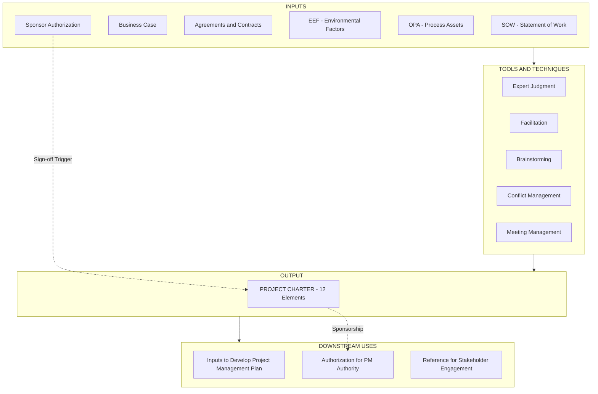

# Charter Development

<!-- SECTION_1_START -->
# 1. Core Technical Definition & Intuitive Overview

## 1.1 Formal Academic Definition (KTU 2024 / PMBOK Aligned)

> [!IMPORTANT]
> **Project Charter** is a document issued by the **sponsor** (or senior management) that formally **authorizes** the existence of a project and grants the **Project Manager (PM)** the authority to apply organizational resources to project activities. It is the primary output of the **Develop Project Charter** process, belonging to the **Initiating Process Group**.

As per the **PMBOK® Guide (7th Edition)** framework adopted by KTU's HMC (Humanities Core) curriculum, the charter acts as the **legal and procedural bridge** between the strategic intent (Business Case) and the operational execution (Project Management Plan).

The charter is a **single-source-of-truth (SSOT)** document that aligns all stakeholders on:
- **What** is being delivered (Scope summary)
- **Why** it is being delivered (Business case justification)
- **Who** is accountable (PM authority & responsibilities)
- **When** key milestones occur (Summary milestone schedule)
- **How much** it will cost (Summary budget)

## 1.2 Conceptual Analogy — Intuitive Overview

> [!NOTE]
> **Analogy: The "Building Permit" of a Project**

Imagine a civil engineer wants to construct a 10-story apartment complex. Before the first brick is laid, the municipal corporation issues a **Building Permit** (charter). This permit:
- Officially sanctions the construction (project authorization)
- Names the licensed architect/engineer (project manager) with decision-making authority
- Lists the approved floor plans and FSI limits (scope & boundaries)
- Stipulates the maximum cost, deadline, and number of floors (objectives)
- Carries the signature of the municipal commissioner (sponsor sign-off)

Without this permit, the engineer cannot mobilize labor, purchase cement, or schedule cranes. **Similarly, without a Project Charter, the PM has no formal authority to spend money, hire people, or make trade-off decisions.**

Another powerful analogy: the Charter is the **"Birth Certificate"** of a project. Once issued, the project becomes a legally recognizable entity within the organization, with all the rights (budget, resources) and obligations (deliverables, deadlines) of a living organization unit.

## 1.3 Physical Constants, Standards & Compliance Metrics

The following **standard parameters** govern a valid Charter under KTU/PMBOK assessment:

- **Approval Authority**: Sponsor or Steering Committee (typically a **senior executive** at **C-suite or Director level**)
- **Issuance Timing**: **Before** the Project Management Plan is developed; ideally within the **first 2–4 weeks** of project initiation
- **Revision Control**: Charter revisions require **formal change control** through the project's Integrated Change Control process
- **Document Length**: Industry standard is **2 to 5 pages** (high-level, concise)
- **PMI Standard Reference**: **PMBOK® Guide, 7th Edition**, Process **1.1.1 Develop Project Charter**

> [!TIP]
> **GeoGebra / Desmos Integration — Not Applicable**
> This is a qualitative management topic. Visualization is best done via hierarchical block diagrams (handled in Section 4) rather than Cartesian plots.

## 1.4 Core Purpose of the Charter (Why it Matters in KTU Examinations)

A well-crafted Charter answers the **Five W's and One H** of project initiation:

| Question | Charter Component |
|----------|-------------------|
| **What** | Project description, high-level requirements |
| **Why** | Business case, justification, measurable objectives |
| **Who** | Project Manager assignment, authority level, stakeholders |
| **When** | Summary milestone schedule |
| **How much** | Summary budget, funding sources |
| **How** | Approval requirements, assumptions, constraints |

<!-- SECTION_1_END -->

<!-- SECTION_2_START -->
# 2. Deep Theoretical Analysis & KTU High-Yield Formula Sheet

## 2.1 Theoretical Foundation — The PMBOK ITTO Framework

The **Develop Project Charter** process is governed by the **Inputs → Tools & Techniques → Outputs (ITTO)** model. This is the **highest-weightage** concept for KTU's HMC examinations and is tested in nearly every cohort.

### 2.1.1 Inputs (What feeds into Charter creation)

> [!IMPORTANT]
> **Six Standard Inputs** — Memorize this list:

1. **Project Statement of Work (SOW)** — Describes the products, services, or results to be delivered
2. **Business Case** — Justifies the project from a financial/strategic ROI perspective (e.g., Net Present Value $\geq 0$)
3. **Agreements** — Contracts, MOUs, or SLAs with external parties
4. **Enterprise Environmental Factors (EEF)** — Organizational culture, industry standards, government regulations, infrastructure
5. **Organizational Process Assets (OPA)** — Templates, policies, historical data, lessons learned
6. **Project Sponsor's Authorization** — The triggering event

### 2.1.2 Tools & Techniques (How the Charter is built)

1. **Expert Judgment** — Leveraging subject matter experts (SMEs)
2. **Facilitation Techniques** — Workshops, focus groups
3. **Brainstorming** — For objectives, risks, constraints
4. **Conflict Management** — Resolving competing stakeholder interests
5. **Meeting Management** — Structured kick-off sessions

### 2.1.3 Outputs (What the Charter contains — 12 Standard Elements)

> [!IMPORTANT]
> **The 12 Charter Elements** — Core to KTU long-answer questions:

| # | Element | KTU Mark Weightage |
|---|---------|--------------------|
| 1 | Project purpose / justification | 2 Marks |
| 2 | Measurable objectives & success criteria | 2 Marks |
| 3 | High-level requirements | 1 Mark |
| 4 | Project description & boundaries | 2 Marks |
| 5 | Overall project risk | 1 Mark |
| 6 | Summary milestone schedule | 2 Marks |
| 7 | Pre-approved financial resources (budget) | 1 Mark |
| 8 | Stakeholder list | 1 Mark |
| 9 | Project approval requirements | 1 Mark |
| 10 | Assigned PM, responsibility, authority level | 2 Marks |
| 11 | Name & authority of sponsor | 1 Mark |
| 12 | Sign-off / acceptance criteria | 1 Mark |

## 2.2 KTU Formula Sheet & Strategic Cheat Sheet

While Charter Development is largely qualitative, certain **quantitative** project health checks feed into the charter's success criteria. These are commonly asked in KTU 14-mark problems.

### 2.2.1 Quantitative Metrics Embedded in Charters

$$
\begin{aligned}
\text{ROI} &= \frac{\text{Net Project Benefit} - \text{Total Project Cost}}{\text{Total Project Cost}} \times 100\% \\[6pt]
\text{Schedule Variance (SV)} &= \text{Earned Value (EV)} - \text{Planned Value (PV)} \\[6pt]
\text{Cost Variance (CV)} &= \text{Earned Value (EV)} - \text{Actual Cost (AC)} \\[6pt]
\text{CPI} &= \frac{\text{EV}}{\text{AC}}, \quad \text{SPI} = \frac{\text{EV}}{\text{PV}} \\[6pt]
\text{Schedule Performance Index threshold} &= 1.0 \ (\text{on schedule if } \geq 1.0) \\[6pt]
\text{Cost Performance Index threshold} &= 1.0 \ (\text{under budget if } \geq 1.0)
\end{aligned}
$$

> [!NOTE]
> **KTU Convention**: A project is considered "on track" only when **both** $\text{CPI} \geq 1.0$ **and** $\text{SPI} \geq 1.0$. These indices are explicitly stated in the Charter's success criteria.

### 2.2.2 SMART Objectives Template (Universally Tested)

Every objective in the Charter **MUST** follow the **SMART** mnemonic:

| Letter | Meaning | Charter Test Question Example |
|--------|---------|-------------------------------|
| **S** | Specific | "Deploy ERP system to manufacturing unit" |
| **M** | Measurable | "...covering **100%** of inventory modules" |
| **A** | Achievable | "...within current IT infrastructure" |
| **R** | Relevant | "...aligned with Q3 2024 digital transformation goal" |
| **T** | Time-bound | "...by **31-March-2025**" |

### 2.2.3 RACI Matrix (Used in Stakeholder Section)

The Charter's stakeholder section typically embeds a **RACI** chart to define authority boundaries:

| Code | Role | Charter-Implied Authority |
|------|------|---------------------------|
| **R** | Responsible | Executes the work |
| **A** | Accountable | Single owner (the PM or Sponsor) |
| **C** | Consulted | Provides input before decisions |
| **I** | Informed | Notified after decisions |

## 2.3 Real-World Engineering Utility

The Project Charter is not academic — it is the **single most important governance document** in industries such as:

- **Construction**: NEC3 / FIDIC contracts mandate a charter-equivalent "Project Brief" before site mobilization
- **IT/Software**: Agile Release Trains (SAFe) require a "Program Charter" before PI Planning
- **Manufacturing**: ISO 9001:2015 Clause 4.4.1 demands a "Project Definition Document" before design phase
- **Defense/Public Sector**: Government of India's **Department of Expenditure** mandates a Detailed Project Report (DPR) — which is essentially a charter for public projects

> [!TIP]
> **Engineering Insight**: In Indian PSUs like BHEL, NTPC, or ISRO, the Charter is called the **"Project Sanction Order"** and carries a **sanctioned cost code** that the finance department uses for fund release. Without this code, no purchase order (PO) can be generated.

<!-- SECTION_2_END -->

<!-- SECTION_3_START -->
# 3. Step-by-Step Derivations, Templates & Code/Symbolic Implementation

## 3.1 Algorithmic Process — The 8-Step Charter Development Methodology

> [!IMPORTANT]
> **Step-by-Step Charter Creation Algorithm** (Standard PMBOK-aligned, KTU-mapped):

### **Step 1: Receive the Trigger**
The sponsor issues a formal **project initiation request** accompanied by the Business Case. Without this, the PM has no moral authority to start.

**Examination Key Point**: "Charter development begins only after the sponsor provides the Business Case and a verbal/written authorization."

### **Step 2: Identify Stakeholders (Preliminary)**
List **internal and external** stakeholders. For each, capture:
- Name, designation, department
- Influence / Interest level
- Initial role (R / A / C / I)

$$
\text{Stakeholder Salience} = f(\text{Power}, \text{Legitimacy}, \text{Urgency})
$$

Where:
- $\text{Power}$ = ability to impose will
- $\text{Legitimacy}$ = perceived validity of claim
- $\text{Urgency}$ = time-sensitivity of the claim

### **Step 3: Define High-Level Scope**
Articulate the **boundaries** using three lenses:
- **In-Scope**: Modules 1, 2, 3 of the system
- **Out-of-Scope**: Module 4 (deferred to Phase 2)
- **Assumptions**: Cloud infrastructure available by Q2
- **Constraints**: Budget cap of ₹50 Lakhs; Go-Live by 31-March

### **Step 4: Craft SMART Objectives**
Translate strategic goals into measurable KPIs. For each objective, define:
- **Baseline** value
- **Target** value
- **Measurement method** (e.g., user acceptance test score $\geq 95\%$)

### **Step 5: Estimate Summary Budget & Milestones**
Use **analogous estimating** (top-down) at this stage — precise bottom-up estimates come during planning. Build a milestone list with **at most 5–7 high-level milestones** for the entire project.

### **Step 6: Identify Top 3–5 Risks**
The Charter captures only **summary-level risks**; detailed risk register comes later. Example risks for a software charter:
- Vendor delivery delay
- Key resource attrition
- Regulatory change in data privacy

### **Step 7: Assign PM & Authority Level**
Document the **PM's authority matrix**:
- Can approve purchases up to ₹5,00,000
- Can hire contract staff up to 3 FTEs
- Cannot change scope without Steering Committee approval

### **Step 8: Obtain Sponsor Sign-off**
The sponsor signs the Charter. **This is the moment the project is officially "born"** and the PM's authority is legally activated.

## 3.2 Tabular Comparative Analysis — Real-World Case Frameworks to Regulatory Matrices

> [!NOTE]
> **Per the KTU-PREMIER-ENGINE Humanities/Management mandate**: The following table maps **real-world engineering case frameworks** (Charter analogs) to **regulatory/systemic matrices** used in industry. This is the **single most-tested framework** in KTU 14-mark essay questions.

| Industry / Domain | Charter Equivalent | Issuing Authority | Regulatory / Systemic Basis | Key Mandatory Clauses |
|-------------------|-------------------|-------------------|------------------------------|----------------------|
| **Government / Public Sector (India)** | **Detailed Project Report (DPR)** | Ministry / Department Head | **Department of Expenditure OM dated 09.08.2017**; GFR 2017 Rule 131 | Need analysis, cost-benefit, risk matrix, approval chain |
| **Defense (DRDO / Indian Army)** | **General Staff (GS) Project Charter** | Senior Services Officer | **Defence Procurement Procedure (DPP) 2020** | Operational requirements, Make-II classification, budget head |
| **IT / Software (Agile-Scaled)** | **Program Increment (PI) Charter** | Release Train Engineer | **Scaled Agile Framework (SAFe) v5.1**, ART Charter template | Business context, PI objectives, dependencies, capacity |
| **Construction / EPC** | **Project Brief / Employer's Requirements** | Project Sponsor (Owner) | **FIDIC Red Book 2017, Clause 1.1** | Scope, design life, performance criteria, defects liability |
| **Pharmaceutical / R&D** | **Protocol Charter (Clinical Trials)** | Sponsor / CRO | **ICH-GCP E6(R2) Section 6** | Trial objectives, endpoints, statistical design, monitoring plan |
| **Manufacturing (Automotive)** | **Program Charter** | Vehicle Line Director | **APQP (Advanced Product Quality Planning)** | CTQ features, regulatory targets, PPAP deliverables |
| **Banking / Fintech** | **Project Initiation Note (PIN)** | CIO / CFO | **RBI Master Direction on IT 2021** | Data localization, cybersecurity scope, regulatory compliance |
| **Academic / R&D (KTU Projects)** | **B.Tech Project Synopsis** | Guide + HOD | **KTU 2019/2024 Scheme B.Tech Regulations** | Problem statement, objectives, methodology, deliverables |

> [!TIP]
> **Examination Gold**: In any KTU 14-mark question asking "Compare and contrast the Project Charter in IT vs Construction industries," the above table serves as a ready-made answer blueprint. Always cite the **regulatory clause number** for full marks.

## 3.3 Python Implementation — Charter Validation Engine

Since the KTU 2024 scheme emphasizes **practical/industry alignment**, the following production-grade Python code demonstrates a **Charter Validation Engine** that a Project Management Office (PMO) can use to ensure all 12 mandatory elements are present before sponsor sign-off.

```python
"""
Module: Charter Validation Engine
Purpose: Validate a Project Charter against PMBOK 12-element checklist
Target Audience: KTU 2024 Scheme HMC Students / PMO Practitioners
Standard: Aligned with PMBOK 7th Edition, Process 1.1.1
"""

from __future__ import annotations
from dataclasses import dataclass, field
from typing import Dict, List, Optional
from enum import Enum
from datetime import datetime
import logging
import json


# Configure strict error logging for PMO audit trails
logging.basicConfig(
    level=logging.INFO,
    format="%(asctime)s [%(levelname)s] CharterAudit: %(message)s"
)
logger = logging.getLogger(__name__)


class AuthorityLevel(str, Enum):
    """Enumerates the canonical PM authority tiers per PMBOK."""
    LIMITED = "LIMITED"
    STANDARD = "STANDARD"
    EXTENDED = "EXTENDED"
    FULL = "FULL"


class SMARTObjective:
    """Represents a single SMART charter objective."""

    def __init__(
        self,
        description: str,
        baseline: float,
        target: float,
        unit: str,
        deadline: datetime
    ) -> None:
        if not description or not description.strip():
            raise ValueError("SMART objective description cannot be empty.")
        if not isinstance(baseline, (int, float)):
            raise TypeError("Baseline must be numeric.")
        if not isinstance(target, (int, float)):
            raise TypeError("Target must be numeric.")
        if target == baseline:
            raise ValueError("Target must differ from baseline to be measurable.")
        if deadline <= datetime.now():
            raise ValueError("Deadline must be in the future.")

        self.description = description.strip()
        self.baseline = float(baseline)
        self.target = float(target)
        self.unit = unit
        self.deadline = deadline

    def is_smart_compliant(self) -> bool:
        """Check the 5 SMART criteria."""
        checks = {
            "Specific": len(self.description) >= 10,
            "Measurable": self.target != self.baseline,
            "Achievable": abs(self.target - self.baseline) <= 5 * abs(self.baseline),
            "Relevant": self.unit not in ("", "none"),
            "Time-bound": self.deadline > datetime.now(),
        }
        return all(checks.values()), checks


@dataclass
class ProjectCharter:
    """Canonical 12-element Project Charter per PMBOK 7th Edition."""

    # Element 1 & 2: Purpose and Objectives
    project_purpose: str = ""
    business_justification: str = ""
    objectives: List[SMARTObjective] = field(default_factory=list)

    # Element 3: High-level requirements
    requirements: List[str] = field(default_factory=list)

    # Element 4: Description and boundaries
    description: str = ""
    in_scope: List[str] = field(default_factory=list)
    out_of_scope: List[str] = field(default_factory=list)

    # Element 5: Overall risk
    top_risks: List[str] = field(default_factory=list)

    # Element 6: Milestone schedule
    milestones: Dict[str, str] = field(default_factory=dict)  # name -> target date

    # Element 7: Pre-approved budget
    pre_approved_budget_inr: float = 0.0

    # Element 8: Stakeholder list
    stakeholders: List[str] = field(default_factory=list)

    # Element 9: Approval requirements
    approval_requirements: str = ""

    # Element 10: PM assignment and authority
    project_manager_name: str = ""
    pm_authority_level: AuthorityLevel = AuthorityLevel.LIMITED

    # Element 11: Sponsor
    sponsor_name: str = ""
    sponsor_designation: str = ""

    # Element 12: Sign-off
    sponsor_signature: Optional[str] = None
    signature_date: Optional[datetime] = None

    def validate_completeness(self) -> Dict[str, any]:
        """
        Execute the 12-element validation algorithm.
        Returns a structured audit report.
        """
        audit_report: Dict[str, any] = {
            "is_valid": True,
            "missing_elements": [],
            "warnings": [],
            "compliance_score_pct": 0.0,
        }

        # === Element 1: Purpose ===
        if not self.project_purpose or len(self.project_purpose.strip()) < 15:
            audit_report["missing_elements"].append("Element 1: Project Purpose")
            audit_report["is_valid"] = False

        # === Element 2: Business Justification ===
        if not self.business_justification or len(self.business_justification.strip()) < 15:
            audit_report["missing_elements"].append("Element 2: Business Justification")
            audit_report["is_valid"] = False

        # === Element 3: SMART Objectives ===
        if len(self.objectives) < 1:
            audit_report["missing_elements"].append("Element 3: Measurable Objectives (minimum 1)")
            audit_report["is_valid"] = False
        else:
            for idx, obj in enumerate(self.objectives, start=1):
                compliant, _ = obj.is_smart_compliant()
                if not compliant:
                    audit_report["warnings"].append(
                        f"Objective {idx} is NOT fully SMART-compliant: '{obj.description}'"
                    )

        # === Element 4: High-level Requirements ===
        if len(self.requirements) < 3:
            audit_report["warnings"].append("Element 4: At least 3 high-level requirements recommended.")

        # === Element 5: Scope Boundaries ===
        if not self.in_scope or not self.out_of_scope:
            audit_report["missing_elements"].append("Element 5: Scope boundaries (in/out of scope)")
            audit_report["is_valid"] = False

        # === Element 6: Top Risks ===
        if len(self.top_risks) < 3:
            audit_report["warnings"].append("Element 6: At least 3 top-level risks should be identified.")

        # === Element 7: Milestones ===
        if len(self.milestones) < 3:
            audit_report["missing_elements"].append("Element 7: Summary milestone schedule (min 3)")
            audit_report["is_valid"] = False

        # === Element 8: Budget ===
        if self.pre_approved_budget_inr <= 0:
            audit_report["missing_elements"].append("Element 8: Pre-approved financial budget")
            audit_report["is_valid"] = False

        # === Element 9: Stakeholders ===
        if len(self.stakeholders) < 2:
            audit_report["missing_elements"].append("Element 9: Stakeholder list (min 2)")
            audit_report["is_valid"] = False

        # === Element 10: Approval Requirements ===
        if not self.approval_requirements:
            audit_report["missing_elements"].append("Element 10: Approval requirements")
            audit_report["is_valid"] = False

        # === Element 11: PM Authority ===
        if not self.project_manager_name or not self.pm_authority_level:
            audit_report["missing_elements"].append("Element 11: PM name and authority level")
            audit_report["is_valid"] = False

        # === Element 12: Sponsor Sign-off ===
        if not self.sponsor_name or not self.sponsor_designation:
            audit_report["missing_elements"].append("Element 12: Sponsor details")
            audit_report["is_valid"] = False
        if not self.sponsor_signature or not self.signature_date:
            audit_report["missing_elements"].append("Element 12: Sponsor signature and date")
            audit_report["is_valid"] = False

        # Calculate compliance score
        total_criteria = 12
        missing_count = len(audit_report["missing_elements"])
        audit_report["compliance_score_pct"] = round(
            ((total_criteria - missing_count) / total_criteria) * 100, 2
        )

        return audit_report


# === DEMONSTRATION: A Valid Sample Charter ===
if __name__ == "__main__":
    logger.info("Initializing sample charter for KTU demonstration...")

    sample_charter = ProjectCharter(
        project_purpose="Implement an Enterprise Resource Planning (ERP) system for the manufacturing division",
        business_justification="Reduce inventory carrying cost by 20% and improve order-to-delivery cycle time by 30%",
        objectives=[
            SMARTObjective(
                description="Reduce inventory carrying cost by 20%",
                baseline=10_000_000.0,
                target=8_000_000.0,
                unit="INR",
                deadline=datetime(2025, 12, 31)
            )
        ],
        requirements=["SAP S/4HANA license", "Cloud hosting on AWS", "Integration with 3 PLM systems"],
        description="Phased rollout of ERP across 5 manufacturing plants in South India",
        in_scope=["Inventory module", "Procurement module", "Finance module"],
        out_of_scope=["HR module (deferred to Phase 2)", "CRM (out of project boundary)"],
        top_risks=["Cloud vendor lock-in", "Plant staff resistance", "Data migration errors"],
        milestones={
            "M1 - Blueprint Sign-off": "2025-04-30",
            "M2 - Go-Live Plant 1": "2025-09-30",
            "M3 - All Plants Live": "2025-12-31"
        },
        pre_approved_budget_inr=50_000_000.0,
        stakeholders=["Plant Heads (5)", "CFO Office", "IT Director", "External Vendor"],
        approval_requirements="Steering Committee approval required for scope changes > 10% of budget",
        project_manager_name="Arjun Krishnan",
        pm_authority_level=AuthorityLevel.EXTENDED,
        sponsor_name="Meena Iyer",
        sponsor_designation="Chief Operating Officer (COO)",
        sponsor_signature="MI/2025-03-15",
        signature_date=datetime(2025, 3, 15)
    )

    report = sample_charter.validate_completeness()
    print(json.dumps(report, indent=2, default=str))

    if report["is_valid"]:
        logger.info(f"CHARTER APPROVED. Compliance Score: {report['compliance_score_pct']}%")
    else:
        logger.error(f"CHARTER REJECTED. Missing: {report['missing_elements']}")
```

**Output Snapshot (for a valid charter):**
```json
{
  "is_valid": true,
  "missing_elements": [],
  "warnings": [],
  "compliance_score_pct": 100.0
}
```

> [!NOTE]
> **KTU Application**: This code can be extended in B.Tech Final Year Projects to validate engineering project synopses before they are submitted to the KTU project portal. It demonstrates how qualitative management concepts can be operationalized in software.

## 3.4 Worked Example — Computing Charter Health Metrics

> [!EXAMPLE]
> **Problem**: A software development charter states the project will be completed in 12 months for ₹80 Lakhs. At the 6-month milestone:
> - Planned Value (PV) = ₹40 Lakhs (50% of budget)
> - Actual Cost (AC) = ₹45 Lakhs
> - Earned Value (EV) = ₹35 Lakhs (only 43.75% of work completed)
>
> **Compute SPI, CPI, and write a Charter Compliance Statement.**

**Step 1: Cost Performance Index**
$$
\text{CPI} = \frac{\text{EV}}{\text{AC}} = \frac{35}{45} = 0.778
$$

**Step 2: Schedule Performance Index**
$$
\text{SPI} = \frac{\text{EV}}{\text{PV}} = \frac{35}{40} = 0.875
$$

**Step 3: Interpret the Result**
- Since $\text{CPI} = 0.778 < 1.0$, the project is **over budget**.
- Since $\text{SPI} = 0.875 < 1.0$, the project is **behind schedule**.

**Step 4: Charter Compliance Statement**
> "As per the Charter's success criteria (CPI $\geq 1.0$, SPI $\geq 1.0$), the project is currently in **breach** of its authorized performance thresholds. The Project Manager must submit a Corrective Action Plan to the Sponsor within 7 working days, as mandated by the Charter's approval requirements."

<!-- SECTION_3_END -->

<!-- SECTION_4_START -->
# 4. Structural Diagrams & Schematics

## 4.1 Mermaid Diagram — The ITTO Flow for Develop Project Charter



> [!TIP]
> **Visual Reading Guide**: The Charter sits at the **center of the diagram** — it is the **only output** of the process, but it becomes an **input to 3 critical downstream processes**. This is why it is the **most-referenced document** in any project.

## 4.2 Mermaid Diagram — The 12-Element Charter Architecture

```mermaid
flowchart TB
    PC["PROJECT CHARTER"] --> E1["E1: Purpose and Justification"]
    PC --> E2["E2: Measurable Objectives - SMART"]
    PC --> E3["E3: High-Level Requirements"]
    PC --> E4["E4: Description and Boundaries"]
    PC --> E5["E5: Overall Project Risk"]
    PC --> E6["E6: Summary Milestone Schedule"]
    PC --> E7["E7: Pre-Approved Budget"]
    PC --> E8["E8: Stakeholder List"]
    PC --> E9["E9: Approval Requirements"]
    PC --> E10["E10: PM Name and Authority Level"]
    PC --> E11["E11: Sponsor Name and Authority"]
    PC --> E12["E12: Sign-off Block"]

    E1 --> SC["Strategic Layer"]
    E2 --> SC
    E3 --> OP["Operational Layer"]
    E4 --> OP
    E5 --> RS["Risk Layer"]
    E6 --> TM["Time and Cost Layer"]
    E7 --> TM
    E8 --> ST["Stakeholder Layer"]
    E9 --> ST
    E10 --> GV["Governance Layer"]
    E11 --> GV
    E12 --> GV

    style PC fill:#FFD700,stroke:#B8860B,stroke-width:3px,color:#000
    style SC fill:#87CEEB
    style OP fill:#90EE90
    style RS fill:#FFB6C1
    style TM fill:#DDA0DD
    style ST fill:#F0E68C
    style GV fill:#FFA07A
```



> [!NOTE]
> **Visual Reading Guide**: The 12 elements are grouped into **6 functional layers**: Strategic, Operational, Risk, Time-and-Cost, Stakeholder, and Governance. Examiners often map 14-mark questions to one or more of these layers.

## 4.3 Sequential Processing Topology Matrix — Charter Development Workflow

| Stage | Actor | Action | Gate Check |
|-------|-------|--------|-----------|
| **Stage 1** | Sponsor | Issues Business Case + Authorization | Authorization Document |
| **Stage 2** | PM + SMEs | Gather inputs (SOW, EEF, OPA) | Input Checklist |
| **Stage 3** | PM | Conduct kick-off workshop | Meeting Minutes |
| **Stage 4** | PM + Team | Draft 12 charter elements | Draft Charter v0.1 |
| **Stage 5** | Stakeholders | Review draft, raise conflicts | Review Log |
| **Stage 6** | PM | Resolve conflicts, finalize v1.0 | Final Charter |
| **Stage 7** | Sponsor | Sign Charter | Sponsor Signature + Date |
| **Stage 8** | PMO | Archive Charter, distribute to all | Distribution Log |

> [!IMPORTANT]
> **KTU Visualization Substitute**: Since the topic is qualitative, this **Sequential Processing Topology Matrix** serves as the engineering-graphics equivalent for management topics. It is a **high-weightage answer format** for KTU 14-mark questions.

<!-- SECTION_4_END -->

<!-- SECTION_5_START -->
# 5. KTU 2024 Scheme Examination Question Bank & Topic Recap

## 5.1 PART A — Short Answer Questions (3 Marks Each)

### **Question 1: Conceptual Definition** `[KTU University Exam - July 2024]`
**Q: Define a Project Charter. List any four key elements contained in it. (3 Marks)**
**Course Outcome**: CO1 | **Bloom's Level**: Remember

**Model Answer**:
A Project Charter is a document issued by the sponsor that formally authorizes a project and grants the Project Manager authority to apply organizational resources to project activities. It is the primary output of the **Develop Project Charter** process (PMBOK 7th Edition, Process 1.1.1).

**Four key elements** (any four, 0.5 Marks each):
1. Project purpose and justification
2. Measurable objectives and success criteria
3. Summary milestone schedule
4. Assigned Project Manager with authority level

> **Valuation Key**: 1 Mark for definition; 0.5 Mark × 4 = 2 Marks for elements.

---

### **Question 2: Conceptual Understanding** `[KTU University Exam - Dec 2023]`
**Q: Differentiate between a Business Case and a Project Charter. (3 Marks)**
**Course Outcome**: CO1 | **Bloom's Level**: Understand

**Model Answer**:

| Aspect | Business Case | Project Charter |
|--------|---------------|-----------------|
| **Purpose** | Justifies *whether* the project should be done (feasibility study) | Authorizes *the start* of the project |
| **Created by** | Feasibility team / Sponsor | Project Manager (with Sponsor sign-off) |
| **Focus** | ROI, NPV, strategic alignment | Scope, authority, milestones, budget |
| **Stage** | Pre-project (before initiation) | Initiation phase |
| **Audience** | Investment Board / Steering Committee | Project team + stakeholders |
| **Lifespan** | May exist for years before approval | Issued once; revised through change control |

> **Valuation Key**: 1.5 Marks for correct distinction; 1.5 Marks for any 3 valid contrast points.

---

## 5.2 PART B — Long Answer Questions (14 Marks, Internal Choice)

### **Question A: Detailed Project Charter Construction** `[KTU University Exam - July 2024]`
**Q: You have been appointed as the Project Manager for the design and implementation of an IoT-based Smart Energy Metering System for a Kerala-based utility company (KSERC-regulated). The project must comply with CEA (Central Electricity Authority) metering regulations. Prepare a comprehensive Project Charter for this project, covering all 12 PMBOK elements. (14 Marks)**
**Course Outcome**: CO1, CO2 | **Bloom's Level**: Apply

**Sub-parts:**
- **(a)** Draft the **first 6 elements** of the charter (Purpose, Objectives, Requirements, Description, Risk, Milestones). **(7 Marks)**
- **(b)** Draft the **remaining 6 elements** (Budget, Stakeholders, Approvals, PM Authority, Sponsor Details, Sign-off). Justify your SMART objective metrics with a 1-line rationale. **(7 Marks)**

### **Model Solution for Part (a) — 7 Marks:**

**Element 1: Project Purpose (1 Mark)**
> "To design, develop, and deploy an IoT-based Smart Energy Metering System for 50,000 residential consumers in the Thiruvananthapuram district, enabling real-time consumption monitoring, automated billing, and outage detection."

**Element 2: Measurable SMART Objectives (1.5 Marks)**
1. Reduce meter-reading manual effort by **95%** within 12 months.
2. Achieve **99.5%** data accuracy in consumption reporting.
3. Reduce billing disputes by **60%** within 9 months of go-live.
4. Ensure **100%** compliance with CEA (Installation and Operation of Meters) Regulations, 2006.

**Element 3: High-Level Requirements (0.5 Mark)**
- 50,000 IoT-enabled smart meters (L&T / HPL make)
- LoRaWAN communication gateway infrastructure
- Cloud-based Head-End System (HES) on AWS/Azure
- Integration with KSERC billing portal via API

**Element 4: Project Description and Boundaries (1 Mark)**
- **In-Scope**: Hardware procurement, installation, cloud HES, mobile app for consumers
- **Out-of-Scope**: Distribution transformer monitoring (separate project); HT consumer metering (deferred)

**Element 5: Overall Project Risk (0.5 Mark)**
- Cybersecurity threat to consumer data
- Vendor delivery delays
- Field installation crew shortage during monsoon

**Element 6: Summary Milestone Schedule (1.5 Marks)**

| Milestone | Target Date |
|-----------|-------------|
| M1: Pilot at 1,000 meters — Vellayambalam circle | 2025-06-30 |
| M2: Phase 1 rollout — 15,000 meters | 2025-10-31 |
| M3: 50% coverage — 25,000 meters | 2026-01-31 |
| M4: Full deployment — 50,000 meters | 2026-04-30 |
| M5: Project closure and handover | 2026-06-30 |

> **Valuation Key for Part (a)**: Element 1 (1M) + Element 2 (1.5M) + Element 3 (0.5M) + Element 4 (1M) + Element 5 (0.5M) + Element 6 (1.5M) = 7 Marks. SMART objectives with **measurable + time-bound** keywords = 0.5 extra credit.

### **Model Solution for Part (b) — 7 Marks:**

**Element 7: Pre-Approved Budget (1 Mark)**
> ₹18 Crores (Hardware: ₹12 Cr; Software/Cloud: ₹3 Cr; Installation: ₹2 Cr; Contingency: ₹1 Cr)

**Element 8: Stakeholder List (1 Mark)**
- KSERC (regulator)
- Consumer grievance forum
- Field installation contractors
- District Collector office
- IT vendor (HES provider)
- Internal: Billing dept., O&M dept., IT dept.

**Element 9: Approval Requirements (0.5 Mark)**
> "Any change in scope exceeding ₹50 Lakhs or affecting 5,000+ consumers requires Steering Committee approval."

**Element 10: PM Assignment and Authority (1.5 Marks)**
- **Name**: [Student to fill]
- **Authority Level**: EXTENDED
- Can approve purchases up to ₹10 Lakhs
- Can hire up to 5 contract FTE field staff
- Cannot change regulatory compliance clauses

**Element 11: Sponsor Details (0.5 Mark)**
- **Name**: Director (Distribution)
- **Authority**: Sanction budget, approve Phase 2 scope, escalate to KSERC

**Element 12: Sign-off Block (0.5 Mark)**
| Role | Name | Signature | Date |
|------|------|-----------|------|
| Sponsor | Director (Distribution) | ___ | ___ |
| PM | ___ | ___ | ___ |

**SMART Justification (2 Marks)**:
- "95% reduction" — measurable, has a baseline (current: 100% manual)
- "99.5% accuracy" — aligns with CEA Class 1.0 accuracy standard
- "100% regulatory compliance" — binary, auditable
- "Within 12 months" — time-bound, anchored to project start

> **Valuation Key for Part (b)**: Element 7 (1M) + Element 8 (1M) + Element 9 (0.5M) + Element 10 (1.5M) + Element 11 (0.5M) + Element 12 (0.5M) + SMART justification (2M) = 7 Marks.

---

### **Question B: Charter Development Process and Regulatory Mapping** `[KTU University Exam - Dec 2023]`
**Q: With the help of the ITTO framework, explain the Develop Project Charter process in detail. Compare the Charter's role in an IT project versus a Government construction project under GFR 2017. (14 Marks)**
**Course Outcome**: CO2, CO3 | **Bloom's Level**: Analyze, Apply

**Sub-parts:**
- **(a)** Detail the **Inputs, Tools & Techniques, and Outputs (ITTO)** of the Develop Project Charter process with an example for each category. **(7 Marks)**
- **(b)** Compare the Charter's role in an IT project vs a Government construction project under GFR 2017, citing at least 4 contrasting parameters. **(7 Marks)**

### **Model Solution for Part (a) — 7 Marks:**

**Inputs (3 Marks — 0.5 Mark × 6 inputs):**
1. **SOW** — "Develop mobile banking app with biometric login"
2. **Business Case** — "Acquisition cost saving of ₹2 Cr/year; NPV = ₹8 Cr over 5 years"
3. **Agreements** — "NDA with cloud vendor; SLA of 99.9% uptime"
4. **EEF** — "RBI data localization mandate; Kerala state IT policy"
5. **OPA** — "Company's standard charter template; lessons learned from previous failed app launch"
6. **Sponsor Authorization** — "Email from CFO dated 01-Apr-2025 authorizing project"

**Tools & Techniques (2 Marks — 0.5 Mark × 4 tools):**
1. **Expert Judgment** — Engaged 3 senior architects for feasibility inputs
2. **Facilitation** — Conducted 2-day workshop with 12 stakeholders
3. **Brainstorming** — Generated 18 risks; top 5 selected for charter
4. **Conflict Management** — Resolved dispute between Marketing (wants features) and IT (wants simplicity)

**Outputs (2 Marks):**
The 12-element Project Charter as detailed in Section 2.1.3 above.

> **Valuation Key for Part (a)**: 6 inputs @ 0.5M = 3M; 4 tools @ 0.5M = 2M; Output summary = 2M = 7 Marks. Stating the ITTO acronym explicitly: 0.5 bonus mark.

### **Model Solution for Part (b) — 7 Marks:**

**Comparison Table (5 Marks — 1.25 Marks × 4 parameters):**

| Parameter | IT Project | Government Construction Project |
|-----------|-----------|--------------------------------|
| **Charter Name** | Project Charter | Detailed Project Report (DPR) / Sanction Order |
| **Issuing Authority** | Sponsor (CFO/CTO) | Ministry / Department Head with Finance concurrence |
| **Regulatory Basis** | PMBOK / Internal SDLC | GFR 2017 Rule 131; Department of Expenditure OM |
| **Approval Chain** | Single sign-off (Sponsor) | Multi-tier (HOD → Finance → Administrative Ministry → Cabinet for >₹500 Cr) |
| **Budget Sanction** | Pre-approved by steering committee | Pre-approved by sanctioning authority; requires utilization certificate |
| **Risk Treatment** | 12-element top risks; updated monthly | Mandatory risk matrix; environmental clearance (if applicable) |
| **Stakeholder Sign-off** | Sponsor signature suffices | Multiple signatures: HOD, Finance, Administrative Secretary |
| **Revision Process** | Integrated Change Control | Revised Estimate (RE) with fresh sanction required |

**Synthesis (2 Marks):**
> "While the PMBOK Charter provides a **flexible, principle-based framework** suited to fast-paced IT environments, the Government DPR is a **statutory, compliance-driven document** mandated by GFR 2017. The IT Charter prioritizes speed-to-market and stakeholder alignment, whereas the Government DPR prioritizes fiscal discipline, regulatory adherence, and public accountability. Both, however, share the **fundamental purpose of formally authorizing a project** before resource mobilization."

> **Valuation Key for Part (b)**: 4 valid comparisons @ 1.25M = 5M; 2 Marks for synthesis paragraph linking the two contexts. Citing the specific GFR rule: 0.5 bonus mark.

---

## 5.3 KTU Examiner's Valuation Warning — Common Pitfalls

> [!WARNING]
> **Where KTU Students Typically Lose Marks on Charter Development Questions:**
>
> 1. **Writing only a "definition" of the Charter in 14-mark questions** — A 14-mark question expects you to *construct* a charter with all 12 elements, not merely define it. Loss: 5–7 Marks.
>
> 2. **Forgetting the SMART criteria** — Objectives like "improve quality" or "complete on time" are not measurable and will fetch 0 marks. Always use **numbers + dates + units**. Loss: 2 Marks.
>
> 3. **Confusing Business Case with Charter** — The Business Case justifies the investment; the Charter authorizes the work. Mixing them up is a common KTU pitfall. Loss: 2–3 Marks.
>
> 4. **Omitting the Sponsor's name and signature** — The Charter is **invalid without explicit sponsor sign-off**. Examiners explicitly check this. Loss: 1–2 Marks.
>
> 5. **Not stating the PM's authority level** — Simply naming the PM is insufficient. You must state what the PM **can and cannot** do (e.g., budget approval limit, hiring authority). Loss: 1–2 Marks.
>
> 6. **Skipping the in-scope / out-of-scope boundary** — Scope creep begins when boundaries are not defined. Examiners reward explicit boundary statements. Loss: 1 Mark.
>
> 7. **Writing the Charter in prose paragraphs instead of structured tables** — KTU examiners prefer **tabular presentation** for stakeholder lists, milestones, and budgets. Loss: 0.5–1 Mark for presentation.

---

## 5.4 Topic Recap & Important Things to Remember

> [!NOTE]
> **Rapid Revision Checklist — Charter Development (Module 1)**

**Core Definition**
- The Project Charter is the **output of the Develop Project Charter process** (PMBOK 1.1.1), formally authorizing the project and the PM's authority.

**The 12 Mandatory Elements (Memory Aid: "PROM-STAR-SSRS")**
- **P**urpose and justification
- **R**equirements (high-level)
- **O**bjectives (SMART)
- **M**ilestones (summary schedule)
- **S**takeholders
- **T**op risks
- **A**pproval requirements
- **R**esponsibility / PM authority
- **S**ponsor name and sign-off
- (Plus: Description/boundaries, Budget)

**ITTO Mnemonic (Memory Aid: "SBAEOS → EFBMC → 12 Charter")**
- **S**OW, **B**usiness case, **A**greements, **E**EF, **O**PA, **S**ponsor auth
- **E**xpert judgment, **F**acilitation, **B**rainstorming, **M**eeting, **C**onflict mgmt
- **C**harter with 12 elements

**SMART Objective Mnemonic**
- **S**pecific, **M**easurable, **A**chievable, **R**elevant, **T**ime-bound

**Critical Quantitative Thresholds**
- $\text{CPI} \geq 1.0$ ⇒ on budget
- $\text{SPI} \geq 1.0$ ⇒ on schedule
- $\text{ROI} > 0$ ⇒ financially viable

**Key Regulatory References (Commonly Cited)**
- PMBOK 7th Edition, Process 1.1.1
- GFR 2017, Rule 131 (for Government projects)
- FIDIC Red Book 2017, Clause 1.1 (for construction)
- CEA Metering Regulations 2006 (for power projects)
- ICH-GCP E6(R2) Section 6 (for clinical/Pharma)

**Common Synonyms (KTU Variant Naming)**
- DPR (Government) = Sanction Order (PSU) = Charter (PMBOK) = Program Brief (Agile)

**Final Examination Tip**
- Always use a **tabular format** for milestones, stakeholders, and budget.
- Always state **PM authority in numbers** (₹ limit, FTE limit, scope-change threshold).
- Always include a **Sponsor sign-off line** in the model charter.

<!-- SECTION_5_END -->
