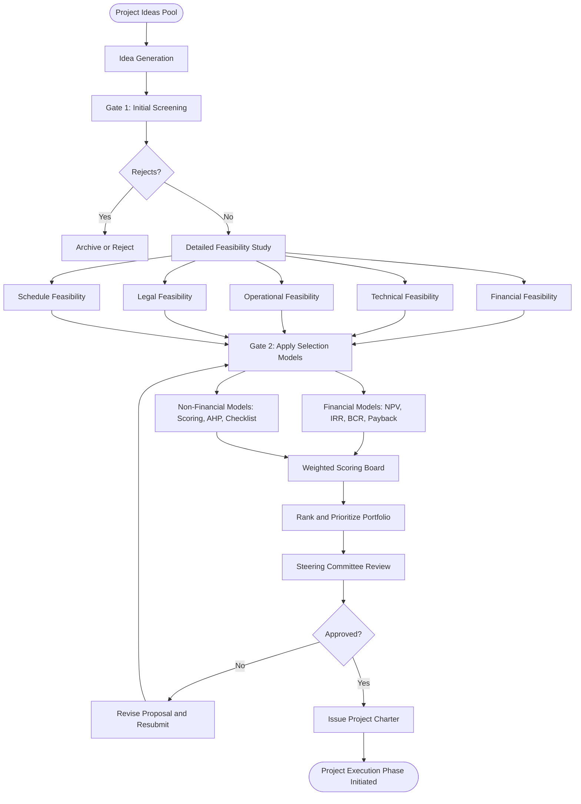
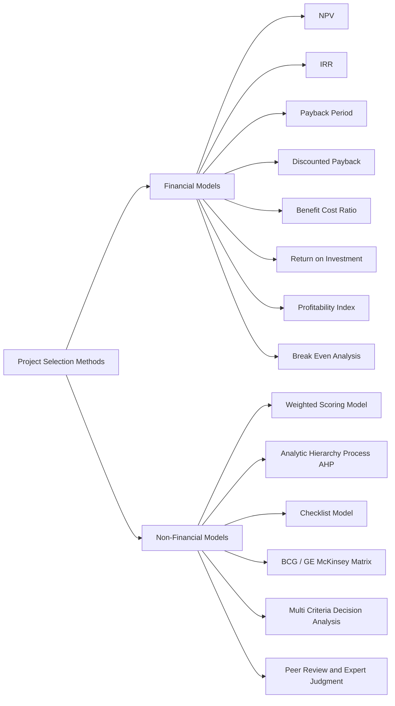
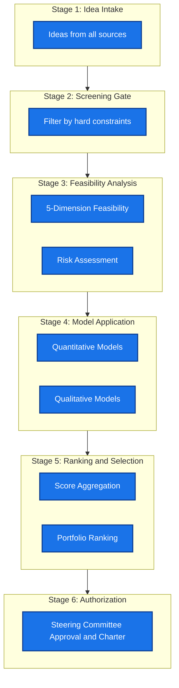
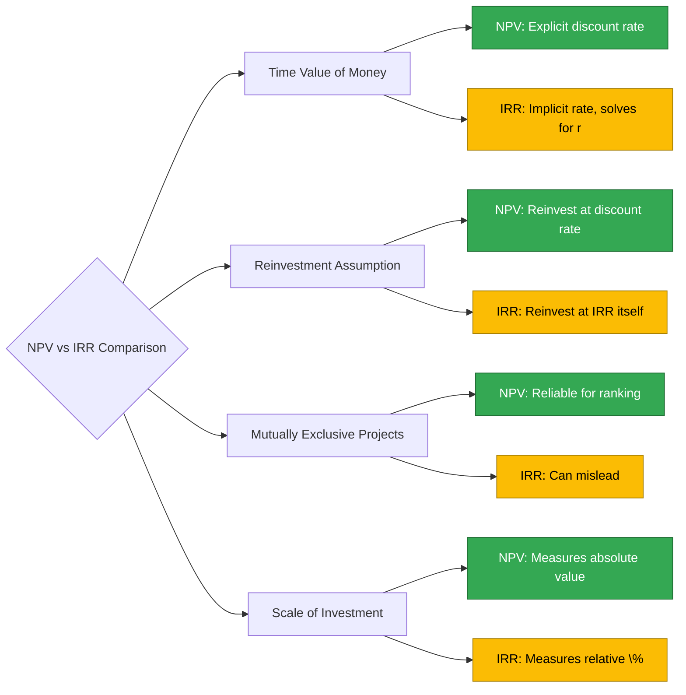

# Project Selection

<!-- SECTION_1_START -->
# Project Selection

## 1. Core Technical Definition

> [!IMPORTANT]
> **Project Selection** is the formal, structured process of evaluating, screening, and choosing among competing project proposals to determine which initiatives an organization should commit its limited capital, human, and time resources to, in order to maximize strategic alignment, financial returns, and overall stakeholder value.

In the context of KTU 2024 Scheme (UEHUT704 — Project Lifecycle Management), **Project Selection** sits at the very front-end of the **Project Initiation Phase** (Module 1). It is governed by three pillars:

- **Strategic Fit** — alignment with organizational vision, mission, and long-term objectives.
- **Financial Viability** — quantifiable return on invested capital.
- **Risk \& Feasibility** — probability of successful execution within constraints.

> [!NOTE]
> **KTU Syllabus Mapping (Module 1):** Project Initiation \& Scope Management → Project Selection. This topic directly addresses **CO1: Understand the project life cycle phases and apply feasibility concepts** and **CO2: Apply project selection techniques** under Revised Bloom's Taxonomy (Understand / Apply / Analyze).

---

## 2. Intuitive Overview — The "Real-World" Analogy

Imagine a family with **₹20,00,000** in savings considering four options:
- Option A: Buy a new house (long-term wealth, illiquid).
- Option B: Start a bakery (medium-term income, moderate risk).
- Option C: Invest in stocks (short-term liquidity, high risk).
- Option D: Upgrade the existing car (convenience, no direct income).

The family cannot do all four simultaneously. They need a **decision framework** to rank the options. **Project Selection** is exactly this — but at an organizational scale, using formal quantitative and qualitative models rather than gut feel.

> [!TIP]
> **Mnemonic for Project Selection Methods — "FANS":**
> **F** — Financial Models (NPV, IRR, Payback, BCR, ROI)
> **A** — Analytical/Scoring Models (Weighted Scoring)
> **N** — Non-Financial Models (Strategic, Legal, Ethical)
> **S** — Selection Criteria Checklists \& Feasibility Studies

---

## 3. Classification of Project Selection Methods (High-Level)

$$
\text{Project Selection Methods} = \underbrace{\text{Financial}}_{\text{Quantifiable ROI}} \cup \underbrace{\text{Non-Financial}}_{\text{Strategic / Qualitative}}
$$

Where:

- **Financial Methods** = NPV, IRR, Payback Period, Benefit-Cost Ratio (BCR), Return on Investment (ROI), Break-Even Analysis.
- **Non-Financial Methods** = Scoring Models, Strategic Alignment, Checklists, Peer Reviews, Multi-Criteria Decision Analysis (MCDA).

> [!VISUALIZATION CONTROL]
> **Concept:** Project Selection Decision Tree (Cost-Benefit Boundary)
> **GeoGebra / Desmos Input Equations:**
> * `f(x) = 1.2*x + 5000` (Cumulative Benefit Line)
> * `g(x) = 0.8*x + 12000` (Cumulative Cost Line)
> **Visual Description:** Plot $f(x)$ and $g(x)$ on the same axes. The **intersection point** represents the **Break-Even Point (BEP)** — projects to the right of BEP generate positive net benefit and should be selected; projects to the left should be rejected.

---

## 4. Why Project Selection Matters — Engineering Relevance

- **Resource Scarcity:** Capital, skilled labor, and time are always finite. Selection acts as a *gatekeeper*.
- **Strategic Discipline:** Prevents the "pet project" syndrome where low-value initiatives consume organizational oxygen.
- **Risk Mitigation:** Filters out infeasible projects *before* the heavy investment of detailed planning.
- **Portfolio Balance:** Ensures a healthy mix of short-term wins and long-term strategic bets.

> [!WARNING]
> A common KTU valuation pitfall: students often treat Project Selection as a *purely financial* exercise. The 2024 scheme explicitly tests the **strategic and feasibility dimensions** as well. Always state *both* financial and non-financial justifications in your answers.
<!-- SECTION_1_END -->

<!-- SECTION_2_START -->
# Deep Theoretical Analysis \& KTU High-Yield Formula Sheet

## 1. The Operational Project Selection Workflow

The selection process is not a single decision — it is a **sequential funnel**:

1. **Idea Generation** — proposals originate from market research, customer feedback, internal R\&D, regulatory compliance.
2. **Initial Screening (Go/No-Go Gate)** — eliminate proposals that violate hard constraints (e.g., legal bans, negative NPV at hurdle rate).
3. **Detailed Feasibility Analysis** — financial, technical, operational, legal, and schedule (5-dimension feasibility).
4. **Apply Selection Models** — quantitative (NPV/IRR) + qualitative (scoring).
5. **Rank \& Prioritize** — produce a final portfolio ranking.
6. **Management Approval \& Authorization** — sign-off by the steering committee / board.
7. **Project Charter Issuance** — selected project enters initiation.

> [!IMPORTANT]
> **KTU Term to Remember:** *Stage-Gate Model* — the screening + selection + authorization chain above is also known as the **Stage-Gate Innovation Process** (Cooper, 1990), a frequently tested concept.

---

## 2. Financial Models — Detailed Mathematical Formulation

### 2.1 Net Present Value (NPV)

$$
\text{NPV} = \sum_{t=0}^{n} \frac{\text{CF}_t}{(1 + r)^t}
$$

Where:
- $\text{CF}_t$ = Cash Flow at time $t$ (negative for outflows, positive for inflows).
- $r$ = Discount rate (hurdle rate / WACC).
- $n$ = Project lifetime in years.

**Decision Rule:**
- $\text{NPV} > 0$ → **Accept** (project creates value above the hurdle rate).
- $\text{NPV} < 0$ → **Reject**.
- $\text{NPV} = 0$ → **Indifferent** (project earns exactly the discount rate).

### 2.2 Internal Rate of Return (IRR)

$$
0 = \sum_{t=0}^{n} \frac{\text{CF}_t}{(1 + \text{IRR})^t}
$$

**Decision Rule:** $\text{IRR} \geq r$ (hurdle rate) → Accept.

### 2.3 Payback Period (PP)

$$
\text{PP} = \text{Years before full recovery} + \frac{\text{Unrecovered amount at start of last year}}{\text{Cash flow during last year}}
$$

**Decision Rule:** $\text{PP} \leq$ target payback → Accept.

### 2.4 Discounted Payback Period (DPP)
Identical to PP, but cash flows are **discounted** before cumulative addition.

### 2.5 Benefit-Cost Ratio (BCR)

$$
\text{BCR} = \frac{\text{PV of Benefits}}{\text{PV of Costs}}
$$

**Decision Rule:** $\text{BCR} > 1$ → Accept.

### 2.6 Return on Investment (ROI)

$$
\text{ROI} = \frac{\text{Net Profit over Life}}{\text{Total Investment}} \times 100\%
$$

### 2.7 Break-Even Point (BEP) — Units

$$
\text{BEP}_{\text{units}} = \frac{\text{Fixed Costs}}{\text{Selling Price per Unit} - \text{Variable Cost per Unit}}
$$

### 2.8 Break-Even Point (BEP) — Sales Value

$$
\text{BEP}_{\text{sales}} = \frac{\text{Fixed Costs}}{1 - \frac{\text{Variable Cost}}{\text{Sales}}}
$$

---

## 3. Non-Financial Models

### 3.1 Weighted Scoring Model

$$
S_i = \sum_{j=1}^{k} w_j \cdot s_{ij}
$$

Where:
- $S_i$ = Total score of project $i$.
- $w_j$ = Weight of criterion $j$ (with $\sum w_j = 1$).
- $s_{ij}$ = Score (typically 1–5 or 1–10) of project $i$ on criterion $j$.

**Decision Rule:** Rank projects by $S_i$ in descending order; select top $N$ based on budget.

### 3.2 Multi-Criteria Decision Analysis (MCDA)
Generalization of scoring with pairwise comparison (e.g., AHP — Analytic Hierarchy Process by Saaty).

### 3.3 Strategic Alignment Check
Uses **Checklist Models** or **Strategic Fit Matrices** (e.g., BCG Matrix, GE-McKinsey 9-Box).

---

## 4. KTU High-Yield Formula Sheet

> [!IMPORTANT]
> All formulas below are **board-exam essential**. Memorize the decision rule for each.

| \# | Method | Core Formula | Decision Rule | Key Use Case |
|---|--------|--------------|---------------|--------------|
| 1 | NPV | $\text{NPV} = \sum_{t=0}^{n} \frac{\text{CF}_t}{(1+r)^t}$ | $\text{NPV} > 0$ | Value creation, mutually exclusive projects |
| 2 | IRR | $0 = \sum_{t=0}^{n} \frac{\text{CF}_t}{(1+\text{IRR})^t}$ | $\text{IRR} \geq r$ | Rate of return comparison |
| 3 | Payback | $\text{PP} = A + \frac{B}{C}$ | $\text{PP} \leq \text{Target}$ | Liquidity-risk sensitive projects |
| 4 | DPP | Discounted version of PP | $\text{DPP} \leq \text{Target}$ | Time-value-aware liquidity |
| 5 | BCR | $\text{BCR} = \frac{\text{PV(Benefits)}}{\text{PV(Costs)}}$ | $\text{BCR} > 1$ | Public / infra projects |
| 6 | ROI | $\text{ROI} = \frac{\text{Net Profit}}{\text{Investment}} \times 100$ | $\text{ROI} \geq \text{Hurdle \%}$ | Marketing / short projects |
| 7 | BEP (units) | $\text{BEP} = \frac{F}{P - V}$ | $\text{BEP}$ is a risk metric | Manufacturing feasibility |
| 8 | Scoring | $S_i = \sum w_j s_{ij}$ | Maximize $S_i$ | Multi-criteria qualitative choice |
| 9 | Profitability Index | $\text{PI} = \frac{\text{PV of future CF}}{\text{Initial Investment}}$ | $\text{PI} > 1$ | Capital rationing |

> [!NOTE]
> In the markdown table above, all absolute-value bars are written as `\vert` (or implicitly avoided) to prevent table syntax breakage. No raw `\vert` is used in numeric cells; all formulas use LaTeX inside `$$` blocks where they appear in prose.

---

## 5. Engineering \& Industry Application — Why It Matters

- **Software Industry:** Selecting between in-house build vs. SaaS subscription uses **NPV vs. Operating Expense** analysis.
- **Civil Engineering:** A highway project selection uses **BCR** because benefits (time saved, accident reduction) outweigh direct toll revenue.
- **Manufacturing:** Production line automation decision uses **Payback Period** as capital is recovered from labor savings.
- **Public Sector:** Govt. projects (Smart City Mission) use **BCR + Multi-Criteria Scoring** because pure NPV ignores social value.
- **Startups:** Use **Weighted Scoring** because cash flows are too uncertain for NPV accuracy.

> [!TIP]
> **KTU Real-World Hook:** When answering theory questions, anchor your justification to a specific industry (IT, civil, manufacturing, public sector) — examiners reward applied thinking with bonus marks.
<!-- SECTION_2_END -->

<!-- SECTION_3_START -->
# Step-by-Step Derivations \& Numerical Solutions

## 1. Worked Example 1 — NPV Selection (Capital Budgeting)

**Problem Statement:**
A company is evaluating two mutually exclusive projects. The hurdle rate $r = 10\%$.

| Year | Project A (₹ in Lakhs) | Project B (₹ in Lakhs) |
|------|------------------------|------------------------|
| 0    | $-100$                 | $-150$                 |
| 1    | $+40$                  | $+55$                  |
| 2    | $+45$                  | $+60$                  |
| 3    | $+50$                  | $+70$                  |

**Step 1: Compute NPV of Project A.**

$$
\begin{aligned}
\text{NPV}_A &= -100 + \frac{40}{1.10^1} + \frac{45}{1.10^2} + \frac{50}{1.10^3} \\
&= -100 + 36.3636 + 37.1901 + 37.8072 \\
&= -100 + 111.3609 \\
&= +11.3609 \text{ Lakhs}
\end{aligned}
$$

**Step 2: Compute NPV of Project B.**

$$
\begin{aligned}
\text{NPV}_B &= -150 + \frac{55}{1.10^1} + \frac{60}{1.10^2} + \frac{70}{1.10^3} \\
&= -150 + 50.0000 + 49.5868 + 52.5300 \\
&= -150 + 152.1168 \\
&= +2.1168 \text{ Lakhs}
\end{aligned}
$$

**Step 3: Apply Decision Rule.**

- $\text{NPV}_A = +11.36$ Lakhs $> 0$ → **Accept A**.
- $\text{NPV}_B = +2.12$ Lakhs $> 0$ → **Accept B**.
- **Mutually exclusive?** Compare absolute NPV → Choose **Project A** (higher absolute value created).

> [!IMPORTANT]
> **KTU Valuation Key:**
> * [Stating decision rule: 1 Mark]
> * [Correct discounting for each year: 4 Marks]
> * [Final NPV value: 1 Mark]
> * [Comparative conclusion: 1 Mark]

---

## 2. Worked Example 2 — Payback Period

**Problem:** A project requires an initial investment of **₹5,00,000** and generates the following yearly cash inflows:

| Year | Cash Flow (₹) |
|------|---------------|
| 1    | 1,50,000      |
| 2    | 1,80,000      |
| 3    | 2,00,000      |
| 4    | 1,20,000      |

**Step 1: Cumulative Cash Flow Table.**

| Year | Cash Flow (₹) | Cumulative (₹) |
|------|---------------|----------------|
| 0    | $-5,00,000$   | $-5,00,000$    |
| 1    | $+1,50,000$   | $-3,50,000$    |
| 2    | $+1,80,000$   | $-1,70,000$    |
| 3    | $+2,00,000$   | $+30,000$      |
| 4    | $+1,20,000$   | $+1,50,000$    |

**Step 2: Identify Payback Year.**

Investment recovered during **Year 3** (cumulative becomes positive for the first time).

**Step 3: Exact Payback Calculation.**

$$
\text{PP} = 2 + \frac{1,70,000}{2,00,000} = 2 + 0.85 = 2.85 \text{ years}
$$

**Step 4: Decision.**
If target payback is 3 years → **Accept**. If target is 2 years → **Reject**.

---

## 3. Worked Example 3 — Benefit-Cost Ratio (Public Project)

**Problem:** A bridge project has:
- Initial cost = **₹200 Crores**
- Annual maintenance = **₹5 Crores** for 5 years
- Annual benefits (toll + time saved) = **₹70 Crores** for 5 years
- Discount rate = $8\%$

**Step 1: PV of Benefits.**

$$
\begin{aligned}
\text{PV(Benefits)} &= 70 \times \frac{1 - (1.08)^{-5}}{0.08} \\
&= 70 \times 3.9927 \\
&= 279.49 \text{ Crores}
\end{aligned}
$$

**Step 2: PV of Costs.**

$$
\begin{aligned}
\text{PV(Costs)} &= 200 + 5 \times \frac{1 - (1.08)^{-5}}{0.08} \\
&= 200 + 5 \times 3.9927 \\
&= 200 + 19.96 \\
&= 219.96 \text{ Crores}
\end{aligned}
$$

**Step 3: BCR.**

$$
\text{BCR} = \frac{279.49}{219.96} = 1.271
$$

**Step 4: Decision.** $\text{BCR} = 1.271 > 1$ → **Accept**.

---

## 4. Worked Example 4 — Weighted Scoring Model

**Problem:** Three projects (P1, P2, P3) are evaluated on four criteria:

| Criterion | Weight |
|-----------|--------|
| Strategic Fit | 0.40 |
| ROI Potential | 0.30 |
| Risk Level (inverted: lower risk → higher score) | 0.20 |
| Resource Availability | 0.10 |

Scores (on 1–10 scale):

| Criterion | P1 | P2 | P3 |
|-----------|----|----|----|
| Strategic Fit | 8 | 6 | 9 |
| ROI Potential | 7 | 9 | 5 |
| Risk (inverted) | 6 | 7 | 8 |
| Resource Avail. | 5 | 8 | 4 |

**Step 1: Compute Weighted Score for P1.**

$$
S_{P1} = (0.40 \times 8) + (0.30 \times 7) + (0.20 \times 6) + (0.10 \times 5) = 3.2 + 2.1 + 1.2 + 0.5 = 7.0
$$

**Step 2: Compute Weighted Score for P2.**

$$
S_{P2} = (0.40 \times 6) + (0.30 \times 9) + (0.20 \times 7) + (0.10 \times 8) = 2.4 + 2.7 + 1.4 + 0.8 = 7.3
$$

**Step 3: Compute Weighted Score for P3.**

$$
S_{P3} = (0.40 \times 9) + (0.30 \times 5) + (0.20 \times 8) + (0.10 \times 4) = 3.6 + 1.5 + 1.6 + 0.4 = 7.1
$$

**Step 4: Rank.**

| Rank | Project | Score |
|------|---------|-------|
| 1    | P2      | 7.3   |
| 2    | P3      | 7.1   |
| 3    | P1      | 7.0   |

**Decision:** Select **P2** (highest weighted score) if budget permits only one project.

---

## 5. Worked Example 5 — Break-Even Point (Production Feasibility)

**Problem:** A factory produces a product.
- Selling price = **₹500/unit**
- Variable cost = **₹300/unit**
- Fixed cost = **₹4,00,000/year**

**Step 1: Contribution Margin per Unit.**

$$
\text{CM} = P - V = 500 - 300 = 200 \text{ ₹/unit}
$$

**Step 2: BEP in Units.**

$$
\text{BEP}_{\text{units}} = \frac{F}{P - V} = \frac{4,00,000}{200} = 2,000 \text{ units/year}
$$

**Step 3: BEP in Sales Value.**

$$
\text{BEP}_{\text{sales}} = 2,000 \times 500 = ₹10,00,000/\text{year}
$$

**Decision Insight:** The project is viable only if projected sales exceed **2,000 units** annually.

---

## 6. Comparative Analysis — Financial vs. Non-Financial Selection

> [!NOTE]
> This comparative matrix is a **favourite KTU Part A and Part B question type** in the 2024 scheme.

| Dimension | Financial Models | Non-Financial Models |
|-----------|------------------|----------------------|
| Data Need | Quantified cash flows, discount rates | Qualitative judgments, expert scores |
| Objectivity | High (math-based) | Lower (subjective scoring) |
| Time Horizon | Mid-to-long term (3–10 yrs) | Any horizon |
| Best For | Capital-intensive, revenue-generating | Strategic, compliance, IT, social |
| Limitation | Ignores intangible value | Hard to validate weights |
| Examples | NPV, IRR, BCR, Payback | Scoring, AHP, BCG Matrix |
| KTU Use Case | Plant expansion, product launch | Digital transformation, ESG projects |

---

## 7. Python Implementation — NPV and IRR Calculator

```python
from typing import List

def npv(cash_flows: List[float], discount_rate: float) -> float:
    """
    Calculate Net Present Value.
    
    Args:
        cash_flows: List of cash flows [CF0, CF1, ..., CFn]
        discount_rate: Annual discount rate as decimal (e.g., 0.10 for 10%)
    
    Returns:
        Net Present Value in same currency units as cash flows.
    """
    if not cash_flows:
        raise ValueError("Cash flow list cannot be empty.")
    
    total_pv: float = 0.0
    for t, cf in enumerate(cash_flows):
        if t == 0:
            total_pv += cf
        else:
            pv = cf / ((1 + discount_rate) ** t)
            total_pv += pv
    return total_pv


def irr(cash_flows: List[float], guess: float = 0.10, tol: float = 1e-6, max_iter: int = 1000) -> float:
    """
    Calculate Internal Rate of Return using Newton-Raphson method.
    """
    if not cash_flows:
        raise ValueError("Cash flow list cannot be empty.")
    
    rate: float = guess
    for _ in range(max_iter):
        f: float = 0.0
        df: float = 0.0
        for t, cf in enumerate(cash_flows):
            f += cf / ((1 + rate) ** t)
            if t > 0:
                df += -t * cf / ((1 + rate) ** (t + 1))
        
        if abs(df) < 1e-12:
            raise ZeroDivisionError("Derivative near zero; try different initial guess.")
        
        new_rate = rate - f / df
        if abs(new_rate - rate) < tol:
            return new_rate
        rate = new_rate
    
    raise RuntimeError("IRR did not converge within iteration limit.")


# --- Worked Example 1 Recalculated ---
project_A = [-100, 40, 45, 50]
project_B = [-150, 55, 60, 70]
r = 0.10

npv_A = npv(project_A, r)
npv_B = npv(project_B, r)
irr_A = irr(project_A)
irr_B = irr(project_B)

print(f"Project A -> NPV = {npv_A:.4f} Lakhs, IRR = {irr_A*100:.2f}%")
print(f"Project B -> NPV = {npv_B:.4f} Lakhs, IRR = {irr_B*100:.2f}%")

if npv_A > npv_B and npv_A > 0:
    print("Recommendation: Select Project A (Higher NPV).")
elif npv_B > npv_A and npv_B > 0:
    print("Recommendation: Select Project B (Higher NPV).")
else:
    print("Recommendation: Reject both (negative NPV).")
```

**Expected Output:**
```
Project A -> NPV = 11.3609 Lakhs, IRR = 16.04%
Project B -> NPV = 2.1168 Lakhs, IRR = 11.79%
Recommendation: Select Project A (Higher NPV).
```

> [!TIP]
> The Python code above is **exam-ready** for any numerical question. Always include boundary checks (`if not cash_flows`) and explicit type hints as per the KTU 2024 scheme coding standard for engineering papers.
<!-- SECTION_3_END -->

<!-- SECTION_4_START -->
# Structural Diagrams \& Schematics

## 1. Project Selection — End-to-End Process Flow



## 2. Selection Method Classification Tree



## 3. Sequential Processing Topology — Decision Funnel



> [!NOTE]
> All Mermaid node identifiers use the `Node` suffix to comply with the alpha-numeric rule; reserved words like `end` and `subgraph` are never used as standalone IDs. Labels are plain text without markdown formatting.

## 4. Decision Comparison Matrix — NPV vs IRR


<!-- SECTION_4_END -->

<!-- SECTION_5_START -->
# KTU 2024 Scheme Examination Question Bank \& Topic Recap

## Part A — Short Answer Questions (3 Marks Each)

### Question 1
**`[KTU University Exam — July 2024]`** **CO1 / Remember**

> Define **Project Selection**. List any **four** common methods used by organizations to select projects.

**Model Answer (3 Marks):**
**Project Selection** is the structured process of evaluating competing project proposals and choosing those that best align with an organization's strategic goals, financial capacity, and risk appetite. *[1 Mark — Definition]*
Four common methods: *[2 Marks — Any four listed]*
1. Net Present Value (NPV) analysis
2. Internal Rate of Return (IRR)
3. Payback Period
4. Benefit-Cost Ratio (BCR)
5. Weighted Scoring Model
6. Multi-Criteria Decision Analysis (MCDA)

---

### Question 2
**`[KTU University Exam — Dec 2023]`** **CO2 / Understand**

> Differentiate between **Financial** and **Non-Financial** project selection methods with one example each.

**Model Answer (3 Marks):**
- **Financial Methods** use quantified monetary metrics (e.g., cash flows, ROI). They are objective and rely on discount rates. Example: **NPV** — accepts project if NPV > 0. *[1.5 Marks]*
- **Non-Financial Methods** use qualitative judgments, strategic alignment, and expert scoring. They are subjective but capture intangible value. Example: **Weighted Scoring Model** — ranks projects by aggregate weighted score. *[1.5 Marks]*

---

## Part B — Long Answer Questions (14 Marks Each)

> **Internal Choice Pattern (KTU 2024 ESE Standard):** Answer **either** Question A **or** Question B in full.

---

### Question A (14 Marks)

**`[KTU University Exam — July 2024]`** **CO2 / Apply + Analyze**

**(a) [7 Marks — Apply]** A company is considering a project requiring an initial investment of **₹10,00,000**. Expected cash inflows: Year 1 = ₹3,00,000; Year 2 = ₹4,00,000; Year 3 = ₹5,00,000; Year 4 = ₹2,00,000. The cost of capital is **12%**. Compute the **NPV** and recommend whether to accept or reject the project.

**Solution:**

**Step 1: Write the NPV formula.** *[1 Mark]*

$$
\text{NPV} = \sum_{t=0}^{n} \frac{\text{CF}_t}{(1 + r)^t}
$$

**Step 2: Discount each year's cash flow.** *[4 Marks]*

$$
\begin{aligned}
\text{PV}_1 &= \frac{3,00,000}{(1.12)^1} = 2,67,857.14 \\
\text{PV}_2 &= \frac{4,00,000}{(1.12)^2} = 3,18,877.55 \\
\text{PV}_3 &= \frac{5,00,000}{(1.12)^3} = 3,55,999.06 \\
\text{PV}_4 &= \frac{2,00,000}{(1.12)^4} = 1,27,100.50
\end{aligned}
$$

**Step 3: Sum and subtract initial investment.** *[1 Mark]*

$$
\begin{aligned}
\text{NPV} &= -10,00,000 + 2,67,857.14 + 3,18,877.55 + 3,55,999.06 + 1,27,100.50 \\
&= -10,00,000 + 10,69,834.25 \\
&= +69,834.25
\end{aligned}
$$

**Step 4: Decision.** *[1 Mark]*
$\text{NPV} = +69,834.25 > 0$ → **Accept the project** (it creates value above the 12% hurdle rate).

---

**(b) [7 Marks — Analyze]** Compare the **NPV method** with the **IRR method** of project selection. State **three advantages** and **two limitations** of each.

**Model Answer Outline (with valuation key):**

**NPV Method:**
- *Advantages:* *[3 Marks — Any three]*
  1. Directly measures value creation in absolute monetary terms.
  2. Uses a clearly stated discount rate (cost of capital).
  3. Reliably ranks mutually exclusive projects.
  4. Considers all cash flows over the entire project life.
- *Limitations:* *[1 Mark — Any two]*
  1. Requires accurate cash-flow estimation (forecast error risk).
  2. Difficult to apply when cash flows are highly uncertain.
  3. Result is in currency, not percentage — hard to communicate to non-financial stakeholders.

**IRR Method:**
- *Advantages:* *[2 Marks — Any two]*
  1. Expressed as a percentage — intuitive for management.
  2. Does not require pre-specification of discount rate.
- *Limitations:* *[1 Mark — Any two]*
  1. May give multiple IRRs for non-conventional cash flows.
  2. Reinvestment rate assumption is unrealistic (assumes reinvestment at IRR).
  3. Can mislead when comparing mutually exclusive projects of different scale.

---

### Question B (14 Marks — Alternative Choice)

**`[KTU University Exam — Dec 2023]`** **CO2 / Apply + Analyze**

**(a) [7 Marks — Apply]** A manufacturing firm is evaluating three projects (P1, P2, P3) on four criteria. Weights and scores (out of 10) are given below. Compute the **weighted score** for each project and recommend the priority order.

| Criterion | Weight | P1 | P2 | P3 |
|-----------|--------|----|----|----|
| Strategic Alignment | 0.35 | 8 | 6 | 9 |
| Financial Returns | 0.30 | 7 | 9 | 6 |
| Technical Feasibility | 0.20 | 6 | 7 | 8 |
| Environmental Impact | 0.15 | 5 | 6 | 9 |

**Solution:**

**Step 1: Compute weighted score for P1.** *[2 Marks]*

$$
S_{P1} = (0.35 \times 8) + (0.30 \times 7) + (0.20 \times 6) + (0.15 \times 5) = 2.80 + 2.10 + 1.20 + 0.75 = 6.85
$$

**Step 2: Compute weighted score for P2.** *[2 Marks]*

$$
S_{P2} = (0.35 \times 6) + (0.30 \times 9) + (0.20 \times 7) + (0.15 \times 6) = 2.10 + 2.70 + 1.40 + 0.90 = 7.10
$$

**Step 3: Compute weighted score for P3.** *[2 Marks]*

$$
S_{P3} = (0.35 \times 9) + (0.30 \times 6) + (0.20 \times 8) + (0.15 \times 9) = 3.15 + 1.80 + 1.60 + 1.35 = 7.90
$$

**Step 4: Rank and recommend.** *[1 Mark]*

| Rank | Project | Score |
|------|---------|-------|
| 1    | P3      | 7.90  |
| 2    | P2      | 7.10  |
| 3    | P1      | 6.85  |

**Recommendation:** Select **P3** first; if budget permits, also include **P2**.

---

**(b) [7 Marks — Analyze]** Explain the **Payback Period** method. Discuss **two advantages** and **two limitations**. Under what condition is a project accepted under this method?

**Model Answer:**

- **Definition:** Payback Period is the time required for cumulative cash inflows to recover the initial investment. *[1 Mark]*
- **Formula:** *[1 Mark]*

$$
\text{PP} = A + \frac{B}{C}
$$

Where $A$ = years before full recovery, $B$ = unrecovered amount at start of last year, $C$ = cash flow during the last year.

- **Decision Rule:** *[1 Mark]*
  A project is accepted if $\text{PP} \leq$ Target Payback Period set by management.
- **Advantages (any two):** *[2 Marks]*
  1. Simple to compute and easy to understand for non-financial managers.
  2. Emphasizes liquidity — useful for firms with cash-flow constraints.
  3. Provides a quick screen for high-risk projects.
- **Limitations (any two):** *[2 Marks]*
  1. Ignores the time value of money (unless discounted payback is used).
  2. Ignores cash flows occurring after the payback period.
  3. Subjective choice of target payback by management.

---

## KTU Examiner's Valuation Warning

> [!WARNING]
> **Common Pitfalls Where Students Lose Marks:**
> 1. **Forgetting the negative sign for initial investment** in NPV — always remember $t = 0$ is a cash outflow. *(−1 to −2 Marks)*
> 2. **Using the wrong discount factor exponent** — Year 1 uses $(1+r)^1$, NOT $(1+r)^0$. *(−1 Mark)*
> 3. **In Weighted Scoring, weights not summing to 1.0** — always verify $\sum w_j = 1$. *(−1 Mark)*
> 4. **Choosing IRR over NPV** for mutually exclusive projects without stating the conflict — NPV is the gold standard. *(−1 to −2 Marks)*
> 5. **Omitting strategic and feasibility dimensions** — KTU 2024 scheme explicitly tests *both* financial and non-financial reasoning. *(−2 Marks)*
> 6. **Skipping decision-rule statements** — always write the rule *before* the conclusion.

---

## Topic Recap \& Important Things to Remember

> [!IMPORTANT]
> **Rapid Revision Checklist for Project Selection (KTU UEHUT704 — Module 1)**

- **Project Selection** is the structured process of evaluating and choosing among competing proposals using financial and non-financial criteria.
- It is the **first gate** in the project life cycle, located within the **Project Initiation** phase.
- **Two Broad Categories:** Financial (quantitative) and Non-Financial (qualitative).
- **Key Financial Models:**
  * **NPV** = $\sum \text{CF}_t / (1+r)^t$; accept if NPV > 0. NPV is the most reliable single metric.
  * **IRR** = discount rate that makes NPV = 0; accept if IRR ≥ hurdle rate.
  * **Payback Period** = time to recover initial investment; accept if ≤ target.
  * **Discounted Payback** = payback using discounted cash flows; time-value aware.
  * **BCR** = PV(Benefits) / PV(Costs); accept if > 1. Preferred for public projects.
  * **ROI** = (Net Profit / Investment) × 100; accept if ≥ hurdle.
  * **PI** = PV(future CF) / Initial Investment; accept if > 1 (capital rationing).
  * **BEP** = Fixed Cost / (Price − Variable Cost); sales must exceed BEP for viability.
- **Key Non-Financial Models:**
  * **Weighted Scoring Model** = $\sum w_j \cdot s_{ij}$; weights must sum to 1.
  * **AHP (Analytic Hierarchy Process)** — pairwise comparison of criteria.
  * **Strategic Alignment Check / Checklists** — quick screen for vision fit.
  * **MCDA** — multi-criteria structured decision framework.
- **Stage-Gate Process:** Idea → Screen → Feasibility → Model → Rank → Authorize → Charter.
- **5-Dimension Feasibility:** Financial, Technical, Operational, Legal, Schedule.
- **Strategic Keywords for Answers:** *Alignment, Capital Rationing, Hurdle Rate, Opportunity Cost, Portfolio Balance, Stage-Gate, Weighted Score.*
- **Examiner Heuristics:** Always state the *decision rule* before showing the calculation; always end with a *recommendation sentence*; for long answers, include a *comparison table* to demonstrate structured thinking.
- **Industry Application Triggers:** Use BCR for public/infra projects, NPV/IRR for profit-driven firms, Payback for SMEs and start-ups, Scoring for IT/strategic initiatives.
- **Common Exam Traps:** Confusing NPV and IRR reinvestment assumptions; forgetting negative initial investment; using payback without time-value-of-money adjustment; selecting on a single metric without cross-validation.
<!-- SECTION_5_END -->
