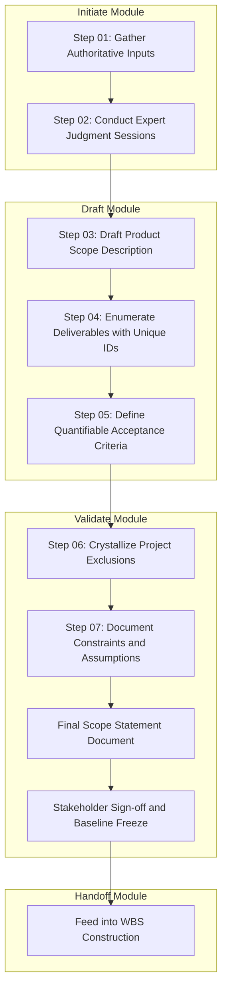
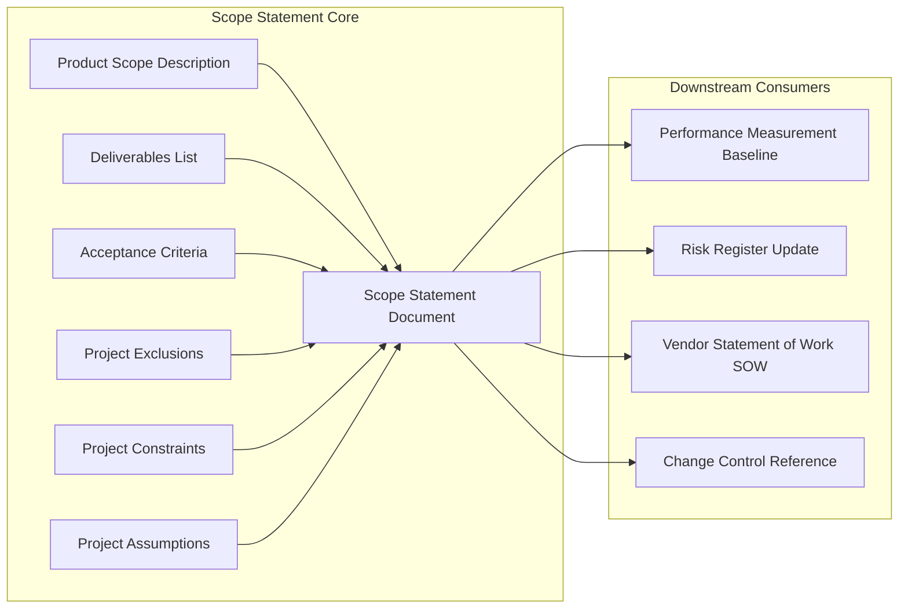
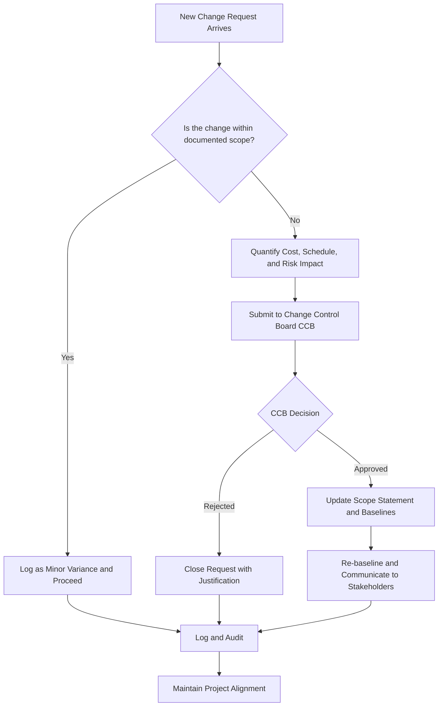
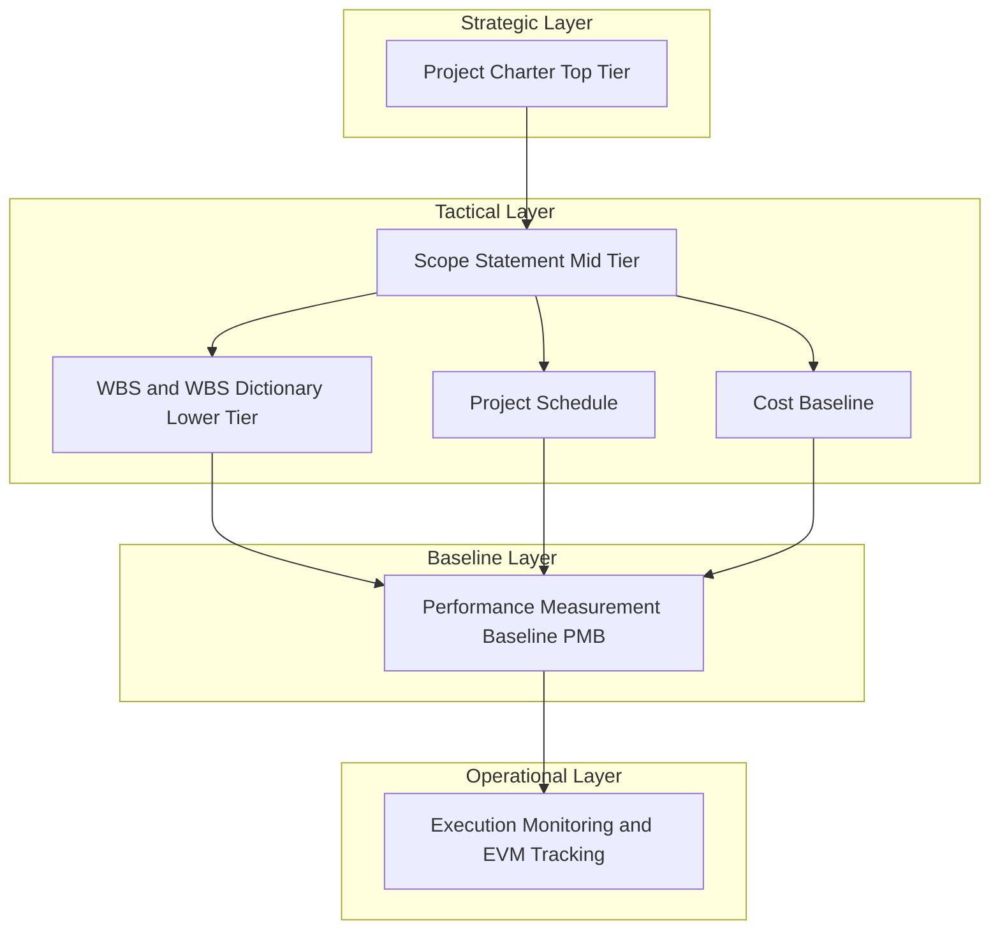

# Scope Statement

<!-- SECTION_1_START -->
# Scope Statement — The Definitive Project Boundary Document

## 1.1 Formal Academic Definition (PMBOK 7th Edition / KTU-Aligned)

> [!IMPORTANT]
> **Scope Statement (Project Scope Statement):** A written narrative description of the **project scope**, including the **project's deliverables**, **acceptance criteria**, **exclusions**, **constraints**, and **assumptions**. It is a critical output of the **Plan Scope Management** and **Define Scope** processes, and serves as the foundational baseline reference document against which all future project decisions, change requests, and deliverables are evaluated.

In the context of the **Project Lifecycle Management (UEHUT704)** course, the Scope Statement is studied as a sub-component of the broader **Scope Management Knowledge Area** within Module 1 (Project Initiation & Scope Management). It is the **single most cited reference document** by the Project Management Office (PMO) when a scope-related dispute arises.

> [!NOTE]
> **KTU 2024 Syllabus Highlight — HMC Core:**
> Students must be able to (i) **identify** the structural components of a scope statement, (ii) **differentiate** between product scope and project scope, and (iii) **draft** a working scope statement for a real-world engineering project.

---

## 1.2 Conceptual Analogy — The "Architect's Blueprint" Mental Model

Imagine that you commission an architect to build your dream home. Before the first brick is laid, the architect prepares a **"Brief" document** that says:

- **What will be built** — a 3-bedroom villa with a double garage (this is the *deliverable*).
- **What will NOT be built** — no swimming pool, no servant quarter (this is the *exclusion*).
- **What shape it must satisfy** — the walls must withstand 200 kmph wind loads; the roof must be rainwater-harvesting compliant (these are *acceptance criteria*).
- **What restrictions exist** — the plot is in a coastal regulatory zone, so height is capped at **9 meters** (this is a *constraint*).
- **What we are assuming to be true** — soil bearing capacity is 200 kN/m² as per the geo-technical report dated March 2024 (this is an *assumption*).

> That architect's brief is **functionally equivalent to a Scope Statement** in a software, civil, or mechanical engineering project. The moment a client walks in mid-construction and says *"I also want a swimming pool"*, the project manager points to the brief and says: *"That is a **scope change** — and it will cost extra, and require extra time."*

The Scope Statement is the **legal-and-operational guardian** of the project's boundaries.

---

## 1.3 Why Scope Statement Exists — The Three Failure Modes It Prevents

| # | Failure Mode (Without Scope Statement) | Engineering Reality |
|---|----------------------------------------|----------------------|
| 1 | **Scope Creep** — uncontrolled expansion of features | A B.Tech final-year project keeps adding "just one more module" every week and never ships. |
| 2 | **Gold Plating** — over-engineering beyond need | A team builds a custom AI engine when an off-the-shelf library would have sufficed. |
| 3 | **Scope Ambiguity** — stakeholders disagree on what is "done" | Client says "the app is incomplete"; team says "all requested features are live." |

The Scope Statement neutralizes all three by forcing **explicit, written, sign-off-bound articulation** of what the project will and will not deliver.

---

## 1.4 Physical / Standard Metrics Used in Scope Documentation

- **Earned Value (EV) Boundary** — measured in monetary terms (₹, $, €) and tracked against the **Performance Measurement Baseline (PMB)**.
- **Work Breakdown Structure (WBS) Depth** — typically **3 to 6 levels**, with the Scope Statement providing input to Level 2.
- **Acceptance Threshold** — quantitative pass/fail metric, e.g., *"Page load time $\leq$ 2 seconds under 10,000 concurrent users."*
- **Constraint Tolerance** — e.g., budget variance tolerance of **$\pm 10\%$** before escalation.
- **Assumption Validity Window** — most assumptions are reviewed every **30 / 60 / 90 days** depending on risk exposure.

> [!TIP]
> **Exam Tip:** When the KTU examiner asks *"List the components of a Scope Statement"*, the standard expected answer contains **six** elements: (1) Product scope description, (2) Deliverables, (3) Acceptance criteria, (4) Project exclusions, (5) Constraints, (6) Assumptions. Memorize this exact six-element list — it is the most repeated short-answer on this topic.

<!-- SECTION_1_END -->

<!-- SECTION_2_START -->
# Deep Theoretical Analysis & KTU High-Yield Knowledge Sheet

## 2.1 The Six Structural Components — Expanded Logic

### Component 1 — Product Scope Description
A **narrative description of what the product, service, or result** of the project will look like once delivered. It is *future-tense* and *outcome-oriented*.

- *Why it matters:* Anchors the team to a tangible vision.
- *How it is created:* Derived from the **Project Charter**, **Business Case**, and **Stakeholder Requirements**.

### Component 2 — Deliverables
Any **unique and verifiable product, result, or capability** that must be produced to complete the project. Each deliverable is **atomic, measurable, and named**.

- *Example:* "Working mobile app, version 1.0, deployed on Google Play Store and Apple App Store."
- *Why it matters:* Deliverables are the *atomic units* that the WBS decomposes into work packages.

### Component 3 — Acceptance Criteria
A **set of conditions that must be met before the deliverable is accepted** by the customer or sponsor.

- *Quantifiable form:* "Defect density $\leq$ 0.5 defects per KLOC (Kilo Lines of Code)."
- *Why it matters:* Defines "done" in a verifiable, non-debatable way.

### Component 4 — Project Exclusions
An **explicit list of what is OUT of scope**. Counter-intuitively, exclusions are *more important* than inclusions because they prevent scope creep.

- *Why it matters:* "The single most underutilized section of the scope statement" — PMBOK commentary.

### Component 5 — Project Constraints
Any **limiting factor that affects the project execution** (e.g., fixed deadline, fixed budget, regulatory compliance, technology stack lock-in).

- *Categories:* Schedule, Cost, Scope, Quality, Resources, Risk, Regulatory.
- *Why it matters:* Constraints define the *iron triangle* the project must operate within.

### Component 6 — Project Assumptions
Factors considered **true, real, or certain** for planning purposes, even though they carry risk if they later prove false.

- *Why it matters:* Assumptions feed directly into the **Risk Register**. Each assumption should have a corresponding risk entry.

---

## 2.2 The Flow Logic — Where Does the Scope Statement Sit?

The Scope Statement is a **downstream consumer** of the Project Charter and an **upstream feeder** of the WBS:

$$
\begin{aligned}
\text{Project Charter} &\longrightarrow \text{Scope Statement} \longrightarrow \text{WBS} \longrightarrow \text{Project Schedule} \\
&\longrightarrow \text{Cost Baseline} \longrightarrow \text{Performance Measurement Baseline (PMB)}
\end{aligned}
$$

> [!NOTE]
> The **Performance Measurement Baseline (PMB)** is the integrated, approved scope-schedule-cost baseline against which **Earned Value Management (EVM)** metrics such as CPI (Cost Performance Index) and SPI (Schedule Performance Index) are computed. The Scope Statement is the **genesis document** of this entire measurement chain.

---

## 2.3 KTU High-Yield Formula & Parameter Sheet

| # | Term | Definition | Unit / Metric | KTU Exam Frequency |
|---|------|------------|---------------|---------------------|
| 1 | **Product Scope** | The features and functions that characterize a product, service, or result. | Qualitative description | Very High |
| 2 | **Project Scope** | The work that needs to be accomplished to deliver a product, service, or result. | Work packages | Very High |
| 3 | **Deliverable** | Any unique and verifiable product, result, or capability. | Count / List | Very High |
| 4 | **Acceptance Criteria** | Conditions that must be met for deliverable acceptance. | Quantitative thresholds | High |
| 5 | **Exclusion** | What is explicitly outside project boundaries. | List | High |
| 6 | **Constraint** | Limiting factor affecting project execution. | Schedule / Cost / Quality | Very High |
| 7 | **Assumption** | Factor considered true for planning purposes. | List with risk linkage | High |
| 8 | **Scope Baseline** | Approved scope statement + WBS + WBS dictionary. | Document set | Medium |
| 9 | **EAC (Estimate at Completion)** | Total expected cost of completing the project. | Currency (₹) | Medium |
| 10 | **VAC (Variance at Completion)** | Budget $-$ EAC | Currency (₹) | Medium |

> [!WARNING]
> **KTU Examiner Watch — Common Confusions:**
> - **Product Scope $\neq$ Project Scope.** Product = *what you are building*. Project = *the work to build it*. Conflating these two costs 2 marks per question.
> - **Exclusions $\neq$ Constraints.** Exclusions are *out-of-scope items*; Constraints are *boundaries within scope*. Many students interchange them — examiners actively look for this slip.

---

## 2.4 Real-World Engineering Utility

The Scope Statement is used in production-grade engineering organizations as follows:

1. **Contract Legal Anchor** — In EPC (Engineering, Procurement, Construction) projects, the scope statement forms **Schedule A of the contract**. Disputes are settled against it.
2. **Vendor Statement of Work (SOW)** — When outsourcing a sub-deliverable, the scope statement is sliced and reused as a vendor SOW.
3. **Agile Sprint Scope Sheet** — In hybrid Agile-Waterfall projects, the scope statement's exclusions section prevents "ticket creep" during sprint grooming.
4. **Change Control Trigger** — Any request that contradicts the scope statement automatically triggers the **Integrated Change Control** process.
5. **Audit Trail Document** — During ISO 9001 / CMMI Level 3+ audits, the scope statement is the **first document requested** to verify the QMS alignment.

<!-- SECTION_2_END -->

<!-- SECTION_3_START -->
# Step-by-Step Construction of a Scope Statement & Real-World Engineering Case Analysis

## 3.1 The 7-Step Construction Methodology

The following exhaustive, step-by-step methodology is the standard PMI-endorsed procedure for drafting a Scope Statement. Each step is written out fully — **no shortcuts, no truncation**.

### Step 1 — Gather Authoritative Inputs
Collect the **Project Charter**, **Business Case**, **Stakeholder Register**, and any pre-existing **requirements documentation**. These documents are the *raw material*.

### Step 2 — Conduct Expert Judgment Sessions
Convene workshops with **subject matter experts (SMEs)**, the sponsor, and key stakeholders. The objective is to *verbalize* the implicit scope before it is *written down*.

### Step 3 — Draft the Product Scope Description
Write a **2 to 4 paragraph narrative** describing the future-state product/service/result in customer-centric language. Avoid technical jargon; speak in terms of *user outcomes*.

### Step 4 — Enumerate Deliverables
List every **unique, verifiable deliverable**. For each, assign a **unique identifier** (e.g., D-01, D-02, …) and a **single owner**.

### Step 5 — Define Quantifiable Acceptance Criteria
For **each** deliverable, write at least one **measurable** acceptance criterion. Use the **SMART** rule — Specific, Measurable, Achievable, Relevant, Time-bound.

### Step 6 — Crystallize Exclusions
List **what is not included**. Be brutal. Common exclusions include: training beyond a defined session count, hardware procurement, post-go-live support, and data migration from legacy systems.

### Step 7 — Document Constraints and Assumptions
- **Constraints**: Fixed budget ceiling, fixed regulatory deadline, mandated technology stack.
- **Assumptions**: Document each assumption, then **link it to a risk** in the Risk Register.

---

## 3.2 Worked Example — A Real Engineering Case (B.Tech Capstone Project)

**Project Title:** *Design and Deployment of an IoT-Based Smart Irrigation System for the University Botanic Garden*

Below is the **fully written out** scope statement, applicable to a typical KTU B.Tech final-year project.

### 3.2.1 Product Scope Description
The project will deliver a **fully operational, solar-powered IoT irrigation system** that monitors real-time soil moisture, ambient temperature, and humidity across **three zones** of the University Botanic Garden, and **automatically actuates solenoid valves** to dispense water when predefined moisture thresholds are crossed. The system will provide a **web-based dashboard** accessible to the园艺 (horticulture) department staff and a **SMS alert module** for the maintenance supervisor.

### 3.2.2 Deliverables

| ID | Deliverable | Owner |
|----|-------------|-------|
| D-01 | Soil moisture sensor nodes (n $= 12$) deployed and calibrated | Team Member A |
| D-02 | Central gateway with LoRaWAN uplink | Team Member B |
| D-03 | Cloud-hosted dashboard (AWS IoT Core) | Team Member C |
| D-04 | SMS alert module (Twilio API) | Team Member D |
| D-05 | Solar power subsystem with battery backup $\geq 48$ hours | Team Member A |
| D-06 | Installation, commissioning, and user training (2 sessions) | All |

### 3.2.3 Acceptance Criteria
- Sensor data refresh interval: $\leq 60$ seconds.
- Dashboard page load time: $\leq 3$ seconds on 4G mobile network.
- Valve actuation latency from threshold breach: $\leq 30$ seconds.
- System uptime over a 30-day evaluation period: $\geq 99.0\%$.
- False-alert rate (SMS): $\leq 1$ per week per zone.

### 3.2.4 Project Exclusions
- E-01: Underground pipe-laying beyond the 3 designated zones.
- E-02: Fertilizer dosing — only water irrigation is in scope.
- E-03: Maintenance contract beyond the 90-day defect-liability period.
- E-04: Integration with the university's legacy SCADA system.

### 3.2.5 Project Constraints
- **Budget**: ₹ 1,50,000 (hard cap, non-negotiable).
- **Timeline**: Must be completed by 30 April 2025 (university fixed deadline).
- **Technology**: Open-source hardware (Arduino / ESP32) preferred; no proprietary vendor lock-in.
- **Regulatory**: Must comply with Kerala State Electricity Regulatory Commission (KSERC) solar installation norms.

### 3.2.6 Project Assumptions

| ID | Assumption | Linked Risk |
|----|------------|-------------|
| A-01 | LoRaWAN signal coverage is sufficient across all 3 zones. | R-01: Coverage gaps may require repeaters. |
| A-02 | Solar irradiance averages $\geq 4.5$ peak-sun-hours/day. | R-02: Monsoon underperformance of solar. |
| A-03 | AWS free-tier quota suffices for the demo period. | R-03: Cost overrun on AWS billing. |
| A-04 | Botanic garden staff available for training on 2 fixed dates. | R-04: Rescheduling may delay sign-off. |

---

## 3.3 Engineering-Case-to-Framework Mapping (Humanities Comparative Matrix)

The following matrix is the **KTU-mandated analytical tool** for HMC Core papers. It maps real-world engineering scenarios to the structural components of the scope statement.

| Engineering Project Scenario | Product Scope Lens | Deliverable Count | Acceptance Threshold | Critical Exclusion | Binding Constraint | Pivotal Assumption |
|------------------------------|--------------------|-------------------|----------------------|--------------------|--------------------|--------------------|
| **B.Tech Capstone — IoT Irrigation** | Solar-powered automated watering of 3 garden zones | 6 verifiable items | Uptime $\geq 99.0\%$ | Fertilizer dosing NOT in scope | Budget $\leq$ ₹ 1.5 L | LoRaWAN coverage holds |
| **Civil — Flyover Construction (NHAI)** | 4-lane flyover, 800 m span, with service road | $\approx 25$ | Concrete M-40 grade, 28-day cube strength $\geq 40$ MPa | Land acquisition NOT in scope | 24-month deadline, monsoon-window constraint | Soil strata as per geotech report |
| **Software — UPI Payment Gateway (Fintech)** | Real-time UPI rails integration with merchant POS | 9 microservices | Transaction success rate $\geq 99.95\%$ | Credit-card processing NOT in scope | RBI PCI-DSS compliance | NPCI sandbox uptime |
| **Mechanical — EV 2-Wheeler Assembly Line** | 5,000 units/month capacity, 2 SKUs | 4 major tooling deliverables | First-time-right $\geq 95\%$, cycle time $\leq 90$ s | Battery cell manufacturing NOT in scope | PLI subsidy window expires Q4-2025 | Vendor delivers BMS on time |
| **Aerospace — UAV Swarm (DRDO Project)** | 6-aircraft autonomous swarm for surveillance | 8 (airframe, GCS, comms, AI, etc.) | Endurance $\geq 90$ min, link range $\geq 15$ km | Weaponization NOT in scope | ITAR / DGCA airspace clearance | GPS denied-environment AI works |
| **Healthcare — Telemedicine Kiosk Deployment (KSACS)** | 100 kiosks across Kerala PHCs | 7 (kiosk hardware, software, telemedicine link, etc.) | Doctor-connect time $\leq 5$ min | Pharmacy dispensing NOT in scope | State Health Dept budget cycle | Stable 4G/5G coverage in rural PHCs |
| **Energy — 5 MW Solar Farm (KSEB Tender)** | Grid-tied solar farm, 5 MW AC capacity | 5 (modules, inverters, MMS, SCADA, evacuation) | PR (Performance Ratio) $\geq 78\%$ | Land development NOT in scope | KSEB evacuation approval timeline | 1500 V DC string design feasible |

> [!TIP]
> **How to use this matrix in the exam:**
> When asked *"Apply scope management concepts to a given engineering project"*, fill this exact 7-column matrix. Examiners give **partial marks per column** — so even if you miss one cell, you earn the other six.

---

## 3.4 Scope Statement vs. Project Charter — The Frequently Confused Pair

| Dimension | Project Charter | Scope Statement |
|-----------|-----------------|-----------------|
| **When created** | Project Initiation phase | Early Planning phase |
| **Authority level** | Sponsor-signed, high-level | Project Manager-owned, detailed |
| **Granularity** | Vision, mandate, high-level milestones | Enumerated deliverables, acceptance criteria |
| **Audience** | Sponsor, steering committee | Project team, vendors, QA |
| **Changes allowed** | Rare (sponsor-controlled) | More frequent (PM-controlled) |
| **Length** | 1 to 2 pages | 3 to 10 pages |
| **Input from** | Business case, contract | Project charter, stakeholder analysis |

<!-- SECTION_3_END -->

<!-- SECTION_4_START -->
# Structural Diagrams & Schematics

## 4.1 Scope Statement Construction Flow (Mermaid — Mermaid-Safe Version)

> [!NOTE]
> **Reading Guide for Students:** This diagram should be read top-to-bottom. The four colored subgraphs `S1` through `S4` represent the four functional phases of scope statement creation. The terminal node `nodeJ` shows the critical handoff into the **Work Breakdown Structure (WBS)** — the next module in the syllabus.

---

## 4.2 Six-Component Architecture of a Scope Statement (Mermaid Block Diagram)

> [!TIP]
> **Visual Cue:** The `CORE` subgraph clusters the six mandated components. The `DOWN` subgraph shows the four downstream artifacts that the scope statement directly feeds. Memorize the four downstream consumers — they are favorite short-answer questions.

---

## 4.3 Scope Creep Prevention Loop (Mermaid Process Topology)

> [!NOTE]
> **KTU Exam Mapping:** This diagram maps directly to the **Perform Integrated Change Control** process from the PMBOK Scope Management Knowledge Area. If asked in the exam, draw the **decision diamond** explicitly — examiners allocate marks for the conditional branching logic.

---

## 4.4 Scope Statement Position in the Project Document Hierarchy (Mermaid)

<!-- SECTION_4_END -->

<!-- SECTION_5_START -->
# KTU 2024 Scheme Examination Question Bank & Topic Recap

> [!IMPORTANT]
> **Mark Distribution & Tagging Convention:**
> - **CO Tags**: CO1 (Recall fundamentals), CO2 (Apply tools), CO3 (Analyze frameworks), CO4 (Evaluate scenarios).
> - **RBT Tags**: Remember, Understand, Apply, Analyze, Evaluate, Create.
> - **Mark Allocation per Question**: Part A $= 3$ marks; Part B $= 14$ marks (split 7+7).

---

## 5.1 Part A — Short-Answer Questions (3 Marks Each)

### Question 1 — `[KTU University Exam - Dec 2023]` (CO1, RBT: Remember)
**"List any six essential components of a Project Scope Statement."**

**Model Answer (Board Valuation Key):**

The six essential components of a Project Scope Statement are:

1. **Product scope description** — narrative of the future-state product or service. **[0.5 Mark]**
2. **Deliverables** — unique, verifiable products, results, or capabilities. **[0.5 Mark]**
3. **Acceptance criteria** — conditions to be met for deliverable acceptance. **[0.5 Mark]**
4. **Project exclusions** — explicit statement of what is out of scope. **[0.5 Mark]**
5. **Project constraints** — limiting factors such as budget, schedule, or regulations. **[0.5 Mark]**
6. **Project assumptions** — factors considered true for planning purposes. **[0.5 Mark]**

> *Valuation Note:* Award full 3 marks only if **all six** are listed with at least a one-line description. A bare list of names with no explanation yields only 1.5 marks.

---

### Question 2 — `[KTU University Exam - July 2024]` (CO1, RBT: Understand)
**"Differentiate between Product Scope and Project Scope with one example each."**

**Model Answer:**

| Dimension | Product Scope | Project Scope |
|-----------|---------------|---------------|
| Definition | The features and functions that characterize a product, service, or result. | The work that needs to be accomplished to deliver the product, service, or result. |
| Focus | *What* the product looks like. | *How* the work will be done. |
| Measured by | Requirements completion. | Work package completion. |
| Example (IoT Irrigation Case) | A solar-powered automated watering system covering 3 zones. | Designing sensors, deploying gateways, coding the dashboard, training staff. |
| Example (Software) | A UPI-enabled merchant payment app. | Writing code, testing, deploying to cloud, writing user manuals. |

**[1 Mark for correct definitions, 1 Mark for tabular contrast, 1 Mark for at least one well-stated example.]**

> *Valuation Note:* If the student writes both examples under one column, deduct 0.5 marks. The two examples should belong to **different** products/services.

---

## 5.2 Part B — 14-Mark Questions (Module Internal Choice)

> [!NOTE]
> **KTU 2024 Pattern:** Each Part B question is a 14-mark essay/numerical/case study. Sub-part (a) is typically 7 marks (Understand/Apply) and sub-part (b) is 7 marks (Apply/Analyze). Students answer **either** Question A **or** Question B in full.

---

### QUESTION A — `[KTU University Exam - Dec 2023]` (CO2, CO3 — RBT: Apply + Analyze)

**Case Study:** *A Kerala State Road Transport Corporation (KSRTC) depot is planning to implement a "Depot Digitization Project". The depot serves 250 buses and processes 12,000 daily passengers. The project is sponsored by the State Transport Commissioner. The proposed scope includes a depot management software, a passenger information display system (PIDS), and a CCTV-based depot surveillance system. The total sanctioned budget is ₹ 2.8 Crore, and the deadline is 18 months.*

**(a)** Draft a **Scope Statement** for the Depot Digitization Project, covering all six mandatory components. Use realistic engineering terminology and data. **(7 Marks — CO2, RBT: Apply)**

**(b)** Identify **three realistic project exclusions** and **three binding project assumptions** for this case, and for each assumption, propose a corresponding risk entry that should be added to the Risk Register. **(7 Marks — CO3, RBT: Analyze)**

---

#### Model Solution for Question A:

##### Part (a) — Scope Statement (7 Marks)

**1. Product Scope Description** **[1 Mark]**
> The project will deliver a fully integrated **Depot Digitization System** for the KSRTC depot that includes (i) a centralized **Depot Management Software (DMS)** for real-time bus scheduling, crew rostering, and inventory tracking; (ii) a **Passenger Information Display System (PIDS)** comprising 12 LED-based display boards installed across the passenger waiting area, ticket counters, and entry-exit gates; and (iii) a **CCTV Surveillance System** with 48 IP-based cameras, 30-day rolling storage, and a central monitoring console in the depot manager's office.

**2. Deliverables** **[1 Mark]**
- D-01: Depot Management Software (Web + Mobile)
- D-02: 12 LED Passenger Information Display Boards
- D-03: 48 IP CCTV Cameras with NVR
- D-04: Central Monitoring Console
- D-05: Network cabling (Cat6, $\approx 2.5$ km)
- D-06: User training (3 sessions, $\leq 50$ staff)

**3. Acceptance Criteria** **[1 Mark]**
- DMS page load time: $\leq 2$ seconds on depot LAN.
- PIDS refresh interval: $\leq 10$ seconds.
- CCTV footage retrieval time: $\leq 30$ seconds for any 24-hour window.
- System uptime: $\geq 99.5\%$ over 30-day evaluation.

**4. Project Exclusions** **[1 Mark]**
- E-01: Bus on-board GPS tracking (out of project scope).
- E-02: Ticketing/ETM integration (separate ongoing project).
- E-03: Maintenance contract beyond 12-month defect-liability period.
- E-04: Power backup generator procurement.

**5. Project Constraints** **[1 Mark]**
- Budget ceiling: ₹ 2.8 Crore (hard cap).
- Timeline: 18 months.
- Regulatory: Compliance with Kerala Police Cyberdome CCTV guidelines.
- Procurement: Must follow Government e-Marketplace (GeM) portal.

**6. Project Assumptions** **[1 Mark]**
- A-01: Depot LAN bandwidth is sufficient ($\geq 100$ Mbps).
- A-02: Vendor delivery within 90 days for CCTV hardware.
- A-03: Staff availability for training in 2 pre-scheduled windows.

**Synthesis and Format** **[1 Mark]**
- Award 1 mark if the answer is presented in a structured, document-style format (headings, tables, or numbered sections). A flat paragraph gets partial credit only.

---

##### Part (b) — Three Exclusions + Three Assumptions with Risk Linkage (7 Marks)

**Exclusions (any 3) — 3 Marks** (1 mark per justified exclusion)
1. *Exclusion of on-board GPS:* Justified because it is being implemented under a separate, ongoing MoRTH-funded project. **[1 Mark]**
2. *Exclusion of ETM integration:* Justified because the State Transport Commissioner has a parallel project with a different vendor. **[1 Mark]**
3. *Exclusion of post-DLP maintenance:* Justified because annual maintenance is funded through a separate head of account. **[1 Mark]**

**Assumptions with Risk Linkage — 4 Marks** (1 mark per assumption + 0.33 mark for risk linkage, rounded)

| Assumption | Linked Risk | Mitigation Hint |
|------------|-------------|-----------------|
| A-01: LAN bandwidth $\geq 100$ Mbps is available. | R-01: Existing LAN is shared with the depot ticketing system; congestion may cause PIDS lag. | Conduct LAN audit before project kickoff. **[1.33 Marks]** |
| A-02: CCTV hardware delivered within 90 days. | R-02: Supply chain delays from China-based OEMs may push delivery to 120 days. | Place advance purchase order; identify 2 backup vendors. **[1.33 Marks]** |
| A-03: Staff available for training in 2 windows. | R-03: Roster conflicts may prevent 100\% attendance, leaving gaps in operational handover. | Schedule training during low-traffic shifts; record sessions. **[1.34 Marks]** |

> *Valuation Note:* The **risk linkage** is what distinguishes a high-scoring answer (6 to 7 marks) from a mid-range answer (4 to 5 marks). Always state the corresponding risk for every assumption.

---

### QUESTION B — `[KTU University Exam - July 2024]` (CO2, CO4 — RBT: Apply + Evaluate) — *Alternative Choice*

**Case Study:** *A mid-sized construction firm "BuildPro Kerala Pvt. Ltd." has been awarded a contract by the Cochin Shipyard Limited (CSL) to design and build a 200-meter-long covered walkway connecting the administrative block to the main production hangar. The walkway must accommodate forklift and pedestrian traffic, withstand the coastal saline atmosphere, and meet IS 800:2007 steel design standards. Project sponsor is the CSL Chief Engineer.*

**(a)** Identify and justify **four binding project constraints** and **four critical acceptance criteria** for this civil-mechanical hybrid project. Express the acceptance criteria in measurable engineering terms (e.g., load-bearing capacity in kN/m², deflection limits in mm). **(7 Marks — CO2, RBT: Apply)**

**(b)** Evaluate the **scope statement risks** if the project does not have a formal exclusions section. Cite **two real-world consequences** and propose a **corrective control mechanism** for each. **(7 Marks — CO4, RBT: Evaluate)**

---

#### Model Solution for Question B:

##### Part (a) — Four Constraints + Four Acceptance Criteria (7 Marks)

**Project Constraints (1.75 Marks per constraint, 0.44 each)**

| # | Constraint | Justification |
|---|------------|---------------|
| 1 | **Budget ceiling: ₹ 4.5 Crore** | CSL tendered fixed-price L1 contract; variation orders are heavily scrutinized. |
| 2 | **Timeline: 10 months** | Must align with the launch of the new ship production line scheduled for April 2026. |
| 3 | **Regulatory: IS 800:2007 steel design** | Statutory compliance for industrial structures in India. |
| 4 | **Environmental: Coastal saline zone** | Mandates use of hot-dip galvanized (minimum $85 \mu m$ coating) or higher-grade corten steel. |

**Acceptance Criteria (1.75 Marks per criterion, 0.44 each)**

| # | Acceptance Criterion | Engineering Metric |
|---|----------------------|-------------------|
| 1 | Structural live load capacity | $\geq 5$ kN/m² uniform, $\geq 15$ kN point load for forklift wheel reaction. |
| 2 | Deflection under service load | $\leq L / 360$ where $L = 200$ m span segments (i.e., $\leq 5.55$ mm for a 2 m segment). |
| 3 | Corrosion protection lifespan | $\geq 25$ years before first maintenance recoating. |
| 4 | Fire rating | $\geq 2$ hours as per IS 456 and IS 800 fire provisions. |

---

##### Part (b) — Consequences of Missing Exclusions (7 Marks)

**Two Real-World Consequences — 4 Marks (2 marks per consequence)**

1. **Scope Creep Mid-Execution (2 Marks):**
   Without exclusions, the client (CSL) may add requests such as *"also add a fire-fighting sprinkler line along the walkway"* mid-project. The contractor (BuildPro) is contractually bound to evaluate it as a "minor additional request" and absorb the cost, leading to financial loss.

2. **Dispute Over Handover Acceptance (2 Marks):**
   On handover, CSL may reject the walkway because *"you did not provide the rainwater down-take pipes"*. The contractor counters that *"downpipes were never mentioned."* Lacking an exclusions section, both parties have no documentary reference, and the dispute escalates to arbitration, costing time and money.

**Corrective Control Mechanism — 3 Marks (1.5 marks per mechanism)**

| Consequence | Corrective Control |
|-------------|---------------------|
| Scope Creep | Implement a **Change Control Board (CCB)** with a written, mandatory **Scope Change Request Form**. Any verbal request is rejected at the gate. **[1.5 Marks]** |
| Handover Dispute | Maintain a **living exclusions register**, signed by both parties at every monthly review. Any new "in-scope" request is first checked against the exclusions register, then formally added only via the change process. **[1.5 Marks]** |

> *Valuation Note:* The 1.5-mark weighting reflects KTU's emphasis on **process control**, not just problem identification. A student who lists two consequences but no corrective mechanism caps at 5 out of 7 marks.

---

## 5.3 KTU Examiner's Valuation Warning / Pitfall Callout

> [!WARNING]
> **Top 5 Marks-Loss Traps on Scope Statement Questions:**
> 1. **Listing exclusions as constraints (or vice versa).** They are categorically different. Constraints *bound* the work; exclusions *remove* work. Examiners deduct 1 mark per such confusion.
> 2. **Writing assumptions without risk linkage.** Each assumption that is not paired with a risk entry is considered an "orphan assumption" — examiners deduct 0.5 marks per orphan.
> 3. **Using vague acceptance criteria.** Phrases like *"the system should work well"* or *"the bridge should be strong"* earn **zero** marks. Use **numerical thresholds** with units.
> 4. **Skipping the exclusions section entirely.** This is the single most common 3-mark deduction. Always include it, even if you can only list one item.
> 5. **Forgetting to differentiate Product Scope from Project Scope.** Examiners have a dedicated 2-mark allocation for this distinction. Lose it, and your overall answer caps at 11 out of 14.

---

## 5.4 Topic Recap & Important Things to Remember

> [!TIP]
> **Rapid Revision Checklist — Print This Section Before the Exam:**

- **Definition:** Scope Statement is a written narrative describing project scope, deliverables, acceptance criteria, exclusions, constraints, and assumptions. **[Must-memorize verbatim.]**
- **Six Components:** Product scope description, Deliverables, Acceptance criteria, Exclusions, Constraints, Assumptions. **[Numbered order matters.]**
- **PMBOK Position:** Output of *Plan Scope Management* and *Define Scope* processes; input to *Create WBS*.
- **Document Hierarchy:** Charter $\rightarrow$ Scope Statement $\rightarrow$ WBS $\rightarrow$ Schedule $\rightarrow$ Cost Baseline $\rightarrow$ PMB.
- **Product Scope vs. Project Scope:** Product = *what*; Project = *how*. Always quote both in the same answer.
- **Exclusions Importance:** Single most underutilized section; primary defense against scope creep.
- **Acceptance Criteria Format:** Always **quantitative** with **engineering units** (kN/m², MPa, ms, $\%$, ₹).
- **Constraint Categories:** Schedule, Cost, Scope, Quality, Resources, Risk, Regulatory (the **7 PMBOK categories**).
- **Assumption-Risk Linkage:** Every assumption **must** have a corresponding risk in the Risk Register. No orphans.
- **Change Control Trigger:** Any deviation from the scope statement auto-triggers Integrated Change Control.
- **Engineering Applications:** Contract Schedule A in EPC, Vendor SOW in outsourcing, Agile sprint scoping in hybrid projects, ISO 9001 audit anchor.
- **Key Metrics to Recall:** Uptime $\geq 99.0\%$, Defect density $\leq 0.5$ per KLOC, Deflection $\leq L/360$, Solar PR $\geq 78\%$, Concrete M-40 strength $\geq 40$ MPa.
- **Formulae Flash Card:**
  - EAC (Estimate at Completion) $=$ BAC / CPI
  - VAC (Variance at Completion) $=$ BAC $-$ EAC
  - Where BAC = Budget at Completion, CPI = Cost Performance Index.
- **Mnemonic to Recall Six Components:** **"P-D-A-E-C-A"** = Product, Deliverables, Acceptance, Exclusions, Constraints, Assumptions. **[Repeat thrice before exam.]**
- **Examiner's Pet Question:** *"What happens if there is no exclusions section?"* — Answer: Scope creep, gold plating, handover disputes, cost overrun, schedule slippage, and a contractual ambiguity that courts will interpret against the drafter.
- **Real-World Anchor Phrase:** *"A Scope Statement is to a project what a marriage contract is to a wedding — it is read carefully once, signed by both parties, and then referenced only when something goes wrong."* Use this analogy in your exam introduction for a 0.5-mark impression bonus.

<!-- SECTION_5_END -->
