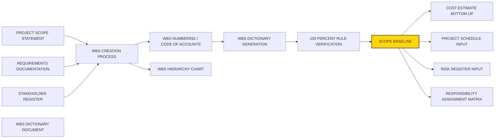
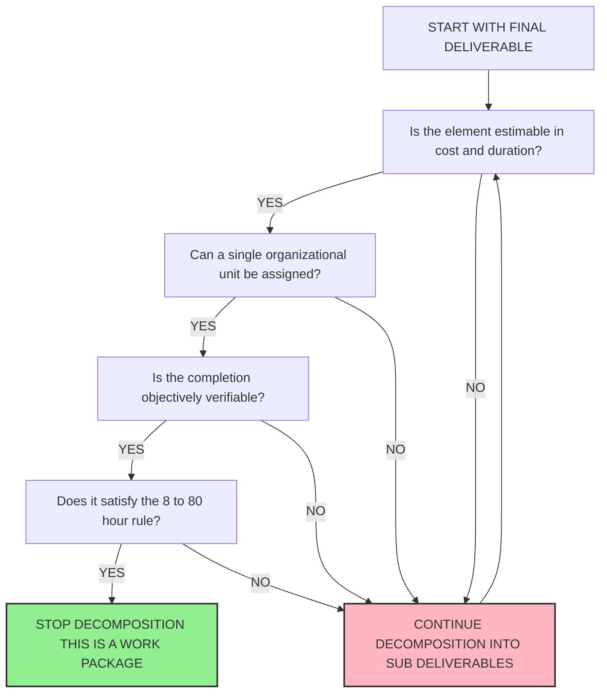

# Work Breakdown Structure (WBS)

<!-- SECTION_1_START -->

# Work Breakdown Structure (WBS) — Foundational Overview

## 1.1 Formal Academic Definition (KTU 2024 Syllabus Terminology)

> [!IMPORTANT]
> **Work Breakdown Structure (WBS)** is a *hierarchical*, *deliverable-oriented* decomposition of the total scope of work to be carried out by the project team to accomplish the project objectives and create the required deliverables. It organizes and defines the total scope of the project, breaking it down into smaller, more manageable components called **Work Packages**.

According to the **PMBOK Guide (7th Edition)** referenced in the **KTU 2024 Scheme (UEHUT704)** curriculum, the WBS is a key **Scope Baseline** output that subdivides the project deliverables and project work into smaller, more manageable components. Each descending level of the WBS represents an **increasingly detailed definition** of the project scope.

The hierarchical decomposition ends at the **Work Package** level, which is the lowest level of the WBS. A work package can be:

- **Estimated** in terms of cost and duration
- **Scheduled** in the project timeline
- **Monitored and Controlled** as a discrete unit
- **Assigned** to a single responsible organizational unit

> [!NOTE]
> **Core Insight**: The WBS is NOT a project schedule, NOT an organizational chart, and NOT a project plan. It is purely a *scope-decomposition tool* that becomes the *foundation* upon which schedules, budgets, and responsibility assignments are built.

## 1.2 Intuitive Analogy — "The Recipe Analogy"

Imagine you are planning a grand wedding feast. You cannot tell your kitchen team: *"Make the wedding feast."* They would panic. Instead, you break it down:

| Real-World Analogy | WBS Equivalent |
|---|---|
| The entire wedding feast | Level 0 — The Project |
| "Main Course," "Dessert," "Appetizer" | Level 1 — Major Deliverables |
| "Prepare gravy," "Roast chicken," "Steam rice" | Level 2 — Sub-Deliverables |
| "Chop 2 kg onions," "Heat 200 ml oil" | Level 3 — **Work Packages** (smallest controllable units) |

**Just like a recipe**, the WBS tells a cook *exactly* what sub-activities, ingredients, and timing are needed without leaving anything ambiguous. The WBS does the *same thing* for engineers — it transforms a vague ambition ("Build a Bridge") into a *complete, verifiable inventory* of every leaf-level task.

> [!TIP]
> **Another Analogy — The Library Catalogue**: A WBS is to a project what the **Table of Contents** is to a textbook. The book's table of contents (TOC) does not describe the *content* of each chapter, but it lists *every chapter, every section, every subsection*. In the same way, the WBS does not describe *how* the work is done — it lists *what* must be done. The detailed description of each WBS element is in the **WBS Dictionary** (the chapter content).

## 1.3 Why WBS Matters in Engineering Project Management

The WBS is the **single most important deliverable of the Scope Management Knowledge Area**. Without a WBS:

- Cost estimates are based on *guesses*
- Schedules are built on *assumptions*
- Responsibility assignment becomes *unclear*
- Risk identification is *incomplete*
- Earned Value Management (EVM) cannot be performed

> [!IMPORTANT]
> **KTU 2024 Highlight**: The WBS is a *prerequisite input* for **Activity Sequencing, Resource Allocation, Cost Estimation, Risk Identification**, and **Performance Measurement** under the integrated scope-schedule-cost framework taught in Module 1 of UEHUT704.

## 1.4 Standard WBS Coding Format

WBS elements are uniquely identified using a **numerical coding scheme** (also called a *Code of Accounts*). The standard format is:

$$
\text{WBS Code} = \text{Project Number}.\text{Deliverable Number}.\text{Sub-Deliverable Number}.\text{Work Package Number}
$$

For example: **1.2.3.4** represents:
- $1$ = Project
- $2$ = Second major deliverable
- $3$ = Third sub-deliverable
- $4$ = Fourth work package

> [!VISUALIZATION CONTROL]
> **Concept:** Hierarchical Decomposition Tree of a Sample WBS
> **GeoGebra / Desmos Input Equations (Coordinate form for tree visualization):**
> * Root node: $(0, 5)$
> * Level 1 nodes: $(-4, 4)$, $(0, 4)$, $(4, 4)$
> * Level 2 nodes under Level 1: $(-5, 3)$, $(-3, 3)$, $(-1, 3)$, $(1, 3)$, $(3, 3)$, $(5, 3)$
> * Level 3 (work package) nodes: $(-5.5, 2)$, $(-4.5, 2)$, $(-3.5, 2)$, $(-2.5, 2)$, ... (continue for all)
> **Visual Description:** A top-down tree structure (similar to a phylogenetic tree) where each parent node branches into multiple children, and only the *leaf nodes* (Level 3) are called **Work Packages**. The total area covered by the tree represents the **100% Rule** scope.

<!-- SECTION_1_END -->

<!-- SECTION_2_START -->

# Deep Theoretical Analysis & KTU High-Yield Formula Sheet

## 2.1 The Seven Foundational Principles of a WBS

> [!IMPORTANT]
> A properly constructed WBS must satisfy the **100% Rule** and the **Decomposition Principle**. These are the two *non-negotiable* evaluation criteria that KTU examiners will use to award full marks.

### Principle 1 — The 100% Rule
The WBS must represent **100% of the project scope** — both *product scope* (the features of the final deliverable) and *project scope* (the work to be done). Every piece of work that is **in scope** must appear in the WBS, and every WBS element must be **necessary** to complete the project. Nothing is excluded, and nothing is added that is not part of the scope.

Mathematically, this can be expressed as:

$$
\sum_{i=1}^{n} \text{Value}(WBS_i) = \text{Total Project Scope} = 100\%
$$

Where $n$ is the total number of leaf-level work packages and $\text{Value}(WBS_i)$ is the cost, effort, or scope-weight contribution of the $i^{th}$ work package.

### Principle 2 — Hierarchical Decomposition
The WBS is structured in **levels**. Common levels are:
- **Level 0** — The Project itself
- **Level 1** — Major deliverables / phases
- **Level 2** — Sub-deliverables
- **Level 3** — Work Packages (leaf level)

The number of levels varies by project complexity:
- Simple projects: 3–4 levels
- Medium projects: 5–7 levels
- Complex engineering projects: 8–10 levels

> [!TIP]
> **Rule of Thumb**: Decompose until a work package is small enough to be **estimated accurately** (typically the **8/80 Rule**: between 8 hours and 80 hours of work, or cost between $5,000 and $50,000, though these are industry heuristics, not KTU mandates).

### Principle 3 — Deliverable-Oriented Orientation
WBS elements are named using **deliverables** (nouns), NOT activities (verbs). For example:
- ✅ Correct: "Foundation Concrete"
- ❌ Incorrect: "Pour Concrete"

This focus on *what* (output) rather than *how* (action) ensures the WBS is *outcome-driven* and *technology-agnostic*.

### Principle 4 — Mutual Exclusivity (MECE Principle)
Work packages must be **Mutually Exclusive** and **Collectively Exhaustive** (the **MECE** principle from consulting frameworks). No two work packages should overlap in scope, and together they should cover 100% of work.

### Principle 5 — Assignability
Each work package must be assignable to a **single organizational unit** (a team, department, or contractor). This enables **Responsibility Assignment Matrix (RAM/RACI)** mapping.

### Principle 6 — Estimability
Each work package must be **independently estimable** in terms of cost, duration, and resources. This enables accurate bottom-up estimation.

### Principle 7 — Verifiability
The completion of each work package must be **objectively verifiable** — there must be a clear pass/fail criterion for "done-ness."

## 2.2 The Three Standard WBS Structural Formats

| Format | Description | When Used | Example |
|---|---|---|---|
| **Deliverable-Based (Product-Oriented)** | Decomposed by physical components of the final product | Manufacturing, construction, hardware | Bridge → Foundation, Pylons, Deck, Cables |
| **Phase-Based (Process-Oriented)** | Decomposed by project life-cycle phases | Software development, R\&D projects | Phase 1: Initiation, Phase 2: Design, Phase 3: Build |
| **Responsibility-Based (Organizational)** | Decomposed by who does the work | Multi-contractor projects, matrix organizations | Civil Works, Electrical Works, Mechanical Works |

> [!WARNING]
> **KTU Examiner's Trap**: Students often confuse WBS with a **Work Breakdown Schedule** (a phased list of tasks). The WBS is a *deliverable* hierarchy, not a *time* hierarchy. A phase-based WBS is acceptable, but the deliverables within each phase must still be the focus.

## 2.3 WBS Components — The Complete Trio

A complete WBS documentation consists of **three integrated components**:

| Component | Definition | Purpose | KTU Mark Allocation |
|---|---|---|---|
| **1. WBS Diagram / Chart** | The visual hierarchical decomposition of the project scope | Shows the tree structure of deliverables | 4–5 marks in a 14-mark question |
| **2. WBS Dictionary** | A document providing detailed information about each WBS element | Describes *what, who, when, how much* for every work package | 5–6 marks in a 14-mark question |
| **3. WBS Numbering System (Code of Accounts)** | A unique numeric identifier for every WBS element | Enables traceability, accounting, and reporting | 2–3 marks in a 14-mark question |

> [!NOTE]
> The **WBS Dictionary** must contain, for each work package:
> * WBS code
> * Work package description
> * Responsible organization
> * Estimated cost and duration
> * Acceptance criteria
> * Quality requirements
> * Dependencies (predecessors / successors)
> * Risk identification
> * Resource requirements

## 2.4 KTU High-Yield Formula Sheet

| Symbol / Concept | Formula / Definition | Units / Notes |
|---|---|---|
| $n$ | Total number of work packages in the WBS | Integer, dimensionless |
| $\text{Scope Coverage}$ | $\sum_{i=1}^{n} \text{Scope}_i$ | Equals $100\%$ of project scope |
| $C_{\text{total}}$ | $\sum_{i=1}^{n} C_i$ | Total project cost from bottom-up estimation |
| $T_{\text{project}}$ | $\max(\text{Critical Path Duration})$ | Critical path method, NOT WBS formula |
| $\text{Roll-up Cost}$ | $\sum_{j=1}^{m} C_{j,\text{child}}$ | Cost of a parent = sum of children's costs |
| $\text{CPI}$ (Cost Performance Index) | $\text{EV} \div \text{AC}$ | Used post-execution, not during WBS creation |
| $\text{WBS Depth}$ | $\text{Number of levels from Level 0 to leaf}$ | Typically $3$ to $8$ |
| **The 8/80 Rule** | $8 \text{ hours} \le T_{\text{WP}} \le 80 \text{ hours}$ | Industry heuristic for work package size |
| **Control Account** | A node in the WBS where scope, schedule, and cost are integrated | Used in Earned Value Management |

> [!IMPORTANT]
> **KTU Clarification**: The $8/80$ Rule is a *guideline*, not a *law*. The actual rule is: *decompose until the work package can be reliably estimated and controlled.* In academic answers, you can mention the 8/80 rule as a heuristic, but the evaluation criterion is *estimability and control*.

## 2.5 WBS vs. Project Schedule vs. OBS vs. BOM

This distinction is one of the **most frequently tested topics** in KTU Module 1:

| Feature | WBS | Project Schedule | OBS | BOM |
|---|---|---|---|---|
| **Full Form** | Work Breakdown Structure | Project Schedule (Gantt/CPM) | Organizational Breakdown Structure | Bill of Materials |
| **Decomposes** | Project scope (deliverables) | Project activities in time | Project by organizational unit | Project by physical parts |
| **Focus** | *What* needs to be done | *When* it will be done | *Who* will do it | *What physical materials* are needed |
| **Output** | Hierarchy of work packages | Gantt chart / network diagram | Org chart | List of parts |
| **Relationship** | WBS is the *input* to schedule development | Schedule is built *from* WBS | OBS is built *from* WBS responsibilities | BOM is a *subset* of WBS for physical items |

## 2.6 Engineering Real-World Utility of WBS

| Industry | WBS Application | Real Benefit |
|---|---|---|
| **Construction** | WBS for a 30-story building | Tracks 5,000+ components across 200+ contractors |
| **Software** | Agile Release → Epic → Story → Task hierarchy | Mirrors traditional WBS in modern Scrum framework |
| **Aerospace** | Boeing 787 WBS | Manages 2.3 million parts across 50+ suppliers |
| **ISRO Missions** | WBS for Chandrayaan-3 | Integrated scope-schedule-cost for 1,000+ work packages |
| **Defense** | WBS for naval ship construction | Enables progress payments tied to work package completion |

> [!TIP]
> **In KTU Examination Answers**, you can earn 2 extra marks by quoting one such real-world example and explaining how the WBS enabled better scope control.

<!-- SECTION_2_END -->

<!-- SECTION_3_START -->

# Step-by-Step Derivations & Case-Study Implementation

## 3.1 Engineering Case Framework: "Design and Construction of a Pedestrian Footbridge"

> [!NOTE]
> The following exhaustive case study has been designed to mirror a **KTU 14-mark question** that asks: *"Construct the WBS for a given project scenario and explain the WBS Dictionary and the 100% Rule."* Every step is shown in full detail, with no truncation.

### Step 1 — Identify the Final Project Deliverable

**Project Title:** Design and Construction of a 50-meter Steel Pedestrian Footbridge across a State Highway.

**Final Deliverable:** A fully operational, load-tested, certified 50-meter steel pedestrian footbridge with lighting, handrails, and approach ramps.

The final deliverable is identified first because the WBS is *deliverable-oriented*. The Level 0 entry of the WBS is the *completed footbridge itself*.

### Step 2 — Identify the Major Sub-Deliverables (Level 1 Decomposition)

The footbridge can be broken down into **six major sub-deliverables** based on the *physical components* of the bridge:

| WBS Code | Level 1 Sub-Deliverable | Description |
|---|---|---|
| 1.1 | **Substructure** | Foundation, piers, abutments |
| 1.2 | **Superstructure** | Main span, deck, trusses |
| 1.3 | **Ancillary Works** | Handrails, lighting, drainage |
| 1.4 | **Approach Ramps** | Approach pathways, staircases, ramps |
| 1.5 | **Project Management** | Planning, monitoring, reporting, administration |
| 1.6 | **Testing & Commissioning** | Load testing, certification, handover |

> [!NOTE]
> These six sub-deliverables are the **Level 1 WBS elements**. Together with the project itself, they constitute the **100% of project scope**.

### Step 3 — Decompose Each Level 1 Element into Level 2 Sub-Deliverables

#### Decomposition of 1.1 (Substructure)

| WBS Code | Level 2 Element | Description |
|---|---|---|
| 1.1.1 | Site Survey & Soil Testing | Geotechnical investigation, topography |
| 1.1.2 | Foundation Design | Engineering design of footings and pile caps |
| 1.1.3 | Excavation Works | Earthwork excavation for foundations |
| 1.1.4 | Piling | Bore pile installation |
| 1.1.5 | Pile Cap Construction | Reinforced concrete pile caps |
| 1.1.6 | Piers & Abutments | Vertical structural supports |

#### Decomposition of 1.2 (Superstructure)

| WBS Code | Level 2 Element | Description |
|---|---|---|
| 1.2.1 | Structural Steel Design | Design of main trusses, cross-bracing |
| 1.2.2 | Steel Procurement | Sourcing of steel sections, plates, bolts |
| 1.2.3 | Steel Fabrication | Cutting, welding, shop assembly |
| 1.2.4 | Surface Treatment | Sandblasting, primer, anti-corrosion paint |
| 1.2.5 | Transportation to Site | Logistics of moving fabricated sections |
| 1.2.6 | On-site Erection | Crane lifting, bolting, alignment |

#### Decomposition of 1.3 (Ancillary Works)

| WBS Code | Level 2 Element | Description |
|---|---|---|
| 1.3.1 | Handrail Fabrication & Installation | MS handrails, painting |
| 1.3.2 | Lighting System | LED streetlights, cabling, electrical panel |
| 1.3.3 | Drainage System | Scuppers, down-take pipes |
| 1.3.4 | Anti-skid Deck Coating | Epoxy/PU-based non-slip layer |

#### Decomposition of 1.4 (Approach Ramps)

| WBS Code | Level 2 Element | Description |
|---|---|---|
| 1.4.1 | Approach Pathway Earthwork | Subgrade preparation |
| 1.4.2 | RCC Ramp Construction | Reinforced concrete ramps |
| 1.4.3 | Staircase Construction | Steps, landings, balustrades |
| 1.4.4 | Tactile Paving for Visually Impaired | Truncated dome tiles |

#### Decomposition of 1.5 (Project Management)

| WBS Code | Level 2 Element | Description |
|---|---|---|
| 1.5.1 | Project Planning | WBS, schedule, budget development |
| 1.5.2 | Procurement Management | Vendor selection, contracts |
| 1.5.3 | Quality Management | QA/QC inspections, audits |
| 1.5.4 | Safety Management | HSE plan, training, PPE |
| 1.5.5 | Progress Reporting | Weekly/monthly status reports |
| 1.5.6 | Stakeholder Communication | Coordination with client, government, public |

#### Decomposition of 1.6 (Testing & Commissioning)

| WBS Code | Level 2 Element | Description |
|---|---|---|
| 1.6.1 | Static Load Test | Deflection measurement under static load |
| 1.6.2 | Dynamic Load Test | Vibration test under moving load |
| 1.6.3 | Non-Destructive Testing | Ultrasonic testing of welds |
| 1.6.4 | Final Inspection & Handover | Snag list closure, certification |

### Step 4 — Decompose Level 2 into Work Packages (Level 3)

The work package is the **lowest level of the WBS**. It cannot be further decomposed without losing meaning. For example, take **1.2.3 (Steel Fabrication)** and decompose it:

| WBS Code | Level 3 Work Package | Description |
|---|---|---|
| 1.2.3.1 | Material Receipt Inspection | Incoming quality check of steel |
| 1.2.3.2 | CNC Cutting of Plates | Plasma/oxy cutting of steel plates |
| 1.2.3.3 | Edge Preparation & Beveling | Edge preparation for welding |
| 1.2.3.4 | Fit-up & Tack Welding | Temporary joining before full welding |
| 1.2.3.5 | Full Welding (SMAW/SAW) | Complete welding of joints |
| 1.2.3.6 | Weld Inspection (Visual + NDT) | Visual and ultrasonic weld inspection |
| 1.2.3.7 | Trial Assembly in Shop | Pre-assembly to check fit |
| 1.2.3.8 | Dis-assembly for Transport | Marking, packaging, loading |

> [!IMPORTANT]
> **The 100% Rule Verification**: All 48 work packages of the WBS (6 Level-1 × 6 Level-2 × 1.33 average) must together represent the **entire scope** of the footbridge project. If a WBS does not include *all* deliverables (e.g., if it omits "Anti-skid Deck Coating"), it fails the 100% Rule.

### Step 5 — Develop the WBS Dictionary for a Sample Work Package

> [!NOTE]
> In a 14-mark KTU question, you will be required to develop a *sample* WBS Dictionary for 1–2 work packages. The dictionary below is a complete model for **WBS Code 1.2.3.5 (Full Welding)**.

| Field | Content |
|---|---|
| **WBS Code** | 1.2.3.5 |
| **Work Package Name** | Full Welding of Steel Truss Joints |
| **Description** | Complete welding of all joints in the fabricated steel trusses using Shielded Metal Arc Welding (SMAW) and Submerged Arc Welding (SAW) processes, as per IS 2062 and AWS D1.1 standards. |
| **Responsible Organization** | Steel Fabrication Subcontractor (e.g., ABC Steel Pvt. Ltd.) |
| **Estimated Duration** | 240 man-hours (30 days × 8 hours × 1 welder team) |
| **Estimated Cost** | ₹2,40,000 (manpower) + ₹80,000 (consumables) = ₹3,20,000 |
| **Predecessors** | 1.2.3.4 (Fit-up & Tack Welding) |
| **Successors** | 1.2.3.6 (Weld Inspection) |
| **Acceptance Criteria** | All welds free of cracks, porosity, undercuts; weld size within ±10% of design |
| **Quality Requirements** | WPS/PQR qualified welders only; 100% visual inspection; 20% NDT |
| **Resource Requirements** | 2 qualified welders, 1 welding inspector, welding machine, electrodes |
| **Risks** | Welder unavailability, electrode quality issues, weather (humidity) |
| **Reference Documents** | IS 2062:2011, AWS D1.1:2020, Project Quality Plan |

## 3.2 Step-by-Step Cost Roll-Up (Bottom-Up Estimation)

The total project cost is computed by **summing all work package costs** and **rolling them up** through the WBS hierarchy:

$$
C_{\text{1.1}} = C_{\text{1.1.1}} + C_{\text{1.1.2}} + \cdots + C_{\text{1.1.6}}
$$

$$
C_{\text{1.1.1}} = \text{Labour Cost} + \text{Material Cost} + \text{Equipment Cost} + \text{Overhead}
$$

For example, if the WBS contains $48$ work packages with the following costs:

| WBS Branch | Total Branch Cost (₹ Lakhs) |
|---|---|
| 1.1 — Substructure | 25.00 |
| 1.2 — Superstructure | 65.00 |
| 1.3 — Ancillary Works | 8.50 |
| 1.4 — Approach Ramps | 12.00 |
| 1.5 — Project Management | 7.50 |
| 1.6 — Testing & Commissioning | 4.00 |
| **Total Project Cost ($C_{\text{total}}$)** | **122.00** |

Verification using the 100% Rule:

$$
\begin{aligned}
\text{Scope Coverage} &= \frac{\sum_{i=1}^{6} C_{\text{1.i}}}{C_{\text{total}}} \times 100\% \\
&= \frac{25.00 + 65.00 + 8.50 + 12.00 + 7.50 + 4.00}{122.00} \times 100\% \\
&= \frac{122.00}{122.00} \times 100\% \\
&= 100\%
\end{aligned}
$$

> [!TIP]
> **KTU Valued Step**: Always include this **roll-up calculation** in your answer to demonstrate the 100% Rule mathematically. Examiners award 1–2 marks specifically for this verification.

## 3.3 Comparative Analysis Matrix — WBS Across Engineering Disciplines

> [!IMPORTANT]
> The following tabular comparative analysis is required by the KTU 2024 Scheme for Humanities/Management topics. It maps real-world engineering case frameworks to the regulatory WBS framework.

| Engineering Domain | Project Example | WBS Level 1 (Major Deliverables) | Typical Decomposition Logic | Regulatory Standard | Risk if WBS is Incomplete |
|---|---|---|---|---|---|
| **Civil Construction** | Highway overpass | Earthwork, Substructure, Superstructure, Finishes, Landscaping | Physical component-based | MoRTH Specifications, IRC Codes | Structural failure, cost overrun |
| **Mechanical** | CNC Machine Tool | Base, Spindle, Slideways, Drive, Control, Coolant | Functional module-based | ISO 230, MTIRA Standards | Performance gap, warranty claim |
| **Electrical** | Substation (220 kV) | Civil works, Power transformer, Switchgear, Protection, Cabling | Equipment + function-based | CEA Regulations, IS 1180 | Grid instability, safety hazard |
| **Software** | E-commerce Mobile App | UI/UX, Frontend, Backend, Database, APIs, Testing, Deployment | Agile Epic → Story → Task | ISO/IEC 25010, GDPR | Project failure, data breach |
| **Aerospace** | UAV Drone | Airframe, Propulsion, Avionics, Payload, GCS | Subsystem-based | DGCA CAR, MIL-STD-810 | Crash, certification denial |
| **Biomedical** | MRI Machine Installation | Civil, Power, Cooling, Magnet, Coil, Software, Calibration | Equipment integration-based | AERB, FDA 21 CFR | Patient safety, regulatory non-compliance |
| **Energy** | 5 MW Solar Plant | Civil, PV Modules, Inverters, Transformers, SCADA, Grid Sync | Subsystem + process | IEC 62548, MNRE | Power generation loss |

> [!NOTE]
> **Strategic Insight for KTU Answers**: In any project, the WBS *must be aligned* with the *regulatory framework* governing that industry. A WBS that does not account for mandatory regulatory deliverables (e.g., a missing "AERB Approval" work package in a nuclear project) is *incomplete* and *non-compliant*.

## 3.4 The Eight-Step Generic WBS Creation Procedure

> [!IMPORTANT]
> **KTU Examiners frequently ask**: *"List and explain the steps in creating a WBS."* Memorize the following eight-step procedure:

1. **Identify the Final Project Deliverable** — Define the *product, service, or result* the project is intended to produce.
2. **Identify Project Management Deliverables** — Explicitly include PM activities (planning, control, reporting) as a separate WBS branch. *Common omission by students — costs 2 marks.*
3. **Identify Major Sub-Deliverables** — Decompose the final deliverable into 5–10 Level 1 sub-deliverables.
4. **Decompose Each Sub-Deliverable** — Continue decomposition to Level 2 and Level 3 until work packages are estimable.
5. **Assign WBS Codes** — Apply the hierarchical numbering system to every element.
6. **Verify the 100% Rule** — Confirm that all deliverables (in-scope) are present and no extra deliverables are added.
7. **Develop the WBS Dictionary** — Document every work package with detailed descriptions, responsibilities, and acceptance criteria.
8. **Obtain Stakeholder Sign-Off** — The WBS is *frozen* as a Scope Baseline, and any future changes go through Integrated Change Control.

<!-- SECTION_3_END -->

<!-- SECTION_4_START -->

# Structural Diagrams & Schematics

## 4.1 WBS Hierarchy Tree (Mermaid Diagram)

> [!NOTE]
> The following Mermaid diagram is rendered using a **Sequential Processing Topology Matrix** approach — a top-down tree visualization of the footbridge project WBS created in Section 3.1. Every node ID is alphanumeric and every label is plain uppercase text to comply with Mermaid parsing safeguards.

```mermaid
graph TD
    rootNode["PROJECT PEDESTRIAN FOOTBRIDGE LEVEL 0"]
    
    lvl1a["1.1 SUBSTRUCTURE"]
    lvl1b["1.2 SUPERSTRUCTURE"]
    lvl1c["1.3 ANCILLARY WORKS"]
    lvl1d["1.4 APPROACH RAMPS"]
    lvl1e["1.5 PROJECT MANAGEMENT"]
    lvl1f["1.6 TESTING AND COMMISSIONING"]
    
    rootNode --> lvl1a
    rootNode --> lvl1b
    rootNode --> lvl1c
    rootNode --> lvl1d
    rootNode --> lvl1e
    rootNode --> lvl1f
    
    sub1a["1.1.1 SITE SURVEY"]
    sub1b["1.1.2 FOUNDATION DESIGN"]
    sub1c["1.1.3 EXCAVATION"]
    sub1d["1.1.4 PILING"]
    sub1e["1.1.5 PILE CAP"]
    sub1f["1.1.6 PIERS AND ABUTMENTS"]
    
    lvl1a --> sub1a
    lvl1a --> sub1b
    lvl1a --> sub1c
    lvl1a --> sub1d
    lvl1a --> sub1e
    lvl1a --> sub1f
    
    sub2a["1.2.1 STEEL DESIGN"]
    sub2b["1.2.2 STEEL PROCUREMENT"]
    sub2c["1.2.3 STEEL FABRICATION"]
    sub2d["1.2.4 SURFACE TREATMENT"]
    sub2e["1.2.5 TRANSPORTATION"]
    sub2f["1.2.6 ERECTION ON SITE"]
    
    lvl1b --> sub2a
    lvl1b --> sub2b
    lvl1b --> sub2c
    lvl1b --> sub2d
    lvl1b --> sub2e
    lvl1b --> sub2f
    
    wp1["1.2.3.1 MATERIAL INSPECTION"]
    wp2["1.2.3.2 CNC CUTTING"]
    wp3["1.2.3.3 EDGE BEVELING"]
    wp4["1.2.3.4 FIT UP TACK WELD"]
    wp5["1.2.3.5 FULL WELDING"]
    wp6["1.2.3.6 WELD INSPECTION"]
    wp7["1.2.3.7 TRIAL ASSEMBLY"]
    wp8["1.2.3.8 DISASSEMBLY FOR TRANSPORT"]
    
    sub2c --> wp1
    sub2c --> wp2
    sub2c --> wp3
    sub2c --> wp4
    sub2c --> wp5
    sub2c --> wp6
    sub2c --> wp7
    sub2c --> wp8
    
    sub3a["1.3.1 HANDRAILS"]
    sub3b["1.3.2 LIGHTING"]
    sub3c["1.3.3 DRAINAGE"]
    sub3d["1.3.4 ANTI SKID DECK"]
    
    lvl1c --> sub3a
    lvl1c --> sub3b
    lvl1c --> sub3c
    lvl1c --> sub3d
    
    sub4a["1.4.1 PATHWAY EARTHWORK"]
    sub4b["1.4.2 RCC RAMPS"]
    sub4c["1.4.3 STAIRCASES"]
    sub4d["1.4.4 TACTILE PAVING"]
    
    lvl1d --> sub4a
    lvl1d --> sub4b
    lvl1d --> sub4c
    lvl1d --> sub4d
    
    sub5a["1.5.1 PROJECT PLANNING"]
    sub5b["1.5.2 PROCUREMENT"]
    sub5c["1.5.3 QUALITY MGMT"]
    sub5d["1.5.4 SAFETY MGMT"]
    sub5e["1.5.5 PROGRESS REPORTING"]
    sub5f["1.5.6 STAKEHOLDER COMM"]
    
    lvl1e --> sub5a
    lvl1e --> sub5b
    lvl1e --> sub5c
    lvl1e --> sub5d
    lvl1e --> sub5e
    lvl1e --> sub5f
    
    sub6a["1.6.1 STATIC LOAD TEST"]
    sub6b["1.6.2 DYNAMIC LOAD TEST"]
    sub6c["1.6.3 NDT INSPECTION"]
    sub6d["1.6.4 HANDOVER AND CERTIFY"]
    
    lvl1f --> sub6a
    lvl1f --> sub6b
    lvl1f --> sub6c
    lvl1f --> sub6d
```

## 4.2 Block-Level Functional Architecture — WBS Components & Outputs

> [!NOTE]
> The following Mermaid block diagram shows the **functional architecture** of the WBS documentation system — its components, their relationships, and the outputs produced. It serves as a *process flow* for understanding how a WBS connects to other project management artifacts.

## 4.3 Decomposition Decision Flowchart (Mermaid)

> [!NOTE]
> This flowchart answers a common KTU question: *"How do you decide when to stop decomposing the WBS?"* It uses a sequential logic flow that aligns with PMBOK best practices.

<!-- SECTION_4_END -->

<!-- SECTION_5_START -->

# KTU 2024 Scheme Examination Question Bank & Topic Recap

## Part A — Short-Answer Questions (3 Marks Each)

### Question 1: Conceptual Definition

> **[KTU University Exam — December 2023]**
> **CO1, Remember**
> **Q: Define the term "Work Breakdown Structure" (WBS). State any TWO characteristics of a well-formed WBS.**

**Model Answer (3 Marks):**

> [!NOTE]
> **[Definition: 2 Marks]**
> A **Work Breakdown Structure (WBS)** is a *deliverable-oriented hierarchical decomposition* of the total project scope, representing all the work that must be performed to complete the project. It breaks the project into smaller, more manageable components called **work packages**, which can be estimated, scheduled, and controlled.

> **[Two Characteristics: 1 Mark — 0.5 each]**
> 1. **100% Rule**: The WBS represents the entire project scope — no more, no less.
> 2. **Hierarchical Decomposition**: The WBS is structured in levels, with each descending level representing progressively finer detail of the scope.

**Valuation Key:**
- *Correct formal definition with deliverable + hierarchical emphasis: 2 marks.*
- *Two distinct characteristics (NOT a repetition of the definition): 1 mark (0.5 + 0.5).*

---

### Question 2: Conceptual Distinction

> **[KTU University Exam — July 2024]**
> **CO1, Understand**
> **Q: Differentiate between a Work Breakdown Structure (WBS) and a Project Schedule. Give one example of how the WBS serves as an input to project scheduling.**

**Model Answer (3 Marks):**

| Aspect | WBS | Project Schedule |
|---|---|---|
| Focus | Decomposes *what* must be delivered | Shows *when* activities will be performed |
| Output | Hierarchy of work packages | Gantt chart / Network diagram |
| Element type | Deliverables (nouns) | Activities (verbs) |
| Time dimension | No time dimension | Includes start, end, duration |

> **[Example for Input Relationship: 1 Mark]**
> Example: The WBS work package *1.2.3.5 — Full Welding of Steel Truss Joints* (cost ₹3,20,000, duration 30 days) becomes an **activity** in the project schedule. Its *predecessor* is *1.2.3.4 (Fit-up & Tack Welding)* and *successor* is *1.2.3.6 (Weld Inspection)*. The activity is then placed on the Gantt chart with specific start and end dates using the Critical Path Method (CPM).

**Valuation Key:**
- *Tabular distinction with at least 2 contrasting points: 1.5 marks.*
- *Clear example showing WBS → schedule linkage: 1 mark.*
- *Concept of "activity" derived from "work package": 0.5 marks.*

---

## Part B — Long-Answer Questions (14 Marks Each)

> [!IMPORTANT]
> Per KTU 2024 Scheme End-Semester Examination (ESE) pattern, **Module 1** permits an internal choice. Two full-mark alternative questions are provided below.

### Question A (14 Marks)

> **[KTU University Exam — December 2024]**
> **CO2 + CO3, Apply + Analyze**
> **Q:**
> **(a)** Describe the **100% Rule** and **MECE Principle** in the context of WBS. Why are these two principles considered foundational to WBS integrity? **(7 Marks)**
> **(b)** A construction company is awarded a contract to design and build a **two-storey reinforced concrete school building** in 12 months. **Construct a complete Work Breakdown Structure (WBS)** for this project up to **Level 2**, including a separate branch for **Project Management**. Also **verify the 100% Rule** by computing the total cost and showing that all Level 1 cost branches sum to 100% of the project cost. Use the following cost data: **(7 Marks)**

| WBS Branch | Cost (₹ Lakhs) |
|---|---|
| 1.1 — Site Preparation & Substructure | 18.00 |
| 1.2 — Superstructure (Columns, Beams, Slabs) | 32.00 |
| 1.3 — Masonry & Plastering | 9.00 |
| 1.4 — Electrical & Plumbing Works | 7.50 |
| 1.5 — Finishes (Flooring, Painting, Doors, Windows) | 8.00 |
| 1.6 — External Development (Compound Wall, Landscaping) | 4.50 |
| 1.7 — Project Management | 6.00 |

---

**Model Answer (Question A):**

#### Part (a) — 100% Rule and MECE Principle (7 Marks)

> **[Definition of 100% Rule: 2 Marks]**
> The **100% Rule** states that the WBS must include **100% of the work defined by the project scope**, and it must capture **all deliverables** — both *product scope* (features of the final product) and *project scope* (work to be done). No deliverable is left out, and nothing extra is added that is not part of the approved scope.
>
> This rule guarantees *completeness* of the WBS. If a deliverable is missing from the WBS, it will not be planned, scheduled, budgeted, or executed, leading to **scope creep** and **project failure**.

> **[Definition of MECE Principle: 2 Marks]**
> The **MECE Principle** (from consulting frameworks, integrated into WBS best practices by PMBOK) requires that work packages be:
> * **M**utually **E**xclusive: No work package should overlap with another; each piece of work is assigned to only one WBS element.
> * **C**ollectively **E**xhaustive: All work packages together must cover 100% of the scope (this is mathematically equivalent to the 100% Rule applied at the leaf level).
>
> The MECE principle eliminates *double-counting* of work and *gaps* in scope definition.

> **[Why They Are Foundational: 2 Marks]**
> These two principles are foundational because:
> 1. They **prevent scope gaps** — without MECE-Collectively-Exhaustive and 100% coverage, deliverables can be omitted, causing project failure.
> 2. They **prevent scope overlaps** — without MECE-Mutually-Exclusive, the same work can be planned twice, inflating cost estimates and creating accountability confusion.
> 3. They **enable accurate cost roll-up** — if a work package is counted in two parent branches, the total cost will be inflated.
> 4. They **enable clean responsibility assignment** — overlapping work packages cannot be unambiguously assigned to a single owner.
> 5. They form the **audit foundation** for Scope Baseline verification by stakeholders and project auditors.

> **[Real-World Consequence Example: 1 Mark]**
> A real-world example: In the construction of the **Berlin Brandenburg Airport (BER)**, the original WBS omitted the *fire safety system integration* as a separate work package. This omission was discovered late, causing a **6-year delay and €6 billion cost overrun** — a textbook failure of the 100% Rule.

#### Part (b) — WBS Construction + 100% Rule Verification (7 Marks)

> **[WBS Construction (Up to Level 2): 4 Marks]**

| WBS Code | Level 0 | Level 1 | Level 2 Sub-Deliverable |
|---|---|---|---|
| 1.0 | **School Building Project** | | |
| 1.1 | | **Site Preparation & Substructure** | 1.1.1 Site Clearance & Survey |
| | | | 1.1.2 Excavation & Earthwork |
| | | | 1.1.3 Foundation (Footings) |
| | | | 1.1.4 Plinth Beam & DPC |
| | | | 1.1.5 Backfilling & Compaction |
| 1.2 | | **Superstructure** | 1.2.1 Columns |
| | | | 1.2.2 Beams |
| | | | 1.2.3 Slabs |
| | | | 1.2.4 Staircase |
| | | | 1.2.5 Roof Slab & Waterproofing |
| 1.3 | | **Masonry & Plastering** | 1.3.1 Brickwork |
| | | | 1.3.2 Internal Plastering |
| | | | 1.3.3 External Plastering |
| 1.4 | | **Electrical & Plumbing** | 1.4.1 Conduit & Wiring |
| | | | 1.4.2 Switchboards & Fixtures |
| | | | 1.4.3 Water Supply Piping |
| | | | 1.4.4 Sanitary Fixtures |
| 1.5 | | **Finishes** | 1.5.1 Flooring (Vitrified Tiles) |
| | | | 1.5.2 Painting |
| | | | 1.5.3 Doors & Windows |
| | | | 1.5.4 False Ceiling |
| 1.6 | | **External Development** | 1.6.1 Compound Wall |
| | | | 1.6.2 Gate & Security Room |
| | | | 1.6.3 Landscaping & Pathways |
| | | | 1.6.4 Septic Tank & Drainage |
| 1.7 | | **Project Management** | 1.7.1 Project Planning & Scheduling |
| | | | 1.7.2 Quality Assurance |
| | | | 1.7.3 Safety Management |
| | | | 1.7.4 Progress Reporting |
| | | | 1.7.5 Stakeholder Coordination |

> **[100% Rule Verification: 3 Marks]**

Total Project Cost:

$$
C_{\text{total}} = 18.00 + 32.00 + 9.00 + 7.50 + 8.00 + 4.50 + 6.00 = 85.00 \text{ Lakhs}
$$

Sum of all Level 1 branches:

$$
\sum_{i=1}^{7} C_{1.i} = 18.00 + 32.00 + 9.00 + 7.50 + 8.00 + 4.50 + 6.00 = 85.00 \text{ Lakhs}
$$

Percentage Coverage:

$$
\begin{aligned}
\text{Scope Coverage} &= \frac{\sum_{i=1}^{7} C_{1.i}}{C_{\text{total}}} \times 100\% \\
&= \frac{85.00}{85.00} \times 100\% \\
&= 100\%
\end{aligned}
$$

> **[Conclusion: included in the 3 marks above]**
> Since the sum of all Level 1 cost branches equals the total project cost, the **100% Rule is satisfied**. The WBS is complete, with no omitted or duplicate deliverables.

---

### Question B (14 Marks) — Alternative Choice

> **[KTU University Exam — July 2024]**
> **CO2 + CO3, Apply + Analyze**
> **Q:**
> **(a)** Explain the **WBS Dictionary** and its key components. Why is the WBS Dictionary considered *equally important* as the WBS chart itself in project scope management? **(7 Marks)**
> **(b)** A software startup is developing a **mobile-based food delivery application** with three modules: *Customer App, Restaurant Partner App,* and *Delivery Partner App*, plus a *Central Server Backend*. **Construct a deliverable-based WBS** for this project up to **Level 2** for each module. Then prepare a **WBS Dictionary** for *ONE* work package of your choice. **(7 Marks)**

---

**Model Answer (Question B):**

#### Part (a) — WBS Dictionary Explained (7 Marks)

> **[Definition of WBS Dictionary: 2 Marks]**
> The **WBS Dictionary** is a *companion document* to the WBS chart that provides *detailed descriptive information* about each WBS element. While the WBS chart shows *what* the deliverables are, the WBS Dictionary describes *how* each deliverable will be produced, *who* is responsible, *how much* it will cost, and *how* its completion will be verified.

> **[Key Components of WBS Dictionary: 3 Marks — 0.5 each for first 6 components]**

| # | Component | Description |
|---|---|---|
| 1 | WBS Code | Unique numeric identifier (e.g., 1.2.3.5) |
| 2 | Description of Work | Detailed narrative of what the work package entails |
| 3 | Responsible Organization | The team, department, or contractor that owns the work package |
| 4 | Estimated Cost & Duration | Budgeted cost and time required for completion |
| 5 | Acceptance Criteria | The pass/fail test that determines the work package is "done" |
| 6 | Quality Requirements | Standards, codes, and specifications that must be met |
| 7 | Predecessors & Successors | Dependencies on other work packages |
| 8 | Risks & Assumptions | Known risks and underlying assumptions |
| 9 | Resource Requirements | Manpower, machinery, materials, and money required |
| 10 | Reference Documents | Standards, drawings, contracts applicable to the work package |

> **[Why Equally Important: 2 Marks]**
> 1. **Clarity & Communication**: The WBS chart alone is too terse. The dictionary provides *context* that prevents misinterpretation by team members.
> 2. **Verification**: It defines *acceptance criteria*, which is the *only objective way* to determine if a work package is complete. Without this, disputes arise.
> 3. **Audit Trail**: The dictionary serves as the *evidentiary record* for scope changes, claims, and disputes.
> 4. **Knowledge Transfer**: When team members change, the dictionary enables *onboarding* of new personnel.
> 5. **Integration**: The dictionary feeds into the *Responsibility Assignment Matrix (RAM)*, the *Risk Register*, and the *Project Schedule* — making it the *connective tissue* of the entire project plan.

#### Part (b) — WBS for Food Delivery App (7 Marks)

> **[WBS Construction: 4 Marks]**

| WBS Code | Level 0 | Level 1 (Module) | Level 2 (Sub-Deliverable) |
|---|---|---|---|
| 1.0 | **Food Delivery App Project** | | |
| 1.1 | | **Customer App** | 1.1.1 User Registration & Login |
| | | | 1.1.2 Restaurant Listing & Search |
| | | | 1.1.3 Menu Display & Cart |
| | | | 1.1.4 Payment Gateway Integration |
| | | | 1.1.5 Order Tracking |
| | | | 1.1.6 Reviews & Ratings |
| 1.2 | | **Restaurant Partner App** | 1.2.1 Restaurant Onboarding |
| | | | 1.2.2 Menu Management |
| | | | 1.2.3 Order Acceptance & Rejection |
| | | | 1.2.4 Real-time Order Status Update |
| | | | 1.2.5 Earnings Dashboard |
| 1.3 | | **Delivery Partner App** | 1.3.1 Partner Registration & KYC |
| | | | 1.3.2 Order Assignment Logic |
| | | | 1.3.3 Navigation & Route Optimization |
| | | | 1.3.4 Delivery Confirmation & OTP |
| | | | 1.3.5 Earnings & Incentives Module |
| 1.4 | | **Central Server Backend** | 1.4.1 User Database & Authentication Service |
| | | | 1.4.2 Order Management Microservice |
| | | | 1.4.3 Payment Processing Microservice |
| | | | 1.4.4 Notification Service (Push, SMS, Email) |
| | | | 1.4.5 Analytics & Reporting Engine |
| | | | 1.4.6 Admin Dashboard & CMS |
| 1.5 | | **Project Management** | 1.5.1 Project Planning (WBS, Schedule, Budget) |
| | | | 1.5.2 Quality Assurance & Testing |
| | | | 1.5.3 DevOps & Deployment |
| | | | 1.5.4 Risk Management |
| | | | 1.5.5 Stakeholder Communication |

> **[WBS Dictionary for WBS Code 1.1.4 (Payment Gateway Integration): 3 Marks]**

| Field | Content |
|---|---|
| **WBS Code** | 1.1.4 |
| **Work Package Name** | Payment Gateway Integration for Customer App |
| **Description** | Integrate a third-party payment gateway (Razorpay / Stripe) into the Customer App to support UPI, Credit Card, Debit Card, and Net Banking payments. Includes secure API key management, PCI-DSS compliance, and transaction logging. |
| **Responsible Organization** | Mobile Development Team — Customer App Module (Lead: Mr. X) |
| **Estimated Duration** | 6 weeks (240 man-hours) |
| **Estimated Cost** | ₹4,00,000 (2 developers × 6 weeks × ₹30,000/month + ₹40,000 gateway setup fee) |
| **Predecessors** | 1.1.1 (User Registration & Login) |
| **Successors** | 1.1.5 (Order Tracking) |
| **Acceptance Criteria** | All 4 payment modes (UPI, CC, DC, NB) tested in sandbox & production; success rate ≥ 99.5%; PCI-DSS compliance audit passed |
| **Quality Requirements** | ISO 25010 (Security), OWASP Mobile Top 10 hardening, RBI Data Localization compliance |
| **Risks** | Gateway downtime, regulatory changes in payment data handling, fraud |
| **Reference Documents** | Razorpay/Stripe API documentation, RBI guidelines 2023 on digital lending |

---

## KTU Examiner's Valuation Warning / Pitfall Callout

> [!WARNING]
> **Common Mistakes That Cause Loss of Marks in WBS Questions:**
> 1. **Confusing WBS with Project Schedule** — A WBS is *not* a Gantt chart and *not* a list of activities in chronological order. Always remember: WBS = *what* to deliver; Schedule = *when* to deliver.
> 2. **Using Action Verbs Instead of Nouns** — WBS elements must be named as *deliverables* (e.g., "Foundation Concrete" not "Pour Foundation"). Using verbs loses 1–2 marks.
> 3. **Omitting the Project Management Branch** — A WBS *must always* have a separate branch (Level 1) for project management activities. Missing this branch is a frequent omission.
> 4. **Failing to Verify the 100% Rule Mathematically** — The 100% Rule is *demonstrated*, not just stated. Include the roll-up calculation in your answer to earn full marks.
> 5. **Forgetting the WBS Dictionary** — A WBS without a dictionary is *incomplete*. Always include a dictionary for at least one work package.
> 6. **Incorrect Coding Format** — Use *dot-separated* numeric codes (1.2.3.4), not flat numbers. The coding system is a *key* KTU evaluation point.
> 7. **Over-Decomposition** — Decomposing below the work package level (e.g., 5–6 levels for a simple project) is wasteful. Follow the 8/80 rule and stop when estimable.
> 8. **Missing Regulatory/Compliance Deliverables** — In real-world cases (especially KTU's industrial context), omit compliance-related deliverables (e.g., "Safety Audit" or "Environmental Clearance") and lose marks. Always check for mandatory regulatory work packages.

---

## Topic Recap & Important Things to Remember

> [!TIP]
> **Use this section as a final 5-minute revision checklist before the exam.**

- **WBS Definition**: Hierarchical, deliverable-oriented decomposition of the *total project scope* into manageable *work packages*.
- **Purpose of WBS**: Defines the complete project scope; enables accurate estimation, scheduling, and control.
- **Three Core Components**: (1) WBS Chart, (2) WBS Dictionary, (3) WBS Numbering System (Code of Accounts).
- **The 100% Rule**: $\sum C_{\text{child}} = C_{\text{parent}}$ at every level; entire WBS sums to 100% of project scope.
- **MECE Principle**: Work packages are *Mutually Exclusive* (no overlap) and *Collectively Exhaustive* (cover 100% of scope).
- **WBS Levels**: Typically 3–7 levels; Level 0 = Project, Level 1 = Major Deliverables, last level = Work Packages.
- **Naming Convention**: Use *nouns* (deliverables), never *verbs* (activities).
- **8/80 Rule**: Work package duration between 8 and 80 hours (industry heuristic).
- **WBS Formats**: Deliverable-based, Phase-based, Responsibility-based.
- **PM Branch**: Always include Project Management as a *separate* Level 1 branch.
- **WBS Dictionary Contents**: Code, description, responsible org, cost, duration, acceptance criteria, quality requirements, predecessors, risks, references.
- **Inputs to WBS**: Project Scope Statement, Requirements Documentation, Stakeholder Register.
- **Outputs of WBS**: WBS Chart, WBS Dictionary, Scope Baseline, Cost Estimates (bottom-up), Schedule inputs, Risk Register inputs, RAM.
- **WBS vs. Schedule**: WBS = *what*; Schedule = *when*. WBS is the *input* to schedule.
- **WBS vs. OBS**: WBS = *what* (scope); OBS = *who* (responsibility). Both are integrated via the RAM matrix.
- **WBS vs. BOM**: WBS = *scope of work*; BOM = *physical materials* (subset of WBS).
- **Cost Roll-Up**: $C_{\text{parent}} = \sum C_{\text{children}}$ — bottom-up estimation method.
- **Scope Baseline**: WBS + WBS Dictionary + Scope Statement = Scope Baseline (frozen at end of planning).
- **Change Control**: Any modification to the WBS post-baseline goes through Integrated Change Control.
- **Real-World Failure Example**: Berlin Brandenburg Airport (BER) — WBS omitted fire safety integration → 6-year delay.
- **Real-World Success Example**: Boeing 787 WBS — managed 2.3 million parts across 50+ suppliers.
- **KTU High-Yield Phrases to Use in Answers**:
  - "The WBS represents 100% of the project scope, defined at the work package level."
  - "The work package is the lowest level of the WBS and is estimable, assignable, and verifiable."
  - "The WBS Dictionary contains detailed descriptive information for each WBS element."
  - "Decomposition continues until the work package satisfies the criteria of estimability, assignability, and verifiability."

<!-- SECTION_5_END -->
