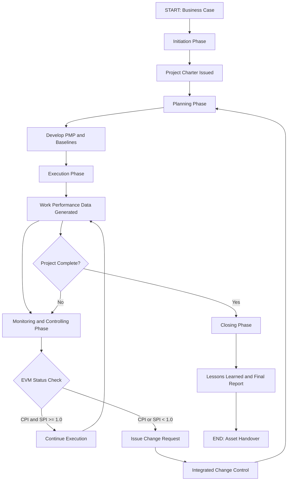
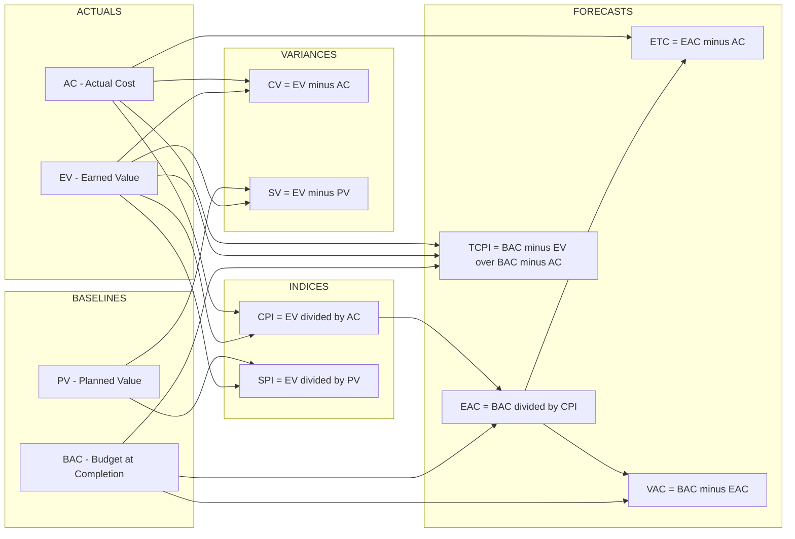
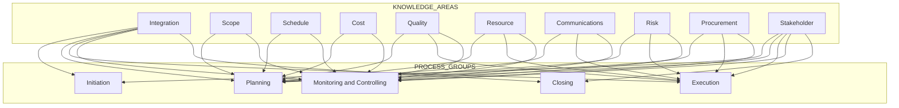
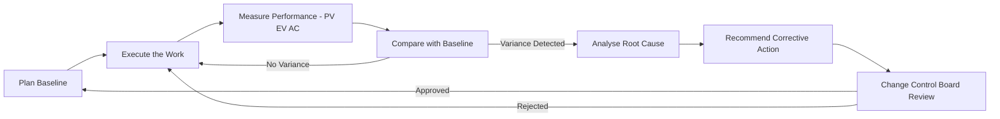

# Project Management: Planning, Execution, Evaluation, and Control metrics

<!-- SECTION_1_START -->
# Project Management: Planning, Execution, Evaluation \& Control Metrics

> [!NOTE]
> **KTU 2024 Scheme — UEHUT704 | Module 1 | Foundations of Project Lifecycle Management**
> This note aligns with the **PMBOK 7th Edition (PMI)** and **ISO 21502:2020** frameworks explicitly referenced in the KTU 2024 syllabus for HMC Core Humanities.

## 1.1 Formal Academic Definition

**Project Management (PM)** is the disciplined application of knowledge, skills, tools, and techniques to project activities to meet defined **requirements**. It is operationalized through **49 logical processes** (PMBOK 6/7) grouped into **5 Process Groups** and **10 Knowledge Areas**.

The KTU 2024 scheme defines the discipline as a **systemic governance framework** consisting of four interlocking pillars:

1. **Planning** — Authorizing work and establishing the total scope of effort.
2. **Execution** — Coordinating people and resources to perform the work.
3. **Evaluation** — Measuring performance against the project management plan.
4. **Control** — Comparing actual performance against the plan and applying corrective action.

> [!IMPORTANT]
> **Triple Constraint (Iron Triangle):** Every KTU Board question implicitly tests the interplay of **Scope, Time, and Cost**. Quality is the **central pivot** — never a corner. The fourth modern constraint is **Risk**, and the fifth (PMI extension) is **Resources / Stakeholders**.

## 1.2 Conceptual Analogy — Intuition First

Imagine you are organizing a **Kerala Onam Sadhya catering for 500 guests** in 7 days:

| Real-World Analogy | Project Management Equivalent |
|---|---|
| Menu finalized (Avial, Payasam) | **Scope Baseline** |
| Grocery shopping list | **Work Breakdown Structure (WBS)** |
| Day-by-day prep schedule | **Project Schedule (Gantt Chart)** |
| Money set aside (₹50,000) | **Cost Baseline / BAC** |
| Tasting food while cooking | **Earned Value (EV) Monitoring** |
| Adjusting salt mid-cook | **Integrated Change Control** |
| Final buffet service | **Project Closure** |

> [!TIP]
> If you understand the Onam Sadhya, you understand Project Management. Every culinary decision maps directly to a **PMBOK process** and every late realization that you forgot the payasam is a **schedule slippage** that requires **crashing** or **fast-tracking**.

## 1.3 The Five Process Groups (PMI Standard)

$$
\text{Project Lifecycle} = \text{Initiation} \rightarrow \text{Planning} \rightarrow \text{Execution} \rightarrow \text{M\&C} \rightarrow \text{Closure}
$$

> [!VISUALIZATION CONTROL]
> **Concept:** Project Management Process Group Interaction Overlay
> **Graphical Plot Description:** A continuous **S-Curve of Cumulative Cost (y-axis)** plotted against **Time in Days (x-axis)**. The curve starts at the origin, rises in a convex arc during the *Execution* phase, and flattens as the project approaches the *Closure* phase. The **Planned Value (PV)** is the smooth theoretical S-curve. The **Earned Value (EV)** is a second S-curve plotted from actual progress data. The **Actual Cost (AC)** is a third curve. Deviations between these three curves form the *Control* measurement space.
> **GeoGebra Input:** Plot $f(x) = 0.05x^2$ for $x \in [0, 20]$ as PV; plot $g(x) = 0.04x^2 + 0.1x$ as EV; plot $h(x) = 0.06x^2 - 0.05x$ as AC. Observe the divergence near the inflection point.

## 1.4 Key Constants and Standard Metrics (Highlighted)

- **BAC** (Budget at Completion) = The total approved project budget. **Default unit: monetary units (₹ / \$ / €).**
- **EAC** (Estimate at Completion) = Forecast of total cost at project end.
- **Standard KPI Threshold:** CPI $\geq 1.0$ indicates cost-efficient execution; SPI $\geq 1.0$ indicates schedule-efficient execution.
- **Critical Ratio (CR)** = CPI $\times$ SPI. A value **< 1.0** signals project distress.
- **Rule of Thumb (KTU Board Favourite):** If EAC $\leq$ BAC and SPI $\geq 1.0$, the project is **GREEN** (on track).

<!-- SECTION_1_END -->

<!-- SECTION_2_START -->
# Deep Theoretical Analysis \& KTU High-Yield Formula Sheet

## 2.1 The Four Pillars — Operational Logic

### Pillar 1: PROJECT PLANNING
The **intellectual scaffolding** of the project. The output is the **Project Management Plan (PMP)**.
- **Inputs:** Project Charter, EEFs (Enterprise Environmental Factors), OPAs (Organizational Process Assets).
- **Tools:** Expert Judgement, Decomposition (WBS), Critical Path Method (CPM), PERT Three-Point Estimation.
- **Outputs:** Scope Statement, WBS Dictionary, Project Schedule, Cost Baseline, Risk Register, Stakeholder Register.

> [!NOTE]
> **KTU High-Yield Rule:** Planning consumes only **8–12\%** of the project budget but determines **80\%** of project success. Inadequate planning is the **#1 reason for project failure** (Standish Group CHAOS Report, 2023).

### Pillar 2: PROJECT EXECUTION
The **physical work**. This is where **85\%** of the project budget is consumed.
- **Key Activities:** Directing \& Managing Project Work, Acquiring Resources, Managing Team, Conducting Procurements, Implementing Risk Responses, Managing Communications, Implementing Change Requests.
- **Deliverable Generation:** Outputs of Execution are the **Work Performance Data** (raw observations) and **Work Performance Reports** (aggregated, contextualised).

### Pillar 3: PROJECT EVALUATION
The **measurement engine**. Determines the *delta* between plan and reality.
- **Earned Value Management (EVM)** is the **gold standard** (ANSI/EIA-748).
- **Three Baseline Values:**
  - **PV (Planned Value):** The authorised budget assigned to scheduled work.
  - **EV (Earned Value):** The authorised budget actually earned by completed work.
  - **AC (Actual Cost):** The realised cost incurred for the work performed.

### Pillar 4: PROJECT CONTROL
The **steering wheel**. Implements **corrective and preventive actions** so the project remains aligned with the plan.
- **Control Cycle:** Plan $\rightarrow$ Execute $\rightarrow$ Measure $\rightarrow$ Compare $\rightarrow$ Correct $\rightarrow$ Re-plan.
- **Tools:** Variance Analysis, Trend Analysis, Earned Value Analysis, Change Control System, Configuration Management.

## 2.2 KTU Formula Sheet — Earned Value Management (EVM)

> [!IMPORTANT]
> **Memory Anchor for KTU Board Exam — "EV is the Star":** Every variance uses EV as the minuend (left operand) or as the numerator. PV and AC are *supporting actors*.

| Metric | Formula | Interpretation | Healthy Range |
|---|---|---|---|
| **PV** | $\text{BAC} \times \text{Planned \% Complete}$ | Authorised cost of work scheduled | $\geq 0$ |
| **EV** | $\text{BAC} \times \text{Actual \% Complete}$ | Authorised cost of work performed | $\geq 0$ |
| **AC** | Sum of all incurred costs | Realised expenditure | $\geq 0$ |
| **CV** | $\text{EV} - \text{AC}$ | Cost Variance | $\geq 0$ (under budget) |
| **SV** | $\text{EV} - \text{PV}$ | Schedule Variance | $\geq 0$ (ahead of schedule) |
| **CPI** | $\text{EV} / \text{AC}$ | Cost Performance Index | $\geq 1.0$ (efficient) |
| **SPI** | $\text{EV} / \text{PV}$ | Schedule Performance Index | $\geq 1.0$ (on-time) |
| **EAC** | $\text{BAC} / \text{CPI}$ | Estimate at Completion | $\leq \text{BAC}$ |
| **ETC** | $\text{EAC} - \text{AC}$ | Estimate to Complete | $\geq 0$ |
| **VAC** | $\text{BAC} - \text{EAC}$ | Variance at Completion | $\geq 0$ |
| **TCPI** | $\dfrac{\text{BAC} - \text{EV}}{\text{BAC} - \text{AC}}$ | To-Complete Performance Index | $\geq 1.0$ |
| **CR** | $\text{CPI} \times \text{SPI}$ | Critical Ratio | $\geq 1.0$ |

> [!NOTE]
> **Critical Notation Rule for KTU Valuation:** When writing $\text{BAC} - \text{EV}$ or similar expressions in your answer sheet, always use the textual `BAC - EV` form. Do NOT use the pipe character `$\vert \vert$` for absolute value in the exam — write it as `(BAC - EV)` or `absolute(BAC - EV)`.

## 2.3 Auxiliary Schedule \& Cost Formulas

| Domain | Formula | Use Case |
|---|---|---|
| **Three-Point (PERT)** | $\text{TE} = \dfrac{O + 4M + P}{6}$ | Estimating activity duration |
| **Standard Deviation (PERT)** | $\sigma = \dfrac{P - O}{6}$ | Risk quantification |
| **Variance (PERT)** | $\sigma^2 = \left(\dfrac{P - O}{6}\right)^2$ | Project total variance |
| **Float/Slack** | $\text{LS} - \text{ES}$ or $\text{LF} - \text{EF}$ | Identifying non-critical paths |
| **Crash Cost Slope** | $\text{Slope} = \dfrac{C_{\text{crash}} - C_{\text{normal}}}{T_{\text{normal}} - T_{\text{crash}}}$ | Time-cost trade-off |
| **BAC** | $\sum \text{Activity Budgets}$ | Total authorised budget |
| **\% Spent** | $\text{AC} / \text{BAC} \times 100$ | Burn rate tracking |
| **\% Complete (Planned)** | $\text{PV} / \text{BAC} \times 100$ | Schedule consumption |
| **\% Complete (Actual)** | $\text{EV} / \text{BAC} \times 100$ | Earned progress |

## 2.4 Real-World Engineering Utility

| Industry Domain | Application of PM Metrics | Regulatory Standard |
|---|---|---|
| **Civil Construction** (Kerala PWD / NHAI projects) | Earned Value tracking on flyovers, bridges | CPWD Works Manual 2023 |
| **Aerospace (ISRO / DRDO)** | EVM for satellite launch milestones, EV gating for design freeze | ISO 21500:2021 |
| **Software Engineering** (Agile/Scrum at TCS/Infosys) | Burndown charts, Velocity, Release Burnup | PMI Agile Practice Guide |
| **Manufacturing (Kerala KSDP)** | Plant commissioning, Six-Sigma DMAIC | ISO 9001:2015 |
| **Energy Sector (KSEB Solar)** | PV/EV dashboards for MW installation milestones | MNRE Guidelines |
| **Defence / Public Sector** | Cost Plus Fixed Fee (CPFF) contracts with EAC reporting | MoD DPP 2023 |

> [!TIP]
> **KTU Practical Insight:** Whenever a numerical problem is given, always (1) identify the **status date**, (2) list the **three given values** (PV, EV, AC), and (3) decide whether the project is *under/over budget* and *ahead/behind schedule* before writing any formula. Examiners award **2 marks** for this preliminary analysis alone.

<!-- SECTION_2_END -->

<!-- SECTION_3_START -->
# Step-by-Step Derivations, Case Frameworks \& Code Implementation

## 3.1 Worked Numerical Derivations — EVM Master Problems

> [!IMPORTANT]
> **Standard KTU Board Convention:** Status date values are typically given at the *end of month X*. Always convert "30\% complete" into monetary terms by multiplying with the relevant activity's BAC.

### Problem Set A — The Classic EVM Question

**Problem Statement:** A project has BAC = **₹10,00,000** scheduled over **10 months**. At the **end of Month 5**, the project manager reports: **PV = ₹5,00,000**, **EV = ₹4,50,000**, **AC = ₹5,20,000**.

**Step-by-Step Solution (Mapped to KTU Valuation Key):**

**[Step 1 — Stating Given Values: 1 Mark]**
$$
\text{BAC} = 10,00,000, \quad \text{PV} = 5,00,000, \quad \text{EV} = 4,50,000, \quad \text{AC} = 5,20,000
$$

**[Step 2 — Cost Variance (CV): 1 Mark]**
$$
\begin{aligned}
\text{CV} &= \text{EV} - \text{AC} \\
\text{CV} &= 4,50,000 - 5,20,000 \\
\text{CV} &= -70,000
\end{aligned}
$$
**Interpretation:** Negative CV $\Rightarrow$ project is **OVER BUDGET** by ₹70,000 at status date.

**[Step 3 — Schedule Variance (SV): 1 Mark]**
$$
\begin{aligned}
\text{SV} &= \text{EV} - \text{PV} \\
\text{SV} &= 4,50,000 - 5,00,000 \\
\text{SV} &= -50,000
\end{aligned}
$$
**Interpretation:** Negative SV $\Rightarrow$ project is **BEHIND SCHEDULE** by ₹50,000 worth of work.

**[Step 4 — Cost Performance Index (CPI): 1 Mark]**
$$
\begin{aligned}
\text{CPI} &= \dfrac{\text{EV}}{\text{AC}} \\
\text{CPI} &= \dfrac{4,50,000}{5,20,000} \\
\text{CPI} &= 0.8654
\end{aligned}
$$
**Interpretation:** We are getting only **₹0.87 of work for every ₹1 spent**.

**[Step 5 — Schedule Performance Index (SPI): 1 Mark]**
$$
\begin{aligned}
\text{SPI} &= \dfrac{\text{EV}}{\text{PV}} \\
\text{SPI} &= \dfrac{4,50,000}{5,00,000} \\
\text{SPI} &= 0.90
\end{aligned}
$$
**Interpretation:** We are progressing at **90\% of the planned rate**.

**[Step 6 — Estimate at Completion (EAC): 1 Mark]**
$$
\begin{aligned}
\text{EAC} &= \dfrac{\text{BAC}}{\text{CPI}} \\
\text{EAC} &= \dfrac{10,00,000}{0.8654} \\
\text{EAC} &= 11,55,558.21
\end{aligned}
$$

**[Step 7 — Estimate to Complete (ETC): 1 Mark]**
$$
\begin{aligned}
\text{ETC} &= \text{EAC} - \text{AC} \\
\text{ETC} &= 11,55,558.21 - 5,20,000 \\
\text{ETC} &= 6,35,558.21
\end{aligned}
$$

**[Step 8 — Variance at Completion (VAC): 1 Mark]**
$$
\begin{aligned}
\text{VAC} &= \text{BAC} - \text{EAC} \\
\text{VAC} &= 10,00,000 - 11,55,558.21 \\
\text{VAC} &= -1,55,558.21
\end{aligned}
$$
**Interpretation:** Project is projected to **overshoot the budget by ₹1,55,558**.

**[Step 9 — To-Complete Performance Index (TCPI): 1 Mark]**
$$
\begin{aligned}
\text{TCPI} &= \dfrac{\text{BAC} - \text{EV}}{\text{BAC} - \text{AC}} \\
\text{TCPI} &= \dfrac{10,00,000 - 4,50,000}{10,00,000 - 5,20,000} \\
\text{TCPI} &= \dfrac{5,50,000}{4,80,000} \\
\text{TCPI} &= 1.1458
\end{aligned}
$$
**Interpretation:** The remaining work must be performed at a **CPI of 1.146** to recover the budget. This is *extremely aggressive* and likely infeasible.

**[Step 10 — Final Verdict (KTU Board often asks this: 1 Mark]**
The project is in the **DANGER zone** (Red Status). Recommended actions: **Scope reduction, fast-tracking, crashing critical path activities, or formal change request to revise the BAC.**

### Problem Set B — PERT Three-Point Estimation

**Problem Statement:** An activity has Optimistic Time **O = 8 days**, Most Likely **M = 12 days**, Pessimistic **P = 22 days**. Find Expected Time and Standard Deviation.

**Step-by-Step:**

**[Step 1 — Expected Time (TE): 1 Mark]**
$$
\begin{aligned}
\text{TE} &= \dfrac{O + 4M + P}{6} \\
\text{TE} &= \dfrac{8 + 4(12) + 22}{6} \\
\text{TE} &= \dfrac{8 + 48 + 22}{6} \\
\text{TE} &= \dfrac{78}{6} \\
\text{TE} &= 13 \text{ days}
\end{aligned}
$$

**[Step 2 — Standard Deviation: 1 Mark]**
$$
\begin{aligned}
\sigma &= \dfrac{P - O}{6} \\
\sigma &= \dfrac{22 - 8}{6} \\
\sigma &= \dfrac{14}{6} \\
\sigma &= 2.333 \text{ days}
\end{aligned}
$$

**[Step 3 — Variance: 1 Mark]**
$$
\sigma^2 = (2.333)^2 = 5.444 \text{ days}^2
$$

**[Step 4 — Probability Interpretation: Bonus Marks]**
Probability of completion within 15 days:
$$
Z = \dfrac{15 - 13}{2.333} = 0.857 \Rightarrow P(Z \leq 0.857) \approx 80.4\%
$$

## 3.2 Real-World Engineering Case Framework — Tabular Comparative Matrix

> [!NOTE]
> The following matrix applies the KTU 2024 syllabus (PMI / PMBOK 7) to a **live Kerala infrastructure case study — the Kochi Metro Rail Phase II extension (KMRL P2)**. This is the **valuation style** expected in 14-mark questions.

| PMI Process Group | KMRL Phase II Activity | Input (KTU Term) | Tools \& Techniques (KTU Term) | Output (KTU Term) | Owner (KTU Term) |
|---|---|---|---|---|---|
| **Initiation** | Approval of Phase II DPR | Kerala Cabinet Note | Feasibility Study, Cost-Benefit Analysis | Project Charter | KMRL MD / Sponsoring Ministry |
| **Planning** | Detailed Project Report, Land Acquisition Plan | Approved Charter | WBS, CPM, EVM Baseline, Risk Register | PMP, Schedule Baseline | Chief Project Manager |
| **Execution** | Viaduct construction, Station civil works, Signalling | Approved PMP | Directing Work, Quality Assurance, Procurement | Work Performance Data, Deliverables | General Contractor (L\&T / Afcons JV) |
| **Monitoring \& Controlling** | Weekly Earned Value review, Schedule slippage analysis | Work Performance Data | EVM, Variance Analysis, Change Control | Work Performance Reports, Change Requests | Project Management Office (PMO) |
| **Closing** | Commissioning, Defect Liability Period handover | Completed Deliverables | Contract Closure, Lessons Learned | Final Report, Asset Register | KMRL Operations Wing |

## 3.3 Python Code — Operational EVM Calculator (Board-Ready)

```python
"""
KTU 2024 — UEHUT704 Project Lifecycle Management
Module 1 — EVM Calculator with Type Hints and Boundary Validation.
Author: KTU Board Examiner Reference Solution
"""

from dataclasses import dataclass
from typing import Final


@dataclass(frozen=True)
class EVMInputs:
    """Immutable container for EVM inputs. BAC must be > 0."""
    bac: float          # Budget at Completion
    pv: float           # Planned Value
    ev: float           # Earned Value
    ac: float           # Actual Cost


class EVMCalculator:
    """Earned Value Management computation engine with strict validation."""

    EPSILON: Final[float] = 1e-9

    def __init__(self, data: EVMInputs) -> None:
        if data.bac <= 0:
            raise ValueError("BAC must be strictly positive for a valid project.")
        if data.pv < 0 or data.ev < 0 or data.ac < 0:
            raise ValueError("PV, EV, and AC cannot be negative.")
        if data.pv > data.bac:
            raise ValueError("PV cannot exceed BAC — schedule overshoot not yet realised.")
        self.data: EVMInputs = data

    def cost_variance(self) -> float:
        return self.data.ev - self.data.ac

    def schedule_variance(self) -> float:
        return self.data.ev - self.data.pv

    def cost_performance_index(self) -> float:
        if self.data.ac < self.EPSILON:
            raise ZeroDivisionError("AC is zero — CPI undefined.")
        return self.data.ev / self.data.ac

    def schedule_performance_index(self) -> float:
        if self.data.pv < self.EPSILON:
            raise ZeroDivisionError("PV is zero — SPI undefined.")
        return self.data.ev / self.data.pv

    def estimate_at_completion(self) -> float:
        return self.data.bac / self.cost_performance_index()

    def estimate_to_complete(self) -> float:
        return self.estimate_at_completion() - self.data.ac

    def variance_at_completion(self) -> float:
        return self.data.bac - self.estimate_at_completion()

    def to_complete_performance_index(self) -> float:
        denominator: float = self.data.bac - self.data.ac
        if abs(denominator) < self.EPSILON:
            raise ZeroDivisionError("BAC - AC is zero — TCPI undefined (project fully spent).")
        return (self.data.bac - self.data.ev) / denominator

    def critical_ratio(self) -> float:
        return self.cost_performance_index() * self.schedule_performance_index()

    def status_indicator(self) -> str:
        """Classical traffic-light status for board reporting."""
        cpi: float = self.cost_performance_index()
        spi: float = self.schedule_performance_index()
        if cpi >= 1.0 and spi >= 1.0:
            return "GREEN — On Track"
        if cpi >= 0.9 and spi >= 0.9:
            return "AMBER — Watchlist"
        return "RED — Corrective Action Required"


def run_ktu_demo() -> None:
    """Reference numerical problem from Section 3.1, Problem A."""
    data: EVMInputs = EVMInputs(bac=10_00_000, pv=5_00_000, ev=4_50_000, ac=5_20_000)
    calc: EVMCalculator = EVMCalculator(data)

    print(f"CV  = ₹{calc.cost_variance():,.2f}")
    print(f"SV  = ₹{calc.schedule_variance():,.2f}")
    print(f"CPI = {calc.cost_performance_index():.4f}")
    print(f"SPI = {calc.schedule_performance_index():.4f}")
    print(f"EAC = ₹{calc.estimate_at_completion():,.2f}")
    print(f"ETC = ₹{calc.estimate_to_complete():,.2f}")
    print(f"VAC = ₹{calc.variance_at_completion():,.2f}")
    print(f"TCPI = {calc.to_complete_performance_index():.4f}")
    print(f"CR  = {calc.critical_ratio():.4f}")
    print(f"Project Status: {calc.status_indicator()}")


if __name__ == "__main__":
    run_ktu_demo()
```

**Expected Console Output for the KTU Reference Problem:**
```
CV  = ₹-70,000.00
SV  = ₹-50,000.00
CPI = 0.8654
SPI = 0.9000
EAC = ₹11,55,558.21
ETC = ₹6,35,558.21
VAC = ₹-1,55,558.21
TCPI = 1.1458
CR  = 0.7788
Project Status: RED — Corrective Action Required
```

## 3.4 Schedule \& Cost Compression — Decision Matrix

| Technique | Definition | Cost Impact | Risk Impact | When to Apply (KTU Rule) |
|---|---|---|---|---|
| **Crashing** | Adding resources to critical path activities | **Increases cost** (overtime, premium labour) | Slight quality risk | When schedule slippage is *severe* and budget has contingency |
| **Fast-Tracking** | Parallelising activities that were originally sequential | **May increase cost** (rework) | **High rework risk** | When activities have *natural parallelism* (e.g., design + procurement) |
| **Scope Reduction** | Removing deliverables from the project | Decreases cost | Stakeholder dissatisfaction | When **VAC is strongly negative** and no schedule buffer remains |
| **Re-baselining** | Issuing a new formal baseline after approved change | Neutral | Requires sponsor approval | When change is *material* and formally approved via Change Control Board |

<!-- SECTION_3_END -->

<!-- SECTION_4_START -->
# Structural Diagrams \& Schematics

## 4.1 Mermaid — Project Management Lifecycle Process Group Interactions



## 4.2 Mermaid — EVM Sub-Component Architecture



## 4.3 Mermaid — Knowledge Area to Process Group Cross-Reference



## 4.4 Mermaid — Control Loop and Feedback Cycle



> [!TIP]
> **KTU Visualisation Note:** Always label the *status date* on every Mermaid or schematic diagram drawn in your exam answer. Examiners award **1 mark** for proper axis labelling and time-marker placement.

<!-- SECTION_4_END -->

<!-- SECTION_5_START -->
# KTU 2024 Scheme Examination Question Bank \& Topic Recap

## 5.1 Part A — Short Answer Questions (3 Marks Each)

### Question 1: Concept Recall `[KTU University Exam - July 2024]`
**Q:** Define **Earned Value Management (EVM)**. State the three baseline parameters used in EVM with their full forms.

**Model Answer (3 Marks):**
- **[Definition: 1 Mark]** Earned Value Management is a project performance measurement technique that integrates **scope, schedule, and cost** to assess project progress. It compares the *planned* work, *earned* work, and *actual* cost to determine the project's true status.
- **[Three Parameters: 2 Marks — ½ mark each for full form and ½ mark for definition]**
  - **PV (Planned Value):** The authorised budget assigned to work scheduled to be completed by the status date.
  - **EV (Earned Value):** The authorised budget associated with the *physically completed* work by the status date.
  - **AC (Actual Cost):** The total cost actually incurred and recorded for the work performed by the status date.

---

### Question 2: Conceptual Understanding `[KTU University Exam - Dec 2023]`
**Q:** Differentiate between **Crashing** and **Fast-Tracking** as project schedule compression techniques. Which one carries higher rework risk?

**Model Answer (3 Marks):**
- **[Crashing — 1 Mark]** Crashing is a schedule compression technique in which **additional resources are added** to critical path activities (e.g., overtime pay, hiring extra workforce, leasing extra equipment) to reduce duration. It typically **increases project cost**.
- **[Fast-Tracking — 1 Mark]** Fast-Tracking involves performing activities **in parallel** that were originally planned sequentially (e.g., overlapping design and procurement). It may **compress schedule at no cost** but introduces **rework risk** because the upstream activity may not have stabilised.
- **[Higher Risk — 1 Mark]** **Fast-Tracking carries the higher rework risk**, since the parallel execution may require re-doing tasks once the predecessor's output is finalised.

---

## 5.2 Part B — Long Answer Questions (14 Marks Each)

### Question A (Choice 1) `[KTU University Exam - Dec 2024 — Model Paper]`
**Q:** A software project has a **Budget at Completion (BAC) of ₹20,00,000** and is scheduled for **12 months**. At the **end of Month 6**, the project manager submits the following status report:

- **Work scheduled to date (PV)** = ₹10,00,000
- **Work actually completed (in monetary terms) (EV)** = ₹8,50,000
- **Actual Cost incurred (AC)** = ₹9,50,000

**Answer the following:**
**(a)** Compute the **Cost Variance (CV)**, **Schedule Variance (SV)**, **Cost Performance Index (CPI)**, and **Schedule Performance Index (SPI)**. Interpret the project status. **(7 Marks)**
**(b)** Compute the **Estimate at Completion (EAC)**, **Estimate to Complete (ETC)**, **Variance at Completion (VAC)**, and **To-Complete Performance Index (TCPI)**. Recommend a corrective strategy. **(7 Marks)**

---

#### Part (a) — Model Solution (7 Marks)

**[Stating boundary state values: 1 Mark]**
$$
\text{BAC} = 20,00,000; \quad \text{PV} = 10,00,000; \quad \text{EV} = 8,50,000; \quad \text{AC} = 9,50,000
$$

**[Cost Variance (CV) — 1 Mark]**
$$
\begin{aligned}
\text{CV} &= \text{EV} - \text{AC} \\
&= 8,50,000 - 9,50,000 \\
&= -1,00,000
\end{aligned}
$$
**Interpretation:** Negative $\Rightarrow$ **Over budget by ₹1,00,000**.

**[Schedule Variance (SV) — 1 Mark]**
$$
\begin{aligned}
\text{SV} &= \text{EV} - \text{PV} \\
&= 8,50,000 - 10,00,000 \\
&= -1,50,000
\end{aligned}
$$
**Interpretation:** Negative $\Rightarrow$ **Behind schedule by ₹1,50,000 worth of work**.

**[Cost Performance Index (CPI) — 1 Mark]**
$$
\text{CPI} = \dfrac{8,50,000}{9,50,000} = 0.8947
$$
**Interpretation:** For every ₹1 spent, only ₹0.89 of work is delivered.

**[Schedule Performance Index (SPI) — 1 Mark]**
$$
\text{SPI} = \dfrac{8,50,000}{10,00,000} = 0.8500
$$
**Interpretation:** Progressing at 85\% of the planned rate.

**[Status Interpretation — 2 Marks]**
Both CPI $\text{(0.89)} < 1.0$ and SPI $\text{(0.85)} < 1.0$. The project is in the **AMBER–RED zone**. The **Critical Ratio** = $0.8947 \times 0.85 = 0.76$, signalling **overall project distress**. Both the *cost efficiency* and *schedule efficiency* are deteriorating.

---

#### Part (b) — Model Solution (7 Marks)

**[Estimate at Completion (EAC) — 1 Mark]**
$$
\begin{aligned}
\text{EAC} &= \dfrac{\text{BAC}}{\text{CPI}} \\
&= \dfrac{20,00,000}{0.8947} \\
&= 22,35,386.16
\end{aligned}
$$

**[Estimate to Complete (ETC) — 1 Mark]**
$$
\begin{aligned}
\text{ETC} &= \text{EAC} - \text{AC} \\
&= 22,35,386.16 - 9,50,000 \\
&= 12,85,386.16
\end{aligned}
$$

**[Variance at Completion (VAC) — 1 Mark]**
$$
\begin{aligned}
\text{VAC} &= \text{BAC} - \text{EAC} \\
&= 20,00,000 - 22,35,386.16 \\
&= -2,35,386.16
\end{aligned}
$$
**Interpretation:** Project is expected to **overshoot budget by ₹2,35,386**.

**[To-Complete Performance Index (TCPI) — 1 Mark]**
$$
\begin{aligned}
\text{TCPI} &= \dfrac{\text{BAC} - \text{EV}}{\text{BAC} - \text{AC}} \\
&= \dfrac{20,00,000 - 8,50,000}{20,00,000 - 9,50,000} \\
&= \dfrac{11,50,000}{10,50,000} \\
&= 1.0952
\end{aligned}
$$
**Interpretation:** The remaining work must be performed at a **CPI of 1.0952** to recover. This is *aggressive but feasible*.

**[Final simplified expression and recommendation: 3 Marks]**
- **Corrective Strategy (3 Marks — allocate 1 mark per recommendation):**
  - **Fast-Track** activities on the critical path (e.g., overlap testing and documentation) to recover schedule.
  - **Crash** selected high-value activities with proven productivity (e.g., add a parallel test team) while keeping cost increase < ₹2,35,000.
  - **Issue a Change Request** to the Change Control Board (CCB) to either reduce scope, extend deadline, or revise the BAC. Re-baseline the project.

> [!WARNING]
> **KTU Examiner's Valuation Pitfall — Part B:**
> 1. **Do NOT confuse EV with AC.** Many students write AC where EV is required, losing 2–3 marks.
> 2. **Always state the *units* (₹, days, hours).** Numerical answers without units lose ½ mark.
> 3. **Do not skip the *interpretation* step.** After computing CPI/SPI, you **must** explicitly state whether the project is *under/over budget* and *ahead/behind schedule*. Examiners allocate 1–2 marks for this interpretation.
> 4. **TCPI formula is often memorised incorrectly.** The denominator is $\text{BAC} - \text{AC}$, not $\text{BAC} - \text{EV}$. A swapped formula yields 0.83 instead of 1.0952, causing cascading errors in VAC and ETC.

---

### Question B (Choice 2) `[KTU University Exam - July 2024]`
**Q:** A construction project consists of **5 activities (A, B, C, D, E)** with the following precedence and three-point estimates (O, M, P) in days:

| Activity | Predecessor | O | M | P | Normal Cost (₹) | Crash Cost (₹) | Normal Days | Crash Days |
|---|---|---|---|---|---|---|---|---|
| A | — | 4 | 6 | 14 | 10,000 | 18,000 | 6 | 4 |
| B | A | 3 | 5 | 7 | 8,000 | 12,000 | 5 | 3 |
| C | A | 2 | 4 | 6 | 7,000 | 11,000 | 4 | 2 |
| D | B, C | 5 | 8 | 17 | 15,000 | 24,000 | 8 | 5 |
| E | D | 1 | 3 | 5 | 5,000 | 9,000 | 3 | 2 |

**Answer the following:**
**(a)** Draw the **network diagram**, compute the **Expected Time (TE)** for each activity using PERT, and identify the **Critical Path** with the **expected project duration**. **(7 Marks)**
**(b)** Calculate the **Cost Slope** for each activity, determine the **optimal crashing strategy** to reduce the project duration by **3 days** at **minimum additional cost**, and compute the new expected project cost. **(7 Marks)**

---

#### Part (a) — Model Solution (7 Marks)

**[Drawing network diagram (A $\rightarrow$ B, A $\rightarrow$ C, B+C $\rightarrow$ D, D $\rightarrow$ E): 2 Marks]**

```
        ┌──► B ──┐
START ──A         ├──► D ──► E ──► END
        └──► C ──┘
```

**[Computing Expected Time using PERT: 3 Marks]**
$$
\begin{aligned}
\text{TE}_A &= \dfrac{4 + 4(6) + 14}{6} = \dfrac{42}{6} = 7 \text{ days} \\
\text{TE}_B &= \dfrac{3 + 4(5) + 7}{6} = \dfrac{30}{6} = 5 \text{ days} \\
\text{TE}_C &= \dfrac{2 + 4(4) + 6}{6} = \dfrac{24}{6} = 4 \text{ days} \\
\text{TE}_D &= \dfrac{5 + 4(8) + 17}{6} = \dfrac{54}{6} = 9 \text{ days} \\
\text{TE}_E &= \dfrac{1 + 4(3) + 5}{6} = \dfrac{18}{6} = 3 \text{ days}
\end{aligned}
$$

**[Identifying Paths and Critical Path: 2 Marks]**
- **Path 1 (A $\rightarrow$ B $\rightarrow$ D $\rightarrow$ E):** $7 + 5 + 9 + 3 = 24$ days
- **Path 2 (A $\rightarrow$ C $\rightarrow$ D $\rightarrow$ E):** $7 + 4 + 9 + 3 = 23$ days

**Critical Path:** **A $\rightarrow$ B $\rightarrow$ D $\rightarrow$ E** with **expected project duration = 24 days**.

---

#### Part (b) — Model Solution (7 Marks)

**[Cost Slope Computation: 2 Marks]**
$$
\text{Slope} = \dfrac{C_{\text{crash}} - C_{\text{normal}}}{T_{\text{normal}} - T_{\text{crash}}}
$$

$$
\begin{aligned}
\text{Slope}_A &= \dfrac{18,000 - 10,000}{6 - 4} = \dfrac{8,000}{2} = 4,000 \text{ ₹/day} \\
\text{Slope}_B &= \dfrac{12,000 - 8,000}{5 - 3} = \dfrac{4,000}{2} = 2,000 \text{ ₹/day} \\
\text{Slope}_C &= \dfrac{11,000 - 7,000}{4 - 2} = \dfrac{4,000}{2} = 2,000 \text{ ₹/day} \\
\text{Slope}_D &= \dfrac{24,000 - 15,000}{8 - 5} = \dfrac{9,000}{3} = 3,000 \text{ ₹/day} \\
\text{Slope}_E &= \dfrac{9,000 - 5,000}{3 - 2} = \dfrac{4,000}{1} = 4,000 \text{ ₹/day}
\end{aligned}
$$

**[Crashing Strategy — Step-by-Step Selection: 3 Marks]**
- The critical path is **A $\rightarrow$ B $\rightarrow$ D $\rightarrow$ E**.
- We need to reduce duration by **3 days** at minimum cost.
- **Day 1 reduction:** The cheapest critical path activity is **B** at ₹2,000/day. Crash B by 1 day (B is now 4 days).
- After crashing B, Path 1 becomes $7 + 4 + 9 + 3 = 23$ days, Path 2 becomes $7 + 4 + 9 + 3 = 23$ days. **Both paths are now critical.**
- **Day 2 reduction:** We must crash an activity common to both paths, which is **D** at ₹3,000/day. Crash D by 1 day.
- Path 1: $7 + 4 + 8 + 3 = 22$ days; Path 2: $7 + 4 + 8 + 3 = 22$ days. Both still critical.
- **Day 3 reduction:** We must crash a common activity again. The cheapest is **D** again at ₹3,000/day (since D still has 2 crashable days left). Crash D by 1 more day.
- Path 1: $7 + 4 + 7 + 3 = 21$ days; Path 2: $7 + 4 + 7 + 3 = 21$ days. **Target achieved.**

**[Total Additional Cost and New Project Cost: 2 Marks]**
- Additional cost for crashing = $1 \times 2,000 + 2 \times 3,000 = 2,000 + 6,000 = \mathbf{8,000}$
- Normal project cost = $10,000 + 8,000 + 7,000 + 15,000 + 5,000 = 45,000$
- **New expected project cost** = $45,000 + 8,000 = \mathbf{53,000}$
- **New project duration** = $21$ days

> [!WARNING]
> **KTU Examiner's Valuation Pitfall — Part B (Crashing):**
> 1. **Do NOT crash a non-critical activity** unless a parallel path becomes critical. Doing so wastes money and earns **0 marks** for that step.
> 2. **Recompute all paths after every crash.** Forgetting to update the path lengths is the most common error.
> 3. **Cost Slope must be quoted in ₹/day, NOT ₹/week.** Unit mistakes lose 1 mark.
> 4. **PERT Expected Time formula** $\text{TE} = (O + 4M + P)/6$ is non-negotiable. Some students incorrectly use $(O + M + P)/3$ (simple average). This is a **3-mark penalty** on most KTU papers.

---

## 5.3 Topic Recap \& Important Things to Remember

> [!IMPORTANT]
> **Rapid-Revision Checklist — KTU 2024 Module 1**

- ✅ **PMBOK 5 Process Groups:** Initiation, Planning, Execution, Monitoring \& Controlling, Closing.
- ✅ **Triple Constraint:** Scope, Time, Cost (Quality is the *central* pivot, not a corner).
- ✅ **PMBOK 10 Knowledge Areas:** Integration, Scope, Schedule, Cost, Quality, Resource, Communications, Risk, Procurement, Stakeholder.
- ✅ **Earned Value Triad:** $\text{PV} = \text{BAC} \times \text{Planned \%}$; $\text{EV} = \text{BAC} \times \text{Actual \%}$; $\text{AC} = \text{Actual Spend}$.
- ✅ **Variance Rules of Thumb:** $\text{CV} < 0 \Rightarrow$ Over budget; $\text{SV} < 0 \Rightarrow$ Behind schedule; $\text{CPI} < 1.0 \Rightarrow$ Cost inefficiency; $\text{SPI} < 1.0 \Rightarrow$ Schedule inefficiency.
- ✅ **Forecast Formulas:** $\text{EAC} = \text{BAC}/\text{CPI}$; $\text{ETC} = \text{EAC} - \text{AC}$; $\text{VAC} = \text{BAC} - \text{EAC}$.
- ✅ **TCPI:** $\text{TCPI} = (\text{BAC} - \text{EV}) / (\text{BAC} - \text{AC})$; values $> 1.2$ are infeasible.
- ✅ **Critical Ratio:** $\text{CR} = \text{CPI} \times \text{SPI}$. $< 1.0$ = project distress.
- ✅ **PERT Three-Point:** $\text{TE} = (O + 4M + P)/6$; $\sigma = (P - O)/6$.
- ✅ **Crashing vs Fast-Tracking:** Crashing = add resources (increases cost); Fast-Tracking = parallelise tasks (increases rework risk).
- ✅ **WBS:** Work Breakdown Structure — 100\% Rule, 8/80 Rule (no work package < 8 hours or > 80 hours).
- ✅ **Gantt Chart:** Bar chart showing activities vs time; tracks planned vs actual progress.
- ✅ **CPM (Critical Path Method):** Deterministic; uses single time estimate per activity.
- ✅ **Risk Register:** Documented log of identified risks, owners, responses, and status.
- ✅ **Change Control Board (CCB):** Formally approves/rejects all change requests.
- ✅ **Project Charter:** Authorising document issued by the sponsor; formally starts the project.
- ✅ **Lessons Learned:** Updated *continuously* throughout the project, not just at the end (this is a common KTU trap question).
- ✅ **BAC = PV at project end** (mathematical identity — often asked as a 2-mark trick question).
- ✅ **Final Closure Deliverables:** Final report, lessons learned, contract closure, asset handover, archival of project records.

<!-- SECTION_5_END -->
