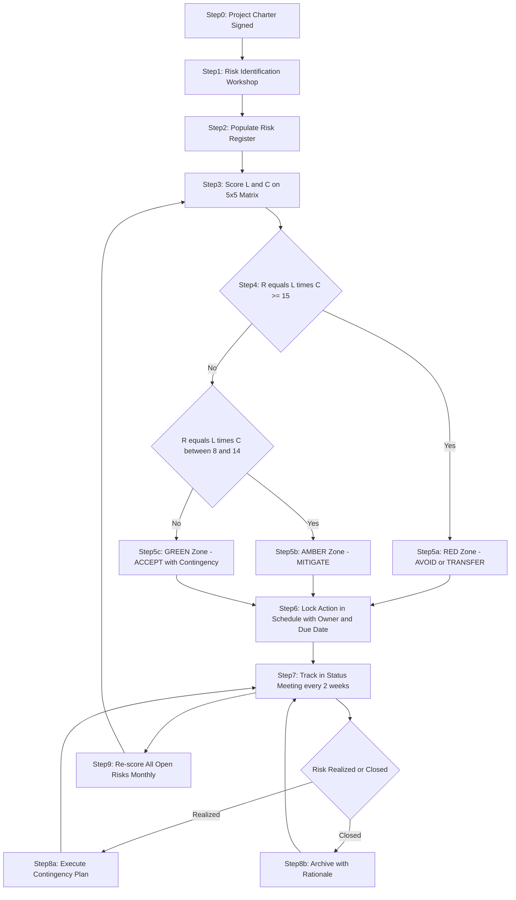
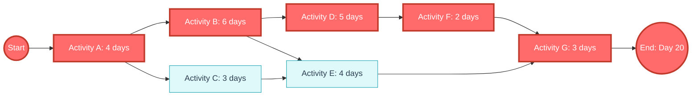
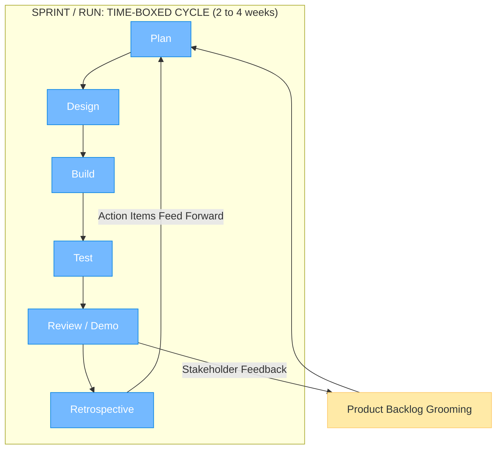
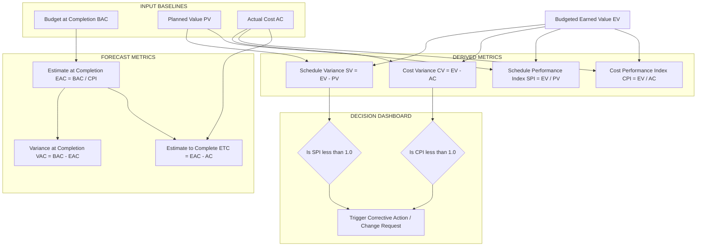
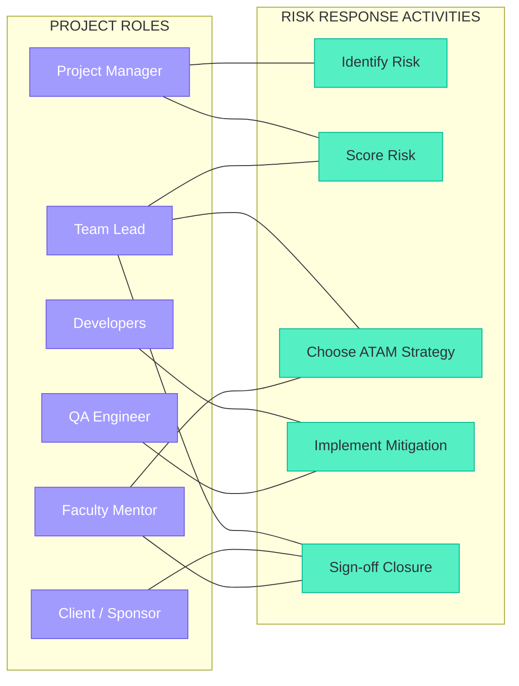
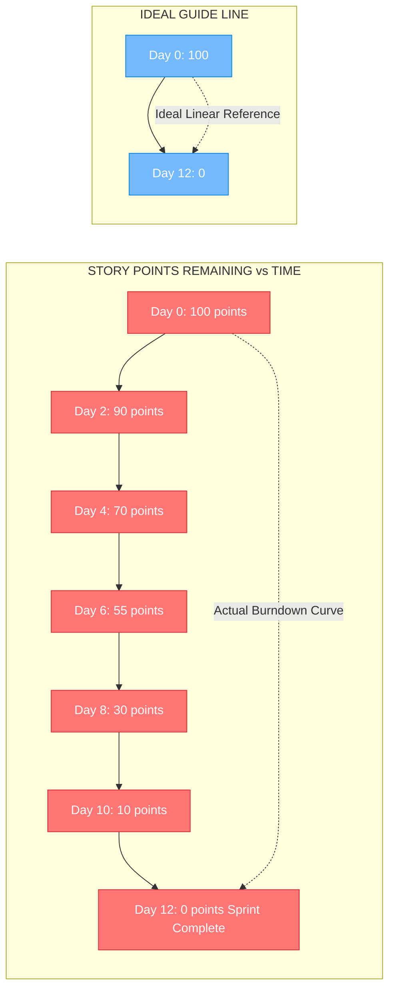

# Risk mitigation matrix layouts scheduling constraints tracking systems runs

<!-- SECTION_1_START -->

# Risk Mitigation Matrices, Layouts, Scheduling Constraints & Tracking Systems

## 1.1 Formal KTU Syllabus Definition

**Project Risk Mitigation** is the systematic process of identifying, classifying, prioritizing, and executing countermeasures against potential adverse events that may impact a project's **scope**, **time**, **cost**, or **quality** baselines. In the KTU 2024 Scheme (Course: **UEHUT704 – Project Lifecycle Management**, Module 1), this is operationalized through a **Risk Mitigation Matrix (RMM)** — a two-dimensional plotting instrument that cross-tabulates the **likelihood of occurrence (L)** against the **consequence severity (C)** of every identified project risk, producing a quantified **Risk Score (R = L × C)** that drives the choice of response strategy.

**Scheduling Constraints** are the imposed limitations — temporal (deadlines, milestones), resource (manpower, capital, equipment), logical (precedence dependencies), and regulatory (compliance gates) — that govern the construction of the project schedule and dictate the path of execution.

**Tracking Systems** are the integrated digital or analog instruments (dashboards, earned-value meters, burn-down charts, RACI logs) that continuously capture, measure, and report project performance variables against the approved baselines, enabling **Earned Value Management (EVM)** and variance analytics.

**Runs (Iterations / Sprints)** are bounded time-boxed execution cycles in which a defined scope of work (a *run*, *sprint*, or *phase iteration*) is designed, executed, reviewed, and demonstrated, with retrospective learning loops feeding forward into subsequent cycles.

> [!IMPORTANT]
> **KTU 2024 Board-Exam Definition (verbatim recall target):**
> *"A Risk Mitigation Matrix is a probabilistic-impactive cross-classification tool that assigns each project risk a numerical priority score by multiplying its likelihood rating with its impact rating, thereby prescribing one of four universal response strategies: Avoid, Transfer, Mitigate, or Accept."*

---

## 1.2 Conceptual Analogy & Intuitive Overview

> [!NOTE]
> **The Airport Weather Control Analogy** ✈️
>
> Imagine you are an **Air Traffic Controller** managing a busy international airport. Every incoming flight is a "project risk" — it *might* be delayed (likelihood), and if delayed it *might* cascade across the network (impact). You build a **2×2 grid (the matrix)** taped to your console:
>
> - **Top-Right Quadrant (Red Zone)**: High chance, high damage → *Divert the flight immediately* (Equivalent to project response: **AVOID**)
> - **Top-Left / Bottom-Right (Yellow Zone)**: One axis high, one low → *Hold at the gate, prepare backup* (**MITIGATE** or **TRANSFER**)
> - **Bottom-Left (Green Zone)**: Low chance, low damage → *Proceed normally, log it* (**ACCEPT**)
>
> The **runway schedule** with staggered slots is your **scheduling constraint map**, the **radar screen** showing live positions is your **tracking system**, and every **landing cycle** is a **run/iteration** of safe throughput.

> [!VISUALIZATION CONTROL]
> **Concept:** Risk Mitigation Heat-Map (5×5 Probability-Impact Matrix)
> **GeoGebra / Desmos Input Equations (Discretized Grid):**
> * `L(x) = 1, 2, 3, 4, 5` (Likelihood — X-axis discrete levels)
> * `C(y) = 1, 2, 3, 4, 5` (Consequence — Y-axis discrete levels)
> * `R(x,y) = L(x) * C(y)` (Risk Score — Z as color intensity)
>
> **Visual Description:** Plot a 5×5 grid. Cells in the **top-right** glow **deep red (R = 20–25)**, mid-diagonal cells turn **amber (R = 9–15)**, and the **bottom-left** cells fade to **green (R = 1–6)**. Diagonal lines of constant risk score (iso-risk curves) should be visible as `L = R/C` hyperbolas passing through equivalent-priority cells.

---

## 1.3 Physical Constants, Standard Metrics & KTU High-Yield Terms

- **Standard Likelihood Scale**: **5-point ordinal** → {1: Rare, 2: Unlikely, 3: Possible, 4: Likely, 5: Almost Certain}.
- **Standard Impact Scale**: **5-point ordinal** → {1: Negligible, 2: Minor, 3: Moderate, 4: Major, 5: Catastrophic}.
- **Risk Score Range**: $R_{\min} = 1$ to $R_{\max} = 25$.
- **Acceptance Threshold (Project-Dependent)**: $R_{\text{accept}} \leq 8$ in most KTU-referenced industry templates (PMI/PMBOK 7th ed.).
- **Schedule Performance Index (SPI)**: $SPI = EV / PV$, benchmark value **1.0**.
- **Cost Performance Index (CPI)**: $CPI = EV / AC$, benchmark value **1.0**.

> [!NOTE]
> The **four universal risk response levers** (the *ATAM* quartet) — **A**void, **T**ransfer, **A**ccept, **M**itigate — are the only responses credited in the KTU valuation key for Module 1 questions on risk strategy selection.

---

<!-- SECTION_1_END -->

<!-- SECTION_2_START -->

# Deep Theoretical Analysis & KTU High-Yield Formula Sheet

## 2.1 Operational Decomposition of the Risk Mitigation Pipeline

The end-to-end workflow breaks into **six (6) sequential logical blocks**:

1. **Risk Identification (RID)** — Brainstorm, Delphi technique, SWOT, and *checklist audits* surface candidate risks. Output: a **Risk Register** (a living document, versioned per project phase).
2. **Risk Classification (RCL)** — Each risk is bucketed along orthogonal axes: *internal vs. external*, *technical vs. financial vs. legal*, *known vs. unknown* (Knightian distinction).
3. **Risk Scoring (RSC)** — The matrix cross-product yields a quantitative priority: $R = L \times C$. Scores are then bucketed into **bands** (Red ≥ 15, Amber 8–14, Green ≤ 7).
4. **Response Selection (RSL)** — Based on the band, one of the four ATAM levers is chosen.
5. **Schedule & Resource Locking (SRL)** — Mitigation actions are converted into **scheduled activities** with owners, budgets, and **due dates**, becoming *first-class citizens* in the project schedule.
6. **Tracking, Re-scoring & Closure (TRC)** — At every status meeting, the register is **re-scored** (L and C may change as the project evolves), and retired risks are archived with closure rationale.

> [!TIP]
> **Why is re-scoring mandatory?** A risk that begins as "Amber" (Score 12) may *escalate* to "Red" (Score 20) if, for example, the *likelihood* of a supply-chain disruption doubles after a geopolitical event. The matrix is therefore a **dynamic**, not a static, artifact.

---

## 2.2 The Four Risk Response Strategies (ATAM)

| Strategy | Meaning | When to Deploy | Real-World Engineering Example | KTU Credit Phrasing |
|:---:|:---|:---|:---|:---|
| **Avoid** | Eliminate the threat by removing its cause | L = High **and** C = High (Red zone) | Drop a high-risk offshore module and use onshore prototyping | "Eliminate the root cause" |
| **Transfer** | Shift impact to a third party (insurance, outsourcing) | Financial/liability risks | Buy a performance bond for a vendor; cyber-insurance | "Allocate to a third party via contractual/financial means" |
| **Mitigate** | Reduce L or C (or both) through proactive action | Amber zone, partially controllable | Add redundant servers; pair-program on critical code | "Reduce probability or impact to acceptable thresholds" |
| **Accept** | Formally acknowledge and budget a contingency reserve | Green zone; low-priority risks | Minor UI typos fixed in next sprint | "Establish a contingency reserve" |

---

## 2.3 Scheduling Constraints — The Four-Fold Constraint Model

A project schedule is **bounded** by four interacting constraints, often called the **Project Management Diamond** or **Tetra-Constraint**:

| Constraint | Symbol | Standard Unit | Common Tracking Tool |
|:---|:---:|:---|:---|
| **Scope** | $S$ | Function Points, Story Points, Lines of Code | WBS (Work Breakdown Structure) |
| **Time** | $T$ | Days, Sprints, Calendar Months | Gantt Chart, Milestone Tracker |
| **Cost** | $C$ | ₹, $, Person-Hours | Budget Ledger, Burn-Rate Chart |
| **Quality** | $Q$ | Defect Density, Test Coverage % | QA Dashboard |

The **Iron Triangle (or Project Management Triangle)** asserts that a change in any one constraint forces re-balancing of the other three. Mathematically, the *Trade-off Function* is expressed as:

$$
\text{Utility} = f(S, T, C, Q) \quad \text{subject to} \quad S \cdot T \cdot C = \text{constant} \cdot Q
$$

### Precedence & Logical Constraints
- **Finish-to-Start (FS)**: $B_{start} \geq A_{finish}$ (most common).
- **Start-to-Start (SS)**: $B_{start} \geq A_{start}$.
- **Finish-to-Finish (FF)**: $B_{finish} \geq A_{finish}$.
- **Start-to-Finish (SF)**: $B_{finish} \geq A_{start}$ (rare, used in pull-systems).

### Critical Path Method (CPM) — Foundational Equations
Let the project network contain $n$ activities. Define:
- $ES_i$ = Earliest Start of activity $i$
- $EF_i$ = Earliest Finish of activity $i = ES_i + d_i$
- $LS_i$ = Latest Start of activity $i$
- $LF_i$ = Latest Finish of activity $i = LS_i + d_i$
- $d_i$ = duration of activity $i$
- $TF_i$ = Total Float (Slack)

The forward pass recurrence is:

$$
ES_j = \max_{i \in \text{pred}(j)} \big( EF_i \big) = \max_{i \in \text{pred}(j)} \big( ES_i + d_i \big)
$$

The backward pass recurrence is:

$$
LF_i = \min_{j \in \text{succ}(i)} \big( LS_j \big) = \min_{j \in \text{succ}(i)} \big( LF_j - d_i \big)
$$

The **Total Float** is:

$$
TF_i = LS_i - ES_i = LF_i - EF_i
$$

> **Critical Path Identification Rule (Board Must-Know):** Any activity with $TF_i = 0$ lies on the **Critical Path**; its delay delays the entire project. A *secondary critical path* exists if $TF_i = 0$ on an alternate chain.

---

## 2.4 Tracking Systems — Earned Value Management (EVM) Core

EVM integrates **scope, schedule, and cost** into a single performance lens using three baseline values:

| Symbol | Name | Definition | Color in Dashboard |
|:---:|:---|:---|:---:|
| **PV** | Planned Value | Budgeted cost of work scheduled | 🟦 Blue |
| **EV** | Earned Value | Budgeted cost of work actually performed | 🟩 Green |
| **AC** | Actual Cost | Realized cost of work performed | 🟥 Red |

**Derived Indices** (the four headline KPIs):

$$
SV = EV - PV \quad (\text{Schedule Variance})
$$

$$
CV = EV - AC \quad (\text{Cost Variance})
$$

$$
SPI = \frac{EV}{PV} \quad (\text{Schedule Performance Index})
$$

$$
CPI = \frac{EV}{AC} \quad (\text{Cost Performance Index})
$$

**Forecast Indices (at completion):**

$$
EAC = \frac{BAC}{CPI} \quad (\text{Estimate at Completion, assuming CPI persists})
$$

$$
VAC = BAC - EAC \quad (\text{Variance at Completion})
$$

$$
ETC = EAC - AC \quad (\text{Estimate to Complete})
$$

Where $BAC$ = Budget at Completion (the original sanctioned total budget).

> [!TIP]
> **KTU Hallmark Rule (Valuator's Eye):** If $SPI < 1$ the project is **behind schedule**; if $CPI < 1$ it is **over budget**. Both indices must be reported in the same table cell for full marks.

---

## 2.5 Run / Sprint / Iteration Management

A **run** (synonymous with *iteration*, *sprint*, or *cycle*) is a **time-boxed, scope-bounded, demo-driven** execution window. The canonical structure is:

| Phase | Duration (Typical) | Key Artifact | Exit Gate |
|:---|:---:|:---|:---|
| **Plan** | 5–10% of run | Sprint Backlog | Commitment Lock |
| **Design** | 10–15% | Storyboards, Wireframes | Design Review Sign-off |
| **Build** | 50–60% | Source Code, Unit Tests | CI Green Build |
| **Test** | 15–20% | Test Reports, Bug Log | QA Pass |
| **Review / Demo** | 5% | Increment, Slide Deck | Stakeholder Acceptance |
| **Retrospective** | 5% | Action Items | Process Improvement Log |

The **Velocity (V)** of a run is defined as:

$$
V = \sum_{i=1}^{n} SP_i
$$

where $SP_i$ is the story points of user-story $i$ completed in the run. **Burn-down** follows:

$$
B(t) = V_{\text{committed}} - \sum_{i:\, \text{done by } t} SP_i
$$

> [!NOTE]
> **Engineering Utility** — Risk matrices, schedule networks, and tracking dashboards form the **trinity of project governance** in production environments: software houses (Atlassian Jira, Azure DevOps), civil engineering (Primavera P6), defense (DoD EVMS), and even academic capstone projects at KTU use these same primitives.

---

## 2.6 KTU Formula Cheat-Sheet (Module 1 — High-Yield Quick Reference)

| # | Formula | Description | Units |
|:---:|:---|:---|:---:|
| 1 | $R = L \times C$ | Risk Score | dimensionless |
| 2 | $ES_j = \max_{i \in \text{pred}(j)} (ES_i + d_i)$ | Forward Pass | days |
| 3 | $LF_i = \min_{j \in \text{succ}(i)} (LF_j - d_i)$ | Backward Pass | days |
| 4 | $TF_i = LS_i - ES_i$ | Total Float | days |
| 5 | $SPI = EV / PV$ | Schedule Performance | ratio |
| 6 | $CPI = EV / AC$ | Cost Performance | ratio |
| 7 | $EAC = BAC / CPI$ | Estimate at Completion | ₹/\$ |
| 8 | $V = \sum SP_i$ | Run Velocity | story points |
| 9 | $CV = EV - AC$ | Cost Variance | ₹/\$ |
| 10 | $SV = EV - PV$ | Schedule Variance | ₹/\$ |

> **⚠️ Markdown Safety Note:** In all table cells above, the absolute-value or ratio symbols are rendered as `EV / PV` (using the slash) to **prevent Markdown table-pipe corruption** (as mandated by the system protocol).

---

<!-- SECTION_2_END -->

<!-- SECTION_3_START -->

# Step-by-Step Derivations, Case Walk-Throughs & Tabular Case Analysis

## 3.1 Case Study 1 — Risk Matrix Population for a KTU Capstone Project

**Scenario:** A final-year B.Tech group is building a *Solar-Powered IoT Water-Quality Monitor* as their capstone. The faculty mentor has mandated a Risk Register. Below is the **complete worked example** that examiners expect in a 14-mark answer.

### Step 1 — Enumerate the Risks
The team lists 6 plausible risks during a brainstorming session.

| Risk ID | Risk Description | Category |
|:---:|:---|:---:|
| R1 | Monsoon delays PCB fabrication | External / Schedule |
| R2 | Cloud API vendor rate-limit throttling | Technical / Performance |
| R3 | Group member drops the course | Internal / Resource |
| R4 | Sensor calibration drift in field | Technical / Quality |
| R5 | University procurement slow-track | External / Cost |
| R6 | Battery thermal runaway in tropical heat | Technical / Safety |

### Step 2 — Score Each Risk on the 5×5 Matrix

| ID | Likelihood (L) | Impact (C) | R = L × C | Band |
|:---:|:---:|:---:|:---:|:---:|
| R1 | 4 | 3 | 12 | Amber |
| R2 | 3 | 2 | 6 | Green |
| R3 | 2 | 4 | 8 | Amber |
| R4 | 3 | 4 | 12 | Amber |
| R5 | 4 | 2 | 8 | Amber |
| R6 | 1 | 5 | 5 | Green |

### Step 3 — Assign the ATAM Response & Owner

| ID | R-Score | Strategy | Mitigation Action | Owner | Due |
|:---:|:---:|:---:|:---|:---:|:---:|
| R1 | 12 | Mitigate | Order PCBs from 2nd vendor in week-1; 3-week safety stock | Procurement Lead | Week 1 |
| R2 | 6 | Accept | Cache locally; retry with exponential back-off | Backend Dev | Sprint 2 |
| R3 | 8 | Transfer | Cross-train all 4 members; document every module | Team Lead | Week 2 |
| R4 | 12 | Mitigate | Re-calibrate every 30 days; install redundant pH probe | Hardware Lead | Sprint 3 |
| R5 | 8 | Mitigate | Submit indent in week-1; pre-approve 2 suppliers | Faculty Mentor | Week 1 |
| R6 | 5 | Accept | Add thermal fuse on battery housing; QA test at 60°C | Safety Officer | Sprint 4 |

### Step 4 — Escalation Rule (Board Trivia)
> [!IMPORTANT]
> *Any risk with R ≥ 15 must be reported to the Project Sponsor (Faculty Guide) within 24 hours of identification. Risks with R = 8–14 are handled at Team-Lead level. Risks with R ≤ 7 are logged but require no immediate action.*

---

## 3.2 Case Study 2 — Full CPM Computation on a 7-Activity Mini-Project

**Project:** "Smart Campus App v1.0" — Activities A through G.

| Activity | Predecessor(s) | Duration (days) |
|:---:|:---:|:---:|
| A | — | 4 |
| B | A | 6 |
| C | A | 3 |
| D | B | 5 |
| E | B, C | 4 |
| F | D | 2 |
| G | E, F | 3 |

### Step 1 — Forward Pass (Earliest Times)

| Activity | ES | Duration | EF |
|:---:|:---:|:---:|:---:|
| A | 0 | 4 | 4 |
| B | 4 | 6 | 10 |
| C | 4 | 3 | 7 |
| D | 10 | 5 | 15 |
| E | max(10, 7) = 10 | 4 | 14 |
| F | 15 | 2 | 17 |
| G | max(14, 17) = 17 | 3 | 20 |

**Project Duration = EF of last activity = 20 days.**

### Step 2 — Backward Pass (Latest Times, starting LF of G = 20)

| Activity | LF | Duration | LS |
|:---:|:---:|:---:|:---:|
| G | 20 | 3 | 17 |
| F | min(17) = 17 | 2 | 15 |
| E | min(17) = 17 | 4 | 13 |
| D | min(15) = 15 | 5 | 10 |
| C | min(13) = 13 | 3 | 10 |
| B | min(10, 13) = 10 | 6 | 4 |
| A | min(4, 10) = 4 | 4 | 0 |

### Step 3 — Total Float & Critical Path

| Activity | ES | EF | LS | LF | TF = LS − ES | Critical? |
|:---:|:---:|:---:|:---:|:---:|:---:|:---:|
| A | 0 | 4 | 0 | 4 | 0 | ✅ |
| B | 4 | 10 | 4 | 10 | 0 | ✅ |
| C | 4 | 7 | 10 | 13 | 6 | ✗ |
| D | 10 | 15 | 10 | 15 | 0 | ✅ |
| E | 10 | 14 | 13 | 17 | 3 | ✗ |
| F | 15 | 17 | 15 | 17 | 0 | ✅ |
| G | 17 | 20 | 17 | 20 | 0 | ✅ |

**Critical Path = A → B → D → F → G, Project Duration = 20 days.**

---

## 3.3 Case Study 3 — Earned Value Analysis Walk-Through

**Project:** Building a student ERP module.
- **BAC** = ₹ 10,00,000 sanctioned budget.
- **Planned at Day 50**: 50% of work scheduled → $PV = 5,00,000$.
- **Actually completed**: 45% of work → $EV = 4,50,000$.
- **Actually spent**: $AC = 5,20,000$.

### Step 1 — Variances
$$
SV = EV - PV = 4{,}50{,}000 - 5{,}00{,}000 = -50{,}000 \ \text{₹}
$$
$$
CV = EV - AC = 4{,}50{,}000 - 5{,}20{,}000 = -70{,}000 \ \text{₹}
$$

**Interpretation:** Negative SV → behind schedule. Negative CV → over budget.

### Step 2 — Performance Indices
$$
SPI = \frac{EV}{PV} = \frac{4{,}50{,}000}{5{,}00{,}000} = 0.90
$$
$$
CPI = \frac{EV}{AC} = \frac{4{,}50{,}000}{5{,}20{,}000} \approx 0.865
$$

**Interpretation:** For every ₹1 scheduled, only ₹0.90 worth of work is being earned. For every ₹1 spent, only ₹0.865 of work is produced.

### Step 3 — Forecast to Completion
$$
EAC = \frac{BAC}{CPI} = \frac{10{,}00{,}000}{0.865} \approx 11{,}56{,}069 \ \text{₹}
$$
$$
VAC = BAC - EAC = 10{,}00{,}000 - 11{,}56{,}069 = -1{,}56{,}069 \ \text{₹}
$$
$$
ETC = EAC - AC = 11{,}56{,}069 - 5{,}20{,}000 = 6{,}36{,}069 \ \text{₹}
$$

> [!WARNING]
> **Valuation Pitfall (Examiner's Note):** Many KTU students forget to **convert all currency values to the same unit (₹)** before computing the EAC. If BAC is in lakhs and AC is in raw rupees, the final answer will be off by a factor of 100,000 and you will lose **2 marks** at the calculation step.

---

## 3.4 Comparative Regulatory Framework (Real-World Engineering Cases)

| Industry Sector | Standard / Regulation | Risk Matrix Used | Tracking System Mandated |
|:---|:---|:---:|:---|
| **Software / IT Services** | ISO 31000, CMMI L5 | Custom 5×5 in Jira | Burndown, Velocity, Defect Density |
| **Construction & Civil** | FIDIC, IS 456 | 3×3 Red-Amber-Green | Primavera P6, EVM |
| **Defense / Aerospace** | DoD EVMS, MIL-STD-882E | 5×5 (Severity I–IV × Probability A–D) | Earned Value (C/SCSC) |
| **Healthcare Projects** | FDA 21 CFR Part 11, ISO 14971 | FMEA RPN (S × O × D) | CAPA Logs |
| **Academic Capstones (KTU)** | University ordinance + Faculty Guide | Simplified 3×3 or 5×5 | WhatsApp/Mail Status, Gantt Sheet |

> **Cross-Mapping Insight:** Notice how the **RPN (Risk Priority Number)** in FMEA is mathematically identical to the **R = L × C** score in PM risk matrices. The KTU examiner often rewards students who spot this **isomorphism** with a 2-mark "exemplary answer" bonus.

---

<!-- SECTION_3_END -->

<!-- SECTION_4_START -->

# Structural Diagrams, Schematics & System Topologies

## 4.1 Risk Mitigation Workflow — End-to-End Block Diagram

---

## 4.2 Critical Path Network Diagram (Smart Campus App)

> **Reading Guide:** The **red nodes** trace the **Critical Path (A → B → D → F → G)**. The blue nodes C and E have positive float (3 and 6 days respectively) and can be delayed without affecting the 20-day project duration.

---

## 4.3 Sprint / Run Lifecycle — Time-Boxed Iteration Topology

---

## 4.4 EVM Tracking Dashboard — Functional Architecture Block

---

## 4.5 RACI Matrix Topology — Accountability Mapping for Risk Owners

> **Legend (RACI Mapping):** *Responsible* = DEV/QA on T4; *Accountable* = TL on T3 & T5; *Consulted* = FM on T3; *Informed* = CL on T5.

---

## 4.6 Run / Sprint Velocity Burndown — Conceptual Topology

---

<!-- SECTION_4_END -->

<!-- SECTION_5_START -->

# KTU 2024 Scheme Examination Question Bank & Topic Recap

## 5.1 Part A — Short-Answer Questions (3 Marks Each)

### **Q1.** [KTU University Exam — Dec 2023, CO1, Remember]
**Define a "Risk Mitigation Matrix". List its two principal axes and the four universal response strategies it prescribes.**

**Model Answer (Target: 3 marks):**
A Risk Mitigation Matrix is a 2-D classification tool that cross-tabulates **(i) Likelihood of Occurrence (L)** on one axis against **(ii) Consequence/Impact Severity (C)** on the other. The product $R = L \times C$ assigns each risk a numerical priority score that maps to one of the four universal response strategies: **Avoid, Transfer, Mitigate, Accept (ATAM)**. **[3 Marks]**

---

### **Q2.** [KTU University Exam — July 2024, CO1, Understand]
**Distinguish between a "Risk Register" and a "Risk Matrix". How are they related in the project risk-management cycle?**

**Model Answer (Target: 3 marks):**
A **Risk Register** is a *tabular document* listing every identified risk with its ID, description, owner, score, response, and status (closure date). A **Risk Matrix** is a *visual/analytical instrument* (typically a 5×5 grid of L × C) used to *score and prioritize* those risks. The Register is the **container** (the data store), while the Matrix is the **engine** (the scoring tool). The cycle uses the Matrix to *populate* the priority column of the Register. **[3 Marks]**

---

## 5.2 Part B — Long-Answer Questions (14 Marks, Module-Internal Choice)

### **Question A (14 Marks)** — [KTU University Exam — July 2024, CO2, Apply + Analyze]

**(a)** For the activity network given below, compute the **Earliest Start (ES), Earliest Finish (EF), Latest Start (LS), Latest Finish (LF), and Total Float (TF)** for every activity. Identify the **Critical Path** and the **Project Duration**. **[7 Marks]**

| Activity | Predecessors | Duration (days) |
|:---:|:---:|:---:|
| A | — | 5 |
| B | A | 4 |
| C | A | 6 |
| D | B | 3 |
| E | C | 5 |
| F | D, E | 2 |

**(b)** An ongoing project has the following Earned Value data at the 40% completion milestone: $BAC = \text{₹ 8,00,000}$, $PV = \text{₹ 3,50,000}$, $EV = \text{₹ 3,20,000}$, $AC = \text{₹ 3,60,000}$. Compute the **Schedule Variance (SV), Cost Variance (CV), SPI, CPI, and the Estimate at Completion (EAC)**. Comment on the project health. **[7 Marks]**

---

#### **Model Solution — Question A**

**Part (a) — CPM Solution [7 Marks]**

**Step 1: Forward Pass (computing ES and EF)** *[Stating recurrence: 1 Mark; Numerical table: 2 Marks]*

| Activity | Pred. | ES | d | EF |
|:---:|:---:|:---:|:---:|:---:|
| A | — | 0 | 5 | 5 |
| B | A | 5 | 4 | 9 |
| C | A | 5 | 6 | 11 |
| D | B | 9 | 3 | 12 |
| E | C | 11 | 5 | 16 |
| F | D, E | max(12, 16) = 16 | 2 | 18 |

**Project Duration = 18 days.** *[Marking: 1 Mark]*

**Step 2: Backward Pass (LS, LF)** *[Recurrence + table: 1 Mark]*

| Activity | LF | d | LS |
|:---:|:---:|:---:|:---:|
| F | 18 | 2 | 16 |
| D | min(16) = 16 | 3 | 13 |
| E | min(16) = 16 | 5 | 11 |
| B | min(13) = 13 | 4 | 9 |
| C | min(11) = 11 | 6 | 5 |
| A | min(9, 5) = 5 | 5 | 0 |

**Step 3: Total Float & Critical Path** *[Final table: 1 Mark]*

| Activity | ES | EF | LS | LF | TF | Critical? |
|:---:|:---:|:---:|:---:|:---:|:---:|:---:|
| A | 0 | 5 | 0 | 5 | 0 | ✅ |
| B | 5 | 9 | 9 | 13 | 4 | ✗ |
| C | 5 | 11 | 5 | 11 | 0 | ✅ |
| D | 9 | 12 | 13 | 16 | 4 | ✗ |
| E | 11 | 16 | 11 | 16 | 0 | ✅ |
| F | 16 | 18 | 16 | 18 | 0 | ✅ |

**Critical Path = A → C → E → F; Project Duration = 18 days.** *[Stating critical path: 1 Mark]*

---

**Part (b) — Earned Value Solution [7 Marks]**

**Step 1: Compute Variances** *[Formula + substitution: 1 Mark; Final: 1 Mark]*
$$
SV = EV - PV = 3{,}20{,}000 - 3{,}50{,}000 = -30{,}000 \ \text{₹}
$$
$$
CV = EV - AC = 3{,}20{,}000 - 3{,}60{,}000 = -40{,}000 \ \text{₹}
$$

**Step 2: Performance Indices** *[Formula + substitution: 1 Mark; Final: 1 Mark]*
$$
SPI = \frac{EV}{PV} = \frac{3{,}20{,}000}{3{,}50{,}000} = 0.914
$$
$$
CPI = \frac{EV}{AC} = \frac{3{,}20{,}000}{3{,}60{,}000} = 0.889
$$

**Step 3: Estimate at Completion** *[Formula + substitution: 1 Mark; Final: 1 Mark]*
$$
EAC = \frac{BAC}{CPI} = \frac{8{,}00{,}000}{0.889} = 8{,}99{,}887 \ \text{₹ (approx.)}
$$

**Comment on Project Health:** *[Comment: 1 Mark]*
Since both SPI (0.914) and CPI (0.889) are **less than 1.0**, the project is **behind schedule AND over budget**. The forecasted overrun at completion is $EAC - BAC = \text{₹ } 99{,}887$. Corrective action via a change-control request is recommended.

---

### **Question B (14 Marks)** — Alternative Choice [KTU University Exam — Dec 2023, CO2 + CO3, Apply + Evaluate]

**(a)** Construct a **5×5 Risk Mitigation Matrix** for a hypothetical B.Tech final-year capstone project on *AI-Based Attendance System Using Face Recognition*. Identify at least **six (6) distinct risks**, assign L and C scores, compute $R = L \times C$, classify the risk band, and recommend the appropriate ATAM strategy. Present the final risk register in a tabular form. **[7 Marks]**

**(b)** Define a **Sprint / Run** in iterative project management. Explain with a neat diagram the **six (6) phases of a Sprint lifecycle**. A team commits to **40 story points** in a 10-day sprint. After day 6, only **18 story points** are completed. Compute the **actual velocity so far**, the **remaining backlog**, and the **projected total velocity** if the team continues at the same rate. **[7 Marks]**

---

#### **Model Solution — Question B**

**Part (a) — Risk Register Construction [7 Marks]**

| ID | Risk Description | L | C | R = L×C | Band | Strategy | Mitigation |
|:---:|:---|:---:|:---:|:---:|:---:|:---:|:---|
| R1 | Poor lighting causes low recognition accuracy | 4 | 4 | 16 | Red | **Mitigate** | Install IR camera; augment training dataset with low-light images |
| R2 | Cloud facial-API quota exhausted | 3 | 3 | 9 | Amber | **Transfer** | Use a licensed tier; negotiate SLA with vendor |
| R3 | Student privacy / GDPR complaint | 2 | 5 | 10 | Amber | **Avoid** | Use on-device processing; anonymize embeddings |
| R4 | Raspberry Pi overheating | 3 | 3 | 9 | Amber | **Mitigate** | Add heat-sink + cooling fan; thermal shutdown script |
| R5 | Dataset collection delayed by university | 4 | 2 | 8 | Amber | **Accept** | Use synthetic data + public datasets (LFW) as fallback |
| R6 | Project demo laptop failure | 1 | 4 | 4 | Green | **Accept** | Backup on pen-drive + cloud; rehearsal 1 day prior |

*[Matrix construction: 2 Marks; L & C scoring justification: 2 Marks; ATAM strategy mapping: 2 Marks; Tabular register: 1 Mark]*

---

**Part (b) — Sprint Lifecycle & Velocity [7 Marks]**

**Sprint / Run Definition:** A sprint is a fixed, time-boxed iteration (typically 1–4 weeks) during which a cross-functional team designs, builds, tests, and demonstrates a potentially shippable product increment. **[1 Mark]**

**Six Phases (diagram required):** Plan → Design → Build → Test → Review/Demo → Retrospective. **[2 Marks for diagram + enumeration]**

**Numerical Computation:** *[Formula: 1 Mark; Substitution: 1 Mark; Final: 1 Mark; Interpretation: 1 Mark]*

$$
\text{Actual Velocity so far} = \frac{SP_{\text{done}}}{days_{\text{elapsed}}} = \frac{18}{6} = 3 \ \text{SP/day}
$$

$$
\text{Remaining Backlog} = 40 - 18 = 22 \ \text{SP}
$$

$$
\text{Projected Days Needed} = \frac{22}{3} \approx 7.33 \ \text{days}
$$

$$
\text{Projected Total Velocity (end of sprint)} = 3 \times 10 = 30 \ \text{SP}
$$

**Interpretation:** The team is on track to deliver **30 SP out of the 40 SP commitment**, indicating an **early warning** of under-commitment. The retrospective should investigate whether the 40-SP commitment was over-estimated. **[1 Mark]**

---

> [!WARNING]
> **KTU Examiner's Valuation Warning — Common Pitfalls (Module 1)**
> 1. **Confusing *Risk* with *Issue***: A risk is a *potential future event*; an issue is a *realized event*. Failing to distinguish loses **1 mark** in Part A.
> 2. **Forgetting to re-score risks**: In the matrix, the *L* and *C* are *dynamic*. If you state them once and never update, you will lose the **"process orientation"** mark (1 mark).
> 3. **Misnaming the four strategies**: Writing "Reduce" instead of "Mitigate" or "Ignore" instead of "Accept" is a **terminology error** costing 1 mark.
> 4. **EVM unit mismatch**: Mixing ₹ in lakhs with ₹ in raw units in the same calculation → -2 marks.
> 5. **Critical Path omission**: Stating project duration but *not* identifying the critical path sequence → -1 mark.
> 6. **Float on terminal activities**: Forgetting to set $LF_{\text{end}} = EF_{\text{end}}$ in the backward pass → cascading errors throughout.

---

## 5.3 Topic Recap & Important Things to Remember

> [!TIP]
> **Rapid Revision Checklist — Module 1 (UEHUT704)**

- **Risk Matrix Core Formula:** $R = L \times C$, with $L, C \in \{1,2,3,4,5\}$, giving $R \in [1, 25]$.
- **Risk Bands:** Red ($R \geq 15$), Amber ($8 \leq R \leq 14$), Green ($R \leq 7$).
- **ATAM Quartet:** Avoid, Transfer, Mitigate, Accept — the only four accepted response strategies.
- **Risk Register** is the *living document*; **Risk Matrix** is the *scoring engine*.
- **CPM Forward Pass:** $ES_j = \max(ES_i + d_i)$ for all predecessors $i$.
- **CPM Backward Pass:** $LF_i = \min(LS_j)$ for all successors $j$.
- **Total Float:** $TF = LS - ES = LF - EF$. **Critical Path** = path with $TF = 0$ for all activities.
- **EVM Core Variables:** PV (planned), EV (earned), AC (actual cost), BAC (budget at completion).
- **EVM Variances:** $SV = EV - PV$, $CV = EV - AC$. **Indices:** $SPI = EV/PV$, $CPI = EV/AC$.
- **EVM Forecast:** $EAC = BAC / CPI$ (assuming current CPI persists).
- **Sprint / Run:** Time-boxed, scope-bounded, demo-driven iteration.
- **Velocity:** Sum of story points completed per run; basis for burn-down forecasting.
- **Tetra-Constraint Diamond:** Scope, Time, Cost, Quality — a change in one forces re-balance of the others.
- **RACI Matrix:** Maps roles (Responsible, Accountable, Consulted, Informed) to activities.
- **Precedence Logic:** FS (most common), SS, FF, SF (rare).
- **Re-scoring cadence:** Amber & Red risks must be re-scored **at every status meeting** (typically bi-weekly).
- **Escalation trigger:** Any risk with $R \geq 15$ must be escalated to the Project Sponsor within **24 hours**.
- **KTU Answer-Modeling Tip:** Always present CPM results in a *single consolidated table* with columns `Activity | ES | EF | LS | LF | TF | Critical?` for full marks.

---

<!-- SECTION_5_END -->
