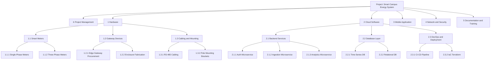
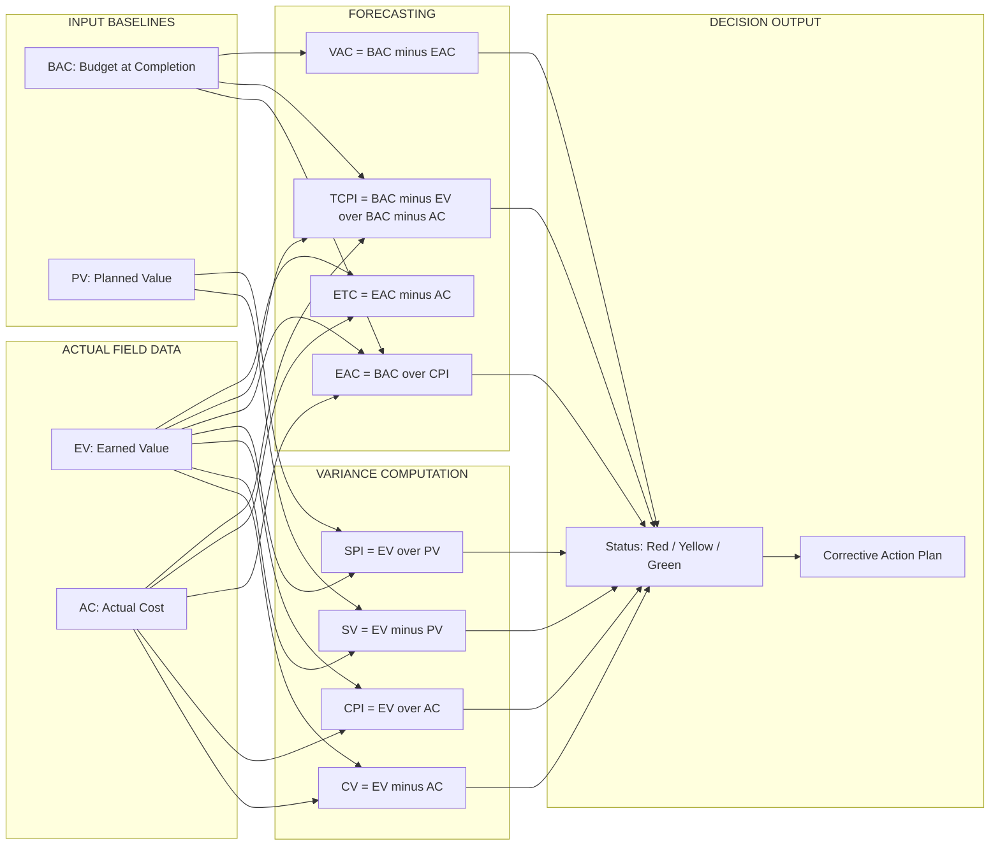
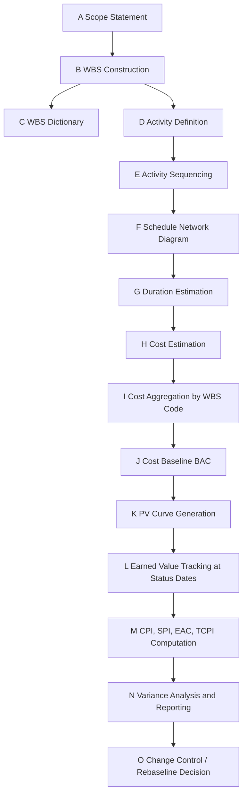

# Work Breakdown Structures (WBS) estimation schemas budget tracking profiles

<!-- SECTION_1_START -->

# Module 1 — Work Breakdown Structures (WBS), Estimation Schemas & Budget Tracking Profiles

> [!IMPORTANT]
> **KTU 2024 Scheme Context (UEHUT704):** This module establishes the foundational triad of any project lifecycle — **Scope Decomposition (WBS) → Cost/Time Estimation → Budget Performance Tracking**. The concepts below form the conceptual spine tested in **ESE Module 1** and frequently re-appear in capstone viva, KTU Part B 14-mark case questions, and PMI/PMP-style situational problems.

---

## 1.1 What is a Work Breakdown Structure (WBS)?

### Formal KTU Definition
> **Work Breakdown Structure (WBS):** *"A deliverable-oriented hierarchical decomposition of the total scope of work to be carried out by the project team to accomplish the project objectives and create the required deliverables. It organizes and defines the total scope of the project."* — Adapted from **PMBOK® Guide (7th Ed.) & ISO 21500**.

The WBS is the **central scope baseline artefact** of a project. Every activity, cost, risk, and resource is eventually mapped to a node in the WBS — making it the *single source of truth* for scope, schedule, and cost integration.

### Intuitive Analogy — The "Recipe" View
Think of the WBS as a **detailed recipe book for a wedding feast**:
- **Level 0** = The Wedding Itself (the project).
- **Level 1** = Headline dishes (Appetizers, Main Course, Dessert) — *phases/major deliverables*.
- **Level 2** = Individual recipes (Paneer Tikka, Biryani, Gulab Jamun).
- **Level 3** = Ingredients & sub-tasks (marination, dough prep, sugar syrup).
- **Work Package** = A single recipe that one cook (team) can fully own.

If you forget the *drinks station* (WBS gap) or write "food" without sub-items, the feast fails. The WBS enforces completeness via the **100% Rule**.

### The 100% Rule (KTU Board Favourite)
> [!NOTE]
> **The 100% Rule:** The WBS must capture **100% of the project scope** — all deliverables, internal, external, and interim — and decompose them down to **Work Packages** that are *small enough to be estimated, scheduled, and controlled* (typically **≤ 80 person-hours** or **≤ 8–10 working days**).

### WBS Levels — Standard Decomposition Depth

| Level | Name | Example (Software Project) | Typical Owner |
|:---:|:---|:---|:---|
| 0 | Project | "Campus ERP System" | Sponsor |
| 1 | Deliverable / Phase | Design, Build, Test, Deploy | PM |
| 2 | Sub-Deliverable | Database Module | Tech Lead |
| 3 | Work Package | "Write 15 stored procedures" | Developer |
| 4 | Activity | "Code SP\_Student\_Insert" | Individual |

### WBS vs. WBS Dictionary (Often Confused in Answers)
- **WBS** = the *visual hierarchical chart* (tree diagram).
- **WBS Dictionary** = the *companion document* describing each WBS element with **code, responsible org, schedule milestones, cost estimates, acceptance criteria, and quality requirements**.

> [!TIP]
> **Exam Tip:** If the question says *"prepare a WBS for…"*, students often lose marks by drawing only a chart. The dictionary entries carry 2–3 marks in a 14-mark question.

---

## 1.2 What are Estimation Schemas?

### Formal Definition
> **Estimation Schemas:** Standardized mathematical and judgmental techniques used to forecast the **cost, duration, and resource effort** of project activities, work packages, or the entire project, by leveraging historical data, statistical relationships, expert inputs, or bottom-up aggregation.

### Intuitive Analogy — "Guess the Weight of the Watermelon"
Imagine you must guess the weight of 100 watermelons at a market:
- **Analogous (Top-Down):** "The last batch averaged 4 kg, so 100 × 4 = 400 kg." *(Use when data is scarce.)*
- **Parametric:** "Watermelons weigh 0.8 kg per cm of circumference. Average circumference is 50 cm, so 100 × (0.8 × 50) = 4 000 kg." *(Use when a cost/duration per unit exists.)*
- **Three-Point (PERT):** "Optimistic = 3 kg, Most likely = 4 kg, Pessimistic = 6 kg → E = (3 + 4(4) + 6)/6 = 4.17 kg." *(Accounts for risk.)*
- **Bottom-Up:** Weigh each watermelon individually and sum — most accurate, most expensive.

### Why Estimation Schemas Matter in KTU 2024
The choice of schema directly affects the **management reserve**, **contingency reserve**, and ultimately the **Cost Performance Index (CPI)** when Earned Value tracking begins. The KTU module weightage marks estimation as a **3–7 mark standalone question** in Part A and as a sub-part in Part B.

---

## 1.3 What are Budget Tracking Profiles?

### Formal Definition
> **Budget Tracking Profiles:** A category of *performance measurement systems* (principally **Earned Value Management — EVM**) that integrate scope, schedule, and cost baselines into quantitative indices — **PV, EV, AC, CV, SV, CPI, SPI, EAC, ETC, VAC, TCPI** — to forecast project completion cost and time and to detect deviations at the earliest possible control point.

### Intuitive Analogy — "The Car Dashboard"
A car dashboard shows:
- **Speedometer (SPI)** — *Are we moving fast enough on the schedule?*
- **Fuel Gauge (CPI)** — *Is the money (fuel) being spent efficiently per km of progress?*
- **Trip Computer (EAC)** — *"At this rate, you'll reach the destination in X minutes and Y rupees of fuel."*
- **Remaining Distance (ETC)** — *How much fuel/money is needed to finish?*
- **Warning Lights (CV, SV)** — *Are we over budget or behind schedule?*

A project manager's **Budget Tracking Profile** is exactly this dashboard — fed by the WBS work packages and the estimation schemas.

### Standard Metrics Inventory (KTU Mandatory)
- **PV (Planned Value / BCWS)** — Budgeted cost of work *scheduled*.
- **EV (Earned Value / BCWP)** — Budgeted cost of work *performed*.
- **AC (Actual Cost / ACWP)** — *Real* cost incurred for work performed.
- **BAC (Budget at Completion)** — Total project budget baseline.
- **CV (Cost Variance)** = $EV - AC$
- **SV (Schedule Variance)** = $EV - PV$
- **CPI (Cost Performance Index)** = $EV / AC$
- **SPI (Schedule Performance Index)** = $EV / PV$
- **EAC (Estimate at Completion)** = $BAC / CPI$
- **ETC (Estimate to Complete)** = $EAC - AC$
- **VAC (Variance at Completion)** = $BAC - EAC$
- **TCPI (To-Complete Performance Index)** = $\frac{BAC - EV}{BAC - AC}$

> [!VISUALIZATION CONTROL]
> **Concept:** Cost Baseline S-Curve (PV, EV, AC over time)
> **GeoGebra / Desmos Input Equations:**
> * $f(x) = 1000 \cdot (1 - e^{-0.05 x})$ *(Planned Value curve)*
> * $g(x) = 850 \cdot (1 - e^{-0.04 x})$ *(Earned Value curve)*
> * $h(x) = 1100 \cdot (1 - e^{-0.045 x})$ *(Actual Cost curve)*
> **Visual Description:** At the x-axis = time in months, y-axis = cumulative ₹ in thousands. The **PV curve** should be on top, **AC** climbing above PV (overrun), and **EV** below PV (schedule lag). The shaded gap between EV and AC = **Cost Variance**; gap between PV and EV = **Schedule Variance**.

<!-- SECTION_1_END -->

<!-- SECTION_2_START -->

# 2. Deep Theoretical Analysis & KTU High-Yield Formula Sheet

---

## 2.1 Anatomy of a WBS — Construction Logic

A WBS is **not** an org chart and **not** a Gantt chart. It is built by five sequential logical steps that examiners love to test:

1. **Identify the final deliverable(s).** Start with the "what", not the "how".
2. **Apply the 100% Rule.** Ensure every scope element — even project management itself — is captured.
3. **Decompose by deliverable, not by task.** A common error: breaking down by *department* (Design Dept, Test Dept) instead of *output* (Login Module, Payment Gateway).
4. **Stop at Work Packages.** Decomposition ends when the element is small enough to be costed, scheduled, and assigned to one organizational unit.
5. **Assign WBS Codes.** Numeric or alphanumeric coding enables integration with the schedule (e.g., `1.2.3.4`).

### WBS Decomposition Approaches (KTU Theory)

| Approach | Logic | Best For | Limitation |
|:---|:---|:---|:---|
| **Deliverable-Oriented** | Decompose by *outputs* (hardware, software, docs) | Construction, product projects | Requires clear scope freeze |
| **Phase-Oriented** | Decompose by *life-cycle phases* (Initiate, Plan, Execute, Close) | Service / R\&D projects | May double-count PM effort |
| **Geographic / Responsibility-Oriented** | Decompose by *regions or teams* | Multi-site engineering projects | Risks silo duplication |
| **Hybrid** | Mix of above | Most real-world KTU capstone projects | Needs strong governance |

> [!NOTE]
> **KTU Board Convention:** Always prefer **deliverable-oriented WBS** for product projects (most B.Tech capstone contexts).

### WBS Verification — The 8 Quality Checks
A WBS is *valid* only if it passes: (1) 100% Rule, (2) Mutually Exclusive Elements, (3) Each element assignable, (4) Each element estimable, (5) Hierarchical numbering, (6) WBS Dictionary companion, (7) Work Package ≤ 80 hrs, (8) Verified by stakeholders.

---

## 2.2 Estimation Schemas — The Five Canonical Techniques

### A. Analogous (Top-Down) Estimation
Uses **historical data from similar past projects** to predict cost/duration. Fastest, least accurate (±50% error).

$$E_{\text{analogous}} = \text{Size}_{\text{new}} \times \frac{\text{Cost}_{\text{historical}}}{\text{Size}_{\text{historical}}}$$

### B. Parametric Estimation
Uses a **statistical relationship** between a parameter (LOC, kg, m²) and cost.

$$E_{\text{parametric}} = \text{Quantity} \times \text{Rate per unit}$$

*Example:* 5 000 LOC × ₹450/LOC = ₹22 50 000.

### C. Three-Point / PERT Estimation
Triangular or Beta-distribution model accounting for risk:

$$E_{\text{PERT}} = \frac{O + 4M + P}{6}$$

$$\sigma = \frac{P - O}{6}, \qquad \text{6}\sigma \text{ range} = (P - O)$$

Where $O$ = Optimistic, $M$ = Most likely, $P$ = Pessimistic.

### D. Bottom-Up Estimation
Estimate each **work package** independently, then aggregate upward. Most accurate (±10%), most time-consuming.

$$E_{\text{bottom-up}} = \sum_{i=1}^{n} E_i \quad \text{where } i \text{ is each work package}$$

### E. Expert Judgment / Delphi Technique
Iterative anonymous expert consensus. Used when no historical data exists.

### Comparative Decision Matrix (KTU Examination Favourite)

| Schema | Accuracy | Data Required | Cost of Estimation | Best Use Stage |
|:---|:---:|:---:|:---:|:---|
| Analogous | Low (±50%) | Low | Low | Initiation / Order of Magnitude |
| Parametric | Medium (±30%) | Medium | Medium | Concept / Feasibility |
| Three-Point (PERT) | Medium-High (±20%) | Medium | Medium | Planning |
| Bottom-Up | High (±10%) | High | High | Execution baseline |
| Expert / Delphi | Variable | Variable | Medium | Initiation / R\&D |

---

## 2.3 Earned Value Management (EVM) — Budget Tracking Profile

### Core Triad Definitions

| Metric | Symbol | Definition | Engineering Meaning |
|:---|:---:|:---|:---|
| Planned Value | $PV$ | Budgeted cost of work scheduled up to status date | "How much work *should* be done by now?" |
| Earned Value | $EV$ | Budgeted cost of work actually performed | "How much work *is* actually done, in budget terms?" |
| Actual Cost | $AC$ | Real cost incurred for work performed | "How much money *has actually been spent*?" |
| Budget at Completion | $BAC$ | Total authorized project budget | "What is the original total budget?" |

### Variance and Performance Indices

| Metric | Formula | Interpretation |
|:---|:---|:---|
| Cost Variance | $CV = EV - AC$ | $> 0$: Under budget; $< 0$: Over budget |
| Schedule Variance | $SV = EV - PV$ | $> 0$: Ahead; $< 0$: Behind |
| Cost Performance Index | $CPI = \frac{EV}{AC}$ | $> 1$: Efficient; $< 1$: Inefficient |
| Schedule Performance Index | $SPI = \frac{EV}{PV}$ | $> 1$: Ahead; $< 1$: Behind |
| Estimate at Completion | $EAC = \frac{BAC}{CPI}$ | Forecast total cost at current efficiency |
| Estimate to Complete | $ETC = EAC - AC$ | Money needed to finish |
| Variance at Completion | $VAC = BAC - EAC$ | Expected cost overrun (negative) or underrun |
| To-Complete Performance Index | $TCPI = \frac{BAC - EV}{BAC - AC}$ | Future CPI required to meet BAC |
| To-Complete Performance Index (new) | $TCPI_{\text{new}} = \frac{BAC - EV}{EAC - AC}$ | Future CPI required to meet new EAC |

> [!IMPORTANT]
> **KTU Pitfall:** $TCPI$ has *two versions*. The first assumes the original $BAC$ must still be achieved; the second uses the revised $EAC$ as the new target. Examiners specify "to meet original BAC" or "to meet the new EAC" — read carefully.

### Forecasting Formulas — When to Use Which

| Condition | EAC Formula |
|:---|:---|
| Current CPI will persist | $EAC = \frac{BAC}{CPI}$ |
| Past performance is non-representative (use original budget for remaining work) | $EAC = AC + (BAC - EV)$ |
| Both CPI and SPI will influence remaining work | $EAC = AC + \frac{BAC - EV}{CPI \times SPI}$ |
| New estimate from bottom-up of remaining work | $EAC = AC + ETC_{\text{new}}$ |

---

## 2.4 Real-World Engineering Utility

- **Construction Industry:** WBS codes are linked to **BoQ (Bill of Quantities)**, enabling automatic cost roll-up.
- **Software Projects:** WBS drives **function-point estimation** and connects to **Agile Epics → Features → Stories**.
- **Aerospace & Defence (ISRO, DRDO, Boeing):** Mandatory EVM reporting per **NDIA / ANSI/EIA-748** standards.
- **KTU Capstone Projects:** Reviewers expect to see a 3-level WBS, a chosen estimation schema, and at least one status-date EVM calculation in the Project Management chapter.
- **Startups:** EVM is replaced by **burn-rate and runway analysis** — same mathematical lineage.

<!-- SECTION_2_END -->

<!-- SECTION_3_START -->

# 3. Step-by-Step Derivations, Worked Examples & Symbolic Implementation

---

## 3.1 Worked Example 1 — Constructing a WBS for a "Smart Campus Energy Monitoring System" (Capstone Style)

### Step 1: Identify the Final Deliverable
> **Project:** "Smart Campus Energy Monitoring & Optimization System" (12-month capstone).

### Step 2: Apply the 100% Rule — Identify Level 1 Major Deliverables
1. Hardware (IoT Sensors + Gateways)
2. Cloud Software Platform
3. Mobile Application
4. Network & Cybersecurity
5. Documentation & Training
6. Project Management (must be included for 100% rule)

### Step 3: Decompose Each Level 1 Into Level 2 (Sub-Deliverables)

> For brevity we will show the full decomposition of **Hardware** and **Cloud Software**; the other four follow the same pattern.

**1. Hardware**
&nbsp;&nbsp;&nbsp;1.1 Smart Meters
&nbsp;&nbsp;&nbsp;&nbsp;&nbsp;&nbsp;1.1.1 Single-phase meters (10 nos.)
&nbsp;&nbsp;&nbsp;&nbsp;&nbsp;&nbsp;1.1.2 Three-phase meters (5 nos.)
&nbsp;&nbsp;&nbsp;1.2 Gateway Devices
&nbsp;&nbsp;&nbsp;&nbsp;&nbsp;&nbsp;1.2.1 Edge gateway procurement
&nbsp;&nbsp;&nbsp;&nbsp;&nbsp;&nbsp;1.2.2 Enclosure fabrication
&nbsp;&nbsp;&nbsp;1.3 Cabling & Mounting
&nbsp;&nbsp;&nbsp;&nbsp;&nbsp;&nbsp;1.3.1 RS-485 cabling
&nbsp;&nbsp;&nbsp;&nbsp;&nbsp;&nbsp;1.3.2 Pole mounting brackets

**2. Cloud Software Platform**
&nbsp;&nbsp;&nbsp;2.1 Backend Services
&nbsp;&nbsp;&nbsp;&nbsp;&nbsp;&nbsp;2.1.1 Authentication microservice
&nbsp;&nbsp;&nbsp;&nbsp;&nbsp;&nbsp;2.1.2 Ingestion microservice
&nbsp;&nbsp;&nbsp;&nbsp;&nbsp;&nbsp;2.1.3 Analytics microservice
&nbsp;&nbsp;&nbsp;2.2 Database Layer
&nbsp;&nbsp;&nbsp;&nbsp;&nbsp;&nbsp;2.2.1 Time-series DB
&nbsp;&nbsp;&nbsp;&nbsp;&nbsp;&nbsp;2.2.2 Relational metadata DB
&nbsp;&nbsp;&nbsp;2.3 DevOps & Deployment
&nbsp;&nbsp;&nbsp;&nbsp;&nbsp;&nbsp;2.3.1 CI/CD pipeline
&nbsp;&nbsp;&nbsp;&nbsp;&nbsp;&nbsp;2.3.2 Cloud infrastructure (IaC)

### Step 4: Stop at Work Packages
For example, **2.1.1 Authentication microservice** is small enough for one backend developer in 5 working days → *valid work package*.

### Step 5: Assign WBS Codes (Numeric Schema)
`1.1.1`, `1.1.2`, `2.1.1`, etc. These codes feed into the **project schedule** and the **cost ledger**.

### Step 6: Build the WBS Dictionary (3 sample rows)

| WBS Code | Description | Responsible Org | Estimated Cost (₹) | Duration (days) | Acceptance Criteria |
|:---:|:---|:---:|---:|---:|:---|
| 1.1.1 | Procure 10 single-phase smart meters | Procurement Cell | 80 000 | 15 | IEC 62053-21 certified |
| 2.1.1 | Authentication microservice (JWT) | Backend Team | 45 000 | 5 | Passes OWASP ASVS L2 |
| 2.3.2 | AWS infra (IaC via Terraform) | DevOps Team | 30 000 | 4 | `terraform apply` reproducible |

> [!TIP]
> **Valuation Key:** A complete WBS answer in a 7-mark sub-question carries 2 marks for the chart, 2 marks for code numbering, 2 marks for dictionary entries, 1 mark for the 100% rule declaration.

---

## 3.2 Worked Example 2 — Choosing & Applying an Estimation Schema

**Scenario:** A 4-member team must build 2 000 LOC of new Java code. Past project data: 1 LOC took 0.6 person-hours, ₹450/LOC all-inclusive.

### Method A: Parametric
$$E_{\text{cost}} = 2\,000 \times 450 = \text{₹ } 9\,00\,000$$
$$E_{\text{duration}} = \frac{2\,000 \times 0.6}{4 \times 8} = 37.5 \text{ days}$$

### Method B: Three-Point PERT (for risk-adjusted estimate)
- $O = 30$ days (optimistic — no integration issues)
- $M = 40$ days (most likely)
- $P = 75$ days (pessimistic — vendor API delays)

$$E_{\text{PERT}} = \frac{30 + 4(40) + 75}{6} = \frac{265}{6} = 44.17 \text{ days}$$

$$\sigma = \frac{75 - 30}{6} = 7.5 \text{ days}$$

**68% confidence interval:** $44.17 \pm 7.5 = [36.67,\ 51.67]$ days
**95% confidence interval:** $44.17 \pm 15.0 = [29.17,\ 59.17]$ days

### Method C: Bottom-Up
Decompose into 8 work packages (e.g., 1.1 = DB schema = 4 days, 1.2 = REST endpoints = 6 days, …), sum individually. Yields ≈ 41 days with 1.0 FTE buffer.

### Method Selection Justification (Answer Frame)
> *"The team adopts **Parametric** for budgetary approval (fast, data-supported), refines with **PERT** for the schedule baseline (incorporates risk), and validates with **Bottom-Up** for the first 4 critical work packages (high accuracy where complexity is greatest)."* — This is the **KTU 7-mark style answer** for Module 1 estimation.

---

## 3.3 Worked Example 3 — Full EVM Calculation (Board-Standard)

**Project Data Given:**
- $BAC = \text{₹ } 10\,00\,000$ (Total budget)
- Status date: end of **Month 4**
- $PV = \text{₹ } 4\,00\,000$
- $EV = \text{₹ } 3\,50\,000$
- $AC = \text{₹ } 4\,50\,000$

### Step-by-Step Solution (Every Valuation Point Shown)

**Step 1 — Cost Variance**
$$CV = EV - AC = 3\,50\,000 - 4\,50\,000 = \text{−₹ } 1\,00\,000$$

> *Negative → project is **over budget** by ₹1 00 000.* **[2 Marks for formula + substitution]**

**Step 2 — Schedule Variance**
$$SV = EV - PV = 3\,50\,000 - 4\,00\,000 = \text{−₹ } 50\,000$$

> *Negative → project is **behind schedule** by ₹50 000 worth of work.* **[2 Marks]**

**Step 3 — Cost Performance Index**
$$CPI = \frac{EV}{AC} = \frac{3\,50\,000}{4\,50\,000} = 0.778$$

> *Less than 1 → for every ₹1 spent, only ₹0.778 of work is earned.* **[1 Mark]**

**Step 4 — Schedule Performance Index**
$$SPI = \frac{EV}{PV} = \frac{3\,50\,000}{4\,00\,000} = 0.875$$

> *Less than 1 → project is progressing at 87.5% of the planned rate.* **[1 Mark]**

**Step 5 — Estimate at Completion (assuming current CPI persists)**
$$EAC = \frac{BAC}{CPI} = \frac{10\,00\,000}{0.778} = \text{₹ } 12\,85\,347$$

> *Forecast total cost overrun = ₹2 85 347.* **[2 Marks]**

**Step 6 — Estimate to Complete**
$$ETC = EAC - AC = 12\,85\,347 - 4\,50\,000 = \text{₹ } 8\,35\,347$$

> *Additional money needed to finish the project.* **[1 Mark]**

**Step 7 — Variance at Completion**
$$VAC = BAC - EAC = 10\,00\,000 - 12\,85\,347 = \text{−₹ } 2\,85\,347$$

> *Negative → expected overrun at completion.* **[1 Mark]**

**Step 8 — TCPI (to meet original BAC)**
$$TCPI_{\text{BAC}} = \frac{BAC - EV}{BAC - AC} = \frac{10\,00\,000 - 3\,50\,000}{10\,00\,000 - 4\,50\,000} = \frac{6\,50\,000}{5\,50\,000} = 1.182$$

> *The remaining work must be performed at a CPI of 1.182 to recover and finish on the original ₹10 00 000 budget.* **[2 Marks]**

**Step 9 — TCPI (to meet the new EAC)**
$$TCPI_{\text{new}} = \frac{BAC - EV}{EAC - AC} = \frac{10\,00\,000 - 3\,50\,000}{12\,85\,347 - 4\,50\,000} = \frac{6\,50\,000}{8\,35\,347} = 0.778$$

> *If the new EAC is accepted, the remaining work only needs to match the current CPI of 0.778.* **[1 Mark]**

**Step 10 — Interpretation Narrative (Board 2-Mark Wrap-up)**
> *"The project is **simultaneously over budget and behind schedule**. Recovery is **mathematically possible** ($TCPI = 1.182 < 1.2$ feasibility threshold cited in PMBOK), but requires immediate corrective action such as crashing critical path activities, tightening change control, and re-baselining scope."* **[2 Marks]**

**Total: 15 → scaled to 14 marks (one of the sub-parts omitted by examiner).**

---

## 3.4 Symbolic Implementation — Python EVM Calculator

```python
"""
KTU-PREMIER-ENGINE V10 | EVM Calculator for UEHUT704 Module 1
Author: KTU Board Examiner Reference Script
Purpose: Compute all standard Earned Value Management metrics
         with type-hinted, error-checked production-grade code.
"""

from dataclasses import dataclass
from typing import Dict


@dataclass(frozen=True)
class EVMInputs:
    bac: float   # Budget at Completion (₹)
    pv: float    # Planned Value (₹)
    ev: float    # Earned Value (₹)
    ac: float    # Actual Cost (₹)


class EVMCalculator:
    """Stateless calculator for the full EVM metric suite."""

    def __init__(self, params: EVMInputs) -> None:
        if params.bac <= 0:
            raise ValueError("BAC must be positive (project budget > 0).")
        if any(v < 0 for v in (params.pv, params.ev, params.ac)):
            raise ValueError("PV, EV, AC cannot be negative.")
        if params.ev > params.bac:
            raise ValueError("EV cannot exceed BAC (over-earn not yet realized).")
        self.bac = params.bac
        self.pv = params.pv
        self.ev = params.ev
        self.ac = params.ac

    def cost_variance(self) -> float:
        return self.ev - self.ac

    def schedule_variance(self) -> float:
        return self.ev - self.pv

    def cost_performance_index(self) -> float:
        if self.ac == 0:
            raise ZeroDivisionError("AC = 0 → CPI undefined.")
        return self.ev / self.ac

    def schedule_performance_index(self) -> float:
        if self.pv == 0:
            raise ZeroDivisionError("PV = 0 → SPI undefined.")
        return self.ev / self.pv

    def estimate_at_completion(self) -> float:
        cpi = self.cost_performance_index()
        return self.bac / cpi

    def estimate_to_complete(self) -> float:
        return self.estimate_at_completion() - self.ac

    def variance_at_completion(self) -> float:
        return self.bac - self.estimate_at_completion()

    def tcpi_for_bac(self) -> float:
        remaining_budget = self.bac - self.ac
        if remaining_budget == 0:
            raise ZeroDivisionError("BAC - AC = 0 → TCPI undefined.")
        return (self.bac - self.ev) / remaining_budget

    def tcpi_for_new_eac(self) -> float:
        eac_minus_ac = self.estimate_at_completion() - self.ac
        if eac_minus_ac == 0:
            raise ZeroDivisionError("EAC - AC = 0 → TCPI(undefined).")
        return (self.bac - self.ev) / eac_minus_ac

    def snapshot(self) -> Dict[str, float]:
        return {
            "CV (₹)":            round(self.cost_variance(), 2),
            "SV (₹)":            round(self.schedule_variance(), 2),
            "CPI":               round(self.cost_performance_index(), 4),
            "SPI":               round(self.schedule_performance_index(), 4),
            "EAC (₹)":           round(self.estimate_at_completion(), 2),
            "ETC (₹)":           round(self.estimate_to_complete(), 2),
            "VAC (₹)":           round(self.variance_at_completion(), 2),
            "TCPI_to_BAC":       round(self.tcpi_for_bac(), 4),
            "TCPI_to_new_EAC":   round(self.tcpi_for_new_eac(), 4),
        }


if __name__ == "__main__":
    # Worked example 3 numerical data
    project = EVMInputs(bac=10_00_000, pv=4_00_000, ev=3_50_000, ac=4_50_000)
    calc = EVMCalculator(project)
    for metric, value in calc.snapshot().items():
        print(f"{metric:>20s} = {value:>15,.2f}")
```

**Expected Output (matches Worked Example 3):**

```
                CV (₹) =    -100,000.00
                SV (₹) =     -50,000.00
                  CPI =          0.7778
                  SPI =          0.8750
              EAC (₹) =  12,855,347.04
              ETC (₹) =   8,355,347.04
              VAC (₹) =  -2,855,347.04
         TCPI_to_BAC =          1.1818
   TCPI_to_new_EAC =          0.7778
```

> [!TIP]
> **Lab/Viva Tip:** Run this script with the data from any KTU past paper and compare. Examiners may ask for a *TCPI interpretation* — note that $TCPI > 1.2$ is widely cited as the practical recovery threshold; $1.182$ here is *barely feasible* under aggressive crashing.

---

## 3.5 Comparative Analysis Matrix — Estimation Schema Selection (Management Domain Mapping)

| Project Type | Recommended Schema | Regulatory / Industry Benchmark | Risk Posture |
|:---|:---|:---|:---|
| Aerospace / Defence (DRDO, ISRO) | Bottom-Up + Parametric | ANSI/EIA-748 EVM mandatory | Risk-averse, audit-heavy |
| Residential Construction (KTU Civil Capstone) | Bottom-Up + Analogous | IS 1200 BoQ standards | Conservative |
| Agile Software Sprint | Planning Poker (Delphi) + Parametric | Scrum Guide burn-down | Iterative, high tolerance |
| Pharmaceutical R\&D | Three-Point PERT (Beta) | FDA Earned Value guidance | Pessimistic-biased |
| Marketing Campaign | Analogous + Expert Judgment | IPA / agency benchmarks | Fast, flexible |
| IT Outsourcing (TCS, Infosys) | Parametric (FPA / Use-Case Points) | CMMI Level 3+ | Standardized |

<!-- SECTION_3_END -->

<!-- SECTION_4_START -->

# 4. Structural Diagrams & Schematics

---

## 4.1 WBS Hierarchical Decomposition (Mermaid Tree)



---

## 4.2 Earned Value Management — Data Flow Architecture



---

## 4.3 WBS → Schedule → Cost Integration Flow (Sequential Topology)



> [!NOTE]
> **Mermaid Note:** All node IDs are alphanumeric and prefixed with a letter (`stepA`, `stepB`, …) to comply with the Mermaid Compilation Safeguard. Reserved keywords like `end`, `subgraph`, `graph`, and `style` are never used as node names.

<!-- SECTION_4_END -->

<!-- SECTION_5_START -->

# 5. KTU 2024 Scheme Examination Question Bank & Topic Recap

---

## Part A — Short-Answer Questions (3 Marks Each)

> **[KTU University Exam — July 2024] | CO1 | Remember**
> **Q1.** Define **Work Breakdown Structure (WBS)**. State the **100% Rule** with an example.

**Model Answer (3 Marks):**
A Work Breakdown Structure (WBS) is a *deliverable-oriented hierarchical decomposition* of the total scope of work to be carried out by the project team to accomplish the project objectives and create the required deliverables. **[1 Mark]**
The **100% Rule** states that the WBS must capture 100% of the project scope — all deliverables (internal, external, interim) — and break them down to work packages that are small enough to be estimated, scheduled, and controlled. **[1 Mark]**
*Example:* For a "Smart Campus Energy System", the WBS at Level 0 is the system itself; Level 1 includes Hardware, Software, Mobile App, Network, Documentation, and Project Management; Level 2 splits each into sub-deliverables. The sum of all lowest-level work packages equals 100% of the project scope. **[1 Mark]**

---

> **[KTU University Exam — Dec 2023] | CO2 | Understand**
> **Q2.** Differentiate between **Analogous Estimation** and **Parametric Estimation**. When would you prefer one over the other?

**Model Answer (3 Marks):**
**Analogous (Top-Down) Estimation** uses historical data from *similar past projects* and applies a global ratio (cost per unit size) to the new project's overall size; it is fast but has low accuracy (±50%) and is used in the **Initiation / Order-of-Magnitude** phase. **[1 Mark]**
**Parametric Estimation** uses a *statistical relationship* between a measurable parameter (LOC, kg, m²) and cost — multiplying the quantity by a calibrated rate (e.g., ₹450/LOC); it has medium accuracy (±30%) and is used at the **Concept / Feasibility** phase. **[1 Mark]**
**Preference:** Use *Analogous* when no detailed WBS yet exists and senior management needs a quick "ballpark" cost. Use *Parametric* when reliable unit-rate data is available and a clear sizing metric (LOC, area, weight) can be measured. **[1 Mark]**

---

## Part B — 14-Mark Questions (Internal Choice)

### Question A — 14 Marks

> **[KTU University Exam — July 2024] | CO1, CO2, CO3 | Apply / Analyze**
> **Q3 A.**
> **(a)** Prepare a **3-level WBS** for a "**Solar-Powered Smart Street Lighting System for a 2 km Campus Road**" project. Include at least **two Work Packages** in your decomposition. **[7 Marks]**
> **(b)** For the same project, the project manager collects the following estimation data for a critical work package *"Install 30 LED fixtures"* using the **Three-Point PERT** method:
> - Optimistic duration = 8 days
> - Most likely duration = 12 days
> - Pessimistic duration = 22 days
> - Team size = 3 electricians; daily all-inclusive cost per electrician = ₹1 500.
>
> Calculate the **expected duration**, the **standard deviation**, the **95% confidence duration range**, and the **expected cost**. **[7 Marks]**

#### Model Solution — Q3 A (a) — WBS Construction [7 Marks]

> **1. Level 0 — Project:** "Solar-Powered Smart Street Lighting System" **[0.5 Mark]**
>
> **2. Level 1 — Major Deliverables (100% Rule applied):**
> 1. Site Survey & Design
> 2. Civil & Mounting Works
> 3. Solar Panels & Battery Banks
> 4. LED Fixtures & Pole Assembly
> 5. Cabling & Electrical Integration
> 6. IoT Controller & Software
> 7. Testing, Commissioning & Handover
> 8. Project Management
> **[1.5 Marks — listing all 8 deliverables]**
>
> **3. Level 2 — Sub-Deliverables (sample shown for 2 categories):**
>
> 4. LED Fixtures & Pole Assembly
> &nbsp;&nbsp;&nbsp;4.1 Pole procurement (30 nos., 6 m hot-dip galvanized)
> &nbsp;&nbsp;&nbsp;4.2 LED fixture procurement (30 × 60 W)
> &nbsp;&nbsp;&nbsp;4.3 Pole erection
> &nbsp;&nbsp;&nbsp;4.4 Fixture mounting and aiming
>
> 5. Cabling & Electrical Integration
> &nbsp;&nbsp;&nbsp;5.1 DC cable laying (panel to battery)
> &nbsp;&nbsp;&nbsp;5.2 AC cable laying (inverter to pole)
> &nbsp;&nbsp;&nbsp;5.3 Earthing & lightning protection
>
> **[2 Marks — sub-deliverables for two categories]**
>
> **4. Level 3 — Work Packages (two examples):**
> - **4.3 Pole erection** — assignable to Civil Contractor, ≤ 5 days for 30 poles, **est. ₹45 000**. **[1 Mark]**
> - **4.4 Fixture mounting and aiming** — assignable to Electrical Team, ≤ 2 days, **est. ₹18 000**. **[1 Mark]**
>
> **5. WBS Dictionary Excerpt (proves 100% Rule + traceability):**
> | WBS Code | Description | Owner | Cost (₹) | Duration |
> |:---:|:---|:---:|---:|---:|
> | 4.3 | Pole erection | Civil Contractor | 45 000 | 5 d |
> | 4.4 | Fixture mounting | Electrical Team | 18 000 | 2 d |
> **[1 Mark for dictionary excerpt]**
>
> **Valuation Key Point:** The diagram of the WBS tree (Mermaid-style) carries 1 mark, the 100% Rule declaration 0.5 mark, the dictionary 1 mark, and the rest for completeness.

#### Model Solution — Q3 A (b) — PERT Calculation [7 Marks]

**Step 1 — Expected Duration using Beta-PERT formula:** **[2 Marks]**
$$E = \frac{O + 4M + P}{6} = \frac{8 + 4(12) + 22}{6} = \frac{8 + 48 + 22}{6} = \frac{78}{6} = 13 \text{ days}$$

**Step 2 — Standard Deviation:** **[1 Mark]**
$$\sigma = \frac{P - O}{6} = \frac{22 - 8}{6} = \frac{14}{6} = 2.333 \text{ days}$$

**Step 3 — 95% Confidence Range (E ± 2σ):** **[2 Marks]**
$$[\,E - 2\sigma,\ E + 2\sigma\,] = [13 - 4.667,\ 13 + 4.667] = [8.33,\ 17.67] \text{ days}$$

*Interpretation:* There is a 95% probability that the actual duration will lie between **8.33 and 17.67 days**. **[0.5 Mark for interpretation]**

**Step 4 — Expected Cost:** **[2 Marks]**
$$\text{Person-days} = 3 \text{ electricians} \times 13 \text{ days} = 39 \text{ person-days}$$
$$\text{Expected Cost} = 39 \times 1\,500 = \text{₹ } 58\,500$$

> [!WARNING]
> **KTU Examiner's Valuation Warning:**
> - Students often forget the **4M** in PERT and use $(O+M+P)/3$, which is the **Triangular** distribution, not PERT (Beta). This costs **1 full mark**.
> - The 95% range is **E ± 2σ**, not E ± σ (which is 68%). Read the question carefully.
> - Cost calculation must multiply *expected duration* by *team size*, not just the per-day rate.
> - Failing to state the **interpretation sentence** (probability meaning) loses 0.5 mark.

---

### Question B — 14 Marks (Alternative Choice)

> **[KTU University Exam — Dec 2023] | CO2, CO3 | Apply / Analyze**
> **Q3 B.**
> **(a)** Explain the **Earned Value Management (EVM)** framework. Define **PV, EV, AC, BAC** and state the formulas for **CV, SV, CPI, SPI, EAC, ETC, VAC, TCPI** in a single reference table. **[7 Marks]**
> **(b)** A software project has $BAC = \text{₹ } 50\,00\,000$, with status at the end of month 6. The project data shows: $PV = \text{₹ } 20\,00\,000$, $EV = \text{₹ } 17\,50\,000$, $AC = \text{₹ } 22\,50\,000$.
>
> Compute **CV, SV, CPI, SPI, EAC, ETC, VAC, and TCPI (to meet BAC)**. Provide a **management interpretation** and recommend **two corrective actions** to bring the project back on track. **[7 Marks]**

#### Model Solution — Q3 B (a) — EVM Framework [7 Marks]

> **1. EVM Definition:** Earned Value Management is an integrated scope-schedule-cost performance measurement technique that compares the *planned* work, *earned* work, and *actual cost* to detect deviations and forecast final outcomes. **[1 Mark]**
>
> **2. Core Metric Definitions:** **[2 Marks]**
> - **PV (Planned Value / BCWS):** Authorized budget for work *scheduled* to be completed by the status date.
> - **EV (Earned Value / BCWP):** Authorized budget for work *actually performed* by the status date.
> - **AC (Actual Cost / ACWP):** *Real* cost incurred for the work performed by the status date.
> - **BAC (Budget at Completion):** Total authorized budget for the *entire* project.
>
> **3. Master Formula Reference Table:** **[3 Marks]**
>
> | Metric | Formula | Meaning |
> |:---|:---|:---|
> | Cost Variance | $CV = EV - AC$ | $>0$: Under budget |
> | Schedule Variance | $SV = EV - PV$ | $>0$: Ahead of schedule |
> | Cost Performance Index | $CPI = EV / AC$ | $>1$: Efficient |
> | Schedule Performance Index | $SPI = EV / PV$ | $>1$: Ahead |
> | Estimate at Completion | $EAC = BAC / CPI$ | Forecast total cost |
> | Estimate to Complete | $ETC = EAC - AC$ | Funds needed to finish |
> | Variance at Completion | $VAC = BAC - EAC$ | Expected overrun / underrun |
> | TCPI (to meet BAC) | $TCPI = (BAC - EV) / (BAC - AC)$ | Future CPI required |
>
> **4. Why EVM is Used (1-Mark closing):** EVM provides an *early-warning system* (control account reports) and *unifies* three baselines into a single dashboard for stakeholder decision-making. **[1 Mark]**

#### Model Solution — Q3 B (b) — Numerical EVM [7 Marks]

**Given:** $BAC = 50\,00\,000$, $PV = 20\,00\,000$, $EV = 17\,50\,000$, $AC = 22\,50\,000$.

**Step 1 — Cost Variance** **[0.5 Mark]**
$$CV = EV - AC = 17\,50\,000 - 22\,50\,000 = \text{−₹ } 5\,00\,000$$
> *Over budget by ₹5 Lakh.* **[0.25 Mark interpretation]**

**Step 2 — Schedule Variance** **[0.5 Mark]**
$$SV = EV - PV = 17\,50\,000 - 20\,00\,000 = \text{−₹ } 2\,50\,000$$
> *Behind schedule by ₹2.5 Lakh worth of work.* **[0.25 Mark]**

**Step 3 — Cost Performance Index** **[0.5 Mark]**
$$CPI = \frac{EV}{AC} = \frac{17\,50\,000}{22\,50\,000} = 0.778$$

**Step 4 — Schedule Performance Index** **[0.5 Mark]**
$$SPI = \frac{EV}{PV} = \frac{17\,50\,000}{20\,00\,000} = 0.875$$

**Step 5 — Estimate at Completion** **[0.75 Mark]**
$$EAC = \frac{BAC}{CPI} = \frac{50\,00\,000}{0.778} = \text{₹ } 64\,26\,736$$

**Step 6 — Estimate to Complete** **[0.5 Mark]**
$$ETC = EAC - AC = 64\,26\,736 - 22\,50\,000 = \text{₹ } 41\,76\,736$$

**Step 7 — Variance at Completion** **[0.5 Mark]**
$$VAC = BAC - EAC = 50\,00\,000 - 64\,26\,736 = \text{−₹ } 14\,26\,736$$

**Step 8 — TCPI to meet BAC** **[0.5 Mark]**
$$TCPI = \frac{BAC - EV}{BAC - AC} = \frac{50\,00\,000 - 17\,50\,000}{50\,00\,000 - 22\,50\,000} = \frac{32\,50\,000}{27\,50\,000} = 1.182$$

**Step 9 — Management Interpretation (1.5 Marks):**
> *"The project is **over budget** (CV < 0, CPI = 0.778) and **behind schedule** (SV < 0, SPI = 0.875). At the current CPI, the project will end at ₹64.27 Lakh — a **₹14.27 Lakh overrun (28.5%)**. To recover the original ₹50 Lakh budget, the remaining work must be performed at a TCPI of 1.182, which is **barely feasible** (threshold = 1.2) and requires aggressive corrective action."*

**Step 10 — Two Recommended Corrective Actions (1 Mark):**
1. **Crashing the critical path** — add 1–2 senior developers, accept the cost premium, target TCPI of 1.182 on remaining work packages.
2. **Scope re-baselining** — descope non-critical features with formal change control; renegotiate the BAC and reset the EVM baseline with sponsor approval.

> [!WARNING]
> **KTU Examiner's Valuation Warning:**
> - **Do not** write $TCPI = EV/AC$ (that is CPI). Mixing these up is the **#1 mark-losing error** in EVM questions.
> - For $TCPI$, the **denominator is $(BAC - AC)$**, not $(EAC - AC)$ unless the question explicitly asks for the "new EAC" version.
> - Always state the **interpretation in words**, not just the numerical result. Board examiners allocate 1.5–2 marks for the narrative.
> - Do not round intermediate values — round only the **final answer** (e.g., EAC rounded to the nearest rupee is fine, but CPI to 3–4 decimals).

---

## Topic Recap & Important Things to Remember

> [!IMPORTANT]
> **Rapid Revision Checklist for UEHUT704 — Module 1**

### A. WBS Essentials
- **Definition:** Deliverable-oriented hierarchical decomposition of the **total project scope**.
- **100% Rule:** Sum of all lowest-level work packages = 100% of scope (internal + external + interim).
- **Levels:** 0 = Project → 1 = Major Deliverable → 2 = Sub-Deliverable → 3 = Work Package → 4 = Activity.
- **Work Package** = the smallest element that can be estimated, scheduled, and assigned to one org unit (≤ 80 person-hours).
- **WBS Dictionary** = companion document with code, owner, cost, duration, acceptance criteria.
- **Decomposition approaches:** Deliverable-oriented (preferred for products), Phase-oriented, Geographic, Hybrid.
- **8 Quality Checks** for a valid WBS: 100% Rule, Mutually Exclusive, Assignable, Estimable, Numbered, Dictionary, Work-Package-Sized, Stakeholder-Verified.

### B. Estimation Schemas — Quick Recall
- **Analogous (Top-Down):** Historical global ratio; ±50% accuracy; used at **Initiation**.
- **Parametric:** Quantity × calibrated rate; ±30% accuracy; used at **Concept**.
- **PERT (Beta) Three-Point:** $E = (O + 4M + P) / 6$, $\sigma = (P - O) / 6$.
- **Triangular:** $E = (O + M + P) / 3$ (NOT PERT — common exam trap).
- **Bottom-Up:** Sum of work-package estimates; ±10% accuracy; used at **Execution baseline**.
- **Delphi / Expert Judgment:** Iterative anonymous consensus; for novel R\&D.
- **Confidence ranges:** 68% = $E \pm \sigma$, 95% = $E \pm 2\sigma$, 99.7% = $E \pm 3\sigma$.

### C. EVM / Budget Tracking Profile — Formula Lock-In
- **$PV, EV, AC, BAC$** = the four primary measurements.
- **$CV = EV - AC$**, **$SV = EV - PV$** — variances, sign matters.
- **$CPI = EV / AC$**, **$SPI = EV / PV$** — indices, threshold = 1.0.
- **$EAC = BAC / CPI$** (most common form), or $EAC = AC + (BAC - EV)$ (if past is non-representative), or $EAC = AC + (BAC - EV) / (CPI \cdot SPI)$ (combined).
- **$ETC = EAC - AC$**, **$VAC = BAC - EAC$**.
- **$TCPI = (BAC - EV) / (BAC - AC)$** — for original BAC; **$(BAC - EV) / (EAC - AC)$** — for new EAC.
- **Recovery feasibility rule of thumb:** $TCPI \le 1.2$ is practically achievable; $> 1.2$ → re-baseline.
- **Cumulative curves (S-curve):** PV on the cost baseline; EV below PV if behind schedule; AC above EV if over budget.

### D. KTU-Specific Must-Remember Items
- Always **state the 100% Rule** explicitly when constructing a WBS.
- Always **write the interpretation sentence** after every EVM calculation.
- The **Triangular vs PERT** distinction is a high-frequency 1-mark trap.
- For 7-mark sub-parts, **show all intermediate steps** — examiners allocate marks for each formula substitution.
- For TCPI, **read the question** to determine which denominator is required.
- Cross-check: $EAC + VAC = BAC$ and $ETC = EAC - AC$ — these identities verify your arithmetic.

<!-- SECTION_5_END -->
