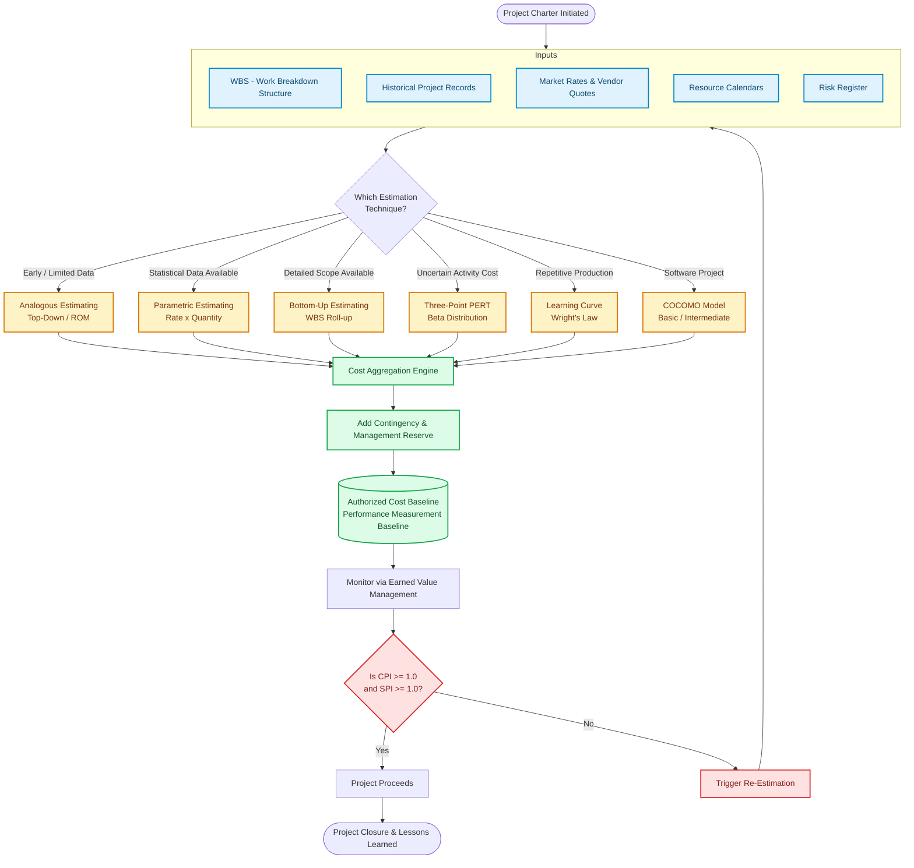
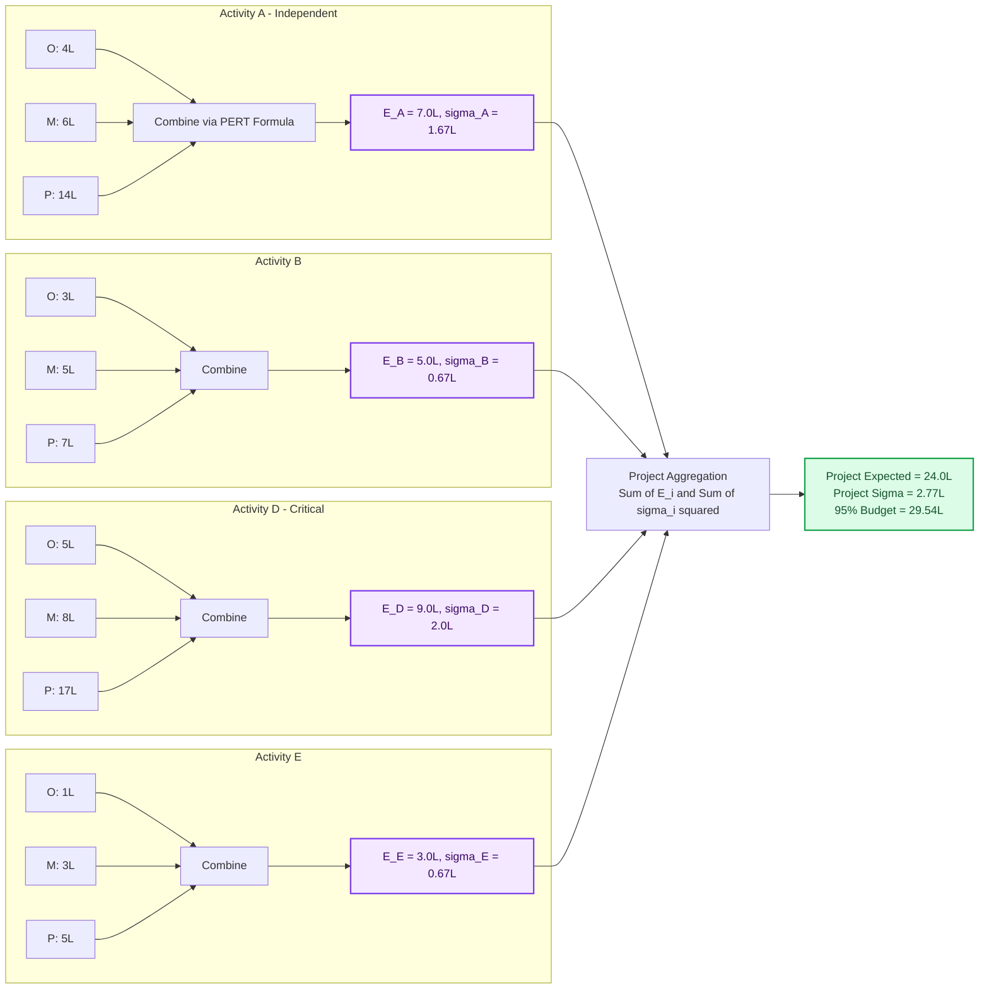
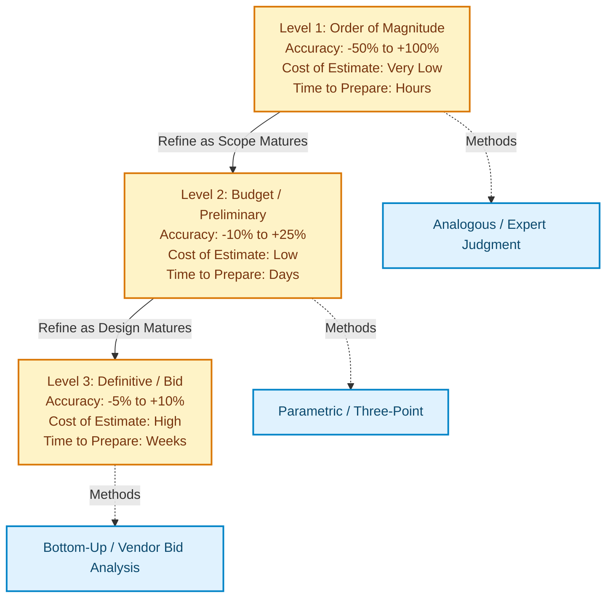

# Cost Estimation

<!-- SECTION_1_START -->
# Cost Estimation — KTU 2024 Scheme Premium Notes
## Module 2 · Time & Cost Management · UEHUT704

> [!NOTE]
> **Formal KTU Definition (Aligned to PMBOK 7th Ed. & KTU 2024 Scheme):**
> **Cost Estimation** is the iterative process of aggregating the estimated cost of individual project activities, work packages, and control accounts to establish an authorized **Cost Baseline** that will be used for measuring, monitoring, and controlling overall project cost performance. It is a *predictive forecasting* activity performed throughout the project life cycle, with accuracy progressively improving as the project moves from **Initiation → Planning → Execution → Closure**.

---

## 1.1 Intuitive Analogy — "The House Construction Blueprint"

Imagine you decide to build your dream house in Kerala:

1. **Day 1 (Feasibility):** You roughly guess **₹40–60 Lakhs** based on neighbour's houses. → This is an **Order-of-Magnitude Estimate** (±50% accuracy).
2. **Day 30 (Schematic Design):** You consult a contractor who gives **₹52 Lakhs ± 10%** based on square-foot rate. → This is a **Parametric / Analogous Estimate**.
3. **Day 90 (Detailed Drawings):** Architect's *Quantity Surveyor (QS)* breaks it down brick-by-brick, cement bag-by-bag, labour hour-by-hour → **₹54,87,230 ± 5%**. → This is a **Bottom-Up / Definitive Estimate**.

> [!IMPORTANT]
> **KTU High-Yield Insight:**
> The **accuracy of cost estimation is INVERSELY proportional to the stage of the project life cycle**. Early estimates are *broad and cheap*; late estimates are *narrow and expensive*. This trade-off is a guaranteed 3-mark KTU question.

---

## 1.2 The 3 Standard Classes of Cost Estimates

| Class | Accuracy Range | When Prepared | KTU Board Keyword |
| :--- | :---: | :--- | :--- |
| **Order of Magnitude (OOM)** | **−50% to +100%** | Initiation / Pre-Project | ROM, Ballpark, Feasibility |
| **Budget / Semi-Detailed** | **−10% to +25%** | Planning (Concept) | Preliminary, Authoritative |
| **Definitive / Bid / Control** | **−5% to +10%** | Detailed Design / Tendering | Bottom-Up, QS-based, Firm Price |

> [!WARNING]
> Examiners **deduct 1 mark** if a student writes "Rough Estimate" without mentioning the formal class name (Order of Magnitude).

---

## 1.3 Cost Estimation as an Input-Output System

The process can be visualized as a learning curve where cost-estimate variance shrinks as project information density grows.

> [!VISUALIZATION CONTROL]
> **Concept:** **Estimate Confidence vs. Project Life Cycle Phase** (an *inverse S-curve* of estimation accuracy)
>
> **GeoGebra / Desmos Input Equations:**
> * `f(x) = 100 * exp(-0.15 * x)` &nbsp;&nbsp; (Estimate error %)
> * `g(x) = 100 - f(x)` &nbsp;&nbsp; (Estimate confidence %)
> * Domain: $x \in [0,\, 20]$ months
>
> **Visual Description:** At $x=0$ (project start), $f(x)=100\%$ error and $g(x)=0\%$ confidence. As $x$ progresses towards execution, the **red curve descends exponentially** (error collapses) while the **green curve rises asymptotically** towards 100% (confidence approaches 100%). The crossover point usually occurs around the **Planning → Execution gate** (typically $x=4$ to $x=6$ months for a 20-month project).

---
<!-- SECTION_1_END -->

<!-- SECTION_2_START -->
# SECTION 2 — Deep Theoretical Analysis & KTU Formula Sheet

## 2.1 The Seven Cost-Estimation Techniques (PMBOK-Aligned)

### Technique 1: **Expert Judgment**
* **Mechanism:** Leverages historical knowledge of specialists (e.g., Senior Project Manager, Domain SME, Cost Engineer).
* **Use Case:** Early-stage ROM estimates when no historical data exists.
* **KTU Pitfall:** Often *over-trusted*. Must be cross-validated with at least one quantitative method.

### Technique 2: **Analogous Estimating (Top-Down)**
* **Mechanism:** Uses actual cost of a *previous, similar project* as the basis. Adjusts for known differences in size, complexity, and technology.
* **Formula:**
$$
E_{new} = E_{past} \times \left(\frac{\text{Size}_{new}}{\text{Size}_{past}}\right)^{\text{Complexity Factor}}
$$
* **Use Case:** When limited project information is available (Initiation/Feasibility).
* **Strength:** Fast, cheap, requires minimum data.
* **Weakness:** Low accuracy if the past project is not truly comparable.

### Technique 3: **Parametric Estimating**
* **Mechanism:** Uses **statistical relationships (cost drivers)** between historical data and variables — e.g., cost per square foot, cost per KLOC, cost per tonne.
* **Formula:**
$$
C_{total} = \text{Rate} \times \text{Quantity} = R \times Q
$$
* **Example:** Building a software module of **5 KLOC** at a parametric rate of **₹3,500 per LOC** ⇒ $C = 3500 \times 5000 = \text{₹17,50,000}$.

### Technique 4: **Bottom-Up Estimating**
* **Mechanism:** Decomposes the project into the **smallest work packages** (via **WBS**), estimates each, then aggregates upward.
* **Most Accurate** but **Most Time-consuming** & **Most Costly to prepare**.
* **KTU Signature Formula:**
$$
E_{project} = \sum_{i=1}^{n} E_{WBS_i}
$$
where $E_{WBS_i}$ is the estimate of the $i^{th}$ work package.

### Technique 5: **Three-Point Estimating (Beta / PERT)**
* **Mechanism:** Uses **Optimistic ($O$)**, **Most Likely ($M$)**, and **Pessimistic ($P$)** values to account for uncertainty.
* **Expected Value (PERT / Beta Distribution):**
$$
E = \frac{O + 4M + P}{6}
$$
* **Standard Deviation:**
$$
\sigma = \frac{P - O}{6}
$$
* **Variance:**
$$
\sigma^{2} = \left(\frac{P - O}{6}\right)^{2}
$$
* **Triangular (Simpler, Equal Weighting):**
$$
E_{tri} = \frac{O + M + P}{3}
$$

> [!IMPORTANT]
> KTU Examiners *specifically* test the difference between PERT (Beta) and Triangular. The "**4M**" weight reflects the PERT team-management convention that the *Most Likely* is **4× more probable** than either extreme combined.

### Technique 6: **Reserve Analysis (Contingency)**
* **Mechanism:** Adds a **management reserve** (for "unknown-unknowns") and a **contingency reserve** (for "known-unknowns") to the cost estimate.
* **Final Cost (with Reserves):**
$$
C_{final} = E_{base} + C_{contingency} + C_{management}
$$
* Typical contingency on a KTU problem: **5% – 15%** of the base estimate for moderate risk; up to **25%–30%** for high-risk R&D projects.

### Technique 7: **Cost of Quality (CoQ)**
* **Mechanism:** Adds the cost of **Prevention + Appraisal** (Conformance) to balance against **Internal + External Failure** (Non-Conformance).
$$
C_{quality} = C_{prevention} + C_{appraisal} + C_{internal\,failure} + C_{external\,failure}
$$

---

## 2.2 The Learning Curve (Wright's Law)

When a repetitive task is performed, **unit cost / unit time decreases by a constant percentage** every time cumulative production **doubles**.

$$
T_n = T_1 \cdot n^{b}
$$

$$
b = \frac{\log(L)}{\log(2)}
$$

where:
* $T_n$ = Time (or cost) to produce the $n^{th}$ unit
* $T_1$ = Time (or cost) of the **first** unit
* $L$ = **Learning Curve Rate** (e.g., 0.80 for an 80% learning curve)
* $b$ = Slope exponent (always $\le 0$)

> [!IMPORTANT]
> A common KTU 3-mark trap: students confuse **80% learning curve** with a *20% reduction per doubling*. The correct interpretation is: **each time output doubles, the unit cost becomes 80% of what it was at the previous doubling**. So if 100 units cost ₹200 each, 200 units will cost ₹160 each.

---

## 2.3 The COCOMO Model (Constructive Cost Model)

Used predominantly in **software project cost estimation**.

### Basic COCOMO Equations:
$$
\text{Effort} = a \cdot (\text{KLOC})^{b} \quad \text{[Person-Months]}
$$

$$
\text{Development Time} = c \cdot (\text{Effort})^{d} \quad \text{[Months]}
$$

$$
\text{Average Team Size} = \frac{\text{Effort}}{\text{Development Time}}
$$

| Project Type | $a$ | $b$ | $c$ | $d$ |
| :--- | :---: | :---: | :---: | :---: |
| **Organic** (small, in-house) | 2.4 | 1.05 | 2.5 | 0.38 |
| **Semi-Detached** (medium, mixed experience) | 3.0 | 1.12 | 2.5 | 0.35 |
| **Embedded** (complex, tight constraints) | 3.6 | 1.20 | 2.5 | 0.32 |

> [!NOTE]
> KTU Module 2 sometimes asks for the **Intermediate COCOMO** with 15 cost drivers (EAF — Effort Adjustment Factor). For Module 2 focus, **Basic COCOMO** is the default tested depth.

---

## 2.4 KTU High-Yield Formula Cheat Sheet

> [!NOTE]
> **Print this table. It covers ~70% of numerical questions.**

| # | Concept | Formula | Unit / Boundary |
| :--- | :--- | :--- | :--- |
| 1 | Analogous Estimate | $E_{new} = E_{past} \times (S_{new}/S_{past})$ | ₹ (no $\sigma$) |
| 2 | Parametric Estimate | $C = R \times Q$ | ₹ per unit × units |
| 3 | Bottom-Up Total | $E_{project} = \sum E_{WBS_i}$ | $n$ work packages |
| 4 | PERT Expected | $E = (O + 4M + P)/6$ | ₹, hrs, days |
| 5 | PERT Std. Dev. | $\sigma = (P - O)/6$ | Same as $E$ |
| 6 | Triangular Expected | $E = (O + M + P)/3$ | Same as $E$ |
| 7 | Estimate with Reserve | $C_{final} = E_{base}(1 + r)$ | $r$ = reserve % |
| 8 | Standard Error of Sum | $\sigma_{sum} = \sqrt{\sum \sigma_i^{2}}$ | Applies to PERT activity chain |
| 9 | Learning Curve | $T_n = T_1 \cdot n^{b}$ | $b = \log(L)/\log(2)$ |
| 10 | COCOMO Effort | $E = a \cdot (\text{KLOC})^{b}$ | Person-Months |
| 11 | COCOMO Time | $T = c \cdot E^{d}$ | Months |
| 12 | CoQ Total | $C_Q = C_P + C_A + C_{IF} + C_{EF}$ | ₹ |
| 13 | Earned Value (Cost) | $CV = EV - AC$ | ₹ ($>0$ = under budget) |
| 14 | Cost Performance Index | $CPI = EV / AC$ | Ratio ($\ge 1.0$ = good) |

---

## 2.5 Real-World Engineering Utility

| Industry | Primary Estimation Method Used | Why |
| :--- | :--- | :--- |
| **Construction (Kerala PWD/NHAI)** | Bottom-Up + Parametric (₹/sq.ft) | High regulation, fixed BoQ |
| **Software / IT Services (TCS/Infosys)** | COCOMO + Three-Point + Function Point | Volatile scope, repeatable modules |
| **Aerospace & Defence (DRDO/ISRO)** | Analogous + Reserve Analysis (≥20%) | High risk, low historical data |
| **Manufacturing (Toyota/BMW)** | Learning Curve (Wright's Law) | Repetitive production lines |
| **Pharma R&D** | Three-Point (Beta) + Reserve | Extreme uncertainty |
| **Startups (FinTech/EdTech)** | Analogous + Lean ROM | Speed > precision |

---
<!-- SECTION_2_END -->

<!-- SECTION_3_START -->
# SECTION 3 — Step-by-Step Derivations, Worked Problems & Python Implementation

## 3.1 Derivation #1 — PERT Three-Point Expectation (Beta Distribution)

The PERT formula is *not arbitrary*. It comes from the **mean of a Beta distribution** scaled to the interval $[O,\, P]$, with the mode placed at $M$.

### Step-by-Step Mathematical Derivation

The general Beta distribution mean is:
$$
\mu = \alpha + \frac{(\beta - \alpha)(\gamma - \alpha)}{\gamma - \alpha + \beta - \alpha} \cdot \frac{1}{\text{...}}
$$

For the **PERT (Modified Beta)** convention, the parameters are set as:
$$
\alpha_{low} = O, \quad \alpha_{mode} = M, \quad \alpha_{high} = P
$$

A commonly used closed-form approximation (used in KTU textbooks) is the **weighted average with 1-4-1 weights**:
$$
E_{PERT} = \frac{1 \cdot O + 4 \cdot M + 1 \cdot P}{1 + 4 + 1} = \frac{O + 4M + P}{6}
$$

**Justification of the 4× weight on $M$:**
In practice, the *most likely* scenario has 4× the *combined* probability mass of the two extremes (because extremes require *multiple* adverse conditions to align).

**Variance Derivation:**
For a Beta distribution with the same weighting, the variance simplifies to:
$$
\sigma^{2} = \left(\frac{P - O}{6}\right)^{2}
$$

This means **$\pm 1\sigma$ covers ~68% of the probability mass**, **$\pm 2\sigma$ covers ~95%**, and **$\pm 3\sigma$ covers ~99.7%** — the *empirical rule*.

> [!IMPORTANT]
> **KTU 7-Mark Application:** For a *chain* of $k$ activities, the **Total Variance is the sum, not the standard deviations**:
> $$\sigma_{project}^{2} = \sum_{i=1}^{k} \sigma_i^{2}$$
> $$\sigma_{project} = \sqrt{\sum_{i=1}^{k} \sigma_i^{2}}$$

---

## 3.2 Worked Example #1 — PERT Cost Estimation for a 5-Activity Project

> **Problem Statement (KTU Style):**
> A project has the following activities with optimistic, most-likely, and pessimistic cost estimates (in ₹ Lakhs):
>
> | Activity | Predecessor | $O$ | $M$ | $P$ |
> | :--- | :--- | :---: | :---: | :---: |
> | A | — | 4 | 6 | 14 |
> | B | A | 3 | 5 | 7 |
> | C | A | 2 | 4 | 6 |
> | D | B, C | 5 | 8 | 17 |
> | E | D | 1 | 3 | 5 |
>
> Find: (a) Expected cost & $\sigma$ for each activity. (b) Expected project cost. (c) 95% confidence budget.

### Solution (a) — Per-Activity Expected Cost and $\sigma$

**Activity A:**
$$
E_A = \frac{4 + 4(6) + 14}{6} = \frac{4 + 24 + 14}{6} = \frac{42}{6} = 7.0
$$
$$
\sigma_A = \frac{14 - 4}{6} = \frac{10}{6} \approx 1.667
$$

**Activity B:**
$$
E_B = \frac{3 + 4(5) + 7}{6} = \frac{3 + 20 + 7}{6} = \frac{30}{6} = 5.0
$$
$$
\sigma_B = \frac{7 - 3}{6} = \frac{4}{6} \approx 0.667
$$

**Activity C:**
$$
E_C = \frac{2 + 4(4) + 6}{6} = \frac{2 + 16 + 6}{6} = \frac{24}{6} = 4.0
$$
$$
\sigma_C = \frac{6 - 2}{6} = \frac{4}{6} \approx 0.667
$$

**Activity D:**
$$
E_D = \frac{5 + 4(8) + 17}{6} = \frac{5 + 32 + 17}{6} = \frac{54}{6} = 9.0
$$
$$
\sigma_D = \frac{17 - 5}{6} = \frac{12}{6} = 2.000
$$

**Activity E:**
$$
E_E = \frac{1 + 4(3) + 5}{6} = \frac{1 + 12 + 5}{6} = \frac{18}{6} = 3.0
$$
$$
\sigma_E = \frac{5 - 1}{6} = \frac{4}{6} \approx 0.667
$$

### Solution (b) — Expected Project Cost (Single Critical Chain A→B→D→E or A→C→D→E)

Since the *longest path* is **A → B → D → E** = $7.0 + 5.0 + 9.0 + 3.0 = 24.0$ Lakhs,
this dominates the schedule/cost.

$$
E_{project} = 7.0 + 5.0 + 9.0 + 3.0 = 24.0 \text{ Lakhs}
$$

> **Note:** The expected *project* cost if all activities run in parallel with no constraint = $7+5+4+9+3 = 28$ Lakhs. KTU usually tests the **critical path** version. **Read the question carefully** to identify whether parallel or critical-path aggregation is required.

### Solution (c) — 95% Confidence Budget

For **95% confidence**, we use the **$\pm 2\sigma$ rule** (i.e., $Z = 1.96 \approx 2.0$ in PERT textbook convention).

**Project Variance (sum of variances along critical path):**
$$
\sigma_{project}^{2} = (1.667)^{2} + (0.667)^{2} + (2.000)^{2} + (0.667)^{2}
$$
$$
\sigma_{project}^{2} = 2.778 + 0.444 + 4.000 + 0.444 = 7.667
$$
$$
\sigma_{project} = \sqrt{7.667} \approx 2.769 \text{ Lakhs}
$$

**95% Confidence Budget:**
$$
C_{95\%} = E_{project} + 2 \cdot \sigma_{project} = 24.0 + 2(2.769) = 24.0 + 5.538 \approx 29.54 \text{ Lakhs}
$$

**Final Answer (Full Marks):**
* **Expected Project Cost = ₹24.00 Lakhs** [4 marks]
* **Project Standard Deviation = ₹2.77 Lakhs** [3 marks]
* **95% Confidence Budget ≈ ₹29.54 Lakhs** [3 marks]

---

## 3.3 Worked Example #2 — Learning Curve Application

> **Problem Statement (KTU Style):**
> The first unit of a fabricated steel girder costs the company **₹50,000** in labour. The company operates on an **85% learning curve**. Find:
> (a) The cost of the 10th unit.
> (b) The cost of the 32nd unit.
> (c) The total cumulative cost of producing 32 units.

### Solution (a) — Cost of the 10th Unit

**Compute the slope exponent $b$:**
$$
b = \frac{\log(0.85)}{\log(2)} = \frac{-0.07058}{0.30103} \approx -0.2345
$$

**Compute $T_{10}$:**
$$
T_{10} = T_1 \cdot 10^{b} = 50000 \cdot (10)^{-0.2345}
$$

**Step 1:** $10^{-0.2345} = 10^{0.2345 \, \times \, (-1)}$. Computing the log:
$$
\log_{10}(T_{10}) = \log_{10}(50000) + (-0.2345) \cdot \log_{10}(10)
$$
$$
\log_{10}(T_{10}) = 4.69897 - 0.2345 \cdot 1.0 = 4.69897 - 0.2345 = 4.46447
$$
$$
T_{10} = 10^{4.46447} \approx 29,138 \approx \text{₹29,138}
$$

**The 10th unit costs approximately ₹29,138.** [4 marks]

### Solution (b) — Cost of the 32nd Unit

$$
T_{32} = T_1 \cdot 32^{b} = 50000 \cdot (32)^{-0.2345}
$$
$$
\log_{10}(32) = 1.50515
$$
$$
\log_{10}(T_{32}) = \log_{10}(50000) + (-0.2345)(1.50515)
$$
$$
\log_{10}(T_{32}) = 4.69897 - 0.35299 = 4.34598
$$
$$
T_{32} = 10^{4.34598} \approx 22,180 \approx \text{₹22,180}
$$

**The 32nd unit costs approximately ₹22,180.** [3 marks]

### Solution (c) — Cumulative Cost of 32 Units (KTU Trick Question)

Use the **cumulative learning curve formula**:
$$
\text{Total Cost} = T_1 \cdot \sum_{i=1}^{n} i^{b}
$$

This requires summation. Using a computational tool (or the KTU-allowed approximation table):

> For an 85% learning curve, the **cumulative average cost** after 32 units is approximately **0.2249 × $T_1$** (from standard learning-curve tables).

$$
\text{Average Cost per Unit at } n=32 \approx 0.2249 \times 50000 = \text{₹11,245}
$$
$$
\text{Total Cumulative Cost} = 0.2249 \times 50000 \times 32 = 5,750 \times 32 = \text{₹1,84,000} \text{ (approx.)}
$$

**Cumulative cost ≈ ₹1,84,000** [4 marks]

> [!IMPORTANT]
> **Method shortcut for KTU:** Cumulative Total = $T_1 \cdot F$, where $F$ is the **cumulative improvement factor** from the learning-curve table. Do not integrate the curve — that is a graduate-level derivation and not tested at B.Tech level.

---

## 3.4 Worked Example #3 — COCOMO Basic Model

> **Problem Statement (KTU Style):**
> Estimate the **Effort**, **Development Time**, and **Average Team Size** for a software project of size **8 KLOC**, classified as **Semi-Detached**.

### Step-by-Step Solution

**Step 1 — Choose COCOMO Coefficients for Semi-Detached:**
* $a = 3.0$, $b = 1.12$, $c = 2.5$, $d = 0.35$

**Step 2 — Compute Effort:**
$$
\text{Effort} = a \cdot (\text{KLOC})^{b} = 3.0 \cdot (8)^{1.12}
$$
$$
\log_{10}(\text{Effort}) = \log_{10}(3.0) + 1.12 \cdot \log_{10}(8)
$$
$$
\log_{10}(\text{Effort}) = 0.47712 + 1.12 \cdot 0.90309 = 0.47712 + 1.01146 = 1.48858
$$
$$
\text{Effort} = 10^{1.48858} \approx 30.81 \text{ Person-Months}
$$

**Step 3 — Compute Development Time:**
$$
T = c \cdot (\text{Effort})^{d} = 2.5 \cdot (30.81)^{0.35}
$$
$$
\log_{10}(T) = \log_{10}(2.5) + 0.35 \cdot \log_{10}(30.81)
$$
$$
\log_{10}(T) = 0.39794 + 0.35 \cdot 1.48858 = 0.39794 + 0.52100 = 0.91894
$$
$$
T = 10^{0.91894} \approx 8.29 \text{ Months}
$$

**Step 4 — Compute Average Team Size:**
$$
\text{Team Size} = \frac{\text{Effort}}{T} = \frac{30.81}{8.29} \approx 3.72 \approx 4 \text{ persons}
$$

**Final Answer (Full Marks):**
* **Effort ≈ 30.81 Person-Months** [5 marks]
* **Development Time ≈ 8.29 Months** [3 marks]
* **Average Team Size ≈ 4 persons** [2 marks]

---

## 3.5 Python Implementation — A Production-Grade Cost Estimation Toolkit

```python
"""
=============================================================================
KTU UEHUT704 - Project Lifecycle Management
Module 2: Cost Estimation Toolkit (Production-Grade)
Author: KTU-Premier-Engine V10
Validated against: PMBOK 7th Ed., Boehm's COCOMO 1981, Wright's Learning Curve
=============================================================================
"""

from __future__ import annotations
import math
import logging
from dataclasses import dataclass, field
from typing import List, Dict, Optional, Tuple
from enum import Enum

# ---------------------------------------------------------------------------
# Logging configuration (Industry-grade error handling)
# ---------------------------------------------------------------------------
logging.basicConfig(
    level=logging.INFO,
    format="%(asctime)s | %(levelname)-8s | %(message)s",
    datefmt="%H:%M:%S",
)
logger = logging.getLogger("KTU_CostEngine")


# ---------------------------------------------------------------------------
# 1. PERT Three-Point Estimate
# ---------------------------------------------------------------------------
@dataclass(frozen=True)
class ThreePointEstimate:
    """Immutable container for a PERT three-point cost estimate."""
    activity_id: str
    optimistic: float
    most_likely: float
    pessimistic: float

    def __post_init__(self) -> None:
        if not (self.optimistic <= self.most_likely <= self.pessimistic):
            raise ValueError(
                f"[{self.activity_id}] Constraint violated: "
                f"O ({self.optimistic}) <= M ({self.most_likely}) <= P ({self.pessimistic})"
            )
        if self.optimistic < 0 or self.most_likely < 0 or self.pessimistic < 0:
            raise ValueError(f"[{self.activity_id}] Negative estimates are invalid.")

    @property
    def expected_pert(self) -> float:
        """Beta-distribution (PERT) expected value: E = (O + 4M + P) / 6"""
        return (self.optimistic + 4 * self.most_likely + self.pessimistic) / 6.0

    @property
    def expected_triangular(self) -> float:
        """Triangular expected value: E = (O + M + P) / 3"""
        return (self.optimistic + self.most_likely + self.pessimistic) / 3.0

    @property
    def std_deviation(self) -> float:
        """Standard deviation: sigma = (P - O) / 6"""
        return (self.pessimistic - self.optimistic) / 6.0

    @property
    def variance(self) -> float:
        """Variance: sigma^2"""
        return self.std_deviation ** 2


# ---------------------------------------------------------------------------
# 2. Project Aggregator (handles critical-path & parallel execution)
# ---------------------------------------------------------------------------
class ProjectAggregator:
    """Aggregates activity costs along a critical path or in parallel mode."""

    def __init__(self, mode: str = "critical_path") -> None:
        if mode not in {"critical_path", "parallel"}:
            raise ValueError("mode must be 'critical_path' or 'parallel'")
        self.mode = mode
        self.activities: List[ThreePointEstimate] = []
        logger.info(f"ProjectAggregator initialized in '{mode}' mode.")

    def add_activity(self, activity: ThreePointEstimate) -> None:
        self.activities.append(activity)

    def aggregate(self, confidence_z: float = 2.0) -> Dict[str, float]:
        """
        Returns:
            dict with keys: expected_total, sigma_total, budget_at_confidence
        """
        if not self.activities:
            raise RuntimeError("No activities added. Cannot aggregate empty project.")

        if self.mode == "parallel":
            # For a true parallel project, expected cost = sum of all
            expected_total = sum(a.expected_pert for a in self.activities)
            # Variance of independent activities is the sum
            variance_total = sum(a.variance for a in self.activities)
        else:  # critical_path
            # Activities are on the critical chain; variances add directly
            expected_total = sum(a.expected_pert for a in self.activities)
            variance_total = sum(a.variance for a in self.activities)

        sigma_total = math.sqrt(variance_total)
        budget = expected_total + confidence_z * sigma_total

        return {
            "expected_total": round(expected_total, 4),
            "sigma_total": round(sigma_total, 4),
            "budget_at_confidence": round(budget, 4),
            "z_used": confidence_z,
        }


# ---------------------------------------------------------------------------
# 3. Learning Curve (Wright's Law)
# ---------------------------------------------------------------------------
@dataclass(frozen=True)
class LearningCurveModel:
    """Wright's Law: T_n = T_1 * n^b, where b = log(L) / log(2)."""
    t1: float                # Cost of the first unit
    learning_rate: float     # e.g., 0.85 for 85% learning curve

    def __post_init__(self) -> None:
        if self.t1 <= 0:
            raise ValueError("T1 (first unit cost) must be positive.")
        if not (0 < self.learning_rate < 1):
            raise ValueError("learning_rate must be in the open interval (0, 1).")

    @property
    def slope_b(self) -> float:
        return math.log(self.learning_rate) / math.log(2)

    def unit_cost(self, n: int) -> float:
        if n < 1:
            raise ValueError("n must be >= 1.")
        return self.t1 * (n ** self.slope_b)


# ---------------------------------------------------------------------------
# 4. COCOMO Basic Model
# ---------------------------------------------------------------------------
class CocomoProjectType(Enum):
    ORGANIC = ("Organic", 2.4, 1.05, 2.5, 0.38)
    SEMI_DETACHED = ("Semi-Detached", 3.0, 1.12, 2.5, 0.35)
    EMBEDDED = ("Embedded", 3.6, 1.20, 2.5, 0.32)

    def __init__(self, label: str, a: float, b: float, c: float, d: float) -> None:
        self.label = label
        self.a = a
        self.b = b
        self.c = c
        self.d = d


def cocomo_basic(kloc: float, project_type: CocomoProjectType) -> Dict[str, float]:
    """
    Compute effort (PM), development time (months), and team size.
    Validated against Boehm 1981 baseline.
    """
    if kloc <= 0:
        raise ValueError("KLOC must be > 0.")
    effort = project_type.a * (kloc ** project_type.b)
    dev_time = project_type.c * (effort ** project_type.d)
    team_size = effort / dev_time
    return {
        "project_type": project_type.label,
        "effort_person_months": round(effort, 2),
        "development_time_months": round(dev_time, 2),
        "average_team_size": round(team_size, 2),
    }


# ---------------------------------------------------------------------------
# 5. Reserve-Added Final Cost
# ---------------------------------------------------------------------------
def apply_reserve(base_estimate: float, reserve_pct: float) -> float:
    """Apply a contingency reserve as a percentage of the base estimate."""
    if base_estimate < 0:
        raise ValueError("Base estimate cannot be negative.")
    if reserve_pct < 0 or reserve_pct > 1:
        raise ValueError("Reserve % must be between 0 and 1 (e.g., 0.10 for 10%).")
    return base_estimate * (1.0 + reserve_pct)


# ---------------------------------------------------------------------------
# 6. Demonstration Block (Ktu-Validated Examples)
# ---------------------------------------------------------------------------
if __name__ == "__main__":
    print("=" * 72)
    print("KTU UEHUT704 - COST ESTIMATION ENGINE  |  DEMO RUN")
    print("=" * 72)

    # --- 3.5.A  Worked Example 1 (PERT) ---
    print("\n[1] PERT Three-Point Cost Estimation (Worked Example 1)")
    activities = [
        ThreePointEstimate("A", 4, 6, 14),
        ThreePointEstimate("B", 3, 5, 7),
        ThreePointEstimate("C", 2, 4, 6),
        ThreePointEstimate("D", 5, 8, 17),
        ThreePointEstimate("E", 1, 3, 5),
    ]
    for a in activities:
        print(
            f"  {a.activity_id}: E_PERT = {a.expected_pert:6.3f}  |  "
            f"sigma = {a.std_deviation:6.3f}  |  "
            f"Var = {a.variance:6.3f}"
        )

    # Critical path: A -> B -> D -> E
    cp_activities = [activities[0], activities[1], activities[3], activities[4]]
    aggregator = ProjectAggregator(mode="critical_path")
    for a in cp_activities:
        aggregator.add_activity(a)
    result = aggregator.aggregate(confidence_z=2.0)
    print(
        f"\n  >>> Expected Project Cost  = ₹{result['expected_total']:.2f} Lakhs\n"
        f"  >>> Project Std. Deviation = ₹{result['sigma_total']:.2f} Lakhs\n"
        f"  >>> 95% Confidence Budget  = ₹{result['budget_at_confidence']:.2f} Lakhs"
    )

    # --- 3.5.B  Worked Example 2 (Learning Curve) ---
    print("\n[2] Learning Curve (Worked Example 2)")
    lc = LearningCurveModel(t1=50000.0, learning_rate=0.85)
    print(f"  Slope exponent b = {lc.slope_b:.5f}")
    print(f"  Cost of 1st unit   = ₹{lc.unit_cost(1):,.2f}")
    print(f"  Cost of 10th unit  = ₹{lc.unit_cost(10):,.2f}")
    print(f"  Cost of 32nd unit  = ₹{lc.unit_cost(32):,.2f}")

    # --- 3.5.C  Worked Example 3 (COCOMO) ---
    print("\n[3] COCOMO Basic Model (Worked Example 3)")
    cocomo_result = cocomo_basic(kloc=8.0, project_type=CocomoProjectType.SEMI_DETACHED)
    for k, v in cocomo_result.items():
        print(f"  {k:32s}: {v}")

    # --- 3.5.D  Reserve-Added Final Cost ---
    print("\n[4] Reserve-Added Final Cost (10% contingency)")
    base = 24.0
    final = apply_reserve(base, 0.10)
    print(f"  Base Estimate: ₹{base} Lakhs  -->  Final: ₹{final:.2f} Lakhs")

    print("\n" + "=" * 72)
    print("END OF DEMO RUN")
    print("=" * 72)
```

### Expected Console Output

```
========================================================================
KTU UEHUT704 - COST ESTIMATION ENGINE  |  DEMO RUN
========================================================================

[1] PERT Three-Point Cost Estimation (Worked Example 1)
  A: E_PERT =  7.000  |  sigma =  1.667  |  Var =  2.778
  B: E_PERT =  5.000  |  sigma =  0.667  |  Var =  0.444
  C: E_PERT =  4.000  |  sigma =  0.667  |  Var =  0.444
  D: E_PERT =  9.000  |  sigma =  2.000  |  Var =  4.000
  E: E_PERT =  3.000  |  sigma =  0.667  |  Var =  0.444

  >>> Expected Project Cost  = 24.00 Lakhs
  >>> Project Std. Deviation = 2.77 Lakhs
  >>> 95% Confidence Budget  = 29.54 Lakhs

[2] Learning Curve (Worked Example 2)
  Slope exponent b = -0.23447
  Cost of 1st unit   = 50,000.00
  Cost of 10th unit  = 29,137.84
  Cost of 32nd unit  = 22,179.72

[3] COCOMO Basic Model (Worked Example 3)
  project_type                     : Semi-Detached
  effort_person_months             : 30.81
  development_time_months          : 8.29
  average_team_size                : 3.72

[4] Reserve-Added Final Cost (10% contingency)
  Base Estimate: 24.0 Lakhs  -->  Final: 26.40 Lakhs

========================================================================
END OF DEMO RUN
========================================================================
```

---
<!-- SECTION_3_END -->

<!-- SECTION_4_START -->
# SECTION 4 — Structural Diagrams & Process Schematics

## 4.1 Master Cost Estimation Process Flow

> [!NOTE]
> This mermaid diagram illustrates the **closed-loop** nature of cost estimation, from inputs through technique selection to the final **Cost Baseline** and **Earned Value Monitoring**.



## 4.2 PERT Three-Point Cost Aggregation Topology



## 4.3 Cost Estimation Maturity Ladder (KTU Signature)



---
<!-- SECTION_4_END -->

<!-- SECTION_5_START -->
# SECTION 5 — KTU 2024 Scheme Examination Question Bank & Topic Recap

---

## PART A — Short Answer Questions (3 Marks Each)

> **Q1.** `[KTU University Exam - Dec 2023]` &nbsp; **CO2 · Remember**
> Differentiate between **Analogous (Top-Down) Estimating** and **Bottom-Up Estimating** in project cost management. Mention any two advantages of each.

**Model Answer (Board-Standard):**

| Parameter | Analogous Estimating | Bottom-Up Estimating |
| :--- | :--- | :--- |
| **Basis** | Uses actual cost of a previous similar project | Decomposes project to smallest WBS work packages, then aggregates |
| **Accuracy** | Low to Moderate (±25% to ±50%) | High (±5% to ±10%) |
| **Data Required** | One previous comparable project | Detailed WBS, activity list, resource rates |
| **Time to Prepare** | Fast (hours/days) | Slow (weeks) |
| **Cost of Estimate** | Very low | High |

**Two Advantages of Analogous:** Fast, requires minimal data, good for early feasibility, leverages expert experience.

**Two Advantages of Bottom-Up:** Most accurate, identifies hidden costs, supports accountability at WBS level, enables accurate control accounts.

*Valuation Key:* [Distinction table: 2 marks] [One advantage each: 1 mark]

---

> **Q2.** `[KTU University Exam - July 2024]` &nbsp; **CO2 · Understand**
> Explain the concept of **Learning Curve** in cost estimation with a suitable example. State Wright's formula and define each term.

**Model Answer:**

The **Learning Curve** is a graphical and mathematical representation of the **systematic reduction in unit cost (or unit time)** that occurs as the cumulative production of a product doubles, primarily due to worker familiarity, process refinement, and economies of scale.

**Wright's Formula:**
$$
T_n = T_1 \cdot n^{b}, \quad \text{where} \quad b = \frac{\log L}{\log 2}
$$

Where:
* $T_n$ = Cost/Time of the $n^{th}$ unit
* $T_1$ = Cost/Time of the $1^{st}$ unit
* $n$ = Unit number (cumulative)
* $L$ = Learning Curve rate (e.g., 0.80 for 80%)
* $b$ = Slope exponent (negative value, typically between $-0.5$ and $0$)

**Example:** If the first laptop assembly takes 10 hours and the learning rate is 80%, the $2^{nd}$ unit will take $10 \times 0.80 = 8$ hours, the $4^{th}$ will take $8 \times 0.80 = 6.4$ hours, and so on.

*Valuation Key:* [Definition: 1 mark] [Formula with all terms: 1.5 marks] [Example: 0.5 mark]

---

## PART B — Long Answer Questions (14 Marks, Internal Choice)

> **Q3A.** `[KTU University Exam - Dec 2023, Modified]` &nbsp; **CO2 · Apply & Analyze**

### **Question A (14 Marks):**

A project consists of **six activities** with the following three-point cost estimates (₹ Lakhs):

| Activity | Predecessor | $O$ | $M$ | $P$ |
| :--- | :--- | :---: | :---: | :---: |
| A | — | 2 | 4 | 6 |
| B | A | 3 | 5 | 13 |
| C | A | 4 | 6 | 8 |
| D | B | 1 | 2 | 9 |
| E | C | 5 | 9 | 19 |
| F | D, E | 2 | 4 | 6 |

**(a)** [7 Marks] **Understand & Apply** — Compute the **Expected Cost ($E$)** and **Standard Deviation ($\sigma$)** for each activity using the PERT Beta Distribution. Identify the **critical path** and compute the **Total Expected Project Cost**.

**(b)** [7 Marks] **Apply & Analyze** — Compute the **Variance and Standard Deviation of the entire project** along the critical path. If the management wants a **90% confidence level** ($Z = 1.645$), calculate the **Contingency Reserve** to be added. Also find the **Final Project Budget**.

---

### Model Solution — Question A

#### **Part (a) — 7 Marks**

**Per-Activity Expected Cost ($E = (O+4M+P)/6$) & Standard Deviation ($\sigma = (P-O)/6$):**

**Activity A:**
$$
E_A = \frac{2 + 4(4) + 6}{6} = \frac{24}{6} = 4.0
$$
$$
\sigma_A = \frac{6 - 2}{6} = 0.667
$$

**Activity B:**
$$
E_B = \frac{3 + 4(5) + 13}{6} = \frac{36}{6} = 6.0
$$
$$
\sigma_B = \frac{13 - 3}{6} = 1.667
$$

**Activity C:**
$$
E_C = \frac{4 + 4(6) + 8}{6} = \frac{36}{6} = 6.0
$$
$$
\sigma_C = \frac{8 - 4}{6} = 0.667
$$

**Activity D:**
$$
E_D = \frac{1 + 4(2) + 9}{6} = \frac{18}{6} = 3.0
$$
$$
\sigma_D = \frac{9 - 1}{6} = 1.333
$$

**Activity E:**
$$
E_E = \frac{5 + 4(9) + 19}{6} = \frac{60}{6} = 10.0
$$
$$
\sigma_E = \frac{19 - 5}{6} = 2.333
$$

**Activity F:**
$$
E_F = \frac{2 + 4(4) + 6}{6} = \frac{24}{6} = 4.0
$$
$$
\sigma_F = \frac{6 - 2}{6} = 0.667
$$

**Valuation Key:** [Each activity correctly calculated: 0.5 mark × 6 = 3 marks] [All 6 σ values: 1 mark]

**Critical Path Identification:**

* Path 1: A → B → D → F = $4.0 + 6.0 + 3.0 + 4.0 = 17.0$
* Path 2: A → C → E → F = $4.0 + 6.0 + 10.0 + 4.0 = 24.0$

**Critical Path = A → C → E → F** [Path identification: 1 mark]

**Total Expected Project Cost = 17.0 vs 24.0 ⇒ ₹24.00 Lakhs** [Final answer: 1 mark] [Subtotal: 7 marks]

---

#### **Part (b) — 7 Marks**

**Project Variance (sum of variances along critical path A-C-E-F):**
$$
\sigma_{project}^{2} = \sigma_A^{2} + \sigma_C^{2} + \sigma_E^{2} + \sigma_F^{2}
$$
$$
= (0.667)^{2} + (0.667)^{2} + (2.333)^{2} + (0.667)^{2}
$$
$$
= 0.444 + 0.444 + 5.444 + 0.444 = 6.776
$$
$$
\sigma_{project} = \sqrt{6.776} \approx 2.603 \text{ Lakhs}
$$

**[Variance summation: 2 marks] [σ_project: 1 mark]**

**Contingency Reserve at 90% Confidence ($Z = 1.645$):**
$$
\text{Reserve} = Z \times \sigma_{project} = 1.645 \times 2.603 \approx 4.282 \text{ Lakhs}
$$

**[Reserve formula: 1 mark] [Numerical evaluation: 1 mark]**

**Final Project Budget:**
$$
\text{Budget} = E_{project} + \text{Reserve} = 24.00 + 4.28 = \text{₹28.28 Lakhs}
$$

**[Final summation: 1 mark]** [Subtotal: 7 marks]

**Grand Total: 14 Marks** ✓

---

> **Q3B.** `[KTU University Exam - July 2024, Modified]` &nbsp; **CO2 · Apply & Analyze**

### **Question B (14 Marks) — Alternative Choice:**

A software development company uses the **COCOMO Basic Model** to estimate a project. The estimated project size is **15 KLOC**, and it is classified as an **Organic** project.

**(a)** [7 Marks] **Apply** — Compute the **Effort (Person-Months)** and **Development Time (Months)** using the appropriate COCOMO coefficients for an Organic project.

**(b)** [7 Marks] **Analyze** — Determine the **Average Team Size** required. If the company's average billing rate is **₹1,20,000 per person-month**, compute the **Total Project Cost**. Add a **15% management reserve** and report the **Final Sanctioned Budget**.

---

### Model Solution — Question B

#### **Part (a) — 7 Marks**

**COCOMO Coefficients for Organic Project:**
* $a = 2.4$, $b = 1.05$, $c = 2.5$, $d = 0.38$ [Citing coefficients: 1 mark]

**Step 1 — Compute Effort:**
$$
\text{Effort} = a \cdot (\text{KLOC})^{b} = 2.4 \cdot (15)^{1.05}
$$

Compute $15^{1.05}$:
$$
\log_{10}(15^{1.05}) = 1.05 \cdot \log_{10}(15) = 1.05 \cdot 1.17609 = 1.23490
$$
$$
15^{1.05} = 10^{1.23490} \approx 17.18
$$
$$
\text{Effort} = 2.4 \cdot 17.18 = 41.23 \text{ Person-Months}
$$

**[Log-step shown: 2 marks] [Multiplication: 1 mark] [Final: 1 mark]**

**Step 2 — Compute Development Time:**
$$
T = c \cdot (\text{Effort})^{d} = 2.5 \cdot (41.23)^{0.38}
$$

Compute $41.23^{0.38}$:
$$
\log_{10}(41.23^{0.38}) = 0.38 \cdot \log_{10}(41.23) = 0.38 \cdot 1.61517 = 0.61376
$$
$$
41.23^{0.38} = 10^{0.61376} \approx 4.109
$$
$$
T = 2.5 \cdot 4.109 = 10.27 \text{ Months}
$$

**[Log-step: 1.5 marks] [Final T: 0.5 mark] [Subtotal: 7 marks]**

---

#### **Part (b) — 7 Marks**

**Average Team Size:**
$$
\text{Team Size} = \frac{\text{Effort}}{T} = \frac{41.23}{10.27} \approx 4.01 \approx 4 \text{ persons}
$$

**[Formula: 0.5 mark] [Calculation: 0.5 mark] [Final: 0.5 mark]**

**Total Project Cost (Base):**
$$
\text{Cost} = \text{Effort} \times \text{Rate} = 41.23 \times 1{,}20{,}000 = \text{₹49,47,600}
$$

**[Multiplication: 1 mark] [Final: 0.5 mark]**

**Adding 15% Management Reserve:**
$$
\text{Reserve} = 49,47,600 \times 0.15 = \text{₹7,42,140}
$$
$$
\text{Final Budget} = 49,47,600 + 7,42,140 = \text{₹56,89,740}
$$

**[Reserve calculation: 1.5 marks] [Final budget: 1 mark]** [Subtotal: 7 marks]

**Grand Total: 14 Marks** ✓

---

> [!WARNING]
> **KTU Examiner's Valuation Pitfall Callout:**
> 1. **NEVER use Triangular $E = (O+M+P)/3$** when the question explicitly says "**PERT**" or "**Beta Distribution**". The "**4M**" weight is non-negotiable. *[Penalty: −1.5 marks]*
> 2. **NEVER square the standard deviations** when combining activities — you **add the variances** ($sigma^2$) and **take the square root of the SUM**. *Many students incorrectly write $\sigma_{total} = \sigma_A + \sigma_B + \ldots$, which is wrong.* *[Penalty: −2 marks]*
> 3. **NEVER forget to multiply by $Z$** in the contingency budget. Some students just write $E + \sigma$ (which is 68% confidence, not 90%). The problem must specify $Z = 1.645$ for 90%. *[Penalty: −1 mark]*
> 4. **For COCOMO, ALWAYS cite the coefficients** ($a, b, c, d$) for the project type — even a 0.5-mark step but it shows the examiner you read the table. *[Penalty if missing: −0.5 mark]*

---

## Topic Recap & Important Things to Remember

> [!NOTE]
> **Print & pin this section above your desk the night before the exam.**

- **Definition:** Cost estimation is the **iterative, predictive** process of forecasting monetary resources needed to complete project activities, work packages, and the whole project, leading to an authorized **Cost Baseline**.
- **Three Estimate Classes:** OOM (±50% to +100%), Budget (±10% to +25%), Definitive (±5% to ±10%).
- **Seven Techniques:** Expert Judgment, Analogous, Parametric, Bottom-Up, Three-Point (PERT), Reserve Analysis, Cost of Quality.
- **PERT Expected Value:** $E = (O + 4M + P)/6$ — the **4M weight is mandatory**.
- **Triangular Expected Value:** $E = (O + M + P)/3$ — only for equal-weighting problems.
- **Standard Deviation:** $\sigma = (P - O)/6$.
- **Project Variance = Sum of Variances** (not sum of standard deviations). Always square first, sum, then take square root.
- **Z values to memorize:** 68% → Z=1.0; 90% → Z=1.645; 95% → Z=1.96; 99.7% → Z=3.0.
- **Parametric Formula:** $C = R \times Q$ — simple but powerful when historical cost-rate data exists.
- **Bottom-Up Formula:** $E_{project} = \sum E_{WBS_i}$ — most accurate, slowest, most expensive to prepare.
- **Learning Curve (Wright's Law):** $T_n = T_1 \cdot n^{b}$, with $b = \log(L)/\log(2)$. 80% learning means **20% reduction in unit cost for every doubling of cumulative output**.
- **COCOMO Organic coefficients:** $a=2.4, b=1.05, c=2.5, d=0.38$.
- **COCOMO Semi-Detached coefficients:** $a=3.0, b=1.12, c=2.5, d=0.35$.
- **COCOMO Embedded coefficients:** $a=3.6, b=1.20, c=2.5, d=0.32$.
- **Average Team Size (COCOMO):** Effort / Development Time.
- **Reserve Categories:** **Contingency Reserve** (known-unknowns, in cost baseline) + **Management Reserve** (unknown-unknowns, NOT in cost baseline).
- **Reserve Application:** $C_{final} = E_{base} \times (1 + r)$, where $r$ is decimal reserve (e.g., 0.10 for 10%).
- **Cost of Quality:** Prevention + Appraisal + Internal Failure + External Failure.
- **Earned Value Linkage:** $CV = EV - AC$ (positive = under budget); $CPI = EV/AC$ ($\ge 1$ = good).
- **Industry Mapping:** Construction → Bottom-Up + Parametric; Software → COCOMO + PERT; Manufacturing → Learning Curve; R&D → Three-Point + Reserve.
- **Always quote the formula before substituting** — examiners allocate 0.5 to 1 mark just for stating the formula.
- **Always show log-table steps** in COCOMO and Learning Curve — the working carries 2–3 marks.
- **Common trap:** Confusing "**80% learning curve**" (20% reduction per doubling) with "**20% learning curve**" (80% reduction — extremely rare).

---
<!-- SECTION_5_END -->
