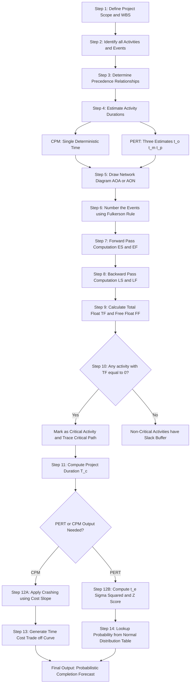
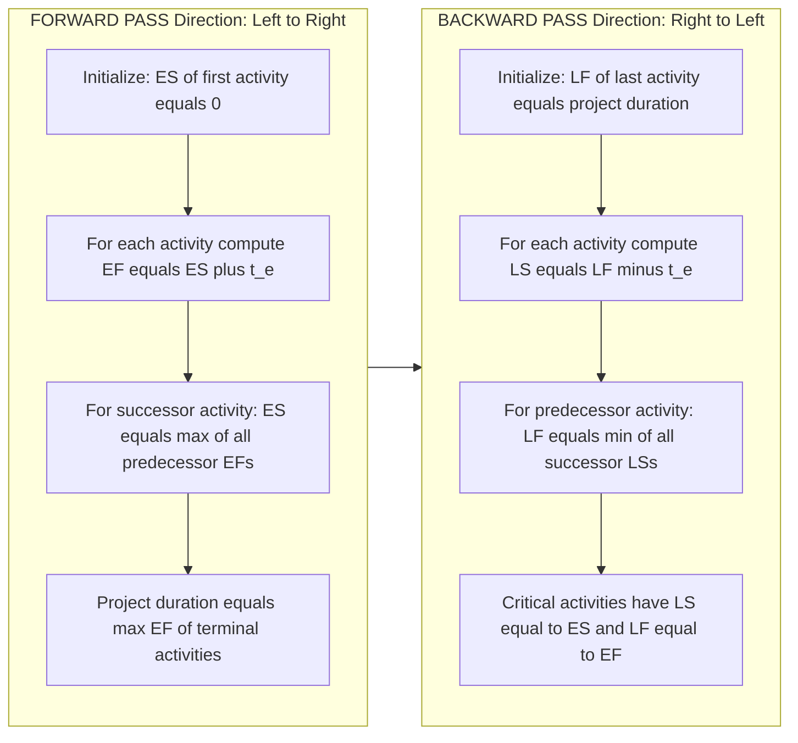
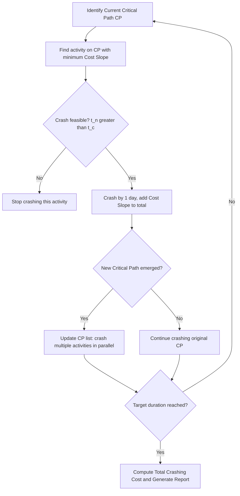
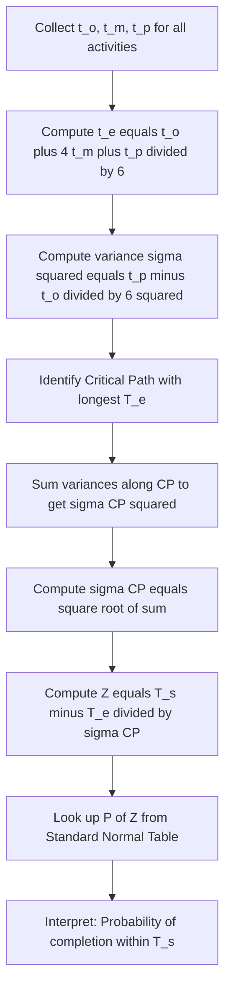

# CPM/PERT Network Diagrams

<!-- SECTION_1_START -->
# CPM / PERT Network Diagrams — Core Foundation

> [!NOTE]
> **KTU 2024 Scheme — UEHUT704 (Project Lifecycle Management)**
> **Module 2: Time & Cost Management** | Focus: Network Modelling for Project Scheduling

## 1.1 Formal Definition (KTU Syllabus Terminology)

**Critical Path Method (CPM)** is a deterministic, activity-oriented project management technique that uses a single, point-estimate time duration for every activity to identify the **longest sequence of dependent tasks** — known as the *Critical Path* — which dictates the **minimum project completion time (T_c)**.

**Program Evaluation and Review Technique (PERT)** is a probabilistic, event-oriented scheduling model designed for projects involving **uncertainty and variability** (R&D, construction, defence). It uses three time estimates — Optimistic (*t_o*), Most Likely (*t_m*), and Pessimistic (*t_p*) — to compute an **Expected Time (t_e)** using a Beta distribution approximation.

> [!IMPORTANT]
> **Board-Relevant Distinction:**
> **CPM** → *Time is known* (repetitive, well-defined projects like construction, manufacturing).
> **PERT** → *Time is uncertain* (R&D, research, first-of-its-kind engineering projects).

## 1.2 Conceptual Analogy — The "Highway & Toll Booths" Model

Imagine driving from **Kochi to Delhi** on a highway with multiple toll booths. Some toll booths are **fast** (analogous to *Optimistic time*), some are **average** (*Most Likely*), and some have long queues (*Pessimistic time*).

- The **CPM** asks: *"What is the shortest guaranteed travel time using the average toll time at every booth?"*
- The **PERT** asks: *"What is the most realistic expected travel time considering fast days, slow days, and average days?"*
- The **Critical Path** is the *slowest lane* of the highway — if any toll booth on this lane gets delayed, your **entire journey** is delayed.
- The **Slack/Float** is the "buffer" time you have at non-critical toll booths where you can afford to be late.

## 1.3 Network Representation Standards

| Notation | Full Form | Logic | Common Use |
|---|---|---|---|
| **AOA** | Activity on Arrow | Arrow = Activity, Node = Event/Milestone | Traditional PERT |
| **AON** | Activity on Node | Box = Activity, Arrow = Dependency | Modern PM software (MS Project, Primavera) |

## 1.4 Dummy Activities

A **dummy activity** is a logical connector with **zero duration** used in AOA networks to maintain correct precedence relationships when two activities share the same start and end events but are technically independent.

> [!VISUALIZATION CONTROL]
> **Concept:** Beta Distribution Curve for PERT Time Estimates
> **Input Equation (Desmos form):**
> * $f(t) = \dfrac{\Gamma(\alpha+\beta)}{\Gamma(\alpha)\Gamma(\beta)} \cdot (t-a)^{\alpha-1}(b-t)^{\beta-1}$
> **Visual Description:** A skewed bell-shaped curve where the *Most Likely* time $t_m$ sits at the peak. The Optimistic time $t_o$ is the left tail, Pessimistic $t_p$ is the right tail. The Expected Time $t_e$ lies slightly to the right of $t_m$ (if curve is right-skewed) — this is the *weighted mean* used in PERT.

<!-- SECTION_1_END -->

<!-- SECTION_2_START -->
# Deep Theoretical Analysis & KTU High-Yield Formula Sheet

## 2.1 The Six Core Network Parameters

For every activity in a CPM/PERT network, **six parameters** must be computed:

### Forward Pass (Computed from Start to Finish)

| Parameter | Symbol | Formula | Meaning |
|---|---|---|---|
| **Early Start** | $ES$ | $ES = \max(EF \text{ of all predecessors})$ | Earliest time the activity can begin |
| **Early Finish** | $EF$ | $EF = ES + t_e$ | Earliest time the activity can complete |

### Backward Pass (Computed from Finish to Start)

| Parameter | Symbol | Formula | Meaning |
|---|---|---|---|
| **Late Finish** | $LF$ | $LF = \min(LS \text{ of all successors})$ | Latest time the activity can finish without delaying project |
| **Late Start** | $LS$ | $LS = LF - t_e$ | Latest time the activity can begin without delaying project |

### Float Calculations (Project Flexibility)

| Parameter | Symbol | Formula | Interpretation |
|---|---|---|---|
| **Total Float** | $TF$ | $TF = LS - ES = LF - EF$ | Maximum time an activity can be delayed |
| **Free Float** | $FF$ | $FF = ES_{successor} - EF_{current}$ | Delay allowed without affecting successor's ES |
| **Independent Float** | $IF$ | $IF = ES_{successor} - LF_{current}$ | Float when both predecessors are late and successors are early |

> [!IMPORTANT]
> **Critical Path Identification Rule:**
> Any activity with $TF = 0$ is a **CRITICAL ACTIVITY**.
> The continuous chain of zero-float activities from **Start Node to End Node** is the **Critical Path** $CP$.

## 2.2 PERT Three-Estimate Time Formula (Beta Distribution)

When activity durations are uncertain, PERT uses three estimates:

$$t_e = \dfrac{t_o + 4 t_m + t_p}{6}$$

$$\sigma^2 = \left(\dfrac{t_p - t_o}{6}\right)^2$$

$$\sigma = \dfrac{t_p - t_o}{6}$$

Where:
- $t_o$ = **Optimistic** time (best-case scenario)
- $t_m$ = **Most Likely** time (mode of the distribution)
- $t_p$ = **Pessimistic** time (worst-case scenario)
- $t_e$ = **Expected time** (mean of the Beta distribution)
- $\sigma^2$ = **Variance** of the activity
- $\sigma$ = **Standard deviation** of the activity

## 2.3 Project Completion Probability (Z-Score Analysis)

For PERT, the probability of completing the project in a scheduled time $T_s$ is:

$$Z = \dfrac{T_s - T_e}{\sigma_{CP}}$$

Where $T_e$ is the sum of expected times along the critical path, and $\sigma_{CP}$ is computed as:

$$\sigma_{CP} = \sqrt{\sum \sigma^2 \text{ of critical activities}}$$

The probability $P(Z)$ is obtained from the **Standard Normal Distribution Table**.

## 2.4 Crashing the Critical Path (Time-Cost Trade-off)

To compress project duration, **Crash Time** and **Crash Cost** are introduced:

| Parameter | Definition |
|---|---|
| **Normal Time ($t_n$)** | Duration under normal resource allocation |
| **Crash Time ($t_c$)** | Minimum achievable duration with maximum resources |
| **Normal Cost ($C_n$)** | Cost at normal time |
| **Crash Cost ($C_c$)** | Cost at crash time |
| **Cost Slope ($CS$)** | $CS = \dfrac{C_c - C_n}{t_n - t_c}$ (₹/day to save 1 day) |

> [!IMPORTANT]
> **Crash Selection Rule (KTU Board Favourite):**
> Step 1: Identify Critical Path.
> Step 2: Among critical activities, crash the one with the **lowest Cost Slope**.
> Step 3: After crashing, **recheck** whether the critical path has changed (a new path may become critical).
> Step 4: Repeat until desired duration or budget limit is reached.

## 2.5 Real-World Engineering Utility

| Domain | Application |
|---|---|
| **Construction** | Building, bridges, highways — schedule tower erection, concrete pouring |
| **Software Projects** | Agile sprints, release planning, dependency mapping |
| **Defence / Aerospace** | Missile development, satellite launch sequence |
| **Manufacturing** | Assembly line balancing, plant shutdown maintenance |
| **Event Management** | Film production, large conferences, sports tournaments |

<!-- SECTION_2_END -->

<!-- SECTION_3_START -->
# Step-by-Step Derivations, Worked Examples & Comparative Matrices

## 3.1 Comprehensive Comparative Matrix: CPM vs PERT

| Comparative Dimension | CPM (Critical Path Method) | PERT (Program Evaluation & Review Technique) |
|---|---|---|
| **Time Estimation** | Deterministic (single estimate) | Probabilistic (three estimates: $t_o, t_m, t_p$) |
| **Origin** | DuPont \& Remington Rand, **1957** | US Navy (Polaris Missile), **1958** |
| **Primary Focus** | Time-Cost trade-off | Time only (uncertainty modelling) |
| **Network Type** | Activity on Arrow (AOA) | Activity on Arrow (AOA) — events-focused |
| **Best Suited For** | Repetitive, well-defined projects | R\&D, non-repetitive, uncertain projects |
| **Float Concept** | Total Float, Free Float | Expected time, Probability of completion |
| **Crashing Capability** | Built-in (cost-slope based) | Not inherently supported |
| **Output** | Critical Path, Minimum Duration | Critical Path, Probability of finishing in $T_s$ |
| **Software Used** | MS Project, Primavera P6 | @Risk, Crystal Ball (Monte Carlo add-ins) |
| **Re-Planning** | Difficult (new critical path emerges) | Easy (use new expected times) |
| **Computer Dependency** | Moderate | High (statistical computations required) |
| **KTU Exam Weightage** | High (both theory \& numerical) | High (theory dominant, numerical in Z-score) |

## 3.2 Regulatory / Systemic Mapping Matrix (Project Governance)

| Project Phase | CPM/PERT Tool Used | Industry Standard (PMBOK / ISO 21500) | Output Deliverable |
|---|---|---|---|
| **Initiation** | Work Breakdown Structure (WBS) | PMBOK 7th Ed. — Performance Domain 1 | Activity List |
| **Planning** | Network Diagram, Precedence Diagram | PMBOK — Schedule Management | Network Logic Model |
| **Time Analysis** | Forward/Backward Pass, Float | PMBOK — Estimate Activity Durations | Critical Path, Float Report |
| **Cost Analysis** | Cost Slope, Crashing | PMBOK — Determine Budget | Time-Cost Curve |
| **Risk Analysis** | PERT Z-Score, Monte Carlo | PMBOK — Plan Risk Management | Probability of Completion |
| **Monitoring** | Earned Value Management (EVM) | ISO 21500 — Control Schedule | Schedule Performance Index (SPI) |

## 3.3 Worked Numerical Example 1 — CPM Forward & Backward Pass

> **Problem Statement:**
> A small project has 6 activities with the following data. Compute the Critical Path and project duration.

| Activity | Predecessor | Duration (days) |
|---|---|---|
| A | — | 4 |
| B | A | 3 |
| C | A | 6 |
| D | B | 5 |
| E | C | 4 |
| F | D, E | 3 |

**Solution — Step-by-Step Forward Pass:**

Start with $ES(A) = 0$.

| Activity | $ES$ | $t_e$ | $EF = ES + t_e$ | Reasoning |
|---|---|---|---|---|
| A | 0 | 4 | 4 | First activity |
| B | 4 | 3 | 7 | Starts after A |
| C | 4 | 6 | 10 | Starts after A |
| D | 7 | 5 | 12 | Starts after B (max of predecessor EFs) |
| E | 10 | 4 | 14 | Starts after C |
| F | 14 | 3 | 17 | Starts after D and E (max = 14) |

**Project Duration = 17 days**

**Solution — Step-by-Step Backward Pass:**

Start with $LF(F) = 17$.

| Activity | $LF$ | $t_e$ | $LS = LF - t_e$ | Reasoning |
|---|---|---|---|---|
| F | 17 | 3 | 14 | Last activity |
| E | 14 | 4 | 10 | LF = min LS of successor F = 14 |
| D | 14 | 5 | 9 | LF = min LS of successor F = 14 |
| C | 10 | 6 | 4 | LF = min LS of successor E = 10 |
| B | 9 | 3 | 6 | LF = min LS of successor D = 9 |
| A | 4 | 4 | 0 | LF = min LS of successors B and C = 4 |

**Float Computation:**

| Activity | $ES$ | $EF$ | $LS$ | $LF$ | $TF = LS - ES$ | Critical? |
|---|---|---|---|---|---|---|
| A | 0 | 4 | 0 | 4 | 0 | ✅ |
| B | 4 | 7 | 6 | 9 | 2 | ❌ |
| C | 4 | 10 | 4 | 10 | 0 | ✅ |
| D | 7 | 12 | 9 | 14 | 2 | ❌ |
| E | 10 | 14 | 10 | 14 | 0 | ✅ |
| F | 14 | 17 | 14 | 17 | 0 | ✅ |

**Critical Path = A → C → E → F**
**Project Duration = 17 days**

## 3.4 Worked Numerical Example 2 — PERT Expected Time & Probability

> **Problem Statement:**
> A project has 5 activities along the critical path with the following three time estimates. Compute the Expected Project Duration, Standard Deviation, and probability of completion in 27 days.

| Activity | $t_o$ | $t_m$ | $t_p$ |
|---|---|---|---|
| 1-2 | 2 | 4 | 6 |
| 2-3 | 1 | 3 | 5 |
| 3-4 | 3 | 5 | 7 |
| 4-5 | 2 | 4 | 12 |
| 5-6 | 1 | 2 | 3 |

**Step 1: Compute $t_e$ and $\sigma^2$ for each activity.**

For Activity 1-2:

$$t_e = \dfrac{2 + 4(4) + 6}{6} = \dfrac{24}{6} = 4 \text{ days}$$

$$\sigma^2 = \left(\dfrac{6 - 2}{6}\right)^2 = \left(\dfrac{4}{6}\right)^2 = 0.444$$

| Activity | $t_e = (t_o + 4t_m + t_p)/6$ | $\sigma^2 = ((t_p - t_o)/6)^2$ |
|---|---|---|
| 1-2 | 4.00 | 0.444 |
| 2-3 | 3.00 | 0.444 |
| 3-4 | 5.00 | 0.444 |
| 4-5 | 5.00 | 2.778 |
| 5-6 | 2.00 | 0.111 |

**Step 2: Project Expected Duration $T_e$:**

$$T_e = 4 + 3 + 5 + 5 + 2 = 19 \text{ days}$$

**Step 3: Standard Deviation of Critical Path:**

$$\sigma_{CP} = \sqrt{0.444 + 0.444 + 0.444 + 2.778 + 0.111} = \sqrt{4.222} = 2.055 \text{ days}$$

**Step 4: Z-Score for $T_s = 27$ days:**

$$Z = \dfrac{T_s - T_e}{\sigma_{CP}} = \dfrac{27 - 19}{2.055} = \dfrac{8}{2.055} = 3.89$$

**Step 5: Probability from Standard Normal Table:**

$$P(Z \le 3.89) \approx 0.99995 = 99.99\%$$

> [!IMPORTANT]
> **Interpretation:** There is a **99.99% probability** that the project will be completed within 27 days.

## 3.5 Worked Numerical Example 3 — Project Crashing (Time-Cost Trade-off)

> **Problem Statement:**
> Two parallel paths exist: Path 1 (A-B-C) and Path 2 (D-E). The project must be crashed from 22 days to 18 days. Compute minimum crashing cost.

| Activity | $t_n$ | $t_c$ | $C_n$ (₹) | $C_c$ (₹) | Cost Slope = $(C_c - C_n)/(t_n - t_c)$ |
|---|---|---|---|---|---|
| A | 6 | 4 | 1000 | 1600 | 300 |
| B | 8 | 6 | 1200 | 2000 | 400 |
| C | 10 | 7 | 1500 | 2400 | 300 |
| D | 7 | 5 | 1100 | 1700 | 300 |
| E | 9 | 6 | 1300 | 2200 | 450 |

**Step 1: Identify both paths.**

- Path 1: A(6) + B(8) + C(10) = **24 days**
- Path 2: D(7) + E(9) = **16 days**

**Step 2: Initial Critical Path = Path 1 (24 days).**

**Step 3: Crash cycle-by-cycle until project = 18 days.**

| Crash Cycle | Activity Crashed | Path 1 | Path 2 | Cost Incurred |
|---|---|---|---|---|
| 1 | A (1 day, ₹300) | 23 | 16 | ₹300 |
| 2 | C (1 day, ₹300) | 22 | 16 | ₹300 |
| 3 | A (1 day, ₹300) | 21 | 16 | ₹300 |
| 4 | C (1 day, ₹300) | 20 | 16 | ₹300 |
| 5 | A or C (tie — both at ₹300) | 19 | 16 | ₹300 |
| 6 | A or C + D (both paths must crash) | 18 | 15 | ₹300 + ₹300 = ₹600 |

> [!NOTE]
> **Critical Observation at Cycle 6:** Both Path 1 and Path 2 are now nearly critical. To reach 18 days, we must reduce Path 1 by 1 day (₹300) and Path 2 by 1 day (₹300 — choose D).

**Total Crashing Cost = ₹300 + ₹300 + ₹300 + ₹300 + ₹300 + ₹600 = ₹2100**

<!-- SECTION_3_END -->

<!-- SECTION_4_START -->
# Structural Diagrams & Schematics

## 4.1 Master Mermaid Diagram: CPM/PERT Network Construction Workflow

## 4.2 Mermaid Diagram: Forward Pass vs Backward Pass Logic Flow

## 4.3 Mermaid Diagram: Project Crashing Decision Tree

## 4.4 Mermaid Diagram: PERT Probability Calculation Flow

<!-- SECTION_5_START -->
# KTU 2024 Scheme Examination Question Bank

## PART A — Short Answer Questions (3 Marks Each)

### Question 1
**[KTU University Exam — July 2024]** | **CO2 | Remember**

> Define the **Critical Path** in a project network. Why is it called the "critical" path?

**Model Answer (3 Marks):**

The **Critical Path** is the longest sequence of activities in a project network that determines the **minimum project completion time (T_c)**. It is called "critical" because any delay in any activity on this path will **directly delay the entire project**, with **zero float/slack**.

- **[Definition of Critical Path: 1 Mark]**
- **[Explanation of zero float: 1 Mark]**
- **[Mention of project duration linkage: 1 Mark]**

---

### Question 2
**[KTU University Exam — Dec 2023]** | **CO2 | Understand**

> Differentiate between **Total Float** and **Free Float** with suitable formulas.

**Model Answer (3 Marks):**

| Parameter | Total Float ($TF$) | Free Float ($FF$) |
|---|---|---|
| **Formula** | $TF = LS - ES = LF - EF$ | $FF = ES_{successor} - EF_{current}$ |
| **Interpretation** | Time an activity can be delayed without delaying the **whole project** | Time an activity can be delayed without delaying **immediate successor** |
| **Magnitude** | $TF \ge FF$ always | $FF \le TF$ always |
| **Use** | Project-level scheduling flexibility | Day-to-day operational buffer |

- **[Formula for TF: 1 Mark]**
- **[Formula for FF: 1 Mark]**
- **[Conceptual difference: 1 Mark]**

---

## PART B — Long Answer Questions (14 Marks Each) — Module Internal Choice

### Question 3A (14 Marks)
**[KTU University Exam — July 2024]** | **CO2, CO3 | Apply + Analyze**

> A construction project consists of 8 activities. The data is given below:
>
> | Activity | 1-2 | 1-3 | 2-4 | 3-4 | 3-5 | 4-6 | 5-6 | 6-7 |
> |---|---|---|---|---|---|---|---|---|
> | Duration (days) | 4 | 6 | 5 | 3 | 7 | 4 | 5 | 3 |
>
> **Part (a) [7 Marks]:** Draw the network and determine the **Critical Path** and **Project Duration** using the **Forward and Backward Pass** method.
>
> **Part (b) [7 Marks]:** Calculate **Total Float (TF)** and **Free Float (FF)** for all activities and identify the critical activities.

**Model Solution — Part (a) [7 Marks — Apply]:**

**Step 1: Draw the Network Diagram (AOA representation).**

Nodes: 1 (Start) → Activity 1-2 → Node 2 → Activity 2-4 → Node 4 → Activity 4-6 → Node 6 → Activity 6-7 → Node 7 (End).
Also: 1-3, 3-4, 3-5, 5-6 connecting nodes as per table.

**Step 2: Forward Pass (Computing ES and EF).**

| Activity | Duration ($t_e$) | $ES$ | $EF = ES + t_e$ | Logic |
|---|---|---|---|---|
| 1-2 | 4 | 0 | 4 | Start node |
| 1-3 | 6 | 0 | 6 | Start node |
| 2-4 | 5 | 4 | 9 | $ES = EF$ of 1-2 = 4 |
| 3-4 | 3 | 6 | 9 | $ES = EF$ of 1-3 = 6 |
| 3-5 | 7 | 6 | 13 | $ES = EF$ of 1-3 = 6 |
| 4-6 | 4 | 9 | 13 | $ES = \max(EF_{2-4}, EF_{3-4}) = \max(9,9) = 9$ |
| 5-6 | 5 | 13 | 18 | $ES = EF$ of 3-5 = 13 |
| 6-7 | 3 | 18 | 21 | $ES = \max(EF_{4-6}, EF_{5-6}) = \max(13, 18) = 18$ |

- **[Forward Pass for first 4 activities: 2 Marks]**
- **[Forward Pass for last 4 activities: 2 Marks]**
- **[Correct project duration = 21 days: 1 Mark]**
- **[Logical reasoning for predecessor ES: 2 Marks]**

**Project Duration $T_c = 21$ days.**

**Model Solution — Part (b) [7 Marks — Analyze]:**

**Step 3: Backward Pass (Computing LS and LF).**

| Activity | $LF$ | $LS = LF - t_e$ | Logic |
|---|---|---|---|
| 6-7 | 21 | 18 | Last activity: $LF = T_c = 21$ |
| 5-6 | 18 | 13 | $LF = LS$ of 6-7 = 18 |
| 4-6 | 18 | 14 | $LF = LS$ of 6-7 = 18 |
| 3-5 | 13 | 6 | $LF = LS$ of 5-6 = 13 |
| 3-4 | 14 | 11 | $LF = LS$ of 4-6 = 14 |
| 2-4 | 14 | 9 | $LF = LS$ of 4-6 = 14 |
| 1-3 | 6 | 0 | $LF = \min(LS_{3-4}, LS_{3-5}) = \min(11, 6) = 6$ |
| 1-2 | 9 | 5 | $LF = LS$ of 2-4 = 9 |

**Step 4: Total Float and Free Float Table.**

| Activity | $ES$ | $EF$ | $LS$ | $LF$ | $TF = LS - ES$ | $FF = ES_{succ} - EF$ | Critical? |
|---|---|---|---|---|---|---|---|
| 1-2 | 0 | 4 | 5 | 9 | 5 | $\min(4, 6) - 4 = 0$ | ❌ |
| 1-3 | 0 | 6 | 0 | 6 | 0 | $\min(6, 6) - 6 = 0$ | ✅ |
| 2-4 | 4 | 9 | 9 | 14 | 5 | $9 - 9 = 0$ | ❌ |
| 3-4 | 6 | 9 | 11 | 14 | 5 | $9 - 9 = 0$ | ❌ |
| 3-5 | 6 | 13 | 6 | 13 | 0 | $13 - 13 = 0$ | ✅ |
| 4-6 | 9 | 13 | 14 | 18 | 5 | $18 - 13 = 5$ | ❌ |
| 5-6 | 13 | 18 | 13 | 18 | 0 | $18 - 18 = 0$ | ✅ |
| 6-7 | 18 | 21 | 18 | 21 | 0 | — | ✅ |

- **[Backward Pass correct values: 2 Marks]**
- **[TF computation table: 2 Marks]**
- **[FF computation table: 2 Marks]**
- **[Critical Path identification: 1 Mark]**

**Critical Path = 1-3 → 3-5 → 5-6 → 6-7** | **Project Duration = 21 days**

---

### Question 3B (14 Marks) — ALTERNATIVE
**[KTU University Exam — Dec 2023]** | **CO3 | Apply + Analyze**

> A software development project has the following time estimates (in weeks) for the critical path activities:
>
> | Activity | A | B | C | D | E |
> |---|---|---|---|---|---|
> | $t_o$ (Optimistic) | 3 | 2 | 4 | 1 | 5 |
> | $t_m$ (Most Likely) | 5 | 4 | 6 | 3 | 8 |
> | $t_p$ (Pessimistic) | 10 | 6 | 14 | 5 | 17 |
>
> **Part (a) [7 Marks]:** Calculate the **Expected Time ($t_e$)** and **Variance ($\sigma^2$)** for each activity using the PERT formula.
>
> **Part (b) [7 Marks]:** Find the **Expected Project Duration** and the **probability of completing the project in 26 weeks**.

**Model Solution — Part (a) [7 Marks — Apply]:**

Using $t_e = (t_o + 4t_m + t_p)/6$ and $\sigma^2 = ((t_p - t_o)/6)^2$:

| Activity | $t_o$ | $t_m$ | $t_p$ | $t_e$ (weeks) | $\sigma^2$ | $\sigma$ |
|---|---|---|---|---|---|---|
| A | 3 | 5 | 10 | $\frac{3+20+10}{6} = 5.50$ | $(\frac{10-3}{6})^2 = 1.361$ | 1.167 |
| B | 2 | 4 | 6 | $\frac{2+16+6}{6} = 4.00$ | $(\frac{6-2}{6})^2 = 0.444$ | 0.667 |
| C | 4 | 6 | 14 | $\frac{4+24+14}{6} = 7.00$ | $(\frac{14-4}{6})^2 = 2.778$ | 1.667 |
| D | 1 | 3 | 5 | $\frac{1+12+5}{6} = 3.00$ | $(\frac{5-1}{6})^2 = 0.444$ | 0.667 |
| E | 5 | 8 | 17 | $\frac{5+32+17}{6} = 9.00$ | $(\frac{17-5}{6})^2 = 4.000$ | 2.000 |

- **[Correct application of PERT formula for $t_e$: 2 Marks]**
- **[Correct $t_e$ values for all 5 activities: 2 Marks]**
- **[Correct variance formula: 1 Mark]**
- **[Correct $\sigma^2$ values: 2 Marks]**

**Model Solution — Part (b) [7 Marks — Analyze]:**

**Step 1: Expected Project Duration $T_e$:**

$$T_e = 5.50 + 4.00 + 7.00 + 3.00 + 9.00 = 28.50 \text{ weeks}$$

**Step 2: Standard Deviation of Critical Path $\sigma_{CP}$:**

$$\sigma_{CP} = \sqrt{1.361 + 0.444 + 2.778 + 0.444 + 4.000}$$

$$\sigma_{CP} = \sqrt{9.027} = 3.005 \text{ weeks}$$

**Step 3: Z-Score for $T_s = 26$ weeks:**

$$Z = \dfrac{T_s - T_e}{\sigma_{CP}} = \dfrac{26 - 28.50}{3.005} = \dfrac{-2.50}{3.005} = -0.832$$

**Step 4: Probability Lookup:**

From the Standard Normal Distribution Table:

$$P(Z \le -0.832) \approx 0.2027 = 20.27\%$$

- **[Sum of $T_e$: 2 Marks]**
- **[Variance sum and square root: 2 Marks]**
- **[Z-score calculation: 1 Mark]**
- **[Correct probability lookup and final answer: 2 Marks]**

> [!WARNING]
> **KTU Examiner's Valuation Pitfall Alert:**
> 1. **Forgetting to take square root of variance** — Students often write $\sigma_{CP} = 9.027$ instead of $3.005$. **Deduct 1 Mark.**
> 2. **Ignoring the negative sign in Z** — When $T_s < T_e$, Z is negative. Probability is $< 50\%$. **Deduct 1 Mark** if you write $P(Z \le +0.832) \approx 0.7973$.
> 3. **Using only one variance** — All critical activities' variances must be summed. Missing any activity **deducts 1 Mark** per omission.
> 4. **Not writing the Beta distribution assumption** — Always state "assuming Beta distribution approximation" before applying PERT formulas. **[Add 0.5 Mark for this statement.]**
> 5. **Skipping the interpretation** — Always end with: *"There is a __% probability of completing the project within $T_s$ weeks."* **Deduct 0.5 Mark** if omitted.

---

## Topic Recap \& Important Things to Remember

> [!IMPORTANT]
> **Rapid Revision Checklist — KTU Board Exam Essentials**

- **CPM** = Deterministic (single time estimate) | **PERT** = Probabilistic (three time estimates).
- **AOA** = Activity on Arrow (arrows represent activities) | **AON** = Activity on Node (boxes represent activities).
- **Dummy Activity** = Logical connector with **zero duration**, used in AOA to represent dependencies.
- **Six Network Parameters**: $ES, EF, LS, LF, TF, FF$ — compute $ES/EF$ via **Forward Pass**, $LS/LF$ via **Backward Pass**.
- **Forward Pass Rule**: $ES_{new} = \max(EF_{predecessors})$.
- **Backward Pass Rule**: $LF_{new} = \min(LS_{successors})$.
- **Critical Activity** = Activity with $TF = 0$.
- **Critical Path** = Continuous chain of critical activities from Start to End.
- **Project Duration ($T_c$)** = Max EF of all terminal activities.
- **PERT Expected Time**: $t_e = (t_o + 4t_m + t_p) / 6$.
- **PERT Variance**: $\sigma^2 = ((t_p - t_o) / 6)^2$.
- **Standard Deviation of Project**: $\sigma_{CP} = \sqrt{\sum \sigma^2 \text{ of critical activities}}$.
- **Z-Score Formula**: $Z = (T_s - T_e) / \sigma_{CP}$.
- **Cost Slope Formula**: $CS = (C_c - C_n) / (t_n - t_c)$.
- **Crashing Rule**: Crash the critical activity with **lowest cost slope**; recheck for new critical path after every crash.
- **Multiple Critical Paths Rule**: When two or more paths are equally long, all must be crashed to reduce project duration.
- **KTU Board Formula Substitutions**: Always show the formula, the substitution, the simplification, and the **boxed final answer**.
- **Standard Normal Table**: For $Z = 0$, $P = 0.50$; for $Z = +1.0$, $P = 0.8413$; for $Z = -1.0$, $P = 0.1587$.
- **Real-World Mapping**: CPM → Construction, Manufacturing | PERT → R&D, Defence, Software First Releases.
- **PMBOK Alignment**: CPM/PERT fall under the **Schedule Management** and **Risk Management** knowledge areas in PMBOK 7th Edition.
- **Common Mistake**: Students confuse $FF$ with $IF$ (Independent Float). $IF$ is rarely asked in KTU exams but be aware: $IF = ES_{succ} - LF_{current}$.
- **Mandatory Steps in Solution**: (1) Network Diagram, (2) Forward Pass, (3) Backward Pass, (4) Float Table, (5) Critical Path, (6) Interpretation.
- **Beta Distribution Assumption**: PERT assumes activity times follow a Beta distribution — always state this assumption in the exam for full marks.

<!-- SECTION_5_END -->
