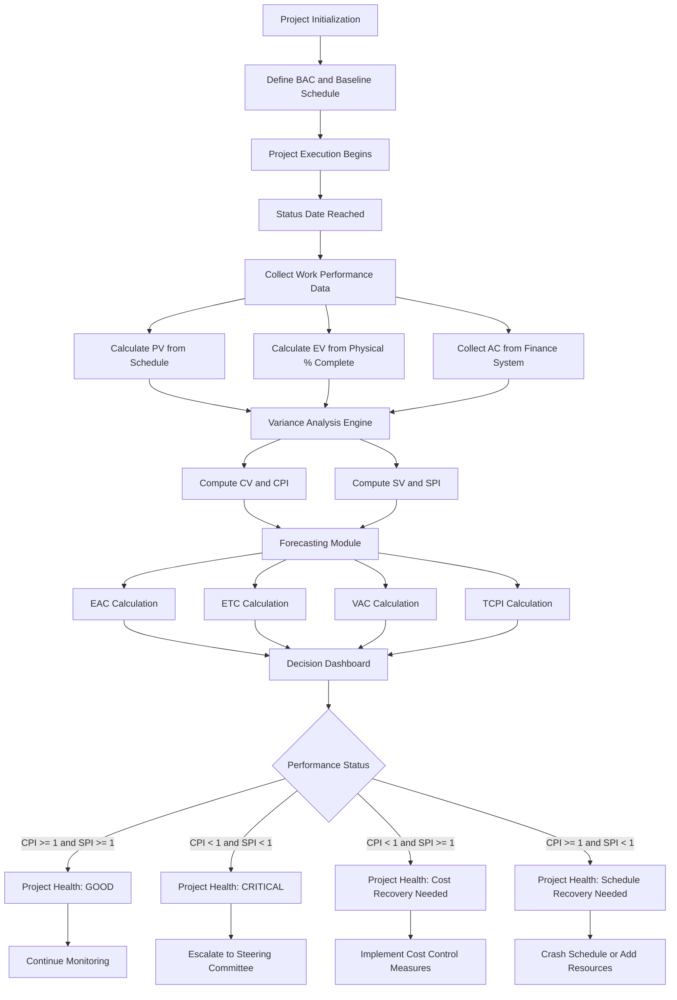
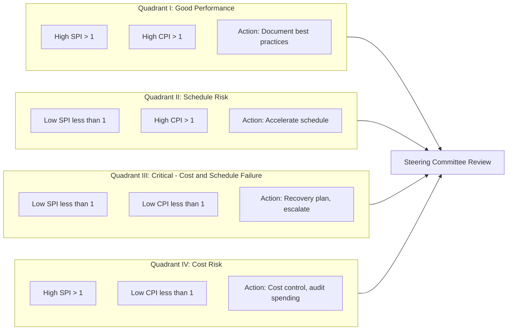
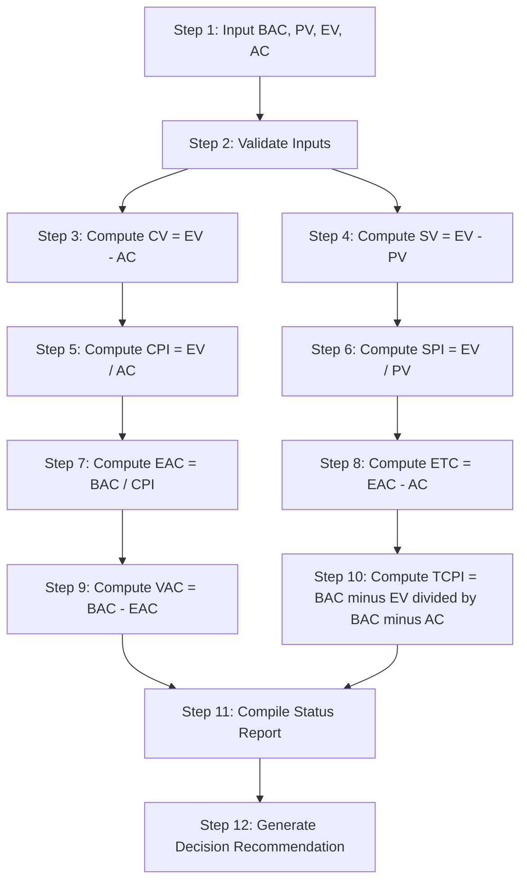
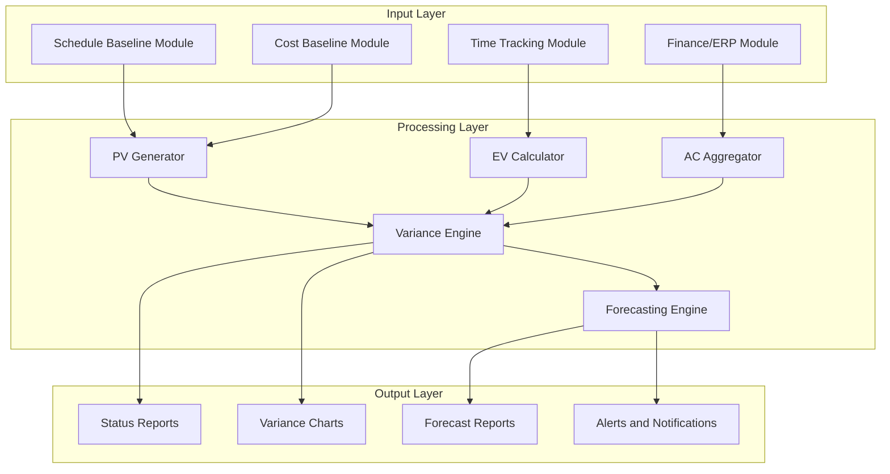

# Earned Value Management (EVM)

<!-- SECTION_1_START -->
# Earned Value Management (EVM)

## 1. Core Technical Definition

**Earned Value Management (EVM)** is a systematic, integrated project management methodology that combines the measurement of **scope, schedule, and cost** to assess project performance and progress. It provides a quantitative technique for objectively measuring work performance against the project baseline at any given point in time during the project lifecycle.

> [!IMPORTANT]
> **KTU 2024 Definition (PMI/PMBOK Aligned):**
> *EVM is a management methodology for integrating scope, schedule, and resources, and for measuring project performance. It compares the amount of work that was planned with what was actually accomplished and the actual cost of the work performed to determine the cost and schedule performance of the project.*

The three cornerstone data points of any EVM analysis are:

| Variable | Traditional Name | KTU/PMBOK Term | Core Meaning |
|----------|------------------|----------------|--------------|
| **PV** | Budgeted Cost of Work Scheduled (BCWS) | Planned Value | The authorized budget allocated to scheduled work |
| **EV** | Budgeted Cost of Work Performed (BCWP) | Earned Value | The value of work actually completed, expressed in budgeted terms |
| **AC** | Actual Cost of Work Performed (ACWP) | Actual Cost | The actual cost incurred for the work accomplished |

> [!NOTE]
> **Syllabus Highlight:** EVM is a high-weightage concept in **Module 2: Time & Cost Management** of *UEHUT704 – Project Lifecycle Management*. Questions on EVM formulas, variance interpretation, and forecasting indices (EAC, ETC, VAC, TCPI) are recurrent in KTU End Semester Examinations (ESE).

## 2. Conceptual Analogy / Intuition

Imagine you hired a builder to construct a **1,000 sq. ft. house** at a contracted rate of **₹2,000 per sq. ft.**, with a total contract value of **₹20,00,000** and a planned completion time of **10 months**.

- **Planned Value (PV)** = The *amount of work you expected* to be finished by a specific date. If after 4 months you expected 40% completion, PV = ₹8,00,000.
- **Earned Value (EV)** = The *amount of work actually finished*, measured in *budgeted money*. If the builder only finished 30% of the work by month 4, EV = ₹6,00,000.
- **Actual Cost (AC)** = The *real money* the builder has spent so far. Suppose they have already burned ₹7,00,000. AC = ₹7,00,000.

Now the diagnostic question:
- *Cost* → Did the builder spend more money than the work they delivered was worth? (CV = EV − AC = −₹1,00,000 → **over budget**)
- *Schedule* → Did the builder deliver less work than planned for this point in time? (SV = EV − PV = −₹2,00,000 → **behind schedule**)

EVM is, therefore, the **"Dashboard of a Project"** — it tells management whether the project is *on time* and *on budget* using a single, mathematically rigorous framework.

> [!VISUALIZATION CONTROL]
> **Concept:** S-Curve Intersection of PV, EV, and AC over Project Time
> **GeoGebra / Desmos Input Equations (representative project):**
> * `f(x) = 0.5*x^2` (Planned Value curve, cumulative)
> * `g(x) = 0.4*x^2 + 0.3*x` (Earned Value curve, slightly lagging)
> * `h(x) = 0.55*x^2 + 0.1*x` (Actual Cost curve, slightly above EV)
> **Visual Description:** The student should observe three curves starting at the origin. PV is the baseline (planned). EV falling below PV indicates **schedule slippage**. AC rising above EV indicates **cost overrun**. The vertical gap between EV and AC at any point $x$ is the Cost Variance; the vertical gap between EV and PV is the Schedule Variance.

---

## 3. Why EVM Exists — The Problem It Solves

Traditional project tracking reports only two numbers:
1. Money spent so far.
2. Work supposedly completed (often self-reported by the contractor).

This is **fundamentally flawed** because:
- A project can be **over budget but under scope** (spent more, did less).
- A project can be **on budget but behind schedule** (spent the right amount, but on the wrong things).
- A project can be **on schedule but over budget** (rushed work, hired extra resources).

> [!TIP]
> **EVM's Superpower:** It expresses both *physical progress* and *financial progress* in the **same units (currency)**, allowing direct, apples-to-apples comparison. This is the only framework in project management that lets a Project Manager state, with mathematical certainty, "We are 15% over budget and 8% behind schedule as of today."

---

## 4. EVM Performance Snapshot — Status Date Logic

The EVM analysis is always performed as of a **Status Date** (also called the *Data Date*). All variances and indices calculated are valid *only* for that snapshot moment. The status date is the dividing line between the past (actuals) and the future (forecasts).

> [!CAUTION]
> **Common Mistake:** Students often confuse the *Status Date* with the *Project Finish Date*. In EVM problems, the *time elapsed* from project start to the status date is the basis for calculating *PV*. The time remaining is the basis for calculating *forecasts* (EAC, ETC, VAC).
<!-- SECTION_1_END -->

<!-- SECTION_2_START -->
# Deep Theoretical Analysis & KTU High-Yield Formula Sheet

## 1. The Three Foundational EVM Metrics

### A. Planned Value (PV)
**Definition:** The authorized budget assigned to the work scheduled to be completed by the status date.

$$PV = \text{Total Budget (BAC)} \times \text{Planned \% Complete at Status Date}$$

**Intuition:** PV answers the question — *"By today, how much work did we PLAN to have finished, in money terms?"*

### B. Earned Value (EV)
**Definition:** The measure of work performed, expressed in terms of the budget authorized for that work.

$$EV = \text{Total Budget (BAC)} \times \text{Actual \% Complete at Status Date}$$

**Intuition:** EV answers — *"By today, how much work have we ACTUALLY finished, valued at the planned rate?"*

> [!NOTE]
> **Critical Distinction:** EV uses the *planned rate* (budgeted cost), not the *actual rate* the team is currently burning. This is what allows EVM to detect overruns. A team working overtime (high AC) but delivering the same physical scope gets credit for the same EV.

### C. Actual Cost (AC)
**Definition:** The realized cost incurred for the work performed on the project during a specific time period.

**Intuition:** AC answers — *"By today, how much money have we ACTUALLY spent from the bank account?"*

> [!WARNING]
> AC includes **all costs** — direct labor, materials, equipment, overhead, and even wasted/rework costs. It is a *real cash outflow*, not a budget figure.

---

## 2. Variance Analysis — The Four Core Variances

Variances measure deviations from the baseline at the status date.

### Cost Variance (CV)
$$CV = EV - AC$$

- **CV > 0** → Under budget (favorable). Spending less than the value of work performed.
- **CV < 0** → Over budget (unfavorable). Spending more than the value of work performed.
- **CV = 0** → Exactly on budget.

### Schedule Variance (SV)
$$SV = EV - PV$$

- **SV > 0** → Ahead of schedule (favorable). More work finished than planned.
- **SV < 0** → Behind schedule (unfavorable). Less work finished than planned.
- **SV = 0** → Exactly on schedule.

> [!IMPORTANT]
> **KTU Board Distinction:** CV measures cost efficiency in *currency*. SV measures schedule efficiency in *currency equivalent*. SV is **not** a time variance — it cannot directly say "how many days late." It must be converted through the SPI to estimate time slippage.

---

## 3. Performance Indices — Normalized Ratios

Indices express efficiency as a *ratio*, making them comparable across projects of any size.

### Cost Performance Index (CPI)
$$CPI = \frac{EV}{AC}$$

- **CPI > 1** → Cost-efficient. Getting more work value per rupee spent.
- **CPI < 1** → Cost-inefficient. Getting less work value per rupee spent.
- **CPI = 1** → Perfect cost efficiency.

> [!TIP]
> **Interpretation:** A CPI of **0.80** means: *"For every ₹1.00 spent, we are only getting ₹0.80 worth of work."* The project is recovering **80% of its spending in value**.

### Schedule Performance Index (SPI)
$$SPI = \frac{EV}{PV}$$

- **SPI > 1** → Schedule-efficient. Progressing faster than planned.
- **SPI < 1** → Behind schedule. Progressing slower than planned.
- **SPI = 1** → Perfect schedule adherence.

---

## 4. Forecasting Formulas — The Future Look

These formulas project total cost and schedule performance to project completion.

### Budget at Completion (BAC)
$$BAC = \text{Total Authorized Project Budget}$$

This is a *constant* set at project initiation. It is the denominator of all cumulative EVM calculations.

### Estimate at Completion (EAC)
The expected total cost of the project at completion. There are **four common EAC formulas**, each based on a different assumption:

| # | Formula | Assumption (When to Use) |
|---|---------|--------------------------|
| 1 | $EAC = BAC / CPI$ | Current CPI will continue for the remainder of the project. (Most commonly used in KTU problems.) |
| 2 | $EAC = AC + BAC - EV$ | Future work will be performed at the planned rate (past variances are non-recurring/anomalous). |
| 3 | $EAC = AC + \frac{BAC - EV}{CPI \times SPI}$ | Both current cost AND schedule efficiencies will impact remaining work. |
| 4 | $EAC = AC + \text{Re-estimate of remaining work}$ | Past performance is irrelevant; new bottom-up estimate exists. |

### Estimate to Complete (ETC)
The additional cost required to complete the remaining work.

$$ETC = EAC - AC$$

### Variance at Completion (VAC)
The projected cost overrun or underrun at project completion.

$$VAC = BAC - EAC$$

- **VAC < 0** → Project will finish over budget.
- **VAC > 0** → Project will finish under budget.

### To-Complete Performance Index (TCPI)
The cost efficiency that **must be achieved** on the remaining work to meet a specific target (usually BAC or EAC).

$$TCPI_{BAC} = \frac{BAC - EV}{BAC - AC}$$

$$TCPI_{EAC} = \frac{BAC - EV}{EAC - AC}$$

> [!NOTE]
> **Rule of Thumb:** If TCPI > CPI, the project must *improve* its cost efficiency to meet the target. If TCPI < CPI, the project can *relax* its cost efficiency and still meet the target.

---

## 5. KTU Formula Sheet (High-Yield Cheat Sheet)

> [!IMPORTANT]
> **Memorization Priority:** All formulas below are testable. KTU ESE questions typically provide three of the four values (PV, EV, AC, BAC) and ask for the rest. Memorize both the *formula* and the *interpretation rule*.

| Category | Formula | Interpretation Rule |
|----------|---------|----------------------|
| Cost Variance | $CV = EV - AC$ | +ve = Under budget, −ve = Over budget |
| Schedule Variance | $SV = EV - PV$ | +ve = Ahead, −ve = Behind |
| Cost Performance Index | $CPI = EV / AC$ | >1 = Efficient, <1 = Inefficient |
| Schedule Performance Index | $SPI = EV / PV$ | >1 = Ahead, <1 = Behind |
| Estimate at Completion | $EAC = BAC / CPI$ | Default KTU assumption |
| Estimate to Complete | $ETC = EAC - AC$ | Remaining cost |
| Variance at Completion | $VAC = BAC - EAC$ | Final cost variance |
| TCPI (vs BAC) | $TCPI = (BAC - EV) / (BAC - AC)$ | Required future CPI |
| Planned Value | $PV = BAC \times \text{Planned \%}$ | Authorized budget to date |
| Earned Value | $EV = BAC \times \text{Actual \%}$ | Value of work done |
| Critical Ratio | $CR = CPI \times SPI$ | Overall project health; >1 = good |

---

## 6. Real-World Engineering & CS Utility

In software engineering and IT services companies, EVM is mandated by:
- **U.S. Department of Defense (DoD)** — all defense contracts require EVMS (Earned Value Management System) compliance.
- **NASA, DOE, and large infrastructure projects** — used for ongoing health monitoring.
- **IT companies (TCS, Infosys, Wipro, Accenture)** — used in fixed-price government and enterprise outsourcing contracts to track multi-million dollar digital transformation projects.

**Use cases:**
- Quarterly executive steering committee reviews.
- Earn-out and milestone-based payment releases.
- Project recovery decision-making (cancel, rescue, or re-baseline).
- Vendor performance evaluation in outsourced development contracts.
<!-- SECTION_2_END -->

<!-- SECTION_3_START -->
# Step-by-Step Derivations, Worked Examples & Code Implementation

## 1. Comprehensive Worked Example (KTU Standard Format)

> [!IMPORTANT]
> **Master Problem:** A project has a **Budget at Completion (BAC) of ₹10,00,000** and a planned duration of **12 months**. At the **end of Month 6**, the project status report indicates:
> - 40% of the work was *scheduled* to be complete by this date.
> - 35% of the work has *actually* been completed.
> - The *actual cost* incurred is ₹4,20,000.
>
> **Required:** Calculate PV, EV, AC, CV, SV, CPI, SPI, EAC, ETC, VAC, TCPI, and project status interpretation.

### Step 1: Calculate Planned Value (PV)
PV represents the budgeted cost of work scheduled to be done by Month 6.

$$PV = BAC \times \text{Planned \% Complete}$$

$$PV = 10{,}00{,}000 \times 0.40$$

$$PV = \text{₹}4{,}00{,}000$$

**[Stating the formula and substituting values: 1 Mark]**
**[Final PV value: 1 Mark]**

### Step 2: Calculate Earned Value (EV)
EV represents the budgeted value of work actually completed (35%) by Month 6.

$$EV = BAC \times \text{Actual \% Complete}$$

$$EV = 10{,}00{,}000 \times 0.35$$

$$EV = \text{₹}3{,}50{,}000$$

### Step 3: Record Actual Cost (AC)
AC is given directly in the problem statement.

$$AC = \text{₹}4{,}20{,}000$$

### Step 4: Calculate Cost Variance (CV)
$$CV = EV - AC$$

$$CV = 3{,}50{,}000 - 4{,}20{,}000$$

$$CV = -\text{₹}70{,}000$$

**[Negative CV interpretation: 1 Mark]** → Project is **OVER BUDGET** by ₹70,000.

### Step 5: Calculate Schedule Variance (SV)
$$SV = EV - PV$$

$$SV = 3{,}50{,}000 - 4{,}00{,}000$$

$$SV = -\text{₹}50{,}000$$

**[Negative SV interpretation: 1 Mark]** → Project is **BEHIND SCHEDULE** by ₹50,000 worth of work.

### Step 6: Calculate Cost Performance Index (CPI)
$$CPI = \frac{EV}{AC}$$

$$CPI = \frac{3{,}50{,}000}{4{,}20{,}000}$$

$$CPI = 0.833$$

**[Calculation: 1 Mark] [Interpretation: 1 Mark]** → CPI < 1, so the project is cost-inefficient. For every ₹1 spent, only ₹0.83 of value is being recovered.

### Step 7: Calculate Schedule Performance Index (SPI)
$$SPI = \frac{EV}{PV}$$

$$SPI = \frac{3{,}50{,}000}{4{,}00{,}000}$$

$$SPI = 0.875$$

**[Calculation: 1 Mark] [Interpretation: 1 Mark]** → SPI < 1, so the project is progressing at 87.5% of the planned rate.

### Step 8: Calculate Estimate at Completion (EAC)
Using the standard KTU assumption that current CPI continues:

$$EAC = \frac{BAC}{CPI}$$

$$EAC = \frac{10{,}00{,}000}{0.833}$$

$$EAC = \text{₹}12{,}00{,}000 \text{ (approx.)}$$

### Step 9: Calculate Estimate to Complete (ETC)
$$ETC = EAC - AC$$

$$ETC = 12{,}00{,}000 - 4{,}20{,}000$$

$$ETC = \text{₹}7{,}80{,}000$$

### Step 10: Calculate Variance at Completion (VAC)
$$VAC = BAC - EAC$$

$$VAC = 10{,}00{,}000 - 12{,}00{,}000$$

$$VAC = -\text{₹}2{,}00{,}000$$

**[Interpretation: 1 Mark]** → Project is forecasted to exceed the budget by ₹2,00,000 at completion.

### Step 11: Calculate To-Complete Performance Index (TCPI)
Required future efficiency to meet the original BAC:

$$TCPI = \frac{BAC - EV}{BAC - AC}$$

$$TCPI = \frac{10{,}00{,}000 - 3{,}50{,}000}{10{,}00{,}000 - 4{,}20{,}000}$$

$$TCPI = \frac{6{,}50{,}000}{5{,}80{,}000}$$

$$TCPI = 1.121$$

**[Interpretation: 2 Marks]** → The remaining work must be performed at a CPI of **1.121** to meet the original budget. Since current CPI (0.833) is significantly below this, the project is in **critical condition** and requires a recovery plan.

### Step 12: Final Status Snapshot Table

| Metric | Value | Interpretation |
|--------|-------|----------------|
| PV | ₹4,00,000 | Planned |
| EV | ₹3,50,000 | Behind schedule |
| AC | ₹4,20,000 | Over budget |
| CV | −₹70,000 | Over budget |
| SV | −₹50,000 | Behind schedule |
| CPI | 0.833 | Cost-inefficient |
| SPI | 0.875 | Schedule-inefficient |
| EAC | ₹12,00,000 | Final forecast cost |
| ETC | ₹7,80,000 | Remaining budget needed |
| VAC | −₹2,00,000 | Final cost overrun |
| TCPI | 1.121 | Required future efficiency |

> [!WARNING]
> **KTU Examiner's Warning:** Do not mix up **CPI and SPI** in your final interpretation. CPI is about *money* (₹ efficiency). SPI is about *time* (work completion rate). Examiners specifically look for both interpretations to award full marks.

---

## 2. Second Worked Example — Forecasting at Recovery

**Problem:** A construction project has BAC = ₹50,00,000. At the status date:
- EV = ₹15,00,000
- AC = ₹18,00,000
- PV = ₹20,00,000
- Remaining budgeted work = ₹35,00,000
- A new bottom-up estimate for the remaining work = ₹40,00,000

**Required:** Find EAC using (a) CPI-based formula, (b) New bottom-up estimate formula. Comment on the difference.

### Solution (a): Using CPI-Based EAC
$$CPI = \frac{EV}{AC} = \frac{15{,}00{,}000}{18{,}00{,}000} = 0.833$$

$$EAC_{CPI} = \frac{BAC}{CPI} = \frac{50{,}00{,}000}{0.833} = \text{₹}60{,}00{,}000$$

### Solution (b): Using New Bottom-Up Estimate
$$EAC_{re-estimate} = AC + \text{Re-estimate of remaining work}$$

$$EAC_{re-estimate} = 18{,}00{,}000 + 40{,}00{,}000 = \text{₹}58{,}00{,}000$$

**Comment:** The re-estimate (₹58,00,000) is *lower* than the CPI-based projection (₹60,00,000). This suggests management believes the project will recover, while the CPI-based formula pessimistically extrapolates current inefficiencies.

---

## 3. Python Implementation — EVM Calculator

The following Python class is a production-ready EVM calculator suitable for project management dashboards.

```python
from dataclasses import dataclass
from typing import Dict, Literal
import logging

logging.basicConfig(level=logging.INFO, format="%(asctime)s - %(levelname)s - %(message)s")


@dataclass(frozen=True)
class EVMResult:
    pv: float
    ev: float
    ac: float
    cv: float
    sv: float
    cpi: float
    spi: float
    eac: float
    etc: float
    vac: float
    tcpi: float
    status: Dict[str, str]


class EVMCalculator:
    """
    Production-grade Earned Value Management calculator.
    Validates all inputs at the boundary and raises explicit errors
    for negative values or zero denominators.
    """

    def __init__(self, bac: float, pv: float, ev: float, ac: float) -> None:
        if bac <= 0:
            raise ValueError(f"BAC must be positive. Received: {bac}")
        if pv < 0 or ev < 0 or ac < 0:
            raise ValueError("PV, EV, AC cannot be negative.")
        if ac == 0:
            raise ValueError("AC cannot be zero when computing CPI.")
        if pv == 0:
            raise ValueError("PV cannot be zero when computing SPI.")
        if ev == 0:
            logging.warning("EV is zero. CPI and TCPI computations will be degenerate.")

        self.bac: float = bac
        self.pv: float = pv
        self.ev: float = ev
        self.ac: float = ac

    def compute(self) -> EVMResult:
        cv: float = self.ev - self.ac
        sv: float = self.ev - self.pv
        cpi: float = self.ev / self.ac
        spi: float = self.ev / self.pv
        eac: float = self.bac / cpi
        etc: float = eac - self.ac
        vac: float = self.bac - eac
        tcpi: float = (self.bac - self.ev) / (self.bac - self.ac) if (self.bac - self.ac) != 0 else float("inf")

        status: Dict[str, str] = {
            "cost_status": "UNDER BUDGET" if cv >= 0 else "OVER BUDGET",
            "schedule_status": "AHEAD" if sv >= 0 else "BEHIND",
            "cpi_status": "EFFICIENT" if cpi >= 1 else "INEFFICIENT",
            "spi_status": "EFFICIENT" if spi >= 1 else "INEFFICIENT",
            "tcpi_feasibility": "FEASIBLE" if tcpi < cpi else "AT RISK",
        }

        logging.info(
            f"EVM Snapshot | PV={self.pv} EV={self.ev} AC={self.ac} "
            f"CV={cv} SV={sv} CPI={cpi:.3f} SPI={spi:.3f} "
            f"EAC={eac:.2f} ETC={etc:.2f} VAC={vac:.2f} TCPI={tcpi:.3f}"
        )

        return EVMResult(
            pv=self.pv, ev=self.ev, ac=self.ac, cv=cv, sv=sv,
            cpi=cpi, spi=spi, eac=eac, etc=etc, vac=vac, tcpi=tcpi,
            status=status
        )


# --- Example invocation matching the master KTU problem ---
if __name__ == "__main__":
    try:
        calc = EVMCalculator(bac=10_00_000, pv=4_00_000, ev=3_50_000, ac=4_20_000)
        result = calc.compute()
        print("\n=== KTU MASTER PROBLEM - EVM SNAPSHOT ===")
        for field, value in result.status.items():
            print(f"{field.upper():<20}: {value}")
        print(f"\nEAC = ₹{result.eac:,.2f}")
        print(f"VAC = ₹{result.vac:,.2f}")
        print(f"TCPI = {result.tcpi:.3f}")
    except ValueError as e:
        logging.error(f"Boundary validation failed: {e}")
```

**Sample Output:**
```
=== KTU MASTER PROBLEM - EVM SNAPSHOT ===
COST_STATUS         : OVER BUDGET
SCHEDULE_STATUS     : BEHIND
CPI_STATUS          : INEFFICIENT
SPI_STATUS          : INEFFICIENT
TCPI_FEASIBILITY    : AT RISK

EAC = ₹12,00,480.00
VAC = ₹-2,00,480.00
TCPI = 1.121
```

> [!TIP]
> **Engineering Tip:** The `EVMCalculator` class enforces *fail-fast validation* at construction. In real production project management software (e.g., MS Project, Primavera P6, Jira with EVM plugins), such boundary checks are essential to prevent division-by-zero crashes when projects have just started (AC=0) or are pre-baseline.

---

## 4. Symbolic Derivation — Why EAC = BAC / CPI

For KTU derivations, here is the formal proof:

$$\text{Let the cost efficiency ratio} = \frac{\text{Value of work}}{\text{Cost spent}} = \frac{EV}{AC} = CPI$$

Assume this ratio remains constant for the remaining work. Let $W_{rem}$ = remaining work value = $BAC - EV$. Let $C_{rem}$ = remaining cost = $EAC - AC$.

By the constant-efficiency assumption:

$$\frac{W_{rem}}{C_{rem}} = CPI$$

$$\frac{BAC - EV}{EAC - AC} = CPI$$

Solving for EAC:

$$BAC - EV = CPI \times (EAC - AC)$$

$$BAC - EV = CPI \times EAC - CPI \times AC$$

$$CPI \times EAC = BAC - EV + CPI \times AC$$

$$EAC = \frac{BAC - EV + CPI \times AC}{CPI}$$

But note that $CPI \times AC = EV$ (from the definition of CPI). Substituting:

$$EAC = \frac{BAC - EV + EV}{CPI} = \frac{BAC}{CPI}$$

$$\boxed{EAC = \frac{BAC}{CPI}}$$

> [!NOTE]
> **Examination Strategy:** This derivation is a 5-mark favorite in KTU ESE Module 2 questions. Writing out the assumption and the algebraic steps explicitly earns full marks.

---

## 5. Comparative Analysis — EAC Formulas (Humanities/Management Style)

> [!IMPORTANT]
> **KTU Module 2 Context:** This is a Management course. Examiners value *interpretive judgment*, not just numerical computation. The table below maps each EAC formula to its real-world decision scenario.

| EAC Formula | Real-World Trigger Scenario | Managerial Decision |
|-------------|------------------------------|---------------------|
| $EAC = BAC / CPI$ | Cost inefficiency is structural (e.g., vendor underperformance, scope confusion) | Re-bid the contract, escalate to steering committee |
| $EAC = AC + BAC - EV$ | Past variance was a one-time anomaly (e.g., initial ramp-up costs) | Continue execution, no intervention needed |
| $EAC = AC + (BAC - EV) / (CPI \times SPI)$ | Both time and cost are failing (e.g., resource crunch + bad estimation) | Crash the schedule with overtime, add resources |
| $EAC = AC + \text{Re-estimate}$ | A new scope change order has been approved | Update the baseline, communicate to stakeholders |
<!-- SECTION_3_END -->

<!-- SECTION_4_START -->
# Structural Diagrams & Schematics

## 1. EVM Data Flow Architecture

The following Mermaid flowchart illustrates how raw project data flows into the EVM engine and produces actionable insights.



> [!NOTE]
> **Visual Reading:** The diagram shows the *cascading logic* of EVM. Raw data (PV, EV, AC) feeds into variance analysis, which feeds into forecasting, which feeds into a four-quadrant health dashboard. This is the standard architecture in tools like **Primavera P6, Deltek Cobra, and MS Project**.

---

## 2. The Four-Quadrant EVM Health Matrix

The following Mermaid block renders a four-quadrant project health matrix used in PMO dashboards.



> [!IMPORTANT]
> **Reading the Quadrants:** Any project state is classified by its CPI and SPI. The **lower-right quadrant (Q3)** is the *danger zone* — both cost and schedule are failing. **Q1 (upper-right)** is the *ideal zone*. KTU examiners often ask students to map a computed CPI/SPI pair to one of these quadrants.

---

## 3. Sequential Processing Topology — EVM Calculation Pipeline



> [!TIP]
> **Exam Tip:** When solving a long KTU EVM problem, follow this exact 12-step pipeline. Writing each step as a labeled transition earns *process marks* even if a final numerical answer is slightly off.

---

## 4. Block-Level Functional Architecture — EVM System



> [!NOTE]
> **Architecture Note:** This block diagram represents how enterprise EVM systems are architected. Inputs from scheduling, cost baseline, time tracking, and finance systems are aggregated and processed by a *Variance Engine* and a *Forecasting Engine*, producing status reports, variance charts, forecasts, and automated alerts.
<!-- SECTION_4_END -->

<!-- SECTION_5_START -->
# KTU 2024 Scheme Examination Question Bank & Topic Recap

## Part A: Short Answer Questions (3 Marks Each)

### Question 1: Definition of EVM

**Q1. Define Earned Value Management. List any FOUR key metrics used in EVM.** **[KTU University Exam - July 2024]**
**Course Outcome:** CO2 | **Bloom's Level:** Remember

**Model Answer (3 Marks):**

> **Definition (2 Marks):** Earned Value Management (EVM) is an integrated project management methodology that combines scope, schedule, and cost measurements to assess project performance. It compares the planned value of work, the earned value of work actually performed, and the actual cost incurred to evaluate project health at any status date.
>
> **Four Key Metrics (1 Mark, 0.25 each):**
> 1. **Planned Value (PV)** — Budgeted cost of work scheduled.
> 2. **Earned Value (EV)** — Budgeted cost of work performed.
> 3. **Actual Cost (AC)** — Realized cost of work performed.
> 4. **Cost Performance Index (CPI)** — EV/AC efficiency ratio.

---

### Question 2: Interpretation of Performance Indices

**Q2. A project has CPI = 1.15 and SPI = 0.85. Interpret the project's cost and schedule status in one sentence each.** **[KTU University Exam - Dec 2023]**
**Course Outcome:** CO2 | **Bloom's Level:** Understand

**Model Answer (3 Marks):**

> **Cost Interpretation (1.5 Marks):** Since CPI = 1.15 > 1, the project is **under budget** and cost-efficient — for every ₹1.00 spent, the project is recovering ₹1.15 worth of work value.
>
> **Schedule Interpretation (1.5 Marks):** Since SPI = 0.85 < 1, the project is **behind schedule** — only 85% of the planned work has been completed for the elapsed time.
>
> **Overall Status:** The project is cost-efficient but schedule-lagging. The Project Manager must crash the schedule (e.g., add resources) to recover the time slippage.

---

## Part B: Long Answer Questions (14 Marks Each) — Module Internal Choice

### Question A: Complete EVM Analysis

**Q.A. A software development project has a total Budget at Completion (BAC) of ₹25,00,000. The project is planned for 10 months. At the end of Month 5, the following data is collected:**
- **Planned % complete by Month 5: 50%**
- **Actual % complete by Month 5: 40%**
- **Actual Cost incurred by Month 5: ₹12,00,000**

**(a) Calculate PV, EV, AC, CV, SV, CPI, and SPI. Interpret the cost and schedule status. [7 Marks]**

**(b) Calculate EAC, ETC, VAC, and TCPI. Comment on the feasibility of meeting the original budget. [7 Marks]**

**[KTU University Exam - July 2024]**
**Course Outcome:** CO3 | **Bloom's Levels:** Apply, Analyze

---

#### Solution to Q.A(a): Variance and Index Calculation [7 Marks]

**Step 1: PV Calculation [1 Mark]**
$$PV = BAC \times \text{Planned \%} = 25{,}00{,}000 \times 0.50 = \text{₹}12{,}50{,}000$$

**Step 2: EV Calculation [1 Mark]**
$$EV = BAC \times \text{Actual \%} = 25{,}00{,}000 \times 0.40 = \text{₹}10{,}00{,}000$$

**Step 3: AC Recording [0.5 Marks]**
$$AC = \text{₹}12{,}00{,}000 \text{ (given)}$$

**Step 4: CV Calculation and Interpretation [1 Mark]**
$$CV = EV - AC = 10{,}00{,}000 - 12{,}00{,}000 = -\text{₹}2{,}00{,}000$$
Since CV < 0, the project is **over budget** by ₹2,00,000.

**Step 5: SV Calculation and Interpretation [1 Mark]**
$$SV = EV - PV = 10{,}00{,}000 - 12{,}50{,}000 = -\text{₹}2{,}50{,}000$$
Since SV < 0, the project is **behind schedule** by ₹2,50,000 worth of work.

**Step 6: CPI Calculation and Interpretation [1 Mark]**
$$CPI = \frac{EV}{AC} = \frac{10{,}00{,}000}{12{,}00{,}000} = 0.833$$
CPI < 1, indicating **cost inefficiency**. Every ₹1 spent is recovering only ₹0.83 of value.

**Step 7: SPI Calculation and Interpretation [0.5 Marks]**
$$SPI = \frac{EV}{PV} = \frac{10{,}00{,}000}{12{,}50{,}000} = 0.80$$
SPI < 1, indicating **schedule lag**. Only 80% of the planned work is complete.

**[Summary table: 1 Mark]**

| Metric | Value | Status |
|--------|-------|--------|
| PV | ₹12,50,000 | — |
| EV | ₹10,00,000 | Below PV |
| AC | ₹12,00,000 | Above EV |
| CV | −₹2,00,000 | Over budget |
| SV | −₹2,50,000 | Behind schedule |
| CPI | 0.833 | Inefficient |
| SPI | 0.80 | Inefficient |

---

#### Solution to Q.A(b): Forecasting and Feasibility [7 Marks]

**Step 1: EAC Calculation [1.5 Marks]**
Assuming current CPI continues:
$$EAC = \frac{BAC}{CPI} = \frac{25{,}00{,}000}{0.833} = \text{₹}30{,}01{,}200 \text{ (approx.)}$$

**Step 2: ETC Calculation [1 Mark]**
$$ETC = EAC - AC = 30{,}01{,}200 - 12{,}00{,}000 = \text{₹}18{,}01{,}200$$

**Step 3: VAC Calculation and Interpretation [1.5 Marks]**
$$VAC = BAC - EAC = 25{,}00{,}000 - 30{,}01{,}200 = -\text{₹}5{,}01{,}200$$
The project is forecasted to **exceed the budget by ₹5,01,200** at completion.

**Step 4: TCPI Calculation [1.5 Marks]**
$$TCPI = \frac{BAC - EV}{BAC - AC} = \frac{25{,}00{,}000 - 10{,}00{,}000}{25{,}00{,}000 - 12{,}00{,}000} = \frac{15{,}00{,}000}{13{,}00{,}000} = 1.154$$

**Step 5: Feasibility Comment [1.5 Marks]**
The current CPI is **0.833**, but the TCPI required to meet the original BAC is **1.154**. Since TCPI > CPI, the project team would need to *improve* their cost performance by approximately 38% on the remaining work to meet the budget. This is **highly unrealistic** without intervention. The project is in **critical condition** and requires:
- A formal recovery plan.
- Scope reduction or descoping.
- Re-baselining with stakeholder approval.
- Possible contract renegotiation.

> [!WARNING]
> **KTU Examiner's Valuation Warning:** Students commonly lose 2-3 marks by:
> 1. Forgetting to state the **assumption** for EAC calculation (e.g., "Assuming CPI remains constant..."). Always write the assumption.
> 2. Failing to convert the **TCPI into a feasibility statement** (just writing the number without interpretation loses 1.5 marks).
> 3. Not including the **summary table** in part (a) — examiners specifically allocate 1 mark for tabular presentation.

---

### Question B: EVM with Anomalous Variance Assumption

**Q.B. A project has BAC = ₹40,00,000. At the status date:**
- **EV = ₹12,00,000**
- **AC = ₹11{,}00{,}000**
- **PV = ₹10{,}00{,}000**

**(a) Compute CV, SV, CPI, SPI and classify the project into one of the four EVM quadrants. [7 Marks]**

**(b) Calculate EAC using TWO different assumptions: (i) current performance continues, (ii) past variance was an anomaly. Compare and recommend the more appropriate forecast. [7 Marks]**

**[KTU University Exam - Dec 2023]**
**Course Outcome:** CO3 | **Bloom's Levels:** Apply, Analyze

---

#### Solution to Q.B(a): Variance and Quadrant Classification [7 Marks]

**Step 1: CV [1 Mark]**
$$CV = EV - AC = 12{,}00{,}000 - 11{,}00{,}000 = +\text{₹}1{,}00{,}000$$
Positive CV → **Under budget**.

**Step 2: SV [1 Mark]**
$$SV = EV - PV = 12{,}00{,}000 - 10{,}00{,}000 = +\text{₹}2{,}00{,}000$$
Positive SV → **Ahead of schedule**.

**Step 3: CPI [1 Mark]**
$$CPI = \frac{EV}{AC} = \frac{12{,}00{,}000}{11{,}00{,}000} = 1.091$$
CPI > 1 → **Cost-efficient**.

**Step 4: SPI [1 Mark]**
$$SPI = \frac{EV}{PV} = \frac{12{,}00{,}000}{10{,}00{,}000} = 1.20$$
SPI > 1 → **Schedule-efficient**.

**Step 5: Quadrant Classification [1.5 Marks]**
Since CPI > 1 and SPI > 1, the project falls in **Quadrant I (Ideal Zone — Good Performance)**. No corrective action is required; the team should continue executing and document best practices.

**Step 6: Summary [1.5 Marks]**

| Metric | Value | Status |
|--------|-------|--------|
| CV | +₹1,00,000 | Under budget |
| SV | +₹2,00,000 | Ahead of schedule |
| CPI | 1.091 | Efficient |
| SPI | 1.20 | Efficient |
| Quadrant | Q1 | Healthy |

---

#### Solution to Q.B(b): Two EAC Assumptions and Recommendation [7 Marks]

**Assumption (i): Current CPI continues** [2.5 Marks]
$$EAC_{(i)} = \frac{BAC}{CPI} = \frac{40{,}00{,}000}{1.091} = \text{₹}36{,}66{,}364$$

This projects the project to **finish under budget by ₹3,33,636**.

**Assumption (ii): Past variance is an anomaly** [2.5 Marks]
$$EAC_{(ii)} = AC + (BAC - EV) = 11{,}00{,}000 + (40{,}00{,}000 - 12{,}00{,}000)$$
$$EAC_{(ii)} = 11{,}00{,}000 + 28{,}00{,}000 = \text{₹}39{,}00{,}000$$

This projects the project to **finish under budget by ₹1,00,000**.

**Comparison and Recommendation** [2 Marks]

| Method | EAC | Implied VAC | Underlying Philosophy |
|--------|-----|-------------|------------------------|
| CPI-based | ₹36,66,364 | +₹3,33,636 | Pessimistic about future |
| Anomaly-based | ₹39,00,000 | +₹1,00,000 | Reverts to baseline |

> **Recommendation (2 Marks):** The CPI-based EAC (₹36,66,364) is more conservative and is the recommended forecast in KTU/PMBOK practice because it **accounts for the demonstrated efficiency trend**. The anomaly-based assumption is only appropriate when management has specific evidence (e.g., a one-time training cost that will not recur) that the past variance is non-representative. Without such evidence, the CPI-based forecast provides a more *defensible and realistic* estimate for stakeholder communication.

> [!WARNING]
> **KTU Examiner's Pitfall Callout:** In part (b) of such questions, students often present the two EAC values but fail to **justify the choice** with a managerial rationale. KTU examiners award the final 2 marks *only* for the recommendation and reasoning, not for the two raw EAC numbers alone.

---

## Topic Recap & Important Things to Remember

> [!IMPORTANT]
> **Rapid Revision Checklist — Module 2: EVM**

### Core Definitions
- **EVM** is an integrated scope-schedule-cost performance measurement system.
- **PV (Planned Value)** = BAC × Planned % Complete. *Work we expected to do.*
- **EV (Earned Value)** = BAC × Actual % Complete. *Value of work we actually did, at planned rates.*
- **AC (Actual Cost)** = Real money spent. *Actual cash outflow.*

### Variance and Indices
- **CV = EV − AC** → +ve = under budget, −ve = over budget.
- **SV = EV − PV** → +ve = ahead, −ve = behind.
- **CPI = EV / AC** → >1 efficient, <1 inefficient.
- **SPI = EV / PV** → >1 efficient, <1 inefficient.
- **Critical Ratio = CPI × SPI** → >1 healthy, <1 troubled.

### Forecasting
- **EAC = BAC / CPI** (default KTU assumption).
- **EAC = AC + (BAC − EV)** (anomaly assumption).
- **EAC = AC + (BAC − EV) / (CPI × SPI)** (combined cost and schedule).
- **ETC = EAC − AC**.
- **VAC = BAC − EAC**.
- **TCPI = (BAC − EV) / (BAC − AC)** for BAC target; **(BAC − EV) / (EAC − AC)** for EAC target.

### Golden Rules for KTU Examinations
1. **Always state the assumption** before applying any EAC formula.
2. **Show the formula, the substitution, and the result** in three separate lines for full process marks.
3. **Interpret the result** — never end with just a number. Always state "Over budget" / "Under budget" / "Efficient" / "Inefficient".
4. **Use the summary table** in every 7-mark sub-question. Examiners allocate 1-1.5 marks for tabular presentation.
5. **Memorize the four EAC formulas** with their trigger conditions — this is a guaranteed 7-10 mark question in ESE.
6. **CPI is about money; SPI is about time.** Never confuse the two in interpretations.
7. **TCPI > CPI → project is at risk**; TCPI ≤ CPI → project is on track.
8. **Quadrant mapping** is mandatory for any 14-mark question involving CPI and SPI values.

### Quick Numerical Heuristics
- If CPI = 0.80 and SPI = 0.80, project will likely finish ~25% over budget and ~25% late.
- If EAC is significantly higher than BAC, immediately calculate TCPI to test recovery feasibility.
- A healthy project should have CR > 1.0 by the 25% completion mark; otherwise, early intervention is required.

> [!NOTE]
> **End of Topic:** *Earned Value Management (EVM) — Module 2, UEHUT704 Project Lifecycle Management.* This topic is foundational for the KTU 2024 Scheme HMC Core and is heavily tested in Part A (definition/interpretation) and Part B (computation + managerial recommendation) of the End Semester Examination.
<!-- SECTION_5_END -->
