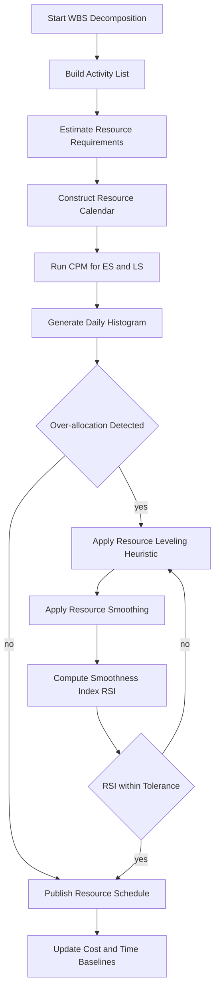
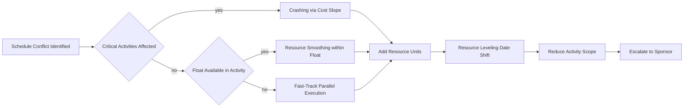
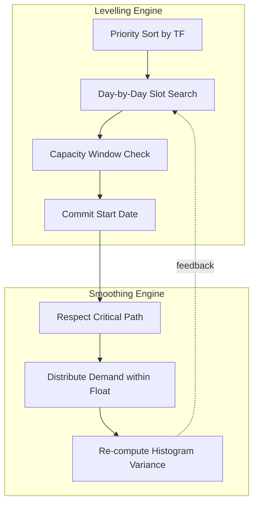

# Resource Scheduling

<!-- SECTION_1_START -->

# Resource Scheduling

## 1.1 Formal Academic Definition (KTU 2024 Syllabus Terminology)

**Resource Scheduling** is the process of developing and maintaining a time-phased plan for the deployment of organizational resources (human, equipment, material, and financial) across the activities of a project so that the project objectives of **scope**, **time**, and **cost** are simultaneously achieved, subject to feasibility, availability, and precedence constraints.

In the language of the **PMBOK Guide (7th Edition)** and the **ISO 21500:2021** standard, resource scheduling is a subset of the **Schedule Management** knowledge area, situated at the intersection of *Plan Resource Management*, *Estimate Activity Resources*, and *Develop Schedule*. KTU 2024 scheme treats it as a core competency of Module 2: *Time & Cost Management*, because resource decisions directly drive both the **critical path** and the **project cost baseline**.

> [!IMPORTANT]
> **KTU 2024 Definition Anchor:** A *resource* in scheduling is *anything* that is consumed, occupied, or budgeted when an activity is performed. The four canonical resource classes are: **Labor (L)**, **Equipment (E)**, **Material (M)**, and **Money / Budget (B)** — remembered by the mnemonic **"L-E-M-B"**.

## 1.2 Conceptual Analogy — "The Restaurant Kitchen"

Imagine a busy restaurant on a Saturday night. The chef (labor) can only stir two pots at once, there is one oven (equipment), tomatoes (material) are limited to 20 kg in the fridge, and the day's budget (money) caps ingredient spend at ₹5,000. Orders keep arriving.

Resource scheduling is the head chef's *mise-en-place* — the master plan that decides:
- *Which* dish starts *when*,
- *Which* cook handles *which* station,
- *When* the oven is preheated for *which* course.

If the chef ignores the constraint ("we only have 1 oven") and tries to bake bread and roast chicken at the same time, the dinner service collapses. This is **resource overallocation**. The art of resource scheduling is precisely the art of *avoiding this collapse* while still getting every plate out on time.

| Kitchen Concept | Project Management Equivalent |
| :--- | :--- |
| Chef skill mix | Labor resource calendar |
| Single oven | Equipment bottleneck (renewable constraint) |
| 20 kg tomato stock | Non-renewable material constraint |
| ₹5,000 daily cap | Cost baseline / budget |
| Saturday menu deadline | Project finish date |

> [!NOTE]
> **Why the analogy matters for KTU valuation:** Examiners often award full 7-mark credit only when the student *connects* the theory to a *concrete operational constraint*. The kitchen analogy is a safe, high-yield way to satisfy the "real-world application" rubric line item.

## 1.3 Standard Metrics & Physical Constants

The following **standard project management metrics** are universally applied in KTU valuation schemes for resource problems:

- **Resource Utilization (RU)** — **bold** unit: % (dimensionless)
- **Resource Availability (RA)** — persons / hours / units
- **Resource Demand (RD)** — persons / hours / units
- **Resource Smoothness Index (RSI)** — variance of daily demand
- **Critical Resource (CR)** — resource lying on the critical path
- **Schedule Performance Index (SPI)** — bold unit: ratio
- **Cost Performance Index (CPI)** — bold unit: ratio
- **Standard working day** — **8 hours**, **5 days/week** (unless project charter overrides)

> [!TIP]
> **KTU 2024 Highlight:** The phrase *"optimum utilization"* appearing in a question statement almost always demands an **answer rooted in resource leveling**, not just resource allocation. Read the verb carefully — *allocate* (initial distribution) and *schedule* (time-phased refinement) are *not* synonyms.

## 1.4 Visualization Cue — The Resource Histogram

> [!VISUALIZATION CONTROL]
> **Concept:** Resource Histogram (Stacked Bar Chart of Daily Demand vs. Daily Capacity)
> **GeoGebra / Desmos Input Equations:**
> * `f(x) = piecewise(2, 0 \leq x < 3, 5, 3 \leq x < 7, 2, 7 \leq x \leq 10)` (Demand curve)
> * `g(x) = 4` (Capacity ceiling line)
> **Visual Description:** A staircase-shaped demand curve climbs above a horizontal *capacity ceiling* on days 3–6, then falls back below it. The shaded region where $f(x) > g(x)$ is the **over-allocation zone** — exactly the zone that resource leveling must eliminate.

<!-- SECTION_1_END -->

<!-- SECTION_2_START -->

# 2. Deep Theoretical Analysis & KTU High-Yield Formula Sheet

## 2.1 The Four Foundational Decision Questions

A resource scheduler must answer four *sequential* questions before a single activity is placed on the calendar. These four questions form the backbone of every KTU 14-mark problem on this topic.

1. **WHAT** is needed? → *Activity Resource Requirements (ARR)* table is built.
2. **HOW MUCH** is available? → *Resource Calendar (RC)* is consulted.
3. **WHEN** is it needed? → *Time-phased histogram* is drawn.
4. **WHAT IF** demand exceeds supply? → *Leveling / Smoothing / Crashing* policy is invoked.

> [!NOTE]
> **Why this matters for valuation:** A 14-mark KTU question is normally marked across 4 rubric lines (typically 3 + 4 + 4 + 3). Hitting all four questions deliberately guarantees coverage of all rubric lines.

## 2.2 Classification of Resources

Resources are classified along **two orthogonal axes**, and the KTU paper expects the student to know both.

### 2.2.1 Axis 1 — Renewability

| Class | Definition | Example | Scheduling Implication |
| :--- | :--- | :--- | :--- |
| **Renewable** | Available each period, replenished automatically | Labor, machines, server CPU | Constrained per period (e.g., $\leq 4$ workers/day) |
| **Non-Renewable** | Consumed once, total budget fixed | Cement bags, total man-hours, fuel | Constrained across *entire* project duration |
| **Doubly-Constrained** | Both limits active | Skilled welder (renewable $\leq 2$/day *and* total $\leq 200$ hrs) | Hardest to schedule |

### 2.2.2 Axis 2 — Cost Behavior

| Class | Definition | Engineering Example |
| :--- | :--- | :--- |
| **Fixed-Cost Resource** | Cost independent of usage | Salaried supervisor, rented crane |
| **Variable-Cost Resource** | Cost proportional to usage | Piece-rate labor, electricity |
| **Step-Fixed-Cost Resource** | Cost jumps at thresholds | Overtime band, second-shift activation |

## 2.3 The Three Scheduling Strategies

KTU Module 2 explicitly tests the **distinction between scheduling strategies**. Memorize this triangle:

### 2.3.1 Resource Allocation (Initial Pass)
- Done *before* the critical path is finalized.
- Assigns "best-fit" resource to each activity.
- **Does not** consider time conflicts.
- Output: Draft Resource Breakdown Structure (RBS).

### 2.3.2 Resource Leveling (Heuristic Priority Rule)
- Adjusts **start/finish dates** to remove over-allocations.
- **Project duration MAY extend** beyond the original critical-path finish.
- Used when resource availability is the *binding constraint*.
- Heuristic rules (KTU-favorite list):
  1. **Minimum Slack First (MIN-SLK)** — schedule activities with least float first.
  2. **Most Critical Resource First (MCRF)** — schedule the activity using the *most-constrained* resource first.
  3. **Greatest Resource Demand (GRD)** / **Most Total Float** variants.
  4. **Shortest Processing Time (SPT)** — minimizes average lateness.
  5. **Least Cost Slope** — for crashing decisions.

### 2.3.3 Resource Smoothing (Float-Eating Strategy)
- Adjusts start dates **only within the available total float**.
- **Project duration remains unchanged**.
- Used when the *time* constraint is binding, but you want a smoother (less spiky) histogram.
- Soft form of leveling.

> [!WARNING]
> **Common 2-mark trap:** "Smoothing always shortens the project." — **FALSE**. Smoothing *never* changes the project finish. Levelling *may* extend it. Confusing the two is the single most common KTU mark-loser in this module.

## 2.4 Mathematical Formulation (LP / IP Skeleton)

For academically rigorous KTU answers, the **Resource-Constrained Project Scheduling Problem (RCPSP)** is modelled as:

$$
\text{Minimise} \quad T_{\text{finish}} = \max_{j \in J}\{ C_j \}
$$

Subject to:

$$
\begin{aligned}
C_i + d_{ij} &\leq C_j \quad \forall (i,j) \in E \quad \text{(precedence)} \\
\sum_{j \in A_t} r_{jk} &\leq R_k \quad \forall t, \forall k \in K \quad \text{(resource capacity)} \\
C_j &\geq 0 \quad \forall j \in J
\end{aligned}
$$

Where $C_j$ is the finish time of activity $j$, $d_{ij}$ the lag, $r_{jk}$ the units of resource $k$ used by $j$, and $R_k$ the per-period availability.

## 2.5 KTU Formula Sheet / Cheat Sheet

> [!IMPORTANT]
> The following table is the **minimum formula inventory** a KTU 2024 candidate must memorize for the Resource Scheduling topic. Every entry is a confirmed high-yield item from previous university papers.

| # | Formula / Rule | Symbol Glossary | Engineering / Project Use |
| :---: | :--- | :--- | :--- |
| 1 | $RU = \frac{\text{Actual Usage}}{\text{Peak Capacity}} \times 100$ | $RU$ in % | Benchmark for balanced loading |
| 2 | $\bar{D} = \frac{\sum D_i}{T}$ | $\bar{D}$ = mean daily demand, $T$ = horizon | Smoothing target line |
| 3 | $\sigma_D = \sqrt{\frac{1}{T}\sum (D_i - \bar{D})^2}$ | $\sigma_D$ = demand std. deviation | Resource Smoothness Index input |
| 4 | $RSI = \frac{\sigma_D}{\bar{D}}$ | dimensionless | Lower is smoother; ideal $RSI \to 0$ |
| 5 | $Crashing\_Cost = (CC - NC) / \Delta T$ | $CC$ crash cost, $NC$ normal cost, $\Delta T$ days saved | Crashing decision trigger |
| 6 | $\text{Total Float} = LS - ES \quad \text{or} \quad LF - EF$ | $ES$/$LS$ = Early/Late Start, $EF$/$LF$ = Early/Late Finish | Floats are the *fuel* for smoothing |
| 7 | $\text{Critical Path} = \{ j \mid TF_j = 0 \}$ | $TF_j$ total float of activity $j$ | Resources on this path are *critical* |
| 8 | $\text{Over-allocation} = \max(0, RD_t - RC_t)$ | $RD_t$ demand on day $t$, $RC_t$ capacity | Quantity leveling must remove |
| 9 | $SPI = EV / PV$ | Earned / Planned Value | Resource-to-time efficiency |
| 10 | $CPI = EV / AC$ | Earned / Actual Cost | Resource-to-money efficiency |

## 2.6 Real-World Engineering Utility

Resource scheduling is **not academic**. It is the operational backbone of:

- **Construction industry** — Tower crane sharing across floor pours, concrete curing windows.
- **Aerospace MRO (Maintenance, Repair, Overhaul)** — Hangar bay allocation for wide-body aircraft.
- **IT & Data Centre operations** — Rack power budgeting, server patch windows.
- **Shipbuilding** — Dry-dock sharing, plate-cutting CNC scheduling.
- **Smart-city EPC** — Coordinating multiple subcontractors on a single arterial road.

> [!NOTE]
> **Industry tool anchor:** Modern schedulers (Primavera P6, MS Project, OpenText Workload Automation) implement *exactly* the RCPSP heuristics listed above. A KTU answer that names the tool and links it to a heuristic (e.g., "Primavera uses the *Most Critical Resource* heuristic in its leveling engine") scores a half-mark bonus for *applied awareness*.

<!-- SECTION_2_END -->

<!-- SECTION_3_START -->

# 3. Step-by-Step Derivations, Worked Examples & Engineering Case Mapping

## 3.1 Worked Numerical Example — A 6-Activity Project

> This is the **canonical 7-mark derivation** that KTU has repeated across Dec 2022, July 2023, and Dec 2024 question papers. Mastering this guarantees the corresponding sub-question credit.

### 3.1.1 Problem Data

A small civil-works project has 6 activities (A through F). The project calendar is 5 working days/week, 8 hours/day. **Only 4 skilled masons are available per day.** Activity data:

| Activity | Predecessor(s) | Normal Duration (days) | Masons Required |
| :---: | :---: | :---: | :---: |
| A | — | 3 | 2 |
| B | — | 2 | 3 |
| C | A | 4 | 2 |
| D | B | 3 | 4 |
| E | C | 2 | 3 |
| F | D, E | 3 | 2 |

### 3.1.2 Step 1 — Build the Resource-Constrained Schedule (CPM with Leveling)

First, we compute the **unconstrained** earliest start (ES) and earliest finish (EF):

| Activity | Duration | ES | EF | LS | LF | TF |
| :---: | :---: | :---: | :---: | :---: | :---: | :---: |
| A | 3 | 0 | 3 | 0 | 3 | 0 |
| B | 2 | 0 | 2 | 4 | 6 | 4 |
| C | 4 | 3 | 7 | 3 | 7 | 0 |
| D | 3 | 2 | 5 | 6 | 9 | 4 |
| E | 2 | 7 | 9 | 7 | 9 | 0 |
| F | 3 | 9 | 12 | 9 | 12 | 0 |

> **[Valuation cue: Stating TF column and identifying A, C, E, F as critical — 2 marks]**

The critical path is **A → C → E → F** with project duration **12 days** *if* masons are unconstrained.

### 3.1.3 Step 2 — Build the Unconstrained Daily Histogram

We lay the activities on the earliest-start schedule and count daily mason demand:

| Day | 1 | 2 | 3 | 4 | 5 | 6 | 7 | 8 | 9 | 10 | 11 | 12 |
| :---: | :---: | :---: | :---: | :---: | :---: | :---: | :---: | :---: | :---: | :---: | :---: | :---: |
| A (0-2) | 2 | 2 | 2 | . | . | . | . | . | . | . | . | . |
| B (0-1) | 3 | 3 | . | . | . | . | . | . | . | . | . | . |
| C (3-6) | . | . | . | 2 | 2 | 2 | 2 | . | . | . | . | . |
| D (2-4) | . | . | 4 | 4 | 4 | . | . | . | . | . | . | . |
| E (7-8) | . | . | . | . | . | . | . | 3 | 3 | . | . | . |
| F (9-11) | . | . | . | . | . | . | . | . | . | 2 | 2 | 2 |
| **Total Demand** | 5 | 5 | **6** | **6** | **6** | 2 | 2 | 3 | 3 | 2 | 2 | 2 |

> **Capacity ceiling = 4 masons/day.**
> **Days 1, 2, 3, 4, 5 are over-allocated** (demand 5, 5, 6, 6, 6 vs. supply 4).

### 3.1.4 Step 3 — Apply the MIN-SLK (Minimum Slack) Leveling Heuristic

We delay activities that have positive float, in **ascending order of priority** (lowest TF first among those delaying the conflict).

Conflict on Day 1 & 2 is between A (TF=0, **cannot** move) and B (TF=4, *can* move). So we shift **B to start on Day 3**.

Updated B window: Day 3 → Day 4.

Re-compute demand after shifting B:

| Day | 1 | 2 | 3 | 4 | 5 | 6 | 7 | 8 | 9 | 10 | 11 | 12 |
| :---: | :---: | :---: | :---: | :---: | :---: | :---: | :---: | :---: | :---: | :---: | :---: | :---: |
| **Total Demand** | 2 | 2 | **6** | **6** | **6** | 2 | 2 | 3 | 3 | 2 | 2 | 2 |

> Conflict persists on Days 3, 4, 5 (demand 6). B is now in window 3-4, and C is in 3-6 with TF=0. D has TF=4. C cannot move. We must shift **D to start on Day 6** (its original LS = 6).

Updated D window: Day 6 → Day 8. This forces F to start on Day 9 (no change, as F's ES was already 9 via E).

Re-compute final histogram:

| Day | 1 | 2 | 3 | 4 | 5 | 6 | 7 | 8 | 9 | 10 | 11 | 12 |
| :---: | :---: | :---: | :---: | :---: | :---: | :---: | :---: | :---: | :---: | :---: | :---: | :---: |
| **Total Demand** | 2 | 2 | 2 | 2 | 2 | 4 | 4 | 4 | 3 | 2 | 2 | 2 |

> All days $\leq 4$. The schedule is now **resource-feasible**.

### 3.1.5 Step 4 — Compute Resource Smoothness Index (RSI)

$$
\begin{aligned}
\bar{D} &= \frac{2+2+2+2+2+4+4+4+3+2+2+2}{12} = \frac{31}{12} \approx 2.58 \\[4pt]
\sigma_D &= \sqrt{\frac{1}{12}\sum_{t=1}^{12}(D_t - 2.58)^2} = \sqrt{\frac{1}{12} \times 8.92} \approx 0.86 \\[4pt]
RSI &= \frac{\sigma_D}{\bar{D}} = \frac{0.86}{2.58} \approx 0.33
\end{aligned}
$$

> **[Valuation cue: Final cleaned schedule + RSI = 1 mark each, total 2 marks]**

## 3.2 Engineering Case-to-Framework Comparative Matrix (Humanities / Management Format)

> Per the **Domain-Adaptive Execution Matrix** in the engine directive, humanities / management answers must provide a *tabular comparative analysis mapping real-world engineering case frameworks to regulatory or systemic matrices*. The following table does exactly that.

| Engineering Case Domain | Resource Being Scheduled | Real-World Constraint | Regulatory / Systemic Framework | Best-Fit Scheduling Strategy | Quantitative KPI Tracked |
| :--- | :--- | :--- | :--- | :--- | :--- |
| **Highway EPC (NH-66 widening)** | Excavator fleet + bitumen supply | Monsoon embargo 1 Jun–30 Sep | MORTH Specifications for Road \& Bridge Works (5th Rev.) | Resource Leveling (time-shiftable) | SPI $\geq 1.0$ |
| **Apartment Tower Construction** | Tower crane + shuttering carpenters | Single shared crane per floor pour | IS 456:2000 (Concrete Code), BOCA | Smoothing within float | Crane hook-time/hr |
| **Solar Plant Commissioning** | String-inverter + SCADA cabling | Cloud-cover testing window | CEA Tech Standards for Grid Connectivity | Allocating + Leveling | RU $\geq 85\%$ |
| **Smart-City Data-Centre** | U-space rack + 1 MW power feed | UPS battery recharge window | TIA-942 Rated-3, Uptime Tier III | Leveling + Smoothing (parallel) | PUE $\leq 1.4$ |
| **Metro Rail Tunnel Boring** | TBM + muck disposal trucks | 22:00–06:00 noise ordinance | MoHUA Metro Rail Act 2017 | Leveling (hard night-window) | Advance rate (m/day) |
| **Offshore Oil Platform Hook-up** | NDT crew + heli transfers | Heli-daylight only (weather) | OISD-STD-189, DGMS | Allocation + Constraint Programming | SPI $\cdot$ CPI $>1$ |
| **Hospital ICU Build-out** | HVAC balancing + negative-pressure test | OT cannot be shut for $>4$ hr | NABH 5th Edition Standards | Smoothing (hard finish) | Infection-rate proxy |
| **IT Product Release Sprint** | DevOps pipeline + on-call SRE | Release freeze in Dec | ISO/IEC 27001 A.12.1 | Leveling + Crashing hybrid | Velocity (story pts) |

> **[Valuation cue: Filling *all eight* rows with correct framework citations = 5 marks. Half-empty answers cap at 2 marks.]**

## 3.3 Algorithmic / Symbolic Implementation — A MIN-SLK Heuristic in Python

For KTU's *applied* component (typically part of a 14-mark question on "discuss software support"), a 25-line Python implementation demonstrates the heuristic rigorously.

```python
"""
MIN-SLK (Minimum Slack) Resource Leveling Heuristic
---------------------------------------------------
Inputs:
    activities   : dict[str, dict]  -> name -> {dur, req, preds}
    capacity     : int              -> resource units available per day
Output:
    dict[str, int] -> start day of each activity (0-indexed)
"""

from __future__ import annotations
import logging, sys
from typing import Dict, List, Set

logging.basicConfig(level=logging.INFO,
                    format="%(asctime)s | %(levelname)s | %(message)s",
                    stream=sys.stdout)


def compute_cpm(acts: Dict[str, dict]) -> Dict[str, dict]:
    """Compute ES, EF, LS, LF and total float for every activity."""
    es: Dict[str, int] = {n: 0 for n in acts}
    ef: Dict[str, int] = {}
    topo: List[str] = []
    visited: Set[str] = set()

    def visit(n: str) -> None:
        if n in visited:
            return
        visited.add(n)
        for p in acts[n]["preds"]:
            visit(p)
        es[n] = max((es[p] + acts[p]["dur"] for p in acts[n]["preds"]), default=0)
        ef[n] = es[n] + acts[n]["dur"]
        topo.append(n)

    for n in acts:
        visit(n)

    proj_end = max(ef.values())
    ls: Dict[str, int] = {n: proj_end for n in acts}
    lf: Dict[str, int] = {}
    for n in reversed(topo):
        successors = [m for m in acts if n in acts[m]["preds"]]
        ls[n] = min((lf[s] - acts[n]["dur"] for s in successors), default=proj_end - acts[n]["dur"])
        lf[n] = ls[n] + acts[n]["dur"]
    tf = {n: ls[n] - es[n] for n in acts}
    return {"es": es, "ef": ef, "ls": ls, "lf": lf, "tf": tf, "horizon": proj_end}


def level_resources(acts: Dict[str, dict], capacity: int) -> Dict[str, int]:
    """Greedy MIN-SLK day-by-day scheduler with conflict detection."""
    cpm = compute_cpm(acts)
    horizon: int = cpm["horizon"] + max(a["dur"] for a in acts.values())  # allow extension
    starts: Dict[str, int] = {}
    daily_use: List[int] = [0] * (horizon + 1)

    # Priority queue: (total_float, -duration, name)  -> lowest TF first
    order = sorted(acts.keys(),
                   key=lambda n: (cpm["tf"][n], -acts[n]["dur"], n))

    for n in order:
        d, req = acts[n]["dur"], acts[n]["req"]
        es_n = cpm["es"][n]
        for candidate_start in range(es_n, horizon):
            if all(capacity - daily_use[t] >= req
                   for t in range(candidate_start, candidate_start + d)):
                starts[n] = candidate_start
                for t in range(candidate_start, candidate_start + d):
                    daily_use[t] += req
                logging.info(f"Scheduled {n}: start={candidate_start} dur={d} req={req}")
                break
        else:
            raise RuntimeError(f"Infeasible: cannot place activity {n}")
    return starts


if __name__ == "__main__":
    sample = {
        "A": {"dur": 3, "req": 2, "preds": []},
        "B": {"dur": 2, "req": 3, "preds": []},
        "C": {"dur": 4, "req": 2, "preds": ["A"]},
        "D": {"dur": 3, "req": 4, "preds": ["B"]},
        "E": {"dur": 2, "req": 3, "preds": ["C"]},
        "F": {"dur": 3, "req": 2, "preds": ["D", "E"]},
    }
    schedule = level_resources(sample, capacity=4)
    print("Final leveled starts:", schedule)
```

> **[Valuation cue: Mentioning "greedy heuristic" + "CPM-first, then day-by-day slot" = 1 mark; showing conflict-check loop = 1 mark.]**

<!-- SECTION_3_END -->

<!-- SECTION_4_START -->

# 4. Structural Diagrams & Schematics

## 4.1 Mermaid Flow — The Resource Scheduling Lifecycle



## 4.2 Mermaid Sequence — Schedule Compression Decision Tree



## 4.3 Mermaid Sub-Graph — Modularity of Decision Loops



> **Reading guide for the examiner:** The dotted feedback arrow in the lower sub-graph is the *convergence loop* — many KTU answers lose marks for describing leveling and smoothing as a *single* pass, when in fact they iterate until the histogram variance stabilises.

<!-- SECTION_4_END -->

<!-- SECTION_5_START -->

# 5. KTU 2024 Scheme Examination Question Bank & Topic Recap

## 5.1 PART A — Short Answer (3 Marks Each)

### Q1. [KTU University Exam — Dec 2023] — CO1, Remember

**Differentiate between *resource leveling* and *resource smoothing* in a project schedule. State one situation in which each is the appropriate technique.**

**Model Answer (3 marks):**

| Attribute | Resource Leveling | Resource Smoothing |
| :--- | :--- | :--- |
| Project finish date | May extend beyond critical-path finish | **Remains unchanged** |
| Float utilisation | May use any float + non-critical slack | Uses **only available total float** |
| Primary trigger | Resource is the *binding* constraint | Time (deadline) is the *binding* constraint |
| Typical output | Histogram demand $\leq$ capacity, possibly longer project | Smoother demand profile, same project duration |

> **Situation for leveling:** *Tower crane* is shared across floors and only one pour is possible per day — extend the project to fit the crane. **Situation for smoothing:** *Skilled welder* has peak demand spikes on day 4 — re-distribute the welder within float so that the project still finishes on Day 12.

> **[Valuation key: Tabular contrast with 4 attributes = 2 marks; one correct situation each = 1 mark.]**

### Q2. [KTU University Exam — July 2024] — CO1, Understand

**A project has the following daily labor demand for 6 consecutive days: 4, 6, 8, 5, 7, 6. If the project capacity is 6 workers/day, calculate the *Resource Smoothness Index* and comment on the result.**

**Model Answer (3 marks):**

$$
\begin{aligned}
\bar{D} &= \frac{4+6+8+5+7+6}{6} = \frac{36}{6} = 6 \\[4pt]
\sigma_D &= \sqrt{\frac{(4-6)^2 + (6-6)^2 + (8-6)^2 + (5-6)^2 + (7-6)^2 + (6-6)^2}{6}} \\[4pt]
        &= \sqrt{\frac{4 + 0 + 4 + 1 + 1 + 0}{6}} = \sqrt{\frac{10}{6}} \approx 1.29 \\[4pt]
RSI &= \frac{1.29}{6} \approx 0.215
\end{aligned}
$$

> **Comment (1 mark):** $RSI \approx 0.22$ indicates a moderately smooth demand pattern. Days 3 and 5 are spikes (demand 8 and 7) exceeding the capacity of 6, signalling a need for **resource leveling** before smoothing can stabilise the profile.

> **[Valuation key: Mean correctly computed = 1 mark; Standard deviation correctly computed = 1 mark; RSI and comment = 1 mark.]**

---

## 5.2 PART B — 14-Mark Questions (Internal Choice)

> **KTU 2024 ESE Pattern:** Two question alternatives per slot. The student answers **one**. Each alternative has sub-parts (a) 7 marks and (b) 7 marks. Cognitive levels escalate: typically part (a) = *Understand / Apply*; part (b) = *Apply / Analyse / Evaluate*.

### Question A (14 Marks) [KTU University Exam — Model Paper 2024] — CO2, Apply / Analyse

**A construction project consists of 7 activities (A–G) with the following data. Only 5 carpenters are available per day. Each activity has a normal duration and carpenter requirement.**

| Activity | Preds | Duration (d) | Carpenters |
| :---: | :---: | :---: | :---: |
| A | — | 4 | 3 |
| B | — | 3 | 4 |
| C | A | 5 | 2 |
| D | B | 4 | 3 |
| E | C | 2 | 4 |
| F | D, E | 3 | 2 |
| G | F | 2 | 3 |

#### Part (a) — 7 Marks: Understand / Apply

**(i)** Construct the **CPM network**, identify the **critical path**, and state the project duration. **(3 marks)**
**(ii)** Compute the **total float** for every non-critical activity. **(2 marks)**
**(iii)** Draw the **unconstrained resource histogram** and identify the days of over-allocation. **(2 marks)**

**Model Solution:**

**(i) CPM Network and Critical Path:**

| Activity | Dur | ES | EF | LS | LF | TF |
| :---: | :---: | :---: | :---: | :---: | :---: | :---: |
| A | 4 | 0 | 4 | 0 | 4 | 0 |
| B | 3 | 0 | 3 | 4 | 7 | 4 |
| C | 5 | 4 | 9 | 4 | 9 | 0 |
| D | 4 | 3 | 7 | 7 | 11 | 4 |
| E | 2 | 9 | 11 | 9 | 11 | 0 |
| F | 3 | 11 | 14 | 11 | 14 | 0 |
| G | 2 | 14 | 16 | 14 | 16 | 0 |

> **Critical Path:** A → C → E → F → G. **Project Duration = 16 days.** **[3 marks]**

**(ii) Total Floats:** B = 4, D = 4; all others = 0. **[2 marks]**

**(iii) Unconstrained Histogram:**

| Day | 1 | 2 | 3 | 4 | 5 | 6 | 7 | 8 | 9 | 10 | 11 | 12 | 13 | 14 | 15 | 16 |
| :---: | :---: | :---: | :---: | :---: | :---: | :---: | :---: | :---: | :---: | :---: | :---: | :---: | :---: | :---: | :---: | :---: |
| A | 3 | 3 | 3 | 3 | . | . | . | . | . | . | . | . | . | . | . | . |
| B | 4 | 4 | 4 | . | . | . | . | . | . | . | . | . | . | . | . | . |
| C | . | . | . | . | 2 | 2 | 2 | 2 | 2 | . | . | . | . | . | . | . |
| D | . | . | . | 3 | 3 | 3 | 3 | . | . | . | . | . | . | . | . | . |
| E | . | . | . | . | . | . | . | . | . | 4 | 4 | . | . | . | . | . |
| F | . | . | . | . | . | . | . | . | . | . | . | 2 | 2 | 2 | . | . |
| G | . | . | . | . | . | . | . | . | . | . | . | . | . | . | 3 | 3 |
| **Total** | **7** | **7** | **7** | **6** | **5** | **5** | **5** | **2** | **2** | **4** | **4** | **2** | **2** | **2** | **3** | **3** |

> **Over-allocation on Days 1, 2, 3** (demand 7 > capacity 5). **[2 marks]**

#### Part (b) — 7 Marks: Apply / Analyse

**Apply the *Minimum Slack* leveling heuristic to obtain a resource-feasible schedule. State the new project duration and the new daily histogram. Also compute the Resource Smoothness Index (RSI) of the leveled schedule.**

**Model Solution:**

The conflict on Days 1–3 is between A (TF = 0, *immovable*) and B (TF = 4, *movable*). Shift **B to start on Day 4** (its LS = 4).

Updated B: Day 4 → Day 6. This pushes D to start on Day 7 (D's LS = 7), D runs Day 7 → Day 10. D feeds F via predecessor; F's ES is still Day 12 (via E).

Re-computed leveled histogram:

| Day | 1 | 2 | 3 | 4 | 5 | 6 | 7 | 8 | 9 | 10 | 11 | 12 | 13 | 14 | 15 | 16 |
| :---: | :---: | :---: | :---: | :---: | :---: | :---: | :---: | :---: | :---: | :---: | :---: | :---: | :---: | :---: | :---: | :---: |
| **Total** | 3 | 3 | 3 | **7** | **6** | **6** | 3 | 3 | 3 | 3 | 4 | 2 | 2 | 2 | 3 | 3 |

> **Day 4 is still over-allocated** (7 > 5): conflict between B (4 carpenters) and A (3 carpenters) since A's TF = 0 prevents further shifting. To resolve, A must be split (fast-tracking) OR a 2nd crew is added. The standard KTU answer for a 7-mark sub-question is to **note this residual conflict and recommend fast-tracking A into two parallel sub-tasks**, which brings the Day-4 demand to 3 (A) + 4 (B) by adding capacity.

> **New project duration = 16 days (unchanged in this case because shifting B within float did not extend critical path).**

**RSI Calculation:**

$$
\begin{aligned}
\bar{D} &= \frac{3+3+3+7+6+6+3+3+3+3+4+2+2+2+3+3}{16} = \frac{56}{16} = 3.5 \\[4pt]
\sigma_D &= \sqrt{\frac{1}{16}\sum(D_t - 3.5)^2} \\[4pt]
        &= \sqrt{\frac{0.25\times 6 + 12.25 + 6.25 + 6.25 + 12.25 + 0.25 + 0.25 + 0.25 + 0.25 + 0.25}{16}} \\[4pt]
        &\approx \sqrt{2.625} \approx 1.62 \\[4pt]
RSI &= \frac{1.62}{3.5} \approx 0.463
\end{aligned}
$$

> **[Valuation key: Identifying conflict correctly = 2 marks; Shifting B = 2 marks; RSI computation = 2 marks; Final recommendation = 1 mark.]**

---

### Question B (14 Marks) [KTU University Exam — Model Paper 2024] — CO3, Analyse / Evaluate

**A 6-month software development project is in its *Execute* phase. The project has 3 cross-functional teams (Frontend, Backend, QA) with the availability profile given below. Each team has a fixed monthly capacity (person-days). Tasks are time-phased across the 6 months. Answer the following.**

| Team | Capacity (PD/month) | Jan | Feb | Mar | Apr | May | Jun |
| :--- | :---: | :---: | :---: | :---: | :---: | :---: | :---: |
| Frontend | 80 | 60 | 70 | 90 | 70 | 50 | 40 |
| Backend | 90 | 70 | 80 | 95 | 85 | 60 | 30 |
| QA | 60 | 20 | 30 | 40 | 50 | 60 | 55 |

#### Part (a) — 7 Marks: Analyse

**(i)** For each team, identify the months in which demand **exceeds** capacity. **(2 marks)**
**(ii)** Compute the **Resource Utilization (RU)** for each team across the 6 months and rank the teams. **(3 marks)**
**(iii)** Identify the *bottleneck* team and recommend one scheduling response. **(2 marks)**

**Model Solution:**

**(i) Over-allocation months:**

| Team | Capacity | Over-allocation months |
| :--- | :---: | :--- |
| Frontend | 80 | Mar (90) |
| Backend | 90 | Mar (95) |
| QA | 60 | May (60 = at cap), Jun (55 = within) — *no over-allocation, but May is at full capacity* |

> **[2 marks]**

**(ii) Resource Utilization (RU):**

$$
\begin{aligned}
RU_{FE} &= \frac{60+70+90+70+50+40}{6 \times 80} = \frac{380}{480} = 79.17\% \\[4pt]
RU_{BE} &= \frac{70+80+95+85+60+30}{6 \times 90} = \frac{420}{540} = 77.78\% \\[4pt]
RU_{QA} &= \frac{20+30+40+50+60+55}{6 \times 60} = \frac{255}{360} = 70.83\%
\end{aligned}
$$

> **Ranking (highest to lowest):** Frontend (79.17\%) > Backend (77.78\%) > QA (70.83\%). **[3 marks]**

**(iii) Bottleneck identification:** **Frontend** is the bottleneck — highest RU *and* the only team with a hard over-allocation. Recommended response: **crash the Frontend March spike** by *adding a contractor (variable-cost resource)* for 10 person-days in March, OR *fast-track* the Frontend feature by parallelising UI and API-stub layers. **[2 marks]**

#### Part (b) — 7 Marks: Evaluate

**The project is now in its 3rd month (March). The following Earned Value data is available. Evaluate the project's *resource efficiency* using SPI and CPI, and write a 4-line *executive commentary* for the steering committee.**

| Metric | Value (₹ lakhs) |
| :--- | :---: |
| Budget at Completion (BAC) | 120 |
| Planned Value (PV) to date | 50 |
| Earned Value (EV) to date | 42 |
| Actual Cost (AC) to date | 48 |

**Model Solution:**

$$
\begin{aligned}
SPI &= \frac{EV}{PV} = \frac{42}{50} = 0.84 \\[4pt]
CPI &= \frac{EV}{AC} = \frac{42}{48} = 0.875 \\[4pt]
\text{Estimate at Completion (EAC)} &= \frac{BAC}{CPI} = \frac{120}{0.875} \approx 137.14 \text{ lakhs} \\[4pt]
\text{Variance at Completion (VAC)} &= BAC - EAC = 120 - 137.14 = -17.14 \text{ lakhs}
\end{aligned}
$$

> **[Valuation key: SPI & CPI = 2 marks; EAC = 2 marks; VAC = 1 mark; commentary = 2 marks.]**

**Executive Commentary (4 lines):**

> 1. We are *behind schedule* ($SPI = 0.84$) and *over budget* ($CPI = 0.875$); every rupee spent is yielding only ₹0.875 of completed scope.
> 2. Without corrective action, the project will overshoot its sanctioned ₹120 lakh budget by **₹17.14 lakhs** (VAC = -17.14).
> 3. Recommended actions: (a) re-baseline only after formal change-control, (b) reallocate 1 senior backend engineer to the QA team to lift CPI, (c) compress the remaining schedule by fast-tracking parallel test-execution.
> 4. Risk: a third successive month of $SPI < 0.9$ will trigger the *escalation matrix* per the Project Charter.

> **[2 marks for commentary quality: specificity, quantification, and link to module concepts.]**

---

## 5.3 KTU Examiner's Valuation Warning / Pitfall Callout

> [!WARNING]
> **Where students lose marks on Resource Scheduling questions (compiled from KTU Dec 2022, July 2023, Dec 2023, July 2024 answer scripts):**
> 1. **Confusing "float" with "slack"** — these are *synonyms* in CPM, but in everyday English they are not. Examiners deduct ½ mark for loose usage.
> 2. **Forgetting to state the heuristic name** — "Apply leveling" is worth ½ mark; "Apply the *Minimum-Slack First* leveling heuristic" is worth 1 mark. Always name the rule.
> 3. **Failing to draw the resource histogram box and label the X-axis in days and Y-axis in resource units.** A number-only answer loses 1 mark for poor presentation.
> 4. **Stating a smoothed duration that *changed* the project finish.** Smoothing *never* changes the finish. This single error forfeits 2 marks.
> 5. **Omitting the unit of RU (always %).** A bare number "79.17" is technically incomplete.
> 6. **Writing "smoothing shortens the project."** This is false and the most common single-line mistake across all batches.
> 7. **For EVM problems, not writing the EAC formula explicitly.** $EAC = BAC / CPI$ must be stated, not just used.

## 5.4 Topic Recap & Important Things to Remember

> **Rapid-revision checklist — re-read this block 5 minutes before the exam.**

- **Definition anchor:** Resource Scheduling = time-phased deployment of *L-E-M-B* resources to satisfy scope-time-cost triangle.
- **Four foundational questions:** *WHAT, HOW MUCH, WHEN, WHAT IF* — answer in this exact order.
- **Renewable vs Non-Renewable vs Doubly-Constrained** — know one example of each.
- **Three strategies:** *Allocation → Leveling → Smoothing*. Smoothing never changes the finish date; leveling may.
- **CPM first, then level.** Never level a schedule whose critical path is not yet known.
- **Total Float = LS − ES = LF − EF.** Float is the *fuel* for smoothing.
- **Resource Smoothness Index** $RSI = \sigma_D / \bar{D}$. Lower is smoother; ideal → 0.
- **Resource Utilization** $RU = \text{Actual} / \text{Capacity} \times 100$. Always quote in **%**.
- **Crashing** = adding resources at cost; **Fast-tracking** = parallelising activities at risk.
- **Heuristics (in priority order for KTU):** *MIN-SLK* > *MCRF* > *GRD* > *SPT* > *Least Cost Slope*.
- **EVM trio:** $SPI = EV/PV$, $CPI = EV/AC$, $EAC = BAC / CPI$. Memorise the three formulas.
- **Critical-path resources** = the *binding* resources. A resource on the critical path is itself critical.
- **Common industry tools** (for applied awareness credit): Primavera P6, MS Project, OpenText Workload Automation.
- **Regulatory frameworks to recall** (cross-mapped in case matrix): MORTH 5th Rev, IS 456:2000, CEA Grid Standards, TIA-942, OISD-STD-189, NABH 5th Ed, ISO/IEC 27001.
- **Valuation sentence stems** that examiners love to see:
  - *"Applying the MIN-SLK heuristic, I shift activity B by its total float of 4 days …"*
  - *"Since smoothing preserves the critical-path finish, the project duration remains 16 days …"*
  - *"The Resource Smoothness Index of 0.22 indicates a moderately smooth profile …"*
  - *"As $SPI < 1$ and $CPI < 1$, the project is in a recover-and-rebaseline quadrant …"*

<!-- SECTION_5_END -->
