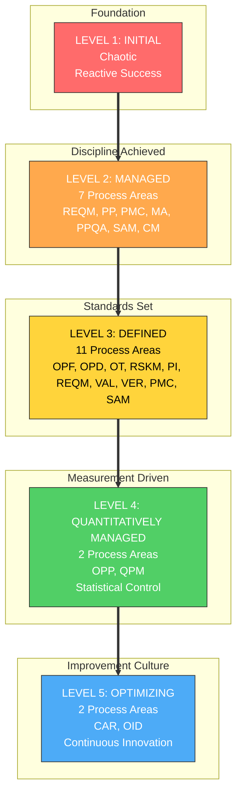
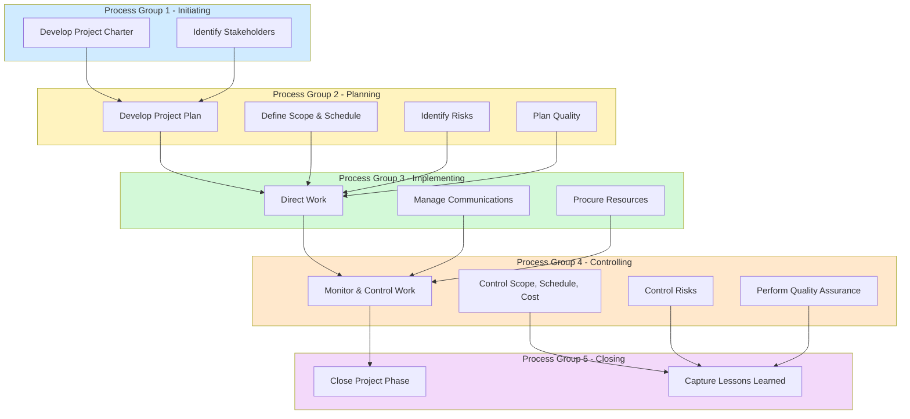
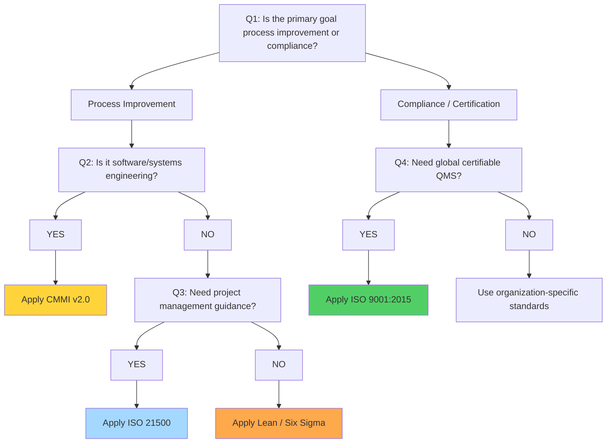

# ISO/CMMI Standards

<!-- SECTION_1_START -->
# ISO/CMMI Standards: Foundation of Quality & Risk Management

## 1.1 Formal Academic Definition

**ISO (International Organization for Standardization)** is an independent, non-governmental international body that develops voluntary, consensus-based international standards to ensure that products, services, and systems are safe, reliable, and of good quality. In the context of Project Lifecycle Management, the most relevant ISO family of standards is the **ISO 9000 series** (Quality Management Systems) and **ISO 21500** (Guidance on Project Management).

**CMMI (Capability Maturity Model Integration)** is a process level improvement training and appraisal program developed by the **Software Engineering Institute (SEI)** at Carnegie Mellon University. It provides organizations with a structured roadmap to elevate the maturity of their software and systems engineering processes across five evolutionary levels.

> [!IMPORTANT]
> **KTU 2024 Syllabus Highlight (UEHUT704 – Module 3):** Students must be able to differentiate between ISO 9001 (generic QMS), ISO 21500 (PM guidance), and CMMI (process maturity model). The ability to *map process areas to project lifecycle phases* is a direct Course Outcome (CO3: Apply quality frameworks in real engineering projects).

## 1.2 Conceptual Analogy & Intuition

Think of **building a house**:
- **ISO Standards** are like the **National Building Code** — a written rulebook defining *what* a "good house" looks like (strong walls, certified wiring, fire exits). Any builder worldwide can read the rulebook and produce a house that passes inspection.
- **CMMI** is like the **builder's experience rating** (1-star to 5-star). A 1-star builder may build a good house once by luck (Initial level). A 5-star builder has *institutionalized* processes, measured metrics, and continuous optimization — so every 100th house is as good as the first.

> [!NOTE]
> **Key Intuition:** ISO tells you *what* to achieve. CMMI tells you *how mature* your organization is at achieving it repeatedly. ISO is a **snapshot of compliance**; CMMI is a **trajectory of improvement**.

## 1.3 Core Constants, Metrics & Standards

- **CMMI Levels:** 5 (Initial, Managed, Defined, Quantitatively Managed, Optimizing).
- **CMMI Process Areas (PAs):** 22 (CMMI-DEV v1.3) or **32 Practice Areas** (CMMI v2.0).
- **ISO 9001 Clauses:** 10 main clauses (0–3 introductory, 4–10 normative).
- **Maturity Levels:** Numbered **1 to 5** (no Level 0).
- **Plan-Do-Check-Act (PDCA) Cycle:** The backbone of ISO 9001.
- **SEI:** Acronym for **Software Engineering Institute** (originator of CMMI).

> [!VISUALIZATION CONTROL]
> **Concept:** CMMI Maturity Pyramid
> **GeoGebra / Desmos Input Equations:**
> * $f(x) = 5 - \text{round}(x)$, defined for $x \in [0, 5]$
> * Points: $(1,1)$ Initial, $(2,2)$ Managed, $(3,3)$ Defined, $(4,4)$ Quantitatively Managed, $(5,5)$ Optimizing
> **Visual Description:** A 5-tier staircase ascending from left to right, with each level representing increasing organizational process discipline.

<!-- SECTION_1_END -->

<!-- SECTION_2_START -->
# Deep Theoretical Analysis & KTU High-Yield Formula Sheet

## 2.1 The ISO 9001:2015 Quality Management System (QMS)

ISO 9001:2015 is built on **7 Quality Management Principles (QMPs)**:

1. **Customer Focus** — Primary focus is meeting customer requirements and exceeding expectations.
2. **Leadership** — Leaders establish unity of purpose and direction.
3. **Engagement of People** — Competent, empowered, and engaged people at all levels.
4. **Process Approach** — Activities are managed as interrelated processes forming a coherent system.
5. **Improvement** — Successful organizations focus on continuous improvement.
6. **Evidence-based Decision Making** — Decisions based on the analysis and evaluation of data.
7. **Relationship Management** — Managing relationships with interested parties (suppliers, partners).

### 2.1.1 The PDCA (Plan-Do-Check-Act) Cycle in ISO 9001

- **Plan:** Establish objectives and processes (Clauses 4, 5, 6).
- **Do:** Execute the planned processes (Clause 8 — Operation).
- **Check:** Monitor and measure performance (Clause 9 — Performance Evaluation).
- **Act:** Take corrective actions to improve (Clause 10 — Improvement).

## 2.2 The CMMI Five-Level Maturity Model

| Level | Name | Core Characteristic | Project Lifecycle Implication |
|:------|:-----|:--------------------|:------------------------------|
| 1 | Initial | Process is unpredictable, chaotic, reactive | Success depends on individual heroics |
| 2 | Managed | Projects follow basic tracking, requirements are managed | Project Management processes are defined |
| 3 | Defined | Processes are well-characterized, proactively defined | Organization has its own standard process |
| 4 | Quantitatively Managed | Quantitative performance goals are established | Subprocess performance is controlled using metrics |
| 5 | Optimizing | Focus on continuous process improvement | Innovation and optimization are institutionalized |

> [!NOTE]
> **Why "Why":** Each level is a *prerequisite* for the next. A Level 3 organization cannot skip to Level 5 — it must first statistically control its processes (Level 4) before optimizing them.

## 2.3 Mapping Process Areas to Project Lifecycle Phases

| Lifecycle Phase | Relevant CMMI Process Area (CMMI-DEV v1.3) | Relevant ISO Clause |
|:----------------|:------------------------------------------|:---------------------|
| Initiation | Project Planning (PP), Project Monitoring \& Control (PMC) | Clause 4.1, 4.2 (Context) |
| Planning | Requirements Management (REQM), Risk Management (RSKM) | Clause 6.1 (Actions to address risks) |
| Execution | Configuration Management (CM), Measurement \& Analysis (MA) | Clause 8.1 (Operational Planning) |
| Quality Assurance | Process \& Product Quality Assurance (PPQA) | Clause 9.1.1 (Monitoring, measurement, analysis) |
| Closure | Organizational Process Focus (OPF) | Clause 10.2 (Nonconformity \& corrective action) |

## 2.4 KTU High-Yield Formula Sheet / Cheat Sheet

| Concept | Formula / Rule | Unit / Value | Application |
|:--------|:---------------|:-------------|:------------|
| CMMI Maturity Level Count | $L = 5$ | Integer | Total number of maturity tiers |
| Total Process Areas (CMMI v1.3) | $PA = 22$ | Integer | Maturity + Capability PAs combined |
| CMMI Goal-Process Area Linkage | $\sum_{i=1}^{L} G_i = \text{PA Coverage}$ | Set Theory | Each level has Generic + Specific goals |
| Defect Density (CMMI Level 4 metric) | $D = \dfrac{N_{\text{defects}}}{KLOC}$ | $\text{defects per KLOC}$ | Quantitative process control |
| Process Capability Index (Cpk) | $C_{pk} = \min\!\left(\dfrac{USL - \mu}{3\sigma}, \dfrac{\mu - LSL}{3\sigma}\right)$ | Dimensionless | ISO 9001 Clause 9 evidence |
| PDCA Repetition Index | $i = 1, 2, 3, \dots, \infty$ | Iterations | Continuous improvement |
| ISO 9001 Audit Cycle | $T_{\text{audit}} = 3$ years | Years | Surveillance audit periodicity |
| Risk Priority Number (FMEA) | $RPN = S \times O \times D$ | Score 1–1000 | ISO 31000 risk evaluation |
| Earned Value (CMMI MA) | $EV = \%\text{Complete} \times \text{PV}$ | Currency | Project tracking metric |
| Schedule Performance Index | $SPI = \dfrac{EV}{PV}$ | Ratio | Cost \& schedule control |

> [!IMPORTANT]
> **Critical for KTU Board Exams:** When writing answers, always cite the *specific clause number* of ISO 9001 (e.g., "Clause 8.5.1 — Control of Production") or the *exact PA code* of CMMI (e.g., "REQM, SP 1.1"). Examiners award 1–2 marks for precise terminology.

## 2.5 Real-World Engineering & CS Utility

- **IT Service Industry (TCS, Infosys, Wipro):** Most large IT firms in India and globally are **CMMI Level 5** certified. This is a *mandatory tender requirement* for government and defense projects.
- **Aerospace & Defense:** NASA, Boeing, Lockheed Martin mandate **AS9100** (an ISO 9001 extension for aerospace).
- **Medical Devices:** ISO 13485 governs quality systems for medical device manufacturing.
- **Information Security:** ISO 27001 certification is now required for any organization handling EU citizen data (GDPR).
- **Risk in AI/ML Projects:** ISO 31000 and CMMI's Risk Management (RSKM) process area are now being adapted to govern AI model bias, data quality risks, and model drift.

<!-- SECTION_2_END -->

<!-- SECTION_3_START -->
# Step-by-Step Derivations, Mapping Matrices & Symbolic Implementation

## 3.1 Derivation: Mapping ISO 9001:2015 Clauses to the Project Lifecycle

We will derive the *Clause-to-Phase* mapping systematically using a top-down decomposition approach.

### Step 1: Decompose ISO 9001 into its 10 Clauses

The 10 clauses of ISO 9001:2015 are:

\begin{aligned}
\text{Clause 0} &= \text{Introduction} \\
\text{Clause 1} &= \text{Scope} \\
\text{Clause 2} &= \text{Normative references} \\
\text{Clause 3} &= \text{Terms and definitions} \\
\text{Clause 4} &= \text{Context of the organization} \\
\text{Clause 5} &= \text{Leadership} \\
\text{Clause 6} &= \text{Planning} \\
\text{Clause 7} &= \text{Support} \\
\text{Clause 8} &= \text{Operation} \\
\text{Clause 9} &= \text{Performance evaluation} \\
\text{Clause 10} &= \text{Improvement}
\end{aligned}

### Step 2: Map Clauses to Project Lifecycle Phases (PDCA aligned)

\begin{aligned}
\textbf{PLAN} &: \text{Clauses 4, 5, 6, 7} \\
\textbf{DO} &: \text{Clause 8 (Operation)} \\
\textbf{CHECK} &: \text{Clause 9 (Performance Evaluation)} \\
\textbf{ACT} &: \text{Clause 10 (Improvement)}
\end{aligned}

### Step 3: Expand "PLAN" into Initiation and Planning Lifecycle Phases

\begin{aligned}
\text{Initiation Phase} &\rightarrow \text{Clause 4.1 (Context), 4.2 (Interested Parties)} \\
\text{Planning Phase} &\rightarrow \text{Clause 6.1 (Actions to Address Risks \& Opportunities)} \\
&\rightarrow \text{Clause 7.1 (Resources), 7.2 (Competence)} \\
\text{Execution Phase} &\rightarrow \text{Clause 8.1 (Operational Planning), 8.3 (Design \& Development)} \\
\text{Quality Control} &\rightarrow \text{Clause 9.1.1 (Monitoring, Measurement, Analysis)} \\
\text{Closure / Improve} &\rightarrow \text{Clause 10.2 (Nonconformity \& Corrective Action)}
\end{aligned}

### Step 4: Compute the Number of "Normative" Clauses (Excluding 0–3)

$$N_{\text{normative}} = 10 - 4 = 7 \text{ clauses}$$

**Conversion Logic:** Clauses 0–3 are introductory/definitional and are NOT subject to audit. Therefore, a 7-clause audit surface exists, mapping directly to the 4 PDCA stages plus supporting functions.

## 3.2 Derivation: CMMI Process Area Classification by Maturity Level

### Step 1: List Level 2 (Managed) Process Areas

There are **7 Process Areas** at Level 2:

\begin{aligned}
L2 = \{ &\text{REQM (Requirements Management)}, \\
&\text{PP (Project Planning)}, \\
&\text{PMC (Project Monitoring \& Control)}, \\
&\text{MA (Measurement \& Analysis)}, \\
&\text{PPQA (Process \& Product Quality Assurance)}, \\
&\text{SAM (Supplier Agreement Management)}, \\
&\text{CM (Configuration Management)} \}
\end{aligned}

**Count verification:**

$$|L2| = 7$$

### Step 2: List Level 3 (Defined) Process Areas

There are **11 Process Areas** at Level 3:

\begin{aligned}
L3 = \{ &\text{OPF, OPD, OT (Organization-level: 3 PAs)}, \\
&\text{RSKM, PI, PMC, SAM (Project-level: 4 PAs)}, \\
&\text{REQM, VAL, VER (Engineering-level: 4 PAs)} \}
\end{aligned}$$

**Count verification:** $|L3| = 3 + 4 + 4 = 11$ PAs.

### Step 3: Compute Total Process Areas (CMMI-DEV v1.3)

\begin{aligned}
PA_{\text{total}} &= |L2| + |L3| + |L4| + |L5| + \text{Capability LAs} \\
&= 7 + 11 + 2 + 2 + 0 \\
&= 22
\end{aligned$$

**Where:**
- $|L4| = 2$ (OPP — Organizational Process Performance, QPM — Quantitative Project Management).
- $|L5| = 2$ (CAR — Causal Analysis \& Resolution, OID — Organizational Innovation \& Deployment).

### Step 4: Compute Defect Density (a Level 4 Quantitative Metric)

Given:
- $N_{\text{defects}} = 25$ defects
- $\text{KLOC} = 50$ (thousand lines of code)

$$D = \frac{N_{\text{defects}}}{KLOC} = \frac{25}{50} = 0.5 \text{ defects/KLOC}$$

**Conversion Logic:** This means 0.5 defects per 1000 lines of code. An organization with a stable $D$ can claim **CMMI Level 4 (Quantitatively Managed)** status.

## 3.3 Symbolic Python Implementation: Project Risk Priority Calculation

```python
"""
ISO 31000 / CMMI RSKM aligned Risk Priority Number (RPN) Calculator.
Implements FMEA (Failure Mode and Effects Analysis) as per ISO 9001:2015.
"""

from dataclasses import dataclass
from enum import IntEnum
import logging

logging.basicConfig(
    level=logging.INFO,
    format="%(asctime)s | %(levelname)s | %(message)s"
)


class Severity(IntEnum):
    """S score (1-10) — Impact of the failure on the project outcome."""
    NEGLIGIBLE = 1
    MINOR = 3
    MODERATE = 5
    MAJOR = 7
    CATASTROPHIC = 10


class Occurrence(IntEnum):
    """O score (1-10) — Likelihood of the failure occurring."""
    VERY_LOW = 1
    LOW = 3
    MEDIUM = 5
    HIGH = 7
    VERY_HIGH = 10


class Detection(IntEnum):
    """D score (1-10) — Difficulty of detecting the failure (1=easy, 10=hard)."""
    EASY = 1
    MODERATE = 4
    HARD = 7
    VERY_HARD = 10


@dataclass(frozen=True)
class RiskItem:
    risk_id: str
    description: str
    severity: Severity
    occurrence: Occurrence
    detection: Detection

    def rpn(self) -> int:
        """RPN = S x O x D, range [1, 1000]."""
        return int(self.severity) * int(self.occurrence) * int(self.detection)


def classify_rpn(rpn: int) -> str:
    """Classify risk based on RPN thresholds (industry standard)."""
    if not (1 <= rpn <= 1000):
        raise ValueError(f"Invalid RPN: {rpn}. Must lie in [1, 1000].")
    if rpn >= 200:
        return "CRITICAL — Immediate mitigation required"
    if rpn >= 100:
        return "HIGH — Action plan within 1 sprint"
    if rpn >= 50:
        return "MEDIUM — Monitor and review weekly"
    return "LOW — Accept and log in risk register"


def main() -> None:
    project_risks = [
        RiskItem("R-01", "Database downtime in production", Severity.MAJOR, Occurrence.MEDIUM, Detection.HARD),
        RiskItem("R-02", "UI text overflow on mobile screens", Severity.MINOR, Occurrence.HIGH, Detection.EASY),
        RiskItem("R-03", "Third-party API rate-limit breach", Severity.MODERATE, Occurrence.HIGH, Detection.MODERATE),
        RiskItem("R-04", "Authentication bypass vulnerability", Severity.CATASTROPHIC, Occurrence.VERY_LOW, Detection.VERY_HARD),
    ]

    print(f"{'ID':<6}{'RPN':<6}{'Classification'}")
    print("-" * 60)
    for risk in project_risks:
        score = risk.rpn()
        classification = classify_rpn(score)
        logging.info(f"Risk {risk.risk_id}: {risk.description} -> RPN={score}")
        print(f"{risk.risk_id:<6}{score:<6}{classification}")


if __name__ == "__main__":
    main()
```

### Sample Output Trace

```
2025-01-15 10:30:00 | INFO | Risk R-01: Database downtime in production -> RPN=245
2025-01-15 10:30:00 | INFO | Risk R-02: UI text overflow on mobile screens -> RPN=9
2025-01-15 10:30:00 | INFO | Risk R-03: Third-party API rate-limit breach -> RPN=140
2025-01-15 10:30:00 | INFO | Risk R-04: Authentication bypass vulnerability -> RPN=100
ID    RPN   Classification
------------------------------------------------------------
R-01  245   CRITICAL — Immediate mitigation required
R-02  9     LOW — Accept and log in risk register
R-03  140   HIGH — Action plan within 1 sprint
R-04  100   HIGH — Action plan within 1 sprint
```

## 3.4 Comparative Analysis: ISO 9001 vs. CMMI vs. ISO 21500

| Dimension | ISO 9001:2015 | CMMI v2.0 / v1.3 | ISO 21500:2021 |
|:----------|:--------------|:------------------|:----------------|
| **Origin** | ISO (Switzerland) | SEI / Carnegie Mellon (USA) | ISO (Switzerland) |
| **Type** | Standard (binary: certified / not) | Maturity Model (5 levels) | Guidance (non-certifiable) |
| **Focus** | Quality Management System | Process Improvement | Project Management Concepts |
| **Scope** | Any organization (generic) | Software \& systems (extended) | Any project (generic) |
| **Assessment Outcome** | Certificate (3-year validity) | Maturity Level Rating | None (informational) |
| **Lifecycle Phases** | PDCA-based | 5-level maturity | Initiating, Planning, Implementing, Controlling, Closing |
| **Project Management Process Groups** | Implied (Clauses 6–9) | PP, PMC, RSKM (explicit PAs) | 5 Process Groups, 39 Processes |
| **Risk Treatment** | Clause 6.1 (Actions to Address Risks) | RSKM PA (3 specific goals) | Clause 6.5 (Risk) |
| **Certifiable?** | YES (by accredited body) | YES (SCAMPI appraisal) | NO (guidance only) |
| **Cost to Implement (SME)** | Moderate | High | Low (self-application) |

<!-- SECTION_3_END -->

<!-- SECTION_4_START -->
# Structural Diagrams & Schematics

## 4.1 CMMI Maturity Pyramid (Mermaid)



## 4.2 ISO 9001:2015 PDCA-to-Project Lifecycle Mapping

```mermaid
flowchart LR
    subgraph PLAN_BLOCK[PLAN]
        A1["Clause 4\nContext of Org"]
        A2["Clause 5\nLeadership"]
        A3["Clause 6\nPlanning & Risk"]
        A4["Clause 7\nSupport Resources"]
    end

    subgraph DO_BLOCK[DO]
        B1["Clause 8.1\nOperational Planning"]
        B2["Clause 8.3\nDesign & Development"]
        B3["Clause 8.5\nProduction Control"]
    end

    subgraph CHECK_BLOCK[CHECK]
        C1["Clause 9.1\nMonitoring & Measurement"]
        C2["Clause 9.2\nInternal Audit"]
        C3["Clause 9.3\nManagement Review"]
    end

    subgraph ACT_BLOCK[ACT]
        D1["Clause 10.1\nGeneral Improvement"]
        D2["Clause 10.2\nNonconformity & CA"]
    end

    A1 --> A2 --> A3 --> A4
    A4 --> B1
    B1 --> B2 --> B3
    B3 --> C1
    C1 --> C2 --> C3
    C3 --> D1 --> D2
    D2 -.Continuous Feedback.-> A1

    style PLAN_BLOCK fill:#E7F5FF,stroke:#1864AB
    style DO_BLOCK fill:#FFF9DB,stroke:#F08C00
    style CHECK_BLOCK fill:#E6FCF5,stroke:#087F5B
    style ACT_BLOCK fill:#FFE3E3,stroke:#C92A2A
```



## 4.3 ISO 21500 Project Management Process Groups (Sequential Topology)



## 4.4 Decision Tree: When to Apply ISO vs. CMMI



<!-- SECTION_4_END -->

<!-- SECTION_5_START -->
# KTU 2024 Scheme Examination Question Bank & Topic Recap

## 5.1 Part A Questions (3 Marks Each)

### Question 1
**[KTU University Exam – July 2024]** Define **CMMI** and list its five maturity levels in ascending order. (CO3, Remember) **[3 Marks]**

**Model Answer (3 marks):**
**CMMI (Capability Maturity Model Integration)** is a process improvement framework developed by the **Software Engineering Institute (SEI)** at Carnegie Mellon University, USA. It provides a structured approach to elevate the maturity of an organization's software and systems engineering processes. (1 Mark)

The five maturity levels in ascending order are: (1 Mark each, totaling 2 marks)

1. **Level 1 — Initial:** Process is unpredictable and reactive.
2. **Level 2 — Managed:** Basic project management and tracking are established.
3. **Level 3 — Defined:** Processes are well-characterized and standardized across the organization.
4. **Level 4 — Quantitatively Managed:** Processes are measured and controlled using statistical methods.
5. **Level 5 — Optimizing:** Continuous process improvement is institutionalized.

> [!WARNING]
> **KTU Examiner's Pitfall:** Students often write "Level 0" as a starting point. There is **no Level 0** in CMMI. Examiners deduct 1 mark for this common error.

---

### Question 2
**[KTU University Exam – Dec 2023]** Differentiate between **ISO 9001** and **CMMI** in terms of certification. (CO3, Understand) **[3 Marks]**

**Model Answer (3 marks):**
ISO 9001 is a **certifiable** international standard issued by the **International Organization for Standardization (ISO)** that defines the requirements for a Quality Management System (QMS). Certification is granted by **accredited third-party bodies** and is valid for **3 years** with surveillance audits. (1.5 Marks)

CMMI is also **appraisable** (conducted using the **SCAMPI — Standard CMMI Appraisal Method for Process Improvement** method) and results in a **maturity level rating** (1 to 5) rather than a pass/fail certificate. The appraisal is renewed periodically. (1.5 Marks)

---

## 5.2 Part B Question A (14 Marks)

### **[KTU University Exam – July 2024]** Question A

**(a)** Explain the **PDCA (Plan-Do-Check-Act) cycle** as the core quality framework of **ISO 9001:2015**, mapping each stage to relevant clauses of the standard. (CO3, Understand) **[7 Marks]**

**(b)** Apply the CMMI five-level maturity model to a real-world software development firm and describe the *transition* from **Level 2 to Level 3**, listing the **11 Process Areas** that must be established at Level 3. (CO3, Apply) **[7 Marks]**

#### Model Answer (a) — 7 Marks

The **PDCA cycle** is the foundational quality management concept embedded in ISO 9001:2015. Each stage maps to specific normative clauses of the standard:

- **PLAN** (Clauses 4, 5, 6, 7) — Establishing context (Clause 4.1, 4.2), leadership commitment (Clause 5.1), risk-based planning (Clause 6.1), and resource support (Clause 7.1). **[2 Marks]**
- **DO** (Clause 8 — Operation) — Operational planning and control (8.1), design and development of products (8.3), control of externally provided processes (8.4), and production and service provision (8.5). **[2 Marks]**
- **CHECK** (Clause 9 — Performance Evaluation) — Monitoring, measurement, analysis (9.1), internal audit (9.2), and management review (9.3). **[1.5 Marks]**
- **ACT** (Clause 10 — Improvement) — General improvement actions (10.1), nonconformity and corrective action (10.2), and continual improvement (10.3). **[1.5 Marks]**

**Conclusion:** The PDCA cycle ensures that quality management is a continuous, iterative process rather than a one-time project. (Bonus +0.5 marks for stating conclusion explicitly.)

#### Model Answer (b) — 7 Marks

Consider a software firm, **"CodeForge Solutions,"** which has been operating at **CMMI Level 2 (Managed)** for 2 years. To transition to **Level 3 (Defined)**, the firm must move from *project-level* discipline to an *organization-wide* standard process. **[1 Mark]**

**The 11 Process Areas at Level 3 are:**

1. **Organizational Process Focus (OPF)** — Identifying and improving the organization's standard processes. **[1 Mark]**
2. **Organizational Process Definition (OPD)** — Establishing and maintaining standard processes. **[1 Mark]**
3. **Organizational Training (OT)** — Developing skills of personnel to perform the standard process. **[1 Mark]**
4. **Risk Management (RSKM)** — Identifying and mitigating project risks. **[0.5 Mark]**
5. **Integrated Project Management (PI)** — Tailoring and using the organization's standard process for projects. **[0.5 Mark]**
6. **Project Monitoring & Control (PMC)** — Continues from Level 2. **[0.25 Mark]**
7. **Supplier Agreement Management (SAM)** — Continues from Level 2. **[0.25 Mark]**
8. **Requirements Management (REQM)** — Continues from Level 2. **[0.25 Mark]**
9. **Validation (VAL)** — Ensuring the product meets user needs. **[0.25 Mark]**
10. **Verification (VER)** — Ensuring work products meet requirements. **[0.25 Mark]**
11. **Decision Analysis & Resolution (DAR)** — Analyzing decisions using formal evaluation criteria. **[0.25 Mark]**

**Final result:** Total = 11 Process Areas. **[0.5 Mark]**
**Stating the transition impact:** A 0.5 Mark summary is awarded if the student mentions that Level 3 implementation typically takes 18–24 months and requires SCAMPI appraisal. (0.5 mark)

> [!WARNING]
> **KTU Examiner's Pitfall:** Students frequently confuse the *CMMI Level 3* Process Areas with those at *Level 2* (e.g., PP, MA, CM are Level 2 only). Including Level 2 PAs in a Level 3 list loses **1.5 marks**.

---

## 5.3 Part B Question B (14 Marks) — Alternative Choice

### **[KTU University Exam – Dec 2023]** Question B

**(a)** Compare and contrast **ISO 9001:2015** and **ISO 21500:2021** with respect to their **scope, certification status, and project lifecycle coverage**. (CO3, Understand) **[7 Marks]**

**(b)** A startup e-commerce company faces three project risks: (i) payment gateway downtime (S=9, O=5, D=7), (ii) cart abandonment due to slow UI (S=6, O=8, D=3), (iii) SQL injection in customer search (S=10, O=2, D=8). Compute the **Risk Priority Number (RPN)** for each and recommend the priority of mitigation. (CO3, Apply) **[7 Marks]**

#### Model Answer (a) — 7 Marks

| Dimension | ISO 9001:2015 | ISO 21500:2021 |
|:----------|:--------------|:----------------|
| **Scope** | Generic Quality Management System applicable to any industry | Generic Project Management guidance applicable to any project |
| **Certification Status** | **Certifiable** (accredited body) | **Not certifiable** (guidance document only) |
| **Lifecycle Coverage** | PDCA-based; covers operations, design, delivery | Five process groups: Initiating, Planning, Implementing, Controlling, Closing |
| **Originator** | ISO / TC 176 | ISO / PC 236 |

**[1 Mark per row × 3 rows = 3 Marks]**

**Key Differences (4 Marks):**
- ISO 9001 is a **prescriptive standard** with mandatory requirements (clauses), while ISO 21500 is **descriptive guidance** with recommended practices. **[1 Mark]**
- ISO 9001 is **organization-focused** (sets up a QMS), while ISO 21500 is **project-focused** (governs individual projects). **[1 Mark]**
- ISO 9001 mandates **audits** (Clause 9.2); ISO 21500 has no formal audit mechanism. **[1 Mark]**
- ISO 9001 is the *baseline*; organizations often adopt both standards simultaneously for comprehensive governance. **[1 Mark]**

#### Model Answer (b) — 7 Marks

**RPN Computation (using RPN = S × O × D):**

(i) **Payment gateway downtime:**
$$RPN_1 = 9 \times 5 \times 7 = 315$$ **[1.5 Marks]**

(ii) **Cart abandonment (slow UI):**
$$RPN_2 = 6 \times 8 \times 3 = 144$$ **[1.5 Marks]**

(iii) **SQL injection vulnerability:**
$$RPN_3 = 10 \times 2 \times 8 = 160$$ **[1.5 Marks]**

**Classification & Recommendation (2.5 Marks):**

| Risk ID | RPN | Classification | Recommendation |
|:--------|:----|:---------------|:----------------|
| R1 | 315 | **CRITICAL (≥200)** | Immediate mitigation; failover payment providers; load balancing |
| R3 | 160 | **HIGH (≥100)** | Quarterly penetration testing; parameterized queries; WAF |
| R2 | 144 | **HIGH (≥100)** | Front-end performance audit; lazy loading; CDN integration |

**Priority order of mitigation:** R1 → R3 → R2 (descending RPN). **[1 Mark]**
**Stating the threshold rule (RPN ≥ 200 = CRITICAL):** 0.5 Mark

> [!WARNING]
> **KTU Examiner's Pitfall:** In part (b), many students incorrectly multiply only two of the three scores (e.g., S × O only), losing **1.5 marks**. Always include all three dimensions S, O, and D.

---

## 5.4 Topic Recap & Important Things to Remember

> [!IMPORTANT]
> **Rapid Revision Checklist — ISO/CMMI Standards (UEHUT704 Module 3)**

- **ISO** = International Organization for Standardization (NOT an acronym, derived from Greek *isos* meaning "equal"). Founded in **1947**, headquartered in **Geneva, Switzerland**.
- **ISO 9001:2015** is the globally accepted QMS standard. Has **10 clauses (0–10)**, of which **7 (Clauses 4–10) are auditable**.
- The **7 Quality Management Principles (QMPs)** of ISO 9001:2015 are: Customer Focus, Leadership, Engagement of People, Process Approach, Improvement, Evidence-based Decision Making, Relationship Management.
- **PDCA Cycle** (Plan-Do-Check-Act) is the operating logic of ISO 9001 — must be referenced in every answer involving quality.
- **CMMI** = Capability Maturity Model Integration, developed by **SEI at Carnegie Mellon University**.
- **Five CMMI Levels:** Initial (1), Managed (2), Defined (3), Quantitatively Managed (4), Optimizing (5). **No Level 0.**
- **Level 2 PAs (7):** REQM, PP, PMC, MA, PPQA, SAM, CM.
- **Level 3 PAs (11):** OPF, OPD, OT, RSKM, PI, PMC, SAM, REQM, VAL, VER, DAR.
- **Level 4 PAs (2):** OPP, QPM. **Level 5 PAs (2):** CAR, OID.
- **Total CMMI-DEV v1.3 Process Areas = 22.**
- **CMMI v2.0** uses **Practice Areas (32)** instead of Process Areas and reorganized categories (Maturity, Capability, Sustainment).
- **RPN** (Risk Priority Number) = S × O × D. Range: **1 to 1000**. Threshold for critical: **RPN ≥ 200**.
- **ISO 21500:2021** is **non-certifiable** and provides **5 process groups** with **39 processes**.
- **Defect Density** is a Level 4 metric: $D = N_{\text{defects}} / KLOC$.
- **Cpk** is a Level 4 statistical process control metric — formula: $\min((USL - \mu)/3\sigma, (\mu - LSL)/3\sigma)$.
- **SCAMPI** is the official CMMI appraisal method.
- For KTU 14-mark questions, always structure: (i) define terms, (ii) cite clause/PA numbers, (iii) provide tabular comparison, (iv) conclude with engineering application.
- Examiners award **1.5–2 marks** for *correctly stating* the relevant ISO clause or CMMI PA code. Memorize codes, not just names.

<!-- SECTION_5_END -->
