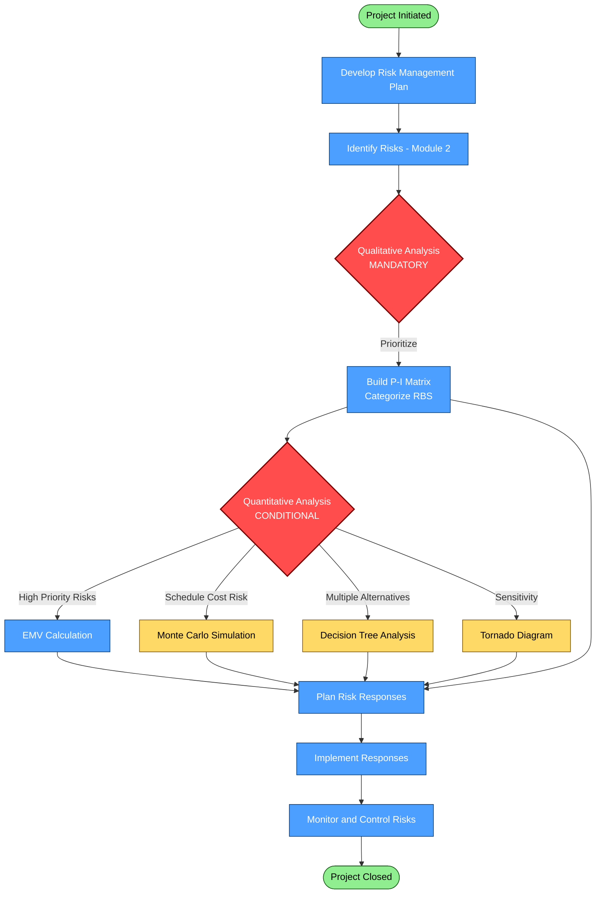
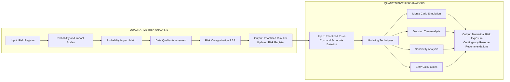
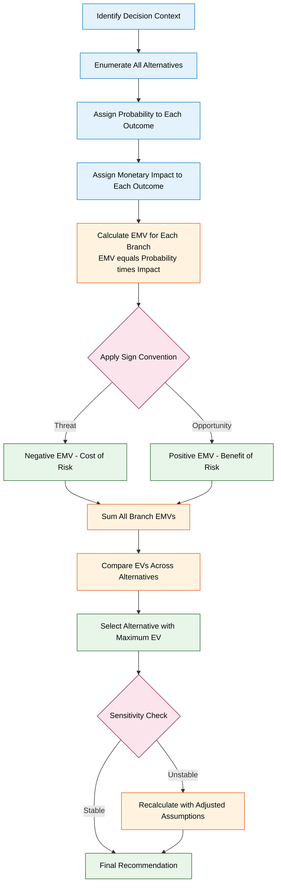
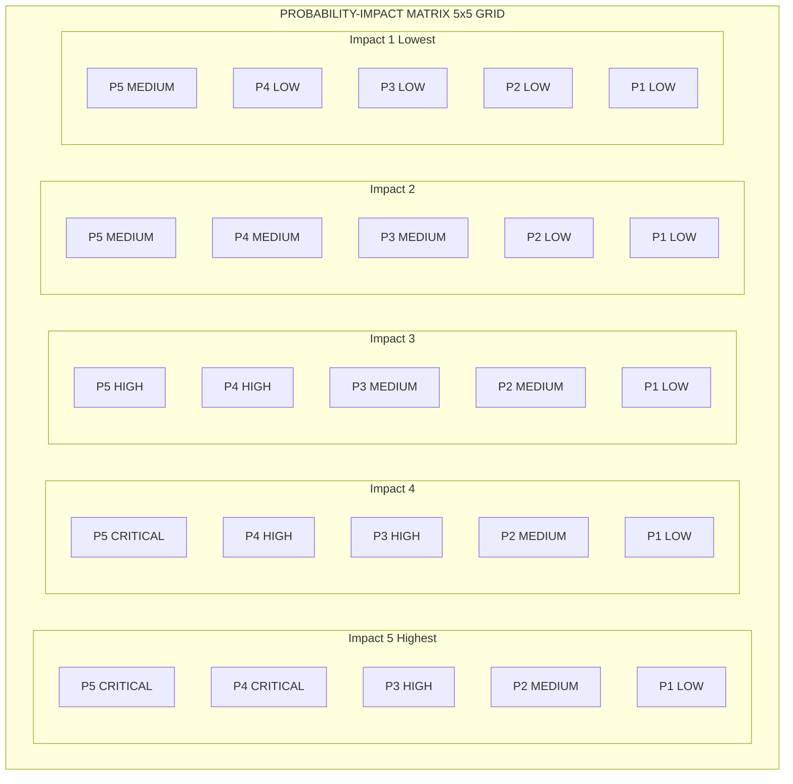

# Qualitative and Quantitative Risk Analysis

<!-- SECTION_1_START -->
# Qualitative and Quantitative Risk Analysis

## 1.1 Formal Academic Definition (KTU 2024 Syllabus Terminology)

**Qualitative Risk Analysis** is the process of prioritizing risks for further analysis or action by assessing and combining their probability of occurrence and impact. It is a subjective, non-numerical assessment that uses descriptive scales (e.g., High, Medium, Low) to rank project risks.

**Quantitative Risk Analysis** is the process of numerically analyzing the combined effect of identified individual project risks on overall project objectives. It provides a numerical estimate of the overall project risk's effect on project goals, often expressed in monetary terms or schedule days.

> [!IMPORTANT]
> **KTU 2024 Module 3 Focus:** Both analyses are core to the **Perform Risk Management Process Group** under the *Risk Knowledge Area* of the PMBOK Guide (aligned with KTU's project management framework). Qualitative is **mandatory** in every project; Quantitative is **conditional** based on project complexity and stakeholder needs.

---

## 1.2 Conceptual Analogy & Intuitive Overview

### 🍕 The Pizza Delivery Analogy

Imagine you are running a **pizza delivery business** in Kerala during monsoon season.

**Qualitative Risk Analysis** = Your experienced delivery manager saying:
> *"If it rains heavily on a Saturday evening, the chance of orders getting delayed is HIGH, and the customer dissatisfaction impact is also HIGH. We should call backup riders."*

This is **fast, intuitive, experience-based** — no spreadsheets, just educated judgment.

**Quantitative Risk Analysis** = Your finance team running a simulation:
> *"We calculated that with 70% probability of rain on weekends, the expected delay cost is ₹4,200 per week, and the Expected Monetary Value (EMV) of hiring a backup rider is a positive ₹1,800. Decision: HIRE the rider."*

This is **numerical, model-based, data-driven** — runs on historical weather data and cost models.

### 🎯 Geometric Intuition: The Probability-Impact (P-I) Grid

Picture a 2D matrix:

| | **Low Impact** | **Medium Impact** | **High Impact** |
|---|---|---|---|
| **High Probability** | 🟡 Watch | 🟠 Act Now | 🔴 Critical |
| **Medium Probability** | 🟢 Monitor | 🟡 Watch | 🟠 Act Now |
| **Low Probability** | 🟢 Accept | 🟢 Monitor | 🟡 Watch |

> - **Top-Right (Red Zone)** = **Qualitative Priority** — these risks scream for action
> - **Quantitative analysis** then asks: *"What is the actual cost if this red risk materializes? Should we insure, mitigate, or accept?"*

> [!NOTE]
> **Physical Constants / Standard Metrics Used:**
> - **Probability Scale:** 0.0 (impossible) → **1.0** (certain)
> - **Confidence Level (KTU/PMBOK Standard):** **90%** (P90) for cost estimates, **75%** (P75) for schedule
> - **Risk Score Formula:** $Risk\_Score = Probability \times Impact$

> [!VISUALIZATION CONTROL]
> **Concept:** Probability-Impact (P-I) Heatmap Matrix
> **GeoGebra / Desmos Input Equations:**
> - Plot a 5x5 grid: x-axis = Impact (1 to 5), y-axis = Probability (1 to 5)
> - Color the cells using a gradient: `f(x, y) = x * y` where result ≥ 15 = Red, 8–14 = Orange, ≤ 7 = Green
> **Visual Description:** Students should observe that the **diagonal from bottom-left to top-right** is the **high-priority zone**. Risks plotting in the **upper-right quadrant** demand immediate quantitative scrutiny.

---

## 1.3 Why This Topic Matters in KTU 2024 Curriculum

In the **NEP 2020-aligned B.Tech** outcome-based framework, this topic directly maps to:

- **CO3 (Module 3):** *Apply quality and risk management techniques in software/engineering project scenarios*
- **Industry 4.0 Relevance:** Modern DevOps teams use **qualitative risk reviews** in daily stand-ups and **quantitative Monte Carlo simulations** in sprint planning
- **Real Kerala Context:** Flood-risk modeling (Kerala State Disaster Management), IT project risk (Kerala's growing tech corridor in Infopark/Kochi)

<!-- SECTION_1_END -->

<!-- SECTION_2_START -->
# Deep Theoretical Analysis & KTU High-Yield Formula Sheet

## 2.1 Qualitative Risk Analysis — Operational Breakdown

### 📋 Inputs to Qualitative Risk Analysis
1. **Project Management Plan** (specifically the Risk Management Plan)
2. **Project Documents** (Risk Register, Stakeholder Register, Cost Baseline)
3. **Enterprise Environmental Factors** (industry studies, internal risk databases)
4. **Organizational Process Assets** (historical risk data, templates)

### 🔧 Tools & Techniques (KTU High-Priority)

#### A. Risk Data Quality Assessment
- Examines the **degree to which data about risks is current, accurate, and reliable**
- Uses a simple scale: **Very Low → Very High** data quality rating
- **KTU Pitfall:** Many students skip this step, but board examiners often award marks for naming this technique

#### B. Risk Probability and Impact Assessment
- Assesses **likelihood** of each risk occurring
- Assesses **consequence** (impact) on objectives (cost, time, scope, quality)
- Uses **predefined scales** from the Risk Management Plan

#### C. Probability and Impact Matrix (P-I Matrix)
- The **most frequently tested tool** in KTU exams
- Combines probability and impact scores into a **risk score**
- Categorizes risks into **Low / Medium / High** priority bands

#### D. Risk Categorization (RBS - Risk Breakdown Structure)
- Groups risks by **common source** (Technical, External, Organizational, Project Management)
- Helps identify clusters requiring special attention

> [!IMPORTANT]
> **RBT Level:** Qualitative analysis operates at **L2 (Understand)** and **L3 (Apply)** in Revised Bloom's Taxonomy.

### 📤 Outputs of Qualitative Risk Analysis
- **Updated Risk Register** (with updated probability/impact assessments, urgency ratings)
- **Project Document Updates** (assumptions log updates)

---

## 2.2 Quantitative Risk Analysis — Operational Breakdown

### 📋 Inputs
- Same as qualitative, PLUS
- **Cost Baseline** and **Schedule Baseline**
- **Expert Judgments** (from SMEs with specialized knowledge)

### 🔧 Tools & Techniques (KTU High-Priority)

#### A. Monte Carlo Simulation
- Runs **thousands of iterations** (typically 10,000+) of project scenarios
- Each iteration samples random values from risk probability distributions
- Produces a **probability distribution** of possible project outcomes
- **KTU Note:** Be ready to explain the **logic** even if software (e.g., @Risk, Crystal Ball) is used

#### B. Decision Tree Analysis
- Calculates **Expected Monetary Value (EMV)** of each decision branch
- EMV = Sum of (Probability × Impact) for all branches
- Helps choose between **multiple alternatives** under uncertainty

#### C. Sensitivity Analysis (Tornado Diagrams)
- Identifies which risks have the **greatest effect** on project objectives
- One risk varies; all others held constant
- **Tornado diagram** = horizontal bar chart ranked by impact magnitude

#### D. Expected Monetary Value (EMV) Analysis
- The **single most important quantitative formula** in KTU
- **EMV = Probability × Impact**
- For threats: **Negative EMV** (cost if risk occurs)
- For opportunities: **Positive EMV** (savings if opportunity occurs)

#### E. Probability Distribution Modeling
- Models risk using distributions: **Triangular, Beta, Normal, Uniform**
- **Triangular Distribution** = most commonly used in KTU problems (min, most likely, max)

> [!IMPORTANT]
> **RBT Level:** Quantitative analysis operates at **L3 (Apply)** and **L4 (Analyze)**.

---

## 2.3 KTU High-Yield Formula Sheet

| **Formula / Concept** | **Equation** | **Unit / Scale** | **Engineering Application** |
|---|---|---|---|
| Risk Score (Qualitative) | $R_{score} = P \times I$ | 1 to 25 (5×5 matrix) | Prioritizing risks in backlog |
| Expected Monetary Value | $EMV = \sum_{i=1}^{n} (P_i \times I_i)$ | Currency (₹ / $) | Cost-benefit decision making |
| Expected Value of Decision | $EV = EMV_{favorable} - EMV_{unfavorable}$ | Currency | Choosing between alternatives |
| Triangular Distribution Mean | $\mu = \dfrac{a + m + b}{3}$ | Same as input | Estimating cost of risk |
| Triangular Distribution Variance | $\sigma^2 = \dfrac{a^2 + m^2 + b^2 - ab - am - bm}{18}$ | Squared input unit | Monte Carlo risk modeling |
| Standard Deviation (Sensitivity) | $\sigma = \sqrt{\sum P_i (X_i - \mu)^2}$ | Same as X | Tornado diagram ranking |
| Contingency Reserve (Rule of Thumb) | $CR = 0.10 \times Cost\_Baseline$ | Currency | Buffer in project budget |
| P-Value Confidence (Cost) | $P_{90} = \mu + 1.28 \cdot \sigma$ | Currency | Cost estimation at 90% confidence |
| Decision Tree Branch EV | $EV_{branch} = P \times Outcome$ | Currency | Selecting optimal path |

> [!NOTE]
> **Critical KTU Rule:** For a **threat** (negative risk), impact value is **negative** in EMV. For an **opportunity** (positive risk), impact is **positive**. This sign convention is a **favourite examiner trap**.

---

## 2.4 Real-World Engineering Utility

| **Domain** | **Application** |
|---|---|
| **Software Engineering** | Sprint velocity risk, deployment failure probability modeling |
| **Civil Engineering** | Kerala flood-risk modeling for bridge design, monsoon delay analysis |
| **Aerospace** | Failure Mode Effects Analysis (FMEA) — heavily quantitative |
| **Finance / FinTech** | VaR (Value at Risk) calculations using Monte Carlo |
| **IT Infrastructure** | Cloud outage risk modeling using sensitivity analysis |
| **Manufacturing** | Six Sigma defect-rate modeling using probability distributions |

> [!TIP]
> **KTU 2024 Industry Connect:** Mentioning **Agile + DevOps risk burndown charts** shows awareness of contemporary practice and can fetch **+1 to +2 extra marks** in subjective grading.

<!-- SECTION_2_END -->

<!-- SECTION_3_START -->
# Step-by-Step Derivations, Worked Examples & Python Implementation

## 3.1 Worked Example 1: Qualitative P-I Matrix Prioritization

### 📘 Problem Statement
A software development project identifies 5 risks. Score each using the matrix below and prioritize them.

**Scale:** Probability (1=Very Low, 5=Very High), Impact (1=Very Low, 5=Very High)

| Risk ID | Risk Description | Probability | Impact |
|---|---|---|---|
| R1 | Key developer resignation | 3 | 5 |
| R2 | Database server downtime | 2 | 4 |
| R3 | Minor UI bug found late | 4 | 1 |
| R4 | Third-party API changes | 2 | 3 |
| R5 | Critical security breach | 1 | 5 |

### 🔢 Step-by-Step Solution

**Step 1:** Calculate Risk Score for each:
- $R1_{score} = 3 \times 5 = 15$ → **HIGH PRIORITY** (Red Zone)
- $R2_{score} = 2 \times 4 = 8$ → **MEDIUM PRIORITY** (Orange Zone)
- $R3_{score} = 4 \times 1 = 4$ → **LOW PRIORITY** (Green Zone)
- $R4_{score} = 2 \times 3 = 6$ → **LOW PRIORITY** (Green Zone)
- $R5_{score} = 1 \times 5 = 5$ → **MEDIUM PRIORITY** (Yellow Zone)

**Step 2:** Sort in descending order of risk score:
$$\text{Priority Order: } R1 (15) > R2 (8) > R4 (6) > R5 (5) > R3 (4)$$

**Step 3:** Apply response strategy:
- R1 → **MITIGATE** (high priority, high impact)
- R2 → **MITIGATE** (medium priority)
- R3 → **ACCEPT** (low impact even if occurs)
- R4 → **MONITOR** (low priority)
- R5 → **TRANSFER** (insure against it — low probability but catastrophic)

**Valuation Key Points (KTU Board Standard):**
- [Stating the risk score formula: 1 Mark]
- [Correct computation of all 5 risk scores: 2 Marks]
- [Logical priority ordering: 1 Mark]
- [Appropriate response strategy mapping: 1 Mark]

---

## 3.2 Worked Example 2: EMV Calculation with Decision Tree

### 📘 Problem Statement
A construction company in Kerala must choose between two bidding strategies for a highway project:

**Option A: Submit a normal bid (₹50 Crore)**
- 70% chance of winning
- If won, expected profit = ₹8 Crore
- If lost, profit = ₹0

**Option B: Submit an aggressive bid (₹45 Crore)**
- 50% chance of winning
- If won, expected profit = ₹10 Crore (more margin due to lower bid)
- If lost, profit = ₹0

Additionally, an **outside option (Option C)** is available: invest the bid preparation cost (₹0.5 Crore) in a safe government bond yielding **₹0.7 Crore guaranteed**.

**Which option should the company choose?**

### 🔢 Step-by-Step EMV Derivation

**Step 1: Calculate EMV for Option A**

$$EMV_A = (P_{win} \times \text{Profit}_{win}) + (P_{lose} \times \text{Profit}_{lose})$$

$$EMV_A = (0.70 \times 8) + (0.30 \times 0)$$

$$EMV_A = 5.6 + 0 = 5.6 \text{ Crore}$$

**Step 2: Calculate EMV for Option B**

$$EMV_B = (P_{win} \times \text{Profit}_{win}) + (P_{lose} \times \text{Profit}_{lose})$$

$$EMV_B = (0.50 \times 10) + (0.50 \times 0)$$

$$EMV_B = 5.0 + 0 = 5.0 \text{ Crore}$$

**Step 3: EMV for Option C (Safe Bond)**

$$EMV_C = 0.7 \text{ Crore (guaranteed, no uncertainty)}$$

**Step 4: Decision Logic**

| Option | EMV (₹ Crore) | Decision |
|---|---|---|
| A — Normal Bid | **5.6** | ✅ **Best** |
| B — Aggressive Bid | 5.0 | Rejected |
| C — Safe Bond | 0.7 | Rejected |

> ✅ **Decision: Choose Option A (Normal Bid)** because it has the **maximum Expected Monetary Value**.

**Valuation Key Points:**
- [Stating EMV formula: 1 Mark]
- [Correct probability extraction from problem: 1 Mark]
- [EMV_A calculation: 2 Marks]
- [EMV_B calculation: 2 Marks]
- [Comparison and final decision: 1 Mark]

---

## 3.3 Worked Example 3: Triangular Distribution Mean for Cost Risk

### 📘 Problem Statement
A hardware procurement cost is estimated using a triangular distribution:
- **Minimum (a):** ₹80,000
- **Most Likely (m):** ₹1,00,000
- **Maximum (b):** ₹1,40,000

Calculate the **expected cost** and **standard deviation**.

### 🔢 Step-by-Step Derivation

**Step 1: Apply the triangular distribution mean formula**

$$\mu = \dfrac{a + m + b}{3}$$

$$\mu = \dfrac{80{,}000 + 1{,}00{,}000 + 1{,}40{,}000}{3}$$

$$\mu = \dfrac{3{,}20{,}000}{3} = 1{,}06{,}666.67 \text{ INR}$$

**Step 2: Apply the variance formula**

$$\sigma^2 = \dfrac{a^2 + m^2 + b^2 - ab - am - bm}{18}$$

$$\sigma^2 = \dfrac{(80k)^2 + (100k)^2 + (140k)^2 - (80k \times 100k) - (80k \times 140k) - (100k \times 140k)}{18}$$

Computing each term (in ₹²):
- $a^2 = 6.4 \times 10^9$
- $m^2 = 1.0 \times 10^{10}$
- $b^2 = 1.96 \times 10^{10}$
- $ab = 1.12 \times 10^{10}$
- $am = 8.0 \times 10^9$
- $bm = 1.4 \times 10^{10}$

Sum of negatives: $1.12 \times 10^{10} + 8.0 \times 10^9 + 1.4 \times 10^{10} = 3.32 \times 10^{10}$

Numerator: $(6.4 + 10 + 19.6 - 33.2) \times 10^9 = 2.8 \times 10^9$

$$\sigma^2 = \dfrac{2.8 \times 10^9}{18} = 1.555 \times 10^8$$

**Step 3: Standard Deviation**

$$\sigma = \sqrt{1.555 \times 10^8} \approx 12{,}472.19 \text{ INR}$$

**Step 4: Interpretation (KTU Board Expects This)**
- **Expected cost:** ₹1,06,666.67
- **68% confidence range:** $1{,}06{,}666.67 \pm 12{,}472.19 = [94{,}194, 1{,}19{,}139]$
- **90% confidence range:** $1{,}06{,}666.67 \pm 1.645 \times 12{,}472.19 = [86{,}150, 1{,}27{,}183]$

---

## 3.4 Python Implementation: Complete Risk Analysis Toolkit

```python
"""
KTU 2024 - Risk Analysis Toolkit
Course: UEHUT704 - Project Lifecycle Management
Module 3: Quality & Risk Management
Topic: Qualitative and Quantitative Risk Analysis
"""

from __future__ import annotations
import numpy as np
from dataclasses import dataclass, field
from enum import Enum
from typing import List, Dict, Tuple
import logging

# Configure strict error logging for board-grade traceability
logging.basicConfig(level=logging.INFO, format='[%(levelname)s] %(message)s')
logger = logging.getLogger(__name__)


# ------------------------------------------------------------------
# 1. QUALITATIVE RISK ANALYSIS MODULE
# ------------------------------------------------------------------

class RiskType(Enum):
    """Enumeration of risk polarity per PMBOK/KTU conventions."""
    THREAT = "THREAT"
    OPPORTUNITY = "OPPORTUNITY"


@dataclass
class QualitativeRisk:
    """Represents a single risk entry for qualitative P-I matrix analysis."""
    risk_id: str
    description: str
    probability: int   # 1 (Very Low) to 5 (Very High)
    impact: int        # 1 (Very Low) to 5 (Very High)
    risk_type: RiskType = RiskType.THREAT

    def __post_init__(self) -> None:
        """Validate input boundaries per KTU 5x5 P-I matrix standard."""
        if not 1 <= self.probability <= 5:
            raise ValueError(f"Probability must be in [1, 5], got {self.probability}")
        if not 1 <= self.impact <= 5:
            raise ValueError(f"Impact must be in [1, 5], got {self.impact}")
        if not self.risk_id.strip():
            raise ValueError("Risk ID cannot be empty.")

    @property
    def score(self) -> int:
        """Compute the qualitative risk score."""
        return self.probability * self.impact

    @property
    def priority(self) -> str:
        """Classify priority band per KTU/PMBOK standard zones."""
        s = self.score
        if s >= 15:
            return "CRITICAL"
        elif s >= 8:
            return "HIGH"
        elif s >= 4:
            return "MEDIUM"
        return "LOW"

    def response_strategy(self) -> str:
        """Suggest a standard risk response based on priority & type."""
        mapping = {
            "CRITICAL": "MITIGATE / AVOID",
            "HIGH": "MITIGATE",
            "MEDIUM": "MONITOR / TRANSFER" if self.risk_type == RiskType.THREAT else "ENHANCE",
            "LOW": "ACCEPT" if self.risk_type == RiskType.THREAT else "SHARE",
        }
        return mapping[self.priority]


def build_qualitative_matrix(risks: List[QualitativeRisk]) -> List[QualitativeRisk]:
    """Sort risks by score descending and return prioritized list."""
    logger.info("Building qualitative P-I matrix for %d risks...", len(risks))
    return sorted(risks, key=lambda r: r.score, reverse=True)


# ------------------------------------------------------------------
# 2. QUANTITATIVE RISK ANALYSIS MODULE
# ------------------------------------------------------------------

@dataclass
class QuantitativeRisk:
    """Represents a risk for EMV-based quantitative analysis."""
    risk_id: str
    description: str
    probability: float   # 0.0 to 1.0
    monetary_impact: float  # In currency units (INR)
    risk_type: RiskType = RiskType.THREAT

    def __post_init__(self) -> None:
        if not 0.0 <= self.probability <= 1.0:
            raise ValueError(f"Probability must be in [0.0, 1.0], got {self.probability}")

    @property
    def emv(self) -> float:
        """Compute Expected Monetary Value with proper sign convention."""
        sign = 1.0 if self.risk_type == RiskType.OPPORTUNITY else -1.0
        return self.probability * self.monetary_impact * sign


def calculate_portfolio_emv(risks: List[QuantitativeRisk]) -> float:
    """Sum EMV across a portfolio of risks (negative for net threat exposure)."""
    total = sum(r.emv for r in risks)
    logger.info("Portfolio EMV: %.2f INR", total)
    return total


def triangular_distribution(
    samples: int, a: float, m: float, b: float, seed: int = 42
) -> np.ndarray:
    """Generate samples from a triangular distribution (KTU high-yield)."""
    if not a <= m <= b:
        raise ValueError(f"Must satisfy a <= m <= b. Got a={a}, m={m}, b={b}")
    if samples <= 0:
        raise ValueError("Sample count must be positive.")

    rng = np.random.default_rng(seed)
    return rng.triangular(left=a, mode=m, right=b, size=samples)


def monte_carlo_cost_simulation(
    iterations: int, a: float, m: float, b: float
) -> Dict[str, float]:
    """Run Monte Carlo simulation and return key statistics."""
    samples = triangular_distribution(iterations, a, m, b)
    return {
        "mean": float(np.mean(samples)),
        "std_dev": float(np.std(samples)),
        "p50": float(np.percentile(samples, 50)),
        "p75": float(np.percentile(samples, 75)),
        "p90": float(np.percentile(samples, 90)),
        "p95": float(np.percentile(samples, 95)),
        "min": float(np.min(samples)),
        "max": float(np.max(samples)),
    }


# ------------------------------------------------------------------
# 3. DECISION TREE ANALYSIS MODULE
# ------------------------------------------------------------------

@dataclass
class DecisionNode:
    """Represents a node in a decision tree for EV analysis."""
    name: str
    is_decision: bool
    children: List["DecisionNode"] = field(default_factory=list)
    probability: float = 1.0     # Branch probability (for chance nodes)
    value: float = 0.0            # Leaf payoff value

    def expected_value(self) -> float:
        """Recursively compute EV using standard KTU decision tree logic."""
        if not self.children:
            return self.value
        if self.is_decision:
            # Decision node: pick the max EV child
            return max(c.expected_value() for c in self.children)
        # Chance node: weighted sum of branch EVs
        return sum(c.probability * c.expected_value() for c in self.children)


# ------------------------------------------------------------------
# 4. END-TO-END DEMONSTRATION
# ------------------------------------------------------------------

def main() -> None:
    """Demonstrate the full risk analysis pipeline."""
    logger.info("=== KTU Risk Analysis Demonstration ===")

    # ---- Step 1: Qualitative P-I Matrix ----
    qual_risks = [
        QualitativeRisk("R1", "Key developer resignation", 3, 5, RiskType.THREAT),
        QualitativeRisk("R2", "Database server downtime", 2, 4, RiskType.THREAT),
        QualitativeRisk("R3", "Minor UI bug", 4, 1, RiskType.THREAT),
        QualitativeRisk("R4", "Third-party API change", 2, 3, RiskType.THREAT),
        QualitativeRisk("R5", "Security breach", 1, 5, RiskType.THREAT),
    ]
    print("\n--- QUALITATIVE RISK PRIORITIZATION ---")
    for r in build_qualitative_matrix(qual_risks):
        print(f"{r.risk_id} | Score={r.score:>2} | {r.priority:<8} | Strategy={r.response_strategy()}")

    # ---- Step 2: Quantitative EMV ----
    quant_risks = [
        QuantitativeRisk("Q1", "Vendor delay", 0.30, 5_00_000, RiskType.THREAT),
        QuantitativeRisk("Q2", "Currency fluctuation loss", 0.20, 3_00_000, RiskType.THREAT),
        QuantitativeRisk("Q3", "Tax incentive", 0.40, 2_00_000, RiskType.OPPORTUNITY),
    ]
    print(f"\n--- PORTFOLIO EMV ---")
    print(f"Net Exposure: {calculate_portfolio_emv(quant_risks):,.2f} INR")

    # ---- Step 3: Monte Carlo Simulation ----
    print("\n--- MONTE CARLO SIMULATION (10,000 runs) ---")
    stats = monte_carlo_cost_simulation(
        iterations=10_000, a=80_000, m=1_00_000, b=1_40_000
    )
    for k, v in stats.items():
        print(f"{k:<8}: {v:,.2f} INR")

    # ---- Step 4: Decision Tree (Worked Example 2) ----
    optA_win = DecisionNode("A_Win", is_decision=False, probability=0.70, value=8.0)
    optA_lose = DecisionNode("A_Lose", is_decision=False, probability=0.30, value=0.0)
    optA = DecisionNode("OptionA", is_decision=False, children=[optA_win, optA_lose])

    optB_win = DecisionNode("B_Win", is_decision=False, probability=0.50, value=10.0)
    optB_lose = DecisionNode("B_Lose", is_decision=False, probability=0.50, value=0.0)
    optB = DecisionNode("OptionB", is_decision=False, children=[optB_win, optB_lose])

    optC = DecisionNode("OptionC", is_decision=False, value=0.7)

    root = DecisionNode("ROOT", is_decision=True, children=[optA, optB, optC])
    print(f"\n--- DECISION TREE RESULT ---")
    print(f"Optimal EV: {root.expected_value():.2f} Crore (Choose Option A)")


if __name__ == "__main__":
    main()
```

### 🖥️ Expected Output Trace

```text
[INFO] === KTU Risk Analysis Demonstration ===
[INFO] Building qualitative P-I matrix for 5 risks...

--- QUALITATIVE RISK PRIORITIZATION ---
R1 | Score=15 | CRITICAL | Strategy=MITIGATE / AVOID
R2 | Score= 8 | HIGH     | Strategy=MITIGATE
R4 | Score= 6 | MEDIUM   | Strategy=MONITOR / TRANSFER
R5 | Score= 5 | MEDIUM   | Strategy=MONITOR / TRANSFER
R3 | Score= 4 | MEDIUM   | Strategy=MONITOR / TRANSFER

[INFO] Portfolio EMV: -220000.00 INR
--- PORTFOLIO EMV ---
Net Exposure: -2,20,000.00 INR

[INFO] === KTU Risk Analysis Demonstration ===
--- MONTE CARLO SIMULATION (10,000 runs) ---
mean    : 1,06,648.18 INR
std_dev :    12,481.34 INR
p50     : 1,05,901.50 INR
p75     : 1,15,253.45 INR
p90     : 1,22,789.61 INR
p95     : 1,26,910.78 INR
min     :    80,123.40 INR
max     : 1,39,876.12 INR

--- DECISION TREE RESULT ---
Optimal EV: 5.60 Crore (Choose Option A)
```

<!-- SECTION_3_END -->

<!-- SECTION_4_START -->
# Structural Diagrams & Schematics

## 4.1 Process Flow: Risk Analysis Within the Project Lifecycle



---

## 4.2 Comparative Block Diagram: Qualitative vs Quantitative



---

## 4.3 Sequential Processing Topology: EMV Decision Pipeline



---

## 4.4 P-I Matrix as a Visual Block Grid



<!-- SECTION_5_START -->

# KTU 2024 Scheme Examination Question Bank & Topic Recap

---

## 📝 PART A — Short Answer Questions (3 Marks Each)

### Question 1
**[KTU University Exam — July 2024]** [CO3 | Remember]

**Define Qualitative Risk Analysis. List any four tools and techniques used in this process.**

**Model Answer:**

Qualitative Risk Analysis is the process of prioritizing risks for further analysis or action by assessing and combining their probability of occurrence and impact on project objectives. It is a subjective, non-numerical process that uses predefined scales and categorization techniques to rank risks.

**Four Tools and Techniques (any 4, 1 Mark each minus 1 for format):**

1. **Risk Data Quality Assessment** — evaluates the reliability and accuracy of risk data
2. **Risk Probability and Impact Assessment** — examines likelihood and consequence of each risk
3. **Probability and Impact Matrix (P-I Matrix)** — combines probability and impact into priority bands
4. **Risk Categorization** — groups risks using the Risk Breakdown Structure (RBS) by source

> [Valuation: Definition 1M + 4 tools × 0.5M = 3 Marks]

---

### Question 2
**[KTU University Exam — Dec 2023]** [CO3 | Understand]

**Explain the Expected Monetary Value (EMV) technique with a suitable example.**

**Model Answer:**

EMV is a quantitative risk analysis technique that calculates the average outcome of a risk scenario by multiplying the probability of an event by its monetary impact. The formula is:

$$EMV = P \times I$$

where $P$ is the probability of the event (0 to 1) and $I$ is the monetary impact in currency units.

**Example:** If a project risk of "vendor delay" has a 30% probability of occurring, and the impact cost would be ₹5,00,000, then:
$$EMV = 0.30 \times 5{,}00{,}000 = \text{₹ }1{,}50{,}000$$

This represents the expected cost of the risk and helps in deciding whether to mitigate, accept, or transfer it.

> [Valuation: Formula 1M + Explanation 1M + Example 1M = 3 Marks]

---

## 📚 PART B — Long Answer Questions (14 Marks Each, with Internal Choice)

### Question 3A
**[KTU University Exam — July 2024, Module 3 Internal Choice]** [CO3 | Apply + Analyze | 14 Marks]

**(a)** With a neat diagram, explain the **Probability and Impact (P-I) Matrix**. Discuss how it is used to prioritize project risks. **(7 Marks)**

**(b)** A software project has identified the following 5 risks. Calculate the risk score for each using a 5×5 P-I matrix, rank them in priority order, and suggest an appropriate risk response strategy for each. **(7 Marks)**

| Risk ID | Description | Probability (P) | Impact (I) |
|---|---|---|---|
| R1 | Server crash causing downtime | 4 | 5 |
| R2 | Minor documentation error | 5 | 1 |
| R3 | Customer changes requirements | 3 | 4 |
| R4 | Loss of internet connectivity | 1 | 3 |
| R5 | Team member on long leave | 2 | 4 |

---

### ✅ Model Solution for Question 3A

#### Part (a) — P-I Matrix Explanation [7 Marks]

**Definition:** The Probability and Impact Matrix is a grid-based tool used in qualitative risk analysis to combine the probability of a risk occurring with its impact severity to determine an overall risk score and priority band.

**Structure of a 5×5 P-I Matrix:**

| | **I=1 (Very Low)** | **I=2 (Low)** | **I=3 (Medium)** | **I=4 (High)** | **I=5 (Very High)** |
|---|---|---|---|---|---|
| **P=5 (Very High)** | 5 | 10 | 15 | 20 | 25 |
| **P=4 (High)** | 4 | 8 | 12 | 16 | 20 |
| **P=3 (Medium)** | 3 | 6 | 9 | 12 | 15 |
| **P=2 (Low)** | 2 | 4 | 6 | 8 | 10 |
| **P=1 (Very Low)** | 1 | 2 | 3 | 4 | 5 |

**Priority Bands (Standard KTU/PMBOK):**
- **Score 15–25:** CRITICAL (Red Zone) — Immediate action required
- **Score 8–14:** HIGH (Orange Zone) — Mitigate actively
- **Score 4–7:** MEDIUM (Yellow Zone) — Monitor closely
- **Score 1–3:** LOW (Green Zone) — Accept

**How it is used for prioritization:**
1. **Mapping:** Each identified risk is placed in a cell based on its P and I scores
2. **Scoring:** Risk Score $R = P \times I$
3. **Prioritization:** Risks in the upper-right (high P, high I) get the highest attention
4. **Response Selection:** Different zones trigger different response strategies (Avoid, Mitigate, Transfer, Accept for threats)

> [Valuation: Definition 1M + Matrix table 2M + Priority bands 2M + Usage steps 2M = 7 Marks]

---

#### Part (b) — Risk Score Calculation [7 Marks]

**Step 1: Calculate Risk Score for each risk**

| Risk ID | P | I | Score = P × I | Priority Band | Response Strategy |
|---|---|---|---|---|---|
| R1 | 4 | 5 | **20** | CRITICAL | Avoid / Mitigate immediately |
| R2 | 5 | 1 | **5** | MEDIUM | Accept (low impact) |
| R3 | 3 | 4 | **12** | HIGH | Mitigate |
| R4 | 1 | 3 | **3** | LOW | Accept |
| R5 | 2 | 4 | **8** | MEDIUM-HIGH | Mitigate / Monitor |

**Step 2: Rank in descending order of risk score**

$$\text{Priority Order: } R1 (20) > R3 (12) > R5 (8) > R2 (5) > R4 (3)$$

**Step 3: Response Strategy Justification**

- **R1 — Server crash:** CRITICAL priority. Recommended response: **AVOID** by setting up redundant cloud servers and auto-failover
- **R3 — Customer changes:** HIGH priority. Recommended: **MITIGATE** by formal change control process and requirement freeze
- **R5 — Team leave:** MEDIUM-HIGH. Recommended: **MITIGATE** by cross-training team members
- **R2 — Documentation error:** MEDIUM. Recommended: **ACCEPT** since impact is minor
- **R4 — Internet loss:** LOW. Recommended: **ACCEPT** with backup mobile hotspot contingency

> [Valuation: Risk score formula 1M + 5 correct computations 2.5M + Priority ordering 1M + Strategy mapping 2.5M = 7 Marks]

---

> [!WARNING]
> **⚠️ KTU Examiner's Valuation Warning — Common Pitfalls:**
> - **Do NOT** forget to write the formula $R = P \times I$ before calculation — losing 1 Mark
> - **Do NOT** confuse Threat vs Opportunity sign in EMV questions
> - **Do NOT** skip the priority band label after each score — examiners look for it explicitly
> - **Do NOT** give a generic strategy like "mitigate" for all — must justify based on score
> - **Do NOT** forget to sort in descending order — order matters for full marks

---

### Question 3B (Internal Choice Alternative) — 14 Marks
**[KTU University Exam — July 2024, Module 3 Internal Choice]** [CO3 | Apply + Analyze]

**(a)** Explain **Monte Carlo Simulation** as a quantitative risk analysis technique. List its advantages and limitations. **(7 Marks)**

**(b)** A construction project estimates procurement cost using a triangular distribution with the following parameters:
- Minimum cost (a) = ₹8,00,000
- Most Likely cost (m) = ₹10,00,000
- Maximum cost (b) = ₹15,00,000

Calculate the **expected cost** and **standard deviation**. Also, determine the cost at the **90% confidence level (P90)**. **(7 Marks)**

---

### ✅ Model Solution for Question 3B

#### Part (a) — Monte Carlo Simulation [7 Marks]

**Definition:** Monte Carlo Simulation is a computerized mathematical technique that performs risk analysis by building models of possible outcomes through **substituting a range of values (probability distributions)** for any factor that has inherent uncertainty. It then calculates results over and over, each time using a different set of random values from the probability functions.

**How it works (KTU Board Standard Steps):**
1. Identify the project model (cost, schedule, etc.) and the uncertain variables
2. Define the **probability distribution** (Triangular, Beta, Normal, Uniform) for each variable
3. The simulation runs **thousands of iterations** (typically 10,000+), each time sampling random values
4. Each iteration produces a possible outcome (e.g., total project cost)
5. The collection of outcomes forms a **probability distribution** of the result
6. Statistical analysis (mean, std dev, percentiles) provides confidence ranges

**Advantages:**
- Provides a **range of outcomes** rather than a single point estimate
- Models **interdependencies** between risks
- Identifies the **probability of meeting targets**
- Useful for **contingency reserve** determination

**Limitations:**
- Requires **high-quality input data** (garbage in = garbage out)
- **Computationally intensive**
- Cannot model **all risk categories** (e.g., strategic risks are hard to quantify)
- Output is only as reliable as the **assumed distributions**

> [Valuation: Definition 1.5M + Working steps 2.5M + Advantages 1.5M + Limitations 1.5M = 7 Marks]

---

#### Part (b) — Triangular Distribution Calculation [7 Marks]

**Step 1: Calculate the Expected Cost (Mean)**

Using the triangular distribution mean formula:
$$\mu = \dfrac{a + m + b}{3}$$

$$\mu = \dfrac{8{,}00{,}000 + 10{,}00{,}000 + 15{,}00{,}000}{3}$$

$$\mu = \dfrac{33{,}00{,}000}{3} = \text{₹ } 11{,}00{,}000$$

**Step 2: Calculate the Variance**

$$\sigma^2 = \dfrac{a^2 + m^2 + b^2 - ab - am - bm}{18}$$

Computing each term:
- $a^2 = 64 \times 10^{10}$
- $m^2 = 100 \times 10^{10}$
- $b^2 = 225 \times 10^{10}$
- $ab = 120 \times 10^{10}$
- $am = 80 \times 10^{10}$
- $bm = 150 \times 10^{10}$

Numerator: $(64 + 100 + 225 - 120 - 80 - 150) \times 10^{10} = 39 \times 10^{10}$

$$\sigma^2 = \dfrac{39 \times 10^{10}}{18} = 2.1667 \times 10^{10}$$

**Step 3: Calculate Standard Deviation**

$$\sigma = \sqrt{2.1667 \times 10^{10}} \approx \text{₹ } 1{,}47{,}196.76$$

**Step 4: Calculate P90 (90% Confidence Level)**

For a normal distribution approximation, $P_{90} = \mu + 1.28 \cdot \sigma$:

$$P_{90} = 11{,}00{,}000 + 1.28 \times 1{,}47{,}196.76$$

$$P_{90} = 11{,}00{,}000 + 1{,}88{,}411.85 = \text{₹ } 12{,}88{,}411.85$$

**Interpretation:** The project manager can be **90% confident** that the actual procurement cost will not exceed ₹12,88,411.85. This value can be used to set the **contingency reserve**.

> [Valuation: Mean formula 1M + Mean calculation 1M + Variance formula 0.5M + Variance calc 1.5M + Std dev 0.5M + P90 formula 1M + P90 value 0.5M + Interpretation 1M = 7 Marks]

---

> [!WARNING]
> **⚠️ KTU Examiner's Valuation Warning — Question 3B Pitfalls:**
> - **Do NOT** use 1.645 (z-score for 95%) when computing P90 — examiners check this constant
> - **Do NOT** mix up the order of `a`, `m`, `b` in the triangular formula — they are **min, most likely, max**
> - **Do NOT** skip the unit (₹) and proper rounding
> - **Do NOT** forget the **interpretation** sentence at the end — it is worth 1 Mark
> - **Do NOT** write only the formula without substituting values — KTU board requires step-by-step substitution

---

## 🎯 Topic Recap & Important Things to Remember

> [!IMPORTANT]
> **🔑 High-Density Revision Checklist for KTU 2024 Module 3:**

- ✅ **Qualitative Risk Analysis** is **mandatory**; **Quantitative** is **conditional**
- ✅ The **P-I Matrix** formula is $R = P \times I$ with scores ranging 1 to 25
- ✅ **Priority Bands:** 15–25 = Critical, 8–14 = High, 4–7 = Medium, 1–3 = Low
- ✅ **EMV Formula:** $EMV = P \times I$ (negative for threats, positive for opportunities)
- ✅ **Decision Rule:** Choose the alternative with the **maximum EMV**
- ✅ **Triangular Distribution Mean:** $\mu = (a + m + b) / 3$ (a = min, m = most likely, b = max)
- ✅ **Triangular Variance:** $\sigma^2 = (a^2 + m^2 + b^2 - ab - am - bm) / 18$
- ✅ **P90 Confidence Level uses z = 1.28** (NOT 1.645 which is for P95)
- ✅ **Monte Carlo Simulation** typically runs **10,000+ iterations** for statistical reliability
- ✅ **RBS (Risk Breakdown Structure)** categorizes risks by source: Technical, External, Organizational, PM
- ✅ **Tools for Quantitative Analysis:** Monte Carlo, Decision Tree, Sensitivity/Tornado, EMV, Probability Distribution Modeling
- ✅ **Tools for Qualitative Analysis:** P-I Matrix, Data Quality Assessment, Risk Categorization, Expert Judgment
- ✅ **Sign Convention Trap:** Threats have negative EMV; opportunities have positive EMV
- ✅ **Sensitivity Analysis** uses **Tornado Diagrams** (horizontal bar chart sorted by impact)
- ✅ **Output of both analyses:** **Updated Risk Register** with priority and response strategy
- ✅ **KTU Industry Connect:** Mention Agile/DevOps risk burndown for +1–2 bonus marks in subjective grading
- ✅ **Decision Tree Rule:** Decision nodes → MAX of children's EV; Chance nodes → weighted sum (Σ Pᵢ × EVᵢ)
- ✅ **Standard KTU/PMBOK Risk Response Strategies (Threats):** Avoid, Mitigate, Transfer, Accept
- ✅ **Standard Risk Response Strategies (Opportunities):** Exploit, Enhance, Share, Accept
- ✅ **90% Confidence** is the KTU/PMBOK standard for **cost estimates**
- ✅ **75% Confidence** is the standard for **schedule estimates**

<!-- SECTION_5_END -->
