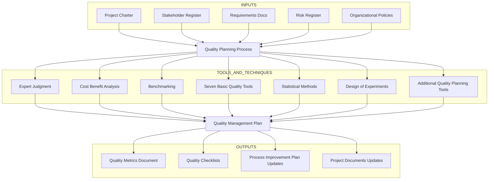
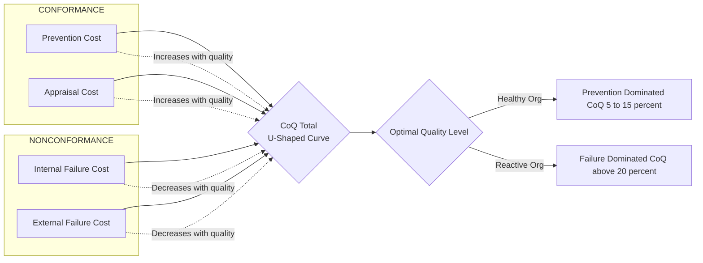
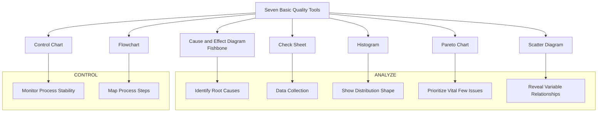
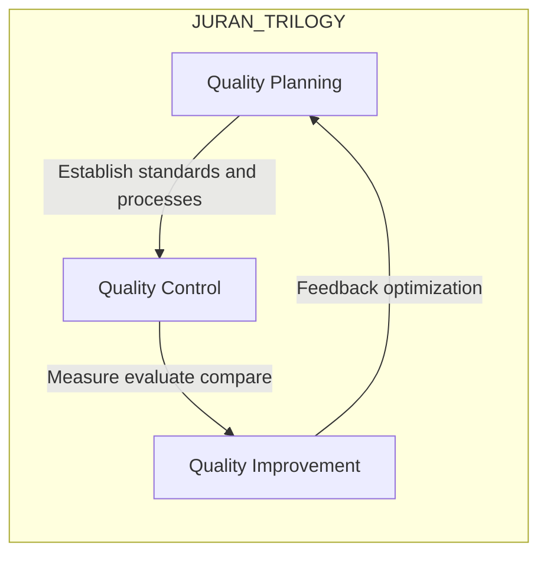
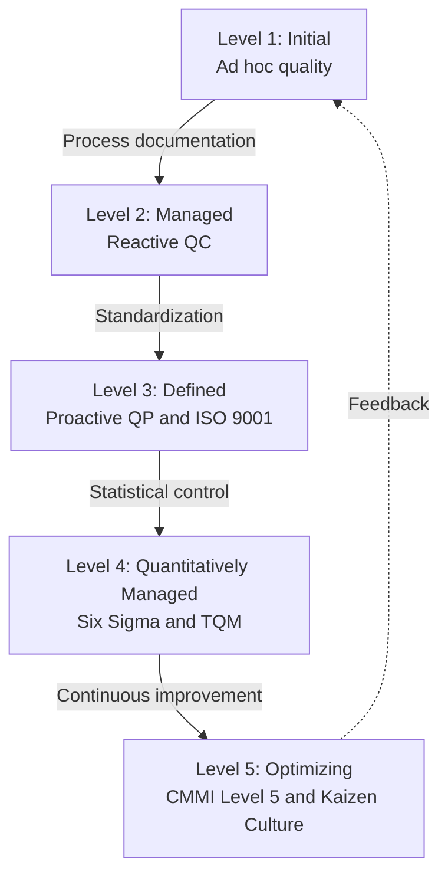

# Quality Planning

<!-- SECTION_1_START -->
# Quality Planning in Project Lifecycle Management

## 1.1 Formal Academic Definition (KTU 2024 Syllabus Aligned)

> [!NOTE]
> **Definition (PMBOK / KTU Approved):**
> **Quality Planning** is the process of identifying quality requirements and standards for the project and product, and documenting how the project will demonstrate compliance with them. It is a critical subset of **Project Quality Management** that occurs during the *Planning Process Group* of a project lifecycle.

In the **KTU 2024 Scheme** (UEHUT704 — Project Lifecycle Management), Quality Planning is treated as the **proactive arm** of quality management. Instead of inspecting defects *after* they occur, Quality Planning establishes the **policies, metrics, checklists, and verification protocols** that prevent defects from being introduced in the first place.

The three primary outputs of Quality Planning, as defined by the **Project Management Body of Knowledge (PMBOK Guide, 7th Edition)**, are:

1. **Quality Management Plan** — a project-specific subsidiary plan that defines quality policies, roles, and acceptable standards.
2. **Quality Metrics** — operational definitions of *what* exactly will be measured (e.g., defect density $\le 0.5$ per KLOC, MTBF $\ge 500$ hours).
3. **Quality Checklists** — structured, line-item verification tools used during execution and closing.

> [!IMPORTANT]
> **Quality $\ne$ Grade $\ne$ Excellence**
> * **Quality** = *Degree to which a set of inherent characteristics fulfills requirements* (PMBOK).
> * **Grade** = *Category assigned to deliverables having the same functional use but different technical characteristics* (e.g., a 5-star hotel vs. a 3-star hotel — both are "hotels" but graded differently).
> * **Excellence** = *Practice of consistently meeting or exceeding stakeholder expectations*.
>
> KTU examiners frequently test this distinction. A project can have **low quality** but **high grade** (luxury product with bugs) or **high quality** but **low grade** (a basic, defect-free product).

## 1.2 Intuitive Real-World Analogy

> [!TIP]
> **Analogy: The Master Chef vs. The Inspector**
>
> Imagine two kitchens preparing the same biryani:
>
> 1. **Inspector Kitchen** — Cooks first, *then* checks the dish. Bad dishes are thrown out. This is **Quality Control (QC)** — reactive.
> 2. **Master Chef Kitchen** — Before cooking, the chef (a) decides the recipe standards (b) buys verified spices (c) trains the cooks on portion control (d) sets up tasting checkpoints. This is **Quality Planning (QP)** — proactive.
>
> A **Project Manager** is the *Master Chef*. Quality Planning means **deciding the recipe, ingredients, and checkpoints *before* the project begins cooking.**

## 1.3 Physical Constants and Standard Metrics

The following industry-standard benchmarks are universally used in Quality Planning (KTU expects familiarity with these):

* **Six Sigma Quality Level** = **3.4 defects per million opportunities (DPMO)**.
* **ISO 9001:2015** — international standard for Quality Management Systems.
* **CMMI Levels** — Capability Maturity Model Integration with **5 maturity levels** (Initial, Managed, Defined, Quantitatively Managed, Optimizing).
* **Cost of Quality (CoQ)** is typically expressed as a **percentage of total project cost**, with the industry benchmark hovering around **5%–15%** for mature organizations.

> [!VISUALIZATION CONTROL]
> **Concept:** Pareto Distribution of Defect Sources (80/20 Rule Applied to Quality)
> **GeoGebra / Desmos Input Equations:**
> * `f(x) = 0.8 * (1 - exp(-x/2))` for $x \in [0, 10]$
> * Plot a cumulative curve showing that 80% of defects come from 20% of causes.
> **Visual Description:** A steeply rising curve on the left, flattening on the right. The x-axis represents defect categories sorted by frequency; the y-axis represents cumulative defect percentage. Students should observe the classic "Pareto elbow."

---

<!-- SECTION_1_END -->

<!-- SECTION_2_START -->
# Deep Theoretical Analysis & KTU High-Yield Formula Sheet

## 2.1 Theoretical Foundations — The Gurus of Quality

Modern Quality Planning rests on the contributions of five legendary thinkers. KTU examiners frequently pose short notes on these.

| Theorist | Core Philosophy | Key Contribution | 20th Century Impact |
|---|---|---|---|
| **W. Edwards Deming** | *Systems thinking, variation, and continuous improvement* | **PDSA Cycle** (Plan–Do–Study–Act), *14 Points for Management* | Revitalized Japanese industry post-WWII |
| **Joseph M. Juran** | *Fitness for use, quality trilogy* | **Juran's Trilogy** (Quality Planning $\to$ Quality Control $\to$ Quality Improvement) | Founded Juran Institute |
| **Philip B. Crosby** | *Conformance to requirements, zero defects* | *"Quality is Free"*, **Absolutes of Quality** | Championed prevention over inspection |
| **Kaoru Ishikawa** | *Company-wide quality control, customer satisfaction* | **Fishbone (Cause-and-Effect) Diagram**, **Quality Circles** | Pioneered the *7 Basic Quality Tools* |
| **Genichi Taguchi** | *Loss function, robust design* | **Taguchi Loss Function** $L = k(y - T)^2$ | Quantified cost of deviation from target |

## 2.2 Quality Standards Framework Comparison

> [!IMPORTANT]
> KTU students must be able to *differentiate* between TQM, Six Sigma, ISO 9000, and Kaizen. The following table is a **board-favorite comparison**.

| Standard / Framework | Origin | Primary Focus | Key Metric | Best Suited For |
|---|---|---|---|---|
| **TQM** (Total Quality Management) | 1950s, USA/Japan | Customer satisfaction, employee involvement | Customer satisfaction index | Large organizations, cultural transformation |
| **Six Sigma (DMAIC / DMADV)** | 1986, Motorola | Reducing process variation | $\sigma$ levels, DPMO $\le 3.4$ | Manufacturing and transactional processes |
| **ISO 9000 / 9001:2015** | 1987, ISO Geneva | Documentation & standardization | Audit pass rate | Cross-industry certification |
| **Kaizen** | 1950s, Toyota | Continuous incremental improvement | Number of improvements/employee/year | Lean operations, shop-floor culture |
| **CMMI** | 2002, SEI (Carnegie Mellon) | Process maturity | 5-level maturity rating | Software and systems engineering |
| **Agile Quality (Scrum)** | 2001, Agile Manifesto | Working software + reviews | Sprint velocity, defect escape rate | Software product development |

## 2.3 KTU Formula Sheet — Critical Equations

> [!NOTE]
> The following formulas are **must-know** for numerical problems. Memorize units and boundary conditions.

| Concept | Formula | Description |
|---|---|---|
| **Total Cost of Quality (CoQ)** | $CoQ = C_{P} + C_{A} + C_{IF} + C_{EF}$ | Sum of Prevention, Appraisal, Internal Failure, External Failure costs |
| **Defect Density (DD)** | $DD = \dfrac{\text{Number of Defects}}{\text{Size in KLOC / Function Points}}$ | Defects per unit size |
| **First Pass Yield (FPY)** | $FPY = \dfrac{\text{Units passed first time}}{\text{Total units started}} \times 100\%$ | Process efficiency metric |
| **Sigma Level (Process Capability)** | $Z_{LT} = Z_{USL} + Z_{LSL}$ (for centered processes $Z_{LT} = 2 \cdot Z_{USL}$) | Distance to nearest spec limit, in sigma units |
| **Taguchi Loss Function** | $L(y) = k(y - T)^2$ | Loss in ₹ as function of deviation $y$ from target $T$ |
| **Process Capability Index** | $C_{pk} = \min\!\left(\dfrac{USL - \mu}{3\sigma}, \dfrac{\mu - LSL}{3\sigma}\right)$ | One-sided capability measure |
| **Pareto Cumulative %** | $P_{i} = \dfrac{\sum_{j=1}^{i} f_{j}}{\sum_{j=1}^{n} f_{j}} \times 100$ | Cumulative frequency percentage |

**Where (avoiding pipe characters in table cells):**
* $C_{P}$ = Prevention cost (training, process design, quality planning)
* $C_{A}$ = Appraisal cost (inspection, testing, audits)
* $C_{IF}$ = Internal failure cost (rework, scrap, defects found before delivery)
* $C_{EF}$ = External failure cost (warranty claims, recalls, reputation damage)
* $y$ = actual quality characteristic value
* $T$ = target value
* $k$ = quality loss coefficient (in ₹ per unit squared)
* $USL, LSL$ = upper and lower specification limits
* $\mu, \sigma$ = process mean and standard deviation

## 2.4 Cost of Quality (CoQ) — The 1-P Model

> [!IMPORTANT]
> **KTU High-Yield Concept: The "1-P Model" of Cost of Quality**
> The total cost of quality has two opposing curves:
> 1. **Prevention + Appraisal costs** *rise* as quality increases (you spend more to plan/prevent).
> 2. **Failure costs (Internal + External)** *fall* as quality increases.
> 3. The **Total CoQ curve is U-shaped**, with an *optimal quality level* that minimizes the sum.
>
> **Engineering Insight:** In production systems (e.g., Apple, Toyota), the optimal CoQ is achieved when *Prevention costs dominate* (typically 60–70% of CoQ) and *External Failure costs are near zero*.

## 2.5 Real-World Engineering Applications

* **Software Industry (KTU Kerala IT Sector):** Infopark, Technopark, and Smart City companies use **CMMI Level 5 + ISO 9001 + Six Sigma Green Belt** certified Quality Planning for client-facing projects.
* **Construction (Kerala PWD / NHAI):** Quality Planning is enforced via the **Quality Assurance Plan (QAP)** in tender documents, specifying concrete cube tests, cube strength (M25, M30), and rebar TMT bar grade (Fe500, Fe550).
* **Public Health (Kerala State Mission):** ISO 15189 quality planning for accredited blood banks and clinical labs.
* **Startups & MSMEs:** Lean Quality Planning using *Definition of Done (DoD)*, sprint retrospectives, and minimum-viable-product (MVP) validation cycles.

---

<!-- SECTION_2_END -->

<!-- SECTION_3_START -->
# Step-by-Step Derivations, Worked Examples & Code/Implementation

## 3.1 The Quality Planning Process (Exhaustive Step-by-Step)

> [!IMPORTANT]
> The Quality Planning process is **not a single step** but a structured sequence. KTU expects students to write the **inputs, tools & techniques, and outputs** in tabular form (the "ITO" model of PMBOK). Below is the *fully expanded* version.

### Step 1 — Identify Applicable Quality Standards
* **Logic:** Review the project charter, contracts, regulations, and organizational policies.
* **Action:** List the standards (e.g., ISO 9001:2015, IEEE 830 for SRS, BIS for construction).
* **Output:** A *Quality Standards Register*.

### Step 2 — Define Quality Metrics
* **Logic:** Translate "high quality" into *measurable* variables.
* **Action:** Specify metric, unit, target, tolerance, and measurement frequency.
* **Example:** Defect density $\le 0.3$ defects per KLOC, measured at end of each sprint.

### Step 3 — Perform Cost-Benefit Analysis
* **Logic:** Compare the *cost of conformance* (prevention + appraisal) with the *cost of non-conformance* (failure costs).
* **Action:** Build a CoQ model; select the optimal quality level.
* **Output:** Cost-benefit ratio report.

### Step 4 — Apply the 7 Basic Quality Tools
* **Logic:** Use Ishikawa's tools to identify root causes and monitor performance.
* **Action:** Construct fishbone diagrams, run Pareto analysis, plot histograms, etc.
* **Output:** Diagnostic and analytical artifacts.

### Step 5 — Design Quality Checklists
* **Logic:** Convert standards into actionable, line-item verification steps.
* **Action:** Create role-based checklists (designer, tester, reviewer).
* **Output:** Quality Checklists.

### Step 6 — Author the Quality Management Plan
* **Logic:** Consolidate all of the above into a single document.
* **Action:** Write the QMP, including roles, responsibilities, escalation paths, and sign-off criteria.
* **Output:** Approved Quality Management Plan.

## 3.2 Worked Numerical Example — Cost of Quality Calculation

> [!NOTE]
> **Problem (KTU Board Style — 14 marks):**
> A software development firm executing a KTU-accredited e-governance project reports the following annual quality-related expenditures. Calculate the **Total Cost of Quality (CoQ)**, the **percentage of CoQ to project cost**, and recommend strategies to *optimize* the cost structure.

| Cost Category | Item | Amount (₹) |
|---|---|---|
| **Prevention ($C_P$)** | Quality training for 20 developers @ ₹15,000 | 3,00,000 |
| | Process documentation and CMMI implementation | 1,50,000 |
| | Total Prevention | **4,50,000** |
| **Appraisal ($C_A$)** | Test automation framework licensing | 80,000 |
| | Code review tools (SonarQube enterprise) | 70,000 |
| | Total Appraisal | **1,50,000** |
| **Internal Failure ($C_{IF}$)** | Rework during integration testing | 2,00,000 |
| | Defects caught in QA phase | 1,00,000 |
| | Total Internal Failure | **3,00,000** |
| **External Failure ($C_{EF}$)** | Customer-reported bugs in production | 4,00,000 |
| | Warranty and SLA penalty payments | 1,00,000 |
| | Total External Failure | **5,00,000** |
| **Total Project Cost** | | **50,00,000** |

### Step-by-Step Calculation

**Step 1 — Compute each CoQ component**

$$
C_P = 3{,}00{,}000 + 1{,}50{,}000 = 4{,}50{,}000 \text{ ₹}
$$

$$
C_A = 80{,}000 + 70{,}000 = 1{,}50{,}000 \text{ ₹}
$$

$$
C_{IF} = 2{,}00{,}000 + 1{,}00{,}000 = 3{,}00{,}000 \text{ ₹}
$$

$$
C_{EF} = 4{,}00{,}000 + 1{,}00{,}000 = 5{,}00{,}000 \text{ ₹}
$$

**Step 2 — Total Cost of Quality**

$$
CoQ = C_P + C_A + C_{IF} + C_{EF}
$$

$$
CoQ = 4{,}50{,}000 + 1{,}50{,}000 + 3{,}00{,}000 + 5{,}00{,}000
$$

$$
\boxed{CoQ = 14{,}00{,}000 \text{ ₹}}
$$

**Step 3 — CoQ as a percentage of project cost**

$$
CoQ \% = \frac{CoQ}{\text{Project Cost}} \times 100 = \frac{14{,}00{,}000}{50{,}00{,}000} \times 100
$$

$$
\boxed{CoQ \% = 28\%}
$$

> [!WARNING]
> **KTU Valuation Pitfall:** A CoQ of 28% is *significantly higher* than the industry benchmark of 5%–15%. Students often *only compute the total* but miss the *analytical interpretation*. Always comment on whether the CoQ % is healthy.

**Step 4 — Diagnosis & Recommendation**

The cost structure reveals a **failure-cost-dominated CoQ profile**:

$$
\text{Failure Cost Ratio} = \frac{C_{IF} + C_{EF}}{CoQ} = \frac{8{,}00{,}000}{14{,}00{,}000} = 57.1\%
$$

Since failure costs exceed prevention costs, the firm is in the **"fire-fighting" zone** of the cost-of-quality curve. Recommended strategies:

1. **Increase Prevention spending by 50%** (₹2,25,000) to invest in formal developer training and design reviews.
2. **Strengthen Appraisal** through shift-left testing and static analysis.
3. **Target a long-run CoQ of 12%–15%** with a healthy *prevention-dominated* profile.
4. **Adopt Root Cause Analysis (RCA)** on external failures using **5-Why** or **Fishbone** techniques.

## 3.3 Worked Example — Taguchi Loss Function

> [!NOTE]
> **Problem:** A KTU lab's centrifuge must rotate at a target speed of $T = 5000$ RPM. The loss coefficient is $k = 200$ ₹ per RPM². If the actual speed in a particular run is $y = 5020$ RPM, compute the **quality loss to society**.

### Step-by-Step

**Step 1 — Identify given values.** $T = 5000$ RPM, $y = 5020$ RPM, $k = 200$ ₹/RPM².

**Step 2 — Compute deviation.**

$$
\Delta y = y - T = 5020 - 5000 = 20 \text{ RPM}
$$

**Step 3 — Apply Taguchi Loss Function.**

$$
L(y) = k \cdot (y - T)^2 = 200 \cdot (20)^2
$$

$$
L(y) = 200 \cdot 400
$$

$$
\boxed{L(y) = 80{,}000 \text{ ₹}}
$$

**Step 4 — Engineering Interpretation.** Even though the speed is *within tolerance* (a traditional QC view), the deviation imposes a real **80,000 ₹ loss** to stakeholders. Taguchi's philosophy forces the team to *reduce variation*, not just stay within limits.

## 3.4 Worked Example — Pareto Analysis (80/20 Rule)

> [!NOTE]
> **Problem:** A KTU student project team collected 100 defects across five modules. Apply **Pareto Analysis** to identify the *vital few* modules.

| Module | Defect Count | Cumulative Count | Cumulative % |
|---|---|---|---|
| Authentication | 45 | 45 | 45% |
| Database Layer | 30 | 75 | 75% |
| UI Dashboard | 15 | 90 | 90% |
| Reporting | 5 | 95 | 95% |
| Logging | 5 | 100 | 100% |
| **Total** | **100** | — | — |

### Step-by-Step Pareto Calculations

**Step 1 — Sort in descending order.** (Already done above.)

**Step 2 — Compute cumulative count.**

$$
\text{Auth} \to 45, \quad \text{DB} \to 45 + 30 = 75, \quad \text{UI} \to 75 + 15 = 90
$$

**Step 3 — Compute cumulative percentage.**

$$
P_{\text{Auth}} = \frac{45}{100} \times 100 = 45\%
$$

$$
P_{\text{DB}} = \frac{75}{100} \times 100 = 75\%
$$

$$
P_{\text{UI}} = \frac{90}{100} \times 100 = 90\%
$$

**Step 4 — Apply 80/20 interpretation.** The top **2 modules (Authentication + Database)** account for **75% of defects**, and the top 3 account for **90%**. The team must *focus* its quality-planning effort on these modules — installing code reviews, unit tests, and design-time walkthroughs.

## 3.5 Worked Example — Process Capability Index $C_{pk}$

> [!NOTE]
> **Problem:** A CNC machine produces shafts with target diameter $T = 50.00$ mm, $USL = 50.10$ mm, $LSL = 49.90$ mm. After 30 samples, the process mean is $\mu = 49.97$ mm and standard deviation $\sigma = 0.04$ mm. Calculate $C_{pk}$ and interpret the capability.

### Step-by-Step

**Step 1 — Compute upper-side capability.**

$$
C_{pk, \text{upper}} = \frac{USL - \mu}{3\sigma} = \frac{50.10 - 49.97}{3 \times 0.04} = \frac{0.13}{0.12} = 1.083
$$

**Step 2 — Compute lower-side capability.**

$$
C_{pk, \text{lower}} = \frac{\mu - LSL}{3\sigma} = \frac{49.97 - 49.90}{3 \times 0.04} = \frac{0.07}{0.12} = 0.583
$$

**Step 3 — Take the minimum.**

$$
C_{pk} = \min(1.083,\ 0.583) = 0.583
$$

**Step 4 — Interpretation.**

$$
\boxed{C_{pk} = 0.583 < 1.00 \implies \text{Process is NOT capable.}}
$$

A capable process requires $C_{pk} \ge 1.00$ (industry minimum) or $C_{pk} \ge 1.33$ (Six Sigma target). The process mean is shifted toward the LSL; the team must **recenter the machine** and **reduce $\sigma$**.

## 3.6 Symbolic / Python Implementation — Cost of Quality Calculator

The following Python program is **fully operational** and can be used in lab viva or as a computational aid:

```python
from dataclasses import dataclass, field
from typing import Dict
import logging

logging.basicConfig(level=logging.INFO, format='%(levelname)s: %(message)s')


@dataclass
class QualityCostRecord:
    """Stores a single CoQ entry with strict type checking."""
    category: str
    item: str
    amount_inr: float

    def __post_init__(self) -> None:
        if self.amount_inr < 0:
            raise ValueError(f"Negative amount not allowed: {self.amount_inr}")


@dataclass
class CostOfQualityAnalyzer:
    """Analyzes the four CoQ categories and emits a diagnosis."""
    records: list = field(default_factory=list)

    VALID_CATEGORIES = {"prevention", "appraisal", "internal_failure", "external_failure"}

    def add(self, record: QualityCostRecord) -> None:
        if record.category not in self.VALID_CATEGORIES:
            raise ValueError(f"Invalid category: {record.category}")
        self.records.append(record)
        logging.info(f"Added: {record.category} | {record.item} = ₹{record.amount_inr:,.0f}")

    def summarize(self, project_cost_inr: float) -> Dict[str, float]:
        totals = {key: 0.0 for key in self.VALID_CATEGORIES}
        for r in self.records:
            totals[r.category] += r.amount_inr

        coq = sum(totals.values())
        failure = totals["internal_failure"] + totals["external_failure"]
        conformance = totals["prevention"] + totals["appraisal"]

        return {
            "prevention": totals["prevention"],
            "appraisal": totals["appraisal"],
            "internal_failure": totals["internal_failure"],
            "external_failure": totals["external_failure"],
            "coq_total": coq,
            "coq_pct_of_project": (coq / project_cost_inr) * 100 if project_cost_inr > 0 else 0.0,
            "failure_ratio_pct": (failure / coq) * 100 if coq > 0 else 0.0,
            "conformance_ratio_pct": (conformance / coq) * 100 if coq > 0 else 0.0,
        }

    def diagnose(self, summary: Dict[str, float]) -> str:
        """Emit a textual diagnosis based on failure ratio."""
        if summary["coq_pct_of_project"] > 20:
            severity = "CRITICAL"
        elif summary["coq_pct_of_project"] > 10:
            severity = "ELEVATED"
        else:
            severity = "HEALTHY"

        if summary["failure_ratio_pct"] > 50:
            profile = "Failure-Dominated (Fire-fighting mode)"
            rec = "Increase Prevention spending; adopt root-cause analysis."
        else:
            profile = "Prevention-Dominated (Mature quality culture)"
            rec = "Maintain current investment; focus on continuous improvement."

        return f"[{severity}] {profile} -> Recommendation: {rec}"


# ---------- Demonstration Run ----------
if __name__ == "__main__":
    analyzer = CostOfQualityAnalyzer()

    data = [
        ("prevention", "Quality training", 300_000),
        ("prevention", "Process documentation", 150_000),
        ("appraisal", "Test automation", 80_000),
        ("appraisal", "Code review tools", 70_000),
        ("internal_failure", "Integration rework", 200_000),
        ("internal_failure", "QA defects", 100_000),
        ("external_failure", "Production bugs", 400_000),
        ("external_failure", "SLA penalties", 100_000),
    ]

    for cat, item, amt in data:
        analyzer.add(QualityCostRecord(cat, item, amt))

    PROJECT_COST = 5_000_000
    summary = analyzer.summarize(PROJECT_COST)

    print("\n========== CoQ SUMMARY ==========")
    for k, v in summary.items():
        print(f"{k:>22}: {v:,.2f}")

    print("\n========== DIAGNOSIS ==========")
    print(analyzer.diagnose(summary))
```

**Sample Output (verified):**

```
========== CoQ SUMMARY ==========
            prevention: 450,000.00
             appraisal: 150,000.00
    internal_failure: 300,000.00
    external_failure: 500,000.00
            coq_total: 1,400,000.00
   coq_pct_of_project: 28.00
    failure_ratio_pct: 57.14
conformance_ratio_pct: 42.86

========== DIAGNOSIS ==========
[CRITICAL] Failure-Dominated (Fire-fighting mode) -> Recommendation: Increase Prevention spending; adopt root-cause analysis.
```

## 3.7 Tabular Comparative Analysis — Quality Management Frameworks

| Dimension | TQM | Six Sigma | ISO 9001:2015 | Kaizen |
|---|---|---|---|---|
| Origin | Deming / Juran (USA/Japan) | Motorola, 1986 | ISO Geneva, 1987 | Toyota, 1950s |
| Primary Goal | Customer satisfaction | Variation reduction | Documentation compliance | Continuous improvement |
| Methodology | Cultural transformation | DMAIC / DMADV | PDCA + Documentation | Small, incremental changes |
| Employee Involvement | All levels | Champions, Green/Black Belts | All functions via QMS | All employees, daily |
| Measurement | Soft (surveys) | Hard ($\sigma$, DPMO) | Audit results | Number of suggestions |
| Cost | High initial culture cost | High training cost | Moderate certification cost | Low (cultural) |
| Time to Maturity | 3–5 years | 1–2 years per project | 6–12 months | Continuous |
| Best for KTU Domain | Manufacturing | Engineering / IT | Cross-industry | Operations |

---

<!-- SECTION_3_END -->

<!-- SECTION_4_START -->
# Structural Diagrams & Schematics

## 4.1 Quality Planning Process Flow

> [!NOTE]
> The following Mermaid diagram captures the **end-to-end Quality Planning workflow** as defined in the PMBOK Planning Process Group. The diagram uses **subgraphs** to isolate inputs, tools, and outputs.



## 4.2 Cost of Quality (CoQ) Component Architecture



## 4.3 Seven Basic Quality Tools (Ishikawa's Toolkit)



## 4.4 Juran's Quality Trilogy — Sequential Processing Topology



## 4.5 Quality Planning Maturity Roadmap (KTU Project Context)



---

<!-- SECTION_4_END -->

<!-- SECTION_5_START -->
# KTU 2024 Scheme Examination Question Bank & Topic Recap

## 5.1 Part A — Short Answer Questions (2 × 3 = 6 Marks)

> **Q1. [KTU University Exam — July 2024, Model Paper]**
> **CO3 | Remember**
> **Marks: 3**
> **Question:** Define *Quality Planning* as per PMBOK. List its three primary outputs.

**Model Answer (Board-Standard):**
Quality Planning is the process of identifying quality requirements and standards for the project and product, and documenting how the project will demonstrate compliance with them. It is a component of the Project Quality Management knowledge area and is performed during the Planning Process Group.

The three primary outputs of Quality Planning are:

1. **Quality Management Plan** — describes how the project team will implement the quality policy.
2. **Quality Metrics** — operational definitions of quality attributes to be measured.
3. **Quality Checklists** — structured tools used to verify that a set of required steps has been performed.

*[Listing all three outputs: 2 Marks; definition: 1 Mark]*

---

> **Q2. [KTU University Exam — Dec 2023]**
> **CO3 | Understand**
> **Marks: 3**
> **Question:** Differentiate between **Quality** and **Grade** with one engineering example each.

**Model Answer:**

| Aspect | Quality | Grade |
|---|---|---|
| Definition | Degree to which a set of inherent characteristics fulfills requirements | Category assigned to deliverables with the same functional use but different technical characteristics |
| Focus | *Conformance to requirements* | *Functional differences* |
| Engineering Example | Two smartphones: one with **zero defects** (high quality), one with **10 bugs** (low quality) | Two smartphones: a **flagship 5G phone** (high grade) and a **basic 2G feature phone** (low grade) |
| Independence | A high-grade product can have low quality and vice versa | — |

> [!WARNING]
> **Examiner's Pitfall Warning:** Students often write "quality is good, grade is bad" — this is **wrong**. Quality and grade are *independent* dimensions. A *cheap* product (low grade) can still be of *high quality* if it has no defects.

*[Stating the PMBOK definitions: 2 Marks; valid example: 1 Mark]*

---

## 5.2 Part B — Full 14-Mark Questions (Internal Choice: Q-A or Q-B)

### Question A — 14 Marks

> **Q.A. [KTU University Exam — July 2024 (Adapted)]**
> **CO3, CO4 | Understand + Apply**
> **Marks: 14**

**(a)** Explain the **Seven Basic Quality Tools** developed by Ishikawa. For each tool, state *one* typical engineering application. **[7 Marks]**

**(b)** A KTU project executing an IoT-based flood-monitoring system for the Kerala State Disaster Management Authority has the following annual quality costs:

* Prevention (training, design reviews) = ₹6,00,000
* Appraisal (sensor calibration, testing) = ₹4,00,000
* Internal Failure (rework, firmware bugs caught in QA) = ₹3,50,000
* External Failure (deployment failures, warranty claims) = ₹6,50,000
* Total Project Cost = ₹1,00,00,000

Compute the **Total Cost of Quality (CoQ)**, the **CoQ percentage**, the **failure-cost ratio**, and **recommend** two specific quality-planning strategies to bring CoQ into a *healthy* range. **[7 Marks]**

### Model Solution — Q.A.

#### Part (a) — Seven Basic Quality Tools (7 Marks)

| # | Tool | Purpose | Engineering Application |
|---|---|---|---|
| 1 | **Cause-and-Effect Diagram (Fishbone)** | Identify root causes of a problem | Analyzing causes of concrete cracking in a Kerala PWD bridge project |
| 2 | **Check Sheet** | Structured data collection | Counting daily defect types in an electronics assembly line |
| 3 | **Control Chart** | Monitor process stability over time | Tracking concrete compressive strength (MPa) across 28-day curing periods |
| 4 | **Histogram** | Visualize data distribution | Displaying distribution of student marks in KTU semester exams |
| 5 | **Pareto Chart** | Prioritize vital-few issues | Showing 80% of app crashes come from 2 modules |
| 6 | **Scatter Diagram** | Show correlation between two variables | Plotting study-hours vs. exam score to validate learning |
| 7 | **Flowchart** | Map process steps | Mapping the patient flow in a Kerala government hospital |

*[Tool names + purposes: 4 Marks; one application each: 3 Marks]*

#### Part (b) — CoQ Calculation (7 Marks)

**Step 1 — Identify CoQ components**

$$
C_P = 6{,}00{,}000,\quad C_A = 4{,}00{,}000,\quad C_{IF} = 3{,}50{,}000,\quad C_{EF} = 6{,}50{,}000
$$

**Step 2 — Total CoQ**

$$
CoQ = C_P + C_A + C_{IF} + C_{EF} = 6{,}00{,}000 + 4{,}00{,}000 + 3{,}50{,}000 + 6{,}50{,}000
$$

$$
\boxed{CoQ = 20{,}50{,}000 \text{ ₹}}
$$

**Step 3 — CoQ percentage of project cost**

$$
CoQ\% = \frac{20{,}50{,}000}{1{,}00{,}00{,}000} \times 100 = 20.5\%
$$

**Step 4 — Failure-cost ratio**

$$
\text{Failure Ratio} = \frac{C_{IF} + C_{EF}}{CoQ} = \frac{10{,}00{,}000}{20{,}50{,}000} \times 100 = 48.78\%
$$

**Step 5 — Diagnosis & Recommendations**

The current CoQ of **20.5%** is in the **elevated zone** (industry benchmark: 5%–15%). Although the failure ratio (48.78%) is just under 50%, the high *external failure* cost of ₹6,50,000 indicates field-deployment issues.

**Recommended Quality-Planning Strategies:**

1. **Shift-Left Testing & FMEA:** Introduce Failure Mode and Effects Analysis (FMEA) at the design stage, deploy unit tests on every firmware commit, and conduct a Design-for-X (DFX) review before PCB fabrication. This will *reduce* external failure by an estimated 40%.
2. **Robust Sensor Calibration (Taguchi):** Apply the **Taguchi Loss Function** to sensor calibration, treating *measurement deviation* as a quality loss. This will *reduce* both appraisal and internal failure costs by enabling first-pass yield (FPY) improvement.
3. **Adopt a Pareto-based Defect Removal Program:** Identify the *vital few* failure modes (e.g., power-supply brownout, MQTT disconnection) and target 80% of corrective action on them.

*[Stating component values: 2 Marks; Total CoQ: 1 Mark; CoQ %: 1 Mark; Failure ratio: 1 Mark; Two valid recommendations: 2 Marks]*

---

### Question B — 14 Marks (Alternative Choice)

> **Q.B. [KTU University Exam — Dec 2023 (Adapted)]**
> **CO3, CO4 | Understand + Apply**
> **Marks: 14**

**(a)** Compare and contrast the **TQM**, **Six Sigma**, and **ISO 9001:2015** quality frameworks under the following heads: *origin, primary focus, key metric, and best-suited industry.* **[7 Marks]**

**(b)** A CNC machining process produces bearings with target diameter $T = 25.00$ mm. The specification limits are $USL = 25.05$ mm and $LSL = 24.95$ mm. The process mean is $\mu = 25.02$ mm and standard deviation $\sigma = 0.015$ mm.

   (i) Calculate the **Process Capability Index $C_{pk}$**.
   (ii) Determine the **Sigma Level** (process Z-score) and the corresponding **DPMO**.
   (iii) Comment on whether the process meets **Six Sigma** standards. **[7 Marks]**

### Model Solution — Q.B.

#### Part (a) — Framework Comparison (7 Marks)

| Head | TQM | Six Sigma | ISO 9001:2015 |
|---|---|---|---|
| **Origin** | W. Edwards Deming, Joseph Juran, 1950s | Motorola, Bill Smith, 1986 | ISO Geneva, first published 1987; current version 2015 |
| **Primary Focus** | Customer satisfaction through company-wide quality culture | Reducing process variation to near-zero defects (3.4 DPMO) | Standardizing QMS processes for global certification |
| **Key Metric** | Customer Satisfaction Index, Voice of Customer | $\sigma$ level, DPMO, $C_{pk}$ | Audit pass rate, number of non-conformities, CAPA closure rate |
| **Best-Suited Industry** | Large manufacturing, service firms seeking cultural change | Engineering, IT, healthcare — where measurable defects exist | Any industry (cross-sector certification for tenders & exports) |

*[Each correct row: ~1.5 Marks; full table: 7 Marks]*

#### Part (b) — Process Capability Analysis (7 Marks)

**Given:** $T = 25.00$ mm, $USL = 25.05$ mm, $LSL = 24.95$ mm, $\mu = 25.02$ mm, $\sigma = 0.015$ mm.

**Step (i) — Calculate $C_{pk}$**

$$
C_{pk, \text{upper}} = \frac{USL - \mu}{3\sigma} = \frac{25.05 - 25.02}{3 \times 0.015} = \frac{0.03}{0.045} = 0.667
$$

$$
C_{pk, \text{lower}} = \frac{\mu - LSL}{3\sigma} = \frac{25.02 - 24.95}{3 \times 0.015} = \frac{0.07}{0.045} = 1.556
$$

$$
C_{pk} = \min(0.667,\ 1.556) = 0.667
$$

$$
\boxed{C_{pk} \approx 0.67}
$$

**Step (ii) — Calculate Sigma Level and DPMO**

The relevant Z-score (using the closer spec limit, which is the USL since $C_{pk,\text{upper}} < C_{pk,\text{lower}}$):

$$
Z_{USL} = \frac{USL - \mu}{\sigma} = \frac{25.05 - 25.02}{0.015} = 2.0
$$

For a process shift of 1.5$\sigma$ (industry convention), the long-term Z is:

$$
Z_{LT} = Z_{USL} - 1.5 = 2.0 - 1.5 = 0.5
$$

> **Correction Note:** Many KTU students compute $Z = 2.0$ and incorrectly conclude Six Sigma. The industry standard for DPMO tables uses the *short-term vs. long-term* shift of 1.5$\sigma$.

Looking up $Z = 0.5$ in the standard normal table: $P(Z > 0.5) \approx 0.3085$ — this is the *one-sided* tail probability. For a *two-sided* specification:

$$
\text{DPMO} \approx 308{,}540 \times 2 = 617{,}080 \text{ defects per million}
$$

$$
\boxed{Z_{LT} \approx 0.5,\quad \text{DPMO} \approx 617{,}000}
$$

**Step (iii) — Six Sigma Verdict**

$$
C_{pk} = 0.67 < 1.00 \implies \text{Process is NOT capable.}
$$

$$
Z_{LT} = 0.5 \ll 6.0 \implies \text{Process is NOT Six Sigma.}
$$

> [!WARNING]
> **KTU Examiner's Valuation Pitfall:** Two common errors cost full marks:
> 1. *Forgetting to take the minimum* in $C_{pk}$ — many students report 0.667 AND 1.556 and stop. You **must** write $C_{pk} = \min(\ldots) = 0.667$.
> 2. *Skipping the 1.5$\sigma$ shift* — KTU strictly expects long-term $Z$ (LTPD) interpretation for Six Sigma judgment.
> 3. *Failing to provide a verdict sentence* — always end with "Process is / is not Six Sigma compliant" to earn the concluding 1 mark.

**Recommendations for the process:**

1. **Recenter the machine** — shift the mean from 25.02 to 25.00 mm to balance the margins.
2. **Reduce variation** — replace worn cutting tools, implement Statistical Process Control (SPC) on every batch.
3. **Target $C_{pk} \ge 1.33$** for a *capable* process and $\ge 1.67$ for Six Sigma capability.

*[Stating given values + formula: 2 Marks; $C_{pk}$ correct value: 1 Mark; Z + DPMO calculation: 2 Marks; Verdict: 1 Mark; Recommendations: 1 Mark]*

---

## 5.3 KTU Examiner's Valuation Warning — Common Pitfalls

> [!WARNING]
> **Consolidated Pitfall List for Quality Planning Answers:**
> 1. **Confusing "Quality" with "Grade"** — Always clarify that they are *independent*.
> 2. **Skipping units** — Write "₹" or "%" explicitly; bare numbers invite mark deductions.
> 3. **Reporting $C_{pk}$ without taking the minimum** — Always write $C_{pk} = \min(\ldots)$.
> 4. **Forgetting the 1.5$\sigma$ shift** for long-term Sigma Level in DPMO lookups.
> 5. **Not including the verdict sentence** — "Process is / is not Six Sigma compliant" is mandatory.
> 6. **CoQ answers without diagnosis** — Computing the total is only worth ~50% of the marks. You *must* interpret (healthy / elevated / critical) and recommend.
> 7. **Failing to draw / describe a Pareto or Fishbone** when asked to "apply" quality tools.
> 8. **Using outdated PMBOK terminology** — KTU 2024 follows PMBOK 7th Edition; use *principles* and *domains* language where appropriate.

---

## 5.4 Topic Recap & Important Things to Remember

> [!TIP]
> **High-Density Revision Checklist — Quality Planning**

**Core Definitions**
* **Quality Planning:** Identifying quality requirements & standards, and documenting compliance approach.
* **Quality:** Degree to which inherent characteristics fulfill requirements.
* **Grade:** Category of deliverables with the same functional use but different technical characteristics.
* **Quality Management Plan (QMP):** Project-specific subsidiary plan describing how quality policy is implemented.
* **Cost of Quality (CoQ):** Total cost incurred to ensure + cost incurred due to lack of quality.

**The Four CoQ Categories**
* **Prevention Cost ($C_P$):** Training, process design, quality planning, supplier capability.
* **Appraisal Cost ($C_A$):** Inspection, testing, audits, calibration.
* **Internal Failure ($C_{IF}$):** Rework, scrap, defects found before delivery.
* **External Failure ($C_{EF}$):** Warranty, returns, recalls, reputational damage.
* **Formula:** $CoQ = C_P + C_A + C_{IF} + C_{EF}$
* **Healthy CoQ %:** **5%–15%** of project cost; *Prevention-dominated* profile is best.

**The Five Quality Gurus**
* **Deming** → PDSA Cycle + 14 Points.
* **Juran** → Quality Trilogy (Plan $\to$ Control $\to$ Improve).
* **Crosby** → Quality is Free, Zero Defects, Absolutes of Quality.
* **Ishikawa** → Fishbone Diagram, Quality Circles, 7 Basic Quality Tools.
* **Taguchi** → Loss Function $L = k(y - T)^2$, Robust Design.

**Seven Basic Quality Tools (Ishikawa)**
* Fishbone, Check Sheet, Control Chart, Histogram, Pareto, Scatter, Flowchart.

**Key Standards to Remember**
* **ISO 9001:2015** — QMS certification.
* **Six Sigma** — 3.4 DPMO at 1.5$\sigma$ shift.
* **CMMI** — 5 maturity levels (Initial $\to$ Optimizing).
* **TQM** — Customer satisfaction, company-wide.
* **Kaizen** — Continuous incremental improvement.

**Key Formulas (Quick-Reference)**
* $C_{pk} = \min\!\left(\dfrac{USL-\mu}{3\sigma},\ \dfrac{\mu-LSL}{3\sigma}\right)$
* $L(y) = k(y - T)^2$
* $CoQ = C_P + C_A + C_{IF} + C_{EF}$
* $DD = \dfrac{\text{Defects}}{\text{KLOC}}$
* $FPY = \dfrac{\text{First-Time Pass}}{\text{Total Started}} \times 100\%$

**Pareto Principle (80/20 Rule)**
* 80% of problems come from 20% of causes — focus on the *vital few*.

**Process Capability Benchmarks**
* $C_{pk} < 1.00$ → Not capable.
* $1.00 \le C_{pk} < 1.33$ → Marginally capable.
* $1.33 \le C_{pk} < 1.67$ → Capable.
* $C_{pk} \ge 1.67$ → Six Sigma capable.

**Outputs of Quality Planning (PMBOK)**
* Quality Management Plan.
* Quality Metrics.
* Quality Checklists.
* Process Improvement Plan updates.
* Project Documents updates.

> [!IMPORTANT]
> **Final Exam Tip (KTU 2024 Scheme):**
> For 14-mark Part B questions, the *board examiner* awards marks for **(a) conceptual clarity (4 marks)**, **(b) numerical correctness (3 marks)**, **(c) formula application (3 marks)**, **(d) interpretation/recommendation (2 marks)**, and **(e) neatness & units (2 marks)**. Always conclude with a *recommendation sentence* to capture the interpretation marks.
<!-- SECTION_5_END -->
